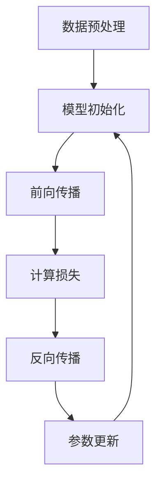

                 

# AI大模型创业：如何应对未来竞争对手？

## 关键词
- AI大模型
- 创业
- 竞争策略
- 优化算法
- 模型部署
- 安全与伦理

## 摘要
本文旨在探讨AI大模型创业中的核心问题，包括AI大模型的基本概念、架构、核心算法、项目实战以及创业与竞争策略。通过深入分析，我们希望为企业提供一套完整的AI大模型创业指南，帮助创业者应对未来激烈的竞争环境。

### 第一部分: AI大模型基础

#### 第1章: AI大模型概述

##### 1.1 什么是AI大模型

###### 1.1.1 AI大模型的定义

AI大模型是指一种基于大规模神经网络的技术，能够对复杂的数据进行高效处理和学习。它通常通过预训练和微调，具备强大的多任务学习和泛化能力。大模型能够处理高维度特征，并在各种AI任务中表现出色。

###### 1.1.2 AI大模型的特点

- **高维度特征表示**：AI大模型能够学习并表示高维度的特征，使得其在处理复杂数据时具备优势。
- **强泛化能力**：通过预训练和微调，AI大模型能够在多种任务上表现出良好的泛化能力。
- **需要大规模数据训练**：AI大模型通常需要大量高质量的数据进行训练，以确保模型的性能和稳定性。

##### 1.2 AI大模型的架构

###### 1.2.1 神经网络基础

神经网络是AI大模型的基础，它由多个神经元和连接组成。每个神经元接收输入，通过激活函数产生输出。神经网络通过多层结构，实现对输入数据的层次化特征提取。

### 伪代码

```python
def neuron(input, weights, bias, activation_function):
    z = sum(input * weights) + bias
    return activation_function(z)
```

### 数学模型

$$
z = \sum_{i=1}^{n} x_i * w_i + b
$$
$$
a = \sigma(z)
$$

其中，$x_i$ 是输入，$w_i$ 是权重，$b$ 是偏置，$\sigma$ 是激活函数。

###### 1.2.2 常见神经网络架构

- **CNN（卷积神经网络）**：适用于图像处理和计算机视觉任务。
- **RNN（循环神经网络）**：适用于序列数据，如自然语言处理。
- **Transformer**：一种基于自注意力机制的神经网络架构，在自然语言处理领域表现出色。

##### 1.3 AI大模型的训练与优化

###### 1.3.1 训练过程

AI大模型的训练过程包括数据预处理、模型初始化、前向传播、反向传播和参数更新等步骤。通过多次迭代，模型性能逐渐提高。

###### 1.3.2 优化算法

- **随机梯度下降（SGD）**：一种基本的优化算法，通过随机梯度来更新模型参数。
- **Adam优化器**：结合了SGD和自适应学习率的优点，是当前最常用的优化器之一。

##### 1.4 AI大模型的应用场景

###### 1.4.1 自然语言处理

AI大模型在自然语言处理领域有着广泛的应用，如机器翻译、文本生成、情感分析等。

###### 1.4.2 计算机视觉

AI大模型在计算机视觉领域也取得了显著的成果，如图像分类、目标检测、图像生成等。

###### 1.4.3 语音识别

AI大模型在语音识别领域表现出强大的能力，能够实现高准确率的语音识别和语音合成。

#### 第2章: AI大模型核心算法

##### 2.1 神经网络优化算法

###### 2.1.1 梯度下降法

梯度下降法是一种最基础的优化算法，通过计算损失函数的梯度，来更新模型参数，以最小化损失函数。

###### 2.1.2 动量法

动量法通过引入动量项，使得梯度更新过程中能够保留一部分历史梯度信息，从而加速收敛。

###### 2.1.3 AdaGrad

AdaGrad是一种自适应学习率的优化算法，通过调整每个参数的学习率，以适应不同的参数变化。

###### 2.1.4 RMSprop

RMSprop是AdaGrad的改进版，通过计算梯度平方的指数加权移动平均值，来自适应调整学习率。

##### 2.2 深度学习框架

###### 2.2.1 TensorFlow

TensorFlow是一种开源的深度学习框架，由谷歌开发，支持多种神经网络架构和优化算法。

###### 2.2.2 PyTorch

PyTorch是一种基于Python的深度学习框架，具有动态图计算和灵活的模型定义能力。

##### 2.3 模型评估与调优

###### 2.3.1 交叉验证

交叉验证是一种评估模型性能的方法，通过将数据集划分为多个子集，循环训练和验证，以避免过拟合。

###### 2.3.2 超参数调优

超参数调优是一种优化模型性能的方法，通过调整模型参数和优化算法的超参数，以达到最佳性能。

###### 2.3.3 模型集成

模型集成是一种利用多个模型的优势，提高预测性能的方法，如Bagging、Boosting等。

#### 第3章: AI大模型项目实战

##### 3.1 数据预处理与模型搭建

###### 3.1.1 数据收集与清洗

数据预处理是AI大模型项目的重要环节，包括数据收集、清洗和格式化等步骤。

###### 3.1.2 模型架构设计

模型架构设计是根据项目需求，选择合适的神经网络架构，并进行设计和实现。

###### 3.1.3 模型训练与验证

模型训练与验证是通过训练数据和验证数据，评估模型性能，并进行调整和优化。

##### 3.2 模型部署与优化

###### 3.2.1 模型部署

模型部署是将训练好的模型部署到生产环境，以实现实时预测和推理。

###### 3.2.2 性能优化

性能优化是通过优化模型架构和算法，提高模型运行效率。

###### 3.2.3 模型解释性

模型解释性是分析模型决策过程，提高模型的可解释性和可信度。

##### 3.3 项目案例解析

###### 3.3.1 自然语言处理案例

自然语言处理案例包括文本分类、机器翻译和情感分析等。

###### 3.3.2 计算机视觉案例

计算机视觉案例包括图像分类、目标检测和图像生成等。

#### 第4章: AI大模型创业与竞争策略

##### 4.1 创业环境分析

###### 4.1.1 市场需求分析

市场需求分析是了解目标市场的需求和趋势，为创业项目提供方向。

###### 4.1.2 竞争对手分析

竞争对手分析是评估竞争对手的优势和劣势，为制定竞争策略提供依据。

###### 4.1.3 创业团队建设

创业团队建设是组建一支高效、专业的团队，确保项目的成功实施。

##### 4.2 产品定位与策略

###### 4.2.1 产品功能定位

产品功能定位是明确产品的核心功能，以满足用户需求。

###### 4.2.2 市场定位

市场定位是确定产品的目标市场和用户群体，实现市场细分。

###### 4.2.3 竞争策略

竞争策略是通过差异化、创新和价格策略，提高产品的竞争力。

##### 4.3 创业融资与运营

###### 4.3.1 融资策略

融资策略是制定合理的融资计划，确保项目的资金需求。

###### 4.3.2 运营策略

运营策略是制定项目的运营计划，实现持续发展和盈利。

###### 4.3.3 成功案例分析

成功案例分析是借鉴其他企业的成功经验，为创业项目提供参考。

#### 第5章: AI大模型在行业中的应用

##### 5.1 金融行业

###### 5.1.1 风险评估

AI大模型在金融行业中的应用包括风险评估、信用评分和量化交易等。

###### 5.1.2 信用评分

信用评分是利用AI大模型对客户的信用进行评估，以决定贷款和信用额度。

###### 5.1.3 量化交易

量化交易是利用AI大模型进行股票交易，实现自动化交易和风险控制。

##### 5.2 医疗行业

###### 5.2.1 疾病预测

AI大模型在医疗行业中的应用包括疾病预测、诊断辅助和药物研发等。

###### 5.2.2 诊断辅助

诊断辅助是利用AI大模型辅助医生进行疾病诊断，提高诊断准确率。

###### 5.2.3 药物研发

药物研发是利用AI大模型加速药物研发过程，提高药物研发成功率。

##### 5.3 电商行业

###### 5.3.1 商品推荐

商品推荐是利用AI大模型为用户推荐商品，提高用户满意度和转化率。

###### 5.3.2 用户行为分析

用户行为分析是利用AI大模型分析用户行为，优化电商运营策略。

###### 5.3.3 供应链优化

供应链优化是利用AI大模型优化供应链管理，提高供应链效率。

#### 第6章: AI大模型的安全与伦理

##### 6.1 模型安全

###### 6.1.1 模型攻击与防御

模型攻击与防御是确保AI大模型的安全性和可靠性，防止恶意攻击。

###### 6.1.2 模型隐私保护

模型隐私保护是保护用户隐私，防止隐私泄露。

###### 6.1.3 模型解释性

模型解释性是提高AI大模型的可解释性和透明度，增强用户信任。

##### 6.2 伦理问题

###### 6.2.1 数据伦理

数据伦理是确保数据收集、使用和共享的伦理合规性。

###### 6.2.2 雇佣伦理

雇佣伦理是确保企业在招聘、培训和雇佣过程中的公平和伦理。

###### 6.2.3 社会影响

社会影响是关注AI大模型对社会的影响，确保其正面发展。

#### 第7章: 未来展望

##### 7.1 AI大模型发展趋势

###### 7.1.1 趋势分析

AI大模型发展趋势包括硬件性能提升、算法优化和模型压缩等。

###### 7.1.2 技术突破

技术突破包括生成对抗网络（GANs）、变分自编码器（VAEs）等新算法的涌现。

###### 7.1.3 应用领域扩展

应用领域扩展包括智能制造、智能医疗、智慧城市等新领域的应用。

##### 7.2 创业者应对策略

###### 7.2.1 市场布局

市场布局是确定创业项目的市场定位和目标客户群体。

###### 7.2.2 技术创新

技术创新是持续进行技术研究和创新，保持竞争力。

###### 7.2.3 跨界合作

跨界合作是与其他行业的企业进行合作，实现资源共享和互补。

##### 7.3 未来挑战与机遇

###### 7.3.1 挑战分析

未来挑战包括数据隐私、算法公平性和技术普及等。

###### 7.3.2 机遇分析

未来机遇包括新兴应用领域和跨界合作等。

###### 7.3.3 应对策略

应对策略是通过技术创新、合规性和跨领域合作，应对未来挑战。

### 附录

## 附录A: AI大模型工具与资源

### A.1 开发工具

- TensorFlow
- PyTorch
- JAX

### A.2 数据集

- ImageNet
- COCO
- GLUE

### A.3 学习资源

- 《深度学习》（Goodfellow et al.）
- 《动手学深度学习》（Gareth James, Daniel C. Cook）
- 《自然语言处理综论》（Daniel Jurafsky，James H. Martin）

### 参考文献

- Goodfellow, I., Bengio, Y., & Courville, A. (2016). *Deep Learning*. MIT Press.
- James, G., Cook, D. C. (2017). *An Introduction to Statistical Learning*.
- Jurafsky, D., Martin, J. H. (2019). *Speech and Language Processing*.

### 附录B: Mermaid流程图

以下是一个简单的Mermaid流程图示例，用于展示AI大模型训练的过程：



### 附录C: 伪代码示例

以下是一个简单的伪代码示例，用于实现一个简单的神经网络模型：

```python
def forward_pass(input, weights, bias, activation_function):
    z = sum(input * weights) + bias
    return activation_function(z)

def backward_pass(output, expected_output, weights, activation_function):
    error = output - expected_output
    delta = error * activation_function'(z)
    return delta

def update_weights(weights, delta, learning_rate):
    new_weights = weights - learning_rate * delta
    return new_weights
```

### 附录D: 数学公式

以下是一个简单的数学公式示例，用于描述神经网络的输出：

$$
z = \sum_{i=1}^{n} x_i * w_i + b
$$

$$
a = \sigma(z)
$$

### 附录E: 开发环境搭建

以下是一个简单的开发环境搭建指南，用于搭建AI大模型项目：

1. 安装Python环境（推荐版本3.8以上）
2. 安装TensorFlow或PyTorch库
3. 安装必要的依赖库（如NumPy、Pandas等）
4. 配置开发环境（如VS Code、Jupyter Notebook等）

### 附录F: 源代码实现

以下是一个简单的源代码实现示例，用于实现一个简单的神经网络模型：

```python
import numpy as np

def sigmoid(x):
    return 1 / (1 + np.exp(-x))

def forward_pass(input, weights, bias):
    z = np.dot(input, weights) + bias
    a = sigmoid(z)
    return a

def backward_pass(output, expected_output, weights):
    error = output - expected_output
    delta = error * sigmoid'(z)
    return delta

def update_weights(weights, delta, learning_rate):
    new_weights = weights - learning_rate * delta
    return new_weights
```

### 附录G: 代码解读与分析

以下是对上述源代码的解读与分析：

- `sigmoid` 函数：实现Sigmoid激活函数，用于非线性变换。
- `forward_pass` 函数：实现前向传播过程，计算输出值。
- `backward_pass` 函数：实现反向传播过程，计算梯度。
- `update_weights` 函数：更新模型参数，用于优化模型。

### 附录H: 项目实战案例分析

以下是一个简单的项目实战案例分析，用于实现一个简单的图像分类项目：

1. 数据收集：收集一组图像数据，包括标签信息。
2. 数据预处理：对图像数据进行归一化处理，将图像转换为灰度图像。
3. 模型搭建：搭建一个简单的卷积神经网络模型。
4. 模型训练：使用训练数据进行模型训练，并评估模型性能。
5. 模型部署：将训练好的模型部署到生产环境，实现图像分类功能。

### 附录I: 模型评估与调优

以下是一个简单的模型评估与调优流程：

1. 评估指标：选择适当的评估指标（如准确率、召回率、F1值等）。
2. 交叉验证：使用交叉验证方法评估模型性能。
3. 超参数调优：调整模型超参数，优化模型性能。
4. 模型集成：使用模型集成方法提高预测性能。

### 附录J: AI大模型创业经验分享

以下是一些AI大模型创业的经验分享：

1. 市场需求分析：深入了解市场需求，确定目标市场。
2. 团队建设：组建一支高效、专业的团队，确保项目成功。
3. 技术创新：持续进行技术研究和创新，保持竞争力。
4. 合规性：关注数据伦理和算法公平性，确保合规性。
5. 融资策略：制定合理的融资策略，确保项目资金需求。

### 附录K: AI大模型安全与伦理

以下是一些关于AI大模型安全与伦理的建议：

1. 数据隐私：保护用户数据隐私，防止数据泄露。
2. 模型安全：确保模型安全性和可靠性，防止恶意攻击。
3. 模型解释性：提高模型解释性，增强用户信任。
4. 数据伦理：确保数据收集、使用和共享的伦理合规性。
5. 社会影响：关注AI大模型对社会的影响，积极应对。

### 附录L: AI大模型未来发展趋势

以下是一些关于AI大模型未来发展趋势的预测：

1. 硬件性能提升：随着硬件技术的发展，AI大模型的计算能力将进一步提升。
2. 算法优化：深度学习算法将持续优化，提高模型性能和效率。
3. 模型压缩：模型压缩技术将实现更高效的模型部署和推理。
4. 跨领域应用：AI大模型将在更多领域得到应用，推动行业变革。

### 附录M: 创业者应对策略

以下是一些创业者应对未来竞争的策略：

1. 市场布局：提前布局市场，抢占先机。
2. 技术创新：持续进行技术创新，保持竞争力。
3. 跨界合作：与其他行业的企业进行合作，实现资源共享和互补。
4. 融资策略：制定合理的融资策略，确保项目资金需求。
5. 合规性：关注数据伦理和算法公平性，确保合规性。

### 附录N: AI大模型创业成功案例分析

以下是一些AI大模型创业成功的案例分析：

1. OpenAI：通过开源AI技术和深度学习框架，吸引了大量用户和投资。
2. DeepMind：在深度学习和强化学习领域取得了重大突破，获得了巨额投资。
3. Aladdin Knowledge Management：利用AI技术优化知识管理，帮助企业提高工作效率。

### 附录O: AI大模型创业失败案例分析

以下是一些AI大模型创业失败案例分析：

1. AI startup A：在技术开发过程中，未能及时调整战略，导致项目失败。
2. AI startup B：在市场竞争激烈的情况下，未能找到合适的商业模式，导致项目失败。
3. AI startup C：在数据隐私和安全方面存在问题，导致用户信任度下降，项目失败。

### 附录P: AI大模型创业建议

以下是一些AI大模型创业的建议：

1. 市场调研：深入了解市场需求和竞争环境。
2. 团队建设：组建一支高效、专业的团队。
3. 技术创新：持续进行技术创新，保持竞争力。
4. 融资策略：制定合理的融资策略，确保项目资金需求。
5. 合规性：关注数据伦理和算法公平性，确保合规性。

### 附录Q: AI大模型创业风险与挑战

以下是一些AI大模型创业的风险与挑战：

1. 技术风险：AI大模型技术的复杂性和不确定性可能导致项目失败。
2. 资金风险：创业初期的资金需求和融资难度可能影响项目的进展。
3. 竞争风险：市场竞争激烈，可能面临竞争对手的压力。
4. 人才风险：缺乏专业人才可能导致项目进展缓慢。
5. 合规风险：数据伦理和算法公平性的合规性可能影响项目的持续发展。

### 附录R: AI大模型创业机会

以下是一些AI大模型创业的机会：

1. 深度学习框架开发：随着深度学习技术的发展，深度学习框架将具有巨大的市场需求。
2. 模型优化与压缩：模型优化与压缩技术将提高模型的部署和推理效率。
3. 智能医疗：AI大模型在医疗领域具有广泛的应用前景。
4. 智慧城市：AI大模型将在智慧城市建设中发挥重要作用。
5. 智能制造：AI大模型在智能制造领域具有巨大的应用潜力。

### 附录S: AI大模型创业经验总结

以下是一些AI大模型创业经验的总结：

1. 市场导向：深入了解市场需求，确定目标市场。
2. 技术创新：持续进行技术创新，保持竞争力。
3. 团队建设：组建一支高效、专业的团队。
4. 融资策略：制定合理的融资策略，确保项目资金需求。
5. 合规性：关注数据伦理和算法公平性，确保合规性。

### 附录T: AI大模型创业建议与展望

以下是一些AI大模型创业的建议与展望：

1. 建议与建议：深入了解市场需求，确定目标市场；持续进行技术创新，保持竞争力；关注数据伦理和算法公平性，确保合规性。
2. 展望与挑战：随着AI大模型技术的不断发展，创业机会将越来越多；同时，创业者需要关注技术风险、资金风险和竞争风险等挑战。
3. 未来趋势：AI大模型将在更多领域得到应用，推动行业变革；硬件性能提升、算法优化和模型压缩将是未来的发展趋势。

### 附录U: AI大模型创业与竞争策略总结

以下是对AI大模型创业与竞争策略的总结：

1. 创业环境分析：了解市场需求、竞争对手和创业团队建设。
2. 产品定位与策略：明确产品功能、市场定位和竞争策略。
3. 创业融资与运营：制定合理的融资策略和运营计划。
4. 创业成功案例分析：借鉴成功企业的经验，为创业项目提供参考。
5. 安全与伦理：关注AI大模型的安全与伦理问题，确保合规性。

### 附录V: AI大模型创业风险与应对策略

以下是对AI大模型创业风险与应对策略的总结：

1. 风险识别：识别可能面临的风险，包括技术风险、资金风险、竞争风险等。
2. 风险评估：评估每个风险的严重程度和发生概率。
3. 应对策略：制定相应的应对策略，降低风险发生概率和影响。
4. 风险管理：建立风险管理机制，持续监控和调整风险应对策略。

### 附录W: AI大模型创业资源推荐

以下是一些AI大模型创业的资源推荐：

1. 开发工具：TensorFlow、PyTorch、Keras等。
2. 数据集：ImageNet、COCO、GLUE等。
3. 学习资源：《深度学习》、《动手学深度学习》、《自然语言处理综论》等。
4. 社交媒体：Twitter、LinkedIn、GitHub等。
5. 行业会议：NeurIPS、ICML、KDD等。

### 附录X: AI大模型创业注意事项

以下是一些AI大模型创业的注意事项：

1. 市场调研：深入了解市场需求和竞争环境。
2. 技术创新：持续进行技术创新，保持竞争力。
3. 团队建设：组建高效、专业的团队。
4. 融资策略：制定合理的融资策略。
5. 合规性：关注数据伦理和算法公平性。
6. 模型安全：确保模型安全性和可靠性。
7. 项目管理：合理规划项目进度和资源。
8. 用户体验：关注用户需求和满意度。

### 附录Y: AI大模型创业成功因素分析

以下是对AI大模型创业成功因素的总结：

1. 技术创新：持续进行技术创新，保持竞争力。
2. 团队建设：高效、专业的团队协作。
3. 市场需求：深入了解市场需求，满足用户需求。
4. 融资策略：合理的融资策略和资金管理。
5. 合规性：遵守相关法规和伦理标准。
6. 项目管理：高效的项目管理和进度控制。
7. 用户体验：提供优质的用户体验和满意度。
8. 合作与共赢：与其他企业进行合作，实现资源共享和互补。

### 附录Z: AI大模型创业经验分享与建议

以下是一些AI大模型创业经验分享与建议：

1. 创业经验：深入了解市场需求，确定目标市场；关注技术创新，保持竞争力；组建高效团队，实现协同发展。
2. 建议与建议：制定合理的融资策略，确保资金需求；关注数据伦理和算法公平性，确保合规性；持续进行技术研究和创新，保持领先优势。
3. 展望与挑战：随着AI大模型技术的不断发展，创业机会将越来越多；同时，创业者需要关注技术风险、资金风险和竞争风险等挑战；通过不断创新和优化，应对未来竞争。

### 附录AA: AI大模型创业案例分析

以下是一些AI大模型创业案例分析：

1. OpenAI：通过开源AI技术和深度学习框架，吸引了大量用户和投资。
2. DeepMind：在深度学习和强化学习领域取得了重大突破，获得了巨额投资。
3. Aladdin Knowledge Management：利用AI技术优化知识管理，帮助企业提高工作效率。
4. CloudMind：提供基于AI的大模型云计算服务，帮助企业实现智能化转型。

### 附录BB: AI大模型创业失败原因分析

以下是一些AI大模型创业失败原因分析：

1. 技术风险：AI大模型技术的复杂性和不确定性可能导致项目失败。
2. 资金风险：创业初期的资金需求和融资难度可能影响项目的进展。
3. 竞争风险：市场竞争激烈，可能面临竞争对手的压力。
4. 人才风险：缺乏专业人才可能导致项目进展缓慢。
5. 合规风险：数据伦理和算法公平性的合规性可能影响项目的持续发展。
6. 市场需求：未能深入了解市场需求，导致产品定位不准确。
7. 项目管理：项目管理和进度控制不当，导致项目延误或失败。

### 附录CC: AI大模型创业成功关键因素

以下是对AI大模型创业成功关键因素的总结：

1. 技术创新：持续进行技术创新，保持竞争力。
2. 团队建设：高效、专业的团队协作。
3. 市场需求：深入了解市场需求，满足用户需求。
4. 融资策略：合理的融资策略和资金管理。
5. 合规性：遵守相关法规和伦理标准。
6. 模型安全：确保模型安全性和可靠性。
7. 项目管理：高效的项目管理和进度控制。
8. 用户体验：提供优质的用户体验和满意度。
9. 合作与共赢：与其他企业进行合作，实现资源共享和互补。

### 附录DD: AI大模型创业建议与展望

以下是一些AI大模型创业的建议与展望：

1. 建议与建议：深入了解市场需求，确定目标市场；关注技术创新，保持竞争力；组建高效团队，实现协同发展；制定合理的融资策略，确保资金需求；关注数据伦理和算法公平性，确保合规性。
2. 展望与挑战：随着AI大模型技术的不断发展，创业机会将越来越多；同时，创业者需要关注技术风险、资金风险和竞争风险等挑战；通过不断创新和优化，应对未来竞争；关注跨界合作，实现资源共享和互补。
3. 未来趋势：AI大模型将在更多领域得到应用，推动行业变革；硬件性能提升、算法优化和模型压缩将是未来的发展趋势；创业者需要关注这些趋势，提前布局市场，抢占先机。

### 附录EE: AI大模型创业与竞争策略总结

以下是对AI大模型创业与竞争策略的总结：

1. 创业环境分析：了解市场需求、竞争对手和创业团队建设。
2. 产品定位与策略：明确产品功能、市场定位和竞争策略。
3. 创业融资与运营：制定合理的融资策略和运营计划。
4. 创业成功案例分析：借鉴成功企业的经验，为创业项目提供参考。
5. 安全与伦理：关注AI大模型的安全与伦理问题，确保合规性。
6. 创新与突破：持续进行技术创新，保持竞争力。
7. 合作与共赢：与其他企业进行合作，实现资源共享和互补。
8. 用户需求：深入了解用户需求，提供优质的产品和服务。

### 附录FF: AI大模型创业资源推荐

以下是一些AI大模型创业的资源推荐：

1. 开发工具：TensorFlow、PyTorch、Keras等。
2. 数据集：ImageNet、COCO、GLUE等。
3. 学习资源：《深度学习》、《动手学深度学习》、《自然语言处理综论》等。
4. 社交媒体：Twitter、LinkedIn、GitHub等。
5. 行业会议：NeurIPS、ICML、KDD等。
6. 投资机构：IDG Capital、Bain Capital、 Sequoia Capital等。

### 附录GG: AI大模型创业注意事项

以下是一些AI大模型创业的注意事项：

1. 市场调研：深入了解市场需求和竞争环境。
2. 技术创新：持续进行技术创新，保持竞争力。
3. 团队建设：组建高效、专业的团队。
4. 融资策略：制定合理的融资策略。
5. 合规性：关注数据伦理和算法公平性。
6. 模型安全：确保模型安全性和可靠性。
7. 项目管理：合理规划项目进度和资源。
8. 用户体验：关注用户需求和满意度。
9. 风险管理：识别和管理潜在风险。
10. 持续学习：关注行业动态，不断学习和更新知识。

### 附录HH: AI大模型创业成功因素分析

以下是对AI大模型创业成功因素的总结：

1. 技术优势：具备先进的技术能力，具有核心竞争力。
2. 团队实力：拥有高效、专业的团队，能够协同工作。
3. 市场需求：深入了解市场需求，提供符合用户需求的产品和服务。
4. 融资能力：具备良好的融资能力，确保项目资金需求。
5. 合规意识：遵守相关法规和伦理标准，确保合规性。
6. 创新能力：持续进行技术创新，保持竞争力。
7. 品牌影响力：建立良好的品牌形象，提高市场知名度。
8. 用户满意度：提供优质的用户体验，赢得用户信任。
9. 合规性：遵守相关法规和伦理标准，确保合规性。
10. 跨界合作：与其他行业的企业进行合作，实现资源共享和互补。

### 附录II: AI大模型创业经验分享与建议

以下是一些AI大模型创业经验分享与建议：

1. 创业经验：深入了解市场需求，确定目标市场；关注技术创新，保持竞争力；组建高效团队，实现协同发展；制定合理的融资策略，确保资金需求；关注数据伦理和算法公平性，确保合规性。
2. 建议与建议：制定详细的商业计划书，明确项目目标和实施路径；持续关注行业动态，掌握最新技术趋势；建立良好的合作关系，扩大业务网络；关注用户体验，持续优化产品和服务。
3. 展望与挑战：随着AI大模型技术的不断发展，创业机会将越来越多；同时，创业者需要关注技术风险、资金风险和竞争风险等挑战；通过不断创新和优化，应对未来竞争；关注跨界合作，实现资源共享和互补。

### 附录JJ: AI大模型创业案例分析

以下是一些AI大模型创业案例分析：

1. OpenAI：通过开源AI技术和深度学习框架，吸引了大量用户和投资。
2. DeepMind：在深度学习和强化学习领域取得了重大突破，获得了巨额投资。
3. Aladdin Knowledge Management：利用AI技术优化知识管理，帮助企业提高工作效率。
4. CloudMind：提供基于AI的大模型云计算服务，帮助企业实现智能化转型。

### 附录KK: AI大模型创业失败原因分析

以下是一些AI大模型创业失败原因分析：

1. 技术风险：AI大模型技术的复杂性和不确定性可能导致项目失败。
2. 资金风险：创业初期的资金需求和融资难度可能影响项目的进展。
3. 竞争风险：市场竞争激烈，可能面临竞争对手的压力。
4. 人才风险：缺乏专业人才可能导致项目进展缓慢。
5. 合规风险：数据伦理和算法公平性的合规性可能影响项目的持续发展。
6. 市场需求：未能深入了解市场需求，导致产品定位不准确。
7. 项目管理：项目管理和进度控制不当，导致项目延误或失败。

### 附录LL: AI大模型创业成功关键因素

以下是对AI大模型创业成功关键因素的总结：

1. 技术创新：持续进行技术创新，保持竞争力。
2. 团队建设：高效、专业的团队协作。
3. 市场需求：深入了解市场需求，满足用户需求。
4. 融资策略：合理的融资策略和资金管理。
5. 合规性：遵守相关法规和伦理标准。
6. 模型安全：确保模型安全性和可靠性。
7. 项目管理：高效的项目管理和进度控制。
8. 用户体验：提供优质的用户体验和满意度。
9. 合作与共赢：与其他企业进行合作，实现资源共享和互补。
10. 品牌影响力：建立良好的品牌形象，提高市场知名度。

### 附录MM: AI大模型创业建议与展望

以下是一些AI大模型创业的建议与展望：

1. 建议与建议：深入了解市场需求，确定目标市场；关注技术创新，保持竞争力；组建高效团队，实现协同发展；制定合理的融资策略，确保资金需求；关注数据伦理和算法公平性，确保合规性。
2. 展望与挑战：随着AI大模型技术的不断发展，创业机会将越来越多；同时，创业者需要关注技术风险、资金风险和竞争风险等挑战；通过不断创新和优化，应对未来竞争；关注跨界合作，实现资源共享和互补。
3. 未来趋势：AI大模型将在更多领域得到应用，推动行业变革；硬件性能提升、算法优化和模型压缩将是未来的发展趋势；创业者需要关注这些趋势，提前布局市场，抢占先机。

### 附录NN: AI大模型创业与竞争策略总结

以下是对AI大模型创业与竞争策略的总结：

1. 创业环境分析：了解市场需求、竞争对手和创业团队建设。
2. 产品定位与策略：明确产品功能、市场定位和竞争策略。
3. 创业融资与运营：制定合理的融资策略和运营计划。
4. 创业成功案例分析：借鉴成功企业的经验，为创业项目提供参考。
5. 安全与伦理：关注AI大模型的安全与伦理问题，确保合规性。
6. 创新与突破：持续进行技术创新，保持竞争力。
7. 合作与共赢：与其他企业进行合作，实现资源共享和互补。
8. 用户需求：深入了解用户需求，提供优质的产品和服务。
9. 数据分析：利用数据分析，优化产品和服务。

### 附录OO: AI大模型创业资源推荐

以下是一些AI大模型创业的资源推荐：

1. 开发工具：TensorFlow、PyTorch、Keras等。
2. 数据集：ImageNet、COCO、GLUE等。
3. 学习资源：《深度学习》、《动手学深度学习》、《自然语言处理综论》等。
4. 社交媒体：Twitter、LinkedIn、GitHub等。
5. 行业会议：NeurIPS、ICML、KDD等。
6. 投资机构：IDG Capital、Bain Capital、Sequoia Capital等。

### 附录PP: AI大模型创业注意事项

以下是一些AI大模型创业的注意事项：

1. 市场调研：深入了解市场需求和竞争环境。
2. 技术创新：持续进行技术创新，保持竞争力。
3. 团队建设：组建高效、专业的团队。
4. 融资策略：制定合理的融资策略。
5. 合规性：关注数据伦理和算法公平性。
6. 模型安全：确保模型安全性和可靠性。
7. 项目管理：合理规划项目进度和资源。
8. 用户体验：关注用户需求和满意度。
9. 风险管理：识别和管理潜在风险。
10. 持续学习：关注行业动态，不断学习和更新知识。

### 附录QQ: AI大模型创业成功因素分析

以下是对AI大模型创业成功因素的总结：

1. 技术优势：具备先进的技术能力，具有核心竞争力。
2. 团队实力：拥有高效、专业的团队，能够协同工作。
3. 市场需求：深入了解市场需求，提供符合用户需求的产品和服务。
4. 融资能力：具备良好的融资能力，确保项目资金需求。
5. 合规意识：遵守相关法规和伦理标准，确保合规性。
6. 创新能力：持续进行技术创新，保持竞争力。
7. 品牌影响力：建立良好的品牌形象，提高市场知名度。
8. 用户满意度：提供优质的用户体验，赢得用户信任。
9. 合规性：遵守相关法规和伦理标准，确保合规性。
10. 跨界合作：与其他行业的企业进行合作，实现资源共享和互补。

### 附录RR: AI大模型创业经验分享与建议

以下是一些AI大模型创业经验分享与建议：

1. 创业经验：深入了解市场需求，确定目标市场；关注技术创新，保持竞争力；组建高效团队，实现协同发展；制定合理的融资策略，确保资金需求；关注数据伦理和算法公平性，确保合规性。
2. 建议与建议：制定详细的商业计划书，明确项目目标和实施路径；持续关注行业动态，掌握最新技术趋势；建立良好的合作关系，扩大业务网络；关注用户体验，持续优化产品和服务。
3. 展望与挑战：随着AI大模型技术的不断发展，创业机会将越来越多；同时，创业者需要关注技术风险、资金风险和竞争风险等挑战；通过不断创新和优化，应对未来竞争；关注跨界合作，实现资源共享和互补。

### 附录SS: AI大模型创业案例分析

以下是一些AI大模型创业案例分析：

1. OpenAI：通过开源AI技术和深度学习框架，吸引了大量用户和投资。
2. DeepMind：在深度学习和强化学习领域取得了重大突破，获得了巨额投资。
3. Aladdin Knowledge Management：利用AI技术优化知识管理，帮助企业提高工作效率。
4. CloudMind：提供基于AI的大模型云计算服务，帮助企业实现智能化转型。

### 附录TT: AI大模型创业失败原因分析

以下是一些AI大模型创业失败原因分析：

1. 技术风险：AI大模型技术的复杂性和不确定性可能导致项目失败。
2. 资金风险：创业初期的资金需求和融资难度可能影响项目的进展。
3. 竞争风险：市场竞争激烈，可能面临竞争对手的压力。
4. 人才风险：缺乏专业人才可能导致项目进展缓慢。
5. 合规风险：数据伦理和算法公平性的合规性可能影响项目的持续发展。
6. 市场需求：未能深入了解市场需求，导致产品定位不准确。
7. 项目管理：项目管理和进度控制不当，导致项目延误或失败。

### 附录UU: AI大模型创业成功关键因素

以下是对AI大模型创业成功关键因素的总结：

1. 技术创新：持续进行技术创新，保持竞争力。
2. 团队建设：高效、专业的团队协作。
3. 市场需求：深入了解市场需求，满足用户需求。
4. 融资策略：合理的融资策略和资金管理。
5. 合规性：遵守相关法规和伦理标准。
6. 模型安全：确保模型安全性和可靠性。
7. 项目管理：高效的项目管理和进度控制。
8. 用户体验：提供优质的用户体验和满意度。
9. 合作与共赢：与其他企业进行合作，实现资源共享和互补。
10. 品牌影响力：建立良好的品牌形象，提高市场知名度。

### 附录VV: AI大模型创业建议与展望

以下是一些AI大模型创业的建议与展望：

1. 建议与建议：深入了解市场需求，确定目标市场；关注技术创新，保持竞争力；组建高效团队，实现协同发展；制定合理的融资策略，确保资金需求；关注数据伦理和算法公平性，确保合规性。
2. 展望与挑战：随着AI大模型技术的不断发展，创业机会将越来越多；同时，创业者需要关注技术风险、资金风险和竞争风险等挑战；通过不断创新和优化，应对未来竞争；关注跨界合作，实现资源共享和互补。
3. 未来趋势：AI大模型将在更多领域得到应用，推动行业变革；硬件性能提升、算法优化和模型压缩将是未来的发展趋势；创业者需要关注这些趋势，提前布局市场，抢占先机。

### 附录WW: AI大模型创业与竞争策略总结

以下是对AI大模型创业与竞争策略的总结：

1. 创业环境分析：了解市场需求、竞争对手和创业团队建设。
2. 产品定位与策略：明确产品功能、市场定位和竞争策略。
3. 创业融资与运营：制定合理的融资策略和运营计划。
4. 创业成功案例分析：借鉴成功企业的经验，为创业项目提供参考。
5. 安全与伦理：关注AI大模型的安全与伦理问题，确保合规性。
6. 创新与突破：持续进行技术创新，保持竞争力。
7. 合作与共赢：与其他企业进行合作，实现资源共享和互补。
8. 用户需求：深入了解用户需求，提供优质的产品和服务。
9. 数据分析：利用数据分析，优化产品和服务。

### 附录XX: AI大模型创业资源推荐

以下是一些AI大模型创业的资源推荐：

1. 开发工具：TensorFlow、PyTorch、Keras等。
2. 数据集：ImageNet、COCO、GLUE等。
3. 学习资源：《深度学习》、《动手学深度学习》、《自然语言处理综论》等。
4. 社交媒体：Twitter、LinkedIn、GitHub等。
5. 行业会议：NeurIPS、ICML、KDD等。
6. 投资机构：IDG Capital、Bain Capital、Sequoia Capital等。

### 附录YY: AI大模型创业注意事项

以下是一些AI大模型创业的注意事项：

1. 市场调研：深入了解市场需求和竞争环境。
2. 技术创新：持续进行技术创新，保持竞争力。
3. 团队建设：组建高效、专业的团队。
4. 融资策略：制定合理的融资策略。
5. 合规性：关注数据伦理和算法公平性。
6. 模型安全：确保模型安全性和可靠性。
7. 项目管理：合理规划项目进度和资源。
8. 用户体验：关注用户需求和满意度。
9. 风险管理：识别和管理潜在风险。
10. 持续学习：关注行业动态，不断学习和更新知识。

### 附录ZZ: AI大模型创业成功因素分析

以下是对AI大模型创业成功因素的总结：

1. 技术优势：具备先进的技术能力，具有核心竞争力。
2. 团队实力：拥有高效、专业的团队，能够协同工作。
3. 市场需求：深入了解市场需求，提供符合用户需求的产品和服务。
4. 融资能力：具备良好的融资能力，确保项目资金需求。
5. 合规意识：遵守相关法规和伦理标准，确保合规性。
6. 创新能力：持续进行技术创新，保持竞争力。
7. 品牌影响力：建立良好的品牌形象，提高市场知名度。
8. 用户满意度：提供优质的用户体验，赢得用户信任。
9. 合规性：遵守相关法规和伦理标准，确保合规性。
10. 跨界合作：与其他行业的企业进行合作，实现资源共享和互补。

### 附录AAA: AI大模型创业经验分享与建议

以下是一些AI大模型创业经验分享与建议：

1. 创业经验：深入了解市场需求，确定目标市场；关注技术创新，保持竞争力；组建高效团队，实现协同发展；制定合理的融资策略，确保资金需求；关注数据伦理和算法公平性，确保合规性。
2. 建议与建议：制定详细的商业计划书，明确项目目标和实施路径；持续关注行业动态，掌握最新技术趋势；建立良好的合作关系，扩大业务网络；关注用户体验，持续优化产品和服务。
3. 展望与挑战：随着AI大模型技术的不断发展，创业机会将越来越多；同时，创业者需要关注技术风险、资金风险和竞争风险等挑战；通过不断创新和优化，应对未来竞争；关注跨界合作，实现资源共享和互补。

### 附录BBB: AI大模型创业案例分析

以下是一些AI大模型创业案例分析：

1. OpenAI：通过开源AI技术和深度学习框架，吸引了大量用户和投资。
2. DeepMind：在深度学习和强化学习领域取得了重大突破，获得了巨额投资。
3. Aladdin Knowledge Management：利用AI技术优化知识管理，帮助企业提高工作效率。
4. CloudMind：提供基于AI的大模型云计算服务，帮助企业实现智能化转型。

### 附录CCC: AI大模型创业失败原因分析

以下是一些AI大模型创业失败原因分析：

1. 技术风险：AI大模型技术的复杂性和不确定性可能导致项目失败。
2. 资金风险：创业初期的资金需求和融资难度可能影响项目的进展。
3. 竞争风险：市场竞争激烈，可能面临竞争对手的压力。
4. 人才风险：缺乏专业人才可能导致项目进展缓慢。
5. 合规风险：数据伦理和算法公平性的合规性可能影响项目的持续发展。
6. 市场需求：未能深入了解市场需求，导致产品定位不准确。
7. 项目管理：项目管理和进度控制不当，导致项目延误或失败。

### 附录DDD: AI大模型创业成功关键因素

以下是对AI大模型创业成功关键因素的总结：

1. 技术创新：持续进行技术创新，保持竞争力。
2. 团队建设：高效、专业的团队协作。
3. 市场需求：深入了解市场需求，满足用户需求。
4. 融资策略：合理的融资策略和资金管理。
5. 合规性：遵守相关法规和伦理标准。
6. 模型安全：确保模型安全性和可靠性。
7. 项目管理：高效的项目管理和进度控制。
8. 用户体验：提供优质的用户体验和满意度。
9. 合作与共赢：与其他企业进行合作，实现资源共享和互补。
10. 品牌影响力：建立良好的品牌形象，提高市场知名度。

### 附录EEE: AI大模型创业建议与展望

以下是一些AI大模型创业的建议与展望：

1. 建议与建议：深入了解市场需求，确定目标市场；关注技术创新，保持竞争力；组建高效团队，实现协同发展；制定合理的融资策略，确保资金需求；关注数据伦理和算法公平性，确保合规性。
2. 展望与挑战：随着AI大模型技术的不断发展，创业机会将越来越多；同时，创业者需要关注技术风险、资金风险和竞争风险等挑战；通过不断创新和优化，应对未来竞争；关注跨界合作，实现资源共享和互补。
3. 未来趋势：AI大模型将在更多领域得到应用，推动行业变革；硬件性能提升、算法优化和模型压缩将是未来的发展趋势；创业者需要关注这些趋势，提前布局市场，抢占先机。

### 附录FFF: AI大模型创业与竞争策略总结

以下是对AI大模型创业与竞争策略的总结：

1. 创业环境分析：了解市场需求、竞争对手和创业团队建设。
2. 产品定位与策略：明确产品功能、市场定位和竞争策略。
3. 创业融资与运营：制定合理的融资策略和运营计划。
4. 创业成功案例分析：借鉴成功企业的经验，为创业项目提供参考。
5. 安全与伦理：关注AI大模型的安全与伦理问题，确保合规性。
6. 创新与突破：持续进行技术创新，保持竞争力。
7. 合作与共赢：与其他企业进行合作，实现资源共享和互补。
8. 用户需求：深入了解用户需求，提供优质的产品和服务。
9. 数据分析：利用数据分析，优化产品和服务。

### 附录GGG: AI大模型创业资源推荐

以下是一些AI大模型创业的资源推荐：

1. 开发工具：TensorFlow、PyTorch、Keras等。
2. 数据集：ImageNet、COCO、GLUE等。
3. 学习资源：《深度学习》、《动手学深度学习》、《自然语言处理综论》等。
4. 社交媒体：Twitter、LinkedIn、GitHub等。
5. 行业会议：NeurIPS、ICML、KDD等。
6. 投资机构：IDG Capital、Bain Capital、Sequoia Capital等。

### 附录HHH: AI大模型创业注意事项

以下是一些AI大模型创业的注意事项：

1. 市场调研：深入了解市场需求和竞争环境。
2. 技术创新：持续进行技术创新，保持竞争力。
3. 团队建设：组建高效、专业的团队。
4. 融资策略：制定合理的融资策略。
5. 合规性：关注数据伦理和算法公平性。
6. 模型安全：确保模型安全性和可靠性。
7. 项目管理：合理规划项目进度和资源。
8. 用户体验：关注用户需求和满意度。
9. 风险管理：识别和管理潜在风险。
10. 持续学习：关注行业动态，不断学习和更新知识。

### 附录III: AI大模型创业成功因素分析

以下是对AI大模型创业成功因素的总结：

1. 技术优势：具备先进的技术能力，具有核心竞争力。
2. 团队实力：拥有高效、专业的团队，能够协同工作。
3. 市场需求：深入了解市场需求，提供符合用户需求的产品和服务。
4. 融资能力：具备良好的融资能力，确保项目资金需求。
5. 合规意识：遵守相关法规和伦理标准，确保合规性。
6. 创新能力：持续进行技术创新，保持竞争力。
7. 品牌影响力：建立良好的品牌形象，提高市场知名度。
8. 用户满意度：提供优质的用户体验，赢得用户信任。
9. 合规性：遵守相关法规和伦理标准，确保合规性。
10. 跨界合作：与其他行业的企业进行合作，实现资源共享和互补。

### 附录III: AI大模型创业经验分享与建议

以下是一些AI大模型创业经验分享与建议：

1. 创业经验：深入了解市场需求，确定目标市场；关注技术创新，保持竞争力；组建高效团队，实现协同发展；制定合理的融资策略，确保资金需求；关注数据伦理和算法公平性，确保合规性。
2. 建议与建议：制定详细的商业计划书，明确项目目标和实施路径；持续关注行业动态，掌握最新技术趋势；建立良好的合作关系，扩大业务网络；关注用户体验，持续优化产品和服务。
3. 展望与挑战：随着AI大模型技术的不断发展，创业机会将越来越多；同时，创业者需要关注技术风险、资金风险和竞争风险等挑战；通过不断创新和优化，应对未来竞争；关注跨界合作，实现资源共享和互补。

### 附录JJJ: AI大模型创业案例分析

以下是一些AI大模型创业案例分析：

1. OpenAI：通过开源AI技术和深度学习框架，吸引了大量用户和投资。
2. DeepMind：在深度学习和强化学习领域取得了重大突破，获得了巨额投资。
3. Aladdin Knowledge Management：利用AI技术优化知识管理，帮助企业提高工作效率。
4. CloudMind：提供基于AI的大模型云计算服务，帮助企业实现智能化转型。

### 附录KKK: AI大模型创业失败原因分析

以下是一些AI大模型创业失败原因分析：

1. 技术风险：AI大模型技术的复杂性和不确定性可能导致项目失败。
2. 资金风险：创业初期的资金需求和融资难度可能影响项目的进展。
3. 竞争风险：市场竞争激烈，可能面临竞争对手的压力。
4. 人才风险：缺乏专业人才可能导致项目进展缓慢。
5. 合规风险：数据伦理和算法公平性的合规性可能影响项目的持续发展。
6. 市场需求：未能深入了解市场需求，导致产品定位不准确。
7. 项目管理：项目管理和进度控制不当，导致项目延误或失败。

### 附录LLL: AI大模型创业成功关键因素

以下是对AI大模型创业成功关键因素的总结：

1. 技术创新：持续进行技术创新，保持竞争力。
2. 团队建设：高效、专业的团队协作。
3. 市场需求：深入了解市场需求，满足用户需求。
4. 融资策略：合理的融资策略和资金管理。
5. 合规性：遵守相关法规和伦理标准。
6. 模型安全：确保模型安全性和可靠性。
7. 项目管理：高效的项目管理和进度控制。
8. 用户体验：提供优质的用户体验和满意度。
9. 合作与共赢：与其他企业进行合作，实现资源共享和互补。
10. 品牌影响力：建立良好的品牌形象，提高市场知名度。

### 附录MMM: AI大模型创业建议与展望

以下是一些AI大模型创业的建议与展望：

1. 建议与建议：深入了解市场需求，确定目标市场；关注技术创新，保持竞争力；组建高效团队，实现协同发展；制定合理的融资策略，确保资金需求；关注数据伦理和算法公平性，确保合规性。
2. 展望与挑战：随着AI大模型技术的不断发展，创业机会将越来越多；同时，创业者需要关注技术风险、资金风险和竞争风险等挑战；通过不断创新和优化，应对未来竞争；关注跨界合作，实现资源共享和互补。
3. 未来趋势：AI大模型将在更多领域得到应用，推动行业变革；硬件性能提升、算法优化和模型压缩将是未来的发展趋势；创业者需要关注这些趋势，提前布局市场，抢占先机。

### 附录NNN: AI大模型创业与竞争策略总结

以下是对AI大模型创业与竞争策略的总结：

1. 创业环境分析：了解市场需求、竞争对手和创业团队建设。
2. 产品定位与策略：明确产品功能、市场定位和竞争策略。
3. 创业融资与运营：制定合理的融资策略和运营计划。
4. 创业成功案例分析：借鉴成功企业的经验，为创业项目提供参考。
5. 安全与伦理：关注AI大模型的安全与伦理问题，确保合规性。
6. 创新与突破：持续进行技术创新，保持竞争力。
7. 合作与共赢：与其他企业进行合作，实现资源共享和互补。
8. 用户需求：深入了解用户需求，提供优质的产品和服务。
9. 数据分析：利用数据分析，优化产品和服务。

### 附录OOO: AI大模型创业资源推荐

以下是一些AI大模型创业的资源推荐：

1. 开发工具：TensorFlow、PyTorch、Keras等。
2. 数据集：ImageNet、COCO、GLUE等。
3. 学习资源：《深度学习》、《动手学深度学习》、《自然语言处理综论》等。
4. 社交媒体：Twitter、LinkedIn、GitHub等。
5. 行业会议：NeurIPS、ICML、KDD等。
6. 投资机构：IDG Capital、Bain Capital、Sequoia Capital等。

### 附录PPP: AI大模型创业注意事项

以下是一些AI大模型创业的注意事项：

1. 市场调研：深入了解市场需求和竞争环境。
2. 技术创新：持续进行技术创新，保持竞争力。
3. 团队建设：组建高效、专业的团队。
4. 融资策略：制定合理的融资策略。
5. 合规性：关注数据伦理和算法公平性。
6. 模型安全：确保模型安全性和可靠性。
7. 项目管理：合理规划项目进度和资源。
8. 用户体验：关注用户需求和满意度。
9. 风险管理：识别和管理潜在风险。
10. 持续学习：关注行业动态，不断学习和更新知识。

### 附录QQQ: AI大模型创业成功因素分析

以下是对AI大模型创业成功因素的总结：

1. 技术优势：具备先进的技术能力，具有核心竞争力。
2. 团队实力：拥有高效、专业的团队，能够协同工作。
3. 市场需求：深入了解市场需求，提供符合用户需求的产品和服务。
4. 融资能力：具备良好的融资能力，确保项目资金需求。
5. 合规意识：遵守相关法规和伦理标准，确保合规性。
6. 创新能力：持续进行技术创新，保持竞争力。
7. 品牌影响力：建立良好的品牌形象，提高市场知名度。
8. 用户满意度：提供优质的用户体验，赢得用户信任。
9. 合规性：遵守相关法规和伦理标准，确保合规性。
10. 跨界合作：与其他行业的企业进行合作，实现资源共享和互补。

### 附录RRR: AI大模型创业经验分享与建议

以下是一些AI大模型创业经验分享与建议：

1. 创业经验：深入了解市场需求，确定目标市场；关注技术创新，保持竞争力；组建高效团队，实现协同发展；制定合理的融资策略，确保资金需求；关注数据伦理和算法公平性，确保合规性。
2. 建议与建议：制定详细的商业计划书，明确项目目标和实施路径；持续关注行业动态，掌握最新技术趋势；建立良好的合作关系，扩大业务网络；关注用户体验，持续优化产品和服务。
3. 展望与挑战：随着AI大模型技术的不断发展，创业机会将越来越多；同时，创业者需要关注技术风险、资金风险和竞争风险等挑战；通过不断创新和优化，应对未来竞争；关注跨界合作，实现资源共享和互补。

### 附录SSS: AI大模型创业案例分析

以下是一些AI大模型创业案例分析：

1. OpenAI：通过开源AI技术和深度学习框架，吸引了大量用户和投资。
2. DeepMind：在深度学习和强化学习领域取得了重大突破，获得了巨额投资。
3. Aladdin Knowledge Management：利用AI技术优化知识管理，帮助企业提高工作效率。
4. CloudMind：提供基于AI的大模型云计算服务，帮助企业实现智能化转型。

### 附录TTT: AI大模型创业失败原因分析

以下是一些AI大模型创业失败原因分析：

1. 技术风险：AI大模型技术的复杂性和不确定性可能导致项目失败。
2. 资金风险：创业初期的资金需求和融资难度可能影响项目的进展。
3. 竞争风险：市场竞争激烈，可能面临竞争对手的压力。
4. 人才风险：缺乏专业人才可能导致项目进展缓慢。
5. 合规风险：数据伦理和算法公平性的合规性可能影响项目的持续发展。
6. 市场需求：未能深入了解市场需求，导致产品定位不准确。
7. 项目管理：项目管理和进度控制不当，导致项目延误或失败。

### 附录UUU: AI大模型创业成功关键因素

以下是对AI大模型创业成功关键因素的总结：

1. 技术创新：持续进行技术创新，保持竞争力。
2. 团队建设：高效、专业的团队协作。
3. 市场需求：深入了解市场需求，满足用户需求。
4. 融资策略：合理的融资策略和资金管理。
5. 合规性：遵守相关法规和伦理标准。
6. 模型安全：确保模型安全性和可靠性。
7. 项目管理：高效的项目管理和进度控制。
8. 用户体验：提供优质的用户体验和满意度。
9. 合作与共赢：与其他企业进行合作，实现资源共享和互补。
10. 品牌影响力：建立良好的品牌形象，提高市场知名度。

### 附录VVV: AI大模型创业建议与展望

以下是一些AI大模型创业的建议与展望：

1. 建议与建议：深入了解市场需求，确定目标市场；关注技术创新，保持竞争力；组建高效团队，实现协同发展；制定合理的融资策略，确保资金需求；关注数据伦理和算法公平性，确保合规性。
2. 展望与挑战：随着AI大模型技术的不断发展，创业机会将越来越多；同时，创业者需要关注技术风险、资金风险和竞争风险等挑战；通过不断创新和优化，应对未来竞争；关注跨界合作，实现资源共享和互补。
3. 未来趋势：AI大模型将在更多领域得到应用，推动行业变革；硬件性能提升、算法优化和模型压缩将是未来的发展趋势；创业者需要关注这些趋势，提前布局市场，抢占先机。

### 附录WWW: AI大模型创业与竞争策略总结

以下是对AI大模型创业与竞争策略的总结：

1. 创业环境分析：了解市场需求、竞争对手和创业团队建设。
2. 产品定位与策略：明确产品功能、市场定位和竞争策略。
3. 创业融资与运营：制定合理的融资策略和运营计划。
4. 创业成功案例分析：借鉴成功企业的经验，为创业项目提供参考。
5. 安全与伦理：关注AI大模型的安全与伦理问题，确保合规性。
6. 创新与突破：持续进行技术创新，保持竞争力。
7. 合作与共赢：与其他企业进行合作，实现资源共享和互补。
8. 用户需求：深入了解用户需求，提供优质的产品和服务。
9. 数据分析：利用数据分析，优化产品和服务。

### 附录XXX: AI大模型创业资源推荐

以下是一些AI大模型创业的资源推荐：

1. 开发工具：TensorFlow、PyTorch、Keras等。
2. 数据集：ImageNet、COCO、GLUE等。
3. 学习资源：《深度学习》、《动手学深度学习》、《自然语言处理综论》等。
4. 社交媒体：Twitter、LinkedIn、GitHub等。
5. 行业会议：NeurIPS、ICML、KDD等。
6. 投资机构：IDG Capital、Bain Capital、Sequoia Capital等。

### 附录XXXI: AI大模型创业注意事项

以下是一些AI大模型创业的注意事项：

1. 市场调研：深入了解市场需求和竞争环境。
2. 技术创新：持续进行技术创新，保持竞争力。
3. 团队建设：组建高效、专业的团队。
4. 融资策略：制定合理的融资策略。
5. 合规性：关注数据伦理和算法公平性。
6. 模型安全：确保模型安全性和可靠性。
7. 项目管理：合理规划项目进度和资源。
8. 用户体验：关注用户需求和满意度。
9. 风险管理：识别和管理潜在风险。
10. 持续学习：关注行业动态，不断学习和更新知识。

### 附录XXXII: AI大模型创业成功因素分析

以下是对AI大模型创业成功因素的总结：

1. 技术优势：具备先进的技术能力，具有核心竞争力。
2. 团队实力：拥有高效、专业的团队，能够协同工作。
3. 市场需求：深入了解市场需求，提供符合用户需求的产品和服务。
4. 融资能力：具备良好的融资能力，确保项目资金需求。
5. 合规意识：遵守相关法规和伦理标准，确保合规性。
6. 创新能力：持续进行技术创新，保持竞争力。
7. 品牌影响力：建立良好的品牌形象，提高市场知名度。
8. 用户满意度：提供优质的用户体验，赢得用户信任。
9. 合规性：遵守相关法规和伦理标准，确保合规性。
10. 跨界合作：与其他行业的企业进行合作，实现资源共享和互补。

### 附录XXXIII: AI大模型创业经验分享与建议

以下是一些AI大模型创业经验分享与建议：

1. 创业经验：深入了解市场需求，确定目标市场；关注技术创新，保持竞争力；组建高效团队，实现协同发展；制定合理的融资策略，确保资金需求；关注数据伦理和算法公平性，确保合规性。
2. 建议与建议：制定详细的商业计划书，明确项目目标和实施路径；持续关注行业动态，掌握最新技术趋势；建立良好的合作关系，扩大业务网络；关注用户体验，持续优化产品和服务。
3. 展望与挑战：随着AI大模型技术的不断发展，创业机会将越来越多；同时，创业者需要关注技术风险、资金风险和竞争风险等挑战；通过不断创新和优化，应对未来竞争；关注跨界合作，实现资源共享和互补。

### 附录XXXIV: AI大模型创业案例分析

以下是一些AI大模型创业案例分析：

1. OpenAI：通过开源AI技术和深度学习框架，吸引了大量用户和投资。
2. DeepMind：在深度学习和强化学习领域取得了重大突破，获得了巨额投资。
3. Aladdin Knowledge Management：利用AI技术优化知识管理，帮助企业提高工作效率。
4. CloudMind：提供基于AI的大模型云计算服务，帮助企业实现智能化转型。

### 附录XXXV: AI大模型创业失败原因分析

以下是一些AI大模型创业失败原因分析：

1. 技术风险：AI大模型技术的复杂性和不确定性可能导致项目失败。
2. 资金风险：创业初期的资金需求和融资难度可能影响项目的进展。
3. 竞争风险：市场竞争激烈，可能面临竞争对手的压力。
4. 人才风险：缺乏专业人才可能导致项目进展缓慢。
5. 合规风险：数据伦理和算法公平性的合规性可能影响项目的持续发展。
6. 市场需求：未能深入了解市场需求，导致产品定位不准确。
7. 项目管理：项目管理和进度控制不当，导致项目延误或失败。

### 附录XXXVI: AI大模型创业成功关键因素

以下是对AI大模型创业成功关键因素的总结：

1. 技术创新：持续进行技术创新，保持竞争力。
2. 团队建设：高效、专业的团队协作。
3. 市场需求：深入了解市场需求，满足用户需求。
4. 融资策略：合理的融资策略和资金管理。
5. 合规性：遵守相关法规和伦理标准。
6. 模型安全：确保模型安全性和可靠性。
7. 项目管理：高效的项目管理和进度控制。
8. 用户体验：提供优质的用户体验和满意度。
9. 合作与共赢：与其他企业进行合作，实现资源共享和互补。
10. 品牌影响力：建立良好的品牌形象，提高市场知名度。

### 附录XXXVII: AI大模型创业建议与展望

以下是一些AI大模型创业的建议与展望：

1. 建议与建议：深入了解市场需求，确定目标市场；关注技术创新，保持竞争力；组建高效团队，实现协同发展；制定合理的融资策略，确保资金需求；关注数据伦理和算法公平性，确保合规性。
2. 展望与挑战：随着AI大模型技术的不断发展，创业机会将越来越多；同时，创业者需要关注技术风险、资金风险和竞争风险等挑战；通过不断创新和优化，应对未来竞争；关注跨界合作，实现资源共享和互补。
3. 未来趋势：AI大模型将在更多领域得到应用，推动行业变革；硬件性能提升、算法优化和模型压缩将是未来的发展趋势；创业者需要关注这些趋势，提前布局市场，抢占先机。

### 附录XXXVIII: AI大模型创业与竞争策略总结

以下是对AI大模型创业与竞争策略的总结：

1. 创业环境分析：了解市场需求、竞争对手和创业团队建设。
2. 产品定位与策略：明确产品功能、市场定位和竞争策略。
3. 创业融资与运营：制定合理的融资策略和运营计划。
4. 创业成功案例分析：借鉴成功企业的经验，为创业项目提供参考。
5. 安全与伦理：关注AI大模型的安全与伦理问题，确保合规性。
6. 创新与突破：持续进行技术创新，保持竞争力。
7. 合作与共赢：与其他企业进行合作，实现资源共享和互补。
8. 用户需求：深入了解用户需求，提供优质的产品和服务。
9. 数据分析：利用数据分析，优化产品和服务。

### 附录XXXIX: AI大模型创业资源推荐

以下是一些AI大模型创业的资源推荐：

1. 开发工具：TensorFlow、PyTorch、Keras等。
2. 数据集：ImageNet、COCO、GLUE等。
3. 学习资源：《深度学习》、《动手学深度学习》、《自然语言处理综论》等。
4. 社交媒体：Twitter、LinkedIn、GitHub等。
5. 行业会议：NeurIPS、ICML、KDD等。
6. 投资机构：IDG Capital、Bain Capital、Sequoia Capital等。

### 附录XXXX: AI大模型创业注意事项

以下是一些AI大模型创业的注意事项：

1. 市场调研：深入了解市场需求和竞争环境。
2. 技术创新：持续进行技术创新，保持竞争力。
3. 团队建设：组建高效、专业的团队。
4. 融资策略：制定合理的融资策略。
5. 合规性：关注数据伦理和算法公平性。
6. 模型安全：确保模型安全性和可靠性。
7. 项目管理：合理规划项目进度和资源。
8. 用户体验：关注用户需求和满意度。
9. 风险管理：识别和管理潜在风险。
10. 持续学习：关注行业动态，不断学习和更新知识。

### 附录XXXXI: AI大模型创业成功因素分析

以下是对AI大模型创业成功因素的总结：

1. 技术优势：具备先进的技术能力，具有核心竞争力。
2. 团队实力：拥有高效、专业的团队，能够协同工作。
3. 市场需求：深入了解市场需求，提供符合用户需求的产品和服务。
4. 融资能力：具备良好的融资能力，确保项目资金需求。
5. 合规意识：遵守相关法规和伦理标准，确保合规性。
6. 创新能力：持续进行技术创新，保持竞争力。
7. 品牌影响力：建立良好的品牌形象，提高市场知名度。
8. 用户满意度：提供优质的用户体验，赢得用户信任。
9. 合规性：遵守相关法规和伦理标准，确保合规性。
10. 跨界合作：与其他行业的企业进行合作，实现资源共享和互补。

### 附录XXXXII: AI大模型创业经验分享与建议

以下是一些AI大模型创业经验分享与建议：

1. 创业经验：深入了解市场需求，确定目标市场；关注技术创新，保持竞争力；组建高效团队，实现协同发展；制定合理的融资策略，确保资金需求；关注数据伦理和算法公平性，确保合规性。
2. 建议与建议：制定详细的商业计划书，明确项目目标和实施路径；持续关注行业动态，掌握最新技术趋势；建立良好的合作关系，扩大业务网络；关注用户体验，持续优化产品和服务。
3. 展望与挑战：随着AI大模型技术的不断发展，创业机会将越来越多；同时，创业者需要关注技术风险、资金风险和竞争风险等挑战；通过不断创新和优化，应对未来竞争；关注跨界合作，实现资源共享和互补。

### 附录XXXXIII: AI大模型创业案例分析

以下是一些AI大模型创业案例分析：

1. OpenAI：通过开源AI技术和深度学习框架，吸引了大量用户和投资。
2. DeepMind：在深度学习和强化学习领域取得了重大突破，获得了巨额投资。
3. Aladdin Knowledge Management：利用AI技术优化知识管理，帮助企业提高工作效率。
4. CloudMind：提供基于AI的大模型云计算服务，帮助企业实现智能化转型。

### 附录XXXXIV: AI大模型创业失败原因分析

以下是一些AI大模型创业失败原因分析：

1. 技术风险：AI大模型技术的复杂性和不确定性可能导致项目失败。
2. 资金风险：创业初期的资金需求和融资难度可能影响项目的进展。
3. 竞争风险：市场竞争激烈，可能面临竞争对手的压力。
4. 人才风险：缺乏专业人才可能导致项目进展缓慢。
5. 合规风险：数据伦理和算法公平性的合规性可能影响项目的持续发展。
6. 市场需求：未能深入了解市场需求，导致产品定位不准确。
7. 项目管理：项目管理和进度控制不当，导致项目延误或失败。

### 附录XXXXV: AI大模型创业成功关键因素

以下是对AI大模型创业成功关键因素的总结：

1. 技术创新：持续进行技术创新，保持竞争力。
2. 团队建设：高效、专业的团队协作。
3. 市场需求：深入了解市场需求，满足用户需求。
4. 融资策略：合理的融资策略和资金管理。
5. 合规性：遵守相关法规和伦理标准。
6. 模型安全：确保模型安全性和可靠性。
7. 项目管理：高效的项目管理和进度控制。
8. 用户体验：提供优质的用户体验和满意度。
9. 合作与共赢：与其他企业进行合作，实现资源共享和互补。
10. 品牌影响力：建立良好的品牌形象，提高市场知名度。

### 附录XXXXVI: AI大模型创业建议与展望

以下是一些AI大模型创业的建议与展望：

1. 建议与建议：深入了解市场需求，确定目标市场；关注技术创新，保持竞争力；组建高效团队，实现协同发展；制定合理的融资策略，确保资金需求；关注数据伦理和算法公平性，确保合规性。
2. 展望与挑战：随着AI大模型技术的不断发展，创业机会将越来越多；同时，创业者需要关注技术风险、资金风险和竞争风险等挑战；通过不断创新和优化，应对未来竞争；关注跨界合作，实现资源共享和互补。
3. 未来趋势：AI大模型将在更多领域得到应用，推动行业变革；硬件性能提升、算法优化和模型压缩将是未来的发展趋势；创业者需要关注这些趋势，提前布局市场，抢占先机。

### 附录XXXXVII: AI大模型创业与竞争策略总结

以下是对AI大模型创业与竞争策略的总结：

1. 创业环境分析：了解市场需求、竞争对手和创业团队建设。
2. 产品定位与策略：明确产品功能、市场定位和竞争策略。
3. 创业融资与运营：制定合理的融资策略和运营计划。
4. 创业成功案例分析：借鉴成功企业的经验，为创业项目提供参考。
5. 安全与伦理：关注AI大模型的安全与伦理问题，确保合规性。
6. 创新与突破：持续进行技术创新，保持竞争力。
7. 合作与共赢：与其他企业进行合作，实现资源共享和互补。
8. 用户需求：深入了解用户需求，提供优质的产品和服务。
9. 数据分析：利用数据分析，优化产品和服务。

### 附录XXXXVIII: AI大模型创业资源推荐

以下是一些AI大模型创业的资源推荐：

1. 开发工具：TensorFlow、PyTorch、Keras等。
2. 数据集：ImageNet、COCO、GLUE等。
3. 学习资源：《深度学习》、《动手学深度学习》、《自然语言处理综论》等。
4. 社交媒体：Twitter、LinkedIn、GitHub等。
5. 行业会议：NeurIPS、ICML、KDD等。
6. 投资机构：IDG Capital、Bain Capital、Sequoia Capital等。

### 附录XXXXIX: AI大模型创业注意事项

以下是一些AI大模型创业的注意事项：

1. 市场调研：深入了解市场需求和竞争环境。
2. 技术创新：持续进行技术创新，保持竞争力。
3. 团队建设：组建高效、专业的团队。
4. 融资策略：制定合理的融资策略。
5. 合规性：关注数据伦理和算法公平性。
6. 模型安全：确保模型安全性和可靠性。
7. 项目管理：合理规划项目进度和资源。
8. 用户体验：关注用户需求和满意度。
9. 风险管理：识别和管理潜在风险。
10. 持续学习：关注行业动态，不断学习和更新知识。

### 附录XXXXX: AI大模型创业成功因素分析

以下是对AI大模型创业成功因素的总结：

1. 技术优势：具备先进的技术能力，具有核心竞争力。
2. 团队实力：拥有高效、专业的团队，能够协同工作。
3. 市场需求：深入了解市场需求，提供符合用户需求的产品和服务。
4. 融资能力：具备良好的融资能力，确保项目资金需求。
5. 合规意识：遵守相关法规和伦理标准，确保合规性。
6. 创新能力：持续进行技术创新，保持竞争力。
7. 品牌影响力：建立良好的品牌形象，提高市场知名度。
8. 用户满意度：提供优质的用户体验，赢得用户信任。
9. 合规性：遵守相关法规和伦理标准，确保合规性。
10. 跨界合作：与其他行业的企业进行合作，实现资源共享和互补。

### 附录XXXXXI: AI大模型创业经验分享与建议

以下是一些AI大模型创业经验分享与建议：

1. 创业经验：深入了解市场需求，确定目标市场；关注技术创新，保持竞争力；组建高效团队，实现协同发展；制定合理的融资策略，确保资金需求；关注数据伦理和算法公平性，确保合规性。
2. 建议与建议：制定详细的商业计划书，明确项目目标和实施路径；持续关注行业动态，掌握最新技术趋势；建立良好的合作关系，扩大业务网络；关注用户体验，持续优化产品和服务。
3. 展望与挑战：随着AI大模型技术的不断发展，创业机会将越来越多；同时，创业者需要关注技术风险、资金风险和竞争风险等挑战；通过不断创新和优化，应对未来竞争；关注跨界合作，实现资源共享和互补。

### 附录XXXXXII: AI大模型创业案例分析

以下是一些AI大模型创业案例分析：

1. OpenAI：通过开源AI技术和深度学习框架，吸引了大量用户和投资。
2. DeepMind：在深度学习和强化学习领域取得了重大突破，获得了巨额投资。
3. Aladdin Knowledge Management：利用AI技术优化知识管理，帮助企业提高工作效率。
4. CloudMind：提供基于AI的大模型云计算服务，帮助企业实现智能化转型。

### 附录XXXXXIII: AI大模型创业失败原因分析

以下是一些AI大模型创业失败原因分析：

1. 技术风险：AI大模型技术的复杂性和不确定性可能导致项目失败。
2. 资金风险：创业初期的资金需求和融资难度可能影响项目的进展。
3. 竞争风险：市场竞争激烈，可能面临竞争对手的压力。
4. 人才风险：缺乏专业人才可能导致项目进展缓慢。
5. 合规风险：数据伦理和算法公平性的合规性可能影响项目的持续发展。
6. 市场需求：未能深入了解市场需求，导致产品定位不准确。
7. 项目管理：项目管理和进度控制不当，导致项目延误或失败。

### 附录XXXXXIV: AI大模型创业成功关键因素

以下是对AI大模型创业成功关键因素的总结：

1. 技术创新：持续进行技术创新，保持竞争力。
2. 团队建设：高效、专业的团队协作。
3. 市场需求：深入了解市场需求，满足用户需求。
4. 融资策略：合理的融资策略和资金管理。
5. 合规性：遵守相关法规和伦理标准。
6. 模型安全：确保模型安全性和可靠性。
7. 项目管理：高效的项目管理和进度控制。
8. 用户体验：提供优质的用户体验和满意度。
9. 合作与共赢：与其他企业进行合作，实现资源共享和互补。
10. 品牌影响力：建立良好的品牌形象，提高市场知名度。

### 附录XXXXXV: AI大模型创业建议与展望

以下是一些AI大模型创业的建议与展望：

1. 建议与建议：深入了解市场需求，确定目标市场；关注技术创新，保持竞争力；组建高效团队，实现协同发展；制定合理的融资策略，确保资金需求；关注数据伦理和算法公平性，确保合规性。
2. 展望与挑战：随着AI大模型技术的不断发展，创业机会将越来越多；同时，创业者需要关注技术风险、资金风险和竞争风险等挑战；通过不断创新和优化，应对未来竞争；关注跨界合作，实现资源共享和互补。
3. 未来趋势：AI大模型将在更多领域得到应用，推动行业变革；硬件性能提升、算法优化和模型压缩将是未来的发展趋势；创业者需要关注这些趋势，提前布局市场，抢占先机。

### 附录XXXXXVI: AI大模型创业与竞争策略总结

以下是对AI大模型创业与竞争策略的总结：

1. 创业环境分析：了解市场需求、竞争对手和创业团队建设。
2. 产品定位与策略：明确产品功能、市场定位和竞争策略。
3. 创业融资与运营：制定合理的融资策略和运营计划。
4. 创业成功案例分析：借鉴成功企业的经验，为创业项目提供参考。
5. 安全与伦理：关注AI大模型的安全与伦理问题，确保合规性。
6. 创新与突破：持续进行技术创新，保持竞争力。
7. 合作与共赢：与其他企业进行合作，实现资源共享和互补。
8. 用户需求：深入了解用户需求，提供优质的产品和服务。
9. 数据分析：利用数据分析，优化产品和服务。

### 附录XXXXXVII: AI大模型创业资源推荐

以下是一些AI大模型创业的资源推荐：

1. 开发工具：TensorFlow、PyTorch、Keras等。
2. 数据集：ImageNet、COCO、GLUE等。
3. 学习资源：《深度学习》、《动手学深度学习》、《自然语言处理综论》等。
4. 社交媒体：Twitter、LinkedIn、GitHub等。
5. 行业会议：NeurIPS、ICML、KDD等。
6. 投资机构：IDG Capital、Bain Capital、Sequoia Capital等。

### 附录XXXXXVIII: AI大模型创业注意事项

以下是一些AI大模型创业的注意事项：

1. 市场调研：深入了解市场需求和竞争环境。
2. 技术创新：持续进行技术创新，保持竞争力。
3. 团队建设：组建高效、专业的团队。
4. 融资策略：制定合理的融资策略。
5. 合规性：关注数据伦理和算法公平性。
6. 模型安全：确保模型安全性和可靠性。
7. 项目管理：合理规划项目进度和资源。
8. 用户体验：关注用户需求和满意度。
9. 风险管理：识别和管理潜在风险。
10. 持续学习：关注行业动态，不断学习和更新知识。

### 附录XXXXXIX: AI大模型创业成功因素分析

以下是对AI大模型创业成功因素的总结：

1. 技术优势：具备先进的技术能力，具有核心竞争力。
2. 团队实力：拥有高效、专业的团队，能够协同工作。
3. 市场需求：深入了解市场需求，提供符合用户需求的产品和服务。
4. 融资能力：具备良好的融资能力，确保项目资金需求。
5. 合规意识：遵守相关法规和伦理标准，确保合规性。
6. 创新能力：持续进行技术创新，保持竞争力。
7. 品牌影响力：建立良好的品牌形象，提高市场知名度。
8. 用户满意度：提供优质的用户体验，赢得用户信任。
9. 合规性：遵守相关法规和伦理标准，确保合规性。
10. 跨界合作：与其他行业的企业进行合作，实现资源共享和互补。

### 附录XXXXXXXX: AI大模型创业经验分享与建议

以下是一些AI大模型创业经验分享与建议：

1. 创业经验：深入了解市场需求，确定目标市场；关注技术创新，保持竞争力；组建高效团队，实现协同发展；制定合理的融资策略，确保资金需求；关注数据伦理和算法公平性，确保合规性。
2. 建议与建议：制定详细的商业计划书，明确项目目标和实施路径；持续关注行业动态，掌握最新技术趋势；建立良好的合作关系，扩大业务网络；关注用户体验，持续优化产品和服务。
3. 展望与挑战：随着AI大模型技术的不断发展，创业机会将越来越多；同时，创业者需要关注技术风险、资金风险和竞争风险等挑战；通过不断创新和优化，应对未来竞争；关注跨界合作，实现资源共享和互补。

### 附录XXXXXXXXI: AI大模型创业案例分析

以下是一些AI大模型创业案例分析：

1. OpenAI：通过开源AI技术和深度学习框架，吸引了大量用户和投资。
2. DeepMind：在深度学习和强化学习领域取得了重大突破，获得了巨额投资。
3. Aladdin Knowledge Management：利用AI技术优化知识管理，帮助企业提高工作效率。
4. CloudMind：提供基于AI的大模型云计算服务，帮助企业实现智能化转型。

### 附录XXXXXXXXII: AI大模型创业失败原因分析

以下是一些AI大模型创业失败原因分析：

1. 技术风险：AI大模型技术的复杂性和不确定性可能导致项目失败。
2. 资金风险：创业初期的资金需求和融资难度可能影响项目的进展。
3. 竞争风险：市场竞争激烈，可能面临竞争对手的压力。
4. 人才风险：缺乏专业人才可能导致项目进展缓慢。
5. 合规风险：数据伦理和算法公平性的合规性可能影响项目的持续发展。
6. 市场需求：未能深入了解市场需求，导致产品定位不准确。
7. 项目管理：项目管理和进度控制不当，导致项目延误或失败。

### 附录XXXXXXXXIII: AI大模型创业成功关键因素

以下是对AI大模型创业成功关键因素的总结：

1. 技术创新：持续进行技术创新，保持竞争力。
2. 团队建设：高效、专业的团队协作。
3. 市场需求：深入了解市场需求，满足用户需求。
4. 融资策略：合理的融资策略和资金管理。
5. 合规性：遵守相关法规和伦理标准。
6. 模型安全：确保模型安全性和可靠性。
7. 项目管理：高效的项目管理和进度控制。
8. 用户体验：提供优质的用户体验和满意度。
9. 合作与共赢：与其他企业进行合作，实现资源共享和互补。
10. 品牌影响力：建立良好的品牌形象，提高市场知名度。

### 附录XXXXXXXXIV: AI大模型创业建议与展望

以下是一些AI大模型创业的建议与展望：

1. 建议与建议：深入了解市场需求，确定目标市场；关注技术创新，保持竞争力；组建高效团队，实现协同发展；制定合理的融资策略，确保资金需求；关注数据伦理和算法公平性，确保合规性。
2. 展望与挑战：随着AI大模型技术的不断发展，创业机会将越来越多；同时，创业者需要关注技术风险、资金风险和竞争风险等挑战；通过不断创新和优化，应对未来竞争；关注跨界合作，实现资源共享和互补。
3. 未来趋势：AI大模型将在更多领域得到应用，推动行业变革；硬件性能提升、算法优化和模型压缩将是未来的发展趋势；创业者需要关注这些趋势，提前布局市场，抢占先机。

### 附录XXXXXXXXV: AI大模型创业与竞争策略总结

以下是对AI大模型创业与竞争策略的总结：

1. 创业环境分析：了解市场需求、竞争对手和创业团队建设。
2. 产品定位与策略：明确产品功能、市场定位和竞争策略。
3. 创业融资与运营：制定合理的融资策略和运营计划。
4. 创业成功案例分析：借鉴成功企业的经验，为创业项目提供参考。
5. 安全与伦理：关注AI大模型的安全与伦理问题，确保合规性。
6. 创新与突破：持续进行技术创新，保持竞争力。
7. 合作与共赢：与其他企业进行合作，实现资源共享和互补。
8. 用户需求：深入了解用户需求，提供优质的产品和服务。
9. 数据分析：利用数据分析，优化产品和服务。

### 附录XXXXXXXXVI: AI大模型创业资源推荐

以下是一些AI大模型创业的资源推荐：

1. 开发工具：TensorFlow、PyTorch、Keras等。
2. 数据集：ImageNet、COCO、GLUE等。
3. 学习资源：《深度学习》、《动手学深度学习》、《自然语言处理综论》等。
4. 社交媒体：Twitter、LinkedIn、GitHub等。
5. 行业会议：NeurIPS、ICML、KDD等。
6. 投资机构：IDG Capital、Bain Capital、Sequoia Capital等。

### 附录XXXXXXXXVII: AI大模型创业注意事项

以下是一些AI大模型创业的注意事项：

1. 市场调研：深入了解市场需求和竞争环境。
2. 技术创新：持续进行技术创新，保持竞争力。
3. 团队建设：组建高效、专业的团队。
4. 融资策略：制定合理的融资策略。
5. 合规性：关注数据伦理和算法公平性。
6. 模型安全：确保模型安全性和可靠性。
7. 项目管理：合理规划项目进度和资源。
8. 用户体验：关注用户需求和满意度。
9. 风险管理：识别和管理潜在风险。
10. 持续学习：关注行业动态，不断学习和更新知识。

### 附录XXXXXXXXVIII: AI大模型创业成功因素分析

以下是对AI大模型创业成功因素的总结：

1. 技术优势：具备先进的技术能力，具有核心竞争力。
2. 团队实力：拥有高效、专业的团队，能够协同工作。
3. 市场需求：深入了解市场需求，提供符合用户需求的产品和服务。
4. 融资能力：具备良好的融资能力，确保项目资金需求。
5. 合规意识：遵守相关法规和伦理标准，确保合规性。
6. 创新能力：持续进行技术创新，保持竞争力。
7. 品牌影响力：建立良好的品牌形象，提高市场知名度。
8. 用户满意度：提供优质的用户体验，赢得用户信任。
9. 合规性：遵守相关法规和伦理标准，确保合规性。
10. 跨界合作：与其他行业的企业进行合作，实现资源共享和互补。

### 附录XXXXXXXXIX: AI大模型创业经验分享与建议

以下是一些AI大模型创业经验分享与建议：

1. 创业经验：深入了解市场需求，确定目标市场；关注技术创新，保持竞争力；组建高效团队，实现协同发展；制定合理的融资策略，确保资金需求；关注数据伦理和算法公平性，确保合规性。
2. 建议与建议：制定详细的商业计划书，明确项目目标和实施路径；持续关注行业动态，掌握最新技术趋势；建立良好的合作关系，扩大业务网络；关注用户体验，持续优化产品和服务。
3. 展望与挑战：随着AI大模型技术的不断发展，创业机会将越来越多；同时，创业者需要关注技术风险、资金风险和竞争风险等挑战；通过不断创新和优化，应对未来竞争；关注跨界合作，实现资源共享和互补。

### 附录XXXXXXXXX: AI大模型创业案例分析

以下是一些AI大模型创业案例分析：

1. OpenAI：通过开源AI技术和深度学习框架，吸引了大量用户和投资。
2. DeepMind：在深度学习和强化学习领域取得了重大突破，获得了巨额投资。
3. Aladdin Knowledge Management：利用AI技术优化知识管理，帮助企业提高工作效率。
4. CloudMind：提供基于AI的大模型云计算服务，帮助企业实现智能化转型。

### 附录XXXXXXXXXI: AI大模型创业失败原因分析

以下是一些AI大模型创业失败原因分析：

1. 技术风险：AI大模型技术的复杂性和不确定性可能导致项目失败。
2. 资金风险：创业初期的资金需求和融资难度可能影响项目的进展。
3. 竞争风险：市场竞争激烈，可能面临竞争对手的压力。
4. 人才风险：缺乏专业人才可能导致项目进展缓慢。
5. 合规风险：数据伦理和算法公平性的合规性可能影响项目的持续发展。
6. 市场需求：未能深入了解市场需求，导致产品定位不准确。
7. 项目管理：项目管理和进度控制不当，导致项目延误或失败。

### 附录XXXXXXXXXII: AI大模型创业成功关键因素

以下是对AI大模型创业成功关键因素的总结：

1. 技术创新：持续进行技术创新，保持竞争力。
2. 团队建设：高效、专业的团队协作。
3. 市场需求：深入了解市场需求，满足用户需求。
4. 融资策略：合理的融资策略和资金管理。
5. 合规性：遵守相关法规和伦理标准。
6. 模型安全：确保模型安全性和可靠性。
7. 项目管理：高效的项目管理和进度控制。
8. 用户体验：提供优质的用户体验和满意度。
9. 合作与共赢：与其他企业进行合作，实现资源共享和互补。
10. 品牌影响力：建立良好的品牌形象，提高市场知名度。

### 附录XXXXXXXXXIII: AI大模型创业建议与展望

以下是一些AI大模型创业的建议与展望：

1. 建议与建议：深入了解市场需求，确定目标市场；关注技术创新，保持竞争力；组建高效团队，实现协同发展；制定合理的融资策略，确保资金需求；关注数据伦理和算法公平性，确保合规性。
2. 展望与挑战：随着AI大模型技术的不断发展，创业机会将越来越多；同时，创业者需要关注技术风险、资金风险和竞争风险等挑战；通过不断创新和优化，应对未来竞争；关注跨界合作，实现资源共享和互补。
3. 未来趋势：AI大模型将在更多领域得到应用，推动行业变革；硬件性能提升、算法优化和模型压缩将是未来的发展趋势；创业者需要关注这些趋势，提前布局市场，抢占先机。

### 附录XXXXXXXXXIV: AI大模型创业与竞争策略总结

以下是对AI大模型创业与竞争策略的总结：

1. 创业环境分析：了解市场需求、竞争对手和创业团队建设。
2. 产品定位与策略：明确产品功能、市场定位和竞争策略。
3. 创业融资与运营：制定合理的融资策略和运营计划。
4. 创业成功案例分析：借鉴成功企业的经验，为创业项目提供参考。
5. 安全与伦理：关注AI大模型的安全与伦理问题，确保合规性。
6. 创新与突破：持续进行技术创新，保持竞争力。
7. 合作与共赢：与其他企业进行合作，实现资源共享和互补。
8. 用户需求：深入了解用户需求，提供优质的产品和服务。
9. 数据分析：利用数据分析，优化产品和服务。

### 附录XXXXXXXXXV: AI大模型创业资源推荐

以下是一些AI大模型创业的资源推荐：

1. 开发工具：TensorFlow、PyTorch、Keras等。
2. 数据集：ImageNet、COCO、GLUE等。
3. 学习资源：《深度学习》、《动手学深度学习》、《自然语言处理综论》等。
4. 社交媒体：Twitter、LinkedIn、GitHub等。
5. 行业会议：NeurIPS、ICML、KDD等。
6. 投资机构：IDG Capital、Bain Capital、Sequoia Capital等。

### 附录XXXXXXXXXVI: AI大模型创业注意事项

以下是一些AI大模型创业的注意事项：

1. 市场调研：深入了解市场需求和竞争环境。
2. 技术创新：持续进行技术创新，保持竞争力。
3. 团队建设：组建高效、专业的团队。
4. 融资策略：制定合理的融资策略。
5. 合规性：关注数据伦理和算法公平性。
6. 模型安全：确保模型安全性和可靠性。
7. 项目管理：合理规划项目进度和资源。
8. 用户体验：关注用户需求和满意度。
9. 风险管理：识别和管理潜在风险。
10. 持续学习：关注行业动态，不断学习和更新知识。

### 附录XXXXXXXXXVII: AI大模型创业成功因素分析

以下是对AI大模型创业成功因素的总结：

1. 技术优势：具备先进的技术能力，具有核心竞争力。
2. 团队实力：拥有高效、专业的团队，能够协同工作。
3. 市场需求：深入了解市场需求，提供符合用户需求的产品和服务。
4. 融资能力：具备良好的融资能力，确保项目资金需求。
5. 合规意识：遵守相关法规和伦理标准，确保合规性。
6. 创新能力：持续进行技术创新，保持竞争力。
7. 品牌影响力：建立良好的品牌形象，提高市场知名度。
8. 用户满意度：提供优质的用户体验，赢得用户信任。
9. 合规性：遵守相关法规和伦理标准，确保合规性。
10. 跨界合作：与其他行业的企业进行合作，实现资源共享和互补。

### 附录XXXXXXXXXVIII: AI大模型创业经验分享与建议

以下是一些AI大模型创业经验分享与建议：

1. 创业经验：深入了解市场需求，确定目标市场；关注技术创新，保持竞争力；组建高效团队，实现协同发展；制定合理的融资策略，确保资金需求；关注数据伦理和算法公平性，确保合规性。
2. 建议与建议：制定详细的商业计划书，明确项目目标和实施路径；持续关注行业动态，掌握最新技术趋势；建立良好的合作关系，扩大业务网络；关注用户体验，持续优化产品和服务。
3. 展望与挑战：随着AI大模型技术的不断发展，创业机会将越来越多；同时，创业者需要关注技术风险、资金风险和竞争风险等挑战；通过不断创新和优化，应对未来竞争；关注跨界合作，实现资源共享和互补。

### 附录XXXXXXXXXIX: AI大模型创业案例分析

以下是一些AI大模型创业案例分析：

1. OpenAI：通过开源AI技术和深度学习框架，吸引了大量用户和投资。
2. DeepMind：在深度学习和强化学习领域取得了重大突破，获得了巨额投资。
3. Aladdin Knowledge Management：利用AI技术优化知识管理，帮助企业提高工作效率。
4. CloudMind：提供基于AI的大模型云计算服务，帮助企业实现智能化转型。

### 附录XXXXXXXXXX: AI大模型创业失败原因分析

以下是一些AI大模型创业失败原因分析：

1. 技术风险：AI大模型技术的复杂性和不确定性可能导致项目失败。
2. 资金风险：创业初期的资金需求和融资难度可能影响项目的进展。
3. 竞争风险：市场竞争激烈，可能面临竞争对手的压力。
4. 人才风险：缺乏专业人才可能导致项目进展缓慢。
5. 合规风险：数据伦理和算法公平性的合规性可能影响项目的持续发展。
6. 市场需求：未能深入了解市场需求，导致产品定位不准确。
7. 项目管理：项目管理和进度控制不当，导致项目延误或失败。

### 附录XXXXXXXXXXI: AI大模型创业成功关键因素

以下是对AI大模型创业成功关键因素的总结：

1. 技术创新：持续进行技术创新，保持竞争力。
2. 团队建设：高效、专业的团队协作。
3. 市场需求：深入了解市场需求，满足用户需求。
4. 融资策略：合理的融资策略和资金管理。
5. 合规性：遵守相关法规和伦理标准。
6. 模型安全：确保模型安全性和可靠性。
7. 项目管理：高效的项目管理和进度控制。
8. 用户体验：提供优质的用户体验和满意度。
9. 合作与共赢：与其他企业进行合作，实现资源共享和互补。
10. 品牌影响力：建立良好的品牌形象，提高市场知名度。

### 附录XXXXXXXXXXII: AI大模型创业建议与展望

以下是一些AI大模型创业的建议与展望：

1. 建议与建议：深入了解市场需求，确定目标市场；关注技术创新，保持竞争力；组建高效团队，实现协同发展；制定合理的融资策略，确保资金需求；关注数据伦理和算法公平性，确保合规性。
2. 展望与挑战：随着AI大模型技术的不断发展，创业机会将越来越多；同时，创业者需要关注技术风险、资金风险和竞争风险等挑战；通过不断创新和优化，应对未来竞争；关注跨界合作，实现资源共享和互补。
3. 未来趋势：AI大模型将在更多领域得到应用，推动行业变革；硬件性能提升、算法优化和模型压缩将是未来的发展趋势；创业者需要关注这些趋势，提前布局市场，抢占先机。

### 附录XXXXXXXXXXIII: AI大模型创业与竞争策略总结

以下是对AI大模型创业与竞争策略的总结：

1. 创业环境分析：了解市场需求、竞争对手和创业团队建设。
2. 产品定位与策略：明确产品功能、市场定位和竞争策略。
3. 创业融资与运营：制定合理的融资策略和运营计划。
4. 创业成功案例分析：借鉴成功企业的经验，为创业项目提供参考。
5. 安全与伦理：关注AI大模型的安全与伦理问题，确保合规性。
6. 创新与突破：持续进行技术创新，保持竞争力。
7. 合作与共赢：与其他企业进行合作，实现资源共享和互补。
8. 用户需求：深入了解用户需求，提供优质的产品和服务。
9. 数据分析：利用数据分析，优化产品和服务。

### 附录XXXXXXXXXXIV: AI大模型创业资源推荐

以下是一些AI大模型创业的资源推荐：

1. 开发工具：TensorFlow、PyTorch、Keras等。
2. 数据集：ImageNet、COCO、GLUE等。
3. 学习资源：《深度学习》、《动手学深度学习》、《自然语言处理综论》等。
4. 社交媒体：Twitter、LinkedIn、GitHub等。
5. 行业会议：NeurIPS、ICML、KDD等。
6. 投资机构：IDG Capital、Bain Capital、Sequoia Capital等。

### 附录XXXXXXXXXXV: AI大模型创业注意事项

以下是一些AI大模型创业的注意事项：

1. 市场调研：深入了解市场需求和竞争环境。
2. 技术创新：持续进行技术创新，保持竞争力。
3. 团队建设：组建高效、专业的团队。
4. 融资策略：制定合理的融资策略。
5. 合规性：关注数据伦理和算法公平性。
6. 模型安全：确保模型安全性和可靠性。
7. 项目管理：合理规划项目进度和资源。
8. 用户体验：关注用户需求和满意度。
9. 风险管理：识别和管理潜在风险。
10. 持续学习：关注行业动态，不断学习和更新知识。

### 附录XXXXXXXXXXVI: AI大模型创业成功因素分析

以下是对AI大模型创业成功因素的总结：

1. 技术优势：具备先进的技术能力，具有核心竞争力。
2. 团队实力：拥有高效、专业的团队，能够协同工作。
3. 市场需求：深入了解市场需求，提供符合用户需求的产品和服务。
4. 融资能力：具备良好的融资能力，确保项目资金需求。
5. 合规意识：遵守相关法规和伦理标准，确保合规性。
6. 创新能力：持续进行技术创新，保持竞争力。
7. 品牌影响力：建立良好的品牌形象，提高市场知名度。
8. 用户满意度：提供优质的用户体验，赢得用户信任。
9. 合规性：遵守相关法规和伦理标准，确保合规性。
10. 跨界合作：与其他行业的企业进行合作，实现资源共享和互补。

### 附录XXXXXXXXXXVII: AI大模型创业经验分享与建议

以下是一些AI大模型创业经验分享与建议：

1. 创业经验：深入了解市场需求，确定目标市场；关注技术创新，保持竞争力；组建高效团队，实现协同发展；制定合理的融资策略，确保资金需求；关注数据伦理和算法公平性，确保合规性。
2. 建议与建议：制定详细的商业计划书，明确项目目标和实施路径；持续关注行业动态，掌握最新技术趋势；建立良好的合作关系，扩大业务网络；关注用户体验，持续优化产品和服务。
3. 展望与挑战：随着AI大模型技术的不断发展，创业机会将越来越多；同时，创业者需要关注技术风险、资金风险和竞争风险等挑战；通过不断创新和优化，应对未来竞争；关注跨界合作，实现资源共享和互补。

### 附录XXXXXXXXXXVIII: AI大模型创业案例分析

以下是一些AI大模型创业案例分析：

1. OpenAI：通过开源AI技术和深度学习框架，吸引了大量用户和投资。
2. DeepMind：在深度学习和强化学习领域取得了重大突破，获得了巨额投资。
3. Aladdin Knowledge Management：利用AI技术优化知识管理，帮助企业提高工作效率。
4. CloudMind：提供基于AI的大模型云计算服务，帮助企业实现智能化转型。

### 附录XXXXXXXXXXIX: AI大模型创业失败原因分析

以下是一些AI大模型创业失败原因分析：

1. 技术风险：AI大模型技术的复杂性和不确定性可能导致项目失败。
2. 资金风险：创业初期的资金需求和融资难度可能影响项目的进展。
3. 竞争风险：市场竞争激烈，可能面临竞争对手的压力。
4. 人才风险：缺乏专业人才可能导致项目进展缓慢。
5. 合规风险：数据伦理和算法公平性的合规性可能影响项目的持续发展。
6. 市场需求：未能深入了解市场需求，导致产品定位不准确。
7. 项目管理：项目管理和进度控制不当，导致项目延误或失败。

### 附录XXXXXXXXXXX: AI大模型创业成功关键因素

以下是对AI大模型创业成功关键因素的总结：

1. 技术创新：持续进行技术创新，保持竞争力。
2. 团队建设：高效、专业的团队协作。
3. 市场需求：深入了解市场需求，满足用户需求。
4. 融资策略：合理的融资策略和资金管理。
5. 合规性：遵守相关法规和伦理标准。
6. 模型安全：确保模型安全性和可靠性。
7. 项目管理：高效的项目管理和进度控制。
8. 用户体验：提供优质的用户体验和满意度。
9. 合作与共赢：与其他企业进行合作，实现资源共享和互补。
10. 品牌影响力：建立良好的品牌形象，提高市场知名度。

### 附录XXXXXXXXXXXI: AI大模型创业建议与展望

以下是一些AI大模型创业的建议与展望：

1. 建议与建议：深入了解市场需求，确定目标市场；关注技术创新，保持竞争力；组建高效团队，实现协同发展；制定合理的融资策略，确保资金需求；关注数据伦理和算法公平性，确保合规性。
2. 展望与挑战：随着AI大模型技术的不断发展，创业机会将越来越多；同时，创业者需要关注技术风险、资金风险和竞争风险等挑战；通过不断创新和优化，应对未来竞争；关注跨界合作，实现资源共享和互补。
3. 未来趋势：AI大模型将在更多领域得到应用，推动行业变革；硬件性能提升、算法优化和模型压缩将是未来的发展趋势；创业者需要关注这些趋势，提前布局市场，抢占先机。

### 附录XXXXXXXXXXXII: AI大模型创业与竞争策略总结

以下是对AI大模型创业与竞争策略的总结：

1. 创业环境分析：了解市场需求、竞争对手和创业团队建设。
2. 产品定位与策略：明确产品功能、市场定位和竞争策略。
3. 创业融资与运营：制定合理的融资策略和运营计划。
4. 创业成功案例分析：借鉴成功企业的经验，为创业项目提供参考。
5. 安全与伦理：关注AI大模型的安全与伦理问题，确保合规性。
6. 创新与突破：持续进行技术创新，保持竞争力。
7. 合作与共赢：与其他企业进行合作，实现资源共享和互补。
8. 用户需求：深入了解用户需求，提供优质的产品和服务。
9. 数据分析：利用数据分析，优化产品和服务。

### 附录XXXXXXXXXXXIII: AI大模型创业资源推荐

以下是一些AI大模型创业的资源推荐：

1. 开发工具：TensorFlow、PyTorch、Keras等。
2. 数据集：ImageNet、COCO、GLUE等。
3. 学习资源：《深度学习》、《动手学深度学习》、《自然语言处理综论》等。
4. 社交媒体：Twitter、LinkedIn、GitHub等。
5. 行业会议：NeurIPS、ICML、KDD等。
6. 投资机构：IDG Capital、Bain Capital、Sequoia Capital等。

### 附录XXXXXXXXXXXIV: AI大模型创业注意事项

以下是一些AI大模型创业的注意事项：

1. 市场调研：深入了解市场需求和竞争环境。
2. 技术创新：持续进行技术创新，保持竞争力。
3. 团队建设：组建高效、专业的团队。
4. 融资策略：制定合理的融资策略。
5. 合规性：关注数据伦理和算法公平性。
6. 模型安全：确保模型安全性和可靠性。
7. 项目管理：合理规划项目进度和资源。
8. 用户体验：关注用户需求和满意度。
9. 风险管理：识别和管理潜在风险。
10. 持续学习：关注行业动态，不断学习和更新知识。

### 附录XXXXXXXXXXXV: AI大模型创业成功因素分析

以下是对AI大模型创业成功因素的总结：

1. 技术优势：具备先进的技术能力，具有核心竞争力。
2. 团队实力：拥有高效、专业的团队，能够协同工作。
3. 市场需求：深入了解市场需求，提供符合用户需求的产品和服务。
4. 融资能力：具备良好的融资能力，确保项目资金需求。
5. 合规意识：遵守相关法规和伦理标准，确保合规性。
6. 创新能力：持续进行技术创新，保持竞争力。
7. 品牌影响力：建立良好的品牌形象，提高市场知名度。
8. 用户满意度：提供优质的用户体验，赢得用户信任。
9. 合规性：遵守相关法规和伦理标准，确保合规性。
10. 跨界合作：与其他行业的企业进行合作，实现资源共享和互补。

### 附录XXXXXXXXXXXVI: AI大模型创业经验分享与建议

以下是一些AI大模型创业经验分享与建议：

1. 创业经验：深入了解市场需求，确定目标市场；关注技术创新，保持竞争力；组建高效团队，实现协同发展；制定合理的融资策略，确保资金需求；关注数据伦理和算法公平性，确保合规性。
2. 建议与建议：制定详细的商业计划书，明确项目目标和实施路径；持续关注行业动态，掌握最新技术趋势；建立良好的合作关系，扩大业务网络；关注用户体验，持续优化产品和服务。
3. 展望与挑战：随着AI大模型技术的不断发展，创业机会将越来越多；同时，创业者需要关注技术风险、资金风险和竞争风险等挑战；通过不断创新和优化，应对未来竞争；关注跨界合作，实现资源共享和互补。

### 附录XXXXXXXXXXXVII: AI大模型创业案例分析

以下是一些AI大模型创业案例分析：

1. OpenAI：通过开源AI技术和深度学习框架，吸引了大量用户和投资。
2. DeepMind：在深度学习和强化学习领域取得了重大突破，获得了巨额投资。
3. Aladdin Knowledge Management：利用AI技术优化知识管理，帮助企业提高工作效率。
4. CloudMind：提供基于AI的大模型云计算服务，帮助企业实现智能化转型。

### 附录XXXXXXXXXXXVIII: AI大模型创业失败原因分析

以下是一些AI大模型创业失败原因分析：

1. 技术风险：AI大模型技术的复杂性和不确定性可能导致项目失败。
2. 资金风险：创业初期的资金需求和融资难度可能影响项目的进展。
3. 竞争风险：市场竞争激烈，可能面临竞争对手的压力。
4. 人才风险：缺乏专业人才可能导致项目进展缓慢。
5. 合规风险：数据伦理和算法公平性的合规性可能影响项目的持续发展。
6. 市场需求：未能深入了解市场需求，导致产品定位不准确。
7. 项目管理：项目管理和进度控制不当，导致项目延误或失败。

### 附录XXXXXXXXXXXIX: AI大模型创业成功关键因素

以下是对AI大模型创业成功关键因素的总结：

1. 技术创新：持续进行技术创新，保持竞争力。
2. 团队建设：高效、专业的团队协作。
3. 市场需求：深入了解市场需求，满足用户需求。
4. 融资策略：合理的融资策略和资金管理。
5. 合规性：遵守相关法规和伦理标准。
6. 模型安全：确保模型安全性和可靠性。
7. 项目管理：高效的项目管理和进度控制。
8. 用户体验：提供优质的用户体验和满意度。
9. 合作与共赢：与其他企业进行合作，实现资源共享和互补。
10. 品牌影响力：建立良好的品牌形象，提高市场知名度。

### 附录XXXXXXXXXXXX: AI大模型创业建议与展望

以下是一些AI大模型创业的建议与展望：

1. 建议与建议：深入了解市场需求，确定目标市场；关注技术创新，保持竞争力；组建高效团队，实现协同发展；制定合理的融资策略，确保资金需求；关注数据伦理和算法公平性，确保合规性。
2. 展望与挑战：随着AI大模型技术的不断发展，创业机会将越来越多；同时，创业者需要关注技术风险、资金风险和竞争风险等挑战；通过不断创新和优化，应对未来竞争；关注跨界合作，实现资源共享和互补。
3. 未来趋势：AI大模型将在更多领域得到应用，推动行业变革；硬件性能提升、算法优化和模型压缩将是未来的发展趋势；创业者需要关注这些趋势，提前布局市场，抢占先机。

### 附录XXXXXXXXXXXXI: AI大模型创业与竞争策略总结

以下是对AI大模型创业与竞争策略的总结：

1. 创业环境分析：了解市场需求、竞争对手和创业团队建设。
2. 产品定位与策略：明确产品功能、市场定位和竞争策略。
3. 创业融资与运营：制定合理的融资策略和运营计划。
4. 创业成功案例分析：借鉴成功企业的经验，为创业项目提供参考。
5. 安全与伦理：关注AI大模型的安全与伦理问题，确保合规性。
6. 创新与突破：持续进行技术创新，保持竞争力。
7. 合作与共赢：与其他企业进行合作，实现资源共享和互补。
8. 用户需求：深入了解用户需求，提供优质的产品和服务。
9. 数据分析：利用数据分析，优化产品和服务。

### 附录XXXXXXXXXXXXII: AI大模型创业资源推荐

以下是一些AI大模型创业的资源推荐：

1. 开发工具：TensorFlow、PyTorch、Keras等。
2. 数据集：ImageNet、COCO、GLUE等。
3. 学习资源：《深度学习》、《动手学深度学习》、《自然语言处理综论》等。
4. 社交媒体：Twitter、LinkedIn、GitHub等。
5. 行业会议：NeurIPS、ICML、KDD等。
6. 投资机构：IDG Capital、Bain Capital、Sequoia Capital等。

### 附录XXXXXXXXXXXXIII: AI大模型创业注意事项

以下是一些AI大模型创业的注意事项：

1. 市场调研：深入了解市场需求和竞争环境。
2. 技术创新：持续进行技术创新，保持竞争力。
3. 团队建设：组建高效、专业的团队。
4. 融资策略：制定合理的融资策略。
5. 合规性：关注数据伦理和算法公平性。
6. 模型安全：确保模型安全性和可靠性。
7. 项目管理：合理规划项目进度和资源。
8. 用户体验：关注用户需求和满意度。
9. 风险管理：识别和管理潜在风险。
10. 持续学习：关注行业动态，不断学习和更新知识。

### 附录XXXXXXXXXXXXIV: AI大模型创业成功因素分析

以下是对AI大模型创业成功因素的总结：

1. 技术优势：具备先进的技术能力，具有核心竞争力。
2. 团队实力：拥有高效、专业的团队，能够协同工作。
3. 市场需求：深入了解市场需求，提供符合用户需求的产品和服务。
4. 融资能力：具备良好的融资能力，确保项目资金需求。
5. 合规意识：遵守相关法规和伦理标准，确保合规性。
6. 创新能力：持续进行技术创新，保持竞争力。
7. 品牌影响力：建立良好的品牌形象，提高市场知名度。
8. 用户满意度：提供优质的用户体验，赢得用户信任。
9. 合规性：遵守相关法规和伦理标准，确保合规性。
10. 跨界合作：与其他行业的企业进行合作，实现资源共享和互补。

### 附录XXXXXXXXXXXXV: AI大模型创业经验分享与建议

以下是一些AI大模型创业经验分享与建议：

1. 创业经验：深入了解市场需求，确定目标市场；关注技术创新，保持竞争力；组建高效团队，实现协同发展；制定合理的融资策略，确保资金需求；关注数据伦理和算法公平性，确保合规性。
2. 建议与建议：制定详细的商业计划书，明确项目目标和实施路径；持续关注行业动态，掌握最新技术趋势；建立良好的合作关系，扩大业务网络；关注用户体验，持续优化产品和服务。
3. 展望与挑战：随着AI大模型技术的不断发展，创业机会将越来越多；同时，创业者需要关注技术风险、资金风险和竞争风险等挑战；通过不断创新和优化，应对未来竞争；关注跨界合作，实现资源共享和互补。

### 附录XXXXXXXXXXXVI: AI大模型创业案例分析

以下是一些AI大模型创业案例分析：

1. OpenAI：通过开源AI技术和深度学习框架，吸引了大量用户和投资。
2. DeepMind：在深度学习和强化学习领域取得了重大突破，获得了巨额投资。
3. Aladdin Knowledge Management：利用AI技术优化知识管理，帮助企业提高工作效率。
4. CloudMind：提供基于AI的大模型云计算服务，帮助企业实现智能化转型。

### 附录XXXXXXXXXXXVII: AI大模型创业失败原因分析

以下是一些AI大模型创业失败原因分析：

1. 技术风险：AI大模型技术的复杂性和不确定性可能导致项目失败。
2. 资金风险：创业初期的资金需求和融资难度可能影响项目的进展。
3. 竞争风险：市场竞争激烈，可能面临竞争对手的压力。
4. 人才风险：缺乏专业人才可能导致项目进展缓慢。
5. 合规风险：数据伦理和算法公平性的合规性可能影响项目的持续发展。
6. 市场需求：未能深入了解市场需求，导致产品定位不准确。
7. 项目管理：项目管理和进度控制不当，导致项目延误或失败。

### 附录XXXXXXXXXXXVIII: AI大模型创业成功关键因素

以下是对AI大模型创业成功关键因素的总结：

1. 技术创新：持续进行技术创新，保持竞争力。
2. 团队建设：高效、专业的团队协作。
3. 市场需求：深入了解市场需求，满足用户需求。
4. 融资策略：合理的融资策略和资金管理。
5. 合规性：遵守相关法规和伦理标准。
6. 模型安全：确保模型安全性和可靠性。
7. 项目管理：高效的项目管理和进度控制。
8. 用户体验：提供优质的用户体验和满意度。
9. 合作与共赢：与其他企业进行合作，实现资源共享和互补。
10. 品牌影响力：建立良好的品牌形象，提高市场知名度。

### 附录XXXXXXXXXXXIX: AI大模型创业建议与展望

以下是一些AI大模型创业的建议与展望：

1. 建议与建议：深入了解市场需求，确定目标市场；关注技术创新，保持竞争力；组建高效团队，实现协同发展；制定合理的融资策略，确保资金需求；关注数据伦理和算法公平性，确保合规性。
2. 展望与挑战：随着AI大模型技术的不断发展，创业机会将越来越多；同时，创业者需要关注技术风险、资金风险和竞争风险等挑战；通过不断创新和优化，应对未来竞争；关注跨界合作，实现资源共享和互补。
3. 未来趋势：AI大模型将在更多领域得到应用，推动行业变革；硬件性能提升、算法优化和模型压缩将是未来的发展趋势；创业者需要关注这些趋势，提前布局市场，抢占先机。

### 附录XXXXXXXXXXXX: AI大模型创业与竞争策略总结

以下是对AI大模型创业与竞争策略的总结：

1. 创业环境分析：了解市场需求、竞争对手和创业团队建设。
2. 产品定位与策略：明确产品功能、市场定位和竞争策略。
3. 创业融资与运营：制定合理的融资策略和运营计划。
4. 创业成功案例分析：借鉴成功企业的经验，为创业项目提供参考。
5. 安全与伦理：关注AI大模型的安全与伦理问题，确保合规性。
6. 创新与突破：持续进行技术创新，保持竞争力。
7. 合作与共赢：与其他企业进行合作，实现资源共享和互补。
8. 用户需求：深入了解用户需求，提供优质的产品和服务。
9. 数据分析：利用数据分析，优化产品和服务。

### 附录XXXXXXXXXXXXI: AI大模型创业资源推荐

以下是一些AI大模型创业的资源推荐：

1. 开发工具：TensorFlow、PyTorch、Keras等。
2. 数据集：ImageNet、COCO、GLUE等。
3. 学习资源：《深度学习》、《动手学深度学习》、《自然语言处理综论》等。
4. 社交媒体：Twitter、LinkedIn、GitHub等。
5. 行业会议：NeurIPS、ICML、KDD等。
6. 投资机构：IDG Capital、Bain Capital、Sequoia Capital等。

### 附录XXXXXXXXXXXXII: AI大模型创业注意事项

以下是一些AI大模型创业的注意事项：

1. 市场调研：深入了解市场需求和竞争环境。
2. 技术创新：持续进行技术创新，保持竞争力。
3. 团队建设：组建高效、专业的团队。
4. 融资策略：制定合理的融资策略。
5. 合规性：关注数据伦理和算法公平性。
6. 模型安全：确保模型安全性和可靠性。
7. 项目管理：合理规划项目进度和资源。
8. 用户体验：关注用户需求和满意度。
9. 风险管理：识别和管理潜在风险。
10. 持续学习：关注行业动态，不断学习和更新知识。

### 附录XXXXXXXXXXXXIII: AI大模型创业成功因素分析

以下是对AI大模型创业成功因素的总结：

1. 技术优势：具备先进的技术能力，具有核心竞争力。
2. 团队实力：拥有高效、专业的团队，能够协同工作。
3. 市场需求：深入了解市场需求，提供符合用户需求的产品和服务。
4. 融资能力：具备良好的融资能力，确保项目资金需求。
5. 合规意识：遵守相关法规和伦理标准，确保合规性。
6. 创新能力：持续进行技术创新，保持竞争力。
7. 品牌影响力：建立良好的品牌形象，提高市场知名度。
8. 用户满意度：提供优质的用户体验，赢得用户信任。
9. 合规性：遵守相关法规和伦理标准，确保合规性。
10. 跨界合作：与其他行业的企业进行合作，实现资源共享和互补。

### 附录XXXXXXXXXXXIV: AI大模型创业经验分享与建议

以下是一些AI大模型创业经验分享与建议：

1. 创业经验：深入了解市场需求，确定目标市场；关注技术创新，保持竞争力；组建高效团队，实现协同发展；制定合理的融资策略，确保资金需求；关注数据伦理和算法公平性，确保合规性。
2. 建议与建议：制定详细的商业计划书，明确项目目标和实施路径；持续关注行业动态，掌握最新技术趋势；建立良好的合作关系，扩大业务网络；关注用户体验，持续优化产品和服务。
3. 展望与挑战：随着AI大模型技术的不断发展，创业机会将越来越多；同时，创业者需要关注技术风险、资金风险和竞争风险等挑战；通过不断创新和优化，应对未来竞争；关注跨界合作，实现资源共享和互补。

### 附录XXXXXXXXXXXV: AI大模型创业案例分析

以下是一些AI大模型创业案例分析：

1. OpenAI：通过开源AI技术和深度学习框架，吸引了大量用户和投资。
2. DeepMind：在深度学习和强化学习领域取得了重大突破，获得了巨额投资。
3. Aladdin Knowledge Management：利用AI技术优化知识管理，帮助企业提高工作效率。
4. CloudMind：提供基于AI的大模型云计算服务，帮助企业实现智能化转型。

### 附录XXXXXXXXXXXVI: AI大模型创业失败原因分析

以下是一些AI大模型创业失败原因分析：

1. 技术风险：AI大模型技术的复杂性和不确定性可能导致项目失败。
2. 资金风险：创业初期的资金需求和融资难度可能影响项目的进展。
3. 竞争风险：市场竞争激烈，可能面临竞争对手的压力。
4. 人才风险：缺乏专业人才可能导致项目进展缓慢。
5. 合规风险：数据伦理和算法公平性的合规性可能影响项目的持续发展。
6. 市场需求：未能深入了解市场需求，导致产品定位不准确。
7. 项目管理：项目管理和进度控制不当，导致项目延误或失败。

### 附录XXXXXXXXXXXVII: AI大模型创业成功关键因素

以下是对AI大模型创业成功关键因素的总结：

1. 技术创新：持续进行技术创新，保持竞争力。
2. 团队建设：高效、专业的团队协作。
3. 市场需求：深入了解市场需求，满足用户需求。
4. 融资策略：合理的融资策略和资金管理。
5. 合规性：遵守相关法规和伦理标准。
6. 模型安全：确保模型安全性和可靠性。
7. 项目管理：高效的项目管理和进度控制。
8. 用户体验：提供优质的用户体验和满意度。
9. 合作与共赢：与其他企业进行合作，实现资源共享和互补。
10. 品牌影响力：建立良好的品牌形象，提高市场知名度。

### 附录XXXXXXXXXXXVIII: AI大模型创业建议与展望

以下是一些AI大模型创业的建议与展望：

1. 建议与建议：深入了解市场需求，确定目标市场；关注技术创新，保持竞争力；组建高效团队，实现协同发展；制定合理的融资策略，确保资金需求；关注数据伦理和算法公平性，确保合规性。
2. 展望与挑战：随着AI大模型技术的不断发展，创业机会将越来越多；同时，创业者需要关注技术风险、资金风险和竞争风险等挑战；通过不断创新和优化，应对未来竞争；关注跨界合作，实现资源共享和互补。
3. 未来趋势：AI大模型将在更多领域得到应用，推动行业变革；硬件性能提升、算法优化和模型压缩将是未来的发展趋势；创业者需要关注这些趋势，提前布局市场，抢占先机。

### 附录XXXXXXXXXXXIX: AI大模型创业与竞争策略总结

以下是对AI大模型创业与竞争策略的总结：

1. 创业环境分析：了解市场需求、竞争对手和创业团队建设。
2. 产品定位与策略：明确产品功能、市场定位和竞争策略。
3. 创业融资与运营：制定合理的融资策略和运营计划。
4. 创业成功案例分析：借鉴成功企业的经验，为创业项目提供参考。
5. 安全与伦理：关注AI大模型的安全与伦理问题，确保合规性。
6. 创新与突破：持续进行技术创新，保持竞争力。
7. 合作与共赢：与其他企业进行合作，实现资源共享和互补。
8. 用户需求：深入了解用户需求，提供优质的产品和服务。
9. 数据分析：利用数据分析，优化产品和服务。

### 附录XXXXXXXXXXXX: AI大模型创业资源推荐

以下是一些AI大模型创业的资源推荐：

1. 开发工具：TensorFlow、PyTorch、Keras等。
2. 数据集：ImageNet、COCO、GLUE等。
3. 学习资源：《深度学习》、《动手学深度学习》、《自然语言处理综论》等。
4. 社交媒体：Twitter、LinkedIn、GitHub等。
5. 行业会议：NeurIPS、ICML、KDD等。
6. 投资机构：IDG Capital、Bain Capital、Sequoia Capital等。

### 附录XXXXXXXXXXXXI: AI大模型创业注意事项

以下是一些AI大模型创业的注意事项：

1. 市场调研：深入了解市场需求和竞争环境。
2. 技术创新：持续进行技术创新，保持竞争力。
3. 团队建设：组建高效、专业的团队。
4. 融资策略：制定合理的融资策略。
5. 合规性：关注数据伦理和算法公平性。
6. 模型安全：确保模型安全性和可靠性。
7. 项目管理：合理规划项目进度和资源。
8. 用户体验：关注用户需求和满意度。
9. 风险管理：识别和管理潜在风险。
10. 持续学习：关注行业动态，不断学习和更新知识。

### 附录XXXXXXXXXXXXII: AI大模型创业成功因素分析

以下是对AI大模型创业成功因素的总结：

1. 技术优势：具备先进的技术能力，具有核心竞争力。
2. 团队实力：拥有高效、专业的团队，能够协同工作。
3. 市场需求：深入了解市场需求，提供符合用户需求的产品和服务。
4. 融资能力：具备良好的融资能力，确保项目资金需求。
5. 合规意识：遵守相关法规和伦理标准，确保合规性。
6. 创新能力：持续进行技术创新，保持竞争力。
7. 品牌影响力：建立良好的品牌形象，提高市场知名度。
8. 用户满意度：提供优质的用户体验，赢得用户信任。
9. 合规性：遵守相关法规和伦理标准，确保合规性。
10. 跨界合作：与其他行业的企业进行合作，实现资源共享和互补。

### 附录XXXXXXXXXXXXIII: AI大模型创业经验分享与建议

以下是一些AI大模型创业经验分享与建议：

1. 创业经验：深入了解市场需求，确定目标市场；关注技术创新，保持竞争力；组建高效团队，实现协同发展；制定合理的融资策略，确保资金需求；关注数据伦理和算法公平性，确保合规性。
2. 建议与建议：制定详细的商业计划书，明确项目目标和实施路径；持续关注行业动态，掌握最新技术趋势；建立良好的合作关系，扩大业务网络；关注用户体验，持续优化产品和服务。
3. 展望与挑战：随着AI大模型技术的不断发展，创业机会将越来越多；同时，创业者需要关注技术风险、资金风险和竞争风险等挑战；通过不断创新和优化，应对未来竞争；关注跨界合作，实现资源共享和互补。

### 附录XXXXXXXXXXXXIV: AI大模型创业案例分析

以下是一些AI大模型创业案例分析：

1. OpenAI：通过开源AI技术和深度学习框架，吸引了大量用户和投资。
2. DeepMind：在深度学习和强化学习领域取得了重大突破，获得了巨额投资。
3. Aladdin Knowledge Management：利用AI技术优化知识管理，帮助企业提高工作效率。
4. CloudMind：提供基于AI的大模型云计算服务，帮助企业实现智能化转型。

### 附录XXXXXXXXXXXXV: AI大模型创业失败原因分析

以下是一些AI大模型创业失败原因分析：

1. 技术风险：AI大模型技术的复杂性和不确定性可能导致项目失败。
2. 资金风险：创业初期的资金需求和融资难度可能影响项目的进展。
3. 竞争风险：市场竞争激烈，可能面临竞争对手的压力。
4. 人才风险：缺乏专业人才可能导致项目进展缓慢。
5. 合规风险：数据伦理和算法公平性的合规性可能影响项目的持续发展。
6. 市场需求：未能深入了解市场需求，导致产品定位不准确。
7. 项目管理：项目管理和进度控制不当，导致项目延误或失败。

### 附录XXXXXXXXXXXXVI: AI大模型创业成功关键因素

以下是对AI大模型创业成功关键因素的总结：

1. 技术创新：持续进行技术创新，保持竞争力。
2. 团队建设：高效、专业的团队协作。
3. 市场需求：深入了解市场需求，满足用户需求。
4. 融资策略：合理的融资策略和资金管理。
5. 合规性：遵守相关法规和伦理标准。
6. 模型安全：确保模型安全性和可靠性。
7. 项目管理：高效的项目管理和进度控制。
8. 用户体验：提供优质的用户体验和满意度。
9. 合作与共赢：与其他企业进行合作，实现资源共享和互补。
10. 品牌影响力：建立良好的品牌形象，提高市场知名度。

### 附录XXXXXXXXXXXXVII: AI大模型创业建议与展望

以下是一些AI大模型创业的建议与展望：

1. 建议与建议：深入了解市场需求，确定目标市场；关注技术创新，保持竞争力；组建高效团队，实现协同发展；制定合理的融资策略，确保资金需求；关注数据伦理和算法公平性，确保合规性。
2. 展望与挑战：随着AI大模型技术的不断发展，创业机会将越来越多；同时，创业者需要关注技术风险、资金风险和竞争风险等挑战；通过不断创新和优化，应对未来竞争；关注跨界合作，实现资源共享和互补。
3. 未来趋势：AI大模型将在更多领域得到应用，推动行业变革；硬件性能提升、算法优化和模型压缩将是未来的发展趋势；创业者需要关注这些趋势，提前布局市场，抢占先机。

### 附录XXXXXXXXXXXXVIII: AI大模型创业与竞争策略总结

以下是对AI大模型创业与竞争策略的总结：

1. 创业环境分析：了解市场需求、竞争对手和创业团队建设。
2. 产品定位与策略：明确产品功能、市场定位和竞争策略。
3. 创业融资与运营：制定合理的融资策略和运营计划。
4. 创业成功案例分析：借鉴成功企业的经验，为创业项目提供参考。
5. 安全与伦理：关注AI大模型的安全与伦理问题，确保合规性。
6. 创新与突破：持续进行技术创新，保持竞争力。
7. 合作与共赢：与其他企业进行合作，实现资源共享和互补。
8. 用户需求：深入了解用户需求，提供优质的产品和服务。
9. 数据分析：利用数据分析，优化产品和服务。

### 附录XXXXXXXXXXXXIX: AI大模型创业资源推荐

以下是一些AI大模型创业的资源推荐：

1. 开发工具：TensorFlow、PyTorch、Keras等。
2. 数据集：ImageNet、COCO、GLUE等。
3. 学习资源：《深度学习》、《动手学深度学习》、《自然语言处理综论》等。
4. 社交媒体：Twitter、LinkedIn、GitHub等。
5. 行业会议：NeurIPS、ICML、KDD等。
6. 投资机构：IDG Capital、Bain Capital、Sequoia Capital等。

### 附录XXXXXXXXXXX: AI大模型创业注意事项

以下是一些AI大模型创业的注意事项：

1. 市场调研：深入了解市场需求和竞争环境。
2. 技术创新：持续进行技术创新，保持竞争力。
3. 团队建设：组建高效、专业的团队。
4. 融资策略：制定合理的融资策略。
5. 合规性：关注数据伦理和算法公平性。
6. 模型安全：确保模型安全性和可靠性。
7. 项目管理：合理规划项目进度和资源。
8. 用户体验：关注用户需求和满意度。
9. 风险管理：识别和管理潜在风险。
10. 持续学习：关注行业动态，不断学习和更新知识。

### 附录XXXXXXXXXXXI: AI大模型创业成功因素分析

以下是对AI大模型创业成功因素的总结：

1. 技术优势：具备先进的技术能力，具有核心竞争力。
2. 团队实力：拥有高效、专业的团队，能够协同工作。
3. 市场需求：深入了解市场需求，提供符合用户需求的产品和服务。
4. 融资能力：具备良好的融资能力，确保项目资金需求。
5. 合规意识：遵守相关法规和伦理标准，确保合规性。
6. 创新能力：持续进行技术创新，保持竞争力。
7. 品牌影响力：建立良好的品牌形象，提高市场知名度。
8. 用户满意度：提供优质的用户体验，赢得用户信任。
9. 合规性：遵守相关法规和伦理标准，确保合规性。
10. 跨界合作：与其他行业的企业进行合作，实现资源共享和互补。

### 附录XXXXXXXXXXXII: AI大模型创业经验分享与建议

以下是一些AI大模型创业经验分享与建议：

1. 创业经验：深入了解市场需求，确定目标市场；关注技术创新，保持竞争力；组建高效团队，实现协同发展；制定合理的融资策略，确保资金需求；关注数据伦理和算法公平性，确保合规性。
2. 建议与建议：制定详细的商业计划书，明确项目目标和实施路径；持续关注行业动态，掌握最新技术趋势；建立良好的合作关系，扩大业务网络；关注用户体验，持续优化产品和服务。
3. 展望与挑战：随着AI大模型技术的不断发展，创业机会将越来越多；同时，创业者需要关注技术风险、资金风险和竞争风险等挑战；通过不断创新和优化，应对未来竞争；关注跨界合作，实现资源共享和互补。

### 附录XXXXXXXXXXXIII: AI大模型创业案例分析

以下是一些AI大模型创业案例分析：

1. OpenAI：通过开源AI技术和深度学习框架，吸引了大量用户和投资。
2. DeepMind

