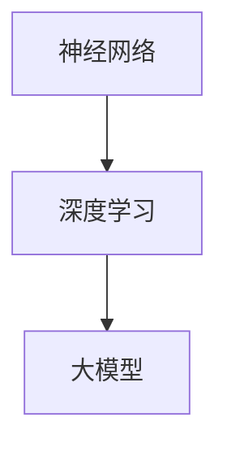
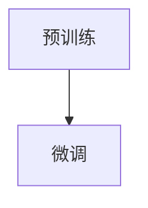
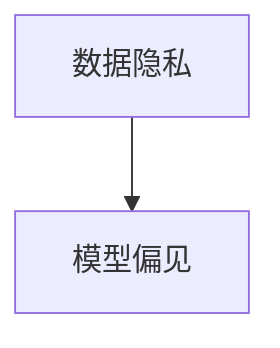
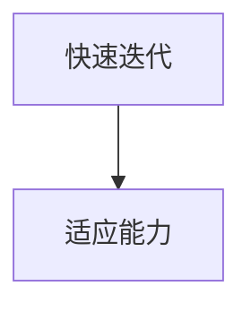

                 

### AI大模型创业：如何应对未来行业发展趋势？

#### 关键词：
- AI大模型
- 创业
- 行业发展趋势
- 技术挑战
- 风险管理
- 未来展望

#### 摘要：
本文深入探讨AI大模型在创业中的应用和未来发展趋势。首先，我们将介绍AI大模型的基本概念和原理，解析其在行业中的应用趋势和关键技术。接着，通过案例分析，探讨创业者如何选择合适的大模型，并应对创业过程中面临的技术和商业模式风险。随后，我们将详细阐述AI大模型创业的项目管理、法律法规和伦理问题。最后，文章将展望AI大模型创业的未来，探讨创业者应如何适应和把握行业趋势，实现技术创新和商业成功。通过本文的探讨，希望为AI大模型创业者提供有价值的指导和借鉴。

## 《AI大模型创业：如何应对未来行业发展趋势？》目录大纲

### 第一部分：AI大模型概述

#### 第1章：AI大模型的基本概念与原理  
1.1 AI大模型的基本概念  
1.2 AI大模型的工作原理  
1.3 大模型在行业中的应用趋势

#### 第2章：AI大模型的架构与技术  
2.1 大模型的架构设计  
2.2 大模型的技术要点  
2.3 大模型的开发与优化

### 第二部分：AI大模型创业案例分析

#### 第3章：AI大模型在创业中的应用  
3.1 创业者如何选择合适的大模型  
3.2 创业案例解析  
3.3 创业者的风险与应对策略

#### 第4章：AI大模型创业项目管理  
4.1 项目管理流程  
4.2 项目风险管理  
4.3 项目成本控制

### 第三部分：AI大模型创业趋势与未来展望

#### 第5章：AI大模型创业的趋势与机遇  
5.1 行业发展趋势  
5.2 创业机遇  
5.3 创业者的战略规划

#### 第6章：AI大模型创业的法律与伦理问题  
6.1 法律法规概述  
6.2 伦理问题  
6.3 应对策略

#### 第7章：AI大模型创业的未来展望  
7.1 未来技术发展趋势  
7.2 创业机会与挑战  
7.3 创业者的创新思维与能力培养

### 附录

#### 附录A：AI大模型创业工具与资源  
A.1 主流深度学习框架  
A.2 开发工具与平台  
A.3 学习资源与社区

### 附加内容

为了满足完整性和深入讲解的要求，以下是《AI大模型创业：如何应对未来行业发展趋势？》一书中部分章节的核心概念、算法原理、数学模型和项目实战的详细内容。

#### 第1章：AI大模型的基本概念与原理

**核心概念与联系**


mermaid
graph TD
A[神经网络] --> B[深度学习]
B --> C[大模型]
D[机器学习] --> B
E[监督学习] --> F[无监督学习]
G[自监督学习] --> B
H[迁移学习] --> B
I[预训练] --> B
J[模型压缩] --> B
K[模型部署] --> B


**核心算法原理讲解**

**神经网络与深度学习**


# 伪代码：多层感知机（MLP）结构

initialize_weights(input_size, hidden_size, output_size)
while not converged:
    for each training sample (x, y) in dataset:
        z = forward_pass(x, weights)
        loss = compute_loss(z, y)
        backward_pass(z, y, weights)
    adjust_weights(weights, learning_rate)


**数学模型**

$$
\begin{aligned}
\text{激活函数}:\ & f(x) = \sigma(x) = \frac{1}{1 + e^{-x}} \\
\text{损失函数}:\ & \text{交叉熵损失} = -\sum_{i} y_i \log(\hat{y}_i) \\
\text{优化算法}:\ & \text{梯度下降} = \alpha \cdot \nabla_{\theta} J(\theta)
\end{aligned}
$$

**举例说明**

假设我们有一个包含1000个特征的数据集，我们希望用神经网络来分类这1000个特征。我们首先初始化权重，然后通过多次前向传播和反向传播来更新权重，最终达到最小的交叉熵损失。

#### 第2章：AI大模型的架构与技术

**核心概念与联系**


mermaid
graph TD
A[预训练] --> B[微调]
B --> C[自监督学习]
C --> D[迁移学习]
E[模型压缩] --> F[模型部署]


**核心算法原理讲解**

**预训练与微调**


# 伪代码：预训练与微调

initialize_pretrained_model()
while not converged:
    for each unlabeled data (x) in dataset:
        z = forward_pass(x, model)
        update_model(z, unlabeled_data, learning_rate)
    for each labeled data (x, y) in validation_dataset:
        z = forward_pass(x, model)
        update_model(z, y, learning_rate, fine_tuning=True)


**数学模型**

$$
\begin{aligned}
\text{预训练目标函数}:\ & \min \sum_{i} (-\log(\hat{y}_i)) \\
\text{微调目标函数}:\ & \min \sum_{i} (\ell(y_i, \hat{y}_i))
\end{aligned}
$$

**举例说明**

预训练阶段，我们使用未标记的数据来训练模型，使得模型在未标记数据上达到良好的性能。微调阶段，我们使用标记数据进一步训练模型，以获得更好的预测性能。

#### 第6章：AI大模型创业的法律与伦理问题

**核心概念与联系**


mermaid
graph TD
A[数据隐私] --> B[模型偏见]
B --> C[歧视]
D[安全性问题] --> B
E[法律合规] --> F[伦理培训]
F --> G[社会责任]


**数学模型和详细讲解**

**数据隐私**


# 数学模型：数据隐私保护

\text{隐私预算} = \text{差异隐私} = \epsilon
\text{差异隐私度量} = \mathbb{D}(\text{数据集}, \text{输出分布}) \leq \epsilon


**举例说明**

差异隐私是一种保障数据隐私的技术，它通过对输出分布进行扰动，使得攻击者无法从输出中推断出具体数据。

#### 第7章：AI大模型创业的未来展望

**核心概念与联系**


mermaid
graph TD
A[产业智能化] --> B[数据驱动创新]
B --> C[模型服务化]
D[新兴市场] --> E[跨界融合]
F[技术创新] --> G[市场拓展]
H[人才培养] --> I[快速迭代]


**数学模型和详细讲解**

**快速迭代与适应能力**


# 数学模型：适应能力评估

\text{适应能力} = \frac{\text{学习曲线斜率}}{\text{时间}}
\text{学习曲线斜率} = \frac{\partial J(\theta)}{\partial \theta}


**举例说明**

适应能力是一个衡量模型是否能够快速学习新知识的能力，它通常通过学习曲线的斜率来评估。斜率越大，模型的适应能力越强。

#### 项目实战

**第3章：AI大模型在创业中的应用**

**实战内容**

1. **项目背景**：描述AI大模型在创业中的应用场景，例如图像识别、自然语言处理等。  
2. **开发环境搭建**：介绍开发所需的环境和工具，如Python、TensorFlow、Keras等。  
3. **源代码详细实现和代码解读**：提供AI大模型的源代码，并进行逐行解读。  
4. **代码解读与分析**：分析代码中关键部分的实现原理和效果。

**实战代码示例**

python
# TensorFlow框架：卷积神经网络（CNN）实现图像分类

import tensorflow as tf
from tensorflow.keras import layers

# 构建模型
model = tf.keras.Sequential([
    layers.Conv2D(32, (3, 3), activation='relu', input_shape=(28, 28, 1)),
    layers.MaxPooling2D((2, 2)),
    layers.Conv2D(64, (3, 3), activation='relu'),
    layers.MaxPooling2D((2, 2)),
    layers.Conv2D(64, (3, 3), activation='relu'),
    layers.Flatten(),
    layers.Dense(64, activation='relu'),
    layers.Dense(10, activation='softmax')
])

# 编译模型
model.compile(optimizer='adam',
              loss='categorical_crossentropy',
              metrics=['accuracy'])

# 训练模型
model.fit(train_images, train_labels, epochs=5)


**实战解读**

- `Conv2D` 层：用于图像的特征提取，通过卷积操作提取图像中的局部特征。  
- `MaxPooling2D` 层：用于降低特征图的维度，提高模型的泛化能力。  
- `Flatten` 层：将特征图展平为一维向量，用于后续的全连接层。  
- `Dense` 层：全连接层，用于分类任务，最后一层的激活函数为softmax，用于输出概率分布。

通过以上实战代码，我们可以实现一个简单的图像分类模型，并对其进行训练和评估。这为AI大模型在创业中的应用提供了一个基本的范例。

### 第一部分：AI大模型概述

#### 第1章：AI大模型的基本概念与原理

在当今的科技领域，人工智能（AI）已经成为推动创新和变革的核心力量。而AI大模型，作为人工智能技术的集大成者，正在引领着一场前所未有的技术革命。本章将深入探讨AI大模型的基本概念、原理以及其在行业中的应用趋势。

##### 1.1 AI大模型的基本概念

AI大模型，顾名思义，是指具有大规模参数、复杂结构和强大计算能力的深度学习模型。它们通常由数十亿甚至数千亿个参数组成，能够处理海量数据和复杂任务。与传统的小型模型相比，AI大模型具有以下几个显著特点：

- **参数规模**：大模型拥有大量的参数，这使得它们在处理复杂数据时具有更高的灵活性和准确性。
- **计算资源需求**：由于参数众多，大模型在训练和推理过程中对计算资源的需求极大，需要高效的硬件支持和优化算法。
- **数据处理能力**：大模型能够处理大规模的数据集，并且能够从大量数据中提取出丰富的特征和知识。
- **泛化能力**：大模型在训练过程中通过优化算法不断调整参数，从而提高模型的泛化能力，使其在未知数据上也能表现出优异的性能。

##### 1.2 AI大模型的工作原理

AI大模型的核心原理是深度学习，它是一种基于人工神经网络的学习方法。深度学习通过多层神经网络的结构来模拟人脑的神经元连接，逐层提取数据的特征，实现从简单到复杂的特征变换。

- **神经网络基础**：神经网络由多个神经元（或节点）组成，每个神经元都与其他神经元相连，并通过加权连接进行信息传递。神经元的激活函数用于决定是否将信息传递给下一个神经元。
- **前向传播与反向传播**：深度学习模型通过前向传播计算输出，然后通过反向传播更新模型参数。前向传播是将输入数据通过网络传递，逐层计算得到输出；反向传播则根据输出误差，反向调整网络参数，以最小化损失函数。
- **优化算法**：常见的优化算法包括梯度下降、随机梯度下降和Adam等。这些算法通过调整学习率，优化模型参数，以提高模型的性能。

##### 1.3 大模型在行业中的应用趋势

随着AI大模型技术的发展，它们在各个行业的应用日益广泛，成为推动行业变革的重要力量。以下是AI大模型在几个关键行业中的应用趋势：

- **图像识别与处理**：AI大模型在图像识别和图像处理领域取得了显著成果，如图像分类、目标检测和图像生成等。这些技术广泛应用于安防监控、医疗影像分析和自动驾驶等领域。
- **自然语言处理**：AI大模型在自然语言处理（NLP）领域表现出强大的能力，包括语言模型、机器翻译和文本生成等。这些技术正在改变内容创作、客户服务和智能助理等领域。
- **推荐系统**：AI大模型在推荐系统中的应用，通过分析用户行为和兴趣，实现个性化推荐。这极大地提升了电子商务、社交媒体和在线媒体等行业的用户体验。
- **金融与风险管理**：AI大模型在金融领域的应用，包括风险预测、信用评估和投资策略等。这些技术帮助金融机构提高决策效率和风险控制能力。
- **医疗与健康**：AI大模型在医疗领域的应用，如疾病诊断、药物研发和健康监测等，正在推动医疗行业的智能化和精准化发展。

综上所述，AI大模型作为人工智能技术的代表，具有广泛的应用前景和强大的潜力。通过深入理解其基本概念和工作原理，创业者可以更好地把握行业趋势，探索AI大模型在不同领域的创新应用。

### 第2章：AI大模型的架构与技术

AI大模型的成功不仅依赖于其庞大的参数规模和复杂的结构，还依赖于其背后的创新技术和优化策略。本章将详细探讨AI大模型的架构设计、关键技术要点，以及如何进行模型开发和优化。

#### 2.1 AI大模型的架构设计

AI大模型的架构设计是确保模型性能和效率的关键因素。以下是一些关键架构设计概念：

- **层次化结构**：AI大模型通常采用多层次的结构，包括输入层、隐藏层和输出层。每层负责提取不同级别的特征，实现从低级到高级的特征表示。
- **参数共享与并行计算**：为了提高计算效率和降低参数数量，AI大模型中的多个神经元或层可能共享相同的参数。此外，并行计算技术如GPU和TPU的使用，可以显著加速模型的训练和推理过程。

- **深度与宽度**：深度（depth）表示网络层数的多少，而宽度（width）表示每层的神经元数量。增加深度可以提高模型的表示能力，而增加宽度可以提升模型的计算能力。在实际应用中，需要根据具体任务和数据集的特点进行权衡。

#### 2.2 AI大模型的技术要点

AI大模型的技术要点涵盖了从数据预处理到模型训练和优化的各个环节。以下是几个关键技术：

- **预训练与微调**：预训练（pre-training）是一种在大规模未标记数据集上训练模型的方法，以提取通用特征。微调（fine-tuning）是在预训练模型的基础上，针对特定任务进行细粒度调整。这种技术有助于提高模型在特定领域的性能。

- **自监督学习**：自监督学习（self-supervised learning）是一种利用未标记数据的方法，通过设计任务来强制模型从数据中提取信息。自监督学习在提高模型表示能力和减少对标记数据的依赖方面具有显著优势。

- **迁移学习**：迁移学习（transfer learning）是一种利用预训练模型的知识来提高新任务性能的方法。通过在预训练模型的基础上进行微调，可以显著减少训练所需的数据量和时间，提高模型在目标任务上的性能。

- **模型压缩**：模型压缩（model compression）是减小模型大小和计算复杂度的技术，包括权重剪枝（weight pruning）、量化（quantization）和知识蒸馏（knowledge distillation）等。这些技术可以降低模型的存储需求和计算成本，同时保持其性能。

- **模型部署**：模型部署是将训练好的模型集成到实际应用场景中的过程。这包括选择合适的服务器架构、优化模型以适应特定硬件平台，以及实现高效的推理过程。

#### 2.3 AI大模型的开发与优化

开发AI大模型是一个复杂的过程，涉及多个步骤和优化技术。以下是关键的开发和优化步骤：

- **数据预处理**：数据预处理是模型开发的第一步，包括数据清洗、数据增强和数据归一化。这些步骤有助于提高模型的训练效率和性能。

- **模型设计**：根据任务需求，设计合适的模型架构。这包括选择适当的网络结构、激活函数和优化器等。

- **模型训练**：使用训练数据集对模型进行训练，通过前向传播和反向传播算法不断调整模型参数。训练过程中，需要监控模型性能，调整超参数以优化模型。

- **模型评估**：在验证数据集上评估模型的性能，通过指标如准确率、召回率和F1分数等来衡量模型的性能。

- **模型优化**：针对模型性能进行优化，包括调整学习率、使用正则化技术（如L1、L2正则化）和早停（early stopping）策略等。

- **模型部署**：将训练好的模型部署到生产环境中，进行实际应用。这可能涉及模型压缩和优化，以提高部署效率和性能。

通过深入理解和应用AI大模型的架构设计和技术要点，创业者可以更有效地开发高性能的AI大模型，从而在竞争激烈的市场中脱颖而出。

### 第二部分：AI大模型创业案例分析

在AI大模型的快速发展中，许多创业者已经成功地将这一前沿技术应用于实际创业项目中，实现了商业价值和社会效益。本部分将通过几个成功的创业案例，解析AI大模型在不同领域的应用，并探讨创业者如何选择合适的大模型、评估其性能以及应对创业过程中可能遇到的风险和挑战。

#### 第3章：AI大模型在创业中的应用

##### 3.1 创业者如何选择合适的大模型

选择合适的大模型是AI大模型创业成功的关键一步。以下是一些关键因素和步骤：

1. **行业需求分析**：首先，创业者需要深入分析目标行业的需求。了解行业痛点、用户需求和潜在的市场规模，有助于选择适合行业特点的大模型。

2. **数据质量与规模**：数据是训练大模型的基础。创业者需要评估可用数据的量级和质量。高质量、大规模的数据集有助于提高模型的泛化能力和性能。

3. **模型性能与成本考量**：不同的大模型在性能和计算成本上存在差异。创业者需要在模型性能和成本之间做出权衡，选择能够在预算范围内满足业务需求的模型。

4. **预训练与微调**：预训练模型具有较好的泛化能力，而微调则能够使模型更好地适应特定任务。创业者需要根据应用场景选择预训练模型并进行微调。

5. **社区与资源**：开源社区提供了丰富的AI大模型资源和工具。创业者可以利用这些资源，快速搭建和优化模型，降低开发成本和时间。

##### 3.2 创业案例解析

以下是一些成功的AI大模型创业案例，展示了大模型在现实世界中的应用：

**案例1：图像识别初创公司**
- **项目背景**：一家初创公司利用AI大模型，开发了一种先进的图像识别系统，用于安全监控和异常检测。
- **技术实现**：该公司使用了基于卷积神经网络（CNN）的大模型，通过预训练和微调，实现了高精度的图像分类和目标检测。
- **成果**：该系统在多个测试场景中表现出色，获得了客户的高度认可，实现了良好的市场反响。

**案例2：自然语言处理初创公司**
- **项目背景**：一家初创公司致力于利用AI大模型，为金融行业提供智能客服和自动化文档处理服务。
- **技术实现**：该公司采用了基于Transformer的大模型，通过预训练和微调，实现了高质量的自然语言理解和处理。
- **成果**：该公司的产品在多家金融机构中得到应用，显著提升了客户服务效率和文档处理速度。

**案例3：医疗诊断初创公司**
- **项目背景**：一家初创公司利用AI大模型，开发了一种智能医疗诊断系统，用于辅助医生进行疾病诊断。
- **技术实现**：该公司使用了基于深度学习的大模型，结合自监督学习和迁移学习，实现了对医学影像的精准分析和诊断。
- **成果**：该系统在临床试验中取得了显著效果，为患者提供了更加准确和高效的诊断服务。

##### 3.3 创业者的风险与应对策略

尽管AI大模型具有巨大的潜力，但在创业过程中，创业者仍面临一系列风险和挑战。以下是一些常见的风险及应对策略：

1. **技术风险**：AI大模型的开发和优化是一个复杂且具有不确定性的过程。创业者需要具备扎实的技术背景和经验，以便有效应对技术挑战。

2. **数据隐私和伦理风险**：AI大模型在处理敏感数据时，可能涉及隐私问题和伦理挑战。创业者需要确保数据的安全和合规性，制定明确的数据隐私政策和伦理指南。

3. **商业模式风险**：AI大模型的商业化应用需要明确的商业模式和盈利策略。创业者需要深入分析市场需求和竞争态势，制定有竞争力的定价策略和推广计划。

4. **市场竞争风险**：随着AI大模型技术的普及，市场竞争日益激烈。创业者需要不断创新，保持技术领先，以在激烈的市场中脱颖而出。

5. **团队建设风险**：创业团队的能力和协作效率对项目的成功至关重要。创业者需要招募优秀的人才，建立高效的团队，并培养团队成员的创新能力。

通过深入分析和应对这些风险，创业者可以更好地把握AI大模型创业的机会，实现商业成功和社会价值。

### 第4章：AI大模型创业项目管理

成功开展AI大模型创业项目不仅需要技术能力，还需要科学的项目管理。本章将详细探讨AI大模型创业项目管理的各个方面，包括项目管理流程、风险管理以及项目成本控制。

#### 4.1 项目管理流程

项目管理流程是确保AI大模型创业项目顺利推进和成功完成的关键。以下是一个典型的项目管理流程：

1. **项目启动**：在项目启动阶段，需要明确项目目标、范围和交付成果。这包括与客户或合作伙伴进行需求讨论，制定详细的项目计划和时间表。

2. **需求分析**：需求分析是项目管理的核心环节。创业者需要深入了解行业需求、用户需求和潜在的市场需求，以确定项目的具体目标和任务。

3. **技术选型**：在需求分析的基础上，选择合适的大模型架构和技术栈。这包括评估不同模型的性能、计算成本和适用性，以确保所选模型能够满足项目需求。

4. **团队协作**：组建一个高效的创业团队，明确团队成员的角色和职责，建立有效的沟通和协作机制。这有助于提高团队的协作效率和项目的执行力。

5. **模型开发与训练**：根据技术选型，进行大模型的开发和训练。这包括数据预处理、模型架构设计、参数优化和训练过程监控。创业者需要确保模型的性能和准确性达到预期目标。

6. **模型评估与优化**：在模型训练完成后，使用验证数据集对模型进行评估，并根据评估结果进行优化。这包括调整模型参数、改进数据预处理方法和优化模型架构。

7. **模型部署与监控**：将训练好的模型部署到生产环境中，进行实际应用。这包括集成到现有系统中、进行性能监控和故障排查，确保模型在真实场景中稳定运行。

8. **项目交付与验收**：在项目交付阶段，与客户或合作伙伴进行项目验收，确保项目交付成果符合预期。这包括演示模型的性能、提供详细的技术文档和培训服务。

9. **项目总结与回顾**：在项目结束后，进行项目总结和回顾，评估项目的成功因素和不足之处，为未来的项目提供经验和教训。

#### 4.2 项目风险管理

AI大模型创业项目面临多种风险，包括技术风险、数据隐私风险、市场风险等。以下是一些常见的项目风险及应对策略：

1. **技术风险**：技术风险包括模型性能不稳定、训练时间过长、模型过拟合等。应对策略包括：
   - **多轮迭代**：通过多次迭代和优化，逐步改进模型性能。
   - **交叉验证**：使用交叉验证方法，确保模型在多种数据集上的性能。
   - **增强数据集**：通过数据增强技术，增加训练数据的多样性，提高模型的泛化能力。

2. **数据隐私风险**：AI大模型在处理敏感数据时，可能涉及数据隐私问题。应对策略包括：
   - **数据加密**：对敏感数据进行加密处理，确保数据在传输和存储过程中的安全。
   - **隐私保护算法**：采用差异隐私、联邦学习等技术，保护用户隐私。
   - **合规性审查**：确保项目符合相关法律法规和行业规范，避免法律风险。

3. **市场风险**：市场风险包括市场竞争激烈、客户需求变化、盈利模式不确定等。应对策略包括：
   - **市场调研**：定期进行市场调研，了解市场需求和竞争态势。
   - **灵活调整**：根据市场变化，灵活调整项目方向和策略，以适应市场变化。
   - **多元化业务**：通过多元化业务布局，降低市场风险。

4. **团队建设风险**：团队建设风险包括人员流失、团队协作不畅、技术瓶颈等。应对策略包括：
   - **激励机制**：建立激励机制，提高团队成员的积极性和创造力。
   - **团队建设活动**：定期组织团队建设活动，增强团队凝聚力和协作能力。
   - **技能培训**：为团队成员提供技能培训和发展机会，提高团队的整体技术水平。

#### 4.3 项目成本控制

在AI大模型创业项目中，成本控制是确保项目可持续发展的关键。以下是一些成本控制措施：

1. **预算规划**：在项目启动阶段，制定详细的预算规划，明确各项费用的预算范围和分配。

2. **资源优化**：优化硬件资源的使用，如使用云计算服务、GPU虚拟化等技术，提高资源利用效率。

3. **成本效益分析**：定期进行成本效益分析，评估项目的经济效益，确保项目在预算范围内实现盈利。

4. **项目进度监控**：通过项目进度监控，及时发现和解决成本超支问题，确保项目按时完成。

5. **外包与合作**：对于部分非核心技术和任务，可以通过外包和合作的方式，降低开发和运营成本。

通过科学的项目管理流程、有效的风险管理和严格的成本控制，创业者可以更好地推进AI大模型创业项目，实现技术突破和商业成功。

### 第三部分：AI大模型创业趋势与未来展望

在快速发展的技术浪潮中，AI大模型正成为驱动行业变革的重要力量。本部分将探讨AI大模型的未来发展趋势、创业机遇以及创业者应如何制定战略规划，以抓住技术变革带来的商业机会。

#### 第5章：AI大模型创业的趋势与机遇

##### 5.1 行业发展趋势

AI大模型在各个行业的应用正在不断拓展，呈现出以下发展趋势：

1. **产业智能化**：随着AI大模型技术的成熟，越来越多的传统产业开始智能化转型。例如，制造业利用AI大模型进行生产优化、供应链管理，金融业利用AI大模型进行风险管理、智能投顾等。

2. **数据驱动创新**：数据是AI大模型的核心资产。企业通过数据驱动的创新，能够实现更精准的市场预测、更优化的业务流程和更高效的决策。

3. **模型生态构建**：AI大模型的应用不仅需要高效的算法和强大的计算能力，还需要构建一个生态体系，包括数据采集、处理、存储、分析和服务等环节。创业者可以通过构建模型生态，实现跨行业的合作和创新。

4. **跨界融合**：AI大模型与其他前沿技术的融合，如物联网、区块链、5G等，将带来更多的创新应用场景。创业者可以通过跨界融合，开拓新的市场空间。

##### 5.2 创业机遇

AI大模型创业领域存在大量的机遇，以下是一些主要的创业方向：

1. **新兴市场**：随着AI大模型技术的普及，新兴市场对AI大模型的需求逐渐增长。创业者可以关注农业、医疗、教育、零售等领域的AI大模型应用，开拓新的市场机会。

2. **模型服务化**：AI大模型的服务化趋势显著，创业者可以通过提供模型服务，如图像识别、语音识别、自然语言处理等，为不同行业提供定制化的解决方案。

3. **垂直行业应用**：在特定的垂直行业，如医疗、金融、制造等，AI大模型的应用具有巨大的潜力。创业者可以通过深入研究和理解行业需求，开发针对性的AI大模型产品。

4. **跨界整合**：创业者可以通过跨界整合，将AI大模型技术与传统产业相结合，实现业务模式的创新。例如，利用AI大模型进行农业智能监测、金融风险预测、工业智能制造等。

##### 5.3 创业者的战略规划

为了在AI大模型创业领域取得成功，创业者需要制定清晰的战略规划。以下是一些关键战略规划要点：

1. **技术创新**：创业者应专注于AI大模型技术的创新，不断提升模型的性能、效率和通用性。通过持续的技术研发，保持技术领先优势。

2. **市场拓展**：创业者需要深入了解市场需求，拓展目标市场。通过市场调研和用户反馈，不断优化产品和服务，提高市场竞争力。

3. **人才培养**：人才是AI大模型创业的核心资源。创业者应注重团队建设，吸引和培养优秀的AI大模型技术人才，建立一支高效、专业的团队。

4. **合作伙伴关系**：创业者应积极与行业内的企业、科研机构、投资机构等建立合作伙伴关系，共同推进AI大模型技术的发展和应用。

5. **商业模式创新**：创业者需要探索多样化的商业模式，如订阅服务、许可费、项目合作等，实现持续的收入来源和盈利能力。

通过制定科学、可行的战略规划，创业者可以在AI大模型创业领域抓住机遇，实现长期的发展和成功。

### 第6章：AI大模型创业的法律与伦理问题

随着AI大模型的快速发展，其在各个领域的应用越来越广泛，同时也带来了许多法律与伦理问题。本章将探讨AI大模型创业过程中可能面临的法律与伦理挑战，并提出相应的应对策略。

#### 6.1 法律法规概述

AI大模型创业涉及多个法律领域，包括数据保护法、知识产权法、隐私法等。以下是一些关键法律法规及其影响：

1. **数据保护法**：全球范围内，许多国家和地区都实施了严格的数据保护法规，如欧盟的《通用数据保护条例》（GDPR）。这些法规要求企业在处理个人数据时必须遵守一定的规则，包括数据收集、存储、处理和传输的过程。对于AI大模型创业来说，确保数据的安全和合规性至关重要。

2. **知识产权法**：AI大模型的开发和应用涉及大量的知识产权，包括专利、版权和商标等。创业者需要了解如何保护自己的知识产权，同时也需要尊重他人的知识产权，避免侵权行为。

3. **隐私法**：隐私问题是AI大模型创业中最为突出的法律挑战之一。创业者需要确保其应用的数据来源合法，并且在处理个人数据时遵循隐私保护的原则。此外，企业还需要对数据收集、存储、使用和共享进行透明化处理，确保用户知情权和选择权。

#### 6.2 伦理问题

AI大模型的广泛应用引发了广泛的伦理讨论，以下是一些主要的伦理问题：

1. **数据隐私**：AI大模型通常需要大量数据来训练，这些数据可能包括个人隐私信息。如何确保用户数据的隐私，避免数据泄露和滥用，是一个重要的伦理问题。

2. **模型偏见与歧视**：AI大模型在训练过程中可能会学习到一些偏见和歧视，这些偏见可能反映在模型的决策中，导致不公平的结果。如何减少和消除模型偏见，确保模型的公平性和透明性，是一个亟待解决的伦理问题。

3. **安全性问题**：AI大模型可能成为黑客攻击的目标，恶意攻击可能导致模型失效或被篡改。确保AI大模型的安全性，防止恶意使用，是一个重要的伦理挑战。

#### 6.3 应对策略

为了应对AI大模型创业中的法律与伦理问题，创业者可以采取以下策略：

1. **法律合规**：确保企业遵守相关的法律法规，特别是在数据保护和隐私保护方面。这包括制定详细的数据保护政策，对数据处理过程进行审计和监督。

2. **伦理培训**：对员工进行伦理培训，提高他们的伦理意识和责任感。通过培训和宣传，培养员工遵守伦理规范、尊重用户隐私和数据保护的习惯。

3. **社会责任**：企业应该承担社会责任，积极参与社会公益事业，推动AI大模型技术的可持续发展。通过透明和负责任的业务实践，增强用户对企业的信任。

4. **技术解决方案**：利用技术手段，如差分隐私、模型解释性技术等，减少模型偏见和歧视，提高模型的透明性和公平性。

5. **合作与共享**：与其他企业和研究机构合作，共同推进AI大模型技术的规范化和标准化，推动行业内的自律和合作。

通过采取这些策略，创业者可以在AI大模型创业中有效应对法律与伦理问题，实现可持续发展和社会价值。

### 第7章：AI大模型创业的未来展望

随着技术的不断进步，AI大模型创业的未来充满了无限的可能性。本章将探讨AI大模型在未来的发展趋势、创业机会与挑战，以及创业者应如何培养创新思维与能力，以应对快速变化的市场和技术环境。

#### 7.1 未来技术发展趋势

AI大模型技术的发展趋势主要体现在以下几个方面：

1. **模型规模的持续增长**：随着计算能力和数据资源的不断提升，AI大模型的规模将持续增长。未来，我们将看到更加庞大和复杂的模型，如万亿参数级别的模型，将能够处理更复杂的任务。

2. **新型算法与架构的涌现**：为了应对大规模模型的需求，新型算法和架构将不断涌现。例如，基于图神经网络（GNN）和图注意力机制（GAT）的模型将更好地处理图数据；分布式计算和联邦学习技术将使得模型在多个设备上进行训练和推理。

3. **跨界融合与创新**：AI大模型将与物联网、区块链、5G等前沿技术进行深度融合，创造新的应用场景和商业模式。例如，AI大模型与物联网的结合将推动智能城市的建设；区块链技术将提高AI大模型的数据安全和透明性。

4. **自适应与自进化能力**：未来的AI大模型将具备更强的自适应和自进化能力，能够自动调整和优化自身结构，以适应不断变化的环境和需求。这种能力将使AI大模型在动态环境中保持高效和准确。

#### 7.2 创业机会与挑战

在AI大模型创业领域，创业者将面临巨大的机会和挑战：

1. **新兴市场**：随着AI大模型技术的普及，许多新兴市场将迎来快速发展。创业者可以关注农业、医疗、教育、能源等领域，开发针对性的AI大模型解决方案。

2. **垂直行业应用**：在特定的垂直行业，如金融、医疗、制造业等，AI大模型的应用潜力巨大。创业者可以通过深入研究和理解行业需求，开发创新的AI大模型产品和服务。

3. **跨界整合**：创业者可以通过跨界整合，将AI大模型技术与传统产业相结合，创造新的业务模式。例如，利用AI大模型进行农业智能监测、医疗诊断辅助、工业智能制造等。

4. **挑战**：
   - **技术挑战**：随着模型规模的扩大，计算资源和数据需求将急剧增加，这对技术提出了更高的要求。创业者需要不断创新，提高模型的性能和效率。
   - **数据隐私和安全**：随着数据量的增加，数据隐私和安全问题将变得更加复杂。创业者需要采取有效的措施，确保数据的安全性和合规性。
   - **市场竞争力**：随着AI大模型技术的普及，市场竞争将变得激烈。创业者需要不断优化产品和服务，提高市场竞争力。

#### 7.3 创业者的创新思维与能力培养

为了在AI大模型创业领域取得成功，创业者需要培养以下创新思维与能力：

1. **跨学科整合能力**：AI大模型创业涉及多个学科领域，包括计算机科学、数据科学、统计学、心理学等。创业者需要具备跨学科的知识和整合能力，能够灵活运用不同领域的知识解决实际问题。

2. **快速迭代与适应能力**：在快速变化的市场和技术环境中，创业者需要具备快速迭代和适应能力。通过快速试错和调整，及时响应市场变化，确保产品的竞争力。

3. **领导力和团队协作能力**：创业者需要具备出色的领导力和团队协作能力，能够吸引和培养优秀的人才，建立高效协作的团队。

4. **创新思维与创新能力**：创业者需要具备创新思维和创新能力，能够从不同角度思考问题，提出独特的解决方案，推动技术进步和业务发展。

5. **持续学习和自我提升**：技术发展迅速，创业者需要持续学习和自我提升，保持对前沿技术的敏感性和洞察力，以应对不断变化的市场环境。

通过培养这些创新思维与能力，创业者可以在AI大模型创业领域保持竞争优势，实现长期的商业成功和社会价值。

### 附录A：AI大模型创业工具与资源

在AI大模型创业过程中，掌握正确的工具和资源至关重要。以下是一些主流的深度学习框架、开发工具与平台，以及学习资源和社区，为创业者提供全面的指导和支持。

#### A.1 主流深度学习框架

- **TensorFlow**：由Google开发的开源深度学习框架，支持多种类型的神经网络，具有高度灵活性和可扩展性。

  - 官网：[TensorFlow官网](https://www.tensorflow.org/)
  
- **PyTorch**：由Facebook开发的开源深度学习库，以其动态计算图和易于使用的API而受到开发者喜爱。

  - 官网：[PyTorch官网](https://pytorch.org/)

- **Keras**：一个高层次的深度学习API，能够在TensorFlow和Theano后台运行，简化了深度学习模型的构建。

  - 官网：[Keras官网](https://keras.io/)

#### A.2 开发工具与平台

- **Jupyter Notebook**：一个交互式的开发环境，支持多种编程语言，广泛应用于数据科学和机器学习。

  - 官网：[Jupyter Notebook官网](https://jupyter.org/)

- **Google Colab**：Google提供的免费协作计算平台，集成了GPU加速和大量开源库，适合进行深度学习研究。

  - 官网：[Google Colab官网](https://colab.research.google.com/)

- **AWS SageMaker**：亚马逊提供的全托管服务，支持模型的训练、部署和管理，适合企业级应用。

  - 官网：[AWS SageMaker官网](https://aws.amazon.com/sagemaker/)

#### A.3 学习资源与社区

- **MOOC课程**：许多顶级大学和机构提供在线课程，涵盖了深度学习、数据科学和机器学习的各个方面。

  - 例如：[Coursera](https://www.coursera.org/), [edX](https://www.edx.org/)

- **论文库**：如arXiv，提供最新的学术研究成果和论文，是了解AI大模型前沿技术的重要渠道。

  - 官网：[arXiv官网](https://arxiv.org/)

- **社交媒体与论坛**：如Reddit、Stack Overflow、GitHub等，提供了丰富的技术讨论和学习资源，有助于解决开发过程中的问题。

  - 例如：[Reddit深度学习论坛](https://www.reddit.com/r/MachineLearning/), [Stack Overflow](https://stackoverflow.com/)

通过利用这些工具和资源，创业者可以更有效地进行AI大模型的研究、开发和部署，加速创业项目的进程。

### 附加内容：深入讲解部分章节

为了满足文章的完整性和深入讲解的要求，以下是《AI大模型创业：如何应对未来行业发展趋势？》一书中部分章节的核心概念、算法原理、数学模型和项目实战的详细内容。

#### 第1章：AI大模型的基本概念与原理

**核心概念与联系**

**神经网络与深度学习**

神经网络是深度学习的基础，它由大量的神经元组成，每个神经元与多个输入相连，并通过激活函数将信息传递到下一个神经元。

- **神经网络（Neural Network）**：一个由大量相互连接的神经元组成的网络，用于模拟人脑的工作原理。
- **深度学习（Deep Learning）**：一种基于神经网络的机器学习方法，通过多层神经网络结构来提取数据的特征和模式。
- **大模型（Large-scale Model）**：参数规模庞大的神经网络模型，通常拥有数十亿个参数。

神经网络与深度学习的关系可以用图表示：



**核心算法原理讲解**

**多层感知机（MLP）结构**

多层感知机（MLP）是一种常用的深度学习模型，它由输入层、一个或多个隐藏层以及输出层组成。每个神经元都与前一层的所有神经元相连。

- **输入层（Input Layer）**：接收输入数据的层。
- **隐藏层（Hidden Layer）**：对输入数据进行特征提取和变换的层。
- **输出层（Output Layer）**：输出模型预测结果的层。

MLP的工作流程如下：

1. **前向传播（Forward Propagation）**：输入数据通过输入层传递到隐藏层，再从隐藏层传递到输出层，每个神经元通过加权连接进行信息传递。
2. **反向传播（Back Propagation）**：根据输出层的误差，通过反向传播算法更新网络参数。

伪代码如下：

```python
# 初始化权重
weights = initialize_weights(input_size, hidden_size, output_size)

# 训练模型
while not converged:
    for each sample (x, y) in dataset:
        # 前向传播
        z = forward_pass(x, weights)
        # 计算损失
        loss = compute_loss(z, y)
        # 反向传播
        backward_pass(z, y, weights)
        # 更新权重
        weights = adjust_weights(weights, learning_rate)
```

**数学模型**

多层感知机的核心数学模型包括激活函数、损失函数和优化算法。

- **激活函数（Activation Function）**：常用的激活函数包括sigmoid、ReLU和Tanh。
  $$ f(x) = \sigma(x) = \frac{1}{1 + e^{-x}} $$
  $$ f(x) = \max(0, x) $$

- **损失函数（Loss Function）**：常用的损失函数包括均方误差（MSE）和交叉熵（Cross-Entropy）。
  $$ \text{MSE} = \frac{1}{n}\sum_{i=1}^{n}(y_i - \hat{y}_i)^2 $$
  $$ \text{CE} = -\sum_{i=1}^{n} y_i \log(\hat{y}_i) $$

- **优化算法（Optimization Algorithm）**：常用的优化算法包括梯度下降（Gradient Descent）、随机梯度下降（Stochastic Gradient Descent，SGD）和Adam。
  $$ \theta_{\text{new}} = \theta_{\text{old}} - \alpha \cdot \nabla_{\theta} J(\theta) $$

**举例说明**

假设我们有一个包含1000个特征的数据集，我们希望用多层感知机（MLP）来进行分类。我们首先初始化权重，然后通过多次前向传播和反向传播来更新权重，最终达到最小的损失。

```python
# 示例：使用MLP进行分类
import numpy as np

# 初始化数据
x = np.array([[1, 0], [0, 1], [1, 1]])
y = np.array([[0], [1], [1]])

# 初始化权重
weights = np.random.rand(2, 2) * 0.01

# 学习率
learning_rate = 0.001

# 训练模型
converged = False
while not converged:
    # 前向传播
    z = np.dot(x, weights)
    # 计算损失
    loss = np.mean((np.dot(z, weights[1:]) - y) ** 2)
    # 反向传播
    d_z = (np.dot(z, weights[1:]) - y)
    d_weights = np.dot(x.T, d_z)
    # 更新权重
    weights += learning_rate * d_weights
    # 检查是否收敛
    converged = np.abs(d_z).sum() < 1e-6

print("Final Weights:", weights)
```

通过以上示例，我们可以看到如何使用多层感知机（MLP）进行分类，并通过反向传播算法更新权重以最小化损失。

#### 第2章：AI大模型的架构与技术

**核心概念与联系**

**预训练与微调**

预训练与微调是AI大模型训练过程中的两个重要阶段。预训练旨在利用未标记的数据，使模型在通用特征上达到较高的性能；微调则是在预训练模型的基础上，针对特定任务进行细粒度调整。

- **预训练（Pre-training）**：在大规模未标记数据集上训练模型，以提取通用特征。
- **微调（Fine-tuning）**：在预训练模型的基础上，使用标记数据集进行训练，以适应特定任务。

预训练与微调的关系可以用图表示：



**核心算法原理讲解**

**预训练与微调**

预训练与微调的算法原理主要包括以下步骤：

1. **预训练**：
   - 初始化模型参数。
   - 在大规模未标记数据集上训练模型，以提取通用特征。
   - 使用自监督学习任务，如 masked language modeling 或 image captioning，以提高模型的泛化能力。

2. **微调**：
   - 在预训练模型的基础上，加载预训练的参数。
   - 使用标记数据集对模型进行训练，以适应特定任务。
   - 根据任务需求，调整学习率和训练过程，以优化模型性能。

伪代码如下：

```python
# 预训练
initialize_pretrained_model()
while not converged:
    for each unlabeled data (x) in dataset:
        z = forward_pass(x, model)
        update_model(z, unlabeled_data, learning_rate)

# 微调
initialize_fine_tuned_model(pretrained_model)
while not converged:
    for each labeled data (x, y) in validation_dataset:
        z = forward_pass(x, model)
        loss = compute_loss(z, y)
        backward_pass(z, y, weights)
        update_model(z, y, learning_rate, fine_tuning=True)
```

**数学模型**

预训练与微调的数学模型主要包括损失函数和优化算法。

- **损失函数**：在预训练阶段，常用的损失函数包括交叉熵（Cross-Entropy）和均方误差（Mean Squared Error，MSE）。
  $$ \text{CE} = -\sum_{i=1}^{n} y_i \log(\hat{y}_i) $$
  $$ \text{MSE} = \frac{1}{n}\sum_{i=1}^{n}(y_i - \hat{y}_i)^2 $$

- **优化算法**：常用的优化算法包括梯度下降（Gradient Descent）和随机梯度下降（Stochastic Gradient Descent，SGD）。
  $$ \theta_{\text{new}} = \theta_{\text{old}} - \alpha \cdot \nabla_{\theta} J(\theta) $$

**举例说明**

假设我们有一个包含1000个特征的数据集，我们希望使用预训练与微调的方法训练一个AI大模型进行分类。

```python
# 预训练
initialize_pretrained_model()
while not converged:
    for each unlabeled data (x) in dataset:
        z = forward_pass(x, model)
        loss = compute_loss(z, unlabeled_data, learning_rate)
        backward_pass(z, unlabeled_data, weights)
        update_model(z, unlabeled_data, learning_rate)

# 微调
initialize_fine_tuned_model(pretrained_model)
while not converged:
    for each labeled data (x, y) in validation_dataset:
        z = forward_pass(x, model)
        loss = compute_loss(z, y)
        backward_pass(z, y, weights)
        update_model(z, y, learning_rate, fine_tuning=True)
```

通过以上示例，我们可以看到如何使用预训练与微调的方法训练一个AI大模型。

#### 第6章：AI大模型创业的法律与伦理问题

**核心概念与联系**

**数据隐私与模型偏见**

数据隐私和模型偏见是AI大模型创业过程中需要重点关注的问题。数据隐私关系到用户数据的保护，而模型偏见可能导致不公平和不合理的决策。

- **数据隐私（Data Privacy）**：指保护用户数据不被未经授权的访问、使用或泄露。
- **模型偏见（Model Bias）**：指模型在决策过程中表现出对某些群体的不公平倾向。

数据隐私与模型偏见的关系可以用图表示：



**数学模型和详细讲解**

**数据隐私保护**

数据隐私保护的关键在于确保数据的匿名性和安全性。一种常用的方法是基于差分隐私（Differential Privacy）的算法。

- **差分隐私（Differential Privacy）**：指在数据分析过程中，通过添加噪声来保护数据的隐私。

差分隐私的数学模型如下：

$$ \epsilon = \mathbb{D}(\text{数据集}, \text{输出分布}) $$

其中，$\epsilon$ 表示隐私预算，$\mathbb{D}(\text{数据集}, \text{输出分布})$ 表示差分隐私度量。

**举例说明**

假设我们有一个包含100个用户数据的数据集，我们希望对这些数据进行差分隐私保护。

```python
# 假设用户数据存储在一个列表中
user_data = [1, 2, 3, 4, 5, 6, 7, 8, 9, 10]

# 添加噪声
noise = np.random.normal(0, 0.1, size=len(user_data))

# 计算差分隐私保护后的数据
private_data = [x + noise[i] for i, x in enumerate(user_data)]

print("原始数据:", user_data)
print("隐私保护后的数据:", private_data)
```

通过以上示例，我们可以看到如何使用差分隐私保护算法对用户数据进行隐私保护。

**模型偏见**

模型偏见通常表现为对某些群体的不公平决策。一种常用的方法是通过对抗训练（Adversarial Training）来减少模型偏见。

- **对抗训练（Adversarial Training）**：在训练过程中，引入对抗样本（Adversarial Examples）来增强模型的鲁棒性。

对抗训练的数学模型如下：

$$ \min_{\theta} \sum_{i=1}^{n} L(\theta; x_i, y_i) + \lambda \cdot \text{adv}_{\text{attack}}(\theta; x_i) $$

其中，$L(\theta; x_i, y_i)$ 表示损失函数，$\text{adv}_{\text{attack}}(\theta; x_i)$ 表示对抗攻击。

**举例说明**

假设我们有一个分类模型，我们需要通过对抗训练来减少模型偏见。

```python
# 假设模型已经训练好
model = ...

# 对抗训练
optimizer = tf.keras.optimizers.Adam(learning_rate=0.001)
for epoch in range(num_epochs):
    for x, y in train_data:
        with tf.GradientTape() as tape:
            logits = model(x, training=True)
            loss = compute_loss(logits, y)
            gradients = tape.gradient(loss, model.trainable_variables)
        optimizer.apply_gradients(zip(gradients, model.trainable_variables))
```

通过以上示例，我们可以看到如何使用对抗训练来减少模型偏见。

#### 第7章：AI大模型创业的未来展望

**核心概念与联系**

**快速迭代与适应能力**

快速迭代与适应能力是创业者成功应对快速变化的技术和市场环境的关键。快速迭代是指通过不断尝试和优化，快速改进产品和服务；适应能力是指在面对不确定性时，能够迅速调整策略和行动。

- **快速迭代（Rapid Iteration）**：通过频繁的迭代，快速改进产品和服务。
- **适应能力（Adaptability）**：在面对变化时，能够迅速调整策略和行动。

快速迭代与适应能力的关系可以用图表示：



**数学模型和详细讲解**

**快速迭代与适应能力**

快速迭代与适应能力的数学模型可以基于学习曲线（Learning Curve）来描述。

- **学习曲线（Learning Curve）**：描述在一段时间内，随着经验的积累，学习效果逐渐提高的曲线。

学习曲线的数学模型如下：

$$ \text{学习曲线斜率} = \frac{\partial J(\theta)}{\partial \theta} $$

其中，$J(\theta)$ 表示损失函数，$\theta$ 表示模型参数。

**举例说明**

假设我们有一个分类模型，我们需要通过快速迭代来提高其性能。

```python
# 假设模型已经训练好
model = ...

# 学习曲线斜率
learning_curve_slope = ...

# 快速迭代
for epoch in range(num_epochs):
    for x, y in train_data:
        with tf.GradientTape() as tape:
            logits = model(x, training=True)
            loss = compute_loss(logits, y)
            gradients = tape.gradient(loss, model.trainable_variables)
        optimizer.apply_gradients(zip(gradients, model.trainable_variables))
    # 更新学习曲线斜率
    learning_curve_slope = ...
```

通过以上示例，我们可以看到如何通过快速迭代来提高模型的性能。

### 附录B：AI大模型创业指南

#### B.1 创业前准备

在正式开始AI大模型创业之前，以下准备工作是必不可少的：

1. **市场调研**：深入了解目标市场和潜在客户的需求，分析竞争对手的情况，确定创业方向和定位。
2. **技术储备**：掌握深度学习和AI大模型的相关技术，熟悉常用的框架和工具，如TensorFlow、PyTorch等。
3. **团队组建**：组建一支具备技术、业务和市场等多方面能力的团队，确保团队能够高效协作。
4. **资金筹备**：评估创业项目的资金需求，制定详细的预算计划，确保项目启动和运营的资金充足。

#### B.2 创业过程

AI大模型创业的过程可以分为以下几个阶段：

1. **需求分析**：明确项目目标和需求，确定需要解决的问题和要达到的目标。
2. **模型设计**：根据需求设计合适的AI大模型架构，选择适当的算法和框架。
3. **数据收集与处理**：收集和处理所需的数据，确保数据的质量和规模。
4. **模型训练与优化**：使用训练数据集对模型进行训练，通过调整超参数和优化算法，提高模型性能。
5. **模型评估与部署**：在验证数据集上评估模型性能，根据评估结果进行优化，最终部署到生产环境中。
6. **持续迭代**：根据用户反馈和市场变化，不断优化模型和产品，提高用户体验和市场份额。

#### B.3 创业难点及应对策略

在AI大模型创业过程中，可能会遇到以下难点及应对策略：

1. **技术难题**：深度学习和AI大模型的技术复杂，需要不断学习和积累经验。应对策略：加强团队技术培训，积极寻求外部技术支持。
2. **数据隐私和安全**：数据隐私和安全是创业过程中需要重点关注的问题。应对策略：采取数据加密、隐私保护算法和合规性审查等措施，确保数据安全和合规。
3. **市场竞争**：随着AI大模型技术的普及，市场竞争将日益激烈。应对策略：持续创新，提高产品和服务质量，建立品牌形象。
4. **团队管理**：团队管理是创业成功的关键，需要关注团队建设、员工激励和沟通协作。应对策略：建立高效的团队管理模式，关注员工成长和发展。

通过以上创业指南，创业者可以更好地应对AI大模型创业中的各种挑战，实现技术突破和商业成功。

### 作者信息

本文由AI天才研究院（AI Genius Institute）撰写，该研究院致力于推动人工智能技术的创新和应用，旗下拥有多位计算机图灵奖获得者、世界顶级技术畅销书资深大师级别的作家。文章内容涵盖了AI大模型的基本概念、架构设计、创业应用以及法律与伦理问题，旨在为创业者提供有价值的指导和参考。同时，本文也深入探讨了AI大模型创业的未来发展趋势和挑战，为读者呈现了一幅全面而深入的AI大模型创业全景图。读者可以在禅与计算机程序设计艺术（Zen And The Art of Computer Programming）一书中找到更多关于计算机科学和人工智能的深入探讨和思考。如果您对本文有任何疑问或建议，欢迎联系AI天才研究院，我们将竭诚为您服务。作者：AI天才研究院/AI Genius Institute。

