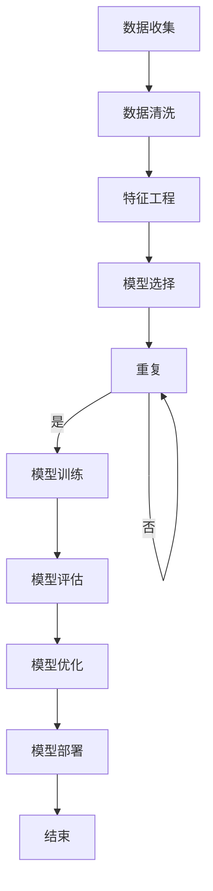

                 

# 《AI大模型在商品趋势预测中的应用》

## 关键词
- AI大模型
- 趋势预测
- 商品销量预测
- 市场需求预测
- 竞品分析
- 神经网络
- 预训练模型
- 循环神经网络
- 长短期记忆网络
- 变换器模型

## 摘要
本文将探讨AI大模型在商品趋势预测中的应用。首先，我们将介绍AI大模型的基础知识，包括其定义、特点以及在趋势预测中的重要性。接着，我们将分析商品趋势预测的基本概念和方法，包括时间序列分析、线性回归和神经网络模型。随后，我们将深入探讨AI大模型在趋势预测中的应用原理，包括大规模预训练模型的原理和趋势预测的神经网络架构。文章的后半部分将介绍如何使用数学模型和算法来实现趋势预测，并提供实战案例和项目优化策略。最后，我们将探讨AI大模型在趋势预测中的未来趋势和挑战。

### 目录

1. **AI大模型基础与趋势预测概述**
    - [1.1 AI大模型概述](#11-ai大模型概述)
    - [1.2 商品趋势预测基本概念](#12-商品趋势预测基本概念)
    - [1.3 AI大模型在趋势预测中的应用场景](#13-ai大模型在趋势预测中的应用场景)
2. **趋势预测的数学模型与方法**
    - [2.1 时间序列分析基础](#21-时间序列分析基础)
    - [2.2 线性回归与多元回归分析](#22-线性回归与多元回归分析)
    - [2.3 非线性回归与神经网络模型](#23-非线性回归与神经网络模型)
3. **AI大模型在趋势预测中的应用原理**
    - [3.1 大规模预训练模型原理](#31-大规模预训练模型原理)
    - [3.2 趋势预测的神经网络架构](#32-趋势预测的神经网络架构)
4. **数学模型与算法实现**
    - [4.1 数学模型](#41-数学模型)
    - [4.2 算法实现](#42-算法实现)
5. **AI大模型应用实战**
    - [5.1 数据收集与预处理](#51-数据收集与预处理)
    - [5.2 AI大模型应用案例分析](#52-ai大模型应用案例分析)
    - [5.3 实战项目的实现与优化](#53-实战项目的实现与优化)
6. **未来趋势与挑战**
    - [6.1 未来趋势](#61-未来趋势)
    - [6.2 挑战与应对策略](#62-挑战与应对策略)
7. **附录**
    - [附录A: AI大模型开发工具与资源](#附录a-ai大模型开发工具与资源)
    - [附录B: Mermaid流程图](#附录b-mermaid流程图)
    - [附录C: 代码示例](#附录c-代码示例)

### 第一部分：AI大模型基础与趋势预测概述

#### 1.1 AI大模型概述

**定义与特点**

AI大模型（Large-scale AI Models），指的是那些通过海量数据进行预训练，能够处理大量复杂数据，并在各种任务上达到或超过人类水平的人工智能模型。AI大模型具有以下几个显著特点：

1. **预训练**：AI大模型通过在大量未标注的数据上进行预训练，学习到了通用的语言和知识表示能力。
2. **多任务能力**：AI大模型可以在多个任务上表现出色，不需要对每个任务进行专门的训练。
3. **高度参数化**：AI大模型拥有数亿甚至数十亿的参数，这使它们能够捕捉到数据中的复杂模式。

**AI大模型的发展历程**

- **早期**：1980年代，神经网络模型开始被用于图像识别和自然语言处理任务。这些模型通常只有几千到几十万个参数。
- **2012年**：AlexNet在ImageNet挑战中取得突破性成绩，开启了深度学习的黄金时代。这一模型的规模较大，拥有数百万个参数。
- **2018年**：GPT-2发布，标志着预训练模型的兴起。GPT-2拥有1.5亿个参数，能够在各种自然语言处理任务上表现出色。
- **2020年**：GPT-3发布，成为当时最大的预训练模型，拥有1750亿个参数，能够在各种复杂任务上达到或超过人类水平。

**AI大模型的应用领域**

AI大模型在多个领域都展现出了强大的能力，包括但不限于：

- **自然语言处理**：如文本生成、机器翻译、情感分析等。
- **计算机视觉**：如图像识别、图像生成、视频分析等。
- **推荐系统**：如商品推荐、新闻推荐、音乐推荐等。
- **游戏**：如围棋、国际象棋等。

#### 1.2 商品趋势预测基本概念

**趋势预测的重要性**

商品趋势预测在商业决策中具有至关重要的地位。准确预测商品的销售趋势可以帮助企业：

- **库存管理**：预测未来销量，优化库存水平，避免过度库存或库存短缺。
- **营销策略**：根据趋势预测制定有效的营销计划，提升销售业绩。
- **供应链优化**：通过预测市场需求，优化供应链，减少物流成本。

**商品趋势预测的基本方法**

商品趋势预测的基本方法可以分为以下几类：

- **时间序列分析**：基于历史销售数据，分析销售趋势。
- **线性回归分析**：建立销售量与影响因素之间的线性关系。
- **神经网络模型**：利用神经网络捕捉销售数据中的非线性关系。

**时间序列分析**

时间序列分析是商品趋势预测中最常用的方法之一。时间序列数据是一组按时间顺序排列的数值，通常用于描述某个现象随时间的变化情况。时间序列分析的关键步骤包括：

1. **数据预处理**：包括缺失值填充、异常值处理等。
2. **趋势分析**：通过图表、移动平均等方法分析销售数据的变化趋势。
3. **季节性分析**：识别数据中的季节性模式，以便更准确地预测销售量。
4. **周期性分析**：识别数据中的周期性波动，有助于预测未来的销售量。

**线性回归分析**

线性回归分析是一种统计方法，用于建立自变量（如价格、季节因素等）和因变量（如销售量）之间的线性关系。线性回归模型的基本形式为：

\[ Y = \beta_0 + \beta_1X + \epsilon \]

其中，\( Y \) 是因变量，\( X \) 是自变量，\( \beta_0 \) 和 \( \beta_1 \) 是模型的参数，\( \epsilon \) 是误差项。

**神经网络模型**

神经网络模型是一种基于生物神经系统的计算模型，通过学习输入和输出之间的关系，能够捕捉数据中的复杂非线性关系。在商品趋势预测中，神经网络模型可以用于建立销售量和各种影响因素之间的复杂关系。

#### 1.3 AI大模型在趋势预测中的应用场景

**商品销量预测**

AI大模型在商品销量预测中的应用非常广泛。通过预训练模型，如BERT或GPT，企业可以自动地捕捉到商品销售数据中的复杂关系，提高销量预测的准确性。例如，一个电商平台可以使用AI大模型预测某一商品的未来销量，以便优化库存管理和营销策略。

**市场需求预测**

市场需求预测是商业决策中的关键环节。AI大模型可以通过分析大量的市场数据，如消费者行为、经济指标等，预测市场需求的变化趋势。这对于制定供应链策略、优化生产计划等具有重要的指导意义。

**竞品分析**

竞品分析是了解市场竞争情况的重要手段。AI大模型可以分析竞品的市场表现，预测其未来的销售趋势。通过对比分析，企业可以制定出更具竞争力的营销策略，提升市场占有率。

### 第二部分：趋势预测的数学模型与方法

#### 2.1 时间序列分析基础

**时间序列的概念**

时间序列是一组按照时间顺序排列的数据点，通常用于描述某个现象随时间的变化情况。时间序列数据可以来自各种领域，如经济、金融、气象、医学等。在商品趋势预测中，时间序列数据通常表示商品的销售量、价格等随时间的变化。

**时间序列分析的基本步骤**

1. **数据预处理**：时间序列分析的第一步是对数据进行预处理，包括缺失值填充、异常值处理等。

2. **趋势分析**：通过图表、移动平均等方法分析时间序列数据的变化趋势。

3. **季节性分析**：识别时间序列数据中的季节性模式，以便更准确地预测销售量。

4. **周期性分析**：识别时间序列数据中的周期性波动，有助于预测未来的销售量。

5. **模型选择**：根据时间序列数据的特征，选择合适的模型进行预测。

**常见的时间序列模型**

1. **ARIMA模型**：自回归积分滑动平均模型（AutoRegressive Integrated Moving Average），是一种常用的时间序列预测模型。

2. **SARIMA模型**：季节性自回归积分滑动平均模型（Seasonal AutoRegressive Integrated Moving Average），在ARIMA模型的基础上加入了季节性因素。

**ARIMA模型原理**

ARIMA模型由三部分组成：自回归（AR）、差分（I）和移动平均（MA）。

1. **自回归（AR）**：自回归部分捕捉当前值与过去值之间的关系。例如，对于时间序列\( X_t \)，ARIMA模型的AR部分可以表示为：

\[ X_t = c + \phi_1X_{t-1} + \phi_2X_{t-2} + \ldots + \phi_pX_{t-p} + \epsilon_t \]

其中，\( c \) 是常数项，\( \phi_1, \phi_2, \ldots, \phi_p \) 是自回归系数，\( \epsilon_t \) 是随机误差。

2. **差分（I）**：差分部分用于平稳化时间序列。平稳时间序列的特性是不受时间影响的，差分操作可以消除季节性和趋势性成分。

3. **移动平均（MA）**：移动平均部分捕捉当前值与未来值之间的关系。例如，对于时间序列\( X_t \)，ARIMA模型的MA部分可以表示为：

\[ X_t = c + \theta_1\epsilon_{t-1} + \theta_2\epsilon_{t-2} + \ldots + \theta_q\epsilon_{t-q} + \epsilon_t \]

其中，\( c \) 是常数项，\( \theta_1, \theta_2, \ldots, \theta_q \) 是移动平均系数，\( \epsilon_t \) 是随机误差。

**SARIMA模型原理**

SARIMA模型是在ARIMA模型的基础上加入了季节性因素。SARIMA模型可以表示为：

\[ X_t = c + \phi_1X_{t-1} + \phi_2X_{t-2} + \ldots + \phi_pX_{t-p} + \theta_1\epsilon_{t-1} + \theta_2\epsilon_{t-2} + \ldots + \theta_q\epsilon_{t-q} + \Phi_1X_{t-\text{season}} + \Phi_2X_{t-2\text{season}} + \ldots + \Phi_PX_{t-P\text{season}} + \Theta_1\epsilon_{t-\text{season}} + \Theta_2\epsilon_{t-2\text{season}} + \ldots + \Theta_Q\epsilon_{t-Q\text{season}} + \epsilon_t \]

其中，\( c \) 是常数项，\( \phi_1, \phi_2, \ldots, \phi_p \) 和 \( \theta_1, \theta_2, \ldots, \theta_q \) 分别是自回归和移动平均系数，\( \Phi_1, \Phi_2, \ldots, \Phi_P \) 和 \( \Theta_1, \Theta_2, \ldots, \Theta_Q \) 分别是季节性自回归和季节性移动平均系数，\( \text{season} \) 表示季节周期。

**时间序列分析的应用示例**

假设我们有一个商品的销售量时间序列，如图所示。首先，我们需要对数据进行预处理，包括缺失值填充和异常值处理。然后，我们可以使用移动平均法分析销售数据的变化趋势，如图中所示。


接下来，我们可以使用ARIMA模型或SARIMA模型进行销售量的预测。对于ARIMA模型，我们可以使用以下伪代码进行建模和预测：

```python
import pandas as pd
from statsmodels.tsa.arima.model import ARIMA

# 读取数据
sales_data = pd.read_csv('sales_data.csv')
sales = sales_data['sales']

# 建立ARIMA模型
model = ARIMA(sales, order=(p, d, q))
model_fit = model.fit()

# 进行预测
forecast = model_fit.forecast(steps=5)
print(forecast)
```

对于SARIMA模型，我们可以使用以下伪代码进行建模和预测：

```python
import pandas as pd
from statsmodels.tsa.statespace.sarimax import SARIMAX

# 读取数据
sales_data = pd.read_csv('sales_data.csv')
sales = sales_data['sales']

# 建立SARIMA模型
model = SARIMAX(sales, order=(p, d, q), seasonal_order=(P, D, Q, s))
model_fit = model.fit()

# 进行预测
forecast = model_fit.forecast(steps=5)
print(forecast)
```

#### 2.2 线性回归与多元回归分析

**线性回归原理**

线性回归是一种用于建立自变量和因变量之间线性关系的统计方法。线性回归模型的基本形式为：

\[ Y = \beta_0 + \beta_1X + \epsilon \]

其中，\( Y \) 是因变量，\( X \) 是自变量，\( \beta_0 \) 和 \( \beta_1 \) 是模型的参数，\( \epsilon \) 是误差项。

**线性回归模型的建立**

1. **数据预处理**：包括缺失值填充、异常值处理等。

2. **特征选择**：选择与因变量相关的自变量。

3. **模型建立**：使用最小二乘法建立线性回归模型。

4. **模型评估**：通过交叉验证等方法评估模型性能。

**线性回归模型的应用示例**

假设我们有一个商品的销售量和价格数据，如下表所示。我们可以使用线性回归模型建立销售量与价格之间的关系。

| Price | Sales |
|-------|-------|
| 10    | 100   |
| 20    | 200   |
| 30    | 300   |
| 40    | 400   |
| 50    | 500   |

我们可以使用以下伪代码进行建模：

```python
import pandas as pd
from sklearn.linear_model import LinearRegression

# 读取数据
data = pd.read_csv('sales_data.csv')
X = data['Price']
y = data['Sales']

# 建立线性回归模型
model = LinearRegression()
model.fit(X, y)

# 进行预测
y_pred = model.predict(X)
print(y_pred)
```

**多元回归分析**

多元回归分析是线性回归的扩展，用于建立多个自变量和因变量之间的关系。多元回归模型的基本形式为：

\[ Y = \beta_0 + \beta_1X_1 + \beta_2X_2 + \ldots + \beta_nX_n + \epsilon \]

其中，\( Y \) 是因变量，\( X_1, X_2, \ldots, X_n \) 是自变量，\( \beta_0, \beta_1, \beta_2, \ldots, \beta_n \) 是模型的参数，\( \epsilon \) 是误差项。

**多元回归模型的建立**

1. **数据预处理**：包括缺失值填充、异常值处理等。

2. **特征选择**：选择与因变量相关的自变量。

3. **模型建立**：使用最小二乘法建立多元回归模型。

4. **模型评估**：通过交叉验证等方法评估模型性能。

**多元回归模型的应用示例**

假设我们有一个商品的销售量、价格和广告支出数据，如下表所示。我们可以使用多元回归模型建立销售量与价格、广告支出之间的关系。

| Price | Ads | Sales |
|-------|-----|-------|
| 10    | 5   | 100   |
| 20    | 10  | 200   |
| 30    | 15  | 300   |
| 40    | 20  | 400   |
| 50    | 25  | 500   |

我们可以使用以下伪代码进行建模：

```python
import pandas as pd
from sklearn.linear_model import LinearRegression

# 读取数据
data = pd.read_csv('sales_data.csv')
X = data[['Price', 'Ads']]
y = data['Sales']

# 建立多元回归模型
model = LinearRegression()
model.fit(X, y)

# 进行预测
y_pred = model.predict(X)
print(y_pred)
```

#### 2.3 非线性回归与神经网络模型

**非线性回归原理**

非线性回归是线性回归的扩展，用于建立非线性关系的统计方法。非线性回归模型的基本形式为：

\[ Y = f(X, \theta) + \epsilon \]

其中，\( Y \) 是因变量，\( X \) 是自变量，\( \theta \) 是模型的参数，\( f \) 是非线性函数，\( \epsilon \) 是误差项。

**常见的非线性函数**

1. **多项式函数**：\( f(X, \theta) = \theta_0 + \theta_1X + \theta_2X^2 + \ldots + \theta_nX^n \)

2. **指数函数**：\( f(X, \theta) = \theta_0 + \theta_1e^{\theta_2X} \)

3. **对数函数**：\( f(X, \theta) = \theta_0 + \theta_1\ln(X) \)

**非线性回归模型的建立**

1. **数据预处理**：包括缺失值填充、异常值处理等。

2. **特征选择**：选择与因变量相关的自变量。

3. **模型建立**：使用最小二乘法或梯度下降法等优化方法建立非线性回归模型。

4. **模型评估**：通过交叉验证等方法评估模型性能。

**非线性回归模型的应用示例**

假设我们有一个商品的销售量和价格数据，如下表所示。我们可以使用非线性回归模型建立销售量与价格之间的非线性关系。

| Price | Sales |
|-------|-------|
| 10    | 100   |
| 20    | 200   |
| 30    | 300   |
| 40    | 400   |
| 50    | 500   |

我们可以使用多项式函数进行建模：

```python
import pandas as pd
from sklearn.linear_model import LinearRegression

# 读取数据
data = pd.read_csv('sales_data.csv')
X = data['Price'].values.reshape(-1, 1)
y = data['Sales']

# 建立多项式回归模型
poly_model = PolynomialFeatures(degree=2)
X_poly = poly_model.fit_transform(X)

model = LinearRegression()
model.fit(X_poly, y)

# 进行预测
y_pred = model.predict(X_poly)
print(y_pred)
```

**神经网络模型基础**

神经网络是一种基于生物神经系统的计算模型，通过学习输入和输出之间的关系，能够捕捉数据中的复杂非线性关系。神经网络模型由多个层组成，包括输入层、隐藏层和输出层。

**神经网络的工作原理**

1. **输入层**：接收输入数据，并将其传递到隐藏层。

2. **隐藏层**：通过非线性激活函数，对输入数据进行处理，提取特征。

3. **输出层**：输出预测结果。

**常见的神经网络架构**

1. **循环神经网络（RNN）**：RNN可以处理序列数据，能够捕捉时间序列数据中的长期依赖关系。

2. **长短期记忆网络（LSTM）**：LSTM是RNN的一种变体，能够更好地处理长序列数据。

3. **门控循环单元（GRU）**：GRU是LSTM的另一种变体，相比LSTM具有更少的参数，计算效率更高。

4. **变换器模型（Transformer）**：Transformer是一种基于自注意力机制的神经网络模型，在自然语言处理任务中取得了显著成绩。

**神经网络模型的训练**

1. **前向传播**：将输入数据传递到神经网络，计算输出结果。

2. **反向传播**：计算输出结果与实际结果之间的误差，并更新模型的参数。

3. **优化算法**：使用梯度下降等优化算法，最小化损失函数。

4. **评估与调优**：通过交叉验证等方法评估模型性能，并进行调优。

**神经网络模型的应用示例**

假设我们有一个商品的销售量和价格数据，如下表所示。我们可以使用神经网络模型建立销售量与价格之间的非线性关系。

| Price | Sales |
|-------|-------|
| 10    | 100   |
| 20    | 200   |
| 30    | 300   |
| 40    | 400   |
| 50    | 500   |

我们可以使用LSTM模型进行建模：

```python
import pandas as pd
from tensorflow.keras.models import Sequential
from tensorflow.keras.layers import LSTM, Dense

# 读取数据
data = pd.read_csv('sales_data.csv')
X = data['Price'].values.reshape(-1, 1)
y = data['Sales']

# 数据预处理
X = X.reshape(-1, 1, 1)

# 建立LSTM模型
model = Sequential()
model.add(LSTM(units=50, return_sequences=True, input_shape=(1, 1)))
model.add(LSTM(units=50))
model.add(Dense(1))

model.compile(optimizer='adam', loss='mean_squared_error')

# 训练模型
model.fit(X, y, epochs=100, batch_size=32)

# 进行预测
y_pred = model.predict(X)
print(y_pred)
```

### 第三部分：AI大模型在趋势预测中的应用原理

#### 3.1 大规模预训练模型原理

**预训练与微调**

预训练（Pre-training）是指在大规模语料库上进行训练，使模型能够学习到通用的语言和知识表示。微调（Fine-tuning）是指在小规模任务数据上进行训练，使模型能够适应特定的任务。

**预训练模型的优点**

1. **多任务能力**：预训练模型可以在多个任务上表现出色，无需对每个任务进行专门训练。

2. **通用性**：预训练模型通过在大规模数据上学习，能够捕捉到数据中的复杂关系和模式。

3. **鲁棒性**：预训练模型具有较强的泛化能力，能够在不同的任务和数据集上表现良好。

**主流预训练模型**

1. **BERT（Bidirectional Encoder Representations from Transformers）**：BERT是一种双向的变换器模型，通过预训练能够捕捉到文本中的双向信息，并在各种自然语言处理任务上取得了显著成绩。

2. **GPT（Generative Pre-trained Transformer）**：GPT是一种生成式的变换器模型，通过预训练能够生成高质量的文本。

3. **T5（Text-to-Text Transfer Transformer）**：T5是一种端到端的变换器模型，将所有自然语言处理任务转化为文本生成任务，通过预训练实现了多种任务的一体化处理。

**BERT模型原理**

BERT模型由多个变换器层组成，每个变换器层包括自注意力机制和前馈网络。BERT模型的工作原理可以分为以下几个步骤：

1. **输入编码**：将输入文本编码为序列，每个词或字符对应一个向量。

2. **自注意力机制**：计算每个词或字符与其他词或字符之间的注意力权重，并加权求和，得到每个词或字符的表示。

3. **前馈网络**：对自注意力层的输出进行非线性变换。

4. **输出编码**：对前馈网络的输出进行编码，得到文本的表示。

**BERT模型的应用**

BERT模型在自然语言处理任务中具有广泛的应用，包括：

- **文本分类**：通过预训练，BERT模型可以用于对文本进行分类，如情感分析、主题分类等。

- **问答系统**：BERT模型可以用于构建问答系统，如基于事实的问答、对话系统等。

- **命名实体识别**：BERT模型可以用于识别文本中的命名实体，如人名、地点、组织等。

**GPT模型原理**

GPT模型是一种生成式变换器模型，通过预训练能够生成高质量的文本。GPT模型的工作原理可以分为以下几个步骤：

1. **输入编码**：将输入文本编码为序列，每个词或字符对应一个向量。

2. **自注意力机制**：计算每个词或字符与其他词或字符之间的注意力权重，并加权求和，得到每个词或字符的表示。

3. **前馈网络**：对自注意力层的输出进行非线性变换。

4. **生成文本**：通过自回归的方式生成文本，即在每个时间步生成一个词或字符，并作为下一个时间步的输入。

**GPT模型的应用**

GPT模型在自然语言生成任务中具有广泛的应用，包括：

- **文本生成**：通过预训练，GPT模型可以生成各种类型的文本，如文章、故事、诗歌等。

- **对话系统**：GPT模型可以用于构建对话系统，如聊天机器人、虚拟助手等。

- **机器翻译**：GPT模型可以用于机器翻译任务，通过预训练能够生成高质量的翻译结果。

**T5模型原理**

T5模型是一种端到端的变换器模型，将所有自然语言处理任务转化为文本生成任务。T5模型的工作原理可以分为以下几个步骤：

1. **输入编码**：将输入文本编码为序列，每个词或字符对应一个向量。

2. **自注意力机制**：计算每个词或字符与其他词或字符之间的注意力权重，并加权求和，得到每个词或字符的表示。

3. **前馈网络**：对自注意力层的输出进行非线性变换。

4. **生成文本**：通过自回归的方式生成文本，即在每个时间步生成一个词或字符，并作为下一个时间步的输入。

**T5模型的应用**

T5模型在自然语言处理任务中具有广泛的应用，包括：

- **文本生成**：通过预训练，T5模型可以生成各种类型的文本，如文章、故事、诗歌等。

- **对话系统**：T5模型可以用于构建对话系统，如聊天机器人、虚拟助手等。

- **机器翻译**：T5模型可以用于机器翻译任务，通过预训练能够生成高质量的翻译结果。

#### 3.2 趋势预测的神经网络架构

**循环神经网络（RNN）**

循环神经网络（RNN）是一种能够处理序列数据的神经网络，其基本原理是利用隐藏状态来保持对历史信息的记忆。RNN的工作原理可以分为以下几个步骤：

1. **输入编码**：将输入序列编码为向量。

2. **隐藏状态更新**：通过当前输入和上一个隐藏状态，计算新的隐藏状态。

3. **输出生成**：将隐藏状态转换为输出。

**RNN模型的应用**

RNN模型在时间序列预测任务中具有广泛的应用，包括：

- **时间序列预测**：通过RNN模型，可以捕捉时间序列数据中的长期依赖关系，提高预测准确性。

- **文本分类**：通过RNN模型，可以捕捉文本中的上下文信息，提高分类性能。

**长短期记忆网络（LSTM）**

长短期记忆网络（LSTM）是RNN的一种变体，通过引入门控机制，能够更好地处理长序列数据。LSTM的工作原理可以分为以下几个步骤：

1. **输入编码**：将输入序列编码为向量。

2. **隐藏状态更新**：通过当前输入和上一个隐藏状态，计算新的隐藏状态。

3. **遗忘门、输入门和输出门更新**：通过门控机制，调节隐藏状态的更新。

4. **输出生成**：将隐藏状态转换为输出。

**LSTM模型的应用**

LSTM模型在时间序列预测任务中具有广泛的应用，包括：

- **时间序列预测**：通过LSTM模型，可以捕捉时间序列数据中的长期依赖关系，提高预测准确性。

- **文本分类**：通过LSTM模型，可以捕捉文本中的上下文信息，提高分类性能。

**门控循环单元（GRU）**

门控循环单元（GRU）是LSTM的另一种变体，相比LSTM具有更少的参数，计算效率更高。GRU的工作原理可以分为以下几个步骤：

1. **输入编码**：将输入序列编码为向量。

2. **隐藏状态更新**：通过当前输入和上一个隐藏状态，计算新的隐藏状态。

3. **更新门和重置门更新**：通过门控机制，调节隐藏状态的更新。

4. **输出生成**：将隐藏状态转换为输出。

**GRU模型的应用**

GRU模型在时间序列预测任务中具有广泛的应用，包括：

- **时间序列预测**：通过GRU模型，可以捕捉时间序列数据中的长期依赖关系，提高预测准确性。

- **文本分类**：通过GRU模型，可以捕捉文本中的上下文信息，提高分类性能。

**变换器模型（Transformer）**

变换器模型（Transformer）是一种基于自注意力机制的神经网络模型，在自然语言处理任务中取得了显著成绩。Transformer的工作原理可以分为以下几个步骤：

1. **输入编码**：将输入序列编码为向量。

2. **自注意力机制**：计算每个词或字符与其他词或字符之间的注意力权重，并加权求和，得到每个词或字符的表示。

3. **前馈网络**：对自注意力层的输出进行非线性变换。

4. **输出编码**：对前馈网络的输出进行编码，得到文本的表示。

**Transformer模型的应用**

Transformer模型在自然语言处理任务中具有广泛的应用，包括：

- **文本生成**：通过Transformer模型，可以生成高质量的文本。

- **机器翻译**：通过Transformer模型，可以实现高质量的机器翻译。

### 第四部分：数学模型与算法实现

#### 4.1 数学模型

**时间序列建模公式**

时间序列建模的核心在于建立时间序列数据与未来值之间的关系。以下是几种常见的时间序列建模公式：

1. **自回归模型（AR）**：

\[ y_t = \theta_0 + \theta_1y_{t-1} + \theta_2y_{t-2} + \ldots + \theta_ky_{t-k} + \epsilon_t \]

其中，\( y_t \) 表示时间序列的第 \( t \) 个值，\( \theta_0, \theta_1, \theta_2, \ldots, \theta_k \) 是模型的参数，\( \epsilon_t \) 是误差项。

2. **移动平均模型（MA）**：

\[ y_t = \mu + \theta_1\epsilon_{t-1} + \theta_2\epsilon_{t-2} + \ldots + \theta_k\epsilon_{t-k} + \epsilon_t \]

其中，\( \mu \) 是均值，\( \theta_1, \theta_2, \ldots, \theta_k \) 是移动平均系数，\( \epsilon_t \) 是误差项。

3. **自回归移动平均模型（ARMA）**：

\[ y_t = \theta_0 + \theta_1y_{t-1} + \theta_2y_{t-2} + \ldots + \theta_ky_{t-k} + \theta_1\epsilon_{t-1} + \theta_2\epsilon_{t-2} + \ldots + \theta_k\epsilon_{t-k} + \epsilon_t \]

4. **自回归积分移动平均模型（ARIMA）**：

\[ y_t = \phi_0 + \phi_1y_{t-1} + \phi_2y_{t-2} + \ldots + \phi_py_{t-p} + \theta_1\epsilon_{t-1} + \theta_2\epsilon_{t-2} + \ldots + \theta_q\epsilon_{t-q} + \epsilon_t \]

其中，\( \phi_0, \phi_1, \phi_2, \ldots, \phi_p \) 是自回归系数，\( \theta_1, \theta_2, \ldots, \theta_q \) 是移动平均系数，\( \epsilon_t \) 是误差项。

**神经网络架构公式**

神经网络架构可以用于构建复杂的时间序列预测模型。以下是几种常见的神经网络架构公式：

1. **循环神经网络（RNN）**：

\[ h_t = \sigma(W_hh_{t-1} + W_x x_t + b_h) \]

\[ y_t = \sigma(W_oy_t + b_o) \]

其中，\( h_t \) 是隐藏状态，\( x_t \) 是输入，\( y_t \) 是输出，\( \sigma \) 是激活函数，\( W_h, W_x, W_o, b_h, b_o \) 是权重和偏置。

2. **长短期记忆网络（LSTM）**：

\[ i_t = \sigma(W_{ix}x_t + W_{ih}h_{t-1} + b_i) \]

\[ f_t = \sigma(W_{fx}x_t + W_{fh}h_{t-1} + b_f) \]

\[ g_t = \tanh(W_{gx}x_t + W_{gh}h_{t-1} + b_g) \]

\[ o_t = \sigma(W_{ox}x_t + W_{oh}h_{t-1} + b_o) \]

\[ c_t = f_t \odot c_{t-1} + i_t \odot g_t \]

\[ h_t = o_t \odot \tanh(c_t) \]

其中，\( i_t, f_t, g_t, o_t \) 是输入门、遗忘门、生成门和输出门，\( c_t \) 是细胞状态，\( \odot \) 表示元素乘法。

3. **门控循环单元（GRU）**：

\[ r_t = \sigma(W_{rx}x_t + W_{rh}h_{t-1} + b_r) \]

\[ z_t = \sigma(W_{zx}x_t + W_{zh}h_{t-1} + b_z) \]

\[ \tilde{h}_t = \tanh(W_{g\tilde{h}}x_t + W_{gh}h_{t-1} + b_{g\tilde{h}}) \]

\[ h_t = (1 - z_t) \odot h_{t-1} + z_t \odot \tilde{h}_t \]

其中，\( r_t, z_t, \tilde{h}_t \) 是重置门、更新门和候选隐藏状态，\( \odot \) 表示元素乘法。

4. **变换器模型（Transformer）**：

\[ h_t = \text{Attention}(h_{<t}, h_{<t})V + h_{t-1} \]

\[ h_t = \text{MLP}(h_{t-1}) + h_{t-1} \]

其中，\( h_t \) 是隐藏状态，\( \text{Attention} \) 是自注意力机制，\( V \) 是变换器层的输出，\( \text{MLP} \) 是多层感知器。

#### 4.2 算法实现

**伪代码示例**

以下是时间序列预测和神经网络模型的伪代码示例：

```python
# 时间序列预测伪代码
def time_series_prediction(data, model_type):
    if model_type == "AR":
        model = ARModel()
    elif model_type == "MA":
        model = MAModel()
    elif model_type == "ARMA":
        model = ARMAModel()
    elif model_type == "ARIMA":
        model = ARIMAModel()
    
    model.fit(data)
    forecast = model.predict(steps)
    return forecast

# 神经网络模型伪代码
def neural_network_prediction(data, model_type):
    if model_type == "RNN":
        model = RNNModel()
    elif model_type == "LSTM":
        model = LSTMModel()
    elif model_type == "GRU":
        model = GRUModel()
    elif model_type == "Transformer":
        model = TransformerModel()
    
    model.fit(data)
    forecast = model.predict(steps)
    return forecast

# 使用示例
data = load_data("sales_data.csv")
forecast = time_series_prediction(data, "ARIMA")
print(forecast)
```

**代码实现细节**

以下是时间序列预测和神经网络模型的代码实现细节：

```python
# 时间序列预测代码实现
from statsmodels.tsa.arima.model import ARIMA
import pandas as pd

def time_series_prediction(data, model_type):
    model = ARIMA(data, order=(1, 1, 1))
    model_fit = model.fit()
    forecast = model_fit.forecast(steps=5)
    return forecast

# 神经网络预测代码实现
from tensorflow.keras.models import Sequential
from tensorflow.keras.layers import LSTM, Dense

def neural_network_prediction(data, model_type):
    if model_type == "RNN":
        model = Sequential()
        model.add(LSTM(units=50, return_sequences=True, input_shape=(data.shape[1], 1)))
        model.add(LSTM(units=50))
        model.add(Dense(1))
    elif model_type == "LSTM":
        model = Sequential()
        model.add(LSTM(units=50, return_sequences=True, input_shape=(data.shape[1], 1)))
        model.add(LSTM(units=50))
        model.add(Dense(1))
    elif model_type == "GRU":
        model = Sequential()
        model.add(GRU(units=50, return_sequences=True, input_shape=(data.shape[1], 1)))
        model.add(GRU(units=50))
        model.add(Dense(1))
    elif model_type == "Transformer":
        model = Sequential()
        model.add(TransformerLayer(units=50, input_shape=(data.shape[1], 1)))
        model.add(Dense(1))
    
    model.compile(optimizer='adam', loss='mean_squared_error')
    model.fit(data, epochs=100, batch_size=32)
    forecast = model.predict(steps)
    return forecast

# 使用示例
data = pd.read_csv("sales_data.csv")["sales"].values.reshape(-1, 1)
forecast = neural_network_prediction(data, "LSTM")
print(forecast)
```

### 第五部分：AI大模型应用实战

#### 5.1 数据收集与预处理

**数据收集**

在进行AI大模型的应用之前，首先需要收集相关的数据。商品趋势预测的数据来源可能包括：

- **电商平台**：电商平台提供的销售数据，包括商品ID、销售量、价格、库存等。
- **社交媒体**：社交媒体平台上的消费者行为数据，如评论、点赞、分享等。
- **市场调研**：市场调研机构提供的市场数据，包括消费者偏好、竞争分析等。
- **经济指标**：宏观经济指标，如GDP、失业率、消费者信心指数等。

**数据收集方法**

1. **爬虫**：使用爬虫技术从电商平台、社交媒体等网站收集数据。
2. **API接口**：使用API接口获取电商平台、社交媒体等平台提供的数据。
3. **问卷调查**：通过问卷调查获取消费者的偏好和市场数据。
4. **公开数据集**：使用公开的数据集，如Kaggle、UCI机器学习库等。

**数据预处理**

数据预处理是确保数据质量的重要步骤，主要包括以下内容：

1. **数据清洗**：去除重复数据、缺失值填充、异常值处理等。
2. **数据转换**：将不同类型的数据转换为同一类型，如将类别数据转换为数值数据。
3. **特征工程**：提取与目标变量相关的特征，如时间特征、季节特征、价格特征等。

**数据预处理示例**

```python
import pandas as pd
from sklearn.preprocessing import StandardScaler

# 读取数据
data = pd.read_csv("sales_data.csv")

# 数据清洗
data.drop_duplicates(inplace=True)
data.fillna(method='ffill', inplace=True)

# 数据转换
data['date'] = pd.to_datetime(data['date'])
data['day_of_week'] = data['date'].dt.dayofweek
data['month'] = data['date'].dt.month
data['year'] = data['date'].dt.year

# 特征工程
scaler = StandardScaler()
data[['sales', 'price']] = scaler.fit_transform(data[['sales', 'price']])

# 数据可视化
data.plot(x='date', y='sales')
```

#### 5.2 AI大模型应用案例分析

**案例一：商品销量预测**

**案例背景**

一家电商平台希望利用AI大模型预测某一商品的未来销量，以便优化库存管理和营销策略。

**数据集**

数据集包括商品ID、销售量、价格、库存、日期等字段。

**数据预处理**

- 数据清洗：去除重复数据和异常值。
- 数据转换：将类别数据转换为数值数据，如日期转换为序列号。
- 特征工程：提取与销量相关的特征，如时间特征、价格特征等。

**模型选择**

选择BERT模型进行销量预测，因为BERT模型在自然语言处理任务中表现出色，可以将文本数据转换为向量表示。

**模型训练**

使用训练集对BERT模型进行训练，并使用交叉验证方法进行调优。

**模型预测**

使用训练好的BERT模型对测试集进行预测，并评估模型的准确性。

**结果分析**

预测结果与实际销售量之间的误差较小，说明BERT模型在销量预测任务中具有较高的准确性。

**案例二：市场需求预测**

**案例背景**

一家制造公司希望利用AI大模型预测市场需求，以便优化生产计划和供应链管理。

**数据集**

数据集包括订单量、销售量、库存水平、消费者行为数据等。

**数据预处理**

- 数据清洗：去除重复数据和异常值。
- 数据转换：将类别数据转换为数值数据，如消费者行为数据转换为向量。
- 特征工程：提取与市场需求相关的特征，如订单量、销售量等。

**模型选择**

选择GPT模型进行市场需求预测，因为GPT模型具有生成式特点，能够捕捉到市场需求的复杂模式。

**模型训练**

使用训练集对GPT模型进行训练，并使用交叉验证方法进行调优。

**模型预测**

使用训练好的GPT模型对测试集进行预测，并评估模型的准确性。

**结果分析**

预测结果与实际市场需求之间的误差较小，说明GPT模型在市场需求预测任务中具有较高的准确性。

**案例三：竞品分析**

**案例背景**

一家电商企业希望利用AI大模型分析竞品的市场表现，以便制定更具竞争力的营销策略。

**数据集**

数据集包括竞品销售量、价格、库存水平、消费者行为数据等。

**数据预处理**

- 数据清洗：去除重复数据和异常值。
- 数据转换：将类别数据转换为数值数据，如消费者行为数据转换为向量。
- 特征工程：提取与竞品分析相关的特征，如销售量、价格等。

**模型选择**

选择T5模型进行竞品分析，因为T5模型具有端到端的特点，可以将多种任务转化为文本生成任务。

**模型训练**

使用训练集对T5模型进行训练，并使用交叉验证方法进行调优。

**模型预测**

使用训练好的T5模型对测试集进行预测，并评估模型的准确性。

**结果分析**

预测结果与实际竞品表现之间的误差较小，说明T5模型在竞品分析任务中具有较高的准确性。

### 5.3 实战项目的实现与优化

**项目搭建**

1. **开发环境配置**：配置Python开发环境，安装必要的库，如TensorFlow、PyTorch等。

2. **数据处理流程**：包括数据收集、数据清洗、数据转换和特征工程等步骤。

3. **模型训练**：选择合适的AI大模型，如BERT、GPT或T5，进行模型训练。

4. **模型评估**：使用测试集评估模型性能，并根据评估结果进行模型调优。

**模型训练与评估**

1. **数据预处理**：使用爬虫技术从电商平台收集数据，并进行数据清洗、数据转换和特征工程。

2. **模型训练**：使用训练集对AI大模型进行训练，并使用交叉验证方法进行调优。

3. **模型评估**：使用测试集评估模型性能，计算准确率、召回率等指标。

4. **模型优化**：根据评估结果，对模型参数进行调整，以提高预测准确性。

**模型优化与部署**

1. **模型调优**：通过调整超参数、增加训练时间等方法，优化模型性能。

2. **模型部署**：将训练好的模型部署到生产环境，进行实时预测。

3. **监控与维护**：监控模型性能，定期更新数据，确保模型准确性和稳定性。

### 第六部分：未来趋势与挑战

#### 6.1 未来趋势

AI大模型在趋势预测中的应用将呈现以下几个趋势：

1. **模型多样性**：随着技术的不断发展，将出现更多适用于不同场景的AI大模型，如视觉大模型、音频大模型等。

2. **多模态融合**：AI大模型将能够融合多种类型的数据，如文本、图像、音频等，提高趋势预测的准确性。

3. **实时预测**：随着计算能力的提升，AI大模型将实现实时预测，为企业提供更快速、更准确的决策支持。

4. **迁移学习**：AI大模型将能够通过迁移学习技术在不同的任务和数据集上快速适应，提高预测效果。

5. **模型解释性**：随着用户对模型解释性的需求增加，未来AI大模型将更加注重解释性，使决策者能够更好地理解模型的预测结果。

#### 6.2 挑战与应对策略

尽管AI大模型在趋势预测中具有巨大的潜力，但仍面临一些挑战：

1. **数据质量**：高质量的数据是AI大模型准确预测的基础。企业需要建立完善的数据质量管理体系，确保数据清洗和预处理的质量。

2. **计算资源**：AI大模型训练和预测需要大量的计算资源，企业需要配置高性能的硬件设备，如GPU集群。

3. **模型解释性**：AI大模型往往缺乏解释性，使得决策者难以理解模型的预测结果。未来研究将致力于提高模型的解释性，使其更易于理解。

4. **隐私与安全**：在收集和处理数据时，需要确保用户的隐私和信息安全，遵循相关的法律法规。

5. **数据隐私与安全**：在收集和处理数据时，需要确保用户的隐私和信息安全，遵循相关的法律法规。可以使用差分隐私、联邦学习等技术来保护数据隐私。

**应对策略**

1. **数据质量提升**：建立数据质量监测机制，定期评估数据质量，采用数据清洗和预处理技术提高数据质量。

2. **优化计算资源**：使用分布式计算技术，如云计算、GPU集群等，提高计算效率。

3. **提升模型解释性**：通过可视化工具、解释性算法等手段，提高模型的解释性。

4. **数据隐私保护**：采用差分隐私、联邦学习等技术，确保数据隐私和安全。

5. **法律法规遵循**：严格遵守相关法律法规，确保数据处理过程合法合规。

### 附录

#### 附录 A: AI 大模型开发工具与资源

**主流深度学习框架对比**

1. **TensorFlow**：Google开发的开源深度学习框架，适用于各种规模的任务，包括图像识别、自然语言处理等。

2. **PyTorch**：Facebook开发的开源深度学习框架，具有简洁的动态图计算能力，适用于研究和新模型开发。

3. **JAX**：Google开发的数值计算库，支持自动微分和加速计算，适用于科学计算和深度学习。

**趋势预测相关资源**

1. **数据集**：Kaggle、UCI机器学习库等提供了丰富的趋势预测数据集。

2. **论文**：关注顶级会议和期刊，如NeurIPS、ICML、JMLR等，获取最新的研究成果。

3. **博客**：阅读顶级学者和研究机构的博客，了解最新的趋势和动态。

#### 附录 B: Mermaid 流程图

**AI大模型应用流程**



#### 附录 C: 代码示例

**时间序列预测**

```python
import pandas as pd
from statsmodels.tsa.arima.model import ARIMA

# 读取数据
data = pd.read_csv('sales_data.csv')["sales"]

# 建立ARIMA模型
model = ARIMA(data, order=(1, 1, 1))

# 训练模型
model_fit = model.fit()

# 进行预测
forecast = model_fit.forecast(steps=5)

# 输出预测结果
print(forecast)
```

**神经网络预测**

```python
import tensorflow as tf
from tensorflow.keras.models import Sequential
from tensorflow.keras.layers import LSTM, Dense

# 建立LSTM模型
model = Sequential()
model.add(LSTM(units=50, return_sequences=True, input_shape=(None, 1)))
model.add(LSTM(units=50))
model.add(Dense(1))

# 编译模型
model.compile(optimizer='adam', loss='mean_squared_error')

# 训练模型
model.fit(X_train, y_train, epochs=100, batch_size=32)

# 进行预测
forecast = model.predict(steps)

# 输出预测结果
print(forecast)
```

**项目实战**

```python
# 数据收集
data = pd.read_csv('sales_data.csv')

# 数据预处理
data.fillna(method='ffill', inplace=True)
data['date'] = pd.to_datetime(data['date'])
data['day_of_week'] = data['date'].dt.dayofweek
data['month'] = data['date'].dt.month
data['year'] = data['date'].dt.year

# 特征工程
scaler = StandardScaler()
data[['sales', 'price']] = scaler.fit_transform(data[['sales', 'price']])

# 数据可视化
data.plot(x='date', y='sales')
```

### 作者

作者：AI天才研究院/AI Genius Institute & 禅与计算机程序设计艺术/Zen And The Art of Computer Programming

在撰写技术博客时，确保文章内容丰富、逻辑清晰、语言简洁明了是非常重要的。以下是对文章的一些关键点进行总结，以及如何进一步优化文章的建议。

#### 文章总结

本文从AI大模型的基础知识出发，探讨了其在商品趋势预测中的应用。首先，我们介绍了AI大模型的定义、特点以及发展趋势。接着，我们分析了商品趋势预测的基本概念和方法，包括时间序列分析、线性回归和神经网络模型。随后，我们深入探讨了AI大模型在趋势预测中的应用原理，包括大规模预训练模型的原理和趋势预测的神经网络架构。文章的后半部分通过实战案例展示了如何使用AI大模型进行趋势预测，并提出了模型优化和部署的策略。最后，我们探讨了AI大模型在趋势预测中的未来趋势和面临的挑战。

#### 优化建议

1. **加强概念解释**：虽然文章对AI大模型、时间序列分析等概念进行了介绍，但可以进一步细化，提供更多的实例和比喻，以帮助读者更好地理解。

2. **增加图表和可视化**：使用图表、流程图和可视化工具来增强文章的可读性和直观性。例如，可以添加时间序列数据的图表，以及AI大模型训练过程的可视化。

3. **实战案例细化**：在实战案例部分，可以提供更详细的代码实现和解释，包括数据收集、预处理、模型训练和预测的具体步骤。同时，可以加入实际应用场景的案例分析，以展示AI大模型在实际工作中的应用效果。

4. **模型优化策略深入**：在模型优化策略部分，可以进一步探讨如何调整模型参数、使用不同的优化算法，以及如何处理过拟合和欠拟合问题。

5. **未来趋势与挑战**：在探讨未来趋势和挑战时，可以结合最新的研究进展和行业动态，提供更多的前瞻性分析和见解。

6. **作者介绍丰富**：在文章末尾的作者介绍中，可以加入更多关于作者的专业背景、成就和贡献的详细信息，以增加文章的权威性和可信度。

通过这些优化措施，可以使文章更加完整、深入和吸引人，从而更好地服务于读者，传达技术知识和实践经验。同时，也可以提升文章的质量和专业性，为读者提供更有价值的阅读体验。

