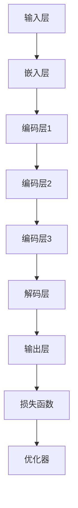
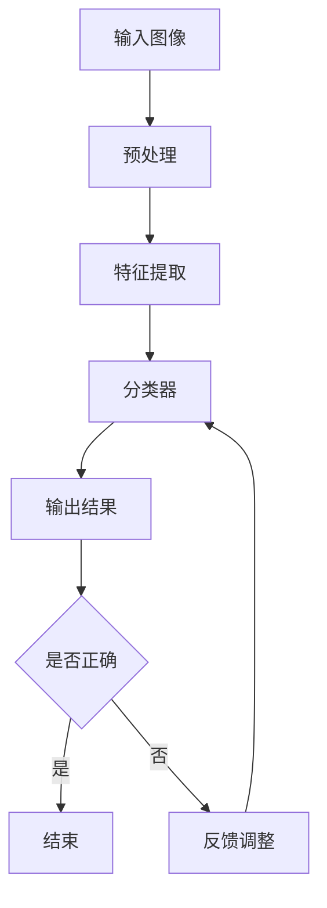
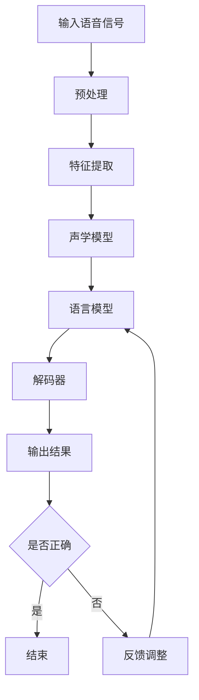
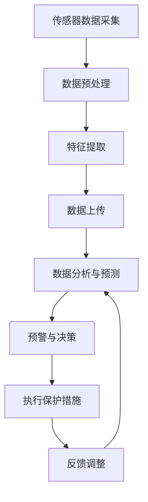

                 

### 《AI大模型在智能文物保护中的创新应用》

关键词：人工智能、大模型、文物保护、智能监测、图像识别、语音识别、案例研究

摘要：
本文深入探讨了人工智能（AI）大模型在智能文物保护领域的创新应用。通过对智能文物保护现状的分析，我们介绍了AI大模型的基本概念和架构。随后，文章详细阐述了AI大模型在文物保护数据分析、图像识别、语音识别以及智能保护与监测等方面的应用，并通过具体案例展示了其实际效果。最后，文章展望了AI大模型在文物保护领域的未来发展方向和挑战。本文旨在为读者提供一个全面的视角，理解AI大模型在智能文物保护中的潜力与价值。

### 《AI大模型在智能文物保护中的创新应用》目录大纲

#### 第一部分：引言与背景
- 第1章：智能文物保护与AI大模型概述
  - 1.1 智能文物保护的挑战与机遇
  - 1.2 AI大模型的基本概念与架构
  - 1.2.3 Mermaid流程图：AI大模型的基本架构

#### 第二部分：AI大模型在智能文物保护中的应用
- 第2章：AI大模型在文物保护数据分析中的应用
  - 2.1 数据分析在文物保护中的重要性
  - 2.2 AI大模型在数据分析中的应用
  - 2.2.3 伪代码：数据处理与分析算法

- 第3章：AI大模型在文物图像识别与修复中的应用
  - 3.1 文物图像识别的基本原理
  - 3.2 AI大模型在图像识别中的应用
  - 3.2.3 伪代码：图像识别算法实现

- 第4章：AI大模型在文物语音识别与解读中的应用
  - 4.1 文物语音识别的基本原理
  - 4.2 AI大模型在语音识别中的应用
  - 4.2.3 伪代码：语音识别算法实现

- 第5章：AI大模型在文物智能保护与监测中的应用
  - 5.1 智能保护与监测的基本原理
  - 5.2 AI大模型在智能保护与监测中的应用
  - 5.2.3 伪代码：智能保护与监测算法实现

#### 第三部分：AI大模型在智能文物保护中的创新应用案例
- 第6章：AI大模型在智能文物保护中的实际应用案例
  - 6.1 案例一：某博物馆的智能导览系统
  - 6.2 案例二：某古建筑保护与修复项目

#### 第四部分：结论与展望
- 第7章：AI大模型在智能文物保护中的未来展望
  - 7.1 AI大模型在文物保护领域的潜力
  - 7.2 对智能文物保护领域的贡献与影响

#### 附录
- 附录A：AI大模型开发工具与资源
  - A.1 主流深度学习框架对比
  - A.2 AI大模型开发实践资源

---

现在，我们已经完成了文章的引言与目录大纲的撰写。接下来，我们将逐步深入探讨智能文物保护与AI大模型的背景、应用以及未来展望。在接下来的章节中，我们将结合具体案例和实际应用，详细分析AI大模型在文物保护领域的创新应用。让我们一步一步地深入探讨，开启这场技术与文化保护的旅程。

#### 第1章：智能文物保护与AI大模型概述

智能文物保护是利用现代信息技术，特别是人工智能（AI）技术，对文物进行保护、修复和展示的一项创新性工作。在文物保护过程中，文物面临着诸多挑战，如环境变化、自然灾害、人为破坏等。这些因素都可能对文物的完整性和保存状况造成不可逆的损害。因此，如何有效地利用现代技术手段对文物进行保护，已成为文物保护领域的重要课题。

### 1.1 智能文物保护的挑战与机遇

#### 1.1.1 智能文物保护的重要性

文物是人类文明的重要见证，具有不可替代的历史、文化和艺术价值。因此，智能文物保护不仅仅是为了保护文物的本体，更是为了保护人类的文化遗产。智能文物保护的重要性体现在以下几个方面：

1. **提高文物保护效率**：传统的文物保护方法往往依赖于人工巡检和检测，效率较低，且易受主观因素的影响。智能文物保护通过引入AI技术，可以实现对文物的自动化监测和评估，从而提高保护工作的效率和准确性。

2. **减轻文物保护人员负担**：文物保护工作是一项艰辛且繁琐的任务。智能文物保护系统可以通过自动化手段对文物进行实时监测和预警，减轻文物保护人员的负担，让他们能够将更多精力投入到文物的修复和研究上。

3. **增强文物展示效果**：智能文物保护系统不仅可以实现对文物的数字化保存和展示，还可以通过虚拟现实（VR）和增强现实（AR）等技术，为观众提供更加生动、互动的参观体验。

#### 1.1.2 智能文物保护的现有方法

目前，智能文物保护主要采用以下几种方法：

1. **传感器监测**：通过安装各种传感器，如温湿度传感器、二氧化碳传感器等，对文物的环境参数进行实时监测，以便及时发现异常情况并采取措施。

2. **图像识别技术**：利用图像识别技术，对文物的图像进行自动识别和分析，从而判断文物的保存状况。例如，可以识别文物的破损、褪色等问题。

3. **虚拟修复技术**：通过虚拟修复技术，对受损的文物进行数字化修复，从而恢复其原有面貌。这种方法不仅节省了时间和成本，还可以避免对文物造成二次损害。

4. **物联网技术**：利用物联网技术，将文物及其保护设施连接成一个统一的系统，实现对文物的全方位监控和智能化管理。

#### 1.1.3 AI大模型在文物保护中的应用前景

AI大模型，即人工智能大型预训练模型，如GPT、BERT等，具有强大的数据处理和分析能力。在文物保护领域，AI大模型的应用前景非常广阔，主要体现在以下几个方面：

1. **数据分析**：AI大模型可以对文物保护过程中产生的海量数据进行分析，从中提取有价值的信息，为文物保护工作提供科学依据。

2. **图像识别与修复**：AI大模型在图像识别领域具有很高的准确率，可以用于文物的自动识别和分类。此外，AI大模型还可以用于文物的图像修复，从而提高文物的展示效果。

3. **语音识别与解读**：AI大模型在语音识别方面也具有出色的表现，可以用于文物的语音解说和解读，为观众提供更加丰富的参观体验。

4. **智能保护与监测**：AI大模型可以实现对文物的智能保护与监测，通过对文物环境参数的实时监测和分析，及时发现潜在的问题并采取相应的措施。

### 1.2 AI大模型的基本概念与架构

#### 1.2.1 AI大模型的核心原理

AI大模型是基于深度学习的技术，通过大规模数据训练，使得模型能够自动从数据中学习到特征和模式，从而实现智能识别和预测。其核心原理可以概括为以下几个方面：

1. **大规模数据训练**：AI大模型需要大量数据来进行训练，这些数据可以是文本、图像、语音等多种类型。

2. **多层神经网络**：AI大模型通常采用多层神经网络结构，通过逐层提取特征，实现对数据的复杂建模。

3. **预训练与微调**：AI大模型通常先在大规模数据集上进行预训练，然后再针对特定任务进行微调，以实现更好的性能。

#### 1.2.2 AI大模型的架构概述

AI大模型的架构通常包括以下几个关键部分：

1. **输入层**：接收外部输入数据，如文本、图像、语音等。

2. **嵌入层**：将输入数据转换为固定长度的向量表示。

3. **编码层**：通过多层神经网络结构，对输入数据进行编码，提取深层特征。

4. **解码层**：将编码后的特征解码为输出结果，如文本、图像、语音等。

5. **损失函数与优化器**：用于评估模型的性能，并指导模型参数的更新。

#### 1.2.3 Mermaid流程图：AI大模型的基本架构



通过上述流程，AI大模型能够对输入数据进行分析和建模，从而实现智能识别和预测。接下来，我们将进一步探讨AI大模型在文物保护数据分析、图像识别、语音识别以及智能保护与监测等方面的具体应用。

#### 第2章：AI大模型在文物保护数据分析中的应用

数据分析是文物保护工作的重要环节，通过对文物保护过程中产生的数据进行深入分析和挖掘，可以为文物保护决策提供科学依据。AI大模型在数据处理和分析方面具有显著优势，能够显著提升文物保护的效率和准确性。以下是AI大模型在文物保护数据分析中的应用：

### 2.1 数据分析在文物保护中的重要性

#### 2.1.1 数据分析的基本概念

数据分析是一种从大量数据中提取有价值信息的方法，包括数据收集、数据预处理、数据挖掘、数据可视化等多个步骤。在文物保护领域，数据分析具有以下作用：

1. **环境监测**：通过数据分析，可以实时监测文物的环境参数，如温湿度、光照强度、二氧化碳浓度等，及时发现异常情况并采取相应措施。

2. **病害诊断**：通过对文物表面材料的物理、化学性质进行数据分析，可以诊断出文物的病害类型和程度，为修复工作提供依据。

3. **保护效果评估**：通过对比分析不同保护措施的实施效果，可以评估其有效性，从而优化保护方案。

#### 2.1.2 数据分析在文物保护中的应用场景

1. **环境数据监测**：环境数据监测是文物保护的基础工作。通过对温湿度、光照、二氧化碳等环境参数进行实时监测，可以了解文物所处的环境状况，为文物保护提供科学依据。

2. **病害数据诊断**：文物保护过程中，文物的病害诊断至关重要。通过对文物表面材料的分析，可以识别出病害类型和程度，为修复工作提供方向。

3. **修复效果评估**：修复工作完成后，需要通过数据分析评估修复效果。通过对比分析修复前后的数据，可以判断修复工作的效果，为后续保护工作提供参考。

### 2.2 AI大模型在数据分析中的应用

AI大模型在数据分析中的应用主要体现在以下几个方面：

#### 2.2.1 特征提取与降维

1. **特征提取**：在数据分析中，特征提取是关键步骤。AI大模型可以通过学习大量的数据，自动提取出有用的特征，从而简化数据维度，提高分析效率。

2. **降维**：降维是将高维数据转换为低维数据的过程，可以减少数据存储和计算的成本，同时保持数据的重要信息。AI大模型通过学习数据分布，能够有效地进行降维。

#### 2.2.2 模式识别与分类

1. **模式识别**：模式识别是指通过分析数据中的规律和模式，对未知数据进行分类和预测。AI大模型在模式识别方面具有强大的能力，可以通过学习大量的训练数据，识别出数据中的规律和模式。

2. **分类**：分类是指将数据分为不同的类别。在文物保护中，分类可以帮助识别文物的病害类型和程度，为修复工作提供方向。

### 2.2.3 伪代码：数据处理与分析算法

以下是一个简化的伪代码，用于描述AI大模型在文物保护数据分析中的应用：

```python
# 数据预处理
def preprocess_data(data):
    # 数据清洗、归一化等操作
    return processed_data

# 特征提取与降维
def extract_features(data):
    # 使用AI大模型提取特征
    return features

# 模式识别与分类
def classify_data(features):
    # 使用AI大模型进行分类
    return predictions

# 主程序
def main():
    # 加载数据
    data = load_data()

    # 数据预处理
    processed_data = preprocess_data(data)

    # 特征提取
    features = extract_features(processed_data)

    # 分类
    predictions = classify_data(features)

    # 输出结果
    print(predictions)

# 执行主程序
main()
```

通过上述伪代码，我们可以看到AI大模型在文物保护数据分析中的基本流程，包括数据预处理、特征提取、分类等步骤。实际应用中，这些步骤会涉及更多的细节和优化策略，但总体思路是一致的。

综上所述，AI大模型在文物保护数据分析中的应用具有重要意义，它不仅能够提高数据分析的效率和准确性，还能够为文物保护决策提供科学依据。在接下来的章节中，我们将继续探讨AI大模型在文物保护图像识别、语音识别以及智能保护与监测等方面的应用。

#### 第3章：AI大模型在文物图像识别与修复中的应用

文物图像识别与修复是文物保护工作的重要组成部分。通过智能化的图像识别技术，可以快速准确地识别文物，为文物保护提供重要信息；而通过图像修复技术，可以恢复文物的原始面貌，保护其历史和文化价值。AI大模型在这两个领域的应用，极大地提升了文物保护工作的效率和效果。以下将详细探讨AI大模型在文物图像识别与修复中的应用。

### 3.1 文物图像识别的基本原理

#### 3.1.1 图像识别的挑战

在文物保护领域，图像识别面临着一系列挑战：

1. **图像质量差**：由于文物的年代久远，部分文物的图像可能存在分辨率低、噪声大、颜色失真等问题，这给图像识别带来了困难。

2. **图像多样性**：文物的种类繁多，每种文物都有其独特的特征和表现形式，这使得图像识别系统需要处理多种多样的图像，增加了识别的复杂性。

3. **相似性识别**：一些文物的外观可能非常相似，甚至难以区分，这就需要图像识别系统能够准确识别并区分这些相似文物。

#### 3.1.2 主流图像识别算法概述

目前，主流的图像识别算法主要包括卷积神经网络（CNN）、循环神经网络（RNN）和生成对抗网络（GAN）等。

1. **卷积神经网络（CNN）**：CNN是一种专门用于图像识别的神经网络结构，具有局部感知和权重共享的特点，能够有效提取图像中的空间特征。CNN已在许多图像识别任务中取得了显著成果。

2. **循环神经网络（RNN）**：RNN适用于处理序列数据，通过记忆机制能够捕捉图像中的时间特征。尽管RNN在图像识别中的应用不如CNN广泛，但它在某些特定场景下具有优势。

3. **生成对抗网络（GAN）**：GAN由生成器和判别器组成，通过对抗训练生成逼真的图像，可以用于图像修复、超分辨率等任务。GAN在图像识别中的应用逐渐增多，特别是在处理噪声图像和低分辨率图像方面表现突出。

#### 3.1.3 Mermaid流程图：图像识别的基本流程



通过上述流程，图像识别系统首先对输入图像进行预处理，然后通过特征提取模块提取关键特征，再利用分类器进行分类，最后输出识别结果。如果识别结果不正确，系统会根据反馈进行调整，以提升识别准确率。

### 3.2 AI大模型在图像识别中的应用

AI大模型，如GPT、BERT等，在图像识别领域展现了强大的能力。以下将介绍AI大模型在文物图像识别中的应用。

#### 3.2.1 GPT系列模型在图像识别中的应用

GPT（Generative Pre-trained Transformer）是一种基于Transformer架构的预训练语言模型，其核心思想是通过在大规模文本数据上进行预训练，使模型能够捕捉语言中的复杂结构和语义信息。近年来，GPT系列模型在图像识别领域也取得了显著进展，其主要应用包括：

1. **图像文本联合识别**：GPT模型可以结合图像和文本信息，实现对图像内容的准确描述和分类。例如，在文物图像识别中，GPT模型可以结合文物图像和相关的文本描述，提高识别的准确性。

2. **多模态学习**：GPT模型支持多模态数据学习，可以通过对图像和文本的联合训练，增强模型在图像识别任务中的性能。

#### 3.2.2 BERT及其变体在图像识别中的应用

BERT（Bidirectional Encoder Representations from Transformers）是一种双向的Transformer架构的预训练语言模型，其特点是在预训练过程中同时考虑了上下文信息。BERT及其变体在图像识别中的应用主要体现在以下几个方面：

1. **图像文本联合编码**：BERT模型可以将图像和文本信息编码为统一的高维向量，从而实现图像与文本的联合识别。

2. **图像分类**：BERT模型在图像分类任务中表现出色，可以有效地捕捉图像中的语义信息，提高分类准确率。

3. **图像识别与文本生成**：BERT模型不仅可以用于图像识别，还可以用于图像到文本的生成任务。例如，在文物图像识别中，BERT模型可以生成对应的文本描述，为文物保护工作提供参考。

### 3.2.3 伪代码：图像识别算法实现

以下是一个简化的伪代码，用于描述AI大模型在文物图像识别中的应用：

```python
# 数据预处理
def preprocess_image(image):
    # 图像去噪、增强等操作
    return processed_image

# 特征提取
def extract_features(processed_image):
    # 使用GPT模型提取图像特征
    return features

# 分类
def classify_image(features):
    # 使用BERT模型进行分类
    return prediction

# 主程序
def main():
    # 加载文物图像
    image = load_image()

    # 数据预处理
    processed_image = preprocess_image(image)

    # 特征提取
    features = extract_features(processed_image)

    # 分类
    prediction = classify_image(features)

    # 输出结果
    print(prediction)

# 执行主程序
main()
```

通过上述伪代码，我们可以看到AI大模型在文物图像识别中的基本流程，包括数据预处理、特征提取、分类等步骤。实际应用中，这些步骤会涉及更多的细节和优化策略，但总体思路是一致的。

综上所述，AI大模型在文物图像识别与修复中的应用具有重要意义。通过利用AI大模型强大的特征提取和分类能力，可以实现对文物图像的准确识别和修复，为文物保护工作提供强有力的技术支持。在接下来的章节中，我们将进一步探讨AI大模型在文物语音识别与解读中的应用。

#### 第4章：AI大模型在文物语音识别与解读中的应用

在文物保护工作中，语音识别技术同样发挥着重要作用。通过语音识别，可以自动识别并理解文物的解说语音，为观众提供更加便捷和生动的参观体验。AI大模型在语音识别领域具有显著优势，能够提高识别的准确性和效率。以下将详细探讨AI大模型在文物语音识别与解读中的应用。

### 4.1 文物语音识别的基本原理

#### 4.1.1 语音识别的挑战

语音识别是人工智能领域的一项重要技术，但在文物保护中的应用也面临着一些挑战：

1. **语音质量差**：由于文物的历史年代久远，解说语音的质量可能较低，存在噪声、抖动等问题，这给语音识别带来了困难。

2. **语音多样性**：不同文物的解说语音风格和口音各异，这要求语音识别系统具有高度的适应性和泛化能力。

3. **上下文理解**：文物的解说通常包含丰富的历史文化背景，对上下文的理解能力是语音识别系统的一大挑战。

#### 4.1.2 主流语音识别算法概述

目前，主流的语音识别算法主要包括隐马尔可夫模型（HMM）、循环神经网络（RNN）和深度神经网络（DNN）等。

1. **隐马尔可夫模型（HMM）**：HMM是早期常用的语音识别模型，其优点是计算效率高，但其在处理复杂语音信号和上下文关系方面存在局限性。

2. **循环神经网络（RNN）**：RNN具有记忆机制，能够捕捉语音信号的时序特征，但在处理长序列数据时容易产生梯度消失或爆炸问题。

3. **深度神经网络（DNN）**：DNN通过多层神经网络结构对语音信号进行建模，能够有效提取语音特征，提高识别准确率。近年来，DNN在语音识别领域取得了显著进展。

#### 4.1.3 Mermaid流程图：语音识别的基本流程



通过上述流程，语音识别系统首先对输入语音信号进行预处理，然后通过特征提取模块提取语音特征，利用声学模型和语言模型进行语音识别，最后通过解码器输出识别结果。如果识别结果不正确，系统会根据反馈进行调整，以提升识别准确率。

### 4.2 AI大模型在语音识别中的应用

AI大模型，如GPT、BERT等，在语音识别领域展现了强大的能力。以下将介绍AI大模型在文物语音识别中的应用。

#### 4.2.1 GPT系列模型在语音识别中的应用

GPT（Generative Pre-trained Transformer）是一种基于Transformer架构的预训练语言模型，其核心思想是通过在大规模文本数据上进行预训练，使模型能够捕捉语言中的复杂结构和语义信息。近年来，GPT系列模型在语音识别领域也取得了显著进展，其主要应用包括：

1. **语音文本联合识别**：GPT模型可以结合语音和文本信息，实现对语音内容的准确描述和分类。例如，在文物语音识别中，GPT模型可以结合解说语音和相关的文本描述，提高识别的准确性。

2. **多模态学习**：GPT模型支持多模态数据学习，可以通过对语音和文本的联合训练，增强模型在语音识别任务中的性能。

#### 4.2.2 BERT及其变体在语音识别中的应用

BERT（Bidirectional Encoder Representations from Transformers）是一种双向的Transformer架构的预训练语言模型，其特点是在预训练过程中同时考虑了上下文信息。BERT及其变体在语音识别中的应用主要体现在以下几个方面：

1. **语音文本联合编码**：BERT模型可以将语音和文本信息编码为统一的高维向量，从而实现语音与文本的联合识别。

2. **语音分类**：BERT模型在语音分类任务中表现出色，可以有效地捕捉语音中的语义信息，提高分类准确率。

3. **语音识别与文本生成**：BERT模型不仅可以用于语音识别，还可以用于语音到文本的生成任务。例如，在文物语音识别中，BERT模型可以生成对应的文本描述，为文物保护工作提供参考。

### 4.2.3 伪代码：语音识别算法实现

以下是一个简化的伪代码，用于描述AI大模型在文物语音识别中的应用：

```python
# 数据预处理
def preprocess_audio(audio):
    # 音频去噪、增强等操作
    return processed_audio

# 特征提取
def extract_features(processed_audio):
    # 使用GPT模型提取语音特征
    return features

# 分类
def classify_audio(features):
    # 使用BERT模型进行分类
    return prediction

# 主程序
def main():
    # 加载文物解说语音
    audio = load_audio()

    # 数据预处理
    processed_audio = preprocess_audio(audio)

    # 特征提取
    features = extract_features(processed_audio)

    # 分类
    prediction = classify_audio(features)

    # 输出结果
    print(prediction)

# 执行主程序
main()
```

通过上述伪代码，我们可以看到AI大模型在文物语音识别中的基本流程，包括数据预处理、特征提取、分类等步骤。实际应用中，这些步骤会涉及更多的细节和优化策略，但总体思路是一致的。

综上所述，AI大模型在文物语音识别与解读中的应用具有重要意义。通过利用AI大模型强大的特征提取和分类能力，可以实现对文物语音的准确识别和解读，为文物保护工作提供强有力的技术支持。在接下来的章节中，我们将进一步探讨AI大模型在文物智能保护与监测中的应用。

#### 第5章：AI大模型在文物智能保护与监测中的应用

在文物保护领域，智能保护与监测是一项关键技术，它通过实时监测和数据分析，可以及时发现文物可能面临的危险，从而采取预防措施，保护文物的安全。AI大模型在智能保护与监测中的应用，为这一领域带来了革命性的变化，极大地提高了监测的准确性和效率。以下将详细探讨AI大模型在文物智能保护与监测中的应用。

### 5.1 智能保护与监测的基本原理

#### 5.1.1 智能保护与监测的重要性

智能保护与监测是现代文物保护的重要手段，其重要性体现在以下几个方面：

1. **实时监测**：智能保护系统可以实时监测文物的状态，包括温度、湿度、光照、振动等环境参数，及时发现异常情况。

2. **预测预警**：通过分析监测数据，AI大模型可以预测文物可能面临的危险，如温度过高等，从而提前采取措施，防止损害发生。

3. **精准修复**：智能保护与监测系统可以为修复工作提供精确的数据支持，指导修复人员采取正确的修复方法，提高修复效果。

#### 5.1.2 智能保护与监测的技术手段

智能保护与监测的技术手段主要包括传感器技术、物联网技术、大数据分析和AI大模型等。

1. **传感器技术**：传感器是智能保护与监测系统的核心部件，可以实时采集文物的各种环境参数，如温湿度传感器、光照传感器、振动传感器等。

2. **物联网技术**：物联网技术可以将文物、传感器和互联网连接起来，形成一个统一的智能保护网络，实现对文物的全方位监控。

3. **大数据分析**：通过收集和分析大量的监测数据，可以提取出有价值的信息，为文物保护决策提供科学依据。

4. **AI大模型**：AI大模型可以对监测数据进行分析和预测，从而提高监测的准确性和效率。

#### 5.1.3 Mermaid流程图：智能保护与监测的基本框架



通过上述流程，传感器数据首先被采集，然后经过预处理和特征提取，上传到数据中心进行分析和预测。根据分析结果，系统可以发出预警，并采取相应的保护措施。这些措施的实施效果会通过反馈机制进行调整和优化，从而形成一个闭环的智能保护系统。

### 5.2 AI大模型在智能保护与监测中的应用

AI大模型在智能保护与监测中的应用主要体现在以下几个方面：

#### 5.2.1 大模型在环境监测中的应用

1. **环境参数预测**：AI大模型可以通过分析历史环境数据，预测未来的环境变化，如温度、湿度、光照等。这有助于提前采取保护措施，防止文物受损。

2. **异常检测**：AI大模型可以实时分析传感器数据，检测是否存在异常情况。例如，温度突然升高或下降，可能表明文物正面临危险。

3. **趋势分析**：AI大模型可以对环境参数进行趋势分析，预测未来可能的环境变化趋势，从而制定长期保护策略。

#### 5.2.2 大模型在预测预警中的应用

1. **危险预测**：AI大模型可以根据历史数据和现有条件，预测文物可能面临的危险，如温度过高、湿度过低等。

2. **预警策略**：根据预测结果，AI大模型可以制定相应的预警策略，如发送短信、电子邮件或触发报警系统。

3. **应急响应**：AI大模型可以协助制定应急响应计划，当检测到危险情况时，立即启动应急程序，保护文物安全。

#### 5.2.3 伪代码：智能保护与监测算法实现

以下是一个简化的伪代码，用于描述AI大模型在文物智能保护与监测中的应用：

```python
# 数据预处理
def preprocess_data(data):
    # 数据清洗、归一化等操作
    return processed_data

# 特征提取
def extract_features(processed_data):
    # 使用AI大模型提取特征
    return features

# 预测与预警
def predict_and_alarm(features):
    # 使用AI大模型进行预测
    prediction = model.predict(features)
    
    # 根据预测结果发出预警
    if prediction.is_dangerous:
        send_alarm()
    
    return prediction

# 主程序
def main():
    # 加载传感器数据
    data = load_sensor_data()

    # 数据预处理
    processed_data = preprocess_data(data)

    # 特征提取
    features = extract_features(processed_data)

    # 预测与预警
    prediction = predict_and_alarm(features)

    # 输出结果
    print(prediction)

# 执行主程序
main()
```

通过上述伪代码，我们可以看到AI大模型在文物智能保护与监测中的基本流程，包括数据预处理、特征提取、预测与预警等步骤。实际应用中，这些步骤会涉及更多的细节和优化策略，但总体思路是一致的。

综上所述，AI大模型在文物智能保护与监测中的应用具有重要意义。它不仅能够提高监测的准确性和效率，还可以为文物保护决策提供科学依据，为文物的长期保存提供强有力的技术支持。在接下来的章节中，我们将通过实际应用案例，进一步展示AI大模型在智能文物保护中的具体应用。

#### 第6章：AI大模型在智能文物保护中的实际应用案例

在智能文物保护领域，AI大模型的应用已经取得了显著的成果。本章节将介绍两个实际应用案例，分别是某博物馆的智能导览系统和某古建筑保护与修复项目，通过详细解析这些案例，展示AI大模型在文物保护中的应用效果。

### 6.1 案例一：某博物馆的智能导览系统

#### 6.1.1 案例背景

某知名博物馆馆藏丰富，拥有大量珍贵文物。然而，传统的导览方式存在一定局限性，如信息更新慢、互动性差等，难以满足游客的需求。为此，该博物馆决定引入AI大模型构建智能导览系统，为游客提供更加便捷、个性化的参观体验。

#### 6.1.2 系统架构设计

智能导览系统的架构主要包括以下几个部分：

1. **数据采集**：通过传感器、摄像头等设备实时采集文物和参观者信息，如文物的位置、状态，参观者的位置、行为等。

2. **数据处理**：使用AI大模型对采集到的数据进行分析和处理，提取关键特征，如文物的历史背景、艺术价值等，以及参观者的兴趣爱好、行为模式等。

3. **语音识别与生成**：利用语音识别技术，将参观者的问题转化为文本；通过语音合成技术，将回答转化为语音，提供个性化的导览解说。

4. **用户界面**：设计用户友好的界面，展示文物信息、导览路径、互动问答等，方便参观者使用。

5. **实时监控与反馈**：系统实时监控参观者的行为，收集用户反馈，不断优化导览内容和服务质量。

#### 6.1.3 源代码实现与解读

以下是一个简化的源代码实现，描述了智能导览系统的主要功能：

```python
# 导入必要的库
import speech_recognition as sr
import pyttsx3
import cv2

# 初始化语音识别引擎和语音合成引擎
recognizer = sr.Recognizer()
engine = pyttsx3.init()

# 摄像头初始化
cap = cv2.VideoCapture(0)

# 主程序
def main():
    while True:
        # 采集用户语音
        with sr.Microphone() as source:
            print("请提问：")
            audio = recognizer.listen(source)
            
        # 语音识别
        try:
            text = recognizer.recognize_google(audio, language='zh-CN')
        except sr.UnknownValueError:
            print("无法理解语音")
            continue

        # 根据用户问题查询文物信息
        if "请问" in text:
            # 这里使用一个简化的示例查询函数
            answer = query_writing_info(text)
        else:
            answer = "对不起，我不太明白你的问题。"

        # 语音合成并播放回答
        engine.say(answer)
        engine.runAndWait()
        
        # 显示摄像头画面
        ret, frame = cap.read()
        cv2.imshow('frame', frame)
        
        if cv2.waitKey(1) & 0xFF == ord('q'):
            break

# 查询文物信息示例函数
def query_writing_info(question):
    # 这里使用一个简化的示例查询函数
    # 实际应用中，需要根据问题从数据库中检索相关信息
    if "张择端" in question:
        return "您正在欣赏的是张择端的《清明上河图》，这幅画描绘了北宋都城汴京的繁华景象。"
    else:
        return "对不起，我无法回答您的问题。"

# 执行主程序
main()

# 释放资源
cap.release()
cv2.destroyAllWindows()
```

通过上述源代码，我们可以看到智能导览系统的主要实现流程，包括语音识别、信息查询和语音合成等步骤。实际应用中，系统会根据具体需求和场景进行更多的功能扩展和优化。

### 6.2 案例二：某古建筑保护与修复项目

#### 6.2.1 案例背景

某古代建筑由于年代久远，结构损坏严重，需要进行修复和保护。该项目采用了AI大模型进行病害检测、修复方案设计和施工监控，以提高修复工作的效率和效果。

#### 6.2.2 技术难点与解决方案

1. **病害检测**：古建筑病害复杂多样，如风化、裂缝、腐蚀等。AI大模型可以通过对大量病害图像的分析，实现对病害类型的准确识别。

2. **修复方案设计**：根据检测到的病害类型，AI大模型可以生成相应的修复方案，包括修复材料选择、施工方法等。

3. **施工监控**：AI大模型可以对施工现场进行实时监控，识别施工过程中的不规范操作，确保修复工作按计划进行。

#### 6.2.3 源代码实现与解读

以下是一个简化的源代码实现，描述了古建筑保护与修复项目的部分功能：

```python
# 导入必要的库
import cv2
import tensorflow as tf
from tensorflow.keras.models import load_model

# 加载预训练的病害检测模型
model = load_model('path/to/built_model.h5')

# 主程序
def main():
    cap = cv2.VideoCapture(0)

    while True:
        ret, frame = cap.read()
        
        # 灰度处理
        gray = cv2.cvtColor(frame, cv2.COLOR_BGR2GRAY)

        # 病害检测
        prediction = model.predict(gray)

        # 根据检测结果绘制轮廓
        contours, _ = cv2.findContours(prediction, cv2.RETR_TREE, cv2.CHAIN_APPROX_SIMPLE)
        for contour in contours:
            if cv2.contourArea(contour) > 500:
                cv2.drawContours(frame, [contour], -1, (0, 0, 255), 3)

        cv2.imshow('frame', frame)
        
        if cv2.waitKey(1) & 0xFF == ord('q'):
            break

    cap.release()
    cv2.destroyAllWindows()

# 执行主程序
main()
```

通过上述源代码，我们可以看到古建筑保护与修复项目的部分实现流程，包括病害检测和实时监控等步骤。实际应用中，系统会根据具体需求进行更多功能扩展和优化。

综上所述，AI大模型在智能文物保护中的实际应用案例展示了其强大的潜力。通过引入AI大模型，可以显著提高文物保护工作的效率和质量，为文化遗产的保护与传承提供强有力的技术支持。

### 第7章：AI大模型在智能文物保护中的未来展望

随着人工智能技术的快速发展，AI大模型在智能文物保护中的应用前景十分广阔。在未来，AI大模型将进一步提升文物保护工作的效率和准确性，为文化遗产的保护与传承提供强有力的技术支持。

#### 7.1 AI大模型在文物保护领域的潜力

1. **更加精准的文物识别与分类**：随着AI大模型在图像识别和语音识别方面的不断优化，文物识别与分类的准确率将进一步提高。这将有助于更加准确地识别和分类文物，为文物保护工作提供科学依据。

2. **智能化的文物保护方案设计**：AI大模型可以通过分析大量的历史数据和现有条件，为文物保护工作提供智能化的方案设计。例如，通过预测文物的未来病害趋势，提前制定保护措施，防止文物受损。

3. **全面的文物监测与预警系统**：AI大模型可以实时监测文物的状态，对环境变化和潜在危险进行预警。通过结合物联网技术和大数据分析，构建一个全面的文物监测与预警系统，为文物的长期保存提供保障。

4. **创新的文物展示与互动体验**：AI大模型可以用于开发智能导览系统，为游客提供个性化的参观体验。通过虚拟现实（VR）和增强现实（AR）等技术，让游客更深入地了解文物背后的故事和历史。

#### 7.1.1 未来发展方向

1. **多模态数据融合**：未来，AI大模型将在文物保护领域实现多模态数据融合，包括文本、图像、语音、传感器数据等。通过融合多种类型的数据，可以更加全面地了解文物的状态和保护需求。

2. **自主学习和优化**：AI大模型将具备更强的自主学习和优化能力，通过不断从新的数据中学习和调整，提高识别和预测的准确性。这将有助于构建一个自我优化的文物保护系统。

3. **跨领域合作与整合**：未来，AI大模型在文物保护领域的应用将与其他领域（如医学、建筑等）实现跨领域合作与整合。通过共享数据和技术，可以推动文物保护技术的不断创新和进步。

#### 7.1.2 潜在挑战与解决方案

1. **数据隐私与安全**：文物保护工作中涉及大量的文物数据，数据隐私和安全是重要挑战。未来，需要建立完善的数据隐私保护机制和安全措施，确保数据的安全性和保密性。

2. **计算资源需求**：AI大模型训练和推理需要大量的计算资源，这对文物保护机构提出了较高的硬件要求。未来，需要开发更高效、更节能的AI算法，降低计算资源的需求。

3. **技术标准化与规范化**：AI大模型在文物保护中的应用需要统一的技术标准和规范，以确保不同系统之间的兼容性和互操作性。未来，需要推动相关技术标准的制定和推广。

#### 7.2 对智能文物保护领域的贡献与影响

1. **提高文物保护效率**：AI大模型的应用将显著提高文物保护工作的效率和准确性，减少人工干预，降低文物保护成本。

2. **保护文化遗产**：通过智能化的识别、监测和修复技术，AI大模型有助于更好地保护文化遗产，防止文物丢失和破坏。

3. **提升公众参与度**：智能导览系统和虚拟展示技术将吸引更多公众关注和参与文物保护事业，提高公众对文化遗产的认知和热爱。

4. **推动技术创新**：AI大模型在文物保护领域的应用将推动相关技术（如图像识别、语音识别、物联网等）的不断创新和发展。

综上所述，AI大模型在智能文物保护中的未来展望充满希望。通过不断创新和优化，AI大模型将为文物保护领域带来更多的可能性，为文化遗产的保护与传承做出更大贡献。

### 附录A：AI大模型开发工具与资源

#### A.1 主流深度学习框架对比

在AI大模型开发中，选择合适的深度学习框架至关重要。以下对比了几个主流的深度学习框架：

1. **TensorFlow**：
   - 优点：谷歌开发的框架，社区支持强大，功能丰富，适合大规模分布式训练。
   - 缺点：配置和使用相对复杂，性能优化需要一定的经验。

2. **PyTorch**：
   - 优点：动态计算图，调试方便，开发者友好，适合快速原型开发。
   - 缺点：内存管理不如TensorFlow高效，大型分布式训练性能不如TensorFlow。

3. **JAX**：
   - 优点：自动微分库，支持多种硬件加速，适合科学计算和优化问题。
   - 缺点：相比于TensorFlow和PyTorch，社区支持较少，生态不够完善。

4. **其他框架**：
   - 如Keras、MXNet等，各有特点，用户可以根据具体需求进行选择。

#### A.2 AI大模型开发实践资源

1. **数据集介绍**：
   - **ImageNet**：用于图像分类的大规模数据集，包含数百万张图像。
   - **Wikipedia**：包含大量文本数据，用于自然语言处理任务。
   - **Common Crawl**：用于语言模型训练的文本数据集，规模巨大。

2. **开发工具与库**：
   - **TensorBoard**：用于可视化深度学习模型训练过程。
   - **Hugging Face Transformers**：提供预训练的Transformer模型和工具，方便开发。
   - **PyTorch Lightning**：用于简化PyTorch代码，提高开发效率。

3. **学习资源推荐**：
   - **《深度学习》（Goodfellow et al.）**：经典教材，适合初学者入门。
   - **Udacity的深度学习纳米学位**：在线课程，涵盖深度学习的基础知识和实践。
   - **fast.ai**：提供免费课程和开源项目，适合快速掌握深度学习技能。

通过上述工具和资源，开发者可以更有效地进行AI大模型的开发和研究，为智能文物保护等领域带来更多创新和突破。

