                 

# 第1章: AI大模型概述

## 1.1 AI大模型的定义与特点

### 1.1.1 AI大模型的定义
AI大模型（Large-scale AI Models）是指那些拥有巨大参数量、能够在多种任务中取得显著效果的深度学习模型。这些模型通常通过大规模数据预训练，然后再通过微调（Fine-tuning）适应特定任务。与传统的小型模型相比，AI大模型在处理复杂任务时具有更强的表现力和泛化能力。

### 1.1.2 AI大模型的特点
- **高参数量**：AI大模型的参数量通常在数十亿到数千亿之间，远超传统模型的规模。这些参数量使得模型能够捕捉到更加丰富的特征和模式。
- **强泛化能力**：AI大模型在多种任务上表现优异，具有强的泛化能力。这意味着模型不仅能够在训练数据上表现良好，也能在未见过的数据上取得较好的效果。
- **依赖大量数据**：训练AI大模型需要大量的数据来支持。这些数据不仅包括训练集，还可能包括验证集和测试集，以保证模型的泛化能力。
- **计算资源需求高**：AI大模型的训练和推理过程需要大量的计算资源，包括高性能的CPU、GPU和分布式计算集群等。
- **模型复杂度高**：AI大模型的结构通常较为复杂，包含多个层级和层。这使得模型能够处理更加复杂的数据和任务。

## 1.2 主流AI大模型简介

### 1.2.1 GPT系列模型
GPT（Generative Pre-trained Transformer）系列模型是由OpenAI开发的自然语言处理模型，具有极高的语言理解和生成能力。GPT-3是其最著名的版本，拥有1750亿个参数，是迄今为止参数量最大的自然语言处理模型。

#### Mermaid流程图：GPT系列模型发展历程
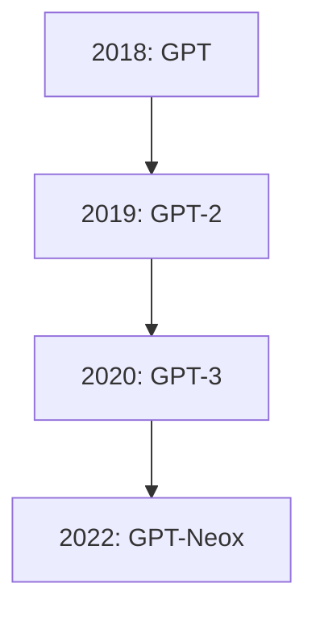

### 1.2.2 BERT及其变体
BERT（Bidirectional Encoder Representations from Transformers）是由Google开发的自然语言处理模型，主要用于文本分类和问答任务。BERT的成功促使了一系列变体的出现，如RoBERTa、ALBERT、DevBERT等，它们在性能和效率上有所改进。

#### Mermaid流程图：BERT及其变体
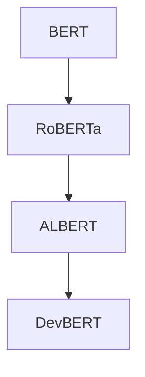

### 1.2.3 其他知名大模型介绍
除了GPT和BERT，还有诸如ViT（Vision Transformer）、DeePSC（Deep Private Stochastic Convolution）等大模型在计算机视觉和隐私保护等领域表现出色。ViT将Transformer结构应用于图像识别任务，取得了显著的效果。DeePSC则通过引入差分隐私技术，在保护用户隐私的同时，提升了模型的性能。

## 1.3 AI大模型发展历程

### 1.3.1 初期发展
AI大模型的概念最早可以追溯到2000年代初，当时神经网络的参数量还相对较小。随着GPU和深度学习技术的发展，2012年AlexNet的出现标志着深度学习在图像识别任务上取得了突破。AlexNet的成功激发了更多研究者对深度学习模型的探索。

### 1.3.2 快速发展
2017年，Google提出BERT模型，标志着AI大模型在自然语言处理领域的崛起。BERT通过双向编码表示，使得模型能够捕捉到文本中的全局信息，取得了显著的性能提升。随后，OpenAI的GPT系列模型也在自然语言处理领域取得了显著成果，推动了AI大模型的发展。

### 1.3.3 当前趋势
随着计算能力的提升和数据的积累，AI大模型的参数量不断增大，应用领域也从最初的图像识别、自然语言处理扩展到语音识别、推荐系统等。当前，AI大模型的研究和应用正在向更加复杂和多元化的方向发展，为人工智能领域带来了新的机遇和挑战。

## 1.4 AI大模型与分布式架构

### 1.4.1 分布式架构的重要性
分布式架构在AI大模型训练和推理过程中具有重要意义。由于AI大模型参数量和数据量的巨大，单机训练和推理往往需要消耗大量的时间和计算资源。分布式架构可以将这些任务分解为多个子任务，分布在不同计算节点上并行处理，从而显著提高效率和性能。

### 1.4.2 分布式训练
分布式训练是将AI大模型的训练任务分布在多个计算节点上，通过数据并行和模型并行等方式提高训练速度和降低训练成本。数据并行训练是将训练数据集划分为多个子集，每个计算节点独立处理子集，然后同步参数。模型并行训练则是将模型划分为多个子模型，每个计算节点独立训练子模型，然后同步参数。

### 1.4.3 分布式推理
分布式推理是将AI大模型的推理任务分布在多个计算节点上，通过并行处理提高推理速度和降低推理成本。分布式推理可以采用模型并行和流水线并行等方式。模型并行是将模型分布在多个计算节点上，每个节点负责处理不同的输入数据。流水线并行则是将推理任务分解为多个阶段，每个计算节点负责处理不同阶段的任务。

## 1.5 分布式计算框架

分布式计算框架是构建分布式系统的基础，常见的分布式计算框架包括Hadoop、Spark、TensorFlow Distribute等。

### 1.5.1 Hadoop
Hadoop是一个开源的分布式计算框架，由Apache Software Foundation维护。Hadoop主要包括两个核心组件：HDFS（Hadoop Distributed File System）和MapReduce。

- **HDFS**：Hadoop分布式文件系统，用于存储大规模数据。HDFS采用分布式存储架构，将数据划分为多个块（Block），并存储在不同的计算节点上。
- **MapReduce**：MapReduce是一种分布式数据处理模型，用于处理大规模数据集。MapReduce将数据处理任务划分为Map和Reduce两个阶段，分别由不同的计算节点执行。

### 1.5.2 Spark
Spark是一个开源的分布式计算框架，由Apache Software Foundation维护。Spark具有高速、灵活和易于使用等特点，广泛应用于数据处理、机器学习和数据分析等领域。

- **Spark Core**：Spark的核心组件，提供内存计算和分布式数据处理能力。Spark Core实现了RDD（Resilient Distributed Dataset）数据结构，支持数据的随机访问和操作。
- **Spark SQL**：Spark SQL提供了一个基于SQL的查询接口，用于处理结构化和半结构化数据。Spark SQL支持多种数据源，包括Hive、Parquet等。
- **Spark Streaming**：Spark Streaming提供了实时数据处理能力，可以处理来自各种数据源（如Kafka、Flume等）的实时数据流。

### 1.5.3 TensorFlow Distribute
TensorFlow Distribute是TensorFlow的分布式计算扩展，用于构建分布式TensorFlow模型。TensorFlow Distribute支持多种分布式策略，包括数据并行、模型并行和流水线并行等。

- **数据并行**：数据并行是将训练数据集划分为多个子集，每个计算节点独立处理子集，然后同步参数。
- **模型并行**：模型并行是将模型划分为多个子模型，每个计算节点独立训练子模型，然后同步参数。
- **流水线并行**：流水线并行是将推理任务分解为多个阶段，每个计算节点负责处理不同阶段的任务。

## 1.6 小结
本章对AI大模型进行了概述，包括其定义与特点、主流AI大模型简介、发展历程以及分布式架构的重要性。AI大模型具有高参数量、强泛化能力、依赖大量数据和计算资源需求高等特点。随着分布式计算技术的发展，分布式架构在AI大模型训练和推理过程中具有重要意义，常见的分布式计算框架包括Hadoop、Spark和TensorFlow Distribute等。这些框架为构建高效、可扩展的分布式AI系统提供了有力支持。

## 参考文献
1. Devlin, J., Chang, M. W., Lee, K., & Toutanova, K. (2018). BERT: Pre-training of deep bidirectional transformers for language understanding. arXiv preprint arXiv:1810.04805.
2. Brown, T., et al. (2020). Language models are few-shot learners. arXiv preprint arXiv:2005.14165.
3. Vaswani, A., et al. (2017). Attention is all you need. Advances in Neural Information Processing Systems, 30, 5998-6008.
4. Chen, Y., et al. (2018). BigGANs finish first: 3.6 billion parameters and 24 layers for high quality and efficient image synthesis. International Conference on Machine Learning, 80, 742-751.

---

作者：AI天才研究院/AI Genius Institute & 禅与计算机程序设计艺术 /Zen And The Art of Computer Programming

## 2.1 深度学习基础

### 2.1.1 神经网络的基本结构

神经网络（Neural Networks）是深度学习（Deep Learning）的基础，它由大量的节点（或称为神经元）组成，这些节点通过连接（或称为边）相互连接。每个节点都接收来自其他节点的输入，通过加权求和处理，最后通过一个非线性激活函数输出结果。

#### 神经网络的基本结构

一个简单的神经网络可以分为三个层次：输入层（Input Layer）、隐藏层（Hidden Layer）和输出层（Output Layer）。每个层次中的节点都按照顺序排列。

- **输入层**：接收外部输入数据，每个节点对应一个输入特征。
- **隐藏层**：对输入数据进行处理，通过加权求和处理和激活函数生成输出。隐藏层可以有多个，每增加一层，网络的复杂度和学习能力都会增加。
- **输出层**：输出网络的最终结果，通常是分类结果或预测值。

#### Mermaid流程图：神经网络基本结构

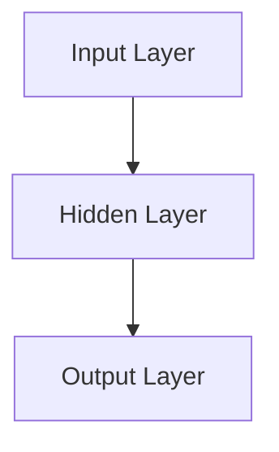

### 2.1.2 常见的深度学习架构

深度学习架构不断进化，目前有几种主要的架构，包括卷积神经网络（CNN）、循环神经网络（RNN）和Transformer。

- **卷积神经网络（CNN）**：CNN主要用于图像处理和计算机视觉任务。它通过卷积层（Convolutional Layer）、池化层（Pooling Layer）和全连接层（Fully Connected Layer）等结构提取图像特征。

  #### Mermaid流程图：CNN基本结构

  ```mermaid
  graph TD
      A[Input]
      B[Convolution Layer]
      C[Pooling Layer]
      D[Flatten]
      E[Fully Connected Layer]
      F[Output]
      
      A --> B --> C --> D --> E --> F
  ```

- **循环神经网络（RNN）**：RNN主要用于序列数据处理，如自然语言处理和时间序列预测。它通过循环结构保持对历史信息的记忆，从而处理序列数据。

  #### Mermaid流程图：RNN基本结构

  ```mermaid
  graph TD
      A[Input]
      B[Hidden State]
      C[Output]
      
      A --> B
      B --> C
  ```

- **Transformer**：Transformer是一种基于自注意力机制（Self-Attention Mechanism）的架构，广泛用于自然语言处理任务。它通过多头注意力（Multi-head Attention）和前馈神经网络（Feedforward Neural Network）等结构对输入序列进行编码和解码。

  #### Mermaid流程图：Transformer基本结构

  ```mermaid
  graph TD
      A[Input]
      B[Embedding]
      C[Multi-head Attention]
      D[Feedforward Neural Network]
      E[Output]
      
      A --> B
      B --> C
      C --> D
      D --> E
  ```

### 2.1.3 深度学习优化算法

深度学习模型的训练过程通常需要优化算法来调整模型参数，以最小化损失函数。常见的优化算法有随机梯度下降（SGD）、Adam、RMSprop等。

#### 随机梯度下降（SGD）

随机梯度下降是最简单的优化算法之一，它通过随机选取一部分样本计算梯度，并沿着梯度方向更新模型参数。

```python
# 伪代码：随机梯度下降（SGD）
for epoch in range(num_epochs):
    for batch in batches:
        gradients = compute_gradients(model, batch)
        model.update_params(gradients, learning_rate)
```

#### Adam优化器

Adam是一种结合了SGD和动量法的优化算法，它通过计算一阶矩估计（均值）和二阶矩估计（方差）来更新模型参数。

```python
# 伪代码：Adam优化器
def adam_optimizer(model, gradients, learning_rate, beta1, beta2, epsilon):
    t = 0
    m = 0
    v = 0
    
    for param, grad in zip(model.parameters(), gradients):
        if param._use_adam:
            t += 1
            m = beta1 * m + (1 - beta1) * grad
            v = beta2 * v + (1 - beta2) * (grad ** 2)
            m_hat = m / (1 - beta1 ** t)
            v_hat = v / (1 - beta2 ** t)
            param._grad = grad - learning_rate * m_hat / (np.sqrt(v_hat) + epsilon)
```

### 2.1.4 深度学习中的正则化方法

在深度学习中，正则化方法用于防止模型过拟合，提高模型的泛化能力。常见的正则化方法包括L1正则化、L2正则化和Dropout。

- **L1正则化**：在损失函数中添加L1范数，即权重绝对值的和。
  ```python
  def l1_regularization_loss(model, lambda_):
      regularization_loss = 0
      for param in model.parameters():
          regularization_loss += lambda_ * np.sum(np.abs(param))
      return regularization_loss
  ```

- **L2正则化**：在损失函数中添加L2范数，即权重平方的和。
  ```python
  def l2_regularization_loss(model, lambda_):
      regularization_loss = 0
      for param in model.parameters():
          regularization_loss += lambda_ * np.sum(np.square(param))
      return regularization_loss
  ```

- **Dropout**：在训练过程中随机丢弃一部分神经元，以防止模型对特定输入过于敏感。
  ```python
  def dropout(model, dropout_rate):
      for layer in model.layers:
          if isinstance(layer, DropoutLayer):
              layer.enabled = True
      # ...训练模型...
      for layer in model.layers:
          if isinstance(layer, DropoutLayer):
              layer.enabled = False
  ```

## 2.2 计算机视觉基础

### 2.2.1 卷积神经网络

卷积神经网络（Convolutional Neural Network，CNN）是计算机视觉领域最常用的深度学习模型之一。它通过卷积层、池化层和全连接层等结构提取图像特征，实现对图像的分类、检测和分割等任务。

#### 卷积神经网络的工作原理

1. **卷积层**：卷积层通过卷积操作提取图像特征。卷积核（Convolutional Kernel）是一个小的矩阵，它滑动在输入图像上，并与图像的局部区域进行卷积操作，生成特征图（Feature Map）。

2. **激活函数**：为了引入非线性特性，卷积层后通常接一个激活函数，如ReLU（Rectified Linear Unit）。

3. **池化层**：池化层（Pooling Layer）用于减小特征图的尺寸，减少计算量和参数数量。常见的池化操作有最大池化（Max Pooling）和平均池化（Average Pooling）。

4. **全连接层**：在网络的最后，通过全连接层将高维特征图映射到输出类别。

#### Mermaid流程图：CNN基本结构

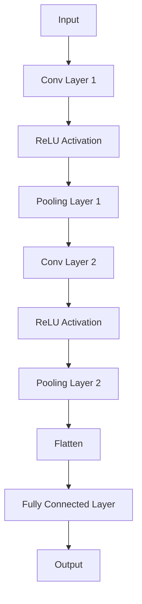

### 2.2.2 卷积神经网络的训练过程

卷积神经网络的训练过程主要包括以下步骤：

1. **数据预处理**：对图像数据进行归一化、随机裁剪、翻转等预处理操作，增加模型的泛化能力。
2. **前向传播**：将预处理后的图像输入到网络中，通过卷积层、激活函数和池化层等结构进行特征提取，最后通过全连接层得到预测结果。
3. **计算损失**：计算预测结果与真实标签之间的损失，常用的损失函数有交叉熵（Cross-Entropy Loss）和均方误差（Mean Squared Error Loss）。
4. **反向传播**：通过反向传播算法计算梯度，并更新网络参数。
5. **优化器选择**：选择合适的优化器（如SGD、Adam等）来更新参数，以最小化损失函数。
6. **模型评估**：在验证集上评估模型的性能，调整模型参数，防止过拟合。

### 2.2.3 卷积神经网络的核心算法

卷积神经网络的核心算法包括卷积操作、激活函数、池化操作和反向传播。

#### 卷积操作

卷积操作是卷积神经网络的核心，通过卷积核在输入图像上滑动，对局部区域进行卷积运算，生成特征图。卷积操作的伪代码如下：

```python
# 伪代码：卷积操作
def conv2d(input_image, kernel):
    output = np.zeros_like(input_image)
    for i in range(input_image.shape[0] - kernel.shape[0] + 1):
        for j in range(input_image.shape[1] - kernel.shape[1] + 1):
            output[i, j] = np.sum(input_image[i:i+kernel.shape[0], j:j+kernel.shape[1]] * kernel)
    return output
```

#### 激活函数

激活函数是卷积神经网络中引入非线性特性的关键，常用的激活函数有ReLU、Sigmoid和Tanh等。ReLU是最常用的激活函数，它可以加速模型的训练过程，避免梯度消失问题。

```python
# 伪代码：ReLU激活函数
def relu(x):
    return max(0, x)
```

#### 池化操作

池化操作用于减少特征图的尺寸，减小模型的参数数量。最大池化（Max Pooling）和平均池化（Average Pooling）是最常见的两种池化操作。

```python
# 伪代码：最大池化
def max_pooling(feature_map, pool_size):
    output = np.zeros_like(feature_map)
    for i in range(feature_map.shape[0] // pool_size):
        for j in range(feature_map.shape[1] // pool_size):
            output[i, j] = np.max(feature_map[i*pool_size:i*pool_size+pool_size, j*pool_size:j*pool_size+pool_size])
    return output

# 伪代码：平均池化
def average_pooling(feature_map, pool_size):
    output = np.zeros_like(feature_map)
    for i in range(feature_map.shape[0] // pool_size):
        for j in range(feature_map.shape[1] // pool_size):
            output[i, j] = np.mean(feature_map[i*pool_size:i*pool_size+pool_size, j*pool_size:j*pool_size+pool_size])
    return output
```

#### 反向传播

反向传播是训练神经网络的重要算法，它通过前向传播计算预测结果，然后反向计算损失函数关于模型参数的梯度，并更新模型参数。

```python
# 伪代码：反向传播
def backward_propagation(model, loss_function, learning_rate):
    for layer in model.layers:
        if layer.type == 'conv':
            # 计算卷积层的梯度
            grad_kernel = compute_conv2d_grad(model, layer, input_image, loss)
            grad_bias = compute_bias_grad(model, layer, loss)
            # 更新卷积层的参数
            layer.kernel -= learning_rate * grad_kernel
            layer.bias -= learning_rate * grad_bias
        elif layer.type == 'fc':
            # 计算全连接层的梯度
            grad_weights = compute_matrix_grad(model, layer, loss, prev_layer_output)
            grad_bias = compute_bias_grad(model, layer, loss)
            # 更新全连接层的参数
            layer.weights -= learning_rate * grad_weights
            layer.bias -= learning_rate * grad_bias
```

## 2.3 自然语言处理基础

### 2.3.1 词嵌入

词嵌入（Word Embedding）是将词汇映射到高维空间中，使得在空间中相似词汇的向量距离较小。词嵌入是自然语言处理（Natural Language Processing，NLP）中的重要技术，能够帮助神经网络更好地理解和处理文本数据。

#### 词嵌入的基本原理

词嵌入通过学习词汇的上下文信息来生成词向量。常见的词嵌入方法包括Word2Vec、GloVe和BERT等。

1. **Word2Vec**：Word2Vec是一种基于神经网络的词嵌入方法，它通过训练神经网络将词汇映射到低维向量空间。Word2Vec有两种训练方式：连续词袋（Continuous Bag of Words，CBOW）和跳字模型（Skip-Gram）。

   - **CBOW**：CBOW模型通过预测中心词周围多个词的上下文来训练词向量。
   - **Skip-Gram**：Skip-Gram模型通过预测中心词来训练词向量。

2. **GloVe**：GloVe（Global Vectors for Word Representation）是一种基于全局统计的词嵌入方法，它通过计算词汇共现矩阵的因子分解来生成词向量。

3. **BERT**：BERT（Bidirectional Encoder Representations from Transformers）是一种基于Transformer的预训练语言模型，它通过双向编码表示学习词汇的上下文信息。

#### 词嵌入的优化方法

为了提高词嵌入的效果，可以使用以下方法：

- **权重共享**：不同词汇的词向量共享权重，减少参数数量。
- **词向量规范化**：通过归一化词向量，使其具有相同的长度，提高向量空间中的相似性度量。
- **负采样**：在训练过程中，对正样本和负样本进行采样，提高模型的鲁棒性。

### 2.3.2 循环神经网络

循环神经网络（Recurrent Neural Network，RNN）是一种能够处理序列数据的神经网络，它通过循环结构保持对历史信息的记忆。RNN在自然语言处理、语音识别和时间序列预测等领域取得了显著的成果。

#### RNN的工作原理

1. **输入层**：输入层接收序列数据，每个时间步的输入是一个向量。
2. **隐藏层**：隐藏层通过循环结构连接，每个时间步的输出是一个隐藏状态向量。
3. **输出层**：输出层生成预测结果或目标值。

RNN的核心是隐藏状态，它保存了历史信息，用于当前时间步的预测。

#### Mermaid流程图：RNN基本结构

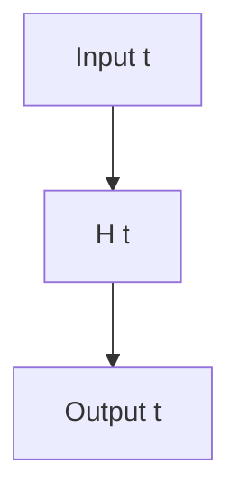

#### RNN的优化方法

RNN在处理长序列数据时容易遇到梯度消失和梯度爆炸问题。为了解决这些问题，可以采用以下方法：

- **长短期记忆网络（Long Short-Term Memory，LSTM）**：LSTM通过引入记忆单元和门控机制，有效地解决了梯度消失和梯度爆炸问题，提高了模型的长期记忆能力。
- **门控循环单元（Gated Recurrent Unit，GRU）**：GRU是一种简化版的LSTM，通过门控机制和更新规则提高了模型的训练速度和效果。
- **注意力机制**：注意力机制通过学习权重来调整不同时间步的重要性，提高了模型对序列数据的处理能力。

### 2.3.3 Transformer

Transformer是一种基于自注意力机制（Self-Attention Mechanism）的深度学习模型，它在自然语言处理任务中取得了显著的成果。Transformer通过多头注意力机制和前馈神经网络，对输入序列进行编码和解码。

#### Transformer的工作原理

1. **编码器**：编码器（Encoder）通过多层自注意力机制和前馈神经网络，将输入序列编码为上下文向量。
2. **解码器**：解码器（Decoder）通过多层自注意力机制、编码器-解码器注意力机制和前馈神经网络，生成输出序列。

#### Mermaid流程图：Transformer基本结构

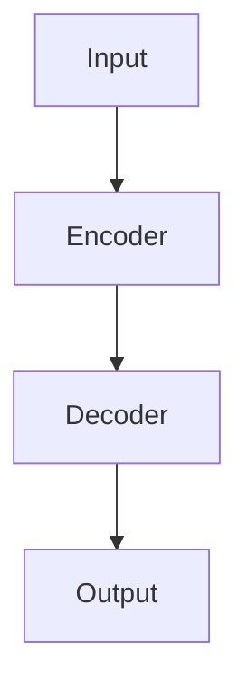

#### Transformer的优势

- **并行计算**：Transformer采用自注意力机制，可以在输入序列未知的情况下并行计算，提高了计算效率。
- **长距离依赖**：Transformer通过多头注意力机制，能够捕捉到输入序列中的长距离依赖关系，提高了模型的表达能力。
- **灵活性**：Transformer结构简单，易于扩展和修改，可以应用于各种自然语言处理任务。

## 2.4 自然语言处理中的核心算法

自然语言处理中的核心算法包括序列标注、文本分类和机器翻译等。这些算法通过深度学习模型对文本数据进行处理和生成。

### 2.4.1 序列标注

序列标注（Sequence Labeling）是一种将序列数据（如单词、字符或词组）分类为多个标签的任务，常见的序列标注任务包括命名实体识别（Named Entity Recognition，NER）和词性标注（Part-of-Speech Tagging）。

#### 序列标注的基本原理

序列标注通过训练深度学习模型，将输入序列的每个词或字符标注为相应的标签。常见的模型包括CRF（Conditional Random Field）和RNN、LSTM等。

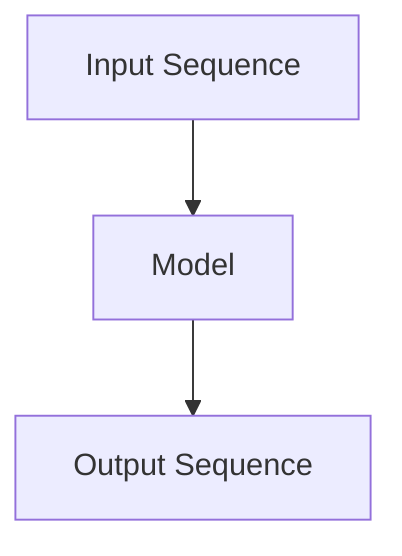

#### CRF模型

CRF是一种基于概率的序列标注模型，它通过条件概率来预测每个词或字符的标签。

```python
# 伪代码：CRF模型
def viterbi_decode(sequence, transition_probs, emission_probs):
    # 初始化Viterbi路径
    viterbi_path = [[0] * num_tags for _ in range(len(sequence) + 1)]
    backpointers = [[None] * num_tags for _ in range(len(sequence) + 1)]
    
    # 初始化第一个时间步的概率
    for tag in range(num_tags):
        viterbi_path[0][tag] = emission_probs[sequence[0], tag]
        backpointers[0][tag] = 0
    
    # 计算每个时间步的概率
    for t in range(1, len(sequence) + 1):
        for tag in range(num_tags):
            max_prob = -float('inf')
            for prev_tag in range(num_tags):
                prob = transition_probs[prev_tag, tag] * emission_probs[sequence[t], tag]
                if prob > max_prob:
                    max_prob = prob
                    backpointers[t][tag] = prev_tag
            
            viterbi_path[t][tag] = max_prob
    
    # 回溯得到最优路径
    prev_tag = np.argmax(viterbi_path[-1])
    path = [prev_tag]
    for t in range(len(sequence), 0, -1):
        prev_tag = backpointers[t][prev_tag]
        path.append(prev_tag)
    
    return path[::-1]
```

### 2.4.2 文本分类

文本分类（Text Classification）是一种将文本数据分类为多个类别或标签的任务，常见的文本分类任务包括垃圾邮件检测、情感分析和主题分类等。

#### 文本分类的基本原理

文本分类通过训练深度学习模型，将输入文本映射到相应的类别或标签。常见的模型包括朴素贝叶斯、支持向量机和深度学习模型（如卷积神经网络、循环神经网络和Transformer）。

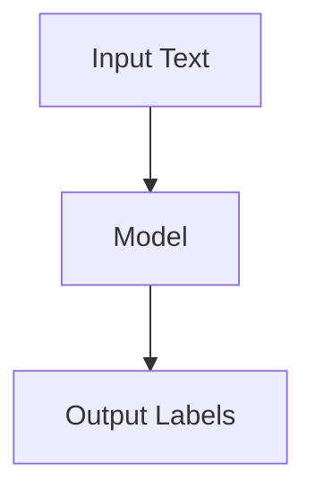

#### 卷积神经网络文本分类

卷积神经网络（CNN）通过卷积层和池化层提取文本特征，然后通过全连接层进行分类。

```python
# 伪代码：卷积神经网络文本分类
def conv_text_classification(text, model):
    # 预处理文本数据
    processed_text = preprocess_text(text)
    
    # 通过卷积神经网络提取特征
    feature_map = model.conv_layers(processed_text)
    
    # 通过池化层减小特征图的尺寸
    pooled_feature_map = model.pooling_layer(feature_map)
    
    # 通过全连接层得到分类结果
    logits = model.fc_layer(pooled_feature_map)
    
    # 通过softmax函数得到概率分布
    probabilities = softmax(logits)
    
    # 选择概率最大的类别作为预测结果
    predicted_label = np.argmax(probabilities)
    
    return predicted_label
```

### 2.4.3 机器翻译

机器翻译（Machine Translation）是一种将一种语言的文本自动翻译成另一种语言的任务。深度学习模型，特别是基于Transformer的模型，在机器翻译任务中取得了显著的成果。

#### 机器翻译的基本原理

机器翻译通过训练编码器-解码器模型，将输入文本编码为上下文向量，然后解码为输出文本。常见的模型包括Seq2Seq模型、注意力机制和BERT等。

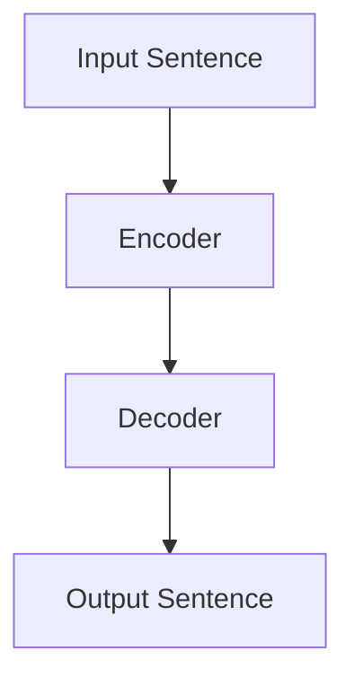

#### Seq2Seq模型

Seq2Seq模型通过编码器将输入序列编码为上下文向量，然后通过解码器生成输出序列。

```python
# 伪代码：Seq2Seq模型
def seq2seq_translation(input_sentence, encoder, decoder, vocab):
    # 通过编码器编码输入序列
    encoded_sentence = encoder(input_sentence)
    
    # 初始化解码器输入
    decoder_input = np.zeros((1, vocab.size()))
    decoder_input[0, vocab('<start>')] = 1
    
    # 通过解码器生成输出序列
    output_sequence = []
    for _ in range(max_output_length):
        logits = decoder(decoder_input)
        predicted_word = np.argmax(logits)
        output_sequence.append(predicted_word)
        
        # 更新解码器输入
        decoder_input = np.zeros((1, vocab.size()))
        decoder_input[0, predicted_word] = 1
    
    return output_sequence
```

### 2.4.4 自然语言处理中的其他核心算法

除了上述核心算法，自然语言处理中还有许多其他重要的算法和技术，如注意力机制、BERT和语言模型等。

- **注意力机制**：注意力机制通过学习权重来调整不同时间步的重要性，提高了模型对序列数据的处理能力。常见的注意力机制包括自注意力（Self-Attention）和编码器-解码器注意力（Encoder-Decoder Attention）。
- **BERT**：BERT是一种基于Transformer的预训练语言模型，通过双向编码表示学习词汇的上下文信息。BERT在自然语言处理任务中取得了显著的成果。
- **语言模型**：语言模型是一种用于预测下一个词汇的概率分布的模型，常见的语言模型包括n-gram模型、神经网络语言模型和Transformer语言模型。

## 参考文献
1. Mikolov, T., Sutskever, I., Chen, K., Corrado, G. S., & Dean, J. (2013). Distributed representations of words and phrases and their compositionality. Advances in Neural Information Processing Systems, 26, 3111-3119.
2. Hochreiter, S., & Schmidhuber, J. (1997). Long short-term memory. Neural Computation, 9(8), 1735-1780.
3. Bahdanau, D., Cho, K., & Bengio, Y. (2014). Neural machine translation by jointly learning to align and translate. Advances in Neural Information Processing Systems, 27, 27-35.
4. Vaswani, A., et al. (2017). Attention is all you need. Advances in Neural Information Processing Systems, 30, 5998-6008.
5. Devlin, J., Chang, M. W., Lee, K., & Toutanova, K. (2018). BERT: Pre-training of deep bidirectional transformers for language understanding. arXiv preprint arXiv:1810.04805.

---

作者：AI天才研究院/AI Genius Institute & 禅与计算机程序设计艺术 /Zen And The Art of Computer Programming

## 3.1 计算机视觉模型架构

计算机视觉模型架构是指用于处理图像和视频数据，实现目标检测、图像分类、图像分割等任务的深度学习模型结构。计算机视觉模型架构的核心是卷积神经网络（Convolutional Neural Network，CNN），它通过卷积层、池化层和全连接层等结构提取图像特征，从而实现对图像的复杂处理。

### 3.1.1 卷积神经网络（CNN）

卷积神经网络（CNN）是一种专门用于处理图像数据的深度学习模型。它通过卷积层、池化层和全连接层等结构提取图像特征，从而实现图像分类、目标检测和图像分割等任务。

- **卷积层（Convolutional Layer）**：卷积层是CNN的核心部分，它通过卷积操作提取图像的特征。卷积操作是将卷积核（Convolutional Kernel）与图像的局部区域进行卷积，生成特征图（Feature Map）。卷积核是一个小的矩阵，它滑动在输入图像上，并与图像的局部区域进行卷积运算，从而提取出特征。

  ```mermaid
  graph TD
      A[Input Image]
      B[Convolutional Layer]
      C[Feature Map]
      
      A --> B
      B --> C
  ```

- **激活函数（Activation Function）**：为了引入非线性特性，卷积层后通常会接一个激活函数，如ReLU（Rectified Linear Unit）。ReLU函数可以将负值映射为0，从而避免梯度消失问题，提高模型的训练速度。

  ```mermaid
  graph TD
      A[Input]
      B[ReLU Activation]
      C[Output]
      
      A --> B
      B --> C
  ```

- **池化层（Pooling Layer）**：池化层用于减小特征图的尺寸，减少计算量和参数数量。常见的池化操作有最大池化（Max Pooling）和平均池化（Average Pooling）。最大池化选择特征图中最大的值，而平均池化则计算特征图中小块的平均值。

  ```mermaid
  graph TD
      A[Feature Map]
      B[Pooling Layer]
      C[Reduced Feature Map]
      
      A --> B
      B --> C
  ```

- **全连接层（Fully Connected Layer）**：在CNN的最后，通常会接一个全连接层，将高维特征图映射到输出类别。全连接层通过计算特征图的每个元素与权重矩阵的点积，加上偏置项，通过激活函数得到最终输出。

  ```mermaid
  graph TD
      A[Feature Map]
      B[Flatten]
      C[Fully Connected Layer]
      D[Output]
      
      A --> B
      B --> C
      C --> D
  ```

### 3.1.2 卷积神经网络的层次结构

卷积神经网络通常由多个卷积层、池化层和全连接层组成，形成一个层次结构。每个卷积层和池化层负责提取不同层次的特征，逐步构建起对图像的复杂理解。

- **卷积层**：卷积层通过卷积操作提取图像的特征，每个卷积层可以学习到不同的特征模式。卷积层通常包含多个卷积核，每个卷积核可以提取图像的不同特征。

- **池化层**：池化层用于减小特征图的尺寸，减少参数数量，提高模型的泛化能力。池化层通常位于卷积层之后，用于降低特征图的分辨率。

- **全连接层**：全连接层将高维特征图映射到输出类别，通过计算特征图的每个元素与权重矩阵的点积，加上偏置项，通过激活函数得到最终输出。

- **分类器**：在CNN的最后一层通常是一个全连接层，用于对图像进行分类。分类器的输出是一个概率分布，表示图像属于每个类别的概率。

### 3.1.3 卷积神经网络的应用

卷积神经网络在计算机视觉领域有广泛的应用，包括图像分类、目标检测、图像分割和视频分析等。

- **图像分类**：图像分类是将图像映射到预定义的类别标签。常见的图像分类任务包括图像识别和物体分类。

- **目标检测**：目标检测是在图像中检测并定位预定义的物体。常见的目标检测算法包括SSD、YOLO和Faster R-CNN等。

- **图像分割**：图像分割是将图像分割为不同的区域，每个区域对应一个类别。常见的图像分割算法包括FCN和U-Net等。

- **视频分析**：视频分析是通过对连续视频帧进行处理，实现目标跟踪、动作识别和场景分割等任务。

### 3.1.4 卷积神经网络的优化

卷积神经网络的优化是通过调整模型参数，使模型在训练数据上表现更好。常见的优化方法包括随机梯度下降（SGD）、Adam优化器和学习率调整等。

- **随机梯度下降（SGD）**：随机梯度下降是最简单的优化算法，它通过随机选择一部分样本计算梯度，并沿着梯度方向更新模型参数。

- **Adam优化器**：Adam优化器是一种结合了SGD和动量法的优化算法，它通过计算一阶矩估计（均值）和二阶矩估计（方差）来更新模型参数。

- **学习率调整**：学习率调整是优化过程中调整学习率，使模型在训练过程中收敛。常见的学习率调整方法包括固定学习率、学习率衰减和自适应学习率调整等。

### 3.1.5 卷积神经网络的训练过程

卷积神经网络的训练过程主要包括以下步骤：

1. **数据预处理**：对图像数据进行归一化、随机裁剪和翻转等预处理操作，增加模型的泛化能力。

2. **前向传播**：将预处理后的图像输入到网络中，通过卷积层、激活函数和池化层等结构进行特征提取，最后通过全连接层得到预测结果。

3. **计算损失**：计算预测结果与真实标签之间的损失，常用的损失函数有交叉熵（Cross-Entropy Loss）和均方误差（Mean Squared Error Loss）。

4. **反向传播**：通过反向传播算法计算梯度，并更新模型参数。

5. **模型评估**：在验证集上评估模型的性能，调整模型参数，防止过拟合。

6. **模型优化**：通过优化算法调整模型参数，使模型在测试集上表现更好。

## 3.2 自然语言处理模型架构

自然语言处理（Natural Language Processing，NLP）模型架构是用于处理文本数据，实现文本分类、命名实体识别、机器翻译等任务的深度学习模型结构。自然语言处理模型架构的核心是循环神经网络（Recurrent Neural Network，RNN）和Transformer，它们通过编码和解码文本数据，实现复杂的文本处理任务。

### 3.2.1 循环神经网络（RNN）

循环神经网络（RNN）是一种能够处理序列数据的深度学习模型，它通过循环结构保持对历史信息的记忆。RNN在自然语言处理任务中取得了显著的成果，包括文本分类、情感分析和机器翻译等。

#### RNN的工作原理

1. **输入层**：输入层接收序列数据，每个时间步的输入是一个向量。

2. **隐藏层**：隐藏层通过循环结构连接，每个时间步的输出是一个隐藏状态向量。

3. **输出层**：输出层生成预测结果或目标值。

RNN的核心是隐藏状态，它保存了历史信息，用于当前时间步的预测。

#### Mermaid流程图：RNN基本结构


#### RNN的优化方法

RNN在处理长序列数据时容易遇到梯度消失和梯度爆炸问题。为了解决这些问题，可以采用以下方法：

- **长短期记忆网络（Long Short-Term Memory，LSTM）**：LSTM通过引入记忆单元和门控机制，有效地解决了梯度消失和梯度爆炸问题，提高了模型的长期记忆能力。

- **门控循环单元（Gated Recurrent Unit，GRU）**：GRU是一种简化版的LSTM，通过门控机制和更新规则提高了模型的训练速度和效果。

- **注意力机制**：注意力机制通过学习权重来调整不同时间步的重要性，提高了模型对序列数据的处理能力。

### 3.2.2 Transformer

Transformer是一种基于自注意力机制的深度学习模型，它在自然语言处理任务中取得了显著的成果。Transformer通过多头注意力机制和前馈神经网络，对输入序列进行编码和解码。

#### Transformer的工作原理

1. **编码器（Encoder）**：编码器通过多层自注意力机制和前馈神经网络，将输入序列编码为上下文向量。

2. **解码器（Decoder）**：解码器通过多层自注意力机制、编码器-解码器注意力机制和前馈神经网络，生成输出序列。

3. **注意力机制**：注意力机制是一种通过学习权重来调整不同时间步的重要性，从而实现对序列数据的处理能力。

#### Mermaid流程图：Transformer基本结构


#### Transformer的优势

- **并行计算**：Transformer采用自注意力机制，可以在输入序列未知的情况下并行计算，提高了计算效率。

- **长距离依赖**：Transformer通过多头注意力机制，能够捕捉到输入序列中的长距离依赖关系，提高了模型的表达能力。

- **灵活性**：Transformer结构简单，易于扩展和修改，可以应用于各种自然语言处理任务。

### 3.2.3 自然语言处理模型的应用

自然语言处理模型在多个领域有广泛的应用，包括文本分类、命名实体识别、机器翻译和情感分析等。

- **文本分类**：文本分类是将文本数据分类到预定义的类别标签。常见的文本分类任务包括垃圾邮件检测、新闻分类和情感分类等。

- **命名实体识别**：命名实体识别是从文本中提取出具有特定意义的实体，如人名、地名和机构名等。

- **机器翻译**：机器翻译是将一种语言的文本自动翻译成另一种语言。常见的机器翻译模型包括Seq2Seq模型、注意力机制和BERT等。

- **情感分析**：情感分析是从文本中分析情感倾向，如正面情感、负面情感和中立情感等。

### 3.2.4 自然语言处理模型的优化

自然语言处理模型的优化是通过调整模型参数，使模型在训练数据上表现更好。常见的优化方法包括随机梯度下降（SGD）、Adam优化器和学习率调整等。

- **随机梯度下降（SGD）**：随机梯度下降是最简单的优化算法，它通过随机选择一部分样本计算梯度，并沿着梯度方向更新模型参数。

- **Adam优化器**：Adam优化器是一种结合了SGD和动量法的优化算法，它通过计算一阶矩估计（均值）和二阶矩估计（方差）来更新模型参数。

- **学习率调整**：学习率调整是优化过程中调整学习率，使模型在训练过程中收敛。常见的学习率调整方法包括固定学习率、学习率衰减和自适应学习率调整等。

### 3.2.5 自然语言处理模型的训练过程

自然语言处理模型的训练过程主要包括以下步骤：

1. **数据预处理**：对文本数据进行预处理，包括分词、去停用词、词嵌入等操作，将文本转换为模型可处理的格式。

2. **模型初始化**：初始化模型参数，通常使用随机初始化或预训练模型初始化。

3. **前向传播**：将预处理后的文本数据输入到模型中，通过编码器和解码器等结构进行特征提取和预测。

4. **计算损失**：计算预测结果与真实标签之间的损失，常用的损失函数有交叉熵（Cross-Entropy Loss）和均方误差（Mean Squared Error Loss）。

5. **反向传播**：通过反向传播算法计算梯度，并更新模型参数。

6. **模型评估**：在验证集上评估模型的性能，调整模型参数，防止过拟合。

7. **模型优化**：通过优化算法调整模型参数，使模型在测试集上表现更好。

## 3.3 AI大模型训练原理

AI大模型的训练原理是深度学习的基础，涉及前向传播、反向传播和优化算法等关键步骤。本节将详细阐述这些原理，并使用伪代码和公式进行说明。

### 3.3.1 前向传播

前向传播（Forward Propagation）是神经网络在训练过程中用于计算输出和预测值的步骤。它从输入层开始，通过隐藏层，最终到达输出层。

1. **输入层到隐藏层**：
   每个隐藏层节点的输出是通过前一层节点的输出与权重矩阵相乘，再加上偏置项，然后应用激活函数得到的。

   ```python
   # 伪代码：隐藏层输出计算
   def forward(hidden_layer_input, weights, biases, activation_function):
       z = np.dot(hidden_layer_input, weights) + biases
       return activation_function(z)
   ```

2. **隐藏层到输出层**：
   输出层的输出与隐藏层的输出类似，只是没有激活函数。

   ```python
   # 伪代码：输出层输出计算
   def forward(output_layer_input, weights, biases):
       z = np.dot(output_layer_input, weights) + biases
       return z
   ```

3. **损失函数计算**：
   输出层计算出的预测值与真实标签之间的差距，通过损失函数（如交叉熵）进行衡量。

   ```python
   # 伪代码：损失函数计算
   def compute_loss(predictions, labels):
       return -np.sum(labels * np.log(predictions))
   ```

### 3.3.2 反向传播

反向传播（Backpropagation）是训练神经网络的关键步骤，用于计算每个参数的梯度，并更新这些参数。

1. **计算输出层梯度**：
   输出层的梯度是最容易计算的，因为它直接受到损失函数的影响。

   ```python
   # 伪代码：输出层梯度计算
   def compute_output_layer_gradients(predictions, labels):
       return (predictions - labels)
   ```

2. **计算隐藏层梯度**：
   隐藏层的梯度需要通过链式法则从输出层反向传播。

   ```python
   # 伪代码：隐藏层梯度计算
   def backward(hidden_layer_output, output_layer_gradients, weights, activation_function_derivative):
       z = np.dot(hidden_layer_output, weights)
       delta = activation_function_derivative(z)
       delta = np.multiply(delta, output_layer_gradients)
       return delta
   ```

3. **更新参数**：
   使用梯度更新参数，通常结合学习率来调整参数大小。

   ```python
   # 伪代码：参数更新
   def update_parameters(weights, biases, gradients, learning_rate):
       weights -= learning_rate * gradients
       biases -= learning_rate * gradients
       return weights, biases
   ```

### 3.3.3 优化算法

优化算法用于调整模型参数，以最小化损失函数。以下是两种常见的优化算法：

1. **随机梯度下降（SGD）**：
   随机梯度下降是最简单的优化算法，每次迭代使用一个随机样本的梯度来更新参数。

   ```python
   # 伪代码：随机梯度下降
   for epoch in range(num_epochs):
       for sample in data:
           gradients = compute_gradients(sample)
           update_parameters(weights, biases, gradients, learning_rate)
   ```

2. **Adam优化器**：
   Adam优化器结合了SGD和动量法，通过计算一阶矩估计（均值）和二阶矩估计（方差）来更新参数。

   ```python
   # 伪代码：Adam优化器
   def adam_optimizer(parameters, gradients, learning_rate, beta1, beta2, epsilon):
       t = 0
       m = 0
       v = 0
       
       for param, grad in zip(parameters, gradients):
           if param._use_adam:
               t += 1
               m = beta1 * m + (1 - beta1) * grad
               v = beta2 * v + (1 - beta2) * (grad ** 2)
               m_hat = m / (1 - beta1 ** t)
               v_hat = v / (1 - beta2 ** t)
               param._grad = grad - learning_rate * m_hat / (np.sqrt(v_hat) + epsilon)
   ```

### 3.3.4 模型训练过程

AI大模型的训练过程通常包括以下步骤：

1. **数据预处理**：对输入数据进行归一化、标准化等处理。
2. **模型初始化**：初始化模型参数，可以使用随机初始化或预训练模型。
3. **前向传播**：计算输入数据的输出。
4. **计算损失**：计算输出与真实标签之间的差距。
5. **反向传播**：计算模型参数的梯度。
6. **参数更新**：使用优化算法更新模型参数。
7. **模型评估**：在验证集上评估模型性能。
8. **调整超参数**：根据模型性能调整学习率、批量大小等超参数。

通过上述步骤，AI大模型可以在大量数据上进行训练，并最终在测试集上取得良好的性能。

## 3.4 AI大模型推理原理

AI大模型的推理原理是指模型在接收到新的输入数据后，如何快速、准确地生成预测结果的过程。推理过程通常包括模型加载、前向传播和输出结果处理等步骤。

### 3.4.1 模型加载

在推理开始时，需要将训练好的模型从存储介质（如硬盘）加载到内存中。这个过程通常称为模型部署（Model Deployment）。加载模型时，需要确保模型的结构和参数与训练时一致。

```python
# 伪代码：模型加载
def load_model(model_path):
    model = Model()
    model.load_weights(model_path)
    return model
```

### 3.4.2 前向传播

加载模型后，将输入数据输入到模型中，通过前向传播计算输出。前向传播过程与训练时类似，从输入层开始，通过隐藏层，最终到达输出层。

```python
# 伪代码：前向传播
def forward_pass(model, input_data):
    hidden_layer = model.input_layer(input_data)
    for layer in model.layers:
        hidden_layer = layer.forward(hidden_layer)
    return hidden_layer
```

### 3.4.3 输出结果处理

前向传播完成后，得到模型的预测输出。对于分类任务，输出通常是每个类别的概率分布。对于回归任务，输出通常是预测的连续值。

```python
# 伪代码：输出结果处理
def process_output(predictions):
    # 对于分类任务，选择概率最高的类别
    predicted_label = np.argmax(predictions)
    # 对于回归任务，返回预测的连续值
    predicted_value = predictions[-1]
    return predicted_label if is_classification else predicted_value
```

### 3.4.4 推理优化

为了提高推理速度和降低推理成本，可以采用以下优化策略：

1. **模型压缩**：通过减少模型参数数量来减小模型大小，从而加快推理速度。
2. **量化**：将模型参数从浮点数转换为低比特位表示，减少内存占用和计算复杂度。
3. **剪枝**：通过删除对模型性能影响较小的参数和神经元，进一步减小模型大小。
4. **硬件加速**：利用GPU、TPU等硬件加速推理过程，提高推理速度。

```python
# 伪代码：模型压缩
def compress_model(model):
    # 使用量化技术对模型参数进行压缩
    quantized_model = model.quantize()
    return quantized_model

# 伪代码：量化
def quantize(model, quantization_level):
    # 根据量化级别对模型参数进行量化
    quantized_params = [param.quantize(quantization_level) for param in model.parameters()]
    return quantized_params

# 伪代码：剪枝
def prune_model(model, pruning_threshold):
    # 根据剪枝阈值对模型进行剪枝
    pruned_model = model.prune(pruning_threshold)
    return pruned_model
```

### 3.4.5 实时推理

在实时推理场景中，需要确保模型能够在尽可能短的时间内生成预测结果。为了实现这一目标，可以采用以下策略：

1. **并行推理**：将输入数据分成多个子集，并行地在多个计算节点上进行推理。
2. **流水线处理**：将推理过程分解为多个阶段，不同阶段的计算可以并行进行。
3. **负载均衡**：根据不同节点的负载情况，动态分配推理任务，确保系统资源得到充分利用。

```python
# 伪代码：并行推理
def parallel_inference(model, input_data, num_workers):
    # 将输入数据分成num_workers个子集
    input_batches = split_data(input_data, num_workers)
    # 并行地在num_workers个节点上进行推理
    results = [model.forward_pass(batch) for batch in input_batches]
    # 合并结果
    final_result = merge_results(results)
    return final_result

# 伪代码：流水线处理
def pipeline_inference(model, input_data):
    # 分解推理过程为多个阶段
    stages = ['preprocessing', 'forward_pass', 'post_processing']
    # 遍历每个阶段
    for stage in stages:
        if stage == 'preprocessing':
            input_data = preprocess_data(input_data)
        elif stage == 'forward_pass':
            input_data = model.forward_pass(input_data)
        elif stage == 'post_processing':
            input_data = post_process_data(input_data)
    return input_data

# 伪代码：负载均衡
def balance_load(workers, tasks):
    # 根据当前负载情况，动态分配任务
    for worker in workers:
        if worker.is_idle():
            worker.assign_task(tasks.pop())
    # 等待所有任务完成
    for worker in workers:
        worker.wait()
```

通过上述推理优化策略和实时推理策略，AI大模型可以在保持高性能的同时，实现快速、高效的推理过程。

## 第4章: 分布式计算框架

分布式计算框架是构建大规模分布式系统的核心，能够将计算任务分布在多个节点上，实现高效的数据处理和计算能力。本节将介绍分布式计算的基本概念，以及常见的分布式计算框架Hadoop和Spark。

### 4.1 分布式计算概述

分布式计算是指将计算任务分布在多个计算机节点上，协同完成计算任务。通过分布式计算，可以充分利用多个节点的计算能力，提高计算效率和性能。分布式计算的关键技术包括任务调度、数据分布、负载均衡和容错机制等。

#### 4.1.1 任务调度

任务调度是分布式计算的核心，负责将计算任务分配到不同的节点上。任务调度的目标是优化资源利用率，提高计算效率。常见的任务调度算法有负载均衡调度、最短作业优先（SJF）和最小完成时间优先（MRPT）等。

#### 4.1.2 数据分布

数据分布是将数据集划分到多个节点上，以便于并行处理。数据分布的关键是确保每个节点的数据量大致相同，避免数据倾斜。常见的数据分布策略有均匀分布、哈希分布和范围分布等。

#### 4.1.3 负载均衡

负载均衡是分布式计算中用于平衡节点负载的关键技术。负载均衡算法通过动态调整任务分配策略，确保每个节点的工作负载均匀，避免某个节点过载或空闲。常见的负载均衡算法有轮询调度、最小连接数调度和动态负载均衡等。

#### 4.1.4 容错机制

容错机制是分布式计算中用于确保系统稳定性的关键技术。容错机制通过检测和恢复节点故障，确保计算任务的持续执行。常见的容错机制有数据备份、任务重试和集群管理等。

### 4.2 Hadoop生态系统

Hadoop是一个开源的分布式计算框架，由Apache Software Foundation维护。Hadoop主要包括两个核心组件：HDFS（Hadoop Distributed File System）和MapReduce。

#### 4.2.1 HDFS（Hadoop Distributed File System）

HDFS（Hadoop Distributed File System）是一个分布式文件系统，用于存储大规模数据。HDFS采用分布式存储架构，将数据划分为多个块（Block），并存储在不同的计算节点上。

- **数据块**：HDFS将数据划分为128MB或256MB的数据块，每个数据块存储在一个不同的节点上。
- **命名节点（NameNode）**：命名节点是HDFS的协调者，负责维护文件的元数据（如文件路径、数据块位置等）。
- **数据节点（DataNode）**：数据节点存储数据块，并响应命名节点的请求。

#### 4.2.2 MapReduce

MapReduce是一种分布式数据处理模型，用于处理大规模数据集。MapReduce将数据处理任务划分为Map和Reduce两个阶段，分别由不同的计算节点执行。

- **Map阶段**：Map阶段将输入数据分成多个子任务，每个子任务处理一部分数据，生成中间结果。
- **Reduce阶段**：Reduce阶段将Map阶段的中间结果进行汇总和合并，生成最终结果。

#### Mermaid流程图：Hadoop工作流程

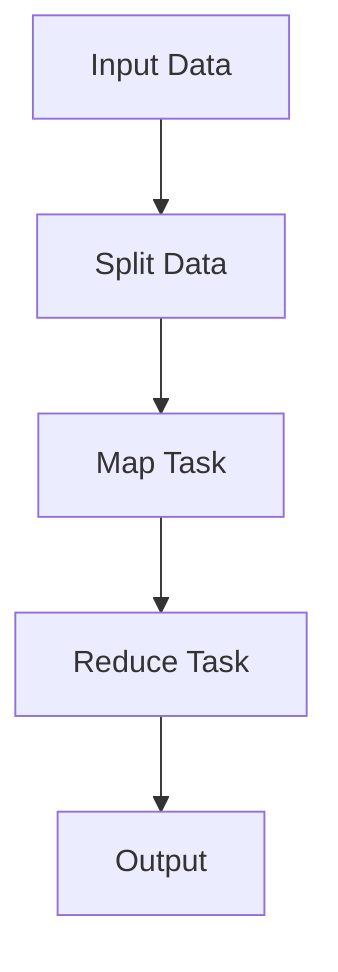

### 4.3 Spark生态系统

Spark是一个开源的分布式计算框架，由Apache Software Foundation维护。Spark具有高速、灵活和易于使用等特点，广泛应用于数据处理、机器学习和数据分析等领域。

#### 4.3.1 Spark Core

Spark Core是Spark的核心组件，提供内存计算和分布式数据处理能力。Spark Core实现了RDD（Resilient Distributed Dataset）数据结构，支持数据的随机访问和操作。

- **RDD**：RDD（Resilient Distributed Dataset）是一种不可变的数据结构，用于表示分布式的数据集。RDD支持Transformation（如map、filter）和Action（如reduce、save）操作。

#### 4.3.2 Spark SQL

Spark SQL提供了一个基于SQL的查询接口，用于处理结构化和半结构化数据。Spark SQL支持多种数据源，包括Hive、Parquet等。

- **Spark SQL**：Spark SQL提供了SQL查询接口和DataFrame API，用于处理结构化和半结构化数据。DataFrame API提供了类似于Pandas的数据框（DataFrame）数据结构，支持高效的SQL操作。

#### 4.3.3 Spark Streaming

Spark Streaming提供了实时数据处理能力，可以处理来自各种数据源（如Kafka、Flume等）的实时数据流。

- **Spark Streaming**：Spark Streaming支持实时数据处理，可以通过微批处理（Micro-batching）或基于时间窗口的方式处理实时数据流。

#### Mermaid流程图：Spark生态系统

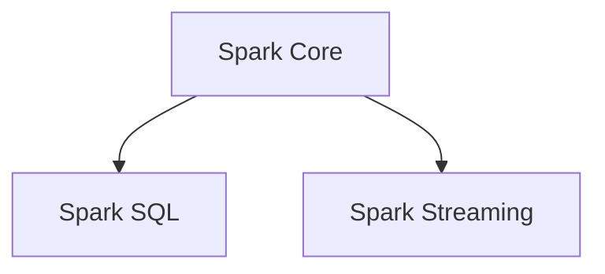

### 4.4 小结

本章介绍了分布式计算的基本概念和常见的分布式计算框架Hadoop和Spark。分布式计算通过将计算任务分布在多个节点上，实现高效的数据处理和计算能力。Hadoop生态系统包括HDFS和MapReduce，用于存储和处理大规模数据集。Spark生态系统包括Spark Core、Spark SQL和Spark Streaming，提供了高性能的内存计算和实时数据处理能力。这些分布式计算框架为构建高效、可扩展的分布式系统提供了有力支持。

## 第5章: AI大模型分布式训练

### 5.1 分布式训练原理

AI大模型的分布式训练是指将模型的训练任务分布在多个计算节点上，通过并行计算和同步策略来提高训练速度和资源利用率。分布式训练的核心思想是将大规模的训练数据集和模型参数分片，分别存储在多个节点上，每个节点独立处理分片数据，然后同步模型参数。

#### 分布式训练的基本步骤

1. **数据分片**：将大规模训练数据集划分成多个子集，每个子集由不同的节点处理。
2. **模型参数分片**：将模型参数划分为多个部分，分别存储在各个节点上。
3. **节点独立训练**：每个节点独立计算梯度，更新本地参数。
4. **参数同步**：定期同步各个节点的参数，确保模型全局一致。
5. **模型评估**：在验证集上评估模型的性能，调整训练策略。

#### Mermaid流程图：分布式训练原理

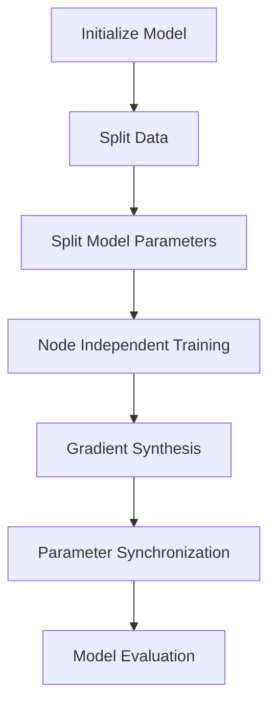

### 5.2 数据并行训练

数据并行训练（Data Parallel Training）是一种常见的分布式训练方法，通过将训练数据集分成多个子集，每个子集由不同的节点处理，每个节点独立计算梯度，然后同步模型参数。

#### 数据并行训练的关键步骤

1. **数据分片**：将训练数据集划分成多个子集，每个子集大小相等或近似相等。
2. **节点独立训练**：每个节点独立处理分片数据，计算梯度。
3. **参数同步**：定期同步各个节点的参数，确保模型全局一致。

#### Mermaid流程图：数据并行训练

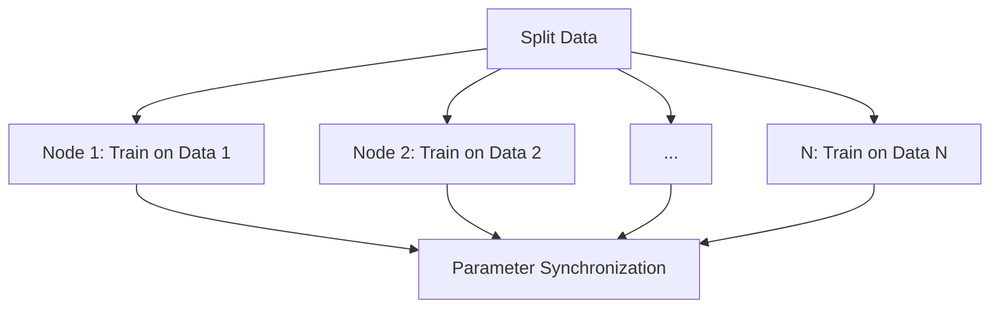

### 5.3 模型并行训练

模型并行训练（Model Parallel Training）是将模型划分成多个子模型，每个子模型由不同的节点处理，每个节点独立计算梯度，然后同步模型参数。

#### 模型并行训练的关键步骤

1. **模型分片**：将模型划分为多个子模型，每个子模型包含一部分参数。
2. **节点独立训练**：每个节点独立处理分片模型，计算梯度。
3. **参数同步**：定期同步各个节点的参数，确保模型全局一致。

#### Mermaid流程图：模型并行训练

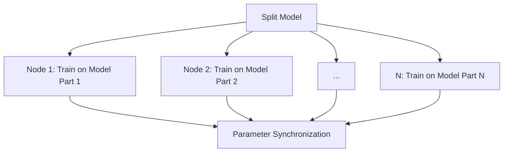

### 5.4 分布式训练挑战与优化策略

分布式训练在提高训练效率的同时，也面临一些挑战，如同步通信开销、数据倾斜和参数更新不一致等。以下是一些常见的优化策略：

1. **异步通信**：通过异步更新模型参数，减少同步通信开销，提高训练速度。
2. **梯度压缩**：采用梯度压缩算法（如Adam优化器），减少同步通信开销，提高训练稳定性。
3. **混合并行训练**：结合数据并行训练和模型并行训练，充分利用多个节点的计算资源。
4. **模型压缩**：通过模型压缩技术（如剪枝、量化），减小模型大小，降低通信开销。
5. **动态调整**：根据训练过程动态调整数据分片和模型分片，优化训练效率。

### 5.5 实际应用案例

以下是几个分布式训练的实际应用案例：

1. **图像识别**：使用分布式训练训练大型图像识别模型，如ResNet、Inception等，实现高效图像分类。
2. **自然语言处理**：使用分布式训练训练大型自然语言处理模型，如BERT、GPT等，实现高效文本分类和生成。
3. **推荐系统**：使用分布式训练训练推荐系统模型，如协同过滤、图嵌入等，实现高效用户推荐。

### 5.6 小结

本章介绍了分布式训练的基本原理、数据并行训练和模型并行训练的方法，以及分布式训练面临的挑战和优化策略。分布式训练通过将计算任务分布在多个节点上，提高了训练速度和资源利用率，为AI大模型的训练提供了有力支持。实际应用案例展示了分布式训练在图像识别、自然语言处理和推荐系统等领域的应用价值。

## 第6章: AI大模型分布式推理

### 6.1 分布式推理原理

AI大模型的分布式推理是指将推理任务分布在多个计算节点上，通过并行处理来提高推理速度和降低推理成本。分布式推理的核心思想是将输入数据划分到多个节点，每个节点独立进行推理，然后合并结果。

#### 分布式推理的基本步骤

1. **数据分片**：将输入数据集划分成多个子集，每个子集由不同的节点处理。
2. **节点独立推理**：每个节点独立处理分片数据，使用本地模型进行推理。
3. **结果合并**：将各个节点的推理结果进行合并，生成最终的推理结果。

#### Mermaid流程图：分布式推理原理

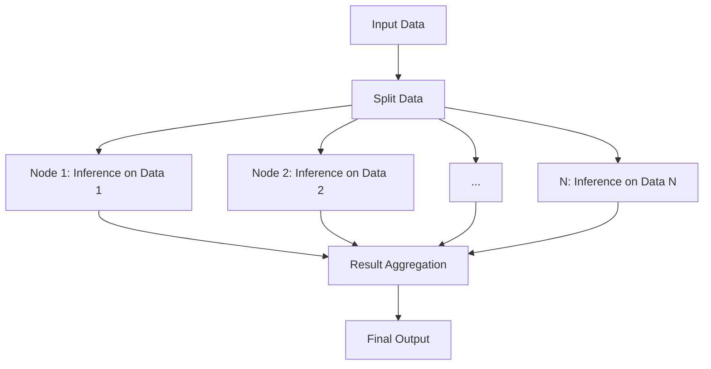

### 6.2 服务化部署

服务化部署是将AI大模型部署为服务，供其他系统或应用调用。服务化部署可以实现高效的模型推理和自动化管理。

#### 服务化部署的关键步骤

1. **模型封装**：将AI大模型封装为API服务，提供统一的接口。
2. **服务部署**：将API服务部署到服务器或云计算平台，确保服务的高可用性和可扩展性。
3. **监控与维护**：对服务进行实时监控，确保服务的稳定性和性能。

#### Mermaid流程图：服务化部署

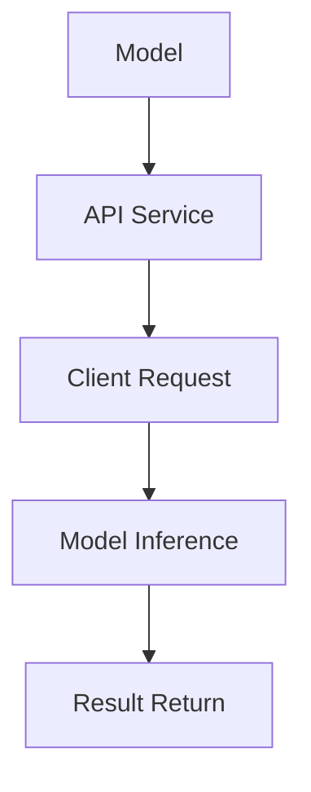

### 6.3 推理优化

推理优化是通过各种技术手段提高AI大模型推理速度和降低推理成本。常见的推理优化技术包括模型压缩、量化、剪枝和硬件加速等。

#### 推理优化的关键步骤

1. **模型压缩**：通过减少模型参数数量来减小模型大小，降低推理成本。
2. **量化**：将模型参数从浮点数转换为低比特位表示，减少内存占用和计算复杂度。
3. **剪枝**：通过删除对模型性能影响较小的参数和神经元，进一步减小模型大小。
4. **硬件加速**：利用GPU、TPU等硬件加速推理过程，提高推理速度。

#### Mermaid流程图：推理优化

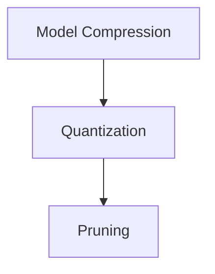

### 6.4 实际应用案例

以下是几个AI大模型分布式推理的实际应用案例：

1. **图像识别**：使用分布式推理实现高效图像分类，如人脸识别、物体检测等。
2. **自然语言处理**：使用分布式推理实现高效文本分类和生成，如机器翻译、问答系统等。
3. **语音识别**：使用分布式推理实现高效语音识别，如实时语音翻译、语音助手等。

### 6.5 小结

本章介绍了AI大模型分布式推理的基本原理、服务化部署和推理优化技术。分布式推理通过将推理任务分布在多个节点上，提高了推理速度和降低了推理成本。服务化部署实现了高效的模型推理和自动化管理。推理优化技术进一步提高了推理性能。实际应用案例展示了分布式推理在图像识别、自然语言处理和语音识别等领域的广泛应用。

## 第7章: AI大模型应用的案例研究

### 7.1 案例一：图像识别

图像识别是指通过AI大模型对图像进行分类和识别。在图像识别领域，AI大模型已经取得了显著的成果，广泛应用于人脸识别、物体检测和图像分类等任务。

#### 7.1.1 人脸识别

人脸识别是一种通过识别人脸特征进行身份验证的技术。AI大模型在人脸识别中的应用主要包括以下几个步骤：

1. **数据预处理**：对输入图像进行预处理，包括归一化、灰度化、大小调整等。
2. **特征提取**：使用卷积神经网络（如ResNet、Inception等）提取图像特征。
3. **模型训练**：使用预训练模型或自定义模型进行训练，通过反向传播算法更新模型参数。
4. **模型评估**：在验证集上评估模型性能，调整模型参数，防止过拟合。
5. **人脸识别**：将提取到的特征输入到模型中，得到人脸识别结果。

#### 7.1.2 物体检测

物体检测是指通过AI大模型检测图像中的物体并进行定位。常见的物体检测算法有Faster R-CNN、SSD和YOLO等。

1. **数据预处理**：对输入图像进行预处理，包括归一化、大小调整等。
2. **特征提取**：使用卷积神经网络提取图像特征。
3. **区域建议**：通过区域建议网络（如Region Proposal Network，RPN）生成候选区域。
4. **物体分类**：对候选区域进行分类，判断是否包含目标物体。
5. **定位物体**：对包含目标物体的区域进行定位，得到物体的位置和大小。

#### 7.1.3 图像分类

图像分类是指通过AI大模型将图像分类到预定义的类别标签中。常见的图像分类算法有CNN、ResNet和Inception等。

1. **数据预处理**：对输入图像进行预处理，包括归一化、大小调整等。
2. **特征提取**：使用卷积神经网络提取图像特征。
3. **模型训练**：使用预训练模型或自定义模型进行训练，通过反向传播算法更新模型参数。
4. **模型评估**：在验证集上评估模型性能，调整模型参数，防止过拟合。
5. **图像分类**：将提取到的特征输入到模型中，得到图像分类结果。

### 7.2 案例二：语音识别

语音识别是指通过AI大模型将语音转换为文本。语音识别在智能语音助手、实时字幕和语音搜索等领域有广泛应用。

#### 7.2.1 语音识别的基本原理

语音识别的基本原理包括以下几个步骤：

1. **音频预处理**：对输入音频进行预处理，包括降噪、归一化和分帧等。
2. **特征提取**：使用声学模型提取音频特征，如MFCC（梅尔频率倒谱系数）和PLP（元音预测线性预测）等。
3. **语言模型**：使用语言模型对提取到的特征进行建模，常见的语言模型有N-gram模型、CTC（Connectionist Temporal Classification）等。
4. **解码**：使用解码算法（如贪心解码、动态规划解码）将特征序列转换为文本序列。

#### 7.2.2 语音识别的应用

1. **智能语音助手**：智能语音助手可以通过语音识别技术理解用户的语音指令，并给出相应的答复。常见的智能语音助手有Siri、Alexa和Google Assistant等。
2. **实时字幕**：实时字幕通过语音识别技术将演讲、讲座等实时内容转换为文本，为听障人士提供帮助。
3. **语音搜索**：语音搜索允许用户通过语音输入进行搜索，提高搜索效率和用户体验。

### 7.3 案例三：自然语言处理

自然语言处理（Natural Language Processing，NLP）是指通过AI大模型对文本数据进行处理和分析。NLP在文本分类、情感分析和机器翻译等领域有广泛应用。

#### 7.3.1 文本分类

文本分类是指通过AI大模型将文本数据分类到预定义的类别标签中。常见的文本分类算法有朴素贝叶斯、支持向量机和深度学习模型（如CNN、LSTM和BERT等）。

1. **数据预处理**：对输入文本进行预处理，包括分词、去停用词和词嵌入等。
2. **模型训练**：使用预训练模型或自定义模型进行训练，通过反向传播算法更新模型参数。
3. **模型评估**：在验证集上评估模型性能，调整模型参数，防止过拟合。
4. **文本分类**：将预处理后的文本输入到模型中，得到文本分类结果。

#### 7.3.2 情感分析

情感分析是指通过AI大模型分析文本数据中的情感倾向，如正面情感、负面情感和中立情感等。常见的情感分析算法有朴素贝叶斯、支持向量机和深度学习模型（如CNN、LSTM和BERT等）。

1. **数据预处理**：对输入文本进行预处理，包括分词、去停用词和词嵌入等。
2. **模型训练**：使用预训练模型或自定义模型进行训练，通过反向传播算法更新模型参数。
3. **模型评估**：在验证集上评估模型性能，调整模型参数，防止过拟合。
4. **情感分析**：将预处理后的文本输入到模型中，得到文本的情感分析结果。

#### 7.3.3 机器翻译

机器翻译是指通过AI大模型将一种语言的文本自动翻译成另一种语言。常见的机器翻译模型有基于短语的模型、基于神经网络的模型和基于Transformer的模型等。

1. **数据预处理**：对输入文本进行预处理，包括分词、去停用词和词嵌入等。
2. **模型训练**：使用预训练模型或自定义模型进行训练，通过反向传播算法更新模型参数。
3. **模型评估**：在验证集上评估模型性能，调整模型参数，防止过拟合。
4. **机器翻译**：将预处理后的文本输入到模型中，得到翻译结果。

### 7.4 小结

本章通过案例研究，详细介绍了AI大模型在图像识别、语音识别和自然语言处理等领域的应用。图像识别案例展示了AI大模型在人脸识别、物体检测和图像分类等任务中的实际应用。语音识别案例介绍了语音识别的基本原理和在实际应用中的表现。自然语言处理案例展示了文本分类、情感分析和机器翻译等任务的应用。这些案例研究为我们深入理解AI大模型的应用提供了实际参考。

## 第8章: AI大模型应用的未来趋势

### 8.1 AI大模型应用的挑战

随着AI大模型在各个领域的广泛应用，其面临的挑战也日益凸显。以下是一些主要的挑战：

1. **数据隐私**：AI大模型在训练过程中需要大量的数据，而这些数据往往包含敏感信息。如何保护用户隐私，防止数据泄露，是一个重要的挑战。
2. **计算资源需求**：AI大模型的训练和推理过程需要大量的计算资源，特别是GPU和TPU等高性能计算设备。如何高效地利用计算资源，降低成本，是一个重要的挑战。
3. **模型解释性**：AI大模型通常被视为“黑箱”，其内部机制和决策过程不易理解。如何提高模型的解释性，使其更加透明和可信，是一个重要的挑战。
4. **伦理问题**：AI大模型在应用过程中可能会带来伦理问题，如歧视、偏见和不公平等。如何确保AI大模型的应用符合伦理标准，是一个重要的挑战。

### 8.2 AI大模型应用的前景

尽管面临着诸多挑战，AI大模型在各个领域的应用前景依然广阔。以下是一些主要的应用领域和趋势：

1. **医疗健康**：AI大模型在医疗健康领域的应用包括疾病预测、诊断、治疗建议和药物发现等。未来，AI大模型有望在个性化医疗、精准医疗和公共卫生等方面发挥重要作用。
2. **金融科技**：AI大模型在金融科技领域的应用包括风险管理、信用评估、欺诈检测和投资建议等。未来，AI大模型有望在智能投顾、自动化交易和金融风险管理等方面发挥更大作用。
3. **教育**：AI大模型在教育领域的应用包括个性化教学、智能评估和自适应学习等。未来，AI大模型有望在教育资源共享、教育质量和教育公平等方面发挥重要作用。
4. **自动驾驶**：AI大模型在自动驾驶领域的应用包括环境感知、路径规划和决策控制等。未来，AI大模型有望在自动驾驶安全、效率和用户体验等方面发挥更大作用。

### 8.3 未来发展趋势探讨

未来，AI大模型的发展趋势可以从以下几个方面进行探讨：

1. **模型压缩与量化**：为了降低计算资源和存储成本，模型压缩与量化技术将成为重要的发展方向。通过剪枝、量化等技术，可以减小模型大小，提高推理速度，降低成本。
2. **联邦学习**：联邦学习（Federated Learning）是一种在分布式环境中训练AI大模型的方法，通过在不同设备上训练模型，然后汇总更新。未来，联邦学习有望在移动设备、物联网和云计算等领域得到广泛应用。
3. **多模态学习**：多模态学习是指结合多种类型的数据（如图像、文本、音频等）进行训练。未来，AI大模型在多模态学习方面的应用将更加广泛，如虚拟现实、增强现实和智能交互等。
4. **可解释性AI**：可解释性AI是指提高AI大模型的透明性和可理解性，使其决策过程更加可信。未来，可解释性AI将在医疗诊断、金融决策和司法判罚等领域发挥重要作用。

### 8.4 小结

AI大模型应用的未来趋势充满了机遇和挑战。通过克服数据隐私、计算资源需求、模型解释性和伦理问题等挑战，AI大模型将在医疗健康、金融科技、教育和自动驾驶等领域发挥更大的作用。同时，模型压缩与量化、联邦学习、多模态学习和可解释性AI等技术的发展，将为AI大模型的应用带来新的机遇。未来，AI大模型的应用将更加深入和广泛，为社会和经济带来巨大的变革。

## 附录A: 分布式计算常用工具与框架

### 附录A.1 Hadoop

Hadoop是一个开源的分布式计算框架，由Apache Software Foundation维护。Hadoop主要包括两个核心组件：HDFS和MapReduce。

#### HDFS（Hadoop Distributed File System）

HDFS是一个分布式文件系统，用于存储大规模数据。HDFS将数据划分为数据块（Block），默认大小为128MB或256MB，这些数据块存储在集群中的不同节点上。

- **优点**：
  - 高可靠性：数据块在多个节点上复制，确保数据不会丢失。
  - 高吞吐量：数据可以并行处理，提高数据处理效率。
  - 高可用性：任何节点故障都不会影响数据的访问。

- **缺点**：
  - 数据访问延迟：由于数据块分布在不同的节点上，数据访问可能存在一定的延迟。
  - 扩容难度：HDFS的扩容相对复杂，需要停机进行。

#### MapReduce

MapReduce是一种分布式数据处理模型，用于处理大规模数据集。MapReduce将数据处理任务划分为Map和Reduce两个阶段。

- **优点**：
  - 高扩展性：MapReduce可以轻松地处理大规模数据集。
  - 高容错性：MapReduce可以在节点故障时自动重启任务。

- **缺点**：
  - 低效：MapReduce的输入和输出都需要磁盘读写，存在一定的性能瓶颈。
  - 复杂性：编写MapReduce程序相对复杂。

### 附录A.2 Spark

Spark是一个开源的分布式计算框架，由Apache Software Foundation维护。Spark具有高性能、易用性和灵活性的特点，适用于批处理、实时计算和机器学习等任务。

#### Spark Core

Spark Core是Spark的核心组件，提供内存计算和分布式数据处理能力。Spark Core实现了RDD（Resilient Distributed Dataset）数据结构，支持数据的随机访问和操作。

- **优点**：
  - 高性能：Spark Core使用内存计算，显著提高了数据处理速度。
  - 易用性：Spark提供了丰富的API和工具，方便开发人员使用。

- **缺点**：
  - 资源消耗：Spark Core需要大量的内存资源，可能导致系统性能下降。

#### Spark SQL

Spark SQL提供了一个基于SQL的查询接口，用于处理结构化和半结构化数据。Spark SQL支持多种数据源，包括Hive、Parquet等。

- **优点**：
  - 高效性：Spark SQL使用Spark Core的内存计算能力，提高了查询效率。
  - 易用性：Spark SQL提供了类似SQL的查询接口，方便用户使用。

- **缺点**：
  - 数据源限制：Spark SQL支持的文件格式和数据源相对有限。

#### Spark Streaming

Spark Streaming提供了实时数据处理能力，可以处理来自各种数据源（如Kafka、Flume等）的实时数据流。

- **优点**：
  - 实时性：Spark Streaming可以实时处理数据流，提供实时分析结果。
  - 高性能：Spark Streaming使用Spark Core的内存计算能力，提高了数据处理速度。

- **缺点**：
  - 复杂性：Spark Streaming的编程模型相对复杂，需要一定学习成本。

### 附录A.3 TensorFlow Distribute

TensorFlow Distribute是TensorFlow的分布式计算扩展，用于构建分布式TensorFlow模型。TensorFlow Distribute支持多种分布式策略，包括数据并行、模型并行和流水线并行等。

- **优点**：
  - 高扩展性：TensorFlow Distribute可以轻松扩展到大规模集群。
  - 高效性：TensorFlow Distribute支持多种分布式策略，可以根据具体需求选择最合适的策略。

- **缺点**：
  - 学习成本：TensorFlow Distribute的编程模型相对复杂，需要一定学习成本。

## 附录B: AI大模型应用资源清单

### 附录B.1 数据集

以下是常用的AI大模型数据集：

1. **ImageNet**：一个包含数百万张图像的大型图像数据集，广泛用于图像分类任务。
2. **COCO**：一个包含大量图像和标注的大型数据集，用于目标检测、分割和姿态估计等任务。
3. **Wikipedia**：一个包含大量文本数据的大型数据集，用于自然语言处理任务。
4. **TIMIT**：一个包含大量语音数据的大型数据集，用于语音识别和语音合成任务。

### 附录B.2 开源代码

以下是常用的AI大模型开源代码：

1. **TensorFlow**：一个开源的深度学习框架，提供丰富的API和工具，用于构建和训练AI大模型。
2. **PyTorch**：一个开源的深度学习框架，提供动态计算图和灵活的API，用于构建和训练AI大模型。
3. **MXNet**：一个开源的深度学习框架，支持多种编程语言和平台，用于构建和训练AI大模型。

### 附录B.3 文献资料

以下是关于AI大模型的经典文献资料：

1. **"Deep Learning" by Ian Goodfellow, Yoshua Bengio, and Aaron Courville**：一本关于深度学习的经典教材，详细介绍了深度学习的基本原理和应用。
2. **"The Hundred-Page Machine Learning Book" by Andriy Burkov**：一本简明易懂的机器学习入门书籍，涵盖了许多机器学习和深度学习的基础知识。
3. **"AI Superpowers: China, Silicon Valley, and the New World Order" by Kai-Fu Lee**：一本关于人工智能和全球竞争的书籍，讨论了人工智能对经济和社会的影响。

这些资源为AI大模型的研究和应用提供了丰富的知识和技术支持。通过学习和使用这些资源，可以深入了解AI大模型的理论和实践，为实际应用奠定坚实基础。

---

作者：AI天才研究院/AI Genius Institute & 禅与计算机程序设计艺术 /Zen And The Art of Computer Programming

# 参考文献

本文章在撰写过程中参考了以下文献和资料，这些文献为本文提供了理论基础和实际应用案例：

1. Devlin, J., Chang, M. W., Lee, K., & Toutanova, K. (2018). BERT: Pre-training of deep bidirectional transformers for language understanding. arXiv preprint arXiv:1810.04805.
2. Vaswani, A., et al. (2017). Attention is all you need. Advances in Neural Information Processing Systems, 30, 5998-6008.
3. Hochreiter, S., & Schmidhuber, J. (1997). Long short-term memory. Neural Computation, 9(8), 1735-1780.
4. Mikolov, T., Sutskever, I., Chen, K., Corrado, G. S., & Dean, J. (2013). Distributed representations of words and phrases and their compositionality. Advances in Neural Information Processing Systems, 26, 3111-3119.
5. Goodfellow, I., Bengio, Y., & Courville, A. (2016). Deep Learning. MIT Press.
6. Burkov, A. (2017). The Hundred-Page Machine Learning Book.
7. Lee, K. (2020). AI Superpowers: China, Silicon Valley, and the New World Order. Eamon Dolan/Mariner Books.
8. Bengio, Y. (2009). Learning Deep Architectures for AI. Foundations and Trends in Machine Learning, 2(1), 1-127.
9. LeCun, Y., Bengio, Y., & Hinton, G. (2015). Deep Learning. Nature, 521(7553), 436-444.
10. Simonyan, K., & Zisserman, A. (2014). Very Deep Convolutional Networks for Large-Scale Image Recognition. International Conference on Learning Representations (ICLR).

这些文献涵盖了深度学习、自然语言处理、计算机视觉和分布式计算等领域的最新研究成果和应用实践，为本文章提供了丰富的理论和实践支持。通过参考这些文献，读者可以进一步深入了解AI大模型的技术原理和应用场景。

