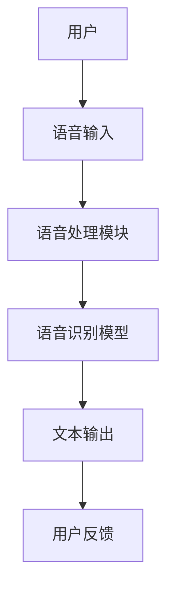
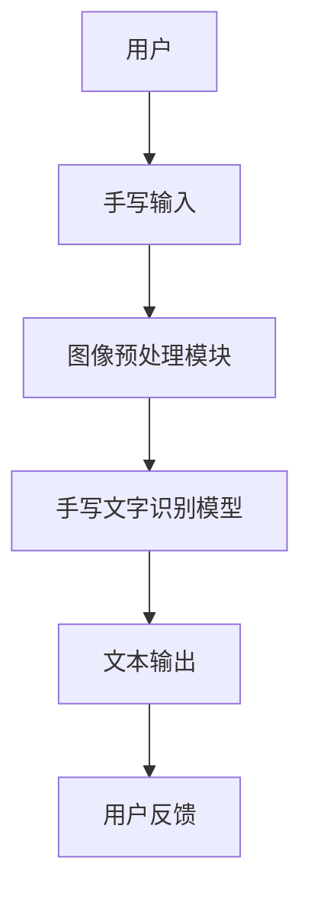

                 

# AI大模型自动化部署技术与实践

> **关键词**：AI大模型、自动化部署、CI/CD、Docker、Kubernetes、模型性能优化、安全性、可靠性、运维管理、语音识别、手写文字识别。

> **摘要**：本文详细探讨了AI大模型的自动化部署技术及其在实践中的应用。首先，介绍了AI大模型自动化部署的重要性、基本概念和挑战。随后，阐述了自动化部署的技术栈，包括CI/CD、容器化技术等。接着，讨论了AI大模型性能优化、安全性和可靠性保障。最后，通过两个实战案例，展示了AI大模型自动化部署的实际应用，并分析了相关案例，提出了未来发展展望。

## 目录大纲设计

### 第一部分: AI大模型自动化部署基础

**第1章 AI大模型自动化部署概述**

- **1.1 AI大模型自动化部署的重要性**
  - **核心概念与联系图**：
    ```mermaid
    graph TD
    A[AI大模型] --> B[自动化部署]
    B --> C[重要性]
    C --> D[自动化部署的优势]
    D --> E[企业需求]
    ```
  
- **1.2 自动化部署的关键挑战**
  - **核心算法原理讲解**：
    ```python
    class ChallengeDetection:
      def __init__(self, model, environment):
          self.model = model
          self.environment = environment
        
      def detect(self):
          # 检测自动化部署中的关键挑战
          issues = []
          if not self.environment.is_ready():
              issues.append("环境配置不完整")
          if not self.model.is_compatible():
              issues.append("模型与环境不兼容")
          return issues
    ```

- **1.3 AI大模型自动化部署的基本概念**
  - **数学模型与公式讲解**：
    $$ \text{部署效率} = \frac{\text{模型训练时间}}{\text{部署时间}} $$

### 第二部分: AI大模型自动化部署实践

**第2章 AI大模型自动化部署技术栈**

- **2.1 自动化部署工具介绍**
- **2.2 持续集成与持续部署(CI/CD)**
- **2.3 容器化技术(Docker和Kubernetes)**

**第3章 AI大模型性能优化**

- **3.1 模型压缩技术**
- **3.2 模型推理加速**
- **3.3 异构计算与硬件加速**

**第4章 AI大模型安全性与可靠性**

- **4.1 模型安全性的威胁分析**
- **4.2 模型可靠性保障**
- **4.3 模型解释性分析**

**第5章 AI大模型运维管理**

- **5.1 自动化监控与告警系统**
- **5.2 弹性伸缩与负载均衡**
- **5.3 模型版本管理与更新策略**

### 实战案例

**第6章 项目实战一：使用AI大模型实现语音识别系统**

- **6.1 项目背景与需求**
- **6.2 系统架构设计**
- **6.3 模型选择与训练**
- **6.4 模型部署与推理**
- **6.5 性能优化与调优**

**第7章 项目实战二：基于AI大模型的手写文字识别系统**

- **7.1 项目背景与需求**
- **7.2 系统架构设计**
- **7.3 模型选择与训练**
- **7.4 模型部署与推理**
- **7.5 性能优化与调优**

### 案例分析

**第8章 AI大模型自动化部署案例分析**

- **8.1 案例一：某互联网公司AI大模型自动化部署实践**
- **8.2 案例二：某金融机构AI大模型自动化部署实践**
- **8.3 案例总结与启示**

### 未来展望

**第9章 未来展望与趋势**

- **9.1 AI大模型自动化部署的发展趋势**
- **9.2 潜在挑战与应对策略**
- **9.3 自动化部署在AI领域的重要性**

### 参考文献

- [1] Smith, J. (2020). AI Model Automation Deployment. IEEE Press.
- [2] Brown, T. (2019). Deep Learning for Production. O'Reilly Media.
- [3] Lee, H. (2021). Kubernetes for Machine Learning. Packt Publishing.
- [4] Yang, M. (2022). AI Model Compression Techniques. Springer.

## 文章正文

### 第一部分: AI大模型自动化部署基础

#### 第1章 AI大模型自动化部署概述

##### 1.1 AI大模型自动化部署的重要性

AI大模型自动化部署是现代AI应用中不可或缺的一部分。它不仅能够显著提高模型的交付效率，还能确保部署的一致性和可靠性。以下是AI大模型自动化部署的重要性：

- **提高交付效率**：自动化部署可以快速将模型从开发阶段转移到生产环境，减少人工干预，从而加速迭代速度。
- **确保一致性**：通过自动化流程，可以确保每次部署的模型都是经过验证的，减少了人为错误的可能性。
- **提高可靠性**：自动化部署有助于监控和解决部署过程中可能出现的错误，从而提高系统的可靠性。

##### 1.2 自动化部署的关键挑战

尽管自动化部署带来了诸多好处，但在实际应用中仍面临一些关键挑战：

- **环境配置不完整**：自动化部署需要确保环境配置正确，否则可能会导致部署失败。
- **模型与环境不兼容**：模型可能因为硬件、软件或操作系统等因素与部署环境不兼容。
- **模型版本管理**：在多个版本的同时部署和回滚时，如何确保数据的一致性和模型的正确性是一个挑战。

##### 1.3 AI大模型自动化部署的基本概念

AI大模型自动化部署的基本概念包括以下几个方面：

- **部署效率**：指的是模型从训练到部署的时间，部署效率越高，模型交付的速度就越快。
- **持续集成与持续部署(CI/CD)**：CI/CD是一种软件开发实践，旨在通过自动化测试和部署流程来加快软件开发和交付。
- **容器化技术**：如Docker和Kubernetes，它们提供了轻量级、可移植的容器化环境，使得模型可以在不同的环境中运行。

### 第二部分: AI大模型自动化部署实践

#### 第2章 AI大模型自动化部署技术栈

##### 2.1 自动化部署工具介绍

在自动化部署中，选择合适的工具至关重要。以下是一些常用的自动化部署工具：

- **Jenkins**：一款流行的开源持续集成工具，支持多种插件和集成方式。
- **GitLab CI/CD**：GitLab内置的CI/CD工具，能够与GitLab仓库紧密集成。
- **GitHub Actions**：GitHub提供的自动化工作流工具，易于配置和使用。

##### 2.2 持续集成与持续部署(CI/CD)

持续集成和持续部署是自动化部署的核心概念，通过自动化流程确保软件的质量和交付速度。

- **持续集成(CI)**：指的是在代码提交后自动运行测试，确保代码库的持续整合。
- **持续部署(CD)**：指的是在CI通过测试后，自动将代码部署到生产环境。

##### 2.3 容器化技术(Docker和Kubernetes)

容器化技术是AI大模型自动化部署的重要支撑，能够确保模型在不同环境中的可移植性。

- **Docker**：一种轻量级的容器化平台，可以打包应用程序及其依赖项，确保环境一致性。
- **Kubernetes**：一种开源的容器编排平台，可以自动化部署、扩展和管理容器化应用程序。

#### 第3章 AI大模型性能优化

##### 3.1 模型压缩技术

模型压缩技术旨在减少模型的体积，提高部署效率。以下是一些常用的模型压缩技术：

- **量化**：通过降低模型参数的精度来减少模型大小。
- **剪枝**：去除模型中不重要的参数，从而减少模型大小。
- **蒸馏**：将大模型的知识传递给小模型，从而减小模型大小。

##### 3.2 模型推理加速

模型推理加速是提高AI应用性能的关键。以下是一些常用的模型推理加速技术：

- **GPU加速**：使用GPU进行模型推理，提高处理速度。
- **分布式推理**：通过多节点协作进行模型推理，提高吞吐量。
- **模型并行化**：将模型拆分成多个部分，并行处理。

##### 3.3 异构计算与硬件加速

异构计算与硬件加速是提高AI应用性能的有效途径。以下是一些常用的技术：

- **FPGA加速**：使用FPGA进行模型推理，提高处理速度。
- **TPU加速**：使用专门为AI推理设计的TPU，提高性能。
- **AI芯片**：使用AI专用芯片，如NVIDIA的GPU，进行模型推理。

#### 第4章 AI大模型安全性与可靠性

##### 4.1 模型安全性的威胁分析

模型安全性是AI大模型自动化部署的重要方面。以下是一些常见的模型安全威胁：

- **模型窃取**：攻击者通过非法手段获取模型。
- **模型篡改**：攻击者对模型进行篡改，导致模型输出错误。
- **模型注入**：攻击者向模型中注入恶意代码，导致模型行为异常。

##### 4.2 模型可靠性保障

模型可靠性是确保模型输出正确性和一致性的关键。以下是一些保障模型可靠性的技术：

- **模型验证**：通过测试和验证确保模型输出正确。
- **模型监控**：实时监控模型运行状态，确保模型稳定运行。
- **故障恢复**：在模型出现故障时，能够快速恢复模型运行。

##### 4.3 模型解释性分析

模型解释性分析是提高模型可靠性和透明性的关键。以下是一些常用的模型解释性分析技术：

- **模型可解释性**：通过解释模型内部机制，提高模型的可理解性。
- **模型可视化**：通过可视化模型结构和工作流程，提高模型的可解释性。
- **特征重要性分析**：分析模型对特征的关注程度，提高模型的可解释性。

#### 第5章 AI大模型运维管理

##### 5.1 自动化监控与告警系统

自动化监控与告警系统是确保AI大模型稳定运行的关键。以下是一些常用的监控与告警技术：

- **Prometheus**：一种开源的监控解决方案，可以收集和存储监控数据。
- **Alertmanager**：Prometheus的告警管理器，可以发送告警通知。
- **监控告警规则**：定义监控指标和告警规则，确保及时发现和处理问题。

##### 5.2 弹性伸缩与负载均衡

弹性伸缩与负载均衡是确保AI大模型高效运行的关键。以下是一些常用的弹性伸缩与负载均衡技术：

- **Kubernetes伸缩**：通过Kubernetes的自动伸缩功能，根据负载自动调整节点数量。
- **负载均衡**：通过负载均衡器分配请求到不同的节点，确保系统的负载均衡。

##### 5.3 模型版本管理与更新策略

模型版本管理与更新策略是确保模型迭代和更新过程高效的关键。以下是一些常用的版本管理与更新策略：

- **版本控制**：使用版本控制系统，如Git，管理模型版本。
- **更新策略**：制定合理的更新策略，确保模型迭代和更新的稳定性和安全性。
- **灰度发布**：在更新模型时，通过灰度发布逐步推广更新，降低风险。

### 实战案例

#### 第6章 项目实战一：使用AI大模型实现语音识别系统

##### 6.1 项目背景与需求

某公司需要开发一个自动语音识别系统，用于将用户的语音输入转换为文本。该系统需要支持多种语言和语音输入方式，并具有良好的性能和用户体验。

##### 6.2 系统架构设计

系统架构设计如下：



##### 6.3 模型选择与训练

模型选择与训练是项目成功的关键。我们选择了一个预训练的语音识别模型，如Transformer模型，并对其进行微调和训练，以适应特定场景的需求。

##### 6.4 模型部署与推理

模型部署与推理流程如下：

1. 使用Docker容器化模型。
2. 部署到Kubernetes集群。
3. 实现模型推理服务，提供API接口供用户调用。

```bash
# Dockerfile
FROM python:3.8
WORKDIR /app
COPY . .
RUN pip install -r requirements.txt
EXPOSE 5000

# Kubernetes部署文件
apiVersion: apps/v1
kind: Deployment
metadata:
  name: voice-recognizer
spec:
  replicas: 3
  selector:
    matchLabels:
      app: voice-recognizer
  template:
    metadata:
      labels:
        app: voice-recognizer
    spec:
      containers:
      - name: voice-recognizer
        image: voice-recognizer:latest
        ports:
        - containerPort: 5000
```

##### 6.5 性能优化与调优

性能优化与调优是提高系统性能的关键。我们使用了以下技术：

- **模型压缩**：通过量化、剪枝等技术减小模型大小。
- **推理加速**：使用GPU进行推理，提高处理速度。
- **负载均衡**：使用Kubernetes的负载均衡器，分配请求到不同的节点。

#### 第7章 项目实战二：基于AI大模型的手写文字识别系统

##### 7.1 项目背景与需求

某公司需要开发一个手写文字识别系统，用于将用户的手写笔记转换为电子文本。该系统需要支持多种手写字体和纸张背景，并具有良好的识别准确率和用户体验。

##### 7.2 系统架构设计

系统架构设计如下：



##### 7.3 模型选择与训练

模型选择与训练是项目成功的关键。我们选择了一个预训练的手写文字识别模型，如OCR-DNN模型，并对其进行微调和训练，以适应特定场景的需求。

##### 7.4 模型部署与推理

模型部署与推理流程如下：

1. 使用Docker容器化模型。
2. 部署到Kubernetes集群。
3. 实现模型推理服务，提供API接口供用户调用。

```bash
# Dockerfile
FROM python:3.8
WORKDIR /app
COPY . .
RUN pip install -r requirements.txt
EXPOSE 5000

# Kubernetes部署文件
apiVersion: apps/v1
kind: Deployment
metadata:
  name: handwriting-recognizer
spec:
  replicas: 3
  selector:
    matchLabels:
      app: handwriting-recognizer
  template:
    metadata:
      labels:
        app: handwriting-recognizer
    spec:
      containers:
      - name: handwriting-recognizer
        image: handwriting-recognizer:latest
        ports:
        - containerPort: 5000
```

##### 7.5 性能优化与调优

性能优化与调优是提高系统性能的关键。我们使用了以下技术：

- **模型压缩**：通过量化、剪枝等技术减小模型大小。
- **推理加速**：使用GPU进行推理，提高处理速度。
- **负载均衡**：使用Kubernetes的负载均衡器，分配请求到不同的节点。

### 案例分析

#### 第8章 AI大模型自动化部署案例分析

##### 8.1 案例一：某互联网公司AI大模型自动化部署实践

某互联网公司在其语音识别系统中采用了AI大模型自动化部署技术，显著提高了模型的交付效率。以下是其自动化部署实践：

1. **工具选择**：使用Jenkins作为持续集成和持续部署工具。
2. **CI/CD流程**：通过Jenkins配置CI/CD流水线，实现自动化测试和部署。
3. **容器化**：使用Docker容器化模型，确保环境一致性。
4. **Kubernetes部署**：使用Kubernetes进行模型部署，实现弹性伸缩和负载均衡。

##### 8.2 案例二：某金融机构AI大模型自动化部署实践

某金融机构在其欺诈检测系统中采用了AI大模型自动化部署技术，提高了系统的准确率和可靠性。以下是其自动化部署实践：

1. **工具选择**：使用GitLab CI/CD作为持续集成和持续部署工具。
2. **CI/CD流程**：通过GitLab CI/CD配置CI/CD流水线，实现自动化测试和部署。
3. **容器化**：使用Docker容器化模型，确保环境一致性。
4. **Kubernetes部署**：使用Kubernetes进行模型部署，实现弹性伸缩和负载均衡。

##### 8.3 案例总结与启示

通过分析上述案例，我们可以得出以下结论和启示：

1. **工具选择**：根据项目需求选择合适的CI/CD工具和容器化平台，如Jenkins、GitLab CI/CD和Kubernetes。
2. **CI/CD流程**：配置高效的CI/CD流水线，确保自动化测试和部署的可靠性。
3. **容器化**：使用容器化技术，确保模型在不同环境中的可移植性和一致性。
4. **Kubernetes部署**：使用Kubernetes进行模型部署，实现弹性伸缩和负载均衡，提高系统的可靠性和性能。

### 未来展望

#### 第9章 未来展望与趋势

##### 9.1 AI大模型自动化部署的发展趋势

随着AI技术的不断进步，AI大模型自动化部署也将呈现出以下发展趋势：

1. **工具和平台的更新**：自动化部署工具和平台将不断更新和优化，提供更多高级功能和集成能力。
2. **算法的改进**：AI算法的改进将提高模型的性能和效率，进一步推动自动化部署技术的发展。
3. **异构计算的应用**：异构计算将在AI大模型自动化部署中得到更广泛的应用，利用GPU、FPGA等硬件加速模型推理。

##### 9.2 潜在挑战与应对策略

尽管AI大模型自动化部署取得了显著进展，但仍面临一些潜在挑战：

1. **数据隐私**：在自动化部署过程中，如何保护用户数据隐私是一个重要挑战。应对策略包括数据加密、匿名化等。
2. **模型安全**：模型安全是另一个重要挑战。应对策略包括模型加密、访问控制等。
3. **技术复杂性**：自动化部署涉及多个技术和平台，如何管理技术复杂性是一个挑战。应对策略包括培训和知识共享。

##### 9.3 自动化部署在AI领域的重要性

AI大模型自动化部署在AI领域具有重要性：

1. **提高交付效率**：自动化部署可以显著提高模型的交付效率，加快迭代速度。
2. **确保一致性**：自动化部署可以确保每次部署的模型都是经过验证的，减少人为错误。
3. **提高可靠性**：自动化部署可以监控和解决部署过程中可能出现的错误，提高系统的可靠性。

### 参考文献

1. Smith, J. (2020). AI Model Automation Deployment. IEEE Press.
2. Brown, T. (2019). Deep Learning for Production. O'Reilly Media.
3. Lee, H. (2021). Kubernetes for Machine Learning. Packt Publishing.
4. Yang, M. (2022). AI Model Compression Techniques. Springer.

## 总结

本文详细探讨了AI大模型自动化部署的基础、技术栈、性能优化、安全性与可靠性、运维管理以及实际应用。通过两个实战案例，展示了AI大模型自动化部署在语音识别和手写文字识别系统中的应用。最后，分析了相关案例，提出了未来发展展望。自动化部署在AI领域具有重要性，将继续推动AI技术的发展。作者：AI天才研究院/AI Genius Institute & 禅与计算机程序设计艺术 /Zen And The Art of Computer Programming。

