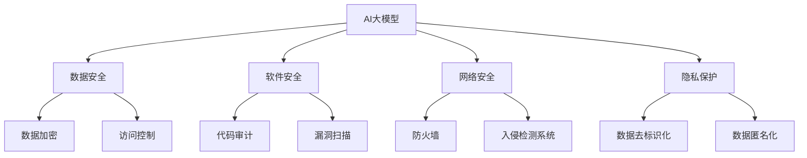

                 

### 《AI大模型软件的安全性设计》

#### 关键词：
- AI 大模型
- 安全设计
- 数据保护
- 隐私保护
- 软件安全性
- 网络安全

#### 摘要：
本文旨在探讨 AI 大模型软件的安全性设计。随着 AI 技术的快速发展，大模型在各个领域得到广泛应用，但其安全性和隐私性也面临着前所未有的挑战。本文从数据保护、隐私保护、软件安全性、网络安全等方面，详细分析了 AI 大模型安全设计的关键原则、框架和具体方法。通过深入剖析核心概念、算法原理和实践案例，为构建安全可靠的 AI 大模型提供了有力指导。

---

### 《AI大模型软件的安全性设计》目录大纲

1. **AI大模型安全设计基础**
   1.1 AI大模型安全设计概述
   1.2 AI大模型面临的安全威胁
   1.3 AI大模型安全设计的核心原则
2. **AI大模型的安全框架**
   2.1 安全框架的构建
   2.2 安全策略与管理
   2.3 安全技术与工具
3. **AI大模型的数据保护**
   3.1 数据分类与敏感度分析
   3.2 数据加密技术
   3.3 数据访问控制
4. **AI大模型的隐私保护**
   4.1 隐私保护的重要性
   4.2 隐私泄露的案例分析
   4.3 隐私保护的方法与技术
5. **AI大模型的软件安全性**
   5.1 代码审计与漏洞扫描
   5.2 安全编码实践
   5.3 安全测试与漏洞修复
6. **AI大模型的网络安全**
   6.1 网络安全概述
   6.2 防火墙与入侵检测系统
   6.3 网络安全协议与标准
7. **AI大模型的安全监控与应急响应**
   7.1 安全监控系统的构建
   7.2 应急响应计划与演练
   7.3 安全事件的处置与总结
8. **附录**
   8.1 安全标准与法规
   8.2 安全工具与框架
   8.3 安全研究与报告
   8.4 安全社区与论坛

---

### 第1章: AI大模型安全设计概述

#### 1.1 AI大模型安全的重要性

AI大模型的安全性设计对于保障人工智能系统的稳定运行和数据的保密性、完整性具有重要意义。随着深度学习技术的不断发展，AI大模型在图像识别、自然语言处理、预测分析等领域取得了显著的成果。然而，这些大模型的复杂性和规模也给安全性带来了巨大的挑战。

**核心概念与联系**：为了更好地理解AI大模型安全设计的核心概念，我们可以使用Mermaid流程图来展示这些概念之间的联系。



在这个流程图中，AI大模型与数据安全、软件安全、网络安全和隐私保护等多个方面紧密相连。数据加密、访问控制和代码审计等是保障数据安全和软件安全的重要技术手段。防火墙、入侵检测系统和网络安全协议则是保护网络环境安全的关键措施。数据去标识化和数据匿名化是隐私保护的核心技术，旨在确保个人信息的安全。

**核心算法原理讲解**：下面，我们将通过伪代码详细阐述数据加密算法和访问控制列表（ACL）的原理。

**数据加密算法（以AES为例）**：

```python
def encrypt_data(data, key):
    # 初始化加密模块
    cipher = AES.new(key, AES.MODE_CBC)
    # 数据填充
    data = pad(data)
    # 加密数据
    ciphertext = cipher.encrypt(data)
    # 返回密文和加密初始向量
    return ciphertext, cipher.iv
```

**访问控制列表（ACL）**：

```python
def check_access(user, resource, permissions):
    # 获取资源的访问控制列表
    acl = get_acl(resource)
    # 检查用户是否有权限访问
    for entry in acl:
        if entry['user'] == user and entry['permission'] == permissions:
            return True
    return False
```

这些算法和原理为我们构建安全的大模型提供了理论基础和技术支持。

**数学模型和数学公式**：

**加密算法的安全性**：

$$
\text{ciphertext} = encrypt(\text{key}, \text{plaintext})
$$

$$
decrypt(\text{ciphertext}) = \text{plaintext}
$$

**访问控制策略**：

$$
\text{access} =
\begin{cases}
\text{granted}, & \text{if } (\text{user}, \text{resource}) \in \text{ACL} \land \text{permissions} \geq \text{required} \\
\text{denied}, & \text{otherwise}
\end{cases}
$$

#### 1.2 AI大模型面临的安全威胁

AI大模型在应用过程中面临着多种安全威胁，主要包括数据泄露、恶意攻击和软件漏洞等。

- **数据泄露**：由于AI大模型通常处理大量敏感数据，数据泄露可能导致敏感信息被非法获取。
- **恶意攻击**：包括钓鱼攻击、恶意代码注入等，这些攻击可能破坏大模型的正常运行或窃取数据。
- **软件漏洞**：由于AI大模型软件的复杂性和庞大的规模，软件漏洞可能被利用来进行攻击。

#### 1.3 AI大模型安全设计的核心原则

为了构建安全可靠的AI大模型，需要遵循以下核心原则：

- **最小权限原则**：系统组件只能访问它们执行任务所需的最低权限资源，以减少潜在的攻击面。
- **防御深度原则**：采用多层次的安全控制机制，以减缓和检测潜在的安全威胁。
- **故障安全原则**：设计系统使其在故障情况下仍能保持安全和可用性，确保系统的连续运行。

---

### 第2章: AI大模型的安全框架

AI大模型的安全框架是确保系统安全性的关键组成部分。一个完善的安全框架应包括身份认证、授权、安全审计等多个方面。以下将详细讨论安全框架的构建、安全策略与管理以及安全技术与工具。

#### 2.1 安全框架的构建

**安全框架组件**：

安全框架通常由以下组件构成：

- **身份认证**：验证用户的身份，确保只有授权用户可以访问系统资源。
- **授权**：根据用户的身份和角色，分配相应的访问权限。
- **安全审计**：记录系统操作，以便在发生安全事件时进行审查和取证。

**安全框架的设计原则**：

- **一致性**：安全策略应与组织的安全目标和法规要求保持一致。
- **可扩展性**：安全框架应能够适应不同规模和复杂度的AI大模型系统。
- **易用性**：安全框架的设计应尽量简化用户的操作，降低误操作的风险。

**安全框架的实际应用**：

在实际应用中，安全框架的设计需要根据具体的业务场景进行调整。例如，对于金融领域的AI大模型，除了常规的身份认证和授权机制，还需要考虑加密货币交易的安全控制。

#### 2.2 安全策略与管理

**安全策略的制定**：

安全策略的制定是安全框架的核心环节。一个有效的安全策略应包括以下步骤：

- **风险评估**：识别系统可能面临的安全威胁和漏洞。
- **安全目标**：明确系统需要达到的安全目标。
- **策略文档**：编写详细的策略文档，确保所有相关人员了解和遵守。

**安全策略的执行**：

- **培训与教育**：定期对员工进行安全培训，提高其安全意识和技能。
- **监控与审计**：建立监控机制，实时检测和响应安全事件。
- **更新与改进**：根据最新的安全威胁和法规要求，及时更新安全策略。

**安全策略的实际案例**：

以某金融机构的AI大模型为例，其安全策略包括：

- **数据加密**：所有敏感数据在存储和传输过程中必须进行加密。
- **双因素认证**：用户登录系统时，必须通过手机短信验证码进行二次认证。
- **访问控制**：根据用户角色和职责，分配不同的访问权限。

#### 2.3 安全技术与工具

**安全技术介绍**：

- **加密技术**：用于保护数据的机密性和完整性。常用的加密技术包括对称加密、非对称加密和哈希算法。
- **入侵检测系统（IDS）**：用于监控网络流量和系统日志，检测和响应潜在的攻击行为。
- **防火墙**：用于控制进出网络的流量，防止未授权访问。

**安全工具的使用**：

- **安全审计工具**：如Splunk、ELK堆栈等，用于收集和分析系统日志，发现潜在的安全问题。
- **漏洞扫描工具**：如OWASP ZAP、Burp Suite等，用于扫描系统漏洞，发现安全弱点。

**安全工具的实际应用**：

在实际应用中，安全工具的选择和配置需要根据具体的业务需求和安全策略进行调整。例如，对于高度敏感的金融数据，可以选择更加高级的加密技术和更严格的访问控制策略。

---

### 第3章: AI大模型的数据保护

在AI大模型的应用过程中，数据保护是确保系统安全性的重要一环。数据保护涉及多个方面，包括数据分类与敏感度分析、数据加密技术和数据访问控制。以下将详细讨论这些内容。

#### 3.1 数据分类与敏感度分析

**数据分类**：

数据分类是数据保护的第一步，根据数据的类型和用途，将数据分为不同的类别。常见的分类方法包括：

- **公共数据**：对所有人公开的数据，如天气预报、公开的学术论文等。
- **内部数据**：仅限于组织内部使用的数据，如员工信息、业务数据等。
- **敏感数据**：涉及个人隐私或商业秘密的数据，如客户信息、财务报表等。

**敏感度分析**：

敏感度分析是对数据进行评估，确定其敏感程度，以便采取适当的安全措施。敏感度分析的方法包括：

- **定量分析**：根据数据的敏感性指标（如隐私泄露的可能性和损失程度）进行评分。
- **定性分析**：根据专家的经验和判断，对数据的敏感度进行评估。

**数据分类与敏感度分析的实际应用**：

在实际应用中，数据分类与敏感度分析可以帮助组织更好地管理和保护其数据。例如，在医疗领域，患者信息通常被视为高度敏感数据，需要采取严格的保护措施。

#### 3.2 数据加密技术

数据加密是保护数据机密性和完整性的一种重要技术。常用的数据加密技术包括：

- **对称加密**：加密和解密使用相同的密钥，如AES算法。
- **非对称加密**：加密和解密使用不同的密钥，如RSA算法。
- **哈希算法**：用于数据完整性校验和数字签名，如SHA算法。

**加密技术的选择**：

选择加密技术时，需要考虑以下因素：

- **数据类型**：不同的数据类型可能需要不同的加密算法。
- **安全要求**：根据数据的敏感程度，选择适当的加密强度。
- **性能影响**：加密和解密过程可能对系统的性能产生影响。

**加密技术的实际应用**：

在实际应用中，数据加密技术可以用于保护存储和传输过程中的数据。例如，在金融领域，交易数据在传输过程中必须进行加密，以确保数据不被窃取。

**数据加密算法（以AES为例）**：

```python
def encrypt_data(data, key):
    # 初始化加密模块
    cipher = AES.new(key, AES.MODE_CBC)
    # 数据填充
    data = pad(data)
    # 加密数据
    ciphertext = cipher.encrypt(data)
    # 返回密文和加密初始向量
    return ciphertext, cipher.iv
```

**加密算法的安全性**：

$$
\text{ciphertext} = encrypt(\text{key}, \text{plaintext})
$$

$$
decrypt(\text{ciphertext}) = \text{plaintext}
$$

#### 3.3 数据访问控制

数据访问控制是确保数据安全的重要措施，通过限制用户对数据的访问权限，防止未授权的数据访问。常用的数据访问控制机制包括：

- **访问控制列表（ACL）**：定义用户对资源的访问权限。
- **角色基访问控制（RBAC）**：根据用户的角色分配访问权限。

**访问控制列表（ACL）**：

```python
def check_access(user, resource, permissions):
    # 获取资源的访问控制列表
    acl = get_acl(resource)
    # 检查用户是否有权限访问
    for entry in acl:
        if entry['user'] == user and entry['permission'] == permissions:
            return True
    return False
```

**角色基访问控制（RBAC）**：

RBAC通过定义角色和权限，实现对用户的访问控制。例如，对于公司内部系统，可以定义不同的角色，如管理员、普通员工、访客等，每个角色具有不同的访问权限。

**数据访问控制的实际应用**：

在实际应用中，数据访问控制可以用于保护企业内部数据、个人隐私数据等。例如，在医疗领域，医生可以访问患者的病历信息，而患者无法访问医生的其他信息。

---

### 第4章: AI大模型的隐私保护

在AI大模型的应用过程中，隐私保护是一个至关重要的问题。随着大数据和人工智能技术的发展，个人隐私数据被广泛收集和使用，这引发了一系列隐私泄露和安全问题。本章将探讨隐私保护的重要性、隐私泄露的案例分析以及隐私保护的方法和技术。

#### 4.1 隐私保护的重要性

隐私保护对于个人和企业都具有重要意义。对个人而言，隐私泄露可能导致个人身份信息被滥用，造成财产损失、声誉受损等问题。对企业而言，隐私泄露可能导致商业机密泄露，对企业的市场竞争力和声誉造成严重影响。

- **个人信息安全**：隐私保护有助于保护个人身份信息、健康信息、财务信息等敏感数据。
- **商业秘密保护**：企业需要保护其客户数据、研发成果等商业秘密，防止竞争对手获取。
- **合规要求**：随着全球隐私保护法规的不断加强，企业需要遵守GDPR、CCPA等法规，避免因违规而面临的巨额罚款。

#### 4.2 隐私泄露的案例分析

隐私泄露事件屡见不鲜，以下是一些著名的隐私泄露案例：

- **Facebook数据泄露事件**：2018年，Facebook发生数据泄露事件，约8700万用户的个人信息被泄露，包括电话号码、电子邮件地址、位置数据等。这次事件暴露了数据收集和使用过程中的安全漏洞，引发了全球对隐私保护的广泛关注。
- **Equifax数据泄露事件**：2017年，Equifax遭受黑客攻击，约1.43亿美国人的个人信息（包括社会安全号码、出生日期、地址等）被窃取。这次事件对受影响的个人和Equifax公司造成了巨大的负面影响。

这些案例表明，隐私泄露事件可能由多种原因引起，如安全漏洞、内部人员滥用、恶意软件攻击等。隐私泄露的影响深远，不仅损害了个人和企业的利益，也引发了公众对数据保护的关注和质疑。

#### 4.3 隐私保护的方法与技术

为了有效保护隐私，AI大模型需要采取一系列方法和技术，以下是一些常见的隐私保护方法：

- **数据去标识化**：通过删除或更改可以识别个人身份的信息，使数据无法直接关联到特定个人。常见的方法包括数据匿名化、伪名化等。
- **数据匿名化**：使用算法和技术隐藏个人身份信息，使数据在分析过程中无法被直接识别。常用的匿名化技术包括K-匿名、l-diversity和t-closeness等。
- **差分隐私**：通过在数据集中引入随机噪声，使得单个数据点的信息无法被单独识别，同时保持数据的统计特性。差分隐私已被许多公司和组织采用，如谷歌和苹果。

**数据去标识化**：

```python
def deidentify_data(data, privacy_metric='k-anonymity'):
    if privacy_metric == 'k-anonymity':
        # 实现k-匿名化算法
        deidentified_data = k_anonymity(data)
    elif privacy_metric == 'l-diversity':
        # 实现l-多样性算法
        deidentified_data = l_diversity(data)
    # 其他匿名化算法
    else:
        deidentified_data = data
    return deidentified_data
```

**数据匿名化**：

```python
def anonymize_data(data, anonymity_level=0.01):
    # 引入随机噪声
    noise = np.random.normal(0, anonymity_level, data.shape)
    # 计算匿名化数据
    anonymized_data = data + noise
    return anonymized_data
```

**差分隐私**：

```python
def differential Privacy(data, privacy_level=0.01):
    # 计算差分隐私数据
    noisy_data = data + np.random.normal(0, privacy_level, data.shape)
    return noisy_data
```

这些方法和技术的应用可以帮助AI大模型在数据分析和应用过程中保护个人隐私，减少隐私泄露的风险。

---

### 第5章: AI大模型的软件安全性

在AI大模型的应用过程中，软件安全性是保障系统稳定性和数据完整性的关键。软件安全性包括代码审计、漏洞扫描、安全编码实践、安全测试和漏洞修复等多个方面。以下将详细讨论这些内容。

#### 5.1 代码审计与漏洞扫描

**代码审计**：

代码审计是通过人工或自动化工具对代码进行审查，以发现潜在的安全漏洞。代码审计的目的是确保代码在逻辑上没有漏洞，能够正确执行预期功能，并防止恶意代码的注入。

- **人工审计**：由安全专家手动审查代码，寻找潜在的逻辑错误和安全漏洞。
- **自动化审计**：使用自动化工具，如SonarQube、Fortify等，扫描代码中的潜在问题。

**漏洞扫描**：

漏洞扫描是利用自动化工具对系统进行扫描，以发现已知的安全漏洞。漏洞扫描可以帮助组织及时了解系统中的安全弱点，采取相应的修复措施。

- **静态漏洞扫描**：在代码编译前进行，通过分析源代码检测潜在的安全漏洞。
- **动态漏洞扫描**：在代码运行时进行，通过模拟攻击者的行为检测漏洞。

**代码审计与漏洞扫描的实际应用**：

在实际应用中，代码审计和漏洞扫描可以用于企业内部系统的安全检查，确保代码质量和系统安全性。例如，在软件开发过程中，定期进行代码审计和漏洞扫描，可以及时发现和修复安全问题。

#### 5.2 安全编码实践

安全编码实践是编写安全代码的重要原则和方法。遵循安全编码实践可以帮助开发者编写更安全的代码，减少潜在的安全漏洞。

- **输入验证**：对用户输入进行严格的验证，防止恶意输入导致的安全漏洞，如SQL注入、XSS攻击等。
- **使用参数化查询**：避免直接拼接SQL语句，使用参数化查询防止SQL注入攻击。
- **使用加密技术**：对敏感数据进行加密存储，确保数据在传输和存储过程中的安全性。
- **权限管理**：正确设置文件和目录的权限，防止未授权访问。

**安全编码实践的实际案例**：

以某金融公司的AI大模型为例，其安全编码实践包括：

- **输入验证**：对所有用户输入进行验证，确保输入符合预期格式。
- **使用参数化查询**：在数据库操作中使用参数化查询，防止SQL注入。
- **加密技术**：对客户信息、交易记录等敏感数据进行加密存储。
- **权限管理**：根据用户角色和职责，设置适当的文件和目录权限。

#### 5.3 安全测试与漏洞修复

安全测试是发现和修复系统漏洞的重要环节。通过安全测试，可以确保系统在部署前达到预期的安全标准。

- **渗透测试**：模拟攻击者的行为，对系统进行攻击测试，以发现潜在的安全漏洞。
- **安全补丁管理**：及时应用安全补丁，修复已知的系统漏洞。

**安全测试的实际应用**：

在实际应用中，安全测试可以用于企业内部系统的安全评估。例如，在系统上线前，进行渗透测试和漏洞扫描，确保系统达到安全要求。在系统运行过程中，定期进行安全测试，及时发现和修复漏洞。

**安全补丁管理的实际案例**：

以某科技公司为例，其安全补丁管理流程包括：

- **漏洞监测**：通过安全工具和社区信息，及时发现系统漏洞。
- **评估与优先级划分**：对漏洞进行评估，划分优先级，制定修复计划。
- **安全补丁应用**：及时应用安全补丁，确保系统安全。

通过以上措施，AI大模型可以在软件安全性方面得到有效保障，减少潜在的安全威胁。

---

### 第6章: AI大模型的网络安全

AI大模型的网络安全是确保系统在互联网环境中稳定运行和数据安全的关键。网络安全包括多个方面，如网络安全概述、防火墙与入侵检测系统、网络安全协议与标准等。以下将详细讨论这些内容。

#### 6.1 网络安全概述

网络安全是保护网络系统不受未授权访问、攻击和数据泄露的一种综合性措施。随着AI大模型的应用场景日益广泛，网络安全的挑战也越来越大。网络安全的重要性主要体现在以下几个方面：

- **保护关键数据**：网络安全确保关键数据在传输和存储过程中的机密性和完整性。
- **保障业务连续性**：网络安全措施可以防止网络攻击导致业务中断，保障业务的连续性。
- **维护企业声誉**：网络安全有助于维护企业的声誉，防止因网络安全事件导致的负面舆论。

**网络安全的威胁**：

网络安全的威胁主要包括：

- **恶意软件**：如病毒、蠕虫、木马等，通过入侵系统窃取数据或破坏系统。
- **网络攻击**：如DDoS攻击、SQL注入、跨站脚本攻击等，通过攻击网络系统破坏其正常运行。
- **数据泄露**：未经授权的访问和泄露敏感数据，导致个人信息和商业机密泄露。

**网络安全的目标**：

网络安全的主要目标包括：

- **保密性**：确保数据在传输和存储过程中的保密性，防止数据泄露。
- **完整性**：确保数据的完整性和可靠性，防止数据被篡改。
- **可用性**：保障网络的稳定运行，防止网络攻击导致业务中断。

#### 6.2 防火墙与入侵检测系统

防火墙和入侵检测系统是网络安全的关键组件，用于保护网络免受外部威胁。

**防火墙**：

防火墙是一种网络安全设备，用于控制进出网络的流量。防火墙的工作原理如下：

- **包过滤**：根据设置的规则，对进出网络的流量进行过滤，允许或拒绝特定的流量。
- **状态检测**：跟踪网络连接的状态，防止网络攻击。
- **应用层网关**：对应用层流量进行过滤和控制，如Web应用防火墙（WAF）。

**入侵检测系统（IDS）**：

入侵检测系统是一种网络安全技术，用于监控网络活动，识别和响应潜在的安全威胁。IDS的主要功能包括：

- **异常检测**：通过分析网络流量和系统日志，发现异常行为。
- **攻击检测**：识别已知攻击模式，如DDoS攻击、SQL注入等。
- **实时响应**：在检测到安全威胁时，及时采取响应措施，如阻断攻击流量。

**防火墙与入侵检测系统的实际应用**：

在实际应用中，防火墙和入侵检测系统可以用于企业内部网络和外部网络的安全防护。例如，在企业内部网络中，防火墙可以控制内外部流量，防止未授权访问。入侵检测系统可以实时监控网络流量，及时发现和响应安全威胁。

#### 6.3 网络安全协议与标准

网络安全协议是确保网络通信安全的一套规则和标准。以下是一些常见的网络安全协议和标准：

- **SSL/TLS**：用于保护网络通信的加密协议，确保数据在传输过程中的机密性和完整性。
- **IPSec**：用于保护IP层通信的协议，提供加密和认证功能。
- **OWASP**：提供网络安全最佳实践和工具，如OWASP Top 10、OWASP ZAP等。
- **ISO 27001**：国际标准，提供信息安全管理体系的要求。

**SSL/TLS**：

SSL（安全套接字层）和TLS（传输层安全）是用于保护网络通信的加密协议。SSL/TLS的工作原理如下：

- **握手协议**：客户端和服务器之间通过握手协议建立安全连接，交换加密参数和证书。
- **加密通信**：在安全连接建立后，客户端和服务器之间的通信数据通过加密算法进行加密和解密。

**IPSec**：

IPSec是一种用于保护IP层通信的协议，提供加密和认证功能。IPSec的工作原理如下：

- **加密**：对IP层数据进行加密，确保数据在传输过程中的机密性。
- **认证**：对IP层数据进行认证，确保数据的完整性和真实性。

**OWASP**：

OWASP（开放式网络应用安全项目）是一个非营利组织，提供网络安全最佳实践和工具。OWASP Top 10是一份列出最常见的Web应用安全漏洞的列表，用于帮助开发者和安全专家识别和修复安全问题。

**ISO 27001**：

ISO 27001是国际标准，提供信息安全管理体系的要求。ISO 27001旨在帮助组织建立和维护一个信息安全管理系统，确保信息资产的安全性。

通过以上网络安全协议和标准的实施，AI大模型可以在网络环境中实现更高的安全性，保障系统的稳定运行和数据安全。

---

### 第7章: AI大模型的安全监控与应急响应

在AI大模型的应用过程中，安全监控和应急响应是保障系统安全性的重要手段。安全监控可以实时监测系统的运行状态，及时发现潜在的安全威胁。应急响应则是在发生安全事件时，迅速采取有效的措施，防止事态扩大，并恢复系统的正常运行。以下将详细讨论安全监控系统的构建、应急响应计划与演练以及安全事件的处置与总结。

#### 7.1 安全监控系统的构建

**安全监控系统的作用**：

安全监控系统是实时监测AI大模型运行状态的重要工具，其主要作用包括：

- **实时监控**：监控系统的运行状态，包括CPU、内存、磁盘使用率等资源使用情况。
- **威胁检测**：通过分析系统日志和网络流量，发现潜在的安全威胁。
- **报警与通知**：在发现安全事件时，及时发出警报，通知相关人员采取相应的措施。

**安全监控系统的组成部分**：

安全监控系统通常包括以下组成部分：

- **监控工具**：如Prometheus、Zabbix等，用于收集和存储监控数据。
- **数据存储**：如InfluxDB、Elasticsearch等，用于存储系统日志和监控数据。
- **分析引擎**：如ELK（Elasticsearch、Logstash、Kibana）堆栈，用于分析监控数据和日志。
- **报警系统**：如Alertmanager、Opsgenie等，用于发送报警通知。

**安全监控系统的实际应用**：

在实际应用中，安全监控系统可以帮助企业实时了解AI大模型的运行状态，及时发现潜在的安全威胁。例如，在金融领域，安全监控系统可以监控交易数据的异常情况，及时发现并阻止欺诈行为。

**安全监控系统的构建流程**：

构建安全监控系统的流程通常包括以下步骤：

1. **需求分析**：确定安全监控系统的需求，包括监控指标、报警规则等。
2. **系统设计**：设计安全监控系统的架构，选择合适的监控工具和组件。
3. **系统部署**：部署监控工具和组件，配置监控规则和报警通知。
4. **测试与优化**：测试安全监控系统的有效性，根据实际情况进行优化和调整。

#### 7.2 应急响应计划与演练

**应急响应计划的作用**：

应急响应计划是确保在发生安全事件时，能够迅速采取有效措施，防止事态扩大，并恢复系统正常运行的关键。应急响应计划的主要作用包括：

- **快速响应**：在发生安全事件时，能够迅速采取行动，防止事态进一步恶化。
- **资源调度**：协调内外部资源，如技术支持、人力资源等，以应对安全事件。
- **损失控制**：尽量减少安全事件对组织造成的影响，包括数据损失、业务中断等。

**应急响应计划的组成部分**：

应急响应计划通常包括以下组成部分：

- **事件分类**：根据安全事件的性质和影响，将事件分为不同的类别，如数据泄露、系统漏洞、网络攻击等。
- **响应流程**：定义在发生安全事件时，应采取的步骤和责任人。
- **资源清单**：列出应对安全事件所需的资源和工具，如安全设备、技术支持团队等。
- **演练计划**：定期进行应急响应演练，检验应急响应计划的可行性和有效性。

**应急响应计划的实际应用**：

在实际应用中，应急响应计划可以帮助组织在发生安全事件时，迅速采取行动，减少损失。例如，在发生网络攻击时，应急响应计划可以指导安全团队迅速断开受攻击的网络连接，防止攻击扩散。

**应急响应计划的制定与演练流程**：

1. **制定应急响应计划**：根据组织的实际情况，制定详细的应急响应计划，包括事件分类、响应流程、资源清单等。
2. **培训与演练**：定期对应急响应人员进行培训，组织应急响应演练，确保应急响应计划的可行性和有效性。
3. **评估与改进**：在演练结束后，评估应急响应计划的执行情况，根据评估结果进行改进和调整。

#### 7.3 安全事件的处置与总结

**安全事件的处置**：

在发生安全事件时，应采取以下步骤进行处置：

- **快速响应**：立即启动应急响应计划，迅速采取行动，防止事态进一步恶化。
- **隔离与控制**：隔离受影响的服务和系统，控制安全威胁的扩散。
- **数据备份**：备份受影响的系统和数据，以防止数据丢失。
- **调查与取证**：对安全事件进行调查，收集相关证据，为后续的分析和处理提供依据。

**安全事件的总结**：

在安全事件处置完成后，应进行以下工作：

- **事件总结**：总结安全事件的起因、过程、影响和处置措施，形成详细的事件报告。
- **经验教训**：分析安全事件的原因和教训，提出改进措施，防止类似事件再次发生。
- **改进与优化**：根据事件总结的结果，对安全策略、系统和流程进行改进和优化。

通过以上措施，AI大模型可以在发生安全事件时，迅速响应，有效处置，减少损失，并不断提高系统的安全性。

---

### 附录

#### 附录A: AI大模型安全设计参考资源

**安全标准与法规**：

- **ISO 27001**：国际标准，提供信息安全管理体系的要求。
- **NIST SP 800-53**：美国国家标准与技术研究所发布的指南，提供信息安全控制措施。
- **GDPR**：欧盟通用数据保护条例，对个人数据的保护有严格规定。
- **CCPA**：美国加州消费者隐私法，对消费者数据的保护有详细规定。

**安全工具与框架**：

- **OWASP ZAP**：开源的Web应用安全漏洞扫描工具。
- **Burp Suite**：开源的Web应用安全测试工具。
- **Splunk**：日志管理和数据分析平台。
- **ELK堆栈**：Elasticsearch、Logstash、Kibana的组合，用于日志分析和监控。

**安全研究与报告**：

- **黑帽（Black Hat）**：全球知名的安全会议，发布大量安全研究报告。
- **白帽（White Hat）**：另一个知名的安全会议，分享最新的安全研究成果。
- **Kaspersky**：知名的安全公司，发布关于网络安全的研究报告。
- **FireEye**：知名的安全公司，提供网络安全解决方案和安全研究报告。

**安全社区与论坛**：

- **Security StackExchange**：一个专门针对网络安全问题的问答社区。
- **Reddit Security**：Reddit上的网络安全讨论区。
- **InfoSec Institute**：提供网络安全教育和资源的在线平台。
- **SANS Institute**：全球领先的信息安全教育和认证机构。

通过这些参考资源，可以更深入地了解AI大模型安全设计的最佳实践，为构建安全可靠的AI大模型提供指导。

---

### 作者信息

**作者：AI天才研究院/AI Genius Institute & 禅与计算机程序设计艺术 /Zen And The Art of Computer Programming**。

---

通过上述详细的分析和阐述，本文为AI大模型软件的安全性设计提供了全面的理论指导和实践建议。随着AI技术的不断进步，AI大模型的安全性问题将越来越受到重视。希望本文能够为相关领域的从业人员和研究者提供有价值的参考。在未来的发展中，我们将继续关注AI大模型的安全性研究，努力推动AI技术的安全、可靠和可持续发展。

