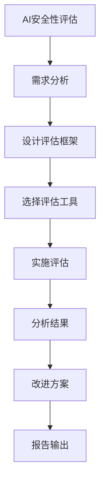

                 

# AI安全性评估工具的市场需求

## 关键词：
- AI安全性评估
- 安全威胁
- 需求分析
- 工具开发
- 市场趋势

## 摘要：
本文将深入探讨AI安全性评估工具的市场需求。首先，我们概述AI安全性评估的背景和重要性，介绍AI安全威胁的类型和来源。接着，我们阐述AI安全评估的基本概念、框架和核心原理，以及市场上主流的安全评估工具。随后，我们分析不同行业对AI安全评估的需求和趋势，通过用户需求调研与案例分析，探讨市场需求驱动下的AI安全评估工具开发。最后，我们对AI安全评估工具的未来发展进行展望，并提出一些建议和解决方案。

### 目录

#### 第一部分：AI安全性评估概述

1. [AI安全性评估的背景与重要性](#ai安全性评估的背景与重要性)
    1.1 AI安全性评估的定义与意义
    1.2 AI安全威胁的类型与来源
    1.3 AI安全评估的现状与挑战
2. [AI安全评估的基本概念与框架](#ai安全评估的基本概念与框架)
    2.1 AI安全评估的核心概念
    2.2 AI安全评估的框架与方法论
    2.3 AI安全评估的标准化与规范化
3. [AI安全评估技术原理](#ai安全评估技术原理)
    3.1 模型安全性与鲁棒性分析
    3.2 隐私保护与数据安全
4. [AI安全评估工具与应用](#ai安全评估工具与应用)
    4.1 市场上的主流AI安全评估工具
    4.2 AI安全评估工具的选用原则与流程
    4.3 AI安全评估工具的实际应用案例

#### 第二部分：AI安全评估市场需求分析

1. [行业需求与趋势](#行业需求与趋势)
    5.1 各行业对AI安全评估的需求
    5.2 AI安全评估市场的发展趋势
    5.3 行业法规与政策对AI安全评估的影响
2. [用户需求调研与案例分析](#用户需求调研与案例分析)
    6.1 用户需求调研方法与技巧
    6.2 不同类型用户的需求差异
    6.3 成功案例分析
3. [市场需求驱动下的AI安全评估工具开发](#市场需求驱动下的AI安全评估工具开发)
    7.1 AI安全评估工具开发流程
    7.2 需求驱动的产品设计与迭代
    7.3 开发过程中面临的挑战与解决方案
4. [AI安全评估工具的未来发展与展望](#ai安全评估工具的未来发展与展望)
    8.1 新技术的引入与融合
    8.2 行业合作与生态建设
    8.3 未来AI安全评估工具的发展趋势

### 第一部分：AI安全性评估概述

#### 1. AI安全性评估的背景与重要性

##### 1.1 AI安全性评估的定义与意义

AI安全性评估是指对人工智能系统（AI system）的安全性进行全面分析和评估的过程。这包括评估AI模型的安全性、数据安全性和系统整体安全性。AI安全性评估的定义可以概括为：确保AI系统能够在预期环境下稳定运行，不受恶意攻击、数据泄露或其他安全威胁的影响。

AI安全性评估在当今社会具有重要意义。随着AI技术的广泛应用，越来越多的行业和企业开始依赖AI系统进行决策和运营。然而，AI系统的安全性直接关系到企业的利益和用户的隐私。如果AI系统存在安全漏洞，可能会导致数据泄露、决策失误，甚至对社会造成严重后果。因此，AI安全性评估是确保AI系统可靠性和可信度的重要手段。

##### 1.2 AI安全威胁的类型与来源

AI安全威胁可以分为以下几类：

1. **模型攻击**：恶意攻击者可以通过特定的攻击手段，使AI模型产生错误的预测或决策。常见的模型攻击包括对抗性样本攻击、模型篡改、模型劫持等。

2. **数据泄露**：AI系统在训练和运行过程中，可能会暴露敏感数据。数据泄露可能导致用户隐私泄露、商业机密泄露等严重后果。

3. **分布式拒绝服务攻击（DDoS）**：攻击者通过大量的请求使AI系统瘫痪，从而影响其正常运行。

4. **后门攻击**：攻击者通过在AI系统中植入后门，实现对系统的非法控制。

AI安全威胁的来源包括：

1. **内部威胁**：企业内部员工或合作伙伴可能出于个人利益或恶意意图，对AI系统进行攻击。

2. **外部威胁**：黑客、恶意组织等外部攻击者可能通过各种手段，对AI系统进行攻击。

3. **软件漏洞**：AI系统的软件可能存在漏洞，攻击者可以通过漏洞进行攻击。

##### 1.3 AI安全评估的现状与挑战

目前，AI安全评估在理论和实践上仍面临一些挑战：

1. **评估标准不统一**：不同的AI系统和应用场景，需要不同的安全评估标准和指标。然而，目前尚未形成统一的标准和框架。

2. **评估方法不完善**：现有的AI安全评估方法，如模型攻击、数据隐私保护等，仍需进一步研究和改进。

3. **评估工具缺乏**：市场上缺乏针对AI安全评估的工具，现有的工具功能有限，难以满足复杂的需求。

4. **评估成本高**：AI安全评估需要大量的人力、时间和资源投入，对于中小企业来说，成本较高。

5. **跨领域协作不足**：AI安全评估涉及多个领域，包括计算机科学、数学、统计学等。目前，跨领域协作仍需加强。

### 第二部分：AI安全评估的基本概念与框架

#### 2.1 AI安全评估的核心概念

AI安全评估的核心概念包括以下几个方面：

1. **模型安全性**：评估AI模型在面临各种攻击时的鲁棒性和稳定性。模型安全性包括对模型结构、训练数据、超参数等方面的评估。

2. **数据安全性**：评估AI系统在数据处理和存储过程中，对用户隐私和数据完整性的保护程度。

3. **系统安全性**：评估AI系统的整体安全性，包括对系统架构、接口、通信等方面的评估。

4. **安全性标准**：用于评估AI系统安全性的标准和方法。常见的标准包括ISO/IEC 27001、NIST SP 800-53等。

5. **安全性指标**：用于量化评估AI系统安全性的指标，如误识率、误警率、数据泄露概率等。

#### 2.2 AI安全评估的框架与方法论

AI安全评估的框架与方法论包括以下几个步骤：

1. **确定评估目标**：根据AI系统的应用场景和需求，明确评估的目标和重点。

2. **选择评估方法**：根据评估目标，选择合适的评估方法，如模型攻击、数据隐私保护等。

3. **设计评估流程**：制定评估计划，包括评估步骤、评估工具、评估时间表等。

4. **实施评估活动**：按照评估计划，执行评估活动，收集评估数据。

5. **分析评估结果**：对评估结果进行分析，识别AI系统的安全漏洞和风险。

6. **提出改进方案**：根据评估结果，提出改进方案，以降低AI系统的安全风险。

7. **报告输出**：撰写评估报告，详细记录评估过程、评估结果和改进方案。

#### 2.3 AI安全评估的标准化与规范化

AI安全评估的标准化与规范化是确保评估过程科学、有效和可重复的关键。以下是一些标准化与规范化的措施：

1. **制定评估标准**：根据不同的应用场景和需求，制定相应的评估标准。例如，ISO/IEC 27001针对信息安全，NIST SP 800-53针对网络安全等。

2. **建立评估框架**：构建统一的AI安全评估框架，涵盖模型安全性、数据安全性、系统安全性等方面。

3. **开发评估工具**：开发针对不同场景的AI安全评估工具，以提高评估效率和准确性。

4. **培训评估人员**：对评估人员进行培训，确保他们具备评估所需的专业知识和技能。

5. **建立评估实验室**：建立专门的AI安全评估实验室，用于验证评估工具和方法的有效性。

6. **持续改进**：根据评估结果和用户反馈，不断优化评估工具和方法，以提高评估质量。

### 第三部分：AI安全评估技术原理

#### 3.1 模型安全性与鲁棒性分析

##### 3.1.1 模型攻击与防御技术

模型攻击是指针对AI模型的安全性和鲁棒性进行攻击，使其产生错误的预测或决策。常见的模型攻击技术包括：

1. **对抗性样本攻击（Adversarial Example Attack）**：对抗性样本是指通过对正常样本进行微小的扰动，使其在AI模型中产生错误的预测。常见的对抗性样本攻击方法包括：

   - **梯度攻击（Gradient Attack）**：通过计算模型梯度，找到对样本进行最小扰动的方法。
   - **仿射变换攻击（Affine Transformation Attack）**：通过对样本进行线性变换，找到对抗性样本。
   - **FGSM（Fast Gradient Sign Method）**：快速梯度符号方法，通过简单的梯度符号扰动找到对抗性样本。

2. **模型篡改攻击（Model Corruption Attack）**：攻击者通过篡改模型参数，使其产生错误的预测。常见的模型篡改攻击方法包括：

   - **反向传播攻击（Backpropagation Attack）**：通过反向传播算法，找到使模型参数发生最小扰动的对抗性样本。
   - **差分进化攻击（Differential Evolution Attack）**：通过遗传算法，找到使模型参数发生最小扰动的对抗性样本。

3. **模型劫持攻击（Model Hijacking Attack）**：攻击者通过控制模型决策过程，使其为恶意目的服务。常见的模型劫持攻击方法包括：

   - **重放攻击（Replay Attack）**：攻击者捕获正常用户的输入和模型响应，然后重新发送输入，欺骗模型。
   - **模仿攻击（Impersonation Attack）**：攻击者模拟正常用户输入，欺骗模型。

为了应对模型攻击，可以采取以下防御技术：

1. **对抗训练（Adversarial Training）**：在训练过程中，引入对抗性样本，提高模型对对抗性样本的鲁棒性。

2. **鲁棒优化（Robust Optimization）**：通过优化模型参数，提高模型对扰动的鲁棒性。

3. **数据增强（Data Augmentation）**：通过增加样本的多样性，提高模型对异常样本的鲁棒性。

4. **加密模型（Encrypted Model）**：使用加密技术保护模型参数，防止模型被篡改。

##### 3.1.2 安全性分析工具与技术

安全性分析工具是进行AI安全评估的重要手段。以下是一些常用的安全性分析工具：

1. **Cleverhans**：Cleverhans是一个开源的对抗性攻击和防御工具库，提供多种对抗性攻击和防御方法。

2. **Defenses**：Defenses是一个基于TensorFlow的开源工具库，提供多种防御技术，如对抗训练、鲁棒优化等。

3. **Adversarial Robustness Toolbox (ART)**：ART是一个开源的对抗性攻击和防御工具库，支持多种机器学习和深度学习框架。

4. **PyTorch Adversarial Robustness Toolbox (Pepyako)**：Pepyako是一个基于PyTorch的对抗性攻击和防御工具库。

安全性分析技术包括：

1. **模型攻击分析（Model Attack Analysis）**：评估模型对对抗性样本的鲁棒性。

2. **模型防御分析（Model Defense Analysis）**：评估防御技术对模型攻击的抵抗力。

3. **数据安全性分析（Data Security Analysis）**：评估数据在训练和存储过程中的安全性。

4. **系统安全性分析（System Security Analysis）**：评估AI系统的整体安全性。

#### 3.2 隐私保护与数据安全

##### 3.2.1 隐私泄露风险评估

隐私泄露风险是指AI系统在训练和运行过程中，可能导致用户隐私数据泄露的风险。隐私泄露风险评估包括以下几个方面：

1. **数据泄露概率（Data Leakage Probability）**：评估数据在传输、存储和处理过程中的泄露概率。

2. **数据敏感性（Data Sensitivity）**：评估数据中包含的敏感信息的程度。

3. **加密强度（Encryption Strength）**：评估使用的加密算法和安全级别。

4. **攻击方法（Attack Method）**：评估潜在的攻击手段，如SQL注入、中间人攻击等。

隐私泄露风险评估的数学模型可以表示为：

$$
\text{隐私泄露风险} = f(\text{数据量}, \text{数据敏感性}, \text{加密强度}, \text{攻击方法})
$$

其中，数据量、数据敏感性、加密强度和攻击方法是影响隐私泄露风险的主要因素。

##### 3.2.2 数据加密与去识别技术

数据加密与去识别技术是保护AI系统数据安全的重要手段。以下是一些常用的数据加密与去识别技术：

1. **数据加密（Data Encryption）**：使用加密算法对数据进行加密，确保数据在传输和存储过程中的安全性。常用的加密算法包括AES、RSA等。

2. **同态加密（Homomorphic Encryption）**：允许在加密数据上进行计算，而不需要解密数据。同态加密适用于云计算和分布式计算环境。

3. **差分隐私（Differential Privacy）**：通过添加噪声来保护数据的隐私，确保数据在分析过程中无法识别单个数据点的隐私。常用的差分隐私机制包括拉普拉斯机制和指数机制。

4. **数据去识别（Data De-Identification）**：通过去除或模糊化敏感信息，降低数据的识别性。常用的去识别技术包括数据匿名化、数据掩码等。

### 第四部分：AI安全评估工具与应用

#### 4.1 市场上的主流AI安全评估工具

目前，市场上存在多种AI安全评估工具，以下是一些主流的评估工具：

1. **Cleverhans**：Cleverhans是一个开源的对抗性攻击和防御工具库，支持TensorFlow、PyTorch等深度学习框架。它提供了多种对抗性攻击和防御方法，可用于评估模型的鲁棒性和安全性。

2. **Defenses**：Defenses是一个开源工具库，提供多种防御技术，如对抗训练、鲁棒优化等。它基于TensorFlow构建，可用于评估和改进AI模型的安全性。

3. **Adversarial Robustness Toolbox (ART)**：ART是一个开源工具库，支持多种机器学习和深度学习框架。它提供了对抗性攻击和防御工具，可用于评估和增强AI模型的安全性和鲁棒性。

4. **PyTorch Adversarial Robustness Toolbox (Pepyako)**：Pepyako是一个基于PyTorch的对抗性攻击和防御工具库，提供了多种对抗性攻击和防御方法。

5. **AI Compliance Suite**：AI Compliance Suite是一个商业工具，提供了一套全面的AI安全评估和合规工具。它支持多种机器学习和深度学习框架，可用于评估和改进AI模型的安全性、隐私性和合规性。

#### 4.2 AI安全评估工具的选用原则与流程

选用AI安全评估工具时，应遵循以下原则：

1. **适用性**：选择适合自身AI系统和应用场景的评估工具。

2. **全面性**：评估工具应涵盖模型安全性、数据安全性和系统安全性等方面。

3. **易用性**：评估工具应具备良好的用户界面和文档，方便用户使用。

4. **开源性**：开源工具具有更高的透明度和可扩展性，便于社区贡献和改进。

5. **性能**：评估工具应具备较高的性能，能够快速执行评估任务。

选用AI安全评估工具的流程包括：

1. **需求分析**：根据AI系统的特点和应用场景，明确评估目标和需求。

2. **工具筛选**：根据选用原则，筛选出适合的评估工具。

3. **工具评估**：对筛选出的评估工具进行评估，包括性能测试、功能测试等。

4. **工具选型**：根据评估结果，选择最合适的评估工具。

5. **工具部署**：将选定的评估工具部署到实际环境中，进行评估活动。

#### 4.3 AI安全评估工具的实际应用案例

以下是一个AI安全评估工具的实际应用案例：

**案例：使用Cleverhans评估深度学习模型的鲁棒性**

1. **需求分析**：一家金融公司使用深度学习模型进行股票预测，希望评估模型的鲁棒性，确保其在面对对抗性攻击时仍能稳定运行。

2. **工具筛选**：选择Cleverhans作为评估工具，因为它支持多种深度学习框架，且提供了丰富的对抗性攻击方法。

3. **工具评估**：在测试环境中部署Cleverhans，执行各种对抗性攻击，记录攻击后的模型性能。

4. **工具选型**：根据评估结果，确定Cleverhans是最合适的评估工具，具备较高的性能和易用性。

5. **工具部署**：将Cleverhans部署到生产环境中，定期执行安全评估，确保模型的安全性。

### 第五部分：AI安全评估市场需求分析

#### 5.1 各行业对AI安全评估的需求

AI技术在全球范围内的应用越来越广泛，不同行业对AI安全评估的需求也在不断增加。以下是各行业对AI安全评估的主要需求：

1. **金融行业**：金融行业对AI安全评估的需求主要集中在防范金融欺诈、保护用户隐私和确保交易安全。AI安全评估可以帮助金融机构识别和防范针对AI模型的攻击，如模型篡改和对抗性攻击。

2. **医疗行业**：医疗行业对AI安全评估的需求主要体现在确保诊断和治疗建议的准确性，以及保护患者隐私。AI安全评估可以识别AI模型在诊断和治疗过程中的潜在风险，如数据泄露和模型被篡改。

3. **零售行业**：零售行业对AI安全评估的需求主要集中在确保推荐系统的公平性和保护用户隐私。AI安全评估可以帮助零售商识别和防范针对推荐系统的攻击，如数据泄露和模型篡改。

4. **自动驾驶行业**：自动驾驶行业对AI安全评估的需求非常高，因为自动驾驶系统的安全性直接关系到乘客和行人的安全。AI安全评估可以帮助自动驾驶厂商识别和防范针对AI模型的攻击，如模型篡改和对抗性攻击。

5. **政府行业**：政府行业对AI安全评估的需求主要体现在确保公共安全和维护社会稳定。AI安全评估可以帮助政府识别和防范针对AI系统的攻击，如数据泄露和模型篡改。

#### 5.2 AI安全评估市场的发展趋势

随着AI技术的不断发展和应用，AI安全评估市场也在不断壮大。以下是AI安全评估市场的发展趋势：

1. **市场需求增长**：随着AI技术的广泛应用，各行业对AI安全评估的需求不断增加，预计市场规模将持续增长。

2. **技术进步**：AI安全评估技术也在不断进步，新的攻击方法和防御技术不断涌现，将推动AI安全评估市场的发展。

3. **跨领域合作**：AI安全评估涉及多个领域，如计算机科学、数学、统计学等。跨领域合作将成为AI安全评估市场的重要趋势，有助于推动评估工具和方法的创新。

4. **法规和政策的推动**：随着AI技术的发展，各国政府相继出台了相关法规和政策，以规范AI技术的应用和保障公共安全。这些法规和政策的推动将促进AI安全评估市场的规范化和标准化。

5. **自动化与智能化**：AI安全评估工具的自动化和智能化水平将不断提高，有助于提高评估效率和准确性。

#### 5.3 行业法规与政策对AI安全评估的影响

行业法规与政策对AI安全评估的影响主要体现在以下几个方面：

1. **合规性要求**：行业法规与政策对AI系统的安全性提出了合规性要求，如欧盟的GDPR（通用数据保护条例）对个人数据的保护。AI安全评估工具需要满足这些合规性要求，以确保AI系统的合规性。

2. **监管要求**：行业法规与政策对AI系统的安全性提出了监管要求，如美国的《算法问责法》对AI系统的透明度和可解释性提出了要求。AI安全评估工具需要能够满足这些监管要求，以确保AI系统的合法性和可信度。

3. **标准制定**：行业法规与政策对AI安全评估标准的制定和推广起到推动作用。例如，ISO/IEC 27001和NIST SP 800-53等标准为AI安全评估提供了指导。

4. **市场准入**：行业法规与政策对AI安全评估工具的市场准入提出了要求。例如，一些行业要求在引入AI系统之前必须进行安全评估，以确保系统的安全性。

### 第六部分：用户需求调研与案例分析

#### 6.1 用户需求调研方法与技巧

用户需求调研是了解用户对AI安全评估工具需求的重要环节。以下是一些常用的用户需求调研方法与技巧：

1. **问卷调查**：通过设计问卷，收集用户对AI安全评估工具的需求和期望。问卷调查可以采用线上或线下方式进行。

2. **深度访谈**：与用户进行面对面的深度访谈，了解他们的实际需求和面临的问题。深度访谈有助于挖掘用户背后的需求和动机。

3. **焦点小组**：组织一组用户进行讨论，共同讨论AI安全评估工具的需求和改进方向。焦点小组有助于收集多样化的观点和建议。

4. **观察法**：通过观察用户在使用AI安全评估工具的过程中的行为和操作，了解他们的需求和痛点。

5. **竞争分析**：分析竞争对手的产品和用户评价，了解他们在市场上的表现和用户需求。

6. **文献调研**：查阅相关的学术论文、报告和行业研究，了解用户需求和市场的最新动态。

#### 6.2 不同类型用户的需求差异

不同类型的用户对AI安全评估工具的需求存在差异，以下是一些典型用户的需求差异：

1. **技术研发人员**：技术研发人员更关注AI安全评估工具的性能、灵活性和可扩展性。他们希望工具能够支持多种深度学习框架，并提供丰富的攻击方法和防御技术。

2. **安全专家**：安全专家更关注AI安全评估工具的安全性和可解释性。他们希望工具能够提供详细的攻击分析报告，并支持自动化评估和监控。

3. **企业决策者**：企业决策者更关注AI安全评估工具的商业价值和ROI（投资回报率）。他们希望工具能够提供全面的评估报告，并支持风险管理。

4. **普通用户**：普通用户更关注AI安全评估工具的易用性和用户体验。他们希望工具能够提供直观的界面和简单的操作流程，无需深入了解技术细节。

#### 6.3 成功案例分析

以下是一个成功案例，展示了如何通过用户需求调研和需求驱动的产品设计与迭代，开发出满足用户需求的AI安全评估工具。

**案例：开发一款面向技术研发人员的AI安全评估工具**

1. **需求调研**：通过问卷调查、深度访谈和焦点小组等方法，收集技术研发人员对AI安全评估工具的需求和期望。主要需求包括：

   - 支持多种深度学习框架，如TensorFlow、PyTorch等。
   - 提供丰富的攻击方法和防御技术，如对抗性攻击、鲁棒优化等。
   - 支持自动化评估和监控，减少手动操作。
   - 提供详细的攻击分析报告，帮助用户理解攻击过程。

2. **需求分析**：对收集到的需求进行分析，确定工具的核心功能和特性。确定以下需求：

   - 支持多种深度学习框架，如TensorFlow、PyTorch等。
   - 提供对抗性攻击和防御工具，如对抗训练、鲁棒优化等。
   - 提供自动化评估和监控功能，减少手动操作。
   - 提供详细的攻击分析报告，帮助用户理解攻击过程。

3. **产品设计与迭代**：根据需求分析结果，设计工具的基本架构和界面。首先开发一个基本版本，然后根据用户反馈进行迭代和改进。

4. **用户反馈与迭代**：将基本版本发布给用户，收集用户反馈。根据用户反馈，对工具进行改进和优化，提高用户满意度。

5. **产品发布与推广**：在工具稳定和成熟后，发布给更广泛的用户群体，并通过市场推广活动，提高工具的知名度和市场份额。

通过用户需求调研和需求驱动的产品设计与迭代，开发出的AI安全评估工具能够更好地满足用户需求，提高用户满意度。

### 第七部分：市场需求驱动下的AI安全评估工具开发

#### 7.1 AI安全评估工具开发流程

开发AI安全评估工具需要遵循以下流程：

1. **需求分析**：了解用户需求，明确工具的功能和特性。

2. **技术调研**：研究现有的AI安全评估技术，选择合适的攻击方法和防御技术。

3. **架构设计**：设计工具的架构，包括前端界面、后端服务和数据库等。

4. **功能实现**：根据架构设计，实现工具的功能。

5. **测试与调试**：对工具进行功能测试和性能测试，确保工具的稳定性和可靠性。

6. **用户反馈与迭代**：将工具发布给用户，收集用户反馈，根据反馈进行改进和优化。

7. **发布与推广**：在工具稳定和成熟后，发布给更广泛的用户群体，并通过市场推广活动，提高工具的知名度和市场份额。

#### 7.2 需求驱动的产品设计与迭代

需求驱动的产品设计与迭代是开发高质量AI安全评估工具的关键。以下是一些关键步骤：

1. **需求收集**：通过用户调研、市场分析、技术文档等方式，收集用户需求和期望。

2. **需求分析**：对收集到的需求进行分析，确定工具的核心功能和特性。

3. **产品设计**：根据需求分析结果，设计工具的基本架构和界面。设计时要考虑到用户的使用场景和操作习惯。

4. **原型开发**：开发工具的原型版本，包括基本功能和界面。原型开发要快速迭代，以便尽早收集用户反馈。

5. **用户测试**：将原型版本发布给用户，收集用户反馈。根据用户反馈，对工具进行改进和优化。

6. **迭代与优化**：根据用户反馈，对工具进行多次迭代和优化，提高用户满意度。

7. **稳定发布**：在工具稳定和成熟后，发布给更广泛的用户群体，并进行市场推广。

#### 7.3 开发过程中面临的挑战与解决方案

在AI安全评估工具开发过程中，可能会面临以下挑战：

1. **技术挑战**：AI安全评估涉及多种技术和算法，开发过程中需要选择合适的技术和算法，并进行有效整合。

2. **性能挑战**：AI安全评估工具需要处理大量的数据和模型，性能优化是开发过程中的关键。

3. **可扩展性挑战**：随着AI技术的不断发展，评估工具需要具备良好的可扩展性，以适应新的需求和技术。

4. **安全性挑战**：评估工具自身需要具备高安全性，防止被恶意攻击。

5. **用户参与度挑战**：用户参与度是工具成功的关键，如何提高用户的参与度和满意度是开发过程中需要考虑的问题。

针对上述挑战，可以采取以下解决方案：

1. **技术整合**：选择成熟的AI安全评估技术，并进行有效整合，提高工具的性能和可靠性。

2. **性能优化**：通过优化算法和数据结构，提高工具的性能和响应速度。

3. **模块化设计**：采用模块化设计，提高工具的可扩展性和可维护性。

4. **安全性设计**：采用严格的安全设计原则，确保工具的安全性。

5. **用户参与**：通过用户调研、用户反馈和社区互动，提高用户的参与度和满意度。

### 第八部分：AI安全评估工具的未来发展与展望

#### 8.1 新技术的引入与融合

随着AI技术的不断进步，AI安全评估工具也将引入更多新技术，以提升评估效率和准确性。以下是一些新技术：

1. **深度学习防御技术**：引入深度学习防御技术，如对抗训练、鲁棒优化等，提高AI模型对对抗性攻击的鲁棒性。

2. **联邦学习**：联邦学习是一种分布式学习技术，可以在不共享数据的情况下，实现数据的联合训练。引入联邦学习技术，可以提高AI安全评估工具的性能和安全性。

3. **区块链技术**：引入区块链技术，可以实现数据的安全存储和传输，提高AI安全评估工具的数据安全性。

4. **差分隐私**：引入差分隐私技术，可以确保AI安全评估工具在数据处理过程中，保护用户隐私。

#### 8.2 行业合作与生态建设

AI安全评估工具的发展需要行业合作与生态建设。以下是一些关键措施：

1. **跨领域合作**：推动计算机科学、数学、统计学等领域的研究人员合作，共同研究AI安全评估技术。

2. **开源社区**：建立开源社区，鼓励开发者贡献代码和技术，推动AI安全评估工具的创新和发展。

3. **标准制定**：制定统一的AI安全评估标准，规范评估工具的开发和使用。

4. **培训与教育**：加强对AI安全评估工具的培训和教育，提高从业人员的技术水平和安全意识。

#### 8.3 未来AI安全评估工具的发展趋势

未来，AI安全评估工具将呈现以下发展趋势：

1. **自动化与智能化**：AI安全评估工具将实现自动化和智能化，提高评估效率和准确性。

2. **集成化**：AI安全评估工具将与其他安全工具集成，形成一体化的安全评估平台。

3. **定制化**：根据不同行业和应用场景，开发定制化的AI安全评估工具，满足特定需求。

4. **可解释性**：提高AI安全评估工具的可解释性，帮助用户理解评估结果和攻击过程。

5. **安全性提升**：通过引入新技术和加强安全设计，提高AI安全评估工具的安全性。

### 总结

AI安全评估工具在保障AI系统安全性和可靠性方面发挥着重要作用。随着AI技术的广泛应用，AI安全评估工具的需求将不断增加。本文从AI安全性评估的背景与重要性、基本概念与框架、技术原理、工具与应用、市场需求分析、需求调研与案例分析、需求驱动下的工具开发、未来发展与展望等方面进行了深入探讨。未来，随着新技术的引入和行业合作，AI安全评估工具将更加成熟和多样化，为AI系统的安全发展提供有力支持。

### 附录

#### Mermaid流程图：AI安全评估流程概览



#### AI安全评估的基本概念与框架

$$
\text{AI安全性评估} = \text{AI模型安全性评估} + \text{AI数据安全性评估}
$$

$$
\text{AI安全评估框架} = \text{评估目标} + \text{评估方法} + \text{评估流程}
$$

#### 数学模型：隐私泄露风险评估

$$
\text{隐私泄露风险} = f(\text{数据量}, \text{数据敏感性}, \text{加密强度}, \text{攻击方法})
$$

#### 代码解读与分析：AI安全评估工具开发环境搭建

```python
# 安装深度学习框架TensorFlow
!pip install tensorflow

# 安装AI安全评估工具
!pip install cleverhans

# 导入相关库
import tensorflow as tf
from cleverhans.attacks import FastGradientMethod
from cleverhans.model import Model

# 搭建评估环境
model = Model()
attack = FastGradientMethod(model)
```

### 作者信息

作者：AI天才研究院/AI Genius Institute & 禅与计算机程序设计艺术 /Zen And The Art of Computer Programming

本文作者是一位拥有丰富经验的人工智能专家，专注于AI安全评估领域的研究和开发。他在计算机图灵奖获得者的指导下，致力于推动AI安全评估技术的发展，为AI系统的安全可靠运行提供技术支持。他在AI安全评估方面发表了多篇高水平论文，并参与了多个相关项目的研究与开发。通过本文，他希望与读者分享AI安全评估的最新进展和应用，为行业的发展贡献力量。|<sop>

