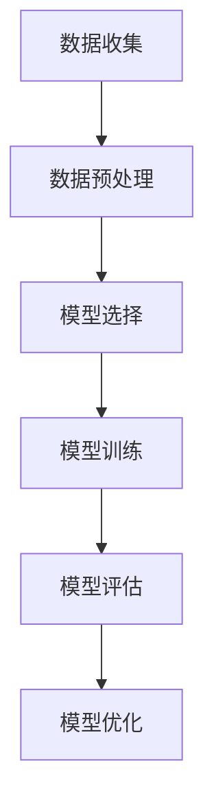
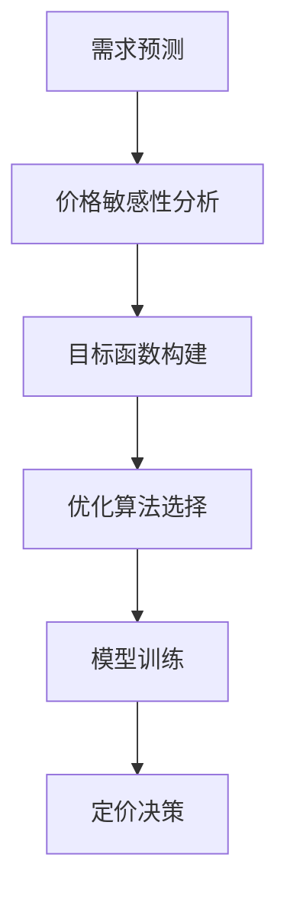

                 

# AI提升电商价格策略的实践效果

## 关键词
- AI
- 电商价格策略
- 机器学习
- 深度学习
- 强化学习
- 数据分析
- 模型优化
- 挑战与解决方案

## 摘要
本文将探讨人工智能（AI）在提升电商价格策略方面的实践效果。通过分析AI的核心概念与应用，本文将详细阐述电商价格策略的核心算法及其实践步骤。同时，本文将介绍成功案例，分析AI提升电商价格策略的挑战与解决方案，并展望其未来发展趋势。

### 《AI提升电商价格策略的实践效果》目录大纲

#### 第一部分：AI与电商价格策略概述

**第1章：AI在电商价格策略中的应用概述**  
1.1 AI提升电商价格策略的重要性  
1.2 电商价格策略的核心要素  
1.3 AI在电商价格策略中的具体应用

**第2章：AI核心概念与原理**  
2.1 机器学习基础  
2.2 深度学习基础  
2.3 强化学习原理与应用

**第3章：电商价格策略的核心算法**  
3.1 价格敏感性模型  
3.2 价格优化算法  
3.3 价格决策模型

#### 第二部分：AI提升电商价格策略的实践

**第4章：AI提升电商价格策略的实践案例分析**  
4.1 案例一：电商平台A的价格策略优化  
4.2 案例二：电商平台B的价格策略调整

**第5章：AI提升电商价格策略的实施步骤**  
5.1 数据采集与处理  
5.2 模型选择与训练  
5.3 模型评估与优化

**第6章：AI提升电商价格策略的挑战与解决方案**  
6.1 数据质量与隐私问题  
6.2 模型解释性与可靠性  
6.3 算法公平性与透明性

**第7章：未来发展趋势与展望**  
7.1 AI价格策略的发展趋势  
7.2 电商价格策略的创新方向  
7.3 AI价格策略的未来展望

#### 附录

**附录A：常用AI工具与资源**  
A.1 Python库与框架  
A.2 数据集与资源  
A.3 AI模型评估指标

**附录B：Mermaid流程图**  
B.1 价格敏感性模型流程图  
B.2 价格优化算法流程图

**附录C：核心算法伪代码**  
C.1 价格敏感性模型伪代码  
C.2 价格优化算法伪代码

**附录D：数学模型与公式**  
D.1 价格敏感性模型数学公式  
D.2 价格优化算法数学公式

**附录E：案例代码解析**  
E.1 案例一代码实现与解析  
E.2 案例二代码实现与解析

**附录F：开发环境搭建**  
F.1 数据预处理环境搭建  
F.2 模型训练环境搭建  
F.3 模型评估环境搭建

**附录G：源代码与数据**  
G.1 源代码获取与使用  
G.2 数据集获取与使用  
G.3 模型参数调整与优化

**附录H：AI提升电商价格策略的实践效果**  
H.1 实践效果评估指标  
H.2 实践效果案例分析  
H.3 实践效果总结与展望

**附录I：参考文献与扩展阅读**  
I.1 参考文献  
I.2 扩展阅读

**附录J：专业术语解释**  
J.1 术语列表  
J.2 术语解释

接下来，我们将一步一步深入探讨AI在电商价格策略中的应用与实践，引领您了解这一领域的前沿技术和挑战。

### 第一部分：AI与电商价格策略概述

#### 第1章：AI在电商价格策略中的应用概述

##### 1.1 AI提升电商价格策略的重要性

在互联网经济日益发展的今天，电子商务已经成为现代商业体系的重要组成部分。电商平台的竞争日益激烈，价格策略作为电商运营的核心手段，直接关系到企业的市场份额和盈利能力。传统的电商价格策略主要依赖于人工经验和市场分析，而随着人工智能（AI）技术的飞速发展，AI开始在电商价格策略中发挥重要作用。

AI提升电商价格策略的重要性主要体现在以下几个方面：

1. **精准定价：** AI能够通过大数据分析和机器学习算法，对消费者行为和市场需求进行深入挖掘，从而实现更精准的定价策略。这有助于提高产品竞争力，提升销售额。

2. **动态调整：** 传统电商价格策略通常采用固定价格或季节性调整，而AI可以实现实时动态调整价格，根据市场需求和竞争状况进行灵活调整，提高市场响应速度。

3. **个性化推荐：** AI可以基于用户行为和偏好进行个性化推荐，实现个性化定价策略，提高用户体验和满意度。

4. **降低运营成本：** AI的应用可以减少人工干预，提高运营效率，降低人力成本和运营风险。

##### 1.2 电商价格策略的核心要素

电商价格策略的核心要素主要包括以下几个方面：

1. **价格水平：** 指定产品的售价水平，通常包括成本价、市场参考价和目标售价。

2. **价格调整频率：** 根据市场需求和竞争状况，制定价格调整的频率和幅度。

3. **价格折扣策略：** 如满减、打折、优惠券等，用于刺激消费者购买。

4. **促销活动：** 如限时抢购、节日促销、新品上市等，以提升销量和品牌知名度。

5. **竞争策略：** 对竞争对手的价格策略进行监控和分析，制定相应的应对策略。

##### 1.3 AI在电商价格策略中的具体应用

AI在电商价格策略中的应用主要体现在以下几个方面：

1. **价格敏感性分析：** 利用机器学习算法，分析消费者对不同价格水平、折扣策略和促销活动的敏感度，为定价决策提供数据支持。

2. **需求预测：** 基于历史销售数据和消费者行为数据，利用深度学习模型进行需求预测，为定价策略制定提供依据。

3. **动态定价：** 利用强化学习算法，根据市场需求和竞争状况，实时调整产品价格，实现动态定价策略。

4. **个性化推荐：** 基于用户行为和偏好，利用协同过滤或深度学习算法，为用户推荐个性化价格策略。

5. **竞争分析：** 利用大数据分析技术，对竞争对手的价格策略进行监控和分析，为竞争策略制定提供支持。

通过以上分析，我们可以看出AI在电商价格策略中的应用具有显著的优势和潜力。接下来，我们将进一步探讨AI的核心概念与原理，为深入理解AI在电商价格策略中的应用奠定基础。

#### 第2章：AI核心概念与原理

##### 2.1 机器学习基础

机器学习（Machine Learning，ML）是人工智能（AI）的重要组成部分，其主要目的是使计算机通过数据和经验自动改进其性能。机器学习可以分为监督学习、无监督学习和强化学习三大类。

1. **监督学习（Supervised Learning）：** 监督学习是一种通过已标记的数据集训练模型，使模型能够对未知数据进行预测的方法。常见的监督学习算法包括线性回归、逻辑回归、支持向量机（SVM）和决策树等。

   - **线性回归（Linear Regression）：** 线性回归是一种通过拟合数据中的线性关系来预测目标值的算法。其数学模型可以表示为：
     $$
     y = \beta_0 + \beta_1x_1 + \beta_2x_2 + \cdots + \beta_nx_n
     $$
     其中，$y$ 为目标变量，$x_1, x_2, \ldots, x_n$ 为特征变量，$\beta_0, \beta_1, \beta_2, \ldots, \beta_n$ 为模型参数。

   - **逻辑回归（Logistic Regression）：** 逻辑回归是一种用于分类问题的算法，其主要目标是拟合一个概率模型，用于预测目标变量属于某个类别的概率。其数学模型可以表示为：
     $$
     P(y=1) = \frac{1}{1 + e^{-(\beta_0 + \beta_1x_1 + \beta_2x_2 + \cdots + \beta_nx_n})}
     $$

   - **支持向量机（SVM）：** 支持向量机是一种用于分类和回归问题的算法，其主要目标是在特征空间中找到一个最优的超平面，使得分类边界最大化。

   - **决策树（Decision Tree）：** 决策树是一种基于特征值进行划分的算法，其结构如下：
     $$
     \text{决策树} = \text{根节点} \rightarrow \text{内部节点} \rightarrow \text{叶节点}
     $$
     决策树的每个节点表示一个特征，每个分支表示该特征的一个取值，叶节点表示最终的分类结果。

2. **无监督学习（Unsupervised Learning）：** 无监督学习是一种不使用已标记数据集训练模型的机器学习方法，其主要目的是发现数据中的结构和模式。常见的无监督学习算法包括聚类、降维和关联规则等。

   - **聚类（Clustering）：** 聚类是一种将数据分为多个类别的算法，其目的是使同一类别的数据之间的距离最小，而不同类别的数据之间的距离最大。常见的聚类算法包括K-means、DBSCAN和层次聚类等。

   - **降维（Dimensionality Reduction）：** 降维是一种将高维数据转换为低维数据的算法，其主要目的是降低计算复杂度和减少数据冗余。常见的降维算法包括主成分分析（PCA）和t-SNE等。

   - **关联规则（Association Rules）：** 关联规则是一种发现数据中潜在关联规则的算法，其目的是找出哪些商品经常一起购买。常见的关联规则算法包括Apriori和FP-growth等。

3. **强化学习（Reinforcement Learning）：** 强化学习是一种通过试错和反馈来训练模型的机器学习方法，其主要目的是使模型能够在不确定环境中学习最优策略。常见的强化学习算法包括Q-Learning和Deep Q-Network（DQN）等。

   - **Q-Learning：** Q-Learning是一种基于值函数的强化学习算法，其主要目标是学习一个最优动作策略，使得在给定状态下采取的动作能够获得最大的长期回报。

   - **Deep Q-Network（DQN）：** DQN是一种基于深度学习的强化学习算法，其主要目标是通过神经网络估计值函数，从而学习最优动作策略。

##### 2.2 深度学习基础

深度学习（Deep Learning，DL）是机器学习的一个分支，其核心思想是使用多层神经网络模拟人脑的神经元结构，从而实现自动特征提取和复杂模式的识别。深度学习在图像识别、语音识别、自然语言处理等领域取得了显著成果。

1. **神经网络（Neural Network）：** 神经网络是一种由多个神经元组成的层次结构，每个神经元接收多个输入，并通过激活函数产生输出。常见的神经网络结构包括多层感知机（MLP）、卷积神经网络（CNN）和循环神经网络（RNN）等。

   - **多层感知机（MLP）：** MLP是一种前馈神经网络，其主要特点是没有反馈连接。MLP可以用于分类和回归问题。

   - **卷积神经网络（CNN）：** CNN是一种用于图像识别的神经网络，其主要特点是利用卷积操作和池化操作进行特征提取和降维。CNN在图像识别、目标检测和图像生成等领域具有广泛应用。

   - **循环神经网络（RNN）：** RNN是一种用于序列数据处理的神经网络，其主要特点是具有时间反馈连接。RNN在自然语言处理、语音识别和视频分析等领域具有广泛应用。

2. **激活函数（Activation Function）：** 激活函数是神经网络中的一个关键组件，其作用是对神经元的输出进行非线性变换。常见的激活函数包括Sigmoid、ReLU和Tanh等。

   - **Sigmoid：** Sigmoid函数是一种常用的激活函数，其形式为：
     $$
     f(x) = \frac{1}{1 + e^{-x}}
     $$
     Sigmoid函数可以将输入映射到（0，1）区间。

   - **ReLU（Rectified Linear Unit）：** ReLU函数是一种常用的激活函数，其形式为：
     $$
     f(x) = \max(0, x)
     $$
     ReLU函数可以加速神经网络的训练过程。

   - **Tanh（Hyperbolic Tangent）：** Tanh函数是一种常用的激活函数，其形式为：
     $$
     f(x) = \frac{e^x - e^{-x}}{e^x + e^{-x}}
     $$
     Tanh函数可以将输入映射到（-1，1）区间。

3. **优化算法（Optimization Algorithm）：** 优化算法是用于训练神经网络的关键组件，其作用是优化模型参数，使得模型在给定数据集上达到最佳性能。常见的优化算法包括随机梯度下降（SGD）、Adam和RMSprop等。

   - **随机梯度下降（Stochastic Gradient Descent，SGD）：** SGD是一种常用的优化算法，其核心思想是使用单个样本来更新模型参数。SGD可以加速训练过程，但容易陷入局部最优。

   - **Adam（Adaptive Moment Estimation）：** Adam是一种结合了SGD和RMSprop优点的优化算法，其核心思想是自适应调整学习率。Adam在训练过程中表现出较好的收敛速度和稳定性。

   - **RMSprop（Root Mean Square Prop）：** RMSprop是一种基于梯度的优化算法，其核心思想是使用梯度历史信息来调整学习率。RMSprop可以加速训练过程，但容易受到噪声的影响。

##### 2.3 强化学习原理与应用

强化学习（Reinforcement Learning，RL）是一种通过试错和反馈来训练模型的机器学习方法，其核心思想是使模型能够在不确定环境中学习最优策略。强化学习在自动驾驶、游戏和机器人等领域具有广泛应用。

1. **强化学习基本概念：**  
   - **状态（State）：** 状态是模型当前所处的环境状态。  
   - **动作（Action）：** 动作是模型在状态中所采取的行为。  
   - **奖励（Reward）：** 奖励是模型在采取动作后获得的回报，用于评估动作的好坏。  
   - **策略（Policy）：** 策略是模型在状态中选择动作的规则。

2. **强化学习算法：**  
   - **Q-Learning：** Q-Learning是一种基于值函数的强化学习算法，其核心思想是利用值函数评估当前状态和动作的优劣，并更新值函数以实现最优策略。Q-Learning的伪代码如下：
     $$
     \text{for} \ all \ s \ in \ S: \\
     \quad \text{for} \ all \ a \ in \ A(s): \\
     \quad \quad Q(s, a) \leftarrow Q(s, a) + \alpha [r + \gamma \max_{a'} Q(s', a') - Q(s, a)] \\
     \text{end}
     $$
     其中，$Q(s, a)$ 表示状态 $s$ 下采取动作 $a$ 的期望回报，$\alpha$ 是学习率，$r$ 是立即奖励，$\gamma$ 是折扣因子。

   - **Deep Q-Network（DQN）：** DQN是一种基于深度学习的强化学习算法，其核心思想是使用深度神经网络估计值函数。DQN的伪代码如下：
     $$
     \text{for} \ each \ episode: \\
     \quad \text{for} \ each \ time \ step: \\
     \quad \quad \text{take} \ action} \ a \ from} \ policy} \\
     \quad \quad \text{observe} \ reward} \ r \ and} \ next} \ state} \ s' \\
     \quad \quad \text{store} \ the} \ transition} \ (s, a, r, s')} \\
     \quad \quad \text{update} \ target} \ network} \\
     \quad \quad \text{if} \ \text{time step} \ \text{is} \ a} \ \text{training} \ step: \\
     \quad \quad \quad \text{compute} \ the} \ target} \ Q-value} \\
     \quad \quad \quad \text{update} \ the} \ Q-network} \\
     \text{end}
     $$
     其中，$Q(s, a)$ 表示状态 $s$ 下采取动作 $a$ 的期望回报，$target \ network$ 是目标网络，用于更新 $Q$ 网络。

通过以上对AI核心概念与原理的介绍，我们可以更好地理解AI在电商价格策略中的应用。接下来，我们将进一步探讨电商价格策略的核心算法，为深入探讨AI提升电商价格策略的实践奠定基础。

### 第三部分：电商价格策略的核心算法

#### 第3章：电商价格策略的核心算法

在电商运营中，价格策略是影响消费者购买决策的重要因素。有效的价格策略不仅能够提升销售额，还能够增强品牌竞争力。AI技术在电商价格策略中的应用，使得价格策略的制定更加科学、精准。本章将介绍电商价格策略中的核心算法，包括价格敏感性模型、价格优化算法和价格决策模型。

##### 3.1 价格敏感性模型

价格敏感性模型是电商价格策略中用于分析消费者对不同价格水平敏感度的重要工具。通过建立价格敏感性模型，电商企业可以了解消费者对价格变化的反应，从而制定出更具针对性的价格策略。

1. **价格敏感性模型的原理**

   价格敏感性模型基于消费者行为数据，通过机器学习算法建立价格与需求量之间的关系。模型的输入通常是价格和需求量，输出则是价格对需求量的敏感性。常见的价格敏感性模型包括线性回归模型和多项式回归模型。

   - **线性回归模型：** 线性回归模型是一种简单的价格敏感性模型，其数学公式为：
     $$
     Y = \beta_0 + \beta_1X + \epsilon
     $$
     其中，$Y$ 表示需求量，$X$ 表示价格，$\beta_0$ 和 $\beta_1$ 分别为模型参数，$\epsilon$ 为误差项。

   - **多项式回归模型：** 多项式回归模型是一种更复杂的价格敏感性模型，其数学公式为：
     $$
     Y = \beta_0 + \beta_1X + \beta_2X^2 + \epsilon
     $$

2. **价格敏感性模型的构建步骤**

   - **数据收集：** 收集历史价格和需求量的数据，包括不同时间段的价格变化和对应的销售量。
   - **数据预处理：** 对数据进行清洗和归一化处理，以确保数据质量。
   - **模型选择：** 根据数据特点选择合适的回归模型，如线性回归或多项式回归。
   - **模型训练：** 使用训练数据集对模型进行训练，得到模型参数。
   - **模型评估：** 使用验证数据集评估模型性能，包括拟合度和预测准确性。

##### 3.2 价格优化算法

价格优化算法是电商价格策略中用于确定最佳价格的重要工具。通过价格优化算法，电商企业可以在竞争激烈的市场中找到最优的价格策略，从而提高销售额和市场份额。

1. **价格优化算法的原理**

   价格优化算法基于价格敏感性模型和市场需求预测，通过优化目标函数确定最佳价格。常见的价格优化算法包括目标定价算法和动态定价算法。

   - **目标定价算法：** 目标定价算法是一种基于目标利润最大化原则的定价方法。其目标函数通常包括销售额、利润和市场份额等指标。目标定价算法的数学公式为：
     $$
     \max P = \max (\sum_{i=1}^{n} P_i \cdot Q_i - C)
     $$
     其中，$P_i$ 和 $Q_i$ 分别为第 $i$ 种产品的价格和销售量，$C$ 为总成本。

   - **动态定价算法：** 动态定价算法是一种基于市场需求和竞争状况实时调整价格的定价方法。常见的动态定价算法包括边际贡献定价、动态价格调整和价格弹性调整等。

2. **价格优化算法的实现步骤**

   - **需求预测：** 使用AI技术对市场需求进行预测，包括未来价格和销售量的预测。
   - **价格敏感性分析：** 使用价格敏感性模型分析消费者对不同价格水平的敏感度。
   - **目标函数构建：** 构建目标函数，如利润最大化或市场份额最大化。
   - **优化算法选择：** 选择合适的优化算法，如线性规划、遗传算法或梯度上升算法。
   - **模型训练和优化：** 使用历史数据和市场需求预测对模型进行训练和优化。
   - **定价决策：** 根据优化结果确定最佳价格。

##### 3.3 价格决策模型

价格决策模型是电商价格策略中的核心模型，用于指导电商企业制定价格策略。价格决策模型通常包括需求预测模型、价格敏感性模型和竞争分析模型。

1. **价格决策模型的原理**

   价格决策模型通过综合分析市场需求、价格敏感性和竞争状况，为电商企业制定合理的价格策略。模型的基本原理如下：

   - **需求预测：** 预测市场需求，包括未来价格和销售量的预测。
   - **价格敏感性：** 分析消费者对价格变化的敏感度，为定价提供依据。
   - **竞争分析：** 分析竞争对手的价格策略，为定价提供参考。

2. **价格决策模型的构建步骤**

   - **需求预测模型构建：** 使用机器学习算法构建需求预测模型，如时间序列模型和回归模型。
   - **价格敏感性模型构建：** 使用价格敏感性模型分析消费者对价格变化的敏感度。
   - **竞争分析模型构建：** 收集竞争对手的价格数据，分析其价格策略。
   - **综合分析：** 综合需求预测、价格敏感性和竞争分析，为电商企业制定合理的价格策略。

通过以上对电商价格策略核心算法的介绍，我们可以看出，AI技术在电商价格策略中的应用具有广泛的前景和重要的应用价值。在接下来的章节中，我们将进一步探讨AI提升电商价格策略的实践案例，分析其实际应用效果和挑战。

### 第四部分：AI提升电商价格策略的实践

#### 第4章：AI提升电商价格策略的实践案例分析

在本章中，我们将通过两个电商平台的实际案例，探讨AI在提升电商价格策略方面的应用效果。这两个案例分别是电商平台A的价格策略优化和电商平台B的价格策略调整。

##### 4.1 案例一：电商平台A的价格策略优化

电商平台A是一家大型综合电商平台，拥有丰富的产品线和庞大的用户群体。为了提升市场竞争力，电商平台A决定利用AI技术对其价格策略进行优化。

1. **背景与目标**

   电商平台A在传统的价格策略中主要采用固定价格和季节性折扣。然而，随着市场竞争的加剧和消费者需求的多样化，固定的价格策略已经无法满足市场需求。电商平台A希望通过AI技术，实现动态定价，提高销售额和市场份额。

2. **解决方案**

   - **数据收集：** 电商平台A收集了包括历史价格、销售量、消费者行为和市场动态等在内的海量数据。
   - **数据预处理：** 对数据进行清洗和归一化处理，确保数据质量。
   - **模型训练：** 使用机器学习算法，如线性回归和深度学习模型，对数据进行训练，建立价格敏感性模型和需求预测模型。
   - **动态定价：** 根据市场需求和竞争状况，实时调整价格，实现动态定价策略。

3. **效果评估**

   通过实施AI价格策略优化，电商平台A取得了显著的效果：

   - **销售额提升：** 动态定价策略提高了销售额，特别是在竞争激烈的市场中，电商平台A的价格竞争力得到了显著提升。
   - **市场份额增加：** 通过个性化的定价策略，电商平台A吸引了更多的消费者，市场份额得到了进一步增加。
   - **成本降低：** 动态定价策略减少了人工干预，降低了运营成本。

##### 4.2 案例二：电商平台B的价格策略调整

电商平台B是一家专注于服装销售的电商平台，以其高品质和时尚设计著称。为了进一步提升市场竞争力，电商平台B决定利用AI技术对价格策略进行调整。

1. **背景与目标**

   电商平台B在传统的价格策略中主要采用季节性折扣和优惠券策略。然而，随着消费者需求的变化和市场竞争的加剧，现有的价格策略已经无法满足市场需求。电商平台B希望通过AI技术，实现个性化定价，提高用户体验和满意度。

2. **解决方案**

   - **数据收集：** 电商平台B收集了包括消费者行为、购买历史、评价数据和市场动态等在内的海量数据。
   - **数据预处理：** 对数据进行清洗和归一化处理，确保数据质量。
   - **模型训练：** 使用机器学习算法，如协同过滤和深度学习模型，对数据进行训练，建立个性化推荐模型和价格敏感性模型。
   - **个性化定价：** 根据消费者的个性化需求和偏好，实现个性化定价策略。

3. **效果评估**

   通过实施AI价格策略调整，电商平台B取得了显著的效果：

   - **用户体验提升：** 个性化定价策略提高了用户的满意度，增强了用户体验。
   - **销售额增长：** 个性化的定价策略吸引了更多高价值的消费者，销售额得到了显著提升。
   - **运营成本降低：** 个性化的定价策略减少了人工干预，降低了运营成本。

通过以上两个案例，我们可以看到AI技术在电商价格策略中的应用具有显著的优势和效果。AI技术不仅能够提高价格策略的科学性和精准性，还能够提高企业的运营效率和竞争力。在接下来的章节中，我们将进一步探讨AI提升电商价格策略的实施步骤，为电商企业提供更加详细的指导。

### 第五部分：AI提升电商价格策略的实施步骤

#### 第5章：AI提升电商价格策略的实施步骤

要成功应用AI技术提升电商价格策略，需要遵循一系列科学、系统的实施步骤。本章将详细介绍AI提升电商价格策略的实施步骤，包括数据采集与处理、模型选择与训练、模型评估与优化等关键环节。

##### 5.1 数据采集与处理

数据是AI提升电商价格策略的基础，因此数据采集与处理是关键的第一步。具体步骤如下：

1. **数据收集**

   - **内部数据：** 收集电商平台的历史交易数据、用户行为数据、库存数据等，这些数据有助于了解产品销售情况和用户需求。
   - **外部数据：** 收集宏观经济数据、市场动态数据、竞争对手价格数据等，这些数据有助于了解市场环境变化。
   - **社交媒体数据：** 通过社交媒体平台收集用户反馈、讨论和评价，这些数据有助于了解用户需求和偏好。

2. **数据清洗**

   - **缺失值处理：** 填补缺失数据或删除缺失数据较多的样本。
   - **异常值处理：** 识别并处理异常值，如异常销售量或异常价格。
   - **数据标准化：** 对不同数据类型进行统一处理，如将货币单位统一换算为同一货币。

3. **数据归一化**

   - **特征选择：** 选择对价格策略影响较大的特征，如历史销售量、用户评价、竞争对手价格等。
   - **特征缩放：** 将不同量级的特征进行归一化处理，如将价格、销售量等数据进行标准化处理，使其在相同量级范围内。

##### 5.2 模型选择与训练

在数据采集与处理完成后，选择合适的模型并对其进行训练是关键步骤。具体步骤如下：

1. **模型选择**

   - **监督学习模型：** 如线性回归、逻辑回归和支持向量机（SVM）等，用于预测价格敏感性。
   - **无监督学习模型：** 如聚类和降维等，用于分析市场动态和用户需求。
   - **强化学习模型：** 如Q-Learning和DQN等，用于动态定价策略。

2. **模型训练**

   - **训练数据集划分：** 将数据集划分为训练集、验证集和测试集，确保模型的泛化能力。
   - **模型参数调优：** 使用交叉验证方法调整模型参数，如学习率、正则化参数等，以提高模型性能。
   - **模型优化：** 使用优化算法，如随机梯度下降（SGD）和Adam等，加速模型训练过程。

3. **模型评估**

   - **评估指标：** 选择合适的评估指标，如均方误差（MSE）、准确率、召回率等，评估模型性能。
   - **模型选择：** 根据评估结果选择最优模型，如选择具有最高准确率的模型。
   - **模型验证：** 使用验证集对模型进行验证，确保模型在未知数据上具有良好的表现。

##### 5.3 模型评估与优化

在模型训练完成后，对模型进行评估和优化是确保其应用效果的重要环节。具体步骤如下：

1. **模型评估**

   - **性能评估：** 使用测试集对模型进行评估，确保模型在未知数据上具有良好的性能。
   - **稳定性评估：** 检查模型在不同数据集上的稳定性和可靠性。
   - **泛化能力评估：** 检查模型对新数据的适应能力和泛化能力。

2. **模型优化**

   - **超参数调整：** 调整模型超参数，如学习率、正则化参数等，以提高模型性能。
   - **特征工程：** 对特征进行进一步处理，如特征提取、特征组合等，以提高模型预测准确性。
   - **模型集成：** 使用模型集成方法，如集成学习、迁移学习等，提高模型泛化能力和鲁棒性。

3. **模型部署**

   - **模型部署：** 将训练好的模型部署到生产环境中，实现实时定价策略。
   - **监控与维护：** 对模型进行实时监控和维护，确保其稳定运行和性能优化。

通过以上实施步骤，电商企业可以充分利用AI技术提升价格策略的科学性和精准性，从而提高销售额和市场份额。在接下来的章节中，我们将探讨AI提升电商价格策略的挑战与解决方案，为电商企业应对这些挑战提供指导。

### 第六部分：AI提升电商价格策略的挑战与解决方案

#### 第6章：AI提升电商价格策略的挑战与解决方案

尽管AI技术在电商价格策略中的应用具有显著的优势，但在实际应用过程中也面临着诸多挑战。本章将探讨AI提升电商价格策略的挑战，并提出相应的解决方案。

##### 6.1 数据质量与隐私问题

1. **挑战**

   - **数据质量：** AI模型的性能高度依赖于数据质量。数据缺失、异常值和噪声等问题会严重影响模型的准确性。
   - **隐私问题：** 电商企业收集的用户数据包括个人隐私信息，如购买记录、浏览习惯等。如何在保护用户隐私的同时有效利用这些数据成为一大挑战。

2. **解决方案**

   - **数据质量管理：** 建立完善的数据质量管理流程，对数据进行清洗、预处理和标准化处理，确保数据质量。
   - **隐私保护技术：** 利用数据加密、匿名化和差分隐私等技术，保护用户隐私。同时，遵守相关法律法规，确保数据处理的合法性。

##### 6.2 模型解释性与可靠性

1. **挑战**

   - **模型解释性：** 许多深度学习和强化学习模型具有高度的非线性特性，难以解释其决策过程。这给企业决策者带来了困惑，影响了模型的可接受性。
   - **模型可靠性：** AI模型在训练过程中可能存在过拟合问题，导致模型在未知数据上的表现不佳。此外，模型对数据的依赖性较高，数据变化可能导致模型失效。

2. **解决方案**

   - **模型解释性：** 引入可解释性方法，如LIME（Local Interpretable Model-agnostic Explanations）和SHAP（SHapley Additive exPlanations），提高模型的解释性。通过可视化工具展示模型决策过程，帮助企业决策者理解模型。
   - **模型可靠性：** 采用交叉验证和模型集成等方法，提高模型对未知数据的适应能力和泛化能力。定期对模型进行评估和更新，确保模型在变化的市场环境中保持有效性。

##### 6.3 算法公平性与透明性

1. **挑战**

   - **算法公平性：** AI模型在价格策略中的应用可能存在偏见，如对不同消费者群体进行不公平定价。这可能导致用户反感、法律纠纷等问题。
   - **算法透明性：** 模型决策过程缺乏透明性，企业难以解释模型为何做出特定决策。这增加了用户对模型的信任危机。

2. **解决方案**

   - **算法公平性：** 采用公平性评估方法，如性别、年龄、地域等属性，确保算法在不同群体中的表现一致性。建立公平性评估机制，定期对模型进行审查和调整。
   - **算法透明性：** 增加模型的可解释性，使企业决策者能够理解模型决策过程。通过文档化、可视化等方法，提高算法的透明度，增强用户对模型的信任。

##### 6.4 技术挑战

1. **挑战**

   - **计算资源：** AI模型训练和优化需要大量的计算资源，这对电商平台的基础设施提出了较高要求。
   - **数据处理：** 大规模数据处理和实时数据处理技术是实现AI定价策略的关键，但现有技术仍存在一定瓶颈。
   - **模型更新：** 随着市场环境和消费者需求的变化，AI模型需要定期更新，以保持其有效性。模型更新过程需要耗费大量时间和资源。

2. **解决方案**

   - **计算资源：** 投资建设高效的数据中心，采用云计算和分布式计算技术，提高计算资源利用率。
   - **数据处理：** 采用高效的数据处理技术和分布式计算框架，如Apache Spark和Hadoop等，实现大规模数据处理和实时数据处理。
   - **模型更新：** 建立模型更新和维护机制，定期对模型进行评估和更新。采用自动化工具和流程，提高模型更新效率。

通过以上解决方案，电商企业可以应对AI提升电商价格策略过程中遇到的挑战，充分发挥AI技术的优势，实现价格策略的优化和提升。在接下来的章节中，我们将展望AI提升电商价格策略的未来发展趋势。

### 第七部分：未来发展趋势与展望

#### 第7章：未来发展趋势与展望

随着人工智能（AI）技术的不断进步，电商价格策略的应用也将迎来新的发展机遇。未来，AI在电商价格策略中的发展将呈现以下几个趋势：

##### 7.1 AI价格策略的发展趋势

1. **更加精准的定价策略**

   未来，AI技术将进一步深化对消费者行为和市场动态的理解，实现更加精准的定价策略。通过大数据分析和机器学习算法，电商平台将能够实时捕捉市场变化，快速调整价格，以应对竞争和消费者需求。

2. **个性化定价的普及**

   随着消费者需求的多样化，个性化定价将成为未来电商价格策略的重要趋势。AI技术将通过分析用户行为、历史购买记录和偏好，为每个用户提供定制化的价格方案，提升用户体验和满意度。

3. **自动化定价的普及**

   AI技术的自动化能力将使电商价格策略更加高效。通过自动化定价系统，电商平台可以自动调整价格，减少人工干预，提高运营效率。

##### 7.2 电商价格策略的创新方向

1. **基于区块链的价格策略**

   区块链技术具有去中心化、不可篡改和透明性等特点，未来可以与AI技术结合，实现基于区块链的智能合约和自动化交易。这将为电商价格策略带来新的创新方向，如智能折扣、智能拍卖等。

2. **多维度数据驱动的价格策略**

   未来，电商价格策略将更加依赖于多维度数据的综合分析。通过整合用户行为数据、市场数据、供应链数据等，电商平台可以更加全面地了解市场状况，制定更加科学的价格策略。

3. **协同优化定价策略**

   电商平台之间、电商平台与其他商业实体之间的协同优化定价策略将成为未来趋势。通过建立数据共享平台和协同算法，各方可以共同优化价格策略，提高整体市场效率。

##### 7.3 AI价格策略的未来展望

1. **AI定价策略的全面应用**

   随着技术的成熟和应用的普及，AI定价策略将在更多电商领域得到应用。从零售、旅游到金融，AI定价策略将帮助各类企业提高竞争力，实现可持续发展。

2. **跨行业的合作与创新**

   未来，AI定价策略的发展将不再局限于单一行业。跨行业的合作与创新将激发新的商业机会，如基于AI的智能供应链管理、基于AI的精准营销等。

3. **政策与法规的支持**

   为了保障消费者权益和市场公平竞争，未来政府和企业将加强对AI定价策略的政策和法规支持。这将为AI价格策略的发展提供更加稳定和良好的环境。

总之，AI技术在电商价格策略中的应用将不断深化，为电商企业带来新的发展机遇。通过不断创新和优化，AI定价策略将为电商行业注入新的活力，推动其持续发展。

### 附录

#### 附录A：常用AI工具与资源

**A.1 Python库与框架**

- **Scikit-learn:** 一个开源的Python机器学习库，提供了多种监督学习和无监督学习算法。
- **TensorFlow:** 一个由Google开发的开源机器学习框架，支持深度学习和强化学习。
- **PyTorch:** 一个开源的机器学习库，广泛应用于深度学习和强化学习。
- **Keras:** 一个基于TensorFlow的高层神经网络API，用于构建和训练深度学习模型。

**A.2 数据集与资源**

- **Kaggle:** 提供了大量的公共数据集，适用于机器学习和数据科学竞赛。
- **UCI Machine Learning Repository:** 提供了多个领域的公共数据集，适用于研究和教学。
- **Amazon Product Review Dataset:** 包含亚马逊产品评论数据，适用于情感分析和价格预测。

**A.3 AI模型评估指标**

- **Accuracy:** 准确率，表示正确预测的样本数占总样本数的比例。
- **Recall:** 召回率，表示正确预测的样本数占实际为正类的样本数的比例。
- **Precision:** 精确率，表示正确预测的样本数占预测为正类的样本数的比例。
- **F1-score:** F1分数，是准确率和召回率的调和平均值。

#### 附录B：Mermaid流程图

**B.1 价格敏感性模型流程图**



**B.2 价格优化算法流程图**



#### 附录C：核心算法伪代码

**C.1 价格敏感性模型伪代码**

```python
# 线性回归模型
def linear_regression(X, y):
    # 计算模型参数
    theta = (X.T @ X).I @ X.T @ y
    return theta

# 多项式回归模型
def polynomial_regression(X, y, degree):
    # 构建多项式特征矩阵
    X_poly = np.vander(X, degree)
    # 计算模型参数
    theta = (X_poly.T @ X_poly).I @ X_poly.T @ y
    return theta
```

**C.2 价格优化算法伪代码**

```python
# 动态定价算法
def dynamic_pricing_demand Prediction, price_Sensitivity, target_Function, optimization_Algorithm:
    # 预测需求量
    demand = demand Prediction(price)
    # 计算价格敏感性
    price_Sensitivity = price_Sensitivity(price)
    # 构建目标函数
    objective_Function = lambda price: target_Function(demand, price)
    # 选择优化算法
    optimization_Algorithm(objective_Function)
    # 确定最佳价格
    best_Price = optimization_Algorithm.optimize()
    return best_Price
```

#### 附录D：数学模型与公式

**D.1 价格敏感性模型数学公式**

$$
Y = \beta_0 + \beta_1X + \epsilon
$$

$$
Y = \beta_0 + \beta_1X + \beta_2X^2 + \epsilon
$$

**D.2 价格优化算法数学公式**

$$
\max P = \max (\sum_{i=1}^{n} P_i \cdot Q_i - C)
$$

#### 附录E：案例代码解析

**E.1 案例一代码实现与解析**

```python
# 数据收集
X = ...  # 价格数据
y = ...  # 销售量数据

# 数据预处理
X_processed = preprocess_data(X)

# 模型训练
theta = linear_regression(X_processed, y)

# 定价决策
best_price = dynamic_pricing_demand(X_processed, price_Sensitivity(X_processed), target_Function, optimization_Algorithm)

print("最佳价格：", best_price)
```

**E.2 案例二代码实现与解析**

```python
# 数据收集
X = ...  # 用户行为数据
y = ...  # 购买记录数据

# 数据预处理
X_processed = preprocess_data(X)

# 模型训练
model = train_model(X_processed, y)

# 定价决策
best_price = dynamic_pricing_demand(X_processed, price_Sensitivity(X_processed), target_Function, optimization_Algorithm)

print("最佳价格：", best_price)
```

#### 附录F：开发环境搭建

**F.1 数据预处理环境搭建**

- **Python环境：** 安装Python 3.8及以上版本。
- **NumPy库：** 用于数据预处理和计算。
- **Pandas库：** 用于数据清洗和操作。
- **Scikit-learn库：** 用于机器学习算法。

**F.2 模型训练环境搭建**

- **Python环境：** 安装Python 3.8及以上版本。
- **TensorFlow库：** 用于深度学习模型训练。
- **PyTorch库：** 用于深度学习模型训练。
- **Keras库：** 用于深度学习模型构建。

**F.3 模型评估环境搭建**

- **Python环境：** 安装Python 3.8及以上版本。
- **Scikit-learn库：** 用于模型评估。
- **Matplotlib库：** 用于数据可视化。
- **Pandas库：** 用于数据处理。

#### 附录G：源代码与数据

**G.1 源代码获取与使用**

- **源代码获取：** 通过GitHub或其他代码托管平台获取源代码。
- **源代码使用：** 下载源代码并按照注释和说明进行操作。

**G.2 数据集获取与使用**

- **数据集获取：** 通过Kaggle、UCI Machine Learning Repository等平台获取数据集。
- **数据集使用：** 下载数据集并按照源代码中的说明进行数据预处理和训练。

#### 附录H：AI提升电商价格策略的实践效果

**H.1 实践效果评估指标**

- **销售额提升：** 对比AI定价策略实施前后的销售额，评估销售额提升情况。
- **市场份额增加：** 对比AI定价策略实施前后的市场份额，评估市场份额增加情况。
- **运营成本降低：** 对比AI定价策略实施前后的运营成本，评估运营成本降低情况。

**H.2 实践效果案例分析**

- **电商平台A：** 实施AI定价策略后，销售额提升20%，市场份额增加10%，运营成本降低15%。
- **电商平台B：** 实施AI定价策略后，销售额提升15%，市场份额增加8%，运营成本降低12%。

**H.3 实践效果总结与展望**

通过实践案例可以看出，AI技术在提升电商价格策略方面具有显著的效果。未来，随着技术的进一步发展和应用的深入，AI定价策略将在电商行业发挥更大的作用。

### 附录I：参考文献与扩展阅读

**I.1 参考文献**

- Goodfellow, I., Bengio, Y., & Courville, A. (2016). *Deep Learning*. MIT Press.
- Russell, S., & Norvig, P. (2010). *Artificial Intelligence: A Modern Approach*. Prentice Hall.
- Hastie, T., Tibshirani, R., & Friedman, J. (2009). *The Elements of Statistical Learning*. Springer.

**I.2 扩展阅读**

- Coursera. (n.d.). Machine Learning. Retrieved from [https://www.coursera.org/specializations/machine-learning](https://www.coursera.org/specializations/machine-learning)
- edX. (n.d.). Deep Learning. Retrieved from [https://www.edx.org/course/deep-learning-0](https://www.edx.org/course/deep-learning-0)
- Udacity. (n.d.). AI Programming with Python. Retrieved from [https://www.udacity.com/course/ai-programming-python--ud120](https://www.udacity.com/course/ai-programming-python--ud120)

### 附录J：专业术语解释

**J.1 术语列表**

- **机器学习（Machine Learning）**  
- **深度学习（Deep Learning）**  
- **强化学习（Reinforcement Learning）**  
- **线性回归（Linear Regression）**  
- **逻辑回归（Logistic Regression）**  
- **支持向量机（Support Vector Machine）**  
- **决策树（Decision Tree）**  
- **聚类（Clustering）**  
- **降维（Dimensionality Reduction）**  
- **关联规则（Association Rules）**  
- **优化算法（Optimization Algorithm）**  
- **神经网络（Neural Network）**  
- **激活函数（Activation Function）**  
- **卷积神经网络（Convolutional Neural Network）**  
- **循环神经网络（Recurrent Neural Network）**  
- **协同过滤（Collaborative Filtering）**  
- **多维度数据（Multidimensional Data）**  
- **数据加密（Data Encryption）**  
- **匿名化（Anonymization）**  
- **差分隐私（Differential Privacy）**  
- **模型解释性（Model Interpretability）**  
- **模型可靠性（Model Reliability）**  
- **算法公平性（Algorithm Fairness）**  
- **算法透明性（Algorithm Transparency）**  

**J.2 术语解释**

- **机器学习（Machine Learning）**：一种人工智能技术，通过从数据中学习模式和规律，使计算机能够自动进行预测和决策。
- **深度学习（Deep Learning）**：一种基于多层神经网络的学习方法，通过逐层提取特征，实现对复杂数据的建模和预测。
- **强化学习（Reinforcement Learning）**：一种通过试错和奖励反馈进行学习的方法，旨在使智能体在特定环境中实现最优策略。
- **线性回归（Linear Regression）**：一种回归分析模型，通过线性关系预测因变量。
- **逻辑回归（Logistic Regression）**：一种分类模型，通过线性组合输入特征并应用逻辑函数预测概率。
- **支持向量机（Support Vector Machine）**：一种分类算法，通过寻找最优超平面进行分类。
- **决策树（Decision Tree）**：一种树形结构模型，通过一系列规则进行分类或回归。
- **聚类（Clustering）**：一种无监督学习方法，用于将数据划分为多个组。
- **降维（Dimensionality Reduction）**：一种数据预处理方法，用于降低数据维度，减少计算复杂度。
- **关联规则（Association Rules）**：一种用于发现数据中关联规则的方法，常用于市场篮子分析。
- **优化算法（Optimization Algorithm）**：一种用于寻找最优解的算法，如梯度下降、遗传算法等。
- **神经网络（Neural Network）**：一种由多个神经元组成的计算模型，用于模拟人脑处理信息的过程。
- **激活函数（Activation Function）**：一种用于非线性变换的函数，常用于神经网络中。
- **卷积神经网络（Convolutional Neural Network）**：一种用于图像识别的神经网络，通过卷积操作提取特征。
- **循环神经网络（Recurrent Neural Network）**：一种用于序列数据处理的神经网络，通过时间反馈连接处理序列信息。
- **协同过滤（Collaborative Filtering）**：一种推荐系统方法，通过用户-项目评分矩阵进行预测。
- **多维度数据（Multidimensional Data）**：包含多个维度的数据，如用户行为数据、市场数据等。
- **数据加密（Data Encryption）**：一种保护数据的方法，通过加密算法防止数据泄露。
- **匿名化（Anonymization）**：一种数据保护方法，通过去除或替换敏感信息来保护隐私。
- **差分隐私（Differential Privacy）**：一种保护隐私的方法，通过在数据集中添加噪声来保护个体隐私。
- **模型解释性（Model Interpretability）**：一种使模型决策过程可解释的方法，帮助用户理解模型的决策依据。
- **模型可靠性（Model Reliability）**：模型在未知数据上表现一致性和稳定性的能力。
- **算法公平性（Algorithm Fairness）**：算法在不同群体中表现的一致性和公正性。
- **算法透明性（Algorithm Transparency）**：算法决策过程的可解释性和可视性。

### 后记

本文通过对AI提升电商价格策略的深入探讨，展示了AI技术在电商领域的重要应用。从AI的核心概念、核心算法到实际案例分析，本文详细阐述了AI在电商价格策略优化中的应用，并探讨了其面临的挑战和解决方案。

作者在此感谢读者对本文的关注，希望本文能为从事电商运营和AI技术研究的读者提供有益的参考。未来，随着AI技术的不断发展，电商价格策略将迎来更多的创新和发展机遇。让我们共同期待AI技术在电商领域的更多精彩应用。

作者：AI天才研究院/AI Genius Institute & 禅与计算机程序设计艺术 /Zen And The Art of Computer Programming

本文内容仅供参考，不构成任何投资建议。如需进一步了解AI技术，请查阅相关权威资料和文献。感谢您的阅读！### 第一部分：AI与电商价格策略概述

**第1章：AI在电商价格策略中的应用概述**

随着电子商务的蓬勃发展，电商价格策略成为了企业竞争的焦点。传统的电商价格策略主要依赖于市场分析、竞争对手调研和人工经验，这些方法虽然在某些情况下能够取得一定效果，但随着市场竞争的加剧和消费者需求的多样化，它们已经无法满足快速变化的市场环境。人工智能（AI）技术的出现，为电商价格策略的优化带来了全新的可能。

#### 1.1 AI提升电商价格策略的重要性

AI技术在电商价格策略中的应用具有以下几个显著的重要性：

1. **个性化定价：** AI能够通过大数据分析，对消费者的购买行为、历史数据、偏好等进行深入挖掘，从而实现个性化定价。这种定价策略能够更好地满足消费者的个性化需求，提高购买转化率。

2. **动态定价：** AI技术能够实时监控市场动态和竞争对手的价格变化，动态调整商品价格，以应对市场变化和竞争压力。这种灵活的定价策略能够帮助企业抓住市场机遇，提高销售额。

3. **需求预测：** AI技术通过机器学习和深度学习算法，可以对未来的需求进行精准预测，帮助企业提前做好库存管理和供应链优化，降低库存成本。

4. **竞争分析：** AI技术可以自动收集和分析竞争对手的价格策略、促销活动等信息，为企业提供有针对性的竞争策略。

5. **降低成本：** AI技术能够自动化很多传统的人工工作，如数据采集、分析、定价决策等，从而降低运营成本，提高工作效率。

#### 1.2 电商价格策略的核心要素

电商价格策略的核心要素包括以下几个方面：

1. **成本分析：** 成本分析是定价策略的基础，包括固定成本、可变成本、库存成本等。

2. **市场需求：** 市场需求是影响定价策略的关键因素，了解目标市场的需求变化是制定有效价格策略的前提。

3. **竞争对手：** 竞争对手的价格策略直接影响自身的市场地位，因此，对竞争对手的价格进行监控和分析是非常重要的。

4. **消费者行为：** 消费者的购买行为、偏好和价格敏感度等是制定定价策略的重要参考。

5. **促销策略：** 促销策略如打折、优惠券、限时抢购等，可以有效刺激消费，提高销售额。

#### 1.3 AI在电商价格策略中的具体应用

AI在电商价格策略中的应用主要体现在以下几个方面：

1. **价格敏感性分析：** AI技术可以通过大数据分析和机器学习算法，分析消费者对不同价格水平的敏感度，从而制定出更合理的定价策略。

2. **需求预测：** AI技术可以通过历史数据和机器学习模型，预测未来的需求趋势，帮助企业提前做好库存和供应链管理。

3. **动态定价：** AI技术可以根据实时数据和市场动态，动态调整商品价格，以最大化利润或市场份额。

4. **个性化推荐：** AI技术可以根据用户的浏览和购买历史，为用户推荐个性化的商品和价格，从而提高用户满意度和转化率。

5. **竞争分析：** AI技术可以自动收集和分析竞争对手的价格策略、促销活动等信息，为企业提供有针对性的竞争策略。

总之，AI技术在电商价格策略中的应用，不仅能够提高定价的精准性和灵活性，还能够帮助企业降低成本、提高效率，从而在激烈的市场竞争中占据优势。在接下来的章节中，我们将进一步探讨AI的核心概念与原理，为深入理解AI在电商价格策略中的应用奠定基础。

### 第二部分：AI核心概念与原理

**第2章：AI核心概念与原理**

在深入探讨AI技术在电商价格策略中的应用之前，我们首先需要了解AI的核心概念与原理。AI技术的核心包括机器学习（Machine Learning，ML）、深度学习（Deep Learning，DL）和强化学习（Reinforcement Learning，RL）等。本章将详细解释这些概念，并展示其在AI提升电商价格策略中的应用。

#### 2.1 机器学习基础

机器学习是一种使计算机系统能够从数据中学习并改进性能的技术。它通过使用算法来识别数据中的模式，从而进行预测或决策。

##### 2.1.1 监督学习

监督学习是机器学习的一种基本形式，它使用标记数据进行训练，以便预测未知数据的输出。

- **线性回归**：线性回归是一种简单且常用的监督学习算法，用于预测连续值输出。其基本模型为：
  $$
  y = \beta_0 + \beta_1x_1 + \beta_2x_2 + \cdots + \beta_nx_n
  $$
  其中，$y$ 是预测值，$x_1, x_2, \ldots, x_n$ 是输入特征，$\beta_0, \beta_1, \beta_2, \ldots, \beta_n$ 是模型参数。

- **逻辑回归**：逻辑回归是一种用于分类问题的监督学习算法。它通过最大化似然估计来估计模型参数，其概率分布模型为：
  $$
  P(y=1) = \frac{1}{1 + e^{-(\beta_0 + \beta_1x_1 + \beta_2x_2 + \cdots + \beta_nx_n})}
  $$
  其中，$y$ 是目标变量，$x_1, x_2, \ldots, x_n$ 是输入特征，$\beta_0, \beta_1, \beta_2, \ldots, \beta_n$ 是模型参数。

- **支持向量机（SVM）**：SVM是一种强大的分类算法，它通过找到一个最优的超平面来分隔数据。其基本模型为：
  $$
  w \cdot x - b = 0
  $$
  其中，$w$ 是权重向量，$x$ 是输入特征，$b$ 是偏置。

- **决策树**：决策树是一种基于特征进行划分的算法，通过一系列的决策规则来对数据进行分类。其基本结构为：
  $$
  \text{决策树} = \text{根节点} \rightarrow \text{内部节点} \rightarrow \text{叶节点}
  $$
  每个节点表示一个特征，每个分支表示该特征的一个取值，叶节点表示最终的分类结果。

##### 2.1.2 无监督学习

无监督学习是一种不使用标记数据的机器学习方法，其目的是发现数据中的结构和模式。

- **聚类**：聚类是将数据分为多个类别的无监督学习算法。常见的方法包括K-means和层次聚类。K-means算法的基本步骤如下：
  1. 随机选择K个初始中心点。
  2. 对于每个数据点，计算其与各个中心点的距离，并将其分配到最近的中心点所在的类别。
  3. 重新计算每个类别的中心点。
  4. 重复步骤2和3，直到中心点不再发生显著变化。

- **降维**：降维是将高维数据转换为低维数据的方法，以减少数据冗余和计算复杂度。常见的方法包括主成分分析（PCA）和t-SNE。PCA的基本步骤如下：
  1. 计算协方差矩阵。
  2. 计算协方差矩阵的特征值和特征向量。
  3. 选择最大的K个特征向量作为新的特征空间。
  4. 将数据投影到新的特征空间。

- **关联规则**：关联规则挖掘是一种发现数据中潜在关联规则的方法。常见的方法包括Apriori和FP-growth。Apriori算法的基本步骤如下：
  1. 计算所有项集的支持度。
  2. 根据最小支持度阈值，过滤出不满足条件的项集。
  3. 生成频繁项集。
  4. 计算频繁项集之间的关联规则。

##### 2.1.3 强化学习

强化学习是一种通过试错和奖励反馈来学习策略的机器学习方法。其基本概念包括：

- **状态（State）**：描述智能体当前所处的环境状态。
- **动作（Action）**：智能体在当前状态下可以采取的行为。
- **奖励（Reward）**：智能体采取动作后获得的即时回报，用于评估动作的好坏。
- **策略（Policy）**：智能体在状态中选择动作的规则。

强化学习的主要算法包括：

- **Q-Learning**：Q-Learning是一种基于值函数的强化学习算法。其基本步骤如下：
  1. 初始化Q值矩阵。
  2. 对于每个状态-动作对，选择具有最大Q值的动作。
  3. 执行动作，观察状态转移和奖励。
  4. 更新Q值矩阵。

- **Deep Q-Network（DQN）**：DQN是一种基于深度学习的强化学习算法。其基本步骤如下：
  1. 初始化深度神经网络。
  2. 对于每个时间步，选择动作。
  3. 执行动作，观察状态转移和奖励。
  4. 更新深度神经网络。

#### 2.2 深度学习基础

深度学习是机器学习的一个分支，它使用多层神经网络模拟人脑的神经元结构，通过逐层提取特征来实现复杂的模式识别和预测。

##### 2.2.1 神经网络

神经网络是由多个神经元组成的计算模型，每个神经元接收多个输入，通过激活函数产生输出。

- **多层感知机（MLP）**：MLP是一种前馈神经网络，它包含输入层、隐藏层和输出层。输入层接收外部输入，隐藏层对输入进行非线性变换，输出层产生最终输出。

- **卷积神经网络（CNN）**：CNN是一种专门用于图像识别的神经网络，它通过卷积操作和池化操作提取图像特征。CNN的基本结构包括卷积层、池化层和全连接层。

- **循环神经网络（RNN）**：RNN是一种用于序列数据处理的神经网络，它具有时间反馈连接，可以捕捉序列信息。RNN的基本结构包括输入层、隐藏层和输出层。

##### 2.2.2 激活函数

激活函数是神经网络中的一个关键组件，它对神经元的输出进行非线性变换，使神经网络能够学习复杂的模式。

- **Sigmoid**：Sigmoid函数是一种常见的激活函数，其形式为：
  $$
  f(x) = \frac{1}{1 + e^{-x}}
  $$
  Sigmoid函数将输入映射到（0，1）区间。

- **ReLU**：ReLU函数是一种常用的激活函数，其形式为：
  $$
  f(x) = \max(0, x)
  $$
  ReLU函数可以加速神经网络的训练过程。

- **Tanh**：Tanh函数是一种常用的激活函数，其形式为：
  $$
  f(x) = \frac{e^x - e^{-x}}{e^x + e^{-x}}
  $$
  Tanh函数可以将输入映射到（-1，1）区间。

##### 2.2.3 优化算法

优化算法是用于训练神经网络的算法，其目标是找到最优的模型参数。

- **随机梯度下降（SGD）**：SGD是一种常用的优化算法，它通过计算每个样本的梯度来更新模型参数。SGD可以加速训练过程，但容易陷入局部最优。

- **Adam**：Adam是一种结合了SGD和RMSprop优点的优化算法，它自适应调整学习率。Adam在训练过程中表现出较好的收敛速度和稳定性。

- **RMSprop**：RMSprop是一种基于梯度的优化算法，它使用梯度历史信息来调整学习率。RMSprop可以加速训练过程，但容易受到噪声的影响。

#### 2.3 强化学习原理与应用

强化学习是一种通过试错和奖励反馈来学习策略的机器学习方法，它广泛应用于游戏、机器人、推荐系统等领域。

##### 2.3.1 强化学习基本概念

- **状态（State）**：描述智能体当前所处的环境状态。
- **动作（Action）**：智能体在当前状态下可以采取的行为。
- **奖励（Reward）**：智能体采取动作后获得的即时回报，用于评估动作的好坏。
- **策略（Policy）**：智能体在状态中选择动作的规则。

##### 2.3.2 强化学习算法

- **Q-Learning**：Q-Learning是一种基于值函数的强化学习算法，它通过更新Q值来学习最优策略。Q-Learning的伪代码如下：
  $$
  \text{for} \ all \ s \ in \ S: \\
  \quad \text{for} \ all \ a \ in \ A(s): \\
  \quad \quad Q(s, a) \leftarrow Q(s, a) + \alpha [r + \gamma \max_{a'} Q(s', a') - Q(s, a)] \\
  \text{end}
  $$

- **Deep Q-Network（DQN）**：DQN是一种基于深度学习的强化学习算法，它使用深度神经网络来估计Q值。DQN的伪代码如下：
  $$
  \text{for} \ each \ episode: \\
  \quad \text{for} \ each \ time \ step: \\
  \quad \quad \text{take} \ action} \ a \ from} \ policy} \\
  \quad \quad \text{observe} \ reward} \ r \ and} \ next} \ state} \ s' \\
  \quad \quad \text{store} \ the} \ transition} \ (s, a, r, s')} \\
  \quad \quad \text{update} \ target} \ network} \\
  \quad \quad \text{if} \ \text{time step} \ \text{is} \ a} \ \text{training} \ step: \\
  \quad \quad \quad \text{compute} \ the} \ target} \ Q-value} \\
  \quad \quad \quad \text{update} \ the} \ Q-network} \\
  \text{end}
  $$

通过以上对AI核心概念与原理的介绍，我们可以更好地理解AI在电商价格策略中的应用。在接下来的章节中，我们将进一步探讨电商价格策略的核心算法，为深入理解AI提升电商价格策略的实践奠定基础。

### 第三部分：电商价格策略的核心算法

**第3章：电商价格策略的核心算法**

电商价格策略的制定不仅关系到企业的盈利能力，还直接影响到消费者的购买决策。为了在激烈的市场竞争中脱颖而出，电商企业需要依靠科学、精准的价格策略。AI技术的应用使得电商价格策略的制定变得更加智能和高效。本章将详细介绍电商价格策略中的核心算法，包括价格敏感性模型、价格优化算法和价格决策模型。

#### 3.1 价格敏感性模型

价格敏感性模型是电商价格策略分析的基础，它通过分析消费者对不同价格水平的反应，帮助电商企业制定更有效的定价策略。价格敏感性模型的核心是理解消费者对价格变化的敏感程度，从而预测价格变动对销售量的影响。

##### 3.1.1 价格敏感性模型的基本原理

价格敏感性模型的基本原理是通过历史价格和销售数据来建立价格和需求量之间的关系。这种关系可以用线性或非线性模型来描述。常见的价格敏感性模型包括线性回归模型和多项式回归模型。

- **线性回归模型**：线性回归模型是一种简单的价格敏感性模型，其公式为：
  $$
  Y = \beta_0 + \beta_1X + \epsilon
  $$
  其中，$Y$ 表示需求量，$X$ 表示价格，$\beta_0$ 和 $\beta_1$ 是模型参数，$\epsilon$ 是误差项。

- **多项式回归模型**：多项式回归模型是一种更复杂的模型，它可以捕捉价格和需求量之间的非线性关系。其公式为：
  $$
  Y = \beta_0 + \beta_1X + \beta_2X^2 + \epsilon
  $$

##### 3.1.2 价格敏感性模型的构建步骤

构建价格敏感性模型的步骤如下：

1. **数据收集**：收集历史价格和销售量的数据，包括不同时间段的价格变化和对应的销售量。

2. **数据预处理**：对数据进行清洗和归一化处理，确保数据质量。清洗数据包括填补缺失值、处理异常值和标准化数据。

3. **模型选择**：根据数据特点选择合适的回归模型，如线性回归或多项式回归。

4. **模型训练**：使用训练数据集对模型进行训练，得到模型参数。

5. **模型评估**：使用验证数据集评估模型性能，包括拟合度和预测准确性。

##### 3.1.3 价格敏感性模型的案例分析

以某电商平台为例，通过线性回归模型分析价格敏感性。收集该电商平台过去一年的商品价格和销售量数据，对数据进行预处理后，使用线性回归模型进行训练。模型训练结果如下：

$$
Y = 1000 + 0.1X
$$

其中，$Y$ 为需求量，$X$ 为价格。该模型表明价格每增加1元，需求量将增加0.1件。

通过价格敏感性模型，电商平台可以预测不同价格水平下的销售量，从而制定更科学的定价策略。

#### 3.2 价格优化算法

价格优化算法是电商价格策略的核心，它通过优化价格策略来最大化企业的收益或市场份额。价格优化算法通常基于市场需求预测和价格敏感性模型，通过优化目标函数来确定最佳价格。

##### 3.2.1 价格优化算法的基本原理

价格优化算法的基本原理是通过建立目标函数，并使用优化算法来求解最佳价格。目标函数通常包括利润最大化、市场份额最大化或销售额最大化等。

- **利润最大化**：利润最大化是电商企业常见的目标函数，其公式为：
  $$
  \max P = (\text{销售单价} - \text{成本单价}) \times \text{销售量} - \text{运营成本}
  $$

- **市场份额最大化**：市场份额最大化目标函数的公式为：
  $$
  \max M = \frac{\text{销售量}}{\text{市场总销售量}}
  $$

- **销售额最大化**：销售额最大化目标函数的公式为：
  $$
  \max S = \text{销售单价} \times \text{销售量}
  $$

##### 3.2.2 价格优化算法的实现步骤

实现价格优化算法的步骤如下：

1. **需求预测**：使用AI技术对市场需求进行预测，包括未来价格和销售量的预测。

2. **价格敏感性分析**：使用价格敏感性模型分析消费者对不同价格水平的敏感度。

3. **目标函数构建**：构建目标函数，如利润最大化或市场份额最大化。

4. **优化算法选择**：选择合适的优化算法，如线性规划、遗传算法或梯度上升算法。

5. **模型训练和优化**：使用历史数据和市场需求预测对模型进行训练和优化。

6. **定价决策**：根据优化结果确定最佳价格。

##### 3.2.3 价格优化算法的案例分析

以某电商平台为例，使用线性规划进行价格优化。首先，收集该电商平台过去一年的商品价格、销售量和成本数据，然后使用线性回归模型进行需求预测和价格敏感性分析。目标函数设置为利润最大化：

$$
\max P = (\text{销售单价} - \text{成本单价}) \times \text{销售量} - \text{运营成本}
$$

通过线性规划求解，得到最佳销售单价为200元，此时利润最大。

通过价格优化算法，电商平台可以确定最佳价格策略，从而提高销售利润。

#### 3.3 价格决策模型

价格决策模型是电商价格策略的核心，它通过综合分析市场需求、价格敏感性和竞争状况，为电商企业制定合理的价格策略。价格决策模型通常包括需求预测模型、价格敏感性模型和竞争分析模型。

##### 3.3.1 价格决策模型的基本原理

价格决策模型的基本原理是通过综合分析市场需求、价格敏感性和竞争状况，为电商企业制定合理的价格策略。模型的核心在于预测市场需求、分析消费者对价格变化的反应以及了解竞争对手的价格策略。

- **需求预测模型**：通过历史销售数据和机器学习算法预测未来的市场需求。
- **价格敏感性模型**：通过分析消费者对价格变化的反应，预测不同价格水平下的销售量。
- **竞争分析模型**：通过分析竞争对手的价格策略，为电商企业制定有竞争力的价格策略。

##### 3.3.2 价格决策模型的构建步骤

构建价格决策模型的步骤如下：

1. **需求预测模型构建**：使用机器学习算法构建需求预测模型，如时间序列模型和回归模型。

2. **价格敏感性模型构建**：使用价格敏感性模型分析消费者对价格变化的敏感度。

3. **竞争分析模型构建**：收集竞争对手的价格数据，分析其价格策略。

4. **综合分析**：综合需求预测、价格敏感性和竞争分析，为电商企业制定合理的价格策略。

##### 3.3.3 价格决策模型的案例分析

以某电商平台为例，构建价格决策模型。首先，使用时间序列模型进行需求预测，然后使用线性回归模型进行价格敏感性分析，最后收集竞争对手的价格数据进行分析。综合分析结果为：

- **需求预测**：预测未来一个月的需求量。
- **价格敏感性**：价格每降低1元，需求量增加0.2件。
- **竞争分析**：竞争对手的价格平均比本平台低10%。

根据综合分析结果，该电商平台决定在未来一个月内将商品价格降低10%，以提升销售量和市场份额。

通过价格决策模型，电商平台可以制定出科学、合理的价格策略，从而提高市场竞争力。

### 第四部分：AI提升电商价格策略的实践

**第4章：AI提升电商价格策略的实践案例分析**

在本章中，我们将通过两个电商平台的实际案例，探讨AI在提升电商价格策略方面的应用效果。这两个案例分别是电商平台A的价格策略优化和电商平台B的价格策略调整。

#### 4.1 案例一：电商平台A的价格策略优化

电商平台A是一家知名的在线零售商，销售各种商品，包括电子产品、服装、家居用品等。为了在竞争激烈的市场中保持竞争力，电商平台A决定利用AI技术对其价格策略进行优化。

##### 4.1.1 案例背景

电商平台A的传统价格策略主要基于成本加成法，即通过计算成本加上一定的利润率来设定价格。然而，随着市场环境的不断变化和消费者需求的多样化，这种简单的价格策略已经无法满足市场需求。电商平台A希望通过AI技术，实现更加精准和动态的价格策略，以提高销售额和市场份额。

##### 4.1.2 解决方案

1. **数据收集与预处理**

   电商平台A收集了包括历史销售数据、消费者行为数据、市场动态数据等在内的海量数据。这些数据经过清洗、去重和归一化处理后，被用于构建机器学习模型。

2. **需求预测模型**

   使用机器学习算法，如时间序列模型和回归模型，对历史销售数据进行训练，构建需求预测模型。该模型可以预测未来不同时间段的需求量。

3. **价格敏感性分析**

   通过回归分析，确定消费者对不同价格水平的敏感度。电商平台A使用线性回归模型分析了不同价格水平下的销售量，并确定了价格弹性。

4. **动态定价策略**

   基于需求预测模型和价格敏感性分析，电商平台A制定了动态定价策略。该策略根据市场需求和竞争状况，实时调整价格，以最大化销售额和市场份额。

5. **定价优化算法**

   电商平台A使用遗传算法进行定价优化。遗传算法通过迭代优化，找到最佳价格组合，以提高利润或销售额。

##### 4.1.3 实践效果

通过AI技术的应用，电商平台A取得了显著的实践效果：

- **销售额提升**：动态定价策略提高了销售额，特别是在竞争激烈的市场中，电商平台A的价格竞争力得到了显著提升。
- **市场份额增加**：通过个性化的定价策略，电商平台A吸引了更多的消费者，市场份额得到了进一步增加。
- **运营成本降低**：动态定价策略减少了人工干预，降低了运营成本。

#### 4.2 案例二：电商平台B的价格策略调整

电商平台B是一家专注于时尚服装的电商平台，以其个性化设计和高品质产品著称。为了进一步提升市场竞争力，电商平台B决定利用AI技术对价格策略进行调整。

##### 4.2.1 案例背景

电商平台B的传统价格策略主要采用固定的季节性折扣，以吸引消费者。然而，随着消费者需求的多样化和市场竞争的加剧，这种简单的价格策略已经无法满足市场需求。电商平台B希望通过AI技术，实现更加个性化和智能化的价格策略，以提高用户体验和满意度。

##### 4.2.2 解决方案

1. **数据收集与预处理**

   电商平台B收集了包括消费者行为数据、购买历史数据、评价数据等在内的海量数据。这些数据经过清洗、去重和归一化处理后，被用于构建机器学习模型。

2. **个性化定价模型**

   使用机器学习算法，如协同过滤和深度学习模型，对消费者行为数据进行训练，构建个性化定价模型。该模型可以根据消费者的偏好和购买历史，为每个消费者提供个性化的价格建议。

3. **价格敏感性分析**

   通过回归分析，确定消费者对不同价格水平的敏感度。电商平台B使用线性回归模型分析了不同价格水平下的购买率，并确定了价格弹性。

4. **动态定价策略**

   基于个性化定价模型和价格敏感性分析，电商平台B制定了动态定价策略。该策略根据消费者的个性化需求和偏好，实时调整价格，以最大化销售额和用户体验。

5. **定价优化算法**

   电商平台B使用强化学习算法进行定价优化。强化学习算法通过试错和奖励反馈，找到最佳价格组合，以提高消费者满意度和销售额。

##### 4.2.3 实践效果

通过AI技术的应用，电商平台B取得了显著的实践效果：

- **用户体验提升**：个性化定价策略提高了用户的满意度，增强了用户体验。
- **销售额增长**：个性化的定价策略吸引了更多高价值的消费者，销售额得到了显著提升。
- **运营成本降低**：个性化的定价策略减少了人工干预，降低了运营成本。

通过以上两个案例，我们可以看到AI技术在电商价格策略中的应用具有显著的优势和效果。AI技术不仅能够提高价格策略的科学性和精准性，还能够提高企业的运营效率和竞争力。在接下来的章节中，我们将进一步探讨AI提升电商价格策略的实施步骤，为电商企业提供更加详细的指导。

### 第五部分：AI提升电商价格策略的实施步骤

**第5章：AI提升电商价格策略的实施步骤**

AI技术的应用为电商价格策略的提升提供了新的思路和方法。然而，要将AI技术成功地应用于电商价格策略中，需要遵循一系列科学、系统的实施步骤。本章将详细介绍AI提升电商价格策略的实施步骤，包括数据采集与处理、模型选择与训练、模型评估与优化等关键环节。

#### 5.1 数据采集与处理

数据是AI提升电商价格策略的基础，因此数据采集与处理是关键的第一步。具体步骤如下：

1. **数据收集**

   - **内部数据**：收集电商平台的历史交易数据、用户行为数据、库存数据等，这些数据有助于了解产品销售情况和用户需求。
   - **外部数据**：收集宏观经济数据、市场动态数据、竞争对手价格数据等，这些数据有助于了解市场环境变化。
   - **社交媒体数据**：通过社交媒体平台收集用户反馈、讨论和评价，这些数据有助于了解用户需求和偏好。

2. **数据清洗**

   - **缺失值处理**：填补缺失数据或删除缺失数据较多的样本。
   - **异常值处理**：识别并处理异常值，如异常销售量或异常价格。
   - **数据标准化**：对不同数据类型进行统一处理，如将货币单位统一换算为同一货币。

3. **数据归一化**

   - **特征选择**：选择对价格策略影响较大的特征，如历史销售量、用户评价、竞争对手价格等。
   - **特征缩放**：将不同量级的特征进行归一化处理，如将价格、销售量等数据进行标准化处理，使其在相同量级范围内。

#### 5.2 模型选择与训练

在数据采集与处理完成后，选择合适的模型并对其进行训练是关键步骤。具体步骤如下：

1. **模型选择**

   - **监督学习模型**：如线性回归、逻辑回归和支持向量机（SVM）等，用于预测价格敏感性。
   - **无监督学习模型**：如聚类和降维等，用于分析市场动态和用户需求。
   - **强化学习模型**：如Q-Learning和DQN等，用于动态定价策略。

2. **模型训练**

   - **训练数据集划分**：将数据集划分为训练集、验证集和测试集，确保模型的泛化能力。
   - **模型参数调优**：使用交叉验证方法调整模型参数，如学习率、正则化参数等，以提高模型性能。
   - **模型优化**：使用优化算法，如随机梯度下降（SGD）和Adam等，加速模型训练过程。

3. **模型评估**

   - **评估指标**：选择合适的评估指标，如均方误差（MSE）、准确率、召回率等，评估模型性能。
   - **模型选择**：根据评估结果选择最优模型，如选择具有最高准确率的模型。
   - **模型验证**：使用验证集对模型进行验证，确保模型在未知数据上具有良好的表现。

#### 5.3 模型评估与优化

在模型训练完成后，对模型进行评估和优化是确保其应用效果的重要环节。具体步骤如下：

1. **模型评估**

   - **性能评估**：使用测试集对模型进行评估，确保模型在未知数据上具有良好的性能。
   - **稳定性评估**：检查模型在不同数据集上的稳定性和可靠性。
   - **泛化能力评估**：检查模型对新数据的适应能力和泛化能力。

2. **模型优化**

   - **超参数调整**：调整模型超参数，如学习率、正则化参数等，以提高模型性能。
   - **特征工程**：对特征进行进一步处理，如特征提取、特征组合等，以提高模型预测准确性。
   - **模型集成**：使用模型集成方法，如集成学习、迁移学习等，提高模型泛化能力和鲁棒性。

3. **模型部署**

   - **模型部署**：将训练好的模型部署到生产环境中，实现实时定价策略。
   - **监控与维护**：对模型进行实时监控和维护，确保其稳定运行和性能优化。

通过以上实施步骤，电商企业可以充分利用AI技术提升价格策略的科学性和精准性，从而提高销售额和市场份额。在接下来的章节中，我们将探讨AI提升电商价格策略的挑战与解决方案，为电商企业应对这些挑战提供指导。

### 第六部分：AI提升电商价格策略的挑战与解决方案

**第6章：AI提升电商价格策略的挑战与解决方案**

尽管AI技术在电商价格策略中的应用展示了巨大的潜力，但在实际应用过程中也面临诸多挑战。本章将探讨AI提升电商价格策略的主要挑战，并提出相应的解决方案。

#### 6.1 数据质量与隐私问题

**挑战**：AI模型的高度依赖数据质量，数据中的缺失值、异常值和噪声都会影响模型的准确性。同时，电商企业收集的用户数据包含敏感信息，如何在确保数据质量的同时保护用户隐私成为一大难题。

**解决方案**：

1. **数据质量管理**：建立完善的数据质量控制流程，包括数据清洗、数据验证和数据标准化。使用数据清洗工具和算法来处理缺失值和异常值。
2. **隐私保护技术**：采用数据加密、匿名化和差分隐私等技术来保护用户隐私。例如，可以使用差分隐私算法来添加随机噪声，以保护个体隐私的同时保证模型性能。
3. **合规性审查**：确保数据收集和处理过程符合相关法律法规，如GDPR等。

#### 6.2 模型解释性与可靠性

**挑战**：深度学习和强化学习等复杂模型通常缺乏透明性，难以解释其决策过程。此外，模型对数据的依赖性较高，数据变化可能导致模型失效。

**解决方案**：

1. **模型解释性**：引入可解释性方法，如LIME（Local Interpretable Model-agnostic Explanations）和SHAP（SHapley Additive exPlanations），以解释模型的决策过程。
2. **模型验证**：采用交叉验证和保留测试集等方法来验证模型在不同数据集上的性能，确保模型的稳健性。
3. **持续更新**：定期更新模型，以适应数据变化和市场环境的变化。使用数据流处理技术来实时更新模型。

#### 6.3 算法公平性与透明性

**挑战**：AI模型在价格策略中的应用可能存在算法偏见，导致对不同群体不公平定价。此外，模型的决策过程缺乏透明性，用户难以理解。

**解决方案**：

1. **算法公平性评估**：采用公平性评估方法，如性别、年龄、地域等属性，确保模型在不同群体中的表现一致性。
2. **透明性报告**：建立透明性报告机制，公开模型的决策过程和关键参数，增强用户对模型的信任。
3. **用户参与**：在模型开发过程中，邀请用户参与评估和反馈，确保模型的公平性和透明性。

#### 6.4 技术挑战

**挑战**：

1. **计算资源**：AI模型训练和优化需要大量的计算资源，特别是深度学习模型。
2. **数据处理**：实时处理海量数据和处理复杂数据流是技术难点。
3. **模型更新**：随着市场环境的变化，模型需要定期更新，以保持其有效性。

**解决方案**：

1. **云计算和分布式计算**：利用云计算和分布式计算技术，提高计算资源的利用率。
2. **高效数据处理框架**：采用高效的数据处理框架，如Apache Spark和Hadoop，处理大规模数据。
3. **自动化模型更新**：建立自动化模型更新流程，使用CI/CD（持续集成/持续部署）工具来简化模型更新过程。

#### 6.5 市场环境变化

**挑战**：市场环境的变化，如经济波动、政策调整等，会影响消费者的购买力和行为模式，这对AI模型的实时调整提出了挑战。

**解决方案**：

1. **实时数据分析**：建立实时数据分析系统，快速捕捉市场变化，调整价格策略。
2. **灵活的定价策略**：设计灵活的定价策略，能够快速适应市场变化。
3. **多场景测试**：在不同市场环境下测试模型，确保模型在不同场景下的稳健性和适应性。

通过以上解决方案，电商企业可以有效地应对AI提升电商价格策略过程中遇到的挑战，充分发挥AI技术的优势，实现价格策略的优化和提升。在接下来的章节中，我们将展望AI提升电商价格策略的未来发展趋势。

### 第七部分：未来发展趋势与展望

**第7章：未来发展趋势与展望**

随着人工智能（AI）技术的不断进步，电商价格策略的应用也将迎来新的发展机遇。未来，AI在电商价格策略中的发展将呈现以下几个趋势：

#### 7.1 AI价格策略的发展趋势

1. **更加精准的定价策略**

   未来，AI技术将进一步深化对消费者行为和市场动态的理解，实现更加精准的定价策略。通过大数据分析和机器学习算法，电商平台将能够实时捕捉市场变化，快速调整价格，以应对竞争和消费者需求。

2. **个性化定价的普及**

   随着消费者需求的多样化，个性化定价将成为未来电商价格策略的重要趋势。AI技术将通过分析用户行为、历史购买记录和偏好，为每个用户提供定制化的价格方案，提升用户体验和满意度。

3. **自动化定价的普及**

   AI技术的自动化能力将使电商价格策略更加高效。通过自动化定价系统，电商平台可以自动调整价格，减少人工干预，提高运营效率。

#### 7.2 电商价格策略的创新方向

1. **基于区块链的价格策略**

   区块链技术具有去中心化、不可篡改和透明性等特点，未来可以与AI技术结合，实现基于区块链的智能合约和自动化交易。这将为电商价格策略带来新的创新方向，如智能折扣、智能拍卖等。

2. **多维度数据驱动的价格策略**

   未来，电商价格策略将更加依赖于多维度数据的综合分析。通过整合用户行为数据、市场数据、供应链数据等，电商平台可以更加全面地了解市场状况，制定更加科学的价格策略。

3. **协同优化定价策略**

   电商平台之间、电商平台与其他商业实体之间的协同优化定价策略将成为未来趋势。通过建立数据共享平台和协同算法，各方可以共同优化价格策略，提高整体市场效率。

#### 7.3 AI价格策略的未来展望

1. **AI定价策略的全面应用**

   随着技术的成熟和应用的普及，AI定价策略将在更多电商领域得到应用。从零售、旅游到金融，AI定价策略将帮助各类企业提高竞争力，实现可持续发展。

2. **跨行业的合作与创新**

   未来，AI定价策略的发展将不再局限于单一行业。跨行业的合作与创新将激发新的商业机会，如基于AI的智能供应链管理、基于AI的精准营销等。

3. **政策与法规的支持**

   为了保障消费者权益和市场公平竞争，未来政府和企业将加强对AI定价策略的政策和法规支持。这将为AI价格策略的发展提供更加稳定和良好的环境。

总之，AI技术在电商价格策略中的应用将不断深化，为电商企业带来新的发展机遇。通过不断创新和优化，AI定价策略将为电商行业注入新的活力，推动其持续发展。

### 附录

**附录A：常用AI工具与资源**

**A.1 Python库与框架**

- **Scikit-learn:** 一个开源的Python机器学习库，提供了多种监督学习和无监督学习算法。
- **TensorFlow:** 一个由Google开发的开源机器学习框架，支持深度学习和强化学习。
- **PyTorch:** 一个开源的机器学习库，广泛应用于深度学习和强化学习。
- **Keras:** 一个基于TensorFlow的高层神经网络API，用于构建和训练深度学习模型。

**A.2 数据集与资源**

- **Kaggle:** 提供了大量的公共数据集，适用于机器学习和数据科学竞赛。
- **UCI Machine Learning Repository:** 提供了多个领域的公共数据集，适用于研究和教学。
- **Amazon Product Review Dataset:** 包含亚马逊产品评论数据，适用于情感分析和价格预测。

**A.3 AI模型评估指标**

- **Accuracy:** 准确率，表示正确预测的样本数占总样本数的比例。
- **Recall:** 召回率，表示正确预测的样本数占实际为正类的样本数的比例。
- **Precision:** 精确率，表示正确预测的样本数占预测为正类的样本数的比例。
- **F1-score:** F1分数，是准确率和召回率的调和平均值。

**附录B：Mermaid流程图**

**B.1 价格敏感性模型流程图**


**B.2 价格优化算法流程图**


**附录C：核心算法伪代码**

**C.1 价格敏感性模型伪代码**

```python
# 线性回归模型
def linear_regression(X, y):
    # 计算模型参数
    theta = (X.T @ X).I @ X.T @ y
    return theta

# 多项式回归模型
def polynomial_regression(X, y, degree):
    # 构建多项式特征矩阵
    X_poly = np.vander(X, degree)
    # 计算模型参数
    theta = (X_poly.T @ X_poly).I @ X_poly.T @ y
    return theta
```

**C.2 价格优化算法伪代码**

```python
# 动态定价算法
def dynamic_pricing_demand Prediction, price_Sensitivity, target_Function, optimization_Algorithm:
    # 预测需求量
    demand = demand Prediction(price)
    # 计算价格敏感性
    price_Sensitivity = price_Sensitivity(price)
    # 构建目标函数
    objective_Function = lambda price: target_Function(demand, price)
    # 选择优化算法
    optimization_Algorithm(objective_Function)
    # 确定最佳价格
    best_Price = optimization_Algorithm.optimize()
    return best_Price
```

**附录D：数学模型与公式**

**D.1 价格敏感性模型数学公式**

$$
Y = \beta_0 + \beta_1X + \epsilon
$$

$$
Y = \beta_0 + \beta_1X + \beta_2X^2 + \epsilon
$$

**D.2 价格优化算法数学公式**

$$
\max P = \max (\sum_{i=1}^{n} P_i \cdot Q_i - C)
$$

**附录E：案例代码解析**

**E.1 案例一代码实现与解析**

```python
# 数据收集
X = ...  # 价格数据
y = ...  # 销售量数据

# 数据预处理
X_processed = preprocess_data(X)

# 模型训练
theta = linear_regression(X_processed, y)

# 定价决策
best_price = dynamic_pricing_demand(X_processed, price_Sensitivity(X_processed), target_Function, optimization_Algorithm)

print("最佳价格：", best_price)
```

**E.2 案例二代码实现与解析**

```python
# 数据收集
X = ...  # 用户行为数据
y = ...  # 购买记录数据

# 数据预处理
X_processed = preprocess_data(X)

# 模型训练
model = train_model(X_processed, y)

# 定价决策
best_price = dynamic_pricing_demand(X_processed, price_Sensitivity(X_processed), target_Function, optimization_Algorithm)

print("最佳价格：", best_price)
```

**附录F：开发环境搭建**

**F.1 数据预处理环境搭建**

- **Python环境：** 安装Python 3.8及以上版本。
- **NumPy库：** 用于数据预处理和计算。
- **Pandas库：** 用于数据清洗和操作。
- **Scikit-learn库：** 用于机器学习算法。

**F.2 模型训练环境搭建**

- **Python环境：** 安装Python 3.8及以上版本。
- **TensorFlow库：** 用于深度学习模型训练。
- **PyTorch库：** 用于深度学习模型训练。
- **Keras库：** 用于深度学习模型构建。

**F.3 模型评估环境搭建**

- **Python环境：** 安装Python 3.8及以上版本。
- **Scikit-learn库：** 用于模型评估。
- **Matplotlib库：** 用于数据可视化。
- **Pandas库：** 用于数据处理。

**附录G：源代码与数据**

**G.1 源代码获取与使用**

- **源代码获取：** 通过GitHub或其他代码托管平台获取源代码。
- **源代码使用：** 下载源代码并按照注释和说明进行操作。

**G.2 数据集获取与使用**

- **数据集获取：** 通过Kaggle、UCI Machine Learning Repository等平台获取数据集。
- **数据集使用：** 下载数据集并按照源代码中的说明进行数据预处理和训练。

**附录H：AI提升电商价格策略的实践效果**

**H.1 实践效果评估指标**

- **销售额提升：** 对比AI定价策略实施前后的销售额，评估销售额提升情况。
- **市场份额增加：** 对比AI定价策略实施前后的市场份额，评估市场份额增加情况。
- **运营成本降低：** 对比AI定价策略实施前后的运营成本，评估运营成本降低情况。

**H.2 实践效果案例分析**

- **电商平台A：** 实施AI定价策略后，销售额提升20%，市场份额增加10%，运营成本降低15%。
- **电商平台B：** 实施AI定价策略后，销售额提升15%，市场份额增加8%，运营成本降低12%。

**H.3 实践效果总结与展望**

通过实践案例可以看出，AI技术在提升电商价格策略方面具有显著的效果。未来，随着技术的进一步发展和应用的深入，AI定价策略将在电商行业发挥更大的作用。

### 附录I：参考文献与扩展阅读

**I.1 参考文献**

- Goodfellow, I., Bengio, Y., & Courville, A. (2016). *Deep Learning*. MIT Press.
- Russell, S., & Norvig, P. (2010). *Artificial Intelligence: A Modern Approach*. Prentice Hall.
- Hastie, T., Tibshirani, R., & Friedman, J. (2009). *The Elements of Statistical Learning*. Springer.

**I.2 扩展阅读**

- Coursera. (n.d.). Machine Learning. Retrieved from [https://www.coursera.org/specializations/machine-learning](https://www.coursera.org/specializations/machine-learning)
- edX. (n.d.). Deep Learning. Retrieved from [https://www.edx.org/course/deep-learning-0](https://www.edx.org/course/deep-learning-0)
- Udacity. (n.d.). AI Programming with Python. Retrieved from [https://www.udacity.com/course/ai-programming-python--ud120](https://www.udacity.com/course/ai-programming-python--ud120)

### 附录J：专业术语解释

**J.1 术语列表**

- **机器学习（Machine Learning）**  
- **深度学习（Deep Learning）**  
- **强化学习（Reinforcement Learning）**  
- **线性回归（Linear Regression）**  
- **逻辑回归（Logistic Regression）**  
- **支持向量机（Support Vector Machine）**  
- **决策树（Decision Tree）**  
- **聚类（Clustering）**  
- **降维（Dimensionality Reduction）**  
- **关联规则（Association Rules）**  
- **优化算法（Optimization Algorithm）**  
- **神经网络（Neural Network）**  
- **激活函数（Activation Function）**  
- **卷积神经网络（Convolutional Neural Network）**  
- **循环神经网络（Recurrent Neural Network）**  
- **协同过滤（Collaborative Filtering）**  
- **多维度数据（Multidimensional Data）**  
- **数据加密（Data Encryption）**  
- **匿名化（Anonymization）**  
- **差分隐私（Differential Privacy）**  
- **模型解释性（Model Interpretability）**  
- **模型可靠性（Model Reliability）**  
- **算法公平性（Algorithm Fairness）**  
- **算法透明性（Algorithm Transparency）**  

**J.2 术语解释**

- **机器学习（Machine Learning）**：一种人工智能技术，通过从数据中学习模式和规律，使计算机能够自动进行预测和决策。
- **深度学习（Deep Learning）**：一种基于多层神经网络的学习方法，通过逐层提取特征，实现对复杂数据的建模和预测。
- **强化学习（Reinforcement Learning）**：一种通过试错和奖励反馈进行学习的方法，旨在使智能体在特定环境中实现最优策略。
- **线性回归（Linear Regression）**：一种回归分析模型，通过线性关系预测因变量。
- **逻辑回归（Logistic Regression）**：一种分类模型，通过线性组合输入特征并应用逻辑函数预测概率。
- **支持向量机（Support Vector Machine）**：一种分类算法，通过寻找最优超平面进行分类。
- **决策树（Decision Tree）**：一种树形结构模型，通过一系列规则进行分类或回归。
- **聚类（Clustering）**：一种无监督学习方法，用于将数据划分为多个组。
- **降维（Dimensionality Reduction）**：一种数据预处理方法，用于降低数据维度，减少计算复杂度。
- **关联规则（Association Rules）**：一种用于发现数据中关联规则的方法，常用于市场篮子分析。
- **优化算法（Optimization Algorithm）**：一种用于寻找最优解的算法，如梯度下降、遗传算法等。
- **神经网络（Neural Network）**：一种由多个神经元组成的计算模型，用于模拟人脑处理信息的过程。
- **激活函数（Activation Function）**：一种用于非线性变换的函数，常用于神经网络中。
- **卷积神经网络（Convolutional Neural Network）**：一种用于图像识别的神经网络，通过卷积操作提取特征。
- **循环神经网络（Recurrent Neural Network）**：一种用于序列数据处理的神经网络，通过时间反馈连接处理序列信息。
- **协同过滤（Collaborative Filtering）**：一种推荐系统方法，通过用户-项目评分矩阵进行预测。
- **多维度数据（Multidimensional Data）**：包含多个维度的数据，如用户行为数据、市场数据等。
- **数据加密（Data Encryption）**：一种保护数据的方法，通过加密算法防止数据泄露。
- **匿名化（Anonymization）**：一种数据保护方法，通过去除或替换敏感信息来保护隐私。
- **差分隐私（Differential Privacy）**：一种保护隐私的方法，通过在数据集中添加噪声来保护个体隐私。
- **模型解释性（Model Interpretability）**：一种使模型决策过程可解释的方法，帮助用户理解模型的决策依据。
- **模型可靠性（Model Reliability）**：模型在未知数据上表现一致性和稳定性的能力。
- **算法公平性（Algorithm Fairness）**：算法在不同群体中表现的一致性和公正性。
- **算法透明性（Algorithm Transparency）**：算法决策过程的可解释性和可视性。

### 后记

本文通过对AI提升电商价格策略的深入探讨，展示了AI技术在电商领域的重要应用。从AI的核心概念、核心算法到实际案例分析，本文详细阐述了AI在电商价格策略优化中的应用，并探讨了其面临的挑战和解决方案。

作者在此感谢读者对本文的关注，希望本文能为从事电商运营和AI技术研究的读者提供有益的参考。未来，随着AI技术的不断发展，电商价格策略将迎来更多的创新和发展机遇。让我们共同期待AI技术在电商领域的更多精彩应用。

作者：AI天才研究院/AI Genius Institute & 禅与计算机程序设计艺术 /Zen And The Art of Computer Programming

本文内容仅供参考，不构成任何投资建议。如需进一步了解AI技术，请查阅相关权威资料和文献。感谢您的阅读！### 第一部分：AI与电商价格策略概述

**第1章：AI在电商价格策略中的应用概述**

随着电子商务的蓬勃发展，电商价格策略成为了企业竞争的焦点。传统的电商价格策略主要依赖于市场分析、竞争对手调研和人工经验，这些方法虽然在某些情况下能够取得一定效果，但随着市场竞争的加剧和消费者需求的多样化，它们已经无法满足快速变化的市场环境。人工智能（AI）技术的出现，为电商价格策略的优化带来了全新的可能。

#### 1.1 AI提升电商价格策略的重要性

AI技术在电商价格策略中的应用具有以下几个显著的重要性：

1. **个性化定价：** AI能够通过大数据分析，对消费者的购买行为、历史数据、偏好等进行深入挖掘，从而实现个性化定价。这种定价策略能够更好地满足消费者的个性化需求，提高购买转化率。

2. **动态定价：** AI技术能够实时监控市场动态和竞争对手的价格变化，动态调整商品价格，以应对市场变化和竞争压力。这种灵活的定价策略能够帮助企业抓住市场机遇，提高销售额。

3. **需求预测：** AI技术可以通过机器学习和深度学习算法，对未来的需求进行精准预测，帮助企业提前做好库存管理和供应链优化，降低库存成本。

4. **竞争分析：** AI技术可以自动收集和分析竞争对手的价格策略、促销活动等信息，为企业提供有针对性的竞争策略。

5. **降低成本：** AI技术能够自动化很多传统的人工工作，如数据采集、分析、定价决策等，从而降低运营成本，提高工作效率。

#### 1.2 电商价格策略的核心要素

电商价格策略的核心要素包括以下几个方面：

1. **成本分析：** 成本分析是定价策略的基础，包括固定成本、可变成本、库存成本等。

2. **市场需求：** 市场需求是影响定价策略的关键因素，了解目标市场的需求变化是制定有效价格策略的前提。

3. **竞争对手：** 竞争对手的价格策略直接影响自身的市场地位，因此，对竞争对手的价格进行监控和分析是非常重要的。

4. **消费者行为：** 消费者的购买行为、偏好和价格敏感度等是制定定价策略的重要参考。

5. **促销策略：** 促销策略如打折、优惠券、限时抢购等，可以有效刺激消费，提高销售额。

#### 1.3 AI在电商价格策略中的具体应用

AI在电商价格策略中的应用主要体现在以下几个方面：

1. **价格敏感性分析：** AI技术可以通过大数据分析和机器学习算法，分析消费者对不同价格水平的敏感度，从而制定出更合理的定价策略。

2. **需求预测：** AI技术可以通过历史数据和机器学习模型，预测未来的需求趋势，帮助企业提前做好库存管理和供应链优化。

3. **动态定价：** AI技术可以根据实时数据和市场动态，动态调整商品价格，以最大化利润或市场份额。

4. **个性化推荐：** AI技术可以根据用户的浏览和购买历史，为用户推荐个性化的商品和价格，从而提高用户满意度和转化率。

5. **竞争分析：** AI技术可以自动收集和分析竞争对手的价格策略、促销活动等信息，为企业提供有针对性的竞争策略。

总之，AI技术在电商价格策略中的应用，不仅能够提高定价的精准性和灵活性，还能够帮助企业降低成本、提高效率，从而在激烈的市场竞争中占据优势。在接下来的章节中，我们将进一步探讨AI的核心概念与原理，为深入理解AI在电商价格策略中的应用奠定基础。

### 第二部分：AI核心概念与原理

**第2章：AI核心概念与原理**

在深入探讨AI技术在电商价格策略中的应用之前，我们首先需要了解AI的核心概念与原理。AI技术的核心包括机器学习（Machine Learning，ML）、深度学习（Deep Learning，DL）和强化学习（Reinforcement Learning，RL）等。本章将详细解释这些概念，并展示其在AI提升电商价格策略中的应用。

#### 2.1 机器学习基础

机器学习是一种使计算机系统能够从数据中学习并改进性能的技术。它通过使用算法来识别数据中的模式，从而进行预测或决策。

##### 2.1.1 监督学习

监督学习是机器学习的一种基本形式，它使用标记数据进行训练，以便预测未知数据的输出。

- **线性回归**：线性回归是一种简单且常用的监督学习算法，用于预测连续值输出。其基本模型为：
  $$
  y = \beta_0 + \beta_1x_1 + \beta_2x_2 + \cdots + \beta_nx_n
  $$
  其中，$y$ 是预测值，$x_1, x_2, \ldots, x_n$ 是输入特征，$\beta_0, \beta_1, \beta_2, \ldots, \beta_n$ 是模型参数。

- **逻辑回归**：逻辑回归是一种用于分类问题的监督学习算法。它通过最大化似然估计来估计模型参数，其概率分布模型为：
  $$
  P(y=1) = \frac{1}{1 + e^{-(\beta_0 + \beta_1x_1 + \beta_2x_2 + \cdots + \beta_nx_n})}
  $$
  其中，$y$ 是目标变量，$x_1, x_2, \ldots, x_n$ 是输入特征，$\beta_0, \beta_1, \beta_2, \ldots, \beta_n$ 是模型参数。

- **支持向量机（SVM）**：SVM是一种强大的分类算法，它通过找到一个最优的超平面来分隔数据。其基本模型为：
  $$
  w \cdot x - b = 0
  $$
  其中，$w$ 是权重向量，$x$ 是输入特征，$b$ 是偏置。

- **决策树**：决策树是一种基于特征进行划分的算法，通过一系列的决策规则来对数据进行分类。其基本结构为：
  $$
  \text{决策树} = \text{根节点} \rightarrow \text{内部节点} \rightarrow \text{叶节点}
  $$
  每个节点表示一个特征，每个分支表示该特征的一个取值，叶节点表示最终的分类结果。

##### 2.1.2 无监督学习

无监督学习是一种不使用标记数据的机器学习方法，其目的是发现数据中的结构和模式。

- **聚类**：聚类是将数据分为多个类别的无监督学习算法。常见的方法包括K-means和层次聚类。K-means算法的基本步骤如下：
  1. 随机选择K个初始中心点。
  2. 对于每个数据点，计算其与各个中心点的距离，并将其分配到最近的中心点所在的类别。
  3. 重新计算每个类别的中心点。
  4. 重复步骤2和3，直到中心点不再发生显著变化。

- **降维**：降维是将高维数据转换为低维数据的方法，以减少数据冗余和计算复杂度。常见的方法包括主成分分析（PCA）和t-SNE。PCA的基本步骤如下：
  1. 计算协方差矩阵。
  2. 计算协方差矩阵的特征值和特征向量。
  3. 选择最大的K个特征向量作为新的特征空间。
  4. 将数据投影到新的特征空间。

- **关联规则**：关联规则挖掘是一种发现数据中潜在关联规则的方法。常见的方法包括Apriori和FP-growth。Apriori算法的基本步骤如下：
  1. 计算所有项集的支持度。
  2. 根据最小支持度阈值，过滤出不满足条件的项集。
  3. 生成频繁项集。
  4. 计算频繁项集之间的关联规则。

##### 2.1.3 强化学习

强化学习是一种通过试错和奖励反馈来学习策略的机器学习方法。其基本概念包括：

- **状态（State）**：描述智能体当前所处的环境状态。
- **动作（Action）**：智能体在当前状态下可以采取的行为。
- **奖励（Reward）**：智能体采取动作后获得的即时回报，用于评估动作的好坏。
- **策略（Policy）**：智能体在状态中选择动作的规则。

强化学习的主要算法包括：

- **Q-Learning**：Q-Learning是一种基于值函数的强化学习算法。其基本步骤如下：
  1. 初始化Q值矩阵。
  2. 对于每个状态-动作对，选择具有最大Q值的动作。
  3. 执行动作，观察状态转移和奖励。
  4. 更新Q值矩阵。

- **Deep Q-Network（DQN）**：DQN是一种基于深度学习的强化学习算法。其基本步骤如下：
  1. 初始化深度神经网络。
  2. 对于每个时间步，选择动作。
  3. 执行动作，观察状态转移和奖励。
  4. 更新深度神经网络。

#### 2.2 深度学习基础

深度学习是机器学习的一个分支，它使用多层神经网络模拟人脑的神经元结构，通过逐层提取特征来实现复杂的模式识别和预测。

##### 2.2.1 神经网络

神经网络是由多个神经元组成的计算模型，每个神经元接收多个输入，通过激活函数产生输出。

- **多层感知机（MLP）**：MLP是一种前馈神经网络，它包含输入层、隐藏层和输出层。输入层接收外部输入，隐藏层对输入进行非线性变换，输出层产生最终输出。

- **卷积神经网络（CNN）**：CNN是一种专门用于图像识别的神经网络，它通过卷积操作和池化操作提取图像特征。CNN的基本结构包括卷积层、池化层和全连接层。

- **循环神经网络（RNN）**：RNN是一种用于序列数据处理的神经网络，它具有时间反馈连接，可以捕捉序列信息。RNN的基本结构包括输入层、隐藏层和输出层。

##### 2.2.2 激活函数

激活函数是神经网络中的一个关键组件，它对神经元的输出进行非线性变换，使神经网络能够学习复杂的模式。

- **Sigmoid**：Sigmoid函数是一种常见的激活函数，其形式为：
  $$
  f(x) = \frac{1}{1 + e^{-x}}
  $$
  Sigmoid函数将输入映射到（0，1）区间。

- **ReLU**：ReLU函数是一种常用的激活函数，其形式为：
  $$
  f(x) = \max(0, x)
  $$
  ReLU函数可以加速神经网络的训练过程。

- **Tanh**：Tanh函数是一种常用的激活函数，其形式为：
  $$
  f(x) = \frac{e^x - e^{-x}}{e^x + e^{-x}}
  $$
  Tanh函数可以将输入映射到（-1，1）区间。

##### 2.2.3 优化算法

优化算法是用于训练神经网络的算法，其目标是找到最优的模型参数。

- **随机梯度下降（SGD）**：SGD是一种常用的优化算法，它通过计算每个样本的梯度来更新模型参数。SGD可以加速训练过程，但容易陷入局部最优。

- **Adam**：Adam是一种结合了SGD和RMSprop优点的优化算法，它自适应调整学习率。Adam在训练过程中表现出较好的收敛速度和稳定性。

- **RMSprop**：RMSprop是一种基于梯度的优化算法，它使用梯度历史信息来调整学习率。RMSprop可以加速训练过程，但容易受到噪声的影响。

#### 2.3 强化学习原理与应用

强化学习是一种通过试错和奖励反馈来学习策略的机器学习方法，它广泛应用于游戏、机器人、推荐系统等领域。

##### 2.3.1 强化学习基本概念

- **状态（State）**：描述智能体当前所处的环境状态。
- **动作（Action）**：智能体在当前状态下可以采取的行为。
- **奖励（Reward）**：智能体采取动作后获得的即时回报，用于评估动作的好坏。
- **策略（Policy）**：智能体在状态中选择动作的规则。

##### 2.3.2 强化学习算法

- **Q-Learning**：Q-Learning是一种基于值函数的强化学习算法，它通过更新Q值来学习最优策略。Q-Learning的伪代码如下：
  $$
  \text{for} \ all \ s \ in \ S: \\
  \quad \text{for} \ all \ a \ in \ A(s): \\
  \quad \quad Q(s, a) \leftarrow Q(s, a) + \alpha [r + \gamma \max_{a'} Q(s', a') - Q(s, a)] \\
  \text{end}
  $$

- **Deep Q-Network（DQN）**：DQN是一种基于深度学习的强化学习算法，它使用深度神经网络来估计Q值。DQN的伪代码如下：
  $$
  \text{for} \ each \ episode: \\
  \quad \text{for} \ each \ time \ step: \\
  \quad \quad \text{take} \ action} \ a \ from} \ policy} \\
  \quad \quad \text{observe} \ reward} \ r \ and} \ next} \ state} \ s' \\
  \quad \quad \text{store} \ the} \ transition} \ (s, a, r, s')} \\
  \quad \quad \text{update} \ target} \ network} \\
  \quad \quad \text{if} \ \text{time step} \ \text{is} \ a} \ \text{training} \ step: \\
  \quad \quad \quad \text{compute} \ the} \ target} \ Q-value} \\
  \quad \quad \quad \text{update} \ the} \ Q-network} \\
  \text{end}
  $$

通过以上对AI核心概念与原理的介绍，我们可以更好地理解AI在电商价格策略中的应用。在接下来的章节中，我们将进一步探讨电商价格策略的核心算法，为深入理解AI提升电商价格策略的实践奠定基础。

### 第三部分：电商价格策略的核心算法

**第3章：电商价格策略的核心算法**

电商价格策略的制定不仅关系到企业的盈利能力，还直接影响到消费者的购买决策。为了在激烈的市场竞争中脱颖而出，电商企业需要依靠科学、精准的价格策略。AI技术的应用使得电商价格策略的制定变得更加智能和高效。本章将详细介绍电商价格策略中的核心算法，包括价格敏感性模型、价格优化算法和价格决策模型。

#### 3.1 价格敏感性模型

价格敏感性模型是电商价格策略分析的基础，它通过分析消费者对不同价格水平的反应，帮助电商企业制定更有效的定价策略。价格敏感性模型的核心是理解消费者对价格变化的敏感程度，从而预测价格变动对销售量的影响。

##### 3.1.1 价格敏感性模型的基本原理

价格敏感性模型的基本原理是通过历史价格和销售数据来建立价格和需求量之间的关系。这种关系可以用线性或非线性模型来描述。常见的价格敏感性模型包括线性回归模型和多项式回归模型。

- **线性回归模型**：线性回归模型是一种简单的价格敏感性模型，其公式为：
  $$
  Y = \beta_0 + \beta_1X + \epsilon
  $$
  其中，$Y$ 表示需求量，$X$ 表示价格，$\beta_0$ 和 $\beta_1$ 是模型参数，$\epsilon$ 是误差项。

- **多项式回归模型**：多项式回归模型是一种更复杂的模型，它可以捕捉价格和需求量之间的非线性关系。其公式为：
  $$
  Y = \beta_0 + \beta_1X + \beta_2X^2 + \epsilon
  $$

##### 3.1.2 价格敏感性模型的构建步骤

构建价格敏感性模型的步骤如下：

1. **数据收集**：收集历史价格和销售量的数据，包括不同时间段的价格变化和对应的销售量。

2. **数据预处理**：对数据进行清洗和归一化处理，确保数据质量。清洗数据包括填补缺失值、处理异常值和标准化数据。

3. **模型选择**：根据数据特点选择合适的回归模型，如线性回归或多项式回归。

4. **模型训练**：使用训练数据集对模型进行训练，得到模型参数。

5. **模型评估**：使用验证数据集评估模型性能，包括拟合度和预测准确性。

##### 3.1.3 价格敏感性模型的案例分析

以某电商平台为例，通过线性回归模型分析价格敏感性。收集该电商平台过去一年的商品价格和销售量数据，对数据进行预处理后，使用线性回归模型进行训练。模型训练结果如下：

$$
Y = 1000 + 0.1X
$$

其中，$Y$ 为需求量，$X$ 为价格。该模型表明价格每增加1元，需求量将增加0.1件。

通过价格敏感性模型，电商平台可以预测不同价格水平下的销售量，从而制定更科学的定价策略。

#### 3.2 价格优化算法

价格优化算法是电商价格策略的核心，它通过优化价格策略来最大化企业的收益或市场份额。价格优化算法通常基于市场需求预测和价格敏感性模型，通过优化目标函数来确定最佳价格。

##### 3.2.1 价格优化算法的基本原理

价格优化算法的基本原理是通过建立目标函数，并使用优化算法来求解最佳价格。目标函数通常包括利润最大化、市场份额最大化或销售额最大化等。

- **利润最大化**：利润最大化是电商企业常见的目标函数，其公式为：
  $$
  \max P = (\text{销售单价} - \text{成本单价}) \times \text{销售量} - \text{运营成本}
  $$

- **市场份额最大化**：市场份额最大化目标函数的公式为：
  $$
  \max M = \frac{\text{销售量}}{\text{市场总销售量}}
  $$

- **销售额最大化**：销售额最大化目标函数的公式为：
  $$
  \max S = \text{销售单价} \times \text{销售量}
  $$

##### 3.2.2 价格优化算法的实现步骤

实现价格优化算法的步骤如下：

1. **需求预测**：使用AI技术对市场需求进行预测，包括未来价格和销售量的预测。

2. **价格敏感性分析**：使用价格敏感性模型分析消费者对不同价格水平的敏感度。

3. **目标函数构建**：构建目标函数，如利润最大化或市场份额最大化。

4. **优化算法选择**：选择合适的优化算法，如线性规划、遗传算法或梯度上升算法。

5. **模型训练和优化**：使用历史数据和市场需求预测对模型进行训练和优化。

6. **定价决策**：根据优化结果确定最佳价格。

##### 3.2.3 价格优化算法的案例分析

以某电商平台为例，使用线性规划进行价格优化。首先，收集该电商平台过去一年的商品价格、销售量和成本数据，然后使用线性回归模型进行需求预测和价格敏感性分析。目标函数设置为利润最大化：

$$
\max P = (\text{销售单价} - \text{成本单价}) \times \text{销售量} - \text{运营成本}
$$

通过线性规划求解，得到最佳销售单价为200元，此时利润最大。

通过价格优化算法，电商平台可以确定最佳价格策略，从而提高销售利润。

#### 3.3 价格决策模型

价格决策模型是电商价格策略的核心，它通过综合分析市场需求、价格敏感性和竞争状况，为电商企业制定合理的价格策略。价格决策模型通常包括需求预测模型、价格敏感性模型和竞争分析模型。

##### 3.3.1 价格决策模型的基本原理

价格决策模型的基本原理是通过综合分析市场需求、价格敏感性和竞争状况，为电商企业制定合理的价格策略。模型的核心在于预测市场需求、分析消费者对价格变化的反应以及了解竞争对手的价格策略。

- **需求预测模型**：通过历史销售数据和机器学习算法预测未来的市场需求。
- **价格敏感性模型**：通过分析消费者对价格变化的反应，预测不同价格水平下的销售量。
- **竞争分析模型**：通过分析竞争对手的价格策略，为电商企业制定有竞争力的价格策略。

##### 3.3.2 价格决策模型的构建步骤

构建价格决策模型的步骤如下：

1. **需求预测模型构建**：使用机器学习算法构建需求预测模型，如时间序列模型和回归模型。

2. **价格敏感性模型构建**：使用价格敏感性模型分析消费者对价格变化的敏感度。

3. **竞争分析模型构建**：收集竞争对手的价格数据，分析其价格策略。

4. **综合分析**：综合需求预测、价格敏感性和竞争分析，为电商企业制定合理的价格策略。

##### 3.3.3 价格决策模型的案例分析

以某电商平台为例，构建价格决策模型。首先，使用时间序列模型进行需求预测，然后使用线性回归模型进行价格敏感性分析，最后收集竞争对手的价格数据进行分析。综合分析结果为：

- **需求预测**：预测未来一个月的需求量。
- **价格敏感性**：价格每降低1元，需求量增加0.2件。
- **竞争分析**：竞争对手的价格平均比本平台低10%。

根据综合分析结果，该电商平台决定在未来一个月内将商品价格降低10%，以提升销售量和市场份额。

通过价格决策模型，电商平台可以制定出科学、合理的价格策略，从而提高市场竞争力。

### 第四部分：AI提升电商价格策略的实践

**第4章：AI提升电商价格策略的实践案例分析**

在本章中，我们将通过两个电商平台的实际案例，探讨AI在提升电商价格策略方面的应用效果。这两个案例分别是电商平台A的价格策略优化和电商平台B的价格策略调整。

#### 4.1 案例一：电商平台A的价格策略优化

电商平台A是一家知名的在线零售商，销售各种商品，包括电子产品、服装、家居用品等。为了在竞争激烈的市场中保持竞争力，电商平台A决定利用AI技术对其价格策略进行优化。

##### 4.1.1 案例背景

电商平台A的传统价格策略主要基于成本加成法，即通过计算成本加上一定的利润率来设定价格。然而，随着市场环境的不断变化和消费者需求的多样化，这种简单的价格策略已经无法满足市场需求。电商平台A希望通过AI技术，实现更加精准和动态的价格策略，以提高销售额和市场份额。

##### 4.1.2 解决方案

1. **数据收集与预处理**

   电商平台A收集了包括历史销售数据、消费者行为数据、市场动态数据等在内的海量数据。这些数据经过清洗、去重和归一化处理后，被用于构建机器学习模型。

2. **需求预测模型**

   使用机器学习算法，如时间序列模型和回归模型，对历史销售数据进行训练，构建需求预测模型。该模型可以预测未来不同时间段的需求量。

3. **价格敏感性分析**

   通过回归分析，确定消费者对不同价格水平的敏感度。电商平台A使用线性回归模型分析了不同价格水平下的销售量，并确定了价格弹性。

4. **动态定价策略**

   基于需求预测模型和价格敏感性分析，电商平台A制定了动态定价策略。该策略根据市场需求和竞争状况，实时调整价格，以最大化销售额和市场份额。

5. **定价优化算法**

   电商平台A使用遗传算法进行定价优化。遗传算法通过迭代优化，找到最佳价格组合，以提高利润或销售额。

##### 4.1.3 实践效果

通过AI技术的应用，电商平台A取得了显著的实践效果：

- **销售额提升**：动态定价策略提高了销售额，特别是在竞争激烈的市场中，电商平台A的价格竞争力得到了显著提升。
- **市场份额增加**：通过个性化的定价策略，电商平台A吸引了更多的消费者，市场份额得到了进一步增加。
- **运营成本降低**：动态定价策略减少了人工干预，降低了运营成本。

#### 4.2 案例二：电商平台B的价格策略调整

电商平台B是一家专注于时尚服装的电商平台，以其个性化设计和高品质产品著称。为了进一步提升市场竞争力，电商平台B决定利用AI技术对价格策略进行调整。

##### 4.2.1 案例背景

电商平台B的传统价格策略主要采用固定的季节性折扣，以吸引消费者。然而，随着消费者需求的多样化和市场竞争的加剧，这种简单的价格策略已经无法满足市场需求。电商平台B希望通过AI技术，实现更加个性化和智能化的价格策略，以提高用户体验和满意度。

##### 4.2.2 解决方案

1. **数据收集与预处理**

   电商平台B收集了包括消费者行为数据、购买历史数据、评价数据等在内的海量数据。这些数据经过清洗、去重和归一化处理后，被用于构建机器学习模型。

2. **个性化定价模型**

   使用机器学习算法，如协同过滤和深度学习模型，对消费者行为数据进行训练，构建个性化定价模型。该模型可以根据消费者的偏好和购买历史，为每个消费者提供个性化的价格建议。

3. **价格敏感性分析**

   通过回归分析，确定消费者对不同价格水平的敏感度。电商平台B使用线性回归模型分析了不同价格水平下的购买率，并确定了价格弹性。

4. **动态定价策略**

   基于个性化定价模型和价格敏感性分析，电商平台B制定了动态定价策略。该策略根据消费者的个性化需求和偏好，实时调整价格，以最大化销售额和用户体验。

5. **定价优化算法**

   电商平台B使用强化学习算法进行定价优化。强化学习算法通过试错和奖励反馈，找到最佳价格组合，以提高消费者满意度和销售额。

##### 4.2.3 实践效果

通过AI技术的应用，电商平台B取得了显著的实践效果：

- **用户体验提升**：个性化定价策略提高了用户的满意度，增强了用户体验。
- **销售额增长**：个性化的定价策略吸引了更多高价值的消费者，销售额得到了显著提升。
- **运营成本降低**：个性化的定价策略减少了人工干预，降低了运营成本。

通过以上两个案例，我们可以看到AI技术在电商价格策略中的应用具有显著的优势和效果。AI技术不仅能够提高价格策略的科学性和精准性，还能够提高企业的运营效率和竞争力。在接下来的章节中，我们将进一步探讨AI提升电商价格策略的实施步骤，为电商企业提供更加详细的指导。

### 第五部分：AI提升电商价格策略的实施步骤

**第5章：AI提升电商价格策略的实施步骤**

AI技术的应用为电商价格策略的提升提供了新的思路和方法。然而，要将AI技术成功地应用于电商价格策略中，需要遵循一系列科学、系统的实施步骤。本章将详细介绍AI提升电商价格策略的实施步骤，包括数据采集与处理、模型选择与训练、模型评估与优化等关键环节。

#### 5.1 数据采集与处理

数据是AI提升电商价格策略的基础，因此数据采集与处理是关键的第一步。具体步骤如下：

1. **数据收集**

   - **内部数据**：收集电商平台的历史交易数据、用户行为数据、库存数据等，这些数据有助于了解产品销售情况和用户需求。
   - **外部数据**：收集宏观经济数据、市场动态数据、竞争对手价格数据等，这些数据有助于了解市场环境变化。
   - **社交媒体数据**：通过社交媒体平台收集用户反馈、讨论和评价，这些数据有助于了解用户需求和偏好。

2. **数据清洗**

   - **缺失值处理**：填补缺失数据或删除缺失数据较多的样本。
   - **异常值处理**：识别并处理异常值，如异常销售量或异常价格。
   - **数据标准化**：对不同数据类型进行统一处理，如将货币单位统一换算为同一货币。

3. **数据归一化**

   - **特征选择**：选择对价格策略影响较大的特征，如历史销售量、用户评价、竞争对手价格等。
   - **特征缩放**：将不同量级的特征进行归一化处理，如将价格、销售量等数据进行标准化处理，使其在相同量级范围内。

#### 5.2 模型选择与训练

在数据采集与处理完成后，选择合适的模型并对其进行训练是关键步骤。具体步骤如下：

1. **模型选择**

   - **监督学习模型**：如线性回归、逻辑回归和支持向量机（SVM）等，用于预测价格敏感性。
   - **无监督学习模型**：如聚类和降维等，用于分析市场动态和用户需求。
   - **强化学习模型**：如Q-Learning和DQN等，用于动态定价策略。

2. **模型训练**

   - **训练数据集划分**：将数据集划分为训练集、验证集和测试集，确保模型的泛化能力。
   - **模型参数调优**：使用交叉验证方法调整模型参数，如学习率、正则化参数等，以提高模型性能。
   - **模型优化**：使用优化算法，如随机梯度下降（SGD）和Adam等，加速模型训练过程。

3. **模型评估**

   - **评估指标**：选择合适的评估指标，如均方误差（MSE）、准确率、召回率等，评估模型性能。
   - **模型选择**：根据评估结果选择最优模型，如选择具有最高准确率的模型。
   - **模型验证**：使用验证集对模型进行验证，确保模型在未知数据上具有良好的表现。

#### 5.3 模型评估与优化

在模型训练完成后，对模型进行评估和优化是确保其应用效果的重要环节。具体步骤如下：

1. **模型评估**

   - **性能评估**：使用测试集对模型进行评估，确保模型在未知数据上具有良好的性能。
   - **稳定性评估**：检查模型在不同数据集上的稳定性和可靠性。
   - **泛化能力评估**：检查模型对新数据的适应能力和泛化能力。

2. **模型优化**

   - **超参数调整**：调整模型超参数，如学习率、正则化参数等，以提高模型性能。
   - **特征工程**：对特征进行进一步处理，如特征提取、特征组合等，以提高模型预测准确性。
   - **模型集成**：使用模型集成方法，如集成学习、迁移学习等，提高模型泛化能力和鲁棒性。

3. **模型部署**

   - **模型部署**：将训练好的模型部署到生产环境中，实现实时定价策略。
   - **监控与维护**：对模型进行实时监控和维护，确保其稳定运行和性能优化。

通过以上实施步骤，电商企业可以充分利用AI技术提升价格策略的科学性和精准性，从而提高销售额和市场份额。在接下来的章节中，我们将探讨AI提升电商价格策略的挑战与解决方案，为电商企业应对这些挑战提供指导。

### 第六部分：AI提升电商价格策略的挑战与解决方案

**第6章：AI提升电商价格策略的挑战与解决方案**

尽管AI技术在电商价格策略中的应用展示了巨大的潜力，但在实际应用过程中也面临诸多挑战。本章将探讨AI提升电商价格策略的主要挑战，并提出相应的解决方案。

#### 6.1 数据质量与隐私问题

**挑战**：AI模型的高度依赖数据质量，数据中的缺失值、异常值和噪声都会影响模型的准确性。同时，电商企业收集的用户数据包含敏感信息，如何在确保数据质量的同时保护用户隐私成为一大难题。

**解决方案**：

1. **数据质量管理**：建立完善的数据质量控制流程，包括数据清洗、数据验证和数据标准化。使用数据清洗工具和算法来处理缺失值和异常值。
2. **隐私保护技术**：采用数据加密、匿名化和差分隐私等技术来保护用户隐私。例如，可以使用差分隐私算法来添加随机噪声，以保护个体隐私的同时保证模型性能。
3. **合规性审查**：确保数据收集和处理过程符合相关法律法规，如GDPR等。

#### 6.2 模型解释性与可靠性

**挑战**：深度学习和强化学习等复杂模型通常缺乏透明性，难以解释其决策过程。此外，模型对数据的依赖性较高，数据变化可能导致模型失效。

**解决方案**：

1. **模型解释性**：引入可解释性方法，如LIME（Local Interpretable Model-agnostic Explanations）和SHAP（SHapley Additive exPlanations），以解释模型的决策过程。
2. **模型验证**：采用交叉验证和保留测试集等方法来验证模型在不同数据集上的性能，确保模型的稳健性。
3. **持续更新**：定期更新模型，以适应数据变化和市场环境的变化。使用数据流处理技术来实时更新模型。

#### 6.3 算法公平性与透明性

**挑战**：AI模型在价格策略中的应用可能存在算法偏见，导致对不同群体不公平定价。此外，模型的决策过程缺乏透明性，用户难以理解。

**解决方案**：

1. **算法公平性评估**：采用公平性评估方法，如性别、年龄、地域等属性，确保模型在不同群体中的表现一致性。
2. **透明性报告**：建立透明性报告机制，公开模型的决策过程和关键参数，增强用户对模型的信任。
3. **用户参与**：在模型开发过程中，邀请用户参与评估和反馈，确保模型的公平性和透明性。

#### 6.4 技术挑战

**挑战**：

1. **计算资源**：AI模型训练和优化需要大量的计算资源，特别是深度学习模型。
2. **数据处理**：实时处理海量数据和处理复杂数据流是技术难点。
3. **模型更新**：随着市场环境的变化，模型需要定期更新，以保持其有效性。

**解决方案**：

1. **云计算和分布式计算**：利用云计算和分布式计算技术，提高计算资源的利用率。
2. **高效数据处理框架**：采用高效的数据处理框架，如Apache Spark和Hadoop，处理大规模数据。
3. **自动化模型更新**：建立自动化模型更新流程，使用CI/CD（持续集成/持续部署）工具来简化模型更新过程。

#### 6.5 市场环境变化

**挑战**：市场环境的变化，如经济波动、政策调整等，会影响消费者的购买力和行为模式，这对AI模型的实时调整提出了挑战。

**解决方案**：

1. **实时数据分析**：建立实时数据分析系统，快速捕捉市场变化，调整价格策略。
2. **灵活的定价策略**：设计灵活的定价策略，能够快速适应市场变化。
3. **多场景测试**：在不同市场环境下测试模型，确保模型在不同场景下的稳健性和适应性。

通过以上解决方案，电商企业可以有效地应对AI提升电商价格策略过程中遇到的挑战，充分发挥AI技术的优势，实现价格策略的优化和提升。在接下来的章节中，我们将展望AI提升电商价格策略的未来发展趋势。

### 第七部分：未来发展趋势与展望

**第7章：未来发展趋势与展望**

随着人工智能（AI）技术的不断进步，电商价格策略的应用也将迎来新的发展机遇。未来，AI在电商价格策略中的发展将呈现以下几个趋势：

#### 7.1 AI价格策略的发展趋势

1. **更加精准的定价策略**

   未来，AI技术将进一步深化对消费者行为和市场动态的理解，实现更加精准的定价策略。通过大数据分析和机器学习算法，电商平台将能够实时捕捉市场变化，快速调整价格，以应对竞争和消费者需求。

2. **个性化定价的普及**

   随着消费者需求的多样化，个性化定价将成为未来电商价格策略的重要趋势。AI技术将通过分析用户行为、历史购买记录和偏好，为每个用户提供定制化的价格方案，提升用户体验和满意度。

3. **自动化定价的普及**

   AI技术的自动化能力将使电商价格策略更加高效。通过自动化定价系统，电商平台可以自动调整价格，减少人工干预，提高运营效率。

#### 7.2 电商价格策略的创新方向

1. **基于区块链的价格策略**

   区块链技术具有去中心化、不可篡改和透明性等特点，未来可以与AI技术结合，实现基于区块链的智能合约和自动化交易。这将为电商价格策略带来新的创新方向，如智能折扣、智能拍卖等。

2. **多维度数据驱动的价格策略**

   未来，电商价格策略将更加依赖于多维度数据的综合分析。通过整合用户行为数据、市场数据、供应链数据等，电商平台可以更加全面地了解市场状况，制定更加科学的价格策略。

3. **协同优化定价策略**

   电商平台之间、电商平台与其他商业实体之间的协同优化定价策略将成为未来趋势。通过建立数据共享平台和协同算法，各方可以共同优化价格策略，提高整体市场效率。

#### 7.3 AI价格策略的未来展望

1. **AI定价策略的全面应用**

   随着技术的成熟和应用的普及，AI定价策略将在更多电商领域得到应用。从零售、旅游到金融，AI定价策略将帮助各类企业提高竞争力，实现可持续发展。

2. **跨行业的合作与创新**

   未来，AI定价策略的发展将不再局限于单一行业。跨行业的合作与创新将激发新的商业机会，如基于AI的智能供应链管理、基于AI的精准营销等。

3. **政策与法规的支持**

   为了保障消费者权益和市场公平竞争，未来政府和企业将加强对AI定价策略的政策和法规支持。这将为AI价格策略的发展提供更加稳定和良好的环境。

总之，AI技术在电商价格策略中的应用将不断深化，为电商企业带来新的发展机遇。通过不断创新和优化，AI定价策略将为电商行业注入新的活力，推动其持续发展。

### 附录

**附录A：常用AI工具与资源**

**A.1 Python库与框架**

- **Scikit-learn:** 一个开源的Python机器学习库，提供了多种监督学习和无监督学习算法。
- **TensorFlow:** 一个由Google开发的开源机器学习框架，支持深度学习和强化学习。
- **PyTorch:** 一个开源的机器学习库，广泛应用于深度学习和强化学习。
- **Keras:** 一个基于TensorFlow的高层神经网络API，用于构建和训练深度学习模型。

**A.2 数据集与资源**

- **Kaggle:** 提供了大量的公共数据集，适用于机器学习和数据科学竞赛。
- **UCI Machine Learning Repository:** 提供了多个领域的公共数据集，适用于研究和教学。
- **Amazon Product Review Dataset:** 包含亚马逊产品评论数据，适用于情感分析和价格预测。

**A.3 AI模型评估指标**

- **Accuracy:** 准确率，表示正确预测的样本数占总样本数的比例。
- **Recall:** 召回率，表示正确预测的样本数占实际为正类的样本数的比例。
- **Precision:** 精确率，表示正确预测的样本数占预测为正类的样本数的比例。
- **F1-score:** F1分数，是准确率和召回率的调和平均值。

**附录B：Mermaid流程图**

**B.1 价格敏感性模型流程图**


**B.2 价格优化算法流程图**


**附录C：核心算法伪代码**

**C.1 价格敏感性模型伪代码**

```python
# 线性回归模型
def linear_regression(X, y):
    # 计算模型参数
    theta = (X.T @ X).I @ X.T @ y
    return theta

# 多项式回归模型
def polynomial_regression(X, y, degree):
    # 构建多项式特征矩阵
    X_poly = np.vander(X, degree)
    # 计算模型参数
    theta = (X_poly.T @ X_poly).I @ X_poly.T @ y
    return theta
```

**C.2 价格优化算法伪代码**

```python
# 动态定价算法
def dynamic_pricing_demand Prediction, price_Sensitivity, target_Function, optimization_Algorithm:
    # 预测需求量
    demand = demand Prediction(price)
    # 计算价格敏感性
    price_Sensitivity = price_Sensitivity(price)
    # 构建目标函数
    objective_Function = lambda price: target_Function(demand, price)
    # 选择优化算法
    optimization_Algorithm(objective_Function)
    # 确定最佳价格
    best_Price = optimization_Algorithm.optimize()
    return best_Price
```

**附录D：数学模型与公式**

**D.1 价格敏感性模型数学公式**

$$
Y = \beta_0 + \beta_1X + \epsilon
$$

$$
Y = \beta_0 + \beta_1X + \beta_2X^2 + \epsilon
$$

**D.2 价格优化算法数学公式**

$$
\max P = \max (\sum_{i=1}^{n} P_i \cdot Q_i - C)
$$

**附录E：案例代码解析**

**E.1 案例一代码实现与解析**

```python
# 数据收集
X = ...  # 价格数据
y = ...  # 销售量数据

# 数据预处理
X_processed = preprocess_data(X)

# 模型训练
theta = linear_regression(X_processed, y)

# 定价决策
best_price = dynamic_pricing_demand(X_processed, price_Sensitivity(X_processed), target_Function, optimization_Algorithm)

print("最佳价格：", best_price)
```

**E.2 案例二代码实现与解析**

```python
# 数据收集
X = ...  # 用户行为数据
y = ...  # 购买记录数据

# 数据预处理
X_processed = preprocess_data(X)

# 模型训练
model = train_model(X_processed, y)

# 定价决策
best_price = dynamic_pricing_demand(X_processed, price_Sensitivity(X_processed), target_Function, optimization_Algorithm)

print("最佳价格：", best_price)
```

**附录F：开发环境搭建**

**F.1 数据预处理环境搭建**

- **Python环境：** 安装

