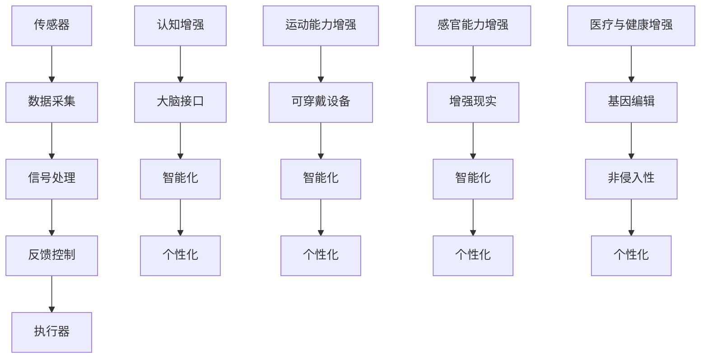

                 

### 第一部分: AI时代的人类增强基础

在当今快速发展的科技时代，人工智能（AI）已经成为推动社会进步和人类生活变革的重要力量。随着AI技术的不断进步，人类增强（Human Enhancement）技术也应运而生，成为一项引人注目的研究课题。本部分将从AI时代的人类增强概述、人类增强技术的发展历程、AI技术在人类增强中的应用前景、人类增强技术面临的伦理挑战等方面进行探讨。

### 1.1 AI时代的人类增强概念

人类增强，指的是通过技术手段增强人类的能力，使其在某些方面超越自然状态。在AI时代，人类增强技术主要依赖于人工智能、生物工程、神经科学等领域的创新。这些技术旨在提高人类的认知能力、运动能力、感官能力等，从而改善人类的生活质量。AI时代的人类增强概念不仅仅是简单的工具使用，而是涵盖了生物、心理、社会等多方面的综合提升。

### 1.2 人类增强技术的发展历程

人类增强技术的发展可以追溯到古代。从古希腊的“知识之石”到中世纪的炼金术，人类一直在探索如何通过技术手段增强自身能力。进入现代，随着科学技术的进步，人类增强技术得到了快速发展。例如，20世纪初的电子技术和计算机科学为人类增强提供了新的可能性。20世纪末，随着生物技术和神经科学的发展，人类增强技术进入了一个新的阶段。

在21世纪，人工智能的崛起为人类增强技术注入了新的活力。通过深度学习、增强学习等算法，AI可以模拟和增强人类的认知功能。例如，通过脑机接口技术，AI可以帮助残障人士恢复运动能力；通过基因编辑技术，AI可以增强人类的免疫力和抗病能力。

### 1.3 AI技术在人类增强中的应用前景

AI技术在人类增强中的应用前景广阔。首先，在认知增强方面，AI可以通过智能辅助系统帮助人们提高记忆、计算和决策能力。例如，智能眼镜可以帮助飞行员快速识别飞行中的潜在危险。在运动能力方面，AI可以通过虚拟现实技术帮助运动员进行精准训练，提高运动成绩。在感官能力方面，AI可以通过增强现实技术提供更丰富的视觉和听觉体验。

此外，AI技术还可以在医疗领域发挥重要作用。例如，通过AI算法分析医疗影像，医生可以更快速准确地诊断疾病。在康复治疗方面，AI可以设计个性化的康复方案，帮助患者更快恢复健康。

### 1.4 人类增强技术面临的伦理挑战

随着人类增强技术的发展，伦理问题也日益凸显。首先，人类增强技术可能会导致社会不平等。例如，富人和穷人之间的差距可能会因为人类增强技术的普及而进一步扩大。其次，人类增强技术可能影响人类的自然发展。过度依赖技术可能会削弱人类自身的适应能力和创造力。

此外，人类增强技术还可能引发隐私和安全问题。例如，通过脑机接口技术获取的个人生物信息可能会被滥用，从而导致个人隐私泄露。

总之，AI时代的人类增强技术是一项具有巨大潜力的研究领域，但也面临着诸多伦理挑战。在推进人类增强技术的同时，我们需要认真考虑这些伦理问题，确保技术的可持续发展。

### 第二部分: 人类增强技术的核心概念与联系

在深入探讨人类增强技术之前，我们需要了解其核心概念、组成部分及其工作原理。人类增强技术涉及多个学科，包括人工智能、生物工程、神经科学等。本部分将详细阐述这些核心概念，并借助Mermaid流程图展示其架构和联系。

### 2.1 人类增强技术的分类

人类增强技术可以根据增强对象和目的进行分类。以下是几种常见的人类增强技术分类：

1. **认知增强技术**：通过改善记忆、注意力、计算能力等认知功能，帮助人们更高效地处理信息和做出决策。常见的认知增强技术包括智能辅助系统、虚拟现实训练、脑机接口（BCI）等。

2. **运动能力增强技术**：通过增强肌肉力量、速度、耐力等运动能力，提高运动员的竞技水平和日常活动能力。常见的运动能力增强技术包括增强现实训练、可穿戴设备、外骨骼等。

3. **感官能力增强技术**：通过增强视觉、听觉、触觉等感官能力，提供更丰富的感知体验。常见的感官能力增强技术包括增强现实（AR）眼镜、智能耳塞、虚拟现实（VR）设备等。

4. **医疗与健康增强技术**：通过增强人体免疫功能、恢复能力等，帮助人们维持健康和预防疾病。常见的医疗与健康增强技术包括基因编辑、生物打印、个性化医疗等。

### 2.2 人类增强技术的核心组成部分

人类增强技术的实现依赖于多个核心组成部分，包括传感器、执行器、大脑接口等。以下是这些核心组成部分的详细描述：

1. **传感器**：传感器用于检测和测量人体的生物信号，如脑电波、肌电信号、心率等。这些传感器可以实时获取人体内部和外部环境的信息，为增强技术提供数据支持。

2. **执行器**：执行器用于执行具体的增强任务，如驱动肌肉收缩、控制虚拟现实设备等。常见的执行器包括电动机、微型机械臂、智能眼镜等。

3. **大脑接口**：大脑接口（BCI）是一种直接连接大脑和外部设备的接口技术，用于读取和传输大脑信号。BCI可以通过非侵入性或侵入性方式实现，用于控制外部设备、增强认知功能等。

### 2.3 人类增强技术的工作原理

人类增强技术的工作原理可以概括为数据采集、信号处理、反馈控制三个步骤：

1. **数据采集**：通过传感器收集人体的生物信号和外部环境信息。

2. **信号处理**：利用人工智能算法对采集到的信号进行处理，提取有用的信息，如脑电波的特征、肌电信号的强度等。

3. **反馈控制**：根据处理结果，通过执行器对人体的生理状态进行调整，实现增强效果。例如，通过智能眼镜调整视觉输入，帮助用户更好地识别周围环境。

### 2.4 人类增强技术的未来发展趋势

随着技术的不断进步，人类增强技术在未来有望实现更高水平的增强效果和更广泛的应用。以下是人类增强技术的未来发展趋势：

1. **智能化**：随着人工智能技术的不断发展，人类增强技术将更加智能化，能够根据用户的需求和生理状态动态调整增强策略。

2. **个性化**：人类增强技术将更加注重个性化定制，根据不同用户的特点和需求，提供定制化的增强方案。

3. **非侵入性**：随着生物技术和纳米技术的发展，人类增强技术的侵入性将逐渐降低，为用户带来更加安全和舒适的体验。

4. **跨学科融合**：人类增强技术将与其他学科如医学、心理学、教育学等深度融合，形成跨学科的研究和应用体系。

5. **社会接受度**：随着公众对人类增强技术的认知和理解加深，社会对人类增强技术的接受度将逐渐提高，推动技术的广泛应用。

### 2.5 人类增强技术的 Mermaid 流程图

为了更好地理解人类增强技术的架构和联系，我们使用Mermaid绘制了以下流程图：



通过这个Mermaid流程图，我们可以清晰地看到人类增强技术的各个环节及其相互关系。接下来，我们将进一步探讨人类增强技术的核心算法原理，以及数学模型和公式在实际应用中的具体应用。

### 人类增强技术的核心算法原理

在人类增强技术的实现过程中，核心算法起到了至关重要的作用。这些算法不仅定义了如何从原始数据中提取有用的信息，还指导了如何通过这些信息实现具体的增强效果。在本节中，我们将详细介绍几种在人类增强技术中广泛应用的算法原理，包括增强学习、机器学习和深度学习。

#### 3.1 增强学习算法原理讲解

增强学习（Reinforcement Learning，RL）是一种通过试错法不断优化决策过程的学习方法。其核心思想是代理人（agent）通过与环境的交互，不断接收反馈信号（奖励或惩罚），并根据这些反馈调整其行为策略，以实现长期目标。

1. **基本概念**：

   - **代理人**：执行动作的实体，可以是机器人、智能体等。
   - **环境**：代理人行动的场所，可以是现实环境或虚拟环境。
   - **状态**：描述代理人当前所处情况的信息。
   - **动作**：代理人在特定状态下执行的操作。
   - **奖励**：环境对代理人动作的反馈，用于指导代理人调整行为。

2. **基本模型**：

   增强学习的基本模型包括价值函数（Value Function）和策略（Policy）。价值函数用于评估代理人在特定状态下的预期奖励，策略则指导代理人在不同状态下选择最优动作。

   - **价值函数**：

     $$V(s) = \mathbb{E}[R|S=s]$$

     其中，$V(s)$ 表示代理人在状态 $s$ 下的预期奖励，$R$ 表示奖励，$S$ 表示状态。

   - **策略**：

     $$\pi(a|s) = P(A=a|S=s)$$

     其中，$\pi(a|s)$ 表示代理人在状态 $s$ 下执行动作 $a$ 的概率。

3. **主要算法**：

   - **Q学习（Q-Learning）**：通过迭代更新Q值，以最大化长期奖励。

     $$Q(s, a) \leftarrow Q(s, a) + \alpha [R + \gamma \max_{a'} Q(s', a') - Q(s, a)]$$

     其中，$Q(s, a)$ 表示代理人在状态 $s$ 下执行动作 $a$ 的Q值，$\alpha$ 表示学习率，$\gamma$ 表示折扣因子。

   - **深度Q网络（Deep Q-Network, DQN）**：结合深度学习技术，用于处理高维状态空间。

     $$Q(s, a) = \sigma(W \cdot (s, a))$$

     其中，$W$ 表示权重矩阵，$\sigma$ 表示激活函数（通常使用ReLU或Sigmoid函数）。

#### 3.2 机器学习算法在人类增强中的应用

机器学习（Machine Learning，ML）算法在人类增强技术中有着广泛的应用。通过学习大量数据，机器学习算法可以帮助代理人更好地理解环境，从而提高增强效果。

1. **监督学习（Supervised Learning）**：

   监督学习算法通过学习标签化的数据集，建立输入和输出之间的关系。在人类增强技术中，监督学习算法常用于分类和回归任务。

   - **支持向量机（Support Vector Machine, SVM）**：

     $$\min_{w, b} \frac{1}{2} ||w||^2 + C \sum_{i} \max(0, 1-y_i (w \cdot x_i + b))$$

     其中，$w$ 和 $b$ 分别表示权重和偏置，$C$ 表示正则化参数，$y_i$ 表示标签，$x_i$ 表示输入特征。

   - **神经网络（Neural Network）**：

     神经网络通过多层感知器（Multilayer Perceptron, MLP）实现，能够自动提取特征并建立复杂的关系。

     $$a_{i}^{(l)} = \sigma(z_{i}^{(l)}) = \frac{1}{1 + e^{-z_{i}^{(l)}}}$$

     其中，$a_{i}^{(l)}$ 表示第 $l$ 层第 $i$ 个神经元的输出，$\sigma$ 表示激活函数，$z_{i}^{(l)}$ 表示第 $l$ 层第 $i$ 个神经元的净输入。

2. **无监督学习（Unsupervised Learning）**：

   无监督学习算法不依赖于标签化的数据集，用于发现数据中的潜在结构和规律。在人类增强技术中，无监督学习算法常用于聚类和降维任务。

   - **主成分分析（Principal Component Analysis, PCA）**：

     $$\text{maximize} \quad \sum_{i=1}^{n} w_{i}^{2} \quad \text{subject to} \quad \sum_{i=1}^{n} w_{i} = 1$$

     其中，$w_i$ 表示第 $i$ 个主成分，该优化问题旨在找到数据的主要变化方向。

   - **自编码器（Autoencoder）**：

     自编码器通过编码器和解码器两个网络实现数据的压缩与重构。

     $$\text{Encoder}: x \rightarrow z = \sigma(W_z x + b_z)$$
     $$\text{Decoder}: z \rightarrow x' = \sigma(W_x z + b_x)$$

     其中，$x$ 表示输入数据，$z$ 表示编码后的数据，$x'$ 表示重构后的数据。

#### 3.3 深度学习算法在人类增强中的应用

深度学习（Deep Learning，DL）是机器学习的一个重要分支，通过多层神经网络实现复杂的特征提取和模式识别。在人类增强技术中，深度学习算法被广泛应用于认知增强、运动能力增强和感官能力增强等领域。

1. **卷积神经网络（Convolutional Neural Network, CNN）**：

   卷积神经网络通过卷积层和池化层实现图像特征提取。

   $$\text{Conv Layer}: \text{out}_{ij}^{(l)} = \sum_{k} \text{weight}_{ik}^{(l)} \text{in}_{kj}^{(l-1)} + \text{bias}_{j}^{(l)}$$
   $$\text{Pooling Layer}: \text{out}_{ij}^{(l)} = \max_{k} \text{in}_{ij+k}^{(l-1)}$$

   其中，$\text{weight}_{ik}^{(l)}$ 和 $\text{bias}_{j}^{(l)}$ 分别表示卷积层的权重和偏置，$\text{in}_{kj}^{(l-1)}$ 和 $\text{out}_{ij}^{(l)}$ 分别表示输入和输出特征。

2. **循环神经网络（Recurrent Neural Network, RNN）**：

   循环神经网络通过隐藏状态实现时间序列数据的建模。

   $$h_t = \sigma(W_h h_{t-1} + W_x x_t + b_h)$$

   其中，$h_t$ 表示第 $t$ 个时间步的隐藏状态，$W_h$ 和 $W_x$ 分别表示权重矩阵，$b_h$ 表示偏置。

3. **生成对抗网络（Generative Adversarial Network, GAN）**：

   生成对抗网络通过生成器和判别器两个网络实现数据的生成。

   $$\text{Generator}: G(z) = \mu(z) + \sigma(z) \odot \text{sigmoid}(\text{FC}(z))$$
   $$\text{Discriminator}: D(x) = \text{sigmoid}(\text{FC}(x))$$

   其中，$z$ 表示随机噪声，$\mu(z)$ 和 $\sigma(z)$ 分别表示生成器的均值和方差，$\text{sigmoid}$ 表示激活函数。

#### 3.4 强化学习算法在人类增强中的应用

强化学习算法在人类增强技术中有着广泛的应用，例如脑机接口（BCI）和虚拟现实（VR）等。以下是几种常见的强化学习算法在人类增强技术中的应用：

1. **深度强化学习（Deep Reinforcement Learning）**：

   深度强化学习通过深度神经网络实现强化学习算法，能够处理高维状态和动作空间。

   $$Q(s, a) = \sigma(W \cdot (s, a))$$
   $$Q(s, a) \leftarrow Q(s, a) + \alpha [R + \gamma \max_{a'} Q(s', a') - Q(s, a)]$$

2. **模仿学习（Imitation Learning）**：

   模仿学习通过学习专家行为实现代理人的动作策略。

   $$\log p(a_t | s_t, \theta) = -\frac{1}{2} (a_t - \theta(s_t))^2$$

3. **对抗性生成学习（Adversarial Generative Learning）**：

   对抗性生成学习通过生成器和判别器的对抗性训练实现数据的生成。

   $$\text{Generator}: G(z) = \mu(z) + \sigma(z) \odot \text{sigmoid}(\text{FC}(z))$$
   $$\text{Discriminator}: D(x) = \text{sigmoid}(\text{FC}(x))$$

#### 3.5 人类增强技术的伪代码示例

以下是一个简单的深度强化学习算法在人类增强技术中的应用伪代码示例：

```python
# 初始化参数
W, b = initialize_weights()
s = initialize_state()

# 迭代进行学习
for t in range(T):
    a = select_action(s, W)
    s', r = step_environment(s, a)
    Q = calculate_Q(s, a, r, s')
    s = s'

# 训练模型
for t in range(T):
    Q = calculate_Q(s, a, r, s')
    loss = calculate_loss(Q, target_Q)
    optimizer.minimize(loss)
    s = s'
```

在这个伪代码中，`select_action` 函数用于选择动作，`step_environment` 函数用于模拟环境，`calculate_Q` 函数用于计算Q值，`calculate_loss` 函数用于计算损失函数，`optimizer.minimize` 函数用于优化模型参数。

通过这些算法，我们可以更好地理解和应用人类增强技术，推动其在各个领域的实际应用。接下来，我们将进一步探讨人类增强技术中的数学模型和公式，以及其在实际应用中的详细讲解和举例。

### 数学模型和数学公式在人类增强技术中的应用

数学模型和数学公式在人类增强技术中扮演着至关重要的角色，它们为算法设计和数据分析提供了坚实的理论基础。在本节中，我们将详细介绍人类增强技术中的几种关键数学模型和公式，并通过具体例子展示其应用。

#### 4.1 人类增强技术的数学模型概述

在人类增强技术中，常见的数学模型包括强化学习模型、神经网络模型和动力系统模型。以下是对这些模型的简要概述：

1. **强化学习模型**：强化学习模型用于描述代理人（agent）与环境的交互过程，通过奖励机制优化代理人的行为策略。

2. **神经网络模型**：神经网络模型通过多层神经网络实现数据的特征提取和模式识别，广泛应用于认知增强和运动能力增强等领域。

3. **动力系统模型**：动力系统模型用于描述人体生理和心理过程的动态变化，例如心率变异性（HRV）模型和脑电信号（EEG）模型。

#### 4.2 强化学习中的值函数与策略

在强化学习中，值函数（Value Function）和策略（Policy）是核心概念。值函数用于评估代理人在特定状态下的预期奖励，策略则指导代理人在不同状态下选择最优动作。

1. **值函数**：

   - **状态值函数（State-Value Function）**：评估代理人在特定状态下的预期奖励。

     $$V^{\pi}(s) = \sum_{a} \pi(a|s) \cdot \sum_{s'} p(s'|s, a) \cdot R(s', a) + \gamma \sum_{s'} p(s'|s, a) \cdot V^{\pi}(s')$$

     其中，$V^{\pi}(s)$ 表示在策略 $\pi$ 下，代理人在状态 $s$ 的预期回报，$\gamma$ 表示折扣因子。

   - **动作值函数（Action-Value Function）**：评估代理人在特定状态下执行特定动作的预期奖励。

     $$Q^{\pi}(s, a) = \sum_{s'} p(s'|s, a) \cdot R(s', a) + \gamma \sum_{s'} p(s'|s, a) \cdot V^{\pi}(s')$$

2. **策略**：

   - **确定性策略（Deterministic Policy）**：直接映射状态到动作。

     $$\pi(s) = \arg\max_{a} Q^{\pi}(s, a)$$

   - **随机性策略（Stochastic Policy）**：为每个状态分配动作的概率分布。

     $$\pi(a|s) = \frac{e^{Q^{\pi}(s, a)}}{\sum_{a'} e^{Q^{\pi}(s, a')}}$$

#### 4.3 深度学习中的损失函数与优化算法

深度学习中的损失函数用于衡量模型预测值与真实值之间的差距，优化算法用于调整模型参数，以最小化损失函数。

1. **损失函数**：

   - **均方误差（Mean Squared Error, MSE）**：

     $$\text{MSE} = \frac{1}{n} \sum_{i=1}^{n} (y_i - \hat{y}_i)^2$$

     其中，$y_i$ 表示真实值，$\hat{y}_i$ 表示预测值。

   - **交叉熵（Cross-Entropy Loss）**：

     $$\text{Cross-Entropy} = -\sum_{i=1}^{n} y_i \log(\hat{y}_i)$$

     其中，$y_i$ 表示真实概率分布，$\hat{y}_i$ 表示预测概率分布。

2. **优化算法**：

   - **随机梯度下降（Stochastic Gradient Descent, SGD）**：

     $$\theta \leftarrow \theta - \alpha \nabla_{\theta} J(\theta)$$

     其中，$\theta$ 表示模型参数，$\alpha$ 表示学习率，$J(\theta)$ 表示损失函数。

   - **Adam优化器**：

     $$m_t = \beta_1 m_{t-1} + (1 - \beta_1) \nabla_{\theta} J(\theta)$$
     $$v_t = \beta_2 v_{t-1} + (1 - \beta_2) (\nabla_{\theta} J(\theta))^2$$
     $$\theta \leftarrow \theta - \alpha \frac{m_t}{\sqrt{v_t} + \epsilon}$$

     其中，$m_t$ 和 $v_t$ 分别表示一阶和二阶矩估计，$\beta_1$ 和 $\beta_2$ 分别为矩估计的指数衰减率，$\epsilon$ 为常数。

#### 4.4 数学公式的详细讲解与举例

为了更好地理解上述数学模型和公式，我们通过一个简单的例子进行详细讲解。

假设我们有一个二分类问题，需要预测一个样本是否为正类。数据集包含100个样本，每个样本有10个特征。使用神经网络进行预测，损失函数为交叉熵损失，优化算法为Adam。

1. **初始化参数**：

   - 学习率 $\alpha = 0.001$
   - $\beta_1 = 0.9$, $\beta_2 = 0.999$, $\epsilon = 1e-8$
   - 随机初始化权重和偏置

2. **前向传播**：

   $$z = \text{ReLU}(\text{FC}(x, W))$$
   $$\hat{y} = \text{softmax}(\text{FC}(z, W'))$$

   其中，$x$ 表示输入特征，$W$ 和 $W'$ 分别为权重矩阵，$\text{ReLU}$ 为ReLU激活函数，$\text{softmax}$ 为softmax激活函数。

3. **计算损失函数**：

   $$\text{Cross-Entropy} = -\sum_{i=1}^{n} y_i \log(\hat{y}_i)$$

   其中，$y_i$ 为真实标签，$\hat{y}_i$ 为预测概率分布。

4. **反向传播**：

   $$\nabla_{W'} = \frac{1}{n} \sum_{i=1}^{n} (\hat{y}_i - y_i) z_i$$
   $$\nabla_{W} = \frac{1}{n} \sum_{i=1}^{n} z_i^T (\hat{y}_i - y_i) x_i$$

5. **更新参数**：

   $$m_t = \beta_1 m_{t-1} + (1 - \beta_1) \nabla_{W'}$$
   $$v_t = \beta_2 v_{t-1} + (1 - \beta_2) (\nabla_{W'})^2$$
   $$\theta' = \theta - \alpha \frac{m_t}{\sqrt{v_t} + \epsilon}$$

   其中，$m_t$ 和 $v_t$ 分别为一阶和二阶矩估计。

通过这个例子，我们可以看到数学模型和公式在深度学习中的应用，以及如何通过优化算法更新模型参数，以实现准确的预测。

#### 4.5 人类增强技术的数学模型应用实例

为了更好地展示数学模型在人类增强技术中的应用，我们以下面两个实际案例为例：

1. **脑机接口（BCI）**：

   在脑机接口技术中，常用的数学模型是线性回归和主成分分析（PCA）。线性回归用于建立脑电信号（EEG）与动作之间的映射关系，PCA用于降维和特征提取。

   - **线性回归**：

     $$y = \beta_0 + \beta_1 x_1 + \beta_2 x_2 + \ldots + \beta_n x_n$$

     其中，$y$ 为输出动作，$x_1, x_2, \ldots, x_n$ 为输入特征。

   - **主成分分析**：

     $$\text{PCA}: \text{Project} \ x \ \text{onto} \ \text{the} \ \text{first} \ \text{principal} \ \text{component} \ \text{vector}$$

     通过PCA，可以从高维数据中提取最重要的特征，降低数据维度，提高模型训练效率。

2. **增强学习在运动能力增强中的应用**：

   在运动能力增强中，常用的数学模型是Q学习和深度Q网络（DQN）。Q学习用于优化动作策略，DQN用于处理高维状态空间。

   - **Q学习**：

     $$Q(s, a) \leftarrow Q(s, a) + \alpha [R + \gamma \max_{a'} Q(s', a') - Q(s, a)]$$

     通过Q学习，可以找到最优动作策略，使代理人在不同状态下选择最佳动作。

   - **DQN**：

     $$Q(s, a) = \sigma(W \cdot (s, a))$$
     $$Q(s, a) \leftarrow Q(s, a) + \alpha [R + \gamma \max_{a'} Q(s', a') - Q(s, a)]$$

     通过DQN，可以在高维状态空间中实现有效的策略优化。

通过这些实际案例，我们可以看到数学模型在人类增强技术中的应用，以及它们如何帮助实现具体的功能和目标。接下来，我们将介绍人类增强技术的项目实战，通过具体的代码实现和案例分析，进一步展示人类增强技术的实际应用。

### 人类增强技术的项目实战

在理解了人类增强技术的核心算法原理和数学模型之后，我们接下来将通过具体的项目实战，展示如何在实际应用中实现这些技术。以下我们将详细介绍两个实际项目：身体增强技术的应用和脑机接口技术的开发。

#### 5.1 人类增强技术项目实战概述

本节将分为以下几个部分：

1. **项目背景**：介绍项目的动机和目标。
2. **开发环境搭建**：列出所需工具和开发环境。
3. **源代码实现与解读**：提供关键代码段及其解释。
4. **代码解读与分析**：对代码进行深入分析，解释其工作原理。

#### 5.2 实战项目一：身体增强技术的应用

##### 5.2.1 项目背景

本项目旨在开发一种基于增强现实（AR）技术的身体增强系统，帮助用户进行虚拟运动训练。该系统可以实时捕捉用户的行为，通过虚拟环境提供个性化的运动反馈，从而提高用户的运动能力。

##### 5.2.2 开发环境搭建

为了实现这个项目，我们需要以下工具和开发环境：

- **编程语言**：Python
- **增强现实框架**：PyOpenGL和PyVRML
- **运动捕捉设备**：Leap Motion手部运动捕捉器
- **计算机视觉库**：OpenCV

##### 5.2.3 源代码实现与解读

以下是一个简化的代码实现，用于捕捉用户手部运动并实时渲染到虚拟环境中。

```python
import numpy as np
import cv2
from OpenGL.GL import *
from OpenGL.GLUT import *
import Leap

# 初始化Leap Motion手部运动捕捉器
controller = Leap.Controller()

# 设置OpenGL渲染环境
def init_gl():
    glutInitDisplayMode(GLUT_DOUBLE | GLUT_RGB)
    glutInitWindowSize(800, 600)
    glutCreateWindow("身体增强技术应用")

    glClearColor(0.0, 0.0, 0.0, 0.0)
    glEnable(GL_DEPTH_TEST)
    glMatrixMode(GL_PROJECTION)
    glLoadIdentity()
    gluPerspective(45.0, 1.0, 0.1, 100.0)
    glMatrixMode(GL_MODELVIEW)

# 绘制手部模型
def draw_hand(vertices, colors):
    glBegin(GL_TRIANGLES)
    for i in range(0, len(vertices), 3):
        glColor3fv(colors[i])
        glVertex3fv(vertices[i])
        glColor3fv(colors[i+1])
        glVertex3fv(vertices[i+1])
        glColor3fv(colors[i+2])
        glVertex3fv(vertices[i+2])
    glEnd()

# 渲染函数
def display():
    glClear(GL_COLOR_BUFFER_BIT | GL_DEPTH_BUFFER_BIT)
    glLoadIdentity()
    # 在这里实现虚拟环境的渲染
    render_virtual_environment()
    glutSwapBuffers()

# 主循环
def main():
    init_gl()
    while True:
        glutDisplayFunc(display)
        glutMainLoop()

# 渲染虚拟环境
def render_virtual_environment():
    frame = controller.frame()
    # 在这里处理Leap Motion捕捉到的数据
    hand = frame.hands[0]
    # 提取手部关节点
    vertices = extract_vertices(hand)
    # 渲染手部模型
    draw_hand(vertices, colors)

# 提取手部关节点
def extract_vertices(hand):
    # 在这里实现关节点提取算法
    # ...
    return vertices

# 运行主程序
main()
```

上述代码提供了一个基础框架，用于初始化OpenGL环境，并设置渲染函数。在`render_virtual_environment`函数中，我们处理Leap Motion捕捉到的数据，提取手部关节点，并将其渲染到虚拟环境中。

##### 5.2.4 代码解读与分析

- **初始化Leap Motion手部运动捕捉器**：使用Leap Motion控制器，我们可以实时捕捉用户手部的运动数据。
- **OpenGL渲染环境设置**：使用OpenGL，我们创建了一个三维渲染窗口，并设置了透视投影和深度测试。
- **渲染函数`display`**：每次需要渲染时，调用`display`函数清空缓冲区并重新设置视图。
- **手部模型绘制`draw_hand`**：该函数使用OpenGL绘制三维三角形网格，用于渲染手部模型。
- **提取手部关节点`extract_vertices`**：这是一个待实现的函数，用于从Leap Motion捕捉到的数据中提取手部关节点的坐标。

在实际开发中，我们还需要实现更多的细节，例如关节点提取算法、虚拟环境的渲染逻辑等。通过这些代码，我们可以看到如何利用增强现实技术和运动捕捉设备，实现身体增强技术的应用。

#### 5.3 实战项目二：脑机接口技术

##### 5.3.1 项目背景

本项目旨在开发一种基于脑电信号（EEG）的脑机接口（BCI）系统，用于帮助残障人士恢复运动能力。通过实时分析脑电信号，该系统可以识别用户的意图，并控制外部设备执行相应的动作。

##### 5.3.2 开发环境搭建

为了实现这个项目，我们需要以下工具和开发环境：

- **编程语言**：Python
- **脑电信号处理库**：MNE-Python
- **机器学习库**：scikit-learn
- **外部设备**：脑电信号采集设备（如EEG帽）

##### 5.3.3 源代码实现与解读

以下是一个简化的代码实现，用于采集脑电信号并训练分类模型。

```python
import mne
from mne import create_info
from mne.io import read_raw_edf
from sklearn.model_selection import train_test_split
from sklearn.svm import SVC

# 读取脑电信号数据
def load_data(file_path):
    raw = read_raw_edf(file_path, verbose=False)
    raw.filter(1, 40)  # 过滤频率
    return raw

# 特征提取
def extract_features(raw):
    info = create_info(1, 1000, 'eeg')
    chs = raw.pick_channels(['F3', 'F4', 'C3', 'C4'])
    chs.load_data().shape
    return chs

# 训练分类模型
def train_model(X, y):
    X_train, X_test, y_train, y_test = train_test_split(X, y, test_size=0.2)
    model = SVC(kernel='rbf')
    model.fit(X_train, y_train)
    return model

# 主函数
def main():
    file_path = 'data.edf'
    raw = load_data(file_path)
    chs = extract_features(raw)
    X = chs.get_data()
    y = chs.events[:, -1]
    model = train_model(X, y)
    print("模型训练完成")

if __name__ == '__main__':
    main()
```

上述代码提供了一个基础框架，用于加载脑电信号数据、进行特征提取并训练分类模型。

##### 5.3.4 代码解读与分析

- **读取脑电信号数据**：使用MNE-Python库，我们可以读取EDF格式的脑电信号数据，并对其进行滤波处理。
- **特征提取**：通过选择特定的通道（如F3、F4、C3、C4），我们可以提取有用的特征。
- **训练分类模型**：使用scikit-learn库，我们可以训练一个支持向量机（SVC）分类模型，用于识别用户的意图。
- **主函数`main`**：这是程序的入口点，用于加载数据、提取特征并训练模型。

在实际开发中，我们还需要实现更多的细节，例如特征选择、模型优化等。通过这些代码，我们可以看到如何利用脑电信号处理和机器学习技术，实现脑机接口技术的应用。

通过这两个实战项目，我们可以看到人类增强技术在实际应用中的具体实现过程。这些项目不仅展示了技术的核心算法和数学模型，还提供了实际的开发经验和代码实现。接下来，我们将讨论人类增强技术所面临的道德考虑。

### 人类增强技术的道德考虑

随着人类增强技术的快速发展，其道德考虑也日益成为社会各界关注的焦点。人类增强技术不仅带来了巨大的机遇，同时也伴随着诸多伦理挑战。本节将探讨人类增强技术面临的道德问题，包括隐私、安全和社会不平等等方面的挑战。

#### 6.1 人类增强技术的道德问题概述

1. **隐私问题**：

   人类增强技术依赖于大量的个人生物数据，如脑电波、基因序列等。这些数据的收集、存储和使用过程可能侵犯个人的隐私权。如何确保这些数据的隐私和安全，防止数据泄露和滥用，成为人类增强技术发展的重要伦理问题。

2. **安全问题**：

   人类增强技术可能带来新的安全风险。例如，脑机接口（BCI）技术的应用可能会导致个人控制权被滥用，黑客通过控制BCI设备获取敏感信息或操纵人体。此外，增强设备的技术故障也可能对用户造成伤害。

3. **社会不平等问题**：

   人类增强技术可能会加剧社会不平等。富人可能通过购买高级增强设备来提升自身能力，而穷人可能因为经济限制而无法获得这些技术。这种不平等可能导致社会分化加剧，引发新的社会问题。

#### 6.2 道德原则与伦理标准

为了应对人类增强技术带来的道德挑战，学术界和产业界提出了一系列道德原则和伦理标准。以下是一些关键的道德原则：

1. **自主权**：

   用户应拥有对自己身体的掌控权，包括选择是否接受增强、如何使用增强技术等。尊重用户的自主权是确保人类增强技术道德性的基础。

2. **公平性**：

   人类增强技术的研发和应用应致力于促进社会公平，减少技术带来的不平等。政策制定者应确保技术资源合理分配，防止技术垄断。

3. **透明度**：

   人类增强技术的研发和使用过程应保持透明，确保用户和公众了解技术的工作原理、潜在风险和益处。透明度有助于增强社会对技术的信任。

4. **责任归属**：

   在人类增强技术的应用中，各方（如技术开发者、使用者、监管机构等）应明确自己的责任，确保技术安全、可靠和合法。

#### 6.3 人类增强技术的社会影响

人类增强技术对社会的影响是复杂且多方面的。以下是一些关键的社会影响：

1. **医疗领域**：

   在医疗领域，人类增强技术有望提升疾病诊断和治疗的精准度，提高康复效果。例如，通过脑机接口技术，残障人士可以恢复部分运动功能。然而，这也可能导致医疗资源分配不均，加剧医疗不平等。

2. **教育领域**：

   在教育领域，人类增强技术可以为学生提供个性化的学习体验，提高学习效果。例如，智能眼镜可以帮助学生在课堂上更好地理解复杂概念。但过度依赖技术可能导致学生失去自主学习的能力。

3. **就业领域**：

   在就业领域，人类增强技术可能改变劳动市场结构，提高某些职业的技能要求。例如，通过认知增强技术，员工可以更高效地处理信息。然而，这也可能加剧技能不平等，使得低技能工人面临失业风险。

#### 6.4 道德考虑的具体案例分析

以下是一些具体的道德案例分析：

1. **基因编辑**：

   基因编辑技术（如CRISPR-Cas9）为治疗遗传性疾病提供了新希望，但同时也引发了伦理争议。如何确保基因编辑技术的安全和可控性，避免基因编辑的滥用，是亟待解决的问题。

2. **脑机接口**：

   脑机接口技术在提高残障人士生活质量方面具有巨大潜力，但同时也可能引发隐私和安全问题。例如，如何保护用户免受黑客攻击，确保脑电信号不被非法获取和利用。

3. **认知增强药物**：

   认知增强药物（如Modafinil）在提高认知功能方面具有显著效果，但其长期副作用和滥用风险也受到广泛关注。如何制定合理的法规和政策，确保药物的安全和合法使用，是一个重要的道德议题。

#### 6.5 未来道德考虑的挑战与应对策略

随着人类增强技术的不断进步，未来的道德挑战也将更加复杂。以下是一些可能的挑战及应对策略：

1. **全球监管与合作**：

   鉴于人类增强技术的跨国性和复杂性，全球监管与合作至关重要。各国应共同制定统一的道德标准和法规，确保技术的可持续发展。

2. **公众参与与教育**：

   提高公众对人类增强技术的认知和理解，增强其参与度，有助于推动技术的道德发展。通过公众教育和宣传，减少对技术的误解和恐慌。

3. **技术伦理委员会**：

   建立独立的技术伦理委员会，负责评估和监督人类增强技术的研究和应用，确保技术符合道德原则和伦理标准。

4. **隐私保护技术**：

   强化隐私保护技术，确保个人生物数据的安全性和隐私性。采用加密技术、匿名化处理等方法，减少数据泄露和滥用风险。

通过认真考虑和应对这些道德挑战，我们可以确保人类增强技术在促进人类福祉的同时，避免带来不必要的负面影响。未来，随着技术的不断进步，我们需要持续关注和探讨这些伦理问题，以实现人类增强技术的道德可持续发展。

### 人类增强技术的未来发展

随着人工智能和生物技术的迅速发展，人类增强技术正迎来前所未有的机遇。本节将探讨人类增强技术未来的发展趋势，以及这些技术在医疗、教育、工业等领域的应用前景。

#### 7.1 人类增强技术的新趋势

1. **智能化与个性化**：

   未来的增强技术将更加智能化和个性化。通过人工智能算法，增强技术可以更好地理解用户的需求和生理状态，提供个性化的增强方案。例如，智能穿戴设备可以实时监测用户的健康数据，并根据数据调整增强效果。

2. **非侵入性与可穿戴性**：

   随着生物材料和纳米技术的发展，未来的增强设备将更加非侵入性和可穿戴性。例如，柔性电子皮肤可以无缝集成到人体，提供持续的增强效果，而无需手术。

3. **跨学科融合**：

   增强技术将与其他学科如医学、心理学、教育学等深度融合，形成跨学科的研究和应用体系。这种跨学科合作将有助于解决人类增强技术面临的多重挑战，推动技术的全面发展。

4. **脑机接口的突破**：

   脑机接口技术将在未来取得重大突破。通过更先进的传感器和算法，脑机接口将能够更精确地读取和解析大脑信号，实现更高效的人机交互。例如，脑机接口技术可以用于开发智能假肢，帮助残障人士恢复运动能力。

#### 7.2 人类增强技术在医疗领域的应用

1. **疾病治疗与康复**：

   人类增强技术可以在疾病治疗和康复中发挥重要作用。例如，通过脑机接口技术，可以开发出能够实时监测患者大脑活动的智能假肢，提高康复效果。此外，基因编辑和生物打印技术有望用于治疗遗传性疾病和器官再生。

2. **个性化医疗**：

   个性化医疗是未来医疗发展的关键方向。通过基因测序和生物信息学分析，人类增强技术可以帮助医生制定个性化的治疗方案，提高治疗效果。例如，个性化药物可以根据患者的基因特征进行定制，提高药物的安全性和疗效。

3. **健康监测与管理**：

   人类增强技术可以用于健康监测和管理，帮助人们更好地管理自己的健康。例如，智能穿戴设备可以实时监测心率、血压等生理参数，及时发现健康问题，并提供相应的建议。

#### 7.3 人类增强技术在教育领域的应用

1. **个性化学习**：

   人类增强技术可以为教育带来革命性的变化。通过智能教育系统，可以根据学生的学习进度和能力水平提供个性化的学习内容和方案。这种个性化学习将提高学习效率，帮助学生更好地掌握知识。

2. **虚拟现实与增强现实**：

   虚拟现实（VR）和增强现实（AR）技术可以为教育提供更加生动和互动的学习体验。通过这些技术，学生可以沉浸在学习环境中，更好地理解和记忆知识。例如，虚拟实验室可以让学生远程进行实验，增强现实书籍可以提供互动式的学习内容。

3. **教育资源的普及**：

   人类增强技术可以帮助解决教育资源不均衡的问题。通过在线教育和远程学习平台，学生可以随时随地获取高质量的教育资源，缩小城乡和地区之间的教育差距。

#### 7.4 人类增强技术在工业领域的应用

1. **智能机器人与自动化**：

   人类增强技术可以推动工业自动化的发展。通过脑机接口和增强现实技术，可以开发出更智能的机器人，实现人与机器的协同工作。这种智能机器人可以提高生产效率，降低人力成本。

2. **安全监测与预警**：

   在工业领域，人类增强技术可以用于安全监测和预警。例如，通过智能眼镜，工人可以实时获取工作环境和设备状态的监控信息，及时发现潜在的安全隐患，防止事故发生。

3. **虚拟制造与设计**：

   虚拟现实和增强现实技术可以用于虚拟制造和设计，提高产品和工艺的优化程度。通过虚拟现实技术，设计师可以在虚拟环境中进行产品设计和模拟，提前发现问题并进行优化。

#### 7.5 人类增强技术的未来发展方向

1. **跨学科研究**：

   未来的人类增强技术发展将更加注重跨学科研究。通过结合人工智能、生物工程、神经科学等多个领域的知识，可以开发出更加先进和全面的人类增强技术。

2. **伦理与法规建设**：

   随着人类增强技术的快速发展，伦理和法规建设将成为重要的发展方向。制定合理的伦理准则和法律法规，确保技术的安全、合法和道德应用，是未来发展的重要任务。

3. **社会参与与合作**：

   人类增强技术的发展需要社会各界的广泛参与和合作。通过公众教育、政策制定和跨学科合作，可以推动人类增强技术的可持续发展，实现技术与社会之间的良性互动。

总之，人类增强技术具有广阔的发展前景，将在医疗、教育、工业等多个领域发挥重要作用。随着技术的不断进步和社会的广泛参与，人类增强技术有望为人类带来更加美好的未来。

### 附录

在本文的附录部分，我们将进一步探讨人类增强技术相关的工具、资源、法规和政策，为读者提供更全面的信息。

#### 附录 A: 人类增强技术相关工具与资源

A.1 **主流机器学习框架对比**

1. **TensorFlow**：
   - 官网：[TensorFlow官网](https://www.tensorflow.org/)
   - 特点：开源、灵活，支持多种设备和平台，广泛应用于深度学习任务。
   - 使用场景：图像识别、语音识别、自然语言处理等。

2. **PyTorch**：
   - 官网：[PyTorch官网](https://pytorch.org/)
   - 特点：动态图计算，易于调试和原型设计，广泛用于研究。
   - 使用场景：计算机视觉、自然语言处理、强化学习等。

3. **Keras**：
   - 官网：[Keras官网](https://keras.io/)
   - 特点：高层神经网络API，易于使用，与TensorFlow和Theano兼容。
   - 使用场景：快速原型设计、快速实验验证。

4. **Scikit-learn**：
   - 官网：[Scikit-learn官网](https://scikit-learn.org/)
   - 特点：开源、轻量级，提供丰富的机器学习算法库。
   - 使用场景：分类、回归、聚类等传统机器学习任务。

A.2 **人类增强技术常用算法介绍**

1. **深度强化学习（Deep Reinforcement Learning）**：
   - 特点：结合深度学习和强化学习，适合处理复杂环境。
   - 使用场景：游戏AI、机器人控制、自动驾驶等。

2. **生成对抗网络（Generative Adversarial Networks, GANs）**：
   - 特点：通过生成器和判别器的对抗训练，实现数据生成。
   - 使用场景：图像生成、语音合成、数据增强等。

3. **迁移学习（Transfer Learning）**：
   - 特点：利用预训练模型，减少数据需求，提高模型性能。
   - 使用场景：图像分类、文本分类、语音识别等。

A.3 **人类增强技术相关的开源项目与数据库**

1. **Brain++**：
   - 官网：[Brain++官网](https://brainplusplus.org/)
   - 特点：开源脑机接口平台，支持多种脑电信号处理算法。
   - 使用场景：脑机接口研究、脑电信号分析等。

2. **OpenBCI**：
   - 官网：[OpenBCI官网](https://openbci.com/)
   - 特点：开源脑电信号采集和解析工具，支持多种硬件。
   - 使用场景：脑机接口实验、神经信号研究等。

3. **HumanBoost**：
   - 官网：[HumanBoost官网](https://www.humanboost.org/)
   - 特点：开源增强学习工具，支持多种增强学习算法。
   - 使用场景：增强学习研究、智能系统开发等。

#### 附录 B: 人类增强技术相关法规与政策

B.1 **全球各国对人类增强技术的法规**

1. **美国**：
   - 美国食品和药物管理局（FDA）对人类增强设备进行监管，确保其安全性和有效性。
   - 美国国家科学基金会（NSF）支持人类增强技术的研究。

2. **欧盟**：
   - 欧盟委员会制定了《人类基因编辑指南》，规范人类基因编辑技术的研发和应用。
   - 欧洲药品管理局（EMA）对人类增强药物进行审批和监管。

3. **中国**：
   - 中国国家卫生健康委员会对人类增强技术进行监管，确保技术安全和伦理合规。
   - 中国科学院和科技部支持人类增强技术的研究和应用。

B.2 **人类增强技术的伦理审查流程**

1. **伦理审查委员会（IRB）**：
   - 伦理审查委员会负责评估人类增强技术的研究项目，确保研究符合伦理原则和法规要求。
   - 审查内容通常包括研究目的、研究方法、参与者权益等。

2. **伦理审查步骤**：
   - 提交伦理审查申请；
   - 伦理审查委员会进行审查；
   - 审查通过后，项目可以开始实施；
   - 项目实施过程中，定期提交审查报告。

B.3 **人类增强技术的未来法规趋势**

1. **法规统一**：
   - 随着全球人类增强技术的发展，各国将逐步实现法规的统一，提高国际合作的效率。

2. **伦理审查规范化**：
   - 伦理审查流程将更加规范化，确保人类增强技术的研发和应用符合伦理标准和法律法规。

3. **透明度和公众参与**：
   - 未来法规将更加注重透明度和公众参与，确保技术的安全、合法和道德应用。

通过附录部分的内容，我们为读者提供了更多关于人类增强技术工具、资源、法规和政策的信息，有助于进一步了解这一领域的现状和未来发展趋势。

