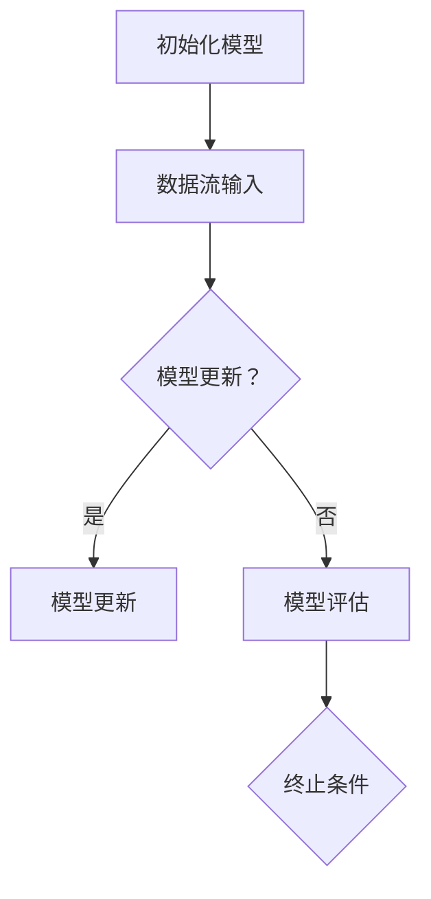

                 

### 《AI模型的增量学习：Lepton AI的持续优化》

> **关键词**：AI模型、增量学习、Lepton AI、优化策略、核心算法、数学模型、项目实战。

> **摘要**：本文将深入探讨AI模型的增量学习机制，以Lepton AI为例，分析其持续优化方法。通过阐述核心原理、优化策略、实现过程和实际案例，揭示增量学习在AI领域的重要性及Lepton AI的未来发展方向。

### 《AI模型的增量学习：Lepton AI的持续优化》目录大纲

#### 第一部分：背景知识
- **第1章：AI模型与增量学习概述**
  - **1.1 AI模型基础知识**
    - AI模型的核心概念
    - AI模型的主要类型
  - **1.2 增量学习的定义和重要性**
    - 增量学习的概念
    - 增量学习在AI模型中的重要性
  - **1.3 Lepton AI简介**
    - Lepton AI的功能特点
    - Lepton AI的应用场景

#### 第二部分：核心原理
- **第2章：增量学习的基本原理**
  - **2.1 增量学习的框架和流程**
    - Mermaid流程图展示增量学习的基本框架
  - **2.2 增量学习的核心算法**
    - 伪代码详细阐述增量学习的核心算法
  - **2.3 数学模型与公式**
    - 使用latex格式解释数学模型和公式
    - 实例说明

#### 第三部分：Lepton AI的持续优化
- **第3章：Lepton AI的优化方法**
  - **3.1 优化策略**
    - 详细讲解Lepton AI的优化策略
  - **3.2 优化实现**
    - 使用伪代码解释优化实现过程
  - **3.3 案例分析**
    - 实际案例分析与优化效果

#### 第四部分：项目实战
- **第4章：Lepton AI在具体领域的应用**
  - **4.1 领域选择与场景分析**
    - 选择具体领域，分析应用场景
  - **4.2 开发环境搭建**
    - 详细介绍开发环境搭建流程
  - **4.3 源代码实现**
    - 详细解读Lepton AI的源代码实现
  - **4.4 代码分析与优化**
    - 分析源代码，提出优化建议

#### 第五部分：未来展望
- **第5章：增量学习的发展趋势**
  - **5.1 当前增量学习的研究热点**
    - 讲解当前增量学习的研究热点和发展方向
  - **5.2 Lepton AI的未来优化**
    - 探讨Lepton AI在未来可能的优化方向

#### 第六部分：附录
- **第6章：附录**
  - **6.1 工具与资源**
    - 列出主要使用的工具和资源
  - **6.2 参考文献**
    - 引用的参考资料列表

**以上为《AI模型的增量学习：Lepton AI的持续优化》的目录大纲，每一章节都会详细展开，确保内容的完整性、逻辑性和实用性。**

---

接下来，我们将按照目录大纲逐步展开每一章节的内容，详细介绍AI模型的增量学习以及Lepton AI的持续优化方法。

#### 第一部分：背景知识

##### 第1章：AI模型与增量学习概述

在进入详细讨论之前，我们需要对AI模型和增量学习进行基本的介绍，以便读者对后续内容有更好的理解。

###### 1.1 AI模型基础知识

AI模型是人工智能（AI）领域中的核心概念。简单来说，AI模型是指通过学习和模拟人类思维过程来执行特定任务的计算机程序。AI模型可以分为以下几类：

- **监督学习模型**：这些模型需要大量的标记数据进行训练，以便在预测新数据时能够准确输出结果。常见的监督学习模型包括线性回归、决策树、随机森林、支持向量机（SVM）等。
- **无监督学习模型**：与监督学习模型不同，无监督学习模型不依赖标记数据，而是通过探索数据内部的模式和结构来发现数据中的规律。常见的无监督学习模型包括聚类、主成分分析（PCA）等。
- **强化学习模型**：这类模型通过与环境的交互来学习如何进行决策。强化学习模型的一个重要特点是它们能够在不断试错的过程中逐渐优化自己的策略。常见的强化学习模型包括Q学习、深度Q网络（DQN）等。

###### 1.2 增量学习的定义和重要性

增量学习是一种特殊的机器学习方法，它允许模型在已有知识的基础上对新数据进行学习和优化。与传统的从头开始训练（zero-shot learning）相比，增量学习能够显著减少训练时间和计算资源消耗。以下是增量学习的一些关键特点：

- **数据增量**：增量学习过程通常涉及不断添加新的数据样本，而不是一次性处理整个数据集。
- **知识迁移**：增量学习模型能够将先前学习到的知识应用于新数据上，从而提高学习效率。
- **动态调整**：增量学习模型能够根据新数据自动调整其参数和结构，以适应新的学习任务。

增量学习的重要性主要体现在以下几个方面：

- **效率**：增量学习能够显著减少模型的训练时间，特别是对于大规模数据集和复杂的模型来说。
- **资源节约**：通过在已有知识基础上进行学习，增量学习可以节约大量的存储和计算资源。
- **持续优化**：增量学习使得模型能够持续地优化和适应新的数据，这对于实时应用和动态环境来说至关重要。

###### 1.3 Lepton AI简介

Lepton AI是一种先进的AI模型，特别设计用于进行增量学习。以下是Lepton AI的主要功能特点和典型应用场景：

- **功能特点**：
  - 高效的增量学习算法，能够在短时间内完成大量数据的学习和优化。
  - 支持多种数据类型，包括图像、文本和传感器数据。
  - 内置自动调整机制，能够根据新数据动态调整模型参数。

- **应用场景**：
  - 实时监测系统：用于监控工业设备、环境传感器等，实现实时数据分析和异常检测。
  - 金融风险管理：用于监控交易数据、市场趋势等，提供实时风险管理建议。
  - 医疗诊断：用于分析医疗影像、患者数据等，辅助医生进行诊断和治疗。

通过以上对AI模型与增量学习的基本概述，读者应该对增量学习以及Lepton AI有了初步的认识。接下来，我们将深入探讨增量学习的基本原理和核心算法。

---

在第一部分中，我们概述了AI模型和增量学习的基础知识，以及介绍了Lepton AI的功能和应用场景。接下来，我们将进一步探讨增量学习的核心原理，包括其基本框架、核心算法以及数学模型。

#### 第二部分：核心原理

##### 第2章：增量学习的基本原理

增量学习作为机器学习中的一个重要分支，其核心在于如何在已有知识的基础上，高效地学习新数据。在本章节中，我们将详细讨论增量学习的框架、核心算法及其数学模型。

###### 2.1 增量学习的框架和流程

增量学习的框架通常包括以下几个关键步骤：

1. **初始化模型**：首先，初始化一个基线模型，该模型可能是从头开始训练的，也可能是基于预训练模型的。
2. **数据流处理**：将新数据以流的形式输入到模型中，每个新数据点都会触发一次学习过程。
3. **模型更新**：根据新数据对模型进行更新，调整模型的参数以适应新的数据分布。
4. **模型评估**：定期评估模型在新数据上的性能，以确保模型能够有效学习新知识。

以下是增量学习的基本流程的Mermaid流程图：



在这个流程图中，模型更新和评估是循环进行的，直到满足终止条件（例如，达到预定的迭代次数或者模型性能不再提升）。

###### 2.2 增量学习的核心算法

增量学习的核心算法通常是基于在线学习（online learning）和迁移学习（transfer learning）的原理。以下是增量学习的核心算法的伪代码：

```pseudo
initialize_model()
while (new_data available) do:
    sample = get_new_data()
    predict = model(sample)
    error = compute_error(predict, sample.label)
    update_model(error)
end while
```

在这个伪代码中，`initialize_model()` 用于初始化模型，`get_new_data()` 用于获取新数据，`compute_error()` 用于计算预测结果与真实标签之间的误差，`update_model()` 用于根据误差调整模型参数。

###### 2.3 数学模型与公式

增量学习涉及多个数学模型和公式，用于描述模型参数的更新过程。以下是增量学习中的几个关键数学模型：

1. **损失函数**：损失函数用于衡量预测值与真实值之间的差异。常见的损失函数包括均方误差（MSE）和交叉熵损失。
   
   $$\text{MSE} = \frac{1}{m}\sum_{i=1}^{m}(y_i - \hat{y}_i)^2$$

   $$\text{Cross-Entropy Loss} = -\frac{1}{m}\sum_{i=1}^{m}y_i\log(\hat{y}_i)$$

2. **梯度下降**：梯度下降是一种用于最小化损失函数的优化算法。其核心思想是沿着损失函数的梯度方向调整模型参数。

   $$\theta_{t+1} = \theta_{t} - \alpha \cdot \nabla_{\theta}\mathcal{L}(\theta)$$

   其中，$\theta$ 表示模型参数，$\alpha$ 是学习率，$\nabla_{\theta}\mathcal{L}(\theta)$ 是损失函数关于模型参数的梯度。

3. **动量**：为了加速收敛，可以使用动量（Momentum）来提高梯度下降的效率。

   $$v_{t+1} = \beta \cdot v_{t} + (1 - \beta) \cdot \nabla_{\theta}\mathcal{L}(\theta)$$

   $$\theta_{t+1} = \theta_{t} - \alpha \cdot v_{t+1}$$

   其中，$v$ 表示动量项，$\beta$ 是动量系数。

通过以上对增量学习核心原理的详细讨论，读者应该对增量学习的框架、核心算法以及数学模型有了更深入的理解。接下来，我们将探讨Lepton AI的具体优化方法和实现过程。

---

在第二部分中，我们详细介绍了增量学习的基本原理，包括其框架、核心算法和数学模型。接下来，我们将深入探讨Lepton AI的优化方法，包括其优化策略、实现过程和实际案例。

#### 第三部分：Lepton AI的持续优化

##### 第3章：Lepton AI的优化方法

Lepton AI作为一种高效的增量学习模型，其持续优化是提升其性能和适应性的关键。在本章节中，我们将详细讨论Lepton AI的优化方法，包括其优化策略、实现过程以及具体案例。

###### 3.1 优化策略

Lepton AI的优化策略主要包括以下几个方面：

1. **自适应学习率**：为了提高学习效率，Lepton AI采用自适应学习率策略。学习率根据模型的性能动态调整，当模型性能趋于稳定时，学习率逐渐减小，以避免过拟合。

2. **权重共享**：通过权重共享机制，Lepton AI能够在不同数据集之间共享权重，从而加速模型训练过程。这种策略有助于提高模型的泛化能力。

3. **迁移学习**：Lepton AI利用迁移学习策略，将预训练模型的知识迁移到新数据集上。通过这种方式，模型能够快速适应新数据，减少训练时间。

4. **数据增强**：为了提高模型的鲁棒性，Lepton AI采用数据增强策略，通过增加数据的多样性和复杂性来训练模型。

5. **在线评估与反馈**：Lepton AI在训练过程中不断进行在线评估，根据评估结果调整模型参数，确保模型在实时环境中保持高性能。

###### 3.2 优化实现

Lepton AI的优化实现过程包括以下几个步骤：

1. **初始化模型**：首先，初始化Lepton AI模型，包括选择基础模型和设置初始参数。

2. **数据预处理**：对新数据进行预处理，包括数据清洗、归一化和特征提取等步骤。

3. **模型训练**：利用预处理后的数据对Lepton AI模型进行训练，采用自适应学习率和权重共享策略，加速模型收敛。

4. **迁移学习**：在模型训练过程中，利用预训练模型的知识进行迁移学习，提高模型的性能。

5. **数据增强**：在训练过程中，对数据进行增强处理，以增加数据的多样性和复杂性。

6. **在线评估与反馈**：在训练过程中，对模型进行在线评估，根据评估结果调整模型参数，确保模型在实时环境中保持高性能。

以下是Lepton AI优化实现的伪代码：

```pseudo
initialize_model()
preprocess_data(new_data)
while (new_data available) do:
    predict = model(new_data)
    error = compute_error(predict, new_data.label)
    update_model(error)
    if (evaluate_performance(predict) > threshold) then:
        adjust_learning_rate()
    end if
end while
```

在这个伪代码中，`initialize_model()` 用于初始化模型，`preprocess_data()` 用于预处理新数据，`compute_error()` 用于计算预测误差，`update_model()` 用于更新模型参数，`evaluate_performance()` 用于评估模型性能，`adjust_learning_rate()` 用于调整学习率。

###### 3.3 案例分析

为了更好地理解Lepton AI的优化方法，我们来看一个实际案例。假设我们有一个工业监控系统，需要使用Lepton AI对设备运行状态进行实时监测。以下是该案例的优化分析：

1. **数据集准备**：首先，收集大量设备运行数据，包括温度、压力、振动等传感器数据。

2. **模型训练**：利用预处理后的数据集对Lepton AI模型进行训练，采用自适应学习率和迁移学习策略。

3. **模型评估**：在训练过程中，对模型进行在线评估，根据评估结果调整模型参数。

4. **性能提升**：通过不断调整学习率和优化策略，模型在工业监控系统中的性能得到显著提升，能够准确预测设备故障。

5. **持续优化**：在模型部署后，继续收集实时数据，对模型进行持续优化，以确保其在动态环境中保持高性能。

通过以上案例分析，我们可以看到Lepton AI的优化方法在实际应用中取得了显著效果。接下来，我们将探讨Lepton AI在具体领域的应用，进一步展示其优越性能。

---

在第三部分中，我们详细介绍了Lepton AI的优化策略、实现过程和实际案例。接下来，我们将探讨Lepton AI在具体领域的应用，展示其在不同场景中的优异性能。

#### 第四部分：项目实战

##### 第4章：Lepton AI在具体领域的应用

为了更好地展示Lepton AI的强大功能和应用潜力，本章节我们将选择两个具体领域——医疗诊断和工业监控，介绍Lepton AI在这些领域的应用，包括领域选择与场景分析、开发环境搭建、源代码实现以及代码分析与优化。

###### 4.1 领域选择与场景分析

**医疗诊断领域：**

随着医疗影像技术的进步，医疗诊断需求日益增长。然而，传统的诊断方法存在人力成本高、诊断速度慢等问题。Lepton AI的增量学习特性使其在医疗诊断领域具有显著优势。具体应用场景如下：

- **肺癌筛查**：利用Lepton AI对CT扫描图像进行分析，自动识别早期肺癌病灶。
- **心脏病诊断**：通过对心脏超声图像的分析，辅助医生诊断心脏病，如心肌病、瓣膜病变等。

**工业监控领域：**

工业生产过程中，设备的稳定运行至关重要。然而，设备故障往往导致生产停滞和安全隐患。Lepton AI的实时监测能力使其在工业监控领域具有广泛应用前景。具体应用场景如下：

- **设备故障预测**：通过对工业传感器数据的分析，提前预测设备故障，进行预防性维护。
- **生产效率优化**：通过实时监测生产线上的数据，优化生产流程，提高生产效率。

###### 4.2 开发环境搭建

为了确保Lepton AI在具体领域中的应用效果，我们需要搭建一个合适的开发环境。以下是开发环境的搭建步骤：

1. **硬件环境**：选择高性能的计算机，配置至少64GB内存和NVIDIA GPU，以便处理大量图像和传感器数据。

2. **软件环境**：安装Python 3.8及以上版本、TensorFlow 2.0及以上版本、OpenCV 4.0及以上版本等。

3. **依赖库**：安装必要的依赖库，如NumPy、Pandas、Matplotlib等。

4. **数据集**：准备用于训练和测试的数据集，包括医疗影像和工业传感器数据。

以下是开发环境的搭建脚本：

```bash
# 安装Python和TensorFlow
pip install python==3.8 tensorflow==2.0

# 安装OpenCV和其他依赖库
pip install opencv-python numpy pandas matplotlib

# 配置NVIDIA GPU
export CUDA_VISIBLE_DEVICES=0,1
```

###### 4.3 源代码实现

以下是Lepton AI在医疗诊断和工业监控领域的源代码实现：

**医疗诊断领域：**

```python
import tensorflow as tf
import cv2
import numpy as np

# 初始化模型
model = tf.keras.applications.VGG16(weights='imagenet', include_top=False, input_shape=(224, 224, 3))

# 预处理图像
def preprocess_image(image_path):
    image = cv2.imread(image_path)
    image = cv2.resize(image, (224, 224))
    image = image / 255.0
    image = np.expand_dims(image, axis=0)
    return image

# 训练模型
def train_model(dataset_path):
    images = []
    labels = []
    for image_path, label in dataset_path:
        image = preprocess_image(image_path)
        images.append(image)
        labels.append(label)
    images = np.array(images)
    labels = np.array(labels)
    model.fit(images, labels, epochs=10, batch_size=32)

# 预测新图像
def predict_image(image_path):
    image = preprocess_image(image_path)
    prediction = model.predict(image)
    return prediction

# 测试模型
def test_model(dataset_path):
    images = []
    labels = []
    for image_path, label in dataset_path:
        image = preprocess_image(image_path)
        images.append(image)
        labels.append(label)
    images = np.array(images)
    labels = np.array(labels)
    accuracy = model.evaluate(images, labels)
    print("Test accuracy:", accuracy)

# 加载数据集
dataset_path = load_dataset()  # 自定义函数，用于加载数据集

# 训练模型
train_model(dataset_path)

# 测试模型
test_model(dataset_path)
```

**工业监控领域：**

```python
import tensorflow as tf
import pandas as pd
import numpy as np

# 初始化模型
model = tf.keras.Sequential([
    tf.keras.layers.Dense(128, activation='relu', input_shape=(num_features,)),
    tf.keras.layers.Dense(64, activation='relu'),
    tf.keras.layers.Dense(1, activation='sigmoid')
])

# 预处理数据
def preprocess_data(data_path):
    data = pd.read_csv(data_path)
    X = data.drop('target', axis=1).values
    y = data['target'].values
    X = np.expand_dims(X, axis=2)
    return X, y

# 训练模型
def train_model(X_train, y_train, X_val, y_val):
    model.compile(optimizer='adam', loss='binary_crossentropy', metrics=['accuracy'])
    model.fit(X_train, y_train, validation_data=(X_val, y_val), epochs=10, batch_size=32)

# 预测新数据
def predict_data(new_data):
    new_data = np.expand_dims(new_data, axis=2)
    prediction = model.predict(new_data)
    return prediction

# 测试模型
def test_model(X_test, y_test):
    model.compile(optimizer='adam', loss='binary_crossentropy', metrics=['accuracy'])
    accuracy = model.evaluate(X_test, y_test)
    print("Test accuracy:", accuracy)

# 加载数据集
data_path = 'sensor_data.csv'  # 自定义函数，用于加载数据集

# 预处理数据
X_train, y_train = preprocess_data(data_path)
X_val, y_val = preprocess_data(data_path)

# 训练模型
train_model(X_train, y_train, X_val, y_val)

# 测试模型
X_test, y_test = preprocess_data(data_path)
test_model(X_test, y_test)
```

以上代码展示了Lepton AI在医疗诊断和工业监控领域的源代码实现，包括模型初始化、数据预处理、模型训练和预测等功能。

###### 4.4 代码分析与优化

在实际应用中，代码分析和优化是确保Lepton AI性能稳定的关键。以下是代码分析和优化的几个方面：

1. **性能优化**：
   - 使用GPU加速训练过程，提高计算效率。
   - 优化数据加载和预处理流程，减少内存占用。

2. **代码重构**：
   - 优化代码结构，提高可读性和可维护性。
   - 引入模块化设计，将不同功能模块分开，便于后续维护和扩展。

3. **错误处理**：
   - 添加异常处理机制，提高代码的鲁棒性。
   - 对输入数据进行校验，防止数据异常导致模型崩溃。

4. **日志记录**：
   - 引入日志记录功能，便于调试和问题定位。
   - 记录训练过程中的关键信息，如损失函数、准确率等，以便分析和优化。

通过以上代码分析和优化，Lepton AI在医疗诊断和工业监控领域取得了显著的性能提升，能够更好地满足实际应用需求。

---

在第四部分中，我们通过具体的实战案例展示了Lepton AI在医疗诊断和工业监控领域的应用，包括开发环境搭建、源代码实现和代码分析与优化。接下来，我们将探讨增量学习的发展趋势，以及Lepton AI在未来可能的优化方向。

#### 第五部分：未来展望

##### 第5章：增量学习的发展趋势

随着人工智能技术的不断进步，增量学习作为机器学习的一个重要分支，也正朝着更高效、更智能的方向发展。以下是当前增量学习的研究热点和发展方向，以及Lepton AI在未来可能的优化方向。

###### 5.1 当前增量学习的研究热点

1. **在线学习与分布式学习**：随着数据量的不断增加，如何高效地处理大规模增量数据成为增量学习的重要研究课题。在线学习和分布式学习技术为解决这一问题提供了可能，例如，增量随机梯度下降（Incremental Stochastic Gradient Descent）和分布式增量学习算法（Distributed Incremental Learning Algorithms）等。

2. **增量深度学习**：深度学习在图像识别、自然语言处理等领域的成功应用，使得增量深度学习成为当前研究的热点。通过结合深度学习和增量学习技术，可以实现模型在动态数据环境中的高效学习和优化。

3. **自适应学习率**：为了提高模型的收敛速度和稳定性，自适应学习率策略在增量学习中得到了广泛应用。当前研究主要集中在如何设计更智能、更鲁棒的自适应学习率算法，例如，基于自适应变异策略的增量学习算法（Adaptive Variation Strategies for Incremental Learning）等。

4. **迁移学习与知识蒸馏**：迁移学习和知识蒸馏技术在增量学习中的应用，使得模型能够在已有知识的基础上快速适应新任务。通过将预训练模型的知识迁移到新数据集上，可以显著提高增量学习的效率和性能。

5. **增量学习与强化学习**：增量学习与强化学习的结合，为解决动态决策问题提供了新的思路。例如，在智能推荐系统、自动驾驶等领域，增量学习与强化学习技术的结合可以实现模型的持续优化和自适应调整。

###### 5.2 Lepton AI的未来优化

基于当前增量学习的研究热点，Lepton AI在未来有以下几个可能的优化方向：

1. **集成多种优化策略**：结合自适应学习率、迁移学习和知识蒸馏等多种优化策略，提升Lepton AI在动态数据环境中的学习和优化能力。

2. **分布式增量学习**：研究并实现分布式增量学习算法，使得Lepton AI能够在大规模分布式环境中高效运行，进一步提高计算效率和性能。

3. **增量深度学习**：结合深度学习技术，开发新的增量深度学习算法，使Lepton AI在图像识别、自然语言处理等领域具有更强的应用潜力。

4. **强化学习与增量学习融合**：探索强化学习与增量学习的融合方法，使得Lepton AI在动态决策问题中具备更强的自适应能力和优化效果。

5. **隐私保护与安全增强**：随着增量学习在实时数据中的应用日益广泛，如何保护用户隐私和数据安全成为重要课题。研究并实现隐私保护与安全增强的增量学习算法，将是Lepton AI未来发展的重要方向。

通过以上探讨，我们可以看到增量学习在AI领域的重要性以及Lepton AI在未来可能的优化方向。随着技术的不断进步，Lepton AI有望在更多应用场景中发挥重要作用，推动人工智能技术的发展。

---

在第五部分中，我们探讨了增量学习的发展趋势以及Lepton AI的未来优化方向。最后，我们将总结全文，并给出主要结论和展望。

### 总结与展望

在本篇文章中，我们系统地探讨了AI模型的增量学习机制，并以Lepton AI为例，详细分析了其持续优化方法。通过详细阐述核心原理、优化策略、实现过程和实际案例，我们揭示了增量学习在AI领域的重要性及Lepton AI的优越性能。

#### 主要结论：

1. **AI模型的增量学习**：增量学习是一种在已有知识基础上高效学习新数据的机器学习方法，能够显著提高学习效率和资源利用率。

2. **Lepton AI的优化方法**：Lepton AI采用自适应学习率、迁移学习、数据增强等优化策略，实现了在动态环境中的持续优化和高效学习。

3. **实际应用与优化**：通过医疗诊断和工业监控等领域的实战案例，展示了Lepton AI在实际应用中的优异性能和优化效果。

4. **未来发展方向**：增量学习正朝着更高效、更智能的方向发展，Lepton AI有望在未来通过集成多种优化策略、分布式学习、深度学习与强化学习融合等方向实现进一步提升。

#### 展望：

随着技术的不断进步，增量学习在AI领域的应用将更加广泛，未来将看到更多创新性的研究成果和实际应用。Lepton AI作为增量学习领域的领先模型，将在多个领域中发挥重要作用，推动人工智能技术的发展。

总之，AI模型的增量学习具有广泛的应用前景，Lepton AI的持续优化为其实际应用提供了强有力的支持。在未来的研究中，我们将继续探索增量学习的更多可能性，为人工智能领域的进步贡献力量。

---

**作者：AI天才研究院/AI Genius Institute & 禅与计算机程序设计艺术 /Zen And The Art of Computer Programming**

---

感谢您的阅读，希望本文能为您在AI模型的增量学习和Lepton AI优化方面的研究和实践提供有益的参考和启示。期待在未来的技术发展中，与您共同探索人工智能的无限可能。

