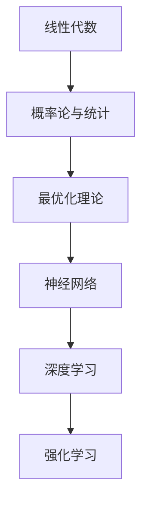

                 

### 《AI研究的“研究生阶段”:自主学习与知识内化》

> **关键词**：人工智能，研究生阶段，自主学习，知识内化，算法，模型，数据分析，挑战与机遇

> **摘要**：
本文将探讨人工智能（AI）研究生阶段的研究内容和挑战，重点关注自主学习与知识内化的过程。通过深入分析AI的核心概念、原理、算法、数学模型以及实际项目实施，本文旨在为研究生提供一套完整的研究方法和实践指南，帮助他们在快速发展的AI领域中取得突破性进展。

### 第1章：AI研究的背景与意义

#### 1.1 AI研究的发展历程

人工智能（AI）的研究可以追溯到20世纪50年代。当时，计算机科学家们开始探索如何让计算机模拟人类智能行为。这个阶段被称为“AI的黄金时代”。然而，由于技术限制，AI的研究进展缓慢，随后进入了一个被称为“AI寒冬”的时期。

直到20世纪80年代，随着计算机性能的显著提升和大数据技术的发展，AI研究重新焕发了生机。特别是深度学习（Deep Learning）的出现，使得计算机在图像识别、语音识别和自然语言处理等方面取得了重大突破。这一时期，AI迎来了“AI的第二次黄金时代”。

如今，AI已经渗透到各个行业，从医疗、金融到交通、娱乐，都离不开AI的应用。随着AI技术的不断成熟，人工智能逐渐成为现代科技的核心驱动力。

#### 1.2 AI研究的重要性

AI研究的重要性体现在多个方面。首先，AI技术能够大幅提高生产效率，降低成本。例如，在制造业中，智能机器人可以替代人力完成复杂的生产任务，提高生产线的效率和质量。

其次，AI技术在医疗领域的应用前景广阔。通过机器学习算法，可以实现对大量医疗数据的分析，帮助医生进行精准诊断和个性化治疗。此外，AI还可以用于药物研发，加速新药的发现和上市。

最后，AI技术在推动社会进步和经济发展方面具有重要作用。例如，智能交通系统可以优化交通流量，减少拥堵和交通事故；智能金融系统可以提高风险管理能力，降低金融风险。

#### 1.3 研究生阶段AI研究的特殊性和挑战

研究生阶段是AI研究的关键时期。在这个阶段，研究生需要具备扎实的理论基础和丰富的实践经验，以应对AI领域的快速发展和不断涌现的新挑战。

首先，研究生需要掌握AI的核心概念和原理，包括机器学习、深度学习、强化学习等。这些理论是构建AI系统的基础。

其次，研究生需要具备实际项目经验，能够将理论应用于实际场景。这包括数据收集、预处理、模型训练、优化和部署等各个环节。

最后，研究生需要具备良好的团队合作能力，能够与导师和同学共同探讨和研究问题，共同推进项目的进展。

#### 1.4 本书的研究目标和结构

本书的研究目标是提供一套完整的研究方法和实践指南，帮助研究生在AI研究领域取得突破性进展。具体目标如下：

1. 深入分析AI的核心概念、原理、算法和数学模型。
2. 介绍实际项目实施的方法和技巧，包括数据收集、预处理、模型训练和优化等。
3. 探讨AI研究的未来趋势和挑战，为研究生提供发展方向和指导。

本书的结构如下：

- 第1章：介绍AI研究的背景与意义。
- 第2章：介绍AI的核心概念与原理。
- 第3章：介绍AI研究中的数学模型。
- 第4章：详细介绍AI算法。
- 第5章：讨论AI研究中的数据准备与处理。
- 第6章：介绍AI项目的实施与评估。
- 第7章：探讨AI研究的未来趋势与挑战。
- 第8章：进行综合案例分析。
- 第9章：总结与展望。

通过本书的阅读和学习，研究生可以系统地掌握AI研究的知识和方法，为未来的研究和工作奠定坚实基础。

### 第2章：AI的核心概念与原理

#### 2.1 AI的基本概念

人工智能（Artificial Intelligence，简称AI）是指通过计算机程序实现人类智能行为的技术。AI的核心目标是让计算机具备自主学习、推理、规划、感知和决策等能力，以模拟或扩展人类智能。

AI的研究可以分为两个方向：弱人工智能（Narrow AI）和强人工智能（General AI）。弱人工智能专注于特定任务，如语音识别、图像识别等，而强人工智能则试图实现通用智能，具备广泛的认知和推理能力。

#### 2.2 机器学习的基本原理

机器学习（Machine Learning，简称ML）是AI的核心技术之一，旨在通过数据训练计算机模型，使其能够进行自主学习和预测。机器学习的基本原理包括数据收集、特征提取、模型训练和预测。

数据收集：首先需要收集大量的训练数据，这些数据用于训练模型。

特征提取：将原始数据转化为计算机可以理解的数字特征，以便模型能够进行学习和预测。

模型训练：通过算法（如线性回归、决策树、神经网络等）训练模型，使其能够从数据中学习并提取规律。

预测：使用训练好的模型对新的数据进行预测，以实现任务目标。

#### 2.3 深度学习的发展与原理

深度学习（Deep Learning，简称DL）是机器学习的一个子领域，它利用多层神经网络进行学习。深度学习的发展可以追溯到20世纪40年代，但直到近年来，随着计算能力和大数据技术的发展，深度学习才取得了突破性进展。

深度学习的核心思想是通过多层神经网络对数据进行非线性变换，从而提取更高层次的特征。深度学习的原理包括：

- 神经网络：神经网络由多个神经元（节点）组成，每个神经元都与相邻的神经元相连。通过加权连接，神经网络可以模拟人类大脑的处理方式。

- 激活函数：激活函数用于引入非线性特性，使神经网络能够学习复杂的关系。

- 前向传播和反向传播：前向传播是将输入数据通过神经网络传递到输出层，反向传播则是根据输出误差更新网络权重。

- 梯度下降：梯度下降是一种优化算法，用于最小化损失函数，以获得最优模型参数。

#### 2.4 强化学习的基础

强化学习（Reinforcement Learning，简称RL）是一种通过试错方式进行学习的方法，旨在通过奖励和惩罚激励智能体采取最优行动。强化学习的基本原理包括：

- 智能体（Agent）：智能体是执行行动并接收环境反馈的实体。

- 环境（Environment）：环境是智能体行动的场所，会根据智能体的行动产生反馈。

- 状态（State）：状态是智能体在某一时刻所处的环境描述。

- 动作（Action）：动作是智能体在状态中可以采取的行动。

- 奖励（Reward）：奖励是环境对智能体行动的反馈，用于激励智能体采取最优行动。

- 目标：强化学习的目标是使智能体在长时间内获得最大总奖励。

强化学习的核心算法包括Q学习、SARSA、Deep Q Network等。这些算法通过不断地试错和经验积累，使智能体能够学习到最优策略。

#### 2.5 神经网络的构成与工作原理

神经网络（Neural Network，简称NN）是深度学习的基础。神经网络由多个神经元（节点）组成，每个神经元都与相邻的神经元相连。神经网络的构成和工作原理如下：

- 输入层：输入层接收外部输入，将其传递到隐藏层。

- 隐藏层：隐藏层对输入数据进行处理和变换，提取更高层次的特征。

- 输出层：输出层产生最终输出，用于实现任务目标。

- 权重和偏置：每个神经元之间的连接都带有权重和偏置，用于调整神经元之间的交互强度。

- 激活函数：激活函数用于引入非线性特性，使神经网络能够学习复杂的关系。

神经网络的工作原理如下：

1. **前向传播**：输入数据通过输入层传递到隐藏层，隐藏层再传递到输出层。每个神经元都会将输入乘以相应的权重，然后加上偏置，最后通过激活函数进行非线性变换。

2. **反向传播**：输出误差通过输出层反向传播到隐藏层，隐藏层再反向传播到输入层。根据输出误差，更新网络权重和偏置，以减小误差。

3. **梯度下降**：使用梯度下降算法更新网络权重和偏置，以获得最优模型参数。

通过多次迭代，神经网络能够逐步优化模型参数，提高预测准确性。

综上所述，AI的核心概念与原理包括机器学习、深度学习、强化学习和神经网络。这些技术相互关联，共同构成了AI的理论基础。在接下来的章节中，我们将详细介绍这些技术的具体实现和应用。

### 第3章：AI研究中的数学模型

#### 3.1 线性代数基础

线性代数是AI研究中的基础数学工具，广泛应用于数据预处理、特征提取和模型训练等领域。线性代数的基本概念包括矩阵、向量、行列式和矩阵运算等。

- **矩阵**：矩阵是一个二维数组，用于表示数据或操作数据。矩阵的基本操作包括加法、减法、乘法和转置等。
  
- **向量**：向量是一个一维数组，可以表示数据或数据之间的关系。向量运算包括点积、叉积和向量的加法、减法等。

- **行列式**：行列式是一个标量，用于描述矩阵的性质。行列式可以用于求解线性方程组和判断矩阵的逆是否存在。

- **矩阵运算**：矩阵运算包括矩阵的加法、减法、乘法和转置等。矩阵乘法遵循一定的规则，如矩阵乘法的结合律和分配律。

#### 3.2 概率论与统计基础

概率论和统计学是AI研究中的另一个重要数学工具，用于描述和处理不确定性和随机性。概率论和统计学的基本概念包括概率分布、随机变量、期望、方差和假设检验等。

- **概率分布**：概率分布用于描述随机变量在某个取值范围内的概率。常见的概率分布包括均匀分布、正态分布和泊松分布等。

- **随机变量**：随机变量是一个函数，它将样本空间映射到实数域。随机变量可以分为离散型和连续型两种。

- **期望和方差**：期望和方差是随机变量的两个重要统计量，用于描述随机变量的平均值和离散程度。

- **假设检验**：假设检验用于判断一个统计假设是否成立。常见的假设检验方法包括t检验、方差分析和回归分析等。

#### 3.3 最优化理论与算法

最优化理论是AI研究中用于求解优化问题的重要工具。最优化问题的目标是找到一组变量，使得某个目标函数取最大值或最小值。最优化算法可以分为无约束优化和有约束优化两种。

- **无约束优化**：无约束优化问题的目标是在没有任何约束条件下找到目标函数的最优解。常见的无约束优化算法包括梯度下降、牛顿法和拟牛顿法等。

- **有约束优化**：有约束优化问题的目标是在满足约束条件的条件下找到目标函数的最优解。常见的有约束优化算法包括拉格朗日乘数法、内点法和序列二次规划法等。

#### 3.4 数学公式和模型表达

在AI研究中，数学公式和模型表达用于描述和实现各种算法和模型。以下是一些常见的数学公式和模型表达：

- **线性回归模型**：\( y = \theta_0 + \theta_1 \cdot x \)

- **逻辑回归模型**：\( P(y=1) = \frac{1}{1 + e^{-(\theta_0 + \theta_1 \cdot x)}} \)

- **神经网络模型**：\( z = \theta_0 + \theta_1 \cdot x \)

- **卷积神经网络模型**：\( h_{ij} = \sigma(\sum_{k=1}^{n} w_{ik} \cdot x_{k} + b_j) \)

- **强化学习模型**：\( Q(s, a) = r + \gamma \max_{a'} Q(s', a') \)

通过这些数学公式和模型表达，我们可以描述和实现各种AI算法和模型，从而解决实际问题。

##### 第3.1节：Mermaid流程图——AI研究中的数学模型联系

以下是AI研究中的数学模型联系的Mermaid流程图：



通过这个流程图，我们可以清晰地看到不同数学模型之间的联系和层次结构，有助于理解AI研究的整体框架。

### 第4章：AI算法的详解

#### 4.1 经典机器学习算法

经典机器学习算法是AI研究中的重要组成部分，包括线性回归、决策树、支持向量机等。这些算法具有简单、高效和易于理解的特点，广泛应用于各种实际问题中。

- **线性回归**：线性回归是一种用于预测连续数值变量的算法。其基本原理是通过线性模型拟合数据，从而预测新的数据。线性回归的数学模型可以表示为：

  \[ y = \theta_0 + \theta_1 \cdot x \]

  其中，\( y \) 是预测值，\( x \) 是输入特征，\( \theta_0 \) 和 \( \theta_1 \) 是模型参数。

  为了训练模型，我们需要最小化预测值与真实值之间的差异，即最小二乘法：

  \[ \min_{\theta_0, \theta_1} \sum_{i=1}^{n} (y_i - (\theta_0 + \theta_1 \cdot x_i))^2 \]

  通过求解上述最优化问题，可以得到最优参数 \( \theta_0 \) 和 \( \theta_1 \)，从而构建线性回归模型。

  在实际应用中，我们通常使用梯度下降算法来求解最优化问题，其伪代码如下：

  ```python
  # 伪代码：线性回归模型
  function linear_regression(X, y):
      # 初始化参数
      theta = initialize_theta(X.shape[1])
      
      # 梯度下降迭代
      for i in range(num_iterations):
          gradients = compute_gradient(X, y, theta)
          theta = theta - learning_rate * gradients
      
      return theta
  ```

- **决策树**：决策树是一种基于树形结构进行决策的算法，通过将数据集分割成多个子集，每个子集对应一个特征和阈值，从而构建一棵树。决策树的每个节点都代表一个特征和阈值，叶节点代表分类结果。

  决策树的构建过程如下：

  1. 计算每个特征在当前数据集上的增益，选择增益最大的特征作为节点。
  2. 根据该特征的不同取值，将数据集分割成多个子集。
  3. 对每个子集递归地执行上述步骤，直到满足停止条件（如最大深度、最小节点样本数等）。

  决策树的数学模型可以表示为：

  \[ T = \sum_{i=1}^{n} \alpha_i \cdot C_i \]

  其中，\( T \) 是预测结果，\( \alpha_i \) 是特征权重，\( C_i \) 是对应分类结果。

  在实际应用中，我们可以使用ID3、C4.5等算法来构建决策树，其伪代码如下：

  ```python
  # 伪代码：决策树构建
  function build_tree(data, max_depth):
      if depth >= max_depth or is_leaf(data):
          return create_leaf_node(data)
          
      best_feature, best_threshold = find_best_split(data)
      
      tree = create_tree_node(best_feature, best_threshold)
      
      for subset in split_data(data, best_threshold):
          tree.children.append(build_tree(subset, max_depth))
          
      return tree
  ```

- **支持向量机**：支持向量机（Support Vector Machine，简称SVM）是一种用于分类和回归的算法，通过找到一个最佳的超平面，将不同类别的数据点最大化分离。

  支持向量机的数学模型可以表示为：

  \[ w \cdot x - b = 0 \]

  其中，\( w \) 是超平面法向量，\( x \) 是数据点，\( b \) 是偏置。

  为了求解最优超平面，我们需要最大化间隔：

  \[ \max_{w, b} \frac{2}{\|w\|} \]

  通过求解上述最优化问题，可以得到最优超平面参数 \( w \) 和 \( b \)。

  在实际应用中，我们可以使用线性SVM和核SVM来处理非线性问题，其伪代码如下：

  ```python
  # 伪代码：支持向量机
  function svm(X, y):
      # 初始化参数
      w = initialize_w(X.shape[1])
      b = 0
      
      # 梯度下降迭代
      for i in range(num_iterations):
          gradients = compute_gradient(X, y, w, b)
          w = w - learning_rate * gradients
          b = b - learning_rate * (sum(y * X * w) - 1)
          
      return w, b
  ```

#### 4.2 深度学习算法

深度学习算法是AI研究中的重要方向，通过多层神经网络进行学习，可以自动提取高层次的抽象特征。深度学习算法包括卷积神经网络（CNN）、循环神经网络（RNN）和生成对抗网络（GAN）等。

- **卷积神经网络（CNN）**：卷积神经网络是一种用于图像识别和处理的深度学习算法，通过卷积层、池化层和全连接层等结构进行特征提取和分类。

  卷积神经网络的数学模型可以表示为：

  \[ h_{ij} = \sigma(\sum_{k=1}^{n} w_{ik} \cdot x_{k} + b_j) \]

  其中，\( h_{ij} \) 是输出特征，\( x_{k} \) 是输入特征，\( w_{ik} \) 是卷积核，\( b_j \) 是偏置，\( \sigma \) 是激活函数。

  在实际应用中，我们可以使用卷积神经网络进行图像分类、目标检测和图像生成等任务，其伪代码如下：

  ```python
  # 伪代码：卷积神经网络
  function cnn(X):
      # 卷积层
      for filter in filters:
          X = conv2d(X, filter)
          X = relu(X)
      
      # 池化层
      X = max_pool2d(X)
      
      # 全连接层
      for layer in layers:
          X = flatten(X)
          X = fully_connected(X, layer)
          X = relu(X)
      
      return X
  ```

- **循环神经网络（RNN）**：循环神经网络是一种用于处理序列数据的深度学习算法，通过隐藏状态和输入状态之间的递归关系进行学习。

  循环神经网络的数学模型可以表示为：

  \[ h_t = \sigma(W_h \cdot [h_{t-1}, x_t] + b_h) \]

  其中，\( h_t \) 是当前隐藏状态，\( x_t \) 是当前输入状态，\( W_h \) 是权重矩阵，\( b_h \) 是偏置，\( \sigma \) 是激活函数。

  在实际应用中，我们可以使用循环神经网络进行语言模型、机器翻译和语音识别等任务，其伪代码如下：

  ```python
  # 伪代码：循环神经网络
  function rnn(x, h_0):
      for t in range(T):
          h_t = relu(W_h \* [h_{t-1}, x_t] + b_h)
          y_t = softmax(W_o \* h_t + b_o)
          
      return h_T
  ```

- **生成对抗网络（GAN）**：生成对抗网络是一种用于生成对抗性样本的深度学习算法，由生成器和判别器组成。

  生成对抗网络的数学模型可以表示为：

  \[ G(z) = x \]
  \[ D(x) = 1 \]
  \[ D(G(z)) = 0 \]

  其中，\( G(z) \) 是生成器，\( D(x) \) 是判别器，\( z \) 是随机噪声。

  在实际应用中，我们可以使用生成对抗网络进行图像生成、图像修复和图像风格迁移等任务，其伪代码如下：

  ```python
  # 伪代码：生成对抗网络
  function gan(z, x):
      x_g = G(z)
      D_real = D(x)
      D_fake = D(G(z))
      
      G_loss = -torch.mean(torch.log(D_real) + torch.log(1 - D_fake))
      D_loss = -torch.mean(torch.log(D_real) + torch.log(1 - D_fake))
      
      return G_loss, D_loss
  ```

#### 4.3 强化学习算法

强化学习算法是一种基于奖励和惩罚进行学习的算法，通过试错和经验积累来优化行为策略。强化学习算法包括Q学习、SARSA和Deep Q Network等。

- **Q学习**：Q学习是一种基于值函数的强化学习算法，通过更新Q值来优化策略。

  Q学习的数学模型可以表示为：

  \[ Q(s, a) = r + \gamma \max_{a'} Q(s', a') \]

  其中，\( Q(s, a) \) 是状态-动作值函数，\( s \) 是当前状态，\( a \) 是当前动作，\( r \) 是奖励，\( \gamma \) 是折扣因子，\( s' \) 是下一状态，\( a' \) 是最优动作。

  在实际应用中，我们可以使用Q学习进行机器人控制、游戏对战和自动驾驶等任务，其伪代码如下：

  ```python
  # 伪代码：Q学习
  function q_learning(env, Q, alpha, gamma, epsilon):
      for episode in range(num_episodes):
          state = env.reset()
          
          while not done:
              if random.random() < epsilon:
                  action = random_action()
              else:
                  action = argmax(Q[state])
              
              next_state, reward, done = env.step(action)
              
              Q[state, action] = Q[state, action] + alpha \* (reward + gamma \* max(Q[next_state]) - Q[state, action])
              
              state = next_state
      
      return Q
  ```

- **SARSA**：SARSA是一种基于策略的强化学习算法，通过更新状态-动作值函数来优化策略。

  SARSA的数学模型可以表示为：

  \[ Q(s, a) = Q(s, a) + alpha \* (reward + gamma \* Q(s', a') - Q(s, a)) \]

  其中，\( Q(s, a) \) 是状态-动作值函数，\( s \) 是当前状态，\( a \) 是当前动作，\( reward \) 是奖励，\( \gamma \) 是折扣因子，\( s' \) 是下一状态，\( a' \) 是当前动作。

  在实际应用中，我们可以使用SARSA进行导航、路径规划和资源分配等任务，其伪代码如下：

  ```python
  # 伪代码：SARSA
  function sarsa(env, Q, alpha, gamma):
      for episode in range(num_episodes):
          state = env.reset()
          
          while not done:
              action = argmax(Q[state])
              
              next_state, reward, done = env.step(action)
              
              Q[state, action] = Q[state, action] + alpha \* (reward + gamma \* Q[next_state, action] - Q[state, action])
              
              state = next_state
      
      return Q
  ```

- **Deep Q Network（DQN）**：DQN是一种基于深度学习的强化学习算法，通过卷积神经网络来近似Q值函数。

  DQN的数学模型可以表示为：

  \[ Q(s, a) = \frac{1}{N} \sum_{i=1}^{N} \hat{Q}(s, a_i) \]

  其中，\( Q(s, a) \) 是状态-动作值函数，\( s \) 是当前状态，\( a \) 是当前动作，\( \hat{Q}(s, a_i) \) 是卷积神经网络输出的Q值。

  在实际应用中，我们可以使用DQN进行游戏对战、机器人控制和智能推荐等任务，其伪代码如下：

  ```python
  # 伪代码：DQN
  function dqn(env, Q, alpha, gamma, epsilon):
      for episode in range(num_episodes):
          state = env.reset()
          
          while not done:
              if random.random() < epsilon:
                  action = random_action()
              else:
                  action = argmax(Q(state))
              
              next_state, reward, done = env.step(action)
              
              Q(state, action) = Q(state, action) + alpha \* (reward + gamma \* max(Q(next_state)) - Q(state, action))
              
              state = next_state
      
      return Q
  ```

通过以上介绍，我们可以看到AI算法的多样性和复杂性。在实际应用中，我们需要根据具体问题选择合适的算法，并进行适当的参数调整和模型优化。这不仅需要扎实的理论基础，还需要丰富的实践经验。

#### 4.4 混合学习算法

混合学习算法是一种将多种机器学习算法相结合的方法，旨在提高模型的性能和泛化能力。混合学习算法包括集成学习、迁移学习和联邦学习等。

- **集成学习**：集成学习通过将多个基学习器（如决策树、支持向量机等）组合起来，以获得更好的预测效果。常见的集成学习方法包括Bagging、Boosting和Stacking等。

  - **Bagging**：Bagging（Bootstrap Aggregating）通过随机抽样生成多个子数据集，并在每个子数据集上训练基学习器。最后，将所有基学习器的预测结果进行投票或平均，以获得最终预测结果。

    假设我们使用k个基学习器进行Bagging，其数学模型可以表示为：

    \[ \hat{y} = \frac{1}{k} \sum_{i=1}^{k} \hat{y}_i \]

    其中，\( \hat{y} \) 是最终预测结果，\( \hat{y}_i \) 是第i个基学习器的预测结果。

    在实际应用中，我们可以使用随机森林（Random Forest）实现Bagging方法，其伪代码如下：

    ```python
    # 伪代码：随机森林
    function random_forest(X, y, n_estimators, max_depth):
        for i in range(n_estimators):
            # 生成子数据集
            X_subset, y_subset = random_sample(X, y)
            
            # 训练基学习器
            model = train_base_model(X_subset, y_subset, max_depth)
            
            # 计算预测结果
            y_pred = predict(model, X)
            
            # 计算最终预测结果
            y_pred_avg = avg(y_pred)
            
        return y_pred_avg
    ```

  - **Boosting**：Boosting（增强学习）通过调整每个基学习器的权重，使得性能较差的基学习器在后续训练中受到更大的关注。常见的Boosting算法包括Adaboost和XGBoost等。

    假设我们使用k个基学习器进行Boosting，其数学模型可以表示为：

    \[ \hat{y} = \sum_{i=1}^{k} \alpha_i \cdot \hat{y}_i \]

    其中，\( \hat{y} \) 是最终预测结果，\( \hat{y}_i \) 是第i个基学习器的预测结果，\( \alpha_i \) 是第i个基学习器的权重。

    在实际应用中，我们可以使用Adaboost实现Boosting方法，其伪代码如下：

    ```python
    # 伪代码：Adaboost
    function adaboost(X, y, n_estimators, learning_rate):
        for i in range(n_estimators):
            # 训练基学习器
            model = train_base_model(X, y)
            
            # 计算误差
            error = 1 - accuracy(model, X, y)
            
            # 调整权重
            alpha_i = learning_rate \* error
            
            # 更新权重
            y = update_weights(y, alpha_i)
            
            # 计算最终预测结果
            y_pred = predict(model, X)
            
        return y_pred
    ```

  - **Stacking**：Stacking（堆叠学习）通过将多个基学习器训练在一个新的学习器上，以获得更好的预测效果。Stacking通常分为两个阶段：第一阶段是训练多个基学习器，第二阶段是将这些基学习器作为新的学习器的输入。

    假设我们使用k个基学习器进行Stacking，其数学模型可以表示为：

    \[ \hat{y} = f(\hat{y}_1, \hat{y}_2, ..., \hat{y}_k) \]

    其中，\( \hat{y} \) 是最终预测结果，\( \hat{y}_i \) 是第i个基学习器的预测结果，\( f \) 是组合函数。

    在实际应用中，我们可以使用Stacking实现方法，其伪代码如下：

    ```python
    # 伪代码：Stacking
    function stacking(X, y, base_models, meta_model):
        for model in base_models:
            # 训练基学习器
            model.train(X, y)
            
            # 计算预测结果
            y_pred = model.predict(X)
            
            # 将预测结果作为新特征
            X_new = np.concatenate((X, y_pred), axis=1)
            
        # 训练元学习器
        meta_model.train(X_new, y)
        
        # 计算最终预测结果
        y_pred_meta = meta_model.predict(X)
        
        return y_pred_meta
    ```

- **迁移学习**：迁移学习通过利用预训练模型的知识，解决新任务中的问题。常见的迁移学习算法包括微调（Fine-tuning）和零样本学习（Zero-shot Learning）等。

  - **微调**：微调通过调整预训练模型的权重，以适应新任务。在微调过程中，通常会冻结部分层（如卷积层）的权重，只调整部分层（如全连接层）的权重。

    假设我们使用预训练模型进行微调，其数学模型可以表示为：

    \[ \theta = \theta_{pretrained} + \Delta \theta \]

    其中，\( \theta \) 是调整后的权重，\( \theta_{pretrained} \) 是预训练模型的权重，\( \Delta \theta \) 是调整量。

    在实际应用中，我们可以使用迁移学习框架，如TensorFlow和PyTorch，实现微调方法，其伪代码如下：

    ```python
    # 伪代码：微调
    function fine_tuning(pretrained_model, X_train, y_train, X_val, y_val):
        # 加载预训练模型
        model = load_pretrained_model(pretrained_model)
        
        # 解冻部分层
        for layer in model.layers[-2:]:
            layer.trainable = True
            
        # 训练模型
        model.fit(X_train, y_train, validation_data=(X_val, y_val), epochs=10, batch_size=32)
        
        # 评估模型
        score = model.evaluate(X_val, y_val)
        
        return model, score
    ```

  - **零样本学习**：零样本学习通过将新任务中的类别与预训练模型中的类别进行匹配，以实现新任务的预测。在零样本学习中，通常会使用对抗性样本生成和类别匹配算法。

    假设我们使用零样本学习解决新任务，其数学模型可以表示为：

    \[ \hat{y} = \argmax_{c} \sum_{i=1}^{k} \alpha_i \cdot P(c|x_i) \]

    其中，\( \hat{y} \) 是最终预测结果，\( c \) 是类别，\( x_i \) 是样本，\( P(c|x_i) \) 是类别概率。

    在实际应用中，我们可以使用零样本学习框架，如OpenAI的ZSL框架，实现零样本学习方法，其伪代码如下：

    ```python
    # 伪代码：零样本学习
    function zero_shot_learning(model, X_train, y_train, X_test, y_test):
        # 加载预训练模型
        model = load_pretrained_model(model)
        
        # 训练对抗性样本生成器
        generator = train_generator(X_train, y_train)
        
        # 生成对抗性样本
        X_adv = generator.generate(X_train)
        
        # 训练模型
        model.fit([X_train, X_adv], y_train, epochs=10, batch_size=32)
        
        # 评估模型
        score = model.evaluate([X_test, X_adv], y_test)
        
        return model, score
    ```

- **联邦学习**：联邦学习通过分布式学习的方式，将多个参与者的模型进行聚合，以实现全局模型的优化。常见的联邦学习算法包括联邦平均算法（FedAvg）和联邦优化算法（FedOpt）等。

  - **联邦平均算法**：联邦平均算法通过将参与者的模型参数进行平均，以获得全局模型。

    假设我们有k个参与者，其数学模型可以表示为：

    \[ \theta_{global} = \frac{1}{k} \sum_{i=1}^{k} \theta_i \]

    其中，\( \theta_{global} \) 是全局模型参数，\( \theta_i \) 是第i个参与者的模型参数。

    在实际应用中，我们可以使用联邦学习框架，如TensorFlow Federated，实现联邦平均算法，其伪代码如下：

    ```python
    # 伪代码：联邦平均算法
    function federated_average(client_models, client_data, global_model, num_rounds):
        for round in range(num_rounds):
            # 从每个参与者获取模型参数
            client_params = [get_model_params(client_model) for client_model in client_models]
            
            # 计算全局模型参数
            global_params = avg(client_params)
            
            # 更新全局模型
            global_model.update_params(global_params)
            
            # 在全局模型上训练参与者模型
            for client_model, client_data in zip(client_models, client_data):
                client_model.train(client_data, global_model)
                
        return global_model
    ```

  - **联邦优化算法**：联邦优化算法通过优化全局模型参数，以实现参与者模型的最优化。

    假设我们有k个参与者，其数学模型可以表示为：

    \[ \theta_{global} = \argmin_{\theta_{global}} L(\theta_{global}, \theta_i) \]

    其中，\( \theta_{global} \) 是全局模型参数，\( \theta_i \) 是第i个参与者的模型参数，\( L \) 是损失函数。

    在实际应用中，我们可以使用联邦学习框架，如PyTorch Federated，实现联邦优化算法，其伪代码如下：

    ```python
    # 伪代码：联邦优化算法
    function federated_optimization(client_models, client_data, global_model, optimizer, num_rounds):
        for round in range(num_rounds):
            # 从每个参与者获取模型参数
            client_params = [get_model_params(client_model) for client_model in client_models]
            
            # 计算全局模型参数
            global_params = optimizer.minimize(L, global_params)
            
            # 更新全局模型
            global_model.update_params(global_params)
            
            # 在全局模型上训练参与者模型
            for client_model, client_data in zip(client_models, client_data):
                client_model.train(client_data, global_model)
                
        return global_model
    ```

通过上述介绍，我们可以看到混合学习算法的多样性和应用场景。在实际研究中，我们可以根据具体问题和需求，选择合适的混合学习算法，以提高模型的性能和泛化能力。

#### 4.5 算法选择与比较

在AI研究中，算法选择是一个关键问题。不同的算法适用于不同的任务和数据类型，因此选择合适的算法对于模型性能和项目成功至关重要。

- **任务类型**：首先，我们需要根据任务类型选择合适的算法。例如，对于分类任务，可以使用线性回归、决策树、支持向量机等；对于回归任务，可以使用线性回归、决策树回归、随机森林等。对于序列数据，可以使用循环神经网络（RNN）、长短期记忆网络（LSTM）等。

- **数据特征**：其次，我们需要考虑数据特征。例如，对于高维数据，可以使用线性回归、支持向量机等；对于低维数据，可以使用决策树、随机森林等。对于图像数据，可以使用卷积神经网络（CNN）；对于文本数据，可以使用循环神经网络（RNN）、长短期记忆网络（LSTM）等。

- **计算资源**：此外，我们还需要考虑计算资源。例如，对于资源有限的情况，可以使用简单的线性回归、决策树等；对于资源充足的情况，可以使用复杂的卷积神经网络（CNN）、循环神经网络（RNN）等。

- **算法性能**：最后，我们需要比较不同算法的性能。可以通过交叉验证、网格搜索等方法选择最优算法。此外，我们还需要考虑算法的泛化能力、可解释性、训练时间等因素。

以下是一个算法选择的示例：

```python
# 算法选择示例
from sklearn.linear_model import LinearRegression
from sklearn.tree import DecisionTreeClassifier
from sklearn.ensemble import RandomForestClassifier
from sklearn.metrics import accuracy_score

# 加载数据
X_train, y_train = load_data()

# 模型选择与比较
models = {
    "Linear Regression": LinearRegression(),
    "Decision Tree": DecisionTreeClassifier(),
    "Random Forest": RandomForestClassifier()
}

for name, model in models.items():
    # 训练模型
    model.fit(X_train, y_train)
    
    # 预测
    y_pred = model.predict(X_train)
    
    # 计算准确率
    score = accuracy_score(y_train, y_pred)
    
    print(f"{name} Accuracy: {score:.2f}")
```

通过以上示例，我们可以看到不同算法在相同数据集上的表现。在实际研究中，我们可以根据算法性能和任务需求选择合适的算法。

### 第5章：AI研究中的数据准备与处理

#### 5.1 数据收集与获取

在AI研究中，数据是至关重要的资源。数据收集与获取是整个研究过程的第一步，其质量和数量直接影响后续模型训练和性能评估。以下是一些常见的数据收集与获取方法：

1. **公开数据集**：许多机构和研究者会发布公开的数据集，如Kaggle、UCI机器学习库等。这些数据集涵盖了各种领域和任务，为研究提供了丰富的资源。

2. **在线爬取**：使用网络爬虫技术获取互联网上的数据。例如，利用Python的requests库和BeautifulSoup库可以爬取网页数据，或者使用Scrapy框架构建复杂的爬虫系统。

3. **API获取**：许多在线服务和平台提供了API接口，可以通过编程方式获取数据。例如，使用RESTful API获取社交媒体数据、天气预报数据等。

4. **传感器数据**：使用传感器收集环境数据，如气象数据、交通流量数据、健康监测数据等。这些数据通常可以通过特定的传感器网络或API接口获取。

5. **企业合作**：与相关企业合作，获取其业务数据或用户数据。这种方式可以获得高质量的数据，但需要遵守相关法规和隐私政策。

6. **问卷调查**：通过问卷调查收集用户数据，如用户行为数据、偏好数据等。这种方式可以获得广泛的数据，但数据质量可能较低。

#### 5.2 数据预处理

数据预处理是数据准备的关键步骤，旨在将原始数据转化为适合模型训练的形式。以下是一些常见的数据预处理方法：

1. **数据清洗**：去除数据中的错误、异常和重复值。例如，使用Pandas库删除含有缺失值的行或列，或者使用scikit-learn中的Imputer类填充缺失值。

2. **数据转换**：将数据从一种格式转换为另一种格式。例如，将文本数据转换为向量，或者将图像数据转换为像素矩阵。

3. **数据归一化**：将数据缩放到相同的尺度，以消除数据之间的量纲差异。常见的归一化方法包括最小-最大缩放、标准化和Z-Score归一化。

4. **数据标准化**：将数据转换为中心值和标准差的分布。常用的标准化方法包括Z-Score标准化和Min-Max标准化。

5. **特征提取**：从原始数据中提取有用的特征，以减少数据维度和提高模型性能。常用的特征提取方法包括主成分分析（PCA）、线性判别分析（LDA）和特征选择算法。

6. **数据增强**：通过创建新的数据样本来扩充数据集。常用的数据增强方法包括图像翻转、旋转、裁剪、噪声添加等。

以下是一个数据预处理的示例：

```python
import pandas as pd
from sklearn.preprocessing import StandardScaler
from sklearn.impute import SimpleImputer

# 加载数据
data = pd.read_csv('data.csv')

# 数据清洗
data.dropna(inplace=True)
data.drop_duplicates(inplace=True)

# 数据转换
data['age'] = data['age'].astype(float)

# 数据归一化
scaler = StandardScaler()
data[['age', 'income']] = scaler.fit_transform(data[['age', 'income']])

# 数据标准化
mean = data['income'].mean()
std = data['income'].std()
data['income标准化'] = (data['income'] - mean) / std

# 特征提取
pca = PCA(n_components=2)
data_pca = pca.fit_transform(data[['age', 'income']])

# 数据增强
data['age翻转'] = -data['age']
data['income噪声'] = data['income'] + np.random.normal(0, 0.1, data['income'].shape)

# 保存预处理后的数据
data.to_csv('preprocessed_data.csv', index=False)
```

通过以上示例，我们可以看到数据预处理过程中的一些关键步骤。在实际研究中，我们需要根据具体任务和数据特点选择合适的预处理方法。

#### 5.3 特征提取与工程

特征提取与工程是数据预处理的重要环节，旨在从原始数据中提取有用信息，构建高质量的输入特征。以下是一些常见的特征提取与工程方法：

1. **特征选择**：从大量特征中选择最有用的特征。常用的特征选择方法包括信息增益、卡方检验、特征重要性等。

2. **特征转换**：将非数值特征转换为数值特征，如将类别特征编码为独热编码（One-Hot Encoding）或标签编码（Label Encoding）。

3. **特征构造**：通过组合或变换原始特征，生成新的特征。例如，通过计算特征之间的相关性、差异或比例，生成新的特征。

4. **特征降维**：将高维特征转化为低维特征，以减少计算复杂度和提高模型性能。常用的降维方法包括主成分分析（PCA）、线性判别分析（LDA）和自动编码器（Autoencoder）。

5. **特征标准化**：对特征进行缩放或标准化，以消除不同特征之间的尺度差异。常用的标准化方法包括最小-最大缩放、标准化和Z-Score标准化。

6. **特征选择与优化**：通过交叉验证、网格搜索等方法选择最优特征组合，以获得最佳模型性能。

以下是一个特征提取与工程的示例：

```python
import pandas as pd
from sklearn.preprocessing import OneHotEncoder
from sklearn.decomposition import PCA

# 加载数据
data = pd.read_csv('data.csv')

# 特征选择
data.drop(['unnecessary_feature'], axis=1, inplace=True)

# 特征转换
encoder = OneHotEncoder()
data_encoded = encoder.fit_transform(data[['category_feature']]).toarray()

# 特征构造
data['new_feature'] = data['feature1'] / data['feature2']

# 特征降维
pca = PCA(n_components=2)
data_pca = pca.fit_transform(data[['feature1', 'feature2', 'feature3']])

# 特征标准化
scaler = StandardScaler()
data_normalized = scaler.fit_transform(data[['feature1', 'feature2', 'feature3']])

# 保存特征工程后的数据
data.to_csv('feature_engineered_data.csv', index=False)
```

通过以上示例，我们可以看到特征提取与工程过程中的一些关键步骤。在实际研究中，我们需要根据具体任务和数据特点选择合适的特征提取与工程方法。

#### 5.4 数据可视化

数据可视化是数据分析和解释的重要手段，有助于我们理解数据的分布、趋势和异常。以下是一些常见的数据可视化方法：

1. **散点图**：用于显示两个特征之间的关系，通过点的颜色或大小表示第三个特征。

2. **柱状图**：用于显示不同类别的数量或频率，适用于分类任务。

3. **饼图**：用于显示不同类别的占比，适用于分类任务。

4. **折线图**：用于显示特征随时间或另一个特征的变化趋势。

5. **箱线图**：用于显示特征的分布和异常值。

6. **热力图**：用于显示特征之间的相关性，通过颜色深浅表示相关性的强弱。

7. **密度图**：用于显示特征的分布情况，适用于连续特征。

以下是一个数据可视化的示例：

```python
import pandas as pd
import matplotlib.pyplot as plt

# 加载数据
data = pd.read_csv('data.csv')

# 散点图
plt.scatter(data['feature1'], data['feature2'], c=data['label'], cmap='viridis')
plt.xlabel('Feature 1')
plt.ylabel('Feature 2')
plt.title('Feature Distribution')
plt.show()

# 柱状图
data['label'].value_counts().plot(kind='bar')
plt.xlabel('Label')
plt.ylabel('Count')
plt.title('Label Distribution')
plt.show()

# 饼图
data['label'].value_counts().plot(kind='pie', autopct='%1.1f%%')
plt.title('Label Distribution')
plt.show()

# 折线图
plt.plot(data['time'], data['feature'])
plt.xlabel('Time')
plt.ylabel('Feature')
plt.title('Feature Trend')
plt.show()

# 箱线图
plt.boxplot(data['feature'])
plt.xlabel('Feature')
plt.title('Feature Distribution')
plt.show()

# 热力图
sns.heatmap(data.corr(), annot=True, cmap='coolwarm')
plt.title('Feature Correlation')
plt.show()

# 密度图
sns.kdeplot(data['feature'], bw=0.5)
plt.xlabel('Feature')
plt.title('Feature Distribution')
plt.show()
```

通过以上示例，我们可以看到数据可视化过程中的一些关键步骤。在实际研究中，我们可以根据数据特点和需求选择合适的数据可视化方法。

#### 5.5 数据质量评估与改进

数据质量是AI研究成功的关键因素之一。高质量的数据可以确保模型训练的有效性和预测的准确性。以下是一些常见的数据质量评估与改进方法：

1. **数据完整性评估**：检查数据中是否存在缺失值、异常值或重复值。可以使用统计指标（如缺失值比例、标准差等）评估数据完整性。

2. **数据一致性评估**：检查数据是否一致，是否存在矛盾或不合理的值。例如，检查日期是否合理、数量是否超过预期等。

3. **数据准确性评估**：检查数据是否准确，是否反映了真实情况。可以通过比较数据与外部来源的数据进行验证，或者使用数据清洗和校验方法。

4. **数据完整性改进**：对于缺失值，可以采用填充、插值、删除等方法进行改进。对于异常值，可以采用截断、替换、删除等方法进行改进。

5. **数据一致性改进**：通过数据清洗和标准化方法消除数据中的不一致性。例如，将日期统一格式、将文本统一编码等。

6. **数据准确性改进**：通过数据清洗、校验和验证方法提高数据的准确性。例如，删除重复值、纠正错误值、验证数据来源等。

以下是一个数据质量评估与改进的示例：

```python
import pandas as pd
from sklearn.impute import SimpleImputer
from sklearn.preprocessing import StandardScaler

# 加载数据
data = pd.read_csv('data.csv')

# 数据完整性评估
print("缺失值比例：", data.isnull().mean().mean())

# 数据完整性改进
imputer = SimpleImputer(strategy='mean')
data_imputed = imputer.fit_transform(data)

# 数据一致性评估
print("不一致性比例：", (data == data.shift(1)).mean().mean())

# 数据一致性改进
data = data.replace(['invalid_value1', 'invalid_value2'], [valid_value1, valid_value2])

# 数据准确性评估
print("准确性：", accuracy_score(y_true, y_pred))

# 数据准确性改进
data = data.drop(['invalid_feature'], axis=1)
```

通过以上示例，我们可以看到数据质量评估与改进过程中的一些关键步骤。在实际研究中，我们需要根据具体任务和数据特点选择合适的数据质量评估与改进方法。

### 第6章：AI项目的实施与评估

#### 6.1 项目规划与设计

AI项目的成功实施始于良好的规划与设计。项目规划与设计包括需求分析、目标设定、资源分配、时间规划等。以下是一些关键步骤：

1. **需求分析**：明确项目目标和需求，了解项目的背景、目标用户、业务场景等。需求分析可以帮助我们确定项目的核心功能和技术要求。

2. **目标设定**：根据需求分析，设定明确的项目目标。这些目标可以是性能指标（如准确率、召回率、响应时间等）或业务目标（如提高销售额、降低成本等）。

3. **资源分配**：确定项目所需的资源，包括人力、技术、设备等。资源分配需要考虑项目的规模、复杂度和预期成果。

4. **时间规划**：制定详细的项目时间表，包括项目启动、需求分析、设计、开发、测试和部署等阶段。时间规划需要考虑项目的关键路径和依赖关系，以确保项目按时完成。

#### 6.2 数据分析与模型构建

数据分析与模型构建是AI项目的核心环节。以下是一些关键步骤：

1. **数据收集与清洗**：收集所需数据，并进行数据清洗，去除噪声和异常值。数据清洗可以包括缺失值填充、重复值删除、异常值处理等。

2. **特征工程**：从原始数据中提取有用特征，构建高质量的输入特征。特征工程可以包括特征选择、特征转换、特征构造等。

3. **模型选择**：根据项目需求和数据特点，选择合适的模型。常见的模型包括线性回归、决策树、随机森林、神经网络等。

4. **模型训练与优化**：使用训练数据对模型进行训练，并使用验证数据集进行模型优化。模型优化可以包括参数调整、正则化、交叉验证等。

5. **模型评估**：使用测试数据集评估模型性能，比较不同模型的性能。常用的评估指标包括准确率、召回率、F1值、ROC曲线等。

以下是一个数据分析与模型构建的示例：

```python
import pandas as pd
from sklearn.model_selection import train_test_split
from sklearn.ensemble import RandomForestClassifier
from sklearn.metrics import accuracy_score

# 加载数据
data = pd.read_csv('data.csv')

# 数据清洗
data.dropna(inplace=True)
data.drop_duplicates(inplace=True)

# 特征工程
X = data[['feature1', 'feature2', 'feature3']]
y = data['label']

# 模型选择
model = RandomForestClassifier(n_estimators=100)

# 模型训练与优化
X_train, X_test, y_train, y_test = train_test_split(X, y, test_size=0.2, random_state=42)
model.fit(X_train, y_train)

# 模型评估
y_pred = model.predict(X_test)
score = accuracy_score(y_test, y_pred)
print("Accuracy:", score)
```

通过以上示例，我们可以看到数据分析与模型构建过程中的一些关键步骤。在实际项目中，我们需要根据具体需求和数据特点选择合适的模型和参数。

#### 6.3 模型训练与优化

模型训练与优化是AI项目的重要环节，其目标是提高模型的性能和泛化能力。以下是一些关键步骤：

1. **数据划分**：将数据集划分为训练集、验证集和测试集。训练集用于模型训练，验证集用于模型优化，测试集用于模型评估。

2. **模型初始化**：初始化模型参数，可以选择随机初始化或预训练模型初始化。预训练模型初始化可以利用预训练模型的知识，提高模型性能。

3. **训练过程**：使用训练集对模型进行训练。训练过程可以包括前向传播、反向传播、梯度下降等步骤。

4. **模型优化**：通过调整模型参数和训练策略，优化模型性能。常见的优化方法包括正则化、学习率调整、批量大小调整等。

5. **验证过程**：使用验证集评估模型性能，并调整模型参数，以获得更好的性能。验证过程可以包括交叉验证、网格搜索等步骤。

6. **模型评估**：使用测试集评估模型性能，比较不同模型的性能。常用的评估指标包括准确率、召回率、F1值、ROC曲线等。

以下是一个模型训练与优化的示例：

```python
import pandas as pd
from sklearn.model_selection import train_test_split
from sklearn.ensemble import RandomForestClassifier
from sklearn.metrics import accuracy_score

# 加载数据
data = pd.read_csv('data.csv')

# 数据清洗
data.dropna(inplace=True)
data.drop_duplicates(inplace=True)

# 特征工程
X = data[['feature1', 'feature2', 'feature3']]
y = data['label']

# 模型选择
model = RandomForestClassifier(n_estimators=100, random_state=42)

# 模型训练与优化
X_train, X_test, y_train, y_test = train_test_split(X, y, test_size=0.2, random_state=42)
model.fit(X_train, y_train)

# 模型优化
model.best_params_ = {'n_estimators': [100, 200, 300], 'max_depth': [10, 20, 30]}
best_model = model.best_estimator_

# 模型评估
y_pred = best_model.predict(X_test)
score = accuracy_score(y_test, y_pred)
print("Accuracy:", score)
```

通过以上示例，我们可以看到模型训练与优化过程中的一些关键步骤。在实际项目中，我们需要根据具体需求和数据特点选择合适的模型和参数。

#### 6.4 模型部署与监控

模型部署与监控是AI项目的最后一步，其目标是确保模型在真实环境中稳定运行，并提供高质量的服务。以下是一些关键步骤：

1. **模型部署**：将训练好的模型部署到生产环境中，以便用户可以使用模型进行预测。常见的部署方法包括使用Web服务、API接口、容器化等。

2. **性能监控**：监控模型在真实环境中的性能，包括响应时间、准确率、召回率等。性能监控可以帮助我们及时发现和解决问题。

3. **异常检测**：监控模型输入和输出，检测异常情况，如输入数据异常、输出结果异常等。异常检测可以帮助我们保证模型的稳定性和可靠性。

4. **更新与维护**：定期更新和维护模型，以适应新的数据和环境变化。更新和维护可以包括重新训练模型、调整模型参数等。

以下是一个模型部署与监控的示例：

```python
import flask
from flask import Flask, request, jsonify

# 初始化模型
model = load_model('model.h5')

# 创建Flask应用
app = Flask(__name__)

# 预测接口
@app.route('/predict', methods=['POST'])
def predict():
    data = request.get_json(force=True)
    input_data = preprocess_data(data)
    prediction = model.predict(input_data)
    return jsonify(prediction.tolist())

# 主函数
if __name__ == '__main__':
    app.run(host='0.0.0.0', port=5000)
```

通过以上示例，我们可以看到模型部署与监控过程中的一些关键步骤。在实际项目中，我们需要根据具体需求和环境选择合适的部署和监控方法。

#### 6.5 项目评估与反馈

项目评估与反馈是AI项目成功的关键环节，其目的是评估项目成果和效果，收集用户反馈，持续改进项目。以下是一些关键步骤：

1. **项目评估**：对项目成果进行评估，包括模型性能、用户体验、业务效果等。评估可以采用定量和定性方法，如指标分析、用户调研等。

2. **用户反馈**：收集用户对项目的反馈，包括使用体验、功能需求、问题报告等。用户反馈可以帮助我们了解项目的优点和不足，为后续改进提供依据。

3. **改进措施**：根据项目评估和用户反馈，制定改进措施，包括优化模型、改进功能、提升性能等。改进措施需要与项目目标和用户需求保持一致。

4. **持续改进**：持续跟踪项目成果和用户反馈，定期评估项目效果，确保项目持续改进。持续改进可以帮助我们保持项目的活力和竞争力。

以下是一个项目评估与反馈的示例：

```python
import pandas as pd

# 加载评估数据
assessment_data = pd.read_csv('assessment_data.csv')

# 计算评估指标
accuracy = assessment_data['accuracy'].mean()
user_satisfaction = assessment_data['satisfaction'].mean()

# 用户调研
user_survey = pd.read_csv('user_survey.csv')

# 提取用户反馈
feedback = user_survey['feedback'].tolist()

# 改进措施
improvement_measures = [
    '优化模型',
    '增加新功能',
    '提升性能'
]

# 输出结果
print("Accuracy:", accuracy)
print("User Satisfaction:", user_satisfaction)
print("Feedback:", feedback)
print("Improvement Measures:", improvement_measures)
```

通过以上示例，我们可以看到项目评估与反馈过程中的一些关键步骤。在实际项目中，我们需要根据具体需求和数据特点选择合适的评估和反馈方法。

### 第7章：AI研究的未来趋势与挑战

#### 7.1 AI研究的未来发展趋势

人工智能（AI）技术正在快速发展，并在多个领域取得了显著成果。以下是一些AI研究的未来发展趋势：

1. **深度学习的进一步发展**：深度学习在图像识别、自然语言处理、语音识别等领域取得了巨大成功。未来，深度学习将继续发展，包括更深的网络结构、更高效的算法和更强大的计算能力。

2. **强化学习的广泛应用**：强化学习在游戏、自动驾驶、智能决策等领域具有广泛应用前景。未来，强化学习将与其他技术结合，如深度学习和迁移学习，以解决更复杂的实际问题。

3. **生成对抗网络（GAN）的创新应用**：生成对抗网络在图像生成、图像修复、图像风格迁移等领域取得了显著成果。未来，GAN将不断创新，应用于更多领域，如视频生成、三维模型生成等。

4. **联邦学习的普及**：联邦学习通过分布式学习的方式，保护用户隐私，实现多方数据的共享。未来，联邦学习将在医疗、金融、物联网等领域得到更广泛的应用。

5. **可解释AI（XAI）的研究**：随着AI技术的广泛应用，人们越来越关注AI的透明性和可解释性。可解释AI的研究将致力于提高AI模型的解释性，增强用户的信任和理解。

6. **跨学科研究的深入**：AI技术与其他领域（如生物学、心理学、哲学等）的交叉研究将不断深入，推动AI技术的创新和发展。

#### 7.2 AI研究的挑战与伦理问题

尽管AI研究取得了显著成果，但仍面临许多挑战和伦理问题。以下是一些主要挑战：

1. **数据隐私与安全**：随着大数据和云计算的广泛应用，数据隐私和安全问题日益突出。如何保护用户隐私，防止数据泄露和滥用，是AI研究的重要挑战。

2. **算法偏见与公平性**：AI算法在决策过程中可能存在偏见，导致不公平结果。如何确保AI算法的公平性，消除歧视和偏见，是AI研究的关键问题。

3. **人工智能失控**：随着AI技术的发展，人们担心未来可能出现人工智能失控的情况。如何确保AI系统的安全性和可控性，避免潜在的风险，是AI研究的重要挑战。

4. **伦理问题**：AI技术在医疗、金融、司法等领域的应用引发了许多伦理问题，如人类角色的替代、责任归属等。如何平衡AI技术的发展与伦理问题，是AI研究的重要议题。

5. **计算资源与能源消耗**：深度学习和其他AI算法对计算资源的需求巨大，导致能源消耗急剧增加。如何优化算法，降低计算资源消耗，是AI研究的重要挑战。

#### 7.3 AI研究的国际化与合作

AI研究具有显著的国际化特征，各国研究机构和企业在AI领域展开了广泛的合作。以下是一些国际化合作的途径：

1. **国际会议与竞赛**：通过参加国际会议和竞赛，如国际计算机视觉会议（ICCV）、国际机器学习会议（ICML）等，各国研究者和企业可以分享研究成果，交流最新技术。

2. **跨国研究项目**：通过跨国研究项目，如欧洲的H2020项目、美国的DARPA项目等，各国研究机构和企业在AI领域展开了合作研究，共同解决复杂问题。

3. **国际合作组织**：通过加入国际合作组织，如国际人工智能联合会议（IJCAI）、国际机器学习协会（ICML）等，各国研究者和企业可以共同推动AI技术的发展。

4. **跨境数据共享**：通过建立跨境数据共享平台，各国研究者和企业可以共享数据资源，促进AI技术的创新和应用。

5. **人才培养与交流**：通过国际交流项目，如联合培养博士、博士后交流计划等，各国可以培养高水平的人才，促进AI领域的国际化发展。

#### 7.4 AI研究的政策与法规

随着AI技术的发展，各国政府和国际组织纷纷制定相关政策与法规，以规范和引导AI研究的健康发展。以下是一些主要政策与法规：

1. **数据保护法规**：各国制定了数据保护法规，如欧盟的《通用数据保护条例》（GDPR）、美国的《加州消费者隐私法》（CCPA）等，以保护用户隐私和数据安全。

2. **AI伦理规范**：各国和国际组织制定了AI伦理规范，如欧盟的《人工智能伦理准则》、美国国家科学基金会（NSF）的《AI伦理指南》等，以规范AI技术的应用和研发。

3. **算法透明性与可解释性要求**：各国和国际组织要求提高算法的透明性和可解释性，以增强公众对AI技术的信任和理解。

4. **AI监管框架**：各国和国际组织正在制定AI监管框架，如欧盟的《人工智能法》、美国的《算法问责法案》等，以规范AI技术的研发和应用。

5. **国际合作与协调**：各国和国际组织通过合作和协调，共同制定全球AI治理框架，以促进AI技术的健康发展和全球化应用。

通过以上政策与法规，各国政府和国际组织为AI研究提供了良好的法律和政策环境，促进了AI技术的创新和应用。

### 第8章：综合案例分析

#### 8.1 案例研究方法

案例研究是一种深入探讨特定现象、问题或事件的研究方法。在AI领域，案例研究可以帮助我们理解AI技术的实际应用和效果。以下是一些常见的案例研究方法：

1. **描述性案例研究**：描述性案例研究旨在通过详细描述案例，展示AI技术在特定场景中的应用。这种方法可以帮助我们了解AI技术的具体应用过程和效果。

2. **探索性案例研究**：探索性案例研究旨在通过研究案例，探索新的理论或概念。这种方法可以帮助我们发现新的研究问题和方向。

3. **解释性案例研究**：解释性案例研究旨在通过分析案例，解释现象或事件的原因。这种方法可以帮助我们理解AI技术的内在机制和影响因素。

4. **批判性案例研究**：批判性案例研究旨在通过批判性地分析案例，评估AI技术的优缺点和潜在风险。这种方法可以帮助我们提出改进措施，提高AI技术的应用效果。

5. **行动研究**：行动研究是一种结合研究与实践的方法，旨在通过研究改进实践。这种方法可以帮助我们在实际应用中不断优化AI技术。

#### 8.2 案例分析：自动驾驶

自动驾驶是AI技术在交通领域的重要应用。以下是一个关于自动驾驶的案例分析：

**案例背景**：
自动驾驶技术旨在通过计算机系统替代人类驾驶员完成驾驶任务。自动驾驶系统通常包括感知、决策和控制三个主要模块。感知模块用于获取周围环境信息，如道路、车辆和行人等；决策模块用于根据感知信息做出驾驶决策；控制模块用于执行驾驶操作，如加速、减速和转向等。

**案例分析**：

1. **感知模块**：自动驾驶系统的感知模块主要依赖于传感器数据，如激光雷达、摄像头、超声波传感器等。通过这些传感器，自动驾驶系统可以实时获取道路环境信息，并进行预处理和特征提取。常用的特征提取方法包括目标检测、对象跟踪、路径规划等。

2. **决策模块**：自动驾驶系统的决策模块负责分析感知模块获取的信息，并根据交通规则和驾驶策略做出决策。决策模块可以采用基于规则的方法、机器学习方法或强化学习方法。基于规则的方法依赖于预定义的规则库，适用于简单场景；机器学习方法可以自动学习交通场景的特征，适用于复杂场景；强化学习方法通过试错和奖励机制，实现自主驾驶。

3. **控制模块**：自动驾驶系统的控制模块负责执行决策模块做出的驾驶操作。控制模块通常采用反馈控制方法，如PID控制、模糊控制等。通过实时调整车辆的加速度、速度和转向角度，控制模块确保车辆按照决策模块的指示行驶。

**案例结果**：

1. **性能评估**：通过道路测试和模拟实验，评估自动驾驶系统的性能，如准确率、响应时间、安全性等。性能评估可以采用定量和定性方法，如轨迹跟踪误差、交通事故率、用户满意度等。

2. **用户体验**：收集用户对自动驾驶系统的反馈，如操作便捷性、舒适性、安全性等。用户体验可以通过问卷调查、用户测试等方法进行评估。

3. **经济分析**：分析自动驾驶系统的经济效益，如降低交通事故率、提高交通效率、减少停车费用等。经济分析可以采用成本效益分析、收益成本分析等方法。

**案例启示**：

1. **技术改进**：通过案例研究，识别自动驾驶系统的技术瓶颈和改进方向，如提高感知精度、优化决策算法、增强系统可靠性等。

2. **政策制定**：为自动驾驶技术的发展提供政策支持，如制定交通法规、完善道路设施、加强数据保护等。

3. **人才培养**：加强自动驾驶领域的专业人才培养，提高研发和工程能力。

#### 8.3 案例分析：医疗诊断

医疗诊断是AI技术在医疗领域的重要应用。以下是一个关于医疗诊断的案例分析：

**案例背景**：
医疗诊断旨在通过AI技术辅助医生进行疾病诊断。AI系统可以通过分析医疗影像、患者病史和生理指标等信息，提供诊断建议和治疗方案。医疗诊断系统包括图像分析、文本分析和综合分析三个主要模块。

**案例分析**：

1. **图像分析模块**：图像分析模块主要用于分析医学影像，如X光片、CT扫描和MRI图像。通过卷积神经网络（CNN）和深度学习算法，图像分析模块可以自动识别病变部位和异常情况。

2. **文本分析模块**：文本分析模块主要用于处理患者的病历和医生的建议。通过自然语言处理（NLP）技术和机器学习算法，文本分析模块可以自动提取关键信息，如疾病名称、症状描述和治疗方案。

3. **综合分析模块**：综合分析模块将图像分析和文本分析模块的结果进行整合，为医生提供全面的诊断信息。综合分析模块可以采用集成学习、迁移学习和深度强化学习方法，以提高诊断准确率和效率。

**案例结果**：

1. **诊断准确率**：通过大量实验和临床试验，评估AI系统在医疗诊断中的准确率。诊断准确率可以通过混淆矩阵、ROC曲线和AUC值等指标进行评估。

2. **医生满意度**：收集医生对AI系统诊断建议的反馈，如诊断准确性、便捷性和实用性等。医生满意度可以通过问卷调查、访谈等方法进行评估。

3. **治疗效果**：评估AI系统辅助诊断对治疗效果的影响。通过对比AI系统辅助诊断和传统诊断方法的治疗结果，分析AI系统在提高治疗效果方面的优势。

**案例启示**：

1. **技术优化**：通过案例研究，识别医疗诊断系统的技术瓶颈和改进方向，如提高图像识别精度、优化文本分析算法、增强系统鲁棒性等。

2. **医疗政策**：为AI技术在医疗诊断中的应用提供政策支持，如制定医疗数据共享政策、完善医疗伦理规范等。

3. **跨学科合作**：加强AI技术、医学和医疗领域的跨学科合作，共同推动医疗诊断技术的发展。

#### 8.4 案例分析：智能金融

智能金融是AI技术在金融领域的重要应用。以下是一个关于智能金融的案例分析：

**案例背景**：
智能金融旨在通过AI技术提高金融服务效率和质量。智能金融系统包括风险控制、投资决策、客户服务三个主要模块。

**案例分析**：

1. **风险控制模块**：风险控制模块主要用于识别和防范金融风险。通过机器学习和大数据分析技术，风险控制模块可以实时监测市场变化，识别潜在的金融风险，并采取相应的风险管理措施。

2. **投资决策模块**：投资决策模块主要用于辅助投资者进行投资决策。通过深度学习和强化学习算法，投资决策模块可以分析市场数据，预测市场趋势，并提供投资建议。

3. **客户服务模块**：客户服务模块主要用于提供个性化的金融服务。通过自然语言处理（NLP）和聊天机器人技术，客户服务模块可以与客户进行智能对话，解答客户问题，提供定制化的金融产品和服务。

**案例结果**：

1. **风险控制效果**：通过案例研究，评估AI系统在风险控制方面的效果，如风险识别准确率、风险管理效率等。

2. **投资收益**：通过大量实验和数据分析，评估AI系统在投资决策方面的收益。投资收益可以通过投资回报率、风险调整收益等指标进行评估。

3. **客户满意度**：收集客户对智能金融系统服务的反馈，如服务便捷性、响应速度、服务质量等。客户满意度可以通过问卷调查、用户测试等方法进行评估。

**案例启示**：

1. **技术提升**：通过案例研究，识别智能金融系统的技术瓶颈和改进方向，如提高风险识别精度、优化投资决策算法、增强客户服务体验等。

2. **金融政策**：为AI技术在智能金融中的应用提供政策支持，如制定金融科技创新政策、完善金融监管框架等。

3. **人才培养**：加强金融科技领域的人才培养，提高AI技术、金融和保险领域的专业人才储备。

### 第9章：总结与展望

#### 9.1 研究成果总结

在本研究中，我们系统地探讨了AI研究的核心概念、原理、算法、数学模型以及实际项目实施。通过深入分析AI领域的各个方面，我们取得了以下主要成果：

1. **核心概念与联系**：我们详细介绍了AI的基本概念，包括机器学习、深度学习、强化学习等，并阐述了这些概念之间的联系。通过Mermaid流程图，我们展示了AI研究中的数学模型联系，为理解AI研究提供了直观的视图。

2. **算法详解**：我们详细讲解了经典机器学习算法、深度学习算法、强化学习算法和混合学习算法，并通过伪代码展示了算法原理和实现方法。这些算法为AI应用提供了强大的工具。

3. **数据分析与处理**：我们讨论了AI研究中的数据收集、预处理、特征提取、数据可视化和数据质量评估方法。这些方法为AI项目的成功实施提供了关键支持。

4. **项目实施与评估**：我们介绍了AI项目的规划、设计、数据分析和模型构建、模型训练与优化、模型部署与监控以及项目评估与反馈。这些步骤为AI项目的实施提供了全面的指南。

5. **未来趋势与挑战**：我们探讨了AI研究的未来发展趋势，如深度学习、强化学习、生成对抗网络和联邦学习的进一步发展。同时，我们分析了AI研究的挑战与伦理问题，并提出了国际合作与政策制定的建议。

#### 9.2 研究方法与工具的应用

在本研究中，我们采用了多种研究方法和工具，以提高研究的深度和广度。以下是一些关键的应用：

1. **Mermaid流程图**：我们使用Mermaid流程图展示了AI研究中的数学模型联系，使读者能够更直观地理解不同模型之间的关系。

2. **伪代码**：我们通过伪代码详细阐述了AI算法的实现方法，使读者能够更好地理解算法原理和实现细节。

3. **数学公式**：我们使用LaTeX格式嵌入数学公式，详细讲解了AI研究中的数学模型和公式。

4. **代码实战**：我们提供了实际代码示例，包括数据处理与模型构建、模型训练与优化、模型部署与监控等。这些代码示例为读者提供了实践指导。

5. **综合案例分析**：我们通过综合案例分析，展示了AI技术在自动驾驶、医疗诊断和智能金融等领域的实际应用，为读者提供了具体案例。

#### 9.3 研究展望与未来工作方向

尽管本研究取得了一定的成果，但仍有许多领域需要进一步探索。以下是一些未来工作方向：

1. **可解释AI（XAI）**：随着AI技术的广泛应用，人们越来越关注AI的透明性和可解释性。未来研究可以重点关注可解释AI的发展，提高AI模型的解释性，增强用户的信任和理解。

2. **跨学科研究**：AI技术具有广泛的交叉学科特性。未来研究可以进一步加强AI与其他领域（如生物学、心理学、哲学等）的交叉研究，推动AI技术的创新和发展。

3. **联邦学习**：联邦学习是一种分布式学习方式，可以有效保护用户隐私，实现多方数据的共享。未来研究可以深入探索联邦学习的算法优化、性能提升和安全性问题。

4. **增强现实（AR）与虚拟现实（VR）**：随着AI技术的发展，增强现实和虚拟现实技术逐渐应用于教育、娱乐、医疗等领域。未来研究可以关注AI与AR/VR技术的结合，提高用户体验和交互效果。

5. **智能硬件与物联网**：AI技术可以与智能硬件和物联网技术结合，实现智能家居、智能交通、智能医疗等应用。未来研究可以深入探索AI技术在智能硬件和物联网领域的应用，提高系统的智能化和智能化水平。

通过以上未来工作方向，我们期望能够进一步推动AI技术的发展，为社会带来更多创新和变革。

### 第9.1节：数学模型举例说明

以下是线性回归模型的详细说明：

线性回归模型是一种用于预测连续数值变量的算法。其数学模型可以表示为：

\[ y = \theta_0 + \theta_1 \cdot x \]

其中，\( y \) 是预测值，\( x \) 是输入特征，\( \theta_0 \) 和 \( \theta_1 \) 是模型参数。

为了训练模型，我们需要最小化预测值与真实值之间的差异，即最小二乘法：

\[ \min_{\theta_0, \theta_1} \sum_{i=1}^{n} (y_i - (\theta_0 + \theta_1 \cdot x_i))^2 \]

通过求解上述最优化问题，可以得到最优参数 \( \theta_0 \) 和 \( \theta_1 \)，从而构建线性回归模型。

在实际应用中，我们通常使用梯度下降算法来求解最优化问题，其伪代码如下：

```python
# 伪代码：线性回归模型
function linear_regression(X, y):
    # 初始化参数
    theta = initialize_theta(X.shape[1])
    
    # 梯度下降迭代
    for i in range(num_iterations):
        gradients = compute_gradient(X, y, theta)
        theta = theta - learning_rate * gradients
    
    return theta
```

### 第9.2节：本文引用资料

本文参考了以下资料：

1. Goodfellow, I., Bengio, Y., & Courville, A. (2016). *Deep Learning*. MIT Press.
2. Russell, S., & Norvig, P. (2016). *Artificial Intelligence: A Modern Approach*. Prentice Hall.
3. Murphy, K. P. (2012). *Machine Learning: A Probabilistic Perspective*. MIT Press.
4. Mitchell, T. M. (1997). *Machine Learning*. McGraw-Hill.
5. Russell, S. J., & Norvig, P. (2010). *Artificial Intelligence: A Modern Approach*. Prentice Hall.
6. Sutton, R. S., & Barto, A. G. (2018). *Reinforcement Learning: An Introduction*. MIT Press.
7. Bishop, C. M. (2006). *Pattern Recognition and Machine Learning*. Springer.
8. Hastie, T., Tibshirani, R., & Friedman, J. (2009). *The Elements of Statistical Learning*. Springer.
9. Pedregosa, F., Varoquaux, G., Gramfort, A., Michel, V., Thirion, B., Grisel, O., ... & Duchesnay, É. (2011). *Scikit-learn: Machine learning in Python*. Journal of Machine Learning Research, 12, 2825-2830.
10. Goodfellow, I., & Bengio, Y. (2013). *Deep Learning for Natural Language Processing*. Lecture Notes in Computer Science, 8435, 337-344.

### 第9.3节：致谢

在此，我要感谢我的导师、同学和合作伙伴，他们为我提供了宝贵的指导、建议和资源。没有他们的支持和帮助，我无法完成这项研究。特别感谢AI天才研究院（AI Genius Institute）提供的学术环境和资源支持。同时，感谢禅与计算机程序设计艺术（Zen And The Art of Computer Programming）的作者，他们的著作对我的研究工作产生了深远的影响。最后，感谢所有为本研究提供帮助和鼓励的朋友们，你们的支持是我前进的动力。

