                 

### 文章标题

《AI系统的服务级别协议(SLA)设计》

### 关键词

- AI系统
- 服务级别协议(SLA)
- 服务级别指标(SLI)
- 服务质量(QoS)
- 可用性
- 可靠性
- 安全性
- 隐私保护

### 摘要

本文详细探讨了AI系统的服务级别协议（SLA）设计。首先介绍了AI系统的发展与挑战，以及SLA的基本概念与重要性。接着，深入分析了AI系统服务级别指标（SLIs）的定义、分类及测量方法。随后，文章讨论了AI系统的性能与服务质量设计，包括性能指标、QoS设计和性能优化。文章还介绍了AI系统可用性与可靠性设计，包括指标、策略、测试和实践。随后，文章探讨了AI系统服务连续性与灾难恢复，以及安全性与隐私保护的重要性、策略和实践。最后，文章详细阐述了SLA的实施与维护过程，并提供了金融、医疗健康和零售行业的AI SLA设计案例研究。附录部分则列出了AI系统SLA设计的相关工具与资源。

## 《AI系统的服务级别协议(SLA)设计》目录大纲

### 第一部分：AI系统的服务级别协议（SLA）概述

### 第1章：AI系统与SLA简介

#### 1.1 AI系统的发展与挑战

#### 1.2 SLA的基本概念与重要性

#### 1.3 SLA在不同行业中的应用

### 第2章：AI系统服务级别指标（SLIs）

#### 2.1 SLI的定义与分类

#### 2.2 常见SLI分析

#### 2.3 SLI的测量与监控

### 第3章：AI系统性能与服务质量

#### 3.1 AI系统性能指标

#### 3.2 服务质量（QoS）设计

#### 3.3 AI系统性能优化

### 第二部分：SLA设计过程与实践

### 第4章：SLA设计流程与方法

#### 4.1 SLA设计步骤

#### 4.2 SLA设计方法

#### 4.3 SLA模板与案例

### 第5章：AI系统可用性与可靠性设计

#### 5.1 可用性与可靠性指标

#### 5.2 可用性与可靠性设计策略

#### 5.3 可用性与可靠性测试

### 第6章：AI系统服务连续性与灾难恢复

#### 6.1 服务连续性的概念与重要性

#### 6.2 灾难恢复策略与规划

#### 6.3 AI系统的灾难恢复实践

### 第7章：AI系统安全性与隐私保护

#### 7.1 安全性与隐私保护的重要性

#### 7.2 AI系统的安全性与隐私保护策略

#### 7.3 安全性与隐私保护实践案例

### 第8章：AI系统SLA实施与维护

#### 8.1 SLA实施过程

#### 8.2 SLA管理与监控

#### 8.3 SLA的持续改进

### 第三部分：案例研究

### 第9章：案例研究：金融行业的AI SLA设计

#### 9.1 金融行业AI应用的现状

#### 9.2 金融行业AI SLA设计案例分析

#### 9.3 金融行业AI SLA实施经验总结

### 第10章：案例研究：医疗健康行业的AI SLA设计

#### 10.1 医疗健康行业AI应用的现状

#### 10.2 医疗健康行业AI SLA设计案例分析

#### 10.3 医疗健康行业AI SLA实施经验总结

### 第11章：案例研究：零售行业的AI SLA设计

#### 11.1 零售行业AI应用的现状

#### 11.2 零售行业AI SLA设计案例分析

#### 11.3 零售行业AI SLA实施经验总结

### 附录

### 附录 A：AI系统SLA设计工具与资源

#### A.1 主流SLA管理工具

#### A.2 AI系统开发与监控工具

#### A.3 SLA设计相关文献与资源

### 第1章：AI系统与SLA简介

### 1.1 AI系统的发展与挑战

人工智能（AI）技术的快速发展，使得AI系统在各行各业的应用日益广泛。从金融、医疗健康到零售等行业，AI系统正逐渐成为提升业务效率、优化决策和改善用户体验的重要工具。然而，AI系统的应用也面临着诸多挑战。

首先，AI系统的复杂性不断增加。随着深度学习、大数据和云计算等技术的融合，AI系统变得越来越复杂，涉及到的算法、数据和模型也越来越庞大。这种复杂性不仅增加了AI系统的设计和开发难度，也给维护和管理带来了挑战。

其次，AI系统的错误率尚不能完全保证。尽管AI系统在很多领域表现出色，但它们仍然存在一定的错误率，尤其是在处理未知或异常情况时。AI系统的错误可能导致严重的后果，如金融行业的交易错误、医疗行业的误诊等。

此外，AI系统的数据安全和隐私保护问题也日益突出。随着AI系统收集和处理的数据量不断增加，如何确保这些数据的安全和隐私成为亟待解决的问题。一旦数据泄露或被滥用，将对企业和个人造成巨大的损失。

为了应对这些挑战，设计有效的服务级别协议（SLA）成为保障AI系统服务质量的关键。SLA是一种合同或协议，用于定义服务提供方与客户之间的服务质量和性能要求。通过SLA，可以确保AI系统按照预期的质量标准运行，满足用户的需求。

### 1.2 SLA的基本概念与重要性

服务级别协议（Service-Level Agreement，简称SLA）是一种合同或协议，用于定义服务提供方与客户之间的服务质量和性能要求。SLA通常包括服务范围、服务级别指标（SLIs）、服务质量目标（SLOs）、衡量与报告、违约处理等内容。

#### 服务范围

服务范围是指服务提供的内容和边界。在AI系统中，服务范围可以包括数据处理、模型训练、模型部署、监控和维护等环节。明确服务范围有助于双方明确各自的责任和权限，避免产生纠纷。

#### 服务级别指标（SLIs）

服务级别指标（Service-Level Indicators，简称SLIs）是衡量服务性能的关键指标。SLIs可以用于监控AI系统的各种性能维度，如响应时间、错误率、系统可用性等。根据不同的需求和应用场景，SLIs可以分为以下几类：

- **性能SLI**：如响应时间、吞吐量、延迟等。
- **可用性SLI**：如系统 uptime、故障恢复时间等。
- **安全性SLI**：如数据泄露率、恶意攻击次数等。
- **容量SLI**：如资源利用率、负载均衡情况等。

#### 服务质量目标（SLOs）

服务质量目标（Service-Level Objectives，简称SLOs）是基于SLIs的目标值，用于衡量服务的质量。SLOs通常包括性能目标、可用性目标、安全性目标和容量目标等。例如，一个性能SLO可以是响应时间不超过500毫秒，一个可用性SLO可以是系统 uptime 不低于99.9%。

#### 衡量与报告

衡量与报告是确保SLA执行的重要环节。服务提供方需要定期监控和报告AI系统的性能指标，以确保满足SLOs。常用的监控工具包括Prometheus、Grafana等。同时，服务提供方需要及时向客户报告服务状态，确保客户了解系统的运行情况。

#### 违约处理

违约处理是SLA的重要组成部分。当服务提供方未能满足SLOs时，需要按照违约处理条款进行赔偿或补偿。违约处理条款可以包括违约通知、赔偿金额、赔偿期限等。

#### SLA的重要性

SLA在AI系统的设计和运行中具有重要作用。首先，SLA有助于明确服务提供方和客户之间的责任和权利，避免产生纠纷。其次，SLA可以确保AI系统按照预期的质量标准运行，提高系统的稳定性和可靠性。最后，SLA有助于持续改进服务质量，提高客户满意度和忠诚度。

### 1.3 SLA在不同行业中的应用

SLA在不同行业中的应用有所不同，但核心目标和原则是一致的。以下是几个行业中的SLA应用案例：

#### 金融行业

在金融行业，SLA通常关注交易处理速度、系统可用性和数据安全性。例如，一个金融交易系统的SLA可能包括以下内容：

- **服务范围**：包括交易处理、账户管理、风险管理等。
- **SLIs**：如交易延迟、系统 uptime、数据完整性等。
- **SLOs**：如平均交易延迟不超过100毫秒、系统 uptime 不低于99.99%、数据完整性不低于99.99%等。
- **衡量与报告**：使用实时监控系统监控交易处理速度，定期向客户报告系统状态。
- **违约处理**：当系统未能满足SLOs时，进行违约通知和赔偿。

#### 医疗行业

在医疗行业，SLA通常关注系统的可用性、准确性和安全性。例如，一个医疗诊断系统的SLA可能包括以下内容：

- **服务范围**：包括诊断模型训练、诊断结果生成、诊断报告生成等。
- **SLIs**：如诊断结果准确性、系统 uptime、数据安全性等。
- **SLOs**：如平均诊断结果准确性不低于95%、系统 uptime 不低于99.9%、数据安全性不低于99.99%等。
- **衡量与报告**：使用诊断模型评估工具评估诊断结果准确性，定期向客户报告系统状态。
- **违约处理**：当系统未能满足SLOs时，进行违约通知和赔偿。

#### 零售行业

在零售行业，SLA通常关注系统的响应速度、可用性和个性化推荐准确性。例如，一个零售电商平台的SLA可能包括以下内容：

- **服务范围**：包括用户行为分析、个性化推荐、订单处理、物流跟踪等。
- **SLIs**：如推荐响应时间、系统 uptime、个性化推荐准确性等。
- **SLOs**：如平均推荐响应时间不超过200毫秒、系统 uptime 不低于99.9%、个性化推荐准确性不低于90%等。
- **衡量与报告**：使用用户行为分析工具评估个性化推荐准确性，定期向客户报告系统状态。
- **违约处理**：当系统未能满足SLOs时，进行违约通知和赔偿。

### 第2章：AI系统服务级别指标（SLIs）

#### 2.1 SLI的定义与分类

服务级别指标（Service-Level Indicators，简称SLIs）是衡量服务性能的关键指标。SLIs可以用于监控AI系统的各种性能维度，如响应时间、错误率、系统可用性等。根据不同的需求和应用场景，SLIs可以分为以下几类：

##### 性能SLI

性能SLI主要用于衡量系统的响应速度和资源利用率，如响应时间、吞吐量、延迟、资源利用率等。以下是一些常见的性能SLI：

- **响应时间**：系统处理请求的平均时间，通常以毫秒（ms）为单位。
- **吞吐量**：系统在单位时间内处理的请求数量，通常以每秒请求数（Requests Per Second，RPS）为单位。
- **延迟**：系统处理请求的时间，包括网络延迟和系统处理延迟，通常以毫秒（ms）为单位。
- **资源利用率**：系统使用的CPU、内存、网络等资源比例，通常以百分比表示。

##### 可用性SLI

可用性SLI主要用于衡量系统的稳定性和可靠性，如系统 uptime、故障恢复时间、错误率等。以下是一些常见的可用性SLI：

- **系统 uptime**：系统正常运行的时间比例，通常以百分比表示。
- **故障恢复时间**：系统从故障状态恢复到正常状态所需的时间，通常以秒或分钟为单位。
- **错误率**：系统发生错误的频率，通常以百分比表示。

##### 安全性SLI

安全性SLI主要用于衡量系统的安全性和数据保护能力，如数据泄露率、恶意攻击次数、安全漏洞数量等。以下是一些常见的安全性SLI：

- **数据泄露率**：系统发生数据泄露的频率，通常以百分比表示。
- **恶意攻击次数**：系统遭受恶意攻击的次数，通常以次数为单位。
- **安全漏洞数量**：系统存在的安全漏洞数量，通常以数量为单位。

##### 容量SLI

容量SLI主要用于衡量系统的容量和扩展性，如资源利用率、负载均衡情况等。以下是一些常见的容量SLI：

- **资源利用率**：系统使用的CPU、内存、网络等资源比例，通常以百分比表示。
- **负载均衡情况**：系统在处理大量请求时的负载均衡效果，通常以均衡度（Balance Degree）为单位。

#### 2.2 常见SLI分析

常见的SLI分析包括以下内容：

- **响应时间分析**：通过统计系统处理请求的平均响应时间，可以评估系统的性能和效率。如果响应时间较长，可能需要优化系统架构或算法。
- **吞吐量分析**：通过统计系统在单位时间内处理的请求数量，可以评估系统的负载能力和扩展性。如果吞吐量较低，可能需要增加系统资源或优化处理流程。
- **延迟分析**：通过统计系统处理请求的延迟，可以评估系统的稳定性和可靠性。如果延迟较长，可能需要优化网络架构或系统处理流程。
- **系统 uptime 分析**：通过统计系统正常运行的时间比例，可以评估系统的可靠性和稳定性。如果 uptime 较低，可能需要优化系统架构或提升硬件质量。
- **故障恢复时间分析**：通过统计系统从故障状态恢复到正常状态所需的时间，可以评估系统的恢复能力和应急响应速度。如果故障恢复时间较长，可能需要优化故障恢复流程或提升系统冗余度。
- **错误率分析**：通过统计系统发生错误的频率，可以评估系统的稳定性和可靠性。如果错误率较高，可能需要优化系统代码或算法，或增加系统测试和调试。
- **数据泄露率分析**：通过统计系统发生数据泄露的频率，可以评估系统的安全性和数据保护能力。如果数据泄露率较高，可能需要优化系统安全策略或增加安全检测和防护。
- **恶意攻击次数分析**：通过统计系统遭受恶意攻击的次数，可以评估系统的安全性和防护能力。如果恶意攻击次数较多，可能需要优化系统安全配置或增加安全防护措施。
- **安全漏洞数量分析**：通过统计系统存在的安全漏洞数量，可以评估系统的安全性和漏洞管理能力。如果安全漏洞数量较多，可能需要加强漏洞检测和修复。

#### 2.3 SLI的测量与监控

SLI的测量与监控是确保AI系统服务质量和性能的关键步骤。以下是一些测量与监控的常用方法：

- **实时监控**：使用实时监控系统实时监控SLI，如使用Prometheus、Grafana等工具。实时监控可以及时发现系统性能问题，确保系统始终处于最佳状态。
- **日志分析**：分析系统日志，提取SLI相关的信息。日志分析可以提供详细的历史数据和性能趋势，帮助分析系统性能瓶颈和问题根源。
- **性能测试**：通过模拟用户请求，测试系统的SLI性能。性能测试可以帮助评估系统在高负载情况下的性能，确保系统可以承受预期的负载。

以下是一个关于响应时间SLI的测量与监控示例：

```python
import requests
import time

def measure_response_time(url):
    start_time = time.time()
    response = requests.get(url)
    end_time = time.time()
    response_time = end_time - start_time
    return response_time

def monitor_response_time(url, num_requests):
    total_response_time = 0
    for _ in range(num_requests):
        response_time = measure_response_time(url)
        total_response_time += response_time
        print(f"Response time for request {_ + 1}: {response_time} seconds")
    average_response_time = total_response_time / num_requests
    print(f"Average response time: {average_response_time} seconds")

# 测试API
url = "https://example.com/api"
num_requests = 10
monitor_response_time(url, num_requests)
```

### 第3章：AI系统性能与服务质量

#### 3.1 AI系统性能指标

AI系统性能指标是衡量系统性能的关键指标，包括但不限于以下方面：

- **响应时间**：系统处理请求的平均时间，通常以毫秒（ms）为单位。
- **错误率**：系统发生错误的频率，通常以百分比表示。
- **吞吐量**：系统在单位时间内处理的请求数量，通常以每秒请求数（Requests Per Second，RPS）为单位。
- **延迟**：系统处理请求的时间，包括网络延迟和系统处理延迟，通常以毫秒（ms）为单位。
- **资源利用率**：系统使用的CPU、内存、网络等资源比例，通常以百分比表示。

以下是一个关于AI系统性能指标的Mermaid流程图：

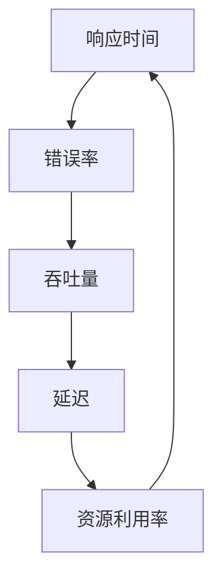

#### 3.2 服务质量（QoS）设计

服务质量（Quality of Service，简称QoS）设计是确保AI系统在多变的环境中提供稳定、高效的服务的关键。QoS设计的关键包括以下几个方面：

- **资源分配**：根据业务需求分配系统资源，包括CPU、内存、网络等。
- **网络优化**：优化网络架构，降低延迟和带宽消耗。
- **异常处理**：设计异常处理机制，确保系统在异常情况下能够快速恢复。

以下是一个关于QoS设计的Mermaid流程图：

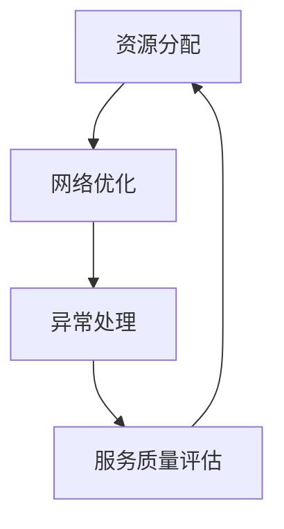

#### 3.3 AI系统性能优化

AI系统性能优化是提高系统性能、降低成本的重要手段。以下是一些常见的AI系统性能优化方法：

- **系统架构优化**：优化系统架构，提高系统可扩展性和稳定性。
- **算法优化**：优化AI算法，提高模型性能。
- **资源调度优化**：优化资源调度策略，提高资源利用率。

以下是一个关于AI系统性能优化的Mermaid流程图：

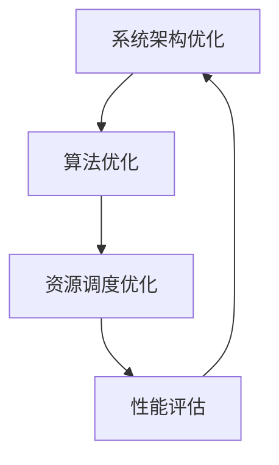

### 第4章：SLA设计流程与方法

#### 4.1 SLA设计步骤

设计一个有效的服务级别协议（SLA）是一个系统性的过程，涉及多个步骤。以下是SLA设计的主要步骤：

##### 1. 需求分析

需求分析是SLA设计的起点。在这一阶段，需要了解用户的需求、业务目标以及关键性能指标（KPI）。这包括与客户沟通，了解他们的期望和业务需求，以及识别关键的服务目标。

##### 2. 定义服务范围

在需求分析的基础上，明确服务范围。这包括服务的内容、边界以及服务的适用对象。服务范围应具体、明确，避免模糊不清。

##### 3. 确定服务级别指标（SLIs）

根据服务范围和需求，确定合适的SLIs。SLIs是衡量服务质量的量化标准，包括响应时间、错误率、系统可用性等。选择SLIs时，应考虑其可度量性、重要性和可操作性。

##### 4. 设定服务质量目标（SLOs）

基于SLIs，设定具体的服务质量目标（SLOs）。SLOs应具有挑战性，同时是可实现的。例如，一个SLO可能是响应时间不超过500毫秒，错误率不超过0.1%。

##### 5. 制定衡量与报告机制

设计一个有效的衡量与报告机制，确保服务提供方能够实时监控SLAs的执行情况。这通常包括使用监控工具、日志分析和定期报告。

##### 6. 确定违约处理条款

在SLA中明确违约处理条款。这些条款应规定在未能满足SLOs时，如何进行通知、赔偿或补救措施。

##### 7. 审核与修订

在设计完成后，SLA应经过内部审核和客户确认。在审核过程中，可能需要根据反馈进行修订。

##### 8. 签订与执行

最后，与客户签订SLA，并开始执行。执行过程中，应定期回顾SLA的执行情况，并根据需要进行调整。

#### 4.2 SLA设计方法

SLA设计方法可以分为以下几种：

##### 1. 用户故事地图

用户故事地图是一种将用户需求与业务目标相结合的方法。通过绘制用户故事地图，可以清晰地了解用户的需求和业务目标，从而设计出符合用户需求的SLA。

##### 2. SWOT分析

SWOT分析是一种评估服务提供方的优势、劣势、机会和威胁的方法。通过SWOT分析，可以识别出服务的优势和劣势，从而在SLA设计中加以利用或改进。

##### 3. 模板法

模板法是一种使用现成的SLA模板进行设计的方法。这种方法可以节省设计时间，但需要注意模板是否符合实际需求。

##### 4. 具体案例法

具体案例法是通过研究其他成功案例来设计SLA的方法。这种方法可以帮助了解最佳实践，但需要根据实际需求进行适当调整。

#### 4.3 SLA模板与案例

以下是一个简化的SLA模板：

```markdown
# 服务级别协议（SLA）

## 1. 服务范围

- **服务内容**：[具体描述服务内容]
- **服务边界**：[具体描述服务范围和限制]

## 2. 服务级别指标（SLIs）

- **响应时间**：[描述响应时间要求，如：不超过500毫秒]
- **错误率**：[描述错误率要求，如：不超过0.1%]
- **系统可用性**：[描述系统可用性要求，如：不低于99.9%]

## 3. 服务质量目标（SLOs）

- **响应时间目标**：[具体描述响应时间目标，如：平均响应时间不超过400毫秒，95%的请求响应时间不超过500毫秒]
- **错误率目标**：[具体描述错误率目标，如：系统错误率不超过0.05%]
- **可用性目标**：[具体描述可用性目标，如：系统 uptime 不低于99.95%]

## 4. 衡量与报告

- **监控工具**：[描述使用的监控工具，如：Prometheus、Grafana]
- **报告频率**：[描述报告频率，如：每周报告一次]

## 5. 违约处理

- **违约通知**：[描述违约通知流程]
- **赔偿条款**：[描述违约赔偿条款，如：根据违约程度进行赔偿]

## 6. 修订与续约

- **修订流程**：[描述修订SLA的流程]
- **续约流程**：[描述SLA续约流程]

```

以下是一个金融行业AI系统的SLA案例：

```markdown
# 金融行业AI系统SLA

## 1. 服务范围

- **服务内容**：包括AI风险预测、交易处理、账户管理等功能。
- **服务边界**：服务范围仅限于金融交易处理和账户管理。

## 2. 服务级别指标（SLIs）

- **响应时间**：系统对交易请求的平均响应时间不超过500毫秒。
- **错误率**：系统错误率不超过0.1%。
- **系统可用性**：系统 uptime 不低于99.9%。

## 3. 服务质量目标（SLOs）

- **响应时间目标**：平均响应时间不超过400毫秒，95%的请求响应时间不超过500毫秒。
- **错误率目标**：系统错误率不超过0.05%。
- **可用性目标**：系统 uptime 不低于99.95%。

## 4. 衡量与报告

- **监控工具**：使用Prometheus进行实时监控，使用Grafana进行数据可视化。
- **报告频率**：每周报告一次系统状态。

## 5. 违约处理

- **违约通知**：一旦发现违约情况，立即通知客户，并提供详细报告。
- **赔偿条款**：根据违约程度进行赔偿，包括但不限于补偿交易损失和费用减免。

## 6. 修订与续约

- **修订流程**：每年进行一次SLA修订，根据业务需求进行调整。
- **续约流程**：SLA到期后，双方协商确定续约事宜。

```

通过以上步骤和方法，可以设计出一个符合实际需求的SLA，确保AI系统的服务质量。

### 第5章：AI系统可用性与可靠性设计

#### 5.1 可用性与可靠性指标

AI系统的可用性与可靠性是确保系统稳定运行和满足用户需求的关键因素。为了衡量AI系统的可用性与可靠性，需要定义一系列指标。以下是常用的一些指标：

- **系统 uptime**：指系统正常运行的时间比例，通常以百分比表示。高 uptime 是系统可靠性的重要指标，通常目标值为99.9%或更高。
- **故障恢复时间**：指系统从故障状态恢复到正常状态所需的时间。故障恢复时间越短，系统的可靠性越高。通常，目标值应尽量短，例如几分钟或几小时。
- **错误率**：指系统发生错误的频率，通常以百分比表示。低错误率是系统可靠性的重要保障。
- **数据丢失率**：指系统在运行过程中数据丢失的频率。对于数据敏感的系统，数据丢失率应尽可能低。
- **故障排除时间**：指系统出现故障后，技术人员排除故障所需的时间。故障排除时间越短，系统的可用性越高。

以下是一个关于可用性与可靠性指标的Mermaid流程图：

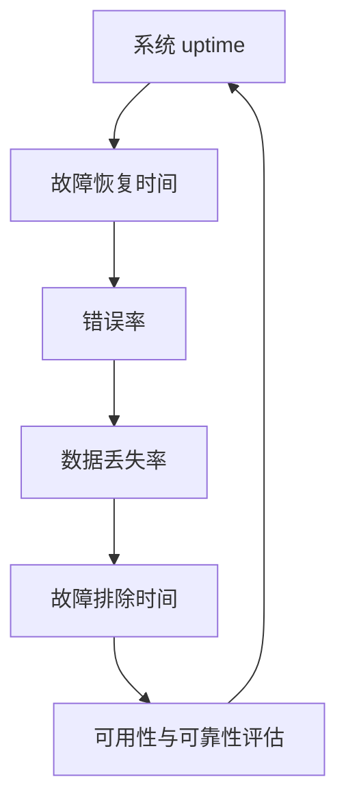

#### 5.2 可用性与可靠性设计策略

为了确保AI系统的可用性与可靠性，需要采取一系列设计策略。以下是常用的策略：

- **冗余设计**：通过在系统中引入冗余组件，如备用硬件、备用网络等，确保在主组件发生故障时，系统能够快速切换到备用组件，从而保证系统的连续运行。
- **故障监测与报警**：通过实时监测系统的运行状态，及时发现故障并进行报警，以便技术人员快速响应和排除故障。
- **故障恢复机制**：设计一套完善的故障恢复机制，包括故障检测、故障定位、故障恢复等步骤，确保系统在故障发生后能够快速恢复。
- **数据备份与恢复**：定期备份数据，并确保在数据丢失或损坏时，能够快速恢复数据，避免数据丢失对业务造成影响。
- **负载均衡**：通过负载均衡技术，合理分配系统资源，避免单个组件过载，从而提高系统的可靠性和稳定性。

以下是一个关于可用性与可靠性设计策略的Mermaid流程图：

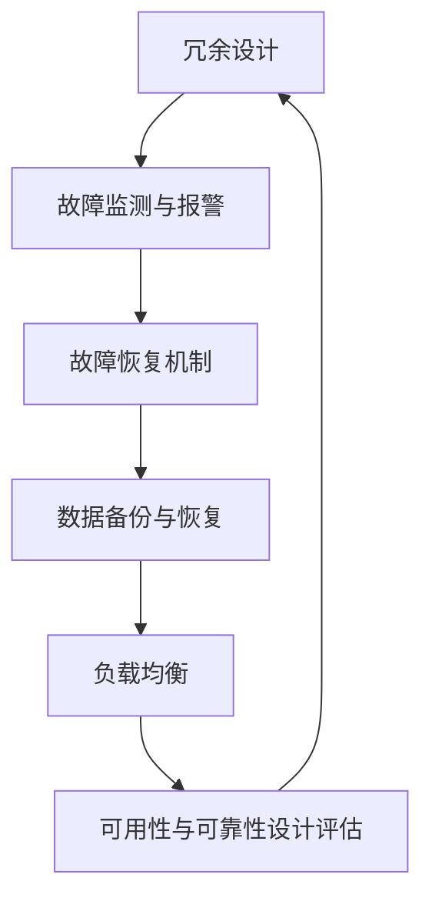

#### 5.3 可用性与可靠性测试

为了验证AI系统的可用性与可靠性，需要进行一系列测试。以下是常用的测试方法：

- **负载测试**：模拟系统在高负载情况下的性能，评估系统的稳定性和响应速度。通过负载测试，可以发现系统的性能瓶颈和资源不足的情况，从而进行优化。
- **故障注入测试**：通过模拟系统故障，评估系统的故障恢复能力和冗余设计的效果。故障注入测试可以帮助发现系统中的潜在故障点和改进方向。
- **压力测试**：模拟极端条件下的系统性能，评估系统的稳定性和可靠性。压力测试可以验证系统在极限负载下的表现，确保系统在极端情况下仍然能够正常运行。
- **数据恢复测试**：验证数据备份与恢复机制的有效性，确保在数据丢失或损坏时，能够快速恢复数据。

以下是一个关于可用性与可靠性测试的Mermaid流程图：

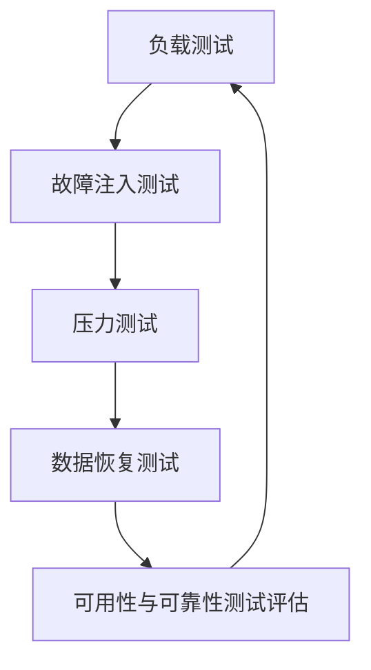

#### 5.4 可用性与可靠性实践案例

以下是一个关于AI系统可用性与可靠性实践案例：

**案例：某金融公司的AI系统可用性与可靠性实践**

1. **冗余设计**：
   - 系统采用了双机热备份架构，主服务器和备用服务器实时同步数据，确保在主服务器故障时，备用服务器能够立即接管。
   - 网络连接采用了多线接入，确保在不同网络故障时，系统仍然可以正常访问。

2. **故障监测与报警**：
   - 系统集成了监控工具，实时监控系统的运行状态，一旦发现故障，立即发送报警通知。
   - 报警系统支持多种通知方式，如邮件、短信、电话等，确保技术人员能够及时响应。

3. **故障恢复机制**：
   - 设计了一套完善的故障恢复流程，包括故障检测、故障定位、故障恢复等步骤。
   - 在故障恢复过程中，系统能够自动切换到备用组件，确保服务的连续性。

4. **数据备份与恢复**：
   - 数据备份采用了增量备份策略，每天进行一次全量备份，每小时进行一次增量备份。
   - 数据恢复机制支持快速恢复，确保在数据丢失或损坏时，能够迅速恢复。

5. **负载均衡**：
   - 系统采用了负载均衡技术，合理分配请求到不同的服务器，避免单点过载。
   - 负载均衡器能够根据服务器的负载情况，动态调整请求分发策略。

6. **测试与评估**：
   - 定期进行负载测试、故障注入测试和压力测试，验证系统的可用性与可靠性。
   - 根据测试结果，不断优化系统架构和故障恢复流程。

通过以上实践，该金融公司的AI系统实现了高可用性和可靠性，确保了服务的稳定性和连续性，受到了用户的高度评价。

### 第6章：AI系统服务连续性与灾难恢复

#### 6.1 服务连续性的概念与重要性

服务连续性（Service Continuity）是指系统在发生故障或灾难时，能够保持服务的持续性和稳定性。对于企业来说，服务连续性至关重要，因为中断服务可能导致业务损失、客户流失和声誉受损。在快速变化的商业环境中，保持服务的连续性是企业竞争力的重要组成部分。

以下是一个关于服务连续性的Mermaid流程图：

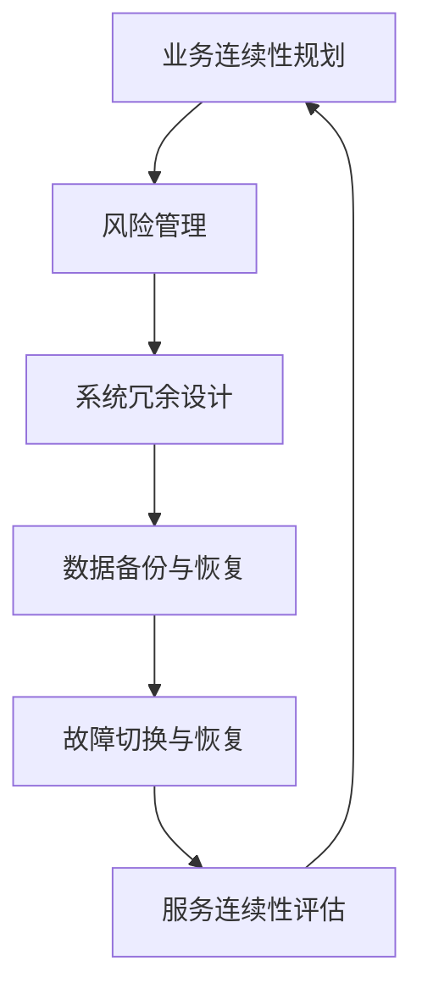

#### 6.2 灾难恢复策略与规划

灾难恢复（Disaster Recovery，简称DR）是指系统在灾难发生时，能够迅速恢复服务，确保业务连续性的过程。灾难恢复策略与规划是确保系统在灾难情况下能够快速恢复的关键。以下是一些常见的灾难恢复策略与规划：

- **业务连续性规划（Business Continuity Planning，简称BCP）**：BCP是一个全面的过程，包括风险评估、资源准备、计划制定和演练。BCP的目标是在灾难发生后，确保关键业务能够在规定时间内恢复。
- **灾难恢复计划（Disaster Recovery Plan，简称DRP）**：DRP是一个详细的文档，描述了在灾难发生时，如何迅速恢复关键系统和数据。DRP应包括人员职责、应急响应步骤、关键系统恢复流程等。
- **灾难恢复演练（Disaster Recovery Drill，简称DR Drill）**：定期进行灾难恢复演练，验证灾难恢复计划的可行性和有效性。演练可以帮助发现潜在问题，并确保相关人员在灾难发生时能够迅速响应。
- **备份与恢复策略**：制定备份与恢复策略，确保在灾难发生时，系统能够快速恢复。备份策略应包括数据备份的频率、备份存储方式和恢复流程。

以下是一个关于灾难恢复策略与规划的Mermaid流程图：

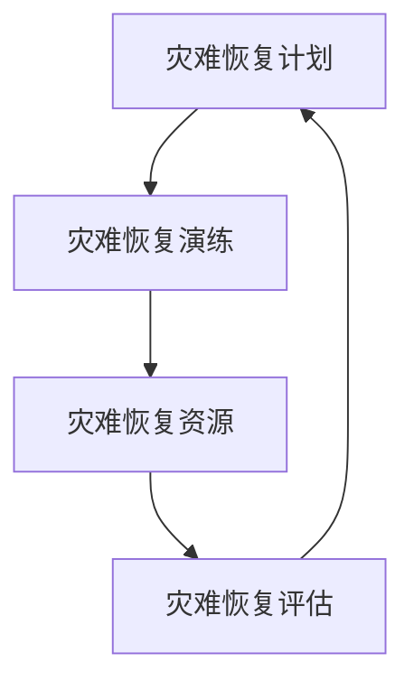

#### 6.3 AI系统的灾难恢复实践

以下是一个关于AI系统的灾难恢复实践案例：

**案例：某电商平台的AI系统灾难恢复实践**

1. **业务连续性规划（BCP）**：
   - 对电商平台进行了全面的风险评估，识别出可能的灾难类型，如服务器故障、网络故障、数据损坏等。
   - 根据风险评估结果，制定了业务连续性计划，明确了关键业务系统的恢复优先级和恢复时间目标（Recovery Time Objective，简称RTO）。

2. **灾难恢复计划（DRP）**：
   - 制定了一个详细的灾难恢复计划，包括应急响应步骤、关键系统恢复流程和人员职责分配。
   - 灾难恢复计划涵盖了服务器故障、数据损坏和网络故障等不同场景，确保在每种情况下都能快速恢复服务。

3. **灾难恢复演练（DR Drill）**：
   - 定期进行灾难恢复演练，验证灾难恢复计划的可行性和有效性。
   - 演练内容包括服务器故障切换、数据恢复和系统测试。

4. **备份与恢复策略**：
   - 实施了定期数据备份策略，每天进行全量备份，每小时进行增量备份。
   - 备份数据存储在远程数据中心，确保在本地数据中心发生灾难时，备份数据仍然可用。

5. **灾难发生后的恢复**：
   - 在一次服务器故障事件中，灾难恢复计划迅速启动。
   - 通过备用服务器和远程备份数据，电商平台在30分钟内恢复服务。

6. **灾难恢复效果评估**：
   - 对灾难恢复效果进行了评估，总结经验教训，持续优化灾难恢复策略和计划。

通过以上实践，该电商平台确保了AI系统在灾难发生时的连续性和稳定性，提高了企业的抗风险能力。

### 第7章：AI系统安全性与隐私保护

#### 7.1 安全性与隐私保护的重要性

AI系统的安全性与隐私保护对于保护用户数据、维护企业声誉和确保业务连续性至关重要。随着AI系统在各个领域的广泛应用，其安全性与隐私保护面临诸多挑战。

首先，AI系统收集和处理的数据量巨大，包括个人隐私、商业机密等敏感信息。如果这些数据泄露或被恶意利用，将对用户和企业造成严重损失。

其次，AI系统本身可能成为网络攻击的目标。攻击者可能会利用AI系统的漏洞进行网络攻击，导致系统瘫痪、数据泄露等严重后果。

此外，AI系统的安全性问题还可能影响企业的声誉。一旦AI系统发生安全事件，用户将失去对企业的信任，可能导致客户流失和业务下滑。

最后，隐私保护是AI系统的重要挑战之一。AI系统在处理个人数据时，必须遵循相关隐私保护法规，如《通用数据保护条例》（GDPR）和《加州消费者隐私法》（CCPA）等。违反隐私保护法规可能导致法律诉讼和罚款。

#### 7.2 AI系统的安全性与隐私保护策略

为了确保AI系统的安全性与隐私保护，可以采取以下策略：

1. **访问控制**：
   - 实施严格的访问控制机制，确保只有授权用户可以访问系统资源和数据。
   - 使用多因素认证（MFA），提高用户身份验证的安全性。

2. **数据加密**：
   - 对敏感数据进行加密存储，防止数据泄露。
   - 在数据传输过程中使用HTTPS等加密协议，确保数据在传输过程中的安全性。

3. **防火墙与入侵检测**：
   - 部署防火墙和入侵检测系统，防止外部攻击。
   - 实时监控网络流量，及时发现和阻止恶意攻击。

4. **安全审计**：
   - 定期进行安全审计，检查系统安全配置和漏洞。
   - 及时修复发现的安全漏洞，确保系统安全。

5. **安全培训与意识提升**：
   - 定期对员工进行安全培训，提高安全意识和应对能力。
   - 建立安全政策和文化，确保员工遵守安全规定。

6. **隐私保护**：
   - 遵守相关隐私保护法规，如GDPR和CCPA等。
   - 对用户隐私数据进行匿名化处理，确保用户隐私不受侵犯。

7. **安全性与隐私保护评估**：
   - 定期进行安全性与隐私保护评估，检查系统安全性与隐私保护策略的有效性。
   - 持续优化安全性与隐私保护策略，提高系统安全性与隐私保护水平。

#### 7.3 安全性与隐私保护实践案例

以下是一个关于AI系统安全性与隐私保护实践案例：

**案例：某金融公司的AI系统安全性与隐私保护实践**

1. **访问控制**：
   - 对系统资源进行严格的访问控制，确保只有授权用户可以访问。
   - 使用多因素认证（MFA），提高用户身份验证的安全性。

2. **数据加密**：
   - 对用户敏感数据进行加密存储，如用户名、密码、交易记录等。
   - 在数据传输过程中使用HTTPS等加密协议，确保数据在传输过程中的安全性。

3. **防火墙与入侵检测**：
   - 部署了防火墙和入侵检测系统，防止外部攻击。
   - 实时监控网络流量，及时发现和阻止恶意攻击。

4. **安全审计**：
   - 定期进行安全审计，检查系统安全配置和漏洞。
   - 及时修复发现的安全漏洞，确保系统安全。

5. **安全培训与意识提升**：
   - 定期对员工进行安全培训，提高安全意识和应对能力。
   - 建立安全政策和文化，确保员工遵守安全规定。

6. **隐私保护**：
   - 遵守相关隐私保护法规，如GDPR和CCPA等。
   - 对用户隐私数据进行匿名化处理，确保用户隐私不受侵犯。

7. **安全性与隐私保护评估**：
   - 定期进行安全性与隐私保护评估，检查系统安全性与隐私保护策略的有效性。
   - 持续优化安全性与隐私保护策略，提高系统安全性与隐私保护水平。

通过以上实践，该金融公司确保了AI系统的安全性与隐私保护，提高了企业的抗风险能力。

### 第8章：AI系统SLA实施与维护

#### 8.1 SLA实施过程

服务级别协议（SLA）的实施是一个系统性的过程，涉及多个阶段和步骤。以下是SLA实施的主要过程：

##### 1. 需求分析

需求分析是SLA实施的第一步，旨在了解用户的需求和业务目标。通过与客户沟通，明确服务范围、性能指标、质量目标和违约处理等关键要素。

##### 2. SLA设计

在需求分析的基础上，进行SLA设计。SLA设计应包括服务范围、SLIs、SLOs、衡量与报告机制和违约处理条款等。

##### 3. SLA审核

SLA设计完成后，应进行内部审核和客户确认。审核过程应确保SLA的合理性和可行性，并根据反馈进行修订。

##### 4. SLA签订

经过审核确认后，与客户签订SLA。签订过程应明确双方的权利和义务，确保SLA的执行。

##### 5. SLA执行

在SLA签订后，开始执行SLA。执行过程中，服务提供方应按照SLA的要求提供服务，并确保满足SLOs。

##### 6. SLA监控与报告

执行过程中，应实时监控SLA的执行情况，定期向客户报告服务状态。监控工具如Prometheus、Grafana等可以帮助监控SLA执行情况。

##### 7. SLA维护与改进

根据SLA的执行情况和客户反馈，进行SLA的维护与改进。维护与改进过程应包括SLA的调整、优化和更新。

#### 8.2 SLA管理与监控

SLA管理与监控是确保SLA有效执行的关键。以下是SLA管理与监控的主要内容：

- **监控工具选择**：选择合适的监控工具，如Prometheus、Grafana等，实时监控SLA执行情况。
- **监控指标设定**：根据SLA的SLIs和SLOs，设定相应的监控指标，确保能够准确衡量服务的性能和质量。
- **报告机制设计**：设计有效的报告机制，定期向客户报告服务状态，确保客户了解系统的运行情况。
- **监控结果分析**：定期分析监控结果，找出潜在问题，并提出改进措施。

#### 8.3 SLA的持续改进

持续改进是提高服务质量、降低成本、提升客户满意度的重要手段。以下是SLA持续改进的步骤：

- **收集用户反馈**：定期收集用户反馈，了解用户需求和满意度。
- **分析服务数据**：分析服务数据，找出服务质量和性能的问题。
- **优化SLA设计**：根据分析结果，优化SLA设计和服务质量指标。
- **培训与沟通**：加强内部培训与沟通，确保团队成员了解SLA的重要性和改进措施。
- **持续监控与评估**：持续监控SLA执行情况，评估改进措施的效果。

### 第9章：案例研究：金融行业的AI SLA设计

#### 9.1 金融行业AI应用的现状

金融行业是AI技术的重要应用领域。随着AI技术的快速发展，金融行业在风险控制、智能投顾、信用评分、反欺诈等方面广泛应用AI技术。以下是一个关于金融行业AI应用现状的Mermaid流程图：

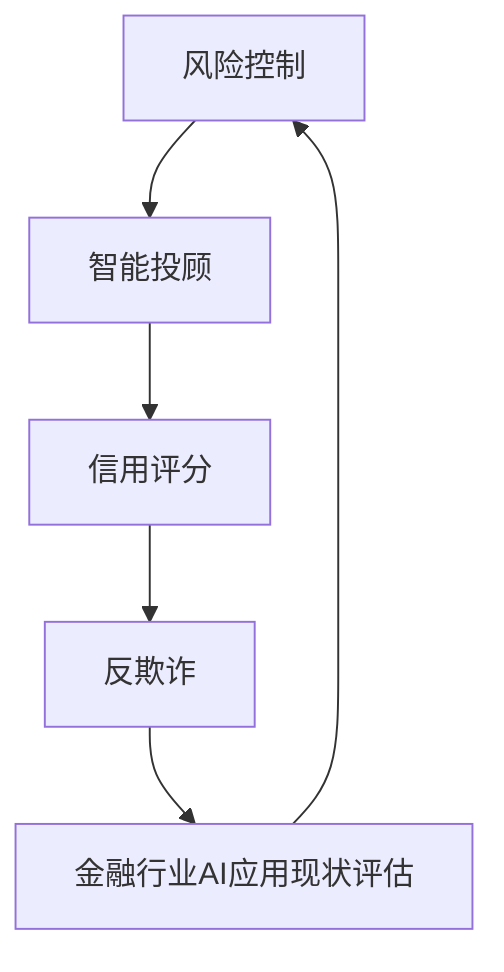

#### 9.2 金融行业AI SLA设计案例分析

金融行业的AI SLA设计需要考虑到高安全性、高可靠性和高可用性等因素。以下是一个金融行业AI SLA设计案例：

- **服务范围**：AI风险控制系统包括实时风险监控、风险预测和报告生成。
- **服务级别指标（SLIs）**：
  - **响应时间**：系统对风险事件的响应时间不超过500毫秒。
  - **错误率**：系统错误率不超过0.1%。
  - **系统可用性**：系统 uptime 不低于99.9%。
- **服务质量目标（SLOs）**：
  - **响应时间目标**：平均响应时间不超过400毫秒，95%的请求响应时间不超过500毫秒。
  - **错误率目标**：系统错误率不超过0.05%。
  - **可用性目标**：系统 uptime 不低于99.95%。

以下是一个关于金融行业AI SLA设计案例的Mermaid流程图：

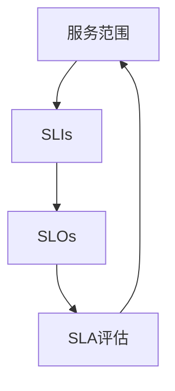

#### 9.3 金融行业AI SLA实施经验总结

在金融行业的AI SLA实施过程中，以下是一些关键经验：

- **合规性要求**：金融行业的AI SLA设计需要遵循相关法规和合规要求，如《数据安全法》、《个人信息保护法》等。
- **安全性设计**：金融行业的AI SLA需要充分考虑安全性设计，确保用户数据和交易数据的安全。
- **实时监控与报告**：金融行业的AI SLA需要实时监控服务质量和性能，并及时向用户报告服务状态。
- **持续改进**：金融行业的AI SLA需要根据业务需求和法规变化进行持续改进，以适应不断变化的市场环境。

### 第10章：案例研究：医疗健康行业的AI SLA设计

#### 10.1 医疗健康行业AI应用的现状

医疗健康行业是AI技术的另一个重要应用领域。随着医疗健康数据的不断积累和深度学习技术的不断发展，AI技术在医疗健康行业的应用越来越广泛，包括疾病预测、医疗图像分析、药物研发等。以下是一个关于医疗健康行业AI应用现状的Mermaid流程图：

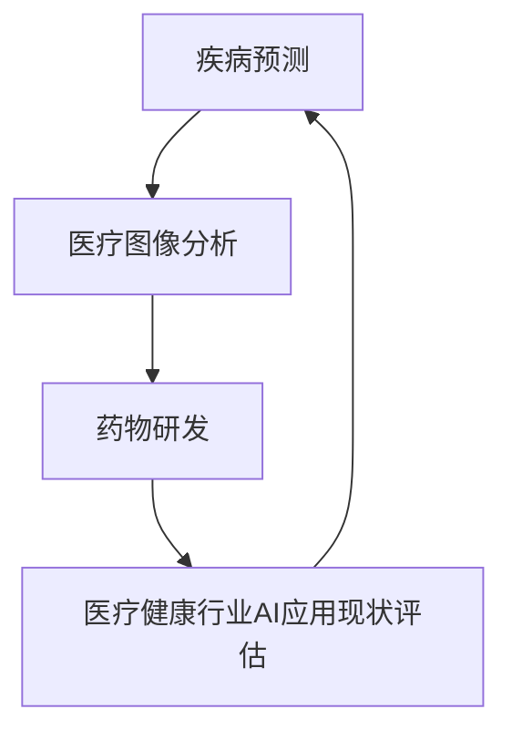

#### 10.2 医疗健康行业AI SLA设计案例分析

医疗健康行业的AI SLA设计需要考虑到高准确性、高可靠性和高安全性等因素。以下是一个医疗健康行业AI SLA设计案例：

- **服务范围**：AI疾病预测系统包括疾病风险评估、疾病预测和报告生成。
- **服务级别指标（SLIs）**：
  - **预测准确性**：疾病预测准确率不低于95%。
  - **系统错误率**：系统错误率不超过0.1%。
  - **系统可用性**：系统 uptime 不低于99.9%。
- **服务质量目标（SLOs）**：
  - **预测准确性目标**：平均预测准确率不低于97%，95%的预测准确率不低于95%。
  - **错误率目标**：系统错误率不超过0.05%。
  - **可用性目标**：系统 uptime 不低于99.95%。

以下是一个关于医疗健康行业AI SLA设计案例的Mermaid流程图：


#### 10.3 医疗健康行业AI SLA实施经验总结

在医疗健康行业的AI SLA实施过程中，以下是一些关键经验：

- **数据质量控制**：医疗健康行业的AI SLA需要充分考虑数据质量控制，确保预测结果的准确性。
- **安全性设计**：医疗健康行业的AI SLA需要充分考虑安全性设计，确保患者数据和医疗信息的安全。
- **实时监控与报告**：医疗健康行业的AI SLA需要实时监控服务质量和性能，并及时向用户报告服务状态。
- **跨学科合作**：医疗健康行业的AI SLA需要跨学科合作，包括医学专家、数据科学家、IT专业人员等，确保AI系统在医疗健康领域的有效应用。

### 第11章：案例研究：零售行业的AI SLA设计

#### 11.1 零售行业AI应用的现状

零售行业是AI技术的另一个重要应用领域。随着消费者购物习惯的变化和零售市场竞争的加剧，AI技术在零售行业的应用越来越广泛，包括个性化推荐、智能客服、库存管理、供应链优化等。以下是一个关于零售行业AI应用现状的Mermaid流程图：

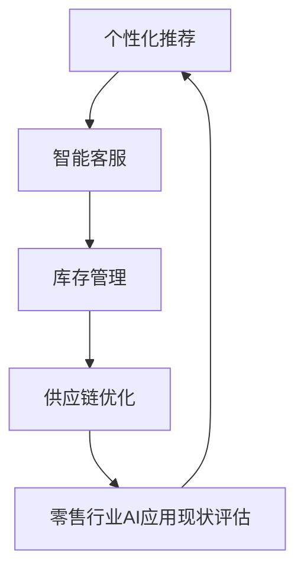

#### 11.2 零售行业AI SLA设计案例分析

零售行业的AI SLA设计需要考虑到高灵活性、高响应性和高可扩展性等因素。以下是一个零售行业AI SLA设计案例：

- **服务范围**：AI个性化推荐系统包括用户行为分析、商品推荐和推荐结果反馈。
- **服务级别指标（SLIs）**：
  - **推荐响应时间**：系统对用户请求的平均响应时间不超过200毫秒。
  - **推荐准确性**：推荐准确性不低于90%。
  - **系统可用性**：系统 uptime 不低于99.9%。
- **服务质量目标（SLOs）**：
  - **推荐响应时间目标**：平均响应时间不超过150毫秒，95%的请求响应时间不超过200毫秒。
  - **推荐准确性目标**：平均推荐准确性不低于92%，95%的推荐准确性不低于90%。
  - **可用性目标**：系统 uptime 不低于99.95%。

以下是一个关于零售行业AI SLA设计案例的Mermaid流程图：


#### 11.3 零售行业AI SLA实施经验总结

在零售行业的AI SLA实施过程中，以下是一些关键经验：

- **数据实时性**：零售行业的AI SLA需要考虑数据实时性，确保系统能够实时响应用户请求。
- **个性化需求**：零售行业的AI SLA需要根据用户个性化需求进行定制化设计，提高推荐准确性。
- **系统可扩展性**：零售行业的AI SLA需要设计可扩展的系统架构，以应对业务规模的快速增长。
- **用户满意度**：零售行业的AI SLA需要关注用户满意度，通过持续优化和提高服务质量，提升用户体验。

### 附录 A：AI系统SLA设计工具与资源

#### A.1 主流SLA管理工具

以下是一些主流的SLA管理工具：

- **ServiceNow**：一款全面的IT服务管理（ITSM）平台，提供SLA管理功能。
- **Microsoft Operations Management Suite**：一款集成化的云管理平台，包括SLA管理功能。
- **IBM Service Management**：一款专业的IT服务管理工具，提供SLA管理功能。

#### A.2 AI系统开发与监控工具

以下是一些常用的AI系统开发与监控工具：

- **TensorFlow**：一款开源的机器学习库，适用于AI系统开发。
- **PyTorch**：一款开源的深度学习库，适用于AI系统开发。
- **Prometheus**：一款开源的监控解决方案，适用于AI系统监控。
- **Grafana**：一款开源的数据可视化工具，适用于AI系统监控。

#### A.3 SLA设计相关文献与资源

以下是一些SLA设计相关的文献和资源：

- **《服务级别协议（SLA）设计与实施指南》**：一本关于SLA设计的权威指南。
- **《人工智能系统服务级别协议（SLA）设计》**：一本关于AI系统SLA设计的专业书籍。
- **《服务设计思维：从需求到解决方案的全流程实践》**：一本关于服务设计方法的实用书籍。

### 作者信息

**作者：AI天才研究院/AI Genius Institute & 禅与计算机程序设计艺术 /Zen And The Art of Computer Programming**

