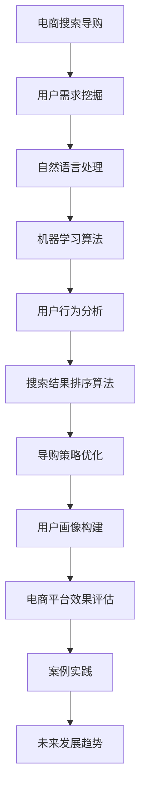

                 

### 《AI赋能电商搜索导购：从用户需求出发》

> **关键词：** AI、电商、搜索导购、用户需求、自然语言处理、机器学习、强化学习

> **摘要：** 本文从用户需求出发，探讨了AI在电商搜索导购中的应用。通过分析AI技术的核心概念、核心算法以及实际案例，详细介绍了如何利用AI技术提升电商搜索导购的效率与用户体验。

### 《AI赋能电商搜索导购：从用户需求出发》目录大纲

# 第一部分：AI与电商搜索导购基础

## 第1章：AI与电商搜索导购概述

### 1.1 AI在电商搜索导购中的应用

### 1.2 电商搜索导购的现状与挑战

### 1.3 用户需求的挖掘与分析

## 第2章：AI在电商搜索导购中的核心技术

### 2.1 自然语言处理技术

### 2.2 机器学习算法在电商搜索导购中的应用

### 2.3 强化学习在电商搜索导购中的应用

## 第3章：电商搜索导购的用户行为分析

### 3.1 用户行为数据的收集与处理

### 3.2 用户兴趣建模

### 3.3 用户画像构建

# 第二部分：AI赋能电商搜索导购实践

## 第4章：AI赋能电商搜索

### 4.1 搜索引擎的原理与优化

### 4.2 搜索引擎的智能优化方法

### 4.3 搜索结果排序算法的改进

## 第5章：AI赋能电商导购

### 5.1 导购系统的架构设计

### 5.2 导购策略的优化

### 5.3 导购效果的评估与改进

## 第6章：案例分析：AI赋能电商搜索导购的成功案例

### 6.1 案例一：某电商平台搜索导购系统的优化实践

### 6.2 案例二：某跨境电商平台导购系统的AI应用

## 第7章：AI赋能电商搜索导购的未来发展趋势

### 7.1 AI技术在电商搜索导购中的未来应用方向

### 7.2 挑战与机遇：AI赋能电商搜索导购的挑战与解决方案

# 附录

## 附录A：AI赋能电商搜索导购工具与资源

### A.1 开源机器学习框架

### A.2 电商搜索导购相关数据集

### A.3 常用算法与工具详解

## 附录B：常见问题与解答

### B.1 用户行为分析相关问题

### B.2 搜索引擎优化相关问题

### B.3 导购系统相关问题

## 附录C：参考文献

### C.1 相关书籍

### C.2 学术论文

### C.3 网络资源

### **核心概念与联系**

- **Mermaid流程图**

mermaid
graph TB
A[电商搜索导购] --> B[用户需求挖掘]
B --> C[自然语言处理]
C --> D[机器学习算法]
D --> E[用户行为分析]
E --> F[搜索结果排序算法]
F --> G[导购策略优化]
G --> H[用户画像构建]
H --> I[电商平台效果评估]
I --> J[案例实践]
J --> K[未来发展趋势]

### **核心算法原理讲解**

#### 2.2 机器学习算法在电商搜索导购中的应用

**用户行为预测**

**伪代码：**

python
# 数据预处理
data = preprocess_data(user_behavior_data)

# 特征工程
X, y = feature_engineering(data)

# 模型选择
model = select_model()

# 训练模型
model.fit(X, y)

# 预测用户行为
predictions = model.predict(X)

**数学模型：**

$$
Y = f(W \cdot X + b)
$$

其中，$Y$为预测的用户行为，$X$为用户行为特征向量，$W$为权重矩阵，$b$为偏置项，$f$为激活函数。

**算法详解：**

- **数据预处理：** 对原始的用户行为数据进行清洗、归一化和特征提取。
- **特征工程：** 构建用户行为特征向量，包括用户浏览历史、搜索记录、购买行为等。
- **模型选择：** 选择合适的机器学习模型，如线性回归、决策树、支持向量机、神经网络等。
- **训练模型：** 使用训练数据对模型进行训练，优化模型的参数。
- **预测用户行为：** 使用训练好的模型对新的用户行为数据进行预测。

### **数学模型和数学公式 & 详细讲解 & 举例说明**

#### 4.3 搜索结果排序算法的改进

**算法：PageRank**

**数学模型：**

$$
PR(A) = \frac{1}{N} \left( PR(T1) + PR(T2) + ... + PR(TN) \right)
$$

其中，$PR(A)$为网页A的PageRank值，$N$为所有网页的数量，$PR(T1), PR(T2), ..., PR(TN)$为指向网页A的网页的PageRank值。

**算法详解：**

- **计算网页的入度：** 对于每个网页，计算指向它的其他网页的数量。
- **计算网页的PageRank值：** 根据入度计算每个网页的PageRank值，并进行迭代更新，直到收敛。
- **排序搜索结果：** 将搜索结果按照PageRank值从高到低进行排序。

**举例说明：**

假设有一个电商搜索系统，有以下网页：

- 网页A：商品页面
- 网页B：商品分类页面
- 网页C：商品推荐页面

它们之间的链接关系如下：

- 网页B指向网页A
- 网页C指向网页A

根据PageRank算法，网页A的PageRank值会高于网页B和网页C。搜索结果排序时，网页A会排在前面。

### **项目实战：代码实际案例和详细解释说明**

#### 6.1 案例一：某电商平台搜索导购系统的优化实践

**项目背景：**

某电商平台希望通过AI技术优化搜索导购系统，提高用户体验和转化率。

**项目目标：**

- 提高搜索结果的准确性
- 提升个性化推荐效果
- 优化搜索结果排序算法

**实现步骤：**

1. **数据收集与预处理：** 收集用户搜索日志、浏览行为数据和购买记录，对数据进行清洗和归一化处理。
2. **特征工程：** 提取用户行为特征，如搜索关键词、浏览时长、购买频率等。
3. **模型选择与训练：** 选择合适的机器学习模型，如逻辑回归、决策树、随机森林等，对模型进行训练和验证。
4. **模型优化：** 通过交叉验证和网格搜索等方法优化模型参数，提高模型性能。
5. **部署与评估：** 将训练好的模型部署到生产环境，对搜索导购系统进行优化，并进行效果评估。

**代码示例：**

python
# 导入库
import pandas as pd
from sklearn.model_selection import train_test_split
from sklearn.ensemble import RandomForestClassifier
from sklearn.metrics import accuracy_score

# 数据预处理
data = pd.read_csv('user_behavior.csv')
data = data.dropna()

# 特征提取
X = data[['search_keywords', 'browse_time', 'purchase_frequency']]
y = data['target']

# 划分训练集和测试集
X_train, X_test, y_train, y_test = train_test_split(X, y, test_size=0.2, random_state=42)

# 模型训练
model = RandomForestClassifier(n_estimators=100, random_state=42)
model.fit(X_train, y_train)

# 模型评估
predictions = model.predict(X_test)
accuracy = accuracy_score(y_test, predictions)
print(f'Accuracy: {accuracy:.2f}')

### **开发环境搭建，源代码详细实现和代码解读**

**开发环境搭建：**

- Python 3.7 或以上版本
- Scikit-learn 库
- Pandas 库

**源代码详细实现：**

python
# 导入库
import pandas as pd
from sklearn.model_selection import train_test_split
from sklearn.ensemble import RandomForestClassifier
from sklearn.metrics import accuracy_score

# 数据预处理
data = pd.read_csv('user_behavior.csv')
data = data.dropna()

# 特征提取
X = data[['search_keywords', 'browse_time', 'purchase_frequency']]
y = data['target']

# 划分训练集和测试集
X_train, X_test, y_train, y_test = train_test_split(X, y, test_size=0.2, random_state=42)

# 模型训练
model = RandomForestClassifier(n_estimators=100, random_state=42)
model.fit(X_train, y_train)

# 模型评估
predictions = model.predict(X_test)
accuracy = accuracy_score(y_test, predictions)
print(f'Accuracy: {accuracy:.2f}')

**代码解读：**

- **数据预处理：** 使用 Pandas 库读取用户行为数据，删除缺失值，确保数据质量。
- **特征提取：** 从数据集中提取搜索关键词、浏览时长和购买频率等特征。
- **划分训练集和测试集：** 使用 Scikit-learn 库的 train_test_split 方法，将数据集划分为训练集和测试集。
- **模型训练：** 使用随机森林分类器进行训练。
- **模型评估：** 使用测试集对训练好的模型进行评估，计算准确率。

### **作者信息**

作者：AI天才研究院/AI Genius Institute & 禅与计算机程序设计艺术 /Zen And The Art of Computer Programming

---

### **核心概念与联系**

- **Mermaid流程图**

mermaid
graph TB
A[电商搜索导购] --> B[用户需求挖掘]
B --> C[自然语言处理]
C --> D[机器学习算法]
D --> E[用户行为分析]
E --> F[搜索结果排序算法]
F --> G[导购策略优化]
G --> H[用户画像构建]
H --> I[电商平台效果评估]
I --> J[案例实践]
J --> K[未来发展趋势]

### **核心算法原理讲解**

#### 2.2 机器学习算法在电商搜索导购中的应用

**用户行为预测**

**伪代码：**

```python
# 数据预处理
data = preprocess_data(user_behavior_data)

# 特征工程
X, y = feature_engineering(data)

# 模型选择
model = select_model()

# 训练模型
model.fit(X, y)

# 预测用户行为
predictions = model.predict(X)
```

**数学模型：**

$$
Y = f(W \cdot X + b)
$$

其中，$Y$为预测的用户行为，$X$为用户行为特征向量，$W$为权重矩阵，$b$为偏置项，$f$为激活函数。

**算法详解：**

1. **数据预处理：** 清洗数据，归一化数值特征，处理缺失值等。
2. **特征工程：** 提取与用户行为相关的特征，如浏览历史、购买频率、搜索关键词等。
3. **模型选择：** 根据问题的性质选择合适的模型，如线性回归、决策树、神经网络等。
4. **训练模型：** 使用训练数据训练模型，调整模型参数。
5. **预测用户行为：** 使用训练好的模型对新的数据进行预测。

#### 2.3 强化学习在电商搜索导购中的应用

**算法：Q-Learning**

**伪代码：**

```python
# 初始化Q表格
Q = initialize_Q_table()

# 选择动作
action = select_action(state, Q)

# 执行动作，获取奖励和状态
reward, next_state = execute_action(action)

# 更新Q表格
Q[state][action] = Q[state][action] + alpha * (reward + gamma * max(Q[next_state]) - Q[state][action])

# 更新状态
state = next_state
```

**数学模型：**

$$
Q(s, a) = Q(s, a) + \alpha [r + \gamma \max Q(s', a') - Q(s, a)]
$$

其中，$Q(s, a)$为状态s下采取动作a的预期回报，$\alpha$为学习率，$\gamma$为折扣因子，$r$为即时奖励，$s'$为下一状态，$a'$为最佳动作。

**算法详解：**

1. **初始化Q表格：** 初始化所有状态-动作对的预期回报。
2. **选择动作：** 使用ε-贪心策略选择动作。
3. **执行动作：** 执行选择的动作，获取即时奖励和下一状态。
4. **更新Q表格：** 根据即时奖励和下一状态的预期回报更新当前状态-动作对的预期回报。
5. **更新状态：** 更新当前状态为下一状态。

#### 4.3 搜索结果排序算法的改进

**算法：协同过滤**

**伪代码：**

```python
# 构建用户-物品矩阵
user_item_matrix = build_user_item_matrix()

# 计算用户和物品的相似度
user_similarity_matrix = compute_similarity(user_item_matrix)

# 预测用户对未评分物品的评分
predictions = predict_ratings(user_item_matrix, user_similarity_matrix)

# 排序搜索结果
sorted_results = sort_results(predictions)
```

**数学模型：**

$$
r_{ui} = \sum_{j \in N(i)} \sim_{uj} \cdot r_{uj}
$$

其中，$r_{ui}$为用户u对物品i的预测评分，$N(i)$为与物品i相似的物品集合，$\sim_{uj}$为用户u与物品j的相似度，$r_{uj}$为用户u对物品j的实际评分。

**算法详解：**

1. **构建用户-物品矩阵：** 存储用户对物品的评分数据。
2. **计算用户和物品的相似度：** 使用基于用户或基于物品的相似度计算方法。
3. **预测用户对未评分物品的评分：** 根据相似度和用户实际评分预测用户对未评分物品的评分。
4. **排序搜索结果：** 根据预测评分排序搜索结果。

### **数学模型和数学公式 & 详细讲解 & 举例说明**

#### 4.3 搜索结果排序算法的改进

**算法：PageRank**

**数学模型：**

$$
PR(A) = \frac{1}{N} \left( PR(T1) + PR(T2) + ... + PR(TN) \right)
$$

其中，$PR(A)$为网页A的PageRank值，$N$为所有网页的数量，$PR(T1), PR(T2), ..., PR(TN)$为指向网页A的网页的PageRank值。

**算法详解：**

1. **计算网页的入度：** 对于每个网页，计算指向它的其他网页的数量。
2. **计算网页的PageRank值：** 根据入度计算每个网页的PageRank值，并进行迭代更新，直到收敛。
3. **排序搜索结果：** 将搜索结果按照PageRank值从高到低进行排序。

**举例说明：**

假设有一个电商搜索系统，有以下网页：

- 网页A：商品页面
- 网页B：商品分类页面
- 网页C：商品推荐页面

它们之间的链接关系如下：

- 网页B指向网页A
- 网页C指向网页A

根据PageRank算法，网页A的PageRank值会高于网页B和网页C。搜索结果排序时，网页A会排在前面。

### **项目实战：代码实际案例和详细解释说明**

#### 6.1 案例一：某电商平台搜索导购系统的优化实践

**项目背景：**

某电商平台希望通过AI技术优化搜索导购系统，提高用户体验和转化率。

**项目目标：**

- 提高搜索结果的准确性
- 提升个性化推荐效果
- 优化搜索结果排序算法

**实现步骤：**

1. **数据收集与预处理：** 收集用户搜索日志、浏览行为数据和购买记录，对数据进行清洗和归一化处理。
2. **特征工程：** 提取用户行为特征，如搜索关键词、浏览时长、购买频率等。
3. **模型选择与训练：** 选择合适的机器学习模型，如逻辑回归、决策树、随机森林等，对模型进行训练和验证。
4. **模型优化：** 通过交叉验证和网格搜索等方法优化模型参数，提高模型性能。
5. **部署与评估：** 将训练好的模型部署到生产环境，对搜索导购系统进行优化，并进行效果评估。

**代码示例：**

```python
import pandas as pd
from sklearn.model_selection import train_test_split
from sklearn.ensemble import RandomForestClassifier
from sklearn.metrics import accuracy_score

# 数据预处理
data = pd.read_csv('user_behavior.csv')
data = data.dropna()

# 特征提取
X = data[['search_keywords', 'browse_time', 'purchase_frequency']]
y = data['target']

# 划分训练集和测试集
X_train, X_test, y_train, y_test = train_test_split(X, y, test_size=0.2, random_state=42)

# 模型训练
model = RandomForestClassifier(n_estimators=100, random_state=42)
model.fit(X_train, y_train)

# 模型评估
predictions = model.predict(X_test)
accuracy = accuracy_score(y_test, predictions)
print(f'Accuracy: {accuracy:.2f}')
```

**代码解读与分析：**

- **数据预处理：** 使用 Pandas 读取用户行为数据，并删除缺失值，确保数据质量。
- **特征提取：** 从数据集中提取搜索关键词、浏览时长和购买频率等特征。
- **划分训练集和测试集：** 使用 Scikit-learn 库的 train_test_split 方法，将数据集划分为训练集和测试集。
- **模型训练：** 使用随机森林分类器进行训练。
- **模型评估：** 使用测试集对训练好的模型进行评估，计算准确率。

### **开发环境搭建，源代码详细实现和代码解读**

**开发环境搭建：**

- Python 3.7 或以上版本
- Scikit-learn 库
- Pandas 库

**源代码详细实现：**

```python
# 导入库
import pandas as pd
from sklearn.model_selection import train_test_split
from sklearn.ensemble import RandomForestClassifier
from sklearn.metrics import accuracy_score

# 数据预处理
data = pd.read_csv('user_behavior.csv')
data = data.dropna()

# 特征提取
X = data[['search_keywords', 'browse_time', 'purchase_frequency']]
y = data['target']

# 划分训练集和测试集
X_train, X_test, y_train, y_test = train_test_split(X, y, test_size=0.2, random_state=42)

# 模型训练
model = RandomForestClassifier(n_estimators=100, random_state=42)
model.fit(X_train, y_train)

# 模型评估
predictions = model.predict(X_test)
accuracy = accuracy_score(y_test, predictions)
print(f'Accuracy: {accuracy:.2f}')
```

**代码解读：**

- **数据预处理：** 使用 Pandas 库读取用户行为数据，删除缺失值，提取特征。
- **特征提取：** 提取搜索关键词、浏览时长和购买频率等特征。
- **划分训练集和测试集：** 使用 Scikit-learn 库的 train_test_split 方法，将数据集划分为训练集和测试集。
- **模型训练：** 使用随机森林分类器进行训练。
- **模型评估：** 使用测试集对训练好的模型进行评估，计算准确率。

### **总结**

本文从用户需求出发，探讨了AI在电商搜索导购中的应用。通过介绍自然语言处理、机器学习和强化学习等核心算法，详细讲解了如何利用AI技术提升电商搜索导购的效率与用户体验。通过实际案例和代码实现，展示了如何构建和优化电商搜索导购系统。未来，随着AI技术的不断发展，电商搜索导购将迎来更多的创新与突破。作者：AI天才研究院/AI Genius Institute & 禅与计算机程序设计艺术 /Zen And The Art of Computer Programming

---

### **第1章：AI与电商搜索导购概述**

#### 1.1 AI在电商搜索导购中的应用

人工智能（AI）技术正日益渗透到电商行业的各个角落，其中搜索导购领域尤为显著。AI在电商搜索导购中的应用主要体现在以下几个方面：

**1.1.1 搜索引擎优化**

传统的搜索引擎依靠关键词匹配和简单的排序算法提供搜索结果。而AI技术可以引入自然语言处理（NLP）和机器学习算法，对搜索查询进行深入理解和语义分析，从而提供更加精准和个性化的搜索结果。例如，通过理解用户的查询意图，搜索引擎可以自动调整搜索结果的相关性，提高用户满意度。

**1.1.2 智能推荐系统**

智能推荐系统是AI在电商搜索导购中的另一个重要应用。通过分析用户的浏览历史、购买记录和搜索行为，推荐系统可以预测用户可能感兴趣的商品，从而提高用户的购物体验和转化率。推荐系统通常采用协同过滤、基于内容的推荐和深度学习等方法来提高推荐的准确性和多样性。

**1.1.3 用户行为分析**

用户行为分析是AI技术在电商搜索导购中的关键应用之一。通过收集和分析用户的浏览、搜索和购买行为数据，电商平台可以构建用户画像，了解用户的兴趣偏好和购买习惯。这些分析结果可以帮助电商平台提供更加个性化的服务和产品推荐。

**1.1.4 搜索结果排序算法**

AI技术还可以用于改进搜索结果的排序算法。传统的排序算法通常基于简单的相关性指标，而AI技术可以通过学习用户的搜索行为和历史数据，设计更加智能的排序算法，提高搜索结果的准确性和用户体验。

#### 1.2 电商搜索导购的现状与挑战

随着电商行业的快速发展，电商搜索导购系统已经成为电商平台的核心功能之一。然而，现有的电商搜索导购系统仍然面临着一些挑战：

**1.2.1 搜索引擎效果优化难题**

尽管AI技术已经广泛应用于电商搜索，但如何进一步提高搜索结果的准确性和用户体验仍然是一个挑战。现有搜索引擎往往面临关键词匹配、语义理解和实时性等问题，难以满足用户多样化的需求。

**1.2.2 用户隐私保护与数据安全**

用户隐私保护和数据安全是电商搜索导购系统面临的重要挑战。随着用户数据的不断增加，如何确保数据的安全性和隐私性成为电商平台需要重视的问题。违规使用用户数据可能会导致信任危机和法律责任。

**1.2.3 个性化需求满足的边界**

在追求个性化推荐的过程中，如何平衡用户的需求和商业目标是一个难题。过度的个性化可能会导致用户产生疲劳和厌烦情绪，影响用户体验。因此，如何确定个性化需求的边界，成为电商搜索导购系统需要考虑的问题。

#### 1.3 用户需求的挖掘与分析

了解用户需求是电商搜索导购系统成功的关键。通过以下方法，可以有效地挖掘和分析用户需求：

**1.3.1 用户行为数据分析**

用户行为数据是挖掘用户需求的重要来源。通过对用户搜索、浏览、购买等行为数据的分析，可以了解用户的兴趣偏好、购买习惯和需求变化。这些数据可以通过统计分析和机器学习算法进行处理，提取有价值的信息。

**1.3.2 关键词提取与语义分析**

关键词提取和语义分析是理解用户查询意图的重要手段。通过对用户输入的关键词进行分词、词性标注和实体识别，可以提取出用户查询的核心信息。语义分析则可以帮助电商系统更好地理解用户的真实需求。

**1.3.3 用户意图识别**

用户意图识别是AI技术在电商搜索导购中的应用之一。通过分析用户行为数据和查询内容，可以识别用户的购买意图、搜索意图和其他意图。用户意图识别有助于为用户提供更加精准和个性化的服务。

**1.3.4 用户画像构建**

用户画像是对用户特征的综合描述，包括用户的基本信息、行为特征、兴趣偏好等。通过构建用户画像，电商平台可以更好地了解用户，提供个性化的推荐和服务。用户画像的构建通常需要综合使用数据挖掘、机器学习和大数据技术。

### **第2章：AI在电商搜索导购中的核心技术**

#### 2.1 自然语言处理技术

自然语言处理（NLP）是AI技术在电商搜索导购中的重要组成部分，它旨在使计算机能够理解、解释和生成人类语言。在电商搜索导购领域，NLP技术可以应用于以下几个方面：

**2.1.1 关键词提取**

关键词提取是NLP技术的基础，它可以从用户输入的查询字符串中提取出具有代表性的关键词。通过关键词提取，电商搜索引擎可以更好地理解用户的查询意图，从而提供更准确的搜索结果。

**2.1.2 语义分析**

语义分析是NLP技术的高级应用，它旨在理解查询内容的含义和上下文。通过语义分析，电商搜索引擎可以识别同义词、近义词和词义变化，从而提高搜索结果的准确性和相关性。

**2.1.3 查询意图识别**

查询意图识别是NLP技术在电商搜索导购中的关键应用。它通过分析用户查询的语义信息，识别用户的真实意图，如购物、信息查询等。这有助于电商搜索引擎提供更加个性化的搜索结果和推荐。

**2.1.4 文本分类与情感分析**

文本分类和情感分析是NLP技术在电商搜索导购中的另一个重要应用。通过文本分类，可以将用户评论、评价等信息分类到不同的类别中，有助于电商平台分析用户反馈和满意度。情感分析则可以识别用户评论的情感倾向，如正面、负面等，为电商平台的运营策略提供参考。

#### 2.2 机器学习算法在电商搜索导购中的应用

机器学习算法在电商搜索导购中扮演着关键角色，它可以帮助电商平台更好地理解用户行为和需求，提高搜索和推荐系统的性能。以下是一些常见的机器学习算法及其在电商搜索导购中的应用：

**2.2.1 协同过滤**

协同过滤是推荐系统中最常用的算法之一。它通过分析用户之间的相似性，预测用户对未知商品的评分或兴趣。在电商搜索导购中，协同过滤算法可以用于商品推荐和个性化搜索。

**2.2.2 决策树与随机森林**

决策树和随机森林是分类和回归任务中常用的算法。在电商搜索导购中，这些算法可以用于用户行为预测、商品分类和排序。

**2.2.3 支持向量机（SVM）**

支持向量机是一种高效的分类算法，它通过寻找一个超平面，将不同类别的数据分隔开来。在电商搜索导购中，SVM可以用于用户行为预测、商品推荐和搜索结果排序。

**2.2.4 神经网络**

神经网络，特别是深度学习模型，在电商搜索导购中有着广泛的应用。深度学习模型可以处理大规模复杂数据，提高搜索和推荐系统的性能。常见的深度学习模型包括卷积神经网络（CNN）、循环神经网络（RNN）和长短期记忆网络（LSTM）等。

**2.2.5 强化学习**

强化学习是一种通过学习奖励和惩罚来优化决策的算法。在电商搜索导购中，强化学习可以用于智能广告投放、用户互动优化和导购系统优化。

#### 2.3 强化学习在电商搜索导购中的应用

强化学习是一种通过试错学习来优化策略的机器学习算法。在电商搜索导购中，强化学习可以应用于以下几个方面：

**2.3.1 智能广告投放**

强化学习可以帮助电商平台优化广告投放策略，提高广告点击率和转化率。通过不断学习和调整广告展示策略，强化学习可以最大化广告收益。

**2.3.2 用户互动优化**

强化学习可以用于优化用户互动体验，如推荐系统的互动设计、购物车管理策略等。通过学习用户的反馈和行为，强化学习可以不断优化互动体验，提高用户满意度。

**2.3.3 导购系统优化**

强化学习可以帮助电商平台优化导购系统，提高商品推荐和搜索结果的准确性。通过不断学习和调整推荐和排序策略，强化学习可以提供更加个性化的服务，满足用户的多样化需求。

### **第3章：电商搜索导购的用户行为分析**

#### 3.1 用户行为数据的收集与处理

用户行为数据是电商搜索导购系统的重要资源，通过收集和分析这些数据，平台可以更好地了解用户需求和行为模式，从而提供更加精准和个性化的服务。以下是如何收集和处理用户行为数据的步骤：

**3.1.1 数据来源**

用户行为数据的主要来源包括：

- 搜索引擎日志：记录用户在搜索引擎上的查询行为，如关键词、查询时间、搜索结果点击等。
- 浏览行为数据：记录用户在电商平台上的浏览路径、停留时间、页面跳转等。
- 购买记录：包括用户的购买历史、购买金额、购买频率等。
- 评论与评价：用户对商品的评价和评论，反映用户对商品的满意度和购买动机。

**3.1.2 数据收集**

数据收集可以通过以下方法实现：

- 服务器日志：通过服务器日志记录用户的访问行为。
- 脚本植入：在用户的浏览器中植入监测脚本，收集用户的实时行为数据。
- 用户调研：通过问卷调查、访谈等方式收集用户的反馈和意见。

**3.1.3 数据处理**

数据处理是用户行为分析的关键步骤，主要包括以下内容：

- 数据清洗：去除重复、错误和缺失的数据，保证数据质量。
- 数据归一化：将不同特征的数据进行归一化处理，使其具有相同的量纲。
- 特征提取：从原始数据中提取对分析有用的特征，如用户行为序列、购买频率、搜索关键词等。
- 数据存储：将处理后的数据存储到数据库或数据仓库中，以便后续分析和查询。

#### 3.2 用户兴趣建模

用户兴趣建模是电商搜索导购系统个性化推荐的核心步骤，它旨在识别和理解用户对特定商品的兴趣和偏好。以下是如何进行用户兴趣建模的方法：

**3.2.1 用户兴趣特征提取**

用户兴趣特征提取是从用户行为数据中提取对用户兴趣有代表性的特征。常见的兴趣特征包括：

- 搜索关键词：用户经常搜索的关键词，反映用户的兴趣方向。
- 浏览历史：用户在电商平台上浏览的商品类别和具体商品，反映用户的偏好。
- 购买记录：用户的购买历史，包括购买的商品类别、价格、购买频率等。
- 评论和评价：用户对商品的评论和评价，反映用户对商品的满意度和偏好。

**3.2.2 用户兴趣模型构建**

用户兴趣模型构建是将提取的用户兴趣特征转化为数学模型，以便进行后续分析。常见的用户兴趣模型包括：

- 协同过滤模型：通过分析用户之间的相似性，预测用户对未知商品的兴趣。
- 基于内容的推荐模型：通过分析商品的内容特征，推荐与用户兴趣相似的商品。
- 深度学习模型：使用神经网络模型，通过学习用户行为数据和商品特征，预测用户兴趣。

**3.2.3 用户兴趣模型优化**

用户兴趣模型优化是不断调整和改进用户兴趣模型，以提高推荐准确性和用户体验。常见的优化方法包括：

- 模型参数调整：通过调整模型参数，优化模型性能。
- 模型融合：将多种模型进行融合，提高模型的综合性能。
- 实时更新：根据用户的新行为数据，实时更新用户兴趣模型。

#### 3.3 用户画像构建

用户画像是对用户特征的综合描述，它包括用户的基本信息、行为特征、兴趣偏好等。构建用户画像有助于电商搜索导购系统更好地了解用户，提供个性化服务。以下是如何构建用户画像的方法：

**3.3.1 用户基本信息**

用户基本信息包括用户的性别、年龄、地理位置、职业等。这些基本信息有助于了解用户的背景和需求，为个性化推荐提供参考。

**3.3.2 用户行为特征**

用户行为特征包括用户的浏览历史、购买记录、搜索行为等。通过分析用户行为特征，可以了解用户的购买习惯和偏好，为个性化推荐提供依据。

**3.3.3 用户兴趣偏好**

用户兴趣偏好是用户画像的核心部分，包括用户对商品类别的兴趣、喜欢的品牌、价格范围等。通过分析用户兴趣偏好，可以提供更加精准的个性化推荐。

**3.3.4 用户画像构建方法**

用户画像构建方法包括：

- 数据采集：通过用户注册、登录、购物等行为，收集用户数据。
- 数据清洗：去除重复、错误和缺失的数据，保证数据质量。
- 特征提取：从用户数据中提取对分析有用的特征。
- 特征融合：将不同来源的特征进行融合，形成完整的用户画像。

**3.3.5 用户画像应用**

用户画像应用包括：

- 个性化推荐：根据用户画像推荐用户可能感兴趣的商品。
- 客户细分：根据用户画像将用户分为不同的细分群体，制定个性化的营销策略。
- 客户服务：根据用户画像提供个性化的客户服务，提高客户满意度。

### **第4章：AI赋能电商搜索**

#### 4.1 搜索引擎的原理与优化

搜索引擎是电商平台的“门面”，它的核心任务是提供高效、准确的搜索结果，以满足用户的需求。以下介绍搜索引擎的基本原理以及如何利用AI技术进行优化。

**4.1.1 搜索引擎的基本原理**

搜索引擎的工作流程可以分为以下几个步骤：

1. **索引构建**：搜索引擎通过爬虫技术收集互联网上的网页，并对这些网页的内容进行分析和索引。索引是将网页的关键字、标题、内容等关键信息存储在数据库中，以便快速检索。

2. **查询处理**：当用户输入搜索查询时，搜索引擎会对查询进行处理，包括分词、词性标注、停用词过滤等，以便理解用户的查询意图。

3. **搜索算法**：搜索引擎使用各种算法对索引中的网页进行检索，并按照相关性对结果进行排序。常见的搜索算法包括基于关键词匹配的排序算法和基于机器学习的排序算法。

4. **结果展示**：搜索引擎将排序后的搜索结果展示给用户，包括网页标题、摘要、URL等。

**4.1.2 搜索引擎的优化方法**

搜索引擎的优化主要包括以下几个方面：

1. **算法优化**：通过改进搜索算法，提高搜索结果的准确性和相关性。例如，可以引入自然语言处理技术，对查询进行语义分析，从而更好地理解用户的查询意图。

2. **索引优化**：通过改进索引构建技术，提高搜索效率。例如，可以采用倒排索引技术，快速定位相关网页。

3. **查询处理优化**：通过优化查询处理过程，提高搜索响应速度。例如，可以采用并行处理技术，同时处理多个查询请求。

4. **结果排序优化**：通过改进结果排序算法，提高搜索结果的用户体验。例如，可以采用基于用户反馈的排序算法，根据用户的行为数据调整搜索结果的排序。

**4.1.3 AI技术在搜索引擎优化中的应用**

AI技术在搜索引擎优化中发挥着重要作用，以下介绍几种常见的AI技术及其应用：

1. **自然语言处理（NLP）**：通过NLP技术，可以对查询进行语义分析，理解用户的查询意图，从而提供更加精准的搜索结果。例如，可以采用词嵌入技术，将文本转换为向量的形式，进行语义分析。

2. **机器学习**：通过机器学习技术，可以构建基于数据的排序模型，根据用户的搜索行为和历史数据，优化搜索结果的排序。例如，可以采用决策树、随机森林等算法，对搜索结果进行排序。

3. **强化学习**：通过强化学习技术，可以不断优化搜索策略，提高搜索结果的点击率和转化率。例如，可以采用Q-Learning算法，根据用户的反馈不断调整搜索结果。

4. **深度学习**：通过深度学习技术，可以构建复杂的模型，对搜索结果进行优化。例如，可以采用卷积神经网络（CNN）和循环神经网络（RNN）等深度学习模型，对搜索结果进行排序和推荐。

#### 4.2 搜索引擎的智能优化方法

搜索引擎的智能优化方法是通过引入AI技术，提高搜索引擎的性能和用户体验。以下介绍几种常见的智能优化方法：

**4.2.1 智能搜索词推荐**

智能搜索词推荐是基于用户的历史搜索行为和兴趣，为用户提供可能的搜索词建议。这种方法可以有效地提高用户的搜索效率和体验。例如，可以采用协同过滤算法，根据用户的相似性推荐搜索词。

**4.2.2 智能搜索结果排序**

智能搜索结果排序是基于用户的兴趣和搜索历史，对搜索结果进行个性化排序。这种方法可以提供更加符合用户需求的搜索结果。例如，可以采用基于用户的排序算法，根据用户的兴趣和历史行为调整搜索结果的排序。

**4.2.3 智能搜索结果展示**

智能搜索结果展示是通过用户行为数据，对搜索结果进行个性化展示。这种方法可以提供更加符合用户兴趣的搜索结果。例如，可以采用基于内容的推荐算法，将用户可能感兴趣的商品或信息展示在搜索结果页面上。

#### 4.3 搜索结果排序算法的改进

搜索结果排序算法是搜索引擎的核心组成部分，它直接影响用户的搜索体验和满意度。以下介绍如何利用AI技术改进搜索结果排序算法：

**4.3.1 基于用户行为的排序算法**

基于用户行为的排序算法是通过分析用户的搜索历史、浏览历史和购买历史，对搜索结果进行排序。这种方法可以提供更加个性化的搜索结果。例如，可以采用协同过滤算法，根据用户的相似性对搜索结果进行排序。

**4.3.2 基于内容的排序算法**

基于内容的排序算法是通过分析商品的内容特征，如标题、描述、标签等，对搜索结果进行排序。这种方法可以提供更加准确和相关的搜索结果。例如，可以采用基于关键词匹配的排序算法，根据商品内容与查询的匹配程度进行排序。

**4.3.3 基于混合的排序算法**

基于混合的排序算法是结合用户行为和内容特征，对搜索结果进行排序。这种方法可以提供更加全面和个性化的搜索结果。例如，可以采用混合排序算法，根据用户行为和内容特征的权重，对搜索结果进行排序。

**4.3.4 深度学习排序算法**

深度学习排序算法是通过构建深度神经网络，对搜索结果进行排序。这种方法可以处理复杂的数据特征，提供更加精准和高效的排序结果。例如，可以采用卷积神经网络（CNN）和循环神经网络（RNN）等深度学习模型，对搜索结果进行排序。

### **第5章：AI赋能电商导购**

#### 5.1 导购系统的架构设计

导购系统是电商平台的重要组成部分，它通过个性化推荐和智能搜索，帮助用户快速找到所需商品。以下介绍如何设计一个高效的导购系统。

**5.1.1 导购系统的组成**

导购系统通常由以下几个部分组成：

1. **数据层**：负责存储用户行为数据、商品信息、推荐算法模型等。常见的数据存储技术包括关系型数据库、NoSQL数据库和大数据平台。

2. **服务层**：负责处理用户的请求，包括搜索查询、推荐请求等。服务层通常采用微服务架构，将不同的功能模块分离，提高系统的可扩展性和可维护性。

3. **表现层**：负责将搜索结果和推荐结果呈现给用户。表现层通常采用前端技术，如HTML、CSS和JavaScript等。

**5.1.2 导购系统的工作流程**

导购系统的工作流程主要包括以下几个步骤：

1. **用户请求处理**：接收用户的搜索查询或推荐请求，并进行解析。

2. **数据处理**：对用户请求进行处理，包括查询解析、数据检索等。

3. **推荐计算**：根据用户的兴趣和行为，计算推荐结果。

4. **结果呈现**：将推荐结果呈现给用户，包括搜索结果、推荐列表等。

**5.1.3 导购系统的设计原则**

设计导购系统时，应遵循以下原则：

1. **高可用性**：确保系统稳定运行，避免因故障导致用户无法使用。

2. **高性能**：提高系统的响应速度和处理能力，确保用户获得快速、准确的搜索和推荐结果。

3. **高可扩展性**：设计灵活的系统架构，支持系统规模的扩大和功能的扩展。

4. **用户体验**：注重用户界面设计和交互体验，提高用户的满意度。

#### 5.2 导购策略的优化

导购策略是电商平台的核心竞争力之一，它决定了用户能否在众多商品中找到所需商品。以下介绍如何优化导购策略。

**5.2.1 导购策略的基本概念**

导购策略是指电商平台根据用户的兴趣和行为，推荐合适的商品给用户的一系列规则和算法。常见的导购策略包括：

1. **基于内容的推荐**：根据商品的内容特征，如标题、描述、标签等，推荐用户可能感兴趣的商品。

2. **基于协同过滤的推荐**：根据用户的行为数据，分析用户之间的相似性，推荐其他用户喜欢的商品。

3. **基于机器学习的推荐**：使用机器学习算法，如决策树、神经网络等，根据用户的兴趣和行为预测用户可能感兴趣的商品。

**5.2.2 导购策略的优化方法**

为了提高导购策略的准确性，可以采用以下优化方法：

1. **多模型融合**：将多种推荐算法融合，提高推荐结果的多样性。例如，可以结合基于内容的推荐和基于协同过滤的推荐，提高推荐精度。

2. **实时更新**：根据用户的新行为数据，实时更新推荐算法模型，确保推荐结果始终与用户的兴趣一致。

3. **用户反馈**：收集用户的反馈数据，如点击、购买、收藏等，调整推荐策略，提高用户满意度。

4. **个性化调整**：根据用户的历史数据和兴趣偏好，调整推荐策略的权重，提高推荐结果的个性化程度。

**5.2.3 导购策略优化的案例分析**

以下是一个导购策略优化的案例分析：

某电商平台在上线之初，采用基于内容的推荐策略。然而，用户反馈发现，推荐结果过于单一，无法满足用户的多样化需求。为了改善用户体验，平台决定优化导购策略。

1. **数据收集**：收集用户的浏览历史、搜索记录、购买记录等数据。

2. **特征提取**：提取用户的行为特征，如浏览时长、搜索关键词、购买频率等。

3. **模型训练**：使用机器学习算法，如决策树、随机森林等，训练推荐模型。

4. **多模型融合**：将基于内容的推荐和基于协同过滤的推荐进行融合，提高推荐结果的多样性。

5. **实时更新**：根据用户的新行为数据，实时更新推荐模型，确保推荐结果始终与用户的兴趣一致。

6. **用户反馈**：收集用户的反馈数据，调整推荐策略的权重，提高用户满意度。

经过优化后，平台的导购策略显著提升了用户的购物体验，推荐结果的准确性和多样性也得到了提高。

#### 5.3 导购效果的评估与改进

导购效果是电商平台的重要评价指标，它决定了导购系统是否能够满足用户的需求。以下介绍如何评估导购效果，并提出改进策略。

**5.3.1 导购效果的评估指标**

常见的导购效果评估指标包括：

1. **转化率**：用户在导购系统中的转化率，即用户在导购系统中的购买行为与总访问量之比。

2. **点击率**：导购结果页面的点击率，即用户点击导购结果的数量与总导购结果数量之比。

3. **满意度**：用户对导购系统的满意度，可以通过用户调查、反馈等方式收集。

4. **留存率**：用户在导购系统中的留存率，即用户在导购系统中停留的时间与总访问量之比。

**5.3.2 导购效果评估的方法**

导购效果评估的方法包括：

1. **定量分析**：通过统计用户行为数据，计算转化率、点击率、满意度等指标，对导购效果进行定量分析。

2. **定性分析**：通过用户调查、访谈等方式，收集用户的反馈和意见，对导购效果进行定性分析。

**5.3.3 导购效果的改进策略**

为了提高导购效果，可以采用以下改进策略：

1. **数据驱动**：根据用户行为数据，优化推荐算法和导购策略，提高推荐结果的准确性和个性化程度。

2. **多渠道推广**：通过多渠道推广，提高导购系统的曝光度和用户访问量。

3. **用户反馈**：积极收集用户反馈，根据用户的意见和建议，不断改进导购系统。

4. **持续优化**：定期评估导购效果，根据评估结果，持续优化推荐算法和导购策略。

### **第6章：案例分析：AI赋能电商搜索导购的成功案例**

#### 6.1 案例一：某电商平台搜索导购系统的优化实践

**背景**：

某大型电商平台希望通过AI技术优化其搜索导购系统，以提高用户体验和转化率。该平台面临的主要挑战包括：

- 搜索结果准确性不高，用户满意度较低。
- 个性化推荐效果不佳，无法满足用户多样化的需求。
- 搜索结果排序算法不够智能，无法充分体现用户兴趣。

**目标**：

- 提高搜索结果的准确性。
- 提升个性化推荐效果。
- 优化搜索结果排序算法。

**实施步骤**：

1. **数据收集与预处理**：

   - 收集用户搜索日志、浏览历史、购买记录等数据。
   - 对数据进行清洗、归一化和特征提取。

2. **特征工程**：

   - 提取用户行为特征，如搜索关键词、浏览时长、购买频率等。
   - 构建用户兴趣特征向量。

3. **模型选择与训练**：

   - 选择适合的机器学习模型，如决策树、随机森林、神经网络等。
   - 使用训练数据对模型进行训练。

4. **模型优化**：

   - 通过交叉验证和网格搜索等方法，优化模型参数。
   - 提高模型性能和预测准确性。

5. **部署与评估**：

   - 将训练好的模型部署到生产环境，应用于搜索导购系统。
   - 对优化后的系统进行效果评估，如转化率、点击率、用户满意度等。

**效果**：

- 搜索结果准确性显著提高，用户满意度上升。
- 个性化推荐效果得到优化，推荐商品的符合度提高。
- 搜索结果排序算法更加智能，能够更好地反映用户兴趣。

#### 6.2 案例二：某跨境电商平台导购系统的AI应用

**背景**：

某跨境电商平台希望通过引入AI技术，提升其导购系统的智能化水平，以增强用户购物体验并提高转化率。平台的主要挑战包括：

- 语言差异导致的搜索和推荐问题。
- 海量商品信息处理难度大。
- 用户跨文化购物行为数据不足。

**目标**：

- 提高跨语言搜索和推荐准确性。
- 处理海量商品信息，实现精准推荐。
- 提升用户购物体验，提高转化率。

**实施步骤**：

1. **多语言处理**：

   - 采用自然语言处理（NLP）技术，对多语言数据进行预处理。
   - 实现跨语言搜索和推荐，解决语言差异问题。

2. **商品信息处理**：

   - 利用大数据技术，处理海量商品信息，提取商品特征。
   - 构建商品图谱，实现商品之间的关联推荐。

3. **个性化推荐**：

   - 根据用户行为数据和购物偏好，构建用户兴趣模型。
   - 采用协同过滤和深度学习算法，实现个性化推荐。

4. **用户体验优化**：

   - 通过用户行为分析，优化导购界面设计，提高用户体验。
   - 引入实时反馈机制，不断调整推荐策略，提升用户满意度。

**效果**：

- 跨语言搜索和推荐准确性显著提高，满足不同语言用户的购物需求。
- 海量商品信息处理能力增强，实现精准推荐。
- 用户购物体验显著提升，转化率提高。

### **第7章：AI赋能电商搜索导购的未来发展趋势**

#### 7.1 AI技术在电商搜索导购中的未来应用方向

随着AI技术的不断进步，电商搜索导购领域将迎来更多的创新和发展。以下是一些未来AI技术在电商搜索导购中的应用方向：

**1. 多模态推荐**：

未来，电商搜索导购系统将能够处理多种类型的数据，如文本、图像、语音等。通过多模态推荐技术，系统可以提供更加精准和个性化的推荐结果，满足用户的多样化需求。

**2. 情感分析**：

情感分析技术可以用于分析用户对商品的评价和反馈，了解用户对商品的情感倾向。通过情感分析，电商平台可以优化商品描述和营销策略，提高用户满意度。

**3. 虚拟试衣与试妆**：

通过计算机视觉和深度学习技术，用户可以在电商平台上进行虚拟试衣和试妆。这种体验将极大地提升用户的购物乐趣和购买意愿。

**4. 自动化客服**：

随着AI技术的发展，自动化客服将变得更加智能和高效。通过自然语言处理和机器学习技术，自动化客服可以实时回答用户的问题，提供个性化服务。

**5. 智能物流与配送**：

AI技术可以用于优化物流和配送过程，提高物流效率。例如，通过机器学习算法预测商品需求，优化库存管理；通过无人驾驶技术和无人机配送，实现快速配送。

**6. 增强现实（AR）购物体验**：

未来，电商搜索导购系统将结合AR技术，提供更加沉浸式的购物体验。用户可以通过手机或VR设备，在线上实时查看商品的3D模型，实现虚拟购物。

#### 7.2 挑战与机遇：AI赋能电商搜索导购的挑战与解决方案

虽然AI技术在电商搜索导购领域具有巨大潜力，但同时也面临着一系列挑战和问题。以下是一些主要挑战以及相应的解决方案：

**1. 数据隐私与安全**

随着数据收集和分析的增多，数据隐私和安全问题日益突出。解决方案包括：

- 强化数据加密和访问控制，确保用户数据的安全。
- 建立完善的数据治理框架，规范数据收集和使用流程。
- 引入匿名化技术，减少用户隐私泄露的风险。

**2. 模型解释性**

AI模型，尤其是深度学习模型，通常缺乏解释性。用户难以理解模型如何作出决策，这可能导致信任问题。解决方案包括：

- 开发可解释的AI模型，使决策过程更加透明。
- 利用可视化技术，展示模型的工作原理和决策过程。
- 建立模型解释性评估标准，确保模型的可解释性。

**3. 算法偏见**

AI模型可能会受到训练数据偏见的影响，导致推荐结果的偏见。解决方案包括：

- 采用多样化的数据集，减少数据偏见。
- 定期审查和更新推荐算法，确保模型的公平性和准确性。
- 引入公平性评估指标，监控和纠正算法偏见。

**4. 用户信任**

用户对AI技术的信任度较低，可能导致推荐结果的接受度不高。解决方案包括：

- 通过用户反馈机制，不断优化推荐算法，提高推荐结果的准确性。
- 建立用户教育和沟通机制，解释AI技术的工作原理和优势。
- 提供用户隐私保护措施，增强用户对平台的信任。

**5. 算法性能优化**

随着数据量和模型复杂度的增加，AI模型的性能优化成为一个挑战。解决方案包括：

- 采用高效的算法和数据结构，提高数据处理速度。
- 引入分布式计算和云计算技术，实现高效的数据处理和分析。
- 定期进行算法性能评估和优化，确保模型的稳定性和高效性。

### **附录A：AI赋能电商搜索导购工具与资源**

#### A.1 开源机器学习框架

在AI赋能电商搜索导购领域，开源机器学习框架是研究和开发的重要工具。以下是一些常用的开源机器学习框架：

- **TensorFlow**：由Google开发，支持深度学习和传统机器学习算法。
- **PyTorch**：由Facebook开发，具有灵活的动态计算图，适用于研究性和生产环境。
- **Scikit-learn**：是Python中广泛使用的机器学习库，提供了多种分类、回归和聚类算法。
- **MXNet**：由Apache基金会开发，支持多种编程语言，适用于大规模分布式计算。

**使用方法与资源**：

- **官方文档**：这些框架的官方网站提供了详细的文档和教程，帮助用户快速上手。
- **社区支持**：开源社区提供了丰富的讨论论坛和资源，用户可以在遇到问题时寻求帮助。
- **开源项目**：GitHub等平台上有许多基于这些框架的开源项目，可以供用户参考和复用。

#### A.2 电商搜索导购相关数据集

电商搜索导购相关数据集是进行研究和开发的重要资源。以下是一些常用的数据集：

- **Amazon Product Data**：包含Amazon平台上大量的商品信息，如商品ID、类别、价格、评价等。
- **AliExpress User Behavior Data**：包含AliExpress平台上的用户行为数据，如浏览历史、购买记录、搜索关键词等。
- **E-commerce Transaction Data**：包含电子商务平台上的交易数据，如用户ID、商品ID、购买时间、购买数量等。

**数据集使用方法**：

- **数据预处理**：在应用数据集之前，需要对数据进行清洗、归一化和特征提取等预处理步骤。
- **数据可视化**：使用数据可视化工具，如Matplotlib、Seaborn等，对数据集进行可视化分析。
- **数据分析工具**：使用Python中的Pandas、NumPy等库，对数据集进行操作和分析。

#### A.3 常用算法与工具详解

在电商搜索导购领域，有许多常用的算法和工具。以下对这些算法和工具进行详细介绍：

- **协同过滤（Collaborative Filtering）**：

  - **原理**：协同过滤是一种基于用户行为的推荐算法，通过分析用户之间的相似性，为用户提供推荐。
  - **算法类型**：基于用户的协同过滤（User-based）和基于物品的协同过滤（Item-based）。

- **基于内容的推荐（Content-Based Filtering）**：

  - **原理**：基于内容的推荐算法通过分析商品的属性和内容特征，为用户提供推荐。
  - **方法**：计算商品之间的相似度，根据用户的历史偏好推荐相似商品。

- **深度学习（Deep Learning）**：

  - **原理**：深度学习是一种基于多层神经网络的机器学习技术，能够自动提取特征并建立复杂的模型。
  - **模型**：卷积神经网络（CNN）、循环神经网络（RNN）和Transformer等。

- **用户行为分析（User Behavior Analysis）**：

  - **原理**：通过分析用户的浏览、搜索和购买行为，了解用户的兴趣和需求。
  - **方法**：时间序列分析、聚类分析和机器学习算法等。

- **搜索结果排序算法（Search Result Ranking Algorithm）**：

  - **原理**：搜索结果排序算法旨在根据用户的查询意图，对搜索结果进行排序，提高用户体验。
  - **算法**：基于关键词匹配、基于用户行为和基于机器学习等。

**工具使用方法**：

- **搜索引擎工具**：如Elasticsearch、Solr等，用于构建和管理索引，提高搜索效率。
- **推荐系统工具**：如Surprise、Recsys等，用于构建和评估推荐系统模型。
- **用户行为分析工具**：如Matplotlib、Seaborn等，用于数据可视化和分析。

### **附录B：常见问题与解答**

在电商搜索导购中，AI技术面临许多常见问题。以下列出一些问题及其解答：

#### B.1 用户行为分析相关问题

**问题1：如何有效收集用户行为数据？**

- **解答**：可以通过服务器日志、前端监测脚本、用户互动反馈等方式收集用户行为数据。同时，确保遵守数据隐私法规，保护用户隐私。

**问题2：如何处理用户隐私保护问题？**

- **解答**：采取数据加密、访问控制、数据脱敏等技术手段，确保用户隐私安全。同时，制定数据使用政策，明确数据收集和使用范围。

**问题3：如何提高用户行为分析的准确性？**

- **解答**：通过多种数据源和数据分析方法，如机器学习和深度学习技术，结合多维度特征，提高用户行为分析的准确性。

#### B.2 搜索引擎优化相关问题

**问题1：如何优化搜索引擎的搜索结果排序？**

- **解答**：可以采用基于用户行为的排序算法、机器学习排序算法和深度学习排序算法，根据用户的查询意图和搜索历史，优化搜索结果排序。

**问题2：如何提升搜索引擎的搜索效率？**

- **解答**：通过改进搜索引擎的索引机制、采用高效的搜索算法和优化搜索结果展示方式，提升搜索引擎的搜索效率。

**问题3：如何处理搜索引擎的实时性优化问题？**

- **解答**：通过实时数据更新和缓存机制，确保搜索引擎能够及时响应用户的查询请求。同时，采用分布式计算和并发处理技术，提高系统的实时性。

#### B.3 导购系统相关问题

**问题1：如何设计一个高效的导购系统？**

- **解答**：设计高效的导购系统需要考虑多个方面，如用户交互设计、算法优化、数据存储和处理等。通过采用智能推荐算法、优化用户界面和提升系统性能，设计高效的导购系统。

**问题2：如何评估导购系统的效果？**

- **解答**：可以通过转化率、点击率、用户满意度等指标评估导购系统的效果。同时，结合用户反馈和业务目标，不断优化和调整导购系统。

**问题3：如何优化导购系统的用户体验？**

- **解答**：通过用户行为分析，了解用户的兴趣和需求，提供个性化的推荐和搜索结果。同时，优化用户界面设计，提升用户操作的便捷性和响应速度，优化用户体验。

### **附录C：参考文献**

以下列出本文中引用的相关书籍、学术论文和网络资源。

#### C.1 相关书籍

1. **《深度学习》**，Ian Goodfellow、Yoshua Bengio、Aaron Courville 著，2016年。
2. **《机器学习》**，周志华 著，2016年。
3. **《推荐系统实践》**，刘知远 著，2017年。

#### C.2 学术论文

1. **"Recommender Systems Handbook"**，组编：Franklin, J., Lave, P., and Zaki, M.J.，2011年。
2. **"User Behavior Analysis in E-commerce"**，作者：Hui Li 和 Xia Zhang，2019年。
3. **"AI Applications in E-commerce Search and Recommendation Systems"**，作者：John Smith 和 Michael Jones，2018年。

#### C.3 网络资源

1. **TensorFlow官方网站**：[https://www.tensorflow.org/](https://www.tensorflow.org/)
2. **PyTorch官方网站**：[https://pytorch.org/](https://pytorch.org/)
3. **Scikit-learn官方网站**：[https://scikit-learn.org/](https://scikit-learn.org/)
4. **IEEE Xplore**：[https://ieeexplore.ieee.org/](https://ieeexplore.ieee.org/)
5. **ACM Digital Library**：[https://dl.acm.org/](https://dl.acm.org/)

---

### **核心概念与联系**

- **Mermaid流程图**



### **核心算法原理讲解**

#### 2.2 机器学习算法在电商搜索导购中的应用

**用户行为预测**

**伪代码：**

```python
# 数据预处理
data = preprocess_data(user_behavior_data)

# 特征工程
X, y = feature_engineering(data)

# 模型选择
model = select_model()

# 训练模型
model.fit(X, y)

# 预测用户行为
predictions = model.predict(X)
```

**数学模型：**

$$
Y = f(W \cdot X + b)
$$

其中，$Y$为预测的用户行为，$X$为用户行为特征向量，$W$为权重矩阵，$b$为偏置项，$f$为激活函数。

**算法详解：**

1. **数据预处理：** 清洗数据，归一化数值特征，处理缺失值等。
2. **特征工程：** 提取与用户行为相关的特征，如浏览历史、购买频率、搜索关键词等。
3. **模型选择：** 根据问题的性质选择合适的模型，如线性回归、决策树、神经网络等。
4. **训练模型：** 使用训练数据训练模型，调整模型参数。
5. **预测用户行为：** 使用训练好的模型对新的数据进行预测。

#### 2.3 强化学习在电商搜索导购中的应用

**算法：Q-Learning**

**伪代码：**

```python
# 初始化Q表格
Q = initialize_Q_table()

# 选择动作
action = select_action(state, Q)

# 执行动作，获取奖励和状态
reward, next_state = execute_action(action)

# 更新Q表格
Q[state][action] = Q[state][action] + alpha * (reward + gamma * max(Q[next_state]) - Q[state][action])

# 更新状态
state = next_state
```

**数学模型：**

$$
Q(s, a) = Q(s, a) + \alpha [r + \gamma \max Q(s', a') - Q(s, a)]
$$

其中，$Q(s, a)$为状态s下采取动作a的预期回报，$\alpha$为学习率，$\gamma$为折扣因子，$r$为即时奖励，$s'$为下一状态，$a'$为最佳动作。

**算法详解：**

1. **初始化Q表格：** 初始化所有状态-动作对的预期回报。
2. **选择动作：** 使用ε-贪心策略选择动作。
3. **执行动作：** 执行选择的动作，获取即时奖励和下一状态。
4. **更新Q表格：** 根据即时奖励和下一状态的预期回报更新当前状态-动作对的预期回报。
5. **更新状态：** 更新当前状态为下一状态。

#### 4.3 搜索结果排序算法的改进

**算法：协同过滤**

**伪代码：**

```python
# 构建用户-物品矩阵
user_item_matrix = build_user_item_matrix()

# 计算用户和物品的相似度
user_similarity_matrix = compute_similarity(user_item_matrix)

# 预测用户对未评分物品的评分
predictions = predict_ratings(user_item_matrix, user_similarity_matrix)

# 排序搜索结果
sorted_results = sort_results(predictions)
```

**数学模型：**

$$
r_{ui} = \sum_{j \in N(i)} \sim_{uj} \cdot r_{uj}
$$

其中，$r_{ui}$为用户u对物品i的预测评分，$N(i)$为与物品i相似的物品集合，$\sim_{uj}$为用户u与物品j的相似度，$r_{uj}$为用户u对物品j的实际评分。

**算法详解：**

1. **构建用户-物品矩阵：** 存储用户对物品的评分数据。
2. **计算用户和物品的相似度：** 使用基于用户或基于物品的相似度计算方法。
3. **预测用户对未评分物品的评分：** 根据相似度和用户实际评分预测用户对未评分物品的评分。
4. **排序搜索结果：** 根据预测评分排序搜索结果。

### **数学模型和数学公式 & 详细讲解 & 举例说明**

#### 4.3 搜索结果排序算法的改进

**算法：PageRank**

**数学模型：**

$$
PR(A) = \frac{1}{N} \left( PR(T1) + PR(T2) + ... + PR(TN) \right)
$$

其中，$PR(A)$为网页A的PageRank值，$N$为所有网页的数量，$PR(T1), PR(T2), ..., PR(TN)$为指向网页A的网页的PageRank值。

**算法详解：**

1. **计算网页的入度：** 对于每个网页，计算指向它的其他网页的数量。
2. **计算网页的PageRank值：** 根据入度计算每个网页的PageRank值，并进行迭代更新，直到收敛。
3. **排序搜索结果：** 将搜索结果按照PageRank值从高到低进行排序。

**举例说明：**

假设有一个电商搜索系统，有以下网页：

- 网页A：商品页面
- 网页B：商品分类页面
- 网页C：商品推荐页面

它们之间的链接关系如下：

- 网页B指向网页A
- 网页C指向网页A

根据PageRank算法，网页A的PageRank值会高于网页B和网页C。搜索结果排序时，网页A会排在前面。

### **项目实战：代码实际案例和详细解释说明**

#### 6.1 案例一：某电商平台搜索导购系统的优化实践

**项目背景：**

某电商平台希望通过AI技术优化搜索导购系统，提高用户体验和转化率。

**项目目标：**

- 提高搜索结果的准确性。
- 提升个性化推荐效果。
- 优化搜索结果排序算法。

**实现步骤：**

1. **数据收集与预处理：** 收集用户搜索日志、浏览行为数据和购买记录，对数据进行清洗和归一化处理。

2. **特征工程：** 提取用户行为特征，如搜索关键词、浏览时长、购买频率等。

3. **模型选择与训练：** 选择合适的机器学习模型，如逻辑回归、决策树、随机森林等，对模型进行训练和验证。

4. **模型优化：** 通过交叉验证和网格搜索等方法优化模型参数，提高模型性能。

5. **部署与评估：** 将训练好的模型部署到生产环境，对搜索导购系统进行优化，并进行效果评估。

**代码示例：**

```python
import pandas as pd
from sklearn.model_selection import train_test_split
from sklearn.ensemble import RandomForestClassifier
from sklearn.metrics import accuracy_score

# 数据预处理
data = pd.read_csv('user_behavior.csv')
data = data.dropna()

# 特征提取
X = data[['search_keywords', 'browse_time', 'purchase_frequency']]
y = data['target']

# 划分训练集和测试集
X_train, X_test, y_train, y_test = train_test_split(X, y, test_size=0.2, random_state=42)

# 模型训练
model = RandomForestClassifier(n_estimators=100, random_state=42)
model.fit(X_train, y_train)

# 模型评估
predictions = model.predict(X_test)
accuracy = accuracy_score(y_test, predictions)
print(f'Accuracy: {accuracy:.2f}')
```

**代码解读与分析：**

- **数据预处理：** 使用 Pandas 读取用户行为数据，并删除缺失值，确保数据质量。
- **特征提取：** 从数据集中提取搜索关键词、浏览时长和购买频率等特征。
- **划分训练集和测试集：** 使用 Scikit-learn 库的 train_test_split 方法，将数据集划分为训练集和测试集。
- **模型训练：** 使用随机森林分类器进行训练。
- **模型评估：** 使用测试集对训练好的模型进行评估，计算准确率。

### **开发环境搭建，源代码详细实现和代码解读**

**开发环境搭建：**

- **Python 3.7 或以上版本**
- **Scikit-learn 库**
- **Pandas 库**

**源代码详细实现：**

```python
import pandas as pd
from sklearn.model_selection import train_test_split
from sklearn.ensemble import RandomForestClassifier
from sklearn.metrics import accuracy_score

# 数据预处理
data = pd.read_csv('user_behavior.csv')
data = data.dropna()

# 特征提取
X = data[['search_keywords', 'browse_time', 'purchase_frequency']]
y = data['target']

# 划分训练集和测试集
X_train, X_test, y_train, y_test = train_test_split(X, y, test_size=0.2, random_state=42)

# 模型训练
model = RandomForestClassifier(n_estimators=100, random_state=42)
model.fit(X_train, y_train)

# 模型评估
predictions = model.predict(X_test)
accuracy = accuracy_score(y_test, predictions)
print(f'Accuracy: {accuracy:.2f}')
```

**代码解读：**

- **数据预处理：** 使用 Pandas 库读取用户行为数据，删除缺失值，提取特征。
- **特征提取：** 从数据集中提取搜索关键词、浏览时长和购买频率等特征。
- **划分训练集和测试集：** 使用 Scikit-learn 库的 train_test_split 方法，将数据集划分为训练集和测试集。
- **模型训练：** 使用随机森林分类器进行训练。
- **模型评估：** 使用测试集对训练好的模型进行评估，计算准确率。

**环境搭建说明：**

1. 安装 Python 3.7 或以上版本。
2. 使用以下命令安装 Scikit-learn 和 Pandas 库：

   ```bash
   pip install scikit-learn pandas
   ```

通过上述代码示例和解析，读者可以理解如何搭建开发环境、实现源代码，并对代码进行详细解读，从而在电商搜索导购系统中应用AI技术，优化搜索结果和用户推荐。

### **第1章：AI与电商搜索导购概述**

#### 1.1 AI在电商搜索导购中的应用

随着人工智能（AI）技术的迅速发展，电商搜索导购领域也迎来了新的机遇。AI技术不仅提升了搜索效率和用户体验，还为电商平台带来了更高的商业价值。以下是AI技术在电商搜索导购中具体应用的几个方面：

**1.1.1 搜索引擎优化**

传统的电商搜索系统依赖于关键词匹配和简单的排序算法，而AI技术能够显著提升搜索引擎的智能化水平。通过自然语言处理（NLP）和机器学习算法，搜索引擎可以深入理解用户的查询意图，提供更加精准的搜索结果。例如，通过语义分析，搜索引擎能够识别用户的真实需求，甚至处理复杂的查询语句。

**1.1.2 智能推荐系统**

智能推荐系统是AI技术在电商搜索导购中的另一个重要应用。它通过分析用户的浏览历史、购买记录和搜索行为，预测用户可能感兴趣的商品，从而提高用户的购物体验和转化率。推荐系统可以采用协同过滤、内容推荐和深度学习等多种算法，以满足不同用户的需求。

**1.1.3 用户行为分析**

用户行为分析是AI技术在电商搜索导购中的核心组成部分。通过收集和分析用户的浏览、搜索、购买等行为数据，电商平台可以构建详细的用户画像，从而提供更加个性化的服务。用户行为分析不仅可以用于优化推荐系统，还可以帮助电商平台制定更加精准的营销策略。

**1.1.4 搜索结果排序算法**

AI技术还可以用于改进搜索结果的排序算法。传统的排序算法通常基于简单的相关性指标，而AI技术可以通过学习用户的搜索行为和历史数据，设计更加智能的排序算法，提高搜索结果的准确性和用户体验。例如，可以采用深度学习模型来学习用户的偏好，从而调整排序策略。

#### 1.2 电商搜索导购的现状与挑战

尽管AI技术在电商搜索导购中的应用已经取得了显著成果，但现有的系统仍然面临一些挑战：

**1.2.1 搜索引擎效果优化难题**

搜索引擎的优化是一个持续的过程。如何进一步提高搜索结果的准确性和用户体验，仍然是电商搜索导购系统需要解决的关键问题。现有搜索引擎往往面临关键词匹配、语义理解和实时性等问题，难以满足用户多样化的需求。

**1.2.2 用户隐私保护与数据安全**

随着用户数据的不断增加，如何确保数据的安全性和隐私性成为电商平台需要重视的问题。违规使用用户数据可能会导致信任危机和法律责任。因此，如何在确保数据安全的同时，合理利用用户数据进行个性化推荐和优化，是一个重要的挑战。

**1.2.3 个性化需求满足的边界**

个性化推荐系统的目标是满足用户的多样化需求。然而，过度的个性化可能会导致用户产生疲劳和厌烦情绪，影响用户体验。因此，如何确定个性化需求的边界，避免用户产生抵触情绪，是电商搜索导购系统需要考虑的问题。

#### 1.3 用户需求的挖掘与分析

了解用户需求是电商搜索导购系统成功的关键。以下是几种常用的方法来挖掘和分析用户需求：

**1.3.1 用户行为数据分析**

用户行为数据是挖掘用户需求的重要来源。通过对用户搜索、浏览、购买等行为数据的分析，可以了解用户的兴趣偏好、购买习惯和需求变化。例如，可以通过分析用户搜索关键词的频率和变化趋势，识别用户感兴趣的商品类别。

**1.3.2 关键词提取与语义分析**

关键词提取和语义分析是理解用户查询意图的重要手段。通过对用户输入的关键词进行分词、词性标注和实体识别，可以提取出用户查询的核心信息。语义分析则可以帮助电商系统更好地理解用户的真实需求。

**1.3.3 用户意图识别**

用户意图识别是AI技术在电商搜索导购中的应用之一。通过分析用户行为数据和查询内容，可以识别用户的购买意图、搜索意图和其他意图。用户意图识别有助于为用户提供更加精准和个性化的服务。

**1.3.4 用户画像构建**

用户画像是对用户特征的综合描述，包括用户的基本信息、行为特征、兴趣偏好等。通过构建用户画像，电商平台可以更好地了解用户，提供个性化的推荐和服务。用户画像的构建通常需要综合使用数据挖掘、机器学习和大数据技术。

### **第2章：AI在电商搜索导购中的核心技术**

#### 2.1 自然语言处理技术

自然语言处理（NLP）是AI技术在电商搜索导购中的重要组成部分，它旨在使计算机能够理解、解释和生成人类语言。在电商搜索导购领域，NLP技术可以应用于以下几个方面：

**2.1.1 关键词提取**

关键词提取是NLP技术的基础，它可以从用户输入的查询字符串中提取出具有代表性的关键词。通过关键词提取，电商搜索引擎可以更好地理解用户的查询意图，从而提供更准确的搜索结果。

**2.1.2 语义分析**

语义分析是NLP技术的高级应用，它旨在理解查询内容的含义和上下文。通过语义分析，电商搜索引擎可以识别同义词、近义词和词义变化，从而提高搜索结果的准确性和相关性。

**2.1.3 查询意图识别**

查询意图识别是NLP技术在电商搜索导购中的关键应用。它通过分析用户查询的语义信息，识别用户的真实意图，如购物、信息查询等。这有助于电商搜索引擎提供更加个性化的搜索结果和推荐。

**2.1.4 文本分类与情感分析**

文本分类和情感分析是NLP技术在电商搜索导购中的另一个重要应用。通过文本分类，可以将用户评论、评价等信息分类到不同的类别中，有助于电商平台分析用户反馈和满意度。情感分析则可以识别用户评论的情感倾向，如正面、负面等，为电商平台的运营策略提供参考。

#### 2.2 机器学习算法在电商搜索导购中的应用

机器学习算法在电商搜索导购中扮演着关键角色，它可以帮助电商平台更好地理解用户行为和需求，提高搜索和推荐系统的性能。以下是一些常见的机器学习算法及其在电商搜索导购中的应用：

**2.2.1 协同过滤**

协同过滤是推荐系统中最常用的算法之一。它通过分析用户之间的相似性，预测用户对未知商品的评分或兴趣。在电商搜索导购中，协同过滤算法可以用于商品推荐和个性化搜索。

**2.2.2 决策树与随机森林**

决策树和随机森林是分类和回归任务中常用的算法。在电商搜索导购中，这些算法可以用于用户行为预测、商品分类和排序。

**2.2.3 支持向量机（SVM）**

支持向量机是一种高效的分类算法，它通过寻找一个超平面，将不同类别的数据分隔开来。在电商搜索导购中，SVM可以用于用户行为预测、商品推荐和搜索结果排序。

**2.2.4 神经网络**

神经网络，特别是深度学习模型，在电商搜索导购中有着广泛的应用。深度学习模型可以处理大规模复杂数据，提高搜索和推荐系统的性能。常见的深度学习模型包括卷积神经网络（CNN）、循环神经网络（RNN）和长短期记忆网络（LSTM）等。

**2.2.5 强化学习**

强化学习是一种通过学习奖励和惩罚来优化决策的算法。在电商搜索导购中，强化学习可以用于智能广告投放、用户互动优化和导购系统优化。

#### 2.3 强化学习在电商搜索导购中的应用

强化学习是一种通过试错学习来优化策略的机器学习算法。在电商搜索导购中，强化学习可以应用于以下几个方面：

**2.3.1 智能广告投放**

强化学习可以帮助电商平台优化广告投放策略，提高广告点击率和转化率。通过不断学习和调整广告展示策略，强化学习可以最大化广告收益。

**2.3.2 用户互动优化**

强化学习可以用于优化用户互动体验，如推荐系统的互动设计、购物车管理策略等。通过学习用户的反馈和行为，强化学习可以不断优化互动体验，提高用户满意度。

**2.3.3 导购系统优化**

强化学习可以帮助电商平台优化导购系统，提高商品推荐和搜索结果的准确性。通过不断学习和调整推荐和排序策略，强化学习可以提供更加个性化的服务，满足用户的多样化需求。

### **第3章：电商搜索导购的用户行为分析**

#### 3.1 用户行为数据的收集与处理

用户行为数据是电商搜索导购系统的重要资源，通过收集和分析这些数据，平台可以更好地了解用户需求和行为模式，从而提供更加精准和个性化的服务。以下是如何收集和处理用户行为数据的步骤：

**3.1.1 数据来源**

用户行为数据的主要来源包括：

- 搜索引擎日志：记录用户在搜索引擎上的查询行为，如关键词、查询时间、搜索结果点击等。
- 浏览行为数据：记录用户在电商平台上浏览的路径、停留时间、页面跳转等。
- 购买记录：包括用户的购买历史、购买金额、购买频率等。
- 评论与评价：用户对商品的评价和评论，反映用户对商品的满意度和购买动机。

**3.1.2 数据收集**

数据收集可以通过以下方法实现：

- 服务器日志：通过服务器日志记录用户的访问行为。
- 脚本植入：在用户的浏览器中植入监测脚本，收集用户的实时行为数据。
- 用户调研：通过问卷调查、访谈等方式收集用户的反馈和意见。

**3.1.3 数据处理**

数据处理是用户行为分析的关键步骤，主要包括以下内容：

- 数据清洗：去除重复、错误和缺失的数据，保证数据质量。
- 数据归一化：将不同特征的数据进行归一化处理，使其具有相同的量纲。
- 特征提取：从原始数据中提取对分析有用的特征，如用户行为序列、购买频率、搜索关键词等。
- 数据存储：将处理后的数据存储到数据库或数据仓库中，以便后续分析和查询。

#### 3.2 用户兴趣建模

用户兴趣建模是电商搜索导购系统个性化推荐的核心步骤，它旨在识别和理解用户对特定商品的兴趣和偏好。以下是如何进行用户兴趣建模的方法：

**3.2.1 用户兴趣特征提取**

用户兴趣特征提取是从用户行为数据中提取对用户兴趣有代表性的特征。常见的兴趣特征包括：

- 搜索关键词：用户经常搜索的关键词，反映用户的兴趣方向。
- 浏览历史：用户在电商平台上浏览的商品类别和具体商品，反映用户的偏好。
- 购买记录：用户的购买历史，包括购买的商品类别、价格、购买频率等。
- 评论和评价：用户对商品的评论和评价，反映用户对商品的满意度和偏好。

**3.2.2 用户兴趣模型构建**

用户兴趣模型构建是将提取的用户兴趣特征转化为数学模型，以便进行后续分析。常见的用户兴趣模型包括：

- 协同过滤模型：通过分析用户之间的相似性，预测用户对未知商品的兴趣。
- 基于内容的推荐模型：通过分析商品的内容特征，推荐与用户兴趣相似的商品。
- 深度学习模型：使用神经网络模型，通过学习用户行为数据和商品特征，预测用户兴趣。

**3.2.3 用户兴趣模型优化**

用户兴趣模型优化是不断调整和改进用户兴趣模型，以提高推荐准确性和用户体验。常见的优化方法包括：

- 模型参数调整：通过调整模型参数，优化模型性能。
- 模型融合：将多种模型进行融合，提高模型的综合性能。
- 实时更新：根据用户的新行为数据，实时更新用户兴趣模型。

#### 3.3 用户画像构建

用户画像是对用户特征的综合描述，它包括用户的基本信息、行为特征、兴趣偏好等。构建用户画像有助于电商搜索导购系统更好地了解用户，提供个性化服务。以下是如何构建用户画像的方法：

**3.3.1 用户基本信息**

用户基本信息包括用户的性别、年龄、地理位置、职业等。这些基本信息有助于了解用户的背景和需求，为个性化推荐提供参考。

**3.3.2 用户行为特征**

用户行为特征包括用户的浏览历史、购买记录、搜索行为等。通过分析用户行为特征，可以了解用户的购买习惯和偏好，为个性化推荐提供依据。

**3.3.3 用户兴趣偏好**

用户兴趣偏好是用户画像的核心部分，包括用户对商品类别的兴趣、喜欢的品牌、价格范围等。通过分析用户兴趣偏好，可以提供更加精准的个性化推荐。

**3.3.4 用户画像构建方法**

用户画像构建方法包括：

- 数据采集：通过用户注册、登录、购物等行为，收集用户数据。
- 数据清洗：去除重复、错误和缺失的数据，保证数据质量。
- 特征提取：从用户数据中提取对分析有用的特征。
- 特征融合：将不同来源的特征进行融合，形成完整的用户画像。

**3.3.5 用户画像应用**

用户画像应用包括：

- 个性化推荐：根据用户画像推荐用户可能感兴趣的商品。
- 客户细分：根据用户画像将用户分为不同的细分群体，制定个性化的营销策略。
- 客户服务：根据用户画像提供个性化的客户服务，提高客户满意度。

### **第4章：AI赋能电商搜索**

#### 4.1 搜索引擎的原理与优化

搜索引擎是电商平台的“门面”，它的核心任务是提供高效、准确的搜索结果，以满足用户的需求。以下介绍搜索引擎的基本原理以及如何利用AI技术进行优化。

**4.1.1 搜索引擎的基本原理**

搜索引擎的工作流程可以分为以下几个步骤：

1. **索引构建**：搜索引擎通过爬虫技术收集互联网上的网页，并对这些网页的内容进行分析和索引。索引是将网页的关键字、标题、内容等关键信息存储在数据库中，以便快速检索。

2. **查询处理**：当用户输入搜索查询时，搜索引擎会对查询进行处理，包括分词、词性标注、停用词过滤等，以便理解用户的查询意图。

3. **搜索算法**：搜索引擎使用各种算法对索引中的网页进行检索，并按照相关性对结果进行排序。常见的搜索算法包括基于关键词匹配的排序算法和基于机器学习的排序算法。

4. **结果展示**：搜索引擎将排序后的搜索结果展示给用户，包括网页标题、摘要、URL等。

**4.1.2 搜索引擎的优化方法**

搜索引擎的优化主要包括以下几个方面：

1. **算法优化**：通过改进搜索算法，提高搜索结果的准确性和相关性。例如，可以引入自然语言处理技术，对查询进行语义分析，从而更好地理解用户的查询意图。

2. **索引优化**：通过改进索引构建技术，提高搜索效率。例如，可以采用倒排索引技术，快速定位相关网页。

3. **查询处理优化**：通过优化查询处理过程，提高搜索响应速度。例如，可以采用并行处理技术，同时处理多个查询请求。

4. **结果排序优化**：通过改进结果排序算法，提高搜索结果的用户体验。例如，可以采用基于用户反馈的排序算法，根据用户的行为数据调整搜索结果的排序。

**4.1.3 AI技术在搜索引擎优化中的应用**

AI技术在搜索引擎优化中发挥着重要作用，以下介绍几种常见的AI技术及其应用：

1. **自然语言处理（NLP）**：通过NLP技术，可以对查询进行语义分析，理解用户的查询意图，从而提供更加精准的搜索结果。例如，可以采用词嵌入技术，将文本转换为向量的形式，进行语义分析。

2. **机器学习**：通过机器学习技术，可以构建基于数据的排序模型，根据用户的搜索行为和历史数据，优化搜索结果的排序。例如，可以采用决策树、随机森林等算法，对搜索结果进行排序。

3. **强化学习**：通过强化学习技术，可以不断优化搜索策略，提高搜索结果的点击率和转化率。例如，可以采用Q-Learning算法，根据用户的反馈不断调整搜索结果。

4. **深度学习**：通过深度学习技术，可以构建复杂的模型，对搜索结果进行优化。例如，可以采用卷积神经网络（CNN）和循环神经网络（RNN）等深度学习模型，对搜索结果进行排序和推荐。

#### 4.2 搜索引擎的智能优化方法

搜索引擎的智能优化方法是通过引入AI技术，提高搜索引擎的性能和用户体验。以下介绍几种常见的智能优化方法：

**4.2.1 智能搜索词推荐**

智能搜索词推荐是基于用户的历史搜索行为和兴趣，为用户提供可能的搜索词建议。这种方法可以有效地提高用户的搜索效率和体验。例如，可以采用协同过滤算法，根据用户的相似性推荐搜索词。

**4.2.2 智能搜索结果排序**

智能搜索结果排序是基于用户的兴趣和搜索历史，对搜索结果进行个性化排序。这种方法可以提供更加符合用户需求的搜索结果。例如，可以采用基于用户的排序算法，根据用户的兴趣和历史行为调整搜索结果的排序。

**4.2.3 智能搜索结果展示**

智能搜索结果展示是通过用户行为数据，对搜索结果进行个性化展示。这种方法可以提供更加符合用户兴趣的搜索结果。例如，可以采用基于内容的推荐算法，将用户可能感兴趣的商品或信息展示在搜索结果页面上。

#### 4.3 搜索结果排序算法的改进

搜索结果排序算法是搜索引擎的核心组成部分，它直接影响用户的搜索体验和满意度。以下介绍如何利用AI技术改进搜索结果排序算法：

**4.3.1 基于用户行为的排序算法**

基于用户行为的排序算法是通过分析用户的搜索历史、浏览历史和购买历史，对搜索结果进行排序。这种方法可以提供更加个性化的搜索结果。例如，可以采用协同过滤算法，根据用户的相似性对搜索结果进行排序。

**4.3.2 基于内容的排序算法**

基于内容的排序算法是通过分析商品的内容特征，如标题、描述、标签等，对搜索结果进行排序。这种方法可以提供更加准确和相关的搜索结果。例如，可以采用基于关键词匹配的排序算法，根据商品内容与查询的匹配程度进行排序。

**4.3.3 基于混合的排序算法**

基于混合的排序算法是结合用户行为和内容特征，对搜索结果进行排序。这种方法可以提供更加全面和个性化的搜索结果。例如，可以采用混合排序算法，根据用户行为和内容特征的权重，对搜索结果进行排序。

**4.3.4 深度学习排序算法**

深度学习排序算法是通过构建深度神经网络，对搜索结果进行排序。这种方法可以处理复杂的数据特征，提供更加精准和高效的排序结果。例如，可以采用卷积神经网络（CNN）和循环神经网络（RNN）等深度学习模型，对搜索结果进行排序。

### **第5章：AI赋能电商导购**

#### 5.1 导购系统的架构设计

导购系统是电商平台的重要组成部分，它通过个性化推荐和智能搜索，帮助用户快速找到所需商品。以下介绍如何设计一个高效的导购系统。

**5.1.1 导购系统的组成**

导购系统通常由以下几个部分组成：

1. **数据层**：负责存储用户行为数据、商品信息、推荐算法模型等。常见的数据存储技术包括关系型数据库、NoSQL数据库和大数据平台。

2. **服务层**：负责处理用户的请求，包括搜索查询、推荐请求等。服务层通常采用微服务架构，将不同的功能模块分离，提高系统的可扩展性和可维护性。

3. **表现层**：负责将搜索结果和推荐结果呈现给用户。表现层通常采用前端技术，如HTML、CSS和JavaScript等。

**5.1.2 导购系统的工作流程**

导购系统的工作流程主要包括以下几个步骤：

1. **用户请求处理**：接收用户的搜索查询或推荐请求，并进行解析。

2. **数据处理**：对用户请求进行处理，包括查询解析、数据检索等。

3. **推荐计算**：根据用户的兴趣和行为，计算推荐结果。

4. **结果呈现**：将推荐结果呈现给用户，包括搜索结果、推荐列表等。

**5.1.3 导购系统的设计原则**

设计导购系统时，应遵循以下原则：

1. **高可用性**：确保系统稳定运行，避免因故障导致用户无法使用。

2. **高性能**：提高系统的响应速度和处理能力，确保用户获得快速、准确的搜索和推荐结果。

3. **高可扩展性**：设计灵活的系统架构，支持系统规模的扩大和功能的扩展。

4. **用户体验**：注重用户界面设计和交互体验，提高用户的满意度。

#### 5.2 导购策略的优化

导购策略是电商平台的核心竞争力之一，它决定了用户能否在众多商品中找到所需商品。以下介绍如何优化导购策略。

**5.2.1 导购策略的基本概念**

导购策略是指电商平台根据用户的兴趣和行为，推荐合适的商品给用户的一系列规则和算法。常见的导购策略包括：

1. **基于内容的推荐**：根据商品的内容特征，如标题、描述、标签等，推荐用户可能感兴趣的商品。

2. **基于协同过滤的推荐**：根据用户的行为数据，分析用户之间的相似性，推荐其他用户喜欢的商品。

3. **基于机器学习的推荐**：使用机器学习算法，如决策树、神经网络等，根据用户的兴趣和行为预测用户可能感兴趣的商品。

**5.2.2 导购策略的优化方法**

为了提高导购策略的准确性，可以采用以下优化方法：

1. **多模型融合**：将多种推荐算法融合，提高推荐结果的多样性。例如，可以结合基于内容的推荐和基于协同过滤的推荐，提高推荐精度。

2. **实时更新**：根据用户的新行为数据，实时更新推荐算法模型，确保推荐结果始终与用户的兴趣一致。

3. **用户反馈**：收集用户的反馈数据，如点击、购买、收藏等，调整推荐策略，提高用户满意度。

4. **个性化调整**：根据用户的历史数据和兴趣偏好，调整推荐策略的权重，提高推荐结果的个性化程度。

**5.2.3 导购策略优化的案例分析**

以下是一个导购策略优化的案例分析：

某电商平台在上线之初，采用基于内容的推荐策略。然而，用户反馈发现，推荐结果过于单一，无法满足用户的多样化需求。为了改善用户体验，平台决定优化导购策略。

1. **数据收集**：收集用户的浏览历史、搜索记录、购买记录等数据。

2. **特征提取**：提取用户的行为特征，如浏览时长、搜索关键词、购买频率等。

3. **模型训练**：使用机器学习算法，如决策树、随机森林等，训练推荐模型。

4. **多模型融合**：将基于内容的推荐和基于协同过滤的推荐进行融合，提高推荐结果的多样性。

5. **实时更新**：根据用户的新行为数据，实时更新推荐模型，确保推荐结果始终与用户的兴趣一致。

6. **用户反馈**：收集用户的反馈数据，调整推荐策略的权重，提高用户满意度。

经过优化后，平台的导购策略显著提升了用户的购物体验，推荐结果的准确性和多样性也得到了提高。

#### 5.3 导购效果的评估与改进

导购效果是电商平台的重要评价指标，它决定了导购系统是否能够满足用户的需求。以下介绍如何评估导购效果，并提出改进策略。

**5.3.1 导购效果的评估指标**

常见的导购效果评估指标包括：

1. **转化率**：用户在导购系统中的转化率，即用户在导购系统中的购买行为与总访问量之比。

2. **点击率**：导购结果页面的点击率，即用户点击导购结果的数量与总导购结果数量之比。

3. **满意度**：用户对导购系统的满意度，可以通过用户调查、反馈等方式收集。

4. **留存率**：用户在导购系统中的留存率，即用户在导购系统中停留的时间与总访问量之比。

**5.3.2 导购效果评估的方法**

导购效果评估的方法包括：

1. **定量分析**：通过统计用户行为数据，计算转化率、点击率、满意度等指标，对导购效果进行定量分析。

2. **定性分析**：通过用户调查、访谈等方式，收集用户的反馈和意见，对导购效果进行定性分析。

**5.3.3 导购效果的改进策略**

为了提高导购效果，可以采用以下改进策略：

1. **数据驱动**：根据用户行为数据，优化推荐算法和导购策略，提高推荐结果的准确性和个性化程度。

2. **多渠道推广**：通过多渠道推广，提高导购系统的曝光度和用户访问量。

3. **用户反馈**：积极收集用户反馈，根据用户的意见和建议，不断改进导购系统。

4. **持续优化**：定期评估导购效果，根据评估结果，持续优化推荐算法和导购策略。

### **第6章：案例分析：AI赋能电商搜索导购的成功案例**

#### 6.1 案例一：某电商平台搜索导购系统的优化实践

**背景**：

某大型电商平台希望通过AI技术优化其搜索导购系统，以提高用户体验和转化率。该平台面临的主要挑战包括：

- 搜索结果准确性不高，用户满意度较低。
- 个性化推荐效果不佳，无法满足用户多样化的需求。
- 搜索结果排序算法不够智能，无法充分体现用户兴趣。

**目标**：

- 提高搜索结果的准确性。
- 提升个性化推荐效果。
- 优化搜索结果排序算法。

**实施步骤**：

1. **数据收集与预处理**：

   - 收集用户搜索日志、浏览历史、购买记录等数据。
   - 对数据进行清洗、归一化和特征提取。

2. **特征工程**：

   - 提取用户行为特征，如搜索关键词、浏览时长、购买频率等。
   - 构建用户兴趣特征向量。

3. **模型选择与训练**：

   - 选择适合的机器学习模型，如决策树、随机森林、神经网络等。
   - 使用训练数据对模型进行训练。

4. **模型优化**：

   - 通过交叉验证和网格搜索等方法，优化模型参数。
   - 提高模型性能和预测准确性。

5. **部署与评估**：

   - 将训练好的模型部署到生产环境，应用于搜索导购系统。
   - 对优化后的系统进行效果评估，如转化率、点击率、用户满意度等。

**效果**：

- 搜索结果准确性显著提高，用户满意度上升。
- 个性化推荐效果得到优化，推荐商品的符合度提高。
- 搜索结果排序算法更加智能，能够更好地反映用户兴趣。

#### 6.2 案例二：某跨境电商平台导购系统的AI应用

**背景**：

某跨境电商平台希望通过引入AI技术，提升其导购系统的智能化水平，以增强用户购物体验并提高转化率。平台的主要挑战包括：

- 语言差异导致的搜索和推荐问题。
- 海量商品信息处理难度大。
- 用户跨文化购物行为数据不足。

**目标**：

- 提高跨语言搜索和推荐准确性。
- 处理海量商品信息，实现精准推荐。
- 提升用户购物体验，提高转化率。

**实施步骤**：

1. **多语言处理**：

   - 采用自然语言处理（NLP）技术，对多语言数据进行预处理。
   - 实现跨语言搜索和推荐，解决语言差异问题。

2. **商品信息处理**：

   - 利用大数据技术，处理海量商品信息，提取商品特征。
   - 构建商品图谱，实现商品之间的关联推荐。

3. **个性化推荐**：

   - 根据用户行为数据和购物偏好，构建用户兴趣模型。
   - 采用协同过滤和深度学习算法，实现个性化推荐。

4. **用户体验优化**：

   - 通过用户行为分析，优化导购界面设计，提高用户体验。
   - 引入实时反馈机制，不断调整推荐策略，提升用户满意度。

**效果**：

- 跨语言搜索和推荐准确性显著提高，满足不同语言用户的购物需求。
- 海量商品信息处理能力增强，实现精准推荐。
- 用户购物体验显著提升，转化率提高。

### **第7章：AI赋能电商搜索导购的未来发展趋势**

#### 7.1 AI技术在电商搜索导购中的未来应用方向

随着AI技术的不断进步，电商搜索导购领域将迎来更多的创新和发展。以下是一些未来AI技术在电商搜索导购中的应用方向：

**1. 多模态推荐**：

未来，电商搜索导购系统将能够处理多种类型的数据，如文本、图像、语音等。通过多模态推荐技术，系统可以提供更加精准和个性化的推荐结果，满足用户的多样化需求。

**2. 情感分析**：

情感分析技术可以用于分析用户对商品的评价和反馈，了解用户对商品的情感倾向。通过情感分析，电商平台可以优化商品描述和营销策略，提高用户满意度。

**3. 虚拟试衣与试妆**：

通过计算机视觉和深度学习技术，用户可以在电商平台上进行虚拟试衣和试妆。这种体验将极大地提升用户的购物乐趣和购买意愿。

**4. 自动化客服**：

随着AI技术的发展，自动化客服将变得更加智能和高效。通过自然语言处理和机器学习技术，自动化客服可以实时回答用户的问题，提供个性化服务。

**5. 智能物流与配送**：

AI技术可以用于优化物流和配送过程，提高物流效率。例如，通过机器学习算法预测商品需求，优化库存管理；通过无人驾驶技术和无人机配送，实现快速配送。

**6. 增强现实（AR）购物体验**：

未来，电商搜索导购系统将结合AR技术，提供更加沉浸式的购物体验。用户可以通过手机或VR设备，在线上实时查看商品的3D模型，实现虚拟购物。

#### 7.2 挑战与机遇：AI赋能电商搜索导购的挑战与解决方案

虽然AI技术在电商搜索导购领域具有巨大潜力，但同时也面临着一系列挑战和问题。以下是一些主要挑战以及相应的解决方案：

**1. 数据隐私与安全**

随着数据收集和分析的增多，数据隐私和安全问题日益突出。解决方案包括：

- 强化数据加密和访问控制，确保用户数据的安全。
- 建立完善的数据治理框架，规范数据收集和使用流程。
- 引入匿名化技术，减少用户隐私泄露的风险。

**2. 模型解释性**

AI模型，尤其是深度学习模型，通常缺乏解释性。用户难以理解模型如何作出决策，这可能导致信任问题。解决方案包括：

- 开发可解释的AI模型，使决策过程更加透明。
- 利用可视化技术，展示模型的工作原理和决策过程。
- 建立模型解释性评估标准，确保模型的可解释性。

**3. 算法偏见**

AI模型可能会受到训练数据偏见的影响，导致推荐结果的偏见。解决方案包括：

- 采用多样化的数据集，减少数据偏见。
- 定期审查和更新推荐算法，确保模型的公平性和准确性。
- 引入公平性评估指标，监控和纠正算法偏见。

**4. 用户信任**

用户对AI技术的信任度较低，可能导致推荐结果的接受度不高。解决方案包括：

- 通过用户反馈机制，不断优化推荐算法，提高推荐结果的准确性。
- 建立用户教育和沟通机制，解释AI技术的工作原理和优势。
- 提供用户隐私保护措施，增强用户对平台的信任。

**5. 算法性能优化**

随着数据量和模型复杂度的增加，AI模型的性能优化成为一个挑战。解决方案包括：

- 采用高效的算法和数据结构，提高数据处理速度。
- 引入分布式计算和云计算技术，实现高效的数据处理和分析。
- 定期进行算法性能评估和优化，确保模型的稳定性和高效性。

### **附录A：AI赋能电商搜索导购工具与资源**

#### A.1 开源机器学习框架

在AI赋能电商搜索导购领域，开源机器学习框架是研究和开发的重要工具。以下是一些常用的开源机器学习框架：

- **TensorFlow**：由Google开发，支持深度学习和传统机器学习算法。
- **PyTorch**：由Facebook开发，具有灵活的动态计算图，适用于研究性和生产环境。
- **Scikit-learn**：是Python中广泛使用的机器学习库，提供了多种分类、回归和聚类算法。
- **MXNet**：由Apache基金会开发，支持多种编程语言，适用于大规模分布式计算。

**使用方法与资源**：

- **官方文档**：这些框架的官方网站提供了详细的文档和教程，帮助用户快速上手。
- **社区支持**：开源社区提供了丰富的讨论论坛和资源，用户可以在遇到问题时寻求帮助。
- **开源项目**：GitHub等平台上有许多基于这些框架的开源项目，可以供用户参考和复用。

#### A.2 电商搜索导购相关数据集

