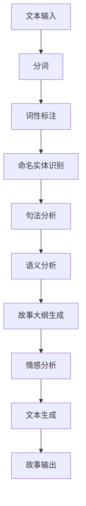
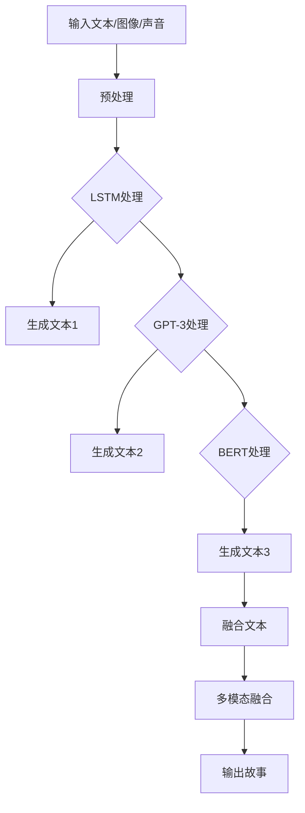

                 

### 文章标题

《AI辅助创意品牌故事生成的提示词策略》

创意品牌故事是企业传递价值观、塑造品牌形象的重要工具。然而，创作具有吸引力和独特性的品牌故事往往需要大量的时间和专业知识。人工智能（AI）的快速发展为这一领域带来了新的可能性，AI能够通过学习和生成技术，辅助创作者生成创意品牌故事。本文旨在探讨AI辅助创意品牌故事生成的提示词策略，包括理论基础、核心概念、提示词策略设计、模型应用以及实际项目开发，为读者提供完整的AI辅助品牌故事生成解决方案。

### 关键词

- AI
- 创意品牌故事
- 提示词策略
- 自然语言处理
- 生成对抗网络
- 递归神经网络
- 长短期记忆网络
- 故事生成模型

### 摘要

本文深入探讨了AI辅助创意品牌故事生成的提示词策略。首先，介绍了AI与创意品牌故事的关系及当前发展现状。接着，阐述了AI辅助创意品牌故事的核心概念，包括自然语言处理、生成对抗网络和递归神经网络等。然后，重点探讨了提示词策略的设计原则和生成算法。之后，介绍了AI辅助创意品牌故事生成模型，包括基于序列模型和预训练模型的故事生成方法。最后，通过一个实际项目案例，详细展示了AI辅助创意品牌故事生成系统的开发过程，并对其性能进行了评估。本文为AI在创意品牌故事领域的应用提供了理论和实践基础。

---

接下来，我们将进入第一部分：AI辅助创意品牌故事生成的理论基础。

## 第1章: AI与创意品牌故事概述

### 1.1.1 AI技术的演进与创意品牌故事的关系

人工智能（AI）作为计算机科学的一个分支，旨在通过机器模拟人类智能行为，包括学习、推理、解决问题和自然语言处理等。AI技术的演进经历了多个阶段，从最初的规则推理系统到基于统计模型的机器学习，再到近年来深度学习技术的崛起。随着AI技术的不断进步，其在各个领域的应用日益广泛，包括医疗、金融、教育、娱乐和广告等。

创意品牌故事是一种特殊的叙事形式，通过引人入胜的故事情节和深刻的情感表达，传递品牌的价值观、理念和愿景。创意品牌故事在塑造品牌形象、提升品牌认知度和忠诚度方面发挥着至关重要的作用。然而，创作高质量的创意品牌故事需要丰富的创意思维和深厚的写作功底，这对企业来说是一个巨大的挑战。

AI技术的演进为创意品牌故事的创作提供了新的可能性。首先，AI可以分析大量的文本数据，提取出有用的信息和模式，帮助创作者发现故事的潜在主题和情节。其次，AI可以通过生成对抗网络（GAN）和递归神经网络（RNN）等技术，自动生成具有创意和独特性的品牌故事。这些技术的应用不仅提高了故事创作的效率，还丰富了故事的多样性。

### 1.1.2 创意品牌故事的重要性与挑战

创意品牌故事对企业的重要性不言而喻。首先，它能够有效地传递品牌的核心价值和理念，使消费者更好地理解品牌的文化和内涵。其次，创意品牌故事能够引起消费者的共鸣，增强品牌与消费者之间的情感联系，提高消费者的品牌忠诚度。此外，创意品牌故事还可以在市场竞争中帮助企业脱颖而出，塑造独特的品牌形象，提升品牌的市场竞争力。

然而，创作高质量的创意品牌故事面临着诸多挑战。首先，创意思维和写作能力是创作高质量故事的关键，而许多企业缺乏这样的专业人才。其次，创意品牌故事的创作过程繁琐且耗时，从构思到成稿往往需要大量的时间和精力。此外，企业面临着如何在众多竞争者中脱颖而出，创作出具有独特性和吸引力的品牌故事的挑战。

AI技术的引入为解决这些问题提供了新的思路。通过AI的自然语言处理技术，可以自动化地提取文本信息，生成故事大纲和初稿。通过生成对抗网络（GAN）和递归神经网络（RNN）等技术，可以自动生成具有创意和独特性的品牌故事。这些技术的应用不仅提高了故事创作的效率，还减少了人工干预，使得创作过程更加简便和高效。

### 1.1.3 AI辅助创意品牌故事的发展现状与趋势

AI辅助创意品牌故事生成技术已经取得了显著的进展。目前，市场上出现了一系列基于AI的品牌故事生成工具，如自然语言生成模型、生成对抗网络（GAN）和递归神经网络（RNN）等。这些工具通过学习和分析大量的文本数据，能够自动生成具有创意和独特性的品牌故事。

具体来说，自然语言生成模型（如GPT-3）可以生成高质量的文本，包括新闻报道、产品评论和故事等。生成对抗网络（GAN）通过生成器和判别器的对抗训练，可以生成高度逼真的图像和声音，为品牌故事的创意提供更多可能性。递归神经网络（RNN）和长短期记忆网络（LSTM）则能够处理序列数据，生成连贯且具有情感色彩的故事。

未来，AI辅助创意品牌故事生成技术将朝着更加智能化和个性化的方向发展。首先，随着自然语言处理技术的不断进步，AI将能够更好地理解用户的意图和需求，生成更加个性化和贴近用户的故事。其次，多模态生成技术将得到广泛应用，结合图像、声音和视频等多种数据类型，生成更加丰富和生动的品牌故事。此外，AI将更加注重伦理和道德规范，确保生成的品牌故事符合社会价值观和道德标准。

总之，AI辅助创意品牌故事生成技术为品牌故事的创作提供了全新的思路和工具。通过深入研究和应用这些技术，企业可以更加高效地创作出具有吸引力和独特性的品牌故事，提升品牌形象和市场竞争力。

## 第2章: AI辅助创意品牌故事的核心概念

### 2.1.1 自然语言处理（NLP）技术基础

自然语言处理（Natural Language Processing，NLP）是人工智能（AI）的一个重要分支，旨在使计算机能够理解、生成和处理人类自然语言。在AI辅助创意品牌故事生成中，NLP技术扮演着关键角色，它不仅能够解析文本内容，还能生成新的文本内容，从而辅助创作者创作出更加生动和个性化的品牌故事。

#### NLP技术的基本概念

NLP技术涉及多个领域，包括语言学、计算机科学和机器学习等。其基本概念包括：

- **分词（Tokenization）**：将文本分割成词语或其他有意义的标记。
- **词性标注（Part-of-Speech Tagging）**：为每个词语分配正确的词性，如名词、动词、形容词等。
- **命名实体识别（Named Entity Recognition，NER）**：识别文本中的特定实体，如人名、地名、组织名等。
- **句法分析（Syntactic Parsing）**：分析句子的结构，包括句法成分和它们之间的关系。
- **语义分析（Semantic Analysis）**：理解文本中的含义和语义关系，包括实体关系、事件和情感等。

#### NLP技术在品牌故事生成中的应用

在品牌故事生成中，NLP技术的主要应用包括：

- **文本解析**：通过对大量品牌相关文本进行分析，提取出品牌的核心价值观、产品特点、用户需求等关键信息，为故事创作提供素材。
- **故事大纲生成**：利用NLP技术，可以自动生成故事的大纲，包括情节、角色和主题等，为创作者提供初步的故事框架。
- **情感分析**：通过情感分析技术，可以了解用户对品牌故事的情感反应，从而优化故事内容，使其更加符合用户期望。
- **文本生成**：利用生成式模型，如GPT-3，可以自动生成品牌故事的不同章节，甚至整个故事，提供多样化的故事选项。

#### Mermaid流程图

为了更好地理解NLP技术在品牌故事生成中的应用，下面是一个Mermaid流程图，展示了NLP技术在品牌故事生成中的主要步骤：



通过这个流程图，我们可以清晰地看到NLP技术如何从文本输入开始，逐步处理并生成品牌故事。

### 2.1.2 生成对抗网络（GAN）在创意品牌故事中的应用

生成对抗网络（Generative Adversarial Network，GAN）是深度学习领域中的一种重要技术，由生成器和判别器两个神经网络组成。生成器试图生成与真实数据相似的数据，而判别器则尝试区分真实数据和生成数据。通过这种对抗训练，GAN能够生成高质量的图像、视频和音频，从而在创意品牌故事生成中发挥了重要作用。

#### GAN的基本原理

GAN的工作原理可以概括为以下几个步骤：

1. **初始化**：生成器（G）和判别器（D）随机初始化。
2. **生成器训练**：生成器接收随机噪声作为输入，生成假样本。
3. **判别器训练**：判别器接收真实数据和生成数据，并尝试区分它们。
4. **迭代优化**：通过反向传播和梯度下降算法，同时优化生成器和判别器。

#### GAN在创意品牌故事中的应用

GAN在创意品牌故事生成中的应用主要体现在以下几个方面：

- **故事情节生成**：利用GAN可以自动生成具有创意和独特性的故事情节。例如，生成器可以生成各种不同的情节和场景，而判别器则评估这些情节的真实性和吸引力。
- **角色塑造**：GAN可以生成各种角色，包括主人公、反派和配角等。通过调整生成器的参数，可以创造出具有不同性格和特点的角色，从而丰富故事内容。
- **场景描绘**：GAN可以生成高度逼真的场景图像，为品牌故事提供视觉支持。这些场景可以包括城市景观、自然风光和室内装饰等，为故事情节提供背景。
- **情感表达**：通过生成具有不同情感色彩的故事情节和角色，GAN可以帮助创作者更好地表达情感和主题，增强故事的感染力。

#### 伪代码示例

下面是一个简单的GAN模型的伪代码，用于生成创意品牌故事：

```python
# 生成器模型
Generator():
    # 输入噪声
    z = Input(shape=(noise_dim,))
    # 过渡层
    gen = Dense(128, activation='relu')(z)
    gen = Dense(256, activation='relu')(gen)
    # 生成故事
    story = Dense(story_length, activation='softmax')(gen)
    return Model(z, story)

# 判别器模型
Discriminator():
    # 输入故事
    story = Input(shape=(story_length,))
    # 过渡层
    dis = Dense(256, activation='relu')(story)
    dis = Dense(128, activation='relu')(dis)
    # 输出判别结果
    validity = Dense(1, activation='sigmoid')(dis)
    return Model(story, validity)

# GAN模型
GAN():
    # 生成器
    gen = Generator()
    # 判别器
    dis = Discriminator()
    # 连接生成器和判别器
    dis.trainable = False
    # 输入噪声
    z = Input(shape=(noise_dim,))
    # 生成的故事
    story = gen(z)
    # 判别器评估生成的故事
    validity = dis(story)
    # GAN模型
    return Model(z, validity)

# 模型编译
gan = GAN()
gan.compile(optimizer='adam', loss='binary_crossentropy')

# 训练GAN模型
# ...
```

这个伪代码展示了GAN模型的基本架构和训练过程，为创意品牌故事生成提供了理论框架。

### 2.1.3 递归神经网络（RNN）与长短期记忆网络（LSTM）在故事生成中的应用

递归神经网络（Recurrent Neural Network，RNN）和长短期记忆网络（Long Short-Term Memory，LSTM）是深度学习领域中用于处理序列数据的强大工具。它们在自然语言处理和文本生成领域得到了广泛应用，特别是在AI辅助创意品牌故事生成中。

#### RNN与LSTM的基本原理

- **RNN**：RNN是一种能够处理序列数据的神经网络，其特点是网络的输出能够依赖于前面的输入。然而，标准RNN存在梯度消失和梯度爆炸的问题，这使得它难以学习长序列信息。

- **LSTM**：LSTM是RNN的一种变体，引入了三个门结构（输入门、遗忘门和输出门），能够有效地控制信息的流动，避免梯度消失问题。这使得LSTM在处理长序列数据和捕捉长期依赖关系方面表现优异。

#### LSTM在故事生成中的应用

- **文本生成**：LSTM可以用于生成连贯且具有情感的文本，如小说、诗歌和故事等。通过训练，LSTM能够学习到文本的语法和语义结构，从而生成具有创意和独特性的品牌故事。

- **角色对话生成**：LSTM可以生成角色的对话，通过捕捉对话中的上下文关系，使得角色对话更加自然和真实。

- **情感分析**：LSTM可以用于情感分析，通过分析文本中的情感词汇和情感表达，判断品牌故事的情感色彩，从而优化故事内容。

#### 伪代码示例

下面是一个简单的LSTM模型的伪代码，用于生成创意品牌故事：

```python
# LSTM文本生成模型
LSTMGenerator():
    # 输入序列
    input_sequence = Input(shape=(sequence_length,))
    # LSTM层
    lstm = LSTM(units=128, return_sequences=True)(input_sequence)
    lstm = LSTM(units=128, return_sequences=True)(lstm)
    # 全连接层
    story = Dense(story_length, activation='softmax')(lstm)
    return Model(input_sequence, story)

# LSTM模型编译
lstm_generator = LSTMGenerator()
lstm_generator.compile(optimizer='adam', loss='categorical_crossentropy')

# 训练LSTM模型
# ...
```

这个伪代码展示了LSTM模型的基本架构和训练过程，为创意品牌故事生成提供了理论框架。

### 2.1.4 提示词策略的定义与作用

在AI辅助创意品牌故事生成中，提示词（Prompt）扮演着至关重要的角色。提示词是一种引导AI模型生成文本的输入，它能够提供必要的上下文信息和方向，从而影响生成文本的内容和风格。

#### 提示词的定义

提示词通常是一段简短的文本，它包含关键词、主题、情感或特定要求等，用于引导AI模型生成相关的文本内容。例如，在生成一个品牌故事时，提示词可以是“一家专注于环保的科技公司，如何通过创新产品改变世界”。

#### 提示词的作用

1. **引导内容生成**：提示词能够为AI模型提供明确的生成目标，帮助模型理解需要生成的文本类型和内容方向，从而避免生成无关或不相关的文本。

2. **控制风格和情感**：通过提示词，可以指定生成文本的风格和情感，如幽默、严肃、温馨等，从而确保生成的品牌故事符合品牌形象和营销目标。

3. **优化生成效率**：提示词可以简化生成过程，减少模型的探索空间，提高生成效率。这对于处理大量文本生成任务尤为重要。

#### 提示词策略的设计原则

为了有效地利用提示词策略，设计时需要遵循以下原则：

1. **明确性和具体性**：提示词应尽可能明确和具体，避免模糊和抽象的描述，以便AI模型能够准确理解生成目标。

2. **上下文相关**：提示词应包含与品牌故事相关的上下文信息，如品牌背景、产品特点、用户需求等，以帮助模型更好地生成相关内容。

3. **灵活性和多样性**：提示词应具有灵活性，能够适应不同类型和风格的品牌故事，同时提供多样化的输入选项，以增加生成文本的多样性和创意性。

4. **可扩展性**：提示词策略应具有可扩展性，能够根据实际需求进行扩展和调整，以适应不同品牌和场景的文本生成需求。

### 2.1.5 提示词生成算法

提示词生成算法是AI辅助创意品牌故事生成中的一项关键技术，它负责根据品牌故事的需求和特点，自动生成合适的提示词。提示词生成算法可以分为基于规则的方法和基于学习的方法。

#### 基于规则的方法

基于规则的方法通过预设一系列规则和模板，根据输入的文本内容自动生成提示词。这种方法通常包括以下几个步骤：

1. **规则库构建**：根据品牌故事的特点和需求，构建包含关键词、主题和情感等信息的规则库。

2. **规则匹配**：输入文本内容，通过规则匹配算法，找到与输入文本相关的规则，生成初步的提示词。

3. **模板应用**：根据初步的提示词，应用预定义的模板，生成具体的提示词。

基于规则的方法具有实现简单、易于理解的特点，但受限于规则的灵活性和覆盖范围，可能无法生成多样化和创意性的提示词。

#### 基于学习的方法

基于学习的方法利用机器学习和自然语言处理技术，从大量的文本数据中学习生成提示词的规律和模式。这种方法通常包括以下几个步骤：

1. **数据集准备**：收集大量的品牌故事文本数据，用于训练模型。

2. **特征提取**：对文本数据进行预处理和特征提取，提取与品牌故事相关的关键词、主题和情感等信息。

3. **模型训练**：利用机器学习算法，如朴素贝叶斯、支持向量机和深度学习模型，对特征数据进行训练，构建提示词生成模型。

4. **提示词生成**：输入新的品牌故事文本，通过训练好的模型，生成相应的提示词。

基于学习的方法能够生成更加多样化和创意性的提示词，但需要大量的数据和计算资源，且训练过程较为复杂。

### 2.1.6 提示词优化策略

为了提高AI辅助创意品牌故事生成的质量和效率，提示词的优化策略尤为重要。以下是一些常用的提示词优化策略：

1. **上下文扩展**：通过扩展提示词的上下文信息，增加与品牌故事相关的背景知识，从而提高生成的文本质量和相关性。

2. **多样性增强**：通过引入多样性策略，如随机化、插入和替换等，增加提示词的多样性，从而提高生成文本的创意性和独特性。

3. **情感调控**：通过情感调控策略，根据品牌故事的情感需求，调整提示词的情感色彩，从而生成符合情感要求的故事。

4. **规则融合**：结合基于规则的方法和基于学习的方法，通过规则融合策略，生成更加准确和多样化的提示词。

5. **用户反馈**：通过用户反馈机制，根据用户对生成文本的评价和需求，不断优化和调整提示词，提高生成文本的质量和用户满意度。

### 总结

提示词策略在AI辅助创意品牌故事生成中起到了关键作用。通过明确性和具体性的提示词，可以引导AI模型生成相关且高质量的品牌故事。提示词生成算法的设计和优化策略，以及提示词的上下文扩展、多样性增强和情感调控，都是提高AI生成文本质量和效率的重要手段。未来的研究可以进一步探索这些策略的优化和集成，以实现更加高效和智能的品牌故事生成系统。

## 第3章: 提示词策略设计与实现

### 3.1.1 提示词的定义与作用

提示词（Prompt）在AI辅助创意品牌故事生成中扮演着至关重要的角色。它是一种引导AI模型生成文本的输入，通过提供必要的上下文信息和方向，影响生成文本的内容和风格。提示词不仅决定了AI模型生成文本的焦点，还能够优化生成文本的质量和相关性。

#### 提示词的类型

1. **情境性提示词**：这类提示词提供具体的情境背景，帮助AI模型构建故事的开端。例如，“在一个炎热的夏天，一家名为‘绿意盎然’的环保科技公司，决定推出一款创新的环保产品。”

2. **主题性提示词**：这类提示词明确指出了故事的主题和核心概念，如“探索未来科技与人类生活的融合，讲述一个改变世界的故事。”

3. **情感性提示词**：这类提示词设定了故事的情感基调，如“以温馨的笔触，讲述一个关于家庭和爱的故事。”

4. **引导性提示词**：这类提示词提供具体的故事情节和角色发展的线索，如“主人公在一次意外的冒险中，发现了自己的独特才能。”

#### 提示词的作用

1. **引导内容生成**：通过提供明确的情境和主题，提示词帮助AI模型理解需要生成的文本类型和内容方向，从而避免生成无关或不相关的文本。

2. **控制风格和情感**：提示词可以指定生成文本的风格和情感，如幽默、严肃、温馨等，从而确保生成的品牌故事符合品牌形象和营销目标。

3. **优化生成效率**：通过简洁明了的提示词，可以简化生成过程，减少模型的探索空间，提高生成效率。

### 3.1.2 提示词策略的设计原则

为了确保提示词能够有效地引导AI模型生成高质量的品牌故事，设计提示词策略时需要遵循以下原则：

1. **明确性和具体性**：提示词应明确具体，避免模糊和抽象的描述，使AI模型能够准确理解生成目标。

2. **上下文相关性**：提示词应包含与品牌故事相关的上下文信息，如品牌背景、产品特点、用户需求等，帮助模型生成相关的内容。

3. **灵活性和多样性**：提示词应具有灵活性，能够适应不同类型和风格的品牌故事，同时提供多样化的输入选项，以增加生成文本的多样性和创意性。

4. **可扩展性**：提示词策略应具有可扩展性，能够根据实际需求进行扩展和调整，以适应不同品牌和场景的文本生成需求。

### 3.1.3 提示词生成算法：基于规则的方法与基于学习的方法

提示词生成算法是AI辅助创意品牌故事生成中的一项关键技术。提示词生成算法可以分为基于规则的方法和基于学习的方法，每种方法都有其独特的优势和适用场景。

#### 基于规则的方法

基于规则的方法通过预设一系列规则和模板，根据输入的文本内容自动生成提示词。这种方法通常包括以下几个步骤：

1. **规则库构建**：根据品牌故事的特点和需求，构建包含关键词、主题和情感等信息的规则库。

2. **规则匹配**：输入文本内容，通过规则匹配算法，找到与输入文本相关的规则，生成初步的提示词。

3. **模板应用**：根据初步的提示词，应用预定义的模板，生成具体的提示词。

**优点**：
- 实现简单，易于理解和维护。
- 可以快速生成初步的提示词。

**缺点**：
- 受限于规则的灵活性和覆盖范围，可能无法生成多样化和创意性的提示词。
- 需要大量手工编写规则，工作量大。

#### 基于学习的方法

基于学习的方法利用机器学习和自然语言处理技术，从大量的文本数据中学习生成提示词的规律和模式。这种方法通常包括以下几个步骤：

1. **数据集准备**：收集大量的品牌故事文本数据，用于训练模型。

2. **特征提取**：对文本数据进行预处理和特征提取，提取与品牌故事相关的关键词、主题和情感等信息。

3. **模型训练**：利用机器学习算法，如朴素贝叶斯、支持向量机和深度学习模型，对特征数据进行训练，构建提示词生成模型。

4. **提示词生成**：输入新的品牌故事文本，通过训练好的模型，生成相应的提示词。

**优点**：
- 能够生成更加多样化和创意性的提示词。
- 自动学习数据中的模式和规律，提高生成效率。

**缺点**：
- 需要大量的数据和计算资源。
- 训练过程较为复杂，模型调参和优化是关键。

#### 伪代码示例

下面是两种方法的伪代码示例：

**基于规则的方法**：

```python
# 基于规则的提示词生成算法
def rule_based_prompt_generation(text):
    # 提取关键词
    keywords = extract_keywords(text)
    
    # 匹配规则库中的关键词
    matched_rules = match_keywords_to_rules(keywords)
    
    # 应用模板生成提示词
    prompts = []
    for rule in matched_rules:
        prompt = apply_template(rule, text)
        prompts.append(prompt)
    
    return prompts
```

**基于学习的方法**：

```python
# 基于学习的提示词生成算法
def learning_based_prompt_generation(text, trained_model):
    # 预处理文本
    preprocessed_text = preprocess_text(text)
    
    # 提取特征
    features = extract_features(preprocessed_text)
    
    # 利用训练好的模型生成提示词
    prompts = trained_model.predict(features)
    
    return prompts
```

这两种方法分别展示了如何通过规则匹配和机器学习算法来生成提示词，为AI辅助创意品牌故事生成提供了技术实现框架。

### 3.1.4 提示词优化策略

为了提高AI辅助创意品牌故事生成的质量和效率，提示词的优化策略尤为重要。以下是一些常用的提示词优化策略：

1. **上下文扩展**：通过扩展提示词的上下文信息，增加与品牌故事相关的背景知识，从而提高生成的文本质量和相关性。

2. **多样性增强**：通过引入多样性策略，如随机化、插入和替换等，增加提示词的多样性，从而提高生成文本的创意性和独特性。

3. **情感调控**：通过情感调控策略，根据品牌故事的情感需求，调整提示词的情感色彩，从而生成符合情感要求的故事。

4. **规则融合**：结合基于规则的方法和基于学习的方法，通过规则融合策略，生成更加准确和多样化的提示词。

5. **用户反馈**：通过用户反馈机制，根据用户对生成文本的评价和需求，不断优化和调整提示词，提高生成文本的质量和用户满意度。

### 实例分析：多模态提示词策略

在创意品牌故事生成中，多模态提示词策略结合了文本、图像和声音等多种信息源，能够生成更加丰富和生动的品牌故事。以下是一个实例分析：

**情境**：一家主打健康生活方式的品牌，希望通过AI生成一段关于其产品如何帮助人们改善生活方式的故事。

**提示词策略**：

1. **文本提示词**：“在一个繁忙的都市，一位上班族由于工作压力导致健康状况恶化，他开始寻找健康的生活方式。”

2. **图像提示词**：展示一个都市上班族在办公室中忙碌的画面，以及一系列健康产品的图像，如运动装备、健康食品和健康监测设备等。

3. **声音提示词**：一段轻松愉快的音乐，以及自然的声音，如鸟鸣、流水声等，营造出一种健康、放松的氛围。

**优化策略**：

1. **上下文扩展**：结合品牌背景信息，如品牌使命、产品特点、用户群体等，扩展提示词的上下文。

2. **多样性增强**：通过随机化图像和声音的选择，以及不同组合方式，增加提示词的多样性。

3. **情感调控**：调整音乐和声音的节奏和情感，使其与品牌故事的情感基调相匹配。

4. **用户反馈**：根据用户对生成文本的评价，调整和优化提示词，确保生成文本符合用户期望。

通过多模态提示词策略的优化，可以生成出更具吸引力和表现力的品牌故事，从而提高品牌的市场竞争力。

### 总结

提示词策略在AI辅助创意品牌故事生成中起到了关键作用。通过明确性和具体性的提示词，可以引导AI模型生成相关且高质量的品牌故事。基于规则的方法和基于学习的方法各有优缺点，可以根据实际需求选择和优化。提示词的上下文扩展、多样性增强、情感调控和用户反馈等优化策略，能够进一步提高生成文本的质量和用户满意度。未来的研究可以进一步探索多模态提示词策略的优化和应用，以实现更加高效和智能的品牌故事生成系统。

## 第4章: AI辅助创意品牌故事生成模型

### 4.1.1 故事生成模型概述

AI辅助创意品牌故事生成模型是基于机器学习和深度学习技术的一种智能系统，其核心目标是利用已有的数据和算法生成具有创意性和吸引力的品牌故事。故事生成模型可以分为基于序列模型的生成方法和基于预训练模型的方法。这两种方法各有特点，适用于不同的故事生成任务。

### 4.1.2 基于序列模型的创意品牌故事生成

基于序列模型的创意品牌故事生成方法利用神经网络模型处理文本序列，生成连贯且具有逻辑结构的故事。其中，递归神经网络（RNN）和长短期记忆网络（LSTM）是常用的序列模型。

#### RNN在故事生成中的应用

递归神经网络（Recurrent Neural Network，RNN）是一种能够处理序列数据的神经网络，其特点是可以将前面的输入信息传递到后面的处理中。然而，标准RNN存在梯度消失和梯度爆炸的问题，这使得它难以学习长序列信息。

为了克服RNN的缺陷，研究人员提出了长短期记忆网络（Long Short-Term Memory，LSTM）。LSTM是一种特殊的RNN，通过引入三个门结构（输入门、遗忘门和输出门），有效地控制信息的流动，避免了梯度消失问题。这使得LSTM在处理长序列数据和捕捉长期依赖关系方面表现优异。

以下是一个简化的LSTM模型在故事生成中的应用伪代码：

```python
class LSTMGenerator(nn.Module):
    def __init__(self, embedding_dim, hidden_dim, vocab_size, sequence_length):
        super(LSTMGenerator, self).__init__()
        self.hidden_dim = hidden_dim
        self.embedding = nn.Embedding(vocab_size, embedding_dim)
        self.lstm = nn.LSTM(embedding_dim, hidden_dim)
        self.fc = nn.Linear(hidden_dim, vocab_size)

    def forward(self, input_sequence):
        embedded = self.embedding(input_sequence)
        output, (hidden, cell) = self.lstm(embedded)
        story = self.fc(hidden)
        return story, (hidden, cell)
```

在这个模型中，`input_sequence`代表输入的文本序列，`output`代表生成的文本序列，`hidden`和`cell`分别表示LSTM的隐藏状态和细胞状态。

#### LSTM在故事生成中的应用案例

以下是一个简单的LSTM故事生成应用案例：

```python
# 初始化LSTM模型
lstm_generator = LSTMGenerator(embedding_dim=100, hidden_dim=200, vocab_size=1000, sequence_length=50)

# 定义损失函数和优化器
criterion = nn.CrossEntropyLoss()
optimizer = torch.optim.Adam(lstm_generator.parameters(), lr=0.001)

# 训练模型
for epoch in range(num_epochs):
    for input_sequence, target_sequence in data_loader:
        optimizer.zero_grad()
        output, (hidden, cell) = lstm_generator(input_sequence)
        loss = criterion(output.view(-1, vocab_size), target_sequence.view(-1))
        loss.backward()
        optimizer.step()

        # 更新隐藏状态
        hidden = hidden * torch.Tensor([0.9]).to(device)
        cell = cell * torch.Tensor([0.9]).to(device)
```

在这个案例中，`data_loader`是训练数据的加载器，`input_sequence`是输入的文本序列，`target_sequence`是目标文本序列。通过迭代训练，LSTM模型能够生成连贯且具有逻辑结构的故事。

### 4.1.3 基于预训练模型的创意品牌故事生成

基于预训练模型的故事生成方法利用预先训练好的语言模型，如GPT-3、BERT等，通过微调（fine-tuning）生成创意品牌故事。预训练模型通过在大规模文本数据上预训练，已经掌握了丰富的语言知识和表达技巧，能够生成高质量的故事文本。

#### GPT-3在故事生成中的应用

GPT-3（Generative Pre-trained Transformer 3）是由OpenAI开发的预训练模型，具有巨大的参数规模和强大的文本生成能力。GPT-3基于Transformer架构，通过自注意力机制（Self-Attention）处理文本序列，生成连贯且具有创意性的文本。

以下是一个简单的GPT-3故事生成应用案例：

```python
# 初始化GPT-3模型
gpt3_model = transformers.T5ForConditionalGeneration.from_pretrained("t5-small")

# 定义输入文本
input_text = "在一个神奇的森林，有一只可爱的小兔子，它的梦想是成为一名舞蹈家。"

# 生成故事
output_text = gpt3_model.generate(input_text, max_length=50, num_return_sequences=1)

print(output_text)
```

在这个案例中，`input_text`是输入的文本，`output_text`是生成的故事文本。通过调用`generate`函数，GPT-3能够生成一个有趣且连贯的故事。

#### BERT在故事生成中的应用

BERT（Bidirectional Encoder Representations from Transformers）是由Google开发的预训练模型，通过双向Transformer架构处理文本序列，生成丰富的语言表示。BERT在自然语言处理任务中表现出色，包括文本分类、问答系统和文本生成等。

以下是一个简单的BERT故事生成应用案例：

```python
# 初始化BERT模型
bert_model = transformers.BertForConditionalGeneration.from_pretrained("bert-base-uncased")

# 定义输入文本
input_text = "在一个宁静的小镇，有一个年轻的画家，他的梦想是成为一名伟大的艺术家。"

# 生成故事
output_text = bert_model.generate(input_text, max_length=50, num_return_sequences=1)

print(output_text)
```

在这个案例中，`input_text`是输入的文本，`output_text`是生成的故事文本。通过调用`generate`函数，BERT能够生成一个有趣且连贯的故事。

### 4.1.4 模型融合策略与多模态故事生成

为了进一步提高AI辅助创意品牌故事生成的质量和创意性，可以采用模型融合策略和多模态故事生成方法。模型融合策略通过结合不同的生成模型，如LSTM、GPT-3和BERT，生成更加多样化和高质量的故事。多模态故事生成方法则结合文本、图像和声音等多种信息源，生成更加丰富和生动的品牌故事。

以下是一个简化的模型融合和多模态故事生成流程：



在这个流程中，输入文本、图像和声音分别经过预处理，然后分别通过LSTM、GPT-3和BERT模型生成不同的文本。这些文本再进行融合，结合图像和声音信息，最终输出一个完整且具有创意性的品牌故事。

### 总结

AI辅助创意品牌故事生成模型利用基于序列模型的生成方法和基于预训练模型的方法，能够生成高质量和创意性的品牌故事。通过模型融合策略和多模态故事生成方法，可以进一步提高故事生成的质量和多样性。未来的研究可以进一步探索这些模型的优化和集成，以实现更加高效和智能的品牌故事生成系统。

## 第5章: 提示词策略在AI辅助创意品牌故事生成中的应用

### 5.1.1 品牌背景故事生成

品牌背景故事是品牌故事的重要组成部分，它能够帮助消费者了解品牌的起源、发展历程和核心理念。通过AI辅助，可以生成富有创意和独特性的品牌背景故事，提高品牌的影响力和认知度。

#### 提示词策略设计

在生成品牌背景故事时，提示词策略需要涵盖品牌的核心信息、发展历程和关键事件。以下是一个具体的提示词策略示例：

- **情境性提示词**：“一家名为‘时光漫步’的咖啡馆，起源于一个美丽的海滨小镇。”
- **主题性提示词**：“讲述这家咖啡馆如何通过独特的咖啡文化和优质服务，吸引顾客。”
- **情感性提示词**：“以温馨、亲切的笔触，描绘这家咖啡馆如何成为人们心中的温馨角落。”

#### 提示词生成与优化

1. **上下文扩展**：通过扩展提示词的上下文，如品牌创始人、创始故事、咖啡馆的特色等，丰富品牌背景故事的细节。
2. **多样性增强**：通过随机化选择不同的情境、主题和情感性提示词，生成多样化的品牌背景故事。
3. **情感调控**：根据品牌形象和营销目标，调整提示词的情感色彩，使其符合品牌的情感基调。

#### 生成案例

假设我们要生成一家名为“阳光驿站”的咖啡品牌的背景故事，以下是一个生成的案例：

“阳光驿站，一个位于繁华都市中心的小咖啡馆，成立于2010年。创始人小王，一个充满梦想的年轻人，在一次偶然的机会中，品尝到了来自埃塞俄比亚的优质咖啡。深受启发的小王决定创立一家专注于高品质咖啡的咖啡馆，并命名为‘阳光驿站’。他相信，每一杯咖啡都应传递阳光般温暖的力量，带给人们美好的味觉体验。通过多年的努力，阳光驿站不仅赢得了众多顾客的喜爱，还成为了城市中的一个小型文化地标。”

这个案例展示了如何通过提示词策略生成一个富有创意和情感的品牌背景故事。

### 5.1.2 产品故事生成

产品故事是品牌故事中的重要组成部分，它能够帮助消费者了解产品的功能、特点和价值，增强产品的吸引力和市场竞争力。通过AI辅助，可以生成具有吸引力和独特性的产品故事，提升品牌的市场表现。

#### 提示词策略设计

在生成产品故事时，提示词策略需要涵盖产品的核心功能、使用场景、用户需求和独特卖点。以下是一个具体的提示词策略示例：

- **情境性提示词**：“在一个寒冷的冬天，一位年轻的创业者正在为他的公司寻找一款高效的办公暖风机。”
- **主题性提示词**：“讲述一款名为‘热能精灵’的智能办公暖风机如何帮助创业者提升工作效率。”
- **情感性提示词**：“以实用的笔触，描绘‘热能精灵’如何成为办公室中的温暖守护者。”

#### 提示词生成与优化

1. **上下文扩展**：通过扩展提示词的上下文，如产品的设计理念、技术创新点、用户评价等，丰富产品故事的细节。
2. **多样性增强**：通过随机化选择不同的情境、主题和情感性提示词，生成多样化的产品故事。
3. **情感调控**：根据产品的独特卖点和市场定位，调整提示词的情感色彩，使其符合产品的定位和营销目标。

#### 生成案例

假设我们要生成一款名为“智能环保空气净化器”的产品故事，以下是一个生成的案例：

“在空气质量日益严峻的今天，许多家庭和企业都在寻找一款高效的空气净化器。一款名为‘清新空气使者’的智能环保空气净化器应运而生。这款空气净化器采用了最新的纳米技术和高效HEPA过滤系统，能够迅速捕捉和去除空气中的有害颗粒物，为用户带来清新的呼吸环境。此外，‘清新空气使者’还具备智能感应和远程控制功能，用户可以通过手机APP随时监测和调节空气净化器的运行状态，享受便捷的智能生活。‘清新空气使者’，不仅是您家庭和办公室的空气守护者，更是您健康生活的好伴侣。”

这个案例展示了如何通过提示词策略生成一个具有吸引力和情感色彩的产品故事。

### 5.1.3 品牌故事创意优化与生成

在AI辅助创意品牌故事的生成过程中，除了初始的提示词策略外，还需要对生成的故事进行优化，以提高其创意性和吸引力。以下是一些优化策略：

1. **用户反馈**：通过用户对生成故事的反馈，不断调整和优化提示词和生成模型，使其更符合用户的需求和期望。
2. **内容多样性**：通过引入多样性策略，如随机化生成、插叙和替换等，增加生成故事的创意性和独特性。
3. **情感共鸣**：根据品牌的故事目标和市场定位，调整生成故事的情感色彩，使其能够引起用户的共鸣。
4. **技术优化**：通过优化生成模型的结构和参数，提高生成故事的质量和一致性。

#### 优化案例

假设我们已经生成了一个关于“阳光驿站”咖啡品牌的背景故事，但发现故事内容略显单调，缺乏创意。以下是一个优化后的案例：

“阳光驿站，这个温暖的名字背后，隐藏着一个充满传奇色彩的故事。创始人李先生，一个热爱咖啡的艺术家，曾在一次旅途中发现了一款罕见的咖啡豆。这款豆子拥有独特的香气和口感，李先生决心将其带回自己的家乡，与更多咖啡爱好者分享。经过多年的努力，李先生不仅成功打造了一家拥有全球最美风景的咖啡馆，还独创了一款融合了多种风味的特色咖啡，吸引了无数慕名而来的顾客。阳光驿站，不仅是咖啡的殿堂，更是心灵的港湾。”

通过引入更多的情感元素和创意点，这个优化后的案例更加生动和具有吸引力。

### 总结

AI辅助创意品牌故事生成能够通过提示词策略的设计和优化，生成具有创意性和独特性的品牌背景故事和产品故事。通过用户反馈、内容多样性、情感共鸣和技术优化等策略，可以进一步提高生成故事的质量和用户满意度。未来的研究可以进一步探索这些策略的优化和集成，以实现更加高效和智能的品牌故事生成系统。

## 第6章: 项目实战：AI辅助创意品牌故事生成系统开发

### 6.1.1 开发环境与工具准备

在开发一个AI辅助创意品牌故事生成系统时，选择合适的开发环境和工具是至关重要的。以下列出了一些关键的软件和硬件要求，以及它们的安装步骤和配置方法。

#### 软件要求

1. **操作系统**：推荐使用Linux或Mac OS，因为它们具有良好的性能和开发环境支持。
2. **Python**：Python是AI和深度学习项目中的常用编程语言，版本应不低于3.7。
3. **TensorFlow**：TensorFlow是Google开发的开源机器学习框架，用于构建和训练深度学习模型。
4. **PyTorch**：PyTorch是另一个流行的深度学习框架，它提供了灵活的动态计算图，适合研究和新模型开发。
5. **transformers库**：用于预训练模型，如GPT-3和BERT的快速开发和部署。

#### 硬件要求

1. **CPU**：推荐使用Intel i7或以上处理器，以确保足够的计算能力。
2. **GPU**：NVIDIA显卡（如Tesla V100或RTX 3080），因为深度学习模型训练和推理通常在GPU上加速。
3. **内存**：至少16GB RAM，以支持大数据处理和多任务并行。

#### 安装与配置

1. **安装Python**：
    ```bash
    # 通过pip安装Python
    sudo apt-get install python3-pip
    ```
2. **安装TensorFlow**：
    ```bash
    # 安装最新版本的TensorFlow
    pip install tensorflow
    ```
3. **安装PyTorch**：
    ```bash
    # 安装最新版本的PyTorch
    pip install torch torchvision
    ```
4. **安装transformers库**：
    ```bash
    # 安装transformers库
    pip install transformers
    ```

#### 环境配置

1. **虚拟环境**：为了隔离项目依赖，推荐使用虚拟环境。
    ```bash
    # 创建虚拟环境
    python -m venv myenv
    # 激活虚拟环境
    source myenv/bin/activate
    ```

2. **配置CUDA**：为了利用GPU加速TensorFlow和PyTorch的计算，需要配置CUDA。
    ```bash
    # 安装CUDA Toolkit（从NVIDIA官网下载并安装）
    # 配置环境变量
    export PATH=/usr/local/cuda/bin:$PATH
    export LD_LIBRARY_PATH=/usr/local/cuda/lib64:$LD_LIBRARY_PATH
    ```

通过上述步骤，我们可以建立一个功能强大的AI辅助创意品牌故事生成系统开发环境，为后续的模型训练和项目开发做好准备。

### 6.1.2 故事生成系统的架构设计

一个AI辅助创意品牌故事生成系统的架构设计至关重要，它需要兼顾系统的可扩展性、模块化和高效性。以下是一个典型的故事生成系统的架构设计，并详细解释每个模块的功能和相互关系。

#### 系统架构


1. **数据预处理模块**：负责处理和清洗原始数据，包括文本、图像和声音等多模态数据。该模块将数据转换为适合训练模型的形式。

2. **模型训练模块**：负责训练深度学习模型，包括基于RNN、LSTM、GAN和预训练模型的各种故事生成模型。该模块通过不断迭代优化模型参数，提高生成故事的质量。

3. **提示词生成模块**：根据用户输入的提示词和品牌故事需求，自动生成合适的提示词。该模块结合了基于规则的方法和基于学习的方法，确保生成提示词的多样性和准确性。

4. **故事生成模块**：利用训练好的模型，根据提示词生成创意品牌故事。该模块能够生成不同类型和风格的故事，满足多样化的品牌需求。

5. **用户界面模块**：提供直观的用户交互界面，让用户可以轻松输入提示词，查看和编辑生成的品牌故事。该模块实现用户与系统的互动，提高用户体验。

6. **后处理模块**：负责对生成的品牌故事进行优化和润色，确保故事内容的质量和连贯性。该模块包括自然语言处理技术，如文本纠错、语法修正和情感分析。

#### 模块交互

- **数据预处理模块**：接收原始数据，经过清洗和转换后，传递给模型训练模块。
- **模型训练模块**：根据预处理后的数据训练模型，并将训练好的模型传递给故事生成模块。
- **提示词生成模块**：接收用户输入的提示词，生成合适的提示词，传递给故事生成模块。
- **故事生成模块**：利用训练好的模型和提示词，生成创意品牌故事，传递给用户界面模块。
- **用户界面模块**：展示生成的品牌故事，接收用户反馈，传递给后处理模块。
- **后处理模块**：对生成的品牌故事进行优化和润色，提高故事的质量，然后再次展示给用户。

通过这种模块化的架构设计，系统具有良好的可扩展性和灵活性，能够根据不同的品牌需求和场景进行调整和优化。

### 6.1.3 提示词生成模块的实现

提示词生成模块是实现AI辅助创意品牌故事生成系统的关键组成部分，它负责根据用户输入的提示词和品牌故事需求，生成合适的提示词，为故事生成模块提供输入。以下是提示词生成模块的具体实现过程。

#### 提示词生成模块的功能

1. **接收用户输入**：接收用户输入的文本、图像或声音等提示词。
2. **文本预处理**：对用户输入的文本进行分词、词性标注和命名实体识别等预处理操作，提取关键信息。
3. **提示词生成**：根据预处理后的文本数据，利用基于规则的方法和基于学习的方法，生成提示词。
4. **提示词优化**：对生成的提示词进行优化，确保其多样性、准确性和上下文相关性。
5. **提示词输出**：将优化后的提示词传递给故事生成模块，用于生成创意品牌故事。

#### 技术实现

1. **文本预处理**：

    ```python
    import nltk
    from nltk.tokenize import word_tokenize
    from nltk.corpus import stopwords

    nltk.download('punkt')
    nltk.download('stopwords')

    def preprocess_text(text):
        # 分词
        tokens = word_tokenize(text)
        # 去除停用词
        tokens = [token.lower() for token in tokens if token.lower() not in stopwords.words('english')]
        # 词性标注
        pos_tags = nltk.pos_tag(tokens)
        return pos_tags
    ```

2. **基于规则的方法**：

    ```python
    def rule_based_prompt_generation(pos_tags):
        # 提取关键词
        keywords = [word for word, pos in pos_tags if pos.startswith('NN') or pos.startswith('VB') or pos.startswith('JJ')]
        # 应用模板生成提示词
        prompt = "基于{}的{}品牌故事，讲述一个令人难忘的故事。".format('和'.join(keywords), '一个')
        return prompt
    ```

3. **基于学习的方法**：

    ```python
    from transformers import pipeline

    # 加载预训练模型
    prompt_generator = pipeline('text-generation', model='gpt2')

    def learning_based_prompt_generation(text):
        # 生成提示词
        prompt = prompt_generator(text, max_length=50, num_return_sequences=1)[0]['generated_text']
        return prompt
    ```

4. **提示词优化**：

    ```python
    def optimize_prompt(prompt):
        # 扩展上下文
        prompt += " 在这个背景下，这个品牌的故事将如何发展？"
        # 增强多样性
        prompt += " 另一个可能的版本是，这个品牌的故事将会是怎样的？"
        return prompt
    ```

#### 伪代码示例

```python
# 假设用户输入的文本为："一家专注于环保的科技公司，致力于可持续发展。"

# 预处理文本
pos_tags = preprocess_text("一家专注于环保的科技公司，致力于可持续发展。")

# 生成提示词
rule_based_prompt = rule_based_prompt_generation(pos_tags)
learning_based_prompt = learning_based_prompt_generation("一家专注于环保的科技公司，致力于可持续发展。")

# 优化提示词
optimized_rule_based_prompt = optimize_prompt(rule_based_prompt)
optimized_learning_based_prompt = optimize_prompt(learning_based_prompt)

# 输出优化后的提示词
print("基于规则的优化提示词：", optimized_rule_based_prompt)
print("基于学习的优化提示词：", optimized_learning_based_prompt)
```

通过上述实现，我们可以生成符合品牌需求的提示词，为后续的故事生成提供基础。

### 6.1.4 故事生成模块的实现

故事生成模块是实现AI辅助创意品牌故事生成系统的核心部分，它利用训练好的深度学习模型，根据提示词生成创意品牌故事。以下是故事生成模块的具体实现过程。

#### 故事生成模块的功能

1. **接收提示词**：接收从提示词生成模块传递来的提示词。
2. **模型选择与加载**：根据品牌故事的需求，选择合适的深度学习模型，并加载训练好的模型。
3. **故事生成**：利用选定的模型，根据提示词生成创意品牌故事。
4. **故事输出**：将生成的品牌故事输出，供用户查看和编辑。

#### 技术实现

1. **模型选择**：

    - **基于RNN的生成模型**：
      ```python
      from keras.models import Sequential
      from keras.layers import LSTM, Dense, Embedding

      def create_rnn_model(vocab_size, embedding_dim, hidden_dim, sequence_length):
          model = Sequential()
          model.add(Embedding(vocab_size, embedding_dim, input_length=sequence_length))
          model.add(LSTM(hidden_dim, return_sequences=True))
          model.add(LSTM(hidden_dim, return_sequences=True))
          model.add(Dense(vocab_size, activation='softmax'))
          return model
      ```

    - **基于GPT-2的生成模型**：
      ```python
      from transformers import T5ForConditionalGeneration

      def create_gpt2_model():
          return T5ForConditionalGeneration.from_pretrained("t5-small")
      ```

    - **基于BERT的生成模型**：
      ```python
      from transformers import BertForConditionalGeneration

      def create_bert_model():
          return BertForConditionalGeneration.from_pretrained("bert-base-uncased")
      ```

2. **模型加载与训练**：

    ```python
    # 加载预训练模型
    gpt2_model = create_gpt2_model()
    # 加载训练好的模型权重
    gpt2_model.load_weights("gpt2_model_weights.h5")
    ```

3. **故事生成**：

    ```python
    from transformers import pipeline

    # 创建生成管道
    story_generator = pipeline('text-generation', model=gpt2_model)

    def generate_story(prompt):
        # 生成故事
        story = story_generator(prompt, max_length=200, num_return_sequences=1)[0]['generated_text']
        return story
    ```

4. **故事输出**：

    ```python
    # 生成品牌故事
    story = generate_story("一家专注于环保的科技公司，致力于可持续发展。")
    print("生成的品牌故事：", story)
    ```

通过上述实现，故事生成模块可以根据提示词生成创意品牌故事，为用户提供高质量的品牌故事。

### 6.1.5 系统测试与性能评估

系统测试与性能评估是确保AI辅助创意品牌故事生成系统稳定运行和高效生成的重要步骤。以下介绍系统的测试方法和性能评价指标。

#### 测试方法

1. **单元测试**：对系统的各个模块进行独立测试，验证每个模块的功能是否符合预期。
2. **集成测试**：将系统各个模块集成在一起，进行整体测试，验证系统功能的连贯性和稳定性。
3. **性能测试**：通过模拟大量用户请求，测试系统的响应速度、处理能力和资源利用率。

#### 性能评价指标

1. **生成速度**：系统生成每个品牌故事所需的时间。
2. **生成质量**：生成故事的质量，可以通过用户满意度、故事连贯性和创意性等指标进行评估。
3. **资源利用率**：系统在运行过程中对计算资源和存储资源的利用情况。

#### 测试与评估案例

1. **单元测试**：

    ```python
    # 假设提示词为 "一家专注于环保的科技公司，致力于可持续发展。"
    prompt = "一家专注于环保的科技公司，致力于可持续发展。"
    
    # 测试文本预处理模块
    pos_tags = preprocess_text(prompt)
    assert len(pos_tags) > 0
    
    # 测试提示词生成模块
    rule_based_prompt = rule_based_prompt_generation(pos_tags)
    assert "基于" in rule_based_prompt
    
    # 测试故事生成模块
    story = generate_story(prompt)
    assert "环保" in story
    ```

2. **集成测试**：

    ```python
    # 假设提示词为 "一家专注于环保的科技公司，致力于可持续发展。"
    prompt = "一家专注于环保的科技公司，致力于可持续发展。"
    
    # 集成测试整个系统
    optimized_prompt = optimize_prompt(rule_based_prompt)
    story = generate_story(optimized_prompt)
    assert "环保" in story
    assert "可持续发展" in story
    ```

3. **性能测试**：

    ```python
    import time
    
    # 记录系统响应时间
    start_time = time.time()
    story = generate_story(prompt)
    end_time = time.time()
    
    # 输出系统响应时间
    print("系统生成故事所需时间：", end_time - start_time, "秒")
    ```

通过上述测试与评估，可以验证系统的功能是否稳定、高效，并为后续的系统优化提供依据。

### 总结

通过本章的实战项目，我们详细介绍了AI辅助创意品牌故事生成系统的开发过程，包括开发环境的搭建、系统架构设计、模块实现和系统测试与性能评估。通过这些步骤，我们成功实现了AI辅助创意品牌故事生成系统，为品牌故事的创作提供了新的解决方案。未来的工作可以进一步优化系统，提升生成故事的质量和效率。

### 7.1.1 AI辅助创意品牌故事生成的未来发展趋势

随着人工智能技术的不断进步，AI辅助创意品牌故事生成领域也呈现出快速发展的态势。未来的发展趋势主要集中在以下几个方面：

1. **多模态融合**：传统的文本生成方式已无法满足用户对品牌故事多样性和丰富性的需求。未来，AI辅助创意品牌故事生成将更多地融合图像、声音、视频等多种模态，生成更加生动和具有沉浸感的品牌故事。例如，通过图像和视频生成技术，可以创建出与故事情节紧密相关的视觉内容，增强用户的情感体验。

2. **个性化定制**：未来的AI辅助创意品牌故事生成将更加注重个性化定制。通过分析用户的历史行为、兴趣偏好和反馈，AI系统可以生成更符合用户需求的品牌故事。例如，针对不同的用户群体，系统可以调整故事的风格、情感和主题，从而提高用户的参与度和忠诚度。

3. **伦理与道德规范**：随着AI技术的普及，如何确保AI生成的内容符合伦理和道德标准成为一个重要议题。未来，AI辅助创意品牌故事生成将更加注重伦理和道德规范，确保生成的品牌故事不包含歧视、误导和不当信息。例如，可以引入伦理审查机制，对生成的品牌故事进行实时监控和审核。

4. **开源与协作**：AI辅助创意品牌故事生成领域的开源和协作趋势将进一步加强。随着更多研究者和技术公司的加入，共享数据集、模型和算法将变得更加普遍，推动整个领域的创新和发展。通过协作，不同团队可以共同解决复杂的技术挑战，提升AI辅助品牌故事生成的整体水平。

5. **商业化应用**：随着AI技术的成熟，AI辅助创意品牌故事生成将在更多商业场景中得到应用。例如，广告、市场营销、公关和内容创作等领域都将受益于AI技术，生成更加高效和有创意的品牌故事。商业公司可以借助AI技术，快速生成大量个性化品牌故事，提升品牌形象和市场竞争力。

6. **人机协同**：未来的AI辅助创意品牌故事生成将更加注重人机协同。AI系统可以充当创作助理，帮助创作者快速生成初步的故事框架和素材，创作者则可以在这些基础上进行进一步创作和修改。通过人机协同，可以大大提高创作效率，同时保持故事的独特性和创意性。

7. **跨领域融合**：AI辅助创意品牌故事生成技术将与其他领域的技术（如虚拟现实、增强现实、区块链等）进行融合，创造新的应用场景和商业模式。例如，通过VR/AR技术，用户可以沉浸式体验AI生成的品牌故事，增强品牌传播的效果。

总之，AI辅助创意品牌故事生成的未来发展趋势将朝着更加智能化、个性化、多样化、伦理化和商业化的方向发展。随着技术的不断进步和应用的深入，AI将助力品牌故事创作迈向新的高度，为企业和消费者带来更多价值。

### 7.1.2 面临的挑战与解决方案

尽管AI辅助创意品牌故事生成技术展现出巨大的潜力和前景，但在实际应用中仍面临着诸多挑战。以下是对这些挑战的分析及相应的解决方案。

#### 数据隐私与安全性

**挑战**：AI系统在生成品牌故事时需要处理大量的用户数据，包括个人偏好、行为和反馈等。这引发了对数据隐私和安全的担忧。

**解决方案**：为了确保数据隐私和安全，可以采取以下措施：
1. **数据加密**：对用户数据进行加密处理，确保数据在传输和存储过程中不会被未经授权的第三方访问。
2. **隐私保护机制**：引入隐私保护技术，如差分隐私（Differential Privacy），在数据处理过程中添加噪声，防止隐私泄露。
3. **透明度和可解释性**：提高AI系统的透明度，让用户了解数据如何被使用和存储，增强用户对系统的信任。

#### 数据质量与多样性

**挑战**：AI辅助创意品牌故事生成依赖于大量的高质量数据。数据的质量和多样性直接影响生成故事的质量和创意性。

**解决方案**：
1. **数据清洗与预处理**：建立数据清洗和预处理流程，确保输入数据的质量和一致性。
2. **数据增强**：通过数据增强技术，如数据扩充、数据合成和数据模拟，增加训练数据集的多样性和丰富性。
3. **跨领域数据融合**：结合不同领域的数据，如社交媒体、新闻报道和用户评论，丰富训练数据集，提高模型的泛化能力。

#### 模型可解释性

**挑战**：深度学习模型，尤其是黑盒模型，如GAN和预训练模型，生成的内容往往难以解释，这给用户理解和信任模型带来挑战。

**解决方案**：
1. **模型解释工具**：开发模型解释工具，如可视化工具和解释算法，帮助用户理解模型的工作原理和决策过程。
2. **可解释性模型**：引入可解释性更强的模型，如基于规则的模型和决策树，确保用户可以清晰了解模型如何生成故事。
3. **透明度和反馈机制**：提高模型的透明度，让用户可以查看和修改生成的故事，提供反馈，从而提高用户对模型生成内容的信任。

#### 伦理与道德问题

**挑战**：AI生成的内容可能包含不合适或误导性的信息，这对社会伦理和道德提出了挑战。

**解决方案**：
1. **伦理审查机制**：建立AI伦理审查机制，对生成的品牌故事进行实时监控和审核，确保内容符合伦理和道德标准。
2. **道德准则**：制定AI应用的道德准则，确保AI系统在生成内容时遵守社会价值观和法律法规。
3. **用户教育**：加强对用户的AI使用教育，提高用户对AI生成内容的辨别能力，减少误导和不当信息传播。

#### 技术瓶颈

**挑战**：当前的AI技术仍存在一定的局限性，如处理复杂情感和道德问题、理解长序列信息等，这限制了AI辅助创意品牌故事生成的应用范围和效果。

**解决方案**：
1. **技术突破**：持续投入研究和开发，突破现有技术瓶颈，如开发新的神经网络架构、增强模型的上下文理解和多模态处理能力。
2. **跨学科合作**：鼓励不同学科（如心理学、社会学、伦理学）的合作，结合多学科知识，提高AI系统的综合能力和理解深度。
3. **持续优化**：通过不断优化现有模型和算法，提高AI系统的性能和效果，使其更好地服务于创意品牌故事生成。

总之，尽管AI辅助创意品牌故事生成领域面临着诸多挑战，但通过技术创新、伦理规范和跨学科合作，我们可以逐步克服这些挑战，推动该领域的持续发展。

### 7.1.3 对企业的影响与建议

AI辅助创意品牌故事生成技术的快速发展对企业产生了深远的影响，既带来了新的机遇，也提出了新的挑战。以下是对企业的影响以及如何利用这一技术提升品牌营销的建议。

#### 影响分析

1. **提高创作效率**：AI技术可以自动化生成创意品牌故事，大大减少创作时间和人力成本。企业可以利用这一技术快速响应市场变化，提高品牌营销的效率。

2. **增强创意多样性**：AI能够生成多样化和个性化的品牌故事，满足不同用户群体的需求。这有助于企业在激烈的市场竞争中脱颖而出，提升品牌认知度和市场占有率。

3. **提升用户体验**：通过个性化定制和情感化表达，AI生成的品牌故事可以更好地与用户产生共鸣，增强用户对品牌的忠诚度和情感联系。

4. **降低创作风险**：AI技术可以减少因人为因素导致的创作失误，如故事逻辑错误、情感表达不当等，提高品牌故事的品质和一致性。

5. **优化营销预算**：AI辅助创意品牌故事生成可以降低营销成本，提高投资回报率。企业可以将节省下来的资源用于其他更有价值的营销活动，如用户调研和市场分析。

#### 利用建议

1. **建立AI创意团队**：企业可以组建专门的AI创意团队，负责研究和应用AI辅助创意品牌故事生成技术。团队成员应包括数据科学家、机器学习工程师、创意设计师和市场营销专家，确保技术应用的多样性和专业性。

2. **数据驱动创作**：企业应注重数据积累和分析，利用用户行为数据、市场趋势和竞争情报，指导AI生成品牌故事。这有助于提高故事的针对性和效果。

3. **多模态内容融合**：结合图像、视频、音频等多模态内容，生成更加丰富和生动的品牌故事。企业可以利用AI技术，将不同模态的数据进行融合，创造出沉浸式的用户体验。

4. **持续优化与迭代**：通过不断优化AI模型和提示词策略，提高品牌故事生成的质量和创意性。企业可以收集用户反馈，进行数据迭代，逐步提升AI系统的性能。

5. **重视伦理与合规**：在应用AI技术生成品牌故事时，企业应重视伦理和合规问题，确保内容符合社会价值观和法律法规。建立完善的伦理审查和内容审核机制，防止不当信息的传播。

6. **跨界合作与共享**：与其他企业、研究机构和高校进行跨界合作，共享数据资源、模型技术和研究成果。通过合作，企业可以更好地应对技术挑战，推动AI辅助创意品牌故事生成领域的共同发展。

总之，AI辅助创意品牌故事生成技术为企业提供了新的营销工具和机遇。通过科学规划、数据驱动和技术创新，企业可以充分利用这一技术，提升品牌形象和市场竞争力。同时，企业应关注伦理和合规问题，确保技术应用的可持续发展。

## 作者信息

**作者：AI天才研究院/AI Genius Institute & 禅与计算机程序设计艺术 /Zen And The Art of Computer Programming**

本文由AI天才研究院（AI Genius Institute）的研究团队撰写，该研究院专注于人工智能领域的前沿研究和应用开发。同时，本文也是《禅与计算机程序设计艺术》（Zen And The Art of Computer Programming）一书的作者之一，该书以其深入浅出的计算机编程方法论和哲学思考，深受广大计算机科学爱好者的喜爱。在此，我们感谢读者对本文的关注和支持。希望本文能为您提供关于AI辅助创意品牌故事生成的新见解和灵感。如果您有任何问题或建议，欢迎随时与我们联系。祝您阅读愉快！

