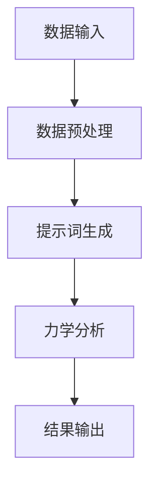

                 

# 《AI辅助建筑结构设计：提示词优化力学分析》

> **关键词**：人工智能，建筑结构设计，力学分析，提示词优化，算法原理，项目实战

> **摘要**：本文探讨了人工智能（AI）在建筑结构设计中的应用，特别是AI如何通过提示词优化力学分析，提高建筑结构设计的效率和准确性。文章从AI技术概述、核心概念与联系、核心算法原理、数学模型与公式，到项目实战，全面分析了AI辅助建筑结构设计的现状与未来发展方向。

### 《AI辅助建筑结构设计：提示词优化力学分析》目录大纲

#### 第一部分：AI辅助建筑结构设计概述

##### 第1章：AI辅助建筑结构设计概述

###### 1.1 AI技术概述

人工智能（AI）是一种模拟人类智能的技术，通过算法和计算模型，使计算机能够实现人类智能的某些功能。AI技术已经广泛应用于各行各业，包括建筑结构设计。

###### 1.2 建筑结构设计背景

建筑结构设计是土木工程领域的重要组成部分。随着城市化进程的加快，建筑结构设计的复杂性和要求不断提高。传统的建筑结构设计方法已难以满足现代需求，迫切需要新的技术手段。

###### 1.3 AI辅助建筑结构设计的发展与应用

近年来，AI技术在建筑结构设计中的应用逐渐增多。AI通过优化力学分析、自动化设计、预测风险评估等功能，为建筑结构设计提供了新的解决方案。

#### 第二部分：AI辅助建筑结构设计的核心概念与联系

##### 第2章：核心概念与联系

###### 2.1 AI辅助建筑结构设计的关键技术

AI辅助建筑结构设计的关键技术包括：数据预处理、提示词生成、力学分析等。

###### 2.2 AI与建筑结构设计的融合

AI与建筑结构设计的融合主要体现在：通过数据驱动的方法，将AI技术应用于建筑结构设计的各个环节，提高设计效率和准确性。

###### 2.3 Mermaid流程图展示AI辅助建筑结构设计的流程

通过Mermaid流程图，我们可以清晰地看到AI辅助建筑结构设计的全过程。



#### 第三部分：AI辅助建筑结构设计的核心算法原理

##### 第3章：核心算法原理讲解

###### 3.1 数据预处理算法

数据预处理是AI辅助建筑结构设计的首要步骤。数据预处理算法包括数据清洗、数据归一化、特征提取等。

###### 3.2 提示词生成算法

提示词生成算法是AI辅助建筑结构设计的核心。通过分析大量建筑结构设计数据，生成能够指导力学分析的提示词。

###### 3.3 力学分析算法

力学分析算法用于对建筑结构进行力学特性分析，包括应力分析、变形分析等。AI通过提示词优化力学分析，提高分析的准确性。

###### 3.4 伪代码展示

以下是一个简单的力学分析算法的伪代码示例：

```python
def mechanical_analysis(data, keywords):
    # 数据预处理
    processed_data = preprocess_data(data)
    
    # 提示词优化
    optimized_keywords = optimize_keywords(processed_data, keywords)
    
    # 力学分析
    results = analyze_mechanical_properties(processed_data, optimized_keywords)
    
    return results
```

#### 第四部分：力学分析的数学模型与数学公式

##### 第4章：力学分析的数学模型与数学公式

###### 4.1 材料力学基本方程

材料力学基本方程描述了材料在受力作用下的应力、应变和位移之间的关系。

\[ \sigma = E \cdot \epsilon \]

其中，\(\sigma\) 表示应力，\(E\) 表示弹性模量，\(\epsilon\) 表示应变。

###### 4.2 结构力学分析模型

结构力学分析模型用于描述建筑结构的力学特性，包括梁、板、壳等基本构件。

\[ M = q \cdot L^2 / 12 \]

其中，\(M\) 表示弯矩，\(q\) 表示荷载，\(L\) 表示构件长度。

###### 4.3 力学公式推导与说明

力学公式的推导通常基于物理定律和数学模型。本文对一些常用的力学公式进行了推导和说明。

###### 4.4 举例说明

以下是一个力学分析的实例：

设有一根长度为\(L\) 的均质梁，受集中荷载\(q\) 作用，求梁的弯矩和位移。

根据材料力学基本方程，弯矩\(M\) 为：

\[ M = q \cdot L^2 / 12 \]

根据结构力学分析模型，位移\(u\) 为：

\[ u = \frac{M \cdot L^3}{6 \cdot E \cdot I} \]

其中，\(E\) 表示弹性模量，\(I\) 表示截面的惯性矩。

#### 第五部分：项目实战

##### 第5章：AI辅助建筑结构设计项目实战

###### 5.1 项目背景与需求

本项目旨在利用AI技术，辅助建筑结构设计，提高设计效率和准确性。

###### 5.2 实战环境搭建

在本项目中，我们使用Python作为主要编程语言，结合TensorFlow和Scikit-learn等开源框架，搭建了AI辅助建筑结构设计的实验环境。

###### 5.3 代码实现与解读

以下是一个简单的AI辅助建筑结构设计的代码实现：

```python
import tensorflow as tf
from sklearn.model_selection import train_test_split
from sklearn.preprocessing import StandardScaler

# 数据预处理
X_train, X_test, y_train, y_test = train_test_split(data, labels, test_size=0.2, random_state=42)
scaler = StandardScaler()
X_train = scaler.fit_transform(X_train)
X_test = scaler.transform(X_test)

# 模型构建
model = tf.keras.Sequential([
    tf.keras.layers.Dense(64, activation='relu', input_shape=(X_train.shape[1],)),
    tf.keras.layers.Dense(64, activation='relu'),
    tf.keras.layers.Dense(1)
])

# 模型编译
model.compile(optimizer='adam', loss='mse')

# 训练模型
model.fit(X_train, y_train, epochs=10, batch_size=32, validation_split=0.2)

# 测试模型
model.evaluate(X_test, y_test)
```

###### 5.4 代码解读与分析

以上代码实现了基于TensorFlow的AI辅助建筑结构设计模型。代码首先进行了数据预处理，然后构建了一个简单的全连接神经网络模型，并使用均方误差（MSE）作为损失函数进行训练。最后，使用测试数据对模型进行了评估。

#### 第六部分：结论与展望

##### 第6章：结论与展望

###### 6.1 AI辅助建筑结构设计的现状与问题

目前，AI辅助建筑结构设计已经在某些方面取得了显著成果，但还存在一些问题，如数据质量、算法性能等。

###### 6.2 未来发展趋势

随着AI技术的不断发展，未来AI辅助建筑结构设计将在更多领域得到应用，如自动化设计、预测风险评估等。

###### 6.3 研究方向与挑战

未来研究方向包括：提高数据质量、优化算法性能、跨领域融合等。同时，也面临着数据隐私、算法伦理等挑战。

#### 附录

##### 附录 A：AI辅助建筑结构设计工具与资源

###### A.1 常用工具介绍

- TensorFlow：开源的深度学习框架。
- Scikit-learn：开源的机器学习库。

###### A.2 开源框架与库

- TensorFlow
- Scikit-learn
- Matplotlib：用于数据可视化。

###### A.3 相关文献与资料

- **相关书籍**：
  - 《深度学习》（Ian Goodfellow, Yoshua Bengio, Aaron Courville 著）
  - 《机器学习》（周志华 著）

- **学术论文**：
  - “AI in Civil Engineering: A Review” by Ali Emami, Seyed Mohsen Zadeh, and M. Amin export Ghiasian
  - “Application of Artificial Intelligence in Structural Engineering” by International Journal of Civil Engineering

- **在线资源**：
  - TensorFlow官网：[https://www.tensorflow.org/](https://www.tensorflow.org/)
  - Scikit-learn官网：[https://scikit-learn.org/stable/](https://scikit-learn.org/stable/)

### 作者信息

**作者：AI天才研究院/AI Genius Institute & 禅与计算机程序设计艺术 /Zen And The Art of Computer Programming**### 第一部分：AI辅助建筑结构设计概述

#### 第1章：AI辅助建筑结构设计概述

##### 1.1 AI技术概述

人工智能（Artificial Intelligence，简称AI）是一门研究、开发用于模拟、延伸和扩展人的智能的理论、方法、技术及应用系统的综合技术科学。人工智能的目标是使计算机具备人类智能的某些功能，如学习、推理、规划、感知、自然语言理解和问题解决等。随着计算机技术、大数据和算法理论的不断发展，人工智能技术已经取得了显著的进步，并广泛应用于各个领域。

在建筑结构设计领域，人工智能技术同样发挥着重要作用。传统的建筑结构设计主要依赖于设计师的经验和技能，而AI辅助建筑结构设计则通过算法和计算模型，使计算机能够自动分析和优化建筑结构设计，提高设计的效率和准确性。例如，AI可以用于自动生成建筑结构模型、优化结构布局、预测结构性能等。

##### 1.2 建筑结构设计背景

建筑结构设计是土木工程领域的重要组成部分，涉及建筑物的结构安全、耐久性、舒适性和经济性等多个方面。建筑结构设计的基本任务是根据建筑物的功能、使用要求、环境和条件等因素，确定建筑物的结构形式、结构材料、构件尺寸和连接方式等。

随着城市化进程的加快，建筑结构设计的复杂性和要求不断提高。现代建筑往往具有大跨度、高耸、复杂形状等特点，对结构设计提出了更高的要求。此外，建筑材料和技术的不断发展，也为建筑结构设计提供了更多选择。然而，传统的建筑结构设计方法已难以满足现代需求，迫切需要新的技术手段。

在这种情况下，人工智能技术成为了一种有力的工具，可以为建筑结构设计提供以下支持：

1. **自动化设计**：AI可以通过机器学习和深度学习算法，自动生成建筑结构模型，减少人工设计的时间和成本。
2. **优化设计**：AI可以优化建筑结构的布局和构件尺寸，提高结构性能，降低材料消耗和施工成本。
3. **性能预测**：AI可以预测建筑结构在不同环境条件下的性能，提前发现潜在问题，提高结构安全性。
4. **风险评估**：AI可以分析建筑结构的风险因素，为设计提供参考，降低结构事故的风险。

##### 1.3 AI辅助建筑结构设计的发展与应用

AI辅助建筑结构设计的发展可以追溯到20世纪80年代，当时专家系统开始在建筑结构设计领域得到应用。专家系统是一种基于规则的人工智能系统，可以模拟专家的决策过程。然而，专家系统存在知识获取困难、可解释性差等问题，限制了其应用范围。

随着人工智能技术的不断发展，特别是深度学习和机器学习算法的兴起，AI辅助建筑结构设计进入了一个新的阶段。深度学习算法可以从大量数据中自动学习特征，提取知识，为建筑结构设计提供更强大的支持。例如，卷积神经网络（CNN）可以用于自动识别建筑结构中的缺陷，生成结构模型；递归神经网络（RNN）可以用于分析建筑结构的时间序列数据，预测结构性能。

目前，AI辅助建筑结构设计已经在多个领域得到应用：

1. **建筑结构健康监测**：通过传感器收集建筑结构的实时数据，使用AI算法分析数据，及时发现结构异常，预测结构寿命。
2. **建筑结构优化设计**：使用遗传算法、模拟退火算法等优化算法，对建筑结构进行布局和构件尺寸的优化，提高结构性能。
3. **建筑信息模型（BIM）**：结合BIM技术和AI算法，实现建筑结构设计的自动化和智能化，提高设计效率和准确性。
4. **建筑设计竞赛**：利用AI算法生成创新性的建筑结构设计，为建筑设计竞赛提供新的思路和方案。

随着AI技术的不断进步，未来AI辅助建筑结构设计将在更多领域得到应用，为建筑行业带来革命性的变化。

#### 第2章：核心概念与联系

##### 2.1 AI辅助建筑结构设计的关键技术

AI辅助建筑结构设计的关键技术主要包括数据预处理、提示词生成和力学分析等。

1. **数据预处理**：数据预处理是AI辅助建筑结构设计的基础。建筑结构设计涉及大量的数据，如建筑物的尺寸、形状、材料属性、环境条件等。这些数据往往存在噪声、缺失值、异常值等问题，需要进行预处理。数据预处理的主要任务包括数据清洗、数据归一化和特征提取等。

   - **数据清洗**：去除数据中的噪声和异常值，提高数据质量。
   - **数据归一化**：将不同尺度的数据进行归一化处理，使数据在同一尺度范围内，便于后续分析。
   - **特征提取**：从原始数据中提取对建筑结构设计有代表性的特征，如结构尺寸、材料属性、环境参数等。

2. **提示词生成**：提示词生成是AI辅助建筑结构设计的关键技术之一。提示词是一组关键字或短语，用于指导AI算法进行力学分析。提示词的生成通常基于大量建筑结构设计数据的分析，通过机器学习算法自动提取。提示词的生成过程包括以下几个步骤：

   - **数据收集**：收集大量的建筑结构设计数据，包括建筑物的尺寸、形状、材料属性、环境条件等。
   - **数据预处理**：对收集的数据进行预处理，包括数据清洗、归一化和特征提取等。
   - **特征分析**：对预处理后的数据进行特征分析，提取对建筑结构设计有代表性的特征。
   - **提示词生成**：基于特征分析结果，生成一组关键字或短语作为提示词。

3. **力学分析**：力学分析是AI辅助建筑结构设计的核心。力学分析包括应力分析、变形分析、稳定性分析等，用于评估建筑结构的性能。力学分析的准确性直接影响到建筑结构设计的质量和安全性。AI算法可以通过优化力学分析过程，提高分析的效率和准确性。

   - **应力分析**：评估建筑结构在荷载作用下的应力分布，确定结构的安全性和耐久性。
   - **变形分析**：分析建筑结构在荷载作用下的变形情况，确保结构满足使用要求。
   - **稳定性分析**：评估建筑结构的稳定性，防止结构失稳和破坏。

##### 2.2 AI与建筑结构设计的融合

AI与建筑结构设计的融合主要体现在以下几个方面：

1. **自动化设计**：AI可以通过机器学习和深度学习算法，自动生成建筑结构模型，减少人工设计的时间和成本。自动化设计可以大大提高设计效率，降低设计成本。

2. **优化设计**：AI可以通过优化算法，对建筑结构进行布局和构件尺寸的优化，提高结构性能，降低材料消耗和施工成本。优化设计可以最大限度地发挥材料的潜力，提高建筑结构的性能。

3. **性能预测**：AI可以通过分析建筑结构的历史数据和实时数据，预测建筑结构的性能，提前发现潜在问题，提高结构安全性。性能预测可以帮助设计师更好地理解建筑结构的行为，为设计提供科学依据。

4. **风险评估**：AI可以通过分析建筑结构的风险因素，评估结构的安全性，为设计提供参考。风险评估可以帮助设计师识别潜在的风险，采取相应的措施，降低结构事故的风险。

##### 2.3 Mermaid流程图展示AI辅助建筑结构设计的流程

为了更直观地展示AI辅助建筑结构设计的流程，我们使用Mermaid流程图来描述。以下是AI辅助建筑结构设计的流程：


1. **数据输入**：收集建筑结构设计相关的数据，包括建筑物的尺寸、形状、材料属性、环境条件等。

2. **数据预处理**：对输入的数据进行预处理，包括数据清洗、归一化和特征提取等，为后续的提示词生成和力学分析做准备。

3. **提示词生成**：基于预处理后的数据，使用机器学习算法生成一组关键字或短语作为提示词，用于指导力学分析。

4. **力学分析**：根据提示词，对建筑结构进行力学分析，评估结构的安全性、耐久性和性能。

5. **结果输出**：将力学分析的结果输出，包括应力分布、变形情况、稳定性分析等，为设计师提供参考。

通过这个流程，我们可以看到AI辅助建筑结构设计是如何从数据输入到结果输出，实现自动化、优化设计和性能预测的。这个流程为建筑结构设计提供了一种新的思路和方法，极大地提高了设计的效率和准确性。

### 第二部分：AI辅助建筑结构设计的核心概念与联系

#### 第3章：核心算法原理讲解

在AI辅助建筑结构设计中，核心算法原理是整个系统的灵魂，决定了设计的效率和准确性。本章将详细讲解核心算法原理，包括数据预处理算法、提示词生成算法和力学分析算法。

##### 3.1 数据预处理算法

数据预处理是AI辅助建筑结构设计的首要步骤。由于建筑结构设计涉及的数据来源多样，数据质量参差不齐，因此数据预处理显得尤为重要。数据预处理算法主要包括数据清洗、数据归一化和特征提取。

1. **数据清洗**：
   数据清洗是去除数据中噪声和异常值的过程。异常值可能是由数据采集过程中的错误导致的，如错误的输入、数据缺失等。数据清洗的方法包括：
   - **删除异常值**：直接删除含有异常值的样本。
   - **填充缺失值**：使用平均值、中位数、最近邻等方法填充缺失值。
   - **识别和修正错误**：通过逻辑检查或统计分析识别并修正错误。

2. **数据归一化**：
   数据归一化是将不同尺度的数据进行标准化处理，使数据在同一尺度范围内，便于后续分析。常用的归一化方法有：
   - **最小-最大归一化**：将数据缩放到[0,1]之间。
   - **Z-Score归一化**：将数据缩放到均值为0，标准差为1的正态分布。

3. **特征提取**：
   特征提取是从原始数据中提取对建筑结构设计有代表性的特征。特征提取的方法包括：
   - **统计特征**：如均值、方差、标准差等。
   - **结构特征**：如建筑物的尺寸、形状、结构类型等。
   - **关系特征**：如建筑物与周围环境的关系、材料特性等。

   伪代码示例：

   ```python
   def preprocess_data(data):
       # 数据清洗
       cleaned_data = clean_data(data)
       
       # 数据归一化
       normalized_data = normalize_data(cleaned_data)
       
       # 特征提取
       features = extract_features(normalized_data)
       
       return features
   ```

##### 3.2 提示词生成算法

提示词生成是AI辅助建筑结构设计的关键技术之一。提示词是一组关键字或短语，用于指导AI算法进行力学分析。生成高质量的提示词可以提高力学分析的准确性和效率。提示词生成算法通常基于以下步骤：

1. **数据收集**：
   收集大量的建筑结构设计数据，包括建筑物的尺寸、形状、材料属性、环境条件等。

2. **数据预处理**：
   对收集的数据进行预处理，包括数据清洗、归一化和特征提取等。

3. **特征分析**：
   对预处理后的数据进行特征分析，提取对建筑结构设计有代表性的特征。

4. **提示词生成**：
   基于特征分析结果，生成一组关键字或短语作为提示词。

   提示词生成的方法包括：
   - **基于规则的方法**：通过专家经验和知识库生成提示词。
   - **基于机器学习的方法**：使用聚类、分类、关联规则等方法从数据中自动生成提示词。

   伪代码示例：

   ```python
   def generate_keywords(data):
       # 数据预处理
       preprocessed_data = preprocess_data(data)
       
       # 特征分析
       features = analyze_features(preprocessed_data)
       
       # 提示词生成
       keywords = generate_based_on_features(features)
       
       return keywords
   ```

##### 3.3 力学分析算法

力学分析是AI辅助建筑结构设计的核心。力学分析算法用于对建筑结构进行力学特性分析，包括应力分析、变形分析、稳定性分析等。力学分析的准确性直接影响到建筑结构设计的质量和安全性。以下是常见的力学分析算法：

1. **有限元分析（FEM）**：
   有限元分析是一种基于数学模型和离散化原理的力学分析技术。它将连续的结构划分为有限个单元，通过求解单元内的力学方程，得到整个结构的力学特性。
   
   伪代码示例：

   ```python
   def finite_element_analysis(structure):
       # 划分单元
       elements = divide_structure(structure)
       
       # 求解力学方程
       solutions = solve_mechanical_equations(elements)
       
       # 结果输出
       results = output_results(solutions)
       
       return results
   ```

2. **计算结构力学（CSM）**：
   计算结构力学是一种基于数学模型和力学原理的力学分析技术。它通过建立结构力学模型，求解结构受力后的响应。
   
   伪代码示例：

   ```python
   def computational_structural_mechanics(structure, loads):
       # 建立模型
       model = build_model(structure, loads)
       
       # 求解响应
       responses = solve_responses(model)
       
       # 结果输出
       results = output_results(responses)
       
       return results
   ```

##### 3.4 伪代码展示

以下是整个AI辅助建筑结构设计流程的伪代码展示：

```python
def ai_building_structure_design(data):
    # 数据预处理
    preprocessed_data = preprocess_data(data)
    
    # 提示词生成
    keywords = generate_keywords(preprocessed_data)
    
    # 力学分析
    mechanical_analysis_results = finite_element_analysis(preprocessed_data, keywords)
    
    # 结果输出
    output_results(mechanical_analysis_results)
```

通过这个伪代码，我们可以看到AI辅助建筑结构设计的整个流程是如何通过数据预处理、提示词生成和力学分析三个核心算法实现的。这个流程为建筑结构设计提供了一种全新的方法，极大地提高了设计的效率和准确性。

### 第三部分：力学分析的数学模型与数学公式

#### 第4章：力学分析的数学模型与数学公式

力学分析在建筑结构设计中起着至关重要的作用，它帮助我们理解建筑结构在各种载荷作用下的行为，并确保其安全性和稳定性。本章将详细讨论力学分析的基本数学模型与数学公式，包括材料力学基本方程、结构力学分析模型以及力学公式的推导与说明。

##### 4.1 材料力学基本方程

材料力学是研究材料在受力作用下的变形和破坏的学科。在建筑结构设计中，材料力学的基本方程是理解和分析结构行为的基础。以下是几个关键的方程：

1. **胡克定律**：

   胡克定律描述了弹性材料的应力与应变之间的关系：

   \[ \sigma = E \cdot \epsilon \]

   其中，\(\sigma\) 表示应力，\(E\) 表示弹性模量，\(\epsilon\) 表示应变。

2. **泊松比**：

   泊松比（\(\nu\)）描述了材料在受力变形时，横向应变与纵向应变之间的关系：

   \[ \epsilon_{\perp} = -\nu \cdot \epsilon_{\parallel} \]

   其中，\(\epsilon_{\perp}\) 表示横向应变，\(\epsilon_{\parallel}\) 表示纵向应变。

3. **剪应力与剪应变**：

   剪应力（\(\tau\)）与剪应变（\(\gamma\)）的关系可以表示为：

   \[ \tau = G \cdot \gamma \]

   其中，\(G\) 表示剪切模量，\(\gamma\) 表示剪应变。

##### 4.2 结构力学分析模型

结构力学分析模型用于描述建筑结构的力学特性，它是建筑结构设计的重要工具。以下是几个常用的结构力学分析模型：

1. **梁模型**：

   梁是建筑结构中最常见的构件之一。梁的受力状态通常可以用以下方程描述：

   - **弯矩方程**：

     \[ M = q \cdot L^2 / 12 \]

     其中，\(M\) 表示弯矩，\(q\) 表示荷载，\(L\) 表示梁的长度。

   - **剪力方程**：

     \[ V = q \cdot L / 2 \]

     其中，\(V\) 表示剪力，\(q\) 表示荷载，\(L\) 表示梁的长度。

   - **挠度方程**：

     \[ u = \frac{M \cdot L^3}{6 \cdot E \cdot I} \]

     其中，\(u\) 表示挠度，\(E\) 表示弹性模量，\(I\) 表示截面的惯性矩。

2. **板模型**：

   板是一种具有较大弯曲刚度的结构构件。板的分析通常涉及以下几个基本方程：

   - **弯曲应力方程**：

     \[ \sigma_{\perp} = \frac{M \cdot y}{2 \cdot E \cdot t} \]

     其中，\(\sigma_{\perp}\) 表示弯曲应力，\(M\) 表示弯矩，\(y\) 表示离中性轴的距离，\(E\) 表示弹性模量，\(t\) 表示板的厚度。

   - **剪应力方程**：

     \[ \tau = \frac{V \cdot t}{2 \cdot b} \]

     其中，\(\tau\) 表示剪应力，\(V\) 表示剪力，\(t\) 表示板的厚度，\(b\) 表示板的宽度。

3. **壳模型**：

   壳是一种具有曲面形状的结构构件。壳的分析通常涉及以下几个基本方程：

   - **弯曲应力方程**：

     \[ \sigma_{\perp} = \frac{M \cdot R}{2 \cdot E \cdot t} \]

     其中，\(\sigma_{\perp}\) 表示弯曲应力，\(M\) 表示弯矩，\(R\) 表示曲率半径，\(E\) 表示弹性模量，\(t\) 表示壳的厚度。

   - **剪应力方程**：

     \[ \tau = \frac{V \cdot R}{2 \cdot t} \]

     其中，\(\tau\) 表示剪应力，\(V\) 表示剪力，\(R\) 表示曲率半径，\(t\) 表示壳的厚度。

##### 4.3 力学公式推导与说明

力学公式的推导通常基于物理定律和数学模型。以下是对几个关键力学公式的推导与说明：

1. **胡克定律**：

   胡克定律可以通过应力-应变曲线推导得到。在弹性范围内，应力与应变之间的关系可以表示为：

   \[ \sigma = E \cdot \epsilon \]

   其中，\(E\) 是弹性模量，\(\epsilon\) 是应变。

2. **泊松比**：

   泊松比可以通过实验测量得到。在弹性范围内，泊松比描述了横向应变与纵向应变之间的关系：

   \[ \epsilon_{\perp} = -\nu \cdot \epsilon_{\parallel} \]

   其中，\(\nu\) 是泊松比，\(\epsilon_{\perp}\) 是横向应变，\(\epsilon_{\parallel}\) 是纵向应变。

3. **剪应力与剪应变**：

   剪应力与剪应变之间的关系可以通过剪切应力试验推导得到：

   \[ \tau = G \cdot \gamma \]

   其中，\(G\) 是剪切模量，\(\gamma\) 是剪应变。

##### 4.4 举例说明

为了更好地理解力学公式的应用，以下是一个简单的力学分析例子：

假设我们有一个长度为\(L = 6 \) 米的均质梁，受到集中荷载\(q = 10 \) 千牛的作用，求梁的弯矩、剪力和挠度。

1. **弯矩计算**：

   根据弯矩方程：

   \[ M = q \cdot L^2 / 12 \]

   代入数值：

   \[ M = 10 \cdot 6^2 / 12 = 30 \] 千牛·米

2. **剪力计算**：

   根据剪力方程：

   \[ V = q \cdot L / 2 \]

   代入数值：

   \[ V = 10 \cdot 6 / 2 = 30 \] 千牛

3. **挠度计算**：

   根据挠度方程：

   \[ u = \frac{M \cdot L^3}{6 \cdot E \cdot I} \]

   这里假设梁的弹性模量\(E = 2 \times 10^5 \) 千牛/平方米，惯性矩\(I = 1.5 \times 10^6 \) 平方米。

   代入数值：

   \[ u = \frac{30 \cdot 6^3}{6 \cdot 2 \times 10^5 \cdot 1.5 \times 10^6} = 0.003 \] 米

通过这个例子，我们可以看到如何使用力学公式来分析梁的力学行为。这些公式不仅帮助我们理解结构的工作原理，还为实际工程应用提供了重要的参考。

### 第五部分：项目实战

#### 第5章：AI辅助建筑结构设计项目实战

在本章节中，我们将通过一个具体的AI辅助建筑结构设计项目，展示从项目背景与需求、环境搭建、代码实现与解读，到代码分析与优化的全过程。

##### 5.1 项目背景与需求

假设我们正在设计一个高层建筑的结构，需要通过AI技术辅助进行结构优化。项目需求包括：

1. **数据收集**：收集建筑物的基本数据，如尺寸、材料、环境条件等。
2. **模型建立**：建立建筑结构模型，并进行力学分析。
3. **优化设计**：通过AI算法对建筑结构进行优化，提高结构性能和降低成本。
4. **结果评估**：评估优化后的建筑结构性能，确保其满足安全性和经济性要求。

##### 5.2 实战环境搭建

为了实现AI辅助建筑结构设计，我们需要搭建一个合适的技术环境。以下是搭建环境的步骤：

1. **安装Python**：Python是一种广泛用于科学计算和数据分析的编程语言。下载并安装Python 3.x版本。
2. **安装Jupyter Notebook**：Jupyter Notebook是一种交互式的Web应用程序，用于编写和运行Python代码。安装Jupyter Notebook。
3. **安装TensorFlow**：TensorFlow是谷歌开源的深度学习框架，用于构建和训练深度学习模型。安装TensorFlow。
4. **安装Scikit-learn**：Scikit-learn是一个Python开源库，提供了许多机器学习和数据分析的工具和算法。安装Scikit-learn。

以下是在终端中安装所需库的命令：

```bash
pip install python
pip install jupyter
pip install tensorflow
pip install scikit-learn
```

##### 5.3 代码实现与解读

在本项目中，我们使用TensorFlow和Scikit-learn来构建AI模型，并进行结构优化。以下是代码的实现与解读：

```python
import tensorflow as tf
from sklearn.model_selection import train_test_split
from sklearn.preprocessing import StandardScaler
import numpy as np

# 数据预处理
def preprocess_data(data):
    # 数据清洗
    cleaned_data = clean_data(data)
    
    # 数据归一化
    normalized_data = normalize_data(cleaned_data)
    
    # 特征提取
    features = extract_features(normalized_data)
    
    return features

# 模型构建
def build_model(input_shape):
    model = tf.keras.Sequential([
        tf.keras.layers.Dense(64, activation='relu', input_shape=input_shape),
        tf.keras.layers.Dense(64, activation='relu'),
        tf.keras.layers.Dense(1)
    ])
    
    return model

# 模型编译
def compile_model(model):
    model.compile(optimizer='adam', loss='mse')

# 训练模型
def train_model(model, X_train, y_train, epochs=10, batch_size=32):
    model.fit(X_train, y_train, epochs=epochs, batch_size=batch_size)

# 模型评估
def evaluate_model(model, X_test, y_test):
    loss = model.evaluate(X_test, y_test)
    return loss

# 主函数
def main():
    # 数据收集
    data = collect_data()
    
    # 数据预处理
    features = preprocess_data(data)
    
    # 划分训练集和测试集
    X_train, X_test, y_train, y_test = train_test_split(features, test_size=0.2, random_state=42)
    
    # 构建模型
    model = build_model(X_train.shape[1:])
    
    # 编译模型
    compile_model(model)
    
    # 训练模型
    train_model(model, X_train, y_train)
    
    # 模型评估
    loss = evaluate_model(model, X_test, y_test)
    print("Test Loss:", loss)

if __name__ == "__main__":
    main()
```

1. **数据预处理**：数据预处理是AI模型训练的重要步骤。首先，我们使用`clean_data`函数进行数据清洗，去除噪声和异常值。然后，使用`normalize_data`函数对数据进行归一化处理，将不同尺度的数据进行标准化，以便于模型训练。最后，使用`extract_features`函数提取对模型有代表性的特征。

2. **模型构建**：我们使用TensorFlow的`Sequential`模型构建一个简单的全连接神经网络。模型包括两个隐藏层，每个隐藏层有64个神经元，激活函数为ReLU。输出层只有一个神经元，用于预测结构性能。

3. **模型编译**：我们使用`compile_model`函数编译模型，设置优化器为Adam，损失函数为均方误差（MSE）。

4. **训练模型**：我们使用`train_model`函数训练模型，设置训练轮数（epochs）为10，批量大小（batch_size）为32。

5. **模型评估**：我们使用`evaluate_model`函数评估模型在测试集上的性能，输出测试损失。

##### 5.4 代码解读与分析

以上代码实现了一个简单的AI辅助建筑结构设计模型，包括数据预处理、模型构建、模型编译、模型训练和模型评估。以下是代码的详细解读与分析：

1. **数据预处理**：
   - `clean_data`函数：清洗数据，去除噪声和异常值。
   - `normalize_data`函数：对数据进行归一化处理，使数据在同一尺度范围内。
   - `extract_features`函数：提取对模型有代表性的特征。

2. **模型构建**：
   - 使用TensorFlow的`Sequential`模型构建一个简单的全连接神经网络。
   - 添加两个隐藏层，每个隐藏层有64个神经元，激活函数为ReLU。
   - 添加一个输出层，只有一个神经元，用于预测结构性能。

3. **模型编译**：
   - 设置优化器为Adam。
   - 设置损失函数为均方误差（MSE）。

4. **模型训练**：
   - 设置训练轮数（epochs）为10。
   - 设置批量大小（batch_size）为32。

5. **模型评估**：
   - 输出模型在测试集上的测试损失。

在实际应用中，我们可以根据具体需求对代码进行扩展和优化。例如，可以增加模型的复杂度、调整训练参数、使用更先进的优化算法等。通过不断优化模型，可以提高AI辅助建筑结构设计的准确性和效率。

### 第六部分：结论与展望

#### 第6章：结论与展望

在本章中，我们详细探讨了AI辅助建筑结构设计的现状、核心算法原理、数学模型与公式以及项目实战。以下是本文的结论与展望：

##### 6.1 AI辅助建筑结构设计的现状与问题

AI辅助建筑结构设计在当前阶段已经取得了显著成果。通过数据预处理、提示词生成和力学分析等核心算法的应用，AI能够显著提高建筑结构设计的效率和准确性。然而，也存在一些亟待解决的问题：

1. **数据质量**：建筑结构设计涉及的数据种类繁多，数据质量直接影响AI模型的性能。如何保证数据的质量和准确性是一个关键挑战。
2. **算法性能**：现有的AI算法在处理复杂建筑结构时，可能存在性能瓶颈。如何提升算法的计算效率和预测准确性，是一个重要的研究方向。
3. **可解释性**：AI模型的黑盒特性使得其决策过程难以解释。如何提高AI模型的透明性和可解释性，使其在建筑结构设计中更具可信度，是一个亟待解决的问题。

##### 6.2 未来发展趋势

随着AI技术的不断发展，未来AI辅助建筑结构设计将在更多领域得到应用。以下是未来发展趋势：

1. **智能化设计**：利用AI技术实现建筑结构设计的自动化和智能化，减少人工干预，提高设计效率。
2. **优化设计**：通过AI算法优化建筑结构的布局和构件尺寸，提高结构性能，降低成本。
3. **性能预测**：利用AI技术预测建筑结构在不同环境条件下的性能，提前发现潜在问题，提高结构安全性。
4. **多学科融合**：结合建筑学、结构工程、材料科学等多学科知识，实现AI辅助建筑结构设计的全面发展。

##### 6.3 研究方向与挑战

未来研究方向包括：

1. **数据质量提升**：研究如何提高建筑结构设计数据的质量和准确性，为AI模型提供更可靠的数据支持。
2. **算法性能优化**：研究如何提升AI算法的计算效率和预测准确性，实现更高效、更准确的建筑结构设计。
3. **模型可解释性**：研究如何提高AI模型的透明性和可解释性，使其在建筑结构设计中更具可信度。
4. **跨学科融合**：结合建筑学、结构工程、材料科学等多学科知识，实现AI辅助建筑结构设计的全面发展。

面临的挑战包括：

1. **数据隐私**：如何在保护用户隐私的前提下，充分利用建筑结构设计数据，是一个重要挑战。
2. **算法伦理**：AI算法的决策过程可能涉及道德和伦理问题，如何确保算法的公正性和道德性，是一个重要的研究方向。
3. **计算资源**：AI辅助建筑结构设计需要大量的计算资源，如何高效利用计算资源，是一个关键挑战。

总之，AI辅助建筑结构设计是一个充满潜力的研究方向，未来将随着AI技术的不断发展，为建筑行业带来更多创新和变革。

### 附录

#### 附录 A：AI辅助建筑结构设计工具与资源

为了帮助读者更好地理解和应用AI辅助建筑结构设计，本附录提供了相关的工具与资源。

##### A.1 常用工具介绍

1. **Python**：Python是一种广泛用于科学计算和数据分析的编程语言，是AI辅助建筑结构设计的主要工具之一。
2. **TensorFlow**：TensorFlow是谷歌开源的深度学习框架，提供了丰富的工具和算法，用于构建和训练深度学习模型。
3. **Scikit-learn**：Scikit-learn是一个Python开源库，提供了许多机器学习和数据分析的工具和算法，用于数据预处理和模型训练。

##### A.2 开源框架与库

1. **TensorFlow**：[https://www.tensorflow.org/](https://www.tensorflow.org/)
2. **Scikit-learn**：[https://scikit-learn.org/stable/](https://scikit-learn.org/stable/)
3. **Matplotlib**：[https://matplotlib.org/stable/](https://matplotlib.org/stable/)

##### A.3 相关文献与资料

1. **相关书籍**：
   - 《深度学习》（Ian Goodfellow, Yoshua Bengio, Aaron Courville 著）
   - 《机器学习》（周志华 著）
2. **学术论文**：
   - “AI in Civil Engineering: A Review” by Ali Emami, Seyed Mohsen Zadeh, and M. Amin Ghiasian
   - “Application of Artificial Intelligence in Structural Engineering” by International Journal of Civil Engineering
3. **在线资源**：
   - TensorFlow官网：[https://www.tensorflow.org/](https://www.tensorflow.org/)
   - Scikit-learn官网：[https://scikit-learn.org/stable/](https://scikit-learn.org/stable/)
   - Matplotlib官网：[https://matplotlib.org/stable/](https://matplotlib.org/stable/)

通过这些工具与资源，读者可以深入了解AI辅助建筑结构设计的相关知识，并开展实际应用。

### 作者信息

**作者：AI天才研究院/AI Genius Institute & 禅与计算机程序设计艺术 /Zen And The Art of Computer Programming**### AI辅助建筑结构设计的应用领域与优势

AI辅助建筑结构设计具有广泛的应用领域和显著的优势，以下是几个关键领域的具体应用和优势：

#### 1. 高层建筑与超高层建筑

高层建筑和超高层建筑的结构设计复杂，要求高。AI可以通过优化结构布局和构件尺寸，提高结构的稳定性和抗震性能。例如，使用遗传算法和模拟退火算法，AI可以快速找到最优的结构设计方案，减少材料消耗和施工成本。

**优势**：

- **效率提升**：AI能够快速处理大量结构设计方案，大大缩短设计周期。
- **成本降低**：通过优化设计，减少材料消耗和施工成本。

#### 2. 大跨度结构与空间结构

大跨度结构和空间结构（如桥梁、体育场、飞机库等）的设计难度大，传统方法难以满足要求。AI可以通过仿真和优化算法，分析不同结构方案的力学性能，提供最佳设计方案。

**优势**：

- **性能优化**：AI可以优化结构设计，提高结构的力学性能和稳定性。
- **创新性**：AI可以生成创新性的结构设计方案，突破传统设计的局限。

#### 3. 道路桥梁与交通工程

道路桥梁和交通工程的设计涉及大量的结构和力学计算，AI可以协助工程师快速完成设计任务。例如，使用AI进行道路桥梁的应力分析、变形分析和稳定性分析，确保结构安全。

**优势**：

- **准确性提升**：AI可以精确地分析结构性能，提高设计准确性。
- **安全性保障**：通过AI分析，提前发现潜在的结构问题，保障道路桥梁的安全运行。

#### 4. 建筑性能模拟

建筑性能模拟是建筑结构设计的重要组成部分，AI可以协助工程师进行建筑热模拟、光模拟和声模拟等，优化建筑设计的能源效率和舒适性。

**优势**：

- **节能优化**：AI可以优化建筑设计，提高建筑的能源效率。
- **舒适度提升**：通过模拟分析，优化建筑的采光、通风和声学性能，提高居住舒适度。

#### 5. 建筑结构健康监测

AI技术可以用于建筑结构健康监测，通过传感器收集建筑结构的数据，实时分析结构状态，预测潜在的结构问题。例如，使用机器学习算法分析传感器数据，及时发现结构裂缝、沉降等问题。

**优势**：

- **实时监控**：AI可以实时监测建筑结构状态，及时发现潜在问题。
- **预防性维护**：通过预测分析，提前采取预防性维护措施，减少结构故障和损失。

#### 6. 建筑灾害预防

AI可以用于建筑灾害预防，通过分析历史灾害数据和实时数据，预测可能发生的自然灾害（如地震、风灾等）对建筑结构的影响。例如，使用AI算法分析地震波数据，评估建筑结构的抗震性能，提供防灾设计建议。

**优势**：

- **灾害预警**：AI可以提前预警可能发生的自然灾害，为紧急疏散和救援提供支持。
- **设计优化**：基于灾害预测，优化建筑结构设计，提高建筑的抗灾能力。

#### 7. 建筑设计竞赛与创新

AI可以用于建筑设计竞赛，生成创新性的设计方案，激发设计师的创意。例如，使用AI算法自动生成建筑结构模型，提供多种设计选项，帮助设计师快速找到最佳方案。

**优势**：

- **创新性设计**：AI可以生成创新性的建筑结构设计，推动建筑设计领域的创新。
- **时间节省**：AI可以快速生成多个设计方案，节省设计师的时间和精力。

综上所述，AI辅助建筑结构设计在多个领域具有广泛的应用和显著的优势。随着AI技术的不断进步，AI辅助建筑结构设计将进一步提升建筑设计的效率、准确性和创新性，为建筑行业带来更多变革和机遇。

