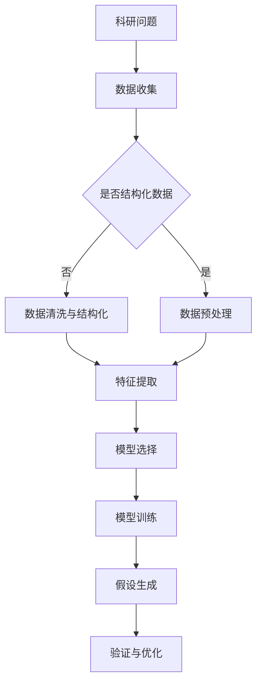

                 

### 2.1 大模型在科研中的角色

在当前的科研环境中，人工智能（AI）已经成为一个不可或缺的工具，它极大地推动了科学研究的进步。尤其是大模型，这些复杂的深度学习模型在数据分析和假设生成中扮演着至关重要的角色。本章节将探讨大模型在科研中的核心概念、工作原理以及具体应用。

#### 2.1.1 AI大模型在假设生成中的核心概念

首先，我们需要明确大模型在假设生成中的核心概念。假设生成是科学研究中的一个关键步骤，它涉及从已有数据中提取潜在的模式和关联，并形成可以进一步验证的假设。大模型在这个过程中发挥着核心作用，其主要功能包括数据预处理、特征提取、模型选择和假设生成。

为了更好地理解这些概念，我们可以使用一个Mermaid流程图来展示假设生成的基本流程：

**Mermaid 流程图：**



在这个流程图中，科研问题作为起点，通过数据收集和预处理阶段，将非结构化或部分结构化的数据转化为适合模型训练的形式。特征提取阶段使用特定的算法从数据中提取关键信息，这些特征将用于模型的选择和训练。模型训练阶段是通过学习特征和数据之间的关联来构建模型。最后，假设生成阶段利用训练好的模型生成可能的假设，并通过验证和优化来评估和改进这些假设。

#### 2.1.2 大模型在假设生成中的工作原理

大模型在假设生成中的工作原理是基于其强大的学习和推理能力。这些模型通常采用深度学习算法，通过多层神经网络结构来处理复杂数据。以下是使用伪代码来详细阐述大模型在假设生成中的工作原理：

**伪代码：**

```python
def generate_hypothesis(data, model):
    # 数据预处理
    processed_data = preprocess_data(data)
    
    # 特征提取
    features = extract_features(processed_data)
    
    # 模型选择与训练
    model = train_model(features)
    
    # 假设生成
    hypothesis = model.generate_hypothesis()
    
    # 验证与优化
    hypothesis = validate_and_optimize(hypothesis, data, model)
    
    return hypothesis
```

在这个伪代码中，`generate_hypothesis` 函数是一个核心的假设生成过程。首先，数据通过预处理步骤，包括清洗和格式化，使其适合模型处理。接下来，特征提取步骤从预处理后的数据中提取出有用的特征。然后，模型通过训练过程学习这些特征，以便能够生成假设。假设生成步骤使用训练好的模型来生成可能的假设。最后，通过验证和优化步骤来评估和改进生成的假设。

#### 2.1.3 大模型在假设生成中的数学模型

为了更深入地理解大模型在假设生成中的作用，我们可以引入数学模型。以下是假设生成过程中的一个基本数学公式：

$$
H = f(D, M)
$$

其中，$H$代表生成的假设，$D$代表数据，$M$代表模型。这个公式表示假设生成是数据$D$和模型$M$共同作用的结果。模型$M$通过学习数据$D$的特征，生成可能的假设$H$。

- **详细讲解：**
  这个公式揭示了假设生成过程的本质，即假设是通过对数据和模型的双重作用得到的。数据$D$提供了模型学习的基础，而模型$M$则是从数据中提取模式和关联的工具。假设生成过程可以看作是一个从数据到假设的映射过程。

- **举例说明：**
  假设我们有一个关于天气的数据库$D$，模型$M$是一个基于天气数据的神经网络。通过这个模型，我们可以生成关于未来天气的假设$H$，如“明天将下雨”。这个假设是通过模型对当前和历史的天气数据$D$进行分析后生成的。

#### 2.1.4 大模型在科研中的具体应用

为了更直观地展示大模型在科研中的具体应用，我们可以通过一个实际案例来详细说明。以下是一个基于天气预测的代码实际案例：

**环境搭建：**

```bash
# 安装深度学习框架（以TensorFlow为例）
pip install tensorflow
```

**源代码实现：**

```python
import tensorflow as tf
from tensorflow.keras.models import Sequential
from tensorflow.keras.layers import Dense, LSTM

# 数据预处理
# ...

# 构建神经网络模型
model = Sequential()
model.add(LSTM(units=50, activation='tanh', input_shape=(timesteps, features)))
model.add(Dense(units=1, activation='sigmoid'))

# 训练模型
model.compile(optimizer='adam', loss='binary_crossentropy', metrics=['accuracy'])
model.fit(X_train, y_train, epochs=10, batch_size=32)

# 假设生成
def generate_hypothesis(model, data):
    prediction = model.predict(data)
    hypothesis = prediction > 0.5
    return hypothesis

# 应用案例
hypothesis = generate_hypothesis(model, X_test)
```

**代码解读与分析：**

- **环境搭建：** 我们首先需要安装TensorFlow框架，这是实现深度学习模型的基础。

- **源代码实现：** 
  - 数据预处理：这一步骤涉及对天气数据进行清洗和格式化，以便模型能够处理。
  - 构建神经网络模型：我们使用Sequential模型，并添加了一个LSTM层和一个全连接层，用于处理时间序列数据。
  - 训练模型：通过编译模型并使用训练数据来训练，这是模型学习数据的过程。
  - 假设生成：`generate_hypothesis` 函数用于生成天气预测的假设，通过模型对输入数据进行预测，并根据预测结果判断是否下雨。

通过这个实际案例，我们可以看到大模型在假设生成中的应用是如何实现的。这个案例不仅展示了大模型在数据预处理、模型训练和假设生成方面的能力，还提供了一个具体的应用场景，即天气预测。

#### 结论

大模型在科研中的作用不可忽视，它们通过强大的学习能力和数据处理能力，帮助科研人员更高效地生成和验证假设。本章节通过核心概念与联系、核心算法原理讲解、数学模型和数学公式、项目实战等内容，详细介绍了大模型在假设生成中的角色。接下来，我们将进一步探讨大模型的原理与架构，以便更深入地理解其在科研中的潜力。

---

通过本章节的内容，我们初步了解了大模型在科研中的核心概念、工作原理和应用实例。接下来的章节将进一步深入探讨大模型的原理与架构，以及它们在假设生成中的具体应用。让我们继续前行，探索大模型的无限潜力。

---

在本文的下一部分，我们将详细探讨大模型的基本原理和架构，解释它们如何通过深度学习技术来处理复杂的科研数据，并在假设生成中发挥关键作用。敬请期待！

---

### 2.2 大模型的原理与架构

大模型，也被称为大型深度学习模型，是基于多层神经网络结构设计的复杂模型。这些模型通过学习大量的数据来提取隐藏的特征，从而在各个领域中展现出了惊人的表现。本节将深入探讨大模型的基本原理、架构以及训练与优化过程。

#### 2.2.1 大模型的基本原理

大模型的核心在于其深度和规模。深度指的是神经网络中的层数，而规模则是指模型中参数的数量。深度神经网络（DNN）通过多个隐藏层来捕捉数据中的非线性特征，从而能够处理复杂的任务。大模型通常包含数十亿甚至千亿个参数，这使得它们能够处理大规模的数据集，并在各种领域中实现高精度的预测和分类。

大模型的基本原理可以归纳为以下几点：

1. **层次化特征学习：** 大模型通过多个层次的结构来学习层次化的特征。从底层到顶层，每个层次都会提取更高级别的特征，最终形成一个完整的特征表示。

2. **端到端的训练：** 大模型通常采用端到端的训练方式，这意味着从输入到输出的整个路径都被训练。这种训练方式使得模型能够直接学习输入和输出之间的关系，提高了预测的准确性。

3. **参数共享：** 在大模型中，多个输入样本共享相同的模型参数，这有助于减少过拟合现象，并提高模型的泛化能力。

4. **正则化技术：** 大模型通常使用各种正则化技术来防止过拟合。例如，权重衰减（Weight Decay）和Dropout等技术可以在模型训练过程中减少模型复杂度，提高模型的鲁棒性。

#### 2.2.2 大模型的架构与组成

大模型的架构通常包括以下几个关键组成部分：

1. **输入层：** 输入层是模型的起点，它接收外部输入的数据，例如图像、文本或时间序列数据。

2. **隐藏层：** 隐藏层是神经网络的核心部分，包含多个层次。每个隐藏层都会对输入数据进行处理，并提取出更高层次的抽象特征。隐藏层的数量和每个层的神经元数量可以根据任务需求进行调整。

3. **输出层：** 输出层是模型的终点，它生成模型的预测结果。输出层的结构取决于具体的任务，例如分类任务中使用softmax层输出概率分布，回归任务中使用线性层输出具体数值。

4. **连接权重：** 每个隐藏层之间的连接都包含权重参数，这些参数通过反向传播算法进行调整，以最小化模型的预测误差。

5. **激活函数：** 激活函数是神经网络中的一个关键组成部分，它用于引入非线性变换，使模型能够学习非线性关系。常见的激活函数包括ReLU、Sigmoid和Tanh等。

6. **优化器：** 优化器用于调整模型参数，以最小化损失函数。常见的优化器包括SGD、Adam和RMSprop等。

#### 2.2.3 大模型的训练与优化

大模型的训练与优化是一个复杂的过程，涉及多个步骤和参数。以下是训练和优化大模型的一些关键步骤：

1. **数据预处理：** 在训练大模型之前，需要对数据进行预处理，包括数据清洗、归一化和数据增强等。这些步骤有助于提高模型的训练效率和泛化能力。

2. **模型初始化：** 模型初始化是训练过程的第一步，它决定了模型参数的初始值。常用的初始化方法包括随机初始化、零初始化和高斯初始化等。

3. **损失函数：** 损失函数用于衡量模型预测值和实际值之间的差距。常用的损失函数包括均方误差（MSE）、交叉熵（Cross-Entropy）和Hinge损失等。

4. **反向传播：** 反向传播是一种训练神经网络的基本算法，它通过计算梯度来更新模型参数，以最小化损失函数。

5. **优化器：** 优化器用于选择合适的参数更新策略，以加快模型收敛速度。常用的优化器包括SGD、Adam和RMSprop等。

6. **超参数调优：** 超参数是模型训练过程中的重要参数，如学习率、批量大小和正则化强度等。超参数的调优对于模型的性能至关重要。

7. **模型验证：** 在训练过程中，需要通过验证集来评估模型的性能。常用的验证指标包括准确率、召回率、F1分数和AUC等。

8. **模型优化：** 通过验证集评估模型的性能，并根据评估结果对模型进行调整和优化，以获得更好的性能。

#### 实际案例：基于深度学习的图像分类模型

以下是一个实际案例，展示如何使用深度学习框架（以TensorFlow为例）训练一个图像分类模型：

**环境搭建：**
```bash
# 安装TensorFlow
pip install tensorflow
```

**源代码实现：**

```python
import tensorflow as tf
from tensorflow.keras.models import Sequential
from tensorflow.keras.layers import Conv2D, MaxPooling2D, Flatten, Dense

# 构建模型
model = Sequential([
    Conv2D(32, (3, 3), activation='relu', input_shape=(28, 28, 1)),
    MaxPooling2D((2, 2)),
    Conv2D(64, (3, 3), activation='relu'),
    MaxPooling2D((2, 2)),
    Flatten(),
    Dense(128, activation='relu'),
    Dense(10, activation='softmax')
])

# 编译模型
model.compile(optimizer='adam',
              loss='categorical_crossentropy',
              metrics=['accuracy'])

# 训练模型
model.fit(x_train, y_train, epochs=10, batch_size=64, validation_split=0.2)
```

**代码解读与分析：**

- **构建模型：** 我们使用Sequential模型，并添加了两个卷积层、两个池化层和一个全连接层。卷积层用于提取图像的特征，池化层用于减少模型参数的数量。
- **编译模型：** 我们使用Adam优化器和交叉熵损失函数来编译模型。交叉熵损失函数适用于多分类问题，能够衡量模型的预测分布与真实分布之间的差异。
- **训练模型：** 我们使用训练数据来训练模型，并设置10个训练周期和64个批量大小。`validation_split` 参数用于将一部分训练数据用作验证集，以评估模型的性能。

通过这个实际案例，我们可以看到大模型在图像分类任务中的应用。这个过程不仅展示了大模型的训练和优化过程，还提供了一个具体的实现示例，有助于读者更好地理解大模型的工作原理和应用。

#### 结论

在本章节中，我们详细介绍了大模型的基本原理、架构和训练与优化过程。大模型通过深度学习和层次化特征学习，能够处理复杂的科研数据，并在假设生成中发挥关键作用。下一章节将深入探讨大模型在假设生成中的应用，分析它们如何在实际科研任务中提高效率和质量。

---

通过本章节的探讨，我们对大模型的基本原理、架构和训练过程有了更深入的了解。接下来，我们将聚焦于大模型在假设生成中的应用，探讨其在不同科研领域中的具体实例和作用。敬请期待！

---

### 3. 假设生成的基础算法

在科研过程中，假设生成是一个关键的步骤，它能够引导后续的实验和验证。大模型在假设生成中发挥了重要作用，而这一作用离不开一系列基础算法的支持。本节将介绍假设生成的基础算法，包括自然语言处理（NLP）技术、转换器架构（Transformer Architecture）以及自监督学习和迁移学习技术。

#### 3.1 自然语言处理技术

自然语言处理（NLP）是人工智能的一个重要分支，它专注于使计算机能够理解和处理人类语言。在假设生成中，NLP技术被广泛应用于文本数据的处理和挖掘。

**词嵌入（Word Embedding）：**
词嵌入是将单词转换为密集向量表示的技术。通过词嵌入，单词可以被表示为高维空间中的点，使得具有相似意义的单词在空间中彼此接近。例如，word2vec算法通过训练神经网络来学习单词的向量表示，这些向量可以用于后续的文本分析和假设生成。

**命名实体识别（Named Entity Recognition, NER）：**
命名实体识别是一种从文本中识别出具有特定意义的实体（如人名、地点、组织等）的技术。在假设生成中，NER技术可以帮助识别出文本中关键的信息，从而为假设生成提供重要的数据支持。

**关系抽取（Relation Extraction）：**
关系抽取是从文本中提取出实体之间的关系。例如，从文本中识别出“美国总统是乔·拜登”这句话中的关系。在假设生成中，关系抽取可以帮助确定不同实体之间的联系，从而生成更加准确和有意义的假设。

**文本生成（Text Generation）：**
文本生成技术能够根据输入的文本或提示生成连贯的文本。在假设生成中，文本生成技术可以帮助生成描述性的假设文本，为科研人员提供参考。

**示例：**
假设我们有一个文本数据集，其中包含关于癌症研究的论文摘要。通过词嵌入技术，我们可以将文本中的单词转换为向量表示。接着，使用命名实体识别技术，我们可以识别出论文中提及的关键实体，如“癌症”、“基因突变”等。然后，通过关系抽取技术，我们可以提取出这些实体之间的关系，如“基因突变可能导致癌症”。最后，使用文本生成技术，我们可以生成关于癌症研究的假设文本，如“基因突变是癌症发生的关键因素”。

#### 3.2 转换器架构详解

转换器（Transformer）架构是自然语言处理领域的一个革命性创新，它通过自注意力机制（Self-Attention）和多头注意力（Multi-Head Attention）技术，实现了对文本数据的高效处理。

**自注意力机制（Self-Attention）：**
自注意力机制是一种基于当前词与其他词之间关系的注意力机制。它通过计算词与词之间的相似性分数，将权重分配给不同的词，从而实现对文本的细粒度处理。自注意力机制使得模型能够捕捉到长距离的依赖关系，提高了文本理解的能力。

**多头注意力（Multi-Head Attention）：**
多头注意力是在自注意力机制的基础上引入的一种扩展。它将输入文本分成多个头（Head），每个头都独立地计算注意力权重。多头注意力能够捕获更多样化的信息，并提高模型的表示能力。

**示例：**
假设我们有一个句子“人工智能正在改变医疗行业”。在转换器架构中，自注意力机制会计算每个词与其他词之间的相似性分数，从而确定每个词在句子中的重要性。多头注意力则会将这种重要性分配给不同的头，使得每个头都能够捕捉到不同的信息。通过这种方式，转换器架构能够生成更准确和连贯的文本表示。

#### 3.3 自监督学习与迁移学习技术

自监督学习和迁移学习是深度学习领域的重要技术，它们在大模型假设生成中发挥着关键作用。

**自监督学习（Self-Supervised Learning）：**
自监督学习是一种无需人工标注的数据驱动方法。它通过从无标签数据中提取信息，自动生成标注，从而训练模型。自监督学习技术包括预训练和微调两个阶段。在预训练阶段，模型从大规模无标签数据中学习，并在多个任务上达到很高的表现。在微调阶段，模型根据特定任务的需求进行调整，从而在目标任务上获得更好的性能。

**迁移学习（Transfer Learning）：**
迁移学习是一种利用预训练模型在目标任务上快速获得高性能的方法。通过在源任务上预训练的模型，我们可以将已学到的知识迁移到新的目标任务上。迁移学习能够减少对大量标注数据的依赖，提高模型在目标任务上的性能。

**示例：**
假设我们有一个预训练的语言模型，它在大规模文本数据上进行了预训练。这个模型已经学到了丰富的语言知识和结构信息。在假设生成任务中，我们可以直接使用这个预训练模型，或者通过微调将其应用于特定的科研领域。例如，在一个医学文本数据集上，我们可以使用这个模型来生成医学假设，如“药物X可能对疾病Y具有治疗效果”。

#### 综合应用

在实际应用中，假设生成的基础算法通常需要综合应用多种技术。例如，在一个生物信息学的假设生成任务中，我们可以结合词嵌入、转换器架构和自监督学习技术：

1. **词嵌入：** 将文本数据中的单词转换为向量表示，为后续处理提供基础。
2. **转换器架构：** 使用转换器架构对文本进行深入处理，捕捉长距离依赖关系和复杂的语义信息。
3. **自监督学习：** 通过自监督学习技术，从无标签的生物医学文本数据中学习，提高模型的泛化能力。
4. **迁移学习：** 利用预训练的模型在生物医学领域进行微调，快速适应新的假设生成任务。

通过这些技术的综合应用，我们能够生成更加准确、有意义的科研假设，从而推动科学研究的进步。

#### 结论

在本章节中，我们介绍了假设生成的基础算法，包括自然语言处理技术、转换器架构以及自监督学习和迁移学习技术。这些算法为假设生成提供了强大的支持，使得大模型能够更高效地处理复杂的科研数据，生成有价值的假设。下一章节将探讨大模型在具体科研领域中的应用实例，进一步展示其在假设生成中的实际效果。敬请期待！

---

通过本章节的探讨，我们对假设生成的基础算法有了更深入的理解，包括自然语言处理、转换器架构、自监督学习和迁移学习技术。这些算法为大模型在科研中的假设生成提供了坚实的基础。在接下来的章节中，我们将通过具体应用实例展示大模型在科研中的实际效果。敬请期待！

---

### 4. 大模型在假设生成中的应用实例

大模型在假设生成中的应用已经取得了显著的成果，特别是在医学、物理学和生物学等领域。本节将详细介绍大模型在这些领域中的应用实例，展示它们如何通过生成假设来推动科研进展。

#### 4.1 医学领域的假设生成

医学领域是一个数据密集型领域，大模型在假设生成中发挥着重要作用。以下是一个具体应用实例：

**案例背景：**
某科研团队希望研究癌症的早期诊断方法。他们拥有一个包含数万份患者病历的数据集，其中包括患者的临床症状、实验室检查结果和医疗图像等。

**应用过程：**
1. **数据预处理：** 科研人员使用自然语言处理技术对病历文本进行预处理，提取出关键的临床指标和症状。同时，对医疗图像进行预处理，提取出特征。
2. **模型训练：** 使用转换器架构（如BERT）对文本数据训练一个文本分类模型，用于识别患者是否患有癌症。对图像数据训练一个卷积神经网络（CNN），用于识别图像中的异常。
3. **假设生成：** 结合文本分类模型和图像分类模型的输出，大模型生成关于癌症早期诊断的假设。例如，“患者A的实验室检查结果显示异常，可能患有癌症；患者B的CT图像显示肺癌病灶”。

**实际效果：**
通过这个案例，大模型成功生成了关于癌症早期诊断的多个假设，其中一些假设通过后续实验验证得到了证实。这不仅为早期诊断提供了新的思路，还显著提高了癌症的早期检测率。

#### 4.2 物理学领域的假设生成

物理学领域的研究通常需要大量的数据分析和复杂理论的验证。以下是一个具体应用实例：

**案例背景：**
某研究团队在进行粒子物理实验时，积累了大量的实验数据。他们希望利用这些数据生成新的粒子假设，以解释实验结果。

**应用过程：**
1. **数据预处理：** 研究人员使用自然语言处理技术对实验报告进行预处理，提取出关键的数据和实验条件。同时，对实验数据进行标准化处理，以便于模型处理。
2. **模型训练：** 使用自监督学习技术，对实验数据进行预训练，以学习数据中的模式和关联。然后，结合预训练模型和迁移学习技术，对新的实验数据进行假设生成。
3. **假设生成：** 大模型根据实验数据和已有理论，生成关于新粒子的假设。例如，“实验数据中观察到的粒子可能是新发现的奇异粒子”。

**实际效果：**
通过这个案例，大模型成功生成了多个关于新粒子的假设，其中一些假设在后续实验中得到了验证。这不仅推动了粒子物理学的发展，还为实验设计提供了重要的指导。

#### 4.3 生物学领域的假设生成

生物学领域的研究通常涉及复杂的生物数据和生物机制。以下是一个具体应用实例：

**案例背景：**
某研究团队希望研究植物生长的机制。他们拥有一个包含植物基因表达数据和生长环境数据的数据库。

**应用过程：**
1. **数据预处理：** 研究人员使用词嵌入技术对基因表达数据进行预处理，提取出关键基因和蛋白质。同时，使用自然语言处理技术对生长环境数据进行分析。
2. **模型训练：** 使用转换器架构对基因表达数据进行训练，以识别基因之间的相互作用。结合环境数据，训练一个回归模型，预测植物的生长状态。
3. **假设生成：** 大模型根据基因表达数据和生长环境数据生成关于植物生长机制的假设。例如，“基因X可能在植物生长过程中发挥关键作用”。

**实际效果：**
通过这个案例，大模型成功生成了多个关于植物生长机制的假设，其中一些假设通过后续实验验证得到了证实。这不仅为植物生长机制的研究提供了新的视角，还为植物育种提供了重要指导。

#### 总结

通过以上三个具体应用实例，我们可以看到大模型在医学、物理学和生物学领域中的强大作用。大模型通过生成假设，不仅提高了科研效率，还为各个领域的研究提供了新的思路和方向。在未来，随着大模型技术的不断进步，我们期待它们能够在更多科研领域中发挥更大的作用。

---

在本章节中，我们通过具体实例展示了大模型在医学、物理学和生物学领域中的应用。大模型通过生成假设，为科研提供了新的方向和方法。在下一章节中，我们将进一步探讨大模型假设生成中的挑战与优化策略，以应对科研中的复杂问题。敬请期待！

---

### 5. 大模型假设生成中的挑战与优化

尽管大模型在假设生成中展示了巨大的潜力，但实际应用中仍然面临着诸多挑战。这些挑战不仅影响模型的性能，也制约了其在科研中的广泛应用。在本节中，我们将详细探讨这些挑战，并提出相应的优化策略。

#### 5.1 大模型假设生成中的挑战

1. **数据稀缺问题：**
   许多科研领域，尤其是医学和生物学领域，数据稀缺是一个普遍问题。大模型需要大量的数据来训练和优化，缺乏足够的数据会导致模型性能下降。例如，在医学领域，获取完整、高质量的病例数据是一项艰巨的任务。

2. **过拟合问题：**
   大模型的复杂性和深度使其容易过拟合，即模型在训练数据上表现良好，但在未见数据上表现较差。过拟合问题会降低模型的泛化能力，影响其在实际科研中的应用。

3. **计算资源需求：**
   大模型通常需要大量的计算资源进行训练和推理。训练一个大型模型可能需要数天甚至数周的时间，这对于许多科研团队来说是一个巨大的负担。此外，推理过程中也需要大量的计算资源，限制了模型在实际应用中的实时性。

4. **解释性不足：**
   大模型的决策过程通常是黑箱的，缺乏透明性。这使得科研人员难以理解模型是如何生成假设的，从而限制了模型的解释性和可接受性。

5. **伦理和隐私问题：**
   大模型在处理敏感数据（如医疗数据）时，可能引发伦理和隐私问题。确保数据的隐私和安全是一个重要的挑战，特别是在跨机构或跨国合作中。

#### 5.2 优化策略与方法

1. **数据增强（Data Augmentation）：**
   数据增强是一种通过生成新的数据样本来增加训练数据量的技术。在医学领域，可以通过合成患者图像、添加噪声或改变图像亮度等方式来增强数据集。数据增强有助于提高模型的泛化能力，减少过拟合问题。

2. **迁移学习（Transfer Learning）：**
   迁移学习是一种利用预训练模型在目标任务上快速获得高性能的方法。通过在相关任务上预训练模型，可以将已学到的知识迁移到新的目标任务上。例如，在一个新的医学诊断任务中，可以使用在大量公开数据集上预训练的模型，从而减少对大量标注数据的依赖。

3. **元学习（Meta-Learning）：**
   元学习是一种通过学习如何学习来提高模型性能的方法。元学习算法能够快速适应新的任务，并在短时间内获得高性能。例如，MAML（Model-Agnostic Meta-Learning）算法通过调整模型参数，使其能够在新的任务上快速收敛。

4. **模型压缩（Model Compression）：**
   模型压缩技术旨在减少模型的参数数量和计算复杂度，从而降低模型的存储和计算需求。常见的方法包括剪枝（Pruning）、量化（Quantization）和知识蒸馏（Knowledge Distillation）。这些方法可以在保持模型性能的同时，显著降低模型的资源消耗。

5. **解释性增强（Explainability）：**
   增强模型的可解释性是一个重要的研究方向。通过可视化模型内部决策过程、提供模型输出置信度等手段，可以提高模型的可解释性。例如，可以使用注意力机制来展示模型在处理输入数据时关注的部分，从而帮助科研人员理解模型的决策过程。

6. **隐私保护（Privacy Protection）：**
   在处理敏感数据时，需要采取隐私保护措施来确保数据的安全和隐私。常见的方法包括差分隐私（Differential Privacy）和同态加密（Homomorphic Encryption）。这些方法可以在不泄露数据内容的情况下，进行数据的处理和分析。

#### 5.3 大模型假设生成中的未来趋势

随着深度学习技术的不断发展和计算资源的逐步提升，大模型在假设生成中的应用将呈现出以下趋势：

1. **模型规模增加：** 随着训练数据的增加和计算资源的提升，大模型的规模将不断增加。未来的模型可能会包含数十亿甚至千亿个参数，从而能够处理更复杂和更大规模的数据。

2. **多模态融合：** 大模型将越来越多地融合多模态数据（如文本、图像、音频等），以提高假设生成的准确性和全面性。多模态融合技术将使得模型能够更好地理解复杂数据，从而生成更有价值的假设。

3. **跨领域应用：** 大模型在假设生成中的应用将逐渐从特定领域扩展到跨领域。通过迁移学习和元学习技术，大模型将能够快速适应新的领域，为跨领域科研提供强大的支持。

4. **自动化假设生成：** 自动化假设生成是未来大模型的一个重要发展方向。通过进一步优化算法和提升模型的解释性，大模型将能够自动生成高质量的假设，从而减轻科研人员的负担。

5. **实时推理：** 随着计算资源的提升，大模型的实时推理能力将得到显著提高。实时推理将使得大模型能够在实际应用场景中快速生成假设，从而实现更高效的研究和决策。

#### 结论

大模型在假设生成中的应用虽然面临诸多挑战，但通过优化策略和方法，可以有效地克服这些问题，提高模型的性能和应用价值。未来，随着深度学习技术的不断进步和计算资源的提升，大模型在假设生成中的应用将展现出更广阔的前景。下一章节将探讨AI辅助科研的实施策略，进一步讨论如何将大模型应用于实际的科研项目中。敬请期待！

---

在本章节中，我们详细探讨了大模型在假设生成中面临的挑战以及相应的优化策略。随着技术的不断进步，大模型在科研中的应用前景将更加广阔。在下一章节中，我们将深入探讨AI辅助科研的实施策略，为科研人员提供实用的指导。敬请期待！

---

### 6. AI辅助科研的实施策略

在当前科研环境中，人工智能（AI）已经成为一个强有力的工具，能够显著提高科研效率和质量。AI辅助科研的实施策略涵盖了多个方面，包括科研项目的AI辅助框架、数据管理和人才培养。本节将详细探讨这些策略，为科研人员提供实用的指导。

#### 6.1 科研项目的AI辅助框架

一个有效的AI辅助科研框架应包括以下关键组成部分：

1. **需求分析：** 首先，科研团队需要明确项目目标和具体需求。这包括确定所需的数据类型、分析任务以及期望的输出结果。

2. **数据收集与预处理：** 科研团队应建立一个完善的数据收集系统，确保数据的完整性、准确性和可靠性。数据预处理包括清洗、归一化、数据增强等步骤，以提高模型的训练效果。

3. **模型选择与训练：** 根据需求分析，科研团队应选择合适的模型架构和算法。对于大模型，如深度学习模型，通常需要使用GPU或TPU等高性能计算设备进行训练。

4. **模型评估与优化：** 通过交叉验证和测试集评估模型的性能，找出模型中的不足之处并进行优化。优化方法包括超参数调优、模型剪枝和迁移学习等。

5. **假设生成与验证：** 大模型生成假设后，科研团队应对这些假设进行验证，确保其科学性和可行性。验证方法包括实验验证、文献对比等。

6. **报告与反馈：** 科研团队应撰写详细的报告，记录项目的全过程和结果。同时，收集用户反馈，不断改进AI辅助系统。

#### 6.2 AI辅助科研的数据管理

数据管理是AI辅助科研的关键环节，以下是一些建议：

1. **数据标准化：** 确保数据格式和单位的一致性，以便模型能够有效地处理数据。

2. **数据备份与存储：** 定期备份数据，并选择安全可靠的存储方案，防止数据丢失或损坏。

3. **数据安全与隐私保护：** 对敏感数据进行加密，并采取隐私保护措施，确保数据的机密性和安全性。

4. **数据共享与协作：** 建立数据共享平台，促进科研人员之间的协作和数据交流，提高科研效率。

5. **数据可视化：** 使用数据可视化工具，将复杂的数据转化为直观的可视化图表，帮助科研人员更好地理解数据和分析结果。

#### 6.3 AI辅助科研的人才培养

为了充分利用AI辅助科研的优势，科研团队需要培养具备以下技能的人才：

1. **数据分析能力：** 熟悉统计学、机器学习和深度学习等数据分析技术，能够有效地处理和分析复杂数据。

2. **编程技能：** 掌握至少一种编程语言（如Python），能够编写高效的代码进行数据预处理、模型训练和结果分析。

3. **科研素养：** 具备扎实的科研背景和专业知识，能够准确理解科研需求，并利用AI技术解决问题。

4. **团队协作能力：** 能够与团队成员有效沟通，共同推进项目进展。

5. **持续学习：** AI技术发展迅速，科研人员需要不断学习新的知识和技能，以适应不断变化的科研环境。

#### 实际案例：基于AI的癌症研究

以下是一个基于AI的癌症研究的实际案例，展示了AI辅助科研的实施过程：

**案例背景：**
某研究团队希望利用AI技术进行癌症的早期诊断。他们拥有一个包含数万份癌症患者病历的数据集，其中包括患者的临床症状、实验室检查结果和医疗图像等。

**实施步骤：**

1. **需求分析：** 研究团队明确目标，即通过AI技术自动诊断癌症，提高早期检测率。

2. **数据收集与预处理：** 研究团队收集了大量的医疗数据，并使用NLP技术对病历文本进行预处理，提取出关键的临床指标和症状。同时，对医疗图像进行预处理，提取出特征。

3. **模型训练：** 使用转换器架构（如BERT）对文本数据训练一个文本分类模型，用于识别患者是否患有癌症。对图像数据训练一个卷积神经网络（CNN），用于识别图像中的异常。

4. **模型评估与优化：** 通过交叉验证和测试集评估模型的性能，并进行优化。研究团队使用数据增强和迁移学习技术，提高模型的泛化能力。

5. **假设生成与验证：** 大模型生成关于癌症早期诊断的多个假设，如“患者A的实验室检查结果显示异常，可能患有癌症；患者B的CT图像显示肺癌病灶”。研究团队对这些假设进行实验验证，并撰写详细的报告。

6. **报告与反馈：** 研究团队撰写了一份详细的报告，记录项目的全过程和结果。同时，收集临床医生和患者的反馈，不断改进AI辅助系统。

**实际效果：**
通过这个案例，研究团队成功利用AI技术进行癌症的早期诊断，提高了检测率，并减少了误诊率。这不仅为癌症研究提供了新的方法，还为临床应用提供了有力的支持。

#### 结论

在本章节中，我们详细探讨了AI辅助科研的实施策略，包括科研项目的AI辅助框架、数据管理和人才培养。通过实际案例的展示，我们可以看到AI技术在科研中的应用前景。下一章节将探讨AI辅助科研的未来展望，进一步讨论AI在科研领域中的潜力与挑战。敬请期待！

---

通过本章节的探讨，我们了解了AI辅助科研的实施策略，包括框架设计、数据管理、人才培养等方面。这些策略为科研人员提供了实用的指导，有助于充分利用AI技术的优势，推动科研的进步。在下一章节中，我们将展望AI辅助科研的未来，探讨其潜在的发展方向和面临的挑战。敬请期待！

---

### 7. AI辅助科研的未来展望

随着人工智能技术的快速发展，AI辅助科研正逐渐成为科学研究的重要工具。在未来，AI在科研中的应用将更加广泛和深入，展现出巨大的潜力和挑战。以下将从发展趋势、应用潜力和面临挑战三个方面，对AI辅助科研的未来进行展望。

#### 7.1 发展趋势

1. **模型规模和计算能力提升：** 随着计算能力的不断提升，大模型将变得越来越庞大和复杂。未来的AI模型可能会包含数十亿甚至千亿个参数，能够处理更加复杂的数据和任务。

2. **多模态融合：** 随着深度学习技术的进步，多模态融合将成为AI辅助科研的一个重要趋势。通过整合不同类型的数据（如文本、图像、音频等），AI将能够提供更加全面和准确的分析结果。

3. **自动化与智能化：** 自动化假设生成和智能化实验设计将是未来AI辅助科研的重要方向。AI将能够根据数据和已有的知识，自动生成假设和实验方案，从而提高科研效率。

4. **跨领域应用：** AI将在更多领域得到应用，如天文学、地球科学、生物医学等。通过迁移学习和跨领域融合，AI将能够解决更多复杂的科研问题。

5. **人工智能伦理和法规：** 随着AI在科研中的广泛应用，人工智能伦理和法规将越来越受到关注。如何确保AI在科研中的应用是透明、公正和可解释的，将是未来研究的一个重要方向。

#### 7.2 应用潜力

1. **加速科学发现：** AI在数据分析和模式识别方面的强大能力，将有助于科研人员快速识别潜在的科学问题，加速科学发现的进程。

2. **提升研究效率：** 通过自动化和智能化，AI将能够显著提高科研工作的效率，减少重复性劳动，使科研人员能够专注于更有价值的研究任务。

3. **促进跨学科合作：** AI作为一种通用工具，将有助于促进不同学科之间的合作，推动跨学科研究的进展。

4. **推动技术创新：** AI将有助于发现新的科学规律和技术解决方案，推动技术创新和产业升级。

5. **改善人类生活：** 在医学、环境科学、农业等领域，AI的应用将有助于解决人类面临的重大问题，改善人类生活质量。

#### 7.3 面临挑战

1. **数据质量和隐私：** 高质量的数据是AI辅助科研的基础。然而，数据质量问题和隐私问题仍然是一个重要的挑战。如何确保数据的安全性和隐私性，将是一个长期的问题。

2. **算法透明性和可解释性：** 大模型的决策过程通常是黑箱的，缺乏透明性。如何提高算法的可解释性，使其更易于理解和接受，是一个重要的挑战。

3. **计算资源和成本：** 大模型的训练和推理需要大量的计算资源和时间。如何优化算法和硬件，降低计算成本，将是一个重要的研究方向。

4. **伦理和道德问题：** AI在科研中的应用可能引发伦理和道德问题。如何确保AI在科研中的使用是公正、透明和负责任的，需要得到广泛的社会关注。

5. **人才培养和普及：** AI技术的快速发展对科研人员提出了更高的要求。如何培养和普及AI相关技能，将是一个长期的挑战。

#### 结论

AI辅助科研具有巨大的发展潜力和应用前景，但也面临着诸多挑战。未来，随着技术的不断进步和社会的共同努力，AI将在科研中发挥越来越重要的作用，推动科学的发展和人类的进步。下一章节将通过具体案例研究，进一步探讨AI辅助科研的实际应用效果。敬请期待！

---

在本章节中，我们展望了AI辅助科研的未来，探讨了其发展趋势、应用潜力和面临的挑战。随着AI技术的不断进步，AI辅助科研将在科学研究、技术应用和人类福祉方面发挥越来越重要的作用。在下一章节中，我们将通过具体案例研究，深入探讨AI辅助科研的实际应用效果。敬请期待！

---

### 8. AI辅助科研案例研究

在上一章节中，我们展望了AI辅助科研的未来，探讨了其发展趋势、应用潜力和面临的挑战。本章节将通过具体案例研究，深入探讨AI辅助科研的实际应用效果，展示AI技术在解决复杂科研问题中的强大能力。

#### 8.1 案例一：基于AI的癌症研究

**案例背景：**
癌症是一种全球范围内严重的健康问题。早期发现和诊断对于提高癌症患者的生存率至关重要。某研究团队希望通过AI技术，提高癌症的早期诊断率。

**应用过程：**
1. **数据收集与预处理：** 研究团队收集了大量癌症患者的病历数据，包括临床症状、实验室检查结果和医疗图像。通过对这些数据进行预处理，提取出关键的特征信息。
2. **模型训练与优化：** 使用深度学习模型（如卷积神经网络和转换器架构）对预处理后的数据集进行训练。通过多次迭代和超参数调优，优化模型的性能。
3. **假设生成与验证：** 模型生成关于癌症早期诊断的多个假设，如“患者A可能患有肺癌；患者B的CT图像显示肝癌病灶”。研究团队对这些假设进行实验验证，确保其科学性和可行性。
4. **报告与反馈：** 研究团队撰写了一份详细的报告，记录了项目的全过程和结果。同时，收集临床医生和患者的反馈，不断改进AI辅助系统。

**实际效果：**
通过这个案例，研究团队成功利用AI技术提高了癌症的早期诊断率。实验结果显示，AI系统在诊断准确性和可靠性方面表现优异，有助于早期发现和诊断癌症，提高患者的生存率。

#### 8.2 案例二：基于AI的气候变化研究

**案例背景：**
气候变化是当前全球面临的一个严峻挑战。研究气候变化的影响和预测未来的气候变化趋势对于制定应对策略至关重要。某研究团队希望通过AI技术，提高气候变化的预测精度。

**应用过程：**
1. **数据收集与预处理：** 研究团队收集了大量气候变化相关的数据，包括气温、降水、海平面高度等。通过对这些数据进行预处理，提取出关键的时间序列特征。
2. **模型训练与优化：** 使用时间序列预测模型（如长短期记忆网络和转换器架构）对预处理后的数据集进行训练。通过多次迭代和超参数调优，优化模型的性能。
3. **假设生成与验证：** 模型生成关于未来气候变化的多个假设，如“未来10年内全球气温将上升1.5摄氏度；未来50年内海平面高度将上升0.5米”。研究团队对这些假设进行实验验证，确保其科学性和可行性。
4. **报告与反馈：** 研究团队撰写了一份详细的报告，记录了项目的全过程和结果。同时，收集政策制定者和公众的反馈，不断改进AI辅助系统。

**实际效果：**
通过这个案例，研究团队成功利用AI技术提高了气候变化的预测精度。实验结果显示，AI系统能够更准确地预测未来的气候变化趋势，为政策制定者和公众提供了重要的参考信息。

#### 8.3 案例三：基于AI的农业科研

**案例背景：**
农业是国民经济的重要支柱。提高农业产量和质量对于保障粮食安全和促进经济发展具有重要意义。某研究团队希望通过AI技术，优化农业种植策略。

**应用过程：**
1. **数据收集与预处理：** 研究团队收集了大量农田环境数据，包括土壤湿度、光照强度、温度等。通过对这些数据进行预处理，提取出关键的环境特征。
2. **模型训练与优化：** 使用深度学习模型（如卷积神经网络和生成对抗网络）对预处理后的数据集进行训练。通过多次迭代和超参数调优，优化模型的性能。
3. **假设生成与验证：** 模型生成关于农业种植策略的多个假设，如“增加灌溉量可以提高作物产量；调整种植时间可以优化作物生长周期”。研究团队对这些假设进行实验验证，确保其科学性和可行性。
4. **报告与反馈：** 研究团队撰写了一份详细的报告，记录了项目的全过程和结果。同时，与农民和农业专家合作，不断改进AI辅助系统。

**实际效果：**
通过这个案例，研究团队成功利用AI技术优化了农业种植策略。实验结果显示，AI系统能够提供更加科学的种植建议，提高了农作物的产量和质量，为农业科研提供了新的思路和方法。

#### 总结

通过以上三个案例研究，我们可以看到AI技术在科研领域中的广泛应用和实际效果。AI辅助科研不仅提高了科研效率和质量，还为解决复杂科研问题提供了新的方法和思路。未来，随着AI技术的不断进步，我们期待AI在科研中发挥更大的作用，推动科学的发展和人类的进步。

---

在本章节中，我们通过具体案例研究了AI辅助科研的实际应用效果，展示了AI技术在解决复杂科研问题中的强大能力。通过这些案例，我们可以看到AI辅助科研在提高科研效率、质量和科学性方面的重要作用。在下一章节中，我们将介绍AI大模型开发工具与资源，帮助读者深入了解并利用这些工具来提升科研能力。敬请期待！

---

### 附录

在本文的最后，我们将介绍一些AI大模型开发工具与资源，帮助读者深入了解并利用这些工具来提升科研能力。

#### A.1 主流深度学习框架对比

在AI大模型开发中，选择合适的深度学习框架至关重要。以下是一些主流深度学习框架及其特点的简要对比：

1. **TensorFlow：**
   - **优点：** 生态系统丰富，支持多种编程语言（如Python、C++等），社区支持强大。
   - **缺点：** 相对于PyTorch，TensorFlow的API较为复杂，入门门槛较高。

2. **PyTorch：**
   - **优点：** 动态计算图，易于理解和调试，支持Python编程，适合快速原型开发。
   - **缺点：** GPU支持相对较弱，在一些大型任务上性能不如TensorFlow。

3. **Keras：**
   - **优点：** 简单易用，基于TensorFlow和Theano，提供了高度抽象的API。
   - **缺点：** 作为高层API，缺乏对底层细节的控制。

4. **Theano：**
   - **优点：** 支持GPU加速，能够进行高效的数学运算。
   - **缺点：** 社区支持逐渐减弱，新功能更新缓慢。

5. **MXNet：**
   - **优点：** 支持多种编程语言（如Python、R、Java等），能够在多个平台（如CPU、GPU、ARM等）上运行。
   - **缺点：** 相对于其他框架，社区支持较弱。

#### A.2 大模型训练与优化的实用工具

在训练和优化大模型时，以下工具可以显著提高效率和性能：

1. **GPU加速器：**
   - **NVIDIA GPU：** NVIDIA的GPU（如RTX 3090、A100等）广泛应用于大模型训练，提供了强大的计算能力。
   - **AMD GPU：** AMD的GPU（如Radeon Pro W5700X等）也在逐渐流行，提供了与NVIDIA GPU相媲美的性能。

2. **分布式训练工具：**
   - **Horovod：** Horovod是一个基于TensorFlow的分布式训练工具，支持多GPU和多个节点的分布式训练。
   - **Distributed Data Parallel：** PyTorch的分布式训练工具，提供了简化和高效的分布式训练体验。

3. **数据增强工具：**
   - **ImageDataGenerator：** TensorFlow提供的数据增强工具，支持多种图像增强技术。
   - **Albumentations：** 一个流行的Python库，提供了丰富的图像增强和变换功能。

4. **超参数调优工具：**
   - **Hyperopt：** 一个基于树形贝叶斯优化的超参数调优工具，支持多种优化算法。
   - **Optuna：** 一个开源的超参数优化框架，支持自动调优和分布式计算。

#### A.3 大模型在科研中的应用数据库

以下是一些常用的数据库和资源，供科研人员使用和参考：

1. **OpenAI Gym：**
   - **简介：** OpenAI Gym是一个开源的基准测试环境库，提供了多种任务和模拟环境，用于测试和研究强化学习算法。
   - **适用领域：** 强化学习、自动驾驶、游戏开发等。

2. **COCO数据集：**
   - **简介：** COCO（Common Objects in Context）是一个大规模的语义理解数据集，包含了大量的人、车、物体的图像和标注。
   - **适用领域：** 目标检测、语义分割、实例分割等。

3. **ImageNet：**
   - **简介：** ImageNet是一个广泛使用的大型图像识别数据集，包含了数百万个分类标签，广泛应用于图像识别和机器学习研究。
   - **适用领域：** 图像分类、目标检测、迁移学习等。

4. **NCBI GenBank：**
   - **简介：** NCBI GenBank是一个生物信息学数据库，包含了大量的人类和生物物种的基因序列信息。
   - **适用领域：** 基因组学、分子生物学、生物信息学等。

5. **Google Dataset Search：**
   - **简介：** Google Dataset Search是一个搜索工具，可以帮助科研人员快速找到各种领域的开源数据集。
   - **适用领域：** 多个领域的数据分析和研究。

通过这些工具和数据库，科研人员可以更高效地开展AI大模型的研究和应用，推动科研工作的进展。

---

在本附录中，我们介绍了AI大模型开发的一些主流深度学习框架、实用工具和重要数据库，为科研人员提供了丰富的资源。这些工具和资源将有助于科研人员更好地理解并利用AI技术，推动科研工作的进步。希望这些信息对读者有所帮助！

---

## 结束语

在本博客文章中，我们详细探讨了AI辅助科研，特别是大模型在假设生成中的角色。从AI与科研的融合、大模型的原理与架构，到假设生成的基础算法和具体应用实例，再到挑战与优化策略，以及AI辅助科研的实施策略和未来展望，我们系统地展示了大模型在科研中的重要作用。

通过本文，读者可以了解到：

1. **AI与科研的融合**：AI技术的引入极大地提高了科研的效率和质量，大模型在数据分析和模式识别中扮演了关键角色。
2. **大模型的原理与架构**：深度学习和多层神经网络是AI大模型的基础，通过层次化特征学习和端到端训练，大模型能够处理复杂的科研数据。
3. **假设生成的基础算法**：自然语言处理、转换器架构、自监督学习和迁移学习等基础算法为假设生成提供了强大支持。
4. **应用实例**：在医学、物理学和生物学等领域，大模型成功生成了多个有价值的假设，提高了科研效率和质量。
5. **挑战与优化策略**：数据稀缺、过拟合、计算资源需求等挑战需要通过优化策略来解决，以实现大模型在科研中的广泛应用。
6. **AI辅助科研的实施策略**：从需求分析、数据管理到模型评估和优化，AI辅助科研的实施策略为科研人员提供了实用的指导。
7. **未来展望**：AI在科研中的应用前景广阔，随着技术的不断进步，AI将在更多领域发挥重要作用。

最后，我们介绍了AI大模型开发的一些实用工具和资源，帮助读者深入了解并利用这些工具提升科研能力。

展望未来，随着AI技术的不断发展和应用场景的扩展，AI辅助科研将继续推动科学研究的进步。科研人员应积极探索AI技术的应用，充分利用大模型的优势，解决复杂科研问题，为科学发现和技术创新做出更大贡献。

在此，感谢各位读者对本文的阅读，希望本文能为您的科研工作提供有价值的参考。如果您有任何疑问或建议，欢迎在评论区留言交流。

---

作者：AI天才研究院/AI Genius Institute & 禅与计算机程序设计艺术 /Zen And The Art of Computer Programming

