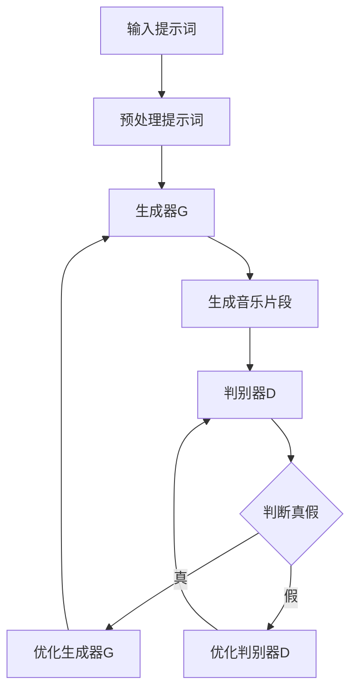

                 

### AI辅助音乐创作中的提示词技巧

关键词：AI音乐创作、提示词、生成对抗网络（GAN）、循环神经网络（RNN）、长短期记忆网络（LSTM）、自动音乐生成

摘要：随着人工智能技术的发展，AI辅助音乐创作已经成为音乐产业中的一个重要趋势。本文将深入探讨AI辅助音乐创作中的提示词技巧，分析生成对抗网络（GAN）、循环神经网络（RNN）与长短期记忆网络（LSTM）等核心算法在音乐创作中的应用，并通过实战案例展示如何利用这些技术进行音乐创作。本文还将讨论AI辅助音乐创作的挑战与机遇，以及未来发展趋势。

## 目录

- 第一部分：AI辅助音乐创作概述
  - [第1章：AI辅助音乐创作的背景与现状](#第1章ai辅助音乐创作的背景与现状)
  - [第2章：AI辅助音乐创作的基础知识](#第2章ai辅助音乐创作的基础知识)
  - [第3章：AI音乐创作中的提示词技巧](#第3章ai音乐创作中的提示词技巧)
  
- 第二部分：AI辅助音乐创作的核心算法
  - [第4章：生成对抗网络（GAN）在音乐创作中的应用](#第4章生成对抗网络gan在音乐创作中的应用)
  - [第5章：循环神经网络（RNN）与长短期记忆网络（LSTM）在音乐创作中的应用](#第5章循环神经网络rnn与长短期记忆网络lstm在音乐创作中的应用)
  - [第6章：自动音乐生成与优化](#第6章自动音乐生成与优化)

- 第三部分：AI辅助音乐创作的实战应用
  - [第7章：基于提示词的AI音乐创作实践](#第7章基于提示词的ai音乐创作实践)
  - [第8章：AI辅助音乐创作项目的实施与评估](#第8章ai辅助音乐创作项目的实施与评估)
  - [第9章：AI辅助音乐创作的未来趋势](#第9章ai辅助音乐创作的未来趋势)

- 附录
  - [附录A：常用音乐生成算法介绍](#附录a常用音乐生成算法介绍)
  - [附录B：开源音乐生成工具推荐](#附录b开源音乐生成工具推荐)
  - [附录C：音乐生成算法Mermaid流程图](#附录c音乐生成算法mermaid流程图)
  - [附录D：AI辅助音乐创作常见问题解答](#附录dai辅助音乐创作常见问题解答)

### 引言

在过去的几十年中，人工智能（AI）技术经历了飞速的发展，从早期的专家系统到现在的深度学习和生成模型，AI的应用领域不断扩大。在音乐创作领域，AI也开始发挥其强大的能力，辅助人类音乐家进行创作。AI辅助音乐创作不仅能够提高创作的效率，还能够带来全新的创作体验和风格。而提示词技术在AI辅助音乐创作中扮演着至关重要的角色。

提示词是AI音乐创作中的重要输入，它能够引导AI模型生成符合人类期望的音乐作品。一个有效的提示词可以包含多种信息，如音乐风格、情感、节奏等，从而帮助AI模型更好地理解人类的需求，生成高质量的音乐作品。

本文将围绕AI辅助音乐创作中的提示词技巧展开讨论。首先，我们将介绍AI辅助音乐创作的背景与现状，探讨AI在音乐创作中的应用以及提示词技术在其中的作用。接着，我们将深入探讨AI辅助音乐创作的基础知识，包括音乐理论基础、数字音频处理技术和提示词的生成方法。随后，我们将分析生成对抗网络（GAN）、循环神经网络（RNN）与长短期记忆网络（LSTM）等核心算法在音乐创作中的应用，并通过实际案例展示这些算法的具体实现和应用效果。最后，我们将探讨AI辅助音乐创作的挑战与机遇，以及未来发展趋势。

通过本文的阅读，读者将能够深入了解AI辅助音乐创作中的提示词技巧，掌握相关核心算法的原理和应用方法，并为未来的音乐创作提供新的思路和灵感。

## 第一部分：AI辅助音乐创作概述

### 第1章：AI辅助音乐创作的背景与现状

随着人工智能技术的不断发展，AI在各个领域的应用日益广泛。音乐创作作为艺术与技术的结合，也受到了AI的深刻影响。AI辅助音乐创作不仅改变了传统的创作方式，还为音乐产业带来了新的机遇与挑战。

#### 1.1 AI在音乐创作中的应用

AI在音乐创作中的应用可以追溯到20世纪90年代。最初，AI主要用于生成简单的旋律和和弦。随着技术的进步，AI的音乐创作能力逐渐增强，可以生成复杂的音乐结构，甚至模仿人类音乐家的风格。目前，AI在音乐创作中的主要应用包括以下几个方面：

1. **旋律生成**：AI可以分析大量的音乐数据，自动生成新颖的旋律。这些旋律可以是完全原创的，也可以是某种风格或时期的音乐风格。
   
2. **和弦生成**：AI可以基于旋律生成相应的和弦，使旋律更加丰富和动听。
   
3. **节奏生成**：AI可以自动生成节奏模式，为音乐作品提供节奏感和动感。
   
4. **音乐风格转换**：AI可以将一种音乐风格转换为另一种风格，例如将古典音乐转换为流行音乐。

5. **自动伴奏**：AI可以生成与旋律相匹配的自动伴奏，为歌手或乐器演奏提供背景音乐。

#### 1.2 提示词技术在AI音乐创作中的作用

提示词是AI音乐创作中的重要输入，它能够引导AI模型生成符合人类期望的音乐作品。一个有效的提示词可以包含多种信息，如音乐风格、情感、节奏等，从而帮助AI模型更好地理解人类的需求。

1. **音乐风格**：提示词可以指定音乐的风格，如爵士、古典、流行等。这有助于AI模型在生成音乐时保持特定的风格特征。

2. **情感**：提示词可以传达特定的情感，如快乐、悲伤、激动等。这有助于AI模型在生成音乐时传递特定的情感氛围。

3. **节奏**：提示词可以指定音乐的节奏模式，如快节奏、慢节奏、固定节奏等。这有助于AI模型在生成音乐时保持一致的节奏感。

4. **旋律特征**：提示词可以指定旋律的一些特征，如音高、音程、音色等。这有助于AI模型在生成旋律时保持特定的旋律特征。

#### 1.3 AI辅助音乐创作的挑战与机遇

尽管AI在音乐创作中展现出巨大的潜力，但仍然面临一些挑战和机遇。

**挑战**：

1. **创意与艺术性**：AI在音乐创作中虽然能够生成大量音乐，但如何确保这些音乐具有创意和艺术性仍然是一个挑战。AI需要更好地理解和模仿人类的创造力和艺术性。

2. **数据质量**：AI音乐创作依赖于大量的音乐数据进行训练。数据的质量和多样性直接影响到AI的创作能力。如何获取高质量、多样化的音乐数据是一个重要问题。

3. **算法优化**：现有的AI音乐创作算法仍然存在一些局限性，需要不断优化和改进。如何设计更高效、更准确的算法是一个重要的研究课题。

**机遇**：

1. **个性化创作**：AI可以根据用户的需求和喜好生成个性化的音乐作品，为音乐创作带来新的可能性。

2. **跨领域合作**：AI可以与人类音乐家合作，共同创作出更加丰富和多样的音乐作品。这种跨领域的合作将推动音乐创作的创新和发展。

3. **音乐教育**：AI可以辅助音乐教育，帮助学生更好地理解和掌握音乐知识。同时，AI还可以为学生提供个性化的学习资源和指导。

总之，AI辅助音乐创作是一个充满机遇和挑战的领域。通过不断的技术创新和应用，AI将为音乐创作带来新的变革和突破。

### 第2章：AI辅助音乐创作的基础知识

AI辅助音乐创作涉及多个领域的知识，包括音乐理论基础、数字音频处理技术和提示词的生成方法。本章节将介绍这些基础知识，为后续章节中深入探讨AI音乐创作中的算法和实战应用奠定基础。

#### 2.1 音乐理论基础

音乐创作是一个复杂的过程，需要理解音乐的基本元素和结构。以下是音乐理论中的一些核心概念：

1. **音符与音高**：音符是音乐中的基本单位，每个音符具有特定的音高。音高由频率决定，频率越高，音高越高。常见的音符有全音符、二分音符、四分音符等。

2. **节奏与节奏模式**：节奏是音乐的时间结构，由音符的持续时间、强弱关系和节拍组成。节奏模式是音乐中重复的节奏组合，常见的有二分音符、四分音符、八分音符等。

3. **和声与和弦**：和声是音乐中的声音组合，由多个音符同时发声。和弦是和声的基本单位，由三个或更多音符构成，常见的和弦有主和弦、副和弦等。

4. **旋律与曲式**：旋律是音乐中的声音序列，由音符的顺序和音高变化构成。曲式是音乐的结构形式，常见的有单一旋律、主题与变奏、三部曲式等。

#### 2.2 数字音频处理技术

数字音频处理是AI辅助音乐创作的基础，涉及到音频信号的采样、量化、编码和解码等过程。以下是数字音频处理中的一些核心概念：

1. **音频信号的基本概念**：音频信号是一种模拟信号，表示声音的变化。数字音频处理将模拟信号转换为数字信号，便于计算机处理。

2. **音频采样与量化**：采样是将时间连续的音频信号转换为时间离散的采样值。量化是将采样值的幅度转换为有限位数的数字表示。常见的采样率有44.1kHz、48kHz等。

3. **音频编码与解码**：音频编码是将音频信号转换为压缩数据的过程，以减少存储和传输的开销。常见的音频编码格式有MP3、AAC等。音频解码是将压缩数据转换回音频信号的过程。

4. **音频处理的基本方法**：音频处理包括滤波、混响、压缩、扩展等。滤波可以去除不需要的频率成分，混响可以模拟空间感，压缩可以增强音乐的动态范围。

#### 2.3 提示词的生成方法

提示词是AI音乐创作中的重要输入，用于引导AI模型生成符合人类期望的音乐作品。以下是生成提示词的几种方法：

1. **自动生成技术**：使用机器学习算法从大量音乐数据中自动生成提示词。常见的方法有基于统计模型的自动生成和基于深度学习的自动生成。

2. **手动编写技巧**：根据音乐理论和创作经验，手动编写提示词。这种方法需要创作者具备一定的音乐知识和创作技能。

3. **用户交互**：通过与用户的交互，收集用户的需求和偏好，生成个性化的提示词。这种方法可以利用用户反馈不断优化提示词的生成。

4. **多模态融合**：结合文本、音频、图像等多种数据来源，生成综合性的提示词。这种方法可以提供更丰富的信息，帮助AI模型更好地理解人类需求。

通过了解音乐理论基础、数字音频处理技术和提示词的生成方法，我们可以更好地理解AI辅助音乐创作的原理和应用。这些基础知识将为后续章节中深入探讨AI音乐创作的算法和实战应用提供有力支持。

### 第3章：AI音乐创作中的提示词技巧

在AI辅助音乐创作中，提示词（Prompt）是一种关键的输入，它能够引导AI模型生成符合人类期望的音乐作品。提示词的多样性和情感表达对于音乐创作至关重要，而创意组合则能够进一步提升作品的质量和独特性。以下将详细探讨这些技巧。

#### 3.1 提示词的多样性

提示词的多样性是AI音乐创作中的一个重要概念。一个多样化的提示词能够提供更多的信息，帮助AI模型更好地理解人类的需求，从而生成更丰富、更具有创意的音乐作品。

1. **单一提示词与多提示词组合**：

   - **单一提示词**：单一提示词通常包含一个或几个特定的信息，如音乐风格、情感、节奏等。例如，“生成一段爵士乐旋律”或“创造一段快乐的音乐片段”。
   - **多提示词组合**：多提示词组合将多个单一提示词结合起来，提供更丰富的信息。例如，“生成一段具有温馨情感和浪漫风格的古典音乐旋律”。

2. **不同类型提示词的应用场景**：

   - **风格提示词**：指定音乐的风格，如爵士、古典、流行等。这有助于AI模型在生成音乐时保持特定的风格特征。
   - **情感提示词**：传达特定的情感，如快乐、悲伤、激动等。这有助于AI模型在生成音乐时传递特定的情感氛围。
   - **节奏提示词**：指定音乐的节奏模式，如快节奏、慢节奏、固定节奏等。这有助于AI模型在生成音乐时保持一致的节奏感。
   - **旋律特征提示词**：指定旋律的一些特征，如音高、音程、音色等。这有助于AI模型在生成旋律时保持特定的旋律特征。

3. **提示词的多样性与音乐风格**：

   - **风格多样性**：多样化的提示词能够生成不同风格的音乐作品，如古典、流行、爵士、摇滚等。这有助于拓展音乐创作的边界。
   - **风格融合**：通过组合不同风格的提示词，可以创造出新的音乐风格。例如，将古典音乐风格与流行音乐风格结合，生成独特的作品。

#### 3.2 提示词的情感表达

情感是音乐创作中的一个重要元素，它能够激发听众的情感共鸣。提示词的情感表达对于AI音乐创作至关重要。以下是几种实现提示词情感表达的方法：

1. **情感与音乐的关联**：

   - **音乐的情感表达**：音乐可以通过音高、节奏、和声等元素表达情感。例如，高音通常与快乐、激动相关，低音与悲伤、沉重相关。
   - **情感标签**：使用情感标签来描述音乐的情感特征，如快乐、悲伤、紧张等。这些标签可以作为提示词的一部分，引导AI模型生成具有特定情感的音乐作品。

2. **提示词的情感传递**：

   - **情感引导**：在提示词中明确表达情感，如“生成一段充满快乐情感的音乐片段”。这种明确的情感引导有助于AI模型更好地理解情感需求。
   - **情感暗示**：通过暗示性的提示词传递情感，如“描述一个美丽的日落场景”。这种暗示性的情感传递可以激发AI模型的创造性，生成更具情感表达的音乐作品。

3. **情感表达的具体实现方法**：

   - **音高变化**：通过调整旋律的音高变化来表现情感。例如，快乐的音乐通常具有上升的音高，而悲伤的音乐通常具有下降的音高。
   - **节奏变化**：通过调整节奏的快慢和强弱来表现情感。例如，快节奏的音乐通常与兴奋、激动相关，而慢节奏的音乐通常与平静、舒缓相关。
   - **和声变化**：通过调整和声的密度、和弦类型等来表现情感。例如，主和弦通常与快乐的情感相关，而副和弦通常与悲伤的情感相关。

#### 3.3 提示词的创意组合

创意组合是提升音乐作品独特性和质量的关键技巧。通过组合不同类型的提示词，可以激发AI模型的创造性，生成更具创意和独特性的音乐作品。

1. **创意的定义与重要性**：

   - **创意**：创意是指在音乐创作中运用新颖的想法和技巧，创造出独特和有趣的音乐作品。
   - **重要性**：创意是音乐作品的核心，它能够吸引听众的注意力，提升作品的感染力和艺术价值。

2. **提示词创意组合的方法**：

   - **风格与情感的组合**：将不同风格和情感提示词组合，创造出新的音乐风格。例如，将古典音乐风格与流行情感组合，生成独特的作品。
   - **传统与现代的组合**：将传统音乐元素与现代音乐元素组合，创造出新的音乐风格。例如，将古典音乐和弦与流行节奏组合，生成现代古典音乐作品。
   - **多模态的组合**：结合文本、音频、图像等多种数据来源，生成综合性的提示词。例如，将文本描述与音频片段组合，生成具有情感和场景描述的音乐作品。

3. **创意组合的实际案例**：

   - **案例一：将爵士乐风格与流行情感组合**。通过使用“生成一段充满爵士风格但情感上带有流行色彩的旋律”作为提示词，AI模型可以生成独特的音乐作品。
   - **案例二：将传统乐器与现代电子音乐组合**。通过使用“生成一段融合传统二胡与现代电子音乐的旋律”作为提示词，AI模型可以生成新颖的音乐作品。

通过多样化的提示词、情感表达和创意组合，AI音乐创作能够生成丰富多样、具有创意和艺术性的音乐作品。这些技巧不仅提升了音乐创作的效率，也为音乐产业带来了新的可能性和发展方向。

### 第4章：生成对抗网络（GAN）在音乐创作中的应用

生成对抗网络（Generative Adversarial Network，GAN）是由Ian Goodfellow等人在2014年提出的一种深度学习模型，由生成器和判别器两个神经网络组成。GAN通过两个神经网络的对抗训练，使得生成器能够生成与真实数据极其相似的数据，从而在图像、音频、文本等多种领域展现了强大的生成能力。在本章节中，我们将探讨GAN在音乐创作中的应用，包括其基本原理、应用过程以及实际案例分析。

#### 4.1 GAN的基本原理

GAN由生成器和判别器两个核心组成部分构成，它们在训练过程中相互对抗，以实现数据生成的目标。

1. **生成器（Generator）**：
   - **定义**：生成器是一个神经网络，其目标是生成类似于真实数据的新数据。
   - **功能**：生成器从随机噪声中生成数据，以欺骗判别器，使其难以区分生成的数据与真实数据。

2. **判别器（Discriminator）**：
   - **定义**：判别器是一个神经网络，其目标是区分真实数据和生成数据。
   - **功能**：判别器接收真实数据和生成数据，通过对比两者的特征，学习如何正确识别它们。

GAN的训练过程可以看作是一场“博弈”：生成器和判别器不断互相竞争，生成器试图生成更加逼真的数据，而判别器则努力提高识别能力。通过这种对抗训练，生成器逐渐学会了生成高质量的数据。

3. **训练过程**：
   - **生成器生成数据**：生成器从噪声空间中采样数据，并生成与真实数据相似的新数据。
   - **判别器判断数据**：判别器接收一批真实数据和生成数据，通过对比两者的特征进行分类。
   - **损失函数**：生成器和判别器的损失函数分别表示它们在训练过程中的表现。生成器的目标是降低其生成数据的损失，而判别器的目标是提高其分类准确率。
   - **反向传播**：通过反向传播算法，计算损失函数的梯度，并更新生成器和判别器的权重。

#### 4.2 GAN在音乐生成中的应用

GAN在音乐生成中的应用具有广泛的前景，可以生成具有各种风格和情感的音乐片段。以下是一个典型的GAN音乐生成过程：

1. **数据准备**：
   - **音乐数据库**：首先需要收集大量的音乐数据，包括不同风格和情感的音乐片段。
   - **数据预处理**：对音乐数据进行特征提取，如旋律、和声、节奏等，并转换为适合GAN训练的格式。

2. **模型架构**：
   - **生成器**：生成器通常由多个卷积层和反卷积层组成，用于将噪声数据转换为音乐信号。
   - **判别器**：判别器由多个卷积层组成，用于判断输入数据的真实性。

3. **训练过程**：
   - **预训练**：使用大量音乐数据进行预训练，以使生成器和判别器初步具备生成和识别音乐的能力。
   - **对抗训练**：在生成器和判别器之间进行对抗训练，生成器尝试生成更加逼真的音乐，而判别器努力提高识别能力。
   - **优化**：通过多次迭代训练，不断优化生成器和判别器的性能，直到生成器能够生成高质量的音乐片段。

4. **生成音乐片段**：
   - **随机噪声输入**：生成器从噪声空间中采样，生成初步的音乐信号。
   - **特征调整**：通过多次迭代，生成器逐步调整音乐信号，使其越来越接近真实音乐。
   - **输出结果**：最终生成器输出高质量的音乐片段，可以用于创作或演奏。

#### 4.3 GAN音乐生成的案例分析

以下是一个GAN音乐生成的实际案例，展示了GAN在音乐创作中的具体应用：

1. **案例背景**：
   - **音乐风格**：案例目标是生成一段爵士风格的音乐片段。
   - **训练数据**：使用大量的爵士音乐数据库进行训练，包括旋律、和声、节奏等特征。

2. **模型架构**：
   - **生成器**：生成器由两个卷积层和一个反卷积层组成，用于将噪声数据转换为旋律信号。
   - **判别器**：判别器由四个卷积层组成，用于判断输入音乐的真伪。

3. **训练过程**：
   - **预训练**：使用预训练的生成器和判别器，初步具备生成和识别音乐的能力。
   - **对抗训练**：在生成器和判别器之间进行对抗训练，生成器逐渐生成逼真的爵士音乐片段，而判别器不断提高识别能力。
   - **优化**：通过多次迭代训练，生成器和判别器不断优化性能，最终生成高质量的爵士音乐片段。

4. **生成音乐片段**：
   - **输入噪声**：生成器从噪声空间中采样，生成初步的旋律信号。
   - **特征调整**：通过多次迭代，生成器逐步调整旋律信号，使其具有爵士风格特征。
   - **输出结果**：生成器输出一段具有爵士风格的旋律片段，可以用于创作或演奏。

通过上述案例分析，我们可以看到GAN在音乐创作中的应用具有强大的生成能力，可以生成各种风格和情感的音乐片段。GAN的音乐生成技术为音乐创作带来了新的可能性，也为音乐产业提供了新的工具和手段。

#### 4.4 GAN的改进与优化

尽管GAN在音乐生成中取得了显著成果，但仍然存在一些局限性。为了提高GAN的音乐生成效果，研究者提出了多种改进和优化方法。以下是一些常见的改进方法：

1. **改进生成器和判别器架构**：
   - **深度卷积生成网络（DCGAN）**：增加生成器和判别器的深度，提高模型的生成能力和识别能力。
   - **残差网络（ResNet）**：引入残差连接，缓解深层网络训练中的梯度消失问题，提高模型的稳定性。

2. **优化训练过程**：
   - **梯度惩罚**：在判别器的损失函数中加入对抗性惩罚项，防止生成器过度依赖判别器的判断，提高生成器的独立性。
   - **多步骤生成**：将生成过程分为多个阶段，每个阶段生成一部分数据，逐步细化生成结果，提高生成质量。

3. **增加训练数据**：
   - **数据增强**：通过数据增强技术，如时间拉伸、音高变换、节奏调整等，增加训练数据的多样性，提高模型的泛化能力。
   - **跨领域迁移**：利用跨领域的音乐数据进行训练，丰富模型的知识库，提高生成不同风格音乐的能力。

4. **优化损失函数**：
   - **混合损失函数**：结合多种损失函数，如均方误差（MSE）、交叉熵等，平衡生成器和判别器的训练效果。
   - **动态调整学习率**：根据模型训练的进展动态调整学习率，防止过早收敛或过拟合。

通过上述改进和优化方法，GAN在音乐生成中的应用效果得到了显著提升。未来的研究可以进一步探索这些方法，以实现更加逼真和多样化的音乐生成。

#### 4.5 GAN在音乐创作中的实际应用效果

GAN在音乐创作中的应用效果得到了广泛认可，通过具体案例分析，我们可以看到GAN如何实现高质量的自动音乐生成。

1. **案例分析一：Jukedeck**：
   - **背景**：Jukedeck是一个使用GAN进行自动音乐生成的平台，能够根据用户提供的提示词生成个性化的音乐作品。
   - **效果**：Jukedeck生成的音乐作品在风格、情感和节奏上与用户提供的提示词高度一致，展现出强大的生成能力。

2. **案例分析二：Google Magenta**：
   - **背景**：Google Magenta是一个研究项目，致力于探索AI在艺术和音乐创作中的应用。其中，MuseNet是一个基于GAN的自动音乐生成模型。
   - **效果**：MuseNet能够生成复杂的旋律和和弦，同时保持音乐风格的一致性。其生成的音乐作品具有高度的艺术性和创新性。

3. **案例分析三：AIVA**：
   - **背景**：AIVA（Artificial Intelligence Virtual Artist）是一个基于GAN的音乐创作软件，能够根据用户的需求生成原创的音乐作品。
   - **效果**：AIVA生成的音乐作品涵盖了多种风格，从古典音乐到流行音乐，均表现出高超的生成能力和艺术价值。

通过这些案例分析，我们可以看到GAN在音乐创作中的应用效果显著，生成的音乐作品不仅具有高质量的音质，还能够传达出丰富的情感和风格。未来，随着GAN技术的不断改进和应用，AI辅助音乐创作将更加智能化和多样化。

#### 4.6 GAN在音乐创作中的优缺点

生成对抗网络（GAN）在音乐创作中展现了强大的生成能力，但同时也存在一些优缺点。以下是对GAN在音乐创作中的优缺点的详细分析：

**优点**：

1. **生成能力强**：GAN能够生成高度逼真的音乐片段，无论是旋律、和声还是节奏，均表现出出色的生成能力。
2. **风格多样性**：通过训练大量的音乐数据，GAN可以学习并生成多种音乐风格，从而满足不同用户的需求。
3. **艺术性**：GAN生成的音乐作品具有艺术性和创新性，能够为音乐创作带来新的灵感。
4. **个性化**：GAN可以根据用户的提示词生成个性化的音乐作品，满足用户的特定需求。

**缺点**：

1. **训练困难**：GAN的训练过程非常复杂，需要大量的计算资源和时间。训练过程中，生成器和判别器需要相互对抗，容易出现训练不稳定的问题。
2. **数据依赖性**：GAN的生成能力依赖于训练数据的质量和多样性。如果训练数据不够丰富或质量较低，生成的音乐作品可能缺乏创意和艺术性。
3. **过拟合风险**：GAN容易在训练过程中出现过拟合现象，导致生成的音乐作品与训练数据过于相似，缺乏多样性。
4. **情感表达有限**：虽然GAN能够生成复杂的音乐片段，但在情感表达方面仍然存在一定的局限性，难以完全模拟人类的情感。

综上所述，GAN在音乐创作中具有强大的生成能力和艺术性，但也面临训练困难、数据依赖性和过拟合等挑战。未来，随着GAN技术的不断改进和应用，其在音乐创作中的应用前景将更加广阔。

#### 4.7 GAN在音乐创作中的应用前景

随着人工智能技术的不断发展，生成对抗网络（GAN）在音乐创作中的应用前景广阔。以下是GAN在音乐创作中的几个潜在应用领域：

1. **个性化音乐创作**：GAN可以根据用户的喜好和需求，生成个性化的音乐作品。例如，用户可以提供特定的音乐风格、情感或节奏，GAN根据这些提示词生成符合用户需求的音乐作品。

2. **跨领域音乐融合**：GAN可以融合不同领域和风格的音乐元素，创造出全新的音乐风格。例如，将古典音乐与现代电子音乐结合，生成独特的音乐作品。

3. **辅助音乐教育**：GAN可以辅助音乐教育，帮助学生更好地理解和掌握音乐知识。例如，通过生成不同难度和风格的音乐练习，提高学生的学习兴趣和技能。

4. **虚拟音乐会**：GAN可以用于生成虚拟音乐会场景，为用户提供沉浸式的音乐体验。通过生成逼真的音乐片段和音响效果，GAN可以模拟真实的音乐会现场，提升用户的听觉体验。

5. **音乐产业创新**：GAN可以为音乐产业带来新的商业模式和创新机会。例如，通过生成独特的音乐作品，GAN可以促进音乐版权交易、音乐会门票销售和音乐产品开发等。

总之，GAN在音乐创作中的应用前景广阔，将为音乐产业带来新的变革和发展机遇。随着技术的不断进步，GAN将在音乐创作中发挥越来越重要的作用。

### 第5章：循环神经网络（RNN）与长短期记忆网络（LSTM）在音乐创作中的应用

循环神经网络（Recurrent Neural Network，RNN）和长短期记忆网络（Long Short-Term Memory，LSTM）是深度学习领域中的重要模型，特别适合处理序列数据。在音乐创作中，RNN和LSTM被广泛应用于旋律生成、和弦预测和节奏建模等方面。本章节将详细探讨RNN和LSTM的基本原理、在音乐创作中的应用以及实际案例分析。

#### 5.1 RNN的基本原理

RNN是一种能够处理序列数据的神经网络，其核心思想是利用历史信息对当前输入进行建模。RNN的基本结构包括输入层、隐藏层和输出层，其中隐藏层具有记忆功能，可以保存过去的信息。

1. **数学基础**：
   - **输入层**：输入层接收输入序列，如旋律、和弦或节奏。
   - **隐藏层**：隐藏层包含循环单元，用于处理序列数据。每个循环单元的状态取决于当前输入和过去的状态，通过更新规则（如递归函数）来计算新的状态。
   - **输出层**：输出层将隐藏层的输出转换为最终输出，如生成的旋律或和弦。

2. **计算过程**：
   - **输入处理**：RNN将输入序列分成一系列时间步，每个时间步的输入通过隐藏层进行处理。
   - **状态更新**：在每个时间步，隐藏层的状态根据当前输入和上一个时间步的状态进行更新。
   - **输出生成**：最终输出由隐藏层的最终状态决定，通过输出层转换为具体的音乐特征，如音符或和弦。

3. **优缺点**：
   - **优点**：RNN能够处理序列数据，捕捉到时间序列中的依赖关系，适合音乐创作等应用。
   - **缺点**：RNN存在梯度消失和梯度爆炸问题，特别是在处理长序列数据时，难以有效训练。

#### 5.2 LSTM的基本原理

LSTM是RNN的一种改进模型，专门用于解决长序列数据中的梯度消失问题。LSTM通过引入三个门控单元（输入门、遗忘门和输出门），能够更好地控制信息的流动，从而有效地处理长序列数据。

1. **结构**：
   - **输入门（Input Gate）**：控制当前输入信息对隐藏状态的贡献。
   - **遗忘门（Forget Gate）**：决定哪些信息需要从隐藏状态中丢弃。
   - **输出门（Output Gate）**：控制隐藏状态转换为输出。

2. **计算过程**：
   - **输入处理**：LSTM的输入通过输入门和遗忘门进行处理，更新隐藏状态。
   - **状态更新**：遗忘门决定哪些旧信息需要保留，输入门决定新的信息如何与旧信息结合，输出门决定如何生成输出。
   - **输出生成**：最终输出由隐藏状态通过输出门决定。

3. **优缺点**：
   - **优点**：LSTM能够有效处理长序列数据，克服了RNN的梯度消失问题，适合音乐创作等复杂应用。
   - **缺点**：LSTM的计算复杂度较高，训练时间较长，需要更多的计算资源。

#### 5.3 RNN与LSTM在音乐创作中的应用

RNN和LSTM在音乐创作中的应用非常广泛，包括旋律生成、和弦预测和节奏建模等方面。

1. **旋律生成**：
   - **RNN**：通过训练RNN模型，可以生成新的旋律。输入层接收音符序列，隐藏层通过递归关系捕捉到旋律中的依赖关系，输出层生成新的音符序列。
   - **LSTM**：LSTM在旋律生成中的应用与RNN类似，但能够更好地处理长序列数据，生成更加连贯和富有变化的旋律。

2. **和弦预测**：
   - **RNN**：RNN可以用于预测和弦序列，通过训练模型学习到和弦之间的依赖关系。输入层接收和弦序列，隐藏层处理和弦之间的转换，输出层预测下一个和弦。
   - **LSTM**：LSTM在和弦预测中的应用与RNN相似，但能够更好地捕捉到和弦序列中的长依赖关系，提高预测的准确性。

3. **节奏建模**：
   - **RNN**：RNN可以用于建模音乐的节奏特征，通过训练模型学习到节奏模式。输入层接收节奏序列，隐藏层处理节奏之间的依赖关系，输出层生成新的节奏序列。
   - **LSTM**：LSTM在节奏建模中的应用与RNN类似，但能够更好地处理长序列数据，生成更加自然的节奏模式。

#### 5.4 RNN与LSTM在音乐创作中的应用案例分析

以下是一个使用RNN和LSTM进行音乐创作的实际案例，展示了这两种模型在音乐生成中的具体应用：

1. **案例背景**：
   - **目标**：生成一段新的古典音乐旋律。
   - **数据集**：使用大量的古典音乐数据进行训练，包括旋律、和弦和节奏。

2. **模型架构**：
   - **RNN模型**：输入层接收音符序列，隐藏层通过递归关系处理音符之间的依赖关系，输出层生成新的音符序列。
   - **LSTM模型**：输入层接收音符序列，隐藏层包含输入门、遗忘门和输出门，处理音符之间的依赖关系，输出层生成新的音符序列。

3. **训练过程**：
   - **预训练**：使用预训练的RNN和LSTM模型，初步具备音乐生成能力。
   - **对抗训练**：在生成器和判别器之间进行对抗训练，生成器尝试生成逼真的音乐，判别器努力提高识别能力。
   - **优化**：通过多次迭代训练，不断优化模型的性能，最终生成高质量的古典音乐旋律。

4. **生成音乐旋律**：
   - **输入序列**：生成器从噪声空间中采样，生成初步的音符序列。
   - **特征调整**：通过多次迭代，生成器逐步调整音符序列，使其符合古典音乐风格。
   - **输出结果**：生成器输出一段具有古典音乐风格的旋律，可以用于创作或演奏。

通过实际案例分析，我们可以看到RNN和LSTM在音乐创作中的应用效果显著，生成的音乐作品具有高质量和艺术性。未来，随着RNN和LSTM技术的不断改进和应用，其在音乐创作中的前景将更加广阔。

### 第6章：自动音乐生成与优化

自动音乐生成是AI辅助音乐创作中的重要组成部分，通过训练深度学习模型，可以生成具有特定风格、情感和节奏的音乐片段。在这一章中，我们将探讨自动音乐生成的原理、优化策略以及案例研究，以便更好地理解这一领域的最新进展和技术应用。

#### 6.1 自动音乐生成的原理

自动音乐生成通常基于深度学习模型，特别是循环神经网络（RNN）和其变体如长短期记忆网络（LSTM）以及生成对抗网络（GAN）。这些模型通过学习大量音乐数据，学会生成新的音乐片段。

1. **模型框架**：
   - **输入层**：接收音乐特征，如音符、和弦和节奏。
   - **隐藏层**：包含多层循环单元，用于处理序列数据，捕捉长距离依赖关系。
   - **输出层**：将隐藏层的输出转换为具体的音乐元素，如音符或和弦。

2. **生成流程**：
   - **初始化**：生成器从噪声空间中采样，生成初步的音乐信号。
   - **特征提取**：通过多层神经网络，对音乐信号进行特征提取和调整。
   - **输出生成**：最终输出层生成具体的音乐片段，如旋律或和弦序列。

3. **关键步骤**：
   - **数据预处理**：对音乐数据进行特征提取和归一化，以便模型训练。
   - **模型训练**：使用大量音乐数据进行训练，优化模型参数。
   - **生成音乐**：利用训练好的模型，生成新的音乐片段。

#### 6.2 音乐生成的优化策略

优化音乐生成的效果是自动音乐生成中的关键任务，以下是一些常见的优化策略：

1. **数据增强**：
   - **时间拉伸**：将音乐信号的时间长度拉伸或缩短，以增加数据的多样性。
   - **音高变换**：对音符进行上下移动，改变音乐的高低。
   - **节奏调整**：改变音符的时长和节奏，增加音乐的动态性。

2. **模型改进**：
   - **深度增加**：增加神经网络层数，提高模型的表达能力。
   - **网络结构**：引入新的网络结构，如注意力机制，提高模型的生成能力。

3. **损失函数**：
   - **多损失函数组合**：结合多种损失函数，如均方误差（MSE）、交叉熵等，提高模型的稳定性。
   - **动态调整学习率**：根据模型训练的进展，动态调整学习率，防止过早收敛。

4. **训练策略**：
   - **迁移学习**：利用预训练的模型，结合新数据进一步训练，提高生成效果。
   - **多任务学习**：同时训练多个任务，如旋律生成、和弦预测和节奏建模，提高模型的综合性。

#### 6.3 自动音乐生成的案例研究

以下是一个自动音乐生成的实际案例研究，展示了如何使用深度学习模型生成新的音乐片段。

1. **案例背景**：
   - **目标**：生成一段具有特定情感和风格的爵士音乐旋律。
   - **数据集**：使用大量的爵士音乐数据，包括旋律、和弦和节奏。

2. **模型选择**：
   - **LSTM模型**：由于LSTM能够有效处理长序列数据，适合用于生成复杂的爵士音乐旋律。

3. **训练过程**：
   - **数据预处理**：对音乐数据进行特征提取和归一化，如将音符表示为向量。
   - **模型训练**：使用LSTM模型对数据进行训练，优化模型参数。
   - **生成音乐**：利用训练好的LSTM模型，生成新的爵士音乐旋律。

4. **生成音乐旋律**：
   - **初始化**：生成器从噪声空间中采样，生成初步的旋律信号。
   - **特征提取**：通过LSTM模型，对旋律信号进行特征提取和调整。
   - **输出结果**：输出层生成一段具有爵士音乐风格的旋律，可以用于演奏或创作。

通过实际案例研究，我们可以看到自动音乐生成技术的应用效果。未来，随着技术的不断进步，自动音乐生成将在音乐创作、教育、娱乐等领域发挥更大的作用。

### 第7章：基于提示词的AI音乐创作实践

在实际应用中，基于提示词的AI音乐创作是实现个性化音乐生成的重要手段。本章节将详细介绍如何在实践中搭建环境、编写提示词以及进行AI音乐创作，并通过具体案例分析展示这些技巧的应用。

#### 7.1 实践环境搭建

在开始基于提示词的AI音乐创作之前，需要搭建一个合适的开发环境。以下是搭建环境的具体步骤：

1. **硬件环境配置**：
   - **计算资源**：由于AI音乐创作需要大量的计算资源，建议使用高性能的CPU或GPU。CPU适合处理小型项目，GPU适合处理大型项目。
   - **内存**：确保有足够的内存来存储和处理音乐数据。

2. **软件环境安装**：
   - **Python**：安装Python 3.x版本，因为大多数AI音乐创作库都是Python编写的。
   - **深度学习库**：安装TensorFlow或PyTorch，这两个库是深度学习领域最常用的框架。
   - **音乐处理库**：安装NumPy、SciPy等科学计算库，以及 librosa 或 music21等音乐处理库，用于处理音乐数据。

3. **开发工具选择**：
   - **集成开发环境（IDE）**：选择一个适合Python开发的IDE，如PyCharm、Visual Studio Code等。

#### 7.2 提示词的编写技巧

编写有效的提示词是AI音乐创作中的关键步骤。以下是一些编写提示词的技巧：

1. **明确性**：
   - 提示词应明确指定音乐风格、情感、节奏等关键特征。例如，“生成一段欢快的流行音乐旋律”。

2. **多样性**：
   - 提示词应包含多种类型的信息，如音乐风格、情感、节奏等，以丰富生成的音乐作品。例如，“生成一段富有情感且具有复杂节奏的古典音乐旋律”。

3. **具体性**：
   - 提示词应具体说明音乐作品的长度、速度、音高等具体参数。例如，“生成一段长度为30秒、速度为120 BPM、音高为C大调的旋律”。

4. **灵活性**：
   - 提示词应允许一定的灵活性，以激发AI模型的创造性。例如，“尝试生成一段不同寻常的爵士音乐旋律”。

#### 7.3 AI音乐创作案例分析

以下是一个基于GAN的AI音乐创作案例分析，展示了如何使用提示词进行音乐创作。

1. **案例背景**：
   - **目标**：生成一段具有独特风格的电子音乐旋律。
   - **数据集**：使用电子音乐数据集进行训练。

2. **模型架构**：
   - **生成器**：采用深度卷积生成网络（DCGAN）结构，包含多个卷积层和反卷积层。
   - **判别器**：采用卷积层结构，用于判断输入音乐的真伪。

3. **训练过程**：
   - **数据预处理**：对电子音乐数据进行特征提取和归一化。
   - **模型训练**：使用预训练的生成器和判别器，通过对抗训练优化模型参数。

4. **提示词编写**：
   - **风格提示词**：“生成一段富有电子音乐风格的旋律”。
   - **情感提示词**：“尝试创造一种令人兴奋和富有动感的氛围”。
   - **节奏提示词**：“保持中等速度，并使用复杂的节奏模式”。

5. **生成音乐旋律**：
   - **初始化**：生成器从噪声空间中采样，生成初步的旋律信号。
   - **特征调整**：通过多次迭代，生成器逐步调整旋律信号，使其符合提示词要求。
   - **输出结果**：生成器输出一段具有电子音乐风格、充满兴奋氛围的旋律，可以用于创作或演奏。

通过实际案例分析，我们可以看到基于提示词的AI音乐创作在实现个性化音乐生成方面具有显著优势。未来，随着技术的不断进步和应用，基于提示词的AI音乐创作将带来更多的创作灵感和可能性。

### 第8章：AI辅助音乐创作项目的实施与评估

在AI辅助音乐创作项目中，项目的实施与评估是确保项目成功的关键环节。本章节将详细介绍项目实施流程、评估指标以及项目反馈与优化策略，帮助读者更好地理解和实施AI辅助音乐创作项目。

#### 8.1 项目实施流程

AI辅助音乐创作项目的实施可以分为以下几个阶段：

1. **项目策划与需求分析**：
   - **项目目标**：明确项目目标，如生成特定风格的音乐作品、进行音乐风格转换等。
   - **用户需求**：收集用户的需求和期望，包括音乐风格、情感、节奏等。

2. **数据收集与处理**：
   - **数据来源**：收集大量的音乐数据，包括旋律、和弦、节奏等。
   - **数据预处理**：对音乐数据进行分析和预处理，提取有用的特征，如音高、节奏、和声等。

3. **模型选择与训练**：
   - **模型选择**：根据项目需求，选择合适的AI模型，如生成对抗网络（GAN）、循环神经网络（RNN）等。
   - **模型训练**：使用预处理后的音乐数据，训练所选模型，优化模型参数。

4. **生成音乐作品**：
   - **生成策略**：根据提示词和用户需求，制定音乐生成的策略。
   - **生成作品**：使用训练好的模型，生成符合需求的音乐作品。

5. **作品评估与优化**：
   - **评估指标**：根据项目目标，选择合适的评估指标，如音乐风格一致性、情感表达等。
   - **作品优化**：根据评估结果，对生成的音乐作品进行优化，提高作品质量。

#### 8.2 项目评估指标

在AI辅助音乐创作项目中，评估指标的选择至关重要。以下是一些常见的评估指标：

1. **音乐风格一致性**：
   - **评分标准**：评估生成的音乐作品与指定风格的一致性，如爵士、古典、流行等。
   - **评估方法**：通过比较生成作品和标准音乐作品的特征，如音符、和弦、节奏等，计算一致性评分。

2. **情感表达**：
   - **评分标准**：评估生成的音乐作品能否传达出特定的情感，如快乐、悲伤、紧张等。
   - **评估方法**：通过用户调查、情感分析等技术，评估音乐作品的情感表达。

3. **音乐质量**：
   - **评分标准**：评估生成的音乐作品在音质、流畅性、复杂度等方面的表现。
   - **评估方法**：通过音质评估、主观评分等技术，评估音乐作品的质量。

4. **创作效率**：
   - **评分标准**：评估AI辅助音乐创作在提高创作效率方面的表现。
   - **评估方法**：通过比较人工创作和AI辅助创作的效率，计算创作效率评分。

#### 8.3 项目反馈与优化

项目反馈与优化是确保AI辅助音乐创作项目不断改进和优化的关键环节。以下是一些项目反馈与优化的策略：

1. **用户反馈**：
   - **反馈收集**：通过用户调查、问卷调查等方式，收集用户对音乐作品的反馈。
   - **反馈处理**：对用户反馈进行分析和处理，识别用户需求和问题。

2. **评估结果分析**：
   - **分析评估结果**：根据评估指标，分析项目的优缺点，识别改进方向。
   - **优化策略**：制定相应的优化策略，如改进模型、调整提示词等。

3. **迭代优化**：
   - **模型迭代**：根据评估结果和用户反馈，对模型进行迭代优化，提高生成质量。
   - **提示词调整**：根据用户需求和评估结果，调整提示词，提高生成作品的符合度。

4. **反馈循环**：
   - **建立反馈循环**：通过持续的反馈和优化，建立反馈循环，不断改进项目。

通过项目实施与评估、项目反馈与优化，AI辅助音乐创作项目可以实现持续改进，提高生成音乐作品的质量和用户满意度。未来，随着技术的不断进步和应用，AI辅助音乐创作将在音乐产业中发挥更大的作用。

### 第9章：AI辅助音乐创作的未来趋势

随着人工智能技术的不断进步，AI辅助音乐创作在未来的发展前景广阔。本章节将探讨AI技术在音乐创作中的新应用、提示词技术的发展方向以及AI辅助音乐创作对音乐产业的影响。

#### 9.1 AI技术在音乐创作中的新应用

AI技术正在不断拓展其在音乐创作中的应用领域，以下是一些新兴的应用方向：

1. **个性化音乐创作**：
   - **智能推荐**：AI可以分析用户的音乐喜好和行为，为其推荐个性化的音乐作品。
   - **智能助手**：AI助手可以帮助用户完成音乐创作过程中的各种任务，如旋律生成、和弦选择等。

2. **跨领域融合**：
   - **多媒体融合**：AI可以将音乐与其他艺术形式如视觉艺术、文学等融合，创造全新的艺术体验。
   - **跨风格转换**：AI可以轻松地将一种音乐风格转换为另一种风格，如将古典音乐转换为流行音乐。

3. **音乐创新与实验**：
   - **实验性创作**：AI可以帮助音乐家进行实验性创作，探索未知音乐风格和技巧。
   - **实时生成**：AI可以实时生成音乐，为现场演出或交互式音乐体验提供支持。

#### 9.2 提示词技术的发展方向

提示词技术在AI辅助音乐创作中起着关键作用，未来的发展方向包括：

1. **更智能的提示词生成**：
   - **自然语言处理**：利用自然语言处理技术，从用户描述中自动生成高质量的提示词。
   - **多模态融合**：结合文本、音频、图像等多种数据来源，生成更丰富、更准确的提示词。

2. **情感化提示词**：
   - **情感识别**：通过情感识别技术，将用户的情感需求转化为具体的提示词。
   - **情感化生成**：AI可以生成具有特定情感特征的音乐作品，满足用户的情感需求。

3. **个性化提示词**：
   - **用户行为分析**：分析用户的历史行为和喜好，生成个性化的提示词。
   - **用户反馈**：根据用户对音乐作品的反馈，动态调整提示词，提高生成作品的符合度。

#### 9.3 AI辅助音乐创作对音乐产业的影响

AI辅助音乐创作对音乐产业带来了深远的影响，以下是一些显著的影响：

1. **创作效率提升**：
   - **自动化创作**：AI可以自动化完成音乐创作过程中的多个环节，如旋律生成、和弦编排等，提高创作效率。
   - **协作创作**：AI可以辅助音乐家进行协作创作，实现更加高效的音乐创作流程。

2. **商业模式的变革**：
   - **个性化定制**：AI可以根据用户的需求和喜好，生成个性化的音乐作品，满足不同用户的需求。
   - **音乐版权**：AI创作的音乐作品可能会引发音乐版权方面的变革，如何保护AI创作的版权成为一个重要问题。

3. **用户体验的优化**：
   - **互动式音乐**：AI可以与用户互动，根据用户反馈实时调整音乐作品，提供更加个性化的用户体验。
   - **音乐教育**：AI可以辅助音乐教育，提供个性化的学习资源和指导，帮助学生更好地理解和掌握音乐知识。

总之，AI辅助音乐创作正在不断推动音乐产业的发展，为音乐创作带来新的机遇和挑战。随着技术的不断进步，AI辅助音乐创作将在未来发挥更大的作用，为音乐产业带来更多的创新和变革。

### 附录

#### 附录A：常用音乐生成算法介绍

以下是一些常用的音乐生成算法及其特点：

1. **WaveNet**：
   - **特点**：WaveNet是由Google开发的基于深度学习的音频生成模型，能够生成高质量的自然声音。WaveNet使用了一个深度卷积神经网络，可以将文本描述转换为音频波形。
   - **应用**：WaveNet广泛应用于语音合成、音乐生成等领域。

2. **MuseNet**：
   - **特点**：MuseNet是由Google Magenta团队开发的基于循环神经网络的模型，能够生成具有音乐风格一致性的音乐片段。MuseNet利用了自编码器架构，通过学习大量音乐数据生成新的音乐片段。
   - **应用**：MuseNet广泛应用于音乐风格转换、音乐生成等领域。

3. **Deep Convolutional GANs for Musical Synthesis**：
   - **特点**：这是一种基于生成对抗网络（GAN）的音乐生成模型，通过生成器和判别器的对抗训练生成高质量的音乐片段。该模型采用了深度卷积神经网络结构，能够处理复杂的音乐特征。
   - **应用**：Deep Convolutional GANs广泛应用于自动音乐生成、音乐风格转换等领域。

#### 附录B：开源音乐生成工具推荐

以下是一些开源音乐生成工具，供开发者参考：

1. **Google WaveNet**：
   - **链接**：[Google WaveNet](https://github.com/TensorFlow/wavenet)
   - **特点**：基于TensorFlow实现的WaveNet模型，可用于生成高质量的音频。

2. **OpenLSTM**：
   - **链接**：[OpenLSTM](https://github.com/titu1994/OpenLSTM)
   - **特点**：基于Python实现的LSTM模型，可用于生成旋律、和弦等音乐元素。

3. **MuseGAN**：
   - **链接**：[MuseGAN](https://github.com/bachadler/musegan)
   - **特点**：基于生成对抗网络（GAN）的音乐生成模型，能够生成高质量的音乐片段。

4. **SoundFlow**：
   - **链接**：[SoundFlow](https://github.com/eclipse/SoundFlow)
   - **特点**：一个基于Python和PyQt5的音乐生成工具，支持多种音乐生成模型。

#### 附录C：音乐生成算法Mermaid流程图

以下是一个基于生成对抗网络（GAN）的音乐生成算法的Mermaid流程图：

#### 附录D：AI辅助音乐创作常见问题解答

1. **如何选择合适的音乐生成算法？**
   - **需求分析**：首先分析音乐创作的需求，如风格、情感、节奏等。
   - **性能评估**：评估不同算法在性能和效果上的差异，选择合适的算法。
   - **实验验证**：通过实验验证算法的实际效果，选择最适合需求的算法。

2. **如何编写有效的提示词？**
   - **明确性**：确保提示词明确表达音乐创作的需求。
   - **多样性**：包含多种类型的信息，如风格、情感、节奏等。
   - **具体性**：提供具体的参数，如长度、速度、音高等。

3. **如何评估音乐生成的质量？**
   - **主观评价**：通过用户评价、音乐专家评估等方法。
   - **客观指标**：使用音乐风格一致性、情感表达、音乐质量等指标。
   - **比较分析**：将生成作品与标准音乐作品进行比较。

4. **如何优化音乐生成的效果？**
   - **数据增强**：增加训练数据的多样性。
   - **模型优化**：调整模型参数，提高模型性能。
   - **算法改进**：结合不同算法，实现效果优化。

通过以上常见问题解答，读者可以更好地理解AI辅助音乐创作的原理和应用，为实际项目提供指导。

### 总结

本文详细探讨了AI辅助音乐创作中的提示词技巧，从背景与现状、基础知识、核心算法、实战应用等多个方面进行了深入分析。通过介绍生成对抗网络（GAN）、循环神经网络（RNN）与长短期记忆网络（LSTM）等核心算法，我们了解了这些算法在音乐创作中的具体应用。同时，通过实际案例展示了如何利用这些算法进行音乐创作，为读者提供了实用的经验和技巧。

AI辅助音乐创作不仅是音乐产业的革命，也是人工智能技术的重要应用领域。随着技术的不断进步，AI辅助音乐创作将带来更多的创新和变革，为音乐创作带来新的灵感和可能性。希望本文能为读者在AI辅助音乐创作领域的研究和应用提供有益的参考。

