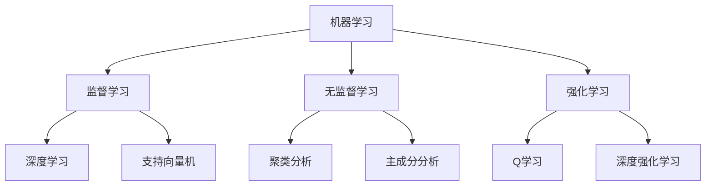

                 

# AI驱动的创新：人类计算在商业中的价值

## 关键词：
人工智能，商业创新，商业模式，产品设计，营销，运营，战略规划，人类计算

## 摘要：
本文旨在探讨人工智能（AI）在商业中的革命性作用，以及人类计算在其中不可替代的价值。通过对AI驱动的创新进行深入分析，本文揭示了AI如何重塑商业模式、产品设计、营销策略和运营管理，并展示了人类计算在这些领域的独特贡献。文章将分章节介绍AI基础概念与核心算法、AI驱动的商业模式创新、产品设计创新、营销创新、运营创新以及战略规划，并探讨人类计算在AI时代的角色和具体应用。最终，本文将总结AI驱动的创新工具与资源，为读者提供实用的指导和参考。

---

## 《AI驱动的创新：人类计算在商业中的价值》目录大纲

### 第一部分: 引言

### 第1章: AI与商业创新

### 第二部分: AI驱动的创新

#### 第2章: AI基础概念与核心算法

##### 2.1 AI的基础概念

##### 2.2 AI的核心算法

#### 第3章: AI驱动的商业模式创新

##### 3.1 传统商业模式的转变

##### 3.2 AI驱动的商业模式创新案例

#### 第4章: AI驱动的产品设计创新

##### 4.1 产品设计的AI方法

##### 4.2 AI驱动的产品设计案例

#### 第5章: AI驱动的营销创新

##### 5.1 营销中的AI应用

##### 5.2 AI驱动的营销创新案例

#### 第6章: AI驱动的运营创新

##### 6.1 运营中的AI应用

##### 6.2 AI驱动的运营创新案例

#### 第7章: AI驱动的战略规划

##### 7.1 企业AI战略规划

##### 7.2 AI驱动的战略规划案例

### 第三部分: 人类计算在商业中的价值

#### 第8章: 人类计算在AI时代的角色

##### 8.1 人类计算与机器学习的关系

##### 8.2 人类计算在商业中的价值

#### 第9章: 人类计算在AI创新中的应用

##### 9.1 人类计算在产品设计中的应用

##### 9.2 人类计算在营销创新中的应用

#### 第10章: 人类计算在运营管理中的应用

##### 10.1 人类计算在运营管理中的角色

##### 10.2 人类计算在运营管理中的应用案例

### 附录

#### 第11章: AI驱动的创新工具与资源

##### 11.1 主流AI开发框架

##### 11.2 AI驱动的创新案例库

##### 11.3 AI驱动的创新研究文献

---

### 第一部分: 引言

#### 第1章: AI与商业创新

> 在当今数字化时代，人工智能（AI）已经成为驱动商业创新的核心力量。从简单的自动化任务到复杂的数据分析，AI正在改变企业的运营模式、产品设计和战略规划。本章将介绍AI的基本概念和核心算法，并探讨AI如何推动商业创新。

---

### 第二部分: AI驱动的创新

#### 第2章: AI基础概念与核心算法

##### 2.1 AI的基础概念

人工智能（AI）是指由人制造出来的系统所表现出的智能行为。它包括多个子领域，如机器学习（ML）、深度学习（DL）、自然语言处理（NLP）和计算机视觉（CV）。以下是AI的一些关键概念：

- **机器学习（ML）**：一种使计算机通过数据学习并做出决策的方法，不需要显式编程。
- **深度学习（DL）**：一种特殊的机器学习方法，基于多层神经网络来模拟人类大脑的决策过程。
- **自然语言处理（NLP）**：使计算机能够理解、解释和生成人类语言的技术。
- **计算机视觉（CV）**：使计算机能够像人类一样“看到”和理解视觉信息。

##### 2.2 AI的核心算法

AI的核心算法包括：

- **监督学习**：使用已标记的数据来训练模型，使其能够对新的数据进行预测。
- **无监督学习**：没有已标记的数据，模型通过自身发现数据中的模式和结构。
- **强化学习**：通过试错法来学习如何在特定环境中做出最优决策。

接下来，我们将使用Mermaid流程图来展示AI的基础架构。

在接下来的章节中，我们将深入探讨AI驱动的商业模式创新、产品设计创新、营销创新和运营创新，并分析人类计算在这些领域中的价值。

---

### 第三部分: 人类计算在商业中的价值

#### 第8章: 人类计算在AI时代的角色

##### 8.1 人类计算与机器学习的关系

人类计算与机器学习是相辅相成的。尽管AI和机器学习在处理大量数据和执行重复性任务方面表现出色，但人类计算在以下方面仍然具有独特价值：

- **创造性思维**：人类能够提出新颖的想法和解决方案，这在当前AI技术中难以实现。
- **直觉判断**：人类能够利用直觉进行快速决策，这是机器学习难以模拟的。
- **道德伦理**：人类在处理敏感信息和伦理问题方面具有道德责任。

##### 8.2 人类计算在商业中的价值

在商业环境中，人类计算的价值体现在以下几个方面：

- **战略规划**：人类能够从全局角度考虑问题，制定长远的商业战略。
- **产品创新**：人类能够理解用户需求，设计出更符合市场需求的创新产品。
- **市场分析**：人类能够进行深入的市场调研，识别市场趋势和机会。

接下来，我们将探讨人类计算在AI驱动的创新中的应用。

---

### 第四部分: 人类计算在AI驱动的创新中的应用

#### 第9章: 人类计算在产品设计创新中的应用

##### 9.1 人类计算在产品设计中的应用

在产品设计中，人类计算的价值体现在以下几个方面：

- **用户体验（UX）设计**：人类能够通过用户调研和交互设计，创造出更符合用户需求的界面。
- **用户测试**：人类可以通过实际操作来测试产品的可用性，提供反馈以改进设计。
- **创新思维**：人类能够运用创造性思维，提出新颖的设计概念。

##### 9.2 人类计算在产品设计创新中的应用案例

- **案例分析1：Airbnb**  
Airbnb在产品设计过程中，通过用户调研和测试，不断优化用户体验，使其成为全球领先的短期租赁平台。

- **案例分析2：Tesla**  
Tesla在汽车设计中，通过人类工程师的创造性思维，开发了独特的电动车技术，引领了汽车行业的变革。

在下一章中，我们将探讨人类计算在营销创新中的应用。

---

#### 第10章: 人类计算在营销创新中的应用

##### 10.1 人类计算在营销创新中的角色

在营销领域，人类计算的价值体现在以下几个方面：

- **市场调研**：人类能够进行深入的市场调研，了解消费者需求和市场趋势。
- **内容创作**：人类能够创作出具有吸引力的营销内容，如广告、文案和视频。
- **战略规划**：人类能够制定长远的营销策略，实现品牌传播和销售增长。

##### 10.2 人类计算在营销创新中的应用案例

- **案例分析1：Nike**  
Nike通过用户调研和市场分析，不断调整其营销策略，使其品牌在全球范围内保持领先地位。

- **案例分析2：Red Bull**  
Red Bull通过创意营销和内容创作，吸引了大量年轻消费者，成为运动饮料市场的领军品牌。

在下一章中，我们将探讨人类计算在运营管理中的应用。

---

### 附录

#### 第11章: AI驱动的创新工具与资源

##### 11.1 主流AI开发框架

主流AI开发框架包括：

- **TensorFlow**：由谷歌开发的开源机器学习框架，适用于深度学习和神经网络。
- **PyTorch**：由Facebook开发的开源深度学习框架，具有动态计算图特性。
- **Keras**：用于快速构建和迭代深度学习模型的Python库，易于使用。

##### 11.2 AI驱动的创新案例库

AI驱动的创新案例库包括：

- **AI100**：斯坦福大学提供的人工智能创新案例库，涵盖了各种行业和应用领域。
- **AI Case Studies**：谷歌提供的人工智能案例研究，展示了AI在商业和科技领域的成功应用。

##### 11.3 AI驱动的创新研究文献

AI驱动的创新研究文献包括：

- **《Deep Learning》**：由Ian Goodfellow等人编写的深度学习经典教材。
- **《Reinforcement Learning: An Introduction》**：由Richard S. Sutton和Barto编写的强化学习入门教材。

---

作者：AI天才研究院/AI Genius Institute & 禅与计算机程序设计艺术 /Zen And The Art of Computer Programming

