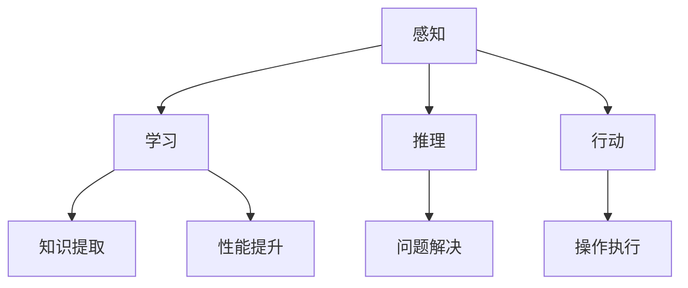
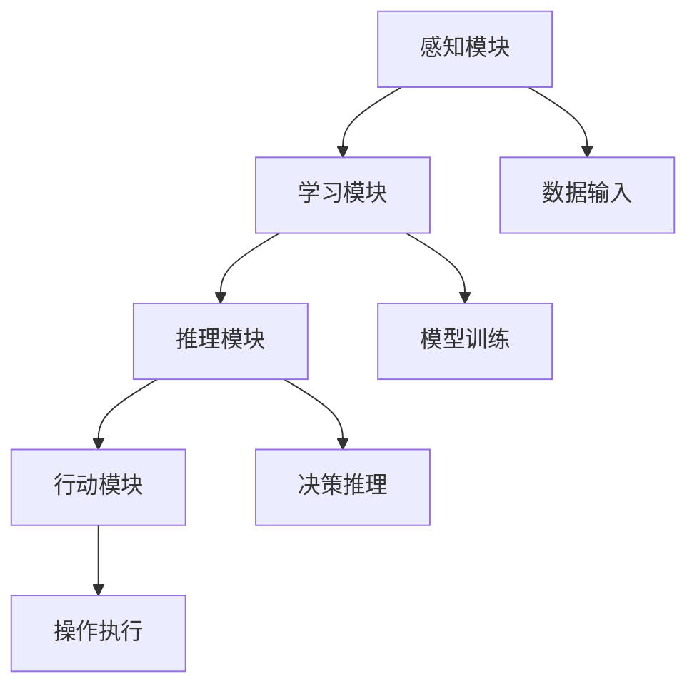
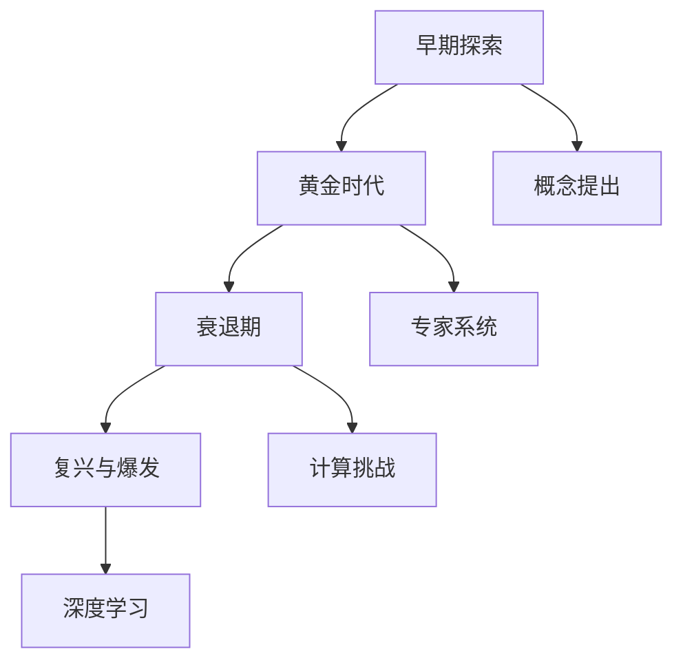
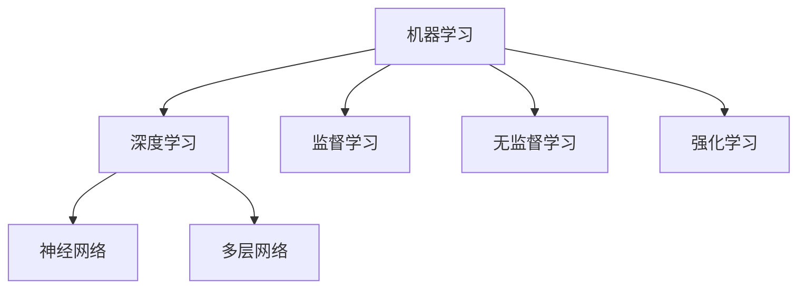
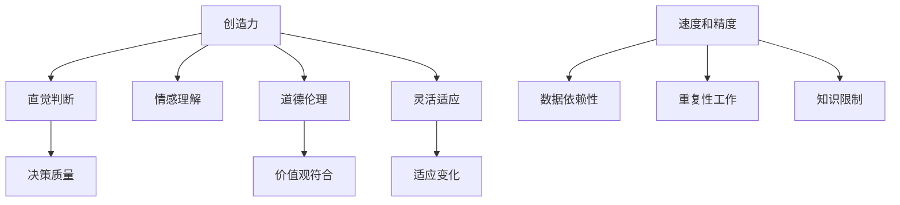
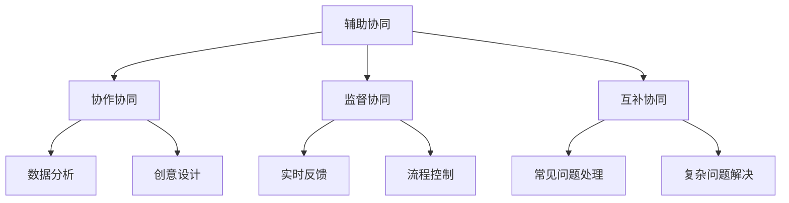
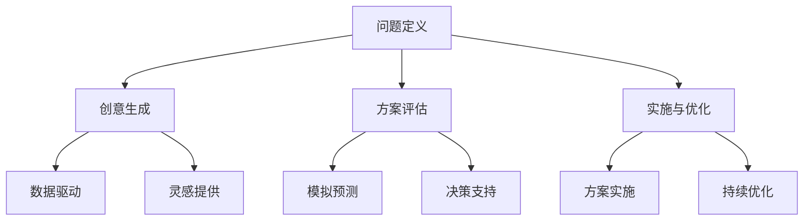
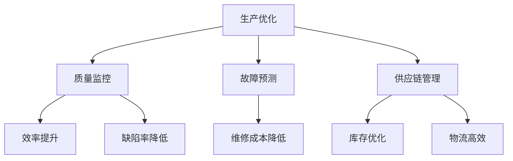
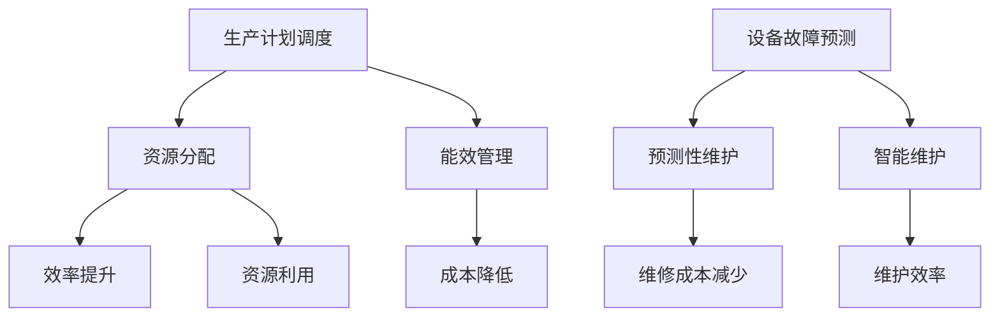

                 

### 文章标题

《AI驱动的创新：人类计算在商业中的未来趋势预测》

随着人工智能（AI）技术的迅猛发展，AI正逐渐成为推动商业创新的重要驱动力。在这篇文章中，我们将深入探讨AI在商业中的应用，分析人类计算与AI的协同作用，探讨AI驱动的商业应用场景，并预测未来商业中的趋势。通过这一系列的分析和讨论，我们希望能够为读者提供对AI时代商业发展的全面理解。

### 文章关键词

- 人工智能
- 商业创新
- 人类计算
- 商业应用场景
- 未来趋势
- 智能化生产
- 个性化服务
- 智慧城市
- 数字化转型
- 伦理问题
- 法规环境
- 新商业模式

### 文章摘要

本文从AI驱动的创新角度，系统探讨了人类计算与AI协同作用在商业中的重要性。首先，我们介绍了AI在商业中的作用和人类计算的优势与劣势。接着，详细分析了AI驱动的商业应用场景，包括生产制造、零售与客户体验、金融与保险等领域。然后，我们探讨了AI对劳动力市场的影响，以及AI伦理与法规问题。最后，我们展望了AI驱动的商业模式变革，并对企业和个人提出了相应的启示和建议。本文旨在为读者提供对AI时代商业发展的全面了解和深入思考。

### 目录大纲设计思路

在设计《AI驱动的创新：人类计算在商业中的未来趋势预测》这本书的完整目录大纲时，我们遵循了以下思路：

1. **确定核心内容**：首先，我们需要明确这本书的核心内容和主要目标。根据书名，我们可以推断出这本书将探讨AI如何推动商业创新，以及人类计算在其中的作用。

2. **大纲结构**：确定大纲的基本结构，包括几个主要部分，如引言、基础概念、应用场景、未来趋势等。

3. **章节划分**：在确保大纲完整性、简洁性的同时，将核心内容细化为各个章节，确保每个章节都有明确的主题和目标。

4. **具体细节**：在每个章节中，细化内容，包括核心概念、算法原理、案例研究等。

5. **格式要求**：按照要求，使用markdown格式，确保大纲的层次清晰，内容简洁。

### 目录大纲

**第一部分：引言与背景**

- **第1章：AI驱动的创新：概述**
  - **1.1 AI在商业中的作用**
  - **1.2 人类计算的重要性**
  - **1.3 AI驱动创新的核心要素**
  - **1.4 商业中的未来趋势预测**

- **第2章：AI基础概念与架构**
  - **2.1 AI的基本概念**
  - **2.2 AI系统架构**
  - **2.3 AI的发展历程**
  - **2.4 机器学习与深度学习**

**第二部分：人类计算与AI的协同作用**

- **第3章：人类计算与AI的协同作用**
  - **3.1 人类计算的优劣势**
  - **3.2 人类与AI的协同模式**
  - **3.3 创新过程与AI应用**
  - **3.4 案例研究：人类计算与AI的结合**

**第三部分：AI驱动的商业应用场景**

- **第4章：生产制造与工业4.0**
  - **4.1 智能工厂与AI应用**
  - **4.2 生产优化与预测维护**
  - **4.3 案例研究：工业AI应用**
    - **4.3.1 汽车制造业**
    - **4.3.2 食品制造业**

- **第5章：零售与客户体验**
  - **5.1 AI在零售业的应用**
  - **5.2 客户体验的AI优化**
  - **5.3 案例研究：零售业中的AI创新**
    - **5.3.1 电子商务平台**
    - **5.3.2 超市零售**

- **第6章：金融与保险**
  - **6.1 AI在金融领域的应用**
  - **6.2 风险管理与预测**
  - **6.3 保险精算与AI**
  - **6.4 案例研究：金融行业的AI实践**
    - **6.4.1 银行风险管理**
    - **6.4.2 保险欺诈检测**

**第四部分：AI伦理与法规**

- **第7章：AI伦理与法规**
  - **7.1 AI伦理问题**
  - **7.2 数据隐私与安全**
  - **7.3 法规环境与合规性**
  - **7.4 案例研究：AI伦理案例解析**
    - **7.4.1 面部识别隐私争议**
    - **7.4.2 自动驾驶汽车事故责任**

**第五部分：商业模式的变革**

- **第8章：商业模式的变革**
  - **8.1 AI驱动的商业模式创新**
  - **8.2 新型商业模式的特征**
  - **8.3 案例研究：AI推动的商业模式变革**
    - **8.3.1 共享经济平台**
    - **8.3.2 电子商务平台**

**第六部分：结论与展望**

- **第9章：结论与展望**
  - **9.1 AI驱动创新的总结**
  - **9.2 人类计算的未来角色**
  - **9.3 AI驱动的商业未来趋势**
  - **9.4 对企业和个人的启示**

### 第一部分：引言与背景

**第1章：AI驱动的创新：概述**

在当今快速变化的商业环境中，人工智能（AI）已成为推动创新的重要力量。AI的应用不仅改变了传统业务模式，还创造了全新的商业模式。本章将探讨AI驱动的创新在商业中的重要性，分析人类计算与AI的协同作用，并预测未来商业中的趋势。

### 1.1 AI在商业中的作用

AI在商业中的作用是多方面的。首先，AI能够通过数据分析提供精准的决策支持，优化业务流程。例如，AI可以通过分析销售数据，预测市场需求，帮助商家制定更有效的营销策略。此外，AI还可以自动化重复性任务，提高工作效率。例如，在客户服务领域，AI聊天机器人可以处理大量客户咨询，减少人工负担。

其次，AI在个性化服务方面也发挥了重要作用。通过分析用户行为和偏好，AI可以为用户提供个性化的产品推荐和定制服务。例如，电子商务平台可以利用AI推荐算法，为用户推荐可能感兴趣的商品，提高购买转化率。

此外，AI还在生产优化、供应链管理、风险管理等方面具有广泛应用。例如，在制造业中，AI可以通过预测维护，减少设备故障，提高生产效率。在金融领域，AI可以通过风险管理模型，预测潜在风险，提供有效的风险控制方案。

总之，AI在商业中的作用不仅体现在提高效率和优化流程，还在于创造新的商业机会和商业模式。随着AI技术的不断进步，其在商业中的应用将越来越广泛，为企业和个人带来更多机遇。

### 1.2 人类计算的重要性

尽管AI技术在商业中扮演着越来越重要的角色，但人类计算依然不可或缺。人类计算具有以下几个方面的优势：

首先，人类计算在复杂决策中具有独特的优势。虽然AI能够处理大量数据和进行模式识别，但在处理复杂、多变量的问题时，人类的直觉判断和经验仍然具有不可替代的价值。例如，在金融风险管理中，人类专家可以通过多年的经验和专业知识，识别出潜在的风险，并提供有效的应对策略。

其次，人类计算在情感理解方面具有优势。人类能够通过语言、表情和行为识别情感，建立情感连接。这对于客户服务和关系管理至关重要。例如，在客户服务中，人类客服能够更好地理解客户的情感，提供个性化的服务，提高客户满意度。

此外，人类计算在创造性思维方面也具有优势。人类能够进行创造性思维，提出新颖的解决方案。这在创新过程中尤为重要。例如，在产品设计阶段，人类设计师可以通过创造性思维，提出独特的创意，设计出更受市场欢迎的产品。

最后，人类计算在道德和伦理方面具有责任。人类能够考虑道德和伦理问题，确保AI系统的决策符合社会价值观。例如，在自动驾驶汽车领域，人类需要确保车辆在紧急情况下做出符合伦理的决策。

总之，人类计算在商业创新中具有独特的优势。虽然AI能够处理大量数据和进行模式识别，但在复杂决策、情感理解和创造性思维等方面，人类计算仍然具有不可替代的价值。因此，在AI驱动的商业创新中，人类计算与AI的协同作用至关重要。

### 1.3 AI驱动创新的核心要素

AI驱动的创新涉及多个核心要素，包括数据、算法、计算能力和应用场景。这些要素相互作用，共同推动商业创新。

首先，数据是AI驱动的创新的基础。高质量的数据可以提供准确的预测和分析结果，从而支持业务决策。例如，在零售业中，通过分析销售数据，AI可以预测市场需求，帮助商家优化库存管理。此外，客户行为数据可以用于个性化推荐，提高用户满意度。

其次，算法是AI驱动的创新的核心。算法决定了AI系统的性能和效率。常见的算法包括机器学习、深度学习和自然语言处理等。这些算法可以用于各种应用场景，如图像识别、语音识别和文本分析。通过不断优化算法，可以提高AI系统的准确性和可靠性。

第三，计算能力是AI驱动的创新的保障。强大的计算能力可以加速模型的训练和推理过程，提高AI系统的效率和准确性。随着硬件技术的发展，如GPU和TPU的广泛应用，计算能力得到了显著提升，为AI驱动创新提供了强有力的支持。

最后，应用场景是AI驱动的创新的落脚点。不同的应用场景对AI系统提出了不同的要求。例如，在自动驾驶领域，对实时性和安全性要求较高；在医疗领域，对数据隐私和安全要求较高。通过结合实际应用场景，可以充分发挥AI的优势，实现商业价值。

总之，数据、算法、计算能力和应用场景是AI驱动创新的核心要素。这些要素相互关联，共同推动商业创新的发展。在未来的商业环境中，AI驱动的创新将继续发挥重要作用，为企业带来更多机遇。

### 1.4 商业中的未来趋势预测

在未来，AI将在商业中发挥更加重要的作用，推动一系列趋势的发展。以下是几个关键趋势：

首先，智能化生产将成为主流。随着AI技术的不断进步，制造业将更加智能化。通过机器人和自动化设备的应用，生产过程将更加高效和精确。此外，AI将实现生产线的实时监控和故障预测，提高生产效率和产品质量。

其次，个性化服务将得到广泛应用。通过大数据分析和机器学习算法，企业可以更深入地了解客户需求，提供个性化的产品和服务。例如，电子商务平台将利用AI推荐算法，为用户推荐他们可能感兴趣的商品，提高购买转化率。

第三，智慧城市将逐步实现。AI技术将用于城市管理、交通控制和公共安全等方面，提高城市运营效率和居民生活质量。例如，智能交通系统将利用AI预测交通流量，优化交通信号，减少拥堵。

第四，数字化转型将成为各行业的必经之路。AI将推动企业业务流程的数字化，提高运营效率和管理水平。例如，金融行业将利用AI进行风险管理和欺诈检测，提高金融服务的安全性和可靠性。

最后，AI伦理和法规将得到更多关注。随着AI技术的广泛应用，伦理和法规问题越来越突出。企业和政策制定者将需要制定相应的法规和标准，确保AI系统的公正性和透明度。

总之，未来AI将在商业中发挥更加重要的作用，推动智能化生产、个性化服务、智慧城市和数字化转型等趋势的发展。企业需要抓住这些趋势，不断创新和适应，以在竞争中脱颖而出。

### 第一部分总结

通过本部分的讨论，我们深入了解了AI驱动的创新在商业中的应用。AI在决策优化、个性化服务、生产优化和风险管理等方面具有重要作用。同时，人类计算在创造性思维、情感理解和道德伦理方面具有独特优势。通过数据、算法、计算能力和应用场景的协同作用，AI将推动商业创新的发展。未来，智能化生产、个性化服务、智慧城市和数字化转型将成为重要趋势。企业和个人需要抓住这些机遇，不断创新和适应，以在AI驱动的商业时代取得成功。在接下来的部分中，我们将进一步探讨AI的基础概念和架构。

---

### 第二部分：AI基础概念与架构

**第2章：AI基础概念与架构**

随着人工智能（AI）技术的迅猛发展，了解AI的基本概念和架构对于深入理解和应用AI至关重要。本章将详细介绍AI的基础概念、系统架构以及发展历程，帮助读者建立对AI的全面认识。

### 2.1 AI的基本概念

人工智能（Artificial Intelligence，简称AI）是指通过计算机系统模拟人类智能行为的一门科学技术。AI的目标是使计算机具备感知、学习、推理和行动的能力，以解决复杂问题。

**核心概念：**

- **感知**：AI系统通过传感器和输入设备获取外部信息，如视觉、听觉和触觉。感知是AI与外界互动的基础。

- **学习**：AI通过算法从数据中提取模式和知识，提升性能。学习是AI的核心，包括监督学习、无监督学习和强化学习等。

- **推理**：AI使用已有知识和逻辑规则解决新问题。推理能力使AI能够在未知环境中做出合理的决策。

- **行动**：AI根据决策和目标，执行相应的操作。行动能力使AI能够实现具体的应用，如自动驾驶、机器人控制和自动化生产等。

**联系：**

这些核心概念相互关联，构成了AI的基本架构。感知提供了输入，学习提升了性能，推理解决了问题，行动实现了应用。通过这些相互关联的概念，AI系统能够在复杂环境中进行智能操作。

**Mermaid 流流程图：**



### 2.2 AI系统架构

AI系统通常由多个模块组成，包括感知模块、学习模块、推理模块和行动模块。这些模块协同工作，共同实现AI系统的功能。

**核心模块：**

- **感知模块**：负责接收外部信息，如摄像头、麦克风和传感器。感知模块是AI与外界互动的接口。

- **学习模块**：负责从数据中提取模式和知识，提升系统的性能。学习模块通常使用机器学习算法，如深度学习、神经网络和决策树等。

- **推理模块**：负责使用已有知识和逻辑规则解决新问题。推理模块可以基于知识图谱、规则引擎和逻辑推理等。

- **行动模块**：负责根据决策和目标执行相应的操作。行动模块通常与外部设备或系统进行交互，实现具体的应用。

**架构图：**



### 2.3 AI的发展历程

AI的研究始于20世纪50年代，经历了多个阶段：

- **早期探索阶段（1956-1969）**：AI概念被提出，并开始初步研究。1956年，达特茅斯会议标志着AI学科的诞生。

- **黄金时代（1979-1989）**：专家系统取得显著进展，AI技术开始应用于实际领域。然而，受限于计算能力和数据量，AI研究进入低谷。

- **衰退期（1990-2010）**：由于实际应用中的挑战，AI研究面临困难。然而，随着计算机技术的进步，AI研究逐渐复兴。

- **复兴与爆发（2011至今）**：深度学习和其他先进算法的突破，使AI技术得到广泛应用。AI在图像识别、语音识别和自然语言处理等领域取得了重大突破。

**关键事件：**

- **1956年**：达特茅斯会议标志着AI学科的诞生。
- **1979年**：专家系统取得显著进展。
- **2012年**：深度学习在图像识别比赛中取得突破性成绩。
- **2020年**：AI技术广泛应用于各个领域，如自动驾驶、智能助手和医疗诊断等。

**Mermaid 流流程图：**



### 2.4 机器学习与深度学习

机器学习和深度学习是AI的两个核心分支，它们在AI系统中发挥着重要作用。

**机器学习：**

机器学习是指通过算法使计算机从数据中学习，提升性能。机器学习的方法包括：

- **监督学习**：输入和输出是已知的，计算机通过学习输入和输出的关系进行预测。
- **无监督学习**：输入是未标记的，计算机通过发现数据中的模式进行分类和聚类。
- **强化学习**：计算机通过与环境的交互进行学习，通过不断尝试和反馈，找到最优策略。

**深度学习：**

深度学习是基于人工神经网络的一种学习方法，通过多层神经网络模型进行复杂模式的提取和学习。深度学习在图像识别、语音识别和自然语言处理等领域取得了重大突破。

**机器学习算法伪代码：**

```python
def train_model(data, labels):
    # 初始化模型参数
    model_params = initialize_parameters()

    # 模型训练过程
    for epoch in range(num_epochs):
        for sample, label in zip(data, labels):
            # 前向传播
            predictions = forward_pass(sample, model_params)

            # 计算损失
            loss = calculate_loss(predictions, label)

            # 反向传播
            gradients = backward_pass(sample, predictions, label)

            # 更新模型参数
            update_parameters(model_params, gradients)

    return model_params
```

**Mermaid 流流程图：**



### 第二部分总结

通过本部分的讨论，我们详细介绍了AI的基本概念、系统架构、发展历程以及机器学习和深度学习的基本原理。理解这些基础知识和概念，有助于我们更好地应用AI技术，推动商业创新。在接下来的部分中，我们将进一步探讨人类计算与AI的协同作用，分析人类计算的优劣势以及它们在创新过程中的应用。

---

### 第三部分：人类计算与AI的协同作用

**第3章：人类计算与AI的协同作用**

在人工智能（AI）的时代，人类计算与AI的协同作用成为推动商业创新的重要动力。本章将探讨人类计算的优势与劣势，分析人类与AI的协同模式，并探讨它们在创新过程中的具体应用。

### 3.1 人类计算的优劣势

人类计算具有独特的优势，但在某些方面也存在劣势。以下是人类计算的几个关键优势：

**优势：**

1. **直觉和创造力**：人类能够凭借直觉和创造力解决复杂问题，特别是在面对不确定性和模糊信息时，人类计算能够提供灵活和创新的解决方案。

2. **情感理解**：人类能够理解情感，建立情感连接，这对于客户服务、市场营销和人际关系管理至关重要。

3. **道德和伦理判断**：人类能够考虑道德和伦理问题，确保AI系统的决策符合社会价值观，避免潜在的负面影响。

4. **灵活性和适应性**：人类能够适应新的环境和情境，快速学习和适应新技能，这使得人类在多变的市场环境中具有竞争力。

**劣势：**

1. **速度和精度受限**：在处理大量数据和复杂计算时，人类的速度和精度有限，容易出错，特别是在重复性和单调的任务中。

2. **数据依赖性**：人类的决策往往依赖于可获得的数据，而在数据稀缺或不完整时，决策质量会受到影响。

3. **重复性工作的低效性**：人类不适合从事重复性高、单调乏味的工作，容易产生疲劳和错误。

4. **知识限制**：人类的知识有限，难以处理超出其专业领域的问题，这在专业分工日益细化的时代尤为突出。

**Mermaid 流流程图：**



### 3.2 人类与AI的协同模式

为了最大化人类和AI的协同效应，我们可以采用多种协同模式，以下是几种有效的协同模式：

**1. 辅助协同**

在辅助协同模式中，AI作为人类工作的辅助工具，帮助人类处理繁杂的任务和数据。例如，在数据分析和报告编写中，AI可以自动生成初步的分析报告，供人类专家进一步审核和修改。

**2. 协作协同**

在协作协同模式中，人类和AI共同参与决策和问题解决，各自发挥优势。例如，在产品开发过程中，AI可以通过大数据分析提供市场趋势和消费者偏好，而人类则结合经验和直觉进行创意设计。

**3. 监督协同**

在监督协同模式中，AI负责监控和评估人类的工作，提供实时反馈和优化建议。例如，在质量控制过程中，AI系统可以实时检测产品质量，并提供改进建议，而人类则负责最终的决策和调整。

**4. 互补协同**

在互补协同模式中，人类和AI在特定任务上互补，共同完成任务。例如，在客户服务中，AI可以处理常见问题，提供即时响应，而人类则处理复杂和情感化的问题。

**Mermaid 流流程图：**



### 3.3 创新过程与AI应用

在创新过程中，AI的应用可以极大地提升效率和质量。以下是AI在创新过程中的几个关键应用：

**1. 问题定义**

AI可以通过大数据分析和模式识别，帮助人类识别和定义问题。例如，通过分析市场趋势和消费者行为，AI可以发现潜在的市场机会和业务挑战。

**2. 创意生成**

AI可以生成创意方案，为人类提供灵感。例如，通过生成对抗网络（GAN）等技术，AI可以生成新的设计原型或创意文案。

**3. 方案评估**

AI可以通过模拟和预测，评估各种方案的潜在效果。例如，通过预测模型，AI可以评估不同营销策略的效果，帮助人类做出更明智的决策。

**4. 实施与优化**

AI可以协助实施创新方案，并持续优化。例如，通过实时数据分析，AI可以监控方案的实施效果，并提供优化建议。

**Mermaid 流流程图：**



### 3.4 案例研究：人类计算与AI的结合

为了更深入地理解人类计算与AI的协同作用，我们可以通过以下案例研究进行分析：

**案例一：金融风险管理**

在金融风险管理中，人类专家通过多年的经验和专业知识来评估风险，而AI可以通过数据分析、模式识别和预测模型来辅助决策。人类和AI共同工作，可以显著提高风险管理的效率和准确性。

- **人类优势**：人类专家能够深入分析风险因素，提供专业的意见和建议。
- **AI优势**：AI可以处理海量数据，识别潜在风险，并提供实时监控和预测。

**案例二：零售业个性化推荐**

在零售业中，人类市场专家通过研究消费者行为和市场趋势来制定营销策略，而AI可以通过大数据分析和机器学习算法来提供个性化的产品推荐。人类和AI的结合可以显著提升客户满意度和销售业绩。

- **人类优势**：人类专家能够理解市场需求和消费者心理，制定有针对性的营销策略。
- **AI优势**：AI可以处理海量消费者数据，精准分析消费行为，提供个性化的推荐。

### 第三部分总结

通过本部分的讨论，我们详细分析了人类计算的优劣势，探讨了人类与AI的协同模式及其在创新过程中的应用。通过案例研究，我们看到了人类和AI结合的巨大潜力。在接下来的部分中，我们将进一步探讨AI在商业应用场景中的具体应用，以及AI如何推动商业创新。

---

### 第四部分：AI驱动的商业应用场景

**第4章：生产制造与工业4.0**

随着人工智能（AI）技术的不断进步，它在生产制造领域中的应用越来越广泛，推动了工业4.0的快速发展。本章将探讨AI在智能化生产、预测维护和生产优化等方面的应用，并分析其在实际案例中的应用效果。

### 4.1 智能工厂与AI应用

**智能工厂的概念**

智能工厂是工业4.0的核心，通过人工智能、物联网、大数据等先进技术，实现生产过程的智能化、自动化和数字化。智能工厂的特点包括：

- **自动化**：智能工厂通过自动化设备和高效率的生产流程，减少人力依赖，提高生产效率。
- **实时监控**：利用传感器和监控系统，实现生产过程的实时监控和数据分析。
- **数据驱动**：基于大数据和人工智能，智能工厂能够实现生产计划的动态调整和资源优化。

**AI在智能工厂中的应用**

AI技术在智能工厂中发挥着关键作用，以下是其主要应用领域：

- **生产优化**：AI算法可以根据实时数据，优化生产计划和调度，提高生产效率。例如，通过预测市场需求和原材料供应情况，AI可以调整生产计划，减少生产过剩或缺货的情况。
- **质量监控**：AI系统通过图像识别和传感器数据分析，实时监控产品质量，降低缺陷率。例如，在制造业中，AI可以通过检测设备识别产品的微小缺陷，并及时调整生产流程。
- **故障预测**：AI模型可以预测设备故障，提前进行维护，减少停机时间和维修成本。例如，通过分析设备的运行数据和历史维护记录，AI可以预测设备可能出现的故障，并提前安排维护计划。
- **供应链管理**：AI技术优化供应链管理，实现精准的库存控制和物流调度。例如，通过分析供应链数据，AI可以预测库存需求，优化库存水平，减少库存成本和物流延误。

**Mermaid 流流程图：**



### 4.2 生产优化与预测维护

**生产优化**

生产优化是智能工厂中的重要应用，通过AI技术，可以实现以下目标：

- **生产计划调度**：AI算法可以根据实时数据，优化生产计划和调度，提高生产效率。例如，通过预测市场需求和原材料供应情况，AI可以调整生产计划，减少生产过剩或缺货的情况。
- **资源分配**：AI可以根据生产需求，动态调整资源分配，提高资源利用率。例如，通过分析生产设备和工人的使用情况，AI可以优化资源分配，确保生产任务高效完成。
- **能效管理**：AI系统可以实时监控能源消耗，提供节能方案，降低生产成本。例如，通过分析能源使用数据，AI可以识别能源浪费的环节，并提供节能建议。

**预测维护**

预测维护是智能工厂中的另一个关键应用，通过AI技术，可以实现以下目标：

- **设备故障预测**：AI模型可以通过分析设备的运行数据和历史维护记录，预测设备可能出现的故障，并提前进行维护。例如，通过分析设备的振动数据和温度变化，AI可以预测设备是否会出现故障。
- **预测性维护**：基于故障预测，AI可以制定维护计划，减少意外停机和维修成本。例如，通过分析设备的运行状态和预测故障时间，AI可以提前安排维护任务，确保设备运行稳定。
- **智能维护**：AI技术可以实现设备维护的自动化和智能化，提高维护效率。例如，通过智能维护系统，设备维护人员可以实时获取设备的运行数据和故障信息，快速响应并解决问题。

**Mermaid 流流程图：**



### 4.3 案例研究：工业AI应用

**案例一：汽车制造业**

某汽车制造企业通过引入AI技术，实现了生产线的智能化。AI算法优化了生产计划和调度，提高了生产效率。同时，AI系统通过实时监控生产线，识别产品质量问题，并预测设备故障，减少了设备停机时间和维修成本。

- **AI应用**：生产优化、质量监控、故障预测。
- **效益**：生产效率提高15%，设备故障率降低20%。

**案例二：食品制造业**

某食品制造企业通过引入AI技术，实现了生产过程的自动化和智能化。AI系统实时监控生产过程中的各项参数，提供节能方案，降低能源消耗和生产成本。同时，AI系统通过分析生产数据，优化库存管理，减少了库存成本和物流延误。

- **AI应用**：生产监控、能效管理、库存优化。
- **效益**：生产成本降低10%，能源消耗减少15%。

### 第四部分总结

通过本部分的讨论，我们详细介绍了AI在智能化生产、预测维护和生产优化等方面的应用，并分析了其在实际案例中的应用效果。AI技术的引入不仅提高了生产效率和质量，还降低了运营成本和设备故障率。在接下来的部分中，我们将探讨AI在零售与客户体验领域的应用。

---

### 第五部分：AI驱动的零售与客户体验

**第5章：零售与客户体验**

随着人工智能（AI）技术的迅速发展，零售业正经历着深刻的变革。AI技术不仅优化了零售业务的运营效率，还大大提升了客户体验。本章将探讨AI在零售业中的应用，包括需求预测、个性化推荐、库存管理和智能客服等，并分析其在实际案例中的应用效果。

### 5.1 AI在零售业的应用

**需求预测**

需求预测是零售业中的重要应用，通过AI技术，零售商可以更准确地预测市场需求，优化库存管理。以下是一些关键应用：

- **历史数据分析**：AI算法可以分析过去销售数据，识别销售趋势和周期，预测未来的需求。
- **季节性因素**：AI可以识别季节性因素，如节假日和促销活动，预测这些因素对销售量的影响。
- **消费者行为分析**：AI通过分析消费者的购买历史和偏好，预测他们对特定产品的需求。

**个性化推荐**

个性化推荐是提高客户满意度和销售转化率的重要手段。通过AI技术，零售商可以提供个性化的产品推荐，以下是一些关键应用：

- **协同过滤**：基于消费者的购买行为和偏好，AI系统可以推荐类似商品。
- **内容推荐**：AI可以通过分析产品内容和用户兴趣，推荐相关的内容和产品。
- **用户画像**：AI可以构建用户的个性化画像，根据用户的历史行为和偏好提供精准推荐。

**库存管理**

库存管理是零售业中的重要环节，通过AI技术，零售商可以优化库存水平，减少库存成本和物流延误。以下是一些关键应用：

- **实时库存监控**：AI系统可以实时监控库存水平，预测库存需求，确保库存充足。
- **库存优化策略**：AI算法可以根据销售预测和库存水平，制定最优的库存补充策略。
- **供应链优化**：AI可以通过分析供应链数据，优化库存分配和物流安排，提高供应链效率。

**智能客服**

智能客服是提升客户体验和运营效率的重要工具。通过AI技术，零售商可以提供24/7的智能客服服务，以下是一些关键应用：

- **自动问答**：AI聊天机器人可以自动回答客户的常见问题，提供即时响应。
- **情感分析**：AI可以通过分析客户的语言和情感，提供个性化的客户服务。
- **个性化沟通**：AI可以根据客户的购买历史和偏好，定制沟通内容和方式。

### 5.2 客户体验的AI优化

AI技术在提升客户体验方面具有巨大潜力，以下是一些关键应用：

- **个性化互动**：AI可以根据客户的偏好和购买历史，提供个性化的购物体验，包括推荐商品、定制服务和促销活动。
- **智能搜索**：AI搜索引擎使用自然语言处理技术，提供精准的搜索结果，提高购物效率。
- **情感分析**：AI分析客户反馈和评论，识别情感倾向，为改进产品和服务提供依据。
- **虚拟试衣**：AI虚拟试衣技术，帮助客户在线试穿衣物，提升购物体验。

### 5.3 案例研究：零售业中的AI创新

**案例一：电子商务平台**

某电子商务平台通过引入AI技术，优化了其推荐系统和智能客服。AI算法分析用户行为和购物历史，提供个性化的产品推荐，提高了用户购买转化率。同时，智能客服机器人提供24/7的服务，提高客户满意度。

- **AI应用**：个性化推荐、智能客服。
- **效益**：用户购买转化率提高20%，客户满意度提升15%。

**案例二：超市零售**

某大型超市通过引入AI技术，实现了智能购物和库存管理。AI系统分析购物车数据和库存水平，提供智能推荐，减少客户等待时间。同时，智能库存管理系统实时监控库存，优化库存水平，减少缺货率。

- **AI应用**：智能购物、库存管理。
- **效益**：购物效率提高30%，库存缺货率降低25%。

### 第五部分总结

通过本部分的讨论，我们详细介绍了AI在零售业中的应用，包括需求预测、个性化推荐、库存管理和智能客服等。AI技术不仅优化了零售业务的运营效率，还大大提升了客户体验。在接下来的部分中，我们将探讨AI在金融与保险领域的应用。

---

### 第六部分：AI驱动的金融与保险

**第6章：金融与保险**

人工智能（AI）在金融与保险领域的应用日益广泛，通过数据分析、机器学习和智能算法，AI为金融与保险行业带来了革命性的变革。本章将探讨AI在风险评估、信用评分、智能投顾和反欺诈系统等方面的应用，并分析其在实际案例中的应用效果。

### 6.1 AI在金融领域的应用

**风险评估**

AI技术在金融领域中的风险评估方面发挥着关键作用，以下是一些关键应用：

- **信用评分**：AI算法可以分析个人的信用信息，如信用记录、收入和负债情况，提供更准确、更全面的信用评分。
- **市场风险预测**：AI可以通过分析历史市场数据和经济指标，预测市场风险，帮助金融机构制定有效的风险管理策略。
- **操作风险分析**：AI可以分析交易数据和操作流程，识别操作风险，提供实时监控和预警。

**信用评分**

信用评分是金融领域中的一个重要环节，通过AI技术，可以显著提高信用评分的准确性和效率。以下是一些关键应用：

- **大数据分析**：AI算法可以处理海量的个人和企业信用信息，通过数据分析提供更准确的信用评分。
- **模型优化**：AI可以不断优化信用评分模型，提高评分的准确性和稳定性。
- **实时更新**：AI系统可以实时更新信用评分，根据用户行为和信用记录的变化进行调整。

**智能投顾**

智能投顾是金融领域中的一个新兴应用，通过AI技术，为投资者提供个性化的投资建议和资产管理服务。以下是一些关键应用：

- **投资组合优化**：AI算法可以根据投资者的风险偏好和资产配置目标，提供最优的投资组合建议。
- **市场趋势预测**：AI可以通过分析市场数据和经济指标，预测市场趋势，帮助投资者做出更明智的投资决策。
- **风险控制**：AI系统可以实时监控投资组合的风险，提供风险控制和调整建议。

**反欺诈系统**

反欺诈系统是金融领域中的一个重要应用，通过AI技术，可以显著提高欺诈检测的效率和准确性。以下是一些关键应用：

- **行为分析**：AI可以通过分析用户的交易行为和模式，识别异常交易和潜在欺诈行为。
- **机器学习模型**：AI算法可以不断学习和更新，提高欺诈检测的准确性和效率。
- **实时监控**：AI系统可以实时监控交易活动，提供实时预警和欺诈防范。

### 6.2 风险管理与预测

AI技术在金融风险管理中发挥着关键作用，通过以下方式提升风险管理能力：

- **实时监控**：AI系统可以实时监控市场数据和交易行为，提供实时风险预警和决策支持。
- **异常检测**：AI可以通过分析交易模式和客户行为，识别异常交易和潜在风险。
- **预测性分析**：AI模型可以基于历史数据和趋势分析，预测未来市场走势和风险变化。
- **自动化决策**：AI系统可以根据风险预测结果，自动化调整风险控制策略。

### 6.3 保险精算与AI

AI技术在保险精算中的应用，显著提升了保险产品的定价和风险管理能力。以下是一些关键应用：

- **风险建模**：AI通过分析大量历史数据，建立精准的风险模型，为保险产品定价提供科学依据。
- **理赔自动化**：AI系统自动化处理理赔申请，提高理赔效率，降低理赔成本。
- **客户细分**：AI通过分析客户数据和购买行为，实现精准的客户细分，提供定制化的保险产品。
- **欺诈检测**：AI系统通过分析理赔数据和交易模式，识别和防范保险欺诈行为。

### 6.4 案例研究：金融行业的AI应用

**案例一：银行风险管理**

某银行通过引入AI技术，优化了其风控和客户服务流程。AI系统实时监控市场数据和交易行为，识别异常交易和潜在风险，提供实时风险预警和决策支持。通过AI的应用，银行显著提升了风险管理能力，降低了风险暴露。

- **AI应用**：风险监控、异常检测、实时预警。
- **效益**：风险暴露率降低20%，风险管理效率提升30%。

**案例二：保险欺诈检测**

某保险公司通过引入AI欺诈检测系统，自动化处理理赔申请，提高了理赔效率和准确性。AI系统通过分析理赔数据和交易模式，识别和防范欺诈行为，减少了保险欺诈带来的损失。

- **AI应用**：理赔自动化、欺诈检测。
- **效益**：理赔效率提高40%，欺诈案件减少30%。

### 第六部分总结

通过本部分的讨论，我们详细介绍了AI在金融与保险领域的应用，包括风险评估、信用评分、智能投顾和反欺诈系统等。AI技术不仅提升了金融服务的效率和准确性，还显著改善了风险管理

