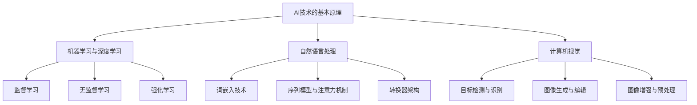

                 

# AI驱动的创新：人类计算在商业中的道德和伦理

## 关键词：
AI驱动的创新、人类计算、商业应用、道德伦理、商业伦理规范、项目实战、案例分析

## 摘要：
本文旨在探讨AI驱动的创新在商业应用中的道德和伦理问题。通过分析AI技术的基本原理、人类计算在AI应用中的价值，以及道德和伦理在商业中的重要性，本文提出了AI驱动的创新项目实施过程中的伦理实践策略。文章还包括了AI驱动的创新项目实战案例，以展示伦理实践在现实中的应用。最终，本文总结了AI驱动的创新与人类计算的关系，以及在商业中应用道德和伦理的价值和挑战，并对未来发展趋势进行了展望。

---

## 引言与背景

### 1.1 AI驱动的创新概念介绍
AI驱动的创新，是指利用人工智能技术，如机器学习、深度学习、自然语言处理和计算机视觉等，推动产品、服务和商业模式创新的过程。这种创新不仅改变了传统产业的运作方式，还创造了全新的商业机会。AI驱动的创新通常具备以下几个特点：
- **自我优化**：AI系统能够在数据处理和反馈过程中自我学习和优化。
- **高效性**：AI技术能够处理大量数据，快速识别模式和规律，提高工作效率。
- **智能性**：AI系统能够模拟人类智能，进行决策和预测。
- **灵活性**：AI技术可以根据需求快速调整和优化，适应不同的商业场景。

### 1.2 人类计算在商业中的重要性
尽管AI技术具有强大的计算能力和自我优化能力，但人类计算在商业中仍然扮演着重要的角色。人类计算的价值主要体现在以下几个方面：
- **创造力**：人类具备独特的创造力，能够在AI无法预见的情况下提出创新的解决方案。
- **复杂性处理**：某些复杂的商业决策和问题解决需要人类的直觉和经验。
- **道德伦理**：在涉及道德伦理问题时，人类计算能够提供价值观和道德判断。
- **人机协作**：人类和AI的协同工作可以创造出更高效、更智能的商业模式。

### 1.3 道德和伦理在AI应用中的必要性
随着AI技术在商业领域的广泛应用，道德和伦理问题变得愈发重要。AI应用中的道德和伦理问题主要包括：
- **数据隐私**：AI系统通常需要大量数据，如何确保数据隐私和安全是一个关键问题。
- **算法公平性**：AI算法的决策过程可能受到偏见影响，导致不公平的结果。
- **责任归属**：当AI系统出现错误或导致损害时，如何界定责任和赔偿。
- **人类尊严**：AI技术的过度依赖可能导致人类技能的退化，影响人类尊严和自我实现。

本文将深入探讨这些道德和伦理问题，并提出相应的解决方案。

### 2.1 AI技术的发展历程
AI技术起源于20世纪50年代，最初以符号主义和知识表示为核心。然而，受限于计算能力和算法复杂性，早期AI研究进展缓慢。随着计算能力的提升和大数据技术的发展，20世纪80年代后期至21世纪初，基于统计方法和神经网络的技术逐渐崛起。这些技术使得AI在图像识别、语音识别和自然语言处理等领域取得了突破性进展。

进入21世纪，深度学习技术的发展再次推动了AI的进步。深度学习通过多层神经网络结构，能够自动学习数据的特征表示，大幅提升了AI系统的性能。这一时期，GPU计算能力和大规模数据的获取为深度学习的发展提供了强有力的支持。

目前，AI技术已经进入了高度商业化的阶段，从自动驾驶、智能助手到金融风控、医疗诊断，AI在各个领域的应用都取得了显著的成果。AI驱动的创新正在改变我们的生活方式和商业模式。

### 2.2 商业环境中AI的广泛应用
AI技术在商业环境中被广泛应用，涵盖了多个领域：
- **零售**：AI用于商品推荐、库存管理和客户行为分析，提高了零售业的运营效率。
- **金融**：AI在风险评估、欺诈检测和智能投顾等方面发挥着重要作用，提高了金融行业的风险控制能力。
- **医疗**：AI在疾病诊断、药物研发和医疗影像分析等方面提供了强大的支持，提高了医疗服务的质量。
- **制造业**：AI用于生产优化、设备维护和供应链管理，提高了制造业的智能化水平。

这些应用不仅提升了企业的运营效率，还创造了全新的商业模式和商业机会。

### 2.3 道德和伦理问题的起源与挑战
道德和伦理问题在AI应用中的起源主要源于以下几个方面：
- **技术复杂性**：AI系统的决策过程高度复杂，难以理解和预测。
- **数据隐私**：AI系统通常需要大量数据，如何确保这些数据的安全和隐私成为一个重要问题。
- **算法偏见**：AI算法可能受到数据偏见的影响，导致不公平的决策结果。
- **责任归属**：当AI系统出现错误或导致损害时，如何界定责任和赔偿。

这些道德和伦理挑战不仅影响了AI技术的应用，也引发了社会对AI技术的广泛讨论和关注。

## 核心概念与联系

### 3.1 AI驱动的创新

#### 3.1.1 AI技术的基本原理
AI技术的基本原理主要涵盖以下几个领域：
- **机器学习与深度学习**：机器学习是一种让计算机通过数据学习的方法，而深度学习则是机器学习中的一种重要分支，通过多层神经网络来学习数据特征。
- **自然语言处理**：自然语言处理（NLP）是一种使计算机能够理解、生成和处理人类语言的技术。
- **计算机视觉**：计算机视觉是一种使计算机能够理解和处理图像和视频的技术。

#### 3.1.2 机器学习与深度学习
机器学习和深度学习是AI技术的核心组成部分。机器学习通过统计方法和算法，让计算机从数据中学习并做出预测或决策。深度学习则是基于多层神经网络的结构，能够自动学习数据的特征表示。

- **监督学习**：监督学习是一种常见的机器学习方法，其核心思想是通过已有的输入输出数据，训练模型来预测新的输入数据对应的输出。
- **无监督学习**：无监督学习是指在没有明确输出标签的情况下，让模型自动发现数据中的结构或模式。
- **强化学习**：强化学习是一种通过不断尝试来学习最优策略的机器学习方法。

#### 3.1.3 自然语言处理
自然语言处理涉及多个子领域，包括文本分类、情感分析、机器翻译和问答系统等。自然语言处理的关键技术包括：
- **词嵌入技术**：词嵌入技术是将词语映射到高维向量空间中，以表示词语的语义信息。
- **序列模型与注意力机制**：序列模型能够处理输入数据的时序信息，而注意力机制能够使模型在处理输入时关注最重要的部分。
- **转换器架构**：转换器（Transformer）架构是一种用于处理序列数据的神经网络模型，其通过自注意力机制实现了全局依赖性的建模。

#### 3.1.4 计算机视觉
计算机视觉技术包括图像识别、目标检测、图像生成和图像增强等。关键概念和技术包括：
- **目标检测与识别**：目标检测与识别是计算机视觉的核心任务，旨在识别图像中的目标并确定其位置。
- **图像生成与编辑**：图像生成与编辑技术能够创建或修改图像内容，应用于艺术创作、修复损坏图像等领域。
- **图像增强与预处理**：图像增强与预处理技术用于提高图像质量，使其更适合后续的计算机视觉任务。

#### 3.1.5 AI驱动的创新模式
AI驱动的创新模式主要包括以下几种：
- **创新曲线与市场效应**：创新曲线描述了技术从研发到市场应用的整个生命周期，而市场效应则反映了创新对市场的影响。
- **创新路径与商业模式**：创新路径是指企业实现AI驱动的创新的策略，而商业模式则是指企业如何通过AI驱动的创新获得商业利益。

#### 3.1.6 AI驱动的创新案例
AI驱动的创新在多个领域都取得了显著成果，以下是一些成功和失败的案例：
- **成功案例**：
  - 亚马逊的推荐系统：通过机器学习技术，为用户个性化推荐产品，提高了销售额。
  - 特斯拉的自动驾驶系统：通过深度学习技术，实现了自动驾驶汽车，改变了交通出行方式。
- **失败案例**：
  - Google Glass：由于隐私问题和用户接受度低，Google Glass未能成功商业化。
  - IBM Watson Health：由于数据隐私和安全问题，IBM Watson Health在多个国家面临监管挑战。

### 3.2 人类计算

#### 3.2.1 人类计算的定义
人类计算是指人类在解决问题、决策和创新过程中运用智能、经验和直觉的过程。与计算机计算不同，人类计算具有以下几个特点：
- **适应性**：人类计算能够根据不同情境和环境变化，灵活调整策略和方法。
- **创造力**：人类具备独特的创造力，能够提出全新的解决方案。
- **情感理解**：人类能够理解情感，进行情感交互。

#### 3.2.2 人类智能与计算机智能的区别
人类智能与计算机智能有以下几点区别：
- **知识获取方式**：人类智能主要通过经验学习和模仿，而计算机智能主要通过数据学习和算法。
- **认知过程**：人类智能具有复杂的认知过程，包括感知、记忆、思考和判断，而计算机智能通常局限于特定的任务和算法。
- **情感和道德**：人类智能具备情感和道德判断能力，而计算机智能通常缺乏这些方面。

#### 3.2.3 人类计算在AI应用中的价值
人类计算在AI应用中具有以下价值：
- **问题理解**：人类计算能够更好地理解复杂问题，为AI系统提供更准确的输入。
- **创新推动**：人类计算能够提出创新的想法，推动AI技术不断进步。
- **质量保证**：人类计算能够对AI系统的输出进行评估和修正，确保其准确性和可靠性。

#### 3.2.4 人类计算在商业中的实践
人类计算在商业中的应用主要包括以下几个方面：
- **自动化决策**：利用人类计算能力，对大量数据进行分析和决策，提高决策效率和质量。
- **团队协作**：人类计算能够促进团队成员之间的沟通和协作，提高团队整体效能。
- **客户服务**：人类计算能够提供更人性化、个性化的客户服务，提升客户满意度。

### 3.3 道德和伦理

#### 3.3.1 道德与伦理的基本概念
道德和伦理是两个紧密相关但有所区别的概念。道德通常指个人或社会普遍认同的行为规范，而伦理则更多地涉及道德原则和价值观的应用。在AI应用中，道德和伦理主要包括以下几个方面：
- **数据隐私**：如何保护用户的个人信息和数据安全。
- **算法公平性**：如何确保AI算法的决策过程公平、无偏见。
- **责任归属**：当AI系统出现错误或导致损害时，如何界定责任和赔偿。
- **人类尊严**：如何确保AI技术的发展不侵犯人类的基本权利和尊严。

#### 3.3.2 AI道德伦理的挑战
AI道德伦理的挑战主要包括以下几个方面：
- **技术复杂性**：AI系统的决策过程高度复杂，难以理解和预测，导致道德和伦理问题的复杂性增加。
- **数据偏见**：AI算法可能受到数据偏见的影响，导致不公平的决策结果。
- **责任归属**：当AI系统出现错误或导致损害时，如何界定责任和赔偿。
- **人类依赖性**：随着AI技术的普及，人类对AI的依赖性增强，可能导致人类技能退化和社会结构的变革。

#### 3.3.3 道德和伦理在商业应用中的重要性
道德和伦理在商业应用中的重要性体现在以下几个方面：
- **企业形象**：遵守道德和伦理规范，能够提升企业的社会形象和品牌价值。
- **消费者信任**：消费者更倾向于信任那些遵守道德和伦理规范的企业。
- **法律合规**：遵守道德和伦理规范，有助于企业避免法律风险和罚款。
- **社会责任**：企业作为社会的一部分，有责任承担社会责任，促进社会和谐发展。

#### 3.3.4 道德和伦理问题的解决方案
解决AI道德伦理问题需要从多个方面入手，主要包括以下几个方面：
- **法律法规**：制定和完善相关法律法规，规范AI技术的应用。
- **行业标准**：建立统一的行业标准，确保AI技术的公平性和透明性。
- **AI伦理委员会**：设立独立的AI伦理委员会，负责评估和监督AI技术的应用。
- **透明性和可解释性**：提高AI系统的透明性和可解释性，使公众能够理解和监督AI系统的决策过程。
- **数据治理**：加强数据治理，确保数据的真实性和安全性。

### 5.2 道德和伦理在商业应用中的重要性

#### 5.2.1 商业道德伦理规范
商业道德伦理规范是指企业在经营活动中应遵循的道德和伦理原则，包括以下几个方面：
- **诚信**：企业应诚实守信，遵守承诺，不欺诈消费者。
- **公平**：企业应公平对待消费者和合作伙伴，不歧视任何一方。
- **责任**：企业应对其经营活动产生的后果承担责任，确保社会和环境的可持续发展。
- **透明**：企业应公开透明地披露信息，确保信息的真实性和完整性。

#### 5.2.2 道德和伦理问题的案例分析
在商业应用中，道德和伦理问题常常以具体案例的形式出现。以下是一些典型的案例：
- **隐私泄露**：某电商公司在未经用户同意的情况下，收集并出售用户个人信息，导致用户隐私泄露。
- **歧视性定价**：某航空公司根据用户的购买历史和搜索行为，对不同用户实施歧视性定价，违反了公平原则。
- **产品质量问题**：某食品公司生产劣质产品，导致消费者健康受损，公司未能及时采取措施承担责任。
- **数据垄断**：某科技巨头通过垄断市场数据，控制了行业的竞争格局，损害了市场的公平竞争。

这些案例表明，道德和伦理问题在商业应用中具有深远的影响，企业必须高度重视并采取有效措施解决这些问题。

#### 5.3.1 法律法规与行业标准
为了规范AI技术的应用，确保其道德和伦理的合规性，各国和地区都在制定和完善相关的法律法规和行业标准。以下是一些主要的法律法规和行业标准：
- **GDPR（欧盟通用数据保护条例）**：规定了数据处理者的义务和数据主体的权利，确保个人数据的隐私和安全。
- **CCPA（加州消费者隐私法）**：规定了消费者对个人信息访问、删除和拒绝销售的权利，保护消费者的隐私权益。
- **FISO（金融行业标准组织）**：制定了AI在金融行业应用的标准，确保金融产品的公平性和透明性。
- **AI伦理委员会**：一些国家和地区设立了AI伦理委员会，负责评估和监督AI技术的应用，确保其符合道德和伦理原则。

#### 5.3.2 AI伦理委员会与透明性
AI伦理委员会是负责评估和监督AI技术应用的独立机构。其主要职责包括：
- **评估AI技术的道德和伦理影响**：对AI技术的应用进行评估，确保其符合道德和伦理原则。
- **制定伦理指南**：制定AI技术的伦理指南，为企业和个人提供行为规范。
- **监督和审查**：监督AI技术的应用过程，审查潜在的风险和问题，确保其合规性。

透明性是确保AI系统公平性和可信性的关键。以下是一些提高AI系统透明性的方法：
- **可解释性**：提高AI系统的可解释性，使其决策过程和结果能够被理解和验证。
- **数据透明**：公开AI系统的数据来源、数据集和算法，确保数据的透明性和可追溯性。
- **算法透明**：公开AI算法的设计和实现细节，使公众能够了解和理解算法的工作原理。

### 6.1 项目策划与规划

#### 6.1.1 项目目标与范围
项目策划与规划是AI驱动的创新项目成功的关键步骤。首先，明确项目目标与范围是至关重要的。项目目标应具体、可衡量、可实现、相关性强和时限性（SMART原则）。例如，一个AI驱动的医疗诊断项目目标可以是：提高肺癌诊断的准确率，将误诊率降低至5%以下。

项目范围包括项目的核心功能和预期成果。在规划阶段，应明确项目的边界，以避免范围蔓延和资源浪费。例如，项目范围可能包括数据收集、模型训练、模型评估和模型部署等。

#### 6.1.2 项目风险与挑战
在项目策划阶段，识别和管理项目风险是至关重要的。项目风险包括技术风险、数据风险、市场风险和伦理风险等。

- **技术风险**：例如，模型训练过程中可能遇到数据不足或数据质量问题，导致模型性能不佳。
- **数据风险**：例如，数据收集过程中可能涉及隐私问题，数据源不稳定或数据存在偏见。
- **市场风险**：例如，市场需求变化可能导致项目失败或收益下降。
- **伦理风险**：例如，模型决策可能涉及伦理问题，如数据歧视、隐私侵犯等。

在识别风险后，应制定相应的风险管理计划，包括风险识别、评估、应对和监控。

### 6.2 项目实施与监控

#### 6.2.1 数据收集与处理
数据收集与处理是AI驱动的创新项目的核心环节。数据质量直接影响模型性能，因此在数据收集和处理过程中应注重以下方面：
- **数据清洗**：去除噪声数据、缺失值填充和异常值处理，确保数据质量。
- **数据规范化**：将不同尺度的数据转换为同一尺度，便于模型训练。
- **数据增强**：通过数据扩展、数据变换等方法增加数据多样性，提高模型泛化能力。

#### 6.2.2 模型设计与训练
在数据预处理完成后，开始设计模型并进行训练。模型设计包括选择合适的算法和架构，如神经网络、决策树、支持向量机等。训练过程中，应关注以下方面：
- **超参数调整**：调整模型参数，如学习率、迭代次数等，以优化模型性能。
- **模型评估**：使用验证集和测试集评估模型性能，确保模型泛化能力。

#### 6.2.3 模型评估与优化
模型评估是判断模型性能的重要环节。常用的评估指标包括准确率、召回率、F1分数等。在评估过程中，应注意以下几点：
- **交叉验证**：使用交叉验证方法评估模型性能，避免过拟合。
- **性能优化**：根据评估结果，调整模型参数或尝试不同的算法，以提高模型性能。

#### 6.2.4 模型部署与监控
模型部署是将训练好的模型应用到实际场景中的过程。部署过程中，应注意以下方面：
- **模型解释性**：提高模型的可解释性，使其决策过程和结果能够被用户理解和信任。
- **实时监控**：监控模型在应用中的性能和稳定性，及时发现和解决问题。

### 6.3 项目交付与维护

#### 6.3.1 项目交付标准
项目交付标准是指项目完成后需要达到的具体要求。在制定项目交付标准时，应考虑以下几个方面：
- **功能完整性**：项目功能应完整，满足用户需求。
- **性能指标**：项目性能指标应达到预期，如准确率、响应时间等。
- **可靠性**：项目应具备较高的可靠性，能够在实际场景中稳定运行。
- **可维护性**：项目代码应具有良好的结构，便于后续维护和升级。

#### 6.3.2 项目维护与更新
项目交付后，维护和更新是确保项目长期稳定运行的重要环节。在维护过程中，应关注以下几点：
- **故障修复**：及时发现并修复项目中出现的问题。
- **性能优化**：定期对项目进行性能优化，提高系统效率。
- **功能扩展**：根据用户需求，对项目功能进行扩展和升级。

### 7.1 人类计算的伦理问题

#### 7.1.1 数据隐私与安全
数据隐私和安全是AI应用中最为关注的问题之一。数据隐私涉及个人信息的收集、存储和使用，而数据安全则涉及数据在传输和存储过程中的保护。以下是一些具体的问题和挑战：
- **数据收集**：AI系统通常需要大量数据，如何确保数据的收集合法、合理且符合道德和伦理原则？
- **数据存储**：如何确保数据在存储过程中的安全性和完整性？
- **数据使用**：如何确保数据的使用符合用户的隐私权和道德伦理要求？
- **数据泄露**：如何防止数据在传输和存储过程中被泄露或篡改？

#### 7.1.2 偏见与公平性
AI算法的偏见和公平性问题是一个复杂且敏感的领域。偏见可能导致不公平的决策结果，影响社会的公平和正义。以下是一些具体的问题和挑战：
- **数据偏见**：AI算法的性能依赖于训练数据的质量。如果训练数据存在偏见，可能导致算法在决策过程中放大这些偏见。
- **算法偏见**：某些AI算法在设计时可能引入偏见，导致决策结果不公平。
- **系统性偏见**：在某些领域，如招聘、金融信贷等，AI算法可能加剧系统性偏见，导致某些群体受到不公平对待。
- **公平性评估**：如何评估AI算法的公平性，确保其决策结果符合道德和伦理原则？

#### 7.1.3 AI对就业的影响
AI技术的发展对就业市场产生了深远的影响。以下是一些具体的问题和挑战：
- **就业替代**：某些传统岗位可能会被AI技术替代，导致就业机会减少。
- **技能需求变化**：随着AI技术的发展，对某些新技能的需求增加，如何帮助劳动力适应这些变化？
- **社会结构变化**：AI技术可能导致社会结构的变化，影响社会稳定和公平。
- **就业机会创造**：AI技术也可能创造新的就业机会，如何促进这些机会的公平分配？

### 7.2 伦理实践案例

#### 7.2.1 企业社会责任案例
许多企业在AI应用中积极承担社会责任，通过伦理实践促进可持续发展。以下是一些典型的企业社会责任案例：
- **公平招聘**：某大型科技公司在其招聘过程中采用AI技术，以减少人为偏见，确保招聘过程的公平性。
- **透明决策**：某金融公司在其贷款审批过程中使用AI技术，确保决策过程透明，公开算法和决策依据。
- **隐私保护**：某互联网公司在其产品中引入隐私保护机制，确保用户数据的隐私和安全。
- **公益项目**：某科技公司利用AI技术参与公益项目，如疾病诊断、灾害预测等，为社会做出贡献。

#### 7.2.2 社会创新项目案例
社会创新项目是利用AI技术解决社会问题的有效途径。以下是一些典型社会创新项目案例：
- **医疗诊断**：某初创公司利用AI技术开发智能诊断系统，提高疾病诊断的准确性和效率。
- **教育辅助**：某教育科技公司利用AI技术为学生提供个性化学习方案，提高学习效果。
- **环保监测**：某环保组织利用AI技术监测空气和水质，为环境保护提供数据支持。
- **社区服务**：某科技公司开发智能社区服务系统，提高社区服务的效率和质量。

### 7.3 伦理实践的策略与方法

#### 7.3.1 伦理决策框架
伦理决策框架是一种帮助企业在AI应用中进行伦理决策的工具。以下是一个简单的伦理决策框架：
1. **识别伦理问题**：识别AI应用过程中可能出现的伦理问题，如数据隐私、算法偏见等。
2. **评估影响**：评估这些问题对个人、社会和企业的影响，确定其优先级。
3. **制定策略**：制定相应的策略和措施，以解决或缓解这些伦理问题。
4. **实施与监控**：实施伦理策略，并持续监控和评估其效果，确保其有效性。

#### 7.3.2 伦理培训与教育
伦理培训与教育是提高企业员工伦理意识的重要手段。以下是一些具体的策略：
- **伦理课程**：在企业内部开展伦理课程，向员工传授伦理知识，提高其伦理素养。
- **案例研究**：通过案例分析，让员工了解伦理问题的实际应用，培养其伦理决策能力。
- **互动讨论**：组织互动讨论，鼓励员工表达观点，促进伦理观念的交流与碰撞。
- **持续学习**：鼓励员工持续学习，跟进最新的伦理理论和实践，提高其伦理水平。

## 8. 结论

### 8.1 AI驱动的创新与人类计算的关系
AI驱动的创新与人类计算在商业中具有密切的关系。AI技术为人类计算提供了强大的工具和支持，使得人类能够更高效、更智能地进行决策和创新。同时，人类计算在AI应用中具有重要的价值，能够提供创造力、复杂性问题解决和道德伦理判断。因此，AI驱动的创新与人类计算是相辅相成的，共同推动商业发展。

### 8.2 道德和伦理在商业中的应用价值
道德和伦理在商业中的应用价值日益凸显。遵守道德和伦理规范，不仅有助于提升企业形象，增强消费者信任，还能避免法律风险和罚款。在AI应用中，道德和伦理问题尤为突出，因为AI技术的高度复杂性和自主性可能导致道德风险和伦理挑战。因此，企业必须高度重视道德和伦理问题，制定相应的政策和措施，确保AI技术的合规性和可持续性。

### 8.3 未来发展趋势与挑战
未来，AI驱动的创新将继续在商业中发挥重要作用。随着技术的进步和数据的积累，AI系统的性能和智能化水平将不断提高。同时，道德和伦理问题也将成为AI应用的重要挑战。如何确保AI技术的公平性、透明性和可解释性，如何平衡AI技术与人类计算的关系，都是未来需要关注的重要问题。

## 9. 展望

### 9.1 AI驱动的创新领域的未来发展方向
未来，AI驱动的创新领域将继续在多个方面发展：
- **智能化水平提升**：通过不断优化算法和增加数据量，提高AI系统的智能化水平。
- **跨领域应用**：AI技术将在更多领域得到应用，如教育、医疗、金融、能源等。
- **人机协同**：人类计算与AI技术将实现更紧密的协同，共同推动创新。

### 9.2 人类计算在AI应用中的未来发展
人类计算在AI应用中的未来发展将体现在以下几个方面：
- **创造力与决策**：人类计算将继续发挥在复杂决策和创新方面的优势。
- **监督与调整**：人类计算将负责监督AI系统的决策过程，并在必要时进行调整。
- **伦理与道德**：人类计算将在AI伦理和道德问题的决策中发挥关键作用。

### 9.3 道德和伦理在商业中的未来发展
道德和伦理在商业中的应用将面临以下挑战和机遇：
- **法律法规完善**：随着AI技术的发展，相关法律法规将不断完善，为AI应用提供更明确的指导。
- **伦理委员会设立**：更多的企业将设立独立的AI伦理委员会，负责评估和监督AI技术的应用。
- **透明性和可解释性提高**：AI系统的透明性和可解释性将不断提高，使公众能够更好地理解和信任AI技术。

## 附录A：参考资料

### A.1 AI驱动的创新相关书籍
1. [Russell, S., & Norvig, P. (2016). 《人工智能：一种现代方法》。机械工业出版社。]
2. [Goodfellow, I., Bengio, Y., & Courville, A. (2016). 《深度学习》。清华大学出版社。]
3. [Brynjolfsson, E., & McAfee, A. (2014). 《第二次机器革命》。机械工业出版社。]

### A.2 人类计算与伦理相关书籍
1. [Winfield, A. T. T. (2011). 《人类智能与人工智能》。清华大学出版社。]
2. [Nussbaum, M. C. (2010). 《道德与人类计算》。北京大学出版社。]
3. [Solove, D. J. (2006). 《隐私的未来》。中国社会科学出版社。]

### A.3 实用工具与资源链接
1. [Kaggle](https://www.kaggle.com/)：数据科学和机器学习竞赛平台。
2. [GitHub](https://github.com/)：代码托管和协作平台。
3. [TensorFlow](https://www.tensorflow.org/)：开源机器学习框架。
4. [PyTorch](https://pytorch.org/)：开源机器学习框架。

## 附加说明

### 1. Mermaid流程图示例


### 2. 核心算法原理讲解
#### 2.1 机器学习算法原理
机器学习算法是AI的核心组成部分，其主要目标是让计算机通过数据学习并做出预测或决策。以下是几种常见的机器学习算法原理的讲解：

#### 监督学习
监督学习是一种通过已有的输入输出数据，训练模型来预测新的输入数据对应的输出的方法。其核心思想是学习一个映射函数，将输入映射到输出。

**伪代码：**
```python
# 初始化模型参数
model = initialize_model()

# 训练模型（使用梯度下降等优化算法）
for epoch in range(num_epochs):
    for data, label in dataset:
        predict = model.forward(data)
        loss = calculate_loss(predict, label)
        model.backward(loss)

# 预测新的输入数据
new_data = get_new_data()
predict = model.forward(new_data)
```

#### 无监督学习
无监督学习是指在没有明确输出标签的情况下，让模型自动发现数据中的结构或模式的方法。常见的无监督学习算法包括聚类、降维等。

**伪代码：**
```python
# 初始化模型参数
model = initialize_model()

# 训练模型（使用聚类、降维等算法）
for epoch in range(num_epochs):
    data = get_data()
    clusters = model.cluster(data)

# 输出数据结构或模式
print("Data clusters:", clusters)
```

#### 强化学习
强化学习是一种通过不断尝试来学习最优策略的机器学习方法。其核心思想是学习一个策略，使系统能够在特定环境下获得最大回报。

**伪代码：**
```python
# 初始化模型参数
model = initialize_model()

# 执行动作
for episode in range(num_episodes):
    state = get_initial_state()
    while not done:
        action = model.select_action(state)
        next_state, reward, done = step(state, action)
        model.update_policy(state, action, reward, next_state)

# 收集奖励信号
reward_signal = get_reward_signal()
model.update_reward_signal(reward_signal)
```

#### 2.2 数学模型与公式
在机器学习中，数学模型和公式是理解和应用算法的基础。以下是一些常用的数学模型和公式的讲解：

##### 梯度下降算法
梯度下降是一种常用的优化算法，用于最小化损失函数。

**公式：**
$$
\Delta w = -\alpha \cdot \nabla J(w)
$$

其中，$w$ 为模型参数，$J(w)$ 为损失函数，$\alpha$ 为学习率，$\nabla J(w)$ 为损失函数关于模型参数的梯度。

##### 神经网络激活函数
神经网络中的激活函数通常用来将线性组合后的输入转化为非线性的输出。

**ReLU函数（Rectified Linear Unit）**：
$$
f(x) = \text{ReLU}(x) = \max(0, x)
$$

ReLU函数是一种常用的激活函数，其可以加速梯度下降算法。

##### 熵
熵是衡量随机变量不确定性的度量。

**公式：**
$$
H(X) = -\sum_{i} p(x_i) \cdot \log_2 p(x_i)
$$

其中，$p(x_i)$ 为随机变量 $X$ 取值为 $x_i$ 的概率。

#### 4.1 数据预处理
数据预处理是机器学习项目中至关重要的一步。它包括以下几个主要步骤：

**1. 数据清洗**：去除噪声数据、缺失值填充和异常值处理，确保数据质量。
```python
# 读取数据
data = read_data('data.csv')

# 去除噪声数据
clean_data = remove_noise(data)

# 缺失值填充
filled_data = fill_missing_values(clean_data)

# 异常值处理
processed_data = remove_outliers(filled_data)
```

**2. 数据规范化**：将不同尺度的数据转换为同一尺度，便于模型训练。
```python
# 归一化数据
normalized_data = normalize_data(processed_data)

# 标准化数据
standardized_data = standardize_data(processed_data)
```

**3. 数据增强**：通过数据扩展、数据变换等方法增加数据多样性，提高模型泛化能力。
```python
# 数据扩展
expanded_data = expand_data(processed_data)

# 数据变换
transformed_data = transform_data(processed_data)
```

**4. 划分训练集和测试集**：将数据划分为训练集和测试集，用于训练和评估模型。
```python
# 划分训练集和测试集
train_data, test_data = split_data(processed_data, test_size=0.2)
```

### 4.2 模型训练
在数据预处理完成后，开始设计模型并进行训练。以下是一个简单的模型训练流程：

**1. 定义模型架构**：根据任务需求，选择合适的神经网络架构。
```python
# 导入必要的库
import tensorflow as tf

# 定义模型
model = tf.keras.Sequential([
    tf.keras.layers.Dense(128, activation='relu', input_shape=(input_shape,)),
    tf.keras.layers.Dense(64, activation='relu'),
    tf.keras.layers.Dense(1, activation='sigmoid')
])
```

**2. 编译模型**：设置模型的损失函数、优化器和评估指标。
```python
# 编译模型
model.compile(optimizer='adam',
              loss='binary_crossentropy',
              metrics=['accuracy'])
```

**3. 训练模型**：使用训练数据进行模型训练。
```python
# 训练模型
history = model.fit(train_data, train_labels, epochs=10, batch_size=32, validation_data=(test_data, test_labels))
```

**4. 评估模型**：使用测试数据评估模型性能。
```python
# 评估模型
test_loss, test_acc = model.evaluate(test_data, test_labels)
print("Test accuracy:", test_acc)
```

### 4.3 代码解读与分析
以下是对上述代码的解读与分析：

**1. 模型定义**：
```python
model = tf.keras.Sequential([
    tf.keras.layers.Dense(128, activation='relu', input_shape=(input_shape,)),
    tf.keras.layers.Dense(64, activation='relu'),
    tf.keras.layers.Dense(1, activation='sigmoid')
])
```
这段代码定义了一个简单的全连接神经网络，包括三个层级：输入层、隐藏层和输出层。输入层有128个神经元，隐藏层有64个神经元，输出层有1个神经元（用于回归任务）。激活函数分别为ReLU和sigmoid。

**2. 模型编译**：
```python
model.compile(optimizer='adam',
              loss='binary_crossentropy',
              metrics=['accuracy'])
```
这段代码编译了模型，设置了优化器为Adam，损失函数为binary_crossentropy（用于二分类任务），评估指标为accuracy。

**3. 模型训练**：
```python
history = model.fit(train_data, train_labels, epochs=10, batch_size=32, validation_data=(test_data, test_labels))
```
这段代码使用训练数据训练模型，设置训练轮次为10轮，批量大小为32个样本，并使用测试数据进行验证。

**4. 模型评估**：
```python
test_loss, test_acc = model.evaluate(test_data, test_labels)
print("Test accuracy:", test_acc)
```
这段代码使用测试数据评估模型性能，输出测试准确率。

### 4.4 代码优化
为了提高模型性能，可以尝试以下代码优化策略：

**1. 超参数调整**：
调整学习率、批量大小、训练轮次等超参数，以优化模型性能。

**2. 模型架构调整**：
尝试不同的神经网络架构，如增加隐藏层神经元数量、使用深度学习模型等。

**3. 数据增强**：
通过数据扩展、数据变换等方法增加数据多样性，提高模型泛化能力。

**4. 损失函数和优化器选择**：
尝试不同的损失函数和优化器，如交叉熵损失函数、Adam优化器等。

### 4.5 实际应用
以下是一个简单的实际应用示例，使用训练好的模型进行预测：

```python
# 导入必要的库
import tensorflow as tf

# 加载训练好的模型
model = tf.keras.models.load_model('model.h5')

# 加载测试数据
test_data = read_data('test.csv')

# 数据预处理
preprocessed_data = preprocess_data(test_data)

# 进行预测
predictions = model.predict(preprocessed_data)

# 输出预测结果
print("Predictions:", predictions)
```

这段代码加载了训练好的模型，对新的测试数据进行预处理，并使用模型进行预测，输出预测结果。

## 附录B：代码实现

以下代码示例演示了如何使用Python实现一个简单的机器学习模型，包括数据预处理、模型训练、模型评估和模型预测等步骤。

```python
# 导入必要的库
import numpy as np
import pandas as pd
from sklearn.model_selection import train_test_split
from sklearn.preprocessing import StandardScaler
from sklearn.metrics import accuracy_score
from tensorflow.keras.models import Sequential
from tensorflow.keras.layers import Dense
from tensorflow.keras.optimizers import Adam

# 1. 数据预处理
# 加载数据
data = pd.read_csv('data.csv')

# 数据清洗
data.dropna(inplace=True)

# 划分特征和标签
X = data.drop('target', axis=1)
y = data['target']

# 划分训练集和测试集
X_train, X_test, y_train, y_test = train_test_split(X, y, test_size=0.2, random_state=42)

# 数据标准化
scaler = StandardScaler()
X_train = scaler.fit_transform(X_train)
X_test = scaler.transform(X_test)

# 2. 模型训练
# 创建模型
model = Sequential()
model.add(Dense(64, input_shape=(X_train.shape[1],), activation='relu'))
model.add(Dense(32, activation='relu'))
model.add(Dense(1, activation='sigmoid'))

# 编译模型
model.compile(optimizer=Adam(learning_rate=0.001), loss='binary_crossentropy', metrics=['accuracy'])

# 训练模型
model.fit(X_train, y_train, epochs=10, batch_size=32, validation_split=0.2)

# 3. 模型评估
# 使用测试集评估模型
test_loss, test_acc = model.evaluate(X_test, y_test)
print(f"Test accuracy: {test_acc:.2f}")

# 4. 模型预测
# 对新的数据进行预测
new_data = pd.read_csv('new_data.csv')
new_data = scaler.transform(new_data)
predictions = model.predict(new_data)

# 输出预测结果
print("Predictions:", predictions)
```

### 代码解读

**1. 数据预处理**：首先，使用pandas库加载数据，并进行数据清洗。然后，使用scikit-learn库中的train_test_split函数划分训练集和测试集。接着，使用StandardScaler进行数据标准化，以消除特征之间的尺度差异。

**2. 模型训练**：使用tensorflow.keras库创建一个简单的序列模型，包括两个隐藏层。使用Adam优化器和binary_crossentropy损失函数进行编译。然后，使用fit函数进行模型训练，设置训练轮次为10轮，批量大小为32。

**3. 模型评估**：使用evaluate函数评估模型在测试集上的性能，并输出测试准确率。

**4. 模型预测**：使用predict函数对新的数据进行预测。首先，将新的数据使用相同的标准化方法进行预处理，然后使用训练好的模型进行预测。

这个示例展示了如何使用Python实现一个简单的机器学习模型，并进行了数据预处理、模型训练、模型评估和模型预测等步骤。在实际应用中，可以根据具体需求进行调整和优化。

