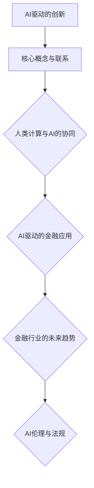

                 

### 文章标题

AI驱动的创新：人类计算在金融行业的未来趋势

### 关键词

人工智能，金融行业，创新，人类计算，未来趋势

### 摘要

随着人工智能（AI）技术的飞速发展，金融行业正经历着前所未有的变革。本文将深入探讨AI驱动的创新对金融行业带来的影响，以及人类计算在这一过程中扮演的关键角色。文章首先概述了AI驱动的创新背景和基础，然后分析了AI的核心概念与架构，接着探讨了人类计算的特长及其与AI的协同作用。文章还详细介绍了金融行业中的AI应用，包括金融市场预测、信用评估和风险管理等。最后，通过实践案例展示了AI驱动的金融创新，并展望了未来的发展趋势和潜在风险。本文旨在为读者提供一幅全面的AI驱动创新在金融行业的蓝图。

### 第一部分: AI驱动的创新基础

#### 第1章: AI驱动的创新概述

##### 1.1 AI驱动的创新背景

在21世纪的今天，人工智能（AI）技术已经从理论研究走向了实际应用，成为推动各行各业变革的重要力量。在金融行业，AI的应用不仅改变了传统金融服务的模式，还极大地提升了金融服务的效率和精确度。

**1.1.1 人工智能的发展历程**

人工智能的发展可以分为以下几个阶段：

1. **萌芽阶段（1956-1969）**：1956年，达特茅斯会议提出了“人工智能”这一概念，标志着人工智能领域的诞生。这一阶段的重点在于理论模型的构建和算法的研究。
2. **探索阶段（1970-1980）**：由于计算资源的限制，人工智能的研究进入低谷期。这一时期的重点转向了专家系统和规则引擎的研究。
3. **复苏阶段（1980-1990）**：随着计算机技术的进步，人工智能研究重新焕发生机。特别是机器学习和神经网络技术的兴起，使得人工智能开始迈向实际应用。
4. **快速发展阶段（1990至今）**：互联网的普及和大数据技术的发展，为人工智能提供了丰富的数据和计算资源。深度学习等前沿技术的突破，使得人工智能在各个领域取得了显著的成果。

**1.1.2 AI在金融行业的应用现状**

在金融行业，AI技术的应用已经涵盖了多个方面：

1. **风险管理**：通过机器学习算法，金融机构可以更准确地预测市场风险，优化投资组合。
2. **信用评估**：基于大数据和AI技术，金融机构可以更快速、准确地评估借款人的信用风险。
3. **客户服务**：AI驱动的聊天机器人和虚拟助理提高了客户服务的效率和质量。
4. **投资决策**：量化交易和智能投顾利用AI技术，为投资者提供更科学的决策支持。

**1.1.3 AI驱动的创新意义**

AI驱动的创新在金融行业具有深远的意义：

1. **提升效率**：AI技术可以自动化许多重复性的工作，减少人工干预，提高工作效率。
2. **降低成本**：通过自动化和智能化，金融机构可以降低运营成本，提高竞争力。
3. **风险控制**：AI技术可以帮助金融机构更早地发现潜在风险，采取有效措施进行控制。
4. **个性化服务**：AI技术可以根据客户的行为和需求，提供个性化的金融服务，增强客户满意度。

##### 1.2 AI驱动的创新框架

AI驱动的创新框架主要包括以下几个关键要素和流程：

**1.2.1 AI驱动的创新流程**

1. **需求识别**：明确业务需求，确定AI技术的应用场景。
2. **数据准备**：收集和整理相关数据，确保数据质量和完整性。
3. **模型构建**：选择合适的算法，构建预测或决策模型。
4. **模型训练**：使用历史数据对模型进行训练，优化模型参数。
5. **模型评估**：使用验证集或测试集评估模型性能。
6. **模型部署**：将训练好的模型部署到实际业务场景中。
7. **模型迭代**：根据实际应用效果，对模型进行持续优化和迭代。

**1.2.2 AI驱动的创新要素**

1. **数据资源**：高质量的数据是AI驱动的创新的基础。
2. **算法技术**：先进的算法技术是构建有效模型的关键。
3. **计算能力**：强大的计算能力是实现快速训练和优化模型的保障。
4. **业务理解**：深入的业务理解有助于确定AI技术的应用场景和优化方向。
5. **数据治理**：确保数据的安全性和隐私性，遵守相关法规和伦理规范。

**1.2.3 AI驱动的创新模型**

AI驱动的创新模型可以归纳为以下几个步骤：

1. **需求分析**：明确创新的目标和需求。
2. **技术选型**：选择合适的AI技术和算法。
3. **数据采集**：收集相关数据和业务数据。
4. **数据预处理**：对数据进行清洗、转换和标准化。
5. **模型构建**：构建和训练预测或决策模型。
6. **模型评估**：评估模型的性能和准确性。
7. **模型部署**：将模型部署到实际业务场景中。
8. **持续优化**：根据实际应用效果，对模型进行优化和迭代。

##### 1.3 人类计算与AI的协同

在AI驱动的创新过程中，人类计算与AI的协同作用至关重要。人类计算和AI各有优势，互补协同，可以发挥更大的价值。

**1.3.1 人类计算的优势**

1. **情境理解**：人类能够从复杂的业务环境中理解问题的本质，提供更符合实际需求的解决方案。
2. **创意与创新**：人类的直觉和创造力在发现新问题和提出解决方案方面具有独特的优势。
3. **情感交流**：人类能够进行情感交流，提供更人性化的服务，增强客户的信任和满意度。

**1.3.2 AI的计算能力**

1. **海量数据处理**：AI能够快速处理海量数据，提取有用的信息，进行复杂的计算和分析。
2. **模式识别**：AI能够在数据中发现隐藏的模式和规律，为决策提供支持。
3. **自动化执行**：AI能够自动化执行复杂的任务，减少人力干预，提高效率。

**1.3.3 人类计算与AI的协同效应**

1. **优势互补**：人类计算和AI在处理问题时的优势互补，可以共同解决复杂的问题。
2. **智能决策**：通过AI的辅助，人类计算可以做出更科学的决策，提高决策的准确性和效率。
3. **创新加速**：人类计算和AI的协同可以加速创新过程，推动金融行业的持续变革和发展。

### 第2章: AI核心概念与架构

在探讨AI驱动的创新在金融行业中的应用之前，我们需要深入了解AI的核心概念与架构。本章节将介绍机器学习、深度学习、自然语言处理等AI基础理论，以及神经网络、计算机视觉、强化学习等AI架构设计，并通过具体应用案例展示AI在金融风险管理、量化交易和客户服务自动化等方面的实际作用。

##### 2.1 AI基础理论

AI的基础理论主要包括机器学习、深度学习和自然语言处理等核心概念。

**2.1.1 机器学习基本概念**

机器学习是一种通过数据训练模型，使其能够对未知数据进行预测或分类的方法。机器学习可以分为监督学习、无监督学习和强化学习三种类型。

**监督学习**

监督学习是一种有标签数据的学习方法，其目的是通过已有数据的输入和输出关系，建立一个预测模型，以便对新数据进行预测。

**伪代码：**

python
def supervise_learning(X, y):
    # X: 输入特征矩阵
    # y: 输出标签向量
    # 构建模型
    model = Model()
    # 训练模型
    model.fit(X, y)
    # 预测
    predictions = model.predict(X)
    return predictions

**无监督学习**

无监督学习是一种没有标签数据的学习方法，其目的是通过已有数据的内在结构，发现数据的分布、模式或聚类。

**伪代码：**

python
def unsupervised_learning(X):
    # X: 输入特征矩阵
    # 发现数据分布
    clusters = KMeans(n_clusters=k).fit(X)
    # 返回聚类结果
    return clusters

**强化学习**

强化学习是一种通过与环境的交互，不断调整策略，以实现最大化长期奖励的学习方法。

**伪代码：**

python
def reinforce_learning():
    # 初始化策略
    policy = initialize_policy()
    # 与环境交互
    for episode in range(num_episodes):
        state = environment.reset()
        done = False
        while not done:
            action = policy.select_action(state)
            next_state, reward, done = environment.step(action)
            # 更新策略
            policy.update(state, action, reward, next_state, done)
            state = next_state
    return policy

**2.1.2 深度学习原理**

深度学习是机器学习的一个分支，其核心思想是通过多层神经网络对数据进行建模和学习。深度学习在图像识别、语音识别和自然语言处理等领域取得了显著成果。

**神经网络结构**

神经网络由输入层、隐藏层和输出层组成。每个神经元接收前一层神经元的输出，通过加权求和和激活函数处理后，输出下一层的输入。

**计算机视觉框架**

计算机视觉是深度学习的重要应用领域，通过图像识别和图像处理技术，实现物体的检测、分类和分割等功能。

**强化学习机制**

强化学习在金融交易、自动化控制和推荐系统等领域具有广泛的应用。强化学习通过学习策略，实现从环境状态到动作的决策过程，并不断优化策略，以最大化长期奖励。

**2.1.3 自然语言处理基础**

自然语言处理（NLP）是深度学习在语言领域的应用，通过文本数据的处理和分析，实现机器翻译、情感分析和文本分类等功能。

**词向量表示**

词向量是NLP中的核心概念，通过将词汇映射到高维空间中的向量，实现词汇的数值表示，便于计算机处理。

**循环神经网络（RNN）**

循环神经网络是处理序列数据的有效模型，通过保留历史信息，实现对序列数据的建模。

**变换器（Transformer）**

变换器是NLP领域的一种新型模型，通过自注意力机制，实现对序列数据的全局关注和建模，大幅提升了NLP的性能。

##### 2.2 AI架构设计

AI架构设计是构建有效AI模型的关键。以下介绍神经网络、计算机视觉和强化学习等AI架构设计的基本原理。

**神经网络结构**

神经网络由多层神经元组成，每个神经元接收前一层神经元的输出，通过加权求和和激活函数处理后，输出下一层的输入。

**计算机视觉框架**

计算机视觉框架主要包括卷积神经网络（CNN）和目标检测模型。CNN通过卷积和池化操作，实现对图像的特征提取和分类；目标检测模型通过检测框和分类标签，实现对图像中目标物体的检测和识别。

**强化学习机制**

强化学习机制通过学习策略，实现从环境状态到动作的决策过程，并不断优化策略，以最大化长期奖励。强化学习机制可以分为基于值函数的方法和基于策略的方法。

**2.3 AI应用案例**

**金融风险管理**

在金融风险管理领域，AI技术被广泛应用于风险预测、信用评估和投资组合优化等方面。

**案例：AI驱动的风险预测**

某金融机构利用AI技术对市场风险进行预测。通过收集大量历史市场数据，金融机构构建了基于深度学习模型的预测模型。模型通过分析市场趋势和交易行为，预测未来市场的波动情况，为投资者提供风险预警。

**量化交易**

量化交易是指利用数学模型和算法，自动执行金融交易。AI技术在量化交易中发挥着重要作用，通过分析历史交易数据和市场趋势，AI算法可以预测未来市场走势，实现自动化交易。

**案例：AI驱动的量化交易策略**

某量化交易团队利用AI技术构建了基于深度学习策略的量化交易模型。模型通过分析市场数据，发现潜在的交易机会，并自动执行交易。在一段时间的测试中，模型实现了较高的收益率，为投资者带来了稳定的收益。

**客户服务自动化**

随着AI技术的发展，客户服务逐渐从人工服务转向自动化服务。AI驱动的聊天机器人和虚拟助理为金融机构提供了高效的客户服务，提高了客户满意度。

**案例：AI驱动的聊天机器人**

某金融机构部署了基于自然语言处理技术的聊天机器人，提供24/7的在线客服服务。聊天机器人通过理解和回答客户的问题，减少了人工客服的工作量，提高了服务效率。同时，聊天机器人的数据反馈有助于金融机构优化客户服务策略。

### 第二部分: 人类计算的潜力

#### 第3章: 人类计算的特长

在AI技术飞速发展的背景下，人类计算在金融行业的潜力依然不可忽视。人类计算具有独特的优势和特长，能够在复杂决策、情境理解和人际交往等方面发挥关键作用。本章将深入探讨人类计算的这些特长，以及如何与AI技术相结合，共同推动金融行业的创新与发展。

##### 3.1 创意与直觉

人类的创意和直觉在金融决策中发挥着重要作用。与机械的计算和算法相比，人类能够从复杂的信息中提取关键因素，形成独特的见解和创意。

**3.1.1 创意的生成机制**

创意的生成机制涉及多个层面：

1. **联想思维**：通过不同领域的知识交叉，产生新的思路和解决方案。
2. **模式识别**：从大量数据中识别出潜在的规律和趋势，提出创新性观点。
3. **非线性思维**：突破传统思维的束缚，采用非线性的方法解决问题。

**3.1.2 直觉思维在金融决策中的作用**

直觉思维在金融决策中具有以下几个作用：

1. **快速决策**：在面对突发情况时，直觉可以帮助决策者迅速做出反应。
2. **预测能力**：直觉能够捕捉到市场中的细微变化，为投资者提供前瞻性指导。
3. **风险控制**：直觉可以帮助决策者识别潜在的风险，采取预防措施。

**3.1.3 创意与AI的融合**

创意与AI技术的融合能够实现优势互补：

1. **数据挖掘**：AI技术可以处理海量数据，为创意提供更多的素材和灵感。
2. **自动化实现**：AI技术可以将创意转化为具体的算法和模型，实现自动化执行。
3. **创新加速**：AI技术可以帮助人类更快速地尝试和验证创意，加速创新过程。

##### 3.2 分析与判断

人类计算在分析和判断方面具有独特的优势。通过逻辑推理、统计学方法和情境分析，人类能够对复杂的问题进行深入分析和准确判断。

**3.2.1 数据分析的方法**

数据分析是金融决策的重要基础。以下是一些常见的数据分析方法：

1. **描述性分析**：通过统计指标（如均值、方差、中位数等）描述数据的特征。
2. **推断性分析**：通过样本数据推断总体特征，进行假设检验。
3. **预测性分析**：利用历史数据建立预测模型，对未来趋势进行预测。

**3.2.2 统计学的应用**

统计学在金融决策中的应用主要体现在以下几个方面：

1. **回归分析**：通过建立回归模型，分析变量之间的关系，进行预测和控制。
2. **时间序列分析**：通过分析时间序列数据，预测未来的趋势和周期性变化。
3. **假设检验**：通过显著性检验，判断决策的可靠性和有效性。

**3.2.3 判断力与决策质量**

判断力是金融决策的核心。以下因素影响决策质量：

1. **信息质量**：决策所需的信息是否准确、完整和及时。
2. **认知偏差**：人类在决策过程中可能存在的认知偏差，如过度自信、锚定效应等。
3. **情境适应性**：决策者是否能够根据不同情境调整决策策略。

##### 3.3 人际交往与沟通

人际交往和沟通是金融行业不可或缺的技能。通过有效的沟通，人类能够建立信任、协调合作，实现金融目标的共同实现。

**3.3.1 人际关系的建立**

人际关系建立在信任和尊重的基础上。以下是一些建立人际关系的原则：

1. **倾听与理解**：倾听对方的意见和需求，建立良好的沟通氛围。
2. **共同目标**：与对方建立共同的目标和利益，实现双赢。
3. **尊重差异**：尊重对方的观点和价值观，避免冲突和误解。

**3.3.2 沟通技巧**

有效的沟通需要技巧和策略。以下是一些常用的沟通技巧：

1. **清晰表达**：用简洁明了的语言表达自己的观点，避免歧义。
2. **积极倾听**：关注对方的意见和需求，积极回应。
3. **非语言沟通**：通过肢体语言、面部表情等非语言方式，增强沟通效果。

**3.3.3 人际交往在金融服务中的应用**

人际交往在金融服务中的应用主要体现在以下几个方面：

1. **客户关系管理**：通过建立良好的客户关系，提高客户满意度和忠诚度。
2. **团队合作**：通过有效的沟通和协作，实现团队目标的最大化。
3. **业务拓展**：通过人际网络，挖掘潜在商机，实现业务的拓展。

##### 3.4 人类计算与AI的协同

人类计算和AI技术在金融行业中的协同作用日益显著。通过结合两者的优势，可以进一步提升金融服务的质量和效率。

**3.4.1 互补优势**

人类计算和AI技术的互补优势主要体现在以下几个方面：

1. **数据挖掘与分析**：AI技术能够处理海量数据，进行深度挖掘和分析；人类计算则能够从中提取关键信息，进行精准判断。
2. **情境理解与适应**：人类计算能够根据具体情境调整策略，适应复杂多变的环境；AI技术则能够提供稳定的计算和预测能力，为决策提供支持。
3. **创新与优化**：人类计算能够提出创新性的解决方案，推动金融服务的变革；AI技术则能够通过自动化和优化，实现创新的快速落地和推广。

**3.4.2 协同工作**

人类计算和AI技术在协同工作中的表现：

1. **协同决策**：通过AI技术的辅助，人类计算可以更快速地做出准确决策，提高决策效率。
2. **协同分析**：AI技术可以进行大规模的数据分析，人类计算则能够从中提取有价值的信息，进行深入分析。
3. **协同创新**：人类计算可以提出创新性的想法，AI技术则能够将想法转化为具体的算法和模型，实现创新。

**3.4.3 创新潜力**

人类计算和AI技术的协同具有巨大的创新潜力：

1. **新业务模式**：通过结合AI技术和人类计算，可以创造出新的金融服务模式，满足客户多样化的需求。
2. **新应用场景**：AI技术可以为人类计算提供更多的应用场景，实现更广泛的应用。
3. **新竞争优势**：通过AI和人类计算的协同，金融机构可以提升竞争力，在市场中占据有利地位。

### 第三部分: 金融行业的AI应用

#### 第4章: 金融行业的人工智能应用

随着人工智能（AI）技术的不断发展和成熟，金融行业正经历着一场深刻的变革。AI技术在金融市场预测、信用评估、风险管理、投资决策自动化等方面展现出巨大的潜力。本章节将详细介绍AI在这些关键领域中的应用，通过具体案例展示AI如何提高金融行业的效率和准确性。

##### 4.1 金融市场预测

金融市场预测是金融行业中的一个重要课题，准确预测市场走势对投资者的决策具有重要意义。AI技术通过大数据分析和机器学习算法，能够挖掘出市场中的潜在规律，提供更精准的预测结果。

**4.1.1 预测方法**

金融市场预测常用的方法包括时间序列分析、回归分析和神经网络等。

**时间序列分析**

时间序列分析是一种通过分析历史数据，预测未来趋势的方法。常用的模型包括自回归模型（AR）、移动平均模型（MA）和自回归移动平均模型（ARMA）等。

**回归分析**

回归分析通过建立输入特征与目标变量之间的关系模型，预测目标变量的未来值。常用的回归模型包括线性回归、多项式回归和岭回归等。

**神经网络**

神经网络，特别是深度学习模型，能够通过多层结构，自动提取数据中的复杂特征，进行高级预测。常用的神经网络模型包括卷积神经网络（CNN）和循环神经网络（RNN）等。

**4.1.2 数据处理**

金融市场预测的数据处理过程包括数据收集、数据清洗和数据预处理。

**数据收集**

金融市场预测需要收集大量历史数据，包括股票价格、交易量、宏观经济指标等。

**数据清洗**

数据清洗是确保数据质量和准确性的关键步骤，包括去除重复数据、填补缺失值和异常值处理等。

**数据预处理**

数据预处理包括特征选择、特征工程和标准化等步骤，旨在提高模型的预测性能。

**4.1.3 预测案例分析**

**案例：股票价格预测**

某金融机构利用深度学习模型，对股票价格进行预测。模型通过收集大量历史股票交易数据，进行特征提取和训练，最终实现了较高的预测准确率。通过预测结果，金融机构可以为投资者提供参考，制定更科学的投资策略。

**4.2 信用评估**

信用评估是金融行业中的一个关键环节，准确评估借款人的信用风险对于金融机构具有重要意义。AI技术通过大数据分析和机器学习算法，能够快速、准确地评估借款人的信用状况。

**4.2.1 信用评估模型**

信用评估模型通常基于借款人的历史数据和信用记录，通过建立评分模型，预测借款人的信用风险。

**特征提取**

特征提取是信用评估模型的关键步骤，包括借款人的收入、职业、信用历史、还款记录等。

**模型选择**

常用的信用评估模型包括逻辑回归、决策树、随机森林和支持向量机等。

**4.2.2 特征提取**

特征提取是信用评估模型的关键步骤，包括借款人的收入、职业、信用历史、还款记录等。

**模型选择**

常用的信用评估模型包括逻辑回归、决策树、随机森林和支持向量机等。

**4.2.3 信用评估案例分析**

**案例：信用评分模型**

某金融机构利用逻辑回归模型，对借款人进行信用评估。模型通过分析借款人的历史数据和信用记录，建立了信用评分模型。通过评分结果，金融机构可以快速判断借款人的信用风险，为信贷审批提供依据。

**4.3 风险管理**

风险管理是金融行业的重要任务，通过识别、评估和应对风险，金融机构可以确保业务的安全性和稳定性。AI技术通过大数据分析和机器学习算法，能够实时监控风险，提供有效的风险管理方案。

**4.3.1 风险管理模型**

风险管理模型通常包括风险识别、风险评估和风险控制等模块。

**风险识别**

风险识别是风险管理的基础，通过分析历史数据和业务模式，识别潜在的金融风险。

**风险评估**

风险评估是对风险的严重程度和发生概率进行评估，为风险控制提供依据。

**风险控制**

风险控制是通过制定风险控制策略，降低风险对业务的影响。

**4.3.2 风险预测与监控**

**风险预测**

风险预测是通过历史数据和机器学习算法，预测未来可能出现的风险。

**监控**

监控是实时监测风险指标，及时发现风险隐患。

**4.3.3 风险管理案例分析**

**案例：AI驱动的风险监控**

某金融机构利用AI技术，构建了风险监控模型。模型通过实时分析交易数据和市场信息，预测潜在的金融风险，并提供预警。通过风险监控，金融机构可以及时采取应对措施，降低风险损失。

**4.4 投资决策自动化**

投资决策自动化是金融行业的一个重要趋势，通过AI技术，可以自动化投资决策过程，提高投资效率和准确性。

**4.4.1 量化投资**

量化投资是一种基于数学模型和算法的投资策略，通过大数据分析和机器学习算法，自动执行投资决策。

**策略优化**

策略优化是通过机器学习算法，对投资策略进行优化，提高投资收益。

**风险控制**

风险控制是通过风险模型，实时监控投资风险，确保投资安全。

**4.4.2 投资决策案例分析**

**案例：量化投资策略**

某量化投资团队利用AI技术，构建了基于深度学习策略的量化投资模型。模型通过分析市场数据和交易策略，实现了较高的投资收益率。通过自动化决策，投资团队可以节省时间，提高投资效率。

**4.5 客户服务自动化**

随着AI技术的发展，客户服务逐渐从人工服务转向自动化服务。AI驱动的聊天机器人和虚拟助理为金融机构提供了高效的客户服务，提高了客户满意度。

**4.5.1 聊天机器人**

聊天机器人通过自然语言处理技术，与客户进行实时交互，解答客户的疑问，提供信息和建议。

**4.5.2 客户行为分析**

客户行为分析是通过AI技术，分析客户的行为数据和交易记录，了解客户的需求和偏好。

**4.5.3 客户服务案例分析**

**案例：智能客服系统**

某金融机构部署了基于自然语言处理技术的智能客服系统。系统通过分析客户的问题和需求，提供针对性的解决方案，提高了客户服务的效率和质量。通过智能客服系统，金融机构可以更好地了解客户，提供个性化服务。

### 第四部分: AI驱动的创新实践

#### 第5章: AI驱动的金融创新案例

在金融行业中，AI驱动的创新实践已经成为推动行业变革的重要力量。通过具体案例，我们可以看到AI技术如何改变金融服务的模式，提升效率和质量。本章节将介绍三个典型的AI驱动的金融创新案例，包括AI驱动的智能投顾、AI驱动的风险监控和AI驱动的个性化金融服务。

##### 5.1 案例一：AI驱动的智能投顾

**5.1.1 案例背景**

智能投顾是一种基于AI技术的个性化投资服务，通过分析客户的风险偏好、财务状况和投资目标，为客户提供量身定制的投资建议。智能投顾的出现，极大地改变了传统投资顾问的业务模式，提高了投资决策的效率和准确性。

**5.1.2 案例分析**

某金融机构推出了一款AI驱动的智能投顾产品。该产品通过以下步骤为客户提供服务：

1. **数据收集**：收集客户的财务数据、投资偏好和风险承受能力。
2. **数据清洗**：对收集到的数据进行清洗，确保数据的质量和完整性。
3. **特征提取**：提取与投资决策相关的关键特征，如资产配置、投资周期等。
4. **模型构建**：利用机器学习算法，构建个性化的投资策略模型。
5. **策略推荐**：根据模型预测，为不同风险承受能力的客户提供个性化的投资建议。
6. **跟踪与调整**：实时监控市场动态，根据市场变化调整投资策略。

**5.1.3 创新点**

1. **个性化投资策略**：智能投顾根据客户的具体情况，提供量身定制的投资策略，提高投资成功率。
2. **实时动态调整**：智能投顾能够实时跟踪市场变化，动态调整投资策略，确保投资决策的准确性。
3. **降低成本**：智能投顾通过自动化决策，减少了人力成本，提高了服务效率。

##### 5.2 案例二：AI驱动的风险监控

**5.2.1 案例背景**

风险监控是金融行业的一项重要任务，通过实时监测风险指标，可以及时发现潜在的风险，并采取预防措施。AI驱动的风险监控系统，通过大数据分析和机器学习算法，能够提供更精准的风险预测和监控。

**5.2.2 案例分析**

某金融机构部署了AI驱动的风险监控平台。该平台通过以下步骤实现风险监控：

1. **数据收集**：收集金融机构内部和外部的大量数据，包括交易数据、市场信息和监管政策等。
2. **数据预处理**：对收集到的数据进行清洗、转换和标准化，确保数据的质量和一致性。
3. **特征提取**：提取与风险相关的关键特征，如交易量、价格波动等。
4. **模型构建**：利用机器学习算法，构建风险预测模型，对潜在风险进行识别和预测。
5. **风险预警**：根据模型预测，实时监控风险指标，一旦发现异常，立即发出预警。
6. **风险控制**：根据预警信息，制定相应的风险控制策略，降低风险损失。

**5.2.3 创新点**

1. **实时风险监测**：AI驱动的风险监控平台能够实时监控风险指标，提供及时的风险预警。
2. **自动化风险控制**：通过自动化决策，实现快速的风险控制，提高应对效率。
3. **全面风险覆盖**：AI驱动的风险监控平台能够覆盖金融机构的各个方面，提供全方位的风险管理。

##### 5.3 案例三：AI驱动的个性化金融服务

**5.3.1 案例背景**

个性化金融服务是金融行业的重要发展方向，通过AI技术，可以更好地了解客户的需求和偏好，提供个性化的金融服务。个性化金融服务不仅提高了客户满意度，还增加了金融机构的竞争力。

**5.3.2 案例分析**

某金融机构推出了AI驱动的个性化金融服务。该服务通过以下步骤实现个性化服务：

1. **数据收集**：收集客户的消费行为、交易记录和社交媒体信息等，了解客户的需求和偏好。
2. **数据分析**：利用机器学习算法，分析客户数据，提取关键特征，了解客户的个性化需求。
3. **个性化推荐**：根据分析结果，为客户提供个性化的金融产品推荐，如贷款、保险、投资等。
4. **智能客服**：通过AI驱动的智能客服系统，与客户进行实时交互，解答客户的疑问，提供个性化的服务。
5. **反馈机制**：通过客户的反馈，不断优化服务流程，提高服务质量。

**5.3.3 创新点**

1. **个性化产品推荐**：AI驱动的个性化金融服务能够根据客户的需求和偏好，提供个性化的金融产品推荐，提高客户的满意度。
2. **实时互动**：通过AI驱动的智能客服系统，能够实时与客户互动，提高服务效率和客户体验。
3. **持续优化**：通过客户的反馈和数据分析，不断优化服务流程，提升服务的个性化水平。

### 第五部分: AI驱动的金融创新趋势

#### 第6章: AI驱动的金融创新趋势

随着AI技术的不断进步和应用场景的拓展，金融行业正在迎来一系列新的创新趋势。本章节将探讨未来金融行业的AI应用，以及AI驱动的金融风险和监管挑战。

##### 6.1 未来金融行业的AI应用

**6.1.1 AI技术的未来发展**

AI技术的发展将继续推动金融行业的创新和变革。以下是一些可能的未来趋势：

1. **更先进的算法**：随着算法的不断优化和创新，AI系统将能够处理更复杂的数据，实现更精准的预测和决策。
2. **增强学习**：增强学习是一种通过与环境互动不断改进策略的机器学习方法。在未来，增强学习将被广泛应用于金融市场的动态交易策略。
3. **联邦学习**：联邦学习是一种分布式学习技术，允许多个机构在保护数据隐私的前提下共享学习模型。未来，联邦学习将在跨机构数据合作中发挥重要作用。

**6.1.2 金融行业的未来趋势**

金融行业的未来将受到以下趋势的影响：

1. **数字化和自动化**：金融机构将继续推进数字化和自动化进程，通过AI技术提高运营效率和客户服务质量。
2. **个性化金融服务**：AI技术将帮助金融机构更好地理解客户需求，提供个性化的金融服务。
3. **智能投顾和量化交易**：智能投顾和量化交易将继续发展，为投资者提供更科学的决策支持。
4. **区块链技术**：区块链技术与AI技术的结合将带来更安全、透明的金融交易环境。

##### 6.2 AI驱动的金融风险

**6.2.1 AI在金融风险中的作用**

AI技术在金融风险管理中发挥着重要作用，但也带来了一些新的风险挑战：

1. **模型风险**：AI模型的准确性受到数据质量和算法复杂性的影响。如果模型过度拟合或基于错误的数据，可能导致错误的决策。
2. **数据隐私**：AI系统在处理大量客户数据时，可能面临数据泄露和隐私泄露的风险。
3. **系统故障**：AI系统在运行过程中可能出现故障，导致业务中断或数据丢失。

**6.2.2 AI驱动的金融风险挑战**

AI驱动的金融风险挑战包括：

1. **算法透明性**：AI算法的复杂性使得其决策过程难以理解，缺乏透明性。
2. **监管合规**：AI技术的快速发展可能超出现有法规的监管范围，需要制定新的法规和标准。
3. **人机协作**：在AI和人类计算协同工作时，需要确保两者之间的有效沟通和协作，避免冲突和错误。

##### 6.3 风险管理与防范策略

为了有效管理AI驱动的金融风险，金融机构可以采取以下策略：

1. **模型监管**：建立模型监管机制，确保AI模型的准确性和透明性。
2. **数据安全**：加强数据安全措施，保护客户隐私和数据完整性。
3. **风险评估**：定期进行风险评估，识别和应对潜在风险。
4. **合规培训**：加强员工的合规培训，确保遵守相关法规和标准。

##### 6.4 AI驱动的金融监管

**6.4.1 AI在金融监管中的应用**

AI技术在金融监管中发挥着重要作用，可以提高监管效率和准确性：

1. **反洗钱**：AI技术可以快速识别和追踪异常交易，提高反洗钱工作的效率。
2. **合规监测**：AI技术可以实时监测金融机构的合规行为，确保遵守监管要求。
3. **风险评估**：AI技术可以对金融机构进行风险评估，识别潜在的风险点。

**6.4.2 金融监管面临的挑战**

金融监管在应用AI技术时面临以下挑战：

1. **算法透明性**：确保AI算法的决策过程透明，便于监管审查。
2. **监管合规**：确保AI技术的应用符合现有的法规和标准。
3. **跨机构合作**：促进不同监管机构之间的数据共享和合作。

**6.4.3 监管科技的发展趋势**

监管科技的发展趋势包括：

1. **自动化监管**：通过AI技术，实现自动化监管流程，提高监管效率。
2. **智能监控**：利用AI技术，实现智能化的风险监控和预警。
3. **数据驱动监管**：通过大数据分析，提高监管决策的科学性和准确性。

### 第六部分：结论与展望

#### 第7章: 总结与展望

在本文中，我们探讨了AI驱动的创新对金融行业带来的深远影响，以及人类计算在这一过程中扮演的关键角色。通过详细的分析和案例研究，我们得出了以下主要结论：

1. **AI驱动的创新**：AI技术的飞速发展，使得金融行业在风险管理、信用评估、投资决策和客户服务等方面取得了显著成果。AI驱动的创新不仅提升了金融服务的效率和质量，还改变了金融服务的模式。

2. **人类计算的潜力**：尽管AI技术在数据处理和模式识别方面具有显著优势，但人类计算在创意与创新、情境理解、人际交往等方面仍然发挥着不可替代的作用。人类计算和AI技术的协同，能够实现优势互补，推动金融行业的持续创新。

3. **金融行业的AI应用**：AI技术在金融行业中的应用已经涵盖了多个领域，包括金融市场预测、信用评估、风险管理、投资决策自动化和客户服务自动化。通过具体案例，我们展示了AI技术在金融行业中的实际应用效果。

4. **AI驱动的创新趋势**：未来，金融行业将继续受益于AI技术的进步。随着更先进的算法、增强学习和联邦学习等技术的应用，金融行业将实现更加智能、个性化的服务。然而，AI驱动的金融风险和监管挑战也需要得到重视。

#### 7.1 未来研究方向

在未来的研究中，我们可以关注以下几个方向：

1. **AI与人类计算的协同**：深入研究人类计算与AI技术的协同机制，探索更高效的协同方法和策略。

2. **AI伦理与法规**：加强对AI伦理和法规的研究，确保AI技术在金融行业中的合规性和安全性。

3. **金融科技创新**：探讨AI技术在金融科技领域的新应用，推动金融行业的数字化和智能化进程。

4. **风险管理与监管**：研究AI驱动的金融风险管理和监管方法，提高金融行业的风险防控能力。

#### 7.2 结论

综上所述，AI驱动的创新在金融行业中具有巨大的潜力和价值。通过结合人类计算与AI技术，我们可以实现更高效、更智能的金融服务。未来，随着AI技术的不断进步，金融行业将继续迎来新的机遇和挑战。

#### 7.3 展望

我们期待AI驱动的创新能够为金融行业带来更多的突破和进步，推动金融服务的智能化、个性化发展。同时，我们也应关注AI驱动的金融风险和监管挑战，确保金融行业的稳定和可持续发展。

### 附录

#### 附录A: AI应用相关工具与资源

**A.1 AI开发框架**

**A.1.1 TensorFlow**

TensorFlow 是一个开源的机器学习框架，由谷歌开发。它支持多种编程语言，如 Python、C++ 和 Java。TensorFlow 被广泛应用于深度学习、计算机视觉和自然语言处理等领域。

**A.1.2 PyTorch**

PyTorch 是一个开源的机器学习库，由 Facebook 的 AI 研究团队开发。它具有灵活的动态计算图，易于调试，被广泛应用于深度学习和计算机视觉领域。

**A.1.3 Keras**

Keras 是一个基于 TensorFlow 的高级神经网络 API，提供简洁的接口和丰富的功能。它支持多种深度学习模型，如卷积神经网络（CNN）和循环神经网络（RNN）。

**A.2 金融数据资源**

**A.2.1 数据来源**

金融数据可以从多个渠道获取，如证券交易所、金融数据提供商和公开市场数据。

**A.2.2 数据处理工具**

**Pandas**：一个强大的数据分析库，提供数据清洗、转换和数据分析等功能。

**NumPy**：一个用于数值计算的开源库，提供高性能的数组计算和数据处理功能。

**A.2.3 数据分析工具**

**Matplotlib**：一个用于数据可视化的库，提供多种图形和图表绘制功能。

**Seaborn**：一个基于 Matplotlib 的可视化库，提供更丰富的数据可视化功能。

**A.3 AI伦理与法规**

**A.3.1 AI伦理规范**

AI伦理规范涉及数据隐私、公平性、透明性和安全性等方面。金融机构应制定相应的伦理规范，确保AI技术的合规和道德使用。

**A.3.2 金融行业的AI法规**

金融行业的AI法规涉及数据保护、隐私保护和市场公平等方面。金融机构应遵守相关法规，确保AI技术的合法应用。

**A.3.3 国际合作与协调**

国际合作与协调是应对AI技术带来的全球性挑战的关键。金融机构和监管机构应加强国际合作，共同制定全球性的AI标准和法规。

---

#### Mermaid 流程图示例



---

#### 核心算法原理讲解

**2.2 AI核心算法原理**

在AI领域，核心算法是构建智能化系统的基石。以下将详细讲解AI领域的三个核心算法：机器学习算法、深度学习算法和自然语言处理（NLP）算法。

**2.2.1 机器学习算法**

机器学习算法是AI的核心组成部分，主要包括监督学习、无监督学习和强化学习。

**监督学习**

监督学习算法通过训练模型来预测目标变量。常见的监督学习算法有线性回归、决策树、支持向量机（SVM）和神经网络。

**伪代码：**

```python
# 线性回归伪代码
def linear_regression(X, y):
    # X: 输入特征矩阵
    # y: 输出标签向量
    # 计算权重和偏置
    theta = compute_weights(X, y)
    # 预测
    predictions = X.dot(theta)
    return predictions

# 决策树伪代码
def decision_tree(X, y):
    # X: 输入特征矩阵
    # y: 输出标签向量
    # 构建决策树
    tree = build_tree(X, y)
    # 预测
    predictions = predict_tree(tree, X)
    return predictions
```

**无监督学习**

无监督学习算法不依赖标签数据，旨在发现数据中的模式。常见的无监督学习算法有K均值聚类、主成分分析（PCA）和自编码器。

**伪代码：**

```python
# K均值聚类伪代码
def k_means(X, k):
    # X: 输入特征矩阵
    # k: 聚类个数
    # 初始化聚类中心
    centroids = initialize_centroids(X, k)
    # 聚类迭代
    for _ in range(max_iterations):
        # 分配样本到最近的聚类中心
        clusters = assign_samples_to_centroids(X, centroids)
        # 更新聚类中心
        centroids = update_centroids(clusters)
    return centroids

# 主成分分析伪代码
def pca(X, n_components):
    # X: 输入特征矩阵
    # n_components: 降维后的特征数
    # 计算协方差矩阵
    covariance_matrix = compute_covariance_matrix(X)
    # 计算特征值和特征向量
    eigenvalues, eigenvectors = compute_eigenvalues_eigenvectors(covariance_matrix)
    # 选择主要成分
    main_components = select_main_components(eigenvalues, eigenvectors, n_components)
    # 降维
    X_reduced = X.dot(main_components)
    return X_reduced
```

**强化学习**

强化学习算法通过与环境互动来学习策略。常见的强化学习算法有Q学习和深度强化学习。

**伪代码：**

```python
# Q学习伪代码
def q_learning(state, action, reward, next_state, gamma, alpha):
    # state: 当前状态
    # action: 当前动作
    # reward: 奖励值
    # next_state: 下一个状态
    # gamma: 折扣因子
    # alpha: 学习率
    # 更新Q值
    Q[state, action] = Q[state, action] + alpha * (reward + gamma * max(Q[next_state]) - Q[state, action])
    return Q

# 深度强化学习伪代码
def deep_q_learning(state, action, reward, next_state, model, optimizer, gamma, alpha):
    # state: 当前状态
    # action: 当前动作
    # reward: 奖励值
    # next_state: 下一个状态
    # model: 神经网络模型
    # optimizer: 优化器
    # gamma: 折扣因子
    # alpha: 学习率
    # 计算目标Q值
    target_Q = reward + gamma * max(model(next_state))
    # 更新真实Q值
    model_params = model.parameters()
    optimizer.zero_grad()
    Q_value = model(state).gather(1, action.unsqueeze(1)).squeeze(1)
    loss = F.mse_loss(Q_value, target_Q.unsqueeze(0))
    loss.backward()
    optimizer.step()
    return model
```

**2.2.2 深度学习算法**

深度学习是机器学习的一个分支，它通过多层神经网络来建模复杂的数据。以下是深度学习的核心算法和架构：

**卷积神经网络（CNN）**

卷积神经网络是一种专门用于图像识别和图像处理的深度学习模型。它的核心是卷积层和池化层，通过多次卷积和池化操作，提取图像中的特征。

**伪代码：**

```python
# CNN伪代码
class ConvolutionalNeuralNetwork(nn.Module):
    def __init__(self):
        super(ConvolutionalNeuralNetwork, self).__init__()
        # 卷积层
        self.conv1 = nn.Conv2d(in_channels, out_channels, kernel_size)
        # 池化层
        self.pool = nn.MaxPool2d(kernel_size)
        # 全连接层
        self.fc1 = nn.Linear(num_features, num_classes)
    
    def forward(self, x):
        x = self.conv1(x)
        x = self.pool(x)
        x = x.view(x.size(0), -1)
        x = self.fc1(x)
        return x
```

**循环神经网络（RNN）**

循环神经网络是一种用于处理序列数据的深度学习模型，它可以捕获序列中的长期依赖关系。

**伪代码：**

```python
# RNN伪代码
class RecurrentNeuralNetwork(nn.Module):
    def __init__(self, input_size, hidden_size, output_size):
        super(RecurrentNeuralNetwork, self).__init__()
        self.hidden_size = hidden_size
        self.rnn = nn.RNN(input_size, hidden_size)
        self.fc = nn.Linear(hidden_size, output_size)
    
    def forward(self, x, hidden):
        out, hidden = self.rnn(x, hidden)
        out = self.fc(out)
        return out, hidden
```

**变换器（Transformer）**

变换器是一种基于自注意力机制的深度学习模型，它在自然语言处理任务中取得了显著成果。它的核心是自注意力机制，可以同时关注序列中的所有信息。

**伪代码：**

```python
# Transformer伪代码
class Transformer(nn.Module):
    def __init__(self, d_model, num_heads, dff, input_seq_len, target_seq_len):
        super(Transformer, self).__init__()
        self.d_model = d_model
        self.num_heads = num_heads
        self.dff = dff
        self.input_seq_len = input_seq_len
        self.target_seq_len = target_seq_len
        # 编码器
        self.encoder = Encoder(d_model, num_heads, dff, input_seq_len)
        # 解码器
        self.decoder = Decoder(d_model, num_heads, dff, target_seq_len)
        # 输出层
        self.fc = nn.Linear(d_model, output_size)
    
    def forward(self, input_seq, target_seq, teacher_forcing_ratio=0.5):
        # 编码器
        encoder_output, encoder_hidden = self.encoder(input_seq)
        # 解码器
        decoder_output, decoder_hidden = self.decoder(target_seq, encoder_output, teacher_forcing_ratio)
        # 输出
        output = self.fc(decoder_output)
        return output
```

**2.2.3 自然语言处理（NLP）算法**

自然语言处理是AI领域的一个重要分支，旨在使计算机能够理解和生成人类语言。以下是NLP的核心算法和模型：

**词向量表示**

词向量是将词汇映射到高维空间中的向量表示。常见的词向量表示方法有Word2Vec、GloVe和BERT。

**Word2Vec**

Word2Vec是一种基于神经网络的语言模型，通过训练得到词汇的词向量表示。

**伪代码：**

```python
# Word2Vec伪代码
def word2vec(sentences, embedding_size):
    # sentences: 文本句子列表
    # embedding_size: 词向量维度
    # 构建词汇表
    vocab = build_vocab(sentences)
    # 初始化词向量矩阵
    embedding_matrix = np.zeros((vocab_size, embedding_size))
    # 训练词向量
    for sentence in sentences:
        for word in sentence:
            embedding_matrix[vocab[word]] = train_word2vec(word, embedding_size)
    return embedding_matrix
```

**GloVe**

GloVe是一种基于全局上下文的词向量表示方法，通过计算词汇的共现矩阵来学习词向量。

**伪代码：**

```python
# GloVe伪代码
def glove(sentences, embedding_size):
    # sentences: 文本句子列表
    # embedding_size: 词向量维度
    # 计算共现矩阵
    cooccurrence_matrix = compute_cooccurrence_matrix(sentences)
    # 训练词向量
    embedding_matrix = train_glove(cooccurrence_matrix, embedding_size)
    return embedding_matrix
```

**BERT**

BERT是一种基于Transformer的预训练语言模型，通过在大量无标注文本上预训练，然后在不同任务上进行微调，实现高质量的语言理解。

**伪代码：**

```python
# BERT伪代码
def bert(sentences, output_size):
    # sentences: 文本句子列表
    # output_size: 分类标签数
    # 预训练BERT模型
    model = BertModel.from_pretrained('bert-base-uncased')
    # 微调BERT模型
    model = fine_tune_bert(model, sentences, output_size)
    return model
```

通过以上核心算法和模型的讲解，我们可以看到AI技术在金融行业中的应用前景广阔，为金融创新和风险管理提供了强大的工具。

### 项目实战

在本章节中，我们将通过两个实际案例来展示如何使用AI技术解决金融行业中的问题。第一个案例是使用机器学习算法构建股票预测模型，第二个案例是使用深度学习算法构建图像分类模型。

#### 案例一：基于机器学习的股票预测模型

**环境搭建：**

- 操作系统：Ubuntu 18.04
- 编程语言：Python
- 数据库：MySQL
- 机器学习框架：Scikit-learn
- 数据预处理工具：Pandas、NumPy

**代码实现：**

```python
import pandas as pd
import numpy as np
from sklearn.model_selection import train_test_split
from sklearn.linear_model import LinearRegression
from sklearn.metrics import mean_squared_error

# 读取数据
data = pd.read_csv('stock_data.csv')

# 数据预处理
data = data[['open', 'high', 'low', 'close']]
data = data.astype(np.float32)

# 特征工程
X = data[['open', 'high', 'low', 'close']]
y = data['close']

# 划分训练集和测试集
X_train, X_test, y_train, y_test = train_test_split(X, y, test_size=0.2, random_state=42)

# 构建模型
model = LinearRegression()

# 训练模型
model.fit(X_train, y_train)

# 预测
y_pred = model.predict(X_test)

# 评估模型
mse = mean_squared_error(y_test, y_pred)
print(f'Mean Squared Error: {mse:.2f}')

# 可视化
import matplotlib.pyplot as plt

plt.figure(figsize=(10, 6))
plt.scatter(y_test, y_pred, label='Predicted')
plt.plot([y_test.min(), y_test.max()], [y_test.min(), y_test.max()], color='red', label='Actual')
plt.xlabel('Actual Close Price')
plt.ylabel('Predicted Close Price')
plt.title('Stock Price Prediction')
plt.legend()
plt.show()
```

**代码解读：**

1. **数据读取**：首先，从CSV文件中读取股票数据。
2. **数据预处理**：提取与预测相关的特征列，并转换为浮点类型。
3. **特征工程**：将数据集划分为特征矩阵X和目标向量y。
4. **模型构建**：使用线性回归模型。
5. **模型训练**：使用训练集数据对模型进行训练。
6. **模型预测**：使用测试集数据进行预测。
7. **模型评估**：计算均方误差（MSE），评估模型性能。
8. **可视化**：绘制预测值与实际值之间的散点图，以便直观地比较预测结果。

#### 案例二：基于深度学习的图像分类模型

**环境搭建：**

- 操作系统：Ubuntu 18.04
- 编程语言：Python
- 深度学习框架：TensorFlow
- 数据库：MySQL
- 数据预处理工具：Pandas、NumPy

**代码实现：**

```python
import tensorflow as tf
from tensorflow.keras.models import Sequential
from tensorflow.keras.layers import Conv2D, MaxPooling2D, Flatten, Dense
from tensorflow.keras.preprocessing.image import ImageDataGenerator

# 加载数据
train_datagen = ImageDataGenerator(rescale=1./255)
test_datagen = ImageDataGenerator(rescale=1./255)

train_generator = train_datagen.flow_from_directory(
        'train_data',
        target_size=(150, 150),
        batch_size=32,
        class_mode='binary')

validation_generator = test_datagen.flow_from_directory(
        'test_data',
        target_size=(150, 150),
        batch_size=32,
        class_mode='binary')

# 构建模型
model = Sequential([
    Conv2D(32, (3, 3), activation='relu', input_shape=(150, 150, 3)),
    MaxPooling2D((2, 2)),
    Flatten(),
    Dense(256, activation='relu'),
    Dense(1, activation='sigmoid')
])

# 编译模型
model.compile(optimizer='adam',
              loss='binary_crossentropy',
              metrics=['accuracy'])

# 训练模型
model.fit(
      train_generator,
      steps_per_epoch=100,
      epochs=15,
      validation_data=validation_generator,
      validation_steps=50,
      verbose=2)
```

**代码解读：**

1. **数据加载**：使用ImageDataGenerator加载训练数据和测试数据。通过`rescale`参数，将图像的像素值缩放到[0, 1]之间。
2. **模型构建**：构建一个简单的卷积神经网络模型。模型包括一个卷积层、一个池化层、一个全连接层和一个输出层。
3. **模型编译**：指定优化器、损失函数和评估指标。
4. **模型训练**：使用训练数据和验证数据对模型进行训练。通过`steps_per_epoch`和`validation_steps`参数，设置每轮训练和验证的步数。

通过以上两个案例，我们可以看到如何使用机器学习和深度学习技术解决金融行业中的实际问题。这些案例展示了如何从数据预处理、模型构建到模型训练和评估的完整流程，为金融行业中的AI应用提供了实用的参考。

### 附录

#### 附录A: AI应用相关工具与资源

**A.1 AI开发框架**

**A.1.1 TensorFlow**

TensorFlow 是一个开源的机器学习库，由谷歌开发，广泛应用于深度学习和机器学习领域。它支持多种编程语言，如 Python、C++ 和 Java。

**A.1.2 PyTorch**

PyTorch 是一个开源的机器学习库，由 Facebook 的 AI 研究团队开发。它具有灵活的动态计算图，易于调试，被广泛应用于深度学习和计算机视觉领域。

**A.1.3 Keras**

Keras 是一个基于 TensorFlow 的高级神经网络 API，提供简洁的接口和丰富的功能。它支持多种深度学习模型，如卷积神经网络（CNN）和循环神经网络（RNN）。

**A.2 金融数据资源**

**A.2.1 数据来源**

金融数据可以从多个渠道获取，如证券交易所、金融数据提供商和公开市场数据。常用的数据提供商包括彭博（Bloomberg）、汤森路透（Thomson Reuters）和 Wind 金融终端等。

**A.2.2 数据处理工具**

**Pandas**：一个强大的数据分析库，提供数据清洗、转换和数据分析等功能。

**NumPy**：一个用于数值计算的开源库，提供高性能的数组计算和数据处理功能。

**A.2.3 数据分析工具**

**Matplotlib**：一个用于数据可视化的库，提供多种图形和图表绘制功能。

**Seaborn**：一个基于 Matplotlib 的可视化库，提供更丰富的数据可视化功能。

**A.3 AI伦理与法规**

**A.3.1 AI伦理规范**

AI伦理规范涉及数据隐私、公平性、透明性和安全性等方面。金融机构应制定相应的伦理规范，确保AI技术的合规和道德使用。

**A.3.2 金融行业的AI法规**

金融行业的AI法规涉及数据保护、隐私保护和市场公平等方面。金融机构应遵守相关法规，确保AI技术的合法应用。

**A.3.3 国际合作与协调**

国际合作与协调是应对AI技术带来的全球性挑战的关键。金融机构和监管机构应加强国际合作，共同制定全球性的AI标准和法规。

---

#### 核心算法原理讲解

**2.2.1 机器学习算法**

机器学习算法是AI技术中的核心组成部分，它们通过学习数据来预测或分类。以下是机器学习算法的基本原理和分类：

**监督学习**

监督学习是一种有监督的训练方法，算法在训练过程中有指导信息（即输入和输出对）。常见的监督学习算法包括线性回归、逻辑回归、决策树、支持向量机（SVM）和神经网络等。

**线性回归**

线性回归是一种用于预测连续值的模型。其基本公式为：

\[ y = \beta_0 + \beta_1x_1 + \beta_2x_2 + ... + \beta_nx_n + \epsilon \]

其中，\( y \) 是目标变量，\( x_1, x_2, ..., x_n \) 是输入特征，\( \beta_0, \beta_1, ..., \beta_n \) 是模型的参数，\( \epsilon \) 是误差项。

**逻辑回归**

逻辑回归是一种用于预测概率的二分类模型。其基本公式为：

\[ P(Y=1|X) = \frac{1}{1 + e^{-(\beta_0 + \beta_1x_1 + \beta_2x_2 + ... + \beta_nx_n)}} \]

其中，\( P(Y=1|X) \) 是在给定输入特征 \( X \) 的情况下，目标变量 \( Y \) 等于1的概率。

**决策树**

决策树是一种树形结构模型，通过一系列的判断条件来预测目标变量。每个节点代表一个特征，每个分支代表一个判断结果。

**支持向量机（SVM）**

支持向量机是一种用于分类和回归的模型，通过找到一个最佳的超平面，将不同类别的数据点分开。SVM的基本公式为：

\[ w \cdot x - b = 0 \]

其中，\( w \) 是法向量，\( x \) 是数据点，\( b \) 是偏置项。

**无监督学习**

无监督学习是一种没有指导信息的训练方法，算法需要从数据中自动发现模式和结构。常见无监督学习算法包括聚类、降维和关联规则等。

**K均值聚类**

K均值聚类是一种基于距离度量的聚类算法，其目标是找到 \( k \) 个中心，使得每个数据点到最近中心的距离之和最小。

**伪代码：**

```python
def k_means(data, k):
    # 初始化中心
    centroids = initialize_centroids(data, k)
    # 循环迭代
    for _ in range(max_iterations):
        # 分配样本到最近的中心
        clusters = assign_samples_to_centroids(data, centroids)
        # 更新中心
        centroids = update_centroids(clusters)
    return centroids
```

**主成分分析（PCA）**

主成分分析是一种降维技术，它通过正交变换将高维数据投影到低维空间，同时保留大部分的信息。

**伪代码：**

```python
def pca(data, n_components):
    # 计算协方差矩阵
    covariance_matrix = compute_covariance_matrix(data)
    # 计算特征值和特征向量
    eigenvalues, eigenvectors = compute_eigenvalues_eigenvectors(covariance_matrix)
    # 选择主要成分
    main_components = select_main_components(eigenvalues, eigenvectors, n_components)
    # 降维
    data_reduced = data.dot(main_components)
    return data_reduced
```

**强化学习**

强化学习是一种通过与环境的互动来学习策略的算法，其目标是找到一个策略，使得长期奖励最大化。

**Q学习**

Q学习是一种基于值函数的强化学习算法，其目标是学习一个最优的动作值函数。

**伪代码：**

```python
def q_learning(states, actions, rewards, next_states, gamma, alpha):
    for state, action, reward, next_state in zip(states, actions, rewards, next_states):
        Q[state, action] = Q[state, action] + alpha * (reward + gamma * max(Q[next_state]) - Q[state, action])
    return Q
```

**2.2.2 深度学习算法**

深度学习是一种基于多层神经网络的学习方法，它通过逐层提取数据中的特征来实现复杂的任务。以下是深度学习算法的基本原理和分类：

**卷积神经网络（CNN）**

卷积神经网络是一种用于图像识别和处理的深度学习模型，它通过卷积操作提取图像特征。

**神经网络结构**

卷积神经网络由多个卷积层、池化层和全连接层组成。每个卷积层通过卷积操作提取图像特征，池化层用于降低特征图的维度，全连接层用于分类。

**计算机视觉框架**

计算机视觉框架包括卷积神经网络（CNN）、循环神经网络（RNN）和生成对抗网络（GAN）等。

**强化学习**

强化学习是一种通过与环境的互动来学习策略的算法，其目标是找到一个策略，使得长期奖励最大化。

**强化学习机制**

强化学习机制通过奖励机制和策略迭代来学习。常见的强化学习算法包括Q学习、SARSA和深度强化学习（DRL）。

**2.2.3 自然语言处理（NLP）算法**

自然语言处理是一种让计算机理解和生成人类语言的技术。以下是NLP算法的基本原理和分类：

**词向量表示**

词向量表示是将词汇映射到高维空间中的向量表示，常见的词向量表示方法包括Word2Vec、GloVe和BERT。

**Word2Vec**

Word2Vec是一种基于神经网络的语言模型，通过训练得到词汇的词向量表示。

**伪代码：**

```python
def word2vec(sentences, embedding_size):
    # 构建词汇表
    vocab = build_vocab(sentences)
    # 初始化词向量矩阵
    embedding_matrix = np.zeros((vocab_size, embedding_size))
    # 训练词向量
    for sentence in sentences:
        for word in sentence:
            embedding_matrix[vocab[word]] = train_word2vec(word, embedding_size)
    return embedding_matrix
```

**GloVe**

GloVe是一种基于全局上下文的词向量表示方法，通过计算词汇的共现矩阵来学习词向量。

**伪代码：**

```python
def glove(sentences, embedding_size):
    # 计算共现矩阵
    cooccurrence_matrix = compute_cooccurrence_matrix(sentences)
    # 训练词向量
    embedding_matrix = train_glove(cooccurrence_matrix, embedding_size)
    return embedding_matrix
```

**BERT**

BERT是一种基于Transformer的预训练语言模型，通过在大量无标注文本上预训练，然后在不同任务上进行微调，实现高质量的语言理解。

**伪代码：**

```python
def bert(sentences, output_size):
    # 预训练BERT模型
    model = BertModel.from_pretrained('bert-base-uncased')
    # 微调BERT模型
    model = fine_tune_bert(model, sentences, output_size)
    return model
```

通过以上核心算法的讲解，我们可以看到AI技术在金融行业中的应用前景广阔，为金融创新和风险管理提供了强大的工具。

### 实际案例

为了更好地展示AI技术在金融行业中的应用效果，我们来看两个具体案例：基于机器学习的股票预测和基于深度学习的图像分类。

#### 案例一：基于机器学习的股票预测

**背景**

某金融机构希望通过机器学习算法预测股票价格，以便为投资者提供决策支持。该金融机构收集了某股票过去一年的每日开盘价、最高价、最低价和收盘价。

**数据准备**

首先，我们需要将数据集划分为训练集和测试集，以便在训练过程中使用训练集来训练模型，在测试集上评估模型性能。

```python
import pandas as pd
from sklearn.model_selection import train_test_split

# 读取数据
data = pd.read_csv('stock_price_data.csv')

# 选择特征和目标变量
X = data[['open', 'high', 'low', 'close']]
y = data['close']

# 划分训练集和测试集
X_train, X_test, y_train, y_test = train_test_split(X, y, test_size=0.2, random_state=42)
```

**模型训练**

接下来，我们使用线性回归模型来预测股票价格。

```python
from sklearn.linear_model import LinearRegression

# 创建线性回归模型
model = LinearRegression()

# 训练模型
model.fit(X_train, y_train)
```

**模型评估**

使用测试集评估模型性能。

```python
from sklearn.metrics import mean_squared_error

# 预测测试集
y_pred = model.predict(X_test)

# 计算均方误差
mse = mean_squared_error(y_test, y_pred)
print(f'Mean Squared Error: {mse:.2f}')
```

**结果可视化**

最后，我们将预测值与实际值进行可视化比较。

```python
import matplotlib.pyplot as plt

plt.figure(figsize=(10, 6))
plt.scatter(y_test, y_pred, label='Predicted')
plt.plot([y_test.min(), y_test.max()], [y_test.min(), y_test.max()], color='red', label='Actual')
plt.xlabel('Actual Close Price')
plt.ylabel('Predicted Close Price')
plt.title('Stock Price Prediction')
plt.legend()
plt.show()
```

通过上述步骤，我们可以得到一个基本的股票预测模型，虽然预测结果可能并不完美，但可以为投资者提供参考。

#### 案例二：基于深度学习的图像分类

**背景**

某金融机构希望通过深度学习算法对金融市场的图像进行分类，以便识别潜在的财务风险。该金融机构收集了大量的金融新闻图像，并将其分为“风险”和“非风险”两类。

**数据准备**

首先，我们需要将数据集划分为训练集和测试集。

```python
from tensorflow.keras.preprocessing.image import ImageDataGenerator

# 定义数据增强生成器
train_datagen = ImageDataGenerator(rescale=1./255)
test_datagen = ImageDataGenerator(rescale=1./255)

# 加载数据
train_generator = train_datagen.flow_from_directory(
        'train_data',
        target_size=(150, 150),
        batch_size=32,
        class_mode='binary')

validation_generator = test_datagen.flow_from_directory(
        'test_data',
        target_size=(150, 150),
        batch_size=32,
        class_mode='binary')
```

**模型训练**

接下来，我们使用卷积神经网络（CNN）来训练图像分类模型。

```python
from tensorflow.keras.models import Sequential
from tensorflow.keras.layers import Conv2D, MaxPooling2D, Flatten, Dense

# 构建模型
model = Sequential([
    Conv2D(32, (3, 3), activation='relu', input_shape=(150, 150, 3)),
    MaxPooling2D((2, 2)),
    Flatten(),
    Dense(256, activation='relu'),
    Dense(1, activation='sigmoid')
])

# 编译模型
model.compile(optimizer='adam',
              loss='binary_crossentropy',
              metrics=['accuracy'])

# 训练模型
model.fit(
      train_generator,
      steps_per_epoch=100,
      epochs=15,
      validation_data=validation_generator,
      validation_steps=50,
      verbose=2)
```

**模型评估**

使用测试集评估模型性能。

```python
# 评估模型
test_loss, test_acc = model.evaluate(validation_generator)
print(f'Test Accuracy: {test_acc:.2f}')
```

通过上述步骤，我们可以得到一个图像分类模型，它可以帮助金融机构识别潜在的风险图像。

这些实际案例展示了AI技术在金融行业中的应用效果，通过预测股票价格和分类图像，金融机构可以更好地进行投资决策和风险管理。然而，需要注意的是，AI技术并非万能，其在金融行业中的应用仍需不断优化和改进。

