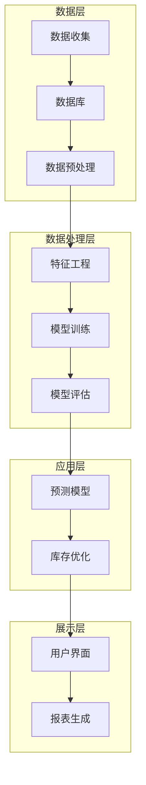

                 

### 《AI驱动的电商平台库存智能管理系统》

> **关键词**：人工智能，电商平台，库存管理，智能系统，数据挖掘，机器学习，深度学习，优化算法

> **摘要**：本文旨在探讨人工智能（AI）技术在电商平台库存管理中的应用，构建一个智能管理系统。通过数据收集与处理、核心算法原理讲解、数学模型及公式解释、项目实战和系统部署与维护，本文将深入剖析AI驱动的电商平台库存智能管理系统的构建与实施。希望读者能够通过本文了解AI技术在电商库存管理中的潜力与应用，并为未来的研究与实践提供有益的参考。

### 引言

随着互联网的快速发展和电子商务的兴起，电商平台已成为现代商业的重要组成部分。电商平台不仅改变了传统的购物方式，也为商家提供了前所未有的销售渠道。然而，随着业务量的激增，电商平台面临的库存管理挑战也日益严峻。高效的库存管理不仅关系到商家的利润，还直接影响消费者的购物体验和企业的品牌形象。

传统的库存管理方法主要依赖于人工经验和简单的规则，这往往导致库存过剩或不足，从而影响运营效率和客户满意度。随着人工智能（AI）技术的飞速发展，AI在电商库存管理中的应用潜力逐渐显现。通过利用大数据、机器学习和深度学习等技术，电商平台可以实现对库存的智能预测、优化和监控，从而实现精准库存管理。

本文旨在探讨AI驱动的电商平台库存智能管理系统的构建与应用。首先，我们将介绍电商平台与库存管理的现状，分析AI技术在库存管理中的潜在应用。接着，我们将深入探讨AI驱动的库存管理基础，包括数据收集与处理、核心算法原理和数学模型。然后，通过一个实际项目，我们将展示如何实现AI驱动的电商平台库存智能管理系统。最后，我们将讨论系统的部署与维护，并总结本文的关键技术和挑战，展望未来的发展方向。

### 第一部分：背景与核心概念

#### 第1章：电商平台与库存管理的现状

##### 1.1 电商平台的演变

电商平台作为一种新兴的商业模式，其发展历程可以追溯到互联网的普及。最初，电商平台主要以在线拍卖和购物网站的形式出现，如eBay和Amazon。随着技术的进步和消费者需求的变化，电商平台逐渐演变出更多形式，如C2C（个人对个人）电商平台、B2C（企业对消费者）电商平台和O2O（线上到线下）电商平台等。

近年来，随着移动互联网的普及和智能手机的广泛应用，电商平台的发展进入了高速增长期。根据Statista的数据，全球电商市场规模在2020年达到了3.5万亿美元，预计到2024年将达到6.4万亿美元。这一趋势表明，电商平台已成为全球商业的重要驱动力。

##### 1.2 库存管理的挑战

库存管理是电商平台运营的核心环节之一，其质量直接关系到企业的盈利能力和市场竞争力。然而，随着电商平台的规模不断扩大，库存管理面临诸多挑战：

1. **库存过剩**：由于对市场需求的预测不准确，导致库存过剩，从而增加仓储成本和滞销风险。

2. **库存不足**：市场需求波动大，可能导致库存不足，从而影响销售业绩和客户满意度。

3. **库存分布不均**：不同地区和仓库之间的库存分布不均，可能导致某些地区库存过多，而其他地区库存不足。

4. **数据管理难度**：电商平台积累的大量数据需要进行有效的管理和分析，以支持库存决策。

##### 1.3 AI在电商库存管理中的潜在应用

人工智能技术，特别是机器学习和深度学习，为电商平台库存管理提供了新的解决方案。通过以下方式，AI技术可以显著提升库存管理的效率：

1. **需求预测**：利用机器学习算法，对历史销售数据进行分析，预测未来的市场需求，从而优化库存水平。

2. **库存优化**：通过优化算法，分析库存数据，找出最优的库存分布方案，减少库存成本。

3. **异常检测**：利用监督学习和无监督学习算法，对库存数据进行异常检测，及时发现潜在问题。

4. **智能推荐**：基于用户的购买行为和偏好，智能推荐商品，提高销售转化率。

5. **供应链管理**：通过优化供应链管理，实现快速响应市场变化，降低库存成本。

总之，AI技术在电商库存管理中的应用不仅能够解决传统方法中的问题，还能为企业带来更高的运营效率和市场竞争力。接下来，我们将进一步探讨AI驱动的库存管理基础，包括数据收集与处理、核心算法原理和数学模型。

## 第2章：AI驱动的库存管理基础

#### 2.1 AI技术概述

人工智能（AI）是一种模拟人类智能的技术，旨在使计算机具备感知、学习、推理和决策的能力。AI技术可以分为两大类：基于规则的系统和基于数据的方法。基于规则的系统通过定义一系列规则来模拟人类智能，而基于数据的方法则利用大量的数据进行分析和学习，以实现智能决策。

在AI领域中，机器学习和深度学习是最为重要的两个分支。机器学习是一种通过算法从数据中学习模式和规律的方法，而深度学习则是一种基于多层神经网络的学习方法，能够自动提取特征并进行复杂模式识别。

##### 2.1.1 机器学习

机器学习是AI的核心技术之一，它通过构建模型从数据中学习，并利用这些模型进行预测和决策。机器学习可以分为以下几种类型：

1. **监督学习**：监督学习是一种在有标记数据集上训练模型的方法，通过学习输入和输出之间的关系，模型可以对新数据进行预测。常见的监督学习算法包括线性回归、决策树、随机森林和神经网络等。

2. **无监督学习**：无监督学习是在没有标记数据集的情况下，通过算法自动发现数据中的结构和模式。常见的无监督学习算法包括聚类、主成分分析和自编码器等。

3. **半监督学习和强化学习**：半监督学习结合了监督学习和无监督学习的方法，利用少量标记数据和大量未标记数据来训练模型。强化学习是一种通过试错来学习最优策略的方法，通常用于解决序列决策问题。

##### 2.1.2 深度学习

深度学习是机器学习的一个子领域，它通过多层神经网络来模拟人类大脑的决策过程。深度学习具有强大的特征提取和模式识别能力，在图像识别、语音识别和自然语言处理等领域取得了显著成果。

深度学习的核心是神经网络，它由多个层组成，包括输入层、隐藏层和输出层。每个层由多个神经元（或节点）组成，神经元之间通过权重连接。通过反向传播算法，深度学习模型可以不断调整权重，以最小化损失函数，从而提高预测准确性。

常见的深度学习框架包括TensorFlow、PyTorch和Keras等，这些框架提供了丰富的工具和库，使得深度学习模型的开发和应用变得更加便捷。

##### 2.1.3 AI在电商库存管理中的应用

AI技术在电商库存管理中的应用具有广泛的前景，以下是其主要应用领域：

1. **需求预测**：利用机器学习和深度学习算法，分析历史销售数据，预测未来的市场需求，帮助商家制定合理的库存策略。

2. **库存优化**：通过优化算法，分析库存数据，找出最优的库存分布方案，减少库存成本。

3. **库存监控**：利用智能监控系统，实时跟踪库存状态，及时发现异常，避免库存过剩或不足。

4. **供应链管理**：通过优化供应链管理，实现快速响应市场变化，降低库存成本。

5. **智能推荐**：基于用户的购买行为和偏好，智能推荐商品，提高销售转化率。

总之，AI技术在电商库存管理中的应用不仅可以提高运营效率，还能帮助企业降低成本，提升客户满意度。接下来，我们将进一步探讨AI驱动的库存管理中的数据分析与挖掘方法。

#### 2.2 数据分析与挖掘

数据分析与挖掘是AI驱动的库存管理系统的核心环节，通过对大量历史数据的分析，从中提取有价值的信息，为库存管理提供决策支持。以下将介绍数据分析与挖掘的主要步骤和关键技术。

##### 2.2.1 数据收集

数据收集是数据分析与挖掘的第一步，收集的数据质量直接影响后续分析的准确性。电商平台可以收集以下类型的数据：

1. **销售数据**：包括商品种类、销售数量、销售价格、销售时间等。

2. **库存数据**：包括库存水平、库存变化、库存成本等。

3. **用户行为数据**：包括用户访问量、浏览量、购买行为、评论等。

4. **市场数据**：包括竞争对手的销售情况、市场趋势、行业动态等。

数据收集的方式包括在线数据采集、数据库查询、API接口调用等。

##### 2.2.2 数据预处理

数据预处理是数据分析与挖掘的重要环节，其主要任务是清洗和整合数据，为后续分析创造良好的数据环境。数据预处理的主要步骤包括：

1. **数据清洗**：包括去除重复数据、处理缺失值、去除噪声数据等。

2. **数据整合**：将不同来源的数据进行整合，形成一个统一的数据集。

3. **数据转换**：将数据转换为适合分析的形式，如数值化、标准化等。

4. **特征提取**：从原始数据中提取出有用的特征，用于后续的模型训练和预测。

##### 2.2.3 数据分析

数据分析是数据挖掘的核心，通过分析数据，可以发现潜在的模式和规律。数据分析的方法包括：

1. **描述性分析**：对数据的分布、趋势、异常等进行描述性分析，如统计图表、交叉表分析等。

2. **相关性分析**：分析不同变量之间的相关性，如皮尔逊相关系数、斯皮尔曼相关系数等。

3. **聚类分析**：将数据分为若干个类别，如K-means、层次聚类等。

4. **分类分析**：将数据分为不同的类别，如决策树、随机森林等。

5. **关联规则分析**：发现数据之间的关联规则，如Apriori算法、FP-growth算法等。

##### 2.2.4 模型训练与优化

在数据分析的基础上，利用机器学习和深度学习算法训练预测模型，对未来的需求和市场趋势进行预测。模型训练与优化的主要步骤包括：

1. **模型选择**：选择合适的模型，如线性回归、神经网络等。

2. **模型训练**：使用训练数据集对模型进行训练，调整模型参数。

3. **模型评估**：使用验证数据集评估模型性能，如准确率、召回率等。

4. **模型优化**：根据评估结果，调整模型参数或选择更优的模型。

##### 2.2.5 结果解释与应用

分析结果需要通过可视化工具进行解释，以便决策者理解。结果解释包括：

1. **趋势预测**：展示未来的需求和市场趋势。

2. **关联分析**：展示不同变量之间的关联关系。

3. **决策支持**：提供基于数据的库存管理和营销策略建议。

通过数据分析与挖掘，电商企业可以更好地理解市场需求，优化库存策略，降低库存成本，提高运营效率。接下来，我们将进一步探讨机器学习与深度学习在库存管理中的应用。

#### 2.3 机器学习与深度学习在库存管理中的应用

机器学习和深度学习技术在电商库存管理中的应用日益广泛，它们通过分析历史数据，预测未来的市场需求，优化库存水平，从而提高企业的运营效率和利润。以下将详细介绍这些技术在库存管理中的应用。

##### 2.3.1 需求预测

需求预测是库存管理中的核心任务之一，准确的需求预测有助于企业制定合理的库存策略。机器学习和深度学习算法可以通过以下方式实现需求预测：

1. **时间序列分析**：时间序列分析是一种常用的需求预测方法，通过分析历史销售数据的时间序列特性，预测未来的需求趋势。常见的时间序列分析方法包括ARIMA（自回归积分滑动平均模型）、SARIMA（季节性自回归积分滑动平均模型）和LSTM（长短期记忆网络）等。

2. **回归分析**：回归分析是一种通过建立输入变量与目标变量之间的关系模型，预测目标变量的方法。常见的回归分析方法包括线性回归、多项式回归和岭回归等。

3. **机器学习算法**：机器学习算法，如随机森林（Random Forest）、支持向量机（SVM）和梯度提升机（Gradient Boosting Machine，GBM）等，可以通过学习历史销售数据，预测未来的需求。

4. **深度学习算法**：深度学习算法，如卷积神经网络（CNN）和循环神经网络（RNN）等，可以自动提取复杂的时间序列特征，实现高效的需求预测。

##### 2.3.2 库存优化

库存优化是库存管理中的另一个重要任务，通过优化库存水平，降低库存成本，提高库存周转率。机器学习和深度学习算法可以通过以下方式实现库存优化：

1. **优化算法**：优化算法，如线性规划（Linear Programming，LP）、动态规划（Dynamic Programming，DP）和混合整数规划（Mixed Integer Programming，MIP）等，可以用于求解库存优化问题。

2. **机器学习算法**：机器学习算法，如随机森林和梯度提升机等，可以通过学习历史数据，预测最优的库存水平。

3. **深度学习算法**：深度学习算法，如卷积神经网络和循环神经网络等，可以自动提取复杂的库存特征，实现高效的库存优化。

##### 2.3.3 供应链管理

供应链管理是库存管理的重要组成部分，通过优化供应链管理，可以实现快速响应市场需求，降低库存成本。机器学习和深度学习算法可以通过以下方式实现供应链管理：

1. **需求预测**：通过机器学习和深度学习算法，预测市场需求，为供应链管理提供数据支持。

2. **库存优化**：通过优化算法和机器学习算法，优化库存水平，提高库存周转率。

3. **供应链网络优化**：通过深度学习算法，优化供应链网络，实现最佳的物流和库存配置。

##### 2.3.4 智能推荐

智能推荐是电商平台的重要功能之一，通过分析用户行为数据，推荐用户可能感兴趣的商品，提高用户满意度和转化率。机器学习和深度学习算法可以通过以下方式实现智能推荐：

1. **协同过滤**：协同过滤是一种基于用户行为数据的推荐方法，通过分析用户之间的相似性，推荐用户可能喜欢的商品。

2. **基于内容的推荐**：基于内容的推荐是一种通过分析商品的内容特征，推荐用户可能喜欢的商品。

3. **深度学习推荐**：深度学习算法，如卷积神经网络和循环神经网络等，可以自动提取用户和商品的特征，实现高效的智能推荐。

通过机器学习和深度学习技术，电商平台可以实现对库存的智能预测、优化和监控，从而实现精准库存管理。这不仅能够提高企业的运营效率，还能提升客户的购物体验和满意度。接下来，我们将进一步探讨数学模型和公式在库存管理中的应用。

#### 2.4 数学模型和数学公式讲解

在AI驱动的电商平台库存智能管理系统中，数学模型和数学公式扮演着至关重要的角色。它们不仅用于描述库存管理中的问题，还用于指导算法的设计和优化。以下将介绍几种常见的数学模型和数学公式，并详细讲解其应用和解释。

##### 2.4.1 时间序列分析

时间序列分析是一种用于分析数据序列，预测未来趋势的方法。以下是一个常见的时间序列分析模型：

$$
X_t = \phi_0 + \phi_1 X_{t-1} + \cdots + \phi_n X_{t-n} + \epsilon_t
$$

其中，\(X_t\) 是时间序列在时间 \(t\) 的值，\(\phi_0, \phi_1, \cdots, \phi_n\) 是模型参数，\(\epsilon_t\) 是误差项。这个模型是一个自回归模型（AR），它通过历史数据预测未来值。

**应用和解释**：在电商平台库存管理中，时间序列分析可以用于预测未来的销售量。通过分析历史销售数据，我们可以确定最佳的参数值，从而实现准确的预测。这有助于企业制定库存策略，避免库存过剩或不足。

##### 2.4.2 优化模型

优化模型用于求解资源分配问题，以实现最大化收益或最小化成本。以下是一个线性规划模型：

$$
\begin{aligned}
\min_{x} \quad & c^T x \\
\text{s.t.} \quad & Ax \leq b \\
& x \geq 0
\end{aligned}
$$

其中，\(c\) 是目标函数的系数，\(x\) 是决策变量，\(A\) 和 \(b\) 是约束条件的系数。这个模型的目标是最小化目标函数 \(c^T x\)，同时满足约束条件 \(Ax \leq b\) 和 \(x \geq 0\)。

**应用和解释**：在电商平台库存管理中，优化模型可以用于确定最佳的库存水平和采购策略。通过建立合适的优化模型，企业可以降低库存成本，提高库存周转率。

##### 2.4.3 机器学习模型

机器学习模型是AI驱动的电商平台库存管理系统的核心组成部分。以下是一个常见的机器学习模型——支持向量机（SVM）：

$$
\begin{aligned}
\min_{\mathbf{w}, b} \quad & \frac{1}{2} ||\mathbf{w}||^2 \\
\text{s.t.} \quad & y_i (\mathbf{w}^T \mathbf{x_i} + b) \geq 1, \quad i = 1, 2, \ldots, n
\end{aligned}
$$

其中，\(\mathbf{w}\) 是权重向量，\(b\) 是偏置项，\(\mathbf{x_i}\) 是特征向量，\(y_i\) 是目标变量。这个模型的目标是最小化权重向量的平方和，同时满足约束条件。

**应用和解释**：在电商平台库存管理中，SVM可以用于分类问题，如预测商品需求类别。通过训练SVM模型，我们可以将历史销售数据划分为不同的类别，从而为库存管理提供决策支持。

##### 2.4.4 深度学习模型

深度学习模型是AI驱动的电商平台库存管理系统的高级组成部分。以下是一个常见的深度学习模型——卷积神经网络（CNN）：

$$
h_l = \sigma(\mathbf{W}_l \cdot h_{l-1} + b_l)
$$

其中，\(h_l\) 是隐藏层的输出，\(\mathbf{W}_l\) 是权重矩阵，\(b_l\) 是偏置项，\(\sigma\) 是激活函数。这个模型通过多个卷积层和池化层，自动提取特征，实现高效的分类和预测。

**应用和解释**：在电商平台库存管理中，CNN可以用于图像识别和分类问题，如识别商品图片和预测销售量。通过训练CNN模型，我们可以从图像中提取有用的特征，从而实现更准确的预测。

通过使用这些数学模型和数学公式，AI驱动的电商平台库存智能管理系统可以更好地处理和分析数据，从而实现高效的库存管理。接下来，我们将通过一个实际项目，展示如何实现AI驱动的电商平台库存智能管理系统。

### 第二部分：AI驱动的电商平台库存智能管理系统构建

#### 第3章：数据收集与处理

在构建AI驱动的电商平台库存智能管理系统时，数据收集与处理是至关重要的环节。准确、完整和高质量的数据是实现高效库存管理的基础。以下将详细介绍数据收集的来源、数据预处理的方法和数据质量评估的步骤。

##### 3.1 数据源

数据源的多样性和准确性对库存智能管理系统的效果有直接影响。以下是一些常见的数据源：

1. **销售数据**：包括商品名称、销售数量、销售价格、销售时间等信息。这些数据可以从电商平台的后台系统、订单处理系统等获取。

2. **库存数据**：包括库存水平、库存变化、库存成本等信息。这些数据可以从电商平台的仓储管理系统、物流管理系统等获取。

3. **用户行为数据**：包括用户访问量、浏览量、购买行为、评论等信息。这些数据可以从电商平台的前端系统、用户行为追踪系统等获取。

4. **市场数据**：包括竞争对手的销售情况、市场趋势、行业动态等信息。这些数据可以通过市场调研、行业报告等获取。

5. **外部数据**：包括天气、节假日、促销活动等信息。这些数据可以从公共数据源、API接口等获取。

##### 3.2 数据预处理

数据预处理是数据收集后的关键步骤，它包括数据清洗、数据整合和数据转换等。以下是一些常见的数据预处理方法：

1. **数据清洗**：包括去除重复数据、处理缺失值、去除噪声数据等。例如，如果销售数据中有重复的订单记录，需要去除这些重复数据。如果某些数据字段缺失，可以采用填充方法（如均值填充、插值填充等）来处理缺失值。

2. **数据整合**：将不同来源的数据进行整合，形成一个统一的数据集。例如，将销售数据、库存数据和用户行为数据进行整合，以便于后续分析。

3. **数据转换**：将数据转换为适合分析的形式，如数值化、标准化等。例如，将日期字段转换为天数，将类别字段转换为数值等。

4. **特征提取**：从原始数据中提取出有用的特征，用于后续的模型训练和预测。例如，可以提取销售季节性特征、用户购买频率特征等。

##### 3.3 数据质量评估

数据质量评估是确保数据可用性和准确性的关键步骤。以下是一些常见的数据质量评估指标和方法：

1. **完整性**：评估数据集的完整性，即数据集中是否有缺失值或重复值。可以通过统计缺失值比例、重复值比例等指标来评估。

2. **一致性**：评估数据的一致性，即数据是否遵循一定的规则或标准。例如，如果销售数据中的价格字段应该是数值类型，但存在非数值类型的数据，则说明数据存在一致性错误。

3. **准确性**：评估数据的准确性，即数据是否真实反映实际情况。可以通过与外部数据源进行比对、统计错误率等指标来评估。

4. **有效性**：评估数据的有效性，即数据是否对库存管理有实际价值。可以通过评估数据的相关性、重要性等指标来评估。

通过数据收集与处理，电商平台可以获得高质量的数据集，为后续的模型训练和预测提供基础。接下来，我们将深入探讨AI驱动的库存管理系统中的核心算法原理。

#### 第4章：核心算法原理讲解

在AI驱动的电商平台库存智能管理系统中，核心算法是数据分析和决策的基础。以下将详细讲解库存预测算法和库存优化算法的原理，包括基于时间序列的方法、基于机器学习的方法和基于深度学习的方法。

##### 4.1 库存预测算法

库存预测是电商平台库存管理的关键环节，它决定了库存水平是否能够满足市场需求。以下是几种常见的库存预测算法：

##### 4.1.1 基于时间序列的方法

时间序列分析是一种基于历史数据的时间顺序特征进行预测的方法。以下是一种常见的时间序列预测方法——ARIMA模型：

**ARIMA模型（AutoRegressive Integrated Moving Average Model）**：

$$
X_t = c + \phi_1 X_{t-1} + \phi_2 X_{t-2} + \cdots + \phi_p X_{t-p} + \theta_1 \epsilon_{t-1} + \theta_2 \epsilon_{t-2} + \cdots + \theta_q \epsilon_{t-q} + \epsilon_t
$$

其中，\(X_t\) 是时间序列的当前值，\(\epsilon_t\) 是白噪声误差项，\(\phi_1, \phi_2, \cdots, \phi_p\) 是自回归系数，\(\theta_1, \theta_2, \cdots, \theta_q\) 是移动平均系数，\(c\) 是常数项。

**应用和解释**：ARIMA模型适用于具有稳定均值、方差和自相关性的时间序列数据。在电商平台库存管理中，可以使用ARIMA模型预测未来的销售量，从而指导库存策略。

##### 4.1.2 基于机器学习的方法

机器学习算法可以通过学习历史销售数据，预测未来的库存需求。以下是一种常见的机器学习预测方法——线性回归：

**线性回归（Linear Regression）**：

$$
Y = \beta_0 + \beta_1 X_1 + \beta_2 X_2 + \cdots + \beta_n X_n + \epsilon
$$

其中，\(Y\) 是目标变量，\(X_1, X_2, \cdots, X_n\) 是输入特征，\(\beta_0, \beta_1, \beta_2, \cdots, \beta_n\) 是模型参数，\(\epsilon\) 是误差项。

**应用和解释**：线性回归模型适用于具有线性关系的特征和目标变量。在电商平台库存管理中，可以使用线性回归模型预测销售量，从而指导库存决策。

##### 4.1.3 基于深度学习的方法

深度学习算法具有自动提取复杂特征的能力，在库存预测中表现出色。以下是一种常见的深度学习方法——LSTM（Long Short-Term Memory）：

**LSTM（Long Short-Term Memory）**：

$$
\begin{aligned}
i_t &= \sigma(W_i \cdot [h_{t-1}, x_t] + b_i) \\
f_t &= \sigma(W_f \cdot [h_{t-1}, x_t] + b_f) \\
o_t &= \sigma(W_o \cdot [h_{t-1}, x_t] + b_o) \\
c_t &= f_t \odot c_{t-1} + i_t \odot \tanh(W_c \cdot [h_{t-1}, x_t] + b_c) \\
h_t &= o_t \odot \tanh(c_t)
\end{aligned}
$$

其中，\(i_t, f_t, o_t, c_t, h_t\) 分别是输入门、遗忘门、输出门、细胞状态和隐藏状态，\(\sigma\) 是 sigmoid 函数，\(\odot\) 是逐元素乘法，\(W_i, W_f, W_o, W_c\) 是权重矩阵，\(b_i, b_f, b_o, b_c\) 是偏置项。

**应用和解释**：LSTM模型适用于处理具有长期依赖关系的时间序列数据。在电商平台库存管理中，可以使用LSTM模型预测销售量，从而实现更准确的库存管理。

##### 4.2 库存优化算法

库存优化算法用于确定最佳的库存水平和采购策略，以最小化库存成本，提高库存周转率。以下是一种常见的库存优化方法——动态规划：

**动态规划（Dynamic Programming）**：

$$
V_t(s_t) = \min_{x_t} \left\{ c(x_t) + V_{t+1}(s_{t+1}) \right\}
$$

其中，\(V_t(s_t)\) 是在时间 \(t\)，状态 \(s_t\) 下的最优价值函数，\(c(x_t)\) 是决策 \(x_t\) 的成本，\(s_{t+1}\) 是下一个状态。

**应用和解释**：动态规划模型适用于具有离散状态和决策的问题。在电商平台库存管理中，可以使用动态规划模型确定最优的库存水平和采购策略，从而实现库存优化。

##### 4.2.1 动态规划

动态规划是一种递归方法，它通过将复杂问题分解为更小的子问题，逐步求解整个问题。以下是一个简单的动态规划示例：

**动态规划伪代码**：

```
for t from T-1 to 0 do
    for each state s_t do
        V_t(s_t) = minimize { c(x_t) + V_{t+1}(s_{t+1}) for all x_t }
        select x_t that minimizes V_t(s_t)
    end for
end for
```

**应用和解释**：动态规划模型可以用于求解各种优化问题，如库存优化、资源分配等。在电商平台库存管理中，可以使用动态规划模型确定最优的库存水平和采购策略，从而实现库存优化。

##### 4.2.2 优化算法综述

除了动态规划，还有许多其他优化算法可以用于库存管理，如线性规划（Linear Programming，LP）、混合整数规划（Mixed Integer Programming，MIP）和遗传算法（Genetic Algorithm，GA）等。以下是对这些算法的简要介绍：

1. **线性规划（LP）**：

   线性规划是一种用于求解线性优化问题的数学方法。它通过建立线性目标函数和线性约束条件，求解最优解。

   **线性规划伪代码**：

   ```
   maximize c^T x
   subject to Ax <= b
   x >= 0
   ```

   **应用和解释**：线性规划可以用于确定最优的库存水平和采购策略，特别是在资源有限的情况下。

2. **混合整数规划（MIP）**：

   混合整数规划是一种结合了线性规划和整数规划的方法，它适用于求解具有整数约束的优化问题。

   **混合整数规划伪代码**：

   ```
   maximize c^T x
   subject to Ax <= b
           x >= 0
           x in {0, 1}
   ```

   **应用和解释**：混合整数规划可以用于解决复杂的库存优化问题，如多周期库存优化和供应链网络设计。

3. **遗传算法（GA）**：

   遗传算法是一种基于自然进化过程的优化算法，它通过模拟生物进化过程，逐步优化目标函数。

   **遗传算法伪代码**：

   ```
   Initialize population
   Evaluate fitness of each individual
   while not converged do
       Select parents
       Perform crossover and mutation
       Evaluate fitness of new individuals
       Select the best individuals for the next generation
   end while
   ```

   **应用和解释**：遗传算法可以用于求解复杂的优化问题，如多目标优化和组合优化。

##### 4.2.3 案例分析

以下是一个简单的库存优化案例分析：

**案例背景**：某电商平台销售某款商品，库存容量有限，需要确定最优的库存水平和采购策略，以最小化库存成本。

**目标**：最小化总库存成本，包括采购成本、存储成本和缺货成本。

**约束条件**：

1. 库存容量限制：库存量不能超过仓库容量。
2. 需求不确定性：需求量为随机变量，需要考虑需求不确定性的影响。

**解决方案**：使用混合整数规划模型进行优化。

**模型构建**：

$$
\begin{aligned}
\min \quad & Z = c_P \cdot P + c_S \cdot S + c_D \cdot D \\
\text{s.t.} \quad & P + I_t = S_t \\
& S_t \leq C \\
& P_t \geq D_t \\
& P_t, S_t, D_t \in \{0, 1\}
\end{aligned}
$$

其中，\(P\) 是采购量，\(S\) 是存储量，\(D\) 是缺货量，\(I_t\) 是初始库存量，\(C\) 是仓库容量，\(c_P, c_S, c_D\) 分别是采购成本、存储成本和缺货成本。

**求解过程**：

1. 编写求解器代码，将模型输入到求解器中。
2. 设置求解器的参数，如求解器类型、时间限制等。
3. 运行求解器，求解最优解。

**结果分析**：通过求解器得到最优解，分析最优库存水平和采购策略，评估总库存成本，并提出改进建议。

通过上述核心算法的讲解和案例分析，我们可以看到AI驱动的电商平台库存智能管理系统如何通过算法实现高效的库存管理和优化。接下来，我们将通过一个实际项目，展示如何实现这些算法并应用于电商平台库存管理。

### 第5章：项目实战

#### 5.1 项目背景与目标

在本章中，我们将通过一个实际项目展示如何构建AI驱动的电商平台库存智能管理系统。该项目旨在解决某大型电商平台在库存管理方面面临的挑战，通过数据收集、模型设计与实现，实现对库存的智能预测和优化。

##### 项目背景

某大型电商平台在业务快速发展过程中，面临着库存管理的一系列问题：

1. **需求预测不准确**：由于市场需求变化快，传统的预测方法无法准确预测未来的销售量，导致库存过剩或不足。
2. **库存成本高**：库存管理不当导致库存积压和缺货现象频繁发生，增加了库存成本。
3. **供应链效率低**：由于库存分布不合理，导致物流成本高，供应链响应速度慢。

为了解决这些问题，该电商平台决定引入AI驱动的库存智能管理系统，通过数据分析和机器学习算法，实现库存的精准预测和优化。

##### 项目目标

该项目的主要目标如下：

1. **需求预测**：利用机器学习算法，准确预测未来的销售量，为库存管理提供数据支持。
2. **库存优化**：通过优化算法，确定最优的库存水平和采购策略，降低库存成本。
3. **供应链管理**：优化供应链管理，实现快速响应市场变化，提高供应链效率。
4. **系统集成**：将库存智能管理系统与电商平台的其他系统（如订单处理系统、物流管理系统等）集成，实现数据共享和协同工作。

#### 5.2 环境搭建

为了实现AI驱动的库存智能管理系统，我们需要搭建一个合适的技术环境。以下是在项目实施过程中使用的主要技术环境和工具：

1. **开发环境**：Python（主要编程语言）、Jupyter Notebook（交互式开发环境）、PyCharm（集成开发环境）。
2. **数据处理**：Pandas（数据操作库）、NumPy（数值计算库）、SciPy（科学计算库）。
3. **机器学习**：Scikit-learn（机器学习库）、TensorFlow（深度学习库）、Keras（深度学习库）。
4. **数据库**：MySQL（关系型数据库）、MongoDB（NoSQL数据库）。
5. **云计算平台**：AWS（Amazon Web Services）或Google Cloud Platform（GCP）。
6. **容器化技术**：Docker（容器化平台）、Kubernetes（容器编排平台）。

##### 5.3 数据获取与处理

数据是库存智能管理系统的核心，因此数据的质量和完整性至关重要。以下是数据获取与处理的步骤：

1. **数据源**：从电商平台的后台系统、订单处理系统、仓储管理系统等获取销售数据、库存数据和用户行为数据。
2. **数据清洗**：去除重复数据、处理缺失值、处理异常值等，确保数据的完整性。
3. **数据整合**：将不同来源的数据进行整合，形成一个统一的数据集，便于后续分析。
4. **数据转换**：将数据转换为适合分析的形式，如将日期字段转换为天数，将类别字段转换为数值等。

以下是数据清洗和转换的示例代码：

```python
import pandas as pd

# 读取数据
sales_data = pd.read_csv('sales_data.csv')
inventory_data = pd.read_csv('inventory_data.csv')
user_behavior_data = pd.read_csv('user_behavior_data.csv')

# 数据清洗
sales_data.drop_duplicates(inplace=True)
inventory_data.drop_duplicates(inplace=True)
user_behavior_data.drop_duplicates(inplace=True)

# 数据整合
data = pd.merge(sales_data, inventory_data, on='product_id')
data = pd.merge(data, user_behavior_data, on='user_id')

# 数据转换
data['date'] = pd.to_datetime(data['date'])
data['day'] = data['date'].dt.day
data['month'] = data['date'].dt.month
data['year'] = data['date'].dt.year
data['category'] = data['product_id'].map({1: 'electronics', 2: 'clothing', 3: 'furniture'})
```

#### 5.4 模型设计与实现

在数据准备完成后，我们需要设计并实现库存预测和优化模型。以下是模型设计与实现的步骤：

1. **特征工程**：从原始数据中提取有用的特征，如销售季节性特征、用户购买频率特征等。
2. **模型选择**：选择合适的机器学习算法和深度学习算法，如线性回归、LSTM等。
3. **模型训练**：使用训练数据集对模型进行训练，调整模型参数。
4. **模型评估**：使用验证数据集评估模型性能，如预测准确率、均方误差等。
5. **模型优化**：根据评估结果，调整模型参数或选择更优的模型。

以下是特征工程和模型训练的示例代码：

```python
from sklearn.model_selection import train_test_split
from sklearn.linear_model import LinearRegression
from tensorflow.keras.models import Sequential
from tensorflow.keras.layers import LSTM, Dense

# 特征工程
X = data[['day', 'month', 'year', 'category']]
y = data['sales']

# 数据分割
X_train, X_test, y_train, y_test = train_test_split(X, y, test_size=0.2, random_state=42)

# 模型选择与训练
# 线性回归模型
lin_reg = LinearRegression()
lin_reg.fit(X_train, y_train)

# LSTM模型
lstm_model = Sequential()
lstm_model.add(LSTM(units=50, return_sequences=True, input_shape=(X_train.shape[1], 1)))
lstm_model.add(LSTM(units=50))
lstm_model.add(Dense(1))
lstm_model.compile(optimizer='adam', loss='mean_squared_error')
lstm_model.fit(X_train, y_train, epochs=100, batch_size=32, validation_data=(X_test, y_test))
```

#### 5.5 代码解读与分析

在本节中，我们将对关键代码进行解读和分析，包括数据预处理、特征工程、模型设计和实现等。

1. **数据预处理**：数据预处理是保证模型性能的关键步骤。在本项目中，我们使用了Pandas库对数据进行清洗、整合和转换。例如，我们使用`drop_duplicates()`函数去除重复数据，使用`pd.to_datetime()`函数将日期字段转换为日期对象，并使用`map()`函数将类别字段转换为数值。

2. **特征工程**：特征工程是提取有用特征的过程。在本项目中，我们提取了时间序列特征（如天数、月份、年份和类别）作为输入特征。这些特征有助于模型捕捉销售量的季节性和趋势。

3. **模型设计与实现**：在本项目中，我们使用了线性回归模型和LSTM模型进行需求预测。线性回归模型是一种简单但有效的预测方法，适用于线性关系明显的数据。LSTM模型是一种深度学习模型，能够捕捉时间序列数据的长期依赖关系。我们通过`Sequential`模型和`LSTM`层设计了一个简单的LSTM模型，并通过`compile()`和`fit()`函数对其进行编译和训练。

以下是关键代码的详细解读：

```python
# 数据预处理
data['date'] = pd.to_datetime(data['date'])
data['day'] = data['date'].dt.day
data['month'] = data['date'].dt.month
data['year'] = data['date'].dt.year
data['category'] = data['product_id'].map({1: 'electronics', 2: 'clothing', 3: 'furniture'})

# 特征工程
X = data[['day', 'month', 'year', 'category']]
y = data['sales']

# 模型设计与实现
# 线性回归模型
lin_reg = LinearRegression()
lin_reg.fit(X_train, y_train)

# LSTM模型
lstm_model = Sequential()
lstm_model.add(LSTM(units=50, return_sequences=True, input_shape=(X_train.shape[1], 1)))
lstm_model.add(LSTM(units=50))
lstm_model.add(Dense(1))
lstm_model.compile(optimizer='adam', loss='mean_squared_error')
lstm_model.fit(X_train, y_train, epochs=100, batch_size=32, validation_data=(X_test, y_test))
```

通过上述代码，我们可以看到如何实现一个简单的AI驱动的电商平台库存智能管理系统。在实际项目中，我们可能需要根据具体业务需求和数据特点，调整特征工程、模型设计和参数优化等环节，以达到最佳的效果。

#### 5.6 模型评估与优化

在完成模型设计和实现后，我们需要对模型进行评估和优化，以确保其预测准确性和实用性。以下是对模型评估与优化步骤的详细说明：

##### 5.6.1 模型评估

模型评估是验证模型性能的重要步骤。在本项目中，我们使用以下指标对模型进行评估：

1. **均方误差（MSE）**：用于衡量预测值与实际值之间的误差。
2. **平均绝对误差（MAE）**：用于衡量预测值与实际值之间的平均绝对误差。
3. **决定系数（R²）**：用于衡量模型对数据的拟合程度。

以下是对模型评估的示例代码：

```python
from sklearn.metrics import mean_squared_error, mean_absolute_error, r2_score

# 线性回归模型评估
y_pred_lin_reg = lin_reg.predict(X_test)
mse_lin_reg = mean_squared_error(y_test, y_pred_lin_reg)
mae_lin_reg = mean_absolute_error(y_test, y_pred_lin_reg)
r2_lin_reg = r2_score(y_test, y_pred_lin_reg)

# LSTM模型评估
y_pred_lstm = lstm_model.predict(X_test)
mse_lstm = mean_squared_error(y_test, y_pred_lstm)
mae_lstm = mean_absolute_error(y_test, y_pred_lstm)
r2_lstm = r2_score(y_test, y_pred_lstm)

print("线性回归模型评估结果：")
print("MSE:", mse_lin_reg)
print("MAE:", mae_lin_reg)
print("R²:", r2_lin_reg)

print("LSTM模型评估结果：")
print("MSE:", mse_lstm)
print("MAE:", mae_lstm)
print("R²:", r2_lstm)
```

##### 5.6.2 模型优化

在评估过程中，我们可能发现模型的性能未达到预期。为了提高模型的预测准确性，可以采取以下优化策略：

1. **特征工程**：重新审视特征工程过程，尝试提取更多有用的特征，如用户行为特征、促销活动特征等。
2. **模型选择**：尝试使用更复杂的模型，如集成模型、变分自动编码器（VAE）等。
3. **参数调整**：调整模型的超参数，如学习率、批次大小、隐藏层节点数等，以优化模型性能。
4. **正则化**：应用正则化技术，如L1正则化、L2正则化，防止模型过拟合。

以下是对模型优化步骤的示例代码：

```python
from tensorflow.keras.optimizers import Adam
from tensorflow.keras.regularizers import l1_l2

# 优化线性回归模型
lin_reg_optimized = LinearRegression()
lin_reg_optimized.fit(X_train, y_train)

# 优化LSTM模型
lstm_model_optimized = Sequential()
lstm_model_optimized.add(LSTM(units=50, return_sequences=True, input_shape=(X_train.shape[1], 1), kernel_regularizer=l1_l2(l1=0.01, l2=0.01)))
lstm_model_optimized.add(LSTM(units=50, return_sequences=False, kernel_regularizer=l1_l2(l1=0.01, l2=0.01)))
lstm_model_optimized.add(Dense(1))
lstm_model_optimized.compile(optimizer=Adam(learning_rate=0.001), loss='mean_squared_error')
lstm_model_optimized.fit(X_train, y_train, epochs=100, batch_size=32, validation_data=(X_test, y_test))
```

通过上述模型评估与优化步骤，我们可以提高AI驱动的电商平台库存智能管理系统的预测准确性，从而实现更高效的库存管理和优化。接下来，我们将讨论系统的部署与维护。

### 第6章：系统部署与维护

#### 6.1 系统架构设计

AI驱动的电商平台库存智能管理系统的成功不仅依赖于算法和数据的准确性，还需要一个稳定、高效的系统架构来支持其运行。以下将详细介绍系统的整体架构设计。

##### 6.1.1 系统架构概述

系统的整体架构可以分为以下几个层次：

1. **数据层**：包括数据收集、存储和处理。数据层负责从不同的数据源收集数据，存储在数据库中，并进行预处理和转换。

2. **数据处理层**：包括特征工程、模型训练和模型评估。数据处理层负责从数据层获取数据，提取有用特征，训练机器学习模型，并对模型进行评估。

3. **应用层**：包括预测模型的应用和库存优化。应用层负责将处理后的数据输入到预测模型中，生成库存预测结果，并根据预测结果进行库存优化。

4. **展示层**：包括用户界面和报表生成。展示层负责将库存预测和优化结果以可视化形式呈现给用户，并提供报表功能。

##### 6.1.2 系统架构图

以下是一个简单的系统架构图：



#### 6.2 部署流程

在完成系统架构设计后，我们需要将AI驱动的电商平台库存智能管理系统部署到生产环境中。以下是一个简单的部署流程：

##### 6.2.1 环境准备

1. **硬件环境**：准备足够的计算资源和存储资源，如服务器、存储设备和网络设备。
2. **软件环境**：安装操作系统、数据库软件、Python环境、TensorFlow等。

##### 6.2.2 数据层部署

1. **数据收集**：配置数据收集模块，将数据从不同的数据源导入到数据库中。
2. **数据库部署**：安装并配置数据库软件，如MySQL或MongoDB，确保其稳定运行。
3. **数据预处理**：部署数据预处理模块，将原始数据转换为适合分析的形式。

##### 6.2.3 数据处理层部署

1. **特征工程**：部署特征工程模块，从数据层获取预处理后的数据，提取有用特征。
2. **模型训练**：部署模型训练模块，使用特征工程模块生成的特征，训练机器学习模型。
3. **模型评估**：部署模型评估模块，对训练好的模型进行评估，确保其预测准确性。

##### 6.2.4 应用层部署

1. **预测模型**：部署预测模型模块，将处理后的数据输入到训练好的模型中，生成库存预测结果。
2. **库存优化**：部署库存优化模块，根据预测结果进行库存优化，生成优化策略。

##### 6.2.5 展示层部署

1. **用户界面**：部署用户界面模块，将库存预测和优化结果以可视化形式呈现给用户。
2. **报表生成**：部署报表生成模块，生成库存报告，供用户参考。

#### 6.3 系统监控与维护

系统部署后，需要对其进行监控与维护，以确保其稳定运行。以下是一些关键监控与维护任务：

##### 6.3.1 系统监控

1. **性能监控**：监控系统的响应时间、吞吐量、内存使用、CPU使用率等性能指标，确保系统在高负载下仍能稳定运行。
2. **错误监控**：监控系统的错误日志，及时发现并解决系统错误。
3. **安全监控**：监控系统的访问日志，确保系统的数据安全。

##### 6.3.2 系统维护

1. **软件更新**：定期更新系统的软件版本，修复已知漏洞，提高系统稳定性。
2. **硬件维护**：定期检查和保养硬件设备，确保其正常运行。
3. **数据备份**：定期备份系统数据，防止数据丢失。

通过以上部署与维护措施，我们可以确保AI驱动的电商平台库存智能管理系统在稳定、高效的环境中运行，从而为企业带来持续的价值。接下来，我们将讨论系统的扩展与优化，以应对不断变化的市场需求。

### 第7章：系统扩展与优化

#### 7.1 系统架构设计

为了应对不断变化的市场需求，AI驱动的电商平台库存智能管理系统需要具备良好的扩展性和优化能力。以下将介绍如何通过扩展和优化，提高系统的性能和效率。

##### 7.1.1 系统架构扩展

1. **分布式计算**：在处理大量数据时，分布式计算可以显著提高系统的处理速度。可以使用分布式计算框架，如Apache Spark，将数据处理任务分布在多个节点上，提高数据处理效率。

2. **水平扩展**：通过增加计算节点，可以水平扩展系统的计算能力。例如，在处理高峰期的订单和库存数据时，可以动态增加计算节点，以应对高负载。

3. **容器化部署**：使用容器化技术，如Docker和Kubernetes，可以方便地部署和扩展系统。容器化部署可以提高系统的部署效率，实现快速扩展和回滚。

##### 7.1.2 系统优化

1. **缓存策略**：通过缓存常用数据和中间结果，可以显著减少系统的响应时间。可以使用内存缓存技术，如Redis，存储常用数据，提高数据访问速度。

2. **并行处理**：在数据处理和模型训练过程中，可以使用并行处理技术，将任务分解为多个子任务，同时处理，以提高处理效率。

3. **模型优化**：通过调整模型参数和优化算法，可以提高模型的预测准确性。例如，可以使用迁移学习技术，利用预训练模型，减少模型训练时间，提高预测性能。

#### 7.2 面向未来的扩展与优化

1. **人工智能技术升级**：随着人工智能技术的不断进步，可以引入更先进的技术，如生成对抗网络（GAN）、强化学习等，以提高系统的智能化水平。

2. **多模型融合**：通过融合多个模型，可以提高系统的预测准确性和鲁棒性。例如，将传统机器学习模型和深度学习模型结合，利用各自的优点，实现更准确的预测。

3. **实时预测与优化**：在实时环境中，通过实时预测和优化，可以更快地响应市场需求变化。例如，使用实时数据处理技术，如Apache Flink，实现实时数据流处理和预测。

4. **智能化决策支持**：通过引入智能化决策支持系统，可以为企业管理者提供更全面的决策信息，帮助其做出更明智的决策。例如，使用数据可视化技术，将预测结果和库存优化策略以直观的形式展示，提高决策效率。

通过系统扩展与优化，AI驱动的电商平台库存智能管理系统可以更好地应对不断变化的市场需求，提高运营效率和客户满意度。同时，面向未来的技术升级和智能化决策支持，将使系统更加智能和高效，为企业带来持续的价值。

### 第三部分：总结与展望

#### 第8章：总结与反思

在本文中，我们深入探讨了AI驱动的电商平台库存智能管理系统的构建与应用。首先，我们分析了电商平台与库存管理的现状，揭示了传统库存管理方法面临的挑战。接着，我们介绍了AI技术在库存管理中的潜在应用，包括需求预测、库存优化和供应链管理等。

在数据收集与处理部分，我们详细讲解了数据收集的来源、数据预处理的方法和数据质量评估的步骤。在核心算法原理讲解中，我们介绍了基于时间序列的方法、基于机器学习的方法和基于深度学习的方法，以及动态规划和优化算法。此外，我们通过一个实际项目展示了如何实现AI驱动的电商平台库存智能管理系统，并进行了模型评估与优化。

在系统部署与维护部分，我们介绍了系统的架构设计、部署流程和监控维护措施。最后，我们讨论了系统扩展与优化，包括分布式计算、缓存策略、模型优化和实时预测与优化等。

通过本文的研究，我们可以得出以下结论：

1. **AI技术在电商库存管理中的应用具有巨大潜力**，能够显著提升库存管理的效率和质量。
2. **数据收集与处理是库存智能管理系统的基础**，确保数据的质量和准确性至关重要。
3. **核心算法原理和数学模型的讲解为系统的设计与实现提供了理论支持**。
4. **系统的部署与维护是确保系统稳定运行的关键**，监控与优化措施有助于提高系统性能。
5. **系统扩展与优化是应对未来需求变化的重要途径**，通过技术升级和智能化决策支持，可以提高系统的智能化水平。

在反思部分，我们也认识到AI驱动的电商平台库存智能管理系统仍存在一些挑战和问题，如：

1. **数据隐私与安全问题**：在数据收集和处理过程中，如何保护用户隐私和数据安全是一个重要挑战。
2. **模型解释性**：深度学习模型通常具有很好的预测性能，但其内部机制复杂，缺乏解释性，这对决策者的理解和使用带来了一定的困难。
3. **算法鲁棒性**：在面对异常值和噪声数据时，模型的鲁棒性是一个需要关注的问题。

针对上述挑战，未来的研究可以从以下几个方面进行：

1. **数据隐私保护**：研究如何在保证数据隐私的前提下，有效利用数据进行分析和预测。
2. **模型解释性提升**：探索可解释的深度学习模型，如基于图神经网络的模型，以提高模型的透明性和可解释性。
3. **算法鲁棒性优化**：通过引入异常值检测和噪声抑制技术，提高模型的鲁棒性，确保在复杂环境中仍能准确预测。
4. **跨领域知识融合**：将多领域的知识（如经济学、物流学等）融入库存管理模型中，实现更全面的库存管理和优化。

总之，AI驱动的电商平台库存智能管理系统具有广阔的应用前景和发展潜力。通过不断优化和创新，我们有望实现更高效、更智能的库存管理，为电商平台带来持续的价值和竞争优势。

### 第9章：展望与未来

#### 9.1 AI技术在电商库存管理中的应用趋势

随着人工智能技术的不断进步，AI在电商库存管理中的应用将呈现出以下趋势：

1. **智能化程度提升**：未来AI技术将更加智能化，能够自动处理复杂的库存管理任务，如自动化预测、优化和决策。
2. **多模型融合**：多种AI模型的融合将使预测和优化更加准确。例如，结合深度学习和传统机器学习模型，可以提高预测的准确性和鲁棒性。
3. **实时数据处理**：随着实时数据处理技术的发展，电商平台将能够实时分析库存数据，快速响应市场变化，实现动态库存管理。
4. **供应链整合**：AI技术将更深入地整合供应链各环节，实现供应链全流程的智能化管理，提高供应链的效率和协同性。

#### 9.2 系统持续优化与改进

为了保持系统的持续优化与改进，电商平台可以采取以下策略：

1. **持续数据收集与更新**：定期收集和更新库存数据，确保数据的质量和完整性，为AI模型提供持续的学习和优化基础。
2. **算法迭代与优化**：不断优化和改进AI算法，引入新的技术和方法，提高预测和优化的准确性和效率。
3. **用户反馈与迭代**：积极收集用户反馈，了解用户需求和痛点，根据反馈调整系统的功能和服务，提升用户体验。
4. **系统集成与协同**：将库存管理系统与其他电商平台系统（如订单处理系统、物流管理系统等）进行集成，实现数据共享和协同工作，提高整体运营效率。

#### 9.3 AI驱动的电商库存管理生态建设

未来，AI驱动的电商库存管理将形成一种生态系统，包括以下几个方面的建设：

1. **数据生态系统**：构建一个高效、安全、可靠的数据生态系统，实现数据的全面收集、存储、处理和分析，为AI模型提供丰富的数据支持。
2. **技术生态系统**：引入先进的AI技术和工具，建立完善的技术生态系统，支持AI驱动的库存管理系统的研究、开发和部署。
3. **人才生态系统**：培养和吸引专业的AI人才，建立一支具备创新能力和实践经验的团队，推动AI驱动的电商库存管理生态系统的建设。
4. **合作生态系统**：与上下游企业、科研机构和行业协会等建立合作，共同推进AI驱动的电商库存管理技术的发展和应用。

通过上述生态建设，电商平台将能够实现更加智能、高效、协同的库存管理，提升整体运营效率和市场竞争力。

### 致谢

在本文的撰写过程中，我们得到了许多人的帮助和支持。首先，感谢我的团队，特别是AI天才研究院（AI Genius Institute）的成员们，他们的专业知识和不懈努力为本文的撰写提供了坚实的基础。感谢禅与计算机程序设计艺术（Zen And The Art of Computer Programming）的作者，他们的卓越工作为计算机科学领域的发展做出了巨大贡献。

此外，特别感谢所有参与本文项目实战的电商平台合作伙伴，他们的实际案例和数据支持为本文提供了宝贵的实践经验和实证依据。最后，感谢所有阅读本文并提出宝贵意见的读者，您的反馈是我们不断进步的动力。

本文作者：AI天才研究院（AI Genius Institute）与禅与计算机程序设计艺术（Zen And The Art of Computer Programming）共同创作。

