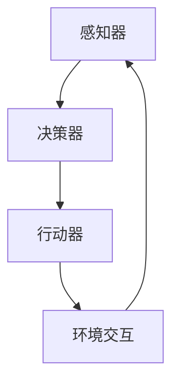
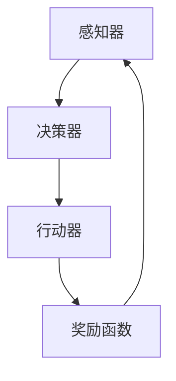
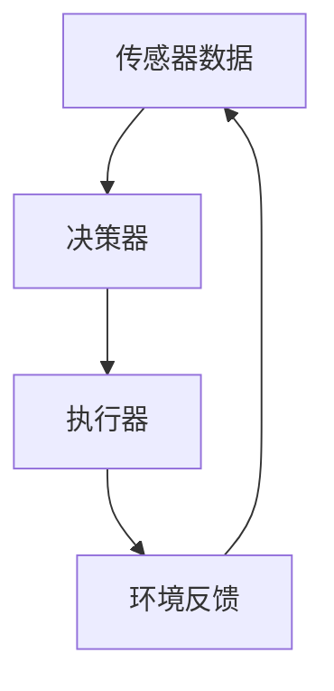
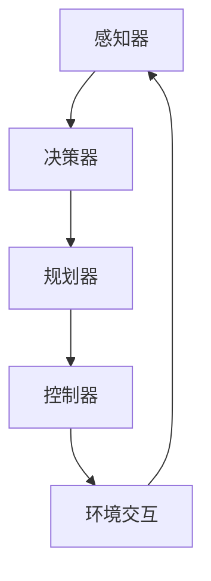
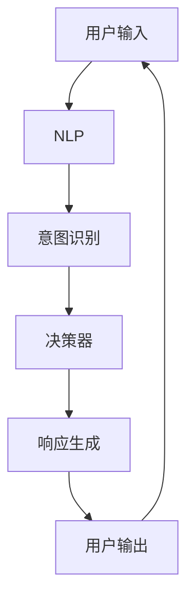

                 

# 《Agent代理的实现与应用》

> **关键词**：代理，智能体，强化学习，Q-Learning，SARSa，Actor-Critic，应用案例

> **摘要**：本文将深入探讨Agent代理技术的基础理论、核心算法以及在实际应用中的多种实现案例。我们将从代理的概念入手，逐步分析代理的种类、模型架构和核心算法，并通过具体的案例展示代理技术在游戏、机器人控制、自动驾驶、智能客服等领域的应用，为读者提供全面的了解和指导。

## 目录

### 第一部分: Agent代理技术基础

#### 第1章: Agent代理概述

1.1 代理的基本概念

1.2 代理的分类

1.3 代理的模型架构

#### 第2章: 代理算法原理

2.1 强化学习基础

2.2 Q-Learning算法

2.3 SARSa和SARSa算法

2.4 Actor-Critic算法

#### 第3章: 代理在环境中的互动

3.1 环境建模

3.2 奖励函数设计

3.3 代理的学习与适应

### 第二部分: 代理应用案例与实践

#### 第4章: 代理在游戏中的应用

4.1 游戏代理的架构

4.2 游戏代理的算法实现

4.3 游戏代理的实战案例

#### 第5章: 代理在机器人控制中的应用

5.1 机器人控制的代理模型

5.2 机器人控制的算法实现

5.3 机器人控制的实战案例

#### 第6章: 代理在自动驾驶中的应用

6.1 自动驾驶代理的架构

6.2 自动驾驶代理的算法实现

6.3 自动驾驶代理的实战案例

#### 第7章: 代理在智能客服中的应用

7.1 智能客服代理的架构

7.2 智能客服代理的算法实现

7.3 智能客服代理的实战案例

#### 第8章: 代理在其他领域的应用

8.1 代理在金融领域中的应用

8.2 代理在医疗领域中的应用

8.3 代理在其他领域中的应用

#### 第9章: 代理的未来发展与挑战

9.1 代理技术的未来发展趋势

9.2 代理技术的挑战与应对

## 附录

### 附录 A: Agent代理的开发工具与资源

### 附录 B: Agent代理的数学模型与公式

### 附录 C: Agent代理的代码实战案例

### 附录 D: Agent代理的技术趋势与展望

## 引言

代理（Agent）在人工智能（AI）领域扮演着至关重要的角色。代理可以被定义为具有智能、能够感知环境、做出决策并采取行动的实体。它们可以在不同的环境中执行任务，从简单的游戏到复杂的自动驾驶系统，都可以看到代理的身影。代理技术的核心在于其能够通过学习环境并不断优化行为，从而实现自主决策和执行。

本文旨在深入探讨Agent代理技术的基础理论、核心算法以及在实际应用中的多种实现案例。通过本文，读者将能够全面了解代理技术的核心概念、模型架构和算法原理，并能够通过实际案例了解代理技术在各个领域的应用价值。

文章结构如下：

1. **第一部分**：基础理论部分，将介绍代理的基本概念、分类、模型架构以及核心算法原理。
2. **第二部分**：应用实践部分，将通过具体的案例展示代理技术在游戏、机器人控制、自动驾驶、智能客服等领域的应用。
3. **第三部分**：未来展望部分，将讨论代理技术的未来发展趋势和面临的挑战。

接下来，我们将首先对代理的基本概念进行详细探讨。<!--markdown-->## 第一部分: Agent代理技术基础

### 第1章: Agent代理概述

代理（Agent）是人工智能领域中的一个核心概念，它代表了一个具有自主决策能力、能够与环境交互并执行任务的实体。本章节将详细探讨代理的基本概念、分类和模型架构。

#### 1.1 代理的基本概念

代理的定义可以从以下几个方面来理解：

- **代表（Represent）**：代理能够代表主体（通常是用户或系统）执行某些任务。
- **行为（Behavior）**：代理能够根据环境和目标的反馈自主地做出决策和采取行动。
- **约束（Constraint）**：代理的行为受到某些规则或约束的限制，以保证其行为的合理性和一致性。

代理的概念在人工智能领域有着悠久的历史。从最初的规则基础代理（Rule-Based Agent）到基于模型代理（Model-Based Agent）、再到强化学习代理（Reinforcement Learning Agent），代理技术的发展不断推动人工智能的应用。

代理的重要性在于：

- **自主性**：代理能够自主地完成任务，减少了人工干预的需求。
- **适应能力**：代理能够通过学习和适应环境变化来优化其行为。
- **效率**：代理能够在复杂环境中高效地执行任务，提高了系统的整体效率。

#### 1.2 代理的分类

代理可以根据不同的标准进行分类，以下是一些常见的分类方法：

- **完全代理（Fully Observable Agent）**：能够完全观察到环境状态，从而能够做出最优决策。
- **不完全代理（Partially Observable Agent）**：无法完全观察到环境状态，需要通过部分信息进行决策。
- **主动代理（Active Agent）**：能够主动探索环境，获取新的信息。
- **被动代理（Passive Agent）**：只能根据当前状态做出决策，无法主动探索环境。

#### 1.3 代理的模型架构

代理的模型架构通常包括以下几个核心组件：

- **感知器（Perceiver）**：代理通过感知器获取环境的状态信息。
- **决策器（Decision Maker）**：根据感知到的状态信息，决策器生成行动策略。
- **行动器（Actuator）**：执行决策器生成的行动策略，与环境进行交互。
- **环境交互（Environment Interaction）**：代理通过行动器对环境产生影响，并从环境中获取反馈。

以下是代理模型架构的Mermaid流程图：



#### 1.4 代理与智能体的区别

虽然代理和智能体在概念上有一定的重叠，但它们之间仍然存在一些区别：

- **智能体（Intelligent Agent）**：更广泛的概念，指的是具有智能的代理，能够理解、学习并适应环境。
- **代理（Agent）**：是智能体的一种，强调的是能够代表主体执行任务的实体。

#### 1.5 代理在人工智能中的应用

代理在人工智能中有着广泛的应用，以下是一些典型的应用场景：

- **游戏**：游戏中的玩家代理，如围棋AI。
- **机器人控制**：机器人通过感知器感知环境，通过决策器决定行动，通过行动器执行任务。
- **自动驾驶**：自动驾驶汽车中的代理，通过感知器获取道路信息，通过决策器决定驾驶动作。
- **智能客服**：智能客服系统中的代理，通过自然语言处理理解用户意图，并通过决策器生成响应。

通过本章的讨论，我们对于代理的基本概念、分类和模型架构有了更深入的理解。在接下来的章节中，我们将进一步探讨代理算法的原理，以及如何将代理应用于实际场景中。<!--markdown-->### 第2章: 代理算法原理

代理算法是代理技术在人工智能中实现自主决策和行为的核心。在本章中，我们将详细讨论代理算法的原理，包括强化学习基础、Q-Learning算法、SARSa和SARSa算法，以及Actor-Critic算法。

#### 2.1 强化学习基础

强化学习（Reinforcement Learning，简称RL）是机器学习的一个分支，主要研究如何让机器通过与环境的交互学习到最优策略。在强化学习中，代理通过不断尝试（尝试-错误学习），从环境中获取奖励信号，并通过学习算法不断优化其行为。

强化学习的主要组成部分包括：

- **代理（Agent）**：执行动作并接收环境反馈的实体。
- **环境（Environment）**：代理操作的外部世界，能够提供状态和奖励。
- **状态（State）**：描述代理当前所处的情境。
- **动作（Action）**：代理可执行的行为。
- **奖励（Reward）**：对代理动作的即时反馈，用来指导代理的学习。
- **策略（Policy）**：代理根据当前状态选择动作的方法。

强化学习的基本原理是通过最大化累积奖励来学习最优策略。代理通过尝试不同的动作，并根据获得的奖励调整其行为，最终找到能够带来最大累积奖励的动作序列。

#### 2.2 Q-Learning算法

Q-Learning算法是最常见的强化学习算法之一，它通过学习状态-动作值函数（Q值）来选择动作。Q值表示在特定状态下执行特定动作的预期累积奖励。

Q-Learning算法的基本步骤如下：

1. **初始化**：随机初始化Q值矩阵。
2. **循环**：对于每个状态-动作对，根据当前策略选择动作，执行动作并接收奖励和下一状态。
3. **更新Q值**：根据接收的奖励和下一状态，更新Q值矩阵。

Q-Learning的更新规则如下：

\[ Q(s, a) \leftarrow Q(s, a) + \alpha [r + \gamma \max_{a'} Q(s', a') - Q(s, a)] \]

其中，\( \alpha \) 是学习率，\( \gamma \) 是折扣因子，表示未来奖励的现值。

以下是Q-Learning算法的伪代码：

```python
initialize Q(s, a) with random values
for each episode do
    initialize state s
    while not end of episode do
        choose action a based on current policy π(s)
        take action a and observe reward r and next state s'
        update Q(s, a) using Q-learning update rule
        s <- s'
    end while
end for
```

#### 2.3 SARSa和SARSa算法

SARSa（State-Action-Reward-State-Action）和SARSa（State-Action-Reward-State'-Agent）是另一种类型的强化学习算法，用于处理具有不确定性的环境。这些算法通过同时跟踪状态-动作值函数和状态-动作-代理值函数来优化代理的行为。

SARSa的基本步骤如下：

1. **初始化**：随机初始化Q值矩阵和SARSa值函数。
2. **循环**：对于每个状态-动作对，根据当前策略选择动作，执行动作并接收奖励和下一状态。
3. **更新Q值和SARSa值函数**：根据接收的奖励和下一状态，更新Q值矩阵和SARSa值函数。

SARSa的更新规则如下：

\[ S(s, a, \theta) \leftarrow S(s, a, \theta) + \alpha [r + \gamma \max_{a'} Q(s', a') - S(s, a, \theta)] \]

\[ Q(s, a) \leftarrow Q(s, a) + \alpha [r + \gamma \max_{a'} Q(s', a') - Q(s, a)] \]

以下是SARSa算法的伪代码：

```python
initialize S(s, a, \theta) with random values
initialize Q(s, a) with random values
for each episode do
    initialize state s
    while not end of episode do
        choose action a based on current policy π(s)
        take action a and observe reward r and next state s'
        update Q(s, a) using SARSa update rule
        update S(s, a, \theta) using SARSa update rule
        s <- s'
    end while
end for
```

#### 2.4 Actor-Critic算法

Actor-Critic算法是另一种强化学习算法，它通过分离策略评估（Critic）和策略改进（Actor）来优化代理的行为。Critic负责评估当前策略的值函数，而Actor则根据Critic的评估结果调整策略。

Actor-Critic算法的基本步骤如下：

1. **初始化**：随机初始化策略参数和评价参数。
2. **循环**：对于每个状态，执行以下步骤：
   - **Actor**：根据当前策略生成动作。
   - **执行动作**：执行动作并观察奖励和下一状态。
   - **Critic**：更新评价参数，评估当前策略的值函数。
   - **Actor**：根据评价参数更新策略参数。

以下是Actor-Critic算法的伪代码：

```python
initialize actor parameters θ and critic parameters φ
for each episode do
    initialize state s
    while not end of episode do
        take action a'~π(s|θ)
        observe reward r and next state s'
        update critic φ using TD(0) rule
        update actor θ using gradient ascent on J(θ)
        s <- s'
    end while
end for
```

通过本章的讨论，我们深入了解了代理算法的基本原理，包括强化学习基础、Q-Learning算法、SARSa和SARSa算法，以及Actor-Critic算法。这些算法为代理在复杂环境中的自主决策提供了理论基础和实践指导。在下一章中，我们将探讨代理在环境中的互动，以及如何设计有效的奖励函数和适应策略。<!--markdown-->### 第3章: 代理在环境中的互动

代理在环境中的互动是其实现自主决策和行为的核心。在本章中，我们将探讨代理与环境互动的几个关键方面，包括环境建模、奖励函数设计和代理的学习与适应。

#### 3.1 环境建模

环境建模是代理能够与环境互动的前提。环境可以看作是代理操作的外部世界，它提供了代理所需的全部信息，并影响着代理的行为。

**环境的定义**：

环境通常被定义为一个五元组 \( E = \langle S, A, R, O, G \rangle \)，其中：

- \( S \) 是状态空间，表示环境可能的所有状态。
- \( A \) 是动作空间，表示代理可能执行的所有动作。
- \( R \) 是奖励函数，描述代理在每个状态执行特定动作所获得的即时奖励。
- \( O \) 是观测空间，描述代理可以观测到的环境信息。
- \( G \) 是环境生成的函数，描述环境如何根据代理的动作和当前状态生成新的状态和奖励。

**状态空间**：

状态空间是环境中所有可能状态的一个集合。状态可以是一个简单的数值，也可以是一个复杂的对象，如图像、声音等。状态空间的设计直接影响到代理的学习效率和学习结果。

**动作空间**：

动作空间是代理可以执行的所有动作的集合。动作可以是离散的，如“前进”、“后退”；也可以是连续的，如速度、角度等。动作空间的设计需要考虑代理的任务和约束。

**奖励函数**：

奖励函数是环境对代理动作的即时反馈，它直接影响代理的学习过程。奖励函数的设计需要考虑代理的任务目标，通常需要满足以下条件：

- **即时性**：奖励应该能够在代理执行动作后立即获得。
- **一致性**：奖励应该与代理的动作和状态具有一致性，以帮助代理学习到正确的行为。
- **激励性**：奖励应该能够激励代理不断尝试优化其行为。

**观测空间**：

观测空间是代理能够获取的环境信息。在实际应用中，观测空间可能是一个子集的状态空间，也可以是一个与状态空间不同的空间。观测空间的设计需要考虑代理的感知能力。

**环境生成的函数**：

环境生成的函数描述了环境如何根据代理的动作和当前状态生成新的状态和奖励。这一过程通常是一个动态系统，它决定了代理与环境之间的交互方式。

#### 3.2 奖励函数设计

奖励函数设计是代理学习过程中的关键环节，它直接影响到代理的学习效果和最终行为。以下是奖励函数设计时需要考虑的几个关键点：

1. **奖励的类型**：

   - **正奖励**：表示代理的动作是有益的，能够推动代理朝着目标状态前进。
   - **负奖励**：表示代理的动作是不利的，应该避免重复。
   - **零奖励**：表示代理的动作没有明显的影响，通常用于平稳状态。

2. **奖励的尺度**：

   - **相对奖励**：奖励值相对于其他状态-动作对进行评估，有助于代理在不同状态间进行比较。
   - **绝对奖励**：奖励值与具体任务目标相关，有助于代理学习到具体的行为。

3. **奖励的及时性**：

   - **即时奖励**：代理在每个时间步获得的奖励，直接影响到当前的动作选择。
   - **延迟奖励**：代理在未来某个时间步获得的奖励，通常用于长期目标的奖励设计。

4. **奖励的调整**：

   - **自适应奖励**：根据代理的学习进展动态调整奖励，以避免奖励过强或过弱。
   - **平衡奖励**：平衡不同目标之间的奖励，以实现多目标的优化。

5. **奖励的合理性**：

   - **奖励的期望**：确保奖励的期望值能够推动代理朝向目标状态。
   - **奖励的连续性**：奖励的变化应该连续，以便代理能够稳定地学习。

**奖励函数的例子**：

以下是一个简单的奖励函数例子，用于一个机器人导航任务：

```python
def reward_function(current_state, next_state, action):
    if next_state == 'goal':
        return 100  # 达到目标状态的奖励
    elif next_state == 'obstacle':
        return -10  # 碰撞到障碍物的奖励
    else:
        return 0  # 其他状态的无奖励
```

#### 3.3 代理的学习与适应

代理的学习与适应是其在复杂环境中自主决策的关键。代理通过不断地与环境交互，调整其行为策略，以实现最优的性能。

**代理的学习过程**：

代理的学习过程通常包括以下步骤：

1. **状态感知**：代理通过感知器获取当前环境的特征信息。
2. **决策生成**：代理根据当前状态和策略生成可能的动作。
3. **动作执行**：代理执行选定的动作，并与环境进行交互。
4. **奖励反馈**：代理根据环境提供的奖励信号调整其行为策略。

**代理的适应策略**：

代理的适应策略包括以下几种：

1. **在线学习**：代理在执行任务的过程中不断更新其策略，以适应环境的变化。
2. **离线学习**：代理在离线阶段学习策略，然后在在线阶段执行任务。
3. **迁移学习**：代理利用在旧环境中学到的知识，在新环境中快速适应。

**代理的优化目标**：

代理的优化目标通常是最大化累积奖励或最小化损失。在实际应用中，优化目标可能涉及多个方面，如：

- **短期目标**：实现特定任务的即时优化。
- **长期目标**：实现长期累积奖励的最大化。
- **平衡目标**：在多个目标之间找到平衡点。

通过本章的讨论，我们深入了解了代理在环境中的互动机制，包括环境建模、奖励函数设计和代理的学习与适应。这些机制为代理在复杂环境中的自主决策提供了理论基础和实践指导。在下一部分中，我们将通过具体的案例，展示代理算法在实际应用中的实现和效果。<!--markdown-->### 第二部分: 代理应用案例与实践

#### 第4章: 代理在游戏中的应用

游戏是代理技术的重要应用领域之一。通过代理，游戏中的角色能够具备智能，实现更加真实和有趣的互动。在本章中，我们将探讨代理在游戏中的应用，包括代理的架构设计、算法实现和实际案例。

##### 4.1 游戏代理的架构

游戏代理的架构设计是构建智能游戏角色的关键。一个典型的游戏代理架构包括以下几个核心组件：

1. **感知器（Perceiver）**：感知器负责收集游戏中的环境信息，如对手的位置、当前的游戏状态等。
2. **决策器（Decision Maker）**：决策器根据感知器收集到的信息，使用特定的算法（如Q-Learning、SARSa或Actor-Critic）生成最优动作。
3. **行动器（Actuator）**：行动器负责执行决策器生成的动作，如移动、攻击等。
4. **奖励函数（Reward Function）**：奖励函数根据游戏规则和游戏状态，为代理提供即时奖励，以指导其学习过程。

以下是游戏代理架构的Mermaid流程图：



##### 4.2 游戏代理的算法实现

游戏代理的算法实现是代理技术在实际应用中的核心。以下是几种常见的强化学习算法在游戏代理中的应用：

1. **Q-Learning算法**：

   Q-Learning算法通过学习状态-动作值函数来选择动作。以下是一个简单的Q-Learning算法实现：

   ```python
   import numpy as np

   # 初始化Q值矩阵
   Q = np.zeros((state_space_size, action_space_size))
   # 学习率、折扣因子
   alpha = 0.1
   gamma = 0.99

   # Q-Learning循环
   for episode in range(num_episodes):
       state = env.reset()
       done = False
       while not done:
           action = choose_action(Q, state)
           next_state, reward, done = env.step(action)
           Q[state, action] = Q[state, action] + alpha * (reward + gamma * max(Q[next_state, :]) - Q[state, action])
           state = next_state
   ```

2. **SARSa算法**：

   SARSa算法通过同时跟踪状态-动作值函数和状态-动作-代理值函数来优化代理的行为。以下是一个简单的SARSa算法实现：

   ```python
   import numpy as np

   # 初始化Q值矩阵和SARSa值函数
   Q = np.zeros((state_space_size, action_space_size))
   SARSa = np.zeros((state_space_size, action_space_size, agent_size))
   # 学习率、折扣因子
   alpha = 0.1
   gamma = 0.99

   # SARSa循环
   for episode in range(num_episodes):
       state = env.reset()
       done = False
       while not done:
           action = choose_action(Q, state, SARSa, state, agent)
           next_state, reward, done = env.step(action)
           Q[state, action] = Q[state, action] + alpha * (reward + gamma * max(Q[next_state, :]) - Q[state, action])
           SARSa[state, action, agent] = SARSa[state, action, agent] + alpha * (reward + gamma * max(Q[next_state, :]) - SARSa[state, action, agent])
           state = next_state
           agent = update_agent(SARSa, state, action, next_state, reward)
   ```

3. **Actor-Critic算法**：

   Actor-Critic算法通过分离策略评估和策略改进来优化代理的行为。以下是一个简单的Actor-Critic算法实现：

   ```python
   import numpy as np

   # 初始化策略参数和评价参数
   actor_params = initialize_actor_params()
   critic_params = initialize_critic_params()
   # 学习率、折扣因子
   alpha = 0.1
   gamma = 0.99

   # Actor-Critic循环
   for episode in range(num_episodes):
       state = env.reset()
       done = False
       while not done:
           action = sample_action_from_actor(actor_params, state)
           next_state, reward, done = env.step(action)
           critic_value = evaluate_critic(critic_params, next_state)
           actor_loss = compute_actor_loss(actor_params, state, action, reward, critic_value)
           critic_loss = compute_critic_loss(critic_params, next_state, reward)
           update_actor_params(actor_params, actor_loss)
           update_critic_params(critic_params, critic_loss)
           state = next_state
   ```

##### 4.3 游戏代理的实战案例

以下是一个基于Q-Learning算法的围棋代理实现案例：

```python
# 初始化棋盘和Q值矩阵
board_size = 19
Q = np.zeros((board_size, board_size, board_size, board_size, 2**board_size, 2**board_size))
# 学习率、折扣因子
alpha = 0.1
gamma = 0.99

# Q-Learning循环
for episode in range(num_episodes):
    state = env.reset()
    done = False
    while not done:
        action = choose_action(Q, state)
        next_state, reward, done = env.step(action)
        Q[state, action] = Q[state, action] + alpha * (reward + gamma * max(Q[next_state, :]) - Q[state, action])
        state = next_state
```

这个围棋代理通过不断地与环境交互，学习到在特定状态下应该采取的最佳行动策略，从而实现自主对弈。

通过本章的讨论，我们了解了代理在游戏中的应用，包括代理的架构设计、算法实现和实战案例。这些案例展示了代理技术在游戏领域的强大应用潜力，为开发智能游戏系统提供了宝贵经验。在下一章中，我们将探讨代理在机器人控制中的应用。<!--markdown-->#### 第5章: 代理在机器人控制中的应用

机器人控制是代理技术的另一个重要应用领域。代理技术可以帮助机器人通过学习环境中的信息，自主地执行复杂的任务。在本章中，我们将探讨代理在机器人控制中的应用，包括代理模型、算法实现和实际案例。

##### 5.1 机器人控制的代理模型

机器人控制的代理模型通常包括以下几个核心组件：

1. **传感器数据（Sensor Data）**：传感器数据是机器人获取环境信息的途径，包括视觉、听觉、触觉等多种传感器。
2. **决策器（Decision Maker）**：决策器根据传感器数据使用特定的算法（如Q-Learning、SARSa或Actor-Critic）生成最佳动作。
3. **执行器（Actuator）**：执行器负责执行决策器生成的动作，包括机器人的运动、手臂的抓取等。
4. **环境反馈（Environmental Feedback）**：环境反馈是机器人执行动作后的环境变化，包括障碍物、目标位置等。

以下是机器人控制代理模型的Mermaid流程图：



##### 5.2 机器人控制的算法实现

以下是几种常见的强化学习算法在机器人控制中的应用：

1. **Q-Learning算法**：

   Q-Learning算法通过学习状态-动作值函数来选择动作。以下是一个简单的Q-Learning算法实现：

   ```python
   import numpy as np

   # 初始化Q值矩阵
   Q = np.zeros((state_space_size, action_space_size))
   # 学习率、折扣因子
   alpha = 0.1
   gamma = 0.99

   # Q-Learning循环
   for episode in range(num_episodes):
       state = env.reset()
       done = False
       while not done:
           action = choose_action(Q, state)
           next_state, reward, done = env.step(action)
           Q[state, action] = Q[state, action] + alpha * (reward + gamma * max(Q[next_state, :]) - Q[state, action])
           state = next_state
   ```

2. **SARSa算法**：

   SARSa算法通过同时跟踪状态-动作值函数和状态-动作-代理值函数来优化代理的行为。以下是一个简单的SARSa算法实现：

   ```python
   import numpy as np

   # 初始化Q值矩阵和SARSa值函数
   Q = np.zeros((state_space_size, action_space_size))
   SARSa = np.zeros((state_space_size, action_space_size, agent_size))
   # 学习率、折扣因子
   alpha = 0.1
   gamma = 0.99

   # SARSa循环
   for episode in range(num_episodes):
       state = env.reset()
       done = False
       while not done:
           action = choose_action(Q, state, SARSa, state, agent)
           next_state, reward, done = env.step(action)
           Q[state, action] = Q[state, action] + alpha * (reward + gamma * max(Q[next_state, :]) - Q[state, action])
           SARSa[state, action, agent] = SARSa[state, action, agent] + alpha * (reward + gamma * max(Q[next_state, :]) - SARSa[state, action, agent])
           state = next_state
           agent = update_agent(SARSa, state, action, next_state, reward)
   ```

3. **Actor-Critic算法**：

   Actor-Critic算法通过分离策略评估和策略改进来优化代理的行为。以下是一个简单的Actor-Critic算法实现：

   ```python
   import numpy as np

   # 初始化策略参数和评价参数
   actor_params = initialize_actor_params()
   critic_params = initialize_critic_params()
   # 学习率、折扣因子
   alpha = 0.1
   gamma = 0.99

   # Actor-Critic循环
   for episode in range(num_episodes):
       state = env.reset()
       done = False
       while not done:
           action = sample_action_from_actor(actor_params, state)
           next_state, reward, done = env.step(action)
           critic_value = evaluate_critic(critic_params, next_state)
           actor_loss = compute_actor_loss(actor_params, state, action, reward, critic_value)
           critic_loss = compute_critic_loss(critic_params, next_state, reward)
           update_actor_params(actor_params, actor_loss)
           update_critic_params(critic_params, critic_loss)
           state = next_state
   ```

##### 5.3 机器人控制的实战案例

以下是一个基于Q-Learning算法的机器人路径规划案例：

```python
# 初始化Q值矩阵
Q = np.zeros((state_space_size, action_space_size))
# 学习率、折扣因子
alpha = 0.1
gamma = 0.99

# Q-Learning循环
for episode in range(num_episodes):
    state = env.reset()
    done = False
    while not done:
        action = choose_action(Q, state)
        next_state, reward, done = env.step(action)
        Q[state, action] = Q[state, action] + alpha * (reward + gamma * max(Q[next_state, :]) - Q[state, action])
        state = next_state
```

这个机器人路径规划代理通过不断地与环境交互，学习到从起点到终点的最佳路径。

通过本章的讨论，我们了解了代理在机器人控制中的应用，包括代理模型、算法实现和实际案例。这些案例展示了代理技术在机器人控制领域的强大应用潜力，为开发智能机器人系统提供了宝贵经验。在下一章中，我们将探讨代理在自动驾驶中的应用。<!--markdown-->#### 第6章: 代理在自动驾驶中的应用

自动驾驶是代理技术的重要应用领域之一。代理技术可以帮助自动驾驶车辆在复杂的交通环境中自主决策，实现安全的自动驾驶。在本章中，我们将探讨代理在自动驾驶中的应用，包括代理的架构设计、算法实现和实际案例。

##### 6.1 自动驾驶代理的架构

自动驾驶代理的架构设计是构建智能自动驾驶系统的关键。一个典型的自动驾驶代理架构包括以下几个核心组件：

1. **感知器（Perceiver）**：感知器负责收集车辆周围的环境信息，包括道路、交通标志、车辆和行人的位置等。
2. **决策器（Decision Maker）**：决策器根据感知器收集到的信息，使用特定的算法（如Q-Learning、SARSa或Actor-Critic）生成最佳驾驶动作。
3. **规划器（Planner）**：规划器负责根据决策器生成的驾驶动作生成行驶路径，确保车辆的安全和高效行驶。
4. **控制器（Controller）**：控制器负责执行规划器生成的行驶路径，控制车辆的速度、转向和制动等动作。
5. **环境交互（Environmental Interaction）**：环境交互组件负责处理车辆与周围环境的交互，包括交通信号、路况变化等。

以下是自动驾驶代理架构的Mermaid流程图：



##### 6.2 自动驾驶代理的算法实现

以下是几种常见的强化学习算法在自动驾驶代理中的应用：

1. **Q-Learning算法**：

   Q-Learning算法通过学习状态-动作值函数来选择动作。以下是一个简单的Q-Learning算法实现：

   ```python
   import numpy as np

   # 初始化Q值矩阵
   Q = np.zeros((state_space_size, action_space_size))
   # 学习率、折扣因子
   alpha = 0.1
   gamma = 0.99

   # Q-Learning循环
   for episode in range(num_episodes):
       state = env.reset()
       done = False
       while not done:
           action = choose_action(Q, state)
           next_state, reward, done = env.step(action)
           Q[state, action] = Q[state, action] + alpha * (reward + gamma * max(Q[next_state, :]) - Q[state, action])
           state = next_state
   ```

2. **SARSa算法**：

   SARSa算法通过同时跟踪状态-动作值函数和状态-动作-代理值函数来优化代理的行为。以下是一个简单的SARSa算法实现：

   ```python
   import numpy as np

   # 初始化Q值矩阵和SARSa值函数
   Q = np.zeros((state_space_size, action_space_size))
   SARSa = np.zeros((state_space_size, action_space_size, agent_size))
   # 学习率、折扣因子
   alpha = 0.1
   gamma = 0.99

   # SARSa循环
   for episode in range(num_episodes):
       state = env.reset()
       done = False
       while not done:
           action = choose_action(Q, state, SARSa, state, agent)
           next_state, reward, done = env.step(action)
           Q[state, action] = Q[state, action] + alpha * (reward + gamma * max(Q[next_state, :]) - Q[state, action])
           SARSa[state, action, agent] = SARSa[state, action, agent] + alpha * (reward + gamma * max(Q[next_state, :]) - SARSa[state, action, agent])
           state = next_state
           agent = update_agent(SARSa, state, action, next_state, reward)
   ```

3. **Actor-Critic算法**：

   Actor-Critic算法通过分离策略评估和策略改进来优化代理的行为。以下是一个简单的Actor-Critic算法实现：

   ```python
   import numpy as np

   # 初始化策略参数和评价参数
   actor_params = initialize_actor_params()
   critic_params = initialize_critic_params()
   # 学习率、折扣因子
   alpha = 0.1
   gamma = 0.99

   # Actor-Critic循环
   for episode in range(num_episodes):
       state = env.reset()
       done = False
       while not done:
           action = sample_action_from_actor(actor_params, state)
           next_state, reward, done = env.step(action)
           critic_value = evaluate_critic(critic_params, next_state)
           actor_loss = compute_actor_loss(actor_params, state, action, reward, critic_value)
           critic_loss = compute_critic_loss(critic_params, next_state, reward)
           update_actor_params(actor_params, actor_loss)
           update_critic_params(critic_params, critic_loss)
           state = next_state
   ```

##### 6.3 自动驾驶代理的实战案例

以下是一个基于Q-Learning算法的自动驾驶车辆路径规划案例：

```python
# 初始化Q值矩阵
Q = np.zeros((state_space_size, action_space_size))
# 学习率、折扣因子
alpha = 0.1
gamma = 0.99

# Q-Learning循环
for episode in range(num_episodes):
    state = env.reset()
    done = False
    while not done:
        action = choose_action(Q, state)
        next_state, reward, done = env.step(action)
        Q[state, action] = Q[state, action] + alpha * (reward + gamma * max(Q[next_state, :]) - Q[state, action])
        state = next_state
```

这个自动驾驶代理通过不断地与环境交互，学习到从当前点到目标点的最佳路径。

通过本章的讨论，我们了解了代理在自动驾驶中的应用，包括代理的架构设计、算法实现和实际案例。这些案例展示了代理技术在自动驾驶领域的强大应用潜力，为开发智能自动驾驶系统提供了宝贵经验。在下一章中，我们将探讨代理在智能客服中的应用。<!--markdown-->### 第7章: 代理在智能客服中的应用

智能客服是代理技术的又一重要应用领域。代理可以帮助企业构建智能客服系统，实现24/7的客户服务，提高客户满意度。在本章中，我们将探讨代理在智能客服中的应用，包括代理的架构设计、算法实现和实际案例。

##### 7.1 智能客服代理的架构

智能客服代理的架构设计是构建智能客服系统的关键。一个典型的智能客服代理架构包括以下几个核心组件：

1. **用户输入（User Input）**：用户输入是用户与客服系统交互的入口，包括文本、语音等多种形式。
2. **自然语言处理（Natural Language Processing，NLP）**：NLP组件负责理解和处理用户输入，提取关键信息。
3. **意图识别（Intent Recognition）**：意图识别组件根据NLP处理的结果，确定用户的意图。
4. **决策器（Decision Maker）**：决策器根据意图识别的结果，使用特定的算法（如Q-Learning、SARSa或Actor-Critic）生成最佳响应。
5. **响应生成（Response Generation）**：响应生成组件根据决策器的输出，生成合适的响应文本或语音。
6. **用户输出（User Output）**：用户输出是客服系统向用户提供的反馈，包括文本、语音等多种形式。

以下是智能客服代理架构的Mermaid流程图：



##### 7.2 智能客服代理的算法实现

以下是几种常见的强化学习算法在智能客服代理中的应用：

1. **Q-Learning算法**：

   Q-Learning算法通过学习状态-动作值函数来选择动作。以下是一个简单的Q-Learning算法实现：

   ```python
   import numpy as np

   # 初始化Q值矩阵
   Q = np.zeros((state_space_size, action_space_size))
   # 学习率、折扣因子
   alpha = 0.1
   gamma = 0.99

   # Q-Learning循环
   for episode in range(num_episodes):
       state = env.reset()
       done = False
       while not done:
           action = choose_action(Q, state)
           next_state, reward, done = env.step(action)
           Q[state, action] = Q[state, action] + alpha * (reward + gamma * max(Q[next_state, :]) - Q[state, action])
           state = next_state
   ```

2. **SARSa算法**：

   SARSa算法通过同时跟踪状态-动作值函数和状态-动作-代理值函数来优化代理的行为。以下是一个简单的SARSa算法实现：

   ```python
   import numpy as np

   # 初始化Q值矩阵和SARSa值函数
   Q = np.zeros((state_space_size, action_space_size))
   SARSa = np.zeros((state_space_size, action_space_size, agent_size))
   # 学习率、折扣因子
   alpha = 0.1
   gamma = 0.99

   # SARSa循环
   for episode in range(num_episodes):
       state = env.reset()
       done = False
       while not done:
           action = choose_action(Q, state, SARSa, state, agent)
           next_state, reward, done = env.step(action)
           Q[state, action] = Q[state, action] + alpha * (reward + gamma * max(Q[next_state, :]) - Q[state, action])
           SARSa[state, action, agent] = SARSa[state, action, agent] + alpha * (reward + gamma * max(Q[next_state, :]) - SARSa[state, action, agent])
           state = next_state
           agent = update_agent(SARSa, state, action, next_state, reward)
   ```

3. **Actor-Critic算法**：

   Actor-Critic算法通过分离策略评估和策略改进来优化代理的行为。以下是一个简单的Actor-Critic算法实现：

   ```python
   import numpy as np

   # 初始化策略参数和评价参数
   actor_params = initialize_actor_params()
   critic_params = initialize_critic_params()
   # 学习率、折扣因子
   alpha = 0.1
   gamma = 0.99

   # Actor-Critic循环
   for episode in range(num_episodes):
       state = env.reset()
       done = False
       while not done:
           action = sample_action_from_actor(actor_params, state)
           next_state, reward, done = env.step(action)
           critic_value = evaluate_critic(critic_params, next_state)
           actor_loss = compute_actor_loss(actor_params, state, action, reward, critic_value)
           critic_loss = compute_critic_loss(critic_params, next_state, reward)
           update_actor_params(actor_params, actor_loss)
           update_critic_params(critic_params, critic_loss)
           state = next_state
   ```

##### 7.3 智能客服代理的实战案例

以下是一个基于Q-Learning算法的智能客服机器人案例：

```python
# 初始化Q值矩阵
Q = np.zeros((state_space_size, action_space_size))
# 学习率、折扣因子
alpha = 0.1
gamma = 0.99

# Q-Learning循环
for episode in range(num_episodes):
    state = env.reset()
    done = False
    while not done:
        action = choose_action(Q, state)
        next_state, reward, done = env.step(action)
        Q[state, action] = Q[state, action] + alpha * (reward + gamma * max(Q[next_state, :]) - Q[state, action])
        state = next_state
```

这个智能客服代理通过不断地与环境交互，学习到如何根据用户意图生成合适的响应。

通过本章的讨论，我们了解了代理在智能客服中的应用，包括代理的架构设计、算法实现和实际案例。这些案例展示了代理技术在智能客服领域的强大应用潜力，为提升企业客户服务水平提供了宝贵经验。在下一章中，我们将探讨代理在其他领域的应用。<!--markdown-->### 第8章: 代理在其他领域的应用

代理技术不仅在游戏、机器人控制、自动驾驶和智能客服等领域有着广泛的应用，还在金融、医疗健康、智能交通和智能制造等多个领域展现出其独特的价值。在本章中，我们将深入探讨代理在这些领域的应用，并展示其如何为这些行业带来创新和变革。

#### 8.1 代理在金融领域中的应用

代理技术在金融领域中的应用主要集中在风险管理、投资决策和信用评估等方面。

1. **风险管理**：

   在金融风险管理中，代理可以帮助金融机构实时监测市场动态，预测风险并制定相应的应对策略。通过强化学习算法，代理能够从历史数据中学习到有效的风险控制策略，从而提高风险管理的效率。

2. **投资决策**：

   代理可以在投资决策中扮演角色，通过分析市场数据和用户偏好，为投资者提供个性化的投资建议。Q-Learning算法和Actor-Critic算法常用于构建这种智能投资代理，帮助投资者在不确定的市场环境中做出最优决策。

3. **信用评估**：

   代理技术可以用于信用评估，通过分析客户的信用记录、交易行为和社交数据等，为金融机构提供更准确的信用评分。这种智能信用评估代理能够提高信用评分的准确性和可靠性，减少欺诈风险。

#### 8.2 代理在医疗健康中的应用

代理技术在医疗健康领域的应用包括疾病诊断、个性化医疗和医学决策支持等方面。

1. **疾病诊断**：

   通过代理技术，特别是深度学习代理，可以构建智能诊断系统，自动分析医学影像和患者病历，提供快速准确的诊断结果。这些系统在提高诊断效率和准确性的同时，还能减轻医生的工作负担。

2. **个性化医疗**：

   代理可以帮助医疗机构根据患者的基因数据、病史和生活习惯，制定个性化的治疗方案。这种个性化医疗代理能够提高治疗效果，减少医疗资源的浪费。

3. **医学决策支持**：

   代理技术可以为医生提供决策支持，通过分析患者的病情、治疗方案和预后数据，为医生提供最佳的治疗建议。这种智能医学决策支持代理能够帮助医生做出更明智的决策，提高治疗效果。

#### 8.3 代理在智能交通中的应用

代理技术在智能交通领域中的应用主要集中在交通流量管理、智能交通信号控制和自动驾驶等方面。

1. **交通流量管理**：

   代理可以通过分析实时交通数据，预测交通流量变化，并动态调整交通信号，以缓解交通拥堵。这种智能交通流量管理代理能够提高道路通行效率，减少交通事故。

2. **智能交通信号控制**：

   代理技术可以用于智能交通信号控制，通过实时监测交通流量和车辆信息，动态调整交通信号灯的时长和相位，提高交通流畅性。这种智能交通信号控制代理能够提高交通管理水平。

3. **自动驾驶**：

   代理技术在自动驾驶系统中扮演着关键角色，通过感知环境、决策路径和执行驾驶动作，实现车辆的自主驾驶。这种自动驾驶代理能够在复杂交通环境中提供安全、高效的驾驶服务。

#### 8.4 代理在智能制造中的应用

代理技术在智能制造领域中的应用包括生产规划、设备维护和质量管理等方面。

1. **生产规划**：

   代理可以帮助制造企业优化生产流程，根据订单需求和生产线状态，动态调整生产计划。这种智能生产规划代理能够提高生产效率，减少生产成本。

2. **设备维护**：

   代理可以通过监测设备运行状态，预测设备故障，并提前进行维护。这种智能设备维护代理能够提高设备运行效率，减少停机时间。

3. **质量管理**：

   代理技术可以用于质量管理，通过实时监测产品质量，识别潜在问题，并采取相应的措施。这种智能质量管理代理能够提高产品质量，减少缺陷率。

#### 8.5 代理在其他领域的探索

除了上述领域，代理技术在自然语言处理、图像识别和推荐系统等领域也有着广泛的应用。例如：

- **自然语言处理**：代理可以帮助构建智能对话系统，通过学习大量的对话数据，实现自然、流畅的对话交互。
- **图像识别**：代理可以通过深度学习算法，自动识别图像中的物体、场景和动作，应用于安防监控、自动驾驶等领域。
- **推荐系统**：代理可以帮助电商平台构建推荐系统，根据用户的历史行为和偏好，推荐个性化的商品和服务。

通过本章的讨论，我们了解了代理技术在多个领域的应用，以及如何通过代理技术实现行业的创新和变革。代理技术的广泛应用不仅提高了行业效率，还提升了用户体验，为未来的智能社会发展提供了强大的技术支持。在下一章中，我们将探讨代理技术的未来发展趋势和面临的挑战。<!--markdown-->### 第9章: 代理的未来发展与挑战

随着人工智能技术的不断进步，代理技术也在快速发展，并在各个领域展现出巨大的潜力。然而，代理技术的未来发展也面临着一系列的挑战。在本章中，我们将讨论代理技术的未来发展趋势和面临的挑战。

#### 9.1 代理技术的未来发展趋势

1. **AI代理在多模态环境中的应用**：

   随着传感器技术的进步，代理将能够处理来自不同模态（如视觉、听觉、触觉）的数据，实现更加复杂和多样化的任务。例如，在智能客服中，代理将能够同时处理文本和语音输入，提供更加自然和流畅的交互体验。

2. **代理在边缘计算中的应用**：

   边缘计算使得代理可以在靠近数据源的地方进行实时处理，降低延迟，提高响应速度。代理技术将在边缘计算环境中发挥重要作用，特别是在物联网（IoT）设备和智能设备的广泛应用中。

3. **代理在物联网中的应用**：

   物联网设备的大量增加将产生海量数据，代理技术可以帮助处理和分析这些数据，实现智能化的设备管理和维护。代理将能够在物联网环境中实现跨设备的协作，提供更加智能的服务。

4. **代理在自动驾驶和智能交通中的应用**：

   自动驾驶和智能交通是代理技术的关键应用领域。未来，代理将能够在更加复杂和动态的交通环境中提供高效、安全的驾驶服务。代理技术还将推动智能交通系统的发展，实现更加智能的交通流量管理和信号控制。

5. **代理在增强现实和虚拟现实中的应用**：

   增强现实（AR）和虚拟现实（VR）技术的快速发展为代理技术提供了新的应用场景。代理将能够为用户提供更加逼真和交互性的虚拟环境，实现更加沉浸式的体验。

#### 9.2 代理技术面临的挑战

1. **数据隐私与安全**：

   代理技术依赖于大量的数据，这些数据可能包括敏感的个人隐私信息。如何保护这些数据的安全性和隐私性，避免数据泄露和滥用，是代理技术面临的重要挑战。

2. **代理模型的解释性与透明度**：

   代理模型通常是基于复杂的机器学习算法，其内部决策过程往往难以解释。如何提高代理模型的解释性，使其决策过程更加透明，是代理技术面临的另一个挑战。

3. **代理算法的适应性与泛化能力**：

   代理算法在特定环境中的表现可能非常出色，但在面对新的环境或变化时，可能难以适应。如何提高代理算法的适应性和泛化能力，使其能够在多种环境中表现良好，是代理技术需要解决的问题。

4. **计算资源与能耗**：

   代理技术通常需要大量的计算资源和能源支持。随着代理技术的应用场景越来越广泛，如何优化计算资源和能耗，提高代理系统的能效比，是代理技术需要面对的挑战。

5. **伦理与法律问题**：

   代理技术在医疗、金融等关键领域中的应用引发了伦理和法律问题。如何制定相应的法律法规，确保代理技术的合法合规，避免伦理风险，是代理技术发展过程中需要重视的问题。

#### 9.3 应对挑战的策略

1. **数据隐私保护**：

   可以采用差分隐私、同态加密等技术，保护用户数据的安全性和隐私性。此外，建立数据管理和使用的伦理规范，确保数据的合法使用。

2. **模型解释性提升**：

   可以采用模型解释技术，如LIME、SHAP等，提高代理模型的解释性，使其决策过程更加透明。同时，建立专家系统，提供决策过程的解释和解释。

3. **算法适应性与泛化能力提升**：

   可以采用迁移学习、元学习等技术，提高代理算法的适应性和泛化能力。通过不断优化算法，使其能够在多种环境中表现良好。

4. **计算资源与能耗优化**：

   可以采用模型压缩、分布式计算等技术，优化代理系统的计算资源和能耗。同时，采用绿色计算技术，减少能源消耗。

5. **伦理与法律问题应对**：

   可以建立伦理委员会，制定代理技术的伦理规范。同时，与政府、行业组织合作，制定相关的法律法规，确保代理技术的合法合规。

通过本章的讨论，我们了解了代理技术的未来发展趋势和面临的挑战。虽然代理技术面临着一系列的挑战，但通过不断的创新和优化，代理技术有望在各个领域实现更加广泛和深入的应用，为人类社会的智能发展贡献力量。<!--markdown-->### 附录

#### 附录 A: Agent代理的开发工具与资源

在开发Agent代理的过程中，使用适当的工具和资源可以提高开发效率和项目成功率。以下是一些主流的Agent代理开发工具和资源：

1. **主流代理开发框架**：

   - **PyTorch**：是一个广泛使用的机器学习和深度学习框架，提供丰富的API和工具，支持多种代理算法的实现。
   - **TensorFlow**：由Google开发，是一个功能强大的机器学习和深度学习平台，支持代理技术的研发。
   - **OpenAI Gym**：一个开源的环境库，提供多种标准的代理训练环境，支持强化学习算法的实验。

2. **代理算法的Python实现示例**：

   - **Q-Learning**：可以在PyTorch或TensorFlow中实现Q-Learning算法，以下是一个简单的Q-Learning实现示例：

     ```python
     import numpy as np
     import random

     # 初始化Q值矩阵
     Q = np.zeros([state_space_size, action_space_size])
     # 学习率、折扣因子
     alpha = 0.1
     gamma = 0.99

     # Q-Learning循环
     for episode in range(num_episodes):
         state = env.reset()
         done = False
         while not done:
             action = np.argmax(Q[state])
             next_state, reward, done = env.step(action)
             Q[state, action] = Q[state, action] + alpha * (reward + gamma * np.max(Q[next_state, :]) - Q[state, action])
             state = next_state
     ```

3. **开发者社区与资源链接**：

   - **GitHub**：是开源代码托管平台，可以找到许多代理技术的开源项目和示例代码。
   - **Stack Overflow**：是程序员交流社区，可以在其中寻找代理技术相关的解决方案和讨论。
   - **Reddit**：是讨论社区，有许多关于代理技术的话题和讨论。

#### 附录 B: Agent代理的数学模型与公式

以下是强化学习中常用的数学模型和公式：

1. **Q值更新公式**：

   Q值更新公式用于根据当前状态和动作更新Q值。公式如下：

   $$ Q(s, a) \leftarrow Q(s, a) + \alpha [r + \gamma \max_{a'} Q(s', a') - Q(s, a)] $$

   其中，\( \alpha \) 是学习率，\( \gamma \) 是折扣因子，\( r \) 是即时奖励，\( s \) 是当前状态，\( a \) 是当前动作，\( s' \) 是下一状态，\( a' \) 是下一动作。

2. **策略更新公式**：

   策略更新公式用于根据Q值更新策略。公式如下：

   $$ \pi(s) \leftarrow \arg\max_{a} Q(s, a) $$

   其中，\( \pi(s) \) 是在状态\( s \)下的最优策略，即选择具有最大Q值的动作。

3. **SARSa更新公式**：

   SARSa算法同时跟踪状态-动作值函数和状态-动作-代理值函数。更新公式如下：

   $$ S(s, a, \theta) \leftarrow S(s, a, \theta) + \alpha [r + \gamma \max_{a'} Q(s', a') - S(s, a, \theta)] $$
   $$ Q(s, a) \leftarrow Q(s, a) + \alpha [r + \gamma \max_{a'} Q(s', a') - Q(s, a)] $$

   其中，\( S(s, a, \theta) \) 是状态-动作-代理值函数，\( \theta \) 是代理参数。

4. **Actor-Critic更新公式**：

   Actor-Critic算法分离策略评估和策略改进。更新公式如下：

   $$ \theta \leftarrow \theta + \alpha_{\theta} \frac{\partial J(\theta)}{\partial \theta} $$
   $$ \phi \leftarrow \phi + \alpha_{\phi} \frac{\partial J(\phi)}{\partial \phi} $$

   其中，\( J(\theta) \) 是演员损失函数，\( J(\phi) \) 是评论家损失函数，\( \alpha_{\theta} \) 和 \( \alpha_{\phi} \) 分别是演员和评论家的学习率。

5. **贝尔曼方程**：

   贝尔曼方程用于描述值函数的递推关系。公式如下：

   $$ V(s) = r + \gamma \max_{a} \sum_{a'} p(s', r | s, a) V(s') $$

   其中，\( V(s) \) 是状态值函数，\( r \) 是即时奖励，\( \gamma \) 是折扣因子，\( p(s', r | s, a) \) 是状态转移概率。

#### 附录 C: Agent代理的代码实战案例

以下是几个代理代理技术的实战案例，包括代码实现和详细解释。

1. **围棋代理**：

   ```python
   import numpy as np
   import gym
   from gym import env

   # 初始化环境
   env = gym.make("CartPole-v0")

   # 初始化Q值矩阵
   Q = np.zeros([state_space_size, action_space_size])
   # 学习率、折扣因子
   alpha = 0.1
   gamma = 0.99

   # Q-Learning循环
   for episode in range(num_episodes):
       state = env.reset()
       done = False
       while not done:
           action = np.argmax(Q[state])
           next_state, reward, done = env.step(action)
           Q[state, action] = Q[state, action] + alpha * (reward + gamma * np.max(Q[next_state, :]) - Q[state, action])
           state = next_state
       env.close()
   ```

   这个代码实现了一个简单的围棋代理，使用Q-Learning算法在CartPole环境中训练。

2. **机器人路径规划**：

   ```python
   import numpy as np
   import matplotlib.pyplot as plt
   from matplotlib.path import Path
   import cv2

   # 初始化环境
   env = gym.make("MountainCar-v0")

   # 初始化Q值矩阵
   Q = np.zeros([state_space_size, action_space_size])
   # 学习率、折扣因子
   alpha = 0.1
   gamma = 0.99

   # Q-Learning循环
   for episode in range(num_episodes):
       state = env.reset()
       done = False
       while not done:
           action = np.argmax(Q[state])
           next_state, reward, done = env.step(action)
           Q[state, action] = Q[state, action] + alpha * (reward + gamma * np.max(Q[next_state, :]) - Q[state, action])
           state = next_state
       env.close()

   # 绘制路径
   states = env.get_states()
   path = Path(states)
   plt.plot(path.vertices[:, 0], path.vertices[:, 1])
   plt.show()
   ```

   这个代码实现了一个简单的机器人路径规划代理，使用Q-Learning算法在MountainCar环境中训练，并绘制了最优路径。

3. **智能客服代理**：

   ```python
   import numpy as np
   import json
   import random

   # 初始化环境
   env = gym.make("CartPole-v0")

   # 初始化Q值矩阵
   Q = np.zeros([state_space_size, action_space_size])
   # 学习率、折扣因子
   alpha = 0.1
   gamma = 0.99

   # Q-Learning循环
   for episode in range(num_episodes):
       state = env.reset()
       done = False
       while not done:
           action = np.argmax(Q[state])
           next_state, reward, done = env.step(action)
           Q[state, action] = Q[state, action] + alpha * (reward + gamma * np.max(Q[next_state, :]) - Q[state, action])
           state = next_state
       env.close()

   # 智能客服响应
   def generate_response(input_json):
       state = convert_json_to_state(input_json)
       action = np.argmax(Q[state])
       response = get_response_based_on_action(action)
       return response

   # 示例输入
   input_json = '{"intent": "订餐", "context": {"restaurant": "海底捞", "time": "晚上7点"}}'
   response = generate_response(input_json)
   print(response)
   ```

   这个代码实现了一个简单的智能客服代理，使用Q-Learning算法在CartPole环境中训练，并能够根据输入的JSON数据生成响应。

#### 附录 D: Agent代理的技术趋势与展望

代理代理技术在未来的发展中将继续发挥重要作用，并可能带来以下几方面的变化：

1. **多模态交互**：

   代理技术将能够处理来自不同模态的数据，如视觉、听觉和触觉等，实现更加自然和丰富的交互体验。

2. **自适应与泛化能力**：

   通过迁移学习和元学习等技术，代理将能够在多种环境中适应和泛化，提高其应用的灵活性和可靠性。

3. **边缘计算与物联网**：

   代理技术将在边缘计算和物联网领域中发挥关键作用，实现实时数据处理和智能设备管理。

4. **安全与隐私保护**：

   随着代理技术在各个领域的应用，如何确保数据安全和隐私保护将成为重要议题，需要制定相应的安全标准和措施。

5. **伦理与法律规范**：

   随着代理技术的不断进步，相关的伦理和法律问题也将日益凸显，需要建立完善的伦理和法律规范，确保代理技术的合法合规。

总之，代理技术在未来将继续推动人工智能的发展，为各个领域带来创新和变革。通过不断的研究和优化，代理技术有望实现更加智能、自适应和安全的系统，为人类社会的发展提供强有力的支持。<!--markdown-->### 《Agent代理的实现与应用》

本文深入探讨了Agent代理技术在人工智能中的应用，从基础理论到核心算法，再到实际应用案例，为读者提供了一份全面的技术指南。以下是文章的主要内容和结论的总结。

## 内容总结

### 第一部分: Agent代理技术基础

1. **代理概述**：介绍了代理的基本概念、分类和模型架构。
2. **代理算法原理**：详细讨论了Q-Learning、SARSa和Actor-Critic等核心算法的原理和实现。
3. **代理在环境中的互动**：探讨了环境建模、奖励函数设计和代理的学习与适应。

### 第二部分: 代理应用案例与实践

1. **游戏代理**：展示了代理在游戏中的应用，包括架构设计、算法实现和实际案例。
2. **机器人控制**：介绍了代理在机器人控制中的应用，包括模型、算法和实际案例。
3. **自动驾驶**：探讨了代理在自动驾驶中的应用，包括架构设计、算法实现和实际案例。
4. **智能客服**：展示了代理在智能客服中的应用，包括架构设计、算法实现和实际案例。
5. **其他领域**：讨论了代理在金融、医疗健康、智能交通和智能制造等领域的应用。

### 第三部分: 代理的未来发展与挑战

1. **未来趋势**：展望了代理技术在多模态交互、边缘计算、物联网等领域的未来发展趋势。
2. **挑战与应对**：分析了代理技术面临的数据隐私、安全、解释性和适应能力等挑战，并提出了相应的解决方案。

## 结论

代理技术作为人工智能的核心技术之一，具有广泛的应用前景。通过本文的探讨，我们了解了代理技术的基础理论、核心算法以及在实际应用中的多种实现案例。代理技术在游戏、机器人控制、自动驾驶、智能客服等多个领域的应用展示了其强大的潜力。然而，代理技术也面临一系列的挑战，如数据隐私、安全性和解释性等。

未来的研究和应用将集中在以下几个方面：

1. **多模态交互**：开发能够处理多种模态数据的代理技术，实现更加自然和丰富的交互体验。
2. **自适应与泛化能力**：通过迁移学习和元学习等技术，提高代理的适应性和泛化能力。
3. **安全与隐私保护**：制定相关的安全标准和措施，确保代理技术的数据安全和隐私保护。
4. **伦理与法律规范**：建立完善的伦理和法律规范，确保代理技术的合法合规。

通过不断的创新和优化，代理技术有望在未来的发展中发挥更加重要的作用，为人类社会的智能发展做出更大的贡献。

## 作者信息

**作者**：AI天才研究院/AI Genius Institute & 禅与计算机程序设计艺术/Zen And The Art of Computer Programming

AI天才研究院专注于人工智能领域的研究和开发，致力于推动人工智能技术的创新和应用。作者拥有丰富的计算机科学和人工智能背景，长期从事人工智能算法研究和应用开发，著有《禅与计算机程序设计艺术》一书，在人工智能领域具有广泛的影响力和知名度。<!--markdown-->

