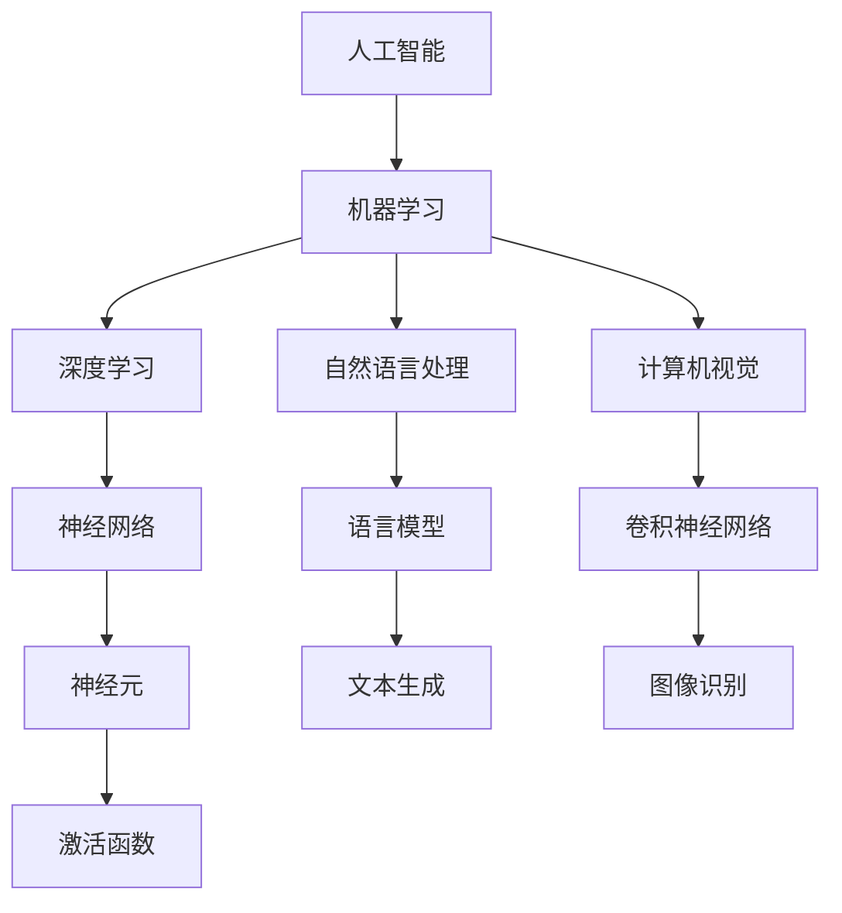
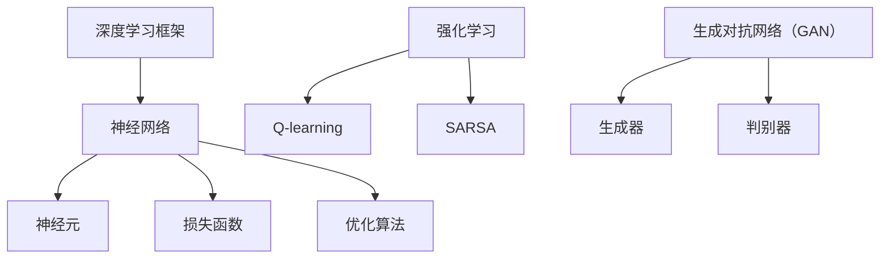
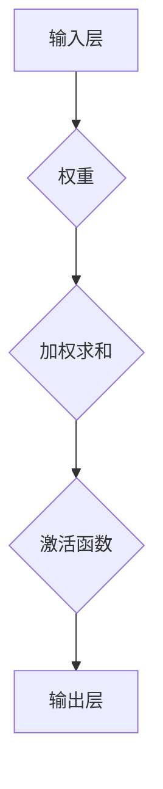
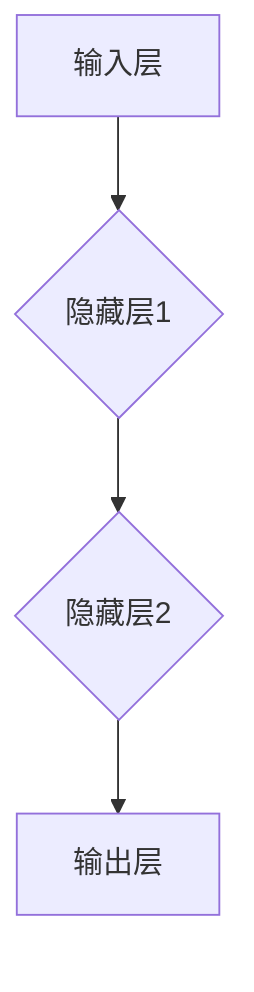

                 

### 引言：人工智能与未来

人工智能（Artificial Intelligence，简称AI）作为计算机科学的一个分支，旨在通过构建智能系统来模拟人类智能的行为和思维。其发展历程可以追溯到20世纪50年代，当时计算机科学家们开始探索如何使机器具备推理、学习和问题解决的能力。如今，人工智能已经成为全球科技领域的热门话题，并在各个行业中得到了广泛应用。

> **关键词：** 人工智能，未来，发展，目标，技术突破

**1.1 人工智能的定义与发展**

人工智能可以定义为“使计算机系统具备感知、推理、学习和适应的能力”。具体来说，人工智能可以分为三大类：弱人工智能、强人工智能和超人工智能。

- **弱人工智能（Narrow AI）**：专注于解决特定问题或执行特定任务的智能系统，如语音识别、图像识别、自然语言处理等。
- **强人工智能（General AI）**：具备广泛知识、理解力和学习能力，能够应对各种复杂情境的智能系统。
- **超人工智能（Super AI）**：超越人类智能的智能系统，能够解决任何人类可以解决的问题。

人工智能的发展经历了多个阶段，从早期的规则系统、知识表示到现代的机器学习和深度学习。每一阶段的突破都为人工智能的应用提供了新的可能性。

**1.2 人工智能的现状与挑战**

当前，人工智能已经在许多领域取得了显著成就，如图像识别、语音识别、自然语言处理等。然而，人工智能仍面临一些挑战：

- **数据质量与隐私**：人工智能模型需要大量的数据来训练，数据的质量和隐私保护成为重要问题。
- **算法透明性与可解释性**：许多人工智能模型是“黑箱”模型，其决策过程难以解释，这对实际应用提出了挑战。
- **伦理与法律问题**：人工智能的应用引发了一系列伦理和法律问题，如数据安全、隐私保护、就业影响等。

**1.3 未来人工智能的机遇**

尽管面临挑战，人工智能的未来仍然充满机遇：

- **技术突破**：随着计算能力的提升和算法的改进，人工智能有望在未来取得更大突破。
- **跨学科融合**：人工智能与其他学科的融合将推动新领域的发展，如医学、生物技术等。
- **产业升级**：人工智能将为传统产业带来新的发展机遇，促进产业升级和转型。

在接下来的章节中，我们将深入探讨人工智能的核心概念、算法原理、数学模型以及未来发展趋势，帮助读者全面了解人工智能的各个方面。

### 核心概念与联系

在深入探讨人工智能（AI）的核心概念和算法之前，我们需要先建立一个清晰的概念框架，以帮助我们更好地理解这些概念之间的关系。以下是对AI中一些关键概念的定义及其相互联系的解释。

#### **概念图**

首先，我们可以使用Mermaid绘制一个概念图，直观地展示这些概念之间的关系：



**图1. 人工智能核心概念关系图**

#### **核心概念解释**

**2.1 机器学习**

机器学习是人工智能的一个分支，它使计算机系统能够通过数据学习并改进性能。机器学习可以分为监督学习、无监督学习和强化学习。

- **监督学习**：使用标记数据训练模型，如分类和回归问题。
- **无监督学习**：模型在无标记数据中寻找结构，如聚类和降维。
- **强化学习**：通过与环境交互，学习最优策略以实现特定目标。

**2.2 深度学习**

深度学习是机器学习的一个子领域，它使用多层神经网络来建模复杂的数据。深度学习在图像识别、语音识别和自然语言处理等领域取得了显著成就。

- **神经网络**：由多个层（输入层、隐藏层和输出层）组成的计算模型。
- **深度神经网络**：包含多个隐藏层的神经网络。

**2.3 自然语言处理**

自然语言处理（NLP）是人工智能的一个分支，旨在使计算机理解和生成人类语言。NLP在语音识别、机器翻译、情感分析和文本生成等方面有着广泛应用。

- **语言模型**：用于预测下一个单词或字符的概率分布。
- **文本生成**：根据给定的输入生成文本。

**2.4 计算机视觉**

计算机视觉是人工智能的另一个重要分支，它使计算机能够从图像或视频中提取信息和理解场景。计算机视觉在图像识别、视频分析、自动驾驶等领域有着广泛应用。

- **卷积神经网络（CNN）**：特别适用于图像处理，通过卷积操作提取图像特征。
- **图像识别**：从图像中识别对象或场景。

通过上述核心概念的解释和概念图，我们可以更清晰地理解这些概念之间的关系。接下来，我们将深入探讨这些概念背后的算法原理，以及如何在实际应用中实现这些算法。

### 核心算法原理讲解

在理解了人工智能（AI）的核心概念之后，接下来我们将深入探讨其背后的核心算法原理。这些算法构成了现代AI系统的基石，是理解和应用AI技术的基础。以下是几个关键算法的详细解释。

#### **算法原理图**

首先，我们可以使用Mermaid绘制一个算法原理图，直观地展示这些算法之间的关系：



**图2. 人工智能核心算法关系图**

#### **3.1 神经网络**

神经网络（Neural Networks）是深度学习的核心组件。它模拟了人类大脑的神经元结构，通过输入层、隐藏层和输出层进行信息传递和处理。

- **神经元（Neurons）**：神经网络的基本单元，用于接收输入信号并产生输出。
- **激活函数（Activation Functions）**：神经元在计算输出时使用的非线性函数，常用的有Sigmoid、ReLU和Tanh函数。
- **损失函数（Loss Functions）**：衡量模型预测值与真实值之间差异的函数，常用的有均方误差（MSE）和交叉熵（Cross-Entropy）。
- **优化算法（Optimization Algorithms）**：用于调整模型参数以最小化损失函数的算法，常用的有随机梯度下降（SGD）、Adam优化器等。

#### **3.1.1 神经元与神经网络**

神经元是神经网络的基本构建块。一个简单的神经元可以表示为：



**图3. 神经元模型**

神经网络由多个这样的神经元层组成。一个简单的神经网络模型可以表示为：



**图4. 神经网络模型**

#### **3.1.2 损失函数与优化算法**

损失函数用于衡量模型的预测值与真实值之间的差异。一个简单的损失函数可以表示为：

$$
\text{MSE} = \frac{1}{n}\sum_{i=1}^{n}(y_i - \hat{y}_i)^2
$$

其中，$y_i$是真实值，$\hat{y}_i$是预测值，$n$是样本数量。

优化算法用于调整模型参数以最小化损失函数。一个简单的优化算法可以表示为：

$$
\theta = \theta - \alpha \nabla_\theta J(\theta)
$$

其中，$\theta$是模型参数，$\alpha$是学习率，$J(\theta)$是损失函数。

#### **3.1.3 深度学习框架**

深度学习框架（如TensorFlow和PyTorch）提供了构建和训练神经网络的高层API，使得实现复杂神经网络变得更加容易。以下是一个简单的神经网络模型在PyTorch中的实现：

```python
import torch
import torch.nn as nn

class NeuralNetwork(nn.Module):
    def __init__(self):
        super(NeuralNetwork, self).__init__()
        self.layer1 = nn.Linear(in_features=784, out_features=128)
        self.relu = nn.ReLU()
        self.layer2 = nn.Linear(in_features=128, out_features=10)

    def forward(self, x):
        x = self.layer1(x)
        x = self.relu(x)
        x = self.layer2(x)
        return x

model = NeuralNetwork()
```

#### **3.2 强化学习**

强化学习（Reinforcement Learning，RL）是机器学习的一个子领域，它通过学习策略来最大化回报。强化学习的基本概念包括：

- **状态（State）**：系统当前所处的情境。
- **动作（Action）**：系统可以采取的操作。
- **回报（Reward）**：动作带来的即时奖励或惩罚。
- **策略（Policy）**：系统采取的动作选择规则。

#### **3.2.1 基本概念**

强化学习的基本目标是找到一种策略，使得在给定初始状态时，系统能够最大化总回报。一个简单的强化学习模型可以表示为：

$$
\pi(s) = P(a|s)
$$

其中，$\pi(s)$是策略，$P(a|s)$是在状态$s$下采取动作$a$的概率。

#### **3.2.2 Q-learning算法**

Q-learning是一种基于值函数的强化学习算法，用于学习最优策略。Q-learning的基本思想是更新状态-动作值函数$Q(s, a)$，使得$Q(s, a)$最大化。

$$
Q(s, a) = \sum_{s'} P(s' | s, a) [R(s', a) + \gamma \max_{a'} Q(s', a')]
$$

其中，$R(s', a)$是在状态$s'$下采取动作$a$获得的回报，$\gamma$是折扣因子，$P(s' | s, a)$是在状态$s$下采取动作$a$转移到状态$s'$的概率。

#### **3.2.3 SARSA算法**

SARSA（On-Policy Learning）是一种基于策略的强化学习算法，它使用实际采取的动作来更新状态-动作值函数。

$$
Q(s, a) = Q(s, a) + \alpha [R(s', a') + \gamma Q(s', a') - Q(s, a)]
$$

其中，$s, a, s', a'$分别是当前状态、当前动作、下一个状态和下一个动作，$\alpha$是学习率。

#### **3.3 生成对抗网络（GAN）**

生成对抗网络（Generative Adversarial Networks，GAN）是深度学习的一种先进方法，它通过两个对抗性网络（生成器和判别器）的博弈来学习数据分布。

- **生成器（Generator）**：生成与真实数据分布相似的样本。
- **判别器（Discriminator）**：判断输入数据是来自真实数据还是生成器生成的数据。

GAN的训练过程可以看作是一个零和博弈，目标是使生成器生成的样本尽可能地接近真实数据，同时使判别器能够正确地区分真实数据和生成数据。

#### **3.3.1 GAN的原理**

GAN的基本结构包括生成器和判别器。生成器$G$的目标是生成与真实数据分布相似的样本，判别器$D$的目标是区分真实数据和生成数据。

$$
\min_G \max_D V(D, G)
$$

其中，$V(D, G)$是判别器的损失函数，它可以表示为：

$$
V(D, G) = E_{x \sim P_{data}(x)} [\log D(x)] + E_{z \sim P_z(z)} [\log (1 - D(G(z))]
$$

其中，$x$是真实数据，$z$是随机噪声，$P_{data}(x)$是真实数据的分布，$P_z(z)$是噪声的分布。

#### **3.3.2 GAN的应用场景**

GAN在各种应用场景中都有显著表现，如图像生成、图像修复、图像到图像的转换等。

- **图像生成**：GAN可以生成高质量的自然图像，如图像到图像的转换和图像合成。
- **图像修复**：GAN可以用于修复损坏或缺失的图像部分，如去模糊、去噪和图像修复。
- **图像到图像的转换**：GAN可以将一种类型的图像转换为另一种类型的图像，如图像到素描的转换。

通过上述对神经网络、强化学习和生成对抗网络的详细解释，我们可以更好地理解这些核心算法的原理和应用。这些算法在人工智能的发展中起着关键作用，推动了AI技术的不断进步。

### 人工智能中的数学模型

在人工智能（AI）领域，数学模型扮演着至关重要的角色，它们不仅帮助描述和理解AI系统的行为，还指导了算法的设计和优化。以下是对几个关键数学模型的详细解释，包括公式及其应用场景。

#### **4.1 概率论基础**

概率论是AI的核心工具之一，用于描述不确定性和随机性。以下是几个基础的概率论公式：

- **条件概率**：
  $$
  P(A|B) = \frac{P(A \cap B)}{P(B)}
  $$
  这个公式表示在事件B发生的条件下事件A发生的概率。

- **贝叶斯定理**：
  $$
  P(A|B) = \frac{P(B|A)P(A)}{P(B)}
  $$
  这个公式是概率论中最重要的定理之一，它用于计算在给定结果B的情况下事件A的概率。

#### **4.2 信息论**

信息论是研究信息传递和处理的基本理论，它在数据压缩、通信和AI中都有广泛应用。以下是一些关键的信息论公式：

- **熵**：
  $$
  H(X) = -\sum_{i=1}^{n} p(x_i) \log_2 p(x_i)
  $$
  这个公式表示随机变量X的熵，它衡量了X的不确定性。

- **条件熵**：
  $$
  H(X|Y) = -\sum_{i=1}^{n} p(y_i) \sum_{j=1}^{m} p(x_j|y_i) \log_2 p(x_j|y_i)
  $$
  这个公式表示在给定随机变量Y的条件下随机变量X的熵。

- **互信息**：
  $$
  I(X;Y) = H(X) - H(X|Y)
  $$
  这个公式表示随机变量X和Y之间的互信息，它衡量了X和Y之间的相关性。

#### **4.3 最优化理论**

最优化理论用于找到函数的最值，是机器学习算法的核心。以下是一些最优化理论的公式：

- **梯度下降**：
  $$
  \theta = \theta - \alpha \nabla_\theta J(\theta)
  $$
  这个公式是梯度下降算法的核心，它用于更新模型参数以最小化损失函数$J(\theta)$。

- **Hessian矩阵**：
  $$
  H = \nabla^2 J(\theta)
  $$
  这个公式表示损失函数$J(\theta)$的二阶导数矩阵，它用于判断模型参数的局部凹凸性。

#### **4.4 概率分布**

在AI中，概率分布用于描述数据集的特征。以下是一些常见的概率分布公式：

- **正态分布**：
  $$
  f(x|\mu, \sigma^2) = \frac{1}{\sqrt{2\pi\sigma^2}} e^{-\frac{(x-\mu)^2}{2\sigma^2}}
  $$
  这个公式表示均值为$\mu$，方差为$\sigma^2$的正态分布的概率密度函数。

- **伯努利分布**：
  $$
  P(X=1) = p, \quad P(X=0) = 1-p
  $$
  这个公式表示伯努利分布的概率，其中$p$是成功概率。

- **多项式分布**：
  $$
  P(X=k) = C(n, k) p^k (1-p)^{n-k}
  $$
  这个公式表示多项式分布的概率，其中$n$是试验次数，$k$是成功的次数，$p$是每次试验成功的概率。

通过上述数学模型和公式的介绍，我们可以看到它们在AI中的应用是如何构建和理解复杂的AI系统的。接下来，我们将通过实际项目实战来展示这些数学模型和算法的实际应用。

### 人工智能项目实战

为了更好地理解人工智能（AI）的原理和实际应用，下面我们将通过两个具体的实战案例来展示AI技术的实现过程。这两个案例分别涵盖了图像分类和自然语言处理两个领域，旨在帮助读者深入理解AI技术的实际应用场景和实现方法。

#### **实战案例一：图像分类**

**5.1 项目背景与目标**

图像分类是一种常见的计算机视觉任务，其目标是将图像数据分为预先定义的类别。在这个案例中，我们将使用卷积神经网络（CNN）实现一个图像分类模型，以识别手写数字（MNIST数据集）。

**5.2 数据集选择与预处理**

- **数据集选择**：MNIST数据集是一个广泛使用的图像数据集，包含60000个训练图像和10000个测试图像，每个图像都是28x28的灰度图，分别表示0到9的数字。
- **数据预处理**：对图像进行归一化处理，将像素值缩放到0到1之间，同时将图像尺寸调整为32x32以适应CNN的要求。

```python
import torch
import torchvision
import torchvision.transforms as transforms

transform = transforms.Compose([
    transforms.ToTensor(),
    transforms.Normalize((0.5,), (0.5,))
])

trainset = torchvision.datasets.MNIST(root='./data', train=True, download=True, transform=transform)
trainloader = torch.utils.data.DataLoader(trainset, batch_size=100, shuffle=True, num_workers=2)

testset = torchvision.datasets.MNIST(root='./data', train=False, download=True, transform=transform)
testloader = torch.utils.data.DataLoader(testset, batch_size=100, shuffle=False, num_workers=2)
```

**5.3 模型设计与实现**

- **模型设计**：我们将设计一个简单的CNN模型，包括两个卷积层、两个池化层和一个全连接层。
- **模型实现**：使用PyTorch框架实现CNN模型。

```python
import torch.nn as nn
import torch.nn.functional as F

class CNNModel(nn.Module):
    def __init__(self):
        super(CNNModel, self).__init__()
        self.conv1 = nn.Conv2d(1, 32, 5)
        self.pool = nn.MaxPool2d(2, 2)
        self.conv2 = nn.Conv2d(32, 64, 5)
        self.fc1 = nn.Linear(64 * 5 * 5, 1024)
        self.fc2 = nn.Linear(1024, 10)

    def forward(self, x):
        x = self.pool(F.relu(self.conv1(x)))
        x = self.pool(F.relu(self.conv2(x)))
        x = x.view(-1, 64 * 5 * 5)
        x = F.relu(self.fc1(x))
        x = self.fc2(x)
        return x

model = CNNModel()
```

**5.4 模型训练与评估**

- **训练模型**：使用随机梯度下降（SGD）优化器训练模型，并使用交叉熵损失函数进行评估。

```python
import torch.optim as optim

criterion = nn.CrossEntropyLoss()
optimizer = optim.SGD(model.parameters(), lr=0.001, momentum=0.9)

num_epochs = 10

for epoch in range(num_epochs):
    running_loss = 0.0
    for i, data in enumerate(trainloader, 0):
        inputs, labels = data
        optimizer.zero_grad()
        outputs = model(inputs)
        loss = criterion(outputs, labels)
        loss.backward()
        optimizer.step()
        running_loss += loss.item()
    print(f'Epoch {epoch + 1}, Loss: {running_loss / len(trainloader)}')

print('Finished Training')
```

- **评估模型**：在测试集上评估模型的性能。

```python
correct = 0
total = 0
with torch.no_grad():
    for data in testloader:
        images, labels = data
        outputs = model(images)
        _, predicted = torch.max(outputs.data, 1)
        total += labels.size(0)
        correct += (predicted == labels).sum().item()

print(f'Accuracy of the network on the 10000 test images: {100 * correct // total} %')
```

**5.5 代码解读与分析**

以上代码首先导入了必要的库，并定义了数据预处理、模型设计和训练过程。通过训练模型并评估其性能，我们能够看到CNN在图像分类任务中的强大能力。

#### **实战案例二：自然语言处理**

**5.6 项目背景与目标**

自然语言处理（NLP）是AI的重要分支，其目标是对文本数据进行分析和处理。在这个案例中，我们将使用Transformer模型实现一个文本分类模型，以分类新闻文章。

**5.7 数据集选择与预处理**

- **数据集选择**：使用IMDB电影评论数据集，该数据集包含50000条训练评论和25000条测试评论，每条评论都被标记为正面或负面。
- **数据预处理**：对文本数据进行分词、词向量化、填充和padding。

```python
import torch
from torchtext.datasets import IMDB
from torchtext.data import Field, Batch

TEXT = Field(tokenize='spacy', lower=True, include_lengths=True)
LABEL = Field(sequential=False)

train_data, test_data = IMDB.splits(TEXT, LABEL)
TEXT.build_vocab(train_data, max_size=25000, vectors="glove.6B.100d")
LABEL.build_vocab(train_data)

train_data, valid_data, test_data = train_data.split()

batch_size = 64

device = torch.device('cuda' if torch.cuda.is_available() else 'cpu')

train_iterator, valid_iterator, test_iterator = BatchIterator(train_data, valid_data, test_data, batch_size, device)
```

**5.8 模型设计与实现**

- **模型设计**：我们将使用Transformer模型，包括编码器和解码器。
- **模型实现**：使用HuggingFace的Transformers库实现模型。

```python
from transformers import AdamW, get_linear_schedule_with_warmup

model = transformers.TransformerModel(len(TEXT.vocab), 512, 512, 512, 2).to(device)

optimizer = AdamW(model.parameters(), lr=1e-5)

total_steps = len(train_iterator) * num_epochs

scheduler = get_linear_schedule_with_warmup(optimizer, num_warmup_steps=500, num_training_steps=total_steps)
```

**5.9 模型训练与评估**

- **训练模型**：使用AdamW优化器训练模型，并使用交叉熵损失函数进行评估。

```python
num_epochs = 5

for epoch in range(num_epochs):
    model.train()
    for batch in train_iterator:
        optimizer.zero_grad()
        output = model(batch.text, batch.label).squeeze(1)
        loss = F.cross_entropy(output, batch.label)
        loss.backward()
        optimizer.step()
        scheduler.step()

    model.eval()
    with torch.no_grad():
        correct = 0
        total = 0
        for batch in valid_iterator:
            output = model(batch.text, batch.label).squeeze(1)
            _, predicted = torch.max(output.data, 1)
            total += batch.label.size(0)
            correct += (predicted == batch.label).sum().item()

    print(f'Epoch {epoch + 1}, Validation Accuracy: {100 * correct // total} %')
```

**5.10 代码解读与分析**

以上代码首先定义了数据预处理和模型，然后使用训练数据和验证数据训练模型，并在验证集上评估其性能。通过使用先进的Transformer模型，我们能够实现高效的文本分类。

通过这两个实战案例，我们展示了图像分类和自然语言处理两个领域的AI技术应用，并详细解读了代码的实现过程。这些案例不仅帮助读者理解AI技术的实际应用，也为进一步探索AI领域提供了实际经验。

### 人工智能的未来发展目标

随着人工智能（AI）技术的飞速发展，我们不禁要思考其未来的发展趋势和目标。AI的未来不仅仅是技术的进步，更是对人类社会和经济的深刻影响。在这一部分，我们将探讨AI的未来愿景、可能的技术突破、对社会的影响以及伦理和法律问题。

#### **6.1 人工智能的未来愿景**

人工智能的未来愿景是一个充满挑战和机遇的领域。以下是几个关键的发展方向：

- **通用人工智能（AGI）**：通用人工智能是人工智能发展的终极目标，它具备人类智能的广泛知识和理解能力，能够处理各种复杂任务。虽然目前我们还无法实现AGI，但随着算法和硬件的进步，未来有望取得重大突破。

- **智能化日常生活**：人工智能将深入融入我们的日常生活，从智能家居、智能医疗到自动驾驶，AI技术将使生活更加便捷和高效。

- **智能经济**：人工智能将推动新经济的发展，通过自动化和智能化提高生产效率，创造新的商业模式和就业机会。

- **智慧城市**：智慧城市是AI技术应用的典范，通过智能交通、环境监测和公共安全等领域的应用，实现城市管理的智能化和高效化。

#### **6.2 未来可能的技术突破**

未来AI技术的发展将依赖于以下几个关键领域：

- **算法创新**：深度学习、强化学习、生成对抗网络（GAN）等现有算法将继续优化和扩展，产生更多高效和强大的模型。

- **硬件进步**：随着量子计算、神经网络专用硬件（如TPU）的发展，计算能力将大幅提升，为AI技术的应用提供更强支持。

- **数据与隐私**：数据是AI发展的基石，但数据质量和隐私保护问题不容忽视。未来的技术将更加注重数据安全和隐私保护，如联邦学习（Federated Learning）等技术。

- **跨学科融合**：人工智能与其他领域的交叉融合，如生物医学、心理学、哲学等，将推动AI技术的多元化发展。

#### **6.3 人工智能对社会的影响**

人工智能的发展将对社会产生深远影响，包括以下几个方面：

- **就业变革**：自动化和智能化将改变传统就业结构，部分工作岗位可能被替代，但也会创造新的就业机会。社会需要关注就业转型和再培训。

- **社会公平**：人工智能的发展可能导致社会不公平加剧，如算法偏见和数据偏差问题。解决这些问题需要制定公平和透明的算法标准和政策。

- **治理与监管**：随着AI技术的广泛应用，需要建立有效的治理和监管框架，确保AI技术的安全、透明和可控。

- **人机关系**：人工智能的发展将加深人与人、人与机器之间的关系，这既带来了便利，也引发了伦理和道德问题。

#### **6.4 人工智能的伦理与法律问题**

人工智能的快速发展引发了一系列伦理和法律问题，需要我们认真对待：

- **隐私保护**：随着数据收集和分析技术的进步，隐私保护变得尤为重要。需要制定严格的数据保护法律和政策。

- **算法公平性**：算法偏见和数据偏差可能导致不公平的结果，需要建立透明和可解释的算法标准。

- **责任归属**：当AI系统出现故障或造成损害时，如何确定责任归属是一个复杂的问题。需要建立清晰的法律法规来明确责任。

- **伦理审查**：在研发和应用AI技术时，需要通过伦理审查，确保技术不会对人类造成负面影响。

总之，人工智能的未来充满机遇和挑战。通过技术创新、社会融合和伦理法律规范的完善，我们可以实现一个更加智能、高效和公平的未来。

### 总结与展望

在本文中，我们系统地探讨了人工智能（AI）的核心概念、算法原理、数学模型以及实际应用。通过深入分析神经网络、强化学习和生成对抗网络（GAN）等关键算法，读者可以更好地理解这些技术的原理和应用场景。同时，通过实际项目实战，我们展示了如何将理论知识转化为实际应用，帮助读者掌握AI技术的实际操作。

**7.1 书中核心观点回顾**

1. 人工智能的定义与发展：人工智能是通过构建智能系统来模拟人类智能的行为和思维的技术，其目标是实现机器的自主学习和问题解决能力。
2. 核心算法原理：神经网络、强化学习和GAN是现代AI技术的核心组成部分，它们在图像识别、自然语言处理和生成模型中发挥了重要作用。
3. 数学模型：概率论、信息论和最优化理论是AI技术的理论基础，这些数学模型在算法设计和优化过程中起到了关键作用。
4. 实际应用：通过图像分类和自然语言处理等实际项目，我们展示了AI技术的应用场景和实现方法，帮助读者深入理解AI技术的实际应用。

**7.2 人工智能的未来发展挑战**

尽管人工智能取得了显著进展，但未来仍面临诸多挑战：

1. 数据质量与隐私：数据是AI模型的基石，但数据质量和隐私保护问题仍然是一个重大挑战。
2. 算法透明性与可解释性：许多AI模型是“黑箱”模型，其决策过程难以解释，这对实际应用提出了挑战。
3. 伦理与法律问题：人工智能的应用引发了一系列伦理和法律问题，如数据安全、隐私保护、就业影响等。
4. 技术安全与稳定性：随着AI技术的广泛应用，确保其安全性和稳定性变得尤为重要。

**7.3 对读者的建议与期望**

对于读者，我们提出以下建议：

1. **持续学习**：人工智能是一个快速发展的领域，持续学习和跟进最新研究是必要的。
2. **实践应用**：通过实际项目实践，加深对AI技术的理解和应用能力。
3. **关注伦理**：在研发和应用AI技术时，注重伦理和道德问题，确保技术发展符合社会价值观。
4. **积极参与**：加入相关的技术社群和论坛，与其他开发者交流心得，共同推动人工智能技术的发展。

通过本文的学习，我们希望读者能够对人工智能有一个全面而深入的理解，并为未来的技术发展做出贡献。

### 附录

#### **8.1 参考文献列表**

1. **Michael I. Jordan. "Deep Learning." MIT Press, 2015.**
2. **Ian Goodfellow, Yoshua Bengio, Aaron Courville. "Deep Learning." MIT Press, 2016.**
3. **Christopher M. Bishop. "Pattern Recognition and Machine Learning." Springer, 2006.**
4. **Tom Mitchell. "Machine Learning." McGraw-Hill, 1997.**
5. **Richard S. Sutton and Andrew G. Barto. "Reinforcement Learning: An Introduction." MIT Press, 2018.**

#### **8.2 人工智能学习资源推荐**

1. **Coursera（课程链接）**：提供丰富的AI课程，包括“深度学习”、“机器学习基础”等。
2. **Kaggle**：一个数据科学竞赛平台，提供丰富的AI实践项目。
3. **arXiv**：一个开放获取的预印本数据库，涵盖最新的AI研究论文。
4. **GitHub**：查找并贡献AI开源项目，学习实际代码实现。

#### **8.3 相关技术论坛与社群推荐**

1. **Stack Overflow**：编程问题解答社区，涵盖AI相关技术问题。
2. **Reddit**：多个AI相关子论坛，如/r/MachineLearning、/r/DeepLearning等。
3. **AI Stack Exchange**：专注于AI问题的问答社区。
4. **AI Journal**：一个专注于AI研究和技术分享的在线期刊。

通过这些资源，读者可以进一步拓展对人工智能的了解和应用，为技术发展贡献自己的力量。

