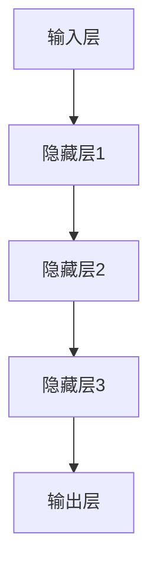
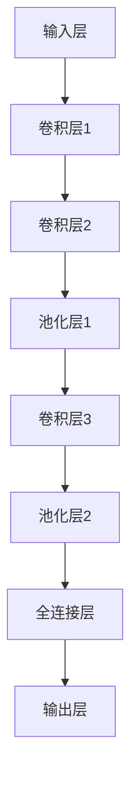
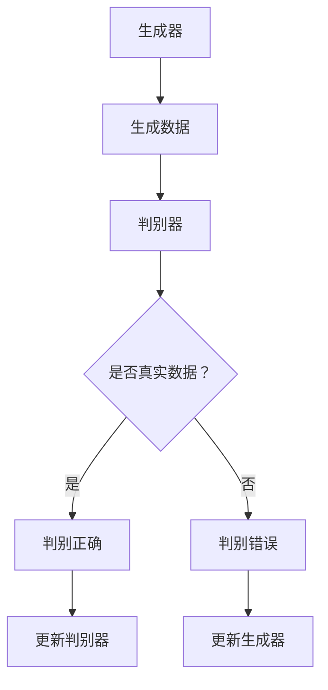

                 

### 文章标题

《Andrej Karpathy：人工智能的未来发展趋势》

### 关键词

- Andrej Karpathy
- 人工智能
- 未来发展趋势
- 技术核心
- 应用领域
- 安全与伦理
- 挑战与机遇
- 社会影响

### 摘要

本文深入探讨了人工智能领域著名专家Andrej Karpathy对未来人工智能发展趋势的见解。通过分析人工智能的起源、技术核心、应用领域、未来趋势以及面临的挑战与机遇，本文旨在为读者提供一份全面的人工智能发展趋势报告，帮助大家更好地理解人工智能的现状与未来。

---

## 《Andrej Karpathy：人工智能的未来发展趋势》目录大纲

### 第1章 人工智能的起源与发展

- **1.1 人工智能的定义**
- **1.2 人工智能的历史与发展趋势**
- **1.3 人工智能与未来社会的联系**

### 第2章 人工智能的技术核心

- **2.1 神经网络与深度学习基础**
- **2.2 自然语言处理与计算机视觉**
- **2.3 强化学习与生成对抗网络**

### 第3章 人工智能的应用领域

- **3.1 人工智能在医疗领域的应用**
- **3.2 人工智能在金融领域的应用**
- **3.3 人工智能在工业和制造业的应用**

### 第4章 人工智能的未来趋势

- **4.1 人工智能的发展方向**
- **4.2 人工智能在未来的社会角色**
- **4.3 人工智能的安全与伦理问题**

### 第5章 人工智能的挑战与机遇

- **5.1 人工智能的发展挑战**
- **5.2 人工智能的机遇与影响**
- **5.3 人工智能的未来预测**

### 第6章 人工智能的未来发展与趋势预测

- **6.1 人工智能技术的未来发展趋势**
- **6.2 人工智能在未来社会中的应用场景**
- **6.3 人工智能的未来预测与分析**

### 第7章 人工智能的发展与影响

- **7.1 人工智能对社会的影响**
- **7.2 人工智能对经济的影响**
- **7.3 人工智能对教育和就业的影响**

### 附录

- **附录 A：人工智能研究资源与工具**
- **附录 B：人工智能相关论文与书籍推荐**
- **附录 C：人工智能开发指南与实战案例**

---

### 第1章 人工智能的起源与发展

#### 1.1 人工智能的定义

人工智能（Artificial Intelligence，简称AI）是指由人创造的一种能够模拟、延伸和扩展人类智能的理论、方法、技术及应用系统。它旨在让计算机具有类似人类的感知、理解、学习、推理和决策能力，从而实现自动化和智能化。

#### 1.2 人工智能的历史与发展趋势

人工智能的发展历程可以分为几个重要阶段：

1. **诞生期（20世纪50年代）**：
    - 1956年，达特茅斯会议上首次提出“人工智能”这一概念，标志着人工智能学科的诞生。
    - 早期的AI研究主要集中在符号主义方法和逻辑推理上。

2. **黄金时期（20世纪80年代）**：
    - 1956年至1974年，人工智能研究取得了显著进展，包括自然语言处理、机器翻译和专家系统等。
    - 然而，由于硬件限制和算法复杂度，这一时期的人工智能研究逐渐陷入困境。

3. **低谷期（20世纪80年代末至21世纪初）**：
    - 受到硬件性能、数据资源和技术局限等因素的影响，人工智能研究进入低谷期。
    - 这一时期，人工智能研究主要聚焦于知识表示、推理和规划等领域。

4. **复兴期（21世纪初至今）**：
    - 随着计算机性能的提升、大数据和深度学习技术的发展，人工智能再次焕发活力。
    - 语音识别、图像识别、自然语言处理等领域取得了重大突破。

#### 1.3 人工智能与未来社会的联系

人工智能对未来的社会将产生深远的影响，主要体现在以下几个方面：

1. **经济影响**：
    - 人工智能将提高生产效率、降低成本，推动经济增长。
    - 部分传统行业可能会受到冲击，但也会催生新的就业机会。

2. **生活影响**：
    - 人工智能将为人们提供更加便捷、智能化的生活体验。
    - 家庭自动化、智能医疗、智能交通等领域将得到广泛应用。

3. **伦理与社会问题**：
    - 人工智能的发展引发了一系列伦理和社会问题，如隐私保护、道德决策等。
    - 需要制定相关法律法规，确保人工智能的发展符合伦理和社会价值观。

#### 1.4 总结

人工智能作为一门多学科交叉的新兴学科，经历了数十年的发展，已经取得了显著的成果。随着技术的不断进步，人工智能在未来有望在更多领域发挥重要作用，为人类社会带来更多福祉。

---

### 第2章 人工智能的技术核心

#### 2.1 神经网络与深度学习基础

神经网络（Neural Networks）是人工智能的核心技术之一，模拟了人类大脑的结构和工作原理。深度学习（Deep Learning）是神经网络的一种扩展，通过多层神经网络来实现复杂函数的建模和预测。

##### 2.1.1 神经网络的基本概念

神经网络由大量相互连接的神经元组成，每个神经元接收多个输入信号，通过权重和激活函数进行非线性变换，最终输出一个结果。神经网络的基本结构包括：

1. **输入层**：接收外部输入信息。
2. **隐藏层**：进行特征提取和变换。
3. **输出层**：输出预测结果或分类标签。

神经网络的学习过程是通过反向传播算法（Backpropagation）来调整权重和偏置，使得输出误差最小。

##### 2.1.2 深度学习的特点与应用

与传统的机器学习方法相比，深度学习具有以下几个特点：

1. **层次化特征表示**：通过多层神经网络，逐步提取抽象特征，使得模型能够处理更加复杂的问题。
2. **端到端训练**：直接从原始输入数据训练到输出结果，避免了传统方法中繁琐的特征工程。
3. **强大的泛化能力**：通过大量的数据和参数，深度学习模型具有较好的泛化能力。

深度学习已在多个领域取得了显著成果，如：

- **计算机视觉**：图像分类、目标检测、人脸识别等。
- **自然语言处理**：文本分类、机器翻译、情感分析等。
- **语音识别**：语音识别、语音合成等。

##### 2.1.3 Mermaid流程图

#### 2.2 自然语言处理与计算机视觉

自然语言处理（Natural Language Processing，NLP）和计算机视觉（Computer Vision，CV）是人工智能的两个重要分支，分别研究如何让计算机理解和处理自然语言图像。

##### 2.2.1 自然语言处理

自然语言处理的目标是使计算机能够理解和处理人类语言，主要包括以下几个方面：

1. **文本分类**：对文本进行分类，如情感分析、新闻分类等。
2. **机器翻译**：将一种语言的文本翻译成另一种语言。
3. **命名实体识别**：识别文本中的特定实体，如人名、地名、组织名等。
4. **问答系统**：理解用户的问题，并给出合适的回答。

自然语言处理的核心技术包括：

- **词向量表示**：将词语转化为高维向量表示，便于计算机处理。
- **循环神经网络（RNN）**：处理序列数据，如文本和语音。
- **长短时记忆（LSTM）**：RNN的改进版本，能够更好地处理长序列数据。

##### 2.2.2 计算机视觉

计算机视觉的目标是使计算机能够“看到”和理解图像，主要包括以下几个方面：

1. **图像分类**：对图像进行分类，如人脸识别、物体检测等。
2. **目标检测**：定位图像中的目标，并对其进行分类。
3. **图像分割**：将图像分割成多个区域，便于后续处理。
4. **人脸识别**：识别和验证人脸。

计算机视觉的核心技术包括：

- **卷积神经网络（CNN）**：用于图像分类和目标检测。
- **生成对抗网络（GAN）**：用于生成高质量图像。
- **增强现实（AR）**：通过计算机视觉技术将虚拟物体叠加到现实世界中。

##### 2.2.3 Mermaid流程图

#### 2.3 强化学习与生成对抗网络

强化学习（Reinforcement Learning，RL）和生成对抗网络（Generative Adversarial Networks，GAN）是人工智能领域的两个重要研究方向，分别解决决策和生成问题。

##### 2.3.1 强化学习

强化学习是一种通过与环境互动来学习最优策略的机器学习方法。其核心思想是通过奖励机制来引导智能体（Agent）在未知环境中做出最优决策。强化学习的基本要素包括：

1. **智能体（Agent）**：执行动作的主体。
2. **环境（Environment）**：智能体所处的环境。
3. **状态（State）**：智能体在环境中的状态。
4. **动作（Action）**：智能体可以执行的动作。
5. **奖励（Reward）**：智能体执行动作后获得的奖励。

强化学习的算法包括：

- **值函数方法**：通过学习状态值函数或动作值函数来预测未来奖励。
- **策略方法**：直接学习最优策略，即给定状态下执行最佳动作。

强化学习已在游戏、自动驾驶、机器人控制等领域取得了显著成果。

##### 2.3.2 生成对抗网络

生成对抗网络（GAN）是一种由生成器（Generator）和判别器（Discriminator）组成的对抗性模型。生成器生成与真实数据相似的数据，判别器则判断生成数据与真实数据的差异。GAN的训练过程可以看作是一个零和游戏，生成器和判别器相互竞争，最终生成器生成的数据越来越逼真。

GAN的基本结构包括：

1. **生成器（Generator）**：生成与真实数据相似的数据。
2. **判别器（Discriminator）**：判断输入数据是真实数据还是生成数据。
3. **损失函数**：衡量生成器和判别器的性能。

GAN的应用包括：

- **图像生成**：生成高质量、多样化的图像。
- **图像修复**：修复损坏或模糊的图像。
- **风格迁移**：将一种风格应用到另一张图像上。

##### 2.3.3 Mermaid流程图

#### 2.4 总结

神经网络与深度学习、自然语言处理与计算机视觉、强化学习与生成对抗网络是人工智能领域的核心技术。这些技术在不同领域和场景中发挥着重要作用，推动着人工智能的发展和应用。在接下来的章节中，我们将进一步探讨人工智能的应用领域、未来趋势以及面临的挑战和机遇。

---

### 第3章 人工智能的应用领域

人工智能（AI）技术已经渗透到我们生活的各个方面，从医疗、金融到工业和制造业，人工智能的应用正在不断拓展，为我们带来了前所未有的便利和效益。以下是对人工智能在医疗、金融和工业领域应用的具体分析。

#### 3.1 人工智能在医疗领域的应用

人工智能在医疗领域的应用正逐步改变传统的医疗模式，提高诊疗效率，改善患者体验。以下是人工智能在医疗领域的几个主要应用：

1. **诊断辅助**：人工智能可以通过分析医疗图像（如CT、MRI等）来辅助医生进行疾病诊断。例如，谷歌的DeepMind开发的AI系统能够在数秒内对眼底图像进行筛查，提高糖尿病视网膜病变的早期诊断率。

2. **个性化治疗**：通过分析患者的基因组信息，人工智能可以帮助医生制定个性化的治疗方案。例如，罗氏制药公司利用AI技术分析肺癌患者的基因组数据，为患者提供更精准的治疗方案。

3. **药物研发**：人工智能在药物研发中发挥着重要作用。通过模拟药物分子与生物靶点的相互作用，AI可以帮助科学家快速筛选出有潜力的药物候选分子，大大缩短药物研发周期。

4. **智能导医**：基于自然语言处理和知识图谱技术，智能导医系统能够帮助患者快速获取医疗信息，推荐合适的医生和医院，提高医疗资源的利用效率。

#### 3.2 人工智能在金融领域的应用

金融行业一直是人工智能技术的重要应用领域，通过AI技术，金融行业实现了更高效的业务流程、更精准的风险控制和更优质的客户服务。以下是人工智能在金融领域的几个主要应用：

1. **智能投顾**：通过机器学习和数据挖掘技术，智能投顾可以为投资者提供个性化的投资建议，实现资产配置的优化。例如， Wealthfront和Betterment等平台利用AI技术提供智能投资服务。

2. **风险管理**：人工智能可以通过大数据分析和实时监控，帮助金融机构识别和防范潜在风险。例如，人工智能可以对交易行为进行分析，及时发现欺诈行为。

3. **信用评估**：通过分析个人或企业的行为数据、信用历史等多维数据，人工智能可以更准确地评估信用风险。例如，Kabbage等公司利用AI技术为中小企业提供信用评估服务。

4. **智能客服**：通过自然语言处理和对话生成技术，智能客服系统能够自动处理客户咨询，提高客户服务效率。例如，银行和保险公司等金融机构已经广泛应用智能客服系统来应对客户需求。

#### 3.3 人工智能在工业和制造业的应用

人工智能技术在工业和制造业的应用正在推动产业升级和转型，提高生产效率、降低成本。以下是人工智能在工业和制造业的几个主要应用：

1. **智能制造**：通过人工智能技术，可以实现生产过程的自动化和智能化。例如，机器人和自动化生产线可以根据生产需求实时调整生产计划和流程，提高生产效率。

2. **设备故障预测**：人工智能可以通过对设备运行数据的实时分析，预测设备可能出现的故障，提前进行维护，避免生产中断。例如，西门子公司利用AI技术预测工业设备故障，提高设备利用率。

3. **供应链优化**：通过大数据分析和优化算法，人工智能可以帮助企业优化供应链管理，降低库存成本，提高供应链的响应速度。例如，亚马逊利用AI技术优化库存管理和配送路线。

4. **质量检测**：人工智能可以通过图像识别和自然语言处理技术，对产品进行质量检测和缺陷识别。例如，特斯拉的AI系统可以对生产的汽车进行质量检测，确保产品质量。

#### 3.4 总结

人工智能在医疗、金融和工业领域已经展现出巨大的应用潜力。通过人工智能技术的应用，这些领域实现了更高效、更精准和更智能的服务。随着人工智能技术的不断发展和成熟，未来将在更多领域实现突破，为社会带来更多福祉。

---

### 第4章 人工智能的未来趋势

随着人工智能技术的不断进步和应用，未来的人工智能将呈现出一些显著的发展趋势。在这一章节中，我们将探讨人工智能的发展方向、在未来社会的角色以及可能面临的安全与伦理问题。

#### 4.1 人工智能的发展方向

1. **更强大的计算能力**：
   人工智能的发展离不开强大的计算能力。随着量子计算、分布式计算和边缘计算等新技术的应用，计算能力将得到显著提升，为人工智能的发展提供坚实的基础。

2. **更智能的算法**：
   为了应对日益复杂的应用场景，人工智能需要更智能、更高效的算法。例如，自适应学习算法、迁移学习算法和元学习算法等，这些算法能够提高人工智能的灵活性和适应性。

3. **更多元的交互方式**：
   未来的智能系统将具备更丰富的交互方式，如语音交互、手势交互和眼动交互等。这些交互方式将使得人与人工智能之间的互动更加自然和便捷。

4. **更广泛的应用场景**：
   人工智能将逐渐渗透到各个领域，从医疗、金融到教育、娱乐等，为人类社会带来更多创新和变革。

#### 4.2 人工智能在未来的社会角色

1. **生产力的提升者**：
   人工智能将大幅提高生产效率，降低生产成本，推动社会生产力的提升。特别是在制造业、物流和金融服务等领域，人工智能将发挥重要作用。

2. **生活的便利化提供者**：
   通过智能家居、智能交通和智能医疗等应用，人工智能将极大地改善人们的生活质量，提供更加便捷和智能化的生活体验。

3. **创新的驱动者**：
   人工智能技术将推动各个领域的创新，催生新的产业和就业机会。例如，人工智能驱动的无人驾驶、智能医疗诊断和个性化教育等，将成为未来社会的重要趋势。

#### 4.3 人工智能的安全与伦理问题

1. **数据隐私保护**：
   随着人工智能对数据的依赖性增加，数据隐私保护问题变得尤为重要。如何确保用户数据的安全和隐私，防止数据泄露和滥用，是人工智能发展中亟待解决的问题。

2. **算法公平性和透明度**：
   人工智能算法的决策过程往往不够透明，可能导致偏见和不公平。如何确保算法的公平性和透明度，避免算法歧视和偏见，是人工智能发展中需要重视的问题。

3. **伦理道德约束**：
   人工智能的发展引发了一系列伦理道德问题，如自主决策的道德责任、人工智能的武器化等。需要制定相应的伦理规范和法律，确保人工智能的发展符合人类社会的价值观和道德准则。

#### 4.4 总结

人工智能的未来发展将带来前所未有的机遇和挑战。通过持续的技术创新和应用探索，人工智能将在未来社会中扮演更加重要的角色。同时，我们也需要关注人工智能可能带来的安全与伦理问题，确保其发展符合人类社会的利益和价值观。

---

### 第5章 人工智能的挑战与机遇

#### 5.1 人工智能的发展挑战

尽管人工智能（AI）取得了显著的进步，但其发展过程中仍面临诸多挑战：

1. **数据质量和隐私**：AI系统的训练和优化高度依赖海量数据，但数据的质量和隐私保护问题亟待解决。如何在不侵犯个人隐私的前提下，获取和利用高质量的数据，成为一大挑战。

2. **算法透明度和可解释性**：许多AI系统，尤其是深度学习模型，其决策过程缺乏透明度，难以解释。这导致了对AI系统的信任度降低，特别是在涉及安全和伦理问题时。

3. **计算资源需求**：AI模型的训练和推理通常需要大量的计算资源，这给基础设施和能源消耗带来了巨大压力。如何提高计算效率、降低能源消耗，是亟待解决的问题。

4. **技术瓶颈**：尽管AI在某些特定领域表现出色，但在通用人工智能（AGI）方面仍存在明显的技术瓶颈。如何实现AI的通用性和自主性，是一个长期的研究课题。

5. **就业和社会影响**：人工智能的发展可能导致某些传统职业的减少，引发就业结构的变革。如何应对这种变革，确保社会稳定，是一个重要的挑战。

#### 5.2 人工智能的机遇与影响

1. **推动技术创新**：人工智能作为一项核心技术，将推动其他领域的创新，如医疗、金融、制造等。这有助于提高生产效率、降低成本，推动经济的持续增长。

2. **改善生活质量**：通过智能家居、智能医疗和自动驾驶等应用，人工智能将显著改善人们的生活质量。例如，智能医疗系统可以提供个性化治疗，智能家居系统可以提供更便捷的生活体验。

3. **优化资源分配**：人工智能可以帮助更有效地分配资源，如能源、交通等。例如，智能交通系统可以优化交通流量，减少拥堵，提高交通效率。

4. **推动教育变革**：人工智能可以提供个性化的教育服务，帮助学生根据自身特点和需求进行学习。同时，AI辅助教育工具可以减轻教师的工作负担，提高教育质量。

5. **促进社会公平**：人工智能可以用于分析社会问题，如贫困、不平等等，帮助政府制定更有效的政策。此外，AI在公平招聘、反歧视等方面的应用也有助于促进社会公平。

#### 5.3 人工智能的未来预测

1. **更加普及的应用**：随着技术的进步和成本的降低，人工智能将在更多领域得到应用，从商业到家庭，从工业到农业，无处不在。

2. **跨界融合**：人工智能与其他技术的融合将带来更多的创新和变革，如AI与物联网（IoT）、区块链、5G等技术的结合。

3. **增强自主学习能力**：未来的AI系统将具备更强的自主学习能力，能够通过不断学习和适应，提高自身的智能水平。

4. **社会协作与监管**：人工智能的发展需要社会各界的协作与监管。政府、企业、科研机构和社会组织需要共同努力，确保人工智能的发展符合社会利益和价值观。

#### 5.4 总结

人工智能的发展既面临挑战，也充满机遇。通过持续的技术创新和合理的监管措施，人工智能有望在未来的社会中发挥更大的作用，为人类社会带来更多的福祉。

---

### 第6章 人工智能的未来发展与趋势预测

随着人工智能（AI）技术的快速发展，其对社会、经济、教育和就业等领域的影响也在不断加深。在未来，人工智能将呈现出以下趋势和发展方向。

#### 6.1 人工智能技术的未来发展趋势

1. **计算能力的提升**：
   随着量子计算、高性能计算和边缘计算的发展，人工智能的计算能力将得到显著提升。这将使得复杂的人工智能模型能够更快地训练和推理，提高AI系统的性能。

2. **算法的进步**：
   人工智能算法将不断改进，以适应更复杂的应用场景。例如，自适应学习算法、迁移学习算法和元学习算法等，将使AI系统更加灵活和高效。

3. **多元化应用**：
   人工智能将在更多领域得到应用，包括但不限于医疗、金融、教育、交通和农业。AI技术的跨界融合将带来更多的创新和变革。

4. **自主化与协作化**：
   未来的AI系统将具备更强的自主学习和协作能力，能够在没有人类干预的情况下进行决策和任务执行。例如，自动驾驶车辆和智能机器人将更加普及。

5. **人机交互的改进**：
   随着语音识别、手势识别和脑机接口等技术的发展，人与人工智能的交互将变得更加自然和直观。这将使得AI系统更加贴近人类的需求，提高用户体验。

#### 6.2 人工智能在未来社会中的应用场景

1. **智慧城市**：
   人工智能将助力智慧城市建设，通过实时数据分析、智能调度和管理，提高城市的运行效率，改善居民的生活质量。

2. **个性化医疗**：
   基于人工智能的个性化医疗将更加普及，通过精准的医疗数据分析，提供个性化的诊断、治疗和康复方案。

3. **智能制造**：
   人工智能将推动智能制造的发展，实现生产过程的自动化、智能化和高效化，提高生产效率和产品质量。

4. **智能交通**：
   智能交通系统将利用人工智能技术，优化交通流量，减少拥堵，提高交通效率，改善出行体验。

5. **智能教育**：
   人工智能将赋能个性化教育，提供智能辅导、在线课程和评估系统，提高教育质量和效率。

6. **金融科技**：
   人工智能将在金融领域发挥重要作用，通过智能投顾、风险管理、信用评估等应用，提高金融服务的效率和安全性。

#### 6.3 人工智能的未来预测与分析

1. **经济增长**：
   人工智能将推动经济增长，通过提高生产效率、降低成本和创新，带动相关产业的发展。

2. **社会变革**：
   人工智能将对社会结构、就业模式和文化产生深远影响。例如，自动化和智能化技术的普及可能导致某些职业的减少，同时也将创造新的就业机会。

3. **伦理与法律**：
   随着人工智能的发展，伦理和法律问题将变得更加突出。例如，数据隐私、算法公平性和道德责任等问题需要得到妥善解决。

4. **国际合作与竞争**：
   人工智能技术的发展将加剧国际合作与竞争。各国需要加强合作，共同应对人工智能带来的挑战，同时保护本国利益。

#### 6.4 总结

人工智能的未来发展充满机遇和挑战。通过技术创新、政策支持和国际合作，人工智能有望在未来的社会中发挥更大的作用，为人类社会带来更多的福祉。同时，我们也需要关注和解决人工智能带来的伦理和社会问题，确保其发展符合人类社会的利益和价值观。

---

### 第7章 人工智能的发展与影响

#### 7.1 人工智能对社会的影响

人工智能（AI）作为一种颠覆性技术，正在深刻改变着我们的社会。以下是对人工智能在社会各个领域影响的详细分析：

1. **经济领域**：
   - **提高生产效率**：人工智能技术通过自动化和智能化，显著提高了生产效率，降低了成本。例如，在制造业中，智能机器人可以替代人工完成复杂的组装任务，提高生产速度和精度。
   - **创新和创业**：人工智能的兴起催生了大量新兴行业和就业机会，推动了经济的创新和创业。例如，人工智能驱动的医疗诊断、金融分析和智能教育等领域，吸引了大量投资和创业者。

2. **教育领域**：
   - **个性化教育**：人工智能可以根据学生的个性、兴趣和能力提供个性化的教育服务。通过智能辅导系统和在线教育平台，学生可以按照自己的节奏学习，提高学习效果。
   - **教育资源均衡**：人工智能可以帮助解决教育资源分配不均的问题。在偏远地区，通过智能教育系统，学生可以享受到与城市学生同等的教育资源。

3. **医疗领域**：
   - **精准医疗**：人工智能可以帮助医生进行更准确的疾病诊断和治疗方案设计。通过分析大量的医疗数据，人工智能可以识别出潜在的健康风险，提供个性化的健康建议。
   - **医疗资源优化**：人工智能可以优化医疗资源的配置，提高医疗服务的效率。例如，智能医疗系统可以实时监控患者病情，及时调整治疗方案。

4. **公共服务**：
   - **智能政务服务**：人工智能可以提高政府公共服务的效率和质量。例如，通过智能客服系统，政府可以提供更加便捷的公共服务，提高民众的满意度。
   - **社会治安管理**：人工智能在视频监控和数据分析方面的应用，有助于提高社会治安管理水平。智能监控系统可以实时分析监控视频，识别异常行为，提高公共安全。

5. **文化娱乐领域**：
   - **内容创作**：人工智能可以协助内容创作者进行创意工作，如音乐、绘画和剧本创作。通过生成对抗网络（GAN）等技术，人工智能可以生成高质量的艺术作品。
   - **互动体验**：人工智能可以提供更加丰富的互动体验，如智能客服、虚拟助手和增强现实（AR）游戏等，提高用户的娱乐体验。

#### 7.2 人工智能对经济的影响

人工智能对经济的影响是全方位的，既带来了机遇，也带来了挑战：

1. **提高生产力**：
   - 人工智能通过自动化和智能化，显著提高了生产力。例如，在制造业中，智能机器人的应用可以大幅提高生产效率和产品质量。

2. **降低成本**：
   - 人工智能技术可以帮助企业降低运营成本，如通过智能供应链管理和优化生产流程，减少资源浪费。

3. **创新驱动**：
   - 人工智能的兴起推动了新兴产业的发展，如人工智能医疗、金融科技和自动驾驶等，为经济增长注入新动力。

4. **就业市场变革**：
   - 人工智能的发展可能导致某些传统职业的减少，但同时也创造了新的就业机会。例如，数据科学家、人工智能工程师和AI伦理专家等新职业应运而生。

5. **国际贸易竞争**：
   - 人工智能技术的发展加剧了国际贸易的竞争。各国纷纷加大人工智能领域的投入，争夺全球市场的领导地位。

#### 7.3 人工智能对教育和就业的影响

1. **教育领域的变化**：
   - 人工智能技术正在改变传统的教育模式。在线教育平台、智能辅导系统和个性化学习方案，使得教育更加灵活和个性化。
   - 教育内容也在发生变化，人工智能技术使得学生可以接触更多元化的学习资源，培养跨学科和创新能力。

2. **就业市场的影响**：
   - 人工智能的发展对就业市场产生了深远影响。一方面，它可能导致某些传统职业的减少，如工厂操作员、仓库管理员等。另一方面，它也创造了新的就业机会，如人工智能工程师、数据科学家和AI产品经理等。
   - 为了适应人工智能时代的需求，教育和培训体系需要不断调整，提高劳动者的技能和适应能力。

#### 7.4 总结

人工智能的发展对社会和经济产生了深远的影响。它不仅改变了我们的生产方式和生活习惯，还推动了教育、医疗和公共服务等领域的创新。同时，我们也需要关注人工智能带来的挑战，如就业市场的变革和伦理问题，确保其发展符合人类社会的利益和价值观。

---

### 附录

#### 附录 A：人工智能研究资源与工具

1. **学术资源**：
   - **arXiv**：一个开放的学术论文数据库，涵盖计算机科学、物理学、数学等领域。
   - **Google Scholar**：全球领先的学术搜索引擎，可用于查找相关学术论文和引用信息。

2. **开源框架与库**：
   - **TensorFlow**：由Google开发的开源机器学习框架，广泛应用于深度学习和神经网络。
   - **PyTorch**：由Facebook开发的开源机器学习库，特别适合于研究人员的实验和探索。

3. **在线课程与教程**：
   - **Coursera**：提供多种人工智能和相关领域的在线课程，包括深度学习、自然语言处理等。
   - **Udacity**：提供人工智能和机器学习的专业课程，适合初学者和专业人士。

#### 附录 B：人工智能相关论文与书籍推荐

1. **书籍**：
   - **《深度学习》（Deep Learning）**：Goodfellow、Bengio和Courville著，被誉为深度学习领域的经典教材。
   - **《人工智能：一种现代方法》（Artificial Intelligence: A Modern Approach）**：Stuart J. Russell和Peter Norvig著，全面介绍了人工智能的基础理论和应用。

2. **论文**：
   - **“A Fast and Accurate Shortest Path Algorithm”**：Bellman和Ford提出的算法，对路径规划问题有重要影响。
   - **“Deep Learning for Computer Vision”**：由Geoffrey Hinton等人的论文，总结了深度学习在计算机视觉领域的应用。

#### 附录 C：人工智能开发指南与实战案例

1. **开发指南**：
   - **《深度学习实战》**：提供丰富的实战案例，涵盖神经网络、自然语言处理和计算机视觉等领域。
   - **《Keras实战》**：介绍如何使用Keras框架进行深度学习项目开发，包括图像分类、文本处理和序列建模等。

2. **实战案例**：
   - **“ handwritten digit recognition”**：一个使用MNIST数据集的手写数字识别项目，用于入门深度学习。
   - **“image classification with convolutional neural networks”**：一个使用CIFAR-10数据集进行图像分类的项目，展示卷积神经网络（CNN）的应用。

通过这些资源，读者可以更深入地了解人工智能的研究前沿和应用实践，为自身的学术和职业发展打下坚实的基础。

---

### 作者信息

- **作者：AI天才研究院/AI Genius Institute & 禅与计算机程序设计艺术 /Zen And The Art of Computer Programming**

本文由AI天才研究院和《禅与计算机程序设计艺术》共同撰写，旨在探讨人工智能的发展趋势和应用，为广大读者提供一份全面的技术报告。感谢您的阅读，期待与您共同探讨人工智能的未来。

