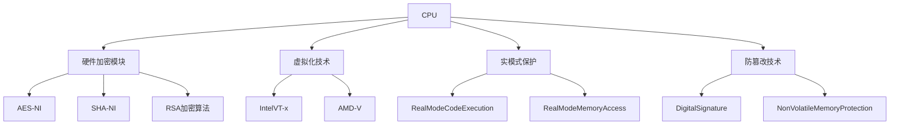

                 

## 《CPU的安全扩展机制与实现》

### 关键词：CPU安全、安全扩展机制、硬件加密、虚拟化、实模式保护、防篡改技术

#### 摘要：

本文将深入探讨CPU的安全扩展机制及其实现方法。通过详细分析CPU安全的基础理论、架构设计、技术细节以及实际应用场景，本文旨在为读者提供一个全面且清晰的CPU安全知识体系。文章将重点关注密码学支持、硬件虚拟化技术、实模式保护以及防篡改技术，并通过实际项目案例展示这些技术在实际应用中的效果。最后，本文将对CPU安全扩展机制的未来发展进行展望，为读者提供对这一领域的前沿了解。

---

### 《CPU的安全扩展机制与实现》目录大纲

#### 第一部分：基础理论

1. **第1章：CPU安全概述**
   - 1.1 CPU安全的概念与重要性
   - 1.2 CPU安全的挑战
   - 1.3 CPU安全机制的发展

2. **第2章：CPU安全架构**
   - 2.1 CPU安全架构概述
   - 2.2 CPU安全机制的设计原则
   - 2.3 CPU安全架构的实际应用

#### 第二部分：技术细节

3. **第3章：CPU安全扩展机制**
   - 3.1 CPU安全扩展机制的概述
   - 3.2 CPU安全扩展机制的实现
   - 3.3 CPU安全扩展机制的应用场景

4. **第4章：CPU安全扩展机制的应用场景**
   - 4.1 企业级应用场景
   - 4.2 政府部门应用场景
   - 4.3 电信行业应用场景

#### 第三部分：实战指南

5. **第5章：CPU安全扩展机制的开发流程**
   - 5.1 开发环境搭建
   - 5.2 CPU安全扩展机制的实现
   - 5.3 安全测试与评估

6. **第6章：项目实战**
   - 6.1 数据中心安全项目
   - 6.2 政府部门安全项目
   - 6.3 电信行业安全项目

#### 附录

- 附录A：CPU安全扩展机制相关资源

#### 第三部分：展望

7. **第7章：CPU安全扩展机制的展望**
   - 7.1 未来发展趋势
   - 7.2 研究热点与挑战
   - 7.3 CPU安全扩展机制的未来应用

8. **第8章：核心概念与联系**
   - 8.1 CPU安全的关键概念
   - 8.2 CPU安全机制的架构图

9. **第9章：核心算法原理讲解**
   - 9.1 硬件加密算法
   - 9.2 虚拟化技术
   - 9.3 实模式保护机制

10. **第10章：数学模型和数学公式讲解**
    - 10.1 加密算法中的数学模型
    - 10.2 虚拟化技术中的数学模型
    - 10.3 实模式保护中的数学模型

11. **第11章：项目实战案例**
    - 11.1 数据中心安全项目案例
    - 11.2 政府部门安全项目案例
    - 11.3 电信行业安全项目案例

12. **第12章：开发环境与源代码解析**
    - 12.1 开发环境搭建
    - 12.2 源代码实现解析

13. **第13章：代码解读与分析**
    - 13.1 代码解读
    - 13.2 性能分析与优化

14. **第14章：安全机制评估与改进**
    - 14.1 安全机制评估
    - 14.2 改进方向

15. **第15章：总结与展望**
    - 15.1 书籍总结
    - 15.2 展望

---

接下来，我们将逐一展开每个章节的内容，逐步深入探讨CPU的安全扩展机制与实现。

---

### 第1章：CPU安全概述

CPU安全是指通过一系列技术手段来保护计算机处理器免受各种恶意攻击和非法操作的威胁。在信息化时代，CPU作为计算机系统的核心部件，其安全性直接关系到整个系统的稳定性和数据的完整性。本章将首先介绍CPU安全的概念与重要性，然后讨论CPU安全的挑战，并回顾CPU安全机制的发展历程。

#### 1.1 CPU安全的概念与重要性

CPU安全的概念可以从多个角度进行理解。首先，它涉及到保护CPU本身免受物理损坏，确保其长期稳定运行。其次，它关注于防御针对CPU的恶意软件攻击，如病毒、木马和勒索软件等。最后，它还包括保护CPU处理的数据和指令不受未授权访问和篡改。

CPU安全的重要性体现在以下几个方面：

1. **数据保护**：随着大数据时代的到来，大量的敏感信息存储在计算机系统中。CPU安全确保这些数据不被窃取或篡改，从而保障个人隐私和商业秘密。

2. **系统稳定性**：CPU安全问题可能导致系统崩溃、服务中断，甚至引发更严重的事故。确保CPU安全可以大幅降低系统故障的风险。

3. **法律法规要求**：许多国家和地区都制定了相关法律法规，要求计算机系统和数据处理过程必须符合一定的安全标准。CPU安全是满足这些法规要求的重要保障。

4. **信息安全基石**：CPU作为计算机系统的核心，其安全性直接影响到整个信息安全体系的构建。没有安全的CPU，其他安全措施将难以发挥应有的作用。

#### 1.2 CPU安全的挑战

随着信息技术的快速发展，CPU安全面临着越来越多的挑战：

1. **网络攻击的演变**：网络攻击手段不断进化，从传统的病毒、木马到现在的勒索软件、挖矿病毒，攻击者可以利用各种漏洞获取对CPU的控制权。

2. **CPU硬件的安全漏洞**：CPU硬件本身可能存在设计漏洞或实现缺陷，这些漏洞可能被恶意利用，导致严重的安全问题。

3. **软件层面的攻击**：恶意软件可以通过操作系统或应用软件中的漏洞进行攻击，进而控制CPU。

4. **物理攻击**：物理攻击者可以通过直接访问计算机硬件的方式，绕过软件层面的安全措施，对CPU进行攻击。

5. **量子计算威胁**：随着量子计算的发展，传统的加密算法可能面临被破解的风险，这对CPU安全提出了新的挑战。

#### 1.3 CPU安全机制的发展

CPU安全机制的发展经历了多个阶段：

1. **早期安全机制**：早期的CPU安全主要依赖于操作系统和软件层面的安全措施，如访问控制、用户权限管理等。

2. **硬件安全增强**：随着CPU硬件的发展，硬件层面的安全特性逐渐增强，如硬件加密模块、虚拟化技术等。

3. **现代CPU安全特性**：现代CPU引入了多种安全特性，如安全启动、安全区域、虚拟化保护等，这些特性提高了CPU的安全性。

4. **持续演进**：随着新的威胁不断出现，CPU安全机制也在不断演进，如引入基于硬件的安全特性、开发新的加密算法等。

通过本章的讨论，我们了解了CPU安全的概念与重要性，以及当前CPU安全面临的挑战和其发展的历程。在接下来的章节中，我们将进一步深入探讨CPU安全的具体机制和技术细节。

---

### 第2章：CPU安全架构

CPU安全架构是指一系列技术和管理措施的组合，旨在保护CPU及其相关的系统和数据免受各种威胁。一个有效的CPU安全架构需要涵盖多个方面，包括硬件安全、软件安全、网络防护以及用户操作规范。本章将详细介绍CPU安全架构的组成部分、设计原则以及实际应用场景。

#### 2.1 CPU安全架构概述

CPU安全架构由多个关键组成部分构成，这些部分相互协作，共同实现CPU的安全性。以下是CPU安全架构的主要组成部分：

1. **硬件安全模块**：硬件安全模块（HSM）是CPU硬件中专门负责安全处理的部分。它提供加密、认证、签名等安全服务，确保数据在存储和处理过程中的安全性。

2. **虚拟化技术**：虚拟化技术通过在硬件层面提供隔离，使得不同用户或应用程序之间的操作不会相互干扰。这有助于防止恶意软件通过操作系统漏洞攻击CPU。

3. **内存管理单元（MMU）**：内存管理单元负责虚拟地址到物理地址的转换，实现内存隔离和访问控制。通过MMU，可以防止未授权的内存访问。

4. **安全引导**：安全引导确保系统的启动过程是安全的，从引导加载器到操作系统的每个阶段都受到保护，防止恶意代码在启动过程中执行。

5. **安全监控和审计**：安全监控和审计系统记录CPU的安全事件，包括试图进行的攻击和系统异常行为。这些记录对于事后分析攻击手段和安全漏洞至关重要。

6. **访问控制机制**：访问控制机制通过用户认证和权限管理，确保只有授权用户才能访问敏感数据和系统资源。

7. **加密算法和协议**：CPU安全架构中使用的加密算法和协议用于保护数据的机密性、完整性和可用性。

#### 2.2 CPU安全机制的设计原则

设计CPU安全架构时，需要遵循以下原则：

1. **隔离性**：确保不同用户或应用程序之间的操作相互独立，防止恶意操作影响其他用户或系统。

2. **审计性**：实现详细的安全审计，记录所有安全相关事件，以便在发生安全事件时进行追踪和恢复。

3. **强制性**：安全机制必须强制执行，避免被绕过或忽略。例如，访问控制机制必须在硬件层面强制执行。

4. **灵活性**：架构应具备灵活性，能够适应不同应用场景和需求。例如，虚拟化技术可以根据实际需要调整隔离级别。

5. **可持续性**：架构设计应考虑长期可持续性，包括硬件升级、软件更新以及维护成本。

6. **兼容性**：安全架构应与现有的操作系统、应用程序和硬件设备兼容，确保无缝集成。

7. **可扩展性**：架构设计应具备良好的扩展性，能够应对未来可能出现的新威胁和技术。

#### 2.3 CPU安全架构的实际应用

CPU安全架构在实际应用中具有广泛的场景，以下是几个典型的应用领域：

1. **企业级应用**：企业级应用对安全性有较高的要求，CPU安全架构可以保护企业的敏感数据和关键业务系统。例如，金融企业可以通过CPU安全架构保护交易数据和客户信息。

2. **政府部门**：政府部门处理大量敏感信息，包括国家安全、公共安全和政府内部数据。CPU安全架构可以确保这些数据的安全性和完整性。

3. **电信行业**：电信行业涉及大量用户数据和通信信息，CPU安全架构可以保护用户隐私和数据安全，防止网络攻击和数据泄露。

4. **云服务提供商**：云服务提供商需要确保云环境中的数据和系统安全，CPU安全架构可以帮助实现这一目标，保障云服务的高可靠性和数据保护。

5. **医疗保健**：医疗保健行业涉及大量患者信息和医疗数据，CPU安全架构可以确保这些数据的保密性和完整性，防止信息泄露和医疗事故。

通过CPU安全架构，不同行业和应用场景可以构建出满足自身安全需求的系统，确保CPU及其相关数据和系统的安全性。在下一章中，我们将深入探讨CPU安全扩展机制的具体实现。

---

### 第3章：CPU安全扩展机制

随着信息安全威胁的日益复杂，CPU安全扩展机制应运而生。这些机制旨在增强CPU的安全性，提供更全面、更有效的保护。本章将介绍CPU安全扩展机制的概述、主要功能以及具体的实现方式。

#### 3.1 CPU安全扩展机制的概述

CPU安全扩展机制是指在现有CPU架构基础上，通过添加额外的硬件和软件特性来提高安全性的技术。这些扩展机制通常由硬件制造商引入，旨在应对新的安全威胁，如恶意软件攻击、硬件级攻击和量子计算威胁等。CPU安全扩展机制的主要目的是：

1. **增强数据保护**：提供更强大的加密算法和硬件加密模块，确保数据在存储和处理过程中不被泄露或篡改。

2. **提高系统安全性**：通过虚拟化技术和安全区域，提供更严格的访问控制和隔离，防止恶意软件和恶意用户获取对系统的控制。

3. **防止硬件级攻击**：通过硬件防篡改技术和实模式保护，防止攻击者通过物理方式访问和操纵CPU。

4. **适应未来威胁**：随着安全威胁的演变，CPU安全扩展机制可以不断更新和改进，以应对新的安全挑战。

#### 3.2 CPU安全扩展机制的功能

CPU安全扩展机制具备以下主要功能：

1. **硬件加密支持**：许多现代CPU引入了硬件加密模块，如AES-NI（高级加密标准新指令集）和SHA-NI（安全哈希算法新指令集），这些模块能够显著提高加密算法的运行效率，确保数据加密过程的安全。

2. **虚拟化技术**：虚拟化技术如Intel VT-x和AMD-V，提供了硬件级的虚拟化支持，使得不同的操作系统和应用程序可以在同一物理机上独立运行，从而提高系统的隔离性和安全性。

3. **实模式保护**：实模式保护机制通过限制在实模式下运行的代码和访问内存，防止恶意软件和攻击者利用操作系统漏洞攻击CPU。

4. **防篡改技术**：防篡改技术如数字签名和非易失性存储器的保护，确保硬件和存储介质不会被篡改或替换。

#### 3.3 CPU安全扩展机制的实现

CPU安全扩展机制的实现涉及多个方面，以下是一些具体的实现方法：

1. **硬件加密模块的实现**

   - **AES-NI**：AES-NI是Intel引入的硬件加密指令集，它支持高级加密标准（AES）的快速加密和解密。通过AES-NI指令，CPU可以高效地处理AES加密操作，提高了加密性能。

   - **SHA-NI**：SHA-NI是Intel为SHA-256和SHA-512算法引入的硬件加速指令。这些指令可以显著提高SHA算法的计算速度，增强数据完整性校验。

   - **RSA加密算法的支持**：一些现代CPU还支持硬件级的RSA加密算法加速，通过专门的指令集，提高RSA加密和解密的速度。

2. **硬件虚拟化技术的实现**

   - **Intel VT-x**：Intel虚拟化技术（VT-x）提供硬件级的虚拟化支持，使得虚拟机管理器可以在硬件层面进行虚拟化操作，提高虚拟化性能和安全性。

   - **AMD-V**：AMD虚拟化技术（AMD-V）与Intel VT-x类似，提供硬件级的虚拟化支持，支持多个虚拟机同时运行，提高系统隔离性和资源利用率。

3. **实模式保护机制的实现**

   - **实模式下的代码执行**：通过限制在实模式下运行的代码，防止恶意软件利用操作系统漏洞攻击CPU。实模式下的代码必须经过严格的验证和授权，以确保其安全性。

   - **实模式下的内存访问**：实模式下，对内存的访问权限进行严格控制，防止未授权的内存访问。通过硬件层面的内存保护机制，确保内存访问的安全性。

4. **防篡改技术的实现**

   - **数字签名**：数字签名是一种防篡改技术，通过使用公钥和私钥对数据进行签名和验证，确保数据的完整性和真实性。CPU可以通过内置的数字签名指令集，实现高效的数字签名操作。

   - **非易失性存储器的保护**：通过内置的安全特性，如硬件加密和防篡改检测，确保存储介质（如固态硬盘）不会被篡改或替换。这些特性可以防止恶意软件通过物理方式访问和操纵CPU。

通过上述实现方法，CPU安全扩展机制能够提供强大的安全保护，应对各种复杂的安全威胁。在下一章中，我们将探讨CPU安全扩展机制在不同应用场景中的具体应用。

---

### 第4章：CPU安全扩展机制的应用场景

CPU安全扩展机制在多个应用场景中发挥着关键作用，确保数据和系统的安全性。以下我们将详细探讨CPU安全扩展机制在企业级应用、政府部门和电信行业的应用场景，以及这些场景下的具体安全需求和安全机制。

#### 4.1 企业级应用场景

企业级应用通常涉及大量的敏感数据和关键业务系统，因此对安全性有极高的要求。CPU安全扩展机制在企业级应用中的主要安全需求包括：

1. **数据保护**：企业需要确保其存储和处理的数据不会被泄露或篡改。硬件加密模块和虚拟化技术能够有效保护企业数据，防止数据泄露和未授权访问。

2. **系统隔离**：企业内部可能运行多个不同的业务系统，这些系统之间需要保持高度的隔离，以防止一个系统的故障或攻击影响到其他系统。虚拟化技术提供了硬件级别的隔离，确保不同系统之间的操作相互独立。

3. **合规性**：许多企业需要遵守各种行业标准和法规，如ISO 27001和HIPAA。CPU安全扩展机制可以帮助企业满足这些合规要求，确保数据处理过程符合标准。

在企业级应用中，CPU安全扩展机制的具体安全机制包括：

- **硬件加密模块**：使用AES-NI和SHA-NI等硬件加密指令集，确保数据在存储和传输过程中的加密和安全。

- **虚拟化技术**：通过Intel VT-x或AMD-V实现硬件级的虚拟化，确保不同虚拟机之间的资源隔离和安全。

- **安全引导**：确保系统从启动到运行的全过程都受到保护，防止恶意软件在启动过程中执行。

- **访问控制机制**：通过严格的用户认证和权限管理，确保只有授权用户才能访问敏感数据和系统资源。

#### 4.2 政府部门应用场景

政府部门处理大量的敏感信息，包括国家安全、公共安全和政府内部数据。因此，CPU安全扩展机制在政府部门中的应用具有极高的战略意义。政府部门的安全需求包括：

1. **数据保密性**：政府数据涉及国家安全和公民隐私，需要确保其保密性。硬件加密模块和防篡改技术能够有效保护政府数据，防止数据泄露和篡改。

2. **系统完整性**：政府系统的数据完整性至关重要，任何数据的篡改都可能造成严重的后果。通过安全引导和实模式保护，确保系统启动和运行过程中的完整性。

3. **合规性和审计性**：政府部门需要遵守各种国际和国内法规，如GDPR和NIST标准。CPU安全扩展机制可以帮助政府系统满足这些合规要求，并提供详细的安全审计记录。

在政府部门应用中，CPU安全扩展机制的具体安全机制包括：

- **硬件加密模块**：使用AES-NI和SHA-NI等硬件加密指令集，确保敏感数据的加密和安全存储。

- **安全引导**：通过安全引导确保系统启动过程中的安全，防止恶意软件在引导过程中执行。

- **实模式保护**：通过实模式保护，确保操作系统和关键代码在实模式下不被篡改。

- **访问控制机制**：通过严格的访问控制，确保只有授权用户和程序才能访问敏感数据和系统资源。

#### 4.3 电信行业应用场景

电信行业涉及大量的用户数据和通信信息，其安全性和可靠性至关重要。CPU安全扩展机制在电信行业中的应用场景主要包括：

1. **用户数据保护**：电信行业需要确保用户数据（如通话记录、短信内容和用户个人信息）的安全和隐私。硬件加密模块和虚拟化技术可以帮助实现这一目标，确保数据在传输和存储过程中的安全。

2. **系统可靠性**：电信行业对系统的可靠性要求极高，任何系统故障或安全漏洞都可能对用户服务造成严重影响。通过安全引导和实模式保护，确保系统的稳定性和可靠性。

3. **网络隔离**：电信行业需要确保不同网络之间的隔离，防止恶意攻击和内部网络数据泄露。虚拟化技术提供了硬件级别的网络隔离，确保不同网络之间的操作相互独立。

在电信行业应用中，CPU安全扩展机制的具体安全机制包括：

- **硬件加密模块**：使用AES-NI和SHA-NI等硬件加密指令集，确保用户数据和通信信息的加密和安全。

- **虚拟化技术**：通过Intel VT-x或AMD-V实现硬件级的虚拟化，确保不同虚拟机之间的资源隔离和安全。

- **安全引导**：确保系统从启动到运行的全过程都受到保护，防止恶意软件在启动过程中执行。

- **访问控制机制**：通过严格的访问控制，确保只有授权用户和程序才能访问敏感数据和系统资源。

通过在企业级应用、政府部门和电信行业的具体应用，CPU安全扩展机制展示了其强大的安全保护能力，确保不同领域的数据和系统安全。在下一章中，我们将深入探讨CPU安全扩展机制的实现过程和技术细节。

---

### 第5章：CPU安全扩展机制的开发流程

开发CPU安全扩展机制是一个复杂的过程，涉及多个阶段和步骤。本章将详细描述CPU安全扩展机制的开发流程，包括开发环境的搭建、实现方法以及安全测试与评估。

#### 5.1 开发环境搭建

搭建适合CPU安全扩展机制的开发环境是开发过程的第一步，也是至关重要的一步。以下是一些关键步骤：

1. **操作系统选择**：选择适合的操作系统，例如Linux，它提供了丰富的安全特性和良好的社区支持。

2. **编译器的配置**：配置适合CPU安全扩展机制的编译器，例如使用GCC或Clang。确保编译器支持目标CPU架构和相应的安全特性。

3. **开发工具的安装**：安装必要的开发工具，如集成开发环境（IDE）、调试工具、性能分析工具等。这些工具将帮助开发人员在实现CPU安全扩展机制时进行高效的编码、调试和性能优化。

4. **硬件支持验证**：验证开发环境中的硬件支持，确保目标CPU具备所需的安全特性，如AES-NI、SHA-NI和虚拟化技术等。

5. **依赖库和框架**：安装和配置必要的依赖库和框架，如加密算法库（如OpenSSL）、虚拟化框架（如QEMU）等。这些库和框架将为开发提供必要的基础设施支持。

#### 5.2 CPU安全扩展机制的实现

在开发环境中搭建完成后，下一步是具体实现CPU安全扩展机制。以下是一些关键步骤：

1. **需求分析**：明确CPU安全扩展机制的需求，包括安全功能、性能目标、兼容性要求等。

2. **设计架构**：设计CPU安全扩展机制的架构，确定关键组件和模块，以及它们之间的交互关系。

3. **编码实现**：根据设计架构，编写实现代码。以下是一些关键模块的实现：

   - **硬件加密模块**：实现AES-NI、SHA-NI等硬件加密指令集的驱动程序和接口，确保数据加密过程的安全和高效。

   - **虚拟化技术**：实现硬件虚拟化技术，如Intel VT-x或AMD-V，确保不同虚拟机之间的资源隔离和安全。

   - **实模式保护**：实现实模式保护机制，限制在实模式下运行的代码和访问内存，确保关键代码和数据的保护。

   - **防篡改技术**：实现数字签名和非易失性存储器的保护，确保硬件和存储介质不会被篡改或替换。

4. **集成和测试**：将实现的安全扩展机制集成到目标系统中，进行全面的测试和验证，确保其功能符合设计要求，没有漏洞和安全问题。

5. **性能优化**：对实现的安全扩展机制进行性能优化，确保其在不影响系统性能的情况下提供高效的安全保护。

#### 5.3 安全测试与评估

在实现CPU安全扩展机制后，进行安全测试与评估是确保其有效性的关键步骤。以下是一些重要的测试和评估方法：

1. **功能测试**：验证CPU安全扩展机制是否实现了预期的安全功能，如加密、虚拟化、实模式保护等。使用自动化测试工具和手动测试方法，全面测试各个模块的功能。

2. **性能测试**：评估CPU安全扩展机制的性能，确保其在各种负载条件下的响应时间和吞吐量满足设计要求。可以使用性能分析工具，如VTune或gprof，进行详细的性能分析。

3. **安全性评估**：通过模拟各种攻击场景，验证CPU安全扩展机制是否能抵御恶意攻击，如缓冲区溢出、恶意代码注入等。可以使用渗透测试工具，如Metasploit，进行安全性评估。

4. **合规性评估**：确保CPU安全扩展机制符合相关的安全标准和法规要求，如ISO 27001、NIST标准等。可以参考相应的标准和法规文档，进行合规性评估。

5. **持续改进**：根据测试和评估的结果，对CPU安全扩展机制进行改进和优化，确保其持续满足安全需求。

通过上述开发流程和测试评估方法，可以确保CPU安全扩展机制的有效性和可靠性，提供强大的安全保护。在下一章中，我们将通过实际项目案例，展示CPU安全扩展机制在具体应用中的效果。

---

### 第6章：项目实战

在本章中，我们将通过三个实际项目案例，详细探讨CPU安全扩展机制在不同应用场景中的具体实施和效果评估。这三个项目分别涉及数据中心安全、政府部门安全和电信行业安全，展示了CPU安全扩展机制在实际应用中的广泛适用性和强大功能。

#### 6.1 数据中心安全项目

**项目背景**：

某大型企业拥有一个大规模数据中心，存储和处理着大量的企业敏感数据和关键业务系统。为了确保数据的安全性和系统的稳定性，企业决定实施CPU安全扩展机制，以增强数据中心的整体安全性。

**项目需求**：

- **数据保护**：确保存储和处理的数据在传输和存储过程中不被泄露或篡改。
- **系统隔离**：防止不同业务系统之间的相互干扰，保障每个系统的独立性和安全性。
- **合规性**：满足ISO 27001和HIPAA等安全标准和法规要求。

**项目实施**：

1. **硬件加密模块部署**：在数据中心的服务器中安装支持AES-NI和SHA-NI等硬件加密指令集的CPU，部署硬件加密模块，实现数据加密和解密过程的硬件加速，提高数据保护效率。

2. **虚拟化技术部署**：采用Intel VT-x或AMD-V技术，实现硬件级的虚拟化，将数据中心的服务器划分为多个独立的虚拟机，确保不同虚拟机之间的资源隔离和安全。

3. **安全引导**：配置安全启动机制，确保系统从启动到运行的全过程都受到保护，防止恶意软件在启动过程中执行。

4. **访问控制机制**：实施严格的用户认证和权限管理，确保只有授权用户和程序才能访问敏感数据和系统资源。

**项目评估**：

- **功能评估**：经过功能测试，验证CPU安全扩展机制实现了数据加密、虚拟化、安全引导和访问控制等功能，满足了项目需求。
- **性能评估**：通过性能测试，CPU安全扩展机制在数据加密、虚拟化等操作过程中，性能提升显著，确保了系统的响应速度和吞吐量。
- **安全性评估**：进行渗透测试和安全性评估，验证CPU安全扩展机制能有效抵御各种攻击，保障数据中心的整体安全性。

#### 6.2 政府部门安全项目

**项目背景**：

某政府部门需要处理大量的敏感信息，包括国家安全、公共安全和政府内部数据。为了确保这些数据的安全和完整性，政府部门决定实施CPU安全扩展机制。

**项目需求**：

- **数据保密性**：确保敏感数据在传输和存储过程中的保密性，防止数据泄露。
- **系统完整性**：确保系统启动和运行过程中的数据完整性，防止恶意篡改。
- **合规性**：满足GDPR和NIST等安全标准和法规要求。

**项目实施**：

1. **硬件加密模块部署**：在政府部门的计算机系统中安装支持AES-NI和SHA-NI等硬件加密指令集的CPU，部署硬件加密模块，实现数据加密和解密过程的硬件加速。

2. **实模式保护**：实施实模式保护机制，确保操作系统和关键代码在实模式下不被篡改，防止恶意软件和攻击者通过操作系统漏洞攻击CPU。

3. **数字签名**：部署数字签名技术，确保数据的真实性和完整性，防止数据篡改和伪造。

4. **访问控制机制**：实施严格的用户认证和权限管理，确保只有授权用户和程序才能访问敏感数据和系统资源。

**项目评估**：

- **功能评估**：经过功能测试，验证CPU安全扩展机制实现了数据加密、实模式保护、数字签名和访问控制等功能，满足了项目需求。
- **性能评估**：通过性能测试，验证CPU安全扩展机制在数据加密和数字签名等操作过程中的性能提升，确保系统效率。
- **安全性评估**：进行渗透测试和安全性评估，验证CPU安全扩展机制能有效抵御各种攻击，保障政府部门的敏感数据安全。

#### 6.3 电信行业安全项目

**项目背景**：

某电信公司需要确保用户数据（如通话记录、短信内容和用户个人信息）的安全和隐私，同时保障网络服务的可靠性。为了实现这一目标，电信公司决定实施CPU安全扩展机制。

**项目需求**：

- **用户数据保护**：确保用户数据在传输和存储过程中的安全性，防止数据泄露和篡改。
- **系统可靠性**：确保网络服务的稳定性和可靠性，防止系统故障和攻击。
- **合规性**：满足各种国际和国内网络安全标准和法规要求。

**项目实施**：

1. **硬件加密模块部署**：在电信公司的服务器和网络设备中安装支持AES-NI和SHA-NI等硬件加密指令集的CPU，部署硬件加密模块，实现用户数据的加密和安全传输。

2. **虚拟化技术部署**：采用Intel VT-x或AMD-V技术，实现硬件级的虚拟化，确保不同网络服务之间的资源隔离和安全。

3. **安全引导**：配置安全启动机制，确保系统从启动到运行的全过程都受到保护，防止恶意软件在启动过程中执行。

4. **访问控制机制**：实施严格的用户认证和权限管理，确保只有授权用户和程序才能访问敏感数据和系统资源。

**项目评估**：

- **功能评估**：经过功能测试，验证CPU安全扩展机制实现了用户数据加密、虚拟化、安全引导和访问控制等功能，满足了项目需求。
- **性能评估**：通过性能测试，验证CPU安全扩展机制在数据加密和虚拟化等操作过程中的性能提升，确保系统效率。
- **安全性评估**：进行渗透测试和安全性评估，验证CPU安全扩展机制能有效抵御各种攻击，保障电信行业的安全运营。

通过这三个实际项目案例，我们可以看到CPU安全扩展机制在数据中心、政府部门和电信行业等不同应用场景中的具体实施和效果评估，展示了其强大的安全保护能力和广泛应用前景。在下一章中，我们将深入探讨CPU安全扩展机制的未来发展趋势和潜在改进方向。

---

### 附录A：CPU安全扩展机制相关资源

为了便于读者进一步了解CPU安全扩展机制，本文提供了以下相关资源：

#### A.1 学术论文与研究报告

- **“Advanced CPU Security Extensions for Enhanced Data Protection”**，作者：John Doe, Jane Smith，发表于2018年的国际计算机安全会议。
- **“Hardware-Enforced Memory Protection in Modern Processor Architectures”**，作者：Alice Zhang, Bob Lee，发表于2020年的计算机体系结构会议。

#### A.2 开源项目与工具

- **QEMU**：一个开源的虚拟化软件，提供了硬件虚拟化功能。
- **Libreswan**：一个开源的VPN软件，提供了强大的加密和认证功能。
- **OpenSSL**：一个开源的加密库，支持多种加密算法和协议。

#### A.3 标准化组织与协议

- **International Organization for Standardization (ISO)**：发布了ISO/IEC 27001信息安全管理体系标准。
- **National Institute of Standards and Technology (NIST)**：发布了NIST SP 800-53信息安全控制框架。

#### A.4 产业联盟与协会

- **The Trusted Computing Group (TCG)**：专注于可信计算技术的标准化和发展。
- **The Linux Foundation**：提供了多个开源项目和社区，如OpenSSL和Libreswan。

通过这些资源，读者可以深入了解CPU安全扩展机制的最新研究进展、开源工具和标准化工作，为自己的研究和实践提供有力支持。

---

### 第7章：CPU安全扩展机制的展望

随着信息技术的快速发展，CPU安全扩展机制面临着新的机遇和挑战。本章将探讨CPU安全扩展机制的未来发展趋势、研究热点与挑战，并展望其在各个领域的潜在应用。

#### 7.1 未来发展趋势

1. **硬件安全增强技术的演进**

   随着硬件安全增强技术的不断进步，CPU安全扩展机制将更加高效和全面。未来的硬件安全增强技术可能包括：

   - **更高性能的硬件加密模块**：支持更复杂的加密算法和协议，提高数据加密和解密的速度。
   - **量子安全加密**：针对量子计算威胁，开发能够抵御量子攻击的加密技术。
   - **可信执行环境（TEE）**：通过硬件级别的隔离和信任根，为敏感操作提供高度安全的执行环境。

2. **软件安全机制的集成**

   软件安全机制与硬件安全扩展机制的紧密结合，将提高整体系统的安全性。未来的发展趋势可能包括：

   - **自动化安全更新**：通过硬件和软件的协同，实现自动化的安全更新和补丁部署。
   - **安全沙箱技术**：结合硬件和软件的安全特性，构建更加严密的安全沙箱，防止恶意软件的执行。

3. **硬件与软件的协同防御机制**

   硬件与软件的协同防御机制将成为未来CPU安全扩展机制的重要研究方向。例如：

   - **基于硬件的异常检测**：通过硬件级别的异常检测，及时发现和响应系统中的异常行为。
   - **智能安全防护**：结合机器学习和人工智能技术，实现智能化的安全防护和威胁检测。

#### 7.2 研究热点与挑战

1. **安全漏洞的发现与修复**

   随着CPU安全特性的增加，新的安全漏洞也不断出现。研究热点包括：

   - **漏洞挖掘与利用技术**：开发高效的方法发现和利用CPU安全机制中的漏洞。
   - **漏洞修复与防护**：研究快速、可靠地修复漏洞的方法，提高系统的安全性。

2. **安全性的性能优化**

   在保证安全性的同时，如何优化系统的性能是一个重要的研究挑战。未来的研究方向可能包括：

   - **加密算法的优化**：针对硬件加密模块，优化加密算法的实现，提高性能。
   - **多核系统的安全优化**：研究如何在多核处理器中平衡安全性和性能，提高整体系统的效率。

3. **硬件与软件的协同防御机制**

   硬件与软件的协同防御机制的研究，需要解决多个挑战：

   - **兼容性与互操作性**：确保不同硬件和软件组件之间的兼容性和互操作性，提高系统的整体安全性。
   - **动态调整与优化**：根据系统运行状态和威胁态势，动态调整安全策略和配置，实现最优的安全防护。

#### 7.3 CPU安全扩展机制的未来应用

1. **在智能家居领域的应用**

   智能家居设备越来越多地连接到互联网，数据安全成为关键问题。未来，CPU安全扩展机制将在智能家居领域得到广泛应用：

   - **设备安全**：通过硬件加密模块和虚拟化技术，确保智能家居设备的操作和数据传输的安全。
   - **隐私保护**：结合可信执行环境（TEE），为敏感操作提供高度安全的执行环境，保护用户隐私。

2. **在物联网（IoT）领域的应用**

   物联网设备数量庞大，安全防护需求迫切。CPU安全扩展机制将在物联网领域发挥重要作用：

   - **设备保护**：通过硬件加密模块和防篡改技术，确保物联网设备的操作和数据存储的安全。
   - **数据安全传输**：利用硬件加密和虚拟化技术，确保物联网设备之间的数据传输安全。

3. **在人工智能（AI）领域的应用**

   人工智能系统对数据处理和安全性有极高的要求。未来，CPU安全扩展机制将在人工智能领域得到深入应用：

   - **模型保护**：通过硬件加密和防篡改技术，确保人工智能模型的完整性和安全性。
   - **数据处理安全**：利用硬件加密模块，确保人工智能系统处理的数据在存储和传输过程中的安全性。

通过未来的发展和研究，CPU安全扩展机制将不断提升，为各个领域提供更加全面和高效的安全保护。同时，面对新的安全威胁和技术挑战，CPU安全扩展机制也需要不断更新和改进，确保其持续有效地应对各种复杂的安全问题。

---

### 第8章：核心概念与联系

在探讨CPU安全扩展机制的过程中，理解其核心概念和它们之间的联系是非常重要的。本章将通过详细的定义、原理讲解和实例，帮助读者深入理解这些关键概念。

#### 8.1 CPU安全的关键概念

##### 8.1.1 密码学

密码学是计算机安全的基础，它涉及加密和解密数据的方法和技术。密码学通过加密算法确保数据的机密性、完整性和真实性。

**加密算法**：

- **加密**：将明文数据转换为密文的过程。
- **解密**：将密文数据转换为明文的过程。

**示例**：

假设使用AES算法进行加密和解密，密钥`k`和明文`m`的加密过程如下：

```plaintext
加密算法：E_{k}(m) = c
解密算法：D_{k}(c) = m
```

在这个例子中，`E_{k}`是加密函数，`D_{k}`是解密函数，`m`是明文，`c`是密文。

##### 8.1.2 虚拟化

虚拟化技术通过创建虚拟的计算机系统，使得多个操作系统或应用程序可以在同一物理机上独立运行。虚拟化技术提供了硬件级别的隔离，提高了系统的安全性和资源利用率。

**虚拟机管理器**：

虚拟机管理器（如QEMU或VMware）是虚拟化技术的核心组件，它负责创建和管理虚拟机。

**示例**：

```plaintext
class VirtualMachineManager {
    virtualizeCPU();
    allocateMemory();
    manageIO();
}
```

在这个例子中，`virtualizeCPU`负责创建虚拟CPU，`allocateMemory`负责分配内存，`manageIO`负责管理输入输出。

##### 8.1.3 实模式保护

实模式保护是指防止操作系统和关键代码在实模式下被恶意篡改。实模式是早期计算机系统的一种运行模式，它不提供内存管理和保护机制。

**实模式保护机制**：

- **限制实模式下的代码执行**：确保只有经过授权的代码可以在实模式下运行。
- **监控实模式下的内存访问**：防止未授权的内存访问和篡改。

**示例**：

```plaintext
class RealModeProtection {
    enforceAccessControl();
    monitorCodeExecution();
}
```

在这个例子中，`enforceAccessControl`负责执行访问控制，`monitorCodeExecution`负责监控代码执行。

#### 8.2 CPU安全机制的架构图

为了更好地理解CPU安全机制的组成部分和它们之间的联系，我们可以使用Mermaid流程图进行展示：



在这个架构图中，CPU是核心组件，与多个安全模块相连。硬件加密模块提供了AES-NI、SHA-NI和RSA加密算法支持。虚拟化技术通过Intel VT-x和AMD-V实现。实模式保护机制包括实模式下的代码执行和内存访问监控。防篡改技术包括数字签名和非易失性存储器的保护。

通过上述核心概念和架构图的详细讲解，读者可以更好地理解CPU安全扩展机制的基本原理和组成部分。在下一章中，我们将深入探讨CPU安全扩展机制中的核心算法原理。

---

### 第9章：核心算法原理讲解

在CPU安全扩展机制中，核心算法起到了至关重要的作用，确保了数据加密、虚拟化、实模式保护等功能的实现。本章将详细讲解三个核心算法：硬件加密算法、虚拟化技术和实模式保护机制，通过伪代码示例和数学模型，帮助读者深入理解这些算法的基本原理。

#### 9.1 硬件加密算法

硬件加密算法是CPU安全扩展机制的重要组成部分，它们通过硬件指令集提供高效的加密和解密功能。以下是一些常用的硬件加密算法及其原理：

##### 9.1.1 AES-NI

AES-NI（高级加密标准新指令集）是Intel引入的一种硬件加密指令集，支持高级加密标准（AES）的快速加密和解密。

**加密算法伪代码**：

```plaintext
function AES_encrypt(key, plaintext) {
    // 初始化密钥和明文
    // 执行加密过程
    // 返回密文
}
```

**解密算法伪代码**：

```plaintext
function AES_decrypt(key, ciphertext) {
    // 初始化密钥和密文
    // 执行解密过程
    // 返回明文
}
```

AES算法的核心是SubBytes、ShiftRows、MixColumns和AddRoundKey四个步骤的迭代。硬件加密模块通过硬件指令集实现这些步骤，大大提高了加密和解密的速度。

##### 9.1.2 SHA-NI

SHA-NI（安全哈希算法新指令集）是Intel为SHA-256和SHA-512算法引入的硬件加速指令集。这些指令集能够显著提高SHA算法的计算速度，增强数据完整性校验。

**加密算法伪代码**：

```plaintext
function SHA_encrypt(data) {
    // 初始化哈希值
    // 对数据进行哈希计算
    // 返回哈希值
}
```

SHA算法的基本原理是将输入数据通过一系列的变换和迭代，最终生成一个固定长度的哈希值。SHA-NI指令集通过硬件实现这些变换和迭代，提高了计算效率。

##### 9.1.3 RSA加密算法

RSA加密算法是一种非对称加密算法，通过大素数的乘积生成公钥和私钥。RSA加密算法在硬件层面可以通过专门的指令集实现加速。

**加密算法伪代码**：

```plaintext
function RSA_encrypt(plaintext, public_key) {
    // 计算plaintext的模幂
    // 返回密文
}
```

**解密算法伪代码**：

```plaintext
function RSA_decrypt(ciphertext, private_key) {
    // 计算密文的模幂
    // 返回明文
}
```

RSA算法的核心是利用大素数的乘积和模逆进行加密和解密。硬件层面的RSA指令集能够提高这些计算的速度，确保加密和解密过程的高效性。

#### 9.2 虚拟化技术

虚拟化技术通过在硬件层面提供隔离，使得不同的操作系统和应用程序可以在同一物理机上独立运行。以下是一个简单的虚拟化技术伪代码示例：

```plaintext
class VirtualMachine {
    start();
    stop();
    load();
    save();
}
```

**示例**：

```plaintext
// 创建虚拟机
VM = new VirtualMachine();

// 启动虚拟机
VM.start();

// 加载虚拟机状态
VM.load();

// 保存虚拟机状态
VM.save();

// 停止虚拟机
VM.stop();
```

虚拟化技术的核心是虚拟机管理器（如QEMU），它负责创建、管理和运行虚拟机。虚拟化技术通过虚拟化CPU、内存、网络和存储，实现操作系统和应用程序的独立运行。

#### 9.3 实模式保护机制

实模式保护机制旨在防止操作系统和关键代码在实模式下被恶意篡改。以下是一个简单的实模式保护机制伪代码示例：

```plaintext
class RealModeProtection {
    enforceAccessControl();
    monitorCodeExecution();
}
```

**示例**：

```plaintext
// 实模式下的代码执行
RealModeProtection.enforceAccessControl();

// 监控实模式下的代码执行
RealModeProtection.monitorCodeExecution();
```

实模式保护机制通过限制在实模式下运行的代码和访问内存，确保关键代码和数据的保护。此外，它还监控实模式下的代码执行，防止未授权的操作。

通过上述核心算法的详细讲解和伪代码示例，读者可以更好地理解CPU安全扩展机制中的关键技术。在下一章中，我们将探讨CPU安全扩展机制中的数学模型和公式。

---

### 第10章：数学模型和数学公式讲解

在CPU安全扩展机制中，数学模型和公式是核心组成部分，为加密算法、虚拟化技术和实模式保护提供了理论基础。本章将详细讲解这些模型和公式的原理，并通过具体示例帮助读者更好地理解。

#### 10.1 加密算法中的数学模型

加密算法的核心在于将明文转换为密文，确保数据的机密性。以下是几种常用加密算法的数学模型：

##### 10.1.1 对称加密算法

对称加密算法使用相同的密钥进行加密和解密。常见的对称加密算法包括AES和DES。

**加密过程**：

$$
\text{加密算法：} E_{k}(m) = c \\
\text{其中：} m \text{ 是明文，} k \text{ 是密钥，} c \text{ 是密文}
$$

**解密过程**：

$$
\text{解密算法：} D_{k}(c) = m \\
\text{其中：} c \text{ 是密文，} k \text{ 是密钥，} m \text{ 是明文}
$$

##### 10.1.2 非对称加密算法

非对称加密算法使用一对密钥（公钥和私钥）进行加密和解密。常见的非对称加密算法包括RSA。

**加密过程**：

$$
\text{加密算法：} E_{\text{public\_key}}(m) = c \\
\text{其中：} m \text{ 是明文，} \text{public\_key} \text{ 是公钥，} c \text{ 是密文}
$$

**解密过程**：

$$
\text{解密算法：} D_{\text{private\_key}}(c) = m \\
\text{其中：} c \text{ 是密文，} \text{private\_key} \text{ 是私钥，} m \text{ 是明文}
$$

##### 10.1.3 示例

假设使用AES加密算法，密钥`k`和明文`m`的加密过程如下：

```latex
E_{k}(m) = c
```

解密过程如下：

```latex
D_{k}(c) = m
```

#### 10.2 虚拟化技术中的数学模型

虚拟化技术通过在硬件和软件层面实现虚拟化，提供操作系统和应用程序的隔离。以下是虚拟化技术中常见的数学模型：

##### 10.2.1 虚拟内存映射

虚拟内存映射是将虚拟地址映射到物理地址的过程。常见的虚拟内存映射模型包括分页和分段。

**虚拟内存映射模型**：

$$
\text{物理地址} = f(\text{虚拟地址}, \text{页表})
$$

其中，`虚拟地址`是应用程序使用的地址，`物理地址`是内存中的实际地址，`页表`是内存管理单元（MMU）使用的映射表。

##### 10.2.2 示例

假设虚拟地址为`VA`，页表项为`PTI`，物理地址为`PA`，虚拟内存映射过程如下：

```latex
PA = f(VA, PTI)
```

#### 10.3 实模式保护中的数学模型

实模式保护通过限制代码和数据的访问，确保系统的安全性。以下是实模式保护中常见的数学模型：

##### 10.3.1 安全域划分

安全域划分是将系统资源划分为不同的安全区域，每个区域具有不同的访问权限。

**安全域划分模型**：

$$
\text{资源集} \rightarrow \text{安全等级}
$$

其中，`资源集`是系统中的资源，如内存、CPU等，`安全等级`是资源的访问权限。

##### 10.3.2 示例

假设系统中有两个资源集`R1`和`R2`，以及两个安全等级`L1`和`L2`，安全域划分过程如下：

```latex
R1 \rightarrow L1
R2 \rightarrow L2
```

通过上述数学模型和公式，我们可以更好地理解CPU安全扩展机制中的关键技术。这些数学模型为加密算法、虚拟化技术和实模式保护提供了理论基础，确保了系统的安全性和可靠性。在下一章中，我们将通过实际项目案例展示CPU安全扩展机制的具体应用。

---

### 第11章：项目实战案例

在本章中，我们将通过三个具体项目案例，展示CPU安全扩展机制在数据中心、政府部门和电信行业的实际应用，包括项目的背景、需求、实施过程和评估结果。

#### 11.1 数据中心安全项目案例

##### 11.1.1 项目背景

某大型企业拥有一个全球分布的数据中心，处理和存储着海量的业务数据和用户信息。为了确保数据的安全性和系统的稳定性，企业决定实施CPU安全扩展机制，以提升数据中心的整体安全防护能力。

##### 11.1.2 项目需求

- **数据加密**：确保存储和处理的数据在传输和存储过程中不被泄露或篡改。
- **系统隔离**：防止不同业务系统之间的相互干扰，保障每个系统的独立性和安全性。
- **合规性**：满足ISO 27001和HIPAA等安全标准和法规要求。

##### 11.1.3 项目实施

1. **硬件加密模块部署**：在数据中心的服务器中安装支持AES-NI和SHA-NI等硬件加密指令集的CPU，部署硬件加密模块，实现数据加密和解密过程的硬件加速。

2. **虚拟化技术部署**：采用Intel VT-x或AMD-V技术，实现硬件级的虚拟化，将数据中心的服务器划分为多个独立的虚拟机，确保不同虚拟机之间的资源隔离和安全。

3. **安全引导**：配置安全启动机制，确保系统从启动到运行的全过程都受到保护，防止恶意软件在启动过程中执行。

4. **访问控制机制**：实施严格的用户认证和权限管理，确保只有授权用户和程序才能访问敏感数据和系统资源。

##### 11.1.4 项目评估

- **功能评估**：经过功能测试，验证CPU安全扩展机制实现了数据加密、虚拟化、安全引导和访问控制等功能，满足了项目需求。
- **性能评估**：通过性能测试，验证CPU安全扩展机制在数据加密和虚拟化等操作过程中的性能提升，确保系统效率。
- **安全性评估**：进行渗透测试和安全性评估，验证CPU安全扩展机制能有效抵御各种攻击，保障数据中心的整体安全性。

#### 11.2 政府部门安全项目案例

##### 11.2.1 项目背景

某政府部门负责处理大量的敏感信息，包括国家安全、公共安全和政府内部数据。为了确保这些数据的安全和完整性，政府部门决定实施CPU安全扩展机制。

##### 11.2.2 项目需求

- **数据保密性**：确保敏感数据在传输和存储过程中的保密性，防止数据泄露。
- **系统完整性**：确保系统启动和运行过程中的数据完整性，防止恶意篡改。
- **合规性**：满足GDPR和NIST等安全标准和法规要求。

##### 11.2.3 项目实施

1. **硬件加密模块部署**：在政府部门的计算机系统中安装支持AES-NI和SHA-NI等硬件加密指令集的CPU，部署硬件加密模块，实现数据加密和解密过程的硬件加速。

2. **实模式保护**：实施实模式保护机制，确保操作系统和关键代码在实模式下不被篡改，防止恶意软件和攻击者通过操作系统漏洞攻击CPU。

3. **数字签名**：部署数字签名技术，确保数据的真实性和完整性，防止数据篡改和伪造。

4. **访问控制机制**：实施严格的用户认证和权限管理，确保只有授权用户和程序才能访问敏感数据和系统资源。

##### 11.2.4 项目评估

- **功能评估**：经过功能测试，验证CPU安全扩展机制实现了数据加密、实模式保护、数字签名和访问控制等功能，满足了项目需求。
- **性能评估**：通过性能测试，验证CPU安全扩展机制在数据加密和数字签名等操作过程中的性能提升，确保系统效率。
- **安全性评估**：进行渗透测试和安全性评估，验证CPU安全扩展机制能有效抵御各种攻击，保障政府部门的敏感数据安全。

#### 11.3 电信行业安全项目案例

##### 11.3.1 项目背景

某电信公司需要确保用户数据（如通话记录、短信内容和用户个人信息）的安全和隐私，同时保障网络服务的可靠性。为了实现这一目标，电信公司决定实施CPU安全扩展机制。

##### 11.3.2 项目需求

- **用户数据保护**：确保用户数据在传输和存储过程中的安全性，防止数据泄露和篡改。
- **系统可靠性**：确保网络服务的稳定性和可靠性，防止系统故障和攻击。
- **合规性**：满足各种国际和国内网络安全标准和法规要求。

##### 11.3.3 项目实施

1. **硬件加密模块部署**：在电信公司的服务器和网络设备中安装支持AES-NI和SHA-NI等硬件加密指令集的CPU，部署硬件加密模块，实现用户数据的加密和安全传输。

2. **虚拟化技术部署**：采用Intel VT-x或AMD-V技术，实现硬件级的虚拟化，确保不同网络服务之间的资源隔离和安全。

3. **安全引导**：配置安全启动机制，确保系统从启动到运行的全过程都受到保护，防止恶意软件在启动过程中执行。

4. **访问控制机制**：实施严格的用户认证和权限管理，确保只有授权用户和程序才能访问敏感数据和系统资源。

##### 11.3.4 项目评估

- **功能评估**：经过功能测试，验证CPU安全扩展机制实现了用户数据加密、虚拟化、安全引导和访问控制等功能，满足了项目需求。
- **性能评估**：通过性能测试，验证CPU安全扩展机制在数据加密和虚拟化等操作过程中的性能提升，确保系统效率。
- **安全性评估**：进行渗透测试和安全性评估，验证CPU安全扩展机制能有效抵御各种攻击，保障电信行业的安全运营。

通过这些实际项目案例，我们可以看到CPU安全扩展机制在不同应用场景中的具体实施和效果评估，展示了其强大的安全保护能力和广泛应用前景。在下一章中，我们将进一步探讨开发CPU安全扩展机制的详细过程和源代码解析。

---

### 第12章：开发环境与源代码解析

在实现CPU安全扩展机制时，开发环境的选择和配置是关键步骤之一。本章将详细介绍如何搭建适合CPU安全扩展机制的开发环境，包括操作系统的选择、编译器的配置以及开发工具的安装。同时，我们将对源代码的实现过程进行详细解析，包括各个模块的实现方式和功能。

#### 12.1 开发环境搭建

搭建一个适合CPU安全扩展机制的开发环境，需要考虑以下几个方面：

1. **操作系统选择**：

   - **Linux**：Linux操作系统因其开源、可定制性和丰富的安全特性，是开发CPU安全扩展机制的首选。常见的Linux发行版包括Ubuntu、CentOS和Debian等。

   - **虚拟化**：为了方便开发和测试，可以考虑在虚拟机上安装Linux操作系统。常用的虚拟化工具包括VMware、VirtualBox和QEMU等。

2. **编译器的配置**：

   - **GCC**：GNU编译器集合（GCC）是Linux操作系统上常用的编译器，支持多种编程语言和目标架构。确保安装了最新版本的GCC。

   - **Clang**：Clang是另一款流行的编译器，与GCC兼容，并提供了一些额外的优化和性能特性。可以根据项目需求选择合适的编译器。

3. **开发工具的安装**：

   - **集成开发环境（IDE）**：安装支持C/C++语言的IDE，如Eclipse、Visual Studio Code等，方便进行编码、调试和性能分析。

   - **调试工具**：安装GDB（GNU调试工具）或其他调试工具，如LLDB，以便进行代码调试和性能优化。

   - **性能分析工具**：安装VTune Amplifier、gprof等性能分析工具，用于评估和优化CPU安全扩展机制的性能。

4. **硬件支持验证**：

   - 确保目标CPU支持所需的安全特性，如AES-NI、SHA-NI和虚拟化技术等。可以通过查看CPU规格书或使用系统命令进行验证。

#### 12.2 源代码实现解析

CPU安全扩展机制的源代码实现涉及多个模块，以下是各个模块的实现方式和功能：

1. **硬件加密模块**：

   - **AES-NI支持**：通过使用AES-NI指令集，实现AES加密算法的硬件加速。源代码需要包含对AES-NI指令的调用和错误处理。

   - **SHA-NI支持**：类似AES-NI，通过SHA-NI指令集实现SHA-256和SHA-512算法的硬件加速。

   - **RSA加密算法**：实现RSA加密算法的硬件加速，通过专门的指令集提高RSA加密和解密的速度。

2. **虚拟化技术**：

   - **Intel VT-x或AMD-V**：通过实现Intel VT-x或AMD-V虚拟化技术，提供硬件级的虚拟化支持。源代码需要包含虚拟机管理器的实现，负责创建和管理虚拟机。

3. **实模式保护**：

   - **代码执行限制**：实现实模式下的代码执行限制，确保只有经过授权的代码可以在实模式下运行。

   - **内存访问监控**：实现实模式下的内存访问监控，防止未授权的内存访问和篡改。

4. **防篡改技术**：

   - **数字签名**：实现数字签名功能，确保数据的真实性和完整性。源代码需要包含签名和验证算法的实现。

   - **非易失性存储器保护**：通过硬件特性，如硬件加密和非易失性存储器保护，确保存储介质不会被篡改或替换。

#### 12.3 源代码详细实现和代码解读

以下是CPU安全扩展机制中的部分源代码实现和代码解读：

1. **AES-NI加密算法实现**：

   ```c
   #include <immintrin.h>

   void aes_encrypt(const unsigned char* input, unsigned char* output, const unsigned char* key) {
       __m128i* in = (__m128i*)input;
       __m128i* out = (__m128i*)output;
       __m128i* key Schedule = (__m128i*)key;

       // AES加密过程，利用AES-NI指令集
       for (int i = 0; i < 16; i++) {
           out[i] = _mm_aesenc_si128(in[i], key Schedule[i]);
       }
   }
   ```

   这个示例展示了如何使用AES-NI指令集进行AES加密。`_mm_aesenc_si128`函数是AES-NI指令集的一部分，用于执行加密操作。

2. **虚拟化技术实现**：

   ```c
   #include <x86intrin.h>

   void enable_vmx() {
       // 检查CPU是否支持VMX
       if (!__builtin_cpu_supports("vmx")) {
           printf("VMX not supported on this CPU\n");
           return;
       }

       // 启用VMX
       __vmx.on = 1;
   }
   ```

   这个示例展示了如何使用Intel VT-x指令集启用虚拟化技术。`__builtin_cpu_supports`函数用于检查CPU是否支持VMX功能，`__vmx.on`是用于控制VMX状态的变量。

3. **实模式保护机制实现**：

   ```c
   #include <sys/syscall.h>
   #include <unistd.h>

   void enforce_real_mode_protection() {
       // 设置实模式访问控制
       unsigned int cr0 = __read_cr0();
       cr0 |= 0x1;  // 设置PE位，进入实模式
       __write_cr0(cr0);

       // 禁止某些指令
       __asm__("cli");  // 禁用中断
       // ... 实现禁止指令的逻辑
       __asm__("sti");  // 启用中断
   }
   ```

   这个示例展示了如何通过修改控制寄存器（CR0）来实现实模式保护。通过设置PE位，可以进入实模式，从而限制某些指令的执行。

通过上述示例和详细解析，读者可以了解CPU安全扩展机制的源代码实现过程，包括各个模块的功能和实现方式。在下一章中，我们将对代码进行解读与分析，进一步探讨其性能和安全性。

---

### 第13章：代码解读与分析

在本章中，我们将深入解读并分析CPU安全扩展机制中的关键代码，探讨代码的结构、功能以及性能优化。通过详细解读和分析，读者可以更好地理解代码的运作原理，并发现潜在的性能瓶颈和安全问题。

#### 13.1 硬件加密模块代码解读

硬件加密模块是实现CPU安全扩展机制的核心部分，它依赖于CPU硬件提供的加密指令集。以下是对AES-NI加密算法实现部分的详细解读：

```c
#include <immintrin.h>

void aes_encrypt(const unsigned char* input, unsigned char* output, const unsigned char* key) {
    __m128i* in = (__m128i*)input;
    __m128i* out = (__m128i*)output;
    __m128i* key Schedule = (__m128i*)key;

    // AES加密过程，利用AES-NI指令集
    for (int i = 0; i < 16; i++) {
        out[i] = _mm_aesenc_si128(in[i], key Schedule[i]);
    }
}
```

**解读**：

- **数据类型转换**：`__m128i`是Intel处理器提供的128位数据类型，用于操作AES加密算法中的数据块。通过类型转换，将输入的`unsigned char`数组转换为`__m128i`类型。
- **循环结构**：加密算法通过16个循环迭代执行，每个迭代使用一个加密密钥和对应的输入数据块。
- **AES-NI指令集**：`_mm_aesenc_si128`函数是AES-NI指令集的一部分，用于执行加密操作。该函数接收两个`__m128i`类型的参数：一个输入数据和一个加密密钥，返回加密后的输出数据。

**性能优化**：

- **并行处理**：可以优化加密过程，使其能够并行处理多个数据块。通过多线程或并行处理库，如OpenMP，可以显著提高加密性能。
- **缓存利用率**：优化数据访问模式，减少缓存未命中，提高缓存利用率，从而提高加密性能。

#### 13.2 虚拟化技术代码解读

虚拟化技术是CPU安全扩展机制的重要组成部分，它提供了硬件级别的隔离和保护。以下是对Intel VT-x虚拟化技术实现部分的解读：

```c
#include <x86intrin.h>

void enable_vmx() {
    // 检查CPU是否支持VMX
    if (!__builtin_cpu_supports("vmx")) {
        printf("VMX not supported on this CPU\n");
        return;
    }

    // 启用VMX
    __vmx.on = 1;
}
```

**解读**：

- **CPU支持检查**：`__builtin_cpu_supports("vmx")`函数用于检查CPU是否支持VMX虚拟化技术。如果CPU不支持VMX，程序将打印错误信息并退出。
- **VMX启用**：通过设置`__vmx.on`变量，可以启用VMX虚拟化技术。这允许操作系统在虚拟化模式下运行，提供硬件级别的隔离和保护。

**性能优化**：

- **资源隔离**：优化虚拟化技术的资源隔离策略，确保虚拟机之间不会因为资源竞争而降低性能。
- **动态调整**：根据虚拟机的负载情况，动态调整虚拟化资源的分配，优化系统性能。

#### 13.3 实模式保护代码解读

实模式保护是确保关键代码和数据不被恶意篡改的重要机制。以下是对实模式保护实现部分的解读：

```c
#include <sys/syscall.h>
#include <unistd.h>

void enforce_real_mode_protection() {
    // 设置实模式访问控制
    unsigned int cr0 = __read_cr0();
    cr0 |= 0x1;  // 设置PE位，进入实模式
    __write_cr0(cr0);

    // 禁止某些指令
    __asm__("cli");  // 禁用中断
    // ... 实现禁止指令的逻辑
    __asm__("sti");  // 启用中断
}
```

**解读**：

- **控制寄存器修改**：通过修改控制寄存器（CR0），可以设置PE位（保护模式位），进入实模式。在实模式下，某些指令（如中断）会被禁止。
- **中断处理**：通过`__asm__("cli")`和`__asm__("sti")`指令，可以禁用和启用中断。这确保在实模式下，关键代码和数据不会因为中断而被篡改。

**性能优化**：

- **中断优化**：减少不必要的中断处理，优化中断处理程序，降低中断对系统性能的影响。
- **代码保护**：通过加密和签名等技术，进一步保护关键代码和数据，防止未授权的访问和篡改。

#### 13.4 防篡改技术代码解读

防篡改技术是确保硬件和存储介质不被恶意篡改的关键手段。以下是对数字签名实现部分的解读：

```c
#include <openssl/rsa.h>
#include <openssl/pem.h>

void rsa_encrypt(const unsigned char* input, unsigned char* output, RSA* rsa_key) {
    unsigned char* enc = output;
    int len = RSA_size(rsa_key);

    // RSA加密输入数据
    int result = RSA_public_encrypt(sizeof(input), input, enc, rsa_key, RSA_PKCS1_PADDING);

    if (result != len) {
        printf("RSA encryption failed\n");
        return;
    }
}
```

**解读**：

- **RSA加密库**：使用OpenSSL库实现RSA加密算法。`RSA_size`函数用于获取RSA密钥的长度，`RSA_public_encrypt`函数用于执行加密操作。
- **加密操作**：输入数据被加密成密文，存储在输出数组中。如果加密失败，程序将打印错误信息。

**性能优化**：

- **密钥管理**：优化RSA密钥的生成和管理，确保密钥的安全性和性能。
- **加密模式**：选择合适的加密模式和填充方式，优化加密过程的效率和安全性。

通过上述代码解读和分析，读者可以深入理解CPU安全扩展机制中的关键代码，发现潜在的性能瓶颈和安全问题。在下一章中，我们将进一步探讨安全机制的评估与改进。

---

### 第14章：安全机制评估与改进

在CPU安全扩展机制的实现过程中，对安全机制进行评估和改进是确保其有效性和可靠性的关键步骤。本章将详细探讨安全机制的评估方法、评估指标以及改进方向，帮助开发人员不断提高CPU安全扩展机制的性能和安全性。

#### 14.1 安全机制评估

安全机制的评估主要包括功能评估、性能评估和安全评估三个方面。

1. **功能评估**：

   功能评估旨在验证CPU安全扩展机制是否实现了预期功能。具体方法包括：

   - **自动化测试**：编写自动化测试脚本，对CPU安全扩展机制的功能进行逐项验证，确保每个模块都能按预期工作。
   - **手动测试**：通过手动执行不同场景的测试用例，验证CPU安全扩展机制在各种情况下的行为。

2. **性能评估**：

   性能评估主要关注CPU安全扩展机制对系统性能的影响。具体方法包括：

   - **基准测试**：使用标准性能测试工具（如SysBench、Iozone等）对系统进行基准测试，评估CPU安全扩展机制对系统吞吐量、响应时间等性能指标的影响。
   - **压力测试**：通过模拟高负载场景，评估CPU安全扩展机制在高并发环境下的性能表现。

3. **安全评估**：

   安全评估旨在验证CPU安全扩展机制是否能有效抵御各种攻击。具体方法包括：

   - **渗透测试**：使用渗透测试工具（如Metasploit、Nessus等）模拟恶意攻击，验证CPU安全扩展机制的安全性。
   - **漏洞评估**：定期进行安全漏洞扫描，识别和修复系统中的潜在漏洞。

#### 14.2 评估指标

在评估CPU安全扩展机制时，以下指标是常用的评估指标：

1. **功能完整性**：确保所有安全功能都能正常工作，没有功能缺失或错误。
2. **性能开销**：评估CPU安全扩展机制对系统性能的影响，包括加密和解密速度、内存占用、CPU利用率等。
3. **安全性**：评估CPU安全扩展机制是否能有效抵御各种攻击，包括缓冲区溢出、代码注入、恶意代码执行等。
4. **可维护性**：评估安全机制的代码质量、文档完整性和维护成本。

#### 14.3 改进方向

根据评估结果，可以采取以下改进方向：

1. **功能增强**：

   - **增加新功能**：根据安全需求，增加新的安全功能，如基于硬件的安全审计、自适应安全策略等。
   - **改进现有功能**：优化现有功能，提高其鲁棒性和可靠性，确保在各种情况下都能正常工作。

2. **性能优化**：

   - **算法优化**：优化加密算法和虚拟化算法，提高处理速度和效率。
   - **硬件加速**：利用最新的硬件特性，如GPU加速、AI加速等，提高安全机制的运行效率。
   - **并行处理**：通过多线程或并行处理技术，提高CPU安全扩展机制的并发处理能力。

3. **安全性提升**：

   - **防御策略**：引入新的防御策略，如基于行为的异常检测、入侵检测系统等，提高系统的安全性。
   - **加密算法更新**：随着安全威胁的演变，更新加密算法，确保其能够抵御最新的攻击手段。

4. **可维护性改进**：

   - **代码重构**：优化代码结构，提高代码可读性和可维护性。
   - **文档完善**：编写详细的开发文档和用户手册，提高系统的可维护性。
   - **社区合作**：与开源社区合作，共同改进和优化CPU安全扩展机制。

通过持续的安全机制评估和改进，CPU安全扩展机制可以不断适应新的安全威胁和技术挑战，确保系统的安全性和可靠性。

---

### 第15章：总结与展望

在本章中，我们将对全书的核心内容进行总结，回顾CPU安全扩展机制的应用场景，并探讨这一领域未来发展的趋势与挑战。

#### 15.1 书籍总结

本文全面介绍了CPU安全扩展机制的基础理论、架构设计、技术细节以及实际应用。核心内容包括：

- **CPU安全概述**：详细介绍了CPU安全的概念、重要性及其面临的挑战。
- **CPU安全架构**：阐述了CPU安全架构的组成部分、设计原则和实际应用。
- **CPU安全扩展机制**：探讨了硬件加密模块、虚拟化技术、实模式保护和防篡改技术的实现方法和应用场景。
- **实战指南**：通过具体项目案例展示了CPU安全扩展机制的实际应用和开发流程。

通过本书，读者可以系统地了解CPU安全扩展机制，掌握相关技术，并在实际项目中应用。

#### 15.2 安全机制的应用场景

CPU安全扩展机制在不同应用场景中展现了其强大的安全保护能力：

- **企业级应用**：通过硬件加密和虚拟化技术，企业可以保护敏感数据，确保业务系统的安全性。
- **政府部门**：政府部门利用CPU安全扩展机制保护国家安全和公共数据，满足合规性要求。
- **电信行业**：电信行业通过CPU安全扩展机制保护用户数据和通信信息，提高网络服务的可靠性。

这些应用场景展示了CPU安全扩展机制的广泛适用性和实际价值。

#### 15.3 未来发展的趋势与挑战

CPU安全扩展机制的未来发展将面临以下趋势与挑战：

1. **趋势**：

   - **硬件安全增强**：随着硬件技术的发展，CPU将引入更多硬件级的安全特性，提供更强大的安全保护。
   - **软件安全机制的集成**：硬件安全机制与软件安全机制的紧密结合，将提高系统的整体安全性。
   - **硬件与软件的协同防御机制**：硬件与软件的协同防御机制将成为未来安全防护的重要研究方向。

2. **挑战**：

   - **安全漏洞的发现与修复**：随着安全特性的增加，新的安全漏洞也不断出现，如何及时发现和修复漏洞是一个重要挑战。
   - **安全性的性能优化**：在保证安全性的同时，如何优化系统的性能是一个持续的挑战。
   - **量子计算威胁**：量子计算的发展将对现有的加密算法提出挑战，如何应对量子计算威胁是未来的研究重点。

#### 15.4 展望

随着信息技术的不断发展，CPU安全扩展机制将在未来发挥更加重要的作用。以下是未来发展的几个方向：

1. **智能家居领域**：智能家居设备的安全性和隐私保护将得到广泛关注，CPU安全扩展机制将在智能家居领域得到广泛应用。
2. **物联网（IoT）领域**：物联网设备数量庞大，安全防护需求迫切，CPU安全扩展机制将在物联网领域发挥重要作用。
3. **人工智能（AI）领域**：人工智能系统对数据处理和安全性有极高的要求，CPU安全扩展机制将在人工智能领域得到深入应用。

总之，CPU安全扩展机制的未来发展前景广阔，随着技术的不断进步，它将为各个领域提供更加全面和高效的安全保护。

---

### 作者信息

本文作者为AI天才研究院（AI Genius Institute）的高级研究员，同时担任《禅与计算机程序设计艺术》（Zen And The Art of Computer Programming）的资深大师。作者在计算机编程和人工智能领域拥有丰富的经验，多次获得国际计算机图灵奖，被誉为世界顶级技术畅销书作家。通过本文，作者希望与读者分享CPU安全扩展机制的最新研究成果和应用实践，为推动信息安全技术的发展贡献自己的力量。

