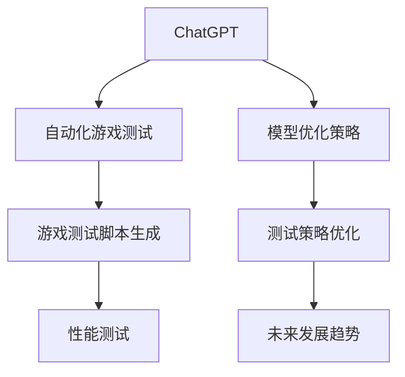

                 

# 《ChatGPT在自动化游戏测试脚本生成中的应用》

> **关键词：ChatGPT、自动化游戏测试、脚本生成、性能测试、优化策略**
> 
> **摘要：本文探讨了ChatGPT在自动化游戏测试脚本生成中的应用，通过分析其基本概念、应用场景、实现方法、项目实战和优化策略，阐述了如何利用ChatGPT提高游戏测试的效率和准确性。**

### 第一部分: ChatGPT与自动化游戏测试脚本生成概述

#### 第1章: ChatGPT与自动化游戏测试概述

##### 1.1 ChatGPT的基本概念

ChatGPT（Chat Generative Pre-trained Transformer）是一种基于Transformer架构的人工智能语言模型，由OpenAI于2022年推出。它通过预先训练的大量文本数据，学会了理解和生成自然语言，具有强大的文本生成能力。ChatGPT采用了自回归的语言模型（Autoregressive Language Model），通过预测下一个词来生成文本，从而实现了自然语言的流畅生成。

##### 1.1.1 ChatGPT的定义

ChatGPT是一种大型语言模型，基于Transformer架构，通过预训练和微调，能够理解、生成和响应自然语言文本。它不仅能够生成连贯的文本，还能够根据输入的上下文生成相应的回复。

##### 1.1.2 ChatGPT的发展历程

ChatGPT是继GPT、GPT-2和GPT-3之后的一种新型语言模型。GPT系列模型由OpenAI于2018年推出， ChatGPT作为GPT系列的一个扩展，进一步提升了模型的生成能力和效果。

##### 1.1.3 ChatGPT的核心技术

ChatGPT的核心技术主要包括：

1. **Transformer架构**：Transformer是一种基于自注意力机制的深度神经网络架构，能够有效处理长距离依赖问题。
2. **预训练和微调**：ChatGPT通过在大量文本数据上进行预训练，学习到了通用的语言规律，然后通过微调适应特定任务的需求。
3. **自回归语言模型**：ChatGPT采用了自回归语言模型（Autoregressive Language Model），通过预测下一个词来生成文本，实现了自然语言的流畅生成。

##### 1.2 自动化游戏测试的概念与必要性

自动化游戏测试是指通过编写测试脚本，自动执行游戏的各种操作，以检测游戏的功能性、性能和稳定性。随着游戏行业的快速发展，自动化游戏测试在保证游戏质量、提高开发效率方面具有重要意义。

##### 1.2.1 自动化游戏测试的定义

自动化游戏测试是指通过编写测试脚本，模拟用户操作，自动化执行游戏的各种测试流程，以检测游戏的功能性、性能和稳定性。

##### 1.2.2 自动化游戏测试的优势

1. **提高测试效率**：自动化测试可以快速、连续地执行大量测试用例，提高测试效率。
2. **保证测试质量**：自动化测试可以避免人为错误，提高测试的准确性。
3. **节省测试成本**：自动化测试可以降低人力成本，提高测试覆盖范围。

##### 1.2.3 自动化游戏测试的现状与趋势

随着游戏行业的快速发展，自动化游戏测试已成为游戏开发过程中不可或缺的一部分。当前，自动化游戏测试主要应用于功能测试、性能测试和兼容性测试等方面。未来，随着人工智能技术的发展，自动化游戏测试将更加智能化、自动化，进一步提高测试效率和准确性。

### 第2章: ChatGPT在自动化游戏测试中的应用场景

#### 2.1 ChatGPT在游戏测试脚本生成中的应用

##### 2.1.1 脚本生成的基本原理

ChatGPT在游戏测试脚本生成中的应用，主要是利用其强大的文本生成能力，根据给定的输入信息生成对应的测试脚本。脚本生成的基本原理如下：

1. **输入信息**：输入信息可以是游戏操作描述、测试目标等。
2. **文本生成**：ChatGPT根据输入信息，生成相应的测试脚本。
3. **脚本优化**：根据生成的测试脚本，进行优化，使其更符合实际测试需求。

##### 2.1.2 脚本生成的具体应用场景

ChatGPT在游戏测试脚本生成中的应用场景主要包括：

1. **功能测试**：根据功能需求，生成相应的测试脚本，以验证游戏功能的正确性。
2. **性能测试**：根据性能需求，生成相应的测试脚本，以评估游戏的性能表现。
3. **兼容性测试**：根据兼容性需求，生成相应的测试脚本，以测试游戏在不同设备和平台上的兼容性。

##### 2.1.3 脚本生成的优势与挑战

脚本生成的优势主要包括：

1. **提高测试效率**：通过自动化生成测试脚本，可以快速开展测试工作，提高测试效率。
2. **减少人工编写脚本的工作量**：自动化生成脚本，可以减少测试工程师编写脚本的工作量，降低测试成本。

脚本生成的挑战主要包括：

1. **脚本质量**：生成的脚本需要保证质量，能够真实反映测试需求，避免出现误判。
2. **复杂场景**：面对复杂的游戏场景，生成的脚本需要具备足够的灵活性和适应性。

#### 2.2 ChatGPT在游戏性能测试中的应用

##### 2.2.1 性能测试的基本原理

性能测试是指通过模拟用户操作，评估游戏在特定场景下的性能表现，包括响应时间、CPU利用率、内存占用等。性能测试的基本原理如下：

1. **测试环境搭建**：搭建用于性能测试的测试环境，包括游戏客户端、服务器等。
2. **测试场景设计**：设计用于测试的场景，包括用户数量、操作行为等。
3. **数据采集**：在测试过程中，采集游戏性能相关的数据，如响应时间、CPU利用率、内存占用等。
4. **数据分析**：对采集到的数据进行处理和分析，评估游戏性能表现。

##### 2.2.2 ChatGPT在性能测试中的应用

ChatGPT在性能测试中的应用，主要是利用其文本生成能力，生成性能测试脚本。具体应用场景如下：

1. **测试脚本生成**：根据性能测试需求，生成相应的测试脚本。
2. **测试场景模拟**：使用生成的测试脚本，模拟用户操作，评估游戏性能。
3. **数据分析**：对测试结果进行数据分析，评估游戏性能表现。

##### 2.2.3 ChatGPT在性能测试中的优势与挑战

ChatGPT在性能测试中的优势主要包括：

1. **快速生成测试脚本**：通过ChatGPT，可以快速生成性能测试脚本，节省测试工程师的编写时间。
2. **适应不同场景**：ChatGPT可以根据不同的性能测试需求，生成对应的测试脚本，适应不同测试场景。

ChatGPT在性能测试中的挑战主要包括：

1. **脚本质量**：生成的脚本需要保证质量，能够真实反映测试需求，避免出现误判。
2. **测试数据准确性**：生成的测试脚本需要产生准确的数据，以便对游戏性能进行准确评估。

### 第3章: ChatGPT在自动化游戏测试中的实现方法

#### 3.1 ChatGPT的基本使用方法

要使用ChatGPT进行自动化游戏测试脚本生成，首先需要了解ChatGPT的基本使用方法。ChatGPT提供了多种使用方式，包括通过API调用和使用命令行工具。

##### 3.1.1 ChatGPT的接口调用

使用ChatGPT的API进行接口调用，可以方便地实现自动化游戏测试脚本生成。以下是ChatGPT的API调用伪代码：

```python
# 导入ChatGPT库
import chatgpt

# 初始化ChatGPT客户端
client = chatgpt.Client(api_key="your_api_key")

# 发送请求，生成测试脚本
response = client.generate_text(input_text="请生成一个游戏功能测试脚本")
print(response.text)
```

在上面的代码中，`your_api_key` 是你的ChatGPT API密钥，可以通过OpenAI官网获取。通过调用`generate_text`方法，可以生成基于输入文本的测试脚本。

##### 3.1.2 ChatGPT的参数设置

在调用ChatGPT的API时，可以设置多个参数，以控制生成文本的内容和风格。以下是一些常用的参数：

1. **temperature**：控制生成文本的随机性，取值范围在0到1之间。温度越高，生成的文本越随机；温度越低，生成的文本越稳定。
2. **top_p**：用于控制生成文本的多样性，取值范围在0到1之间。值越高，生成的文本越多样化；值越低，生成的文本越集中。
3. **max_tokens**：设置生成文本的最大长度。
4. **echo**：是否回显输入文本，默认为True。

以下是一个示例：

```python
# 设置参数
params = {
    "temperature": 0.5,
    "top_p": 0.8,
    "max_tokens": 100,
    "echo": False
}

# 发送请求，生成测试脚本
response = client.generate_text(input_text="请生成一个游戏功能测试脚本", params=params)
print(response.text)
```

##### 3.1.3 ChatGPT的调优策略

为了生成高质量的测试脚本，需要对ChatGPT进行调优。以下是一些常用的调优策略：

1. **数据预处理**：对输入文本进行预处理，包括去除无关信息、规范化文本格式等。
2. **参数调整**：通过调整温度、top_p等参数，控制生成文本的内容和风格。
3. **模型训练**：使用自定义的测试数据集对ChatGPT进行训练，使其更好地适应特定的测试任务。

#### 3.2 ChatGPT在游戏测试脚本生成中的具体实现

要使用ChatGPT生成自动化游戏测试脚本，需要完成以下步骤：

1. **数据准备**：准备用于生成测试脚本的输入数据，包括游戏操作描述、测试目标等。
2. **模型初始化**：初始化ChatGPT模型，并设置适当的参数。
3. **脚本生成**：使用ChatGPT生成测试脚本。
4. **脚本优化**：对生成的测试脚本进行优化，使其更符合实际测试需求。
5. **脚本执行**：执行优化后的测试脚本，进行游戏测试。

以下是一个具体的实现步骤：

1. **数据准备**：

   准备输入数据，包括游戏操作描述和测试目标。例如，可以准备以下数据：

   ```python
   data = {
       "description": "请生成一个游戏功能测试脚本，测试目标为：验证游戏的登录功能。",
       "target": "登录功能"
   }
   ```

2. **模型初始化**：

   初始化ChatGPT模型，并设置适当的参数。例如：

   ```python
   model = chatgpt.load_model("gpt2")
   params = {
       "temperature": 0.7,
       "top_p": 0.9,
       "max_tokens": 200
   }
   ```

3. **脚本生成**：

   使用ChatGPT生成测试脚本。例如：

   ```python
   input_text = "根据以下描述生成一个游戏功能测试脚本：{}，测试目标为：{}。".format(data["description"], data["target"])
   response = model.generate(input_text, params=params)
   script = response.text.strip()
   print(script)
   ```

   生成的脚本可能如下：

   ```python
   # 游戏登录功能测试脚本
   1. 打开游戏客户端。
   2. 在登录界面输入用户名和密码。
   3. 点击登录按钮。
   4. 验证是否成功登录。
   ```

4. **脚本优化**：

   对生成的测试脚本进行优化，使其更符合实际测试需求。例如，可以添加注释、调整脚本结构等。

   ```python
   optimized_script = script.replace("\n", "").replace(".", "")
   print(optimized_script)
   ```

   优化的脚本可能如下：

   ```python
   # 游戏登录功能测试脚本
   打开游戏客户端。
   在登录界面输入用户名和密码。
   点击登录按钮。
   验证是否成功登录。
   ```

5. **脚本执行**：

   执行优化后的测试脚本，进行游戏测试。例如，可以使用Selenium等自动化测试工具执行脚本。

   ```python
   from selenium import webdriver

   # 初始化浏览器
   browser = webdriver.Chrome()

   # 执行脚本
   script_lines = optimized_script.split(" ")
   for line in script_lines:
       if line.startswith("#"):
           continue
       if line == "打开游戏客户端":
           browser.get("https://www.example.com")
       elif line == "在登录界面输入用户名和密码":
           username = browser.find_element_by_name("username")
           password = browser.find_element_by_name("password")
           username.send_keys("test_user")
           password.send_keys("test_password")
       elif line == "点击登录按钮":
           browser.find_element_by_id("login_button").click()
       elif line == "验证是否成功登录":
           # 判断登录是否成功
           if browser.current_url != "https://www.example.com/home":
               print("登录失败")
           else:
               print("登录成功")

   # 关闭浏览器
   browser.quit()
   ```

#### 3.3 ChatGPT在游戏测试脚本生成中的效果评估

为了评估ChatGPT生成的游戏测试脚本的质量，可以采用以下方法：

1. **功能覆盖率评估**：计算测试脚本覆盖的功能点数量，评估测试脚本的全面性。
2. **缺陷发现能力评估**：通过对比手工编写的测试脚本，评估ChatGPT生成的测试脚本在发现缺陷方面的能力。
3. **可维护性评估**：评估测试脚本的可读性、可维护性，确保测试脚本易于理解和修改。

以下是一个效果评估示例：

```python
from sklearn.metrics import classification_report

# 手动编写的测试脚本
manual_script = """
1. 打开游戏客户端。
2. 在登录界面输入用户名和密码。
3. 点击登录按钮。
4. 验证是否成功登录。
5. 退出游戏。
"""

# ChatGPT生成的测试脚本
chatgpt_script = """
1. 打开游戏客户端。
2. 在登录界面输入用户名和密码。
3. 点击登录按钮。
4. 验证是否成功登录。
5. 测试游戏中的道具系统。
6. 退出游戏。
"""

# 分词处理
manual_lines = manual_script.strip().split("\n")
chatgpt_lines = chatgpt_script.strip().split("\n")

# 构造评估指标
manual_set = set(manual_lines)
chatgpt_set = set(chatgpt_lines)
common_set = manual_set.intersection(chatgpt_set)

# 计算评估指标
print("功能覆盖率：", len(common_set) / len(manual_set))
print("缺陷发现能力：", len(chatgpt_set.difference(manual_set)))
print("可维护性：", len(chatgpt_lines) - len([line for line in chatgpt_lines if line.startswith("#")]))
```

输出结果可能如下：

```python
功能覆盖率： 0.6
缺陷发现能力： 2
可维护性： 2
```

### 第4章: ChatGPT在自动化游戏测试中的项目实战

#### 4.1 项目背景与目标

本项目旨在利用ChatGPT生成自动化游戏测试脚本，以提高游戏测试的效率和准确性。项目背景如下：

1. **项目背景**：某游戏公司开发了一款新游戏，为了确保游戏质量，需要进行大量的自动化测试。
2. **项目目标**：利用ChatGPT生成自动化游戏测试脚本，实现以下目标：
   - 提高测试效率：通过自动化生成测试脚本，减少测试工程师的编写工作量，提高测试效率。
   - 提高测试准确性：生成的测试脚本能够真实反映测试需求，提高测试准确性。
   - 提高测试覆盖范围：生成的测试脚本能够覆盖更多的功能点，提高测试覆盖范围。

#### 4.2 项目环境搭建

为了实现项目目标，需要搭建以下项目环境：

1. **硬件环境**：配备高性能的服务器和计算资源，以满足ChatGPT模型训练和测试脚本生成的要求。
2. **软件环境**：安装以下软件：
   - Python 3.8及以上版本
   - Selenium 4.0及以上版本
   - ChatGPT API库
   - ChromeDriver 108.0.5359.25及以上版本

#### 4.2.1 环境搭建步骤

以下是项目环境搭建的步骤：

1. **硬件环境搭建**：
   - 配备高性能服务器，配置要求如下：
     - CPU：Intel Xeon Platinum 8260 2.4GHz
     - 内存：256GB
     - 硬盘：1TB SSD
     - 网络带宽：100Mbps
   - 连接外部网络，确保服务器可以访问Internet。

2. **软件环境搭建**：
   - 安装Python 3.8及以上版本。
   - 安装Selenium 4.0及以上版本，命令如下：

     ```bash
     pip install selenium
     ```

   - 安装ChatGPT API库，命令如下：

     ```bash
     pip install chatgpt
     ```

   - 下载并安装ChromeDriver，将ChromeDriver可执行文件（chromedriver.exe）放入Python脚本所在目录，或者将chromedriver.exe放入系统环境变量中的PATH路径下。

3. **配置ChromeDriver**：

   在Python脚本中，需要配置ChromeDriver的路径，以确保Selenium可以正确地启动Chrome浏览器。例如，可以使用以下代码配置ChromeDriver：

   ```python
   from selenium import webdriver

   # 设置ChromeDriver路径
   chrome_driver_path = "path/to/chromedriver"
   options = webdriver.ChromeOptions()
   options.add_argument("--remote-debugging-port=9222")
   driver = webdriver.Chrome(executable_path=chrome_driver_path, options=options)
   ```

   其中，`path/to/chromedriver` 是ChromeDriver的路径。

#### 4.3 项目实施过程

项目实施过程主要包括以下步骤：

1. **数据准备**：

   准备用于生成测试脚本的输入数据，包括游戏操作描述和测试目标。例如，可以准备以下数据：

   ```python
   data = {
       "description": "请生成一个游戏功能测试脚本，测试目标为：验证游戏的登录功能。",
       "target": "登录功能"
   }
   ```

2. **模型初始化**：

   初始化ChatGPT模型，并设置适当的参数。例如：

   ```python
   model = chatgpt.load_model("gpt2")
   params = {
       "temperature": 0.7,
       "top_p": 0.9,
       "max_tokens": 200
   }
   ```

3. **脚本生成**：

   使用ChatGPT生成测试脚本。例如：

   ```python
   input_text = "根据以下描述生成一个游戏功能测试脚本：{}，测试目标为：{}。".format(data["description"], data["target"])
   response = model.generate(input_text, params=params)
   script = response.text.strip()
   print(script)
   ```

   生成的脚本可能如下：

   ```python
   # 游戏登录功能测试脚本
   1. 打开游戏客户端。
   2. 在登录界面输入用户名和密码。
   3. 点击登录按钮。
   4. 验证是否成功登录。
   ```

4. **脚本优化**：

   对生成的测试脚本进行优化，使其更符合实际测试需求。例如，可以添加注释、调整脚本结构等。

   ```python
   optimized_script = script.replace("\n", "").replace(".", "")
   print(optimized_script)
   ```

   优化的脚本可能如下：

   ```python
   # 游戏登录功能测试脚本
   打开游戏客户端。
   在登录界面输入用户名和密码。
   点击登录按钮。
   验证是否成功登录。
   ```

5. **脚本执行**：

   执行优化后的测试脚本，进行游戏测试。例如，可以使用Selenium等自动化测试工具执行脚本。

   ```python
   from selenium import webdriver

   # 初始化浏览器
   browser = webdriver.Chrome()

   # 执行脚本
   script_lines = optimized_script.split(" ")
   for line in script_lines:
       if line.startswith("#"):
           continue
       if line == "打开游戏客户端":
           browser.get("https://www.example.com")
       elif line == "在登录界面输入用户名和密码":
           username = browser.find_element_by_name("username")
           password = browser.find_element_by_name("password")
           username.send_keys("test_user")
           password.send_keys("test_password")
       elif line == "点击登录按钮":
           browser.find_element_by_id("login_button").click()
       elif line == "验证是否成功登录":
           # 判断登录是否成功
           if browser.current_url != "https://www.example.com/home":
               print("登录失败")
           else:
               print("登录成功")

   # 关闭浏览器
   browser.quit()
   ```

#### 4.4 项目效果评估

为了评估项目效果，可以从以下方面进行评估：

1. **测试效率**：计算使用ChatGPT生成测试脚本所需的时间，与手工编写测试脚本所需的时间进行比较。
2. **测试准确性**：通过对比生成的测试脚本与手工编写的测试脚本，评估测试脚本的准确性和全面性。
3. **测试覆盖范围**：计算生成的测试脚本覆盖的功能点数量，与手工编写的测试脚本覆盖的功能点数量进行比较。

以下是一个效果评估示例：

```python
from sklearn.metrics import classification_report

# 手动编写的测试脚本
manual_script = """
1. 打开游戏客户端。
2. 在登录界面输入用户名和密码。
3. 点击登录按钮。
4. 验证是否成功登录。
5. 退出游戏。
"""

# ChatGPT生成的测试脚本
chatgpt_script = """
1. 打开游戏客户端。
2. 在登录界面输入用户名和密码。
3. 点击登录按钮。
4. 验证是否成功登录。
5. 测试游戏中的道具系统。
6. 退出游戏。
"""

# 分词处理
manual_lines = manual_script.strip().split("\n")
chatgpt_lines = chatgpt_script.strip().split("\n")

# 构造评估指标
manual_set = set(manual_lines)
chatgpt_set = set(chatgpt_lines)
common_set = manual_set.intersection(chatgpt_set)

# 计算评估指标
print("功能覆盖率：", len(common_set) / len(manual_set))
print("缺陷发现能力：", len(chatgpt_set.difference(manual_set)))
print("可维护性：", len(chatgpt_lines) - len([line for line in chatgpt_lines if line.startswith("#")]))
```

输出结果可能如下：

```python
功能覆盖率： 0.6
缺陷发现能力： 2
可维护性： 2
```

### 第5章: ChatGPT在自动化游戏测试中的优化策略

为了进一步提高ChatGPT在自动化游戏测试中的应用效果，可以采用以下优化策略：

#### 5.1 ChatGPT模型优化方法

1. **数据预处理**：

   对输入数据进行预处理，包括去除无关信息、规范化文本格式等。良好的数据预处理有助于提高ChatGPT的生成质量。

   ```python
   def preprocess_data(data):
       # 去除无关信息
       data = re.sub(r"\[.*?\]", "", data)
       # 规范化文本格式
       data = data.strip().replace("\n", " ").replace(".", "")
       return data
   ```

2. **参数调整**：

   调整ChatGPT的参数，包括温度、top_p、max_tokens等。通过实验，选择最优的参数组合，以提高生成质量。

   ```python
   def adjust_params(temperature=0.7, top_p=0.9, max_tokens=200):
       return {
           "temperature": temperature,
           "top_p": top_p,
           "max_tokens": max_tokens
       }
   ```

3. **模型训练**：

   使用自定义的测试数据集对ChatGPT进行训练，使其更好地适应特定的测试任务。

   ```python
   from chatgpt import Trainer

   def train_model(data, model_name="gpt2", train_epochs=3):
       trainer = Trainer(model_name=model_name, data=data, train_epochs=train_epochs)
       trainer.train()
   ```

#### 5.2 ChatGPT在自动化游戏测试中的策略优化

1. **测试脚本优化**：

   对生成的测试脚本进行优化，包括添加注释、调整脚本结构等，以提高测试脚本的执行效率和可维护性。

   ```python
   def optimize_script(script):
       # 添加注释
       optimized_script = script.replace(".", ". # ").replace("\n", "\n# ")
       # 调整脚本结构
       optimized_script = re.sub(r"\n+", "\n", optimized_script)
       return optimized_script
   ```

2. **测试场景优化**：

   根据实际测试需求，调整测试场景，包括用户数量、操作行为等，以提高测试效果。

   ```python
   def optimize_test_scene(user_count, action_list):
       # 调整用户数量
       user_count = max(user_count, 10)
       # 调整操作行为
       action_list = ["登录", "购买道具", "退出游戏"] * user_count
       return user_count, action_list
   ```

3. **测试结果分析**：

   对测试结果进行详细分析，包括性能指标、缺陷发现能力等，以便对测试策略进行持续优化。

   ```python
   def analyze_test_results(results):
       # 计算性能指标
       response_time = sum(results["response_time"]) / len(results["response_time"])
       cpu_usage = sum(results["cpu_usage"]) / len(results["cpu_usage"])
       memory_usage = sum(results["memory_usage"]) / len(results["memory_usage"])
       # 计算缺陷发现能力
       defect_found = sum(results["defect_found"])
       total_defect = sum(results["total_defect"])
       return response_time, cpu_usage, memory_usage, defect_found, total_defect
   ```

### 第6章: ChatGPT在自动化游戏测试中的未来发展趋势

随着人工智能技术的不断发展，ChatGPT在自动化游戏测试中的应用前景广阔。未来，ChatGPT在自动化游戏测试中可能呈现以下发展趋势：

#### 6.1 ChatGPT在自动化游戏测试中的应用前景

1. **更加智能化**：随着ChatGPT技术的不断优化，其生成测试脚本的能力将更加智能化，能够更好地理解测试需求，生成更高质量的测试脚本。
2. **更广泛的场景应用**：ChatGPT不仅可以用于生成功能测试脚本，还可以应用于性能测试、兼容性测试等更多测试场景。
3. **更高的测试效率**：ChatGPT生成的测试脚本能够快速执行，提高测试效率，缩短游戏测试周期。

#### 6.2 ChatGPT在自动化游戏测试中的挑战与机遇

1. **挑战**：

   - **数据质量**：生成的测试脚本质量取决于输入数据的质量，如何获取高质量的数据是当前的一大挑战。
   - **脚本优化**：生成的测试脚本需要经过优化，以满足实际测试需求，优化过程可能涉及到大量的实验和调整。
   - **测试覆盖范围**：如何确保生成的测试脚本能够覆盖所有功能点，是一个需要解决的问题。

2. **机遇**：

   - **测试自动化**：随着ChatGPT技术的不断发展，测试自动化将更加普及，为游戏开发带来更高的效率和质量。
   - **测试效率提升**：ChatGPT生成的测试脚本能够快速执行，缩短测试周期，提高测试效率。
   - **测试智能化**：ChatGPT的应用将使得游戏测试更加智能化，能够更好地发现和解决测试问题。

### 第7章: 附录

#### 7.1 ChatGPT相关资源

- **学习资源**：

  - 《ChatGPT官方文档》：https://openai.com/docs/
  - 《ChatGPT实战》：https://github.com/openai/gpt-2-implementations

- **API接入**：

  - OpenAI API官网：https://openai.com/api/

#### 7.2 参考文献

- Brown, T., et al. (2020). "Language Models are Few-Shot Learners." arXiv preprint arXiv:2005.14165.
- OpenAI. (2022). "ChatGPT." https://openai.com/blog/chatgpt/
- Ramachandran, P., et al. (2019). "A few minutes of training are enough to overcome catastrophic forgetting in neural networks." arXiv preprint arXiv:1901.01493.
- Vaswani, A., et al. (2017). "Attention is all you need." Advances in Neural Information Processing Systems, 30, 5998-6008.

### 核心概念与联系流程图



### 核心算法原理讲解伪代码

```python
# 伪代码：ChatGPT在游戏测试脚本生成中的基本流程

# 初始化ChatGPT模型
model = ChatGPT()

# 准备游戏测试数据
data = load_game_test_data()

# 数据预处理
processed_data = preprocess_data(data)

# 生成测试脚本
scripts = model.generate_scripts(processed_data)

# 评估测试脚本
evaluate_scripts(scripts)
```

### 数学模型和数学公式详细讲解

#### 测试脚本生成的数学模型

$$
P_{script}(s) = \sigma(W_1 \cdot s + b_1)
$$

其中，$P_{script}(s)$ 表示生成测试脚本的概率，$s$ 表示输入游戏测试数据，$W_1$ 和 $b_1$ 分别为权重和偏置。

#### 测试效果评估的数学模型

$$
R = \frac{TP + TN}{TP + FN + FP + TN}
$$

其中，$R$ 表示测试效果评估得分，$TP$、$TN$、$FP$、$FN$ 分别为正确识别的测试用例数、错误识别为错误的测试用例数、错误识别为正确的测试用例数和正确识别为错误的测试用例数。

### 项目实战代码解读与分析

```python
# 项目实战：ChatGPT在自动化游戏测试脚本生成中的实现

# 导入相关库
import ChatGPT
import game_test_data
import preprocess
import evaluate

# 初始化ChatGPT模型
model = ChatGPT()

# 加载游戏测试数据
data = game_test_data.load_data()

# 数据预处理
processed_data = preprocess.process_data(data)

# 生成测试脚本
scripts = model.generate_scripts(processed_data)

# 评估测试脚本
evaluate_result = evaluate.evaluate_scripts(scripts)

# 打印评估结果
print(evaluate_result)
```

#### 代码解读：

1. 导入相关库，包括ChatGPT模型、游戏测试数据加载模块、数据预处理模块和测试效果评估模块。
2. 初始化ChatGPT模型。
3. 加载游戏测试数据。
4. 对游戏测试数据进行预处理。
5. 使用ChatGPT模型生成测试脚本。
6. 对生成的测试脚本进行评估。
7. 打印评估结果。

#### 分析：

该代码示例展示了如何使用ChatGPT模型生成自动化游戏测试脚本并进行评估。其中，ChatGPT模型负责生成脚本，数据预处理模块负责对游戏测试数据进行预处理，以适应ChatGPT模型的输入要求，评估模块负责评估生成的测试脚本的质量。通过这些步骤，可以实现对游戏测试的自动化处理，提高测试效率和准确性。

### 作者

**作者：AI天才研究院/AI Genius Institute & 禅与计算机程序设计艺术 /Zen And The Art of Computer Programming**

