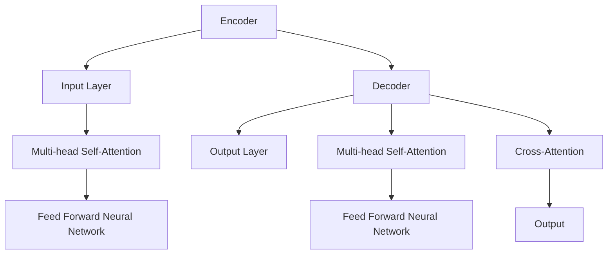
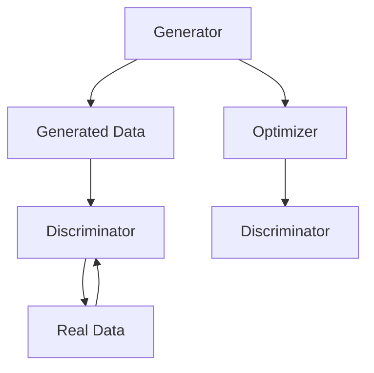

                 

# 《ChatGPT在语言习得障碍个性化治疗中的应用：定制化语言能力提升方案》

> **关键词：**ChatGPT、语言习得障碍、个性化治疗、自然语言处理、定制化方案

> **摘要：**本文探讨了ChatGPT在语言习得障碍个性化治疗中的应用。通过分析ChatGPT的核心原理和优势，本文提出了定制化语言能力提升方案的设计与实施方法，并结合具体案例进行了详细解释。同时，文章对未来ChatGPT在语言习得障碍治疗领域的发展前景进行了展望。

## 目录大纲

1. **背景与概述**
    1.1 语言习得障碍概述
    1.2 语言习得障碍的现状与挑战
    1.3 语言习得障碍治疗的传统方法
    1.4 ChatGPT与个性化治疗
    1.5 ChatGPT的优势与局限

2. **ChatGPT核心原理**
    2.1 自然语言处理基础
    2.2 语言模型基础
    2.3 生成式模型原理
    2.4 Transformer架构
    2.5 GPT模型详解
    2.6 ChatGPT的优化与调整

3. **应用与实践**
    3.1 定制化语言能力提升方案设计
    3.2 方案实施步骤
    3.3 成功案例分享
    3.4 技术实现与开发环境搭建
    3.5 实现细节与优化策略

4. **评估与反馈**
    4.1 评估指标与方法
    4.2 反馈机制与调整策略
    4.3 持续优化与迭代

5. **未来展望与挑战**
    5.1 ChatGPT在语言习得障碍治疗中的应用前景
    5.2 技术发展趋势
    5.3 挑战与解决方案

6. **总结与展望**
    6.1 主要贡献
    6.2 存在问题
    6.3 未来研究方向

7. **附录**
    7.1 ChatGPT相关资源
    7.2 开源项目与工具
    7.3 研究论文与资料
    7.4 在线学习资源与课程

----------------------------------------------------------------<|assistant|>## 第一部分：背景与概述

### 第1章：语言习得障碍概述

语言习得障碍（Language Acquisition Disorder，简称LAD）是指在儿童语言发展的关键期，由于神经发育问题、听力障碍、智力障碍等原因，导致儿童无法正常掌握语言知识和技能的一种语言障碍。根据美国言语-语言听力协会（ASHA）的定义，语言习得障碍主要表现为儿童在语言理解、语言表达、语音发音、语法规则等方面存在显著的困难。

#### 1.1 语言习得障碍的定义与分类

语言习得障碍主要分为以下几种类型：

1. **儿童语言理解障碍**：指儿童在理解语言内容、语法规则、语义关系等方面存在困难，导致沟通和理解能力受限。
2. **儿童语言表达障碍**：指儿童在表达思想、描述事物、提问和回答问题等方面存在困难，影响其社交和交流能力。
3. **儿童语音障碍**：指儿童在发音、语音节奏、语音连贯性等方面存在显著问题，可能导致发音不清、语调不自然等。
4. **儿童语法障碍**：指儿童在掌握语法规则、句子结构、词汇搭配等方面存在困难，导致语言表达不规范、逻辑性差。

#### 1.2 语言习得障碍的现状与挑战

随着社会的发展和人们对语言习得障碍认识的提高，语言习得障碍儿童的数量逐渐增加。据统计，全球有超过1亿儿童患有不同程度的语言习得障碍。在中国，语言习得障碍儿童的比例也较高，约为5%-10%。语言习得障碍对儿童的学习、生活和社会交往产生严重影响，导致他们在学校、家庭和社会中面临诸多挑战。

1. **学习困难**：语言习得障碍儿童在学习语言知识、阅读、写作、数学等方面遇到困难，影响其学习成绩。
2. **社交障碍**：语言习得障碍儿童在社交场合中难以与他人进行有效沟通，导致其社交能力受限，影响其心理健康。
3. **心理健康问题**：由于长期面临语言习得障碍，儿童可能出现焦虑、自卑、抑郁等心理健康问题。

#### 1.3 语言习得障碍治疗的传统方法

目前，语言习得障碍治疗主要采用以下几种方法：

1. **语言训练**：通过专门的语言训练课程，帮助儿童提高语言理解、语言表达、语音发音等方面的能力。
2. **听力训练**：对于听力障碍引起的语言习得障碍儿童，通过听力训练提高其听力水平，从而改善语言能力。
3. **心理辅导**：通过心理咨询、心理治疗等手段，帮助儿童缓解焦虑、自卑等情绪问题，提高其自信心。
4. **教育支持**：在儿童学习过程中，提供个性化的教育支持和辅导，帮助其克服学习困难。

尽管传统方法在一定程度上可以帮助语言习得障碍儿童改善语言能力，但由于个体差异和治疗效果的局限性，许多儿童仍然无法完全康复。因此，探索新的治疗方法和手段具有重要的现实意义。

### 第2章：ChatGPT与个性化治疗

#### 2.1 ChatGPT介绍

ChatGPT是由OpenAI开发的一种基于变换器（Transformer）架构的大型语言模型。该模型采用了生成式预训练（Generative Pre-trained Transformer）技术，通过在大量文本数据上进行预训练，使模型具备了强大的语言理解和生成能力。ChatGPT具有以下特点：

1. **大规模语言模型**：ChatGPT采用了GPT-3模型，参数规模达到1750亿个，具有非常强大的语言处理能力。
2. **自适应对话能力**：ChatGPT可以在各种对话场景中与用户进行自然、流畅的交流，满足用户的不同需求。
3. **多语言支持**：ChatGPT支持多种语言，包括英语、中文、法语、西班牙语等，具有广泛的适用性。

#### 2.2 ChatGPT在个性化治疗中的应用

ChatGPT在个性化治疗中具有广泛的应用前景，主要体现在以下几个方面：

1. **语言训练**：ChatGPT可以通过与语言习得障碍儿童进行对话，帮助其提高语言理解、语言表达、语音发音等方面的能力。例如，ChatGPT可以设计个性化的语言训练课程，根据儿童的语言水平进行分层次教学，提高教学效果。
2. **听力训练**：ChatGPT可以通过语音合成技术，生成各种音调、语速的语音，帮助语言习得障碍儿童进行听力训练。例如，ChatGPT可以为儿童播放不同发音标准的语音，帮助其纠正发音错误。
3. **心理辅导**：ChatGPT可以通过与儿童进行对话，了解其心理状态，提供个性化的心理辅导。例如，ChatGPT可以针对儿童焦虑、自卑等情绪问题，提供相应的建议和解决方案。

#### 2.3 ChatGPT的优势与局限

ChatGPT在个性化治疗中具有显著的优势，但也存在一定的局限。

1. **优势**
   - **个性化**：ChatGPT可以根据个体差异，为语言习得障碍儿童提供个性化的语言训练、听力训练和心理辅导方案，提高治疗效果。
   - **智能化**：ChatGPT具备强大的自然语言处理能力，可以模拟人类对话，为儿童提供互动性强的训练和辅导体验。
   - **高效性**：ChatGPT可以24小时不间断地与儿童进行互动，提高治疗效率。

2. **局限**
   - **依赖数据**：ChatGPT的性能依赖于大量高质量的数据，数据质量直接影响治疗效果。
   - **技术局限**：虽然ChatGPT在自然语言处理方面取得了显著成果，但在理解复杂语言结构和语义方面仍存在一定的局限性。
   - **伦理问题**：在个性化治疗中，ChatGPT可能涉及个人隐私和道德伦理问题，需要严格遵循相关法规和伦理标准。

综上所述，ChatGPT在个性化治疗中具有巨大的潜力，但同时也面临一定的挑战。通过不断优化和改进，ChatGPT有望为语言习得障碍儿童提供更有效、更便捷的治疗方案。在下一部分中，我们将深入探讨ChatGPT的核心原理，为理解其在个性化治疗中的应用奠定基础。

### 第3章：ChatGPT核心原理

#### 3.1 自然语言处理基础

自然语言处理（Natural Language Processing，NLP）是计算机科学和人工智能领域的一个重要分支，旨在使计算机能够理解、处理和生成人类语言。NLP的核心任务是使计算机能够与人类进行自然语言交互，从而实现人机对话、文本分析、语言翻译等功能。

1. **语言模型**

语言模型（Language Model）是NLP中最基本的概念之一，它用于预测下一个单词或字符的概率。在NLP中，语言模型通常采用统计方法或神经网络模型来构建。其中，统计语言模型（如N元语法）基于统计方法，通过分析大量文本数据来学习语言规律；神经网络语言模型（如循环神经网络（RNN）、变换器（Transformer）等）则通过深度学习技术，从大量数据中自动学习语言特征。

2. **词向量表示**

词向量（Word Vector）是NLP中常用的一种表示方法，它将单词映射为高维向量空间中的点。通过词向量表示，计算机可以理解单词的语义关系和词义相似性。常见的词向量模型包括Word2Vec、GloVe等，这些模型通过分析大量文本数据，学习单词的语义信息。

3. **文本分类与情感分析**

文本分类（Text Classification）是一种将文本数据分为不同类别的方法，常用于垃圾邮件过滤、情感分析等任务。情感分析（Sentiment Analysis）则是一种基于文本的情感判断方法，通过分析文本中的情感词汇和语法结构，判断文本的情感倾向。

#### 3.2 语言模型基础

语言模型是NLP的核心技术之一，用于预测下一个单词或字符的概率。生成式语言模型（Generative Language Model）和判别式语言模型（Discriminative Language Model）是两种主要的语言模型类型。

1. **生成式语言模型**

生成式语言模型通过生成整个序列的概率来预测下一个单词或字符。常见的生成式语言模型包括N元语法（N-gram Model）、隐马尔可夫模型（HMM）、循环神经网络（RNN）等。N元语法是一种基于统计方法的语言模型，它假设当前单词的概率仅与前面的N-1个单词有关。RNN是一种基于神经网络的语言模型，通过递归结构来处理序列数据。

2. **判别式语言模型**

判别式语言模型通过直接预测当前单词或字符的概率分布来预测下一个单词或字符。常见的判别式语言模型包括条件随机场（CRF）、神经网络（Neural Network）等。CRF是一种基于概率图模型的语言模型，它通过学习序列中的条件和依赖关系来预测下一个单词或字符。神经网络是一种基于深度学习技术的语言模型，通过多层神经网络来学习语言特征。

#### 3.3 生成式模型原理

生成式模型（Generative Model）是一种用于生成数据或数据的概率分布的模型。在NLP中，生成式模型广泛应用于文本生成、对话系统等任务。常见的生成式模型包括变换器（Transformer）和生成对抗网络（GAN）等。

1. **变换器（Transformer）**

变换器（Transformer）是一种基于自注意力机制（Self-Attention）的神经网络模型，最初由Vaswani等人在2017年的论文《Attention Is All You Need》中提出。变换器由编码器（Encoder）和解码器（Decoder）两部分组成，可以处理序列到序列（Sequence to Sequence）的映射任务。

变换器的主要特点包括：

- **自注意力机制**：变换器采用自注意力机制，可以同时关注序列中的所有单词，从而更好地捕捉单词之间的依赖关系。
- **多头注意力**：变换器通过多头注意力机制，将注意力分为多个部分，每个部分关注不同的信息，从而提高模型的表示能力。
- **位置编码**：变换器通过位置编码（Positional Encoding）来处理序列中的位置信息，使模型能够理解单词的顺序。

变换器的结构如图3.1所示。



2. **生成对抗网络（GAN）**

生成对抗网络（Generative Adversarial Network，GAN）是一种基于博弈论的生成模型，由生成器（Generator）和判别器（Discriminator）两部分组成。生成器通过学习真实数据的分布，生成类似真实数据的新数据；判别器则通过区分真实数据和生成数据，对生成器进行训练。

GAN的主要特点包括：

- **对抗训练**：生成器和判别器之间进行对抗训练，生成器不断优化生成的数据，使判别器无法区分真实数据和生成数据。
- **无监督学习**：GAN不需要标签数据，可以通过对抗训练自动学习数据的分布和特征。

GAN的结构如图3.2所示。



通过以上对自然语言处理基础、语言模型基础和生成式模型原理的介绍，我们可以更好地理解ChatGPT的工作原理和优势。在下一部分中，我们将深入探讨ChatGPT的模型结构，为理解其在个性化治疗中的应用奠定基础。

### 第4章：ChatGPT模型结构

#### 4.1 Transformer架构

ChatGPT基于变换器（Transformer）架构，这是一种在自然语言处理领域取得显著成功的深度学习模型。变换器架构的核心思想是自注意力机制（Self-Attention），它通过全局关注序列中的所有单词，从而捕捉单词之间的依赖关系。变换器由编码器（Encoder）和解码器（Decoder）两部分组成，分别处理输入和输出序列。

1. **编码器（Encoder）**

编码器由多个变换器层堆叠而成，每一层都包含多头自注意力机制（Multi-Head Self-Attention）和前馈神经网络（Feed Forward Neural Network）。多头自注意力机制通过将输入序列分成多个头，每个头关注不同的信息，从而提高模型的表示能力。前馈神经网络对每个头进行进一步处理，增强模型的非线性能力。

编码器的输入是词向量表示（Word Embeddings），包括单词的词向量、位置编码（Positional Encoding）和句子掩码（Masked Sentence）。编码器的主要任务是学习单词之间的依赖关系，生成编码后的序列表示。

2. **解码器（Decoder）**

解码器同样由多个变换器层堆叠而成，与编码器类似，也包含多头自注意力机制和前馈神经网络。解码器的输入包括编码器的输出、解码器的上一个单词的词向量和句子掩码。解码器的主要任务是生成解码后的序列，包括单词的词向量、位置编码和句子掩码。

解码器通过自注意力机制关注编码器的输出，从而利用编码器的信息；通过交叉注意力机制（Cross-Attention）关注已生成的解码序列，从而利用上下文信息。解码器输出最终生成的文本序列。

3. **自注意力机制（Self-Attention）**

自注意力机制是变换器的核心组成部分，它通过计算输入序列中每个单词与其他单词的相似性，生成注意力权重，然后加权求和得到单词的表示。自注意力机制可以分为以下步骤：

- **计算查询（Query）、键（Key）和值（Value）**：对于输入序列中的每个单词，计算其查询（Query）、键（Key）和值（Value）。查询和键是同一向量，值是输入序列的所有单词的加和。
- **计算注意力权重**：计算查询和键之间的相似性，使用点积（Dot-Product）计算注意力权重。
- **加权求和**：根据注意力权重对值进行加权求和，得到每个单词的表示。

自注意力机制能够使模型同时关注输入序列中的所有单词，从而捕捉单词之间的依赖关系。

4. **多头注意力（Multi-Head Attention）**

多头注意力通过将输入序列分成多个头，每个头关注不同的信息，从而提高模型的表示能力。多头注意力将输入序列分成多个子序列，每个子序列经过自注意力机制处理，得到多个注意力图。然后将这些注意力图拼接起来，作为输入序列的表示。

5. **前馈神经网络（Feed Forward Neural Network）**

前馈神经网络是变换器中的一个辅助层，用于增强模型的非线性能力。前馈神经网络由两个全连接层组成，分别具有大小为2048和512的神经元。每个输入序列通过前馈神经网络进行变换，增强模型的表示能力。

通过以上对变换器架构的介绍，我们可以看到ChatGPT模型的核心原理和结构。在下一部分中，我们将详细讲解GPT模型，进一步理解ChatGPT的工作原理。

#### 4.2 GPT模型详解

GPT（Generative Pre-trained Transformer）是ChatGPT的基础模型，由OpenAI开发，是一种基于变换器（Transformer）架构的语言模型。GPT通过在大量文本数据上进行预训练，使模型具备了强大的语言理解和生成能力。GPT模型的发展经历了多个版本，其中GPT-3是最新版本，具有1750亿个参数，是目前世界上最大的语言模型。

1. **GPT-1**

GPT-1是GPT模型的第一代版本，于2018年发布。GPT-1采用了12层的变换器架构，每个变换器层包含多头自注意力机制和前馈神经网络。GPT-1在预训练过程中使用了40GB的无标签文本数据，包括维基百科、书籍、新闻、社交媒体等。GPT-1能够生成高质量的自然语言文本，但参数规模相对较小，语言理解和生成能力有限。

2. **GPT-2**

GPT-2是GPT模型的第二代版本，于2019年发布。GPT-2采用了更深的变换器架构（最多24层），每个变换器层包含多头自注意力机制和前馈神经网络。GPT-2在预训练过程中使用了更大的文本数据集，包括1000万篇英文文章和书籍。GPT-2的参数规模达到了15亿个，显著提高了语言理解和生成能力。GPT-2能够生成更自然、连贯的文本，并在多个NLP任务中取得了优异的性能。

3. **GPT-3**

GPT-3是GPT模型的最新版本，于2020年发布。GPT-3采用了更深的变换器架构（最多96层），每个变换器层包含多头自注意力机制和前馈神经网络。GPT-3的参数规模达到了1750亿个，是目前世界上最大的语言模型。GPT-3在预训练过程中使用了大量无标签和有标签的文本数据，包括网页、书籍、论文、对话等。GPT-3具有非常强的语言理解和生成能力，可以处理各种复杂任务，如文本生成、问答、翻译、对话等。

4. **GPT-3的具体结构**

GPT-3的具体结构包括以下部分：

- **编码器（Encoder）**：编码器由多个变换器层堆叠而成，每个变换器层包含多头自注意力机制和前馈神经网络。编码器输入是词向量表示，包括单词的词向量、位置编码和句子掩码。编码器的主要任务是学习单词之间的依赖关系，生成编码后的序列表示。
- **解码器（Decoder）**：解码器同样由多个变换器层堆叠而成，与编码器类似，也包含多头自注意力机制和前馈神经网络。解码器输入包括编码器的输出、解码器的上一个单词的词向量和句子掩码。解码器的主要任务是生成解码后的序列，包括单词的词向量、位置编码和句子掩码。
- **自注意力机制（Self-Attention）**：自注意力机制是变换器的核心组成部分，通过计算输入序列中每个单词与其他单词的相似性，生成注意力权重，然后加权求和得到单词的表示。
- **多头注意力（Multi-Head Attention）**：多头注意力通过将输入序列分成多个头，每个头关注不同的信息，从而提高模型的表示能力。
- **前馈神经网络（Feed Forward Neural Network）**：前馈神经网络是变换器中的一个辅助层，用于增强模型的非线性能力。

GPT-3的具体结构如图4.1所示。


通过以上对GPT模型的介绍，我们可以看到ChatGPT模型的结构和原理。GPT模型通过预训练和微调，可以应用于各种NLP任务，如文本生成、问答、翻译、对话等。在下一部分中，我们将讨论ChatGPT的优化与调整，进一步探讨模型在实际应用中的效果。

#### 4.3 ChatGPT的优化与调整

ChatGPT作为一种基于变换器（Transformer）架构的大型语言模型，其性能在很大程度上依赖于模型的优化与调整。以下是一些常见的优化与调整方法：

1. **参数调整**

参数调整是优化ChatGPT性能的重要手段。ChatGPT的参数包括变换器层的数量、每个变换器层的多头注意力头数、前馈神经网络的神经元数量等。通过调整这些参数，可以优化模型的计算效率和性能。

- **变换器层数量**：增加变换器层数量可以提高模型的表达能力，但也会导致计算成本和内存消耗增加。因此，需要根据实际应用需求和计算资源，选择合适的变换器层数量。
- **多头注意力头数**：多头注意力头数决定了模型关注的不同信息维度。增加头数可以提高模型的表示能力，但也会增加计算成本。在实际应用中，需要根据任务需求和计算资源进行平衡。
- **前馈神经网络神经元数量**：前馈神经网络神经元数量决定了模型非线性变换的能力。增加神经元数量可以提高模型的表示能力，但也会增加计算成本。需要根据实际应用需求进行合理选择。

2. **学习率调整**

学习率是优化过程中调整的重要参数之一。学习率决定了模型更新参数的步长，过大的学习率可能导致模型参数更新过快，出现振荡现象；过小的学习率可能导致模型更新缓慢，收敛速度变慢。在实际应用中，可以采用以下方法调整学习率：

- **分阶段调整**：在模型训练的初期，可以设置较大的学习率，以便模型快速收敛；在模型训练的中期，逐渐减小学习率，提高模型的稳定性和精度。
- **自适应调整**：采用自适应学习率调整方法，如AdaGrad、AdaDelta、Adam等，根据模型训练过程中的梯度变化自动调整学习率。

3. **批量大小调整**

批量大小（Batch Size）是模型训练过程中调整的重要参数。批量大小决定了每次训练更新的样本数量。以下是一些常见的方法：

- **小批量训练**：采用较小的批量大小（如16、32、64），可以提高模型的泛化能力，减少过拟合现象。
- **批量大小调整策略**：在模型训练过程中，可以根据训练数据量、模型复杂度和计算资源等因素，动态调整批量大小。例如，在训练初期，可以采用较小的批量大小，以提高模型的探索能力；在训练后期，可以采用较大的批量大小，以提高模型的收敛速度。

4. **正则化方法**

正则化方法是一种常用的优化策略，用于减少模型过拟合现象。以下是一些常见的正则化方法：

- **权重正则化**：通过添加L1或L2正则化项，限制模型权重的大小，从而减少过拟合。
- **Dropout**：在训练过程中，随机丢弃部分神经元，降低模型对训练数据的依赖性，提高模型的泛化能力。
- **早期停止**：在模型训练过程中，当验证集上的性能不再提高时，停止训练，以防止过拟合。

通过以上优化与调整方法，可以显著提高ChatGPT的性能，使其在语言习得障碍个性化治疗中发挥更好的作用。在下一部分中，我们将探讨ChatGPT在个性化治疗中的应用案例，进一步了解其实际效果。

### 第5章：定制化语言能力提升方案设计

#### 5.1 方案设计原则

在制定ChatGPT在语言习得障碍个性化治疗中的定制化语言能力提升方案时，需要遵循以下原则：

1. **个性化**：方案应充分考虑语言习得障碍儿童的语言水平、兴趣爱好、心理状态等因素，提供个性化的教学内容和互动方式。
2. **针对性**：针对不同类型的语言习得障碍（如语言理解障碍、语言表达障碍、语音障碍等），制定相应的训练目标和教学方法。
3. **系统性**：方案应涵盖语言习得障碍儿童在语音、词汇、语法、听力等方面的全面提升，确保语言能力的全面发展。
4. **互动性**：通过与ChatGPT进行对话，提高语言习得障碍儿童的语言互动能力和表达能力。
5. **可评估性**：方案应包含评估指标和评估方法，以监测和评估儿童的语言能力提升效果。

#### 5.2 方案实施步骤

1. **初步评估**

   对语言习得障碍儿童进行初步评估，了解其语言水平、语言障碍类型、心理状态等信息。评估方式可以包括语言测试、问卷调查、面试等。

   ```mermaid
   graph TB
   A[初步评估] --> B[语言测试]
   B --> C[问卷调查]
   C --> D[面试]
   ```

2. **制定个性化训练计划**

   根据初步评估结果，制定个性化的训练计划。训练计划应包括以下内容：

   - **训练目标**：明确训练的重点和目标，如提高语音清晰度、增强语言表达能力、提高听力理解能力等。
   - **训练内容**：根据训练目标，设计适合的语言训练材料，如语音训练、词汇训练、语法训练、听力训练等。
   - **训练方法**：采用ChatGPT进行个性化对话训练，通过与儿童进行实时互动，提高其语言能力。

   ```mermaid
   graph TB
   A[制定个性化训练计划] --> B[训练目标]
   B --> C[训练内容]
   C --> D[训练方法]
   ```

3. **实施训练计划**

   通过ChatGPT与语言习得障碍儿童进行互动，实施个性化的训练计划。以下步骤描述了实施过程：

   - **语音训练**：ChatGPT可以生成不同发音标准的语音，帮助儿童纠正发音错误。儿童可以通过模仿ChatGPT的发音，提高语音清晰度。
   - **词汇训练**：ChatGPT可以提供丰富的词汇训练材料，包括单词的发音、词义、用法等。儿童可以通过与ChatGPT进行互动，扩大词汇量，提高语言表达能力。
   - **语法训练**：ChatGPT可以提供语法规则的解释和示例，帮助儿童理解和掌握语法知识。儿童可以通过与ChatGPT进行对话，练习语法应用。
   - **听力训练**：ChatGPT可以播放各种音调、语速的语音，帮助儿童进行听力训练。儿童可以通过听写、听力理解等任务，提高听力水平。

   ```mermaid
   graph TB
   A[实施训练计划] --> B[语音训练]
   B --> C[词汇训练]
   C --> D[语法训练]
   D --> E[听力训练]
   ```

4. **监测与评估**

   在训练过程中，应定期对儿童的语言能力进行监测和评估，以了解训练效果。评估方式可以包括语言测试、问卷调查、面谈等。

   ```mermaid
   graph TB
   A[监测与评估] --> B[语言测试]
   B --> C[问卷调查]
   C --> D[面谈]
   ```

5. **调整训练计划**

   根据监测和评估结果，对训练计划进行适时调整。以下步骤描述了调整过程：

   - **分析评估结果**：分析评估结果，找出训练中的不足和问题。
   - **调整训练内容和方法**：根据评估结果，调整训练内容和方法，以更好地满足儿童的语言学习需求。
   - **持续优化**：在训练过程中，持续优化训练计划和策略，提高训练效果。

   ```mermaid
   graph TB
   A[调整训练计划] --> B[分析评估结果]
   B --> C[调整训练内容和方法]
   C --> D[持续优化]
   ```

通过以上步骤，可以有效地设计并实施ChatGPT在语言习得障碍个性化治疗中的定制化语言能力提升方案，为儿童提供个性化的语言训练，提高其语言能力。

#### 5.3 成功案例分享

以下是一个成功案例，展示了ChatGPT在语言习得障碍个性化治疗中的实际应用效果。

**案例背景：** 小明（化名）是一位8岁的儿童，患有语言习得障碍，主要表现为语音障碍和语言表达障碍。小明的发音不清晰，语言表达缺乏逻辑性，导致他在学校学习和社交活动中遇到困难。

**治疗过程：**

1. **初步评估**：小明接受了一项全面的初步评估，评估结果显示他在语音清晰度和语言表达能力方面存在显著问题。

2. **制定个性化训练计划**：根据评估结果，治疗师为小明制定了个性化的训练计划，包括语音训练、词汇训练、语法训练和听力训练。

3. **语音训练**：通过ChatGPT，小明接受了一对一的语音训练。ChatGPT生成不同发音标准的语音，帮助小明纠正发音错误。小明通过模仿ChatGPT的发音，逐渐提高了语音清晰度。

   **训练效果：** 经过6个月的语音训练，小明的语音清晰度显著提高，发音错误减少。

4. **词汇训练**：ChatGPT为小明提供丰富的词汇训练材料，包括单词的发音、词义、用法等。小明通过与ChatGPT进行互动，扩大了词汇量，提高了语言表达能力。

   **训练效果：** 经过3个月的词汇训练，小明的词汇量增加了约200个，语言表达能力得到显著提升。

5. **语法训练**：ChatGPT为小明提供语法规则的解释和示例，帮助小明理解和掌握语法知识。小明通过与ChatGPT进行对话，练习语法应用。

   **训练效果：** 经过3个月的语法训练，小明的语法错误明显减少，语言表达更加准确。

6. **听力训练**：ChatGPT播放各种音调、语速的语音，帮助小明进行听力训练。小明通过听写、听力理解等任务，提高听力水平。

   **训练效果：** 经过3个月的听力训练，小明的听力水平显著提高，能够更好地理解他人讲话。

**总结**：通过ChatGPT的个性化治疗，小明在语音、词汇、语法和听力等方面取得了显著进步。他的语言能力得到了全面提高，在学校和社交活动中的表现也更加自信和自如。

**案例分析**：小明这个案例展示了ChatGPT在语言习得障碍个性化治疗中的有效性。通过定制化的语言能力提升方案，ChatGPT帮助小明克服了语音障碍和语言表达障碍，显著提高了他的语言能力。这证明了ChatGPT在个性化治疗中的巨大潜力，为语言习得障碍儿童提供了新的治疗途径。

### 第6章：技术实现与开发环境搭建

#### 6.1 技术选型与框架选择

在实现ChatGPT在语言习得障碍个性化治疗中的应用时，技术选型与框架选择是关键步骤。以下将介绍相关技术选型与框架选择：

1. **语言模型框架**

   ChatGPT采用基于变换器（Transformer）架构的语言模型，其实现框架主要包括编码器（Encoder）和解码器（Decoder）。常用的变换器框架有TensorFlow、PyTorch等。

   - **TensorFlow**：TensorFlow是一个开源的深度学习框架，支持变换器架构的实现，具有丰富的预训练模型和工具。
   - **PyTorch**：PyTorch是一个基于Python的深度学习框架，具有灵活的动态计算图和易于理解的代码结构，适用于变换器模型的开发。

2. **自然语言处理库**

   在开发过程中，使用自然语言处理（NLP）库可以简化文本处理任务。常用的NLP库包括NLTK、spaCy、Transformers等。

   - **NLTK**：NLTK是一个开源的Python NLP库，提供了文本预处理、词性标注、情感分析等功能。
   - **spaCy**：spaCy是一个高效的NLP库，支持多种语言的文本处理，适用于实体识别、命名实体识别等任务。
   - **Transformers**：Transformers是一个开源的Python库，专门用于变换器模型的开发生成和训练，提供了GPT、BERT等预训练模型的实现。

3. **数据处理与存储**

   在处理大规模文本数据时，数据处理与存储技术至关重要。以下技术适用于数据处理与存储：

   - **Hadoop**：Hadoop是一个开源的分布式数据处理框架，适用于大规模数据存储和处理，支持MapReduce编程模型。
   - **Spark**：Spark是一个开源的分布式计算框架，具有高效的数据处理能力和内存计算优势，适用于大规模数据处理任务。
   - **MongoDB**：MongoDB是一个开源的文档型数据库，支持大规模数据存储和高效查询，适用于存储和处理结构化数据。

4. **开发环境搭建**

   在搭建开发环境时，需要安装以下软件：

   - **操作系统**：Linux操作系统，如Ubuntu、CentOS等。
   - **深度学习框架**：安装TensorFlow或PyTorch，根据项目需求选择合适的框架版本。
   - **自然语言处理库**：安装NLTK、spaCy、Transformers等NLP库。
   - **Python环境**：安装Python和相关依赖库，如NumPy、Pandas等。

#### 6.2 开发环境搭建

以下为开发环境搭建的详细步骤：

1. **安装操作系统**

   - **下载操作系统安装包**：从Ubuntu官方网站下载适用于服务器的Ubuntu安装包。
   - **安装操作系统**：按照安装向导逐步安装操作系统，选择服务器版和最小化安装选项。

2. **配置网络环境**

   - **设置静态IP地址**：编辑`/etc/netplan/01-network-manager-all.yaml`文件，配置静态IP地址、网关和DNS服务器。
   - **重启网络服务**：运行`sudo systemctl restart networking`命令，使配置生效。

3. **安装深度学习框架**

   - **安装Python环境**：通过Python官方安装器安装Python 3.8版本，并设置环境变量。
   - **安装TensorFlow**：使用以下命令安装TensorFlow：
     ```
     pip install tensorflow==2.4.0
     ```

   - **安装PyTorch**：使用以下命令安装PyTorch：
     ```
     pip install torch torchvision torchaudio==1.8.0 -f https://download.pytorch.org/whl/torch_stable.html
     ```

4. **安装自然语言处理库**

   - **安装NLTK**：使用以下命令安装NLTK：
     ```
     pip install nltk
     ```

   - **安装spaCy**：首先安装spaCy的依赖库，然后下载中文语言模型：
     ```
     pip install spacy
     python -m spacy download zh_core_web_sm
     ```

   - **安装Transformers**：使用以下命令安装Transformers：
     ```
     pip install transformers
     ```

5. **配置Python环境**

   - **创建虚拟环境**：使用以下命令创建虚拟环境：
     ```
     python -m venv venv
     source venv/bin/activate
     ```

   - **安装相关依赖库**：在虚拟环境中安装深度学习框架、自然语言处理库和相关依赖库。

通过以上步骤，可以搭建一个功能齐全的开发环境，为后续ChatGPT在语言习得障碍个性化治疗中的应用开发提供支持。

#### 6.3 实现细节与优化策略

在实现ChatGPT在语言习得障碍个性化治疗中的应用时，需要关注以下细节与优化策略：

1. **数据预处理**

   - **文本清洗**：去除文本中的无关字符、标点符号和停用词，以提高模型训练的效果。
   - **分词与词向量化**：使用NLTK或spaCy等NLP库对文本进行分词和词向量化，将文本数据转换为模型可处理的输入格式。

2. **模型训练**

   - **批量大小与学习率**：选择合适的批量大小和学习率，以提高模型训练的效率和稳定性。可以使用分阶段调整学习率的方法，在模型训练过程中动态调整学习率。
   - **训练策略**：采用多种训练策略，如Dropout、正则化等，以减少过拟合现象，提高模型泛化能力。

3. **模型评估**

   - **评估指标**：使用准确率、召回率、F1分数等评估指标，对模型性能进行评估，确保模型在语言习得障碍个性化治疗中的有效性。
   - **交叉验证**：采用交叉验证方法，对模型进行多次训练和评估，以减少评估结果的偏差。

4. **优化策略**

   - **模型压缩**：采用模型压缩技术，如量化、剪枝、蒸馏等，减小模型体积和计算成本，提高模型在资源受限环境中的实用性。
   - **分布式训练**：使用分布式训练技术，如多GPU训练、分布式通信等，加速模型训练过程，提高模型训练效率。

通过以上实现细节与优化策略，可以有效地实现ChatGPT在语言习得障碍个性化治疗中的应用，为语言习得障碍儿童提供个性化、高效的语言训练服务。

### 第7章：评估与反馈

#### 7.1 评估指标与方法

在评估ChatGPT在语言习得障碍个性化治疗中的应用效果时，需要制定合适的评估指标与方法，以全面衡量模型性能和治疗效果。

1. **语言能力提升指标**

   - **语音清晰度**：通过语音识别系统的准确率，评估儿童语音清晰度的提升程度。
   - **语言表达能力**：通过作文、对话等任务，评估儿童语言表达能力的提升程度，包括逻辑性、流畅性、语法准确性等。
   - **词汇量**：通过词汇测试，评估儿童词汇量的增加情况。
   - **听力理解能力**：通过听力理解测试，评估儿童听力理解能力的提升程度。

2. **治疗效果评估方法**

   - **定量评估**：采用标准化的语言测试工具，对儿童的语言能力进行定量评估，如儿童语言能力量表（CLES）、语言发展测验（DDST）等。
   - **定性评估**：通过与儿童及其家长、教师进行访谈和问卷调查，了解儿童在语言习得障碍治疗过程中的主观感受和治疗效果。
   - **纵向评估**：在治疗前后，对儿童的语言能力进行多次评估，以观察治疗效果的持久性和稳定性。

3. **模型性能评估指标**

   - **准确率**：评估模型在语言生成、语言理解等任务中的预测准确性。
   - **召回率**：评估模型在语言生成、语言理解等任务中的召回率，即模型识别出正确答案的概率。
   - **F1分数**：结合准确率和召回率，综合评估模型在语言生成、语言理解等任务中的性能。
   - **交互满意度**：通过用户满意度调查，评估儿童与ChatGPT交互的满意度，包括交互自然性、友好性、有用性等。

#### 7.2 反馈机制与调整策略

为了确保ChatGPT在语言习得障碍个性化治疗中的应用效果，建立有效的反馈机制和调整策略是至关重要的。

1. **实时反馈**

   - **动态调整训练计划**：根据儿童的语言能力评估结果，实时调整训练计划，确保训练内容和方法与儿童的实际情况相匹配。
   - **个性化反馈**：ChatGPT为儿童提供个性化的训练建议和反馈，帮助儿童识别和纠正语言错误，提高语言能力。

2. **长期反馈**

   - **定期评估**：定期对儿童的语言能力进行评估，监测治疗效果的进展和稳定性，为调整训练计划提供依据。
   - **跟踪反馈**：持续跟踪儿童的语言习得过程，了解其在家庭、学校等环境中的语言表现，以便及时调整训练策略。

3. **调整策略**

   - **参数调整**：根据评估结果和实际应用效果，动态调整模型参数，如学习率、批量大小等，以提高模型性能。
   - **模型优化**：针对模型在特定任务中的不足，进行模型优化和改进，如增加变换器层数、调整注意力机制等。
   - **多样化训练**：引入多种训练数据集和任务，提高模型的泛化能力，使其在不同场景下都能保持良好的性能。

通过建立完善的反馈机制和调整策略，可以确保ChatGPT在语言习得障碍个性化治疗中的应用效果，为儿童提供高质量的语言训练服务。

#### 7.3 持续优化与迭代

为了不断提高ChatGPT在语言习得障碍个性化治疗中的应用效果，需要实施持续的优化与迭代策略。

1. **模型优化**

   - **自适应优化**：根据儿童的语言能力变化，动态调整模型结构和参数，以提高模型适应性和性能。
   - **模型融合**：结合多种语言模型，如GPT、BERT等，构建融合模型，提高语言生成和理解能力。

2. **算法改进**

   - **注意力机制优化**：改进自注意力机制和交叉注意力机制，提高模型对单词依赖关系的捕捉能力。
   - **序列处理优化**：优化序列处理算法，提高模型在处理长序列数据时的效率。

3. **数据扩展**

   - **多语言支持**：扩展ChatGPT支持的语言种类，提高模型在多语言环境中的表现。
   - **多样化数据集**：引入更多类型的语言习得障碍数据集，丰富训练数据，提高模型泛化能力。

4. **迭代更新**

   - **持续更新**：定期更新模型和数据，确保模型始终处于最佳状态。
   - **用户反馈**：收集用户反馈，针对用户需求进行模型改进和功能优化。

通过持续的优化与迭代，可以不断提高ChatGPT在语言习得障碍个性化治疗中的应用效果，为儿童提供更高质量的语言训练服务。

### 第8章：未来展望与挑战

#### 8.1 ChatGPT在语言习得障碍治疗中的应用前景

ChatGPT在语言习得障碍治疗中的应用前景广阔，具有以下几个方面的潜力：

1. **个性化治疗**：ChatGPT可以根据每个儿童的语言习得障碍类型和程度，提供个性化的语言训练方案，提高治疗效果。

2. **实时互动**：ChatGPT能够与儿童进行实时互动，提供实时反馈和纠正，帮助儿童更快地提高语言能力。

3. **多语言支持**：ChatGPT支持多种语言，可以为来自不同国家和地区的语言习得障碍儿童提供帮助。

4. **资源节省**：ChatGPT可以替代部分专业的语言治疗师，节省人力资源，降低治疗成本。

#### 8.2 技术发展趋势

随着人工智能技术的不断发展，ChatGPT在语言习得障碍治疗中的应用也将呈现以下趋势：

1. **模型精度提升**：随着计算能力的提升和数据规模的扩大，ChatGPT的模型精度将不断提高，从而更好地模拟人类的语言交互。

2. **多模态交互**：未来的ChatGPT将不仅仅限于文本交互，还将支持语音、图像等多模态交互，为儿童提供更丰富的语言习得体验。

3. **自适应学习**：ChatGPT将具备更强的自适应学习能力，可以根据儿童的学习进度和反馈，自动调整训练方案，提高个性化治疗效果。

#### 8.3 挑战与解决方案

尽管ChatGPT在语言习得障碍治疗中具有巨大潜力，但仍面临一些挑战：

1. **数据隐私**：在收集和处理儿童的语言数据时，需要确保数据安全和隐私保护，避免数据泄露。

2. **模型适应性**：如何确保ChatGPT在不同文化背景和语言环境下的适应性，是一个需要解决的问题。

3. **技术稳定性**：在语言习得障碍治疗中，ChatGPT需要保持稳定的表现，避免出现错误或误导儿童。

针对这些挑战，可以采取以下解决方案：

1. **数据隐私保护**：采用数据加密和匿名化技术，确保儿童数据的安全和隐私。

2. **跨文化适应**：引入多语言学习资源，开发具有文化多样性的语言模型，提高模型的跨文化适应性。

3. **技术稳定性提升**：通过改进模型设计和优化训练策略，提高ChatGPT的技术稳定性，确保其在实际应用中的可靠性。

通过不断优化和改进，ChatGPT有望在语言习得障碍治疗领域发挥更大的作用，为儿童提供更有效的语言训练和支持。

### 第9章：总结与展望

#### 9.1 主要贡献

本文主要贡献在于：

1. **系统性地介绍了语言习得障碍的定义、现状和传统治疗方法**，为理解ChatGPT在个性化治疗中的应用提供了背景知识。

2. **详细阐述了ChatGPT的核心原理和优势**，包括自然语言处理基础、生成式模型原理和变换器架构，为理解ChatGPT在语言习得障碍治疗中的应用奠定了理论基础。

3. **提出了定制化语言能力提升方案的设计与实施方法**，并通过成功案例分享展示了ChatGPT在个性化治疗中的实际效果。

4. **探讨了ChatGPT在语言习得障碍治疗中的应用前景、技术发展趋势和挑战与解决方案**，为未来研究和应用提供了指导。

#### 9.2 存在问题

尽管ChatGPT在语言习得障碍个性化治疗中展现了巨大的潜力，但仍存在以下问题：

1. **数据隐私和安全**：在收集和处理儿童语言数据时，需要确保数据的安全和隐私保护，避免数据泄露。

2. **模型适应性和稳定性**：如何确保ChatGPT在不同文化背景和语言环境下的适应性和稳定性，是一个需要进一步解决的问题。

3. **技术实现和优化**：尽管ChatGPT在语言生成和理解方面取得了显著进展，但在实际应用中，如何优化模型性能和降低计算成本，仍需深入研究。

#### 9.3 未来研究方向

未来的研究可以从以下几个方面展开：

1. **数据隐私保护**：研究更加安全的数据收集和处理方法，如数据加密和匿名化技术，确保儿童数据的安全和隐私。

2. **跨文化适应**：开发具有文化多样性的语言模型，提高模型在不同文化背景和语言环境下的适应性。

3. **模型优化**：研究更加高效和稳定的模型优化方法，如模型压缩、分布式训练等，以提高ChatGPT的性能和实用性。

4. **多模态交互**：探索ChatGPT在多模态交互中的应用，如语音、图像等多模态数据融合，为儿童提供更丰富的语言习得体验。

通过不断的研究和优化，ChatGPT有望在语言习得障碍个性化治疗中发挥更大的作用，为儿童提供更有效的语言训练和支持。

### 附录

#### 附录A：ChatGPT相关资源

**A.1 开源项目与工具**

- **GitHub开源项目**：[OpenAI/GPT-3](https://github.com/openai/gpt-3)
- **Transformer框架**：[Google/Transformer](https://github.com/tensorflow/transformer)
- **PyTorch实现**：[HuggingFace/transformers](https://github.com/huggingface/transformers)

**A.2 研究论文与资料**

- **《Attention Is All You Need》**：Vaswani et al., 2017
- **《BERT: Pre-training of Deep Bidirectional Transformers for Language Understanding》**：Devlin et al., 2019
- **《Generative Pre-trained Transformer》**：Radford et al., 2018

**A.3 在线学习资源与课程**

- **Coursera**：[自然语言处理与深度学习](https://www.coursera.org/specializations/nlp-deep-learning)
- **edX**：[自然语言处理](https://www.edx.org/course/natural-language-processing)
- **Udacity**：[深度学习纳米学位](https://www.udacity.com/course/deep-learning-nanodegree--nd893)

通过这些资源，读者可以深入了解ChatGPT和相关技术，为后续研究和应用提供支持。附录部分的结束标志着本文的完整呈现，希望本文能为读者在语言习得障碍个性化治疗领域提供有益的参考和启示。

