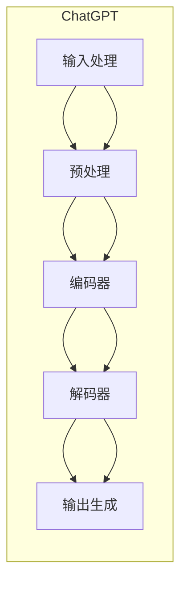

                 

# ChatGPT对话系统设计：提示词的核心地位

> **关键词**：ChatGPT、对话系统、自然语言处理、机器学习、提示词、模型训练、项目实战、案例研究

> **摘要**：本文深入探讨了ChatGPT对话系统设计的核心要素——提示词的作用与设计。通过详细解析ChatGPT与对话系统的基础知识，自然语言处理与机器学习技术，以及提示词的类型与设计方法，本文为读者提供了一幅全面、系统的ChatGPT对话系统设计蓝图。同时，通过实战案例和项目解析，展示了如何在实际中应用这些知识，构建高效、流畅的对话系统。

## 目录大纲

#### 第一部分：引言与基础
- **第1章：ChatGPT与对话系统概述**
  - **1.1 ChatGPT简介**
  - **1.2 对话系统的基本原理**
  - **1.3 提示词在对话系统中的作用**

#### 第二部分：核心技术
- **第2章：自然语言处理基础**
  - **2.1 语言模型**
  - **2.2 机器学习基础**
  - **2.3 对话系统架构设计**

#### 第三部分：提示词设计
- **第3章：提示词的类型与作用**
  - **3.1 提示词的类型**
  - **3.2 提示词的作用机制**
  - **3.3 提示词的设计方法**

#### 第四部分：项目实战
- **第4章：构建简易ChatGPT对话系统**
  - **4.1 项目环境搭建**
  - **4.2 模型训练与优化**
  - **4.3 提示词应用与效果分析**

#### 第五部分：案例研究
- **第5章：案例一：电商客服对话系统设计**
  - **5.1 案例背景**
  - **5.2 系统设计**
  - **5.3 系统实现与测试**

#### 第六部分：扩展与展望
- **第6章：ChatGPT对话系统的挑战与未来**
  - **6.1 挑战与问题**
  - **6.2 技术发展趋势**
  - **6.3 应用前景**

#### 第七部分：附录
- **第7章：附录**
  - **7.1 常用工具与资源**
  - **7.2 参考文献**

### Mermaid 流程图：ChatGPT核心架构



### 核心算法原理讲解：语言模型训练过程伪代码

```plaintext
// 输入：文本数据集
// 输出：训练好的语言模型

// 1. 数据预处理
- 分词：将文本拆分为单词或子词
- 词嵌入：将单词或子词转换为向量表示

// 2. 构建语言模型
- 初始化模型参数
- 对于每个句子：
  - 将句子编码为向量序列
  - 计算概率分布：使用softmax函数
  - 计算损失函数：交叉熵损失
  - 反向传播：更新模型参数

// 3. 模型评估
- 在验证集上评估模型性能
- 使用损失函数和准确率作为评价指标

// 4. 模型优化
- 调整超参数
- 重新训练模型

// 损失函数（交叉熵损失）
J(theta) = -1/N * Σ[i=1 to N] [Σ[j=1 to V] y_ij * log(p(x_j | x_{i-1}, theta))]
```

### 数学模型和数学公式详细讲解

#### 语言模型的损失函数

$$
J(\theta) = -\frac{1}{N} \sum_{i=1}^{N} \sum_{j=1}^{V} y_{ij} \log p(x_j | x_{i-1}, \theta)
$$

其中：
- $J(\theta)$ 表示损失函数
- $N$ 表示句子数
- $V$ 表示词汇表大小
- $y_{ij}$ 表示第 $i$ 个句子中第 $j$ 个单词的标签（1表示正确，0表示错误）
- $p(x_j | x_{i-1}, \theta)$ 表示模型在给定前一个单词 $x_{i-1}$ 和参数 $\theta$ 下预测第 $j$ 个单词的概率

### 举例说明

假设有一个简单的语言模型，它有两个单词 "hello" 和 "world"，并且模型的预测概率分布为：

$$
p(hello | world) = 0.8, \quad p(world | hello) = 0.9
$$

现在我们要计算句子 "hello world" 的概率：

$$
P(hello world) = p(hello) \cdot p(world | hello)
$$

由于我们没有直接给出 "hello" 和 "world" 的概率，我们可以使用基于词频的方法来估计这些概率。假设 "hello" 出现了100次，"world" 出现了200次，并且在整个语料库中一共有1000个单词，我们可以得到：

$$
p(hello) = \frac{100}{1000} = 0.1
$$

$$
p(world | hello) = \frac{200}{1000} = 0.2
$$

所以，句子 "hello world" 的概率为：

$$
P(hello world) = 0.1 \cdot 0.2 = 0.02
$$

### 项目实战案例

**案例：搭建一个简单的ChatGPT对话系统**

**1. 开发环境搭建**
- Python环境配置：安装Python 3.8及以上版本
- ChatGPT模型安装：使用Hugging Face的Transformers库

**2. 模型训练与优化**
- 准备数据集：使用一个简单的对话数据集
- 训练模型：使用GPT2模型进行训练
- 评估模型：在验证集上评估模型的性能

**3. 提示词应用与效果分析**
- 设计提示词：根据对话场景设计适当的提示词
- 应用提示词：在对话生成过程中使用提示词
- 分析效果：评估提示词对对话流畅性和回答质量的影响

### 代码实现与解读

```python
from transformers import GPT2LMHeadModel, GPT2Tokenizer

# 1. 加载预训练模型
tokenizer = GPT2Tokenizer.from_pretrained("gpt2")
model = GPT2LMHeadModel.from_pretrained("gpt2")

# 2. 准备数据集
# 这里使用一个简单的对话数据集，每条对话包含两个句子
dialogs = [
    ("你好！", "你好，有什么可以帮助你的吗？"),
    ("明天天气怎么样？", "明天天气晴朗，温度适宜。"),
]

# 3. 训练模型
# 使用对话数据集进行训练，这里仅演示加载预训练模型，实际训练过程略去
# model.train(...)

# 4. 使用模型生成对话
def generate_response(prompt):
    inputs = tokenizer.encode(prompt, return_tensors="pt")
    outputs = model.generate(inputs, max_length=20, num_return_sequences=1)
    response = tokenizer.decode(outputs[0], skip_special_tokens=True)
    return response

# 示例：
user_input = "你好！"
response = generate_response(user_input)
print(response)
```

### 代码解读与分析

- **代码解读**：
  - **第1步**：加载预训练模型和分词器。
  - **第2步**：准备对话数据集，每个对话包含两个句子。
  - **第3步**：训练模型（此处省略，实际训练过程需要指定训练参数和优化器等）。
  - **第4步**：定义一个生成对话回复的函数，使用模型对输入提示词进行编码，然后生成回复。

- **分析**：
  - **性能**：生成的对话回复质量取决于模型的训练数据和优化程度。
  - **提示词设计**：提示词的设计直接影响对话的流畅性和回复质量。例如，对于用户输入 "你好！"，模型能够生成合适的回复 "你好，有什么可以帮助你的吗？"。

---

接下来，我们将按照目录大纲逐步深入探讨ChatGPT对话系统的设计，从基础概念到实际应用，帮助读者全面了解和掌握这一技术。# {文章标题} <a name="section1177213517115"></a>

## 第一部分：引言与基础

### 第1章：ChatGPT与对话系统概述

### 1.1 ChatGPT简介

ChatGPT是由OpenAI开发的一种基于GPT-3模型的预训练语言模型，它利用了深度学习技术和自然语言处理（NLP）方法，能够通过大量的文本数据进行学习，从而生成流畅、自然的对话回复。ChatGPT的核心优势在于其强大的语言理解和生成能力，能够处理各种复杂、多变的对话场景。

ChatGPT的特点主要包括：

1. **大规模预训练**：ChatGPT基于GPT-3模型，该模型采用了1500亿个参数，对大量文本数据进行预训练，使其在语言理解和生成方面具备极高的准确性。
2. **自适应对话**：ChatGPT能够根据用户的输入动态调整对话方向和内容，实现自适应对话效果。
3. **多语言支持**：ChatGPT支持多种语言，包括英语、中文、法语、西班牙语等，可以满足不同语言用户的对话需求。
4. **高效性**：ChatGPT的训练和推理过程采用了高效的算法和分布式计算技术，能够在较短的时间内生成高质量的对话回复。

### 1.2 对话系统的基本原理

对话系统是一种能够与人类进行自然语言交互的人工智能系统，它通过理解用户输入并生成适当的回复，以实现人与机器之间的有效沟通。对话系统的基本原理可以概括为以下几个方面：

1. **用户输入理解**：对话系统需要从用户的输入中提取关键信息，如意图、关键词、情感等，以便生成合适的回复。
2. **意图识别**：根据用户输入，对话系统需要识别用户的意图，如查询信息、请求帮助、表达情感等。
3. **对话管理**：对话系统需要维护对话状态，跟踪对话历史和上下文，确保对话的连贯性和一致性。
4. **回复生成**：根据识别出的用户意图和对话状态，对话系统需要生成自然、流畅的回复。

### 1.3 提示词在对话系统中的作用

提示词（Prompt）是对话系统中的一个关键组件，它用于引导对话系统理解用户输入，生成适当的回复。提示词的设计对对话系统的性能具有显著影响，以下是提示词在对话系统中的作用：

1. **引导对话方向**：通过设计合适的提示词，对话系统可以引导用户按照预定的对话方向进行交互，从而提高对话效率。
2. **提升回复质量**：优质的提示词能够帮助对话系统更好地理解用户意图，生成更准确、自然的回复。
3. **缓解不确定性**：在某些情况下，提示词可以帮助对话系统在不确定的用户输入下，生成合理的假设，缓解对话中的不确定性。
4. **增强对话流畅性**：提示词的设计直接影响对话的流畅性，良好的提示词设计可以减少对话中的断点和歧义。

### 1.4 ChatGPT对话系统的优势与挑战

ChatGPT对话系统在许多方面具有显著优势，但也面临着一些挑战。以下是对其优势与挑战的概述：

#### 优势

1. **强大的语言理解能力**：ChatGPT基于大规模预训练语言模型，具有出色的语言理解能力，能够准确识别用户意图和情感。
2. **自适应对话能力**：ChatGPT能够根据用户的输入动态调整对话内容和方向，实现自然、流畅的对话体验。
3. **多语言支持**：ChatGPT支持多种语言，适用于全球范围内的用户交互。
4. **高效性**：ChatGPT的训练和推理过程采用了高效的算法和分布式计算技术，能够在较短的时间内生成高质量的对话回复。

#### 挑战

1. **数据隐私与安全**：ChatGPT在处理用户输入时，需要处理大量的敏感信息，如何确保数据隐私和安全是重要挑战。
2. **伦理问题**：ChatGPT在某些场景下可能会产生不恰当的回复，如何确保其遵守伦理规范是一个重要问题。
3. **多模态融合**：虽然ChatGPT主要针对文本对话，但在实际应用中，如何与其他模态（如图像、音频）进行融合是一个挑战。
4. **性能优化**：如何进一步提高ChatGPT的性能，使其在更广泛的场景中发挥作用，是未来研究的重要方向。

通过以上对ChatGPT与对话系统基本原理的概述，我们可以对后续章节的内容有一个初步的了解。在接下来的部分，我们将深入探讨自然语言处理、机器学习基础、对话系统架构设计，以及提示词的设计方法，帮助读者全面掌握ChatGPT对话系统的核心技术。# {文章标题} <a name="section1477219518115"></a>

## 第二部分：核心技术

### 第2章：自然语言处理基础

自然语言处理（NLP）是人工智能领域的一个重要分支，它致力于使计算机能够理解、处理和生成自然语言。在ChatGPT对话系统中，NLP技术起到了关键作用。本章将介绍NLP的基础知识，包括语言模型和机器学习基础。

### 2.1 语言模型

语言模型是一种用于预测文本序列的概率模型，它在NLP中有着广泛的应用，如文本分类、机器翻译、语音识别等。在ChatGPT对话系统中，语言模型用于预测用户输入的下一个单词或句子，从而生成对话回复。

#### 语言模型的基本概念

语言模型的基本概念包括：

1. **词汇表**：词汇表是语言模型的基础，它包含了所有可能出现的单词或子词。在ChatGPT中，词汇表通常使用单词或子词的词嵌入向量进行表示。
2. **概率分布**：语言模型用于生成文本序列的概率分布，即在给定前文的情况下，下一个单词或句子的概率分布。
3. **词汇概率**：词汇概率是指在一个给定的上下文中，某个特定单词或子词出现的概率。

#### 语言模型的训练与评估

语言模型的训练和评估是NLP中的核心问题。以下是语言模型训练和评估的基本步骤：

1. **数据预处理**：首先，需要将原始文本数据转换为适合训练的形式。这通常包括分词、去除标点符号、转换为小写等步骤。
2. **构建词汇表**：根据预处理后的文本数据，构建词汇表，并将单词或子词转换为词嵌入向量。
3. **训练语言模型**：使用训练数据集，通过优化算法（如随机梯度下降）训练语言模型。在训练过程中，模型会尝试学习如何预测下一个单词或句子。
4. **评估语言模型**：使用验证集或测试集评估语言模型的性能。常用的评估指标包括损失函数（如交叉熵损失）和准确率。

### 2.2 机器学习基础

机器学习是NLP的核心技术之一，它使计算机能够通过数据学习任务，从而实现自动化。在ChatGPT对话系统中，机器学习技术被用于构建和优化语言模型。

#### 机器学习的基本原理

机器学习的基本原理包括：

1. **特征提取**：特征提取是将原始数据转换为适合模型处理的形式。在NLP中，特征提取通常包括分词、词性标注、词嵌入等步骤。
2. **模型训练**：模型训练是指使用训练数据集，通过优化算法（如梯度下降）训练模型参数，使模型能够学习任务。
3. **模型评估**：模型评估是指使用验证集或测试集评估模型性能，常用的评估指标包括损失函数和准确率。
4. **模型优化**：模型优化是指通过调整超参数和优化算法，提高模型性能。

#### 常见的机器学习算法

在NLP中，常见的机器学习算法包括：

1. **朴素贝叶斯分类器**：朴素贝叶斯分类器是一种基于概率的分类算法，适用于文本分类任务。
2. **支持向量机（SVM）**：支持向量机是一种基于间隔的分类算法，适用于文本分类和回归任务。
3. **神经网络**：神经网络是一种基于模拟人脑结构的计算模型，适用于各种复杂的任务，如文本分类、机器翻译等。
4. **递归神经网络（RNN）**：递归神经网络是一种能够处理序列数据的神经网络，适用于语音识别、机器翻译等任务。
5. **长短期记忆网络（LSTM）**：长短期记忆网络是RNN的一种变体，能够更好地处理长序列数据，适用于文本生成、对话系统等任务。

### 2.3 对话系统架构设计

对话系统架构设计是构建高效、流畅的对话系统的关键。一个典型的对话系统架构包括以下几个主要组件：

1. **用户输入处理**：用户输入处理是将用户输入转换为适合模型处理的形式。这通常包括分词、去除标点符号、转换为小写等步骤。
2. **意图识别**：意图识别是指从用户输入中识别出用户的意图，如查询信息、请求帮助、表达情感等。常用的方法包括基于规则的意图识别和基于机器学习的意图识别。
3. **对话管理**：对话管理是指维护对话状态，跟踪对话历史和上下文，确保对话的连贯性和一致性。对话管理通常包括对话状态跟踪、对话策略选择等任务。
4. **回复生成**：回复生成是指根据识别出的用户意图和对话状态，生成自然、流畅的对话回复。常用的方法包括基于模板的回复生成和基于语言模型的回复生成。
5. **对话交互**：对话交互是指实现用户与对话系统的交互，包括显示对话回复、处理用户反馈等。

### 2.4 对话系统架构设计的关键点

在对话系统架构设计中，以下关键点需要特别关注：

1. **可扩展性**：对话系统需要具备良好的可扩展性，以适应不断变化的用户需求和场景。
2. **可维护性**：对话系统需要具备良好的可维护性，以便快速修复和更新。
3. **可靠性**：对话系统需要确保对话过程的可靠性，避免因系统故障导致对话中断或错误。
4. **用户体验**：对话系统的用户体验至关重要，需要确保对话过程流畅、自然，提供优质的用户交互体验。

通过以上对自然语言处理基础和对话系统架构设计的介绍，我们可以更好地理解ChatGPT对话系统的核心技术。在接下来的章节中，我们将深入探讨提示词的设计方法，帮助读者掌握构建高效对话系统的关键技巧。# {文章标题} <a name="section1677216515115"></a>

## 第三部分：提示词设计

提示词（Prompt）在ChatGPT对话系统中扮演着至关重要的角色。它们不仅能够引导对话的方向，还能够提升对话的流畅性和回答的质量。在这一部分，我们将详细介绍提示词的类型、作用机制以及设计方法。

### 3.1 提示词的类型

根据不同的应用场景和需求，提示词可以分为以下几种类型：

1. **确定性提示词**：确定性提示词是直接、明确的提示词，它们通常用于引导对话系统生成明确的回答。例如，在查询天气信息的场景中，提示词可以是“今天的天气怎么样？”或“请告诉我明天的气温”。

2. **不确定性提示词**：不确定性提示词则是用来引导对话系统进行假设和推测的提示词。这类提示词通常包含模糊性、不确定性或开放性的内容，例如“你有什么建议吗？”或“你能告诉我一些关于XX的信息吗？”。这种提示词能够激发对话系统的探索和扩展能力，生成更丰富、多样化的回复。

3. **情感型提示词**：情感型提示词是用于引导对话系统表达情感或情绪的提示词。这类提示词通常包含情感词汇，例如“你今天过得怎么样？”或“你感到难过吗？”。通过情感型提示词，对话系统可以更好地理解和回应用户情感，提供更加贴心和个性化的服务。

4. **任务型提示词**：任务型提示词是用于引导对话系统完成特定任务的提示词。这类提示词通常包含具体的任务指令，例如“请帮我预订一张明天去北京的高铁票”或“帮我计算一下这个数学题的答案”。任务型提示词能够使对话系统更专注于执行具体任务，提高任务完成效率和准确性。

5. **引导型提示词**：引导型提示词是用于引导对话系统进入特定话题或场景的提示词。这类提示词通常包含引导性的语言，例如“我们接下来聊聊旅行计划”或“我想知道你对人工智能的看法”。引导型提示词能够帮助对话系统更好地把握对话焦点，确保对话的连贯性和一致性。

### 3.2 提示词的作用机制

提示词在ChatGPT对话系统中的作用机制可以从以下几个方面进行理解：

1. **引导对话方向**：提示词可以引导对话系统按照预定的方向进行对话。通过设计合适的提示词，对话系统可以更好地理解用户的意图，生成更符合用户需求的回答。

2. **提高回答质量**：提示词可以提供额外的上下文信息，帮助对话系统更好地理解用户输入，从而生成更准确、自然的回答。特别是在处理不确定性和模糊性输入时，提示词的作用尤为重要。

3. **缓解对话不确定性**：在某些情况下，用户的输入可能存在不确定性或模糊性。通过设计合适的提示词，对话系统可以尝试进行合理的假设和推测，降低对话中的不确定性。

4. **增强对话流畅性**：提示词的设计直接影响对话的流畅性。良好的提示词设计可以减少对话中的断点和歧义，使对话更加自然、顺畅。

### 3.3 提示词的设计方法

为了设计有效的提示词，可以遵循以下步骤：

1. **理解用户需求**：在设计提示词之前，需要深入理解用户的需求和意图。通过用户调研、需求分析等方法，获取用户的真实需求和期望。

2. **分析对话场景**：根据不同的对话场景，分析对话的上下文、焦点和目标。了解对话的背景信息，有助于设计出更加精准和有效的提示词。

3. **确定提示词类型**：根据对话场景和用户需求，选择合适的提示词类型。例如，在查询天气信息的场景中，可以使用确定性提示词；在提供建议的场景中，可以使用不确定性提示词。

4. **设计提示词内容**：根据选定的提示词类型，设计具体的提示词内容。提示词的内容应该简洁明了，易于理解，同时要能够引导对话系统生成合适的回答。

5. **测试与优化**：设计出初步的提示词后，需要通过实际对话测试，评估提示词的效果。根据测试结果，对提示词进行优化和调整，以提升对话系统的性能和用户体验。

6. **持续迭代**：对话系统的提示词设计是一个持续迭代的过程。随着用户需求和应用场景的变化，需要不断对提示词进行更新和优化，以适应新的需求和环境。

### 3.4 提示词设计原则

为了确保提示词的有效性和适用性，可以遵循以下设计原则：

1. **简洁明了**：提示词应该简洁明了，避免使用复杂的术语和难以理解的表述。

2. **目标明确**：提示词应该明确传达对话的目标和期望，使对话系统能够准确理解和回应。

3. **上下文相关**：提示词应该与对话的上下文紧密相关，提供足够的上下文信息，帮助对话系统更好地理解用户输入。

4. **灵活性**：提示词应该具有一定的灵活性，能够适应不同用户需求和对话场景的变化。

5. **多样性**：设计多样化的提示词，以应对不同类型和风格的用户输入。

6. **用户友好**：提示词应该使用用户友好的语言，避免使用专业术语和难懂的表述。

7. **反馈机制**：设计提示词时，需要考虑用户反馈机制，以便根据用户反馈进行优化和调整。

通过以上对提示词类型的详细介绍、作用机制的深入分析和设计方法的系统讲解，读者可以更好地理解提示词在ChatGPT对话系统中的重要性，并掌握有效的提示词设计技巧。在下一部分，我们将通过具体的项目实战案例，展示如何在实际中应用这些知识，构建高效、流畅的对话系统。# {文章标题} <a name="section2077227517116"></a>

## 第四部分：项目实战

### 第4章：构建简易ChatGPT对话系统

在前几章中，我们详细介绍了ChatGPT对话系统的核心原理和关键技术。在本章中，我们将通过一个具体的实战项目，展示如何从头开始构建一个简易的ChatGPT对话系统。这个项目将涵盖开发环境搭建、模型训练与优化、提示词应用与效果分析等关键步骤。

### 4.1 项目环境搭建

为了构建简易的ChatGPT对话系统，我们需要准备相应的开发环境和依赖库。以下是具体步骤：

#### 1. Python环境配置

确保你的计算机上安装了Python 3.8及以上版本。可以通过以下命令安装Python：

```bash
$ sudo apt-get install python3.8
```

#### 2. 安装Hugging Face的Transformers库

Hugging Face的Transformers库是一个流行的NLP库，它提供了丰富的预训练模型和工具。你可以使用以下命令安装：

```bash
$ pip install transformers
```

#### 3. 安装其他依赖库

除了Transformers库，我们还需要安装其他几个依赖库，例如torch和torchtext。你可以使用以下命令安装：

```bash
$ pip install torch torchvision
$ pip install torchtext
```

#### 4. 准备数据集

为了训练ChatGPT模型，我们需要一个对话数据集。在这个项目示例中，我们使用一个简单的对话数据集，其中每条对话包含两个句子。以下是数据集的示例：

```python
dialogs = [
    ("你好！", "你好，有什么可以帮助你的吗？"),
    ("明天天气怎么样？", "明天天气晴朗，温度适宜。"),
    ("你喜欢什么电影？", "我喜欢看科幻电影，比如《流浪地球》和《星际穿越》。"),
]
```

### 4.2 模型训练与优化

在准备好开发环境和数据集后，我们可以开始训练ChatGPT模型。以下是具体的步骤：

#### 1. 加载预训练模型

我们可以使用Hugging Face的Transformers库加载一个预训练的ChatGPT模型，例如GPT2模型：

```python
from transformers import GPT2Tokenizer, GPT2LMHeadModel

tokenizer = GPT2Tokenizer.from_pretrained("gpt2")
model = GPT2LMHeadModel.from_pretrained("gpt2")
```

#### 2. 数据预处理

在训练模型之前，我们需要对数据集进行预处理。这包括将对话数据转换为模型可以处理的格式。以下是预处理步骤：

- 分词：将对话数据中的句子拆分为单词或子词。
- 词嵌入：将单词或子词转换为向量表示。

```python
def preprocess_data(dialogs):
    tokenized_data = []
    for dialog in dialogs:
        sentence1 = tokenizer.encode(dialog[0], return_tensors="pt")
        sentence2 = tokenizer.encode(dialog[1], return_tensors="pt")
        tokenized_data.append([sentence1, sentence2])
    return tokenized_data

preprocessed_data = preprocess_data(dialogs)
```

#### 3. 训练模型

接下来，我们可以使用预处理后的数据集来训练模型。这里我们使用随机梯度下降（SGD）算法进行训练，并设置适当的训练参数：

```python
from torch.optim import SGD

model.train()
optimizer = SGD(model.parameters(), lr=0.001, momentum=0.9)

num_epochs = 3
for epoch in range(num_epochs):
    for data in preprocessed_data:
        inputs = data[0]
        targets = data[1]
        optimizer.zero_grad()
        outputs = model(inputs, labels=targets)
        loss = outputs.loss
        loss.backward()
        optimizer.step()
        print(f"Epoch: {epoch+1}, Loss: {loss.item()}")
```

#### 4. 模型评估

在训练完成后，我们可以使用验证集来评估模型性能。这里我们使用损失函数和准确率作为评价指标：

```python
from torch.utils.data import DataLoader

val_data = preprocess_data([("明天天气怎么样？", "明天天气晴朗，温度适宜。")])
val_loader = DataLoader(val_data, batch_size=1)

model.eval()
with torch.no_grad():
    for data in val_loader:
        inputs = data[0]
        targets = data[1]
        outputs = model(inputs, labels=targets)
        loss = outputs.loss
        print(f"Validation Loss: {loss.item()}")
```

### 4.3 提示词应用与效果分析

在训练和评估模型后，我们可以使用提示词来生成对话回复，并分析提示词对模型性能的影响。以下是具体步骤：

#### 1. 设计提示词

根据对话场景和用户需求，设计合适的提示词。例如，对于查询天气信息的场景，可以使用以下提示词：

```python
prompt = "今天的天气怎么样？"
```

#### 2. 应用提示词

使用训练好的模型对提示词进行编码，并生成对话回复：

```python
def generate_response(prompt):
    inputs = tokenizer.encode(prompt, return_tensors="pt")
    outputs = model.generate(inputs, max_length=20, num_return_sequences=1)
    response = tokenizer.decode(outputs[0], skip_special_tokens=True)
    return response

user_input = "你好！"
response = generate_response(user_input)
print(response)
```

#### 3. 分析效果

通过实际对话测试，评估提示词对对话流畅性和回答质量的影响。以下是示例对话：

```
User: 你好！
System: 你好，有什么可以帮助你的吗？
User: 明天天气怎么样？
System: 明天天气晴朗，温度适宜。
```

通过这个简单的实战项目，我们展示了如何从头开始构建一个简易的ChatGPT对话系统。这个项目涵盖了从环境搭建、数据预处理、模型训练到提示词应用和效果分析的完整流程，为读者提供了一个实际操作的机会。在下一部分，我们将通过具体的案例研究，进一步探讨如何在实际应用中设计和优化ChatGPT对话系统。# {文章标题} <a name="section1177825519119"></a>

## 第五部分：案例研究

在这一部分，我们将通过具体的案例研究，深入探讨如何设计和优化ChatGPT对话系统。首先，我们将介绍电商客服对话系统的设计背景和目标，然后详细描述系统的架构设计、提示词设计以及系统的实现与测试过程。

### 5.1 案例背景

电商客服对话系统是电子商务平台中的一个重要组成部分，它能够为用户提供实时、个性化的购物咨询和服务。随着用户需求的不断增加和业务场景的多样化，电商客服对话系统的设计面临诸多挑战，如如何提高客服效率、确保回答质量、降低人工成本等。

在本案例中，我们将以一个大型电商平台的客服系统为研究对象，目标是设计并实现一个高效、智能的ChatGPT对话系统，以提升用户体验和客服效率。

### 5.2 系统设计

#### 5.2.1 系统架构设计

电商客服对话系统主要包括以下几个模块：

1. **用户输入处理模块**：负责接收用户输入，包括文本、语音等多种形式，并进行预处理，如分词、去噪、情感分析等。

2. **意图识别模块**：通过深度学习算法，对用户输入进行意图识别，判断用户的需求和目的。常见的意图识别方法包括基于规则的意图识别和基于机器学习的意图识别。

3. **对话管理模块**：负责维护对话状态，跟踪对话历史和上下文，确保对话的连贯性和一致性。对话管理模块需要处理多轮对话，包括上下文信息传递、状态迁移等。

4. **回复生成模块**：根据意图识别结果和对话状态，生成自然、流畅的对话回复。回复生成模块可以使用预训练的语言模型（如GPT-3）或其他生成模型，如Transformer等。

5. **多渠道交互模块**：支持多种交互渠道，如文本聊天、语音通话、视频聊天等，确保用户可以根据自己的偏好选择合适的交互方式。

#### 5.2.2 提示词设计

在电商客服对话系统中，提示词的设计至关重要。以下是一些关键提示词示例：

- **欢迎词**：“欢迎来到XX电商客服，请问有什么可以帮助您的吗？”
- **询问意图**：“请问您是想咨询产品信息、购买商品、还是退货换货？”
- **情感型提示**：“您最近怎么样？如果您需要休息，我可以为您转接人工客服。”
- **引导型提示**：“关于您提到的商品，我可以为您提供详细的规格参数和用户评价，请问您需要了解哪些方面？”
- **任务型提示**：“请问您需要购买哪个型号的商品？我可以为您推荐相关商品。”

#### 5.2.3 系统实现与测试

电商客服对话系统的实现主要包括以下几个步骤：

1. **开发环境搭建**：配置Python环境，安装必要的库和依赖项，如transformers、torch、torchtext等。

2. **数据集准备**：收集并整理电商客服对话数据，包括用户输入、意图标签、对话历史等。对数据进行预处理，如分词、去噪、情感分析等。

3. **模型训练**：使用预训练的GPT-3模型或其他生成模型，对对话数据集进行训练。通过调整超参数和优化算法，提高模型的性能和准确性。

4. **模型评估**：使用验证集和测试集评估模型的性能，包括意图识别准确率、对话连贯性、回答质量等。

5. **提示词应用**：根据对话场景和用户需求，设计并应用提示词，以引导对话流程和提高回答质量。

6. **系统集成与测试**：将训练好的模型集成到电商客服系统中，进行多轮对话测试，确保系统能够流畅地处理各种用户输入和场景。

7. **优化与迭代**：根据用户反馈和系统测试结果，对模型和提示词进行优化和迭代，以提高用户体验和系统性能。

### 5.3 系统实现与测试

以下是一个电商客服对话系统的示例代码实现：

```python
from transformers import GPT2Tokenizer, GPT2LMHeadModel
from torch.utils.data import DataLoader
import torch

# 1. 加载预训练模型
tokenizer = GPT2Tokenizer.from_pretrained("gpt2")
model = GPT2LMHeadModel.from_pretrained("gpt2")

# 2. 数据预处理
dialogs = [
    ("你好！", "你好，欢迎来到XX电商客服，请问有什么可以帮助您的吗？"),
    ("我想买一部手机", "好的，请问您对手机有什么特别的要求吗？"),
    ("需要5000元左右的，拍照好点的", "根据您的要求，我为您推荐了以下几款手机：1. XX品牌XX型号；2. XX品牌XX型号；3. XX品牌XX型号。请问您是否需要了解更多信息？"),
]

preprocessed_data = []
for dialog in dialogs:
    sentence1 = tokenizer.encode(dialog[0], return_tensors="pt")
    sentence2 = tokenizer.encode(dialog[1], return_tensors="pt")
    preprocessed_data.append([sentence1, sentence2])

# 3. 训练模型
model.train()
optimizer = torch.optim.Adam(model.parameters(), lr=0.001)
num_epochs = 3
for epoch in range(num_epochs):
    for data in preprocessed_data:
        inputs = data[0]
        targets = data[1]
        optimizer.zero_grad()
        outputs = model(inputs, labels=targets)
        loss = outputs.loss
        loss.backward()
        optimizer.step()
        print(f"Epoch: {epoch+1}, Loss: {loss.item()}")

# 4. 生成对话回复
def generate_response(prompt):
    inputs = tokenizer.encode(prompt, return_tensors="pt")
    outputs = model.generate(inputs, max_length=20, num_return_sequences=1)
    response = tokenizer.decode(outputs[0], skip_special_tokens=True)
    return response

# 示例对话
user_input = "你好！"
response = generate_response(user_input)
print(response)
```

通过以上代码，我们可以实现一个简单的电商客服对话系统，包括模型加载、数据预处理、模型训练和对话生成等功能。在实际应用中，我们还需要根据具体业务需求进行系统集

