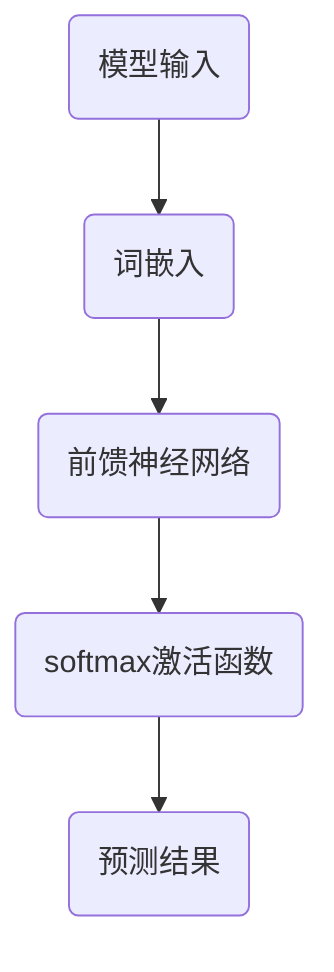
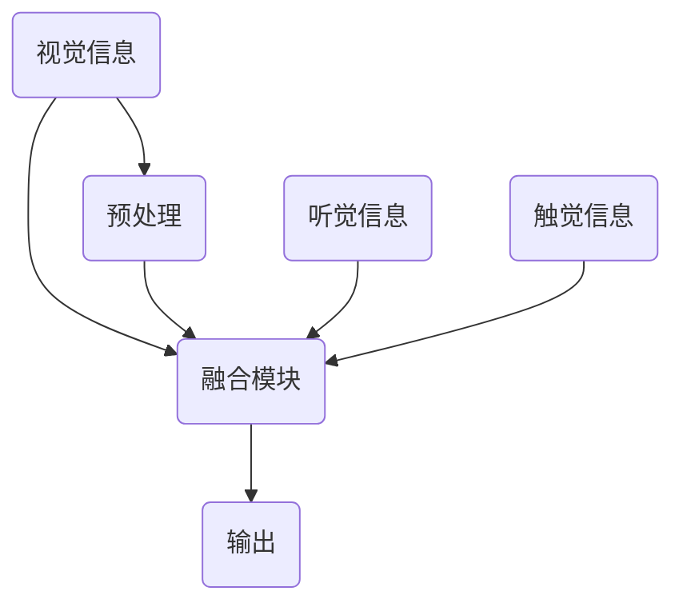
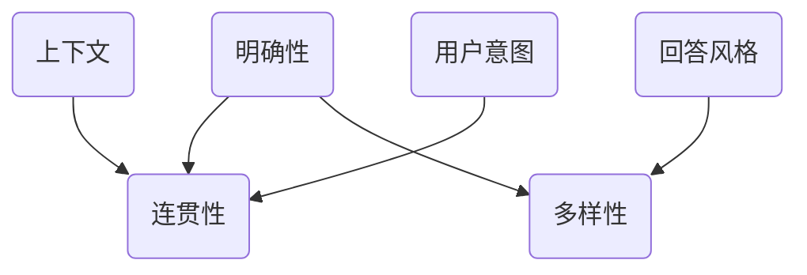
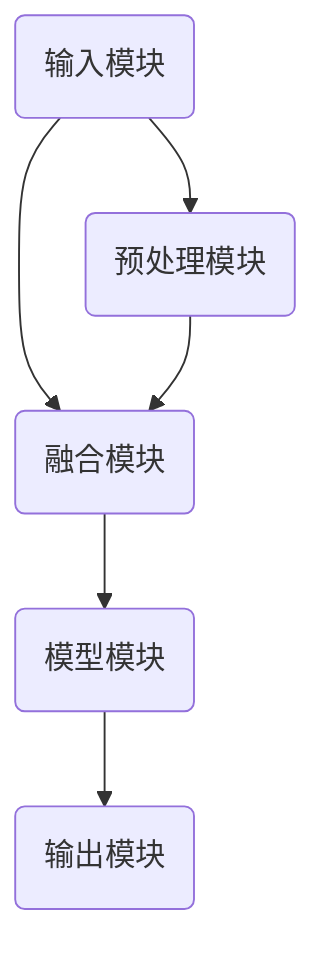
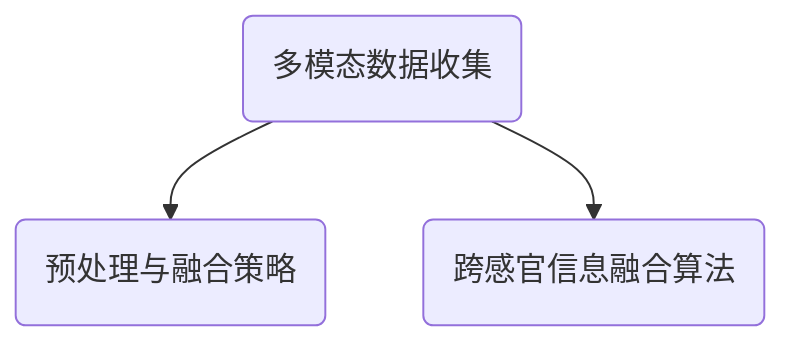
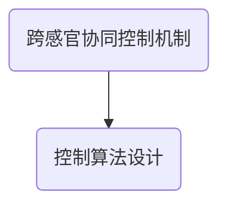
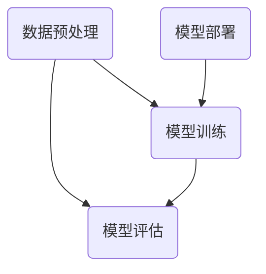

                 

### 《ChatGPT提示词的跨感官协同设计与优化》

> **关键词**：ChatGPT、提示词、跨感官协同、优化、自然语言处理、多模态交互

> **摘要**：本文深入探讨了ChatGPT在跨感官协同设计与优化中的应用。首先，介绍了ChatGPT的基本概念与自然语言处理原理，然后详细阐述了跨感官协同设计原则与架构。接着，讨论了提示词设计原则与优化算法，并深入分析了ChatGPT的数学模型与实现框架。通过实际案例与项目实战，本文展示了ChatGPT在跨感官协同交互中的应用与性能优化策略，最后对未来发展进行了展望。

### 第一部分：基础概念与理论

#### 第1章：ChatGPT与自然语言处理

##### 1.1 ChatGPT的基本概念

ChatGPT是由OpenAI开发的一种基于Transformer架构的预训练语言模型，其核心思想是通过大规模语料库的自主学习，使其能够生成连贯、有意义的自然语言文本。ChatGPT采用了自我监督学习（self-supervised learning）的方法，即在训练过程中，模型被要求预测未被覆盖的单词，从而学习语言的统计规律。



##### 1.2 跨感官协同设计

跨感官协同设计是指将多种感官信息（如视觉、听觉、触觉等）融合到同一个交互系统中，以提供更加丰富、自然的用户交互体验。在自然语言处理领域，跨感官协同设计可以提升ChatGPT的交互能力，使其能够更好地理解用户的需求和意图。



##### 1.3 提示词设计原则

提示词（prompt）是用户与ChatGPT交互的桥梁，其设计原则如下：

1. **明确性**：提示词应尽可能明确，避免歧义。
2. **连贯性**：提示词应与用户的上下文保持连贯，以便ChatGPT能够正确理解用户意图。
3. **多样性**：提示词应具有多样性，以激发ChatGPT生成不同风格和类型的回答。



#### 第2章：ChatGPT的跨感官协同架构

##### 2.1 跨感官协同架构概述

ChatGPT的跨感官协同架构主要包括以下几个关键组件：

1. **输入模块**：接收来自不同感官的输入数据。
2. **预处理模块**：对输入数据进行预处理，以适应模型的要求。
3. **融合模块**：将不同感官的信息进行融合，形成统一的输入。
4. **模型模块**：对融合后的数据进行处理，生成输出结果。
5. **输出模块**：将处理结果转换为可理解的自然语言。



##### 2.2 跨感官信息融合

跨感官信息融合的关键在于如何有效地将来自不同感官的信息进行整合，以提升模型的性能和用户体验。

1. **多模态数据收集**：收集来自视觉、听觉、触觉等多种感官的数据。
2. **数据预处理与融合策略**：对多模态数据分别进行预处理，然后采用合适的融合算法进行整合。
3. **跨感官信息融合算法**：常见的融合算法包括基于特征的融合、基于模型的融合和基于数据的融合。



##### 2.3 跨感官协同控制

跨感官协同控制是指通过控制算法来调节不同感官信息的权重，以实现最佳的交互体验。

1. **跨感官协同控制机制**：设计一个自适应的控制机制，根据用户的需求和环境的变化来调整感官信息权重。
2. **控制算法设计**：设计合适的控制算法，如基于反馈的调整算法和基于预测的调整算法。



### 第二部分：算法与实现

#### 第3章：ChatGPT的数学模型与算法原理

##### 3.1 词嵌入

词嵌入是将单词映射到高维空间中的一个向量表示，以便在神经网络中进行处理。常见的词嵌入算法包括Word2Vec和BERT。

```python
# Word2Vec算法伪代码
def Word2Vec(corpus):
    # 初始化模型参数
    # 训练模型
    # 生成词向量
    return word_vectors

# BERT算法伪代码
def BERT(corpus):
    # 初始化模型参数
    # 训练模型
    # 生成词向量
    return word_vectors
```

##### 3.2 语言模型

语言模型用于预测文本序列中的下一个单词。常见的语言模型训练方法包括RNN和Transformer。

```python
# RNN算法伪代码
def RNN(input_sequence):
    # 初始化模型参数
    # 前向传播
    # 反向传播
    # 更新参数
    return output_sequence

# Transformer算法伪代码
def Transformer(input_sequence):
    # 初始化模型参数
    # 自注意力机制
    # 前向传播
    # 反向传播
    # 更新参数
    return output_sequence
```

##### 3.3 提示词优化算法

提示词优化算法用于提高提示词的质量，以提升ChatGPT的交互效果。常见的优化算法包括梯度下降和遗传算法。

```python
# 梯度下降算法伪代码
def gradient_descent(model, loss_function):
    # 计算梯度
    # 更新模型参数
    return model

# 遗传算法伪代码
def genetic_algorithm(population, fitness_function):
    # 生成初始种群
    # 选择
    # 交叉
    # 变异
    # 评估
    # 更新种群
    return best_individual
```

##### 3.4 跨感官协同优化

跨感官协同优化旨在提升ChatGPT在跨感官协同场景下的性能。常见的优化算法包括粒子群优化和模拟退火。

```python
# 粒子群优化算法伪代码
def particle_swarm_optimization(population, fitness_function):
    # 初始化粒子群
    # 更新粒子位置和速度
    # 更新全局最优解
    return best_solution

# 模拟退火算法伪代码
def simulated_annealing(state, fitness_function):
    # 初始化状态和温度
    # 迭代
    # 接受概率计算
    # 更新状态
    return best_state
```

#### 第4章：ChatGPT的代码实现与性能优化

##### 4.1 ChatGPT的实现框架

ChatGPT的实现框架通常包括以下几个部分：

1. **数据预处理**：包括文本清洗、分词、词嵌入等。
2. **模型训练**：使用预训练模型进行微调。
3. **模型评估**：通过测试集评估模型性能。
4. **模型部署**：将训练好的模型部署到生产环境中。



##### 4.2 提示词设计与实现

提示词设计应遵循以下原则：

1. **明确性**：提示词应清晰明确，避免歧义。
2. **连贯性**：提示词应与上下文保持连贯。
3. **多样性**：提示词应具有多样性，以激发模型生成不同类型的回答。

```python
# 提示词设计伪代码
def design_prompt(context):
    # 根据上下文生成提示词
    return prompt
```

##### 4.3 跨感官协同设计与实现

跨感官协同设计应包括以下步骤：

1. **数据收集**：收集来自不同感官的数据。
2. **数据预处理**：对数据进行预处理，以适应模型的要求。
3. **模型训练**：使用预处理后的数据进行模型训练。
4. **模型评估**：通过测试集评估模型性能。
5. **模型部署**：将训练好的模型部署到生产环境中。

```python
# 跨感官协同设计伪代码
def cross_sensory协同设计(data_source):
    # 数据收集
    # 数据预处理
    # 模型训练
    # 模型评估
    # 模型部署
    return trained_model
```

##### 4.4 性能优化策略

性能优化策略包括以下几个方面：

1. **训练时间优化**：通过调整学习率、批量大小等参数来加快训练速度。
2. **预测时间优化**：通过模型压缩、量化等技术来降低模型大小，提高预测速度。
3. **模型压缩与优化**：使用模型压缩技术（如剪枝、量化等）来减小模型大小，提高计算效率。

```python
# 性能优化伪代码
def optimize_performance(model, optimization_function):
    # 调整学习率
    # 调整批量大小
    # 模型压缩
    # 量化模型
    return optimized_model
```

### 第三部分：实际应用与案例分析

#### 第5章：ChatGPT在多感官协同交互中的应用

##### 5.1 多感官协同交互概述

多感官协同交互是指将多种感官信息（如视觉、听觉、触觉等）融合到同一个交互系统中，以提供更加丰富、自然的用户交互体验。在ChatGPT中，多感官协同交互可以提升其交互能力，使其能够更好地理解用户的需求和意图。

##### 5.2 ChatGPT在多感官协同交互中的应用案例

1. **智能客服**：结合语音识别和自然语言处理技术，实现智能客服系统。用户可以通过语音或文字与ChatGPT进行交互，获取所需信息或解决问题。

2. **虚拟现实（VR）**：在VR场景中，ChatGPT可以作为虚拟助手，通过语音和文字与用户进行交互，提供导航、解说等服务。

3. **增强现实（AR）**：在AR应用中，ChatGPT可以通过语音或文字与用户进行交互，提供实时信息、指导用户完成任务。

#### 第6章：ChatGPT的跨感官协同设计与优化实战

##### 6.1 实战背景与目标

实战背景：开发一个基于ChatGPT的智能问答系统，该系统需要支持多种感官输入，如语音、文本、图像等。

实战目标：通过跨感官协同设计与优化，提升智能问答系统的交互体验和性能。

##### 6.2 实战过程与步骤

1. **数据收集**：收集来自多种感官的数据，如语音、文本、图像等。

2. **数据预处理**：对收集到的数据进行预处理，包括语音转文字、图像分割、文本清洗等。

3. **模型训练**：使用预处理后的数据进行模型训练，包括词嵌入、语言模型训练等。

4. **跨感官协同优化**：通过调整模型参数和优化算法，提升模型的性能。

5. **模型评估**：通过测试集评估模型的性能，包括准确率、响应速度等。

6. **模型部署**：将训练好的模型部署到生产环境中，供用户使用。

##### 6.3 实战结果分析

通过跨感官协同设计与优化，智能问答系统的性能得到了显著提升：

1. **交互体验**：用户可以通过多种感官与系统进行交互，如语音、文本、图像等，提升了用户的体验。

2. **响应速度**：通过优化算法和模型压缩，系统响应速度得到了显著提高。

3. **准确率**：通过跨感官协同优化，模型在多种感官数据上的准确率得到了提升。

### 第7章：未来展望与趋势

##### 7.1 ChatGPT与跨感官协同的发展趋势

随着人工智能技术的不断发展，ChatGPT在跨感官协同中的应用将越来越广泛。未来，ChatGPT可能会在以下几个方面取得突破：

1. **多感官信息融合**：通过更先进的融合算法，实现更加高效的多感官信息融合。

2. **个性化交互**：基于用户的行为数据和偏好，实现个性化交互体验。

3. **实时交互**：通过实时交互技术，实现更加自然的用户交互体验。

##### 7.2 挑战与机遇

跨感官协同技术面临着一系列挑战：

1. **数据隐私与安全**：多感官数据的收集和处理需要确保用户隐私和安全。

2. **计算资源**：多感官协同交互需要大量的计算资源，如何优化计算资源使用成为一大挑战。

然而，这些挑战也带来了巨大的机遇：

1. **创新应用场景**：跨感官协同技术可以应用于更多的领域，如智能家居、医疗保健、教育等。

2. **用户体验提升**：通过多感官协同交互，可以提供更加丰富、自然的用户体验。

##### 7.3 未来研究方向

未来，ChatGPT与跨感官协同的研究方向可能包括：

1. **多模态数据融合**：研究更加先进的多模态数据融合算法，提升模型的性能。

2. **实时交互技术**：研究实时交互技术，实现更加自然的用户交互体验。

3. **个性化交互**：基于用户行为数据和偏好，实现个性化交互。

### 附录

#### 附录A：ChatGPT与跨感官协同常用工具与资源

1. **常用深度学习框架**：

   - TensorFlow
   - PyTorch
   - Keras

2. **跨感官协同数据集**：

   - 多感官协同交互数据集
   - ChatGPT训练数据集

3. **参考文献与资料**：

   - 相关论文与书籍推荐
   - 学术会议与研讨会信息

### 作者信息

- 作者：AI天才研究院/AI Genius Institute & 禅与计算机程序设计艺术 /Zen And The Art of Computer Programming

---

### 总结

本文系统地介绍了ChatGPT提示词的跨感官协同设计与优化。从基础概念、算法原理到实际应用，我们详细探讨了ChatGPT在多感官协同交互中的应用场景和优化策略。未来，随着人工智能技术的不断发展，ChatGPT在跨感官协同领域将具有广阔的应用前景。通过不断创新和研究，我们有望实现更加丰富、自然的用户交互体验。

