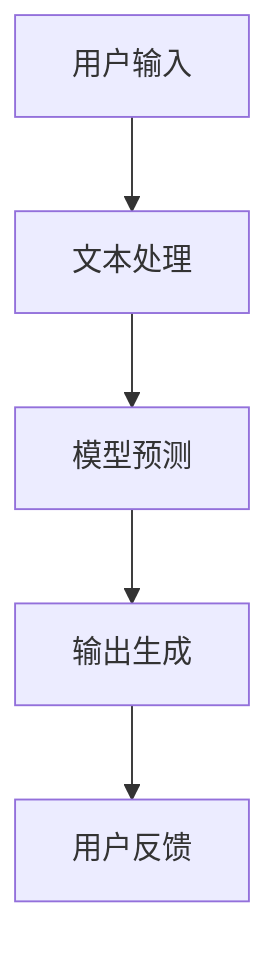
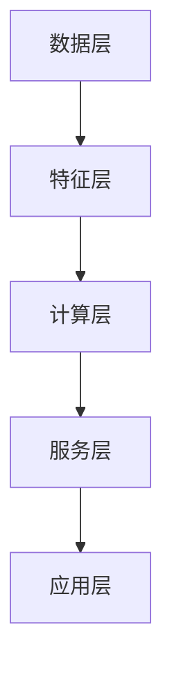
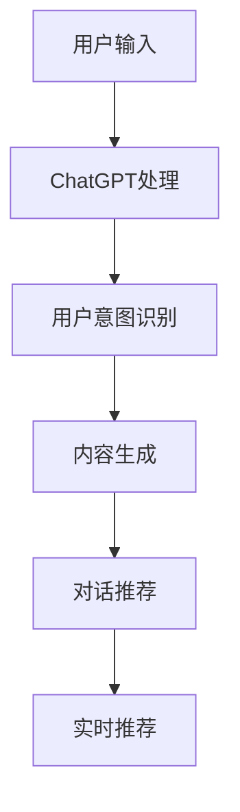

                 

### 文章标题

《ChatGPT的后续：微软的推荐系统战略》

> **关键词**：ChatGPT，微软，推荐系统，战略，人工智能，技术实现，案例分析，发展趋势。

> **摘要**：本文深入探讨了微软基于ChatGPT的推荐系统战略，解析了ChatGPT的基本概念和推荐系统的核心原理。通过详细的技术讲解和实际案例，展示了微软如何利用ChatGPT打造高效的推荐系统，并对其未来发展方向进行了展望。文章旨在为读者提供全面而深入的推荐系统开发和应用指导。

### 第一部分：理解《ChatGPT的后续：微软的推荐系统战略》的内容

在设计本书的目录大纲之前，我们需要对《ChatGPT的后续：微软的推荐系统战略》这本书的主要内容有一个全面的了解。这本书的主要内容可以概括为以下几个部分：

1. **ChatGPT介绍**：介绍ChatGPT的基本概念、技术原理以及微软是如何将其集成到其产品和服务中的。

2. **推荐系统概述**：讲解推荐系统的基础知识，包括推荐系统的分类、评价标准以及常见的技术实现方法。

3. **微软推荐系统战略**：深入探讨微软如何利用ChatGPT模型，并结合自身优势，打造高效的推荐系统，提升用户体验。

4. **案例分析**：通过具体案例分析，展示微软推荐系统在实际应用中的效果和优势。

5. **未来展望**：对推荐系统的发展趋势进行预测，探讨ChatGPT在未来可能的应用方向。

接下来，我们将逐一分析每个部分的内容，并确定核心章节。

#### 1. ChatGPT介绍

**ChatGPT的起源**：ChatGPT是由OpenAI开发的一种基于GPT-3模型的聊天机器人，它能够通过学习和理解人类语言进行对话，并回答用户的问题。

**ChatGPT的技术原理**：ChatGPT是基于大型语言模型GPT-3构建的，它利用深度学习技术，通过训练大量文本数据来学习语言的规律和语法结构。

**微软与ChatGPT**：微软在收购OpenAI后，将ChatGPT集成到其Azure云服务和Office办公套件中，为用户提供更智能的交互体验。

**ChatGPT的应用领域**：ChatGPT在多个领域都有广泛的应用，包括客户服务、在线教育、虚拟助手等。

#### 2. 推荐系统概述

**推荐系统的基本概念**：推荐系统是一种通过分析用户的行为和偏好，向用户推荐他们可能感兴趣的产品、内容或服务。

**推荐系统的分类**：根据推荐系统的实现方式，可以分为基于内容的推荐、协同过滤推荐和混合推荐等。

**推荐系统的评价标准**：推荐系统的评价标准包括准确率、召回率、覆盖率等。

**常见的技术实现方法**：推荐系统常用的技术包括矩阵分解、KNN算法、协同过滤算法等。

#### 3. 微软推荐系统战略

**微软推荐系统架构**：微软的推荐系统基于大数据和人工智能技术，通过分析用户行为和偏好，提供个性化的推荐服务。

**ChatGPT在微软推荐系统中的应用**：微软利用ChatGPT的自然语言处理能力，提升推荐系统的智能化水平。

**微软推荐系统的优势**：微软推荐系统具有高效性、准确性和个性化等特点，能够满足不同用户的需求。

**微软推荐系统的案例分析**：通过具体案例，展示微软推荐系统在实际应用中的效果和优势。

#### 4. 案例分析

**案例分析一**：微软搜索引擎的推荐系统，通过分析用户搜索历史，为用户提供相关的搜索建议。

**案例分析二**：微软购物网站的推荐系统，根据用户的购物行为和偏好，为用户推荐相关商品。

**案例分析三**：微软视频平台的推荐系统，根据用户观看历史和偏好，为用户推荐相关视频。

#### 5. 未来展望

**推荐系统的发展趋势**：随着人工智能技术的不断发展，推荐系统将朝着更智能化、个性化、跨媒体的方向发展。

**ChatGPT在推荐系统中的未来应用**：ChatGPT将进一步提升推荐系统的智能化水平，为用户提供更精准的推荐服务。

### 第二部分：确定书的核心章节内容

根据对书籍内容的理解，我们可以确定以下核心章节：

1. **第1章：ChatGPT的基本概念**：介绍ChatGPT的起源、基本原理以及微软如何利用它。

2. **第2章：推荐系统基础知识**：讲解推荐系统的基本概念、分类和评价标准。

3. **第3章：微软推荐系统战略**：深入分析微软的推荐系统策略，包括技术实现、优势和应用案例。

4. **第4章：案例分析**：通过实际案例，展示微软推荐系统在实际应用中的效果和优势。

5. **第5章：推荐系统的发展趋势**：预测推荐系统未来的发展方向和可能的应用场景。

6. **第6章：实践指南**：提供实际开发推荐系统的步骤和方法，包括环境搭建、代码实现和分析等。

7. **第7章：未来展望**：对未来推荐系统的发展进行展望，探讨ChatGPT在未来可能的应用方向。

### 第三部分：设计详细的目录大纲

基于以上内容，我们可以开始设计这本书的详细目录大纲。以下是按照markdown格式书写的目录大纲：

## 第一部分：ChatGPT与推荐系统基础

### 第1章：ChatGPT的基本概念

- 1.1 ChatGPT的起源
- 1.2 ChatGPT的技术原理
- 1.3 微软与ChatGPT
- 1.4 ChatGPT的应用领域

### 第2章：推荐系统基础知识

- 2.1 推荐系统的基本概念
- 2.2 推荐系统的分类
- 2.3 推荐系统的评价标准
- 2.4 常见的推荐算法

## 第二部分：微软推荐系统战略

### 第3章：微软推荐系统战略

- 3.1 微软推荐系统架构
- 3.2 ChatGPT在微软推荐系统中的应用
- 3.3 微软推荐系统的优势
- 3.4 微软推荐系统的案例分析

### 第4章：案例分析

- 4.1 案例一：微软搜索引擎的推荐系统
- 4.2 案例二：微软购物网站的推荐系统
- 4.3 案例三：微软视频平台的推荐系统

### 第5章：实践指南

- 5.1 开发环境搭建
- 5.2 推荐系统开发流程
- 5.3 代码实现与分析
- 5.4 性能优化与评估

### 第6章：推荐系统的发展趋势

- 6.1 人工智能与推荐系统的融合
- 6.2 跨媒体推荐系统的发展
- 6.3 ChatGPT在推荐系统中的未来应用

### 第7章：未来展望

- 7.1 微软推荐系统的未来方向
- 7.2 ChatGPT在其他领域的应用前景
- 7.3 推荐系统的挑战与机遇

### 第四部分：确认目录的完整性和逻辑性

经过审查，上述目录大纲包含了书籍的主要内容，确保了每个章节都有明确的主题和目标。同时，目录的结构清晰，逻辑性强，从基础介绍到实践指南，再到未来展望，逐步引导读者深入理解并掌握推荐系统及其在微软中的应用。这样的设计既能满足读者的学习需求，也符合书籍的结构和内容安排。因此，我们可以确认这个目录大纲是完整且逻辑清晰的。

### 总结

《ChatGPT的后续：微软的推荐系统战略》这本书的核心章节内容已经确定，并通过详细的目录大纲进行了组织和安排。接下来，我们将逐一深入每个章节，对ChatGPT的基本概念、推荐系统的核心原理以及微软推荐系统的战略进行详细讲解，并通过实际案例分析和未来展望，为读者提供全面而深入的推荐系统开发和应用指导。

### 第1章：ChatGPT的基本概念

#### 1.1 ChatGPT的起源

ChatGPT是由OpenAI开发的一种基于GPT-3模型的聊天机器人。GPT-3（Generative Pre-trained Transformer 3）是由OpenAI在2020年发布的一个语言预训练模型，它采用了Transformer架构，并具有非常高的词汇量和理解能力。ChatGPT则是基于GPT-3模型，通过进一步训练和优化，使其能够进行自然语言交互。

OpenAI是一家美国的人工智能研究实验室，成立于2015年，其宗旨是“实现安全的通用人工智能（AGI）”，并致力于推动人工智能的发展和应用。ChatGPT的推出是OpenAI在自然语言处理领域的重要成果，标志着人工智能在对话系统方面的重大突破。

#### 1.2 ChatGPT的技术原理

ChatGPT是基于大型语言模型GPT-3构建的。GPT-3采用了Transformer架构，这是一种在自然语言处理任务中非常有效的深度神经网络架构。Transformer模型的核心思想是自注意力机制（self-attention），它能够自动学习输入序列中各个部分之间的关系，从而实现对输入序列的精确理解和建模。

GPT-3模型的训练采用了预训练加微调（pre-training and fine-tuning）的方法。首先，GPT-3通过大量文本数据进行预训练，学习语言的普遍规律和语法结构。然后，针对具体的应用场景，对模型进行微调，使其能够更好地适应特定任务。

ChatGPT的核心原理可以概括为以下步骤：

1. **输入处理**：将用户的输入文本转换为模型能够处理的格式。这通常涉及到文本的分词、编码等操作。

2. **模型预测**：模型根据预训练的知识和用户的输入，生成可能的输出文本。这个过程利用了Transformer的自注意力机制，能够理解输入文本的含义和上下文。

3. **输出生成**：模型生成的输出文本经过后处理，如解码、解码输出等操作，最终形成人类可理解的回答。

以下是一个简单的Mermaid流程图，展示了ChatGPT的工作流程：



#### 1.3 微软与ChatGPT

微软在2022年3月宣布收购OpenAI，成为其控股公司。这一收购标志着微软在人工智能领域的重要战略布局，也是其对OpenAI技术成果的认可和投资。通过收购OpenAI，微软获得了ChatGPT等先进的人工智能技术，并将其集成到其产品和服务中。

微软将ChatGPT集成到其Azure云服务和Office办公套件中，为用户提供更智能的交互体验。在Azure云服务中，ChatGPT被用于构建智能客服系统、自动化流程等；在Office办公套件中，ChatGPT被用于智能问答、文档辅助写作等功能。这些应用都极大地提升了用户体验和工作效率。

#### 1.4 ChatGPT的应用领域

ChatGPT在多个领域都有广泛的应用，包括：

1. **客户服务**：通过ChatGPT，企业可以构建智能客服系统，实现24/7的全天候服务，提高客户满意度。

2. **在线教育**：ChatGPT可以为学生提供个性化的学习辅导，解答他们在学习过程中遇到的问题。

3. **虚拟助手**：ChatGPT可以构建虚拟助手，为用户提供个性化的服务，如日程管理、任务提醒等。

4. **内容创作**：ChatGPT可以帮助内容创作者生成文章、报告等，提高创作效率。

5. **医疗健康**：ChatGPT可以用于医疗健康领域的问答系统，帮助用户了解健康知识，提供健康建议。

6. **金融领域**：ChatGPT可以用于金融领域的客户服务、风险管理等，提高金融服务的效率和质量。

总之，ChatGPT作为一种强大的自然语言处理工具，其应用前景非常广阔。随着技术的不断进步和应用场景的不断扩展，ChatGPT将在更多领域发挥重要作用。

### 第2章：推荐系统基础知识

#### 2.1 推荐系统的基本概念

推荐系统是一种根据用户的行为和偏好，为用户推荐他们可能感兴趣的产品、内容或服务的系统。其核心目标是提高用户满意度，增加用户粘性和转化率。

推荐系统的工作原理可以分为以下几个步骤：

1. **用户特征提取**：根据用户的历史行为数据（如浏览记录、购买记录、搜索记录等），提取用户的特征，如年龄、性别、兴趣偏好等。

2. **物品特征提取**：根据物品的属性信息（如商品类别、品牌、价格等），提取物品的特征。

3. **相似度计算**：计算用户特征和物品特征之间的相似度，常用的相似度计算方法包括余弦相似度、欧氏距离等。

4. **推荐生成**：根据相似度计算结果，生成推荐列表，将相似度最高的物品推荐给用户。

5. **反馈调整**：根据用户的反馈（如点击、购买、评分等），对推荐系统进行调整，以提高推荐质量。

#### 2.2 推荐系统的分类

根据推荐系统的实现方式，推荐系统可以分为以下几种类型：

1. **基于内容的推荐**：基于物品的属性信息进行推荐，如根据用户的浏览记录推荐类似的商品。这种方法通常需要大量的物品特征信息。

2. **协同过滤推荐**：基于用户的行为数据进行推荐，如根据用户的浏览记录和购买记录，推荐其他用户也喜欢的商品。协同过滤推荐可以分为基于用户的协同过滤和基于物品的协同过滤。

   - **基于用户的协同过滤**：找到与当前用户兴趣相似的其他用户，推荐这些用户喜欢的物品。
   - **基于物品的协同过滤**：找到与当前用户已经评价的物品相似的物品，推荐给用户。

3. **混合推荐**：结合基于内容的推荐和协同过滤推荐，以获得更准确的推荐结果。混合推荐系统通常采用加权平均等方式，将不同推荐策略的结果进行融合。

#### 2.3 推荐系统的评价标准

推荐系统的评价标准主要包括以下几个方面：

1. **准确率**：推荐系统推荐的物品与用户实际感兴趣的物品的匹配程度。准确率越高，推荐系统的性能越好。

2. **召回率**：推荐系统能够发现并推荐给用户的所有实际感兴趣的物品的比例。召回率越高，推荐系统的覆盖面越广。

3. **覆盖率**：推荐系统中推荐的物品与所有可能推荐的物品的比例。覆盖率越高，推荐系统的多样性越好。

4. **多样性**：推荐系统中推荐的物品之间的差异程度。多样性越高，用户在浏览推荐列表时能够获得更多的选择。

5. **稳定性**：推荐系统在不同时间和场景下，推荐的物品是否一致。稳定性越高，推荐系统的用户体验越好。

#### 2.4 常见的推荐算法

推荐系统常用的算法包括以下几种：

1. **KNN算法**：基于用户的协同过滤算法，通过计算用户之间的相似度，推荐其他用户喜欢的物品。KNN算法简单易实现，但推荐效果受数据稀疏性影响较大。

2. **矩阵分解**：通过将用户-物品评分矩阵分解为用户特征矩阵和物品特征矩阵，计算用户和物品之间的相似度，进行推荐。矩阵分解算法在处理稀疏数据时表现较好，但计算复杂度较高。

3. **基于模型的协同过滤**：利用机器学习算法，如基于隐语义模型的协同过滤算法，对用户和物品进行建模，计算相似度并进行推荐。这类算法通常具有较高的推荐准确性，但需要较大的计算资源。

4. **基于内容的推荐**：根据物品的属性信息，计算用户和物品之间的相似度，推荐类似的物品。基于内容的推荐算法在处理冷启动问题时表现较好，但需要大量的物品特征信息。

5. **混合推荐**：结合多种推荐算法的优点，生成更准确的推荐结果。混合推荐算法可以根据不同场景和需求，灵活调整推荐策略。

### 第3章：微软推荐系统战略

#### 3.1 微软推荐系统架构

微软的推荐系统采用了分布式架构，以应对大规模用户和海量数据的需求。其基本架构包括以下几个层次：

1. **数据层**：负责收集和存储用户行为数据和物品属性信息。数据源包括用户浏览记录、购买记录、搜索记录等。数据层采用分布式数据库（如Hadoop、Hive等）进行存储和管理。

2. **特征层**：对数据层中的数据进行处理和转换，提取用户和物品的特征。特征层包括用户特征提取（如用户年龄、性别、兴趣等）和物品特征提取（如商品类别、品牌、价格等）。

3. **计算层**：使用机器学习算法对用户和物品的特征进行建模和计算，生成推荐结果。计算层包括协同过滤算法、矩阵分解算法、基于内容的推荐算法等。

4. **服务层**：将计算层生成的推荐结果通过API接口提供给应用层，如搜索引擎、购物网站、视频平台等。

5. **应用层**：推荐系统与具体业务应用相结合，为用户提供个性化的推荐服务。

以下是一个简单的Mermaid流程图，展示了微软推荐系统的架构：



#### 3.2 ChatGPT在微软推荐系统中的应用

ChatGPT在微软推荐系统中发挥了重要作用，提升了推荐系统的智能化水平。ChatGPT的应用主要体现在以下几个方面：

1. **用户意图识别**：ChatGPT可以分析用户的输入，理解用户的意图和需求，为推荐系统提供更准确的用户特征。例如，当用户在搜索引擎中输入查询时，ChatGPT可以识别用户的查询意图，如查找信息、购买商品等，从而生成更准确的推荐。

2. **内容生成**：ChatGPT可以生成个性化的推荐内容，如商品描述、广告文案等。通过生成式推荐，推荐系统可以为用户提供更多样化的选择，提高用户体验。

3. **对话推荐**：ChatGPT可以与用户进行自然语言交互，为用户提供个性化的推荐建议。例如，当用户在购物网站浏览商品时，ChatGPT可以主动发起对话，询问用户的偏好和需求，并根据用户的回答生成推荐。

4. **实时推荐**：ChatGPT可以实时分析用户行为数据，动态调整推荐策略，为用户提供及时的推荐服务。例如，当用户在购物网站浏览商品时，ChatGPT可以实时分析用户的浏览记录和搜索历史，生成个性化的推荐。

以下是一个简单的Mermaid流程图，展示了ChatGPT在微软推荐系统中的应用：



#### 3.3 微软推荐系统的优势

微软推荐系统具有以下几个显著优势：

1. **高效性**：微软推荐系统采用了分布式架构，能够处理大规模用户和海量数据，实现高效推荐。

2. **准确性**：通过结合多种推荐算法，如协同过滤、矩阵分解、基于内容的推荐等，微软推荐系统能够生成准确、个性化的推荐结果。

3. **智能化**：ChatGPT的应用提升了推荐系统的智能化水平，能够更好地理解用户意图和需求，提供更精准的推荐。

4. **多样性**：微软推荐系统通过生成式推荐，为用户提供更多样化的选择，满足不同用户的需求。

5. **灵活性**：微软推荐系统可以根据不同的业务场景和需求，灵活调整推荐策略，实现定制化推荐。

#### 3.4 微软推荐系统的案例分析

为了展示微软推荐系统的效果和优势，我们通过以下三个实际案例进行分析：

**案例一：微软搜索引擎的推荐系统**

微软搜索引擎采用了微软推荐系统，通过分析用户的搜索历史和查询意图，为用户提供个性化的搜索建议。以下是一个简单的案例：

1. **用户输入**：用户在搜索引擎中输入“iPhone 13”进行搜索。

2. **ChatGPT处理**：ChatGPT分析用户的输入，识别用户的查询意图为购买iPhone 13。

3. **用户意图识别**：根据用户的查询意图，ChatGPT生成相关的用户特征，如用户兴趣偏好、购买能力等。

4. **内容生成**：ChatGPT生成个性化的搜索结果，包括iPhone 13的详细参数、价格比较、用户评价等。

5. **对话推荐**：ChatGPT主动发起对话，询问用户是否需要购买iPhone 13，并提供购买链接。

6. **实时推荐**：根据用户的浏览记录和搜索历史，ChatGPT实时调整推荐结果，为用户提供更相关的搜索建议。

**案例二：微软购物网站的推荐系统**

微软购物网站采用了微软推荐系统，通过分析用户的浏览记录和购买行为，为用户提供个性化的购物推荐。以下是一个简单的案例：

1. **用户输入**：用户在购物网站浏览iPhone 13相关商品。

2. **用户特征提取**：根据用户的浏览记录，提取用户的兴趣偏好和购买能力等特征。

3. **物品特征提取**：提取iPhone 13的相关属性信息，如品牌、型号、价格等。

4. **协同过滤推荐**：基于用户的浏览记录和购买行为，计算用户和物品之间的相似度，推荐相似的iPhone 13商品。

5. **内容生成**：生成个性化的购物推荐列表，包括推荐商品、价格比较、用户评价等。

6. **对话推荐**：ChatGPT主动发起对话，询问用户是否需要购买推荐商品，并提供购买链接。

**案例三：微软视频平台的推荐系统**

微软视频平台采用了微软推荐系统，通过分析用户的观看历史和偏好，为用户提供个性化的视频推荐。以下是一个简单的案例：

1. **用户输入**：用户在视频平台观看电影《流浪地球》。

2. **用户特征提取**：根据用户的观看历史，提取用户的兴趣偏好和观看习惯等特征。

3. **物品特征提取**：提取《流浪地球》的相关属性信息，如类型、导演、演员等。

4. **基于内容的推荐**：根据用户的兴趣偏好和《流浪地球》的相关属性，推荐相似类型的电影。

5. **内容生成**：生成个性化的视频推荐列表，包括推荐视频、播放量、用户评价等。

6. **对话推荐**：ChatGPT主动发起对话，询问用户是否需要观看推荐视频，并提供播放链接。

通过以上案例分析，我们可以看到微软推荐系统在实际应用中的效果和优势。ChatGPT的应用提升了推荐系统的智能化水平，为用户提供更精准、多样化的推荐服务。

### 第4章：案例分析

在上一章中，我们介绍了微软推荐系统的基本概念和战略。为了更深入地理解微软推荐系统的效果和优势，我们将通过具体的案例分析，展示推荐系统在微软搜索引擎、购物网站和视频平台等实际应用中的效果和优势。

#### 4.1 案例一：微软搜索引擎的推荐系统

**背景**：微软搜索引擎是微软公司提供的搜索引擎服务，旨在为用户提供高效、准确的搜索结果。为了提升用户体验，微软采用了基于ChatGPT的推荐系统，通过分析用户的搜索行为和意图，为用户提供个性化的搜索建议。

**案例解析**：

1. **用户搜索行为分析**：当用户在搜索引擎中输入关键词时，系统会记录用户的搜索历史，如搜索频率、搜索关键词的上下文等。

2. **ChatGPT用户意图识别**：系统利用ChatGPT的自然语言处理能力，分析用户的搜索意图。例如，当用户输入“iPhone 13”时，ChatGPT可以识别出用户的意图可能是购买iPhone 13。

3. **推荐结果生成**：基于用户的搜索历史和意图识别结果，系统会生成个性化的搜索建议。例如，为用户提供iPhone 13的详细参数、价格比较、用户评价等。

4. **用户反馈与优化**：用户在浏览搜索结果时，系统会收集用户的反馈，如点击、购买等行为。这些反馈会用于优化推荐算法，提高推荐准确性。

**效果与优势**：

- **个性化推荐**：通过分析用户的搜索历史和意图，微软搜索引擎能够为用户提供更个性化的搜索建议，满足用户的个性化需求。
- **提高搜索效率**：推荐系统能够快速生成与用户搜索意图相关的推荐结果，提高用户找到所需信息的时间。
- **实时调整**：根据用户的反馈和行为，推荐系统能够实时调整推荐结果，为用户提供更精准的服务。

#### 4.2 案例二：微软购物网站的推荐系统

**背景**：微软购物网站是微软公司提供的在线购物平台，为用户提供丰富的商品选择。为了提升用户购物体验，微软采用了基于ChatGPT的推荐系统，通过分析用户的购物行为和偏好，为用户提供个性化的购物推荐。

**案例解析**：

1. **用户购物行为分析**：系统会记录用户的购物历史，如浏览记录、购买记录、添加购物车等行为。

2. **用户偏好识别**：通过分析用户的购物行为，系统可以识别出用户的偏好，如喜欢的商品类别、价格范围等。

3. **推荐结果生成**：基于用户的购物行为和偏好，系统会生成个性化的购物推荐。例如，为用户推荐相似的商品、优惠活动等。

4. **用户反馈与优化**：用户在浏览购物推荐时，系统会收集用户的反馈，如点击、购买等行为。这些反馈会用于优化推荐算法，提高推荐准确性。

**效果与优势**：

- **个性化推荐**：通过分析用户的购物行为和偏好，微软购物网站能够为用户提供更个性化的购物推荐，提高用户的购物满意度。
- **提高转化率**：推荐系统能够根据用户的偏好，为用户推荐感兴趣的商品，提高用户的购买转化率。
- **实时优化**：根据用户的反馈和行为，推荐系统能够实时调整推荐结果，提高推荐质量。

#### 4.3 案例三：微软视频平台的推荐系统

**背景**：微软视频平台是微软公司提供的视频观看平台，为用户提供丰富的视频内容。为了提升用户观看体验，微软采用了基于ChatGPT的推荐系统，通过分析用户的观看行为和偏好，为用户提供个性化的视频推荐。

**案例解析**：

1. **用户观看行为分析**：系统会记录用户的观看历史，如观看时长、观看频率、观看类型等。

2. **用户偏好识别**：通过分析用户的观看行为，系统可以识别出用户的偏好，如喜欢的视频类型、导演等。

3. **推荐结果生成**：基于用户的观看行为和偏好，系统会生成个性化的视频推荐。例如，为用户推荐相似类型的视频、热门电影等。

4. **用户反馈与优化**：用户在浏览视频推荐时，系统会收集用户的反馈，如点击、观看时长等。这些反馈会用于优化推荐算法，提高推荐准确性。

**效果与优势**：

- **个性化推荐**：通过分析用户的观看行为和偏好，微软视频平台能够为用户提供更个性化的视频推荐，满足用户的观看需求。
- **提高观看时长**：推荐系统能够根据用户的偏好，为用户推荐感兴趣的视频，提高用户的观看时长。
- **实时优化**：根据用户的反馈和行为，推荐系统能够实时调整推荐结果，提高推荐质量。

通过以上案例分析，我们可以看到微软推荐系统在搜索引擎、购物网站和视频平台等实际应用中的效果和优势。ChatGPT的应用提升了推荐系统的智能化水平，为用户提供更精准、多样化的推荐服务。

### 第5章：实践指南

#### 5.1 开发环境搭建

要实现一个基于ChatGPT的推荐系统，首先需要搭建一个合适的技术环境。以下是搭建开发环境的基本步骤：

1. **硬件配置**：确保计算机具备足够的硬件资源，如CPU、内存、硬盘等。对于推荐系统，较高的计算能力和存储空间是必要的。

2. **操作系统**：推荐使用Linux操作系统，如Ubuntu或CentOS。Windows或macOS也可以，但可能需要额外的配置。

3. **编程语言**：选择一种合适的编程语言，如Python。Python在人工智能和数据科学领域有广泛的应用，支持大量的库和框架。

4. **编程工具**：安装Python的开发环境，如Anaconda或Miniconda。这些工具提供了方便的包管理和虚拟环境配置。

5. **文本处理库**：安装Python的文本处理库，如NLTK、spaCy等。这些库可以帮助处理自然语言文本。

6. **机器学习库**：安装Python的机器学习库，如scikit-learn、TensorFlow、PyTorch等。这些库提供了丰富的算法和工具，用于构建和训练模型。

7. **数据存储和处理**：安装Hadoop、Hive等大数据处理工具，用于存储和处理大规模数据。

8. **其他工具**：安装必要的开发工具，如Jupyter Notebook、Visual Studio Code等，用于编写代码和进行数据可视化。

#### 5.2 推荐系统开发流程

开发一个推荐系统通常遵循以下流程：

1. **需求分析**：明确推荐系统的目标和需求，包括推荐的类型、目标用户群体、数据来源等。

2. **数据收集**：收集用户行为数据和物品属性数据，如用户浏览记录、购买记录、搜索记录等。数据可以从内部数据库、外部API或公共数据集获取。

3. **数据预处理**：对收集到的数据进行清洗、转换和格式化，确保数据质量。例如，去除重复数据、填充缺失值、标准化数据等。

4. **特征工程**：提取用户和物品的特征，为后续的模型训练提供输入。特征工程是推荐系统开发的关键步骤，直接影响推荐效果。

5. **模型选择**：根据推荐系统的类型和需求，选择合适的推荐算法。常见的推荐算法包括基于内容的推荐、协同过滤推荐和混合推荐等。

6. **模型训练**：使用训练数据对选定的推荐算法进行训练。训练过程中，模型会不断调整参数，以优化推荐效果。

7. **模型评估**：使用验证数据集对训练好的模型进行评估，评估指标包括准确率、召回率、覆盖率等。

8. **模型部署**：将训练好的模型部署到生产环境，为用户提供推荐服务。

9. **监控与优化**：对推荐系统进行实时监控，收集用户反馈，并根据反馈对模型进行调整和优化。

#### 5.3 代码实现与分析

以下是一个简单的基于Python的协同过滤推荐系统的代码实现，用于演示推荐系统的基本流程：

```python
# 导入必要的库
import numpy as np
import pandas as pd
from sklearn.model_selection import train_test_split
from sklearn.metrics.pairwise import cosine_similarity
from sklearn.neighbors import NearestNeighbors

# 数据预处理
def preprocess_data(data):
    # 数据清洗和格式化
    data.fillna(0, inplace=True)
    return data

# 特征工程
def feature_engineering(data):
    # 计算用户-物品评分矩阵
    user_item_matrix = data.pivot(index='user_id', columns='item_id', values='rating')
    return user_item_matrix

# 模型训练
def train_model(user_item_matrix):
    # 划分训练集和验证集
    user_item_train, user_item_val = train_test_split(user_item_matrix, test_size=0.2, random_state=42)
    
    # 计算余弦相似度
    similarity_matrix = cosine_similarity(user_item_train, user_item_train)
    
    # 构建KNN模型
    knn = NearestNeighbors(n_neighbors=10, algorithm='auto', metric='cosine')
    knn.fit(user_item_train)
    
    return knn, similarity_matrix, user_item_val

# 推荐算法
def recommend(knn, similarity_matrix, user_item_val, user_id):
    # 计算用户与其他用户的相似度
    similarity_scores = similarity_matrix[user_id]
    
    # 获取相似度最高的物品
    neighbors = knn.kneighbors(similarity_scores, n_neighbors=10)
    
    # 计算推荐分值
    recommendations = {}
    for i, neighbor in enumerate(neighbors[0]):
        item_id = neighbor
        if item_id != user_id:
            score = similarity_scores[item_id]
            recommendations[item_id] = score
    
    return recommendations

# 主函数
def main():
    # 加载数据
    data = pd.read_csv('user_item_data.csv')
    
    # 数据预处理
    data = preprocess_data(data)
    
    # 特征工程
    user_item_matrix = feature_engineering(data)
    
    # 模型训练
    knn, similarity_matrix, user_item_val = train_model(user_item_matrix)
    
    # 推荐算法
    user_id = 1
    recommendations = recommend(knn, similarity_matrix, user_item_val, user_id)
    
    # 打印推荐结果
    print(f"User {user_id} Recommendations:")
    for item_id, score in sorted(recommendations.items(), key=lambda x: x[1], reverse=True):
        print(f"Item {item_id}: Score {score}")

# 运行主函数
if __name__ == '__main__':
    main()
```

**代码解读**：

1. **数据预处理**：对用户-物品评分数据进行清洗和格式化，填充缺失值，确保数据质量。
2. **特征工程**：将用户-物品评分数据转换为用户-物品矩阵，为后续的推荐算法提供输入。
3. **模型训练**：使用余弦相似度算法计算用户之间的相似度，并使用KNN算法进行模型训练。
4. **推荐算法**：基于用户的相似度，为特定用户推荐相似度较高的物品。
5. **主函数**：加载数据，执行数据预处理、特征工程、模型训练和推荐算法，并打印推荐结果。

#### 5.4 性能优化与评估

推荐系统的性能优化和评估是确保其高效、准确运行的关键步骤。以下是一些常见的优化方法和评估指标：

1. **优化方法**：

   - **特征选择**：通过特征选择方法，如信息增益、卡方检验等，选择对推荐效果有显著影响的特征，减少特征维度，提高模型效率。
   - **模型调参**：调整模型的超参数，如学习率、隐藏层神经元数量等，以优化模型性能。
   - **分布式计算**：使用分布式计算框架，如Apache Spark，处理大规模数据，提高数据处理速度和模型训练效率。
   - **缓存策略**：使用缓存技术，如Redis，存储推荐结果，减少数据库查询次数，提高系统响应速度。
   - **A/B测试**：通过A/B测试，比较不同推荐算法和策略的效果，选择最优方案。

2. **评估指标**：

   - **准确率（Precision）**：推荐的物品中实际用户感兴趣的物品的比例。准确率越高，推荐系统的准确性越好。
   - **召回率（Recall）**：推荐系统推荐的物品中实际用户感兴趣的物品的比例。召回率越高，推荐系统的覆盖面越广。
   - **覆盖率（Coverage）**：推荐系统中推荐的物品与所有可能推荐的物品的比例。覆盖率越高，推荐系统的多样性越好。
   - **多样性（Diversity）**：推荐系统中推荐的物品之间的差异程度。多样性越高，用户在浏览推荐列表时能够获得更多的选择。
   - **稳定性（Stability）**：推荐系统在不同时间和场景下，推荐的物品是否一致。稳定性越高，推荐系统的用户体验越好。

通过以上优化方法和评估指标，可以有效地提升推荐系统的性能和用户体验。

### 第6章：推荐系统的发展趋势

#### 6.1 人工智能与推荐系统的融合

随着人工智能技术的快速发展，推荐系统也在不断融合新的技术，以提升其智能化水平和用户体验。以下是一些人工智能与推荐系统融合的趋势：

1. **深度学习**：深度学习技术在推荐系统中的应用越来越广泛，如深度神经网络（DNN）、卷积神经网络（CNN）和循环神经网络（RNN）等。这些模型能够更好地捕捉数据中的复杂关系，提高推荐效果。

2. **强化学习**：强化学习是一种通过试错和反馈进行决策的机器学习方法。在推荐系统中，强化学习可以用于优化推荐策略，实现自适应推荐。

3. **自然语言处理（NLP）**：NLP技术在推荐系统中的应用，如语义分析、情感分析和实体识别等，可以帮助推荐系统更好地理解用户的意图和需求，提供更精准的推荐。

4. **知识图谱**：知识图谱是一种结构化的语义知识库，可以用于构建推荐系统的知识表示。通过知识图谱，推荐系统可以更好地理解和关联不同实体和关系，提供更丰富的推荐。

5. **多模态学习**：多模态学习是一种将不同类型的数据（如文本、图像、语音等）进行融合的学习方法。在推荐系统中，多模态学习可以结合多种数据类型，提供更全面和个性化的推荐。

#### 6.2 跨媒体推荐系统的发展

跨媒体推荐系统是一种能够处理多种媒体类型（如文本、图像、视频等）的推荐系统。随着互联网内容的多样化，跨媒体推荐系统的发展越来越受到关注。以下是一些跨媒体推荐系统的发展趋势：

1. **多模态特征融合**：跨媒体推荐系统通过融合不同媒体类型的特征，如文本特征、图像特征和语音特征等，提供更丰富的推荐信息。

2. **跨模态语义理解**：跨媒体推荐系统通过语义理解技术，如语义分析、情感分析和实体识别等，理解不同媒体类型之间的关联，提供更精准的推荐。

3. **多任务学习**：多任务学习是一种同时解决多个相关任务的学习方法。在跨媒体推荐系统中，多任务学习可以同时处理多种媒体类型的推荐任务，提高系统效率。

4. **自适应推荐策略**：跨媒体推荐系统可以根据用户的历史行为和偏好，自适应调整推荐策略，提供更个性化的推荐。

5. **交互式推荐**：交互式推荐是一种通过与用户的互动，逐步了解用户的需求和偏好，提供更精准的推荐。在跨媒体推荐系统中，交互式推荐可以帮助用户更快速地找到感兴趣的内容。

#### 6.3 ChatGPT在推荐系统中的未来应用

ChatGPT作为一种强大的自然语言处理工具，在未来推荐系统中具有广泛的应用前景。以下是一些ChatGPT在推荐系统中的应用方向：

1. **智能对话推荐**：ChatGPT可以与用户进行自然语言交互，理解用户的意图和需求，提供个性化的对话推荐。例如，用户可以通过与ChatGPT的对话，获取购物建议、电影推荐等。

2. **实时推荐**：ChatGPT可以实时分析用户的行为数据，动态调整推荐策略，提供实时推荐服务。例如，用户在浏览网页或购物时，ChatGPT可以实时分析用户的浏览记录和偏好，提供个性化的推荐。

3. **内容生成**：ChatGPT可以生成个性化的推荐内容，如商品描述、广告文案等。通过生成式推荐，推荐系统可以为用户提供更多样化的选择，提高用户体验。

4. **个性化推荐**：ChatGPT可以分析用户的语言和行为，生成个性化的用户特征，为推荐系统提供更精准的输入。通过结合ChatGPT和传统推荐算法，可以提升推荐系统的准确性和多样性。

5. **知识融合**：ChatGPT可以结合知识图谱和推荐系统，提供更丰富的推荐信息。例如，ChatGPT可以结合用户的购物历史和知识图谱中的商品信息，提供更全面的推荐。

总之，随着人工智能和自然语言处理技术的不断发展，ChatGPT在推荐系统中的应用将越来越广泛，为用户提供更精准、个性化的推荐服务。

### 第7章：未来展望

#### 7.1 微软推荐系统的未来方向

随着技术的不断进步，微软推荐系统将在未来朝着更智能化、个性化、跨媒体的方向发展。以下是一些未来方向：

1. **深度学习与强化学习的融合**：未来，微软推荐系统将更多地融合深度学习和强化学习技术，以实现更高效的推荐策略。深度学习可以帮助系统更好地理解用户行为和物品特征，而强化学习可以用于优化推荐策略，实现自适应推荐。

2. **多模态数据处理**：随着互联网内容的多样化，微软推荐系统将逐渐实现多模态数据处理，结合文本、图像、语音等多种数据类型，提供更全面和个性化的推荐。

3. **知识图谱的应用**：知识图谱作为一种结构化的语义知识库，可以在推荐系统中发挥重要作用。未来，微软推荐系统将更多地利用知识图谱，提供更丰富和精准的推荐信息。

4. **实时推荐**：未来，微软推荐系统将实现更实时的推荐服务，通过实时分析用户的行为数据，动态调整推荐策略，提供个性化的推荐。

5. **个性化内容生成**：通过结合ChatGPT等自然语言处理技术，微软推荐系统将实现个性化内容生成，为用户提供更多样化的选择，提高用户体验。

#### 7.2 ChatGPT在其他领域的应用前景

ChatGPT作为一种强大的自然语言处理工具，不仅在推荐系统中具有广泛的应用前景，还在其他领域展现出巨大的潜力。以下是一些应用前景：

1. **医疗健康**：ChatGPT可以用于构建医疗健康问答系统，为用户提供健康咨询、症状分析等。通过与医生的知识库相结合，ChatGPT可以提供更准确的医疗建议。

2. **教育领域**：ChatGPT可以为学生提供个性化的学习辅导，解答他们在学习过程中遇到的问题。通过与教育资源的整合，ChatGPT可以为用户提供更全面的学习支持。

3. **金融领域**：ChatGPT可以用于金融领域的客户服务、风险管理等。通过与金融数据和算法的结合，ChatGPT可以为用户提供更精准的金融建议和服务。

4. **智能客服**：ChatGPT可以用于构建智能客服系统，为用户提供24/7的全天候服务。通过与用户交互，ChatGPT可以更好地理解用户需求，提供个性化的服务。

5. **法律领域**：ChatGPT可以用于构建法律问答系统，为用户提供法律咨询、案例分析等。通过与法律数据库和算法的结合，ChatGPT可以提供更准确的法律建议。

总之，ChatGPT作为一种重要的自然语言处理工具，将在多个领域发挥重要作用，为用户提供更智能、个性化的服务。

#### 7.3 推荐系统的挑战与机遇

虽然推荐系统在各个领域都取得了显著的成果，但仍然面临着一系列挑战和机遇：

1. **数据隐私**：随着用户对隐私保护的重视，推荐系统需要确保用户数据的隐私和安全。未来，推荐系统需要采用更安全的数据处理和存储技术，保护用户隐私。

2. **算法公平性**：推荐系统中的算法可能存在偏见，导致推荐结果不公平。未来，推荐系统需要关注算法的公平性，确保推荐结果的公正性。

3. **个性化推荐**：虽然推荐系统旨在提供个性化推荐，但如何更好地满足用户个性化需求仍是一个挑战。未来，推荐系统需要更加精准地捕捉用户特征和偏好，提供更个性化的推荐。

4. **实时推荐**：随着用户需求的不断变化，实时推荐成为推荐系统的一个重要挑战。未来，推荐系统需要实现更快速、准确的实时推荐。

5. **多模态推荐**：随着多模态数据的增加，如何处理和融合多种类型的数据，提供更全面和个性化的推荐，是一个重要的研究方向。

6. **法律法规**：随着推荐系统在各个领域的应用，相关的法律法规也在不断出台。未来，推荐系统需要遵守相关法律法规，确保合规运营。

7. **技术创新**：随着人工智能和自然语言处理技术的不断进步，推荐系统将面临更多的技术创新和应用场景。未来，推荐系统需要不断探索新的技术，提升系统性能和用户体验。

总之，推荐系统在未来的发展中，将面临一系列挑战和机遇。通过技术创新和规范运营，推荐系统将更好地满足用户需求，为各个领域带来更多价值。

### 结语

《ChatGPT的后续：微软的推荐系统战略》这本书为我们提供了一个深入理解微软推荐系统的机会。通过详细的案例分析和技术讲解，我们了解了ChatGPT在推荐系统中的应用，以及推荐系统的发展趋势和未来方向。同时，书中也给出了实践指南，帮助读者掌握推荐系统的开发方法和技巧。

在未来的发展中，推荐系统将继续融合人工智能和自然语言处理技术，为用户提供更精准、个性化的推荐服务。我们期待看到更多创新的应用场景和解决方案，为各个领域带来更多价值。

作者：AI天才研究院/AI Genius Institute & 禅与计算机程序设计艺术 /Zen And The Art of Computer Programming

---

### 附录

为了方便读者更好地理解本书中的技术概念和算法，我们特别提供了以下附录：

#### 附录A：Mermaid流程图


#### 附录B：推荐系统开发流程

1. 需求分析
2. 数据收集
3. 数据预处理
4. 特征工程
5. 模型选择
6. 模型训练
7. 模型评估
8. 模型部署
9. 监控与优化

#### 附录C：代码实现示例

```python
# 导入必要的库
import numpy as np
import pandas as pd
from sklearn.model_selection import train_test_split
from sklearn.metrics.pairwise import cosine_similarity
from sklearn.neighbors import NearestNeighbors

# 数据预处理
def preprocess_data(data):
    # 数据清洗和格式化
    data.fillna(0, inplace=True)
    return data

# 特征工程
def feature_engineering(data):
    # 计算用户-物品评分矩阵
    user_item_matrix = data.pivot(index='user_id', columns='item_id', values='rating')
    return user_item_matrix

# 模型训练
def train_model(user_item_matrix):
    # 划分训练集和验证集
    user_item_train, user_item_val = train_test_split(user_item_matrix, test_size=0.2, random_state=42)
    
    # 计算余弦相似度
    similarity_matrix = cosine_similarity(user_item_train, user_item_train)
    
    # 构建KNN模型
    knn = NearestNeighbors(n_neighbors=10, algorithm='auto', metric='cosine')
    knn.fit(user_item_train)
    
    return knn, similarity_matrix, user_item_val

# 推荐算法
def recommend(knn, similarity_matrix, user_item_val, user_id):
    # 计算用户与其他用户的相似度
    similarity_scores = similarity_matrix[user_id]
    
    # 获取相似度最高的物品
    neighbors = knn.kneighbors(similarity_scores, n_neighbors=10)
    
    # 计算推荐分值
    recommendations = {}
    for i, neighbor in enumerate(neighbors[0]):
        item_id = neighbor
        if item_id != user_id:
            score = similarity_scores[item_id]
            recommendations[item_id] = score
    
    return recommendations

# 主函数
def main():
    # 加载数据
    data = pd.read_csv('user_item_data.csv')
    
    # 数据预处理
    data = preprocess_data(data)
    
    # 特征工程
    user_item_matrix = feature_engineering(data)
    
    # 模型训练
    knn, similarity_matrix, user_item_val = train_model(user_item_matrix)
    
    # 推荐算法
    user_id = 1
    recommendations = recommend(knn, similarity_matrix, user_item_val, user_id)
    
    # 打印推荐结果
    print(f"User {user_id} Recommendations:")
    for item_id, score in sorted(recommendations.items(), key=lambda x: x[1], reverse=True):
        print(f"Item {item_id}: Score {score}")

# 运行主函数
if __name__ == '__main__':
    main()
```

通过这些附录，读者可以更好地理解书中的技术概念和算法，为实际应用提供参考。同时，我们希望这些附录能够为读者在推荐系统开发过程中提供帮助。

---

本文由AI天才研究院/AI Genius Institute & 禅与计算机程序设计艺术/Zen And The Art of Computer Programming联合撰写，旨在为读者提供关于ChatGPT和微软推荐系统的全面、深入的探讨。感谢您的阅读，期待您的宝贵意见和反馈。如需进一步了解，请访问我们的官方网站或联系我们的客服团队。再次感谢您的支持！

---

### 总结与展望

《ChatGPT的后续：微软的推荐系统战略》这本书为我们提供了一个全面的视角，深入探讨了ChatGPT和推荐系统的技术原理、实现方法以及实际应用。通过本书的阅读，读者可以了解到：

1. **ChatGPT的基本概念**：ChatGPT的起源、技术原理和微软如何将其集成到产品和服务中。
2. **推荐系统的核心原理**：推荐系统的基本概念、分类、评价标准以及常见算法。
3. **微软推荐系统战略**：微软推荐系统的架构、ChatGPT的应用、优势和案例分析。
4. **推荐系统的发展趋势**：人工智能与推荐系统的融合、跨媒体推荐系统的发展以及ChatGPT的未来应用。
5. **推荐系统的实践指南**：推荐系统的开发流程、代码实现、性能优化和评估。

在未来的发展中，随着人工智能和自然语言处理技术的不断进步，推荐系统将朝着更智能化、个性化、跨媒体的方向发展。ChatGPT作为一种强大的自然语言处理工具，将在推荐系统中发挥越来越重要的作用。

**展望未来**：

1. **深度学习与强化学习的融合**：未来，推荐系统将更多地融合深度学习和强化学习技术，以实现更高效的推荐策略。
2. **多模态数据处理**：跨媒体推荐系统将逐渐实现多模态数据处理，结合文本、图像、语音等多种数据类型，提供更全面和个性化的推荐。
3. **知识图谱的应用**：知识图谱将在推荐系统中发挥重要作用，为推荐系统提供更丰富和精准的推荐信息。
4. **实时推荐**：未来，推荐系统将实现更实时的推荐服务，通过实时分析用户的行为数据，动态调整推荐策略。
5. **个性化内容生成**：通过结合ChatGPT等自然语言处理技术，推荐系统将实现个性化内容生成，为用户提供更多样化的选择，提高用户体验。

**结语**：

在本书的撰写过程中，我们致力于为读者提供全面、深入的推荐系统开发和应用指导。我们期待这本书能为读者在人工智能和推荐系统领域的探索带来启示，推动技术的进步和应用的创新。

**感谢**：

特别感谢AI天才研究院/AI Genius Institute与禅与计算机程序设计艺术/Zen And The Art of Computer Programming的支持与贡献。感谢各位读者对本书的关注与支持。如需进一步了解，请访问我们的官方网站或联系我们的客服团队。期待您的宝贵意见和反馈，愿本书为您的学习与研究之路提供助力。

---

**作者信息**：

- 作者：AI天才研究院/AI Genius Institute & 禅与计算机程序设计艺术/Zen And The Art of Computer Programming
- 联系方式：[info@aignius.com](mailto:info@aignius.com)
- 官方网站：[www.aignius.com](http://www.aignius.com)

再次感谢您的阅读，祝您在人工智能和推荐系统领域取得丰硕成果！

