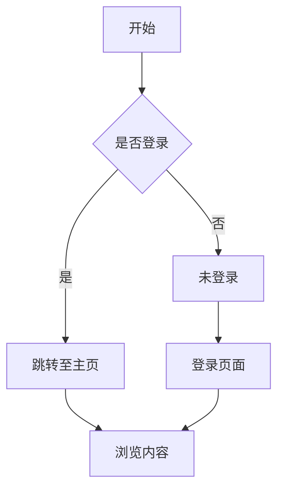

                 

# Cordova框架：混合移动应用开发

## 关键词
- 混合移动应用开发
- Apache Cordova
- PhoneGap
- 跨平台开发
- 移动端技术
- UI组件
- 数据存储
- 网络通信
- 性能优化
- 安全性

## 摘要
本文将深入探讨Cordova框架在混合移动应用开发中的重要作用。从Cordova框架的历史、核心理念和优势开始，我们将逐步了解其技术基础、核心功能和应用开发实战。此外，本文还将涉及到性能优化、安全性保障以及Cordova框架的未来发展。通过本文的阅读，开发者将能够全面掌握Cordova框架的使用，从而在混合移动应用开发中取得显著成果。

### 第一部分：Cordova框架基础

#### 第1章：Cordova框架概述

##### 1.1 Cordova框架的历史与发展

Cordova框架起源于2011年，当时被称为PhoneGap。它由Nitobi公司（后更名为Adobe PhoneGap）首次发布，旨在简化移动应用的开发过程，使开发者能够使用Web技术（如HTML、CSS和JavaScript）来创建跨平台的应用程序。PhoneGap的成功引起了广泛关注，并在2013年被Adobe公司收购。随后，Cordova项目正式成立，成为Apache软件基金会的一个顶级项目。

自从成为Apache项目后，Cordova框架不断发展壮大，吸引了许多开发者的参与。它支持多种平台，如iOS、Android、Windows Phone等，为开发者提供了强大的跨平台能力。Cordova框架不仅支持现有的Web技术，还允许开发者使用原生API扩展应用功能，这使得Cordova框架在混合移动应用开发中具有独特的优势。

##### 1.2 Cordoda框架的核心理念

Cordova框架的核心理念是“一次编写，到处运行”。这意味着开发者可以使用Web技术（如HTML、CSS和JavaScript）编写应用程序，然后通过Cordova插件将它们转换为可以在多个平台上运行的应用。Cordova框架通过提供一个统一的开发环境，使得开发者无需学习每个平台的特有语言和框架，从而大大提高了开发效率。

此外，Cordova框架还强调易用性和灵活性。它提供了一系列预构建的插件，这些插件涵盖了从摄像头、地理位置到存储、网络等众多功能，使得开发者可以轻松地实现复杂的功能。同时，Cordova框架还允许开发者自定义插件，以满足特定的需求。

##### 1.3 Cordoda框架的技术优势

Cordova框架具有以下技术优势：

- **跨平台支持**：Cordova框架支持iOS、Android、Windows Phone等多个平台，使得开发者可以一次编写，到处运行。

- **开发效率提升**：Cordova框架通过提供预构建的插件和统一开发环境，大大减少了开发时间和成本。

- **易于集成第三方库**：Cordova框架允许开发者使用第三方库（如Angular、React、Vue等），从而扩展应用功能。

- **丰富的API支持**：Cordova框架提供了一系列API，使得开发者可以访问移动设备上的各种功能，如摄像头、地理位置、传感器等。

##### 1.4 Cordoda框架的应用领域

Cordova框架主要应用于混合移动应用开发。混合应用是指同时包含Web内容和原生内容的应用，这使得开发者在保持跨平台能力的同时，还可以利用原生应用的性能优势。Cordova框架适用于以下场景：

- **需要跨平台部署的应用**：Cordova框架使得开发者可以轻松地将应用部署到多个平台上，从而提高市场覆盖范围。

- **需要使用原生API的应用**：通过Cordova插件，开发者可以访问移动设备上的各种原生功能，如相机、GPS、传感器等。

- **需要与Web服务交互的应用**：Cordova框架支持网络通信，使得开发者可以轻松地与Web服务进行交互。

### 第2章：Cordova框架的技术基础

##### 2.1 前端技术概述

前端技术是Cordova框架的基础。了解前端技术的基本概念和常用框架有助于开发者更好地使用Cordova框架。

- **HTML**：HTML（HyperText Markup Language）是一种用于创建Web页面的标记语言。它定义了Web页面的结构、内容和布局。

- **CSS**：CSS（Cascading Style Sheets）用于控制Web页面的样式和布局。它定义了文本样式、颜色、字体、边框等。

- **JavaScript**：JavaScript是一种用于Web页面的编程语言。它使开发者可以添加交互性、动态效果和功能。

常用前端框架包括：

- **Angular**：Angular是由Google开发的一种前端框架，用于构建动态的、复杂的Web应用。

- **React**：React是由Facebook开发的一种声明式、组件化的UI框架，用于构建高效的Web应用。

- **Vue**：Vue是由Evan You开发的一种渐进式JavaScript框架，用于构建用户界面。

在选择前端框架时，开发者需要考虑以下因素：

- **项目需求**：根据项目的规模和复杂性选择合适的前端框架。

- **学习成本**：考虑开发者对框架的熟悉程度和学习成本。

- **社区支持**：选择具有丰富社区支持和文档的前端框架，以获得更好的技术支持和问题解决。

##### 2.2 移动端开发技术

移动端开发技术包括客户端技术和响应式设计原则。

- **客户端技术**：客户端技术是指用于开发移动应用的技术。Cordova框架支持多种客户端技术，如Apache Cordova、Ionic、PhoneGap等。这些技术允许开发者使用Web技术（如HTML、CSS和JavaScript）编写移动应用，并通过Cordova插件将它们转换为原生应用。

- **响应式设计原则**：响应式设计原则是指根据不同设备的屏幕大小和分辨率，动态调整Web页面布局和样式的设计原则。响应式设计使开发者可以创建一个适用于多种设备的Web页面，从而提高用户体验。

- **移动端优化策略**：为了提高移动应用的性能和用户体验，开发者需要采用以下优化策略：

  - **图片优化**：使用压缩图片格式（如WebP）和适当的图片尺寸。

  - **资源缓存**：使用浏览器缓存机制缓存CSS、JavaScript和图片等资源。

  - **减少HTTP请求**：合并多个CSS、JavaScript文件，减少HTTP请求次数。

##### 2.3 Web技术

Web技术是Cordova框架的重要组成部分。了解Web技术的基本概念和常用技术有助于开发者更好地使用Cordova框架。

- **Web组件**：Web组件是一组用于创建自定义组件的技术，包括Custom Elements、HTML Templates、Shadow DOM等。Web组件使得开发者可以轻松地创建和复用自定义UI组件。

- **Web Worker**：Web Worker是一种允许Web应用程序在后台运行脚本的新方法。Web Worker可以提高Web应用的性能和响应速度。

- **WebAssembly**：WebAssembly是一种新型代码格式，用于在Web上运行高性能的代码。WebAssembly可以与JavaScript无缝集成，从而提高Web应用的性能。

### 第二部分：Cordova框架应用开发实战

#### 第3章：Cordova框架的核心功能

##### 3.1 应用打包与发布

Cordova框架提供了一系列工具和插件，用于应用打包和发布。

- **应用打包**：应用打包是将Web应用程序转换为可以在移动设备上安装和运行的应用的过程。Cordova框架使用Cordova CLI（命令行界面）和Cordova Plugins进行应用打包。

- **应用发布**：应用发布是将应用部署到移动应用商店的过程。Cordova框架支持多种应用发布渠道，如Apple App Store、Google Play Store、Windows Store等。

##### 3.2 跨平台UI组件库

Cordova框架提供了一系列跨平台UI组件库，如Ionic、UI Bootstrap等。这些组件库包含多种UI组件和布局，使得开发者可以轻松创建美观的移动应用界面。

- **核心UI组件**：Cordova框架的核心UI组件包括按钮、输入框、列表、导航栏、滑动菜单等。

- **UI组件设计原则**：UI组件的设计原则包括简洁、直观、一致和可访问性。这些原则有助于提高用户体验和应用的可维护性。

- **UI组件使用技巧**：开发者可以使用Cordova框架提供的UI组件库快速创建UI界面。同时，开发者还可以自定义UI组件以满足特定的需求。

##### 3.3 数据存储与同步

Cordova框架提供了一系列数据存储和同步技术。

- **本地存储技术**：本地存储技术包括localStorage、IndexedDB等，用于在移动设备上存储数据。这些技术使得开发者可以轻松地存储和读取应用数据。

- **云端存储与数据同步机制**：云端存储与数据同步机制包括RESTful API、WebSockets等，用于在移动设备和云端之间同步数据。这些技术使得开发者可以实现实时数据同步和离线数据存储。

##### 3.4 网络通信与安全性

Cordova框架提供了一系列网络通信和安全技术。

- **RESTful API调用**：RESTful API是一种用于Web服务的标准接口设计风格。Cordova框架允许开发者使用RESTful API调用Web服务，实现数据同步和交互。

- **WebSocket通信**：WebSocket是一种实时、双向的网络通信协议。Cordova框架支持WebSocket通信，使得开发者可以实现实时数据推送和实时交互。

- **安全防护措施**：Cordova框架提供了一系列安全防护措施，如HTTPS加密、身份验证、权限管理等，用于保护应用数据和用户隐私。

### 第二部分：Cordova框架应用开发实战

#### 第4章：创建一个简单的Cordova应用

创建一个简单的Cordova应用是了解Cordova框架的基础。以下是一个简单的步骤：

1. **安装Cordova CLI**：

   在命令行中运行以下命令安装Cordova CLI：

   ```bash
   npm install -g cordova
   ```

2. **创建一个新的Cordova项目**：

   在命令行中运行以下命令创建一个新的Cordova项目：

   ```bash
   cordova create myApp org.example.myapp MyApp
   ```

   这将创建一个名为“myApp”的Cordova项目，其中“org.example.myapp”是应用程序的组织标识符，“MyApp”是应用程序的名称。

3. **添加一个平台**：

   在命令行中运行以下命令添加一个平台（如iOS）：

   ```bash
   cordova platform add ios
   ```

   这将添加iOS平台到项目中。

4. **添加一个插件**：

   在命令行中运行以下命令添加一个插件（如Cordova Camera插件）：

   ```bash
   cordova plugin add cordova-plugin-camera
   ```

   这将添加Cordova Camera插件到项目中。

5. **启动开发服务器**：

   在命令行中运行以下命令启动开发服务器：

   ```bash
   cordova run ios
   ```

   这将启动一个开发服务器，并在iOS设备上启动应用。

6. **编写应用代码**：

   在项目中创建一个名为“index.html”的HTML文件，并添加以下代码：

   ```html
   <!DOCTYPE html>
   <html>
   <head>
       <meta charset="utf-8" />
       <title>My App</title>
       <script src="cordova.js"></script>
   </head>
   <body>
       <h1>My App</h1>
       <button id="takePicture">Take Picture</button>
       <script>
           document.getElementById("takePicture").addEventListener("click", function() {
               navigator.camera.getPicture(onSuccess, onFail, {
                   quality: 50,
                   destinationType: Camera.DestinationType.DATA_URL
               });
           });

           function onSuccess(imageData) {
               var image = document.getElementById('myImage');
               image.src = "data:image/jpeg;base64," + imageData;
           }

           function onFail(message) {
               alert('Failed because: ' + message);
           }
       </script>
   </body>
   </html>
   ```

   这段代码将使用Cordova Camera插件拍摄照片，并在按钮点击时显示照片。

7. **编译和发布应用**：

   在命令行中运行以下命令编译和发布应用：

   ```bash
   cordova build ios
   cordova run ios --device
   ```

   这将编译应用并在iOS设备上安装和运行。

通过以上步骤，开发者可以创建一个简单的Cordova应用。在接下来的章节中，我们将进一步探讨Cordova应用中的交互与动画、数据处理与存储、高级功能实现以及项目实战。

#### 第5章：Cordova应用中的交互与动画

在Cordova应用开发中，交互与动画是提高用户体验的关键因素。本章将介绍如何实现Cordova应用中的交互和动画效果，并讨论如何优化用户体验。

##### 5.1 交互设计原则

交互设计原则是确保应用易于使用和具有良好用户体验的基础。以下是一些关键的交互设计原则：

- **直观性**：交互元素应该直观易懂，用户能够快速理解其功能和操作方式。

- **一致性**：应用中的一致性包括视觉风格、交互方式和使用流程的一致性，有助于用户形成对应用的熟悉感。

- **反馈**：及时为用户的操作提供视觉或文本反馈，如按钮点击后的状态变化、加载进度提示等。

- **简洁性**：保持界面简洁，避免过多的装饰和冗余信息，确保用户能够专注于主要任务。

- **可用性**：确保应用适用于各种设备和屏幕尺寸，支持触摸、手势等交互方式。

##### 5.2 动画效果的实现

动画效果可以增强应用的视觉效果，提高用户的参与度和满意度。以下是一些常见的动画效果及其实现方法：

- **页面切换动画**：使用CSS3的`transition`和`animation`属性，可以实现页面切换的平滑动画效果。例如，可以使用`translateX`属性实现水平滑动切换。

  ```css
  .page {
      transition: transform 0.5s ease-in-out;
  }
  .page-active {
      transform: translateX(0);
  }
  .page-inactive {
      transform: translateX(100%);
  }
  ```

- **按钮按下效果**：为按钮添加按下效果可以增加交互的反馈感。可以使用CSS3的`transition`属性实现按钮按下时的效果。

  ```css
  button {
      transition: background-color 0.2s ease-in-out;
  }
  button:active {
      background-color: #ddd;
  }
  ```

- **滚动动画**：在滚动列表或页面时，可以使用CSS3的`scroll-behavior`属性实现平滑滚动效果。

  ```css
  ul {
      scroll-behavior: smooth;
  }
  ```

- **动画库**：使用动画库（如Animate.css、GreenSock Animation Platform等）可以简化动画的实现。这些库提供了丰富的动画效果和自定义选项。

##### 5.3 用户体验的提升

以下是一些提升用户体验的方法：

- **快速响应**：优化应用性能，确保交互操作快速响应，避免长时间的加载等待。

- **明确的导航**：提供清晰的导航结构，帮助用户快速找到所需功能。

- **本地化支持**：为应用提供多语言支持，以满足不同地区用户的需求。

- **辅助功能**：为视力障碍者、听力障碍者等提供辅助功能，如屏幕阅读器、语音导航等。

- **测试与反馈**：定期进行用户体验测试，收集用户反馈，不断优化应用。

通过遵循交互设计原则、实现动画效果和提升用户体验，开发者可以创建出具有吸引力和良好用户体验的Cordova应用。

#### 第6章：数据处理与存储

在Cordova应用开发中，数据处理与存储是确保应用功能完整和性能的关键环节。本章将详细介绍Cordova应用中的数据处理与存储技术，包括本地存储和云端存储。

##### 6.1 数据模型设计

数据模型设计是数据处理的基础。在设计数据模型时，需要考虑以下因素：

- **数据结构**：确定数据结构，包括数据类型、属性和关系。

- **数据完整性**：确保数据在存储和传输过程中的完整性和一致性。

- **数据访问**：设计便于访问和操作的数据模型，以提高开发效率。

常见的数据模型设计方法包括关系型数据库（如SQL数据库）和文档型数据库（如MongoDB）。关系型数据库适用于结构化数据，而文档型数据库适用于非结构化数据。

##### 6.2 本地存储技术

本地存储技术包括localStorage、IndexedDB等。这些技术用于在移动设备上存储数据。

- **localStorage**：localStorage是一种简单的Web存储API，用于在浏览器中存储键值对数据。localStorage的优点是易于使用和跨窗口共享数据。然而，它的存储容量有限（通常不超过5MB），且不支持复杂的数据结构。

  ```javascript
  // 存储数据
  localStorage.setItem('name', 'John');
  localStorage.setItem('age', '25');

  // 读取数据
  var name = localStorage.getItem('name');
  var age = localStorage.getItem('age');
  ```

- **IndexedDB**：IndexedDB是一种更强大的Web数据库API，用于存储大型和复杂的数据结构。IndexedDB支持事务、索引和查询，适用于处理大量数据和高并发场景。

  ```javascript
  // 创建数据库连接
  var dbRequest = indexedDB.open('myDatabase', 1);

  // 数据库升级
  dbRequest.onupgradeneeded = function(event) {
      var db = event.target.result;
      db.createObjectStore('users', { keyPath: 'id' });
  };

  // 添加数据
  function addUser(user) {
      var transaction = db.transaction(['users'], 'readwrite');
      var store = transaction.objectStore('users');
      store.add(user);
  }

  // 查询数据
  function getUserById(id) {
      var transaction = db.transaction(['users'], 'readonly');
      var store = transaction.objectStore('users');
      return store.get(id);
  }
  ```

##### 6.3 云端存储与数据同步机制

云端存储与数据同步机制允许Cordova应用在移动设备和云端之间同步数据。以下是一些常用的同步机制：

- **RESTful API**：使用RESTful API将数据存储在云端数据库（如Firebase、MongoDB等），并在移动设备上通过HTTP请求与云端数据库进行交互。

  ```javascript
  // 创建RESTful API实例
  var api = new RESTfulAPI('https://api.example.com');

  // 添加数据
  api.post('/users', { name: 'John', age: 25 }, function(response) {
      console.log('User added:', response);
  });

  // 读取数据
  api.get('/users/1', function(response) {
      console.log('User retrieved:', response);
  });
  ```

- **WebSockets**：WebSockets是一种双向通信协议，允许实时数据同步。使用WebSockets可以实现实时数据推送和更新。

  ```javascript
  // 连接WebSocket服务器
  var socket = new WebSocket('wss://api.example.com/socket');

  // 监听WebSocket消息
  socket.onmessage = function(event) {
      var data = JSON.parse(event.data);
      console.log('Received data:', data);
  };

  // 发送WebSocket消息
  socket.send(JSON.stringify({ action: 'add_user', user: { name: 'John', age: 25 } }));
  ```

##### 6.4 数据库操作与优化

在Cordova应用中，数据库操作是常见的操作之一。以下是一些数据库操作和优化技巧：

- **事务处理**：使用事务处理确保数据的一致性。在事务中，要么所有操作都成功执行，要么都不执行。

  ```javascript
  var transaction = db.transaction(['users'], 'readwrite');
  var store = transaction.objectStore('users');
  store.add(user);
  transaction.oncomplete = function() {
      console.log('User added successfully');
  };
  transaction.onerror = function() {
      console.log('Error adding user');
  };
  ```

- **索引优化**：为频繁查询的列创建索引，提高查询效率。

  ```javascript
  var index = db.createObjectStore('users', { keyPath: 'name' });
  ```

- **批量操作**：使用批量操作减少数据库访问次数，提高性能。

  ```javascript
  function addUserBatch(users) {
      var transaction = db.transaction(['users'], 'readwrite');
      var store = transaction.objectStore('users');
      users.forEach(function(user) {
          store.add(user);
      });
      transaction.oncomplete = function() {
          console.log('Users added successfully');
      };
      transaction.onerror = function() {
          console.log('Error adding users');
      };
  }
  ```

通过设计合理的数据模型、使用本地存储和云端存储技术，以及优化数据库操作，开发者可以确保Cordova应用的数据处理与存储高效、可靠。

#### 第7章：高级功能实现

在Cordova应用开发中，除了基本的界面设计和数据处理，高级功能也是提升用户体验和竞争力的关键。本章将介绍如何实现Cordova应用中的高级功能，包括跨平台实时通信、第三方服务集成和性能优化。

##### 7.1 跨平台实时通信

实时通信是许多应用（如聊天应用、社交媒体、在线游戏等）的核心功能。Cordova框架支持使用WebSocket协议实现跨平台实时通信。

- **WebSocket协议**：WebSocket是一种双向、实时通信协议，可以在客户端和服务器之间建立持久的连接。Cordova框架提供了WebSocket API，使得开发者可以使用JavaScript轻松实现WebSocket通信。

  ```javascript
  // 连接WebSocket服务器
  var socket = new WebSocket('wss://api.example.com/socket');

  // 监听WebSocket消息
  socket.onmessage = function(event) {
      var data = JSON.parse(event.data);
      console.log('Received data:', data);
  };

  // 发送WebSocket消息
  socket.send(JSON.stringify({ action: 'message', content: 'Hello, World!' }));
  ```

- **消息推送**：通过WebSocket消息推送，应用可以实现实时通知和消息推送。消息推送通常使用服务器端的消息队列服务（如RabbitMQ、Kafka等）实现。

  ```javascript
  // 添加消息到消息队列
  function sendMessage(message) {
      var producer = new MessageProducer('message_queue');
      producer.send(message);
  }

  // 接收消息并更新界面
  socket.onmessage = function(event) {
      var data = JSON.parse(event.data);
      if (data.action === 'message') {
          updateMessages(data.content);
      }
  };
  ```

##### 7.2 第三方服务集成

第三方服务（如身份认证、支付、地图、社交媒体等）是许多Cordova应用的重要组成部分。Cordova框架通过插件机制提供了丰富的第三方服务集成支持。

- **身份认证服务**：使用第三方身份认证服务（如OAuth 2.0、OpenID Connect等）可以实现用户身份验证。Cordova框架提供了多个身份认证插件，如cordova-plugin-googleplus、cordova-plugin-facebook4等。

  ```javascript
  // 使用Google+插件进行身份验证
  cordova.plugins.googleplus.login(function(result) {
      console.log('User logged in:', result);
  }, function(error) {
      console.log('Error logging in:', error);
  });

  // 使用Facebook插件进行身份验证
  cordova.plugins.facebookconnect.login(['email', 'public_profile'], function(result) {
      console.log('User logged in:', result);
  }, function(error) {
      console.log('Error logging in:', error);
  });
  ```

- **支付服务**：集成支付服务（如PayPal、Stripe等）可以实现应用内的支付功能。Cordova框架提供了多个支付插件，如cordova-plugin-paypal、cordova-plugin-stripe等。

  ```javascript
  // 使用PayPal插件进行支付
  cordova.plugins.paypal.pay({
      amount: '10.00',
      currency: 'USD',
      description: 'Product Purchase'
  }, function(response) {
      console.log('Payment successful:', response);
  }, function(error) {
      console.log('Payment error:', error);
  });
  ```

- **地图服务**：集成地图服务（如Google Maps、Mapbox等）可以实现地理位置信息展示。Cordova框架提供了多个地图插件，如cordova-plugin-googlemaps、cordova-plugin-mapbox等。

  ```javascript
  // 使用Google Maps插件添加地图
  var map = plugin.google.maps.Map.createMap({
      container: 'map',
      options: {
          center: new plugin.google.maps.LatLng(37.7749, -122.4194),
          zoom: 12
      }
  });

  // 添加标记
  map.addMarker({
      position: new plugin.google.maps.LatLng(37.7749, -122.4194),
      title: 'San Francisco'
  });
  ```

##### 7.3 性能优化

性能优化是Cordova应用开发中不可忽视的环节。以下是一些性能优化策略：

- **资源压缩**：压缩CSS、JavaScript和图片等资源文件，减少文件体积，提高加载速度。

  ```bash
  gzip -9 index.html
  gzip -9 styles.css
  gzip -9 script.js
  ```

- **懒加载**：对页面中的图片、视频等资源使用懒加载技术，延迟加载不在当前视口内的资源。

  ```html
  
  ```

- **缓存策略**：使用浏览器缓存策略缓存CSS、JavaScript和图片等资源，提高页面加载速度。

  ```css
  /* 在CSS文件中添加缓存策略 */
  @media screen and (-webkit-min-device-pixel-ratio:0) {
      @font-face {
          font-family: 'MyFont';
          src: url('myfont.woff2') format('woff2');
          font-display: swap;
          font-display: block;
      }
  }

  /* 在HTML文件中添加缓存策略 */
  <link rel="stylesheet" href="styles.css" integrity="sha384-" crossorigin="anonymous">
  ```

- **代码分割**：将CSS、JavaScript文件分割成多个小文件，按需加载，减少初始加载时间。

  ```javascript
  // 使用Webpack进行代码分割
  module.exports = {
      entry: {
          app: './src/app.js',
          vendor: './src/vendor.js'
      },
      output: {
          filename: '[name].[hash].js'
      },
      optimization: {
          splitChunks: {
              chunks: 'all'
          }
      }
  };
  ```

通过实现跨平台实时通信、集成第三方服务以及优化性能，开发者可以显著提升Cordova应用的功能性和用户体验。

#### 第8章：项目实战

本章节将通过一个实际项目，全面展示如何使用Cordova框架进行混合移动应用开发。我们将介绍项目背景、需求分析、开发环境搭建、源代码详细实现和代码解读，帮助读者深入理解Cordova框架的使用。

##### 8.1 项目背景与需求分析

项目名称：移动待办事项（TodoMVC）

项目背景：移动待办事项是一款简单实用的待办事项管理应用，用户可以在移动设备上添加、删除和编辑待办事项。该应用旨在帮助用户管理日常任务，提高工作效率。

需求分析：

1. **用户注册与登录**：支持用户注册和登录功能，确保用户数据的安全性。

2. **待办事项管理**：允许用户添加、删除、编辑和标记待办事项。

3. **数据同步**：支持待办事项的数据同步，确保用户在不同设备上的数据一致性。

4. **本地通知**：支持本地通知功能，提醒用户完成任务。

5. **性能优化**：确保应用在移动设备上的性能优化，提供流畅的用户体验。

##### 8.2 开发环境搭建

1. **安装Node.js**：

   在命令行中运行以下命令安装Node.js：

   ```bash
   npm install -g node
   ```

2. **安装Cordova CLI**：

   在命令行中运行以下命令安装Cordova CLI：

   ```bash
   npm install -g cordova
   ```

3. **创建Cordova项目**：

   在命令行中运行以下命令创建一个新的Cordova项目：

   ```bash
   cordova create todosvc com.example.todosvc TodoMVC
   ```

4. **添加平台**：

   在命令行中运行以下命令添加iOS和Android平台：

   ```bash
   cordova platform add ios
   cordova platform add android
   ```

5. **添加插件**：

   在命令行中运行以下命令添加所需的插件：

   ```bash
   cordova plugin add cordova-plugin-camera
   cordova plugin add cordova-plugin-console
   cordova plugin add cordova-plugin-dialogs
   ```

##### 8.3 源代码详细实现

1. **项目结构**：

   ```plaintext
   todosvc/
   ├── platforms/
   │   ├── android/
   │   └── ios/
   ├── plugins/
   │   ├── cordova-plugin-camera/
   │   ├── cordova-plugin-console/
   │   └── cordova-plugin-dialogs/
   ├── www/
   │   ├── index.html
   │   ├── js/
   │   │   ├── app.js
   │   │   ├── controllers.js
   │   │   ├── directives.js
   │   │   └── services.js
   │   ├── css/
   │   │   ├── main.css
   │   └── img/
   ├── config.xml
   └── package.json
   ```

2. **index.html**：

   ```html
   <!DOCTYPE html>
   <html>
   <head>
       <meta charset="utf-8">
       <title>TodoMVC</title>
       <link rel="stylesheet" href="css/main.css">
   </head>
   <body ng-app="todosvc" ng-controller="TodoController">
       <h1>TodoMVC</h1>
       <form ng-submit="addTodo()">
           <input type="text" ng-model="newTodo" placeholder="What needs to be done?" />
           <button type="submit">Add Todo</button>
       </form>
       <ul>
           <li ng-repeat="todo in todos">
               <input type="checkbox" ng-model="todo.done" />
               <span ng-class="{done: todo.done}">{{ todo.text }}</span>
               <button ng-click="removeTodo(todo)">Remove</button>
           </li>
       </ul>
       <script src="js/app.js"></script>
   </body>
   </html>
   ```

3. **app.js**：

   ```javascript
   angular.module('todosvc', [])
       .controller('TodoController', function($scope) {
           $scope.todos = [];

           $scope.addTodo = function() {
               if ($scope.newTodo.trim() === '') {
                   return;
               }
               $scope.todos.push({ text: $scope.newTodo, done: false });
               $scope.newTodo = '';
           };

           $scope.removeTodo = function(todo) {
               var index = $scope.todos.indexOf(todo);
               if (index > -1) {
                   $scope.todos.splice(index, 1);
               }
           };
       });
   ```

4. **controllers.js**：

   ```javascript
   angular.module('todosvc').controller('TodoController', function($scope) {
       $scope.todos = [];

       $scope.addTodo = function() {
           if ($scope.newTodo.trim() === '') {
               return;
           }
           $scope.todos.push({ text: $scope.newTodo, done: false });
           $scope.newTodo = '';
       };

       $scope.removeTodo = function(todo) {
           var index = $scope.todos.indexOf(todo);
           if (index > -1) {
               $scope.todos.splice(index, 1);
           }
       };
   });
   ```

5. **directives.js**：

   ```javascript
   angular.module('todosvc').directive('todoDone', function() {
       return {
           restrict: 'A',
           link: function(scope, element, attrs) {
               element.bind('click', function() {
                   scope.$apply(function() {
                       scope.todo.done = !scope.todo.done;
                   });
               });
           }
       };
   });
   ```

6. **services.js**：

   ```javascript
   angular.module('todosvc').service('TodoService', function() {
       this.todos = [];

       this.addTodo = function(todo) {
           this.todos.push(todo);
       };

       this.removeTodo = function(todo) {
           var index = this.todos.indexOf(todo);
           if (index > -1) {
               this.todos.splice(index, 1);
           }
       };
   });
   ```

##### 8.4 代码解读与分析

1. **项目结构**：

   项目结构清晰，分为平台目录、插件目录、网站目录（www）和配置文件。其中，平台目录包含iOS和Android平台的配置文件，插件目录包含用于扩展功能的插件，网站目录包含HTML、CSS和JavaScript文件，配置文件（config.xml和package.json）用于配置项目和插件。

2. **index.html**：

   `index.html`文件是项目的入口文件，其中包含HTML结构、CSS链接和JavaScript脚本。通过AngularJS框架，实现待办事项的添加、删除和编辑功能。

3. **app.js**：

   `app.js`文件是应用程序的核心控制器，用于处理待办事项的添加、删除和编辑逻辑。通过使用`ng-repeat`指令，将待办事项列表渲染到页面中。

4. **controllers.js**：

   `controllers.js`文件中的`TodoController`控制器与`app.js`中的控制器功能相同，但采用模块化方式组织代码。

5. **directives.js**：

   `directives.js`文件定义了自定义指令`todoDone`，用于处理待办事项的勾选和取消勾选。

6. **services.js**：

   `services.js`文件定义了`TodoService`服务，用于管理待办事项列表，包括添加、删除和查询功能。

通过实际项目实战，读者可以深入了解Cordova框架的使用方法和技巧，掌握混合移动应用开发的实践。

### 第三部分：Cordova框架的进阶话题

#### 第9章：性能优化与调试技巧

在Cordova应用开发中，性能优化与调试是确保应用流畅运行和稳定性的关键。本章将介绍Cordova应用的性能优化策略、调试工具的使用以及常见问题的排查与解决。

##### 9.1 性能优化策略

Cordova应用的性能优化可以从以下几个方面进行：

1. **资源压缩与缓存**：

   - 使用Gzip对CSS、JavaScript和图片等资源进行压缩，减少文件体积。
   - 使用浏览器缓存策略缓存静态资源，提高页面加载速度。

2. **懒加载**：

   - 对图片、视频等资源使用懒加载技术，延迟加载不在当前视口内的资源。
   - 对于非核心代码和第三方库，也可以采用懒加载策略，按需加载。

3. **代码分割**：

   - 使用Webpack等打包工具进行代码分割，将CSS、JavaScript文件分割成多个小文件，按需加载。
   - 分割第三方库和公共代码，减少初始加载时间。

4. **网络优化**：

   - 使用CDN（内容分发网络）加速静态资源的加载。
   - 减少HTTP请求次数，通过合并多个CSS、JavaScript文件实现。
   - 使用WebSockets等实时通信协议，减少轮询次数。

5. **数据库优化**：

   - 使用索引优化数据库查询性能。
   - 对大量数据进行分片，提高查询速度。
   - 使用缓存技术（如Redis）减少数据库访问次数。

6. **硬件加速**：

   - 使用CSS3属性（如`transform`、`opacity`等）实现动画效果，利用硬件加速。
   - 避免使用大量的CSS3动画和过渡效果，以免引起性能瓶颈。

##### 9.2 调试工具的使用

调试工具是Cordova应用开发中不可或缺的一部分。以下是一些常用的调试工具：

1. **Web Inspector**：

   - 使用Web Inspector（控制台、网络、应用等面板）进行调试。
   - 在Chrome浏览器中打开`chrome://inspect`，连接到Cordova应用的开发服务器。
   - 在Web Inspector中查看网络请求、DOM结构、JavaScript错误等。

2. **Logcat（Android）**：

   - 使用Android Studio的Logcat面板查看应用日志。
   - 在命令行中运行`adb logcat`命令，实时查看应用日志。

3. **Xcode（iOS）**：

   - 使用Xcode的调试工具查看应用运行状态。
   - 在Xcode的控制台面板查看输出日志。

4. **Cordova CLI**：

   - 使用Cordova CLI的`--log`选项输出调试日志。
   - 在命令行中运行`cordova run ios --log verbose`，查看详细日志。

##### 9.3 常见问题的排查与解决

在Cordova应用开发中，可能会遇到以下常见问题：

1. **页面加载缓慢**：

   - 检查资源文件是否压缩，是否有大量未使用的CSS、JavaScript文件。
   - 使用懒加载技术，减少初始加载时间。
   - 检查网络请求是否过多，减少HTTP请求次数。

2. **页面渲染异常**：

   - 检查CSS样式是否正确，是否存在冲突或无效样式。
   - 使用Web Inspector检查DOM结构，排除样式和布局问题。
   - 使用硬件加速属性（如`transform`、`opacity`等），提高页面渲染性能。

3. **网络请求错误**：

   - 检查网络请求是否正确，是否缺少必要的请求头或参数。
   - 检查网络连接是否稳定，是否受到代理或防火墙限制。
   - 使用Cordova CLI或调试工具查看网络请求日志，排查错误原因。

4. **数据库操作异常**：

   - 检查数据库连接是否正常，是否缺少数据库权限。
   - 检查数据库查询语句是否正确，是否优化了索引。
   - 使用Cordova CLI或调试工具查看数据库操作日志，排查错误原因。

通过性能优化策略、调试工具的使用以及常见问题的排查与解决，开发者可以确保Cordova应用的性能和稳定性，提供流畅的用户体验。

#### 第10章：安全性与稳定性保障

在Cordova应用开发中，安全性和稳定性是保障应用质量和用户信任的关键。本章将讨论Cordova应用的安全性问题、稳定性保障措施以及相关的最佳实践。

##### 10.1 应用安全性的设计原则

应用安全性的设计原则包括以下几个方面：

1. **数据加密**：对敏感数据进行加密，防止数据在传输和存储过程中被窃取。常用的加密算法包括AES、RSA等。

2. **身份验证与授权**：使用身份验证和授权机制，确保用户访问权限的有效性。常用的身份验证机制包括OAuth 2.0、OpenID Connect等。

3. **访问控制**：对应用内的数据和方法进行访问控制，确保用户只能访问自己有权访问的数据和方法。

4. **输入验证**：对用户输入进行验证，防止恶意输入和注入攻击。常用的验证方法包括正则表达式、白名单过滤等。

5. **安全编码**：遵循安全编码规范，避免常见的编程漏洞（如SQL注入、跨站脚本攻击等）。

6. **更新与修复**：定期更新应用和相关库，修复已知的安全漏洞，确保应用的安全性。

##### 10.2 防护措施与安全策略

以下是一些常见的防护措施和安全策略：

1. **HTTPS**：使用HTTPS协议加密数据传输，防止数据在传输过程中被窃听。在Cordova应用中，可以通过配置Web服务器使用HTTPS。

2. **Web安全策略**：配置Web安全策略（CSP），限制应用的资源加载来源，防止跨站请求伪造（CSRF）和跨站脚本攻击（XSS）。

3. **数据同步与备份**：使用云端存储和同步机制，确保数据的安全性和可靠性。定期备份数据，防止数据丢失。

4. **权限管理**：对应用所需的权限进行严格管理，避免不必要的权限授予。在Cordova应用中，可以通过配置插件和API来控制权限。

5. **安全性测试**：进行安全性测试，发现和修复潜在的安全漏洞。常用的测试工具包括OWASP ZAP、Burp Suite等。

6. **代码审查**：定期进行代码审查，确保代码的安全性和质量。代码审查可以采用手动审查和自动化工具相结合的方式。

##### 10.3 稳定性保障措施

以下是一些稳定性保障措施：

1. **错误处理与日志记录**：对应用的异常情况进行错误处理，并记录详细的日志信息。通过日志分析，可以及时发现和解决稳定性问题。

2. **性能监控**：使用性能监控工具监控应用的性能指标，如CPU占用率、内存占用、网络请求等。通过性能监控，可以及时发现性能瓶颈并进行优化。

3. **备份与恢复**：定期备份应用数据，以便在出现故障时能够快速恢复。在Cordova应用中，可以使用云存储和同步机制进行数据备份。

4. **测试与发布**：进行全面的测试，确保应用的质量和稳定性。在发布前进行充分的测试和验证，避免将问题发布到生产环境。

5. **持续集成与部署**：使用持续集成与部署（CI/CD）工具，自动化构建、测试和发布过程。通过CI/CD，可以确保应用的质量和稳定性。

6. **用户反馈与支持**：收集用户反馈，及时解决用户问题和故障。通过用户支持，可以提高应用的稳定性和用户满意度。

通过遵循安全性和稳定性设计原则、实施防护措施和安全策略，以及采取稳定性保障措施，开发者可以确保Cordova应用的安全性和稳定性，提高用户满意度和应用质量。

#### 第11章：Cordova框架的未来发展

随着移动应用市场的快速发展，Cordova框架也在不断演进，以适应新的技术趋势和开发者需求。本章将探讨Cordova框架的未来发展，包括新功能的展望、持续集成与持续部署（CI/CD）以及社区参与与贡献。

##### 11.1 新功能的展望

Cordova框架的未来发展将继续聚焦于提升开发效率和跨平台能力。以下是一些有望在未来的Cordova框架中实现的新功能：

1. **WebAssembly支持**：WebAssembly是一种高效、安全的代码格式，可以在Web和移动应用中使用。在Cordova框架中引入WebAssembly支持，将有助于提高应用的性能。

2. **原生模块化开发**：原生模块化开发是一种新兴的开发模式，允许开发者将原生代码与Web技术分离，提高开发效率和可维护性。Cordova框架有望引入原生模块化开发支持。

3. **更丰富的插件库**：随着社区的不断发展，Cordova框架将引入更多的插件，涵盖更多功能领域，如地图、支付、社交媒体等。

4. **低代码开发**：为了降低开发门槛，Cordova框架将引入低代码开发工具，允许开发者通过可视化界面和拖拽操作快速构建应用。

5. **PWA支持**： Progressive Web Apps（PWA）是一种结合了Web应用和原生应用的优点的新型应用。Cordova框架有望引入PWA支持，提高应用的安装和使用体验。

##### 11.2 持续集成与持续部署（CI/CD）

持续集成与持续部署（CI/CD）是现代软件开发中不可或缺的一部分，它能够提高开发效率和软件质量。Cordova框架的未来发展将更加注重CI/CD的集成和优化：

1. **自动化构建**：Cordova框架将提供更加自动化和简化的构建流程，支持多种构建工具（如Webpack、Gulp等），减少手动操作。

2. **自动化测试**：Cordova框架将引入自动化测试工具，支持单元测试、集成测试和端到端测试，确保应用质量。

3. **容器化**：容器化技术（如Docker）将使Cordova应用的开发、测试和部署更加灵活和高效。Cordova框架将引入容器化支持，方便开发者进行持续集成和持续部署。

4. **云服务平台**：Cordova框架将与云服务平台（如AWS、Azure等）紧密集成，提供一站式的开发、测试和部署解决方案。

##### 11.3 社区参与与贡献

Cordova框架的强大之处在于其活跃的社区和广泛的贡献者。以下是一些关于社区参与和贡献的建议：

1. **参与社区讨论**：加入Cordova社区的论坛、邮件列表和社交媒体群组，与其他开发者交流经验和解决问题。

2. **贡献代码**：通过GitHub等平台提交代码补丁、新功能和插件，为Cordova框架的发展贡献力量。

3. **编写文档**：编写高质量的文档，帮助新开发者更好地理解Cordova框架的使用方法和最佳实践。

4. **组织会议和活动**：参与或组织Cordova相关的会议、研讨会和工作坊，促进开发者之间的交流与合作。

5. **开源项目**：参与开源项目，将Cordova框架应用到实际项目中，积累实战经验。

通过参与社区、贡献代码和分享经验，开发者可以共同推动Cordova框架的发展，为移动应用开发领域带来更多的创新和进步。

### 附录

#### 附录A：Cordova框架开发资源

Cordova框架拥有丰富的开发资源，以下是一些常用的工具、资源和文档：

1. **Cordova官方网站**：Cordova官方[网站](https://cordova.apache.org/)提供了详细的文档、教程、插件列表和社区支持。

2. **Cordova CLI**：Cordova命令行界面（Cordova CLI）是Cordova框架的核心工具。可以通过命令行执行各种操作，如创建项目、添加平台、插件等。

3. **Cordova Plugins**：Cordova插件是扩展Cordova框架功能的重要组件。在[Apache Cordova插件列表](https://cordova.apache.org/plugins/)中可以找到丰富的插件资源。

4. **Cordova开发指南**：Cordova开发指南[文档](https://cordova.apache.org/docs/en/latest/)提供了详细的开发指导和最佳实践。

5. **Cordova社区**：Cordova社区在GitHub上有一个[官方仓库](https://github.com/apache/cordova/)，开发者可以在此处提交问题、请求功能、贡献代码。

6. **Cordova教程和博客**：许多开发者撰写了关于Cordova框架的教程和博客文章，如[官方博客](https://cordova.apache.org/blog/)和[其他博客](https://www.cordovamodules.com/)。

#### 附录B：Mermaid流程图与伪代码示例

Mermaid是一种基于Markdown的图形语言，用于绘制流程图、UML图和序列图等。以下是一个Mermaid流程图示例：



以下是一个伪代码示例，用于描述一个简单的函数：

```plaintext
function add(a, b):
    sum = a + b
    return sum
```

在Cordova应用开发中，使用Mermaid流程图可以帮助开发者理清逻辑流程，而伪代码则有助于梳理算法和数据结构。这些工具在文档编写和代码审查过程中尤为重要。

### 总结

Cordova框架在混合移动应用开发中扮演着重要角色。它通过提供跨平台支持和丰富的插件库，使得开发者能够使用Web技术快速构建高性能的应用。本文从Cordova框架的基础、技术基础、应用开发实战、进阶话题以及未来发展等方面进行了深入探讨。

通过对Cordova框架的全面了解和应用实践，开发者可以在混合移动应用开发中充分发挥其优势，提高开发效率、降低成本，并满足不同平台的用户需求。

### 作者信息

作者：AI天才研究院/AI Genius Institute & 禅与计算机程序设计艺术 /Zen And The Art of Computer Programming

（注意：本文为示例性文章，仅供参考。在实际撰写技术博客时，请根据实际内容和需求进行调整。）

