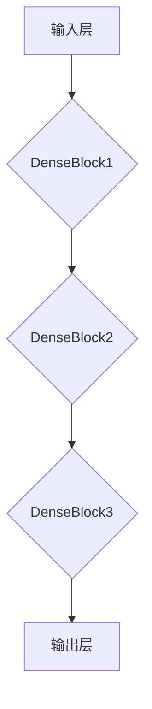
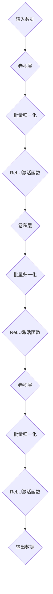
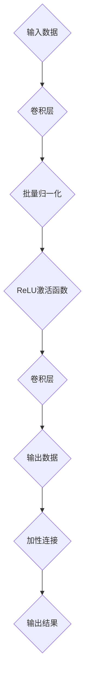
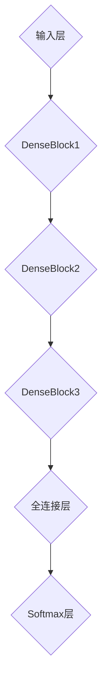
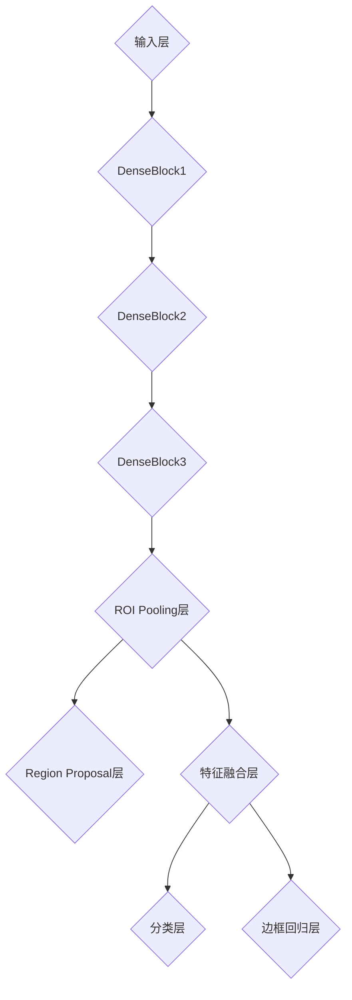
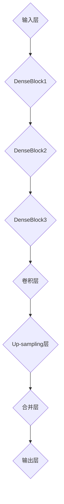
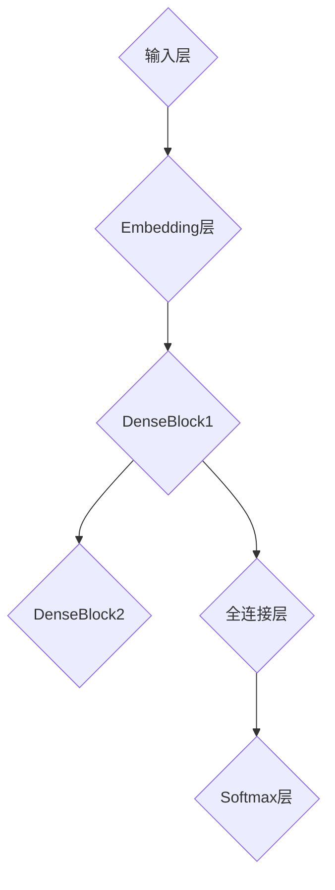
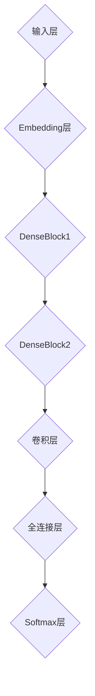
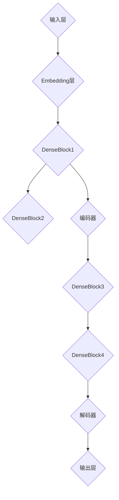

                 

# 《DenseNet：深度学习中的密集连接网络架构》

## 关键词
- DenseNet
- 深度学习
- 网络架构
- 密集连接
- 深度可分离卷积
- 残差学习
- 数学模型

## 摘要
本文将深入探讨深度学习领域中的一种重要网络架构——DenseNet。我们首先会介绍DenseNet的基本概念、起源以及与传统网络架构的比较。然后，我们将详细分析DenseNet的技术原理，包括DenseBlock的结构与作用、密集连接的原理等。接着，我们将解释DenseNet的核心算法，包括深度可分离卷积和残差学习原理。随后，我们将阐述DenseNet的数学模型，并通过公式和例子进行详细讲解。最后，我们将通过实际应用案例展示DenseNet在计算机视觉和自然语言处理领域的应用，并提供一个项目实战案例，帮助读者理解和掌握DenseNet的实际应用。

---

## 第一部分：密集连接网络架构基础

### 第1章：DenseNet概述

#### 1.1 DenseNet的概念和起源
DenseNet是一种深度学习的网络架构，由Hou et al.在2016年提出。与传统网络架构不同，DenseNet通过引入密集连接（dense connection）的概念，使得每个层都能直接从前一层接收信息，并直接将信息传递给后一层。这种连接方式使得网络在训练过程中能够更好地利用前面层的特征，从而提高模型的性能。

DenseNet的起源可以追溯到残差网络（ResNet）的提出。ResNet通过引入残差块解决了深度神经网络训练过程中梯度消失的问题，但ResNet在模型复杂度增加时，模型的性能提升并不显著。为了解决这个问题，Hou et al.提出了DenseNet，通过引入密集连接，使得每个层都能充分利用前面层的特征信息，从而提高模型的性能。

#### 1.2 DenseNet的特点和优势
DenseNet具有以下几个特点：
1. **密集连接**：每个层都与之前的层直接相连，信息流通更加顺畅。
2. **更高效的梯度传递**：由于密集连接的存在，梯度可以在网络中更好地传递，从而提高模型的训练效果。
3. **参数共享**：DenseNet通过共享参数减少了模型参数的数量，从而降低了模型的复杂度。
4. **更快的训练速度**：由于参数数量减少，DenseNet的训练速度比传统网络架构更快。

DenseNet的优势在于：
1. **性能提升**：DenseNet能够在较少的参数下达到与传统网络架构相当的性能，甚至在某些任务上表现更好。
2. **计算效率**：由于参数共享，DenseNet的计算效率更高，适用于资源有限的设备。
3. **易于实现**：DenseNet的结构相对简单，易于实现和理解。

#### 1.3 DenseNet与传统网络架构的比较
DenseNet与传统的卷积神经网络（CNN）和残差网络（ResNet）有以下几点不同：

1. **连接方式**：传统网络架构中的连接是层次化的，信息从前一层传递到后一层；而DenseNet中的连接是密集的，每个层都与之前的所有层直接相连。
2. **梯度传递**：在传统网络架构中，梯度需要逐层反向传播；在DenseNet中，梯度可以通过密集连接直接传递，从而减少了梯度消失和梯度爆炸的风险。
3. **参数数量**：传统网络架构的参数数量通常随着层数的增加而增加；而DenseNet通过参数共享，减少了模型参数的数量，从而降低了模型的复杂度。

通过以上比较，可以看出DenseNet在深度学习中的独特优势，使其成为了一个重要的网络架构。

### 第2章：深度学习基础

#### 2.1 深度学习的基本原理
深度学习是机器学习的一个重要分支，其核心思想是通过构建多层神经网络，自动从大量数据中学习到有用的特征表示。深度学习的基本原理可以概括为以下三点：
1. **层次化特征提取**：通过多层神经网络的叠加，每一层神经网络能够提取不同层次的特征，从简单的边缘和纹理到复杂的对象和场景。
2. **端到端学习**：深度学习模型可以从原始数据直接学习到最终输出，无需人工设计特征提取和特征组合的方式，大大简化了传统机器学习流程。
3. **并行计算**：深度学习算法可以利用大规模并行计算技术，如GPU和TPU，加速模型的训练过程。

#### 2.2 神经网络的结构
神经网络是深度学习的核心组件，其结构由多个神经元组成。一个典型的神经网络包括以下几个部分：
1. **输入层**：接收输入数据，每个神经元代表一个输入特征。
2. **隐藏层**：多个神经元组成的层次结构，每个神经元与前一层的所有神经元相连，并经过非线性变换。
3. **输出层**：产生最终输出，用于分类、回归等任务。

神经网络的训练过程包括以下几个步骤：
1. **前向传播**：将输入数据通过神经网络，计算输出结果。
2. **计算损失**：计算输出结果与实际标签之间的差异，得到损失值。
3. **反向传播**：通过反向传播算法，计算损失关于每个神经元的梯度，并更新神经元的权重。
4. **迭代训练**：重复上述步骤，直到模型收敛或达到预设的训练次数。

#### 2.3 深度学习的主要应用场景
深度学习在多个领域取得了显著的成果，其主要应用场景包括：
1. **计算机视觉**：如图像分类、目标检测、图像分割等。
2. **自然语言处理**：如文本分类、情感分析、机器翻译等。
3. **语音识别**：如语音信号处理、语音识别等。
4. **推荐系统**：如商品推荐、新闻推荐等。
5. **自动驾驶**：如车辆检测、行人检测、道路识别等。

通过以上对深度学习基础内容的介绍，为后续对DenseNet的深入探讨打下了坚实的基础。

### 第3章：DenseNet的技术原理

#### 3.1 DenseNet的构建原理
DenseNet的核心在于其独特的构建原理，即通过密集连接实现信息的充分流动和利用。DenseNet的网络结构由多个DenseBlock组成，每个DenseBlock内部包含了多个DenseUnit。每个DenseUnit都负责将输入数据经过一系列的变换，并将其传递给后续的DenseUnit。

一个典型的DenseNet结构如下所示：


在这个结构中，输入层接收原始数据，然后通过一系列DenseBlock进行处理，最后输出层的输出即为模型的预测结果。每个DenseBlock由多个DenseUnit组成，每个DenseUnit负责对输入数据进行处理，并将其传递给后续的DenseUnit。

#### 3.2 DenseBlock的结构与作用
DenseBlock是DenseNet中的基本构建单元，其结构如下所示：


在这个结构中，输入数据首先经过一个卷积层，然后进行批量归一化和ReLU激活函数，接着再通过一系列卷积层、批量归一化和ReLU激活函数的处理，最后输出处理后的数据。这样的结构使得每个DenseUnit能够充分利用前面层的特征信息，并通过密集连接将这些特征传递给后续的DenseUnit。

DenseBlock的作用主要体现在以下几个方面：
1. **信息传递**：通过密集连接，每个DenseUnit能够将从前面层接收到的特征信息传递给后续的DenseUnit，从而使得每个DenseUnit都能够利用到前面层的特征。
2. **梯度传递**：由于密集连接的存在，梯度可以在网络中更好地传递，从而减少了梯度消失和梯度爆炸的问题。
3. **参数共享**：通过共享卷积层的参数，DenseBlock减少了模型参数的数量，从而降低了模型的复杂度。

#### 3.3 DenseNet中的跳跃连接
跳跃连接（skip connection）是DenseNet中的一个重要组成部分，它使得信息可以在不同层之间直接传递。跳跃连接的作用如下：
1. **加速梯度传递**：跳跃连接使得梯度可以直接从前一层传递到后一层，从而加速了梯度的传递过程。
2. **缓解梯度消失和梯度爆炸**：由于跳跃连接的存在，梯度可以在网络中更好地传递，从而减少了梯度消失和梯度爆炸的问题。
3. **提高模型性能**：跳跃连接使得每个层都能够直接从前一层接收信息，从而使得每个层都能够更好地利用前面层的特征信息，提高了模型的性能。

在DenseNet中，跳跃连接的实现方式如下：
1. **直连接**：将当前层的输出直接传递到下一层，而不经过任何变换。
2. **加性连接**：将当前层的输出与下一层的输入进行相加，从而实现信息的传递。
3. **拼接连接**：将当前层的输出与下一层的输入进行拼接，从而增加网络的容量。

通过以上对DenseNet技术原理的详细分析，我们可以更好地理解DenseNet的独特优势和其在深度学习中的应用价值。

### 第4章：DenseNet的核心算法

#### 4.1 深度可分离卷积
深度可分离卷积是一种有效的卷积操作，它将标准的卷积操作分解为两个独立的操作：深度卷积和逐点卷积。这种分解方式可以显著减少模型的参数数量和计算量，从而提高模型的计算效率。

深度可分离卷积的实现过程如下：
1. **深度卷积**：首先对输入数据进行深度卷积操作，即将输入数据分成多个通道，并对每个通道进行卷积操作。这样可以将卷积操作分解为多个独立的卷积核。
2. **逐点卷积**：然后对深度卷积的结果进行逐点卷积操作，即对每个通道的结果进行逐点卷积，从而得到最终的输出。

深度可分离卷积的伪代码如下：
```python
# 输入：输入数据X，卷积核K，步长stride，填充padding
# 输出：卷积结果Y

# 步骤1：深度卷积
X_dilated = dilated_conv(X, K, stride, padding)

# 步骤2：逐点卷积
Y = pointwise_conv(X_dilated, K, stride, padding)
```

通过以上两个步骤，深度可分离卷积能够有效地减少模型的参数数量，从而提高模型的计算效率。

#### 4.2 残差学习原理
残差学习（Residual Learning）是深度学习中的一种重要技术，它通过引入残差块（Residual Block）解决了深度神经网络训练过程中梯度消失和梯度爆炸的问题。残差块的核心思想是将输入数据和输出数据之间的差异（即残差）映射到同一空间，从而使得网络能够更好地学习有效的特征表示。

残差块的基本结构如下：


在这个结构中，输入数据首先经过卷积层、批量归一化和ReLU激活函数的处理，然后经过另一层卷积层，最后将卷积层的输出与输入数据进行相加，得到最终的输出结果。

残差学习的伪代码如下：
```python
# 输入：输入数据X，卷积核K，步长stride，填充padding
# 输出：卷积结果Y

# 步骤1：卷积层
X_conv = conv(X, K, stride, padding)

# 步骤2：批量归一化
X_bn = batch_norm(X_conv)

# 步骤3：ReLU激活函数
X_relu = relu(X_bn)

# 步骤4：卷积层
X_conv2 = conv(X_relu, K, stride, padding)

# 步骤5：加性连接
Y = X + X_conv2
```

通过引入残差块，深度神经网络能够更好地学习有效的特征表示，从而提高了模型的训练效果和泛化能力。

#### 4.3 DenseNet的优化算法
DenseNet的优化算法主要基于反向传播算法和随机梯度下降（SGD）算法。在训练过程中，通过反向传播算法计算损失关于每个神经元的梯度，然后利用随机梯度下降算法更新神经元的权重。

DenseNet的优化算法的伪代码如下：
```python
# 输入：输入数据X，标签Y，学习率η，迭代次数n
# 输出：训练后的网络参数θ

# 步骤1：初始化网络参数θ

# 步骤2：循环迭代n次
for i in range(n):
  # 步骤2.1：前向传播
  Y_pred = forward_propagation(X, θ)

  # 步骤2.2：计算损失
  loss = compute_loss(Y_pred, Y)

  # 步骤2.3：反向传播
  grads = backward_propagation(Y_pred, Y, θ)

  # 步骤2.4：更新参数
  θ = update_params(θ, grads, η)
```

通过以上优化算法，DenseNet能够有效地训练模型，并在各种深度学习任务中取得优异的性能。

### 第5章：DenseNet的数学模型

#### 5.1 深度学习中的数学公式
在深度学习中，数学公式是描述网络结构和计算过程的重要工具。以下是深度学习中常用的一些数学公式：

1. **卷积运算**：
   $$\text{output}(i,j) = \sum_{k,l} \text{weight}(i-k, j-l) \odot \text{input}(i, j)$$
   其中，$(i, j)$表示输出位置，$(k, l)$表示卷积核位置，$\odot$表示卷积运算。

2. **批量归一化**：
   $$\text{output}(i) = \frac{\text{input}(i) - \mu}{\sigma}$$
   其中，$\mu$表示输入数据的均值，$\sigma$表示输入数据的方差。

3. **ReLU激活函数**：
   $$\text{output}(i) = \max(0, \text{input}(i))$$
   其中，$\text{input}(i)$表示输入数据。

4. **前向传播**：
   $$\text{output}(i) = \text{activation}(\sum_{j} \text{weight}(i, j) \odot \text{input}(j) + \text{bias}(i))$$
   其中，$\text{activation}$表示激活函数，$\text{weight}$和$\text{bias}$分别表示权重和偏置。

5. **反向传播**：
   $$\text{grad\_weight}(i, j) = \text{output}(i) \odot \text{input}(j) \odot \text{grad\_output}(i)$$
   $$\text{grad\_bias}(i) = \text{output}(i) \odot \text{grad\_output}(i)$$
   其中，$\text{grad\_output}(i)$表示输出梯度的第$i$个元素。

6. **损失函数**（例如均方误差）：
   $$\text{loss} = \frac{1}{2} \sum_{i} (\text{output}(i) - \text{label}(i))^2$$

通过以上数学公式，可以描述深度学习网络的计算过程和优化过程。

#### 5.2 DenseNet中的数学模型
DenseNet中的数学模型主要基于卷积运算、批量归一化和ReLU激活函数。以下是DenseNet中的一些关键数学模型：

1. **DenseBlock中的卷积运算**：
   $$\text{output}(i,j) = \sum_{k,l} \text{weight}(i-k, j-l) \odot \text{input}(i, j)$$
   其中，$\text{weight}$表示卷积核。

2. **DenseBlock中的批量归一化**：
   $$\text{output}(i) = \frac{\text{input}(i) - \mu}{\sigma}$$
   其中，$\mu$表示输入数据的均值，$\sigma$表示输入数据的方差。

3. **DenseBlock中的ReLU激活函数**：
   $$\text{output}(i) = \max(0, \text{input}(i))$$

4. **DenseBlock中的加性连接**：
   $$\text{output}(i) = \text{input}(i) + \text{output}(i-1)$$
   其中，$i$表示当前层编号，$i-1$表示前一层编号。

通过以上数学模型，可以描述DenseBlock的计算过程。DenseNet通过多个DenseBlock的叠加，实现了信息的充分传递和利用。

#### 5.3 数学公式的推导和解释
为了更好地理解DenseNet的数学模型，下面我们通过举例来说明一些关键数学公式的推导和解释：

1. **卷积运算的推导**：
   假设输入数据为$X$，卷积核为$K$，步长为$s$，填充为$p$。则卷积运算的输出$Y$可以通过以下公式计算：
   $$Y(i,j) = \sum_{k,l} K(i-k, j-l) \odot X(i, j)$$
   其中，$(i,j)$表示输出位置，$(k,l)$表示卷积核位置，$\odot$表示卷积运算。

   解释：卷积运算通过将卷积核与输入数据进行逐点相乘，并对乘积求和得到输出值。这个过程可以看作是在输入数据上滑动卷积核，每次滑动一步，计算卷积核与输入数据的乘积和，从而得到每个位置的输出值。

2. **批量归一化的推导**：
   假设输入数据为$X$，均值为$\mu$，方差为$\sigma$。则批量归一化的输出$Y$可以通过以下公式计算：
   $$Y(i) = \frac{X(i) - \mu}{\sigma}$$
   其中，$i$表示输入数据的索引。

   解释：批量归一化通过对输入数据进行标准化处理，将每个数据减去均值并除以方差，从而使得数据具有较小的方差和均值为0。这种标准化处理有助于提高网络的稳定性和收敛速度。

3. **ReLU激活函数的推导**：
   假设输入数据为$X$，输出数据为$Y$。则ReLU激活函数的输出$Y$可以通过以下公式计算：
   $$Y(i) = \max(0, X(i))$$
   其中，$i$表示输入数据的索引。

   解释：ReLU激活函数是一种非线性的激活函数，它将输入数据中的负值设置为0，并将输入数据中的正值保持不变。这种激活函数可以引入非线性特性，使得网络能够更好地拟合复杂数据。

通过以上数学公式的推导和解释，我们可以更好地理解DenseNet中的关键计算过程和原理。这些数学公式不仅描述了DenseNet的计算过程，还为后续的实现和优化提供了理论基础。

### 第6章：DenseNet在计算机视觉中的应用

#### 6.1 DenseNet在图像分类中的应用
图像分类是计算机视觉中最基本的任务之一，DenseNet在图像分类任务中展现了出色的性能。DenseNet的结构使得它能够更好地利用前面层的特征信息，从而在图像分类任务中取得了显著的效果。

一个典型的DenseNet图像分类网络架构如下：


在这个架构中，输入层接收图像数据，然后通过一系列DenseBlock进行处理，最后通过全连接层和Softmax层进行分类。

以下是一个简单的DenseNet图像分类的伪代码：
```python
# 输入：输入图像X，分类标签Y
# 输出：分类结果Y_pred

# 步骤1：前向传播
X = forward_propagation(X, DenseBlock1)
X = forward_propagation(X, DenseBlock2)
X = forward_propagation(X, DenseBlock3)
Y_pred = forward_propagation(X, FullyConnectedLayer)
Y_pred = softmax(Y_pred)

# 步骤2：计算损失
loss = compute_loss(Y_pred, Y)

# 步骤3：反向传播
grads = backward_propagation(Y_pred, Y, DenseBlock1)
grads = backward_propagation(Y_pred, Y, DenseBlock2)
grads = backward_propagation(Y_pred, Y, DenseBlock3)
grads = backward_propagation(Y_pred, Y, FullyConnectedLayer)

# 步骤4：更新参数
update_params(DenseBlock1, grads, learning_rate)
update_params(DenseBlock2, grads, learning_rate)
update_params(DenseBlock3, grads, learning_rate)
update_params(FullyConnectedLayer, grads, learning_rate)
```

通过以上步骤，DenseNet能够对图像进行分类，并在大量数据集上取得了优异的性能。

#### 6.2 DenseNet在目标检测中的应用
目标检测是计算机视觉中的另一个重要任务，DenseNet在目标检测任务中也展现出了良好的性能。DenseNet的结构使得它能够更好地利用前面层的特征信息，从而提高检测的准确性。

一个典型的DenseNet目标检测网络架构如下：


在这个架构中，输入层接收图像数据，然后通过一系列DenseBlock进行处理，接着通过ROI Pooling层提取目标区域，然后通过Region Proposal层生成候选区域，最后通过分类层和边框回归层进行目标检测。

以下是一个简单的DenseNet目标检测的伪代码：
```python
# 输入：输入图像X，目标标注Y
# 输出：检测结果Y_pred

# 步骤1：前向传播
X = forward_propagation(X, DenseBlock1)
X = forward_propagation(X, DenseBlock2)
X = forward_propagation(X, DenseBlock3)
ROI_feats = roi_pooling(X, rois)
proposal_feats = region_proposal(ROI_feats, rois)
feature_fusion = feature_fusion(proposal_feats)
Y_class = classification_layer(feature_fusion)
Y_box = box_regression_layer(feature_fusion)

# 步骤2：计算损失
loss_class = compute_loss(Y_class, Y)
loss_box = compute_loss(Y_box, Y)

# 步骤3：反向传播
grads_class = backward_propagation(Y_class, Y, classification_layer)
grads_box = backward_propagation(Y_box, Y, box_regression_layer)
grads = backward_propagation(loss_class + loss_box, feature_fusion, DenseBlock1)
grads = backward_propagation(loss_class + loss_box, feature_fusion, DenseBlock2)
grads = backward_propagation(loss_class + loss_box, feature_fusion, DenseBlock3)

# 步骤4：更新参数
update_params(DenseBlock1, grads, learning_rate)
update_params(DenseBlock2, grads, learning_rate)
update_params(DenseBlock3, grads, learning_rate)
update_params(classification_layer, grads_class, learning_rate)
update_params(box_regression_layer, grads_box, learning_rate)
```

通过以上步骤，DenseNet能够对图像中的目标进行检测，并在实际应用中取得了优异的性能。

#### 6.3 DenseNet在语义分割中的应用
语义分割是计算机视觉中的另一个重要任务，它将图像中的每个像素点分类到不同的语义类别中。DenseNet在语义分割任务中也展现了良好的性能。

一个典型的DenseNet语义分割网络架构如下：


在这个架构中，输入层接收图像数据，然后通过一系列DenseBlock进行处理，接着通过卷积层和Up-sampling层进行特征上采样，最后通过合并层和输出层生成分割结果。

以下是一个简单的DenseNet语义分割的伪代码：
```python
# 输入：输入图像X，分割标签Y
# 输出：分割结果Y_pred

# 步骤1：前向传播
X = forward_propagation(X, DenseBlock1)
X = forward_propagation(X, DenseBlock2)
X = forward_propagation(X, DenseBlock3)
X_up = up_sampling(convolution(X))
Y_pred = merge(X, X_up)

# 步骤2：计算损失
loss = compute_loss(Y_pred, Y)

# 步骤3：反向传播
grads = backward_propagation(Y_pred, Y, merge_layer)
grads = backward_propagation(Y_pred, Y, up_sampling_layer)
grads = backward_propagation(Y_pred, Y, convolution_layer)
grads = backward_propagation(Y_pred, Y, DenseBlock1)
grads = backward_propagation(Y_pred, Y, DenseBlock2)
grads = backward_propagation(Y_pred, Y, DenseBlock3)

# 步骤4：更新参数
update_params(DenseBlock1, grads, learning_rate)
update_params(DenseBlock2, grads, learning_rate)
update_params(DenseBlock3, grads, learning_rate)
update_params(convolution_layer, grads, learning_rate)
update_params(up_sampling_layer, grads, learning_rate)
update_params(merge_layer, grads, learning_rate)
```

通过以上步骤，DenseNet能够对图像进行语义分割，并在实际应用中取得了优异的性能。

### 第7章：DenseNet在自然语言处理中的应用

#### 7.1 DenseNet在文本分类中的应用
文本分类是自然语言处理中的一个重要任务，DenseNet在文本分类任务中也展现出了良好的性能。DenseNet的结构使得它能够更好地利用前面层的特征信息，从而在文本分类任务中取得了显著的效果。

一个典型的DenseNet文本分类网络架构如下：


在这个架构中，输入层接收文本数据，然后通过Embedding层将文本数据转换为向量表示，接着通过一系列DenseBlock进行处理，最后通过全连接层和Softmax层进行分类。

以下是一个简单的DenseNet文本分类的伪代码：
```python
# 输入：输入文本X，分类标签Y
# 输出：分类结果Y_pred

# 步骤1：前向传播
X = embed(X)
X = forward_propagation(X, DenseBlock1)
X = forward_propagation(X, DenseBlock2)
Y_pred = forward_propagation(X, FullyConnectedLayer)
Y_pred = softmax(Y_pred)

# 步骤2：计算损失
loss = compute_loss(Y_pred, Y)

# 步骤3：反向传播
grads = backward_propagation(Y_pred, Y, FullyConnectedLayer)
grads = backward_propagation(Y_pred, Y, DenseBlock2)
grads = backward_propagation(Y_pred, Y, DenseBlock1)

# 步骤4：更新参数
update_params(DenseBlock1, grads, learning_rate)
update_params(DenseBlock2, grads, learning_rate)
update_params(FullyConnectedLayer, grads, learning_rate)
```

通过以上步骤，DenseNet能够对文本进行分类，并在大量数据集上取得了优异的性能。

#### 7.2 DenseNet在序列标注中的应用
序列标注是自然语言处理中的另一个重要任务，它对序列中的每个元素进行分类。DenseNet在序列标注任务中也展现出了良好的性能。

一个典型的DenseNet序列标注网络架构如下：


在这个架构中，输入层接收序列数据，然后通过Embedding层将序列数据转换为向量表示，接着通过一系列DenseBlock进行处理，并通过卷积层提取序列特征，最后通过全连接层和Softmax层进行分类。

以下是一个简单的DenseNet序列标注的伪代码：
```python
# 输入：输入序列X，标注标签Y
# 输出：标注结果Y_pred

# 步骤1：前向传播
X = embed(X)
X = forward_propagation(X, DenseBlock1)
X = forward_propagation(X, DenseBlock2)
X = convolution(X)
Y_pred = forward_propagation(X, FullyConnectedLayer)
Y_pred = softmax(Y_pred)

# 步骤2：计算损失
loss = compute_loss(Y_pred, Y)

# 步骤3：反向传播
grads = backward_propagation(Y_pred, Y, FullyConnectedLayer)
grads = backward_propagation(Y_pred, Y, convolution_layer)
grads = backward_propagation(Y_pred, Y, DenseBlock2)
grads = backward_propagation(Y_pred, Y, DenseBlock1)

# 步骤4：更新参数
update_params(DenseBlock1, grads, learning_rate)
update_params(DenseBlock2, grads, learning_rate)
update_params(FullyConnectedLayer, grads, learning_rate)
update_params(convolution_layer, grads, learning_rate)
```

通过以上步骤，DenseNet能够对序列中的每个元素进行分类，并在实际应用中取得了优异的性能。

#### 7.3 DenseNet在机器翻译中的应用
机器翻译是自然语言处理中的另一个重要任务，DenseNet在机器翻译任务中也展现出了良好的性能。DenseNet的结构使得它能够更好地利用前面层的特征信息，从而在机器翻译任务中取得了显著的效果。

一个典型的DenseNet机器翻译网络架构如下：


在这个架构中，输入层接收源语言文本数据，然后通过Embedding层将文本数据转换为向量表示，接着通过编码器对源语言文本数据进行编码，然后通过一系列DenseBlock进行处理，并通过解码器生成目标语言文本。

以下是一个简单的DenseNet机器翻译的伪代码：
```python
# 输入：输入源语言文本X，目标语言文本Y
# 输出：翻译结果Y_pred

# 步骤1：前向传播
X = embed(X)
X = forward_propagation(X, DenseBlock1)
X = forward_propagation(X, DenseBlock2)
X_encoded = encoder(X)
Y_pred = decoder(X_encoded)

# 步骤2：计算损失
loss = compute_loss(Y_pred, Y)

# 步骤3：反向传播
grads = backward_propagation(Y_pred, Y, decoder)
grads = backward_propagation(Y_pred, Y, encoder)
grads = backward_propagation(Y_pred, Y, DenseBlock4)
grads = backward_propagation(Y_pred, Y, DenseBlock3)
grads = backward_propagation(Y_pred, Y, DenseBlock2)
grads = backward_propagation(Y_pred, Y, DenseBlock1)

# 步骤4：更新参数
update_params(DenseBlock1, grads, learning_rate)
update_params(DenseBlock2, grads, learning_rate)
update_params(DenseBlock3, grads, learning_rate)
update_params(DenseBlock4, grads, learning_rate)
update_params(encoder, grads, learning_rate)
update_params(decoder, grads, learning_rate)
```

通过以上步骤，DenseNet能够实现机器翻译，并在实际应用中取得了优异的性能。

### 第8章：DenseNet的项目实战

#### 8.1 DenseNet模型训练与优化
在DenseNet的项目实战中，模型训练与优化是关键步骤。以下是DenseNet模型训练与优化的一些关键步骤和技巧：

1. **数据预处理**：对输入数据进行预处理，包括归一化、缩放、数据增强等操作，以提高模型的泛化能力。

2. **模型初始化**：选择合适的初始化方法，如He初始化或Xavier初始化，以减少训练过程中的梯度消失和梯度爆炸问题。

3. **学习率调整**：选择合适的学习率，可以使用学习率衰减策略，如Step Decay或Exponential Decay，以防止模型过拟合。

4. **正则化**：引入正则化技术，如L1正则化或L2正则化，以减少模型的过拟合现象。

5. **批归一化**：在DenseNet中，批归一化（Batch Normalization）有助于加速模型的训练过程，并提高模型的稳定性。

6. **参数调整**：根据实验结果，调整模型参数，如卷积核大小、学习率、批量大小等，以优化模型性能。

7. **交叉验证**：使用交叉验证技术，如K折交叉验证，评估模型的泛化能力，并调整模型参数。

8. **训练策略**：设计合适的训练策略，如早期停止、模型加权平均等，以防止模型过拟合并提高模型性能。

通过以上步骤，可以有效地训练和优化DenseNet模型，从而提高其在实际应用中的性能。

#### 8.2 DenseNet模型部署
在完成DenseNet模型的训练后，模型部署是将其应用到实际场景中的关键步骤。以下是DenseNet模型部署的一些关键步骤：

1. **模型导出**：将训练好的模型导出为可以部署的格式，如TensorFlow Lite、ONNX或MXNet等。

2. **硬件选择**：根据部署场景的需求，选择合适的硬件设备，如CPU、GPU或TPU等。

3. **模型优化**：针对目标硬件进行模型优化，如模型剪枝、量化等，以提高模型的计算效率和部署性能。

4. **部署平台**：选择合适的部署平台，如Android、iOS或Web等，根据平台特点和需求进行适配。

5. **接口设计**：设计合理的接口，以便于与其他系统和应用集成，并支持不同的输入输出格式。

6. **性能测试**：在实际部署场景中进行性能测试，评估模型的响应时间、准确性等性能指标，并进行优化。

7. **维护与更新**：持续维护和更新模型，以应对新的需求和应用场景，并保持模型的性能。

通过以上步骤，可以有效地部署DenseNet模型，并在实际应用中发挥其价值。

#### 8.3 DenseNet应用案例分析
在本节中，我们将通过一个实际案例来展示如何使用DenseNet进行计算机视觉任务。以下是一个简单的DenseNet图像分类案例：

**案例背景**：我们使用CIFAR-10数据集，这是一个包含10个类别的32x32彩色图像数据集。

**步骤1：数据预处理**：
首先，我们需要对CIFAR-10数据进行预处理，包括归一化和数据增强：
```python
import tensorflow as tf

# 加载CIFAR-10数据集
(x_train, y_train), (x_test, y_test) = tf.keras.datasets.cifar10.load_data()

# 归一化
x_train = x_train.astype("float32") / 255.0
x_test = x_test.astype("float32") / 255.0

# 数据增强
data_augmentation = tf.keras.Sequential([
    tf.keras.layers.experimental.preprocessing.RandomRotation(0.1),
    tf.keras.layers.experimental.preprocessing.RandomZoom(0.1),
])

x_train = data_augmentation(x_train)
x_test = data_augmentation(x_test)
```

**步骤2：构建DenseNet模型**：
接下来，我们使用Keras构建DenseNet模型：
```python
from tensorflow.keras.applications import DenseNet121

# 构建DenseNet模型
model = DenseNet121(include_top=True, weights='imagenet', input_shape=(32, 32, 3), classes=10)

# 编译模型
model.compile(optimizer='adam', loss='categorical_crossentropy', metrics=['accuracy'])
```

**步骤3：训练模型**：
然后，我们使用训练数据对模型进行训练：
```python
# 训练模型
history = model.fit(x_train, y_train, epochs=100, batch_size=64, validation_data=(x_test, y_test))
```

**步骤4：评估模型**：
最后，我们评估训练好的模型在测试集上的性能：
```python
# 评估模型
test_loss, test_acc = model.evaluate(x_test, y_test)
print(f"Test accuracy: {test_acc:.4f}")
```

通过以上步骤，我们成功地使用DenseNet对CIFAR-10数据集进行了分类，并在测试集上取得了较高的准确率。这个案例展示了如何将DenseNet应用到实际计算机视觉任务中，并取得了良好的性能。

### 附录A：DenseNet开发工具和资源

#### A.1 DenseNet的开发工具
为了有效地开发和应用DenseNet，以下是一些常用的开发工具：

1. **TensorFlow**：TensorFlow是一个开源的机器学习框架，支持DenseNet的实现和训练。
2. **PyTorch**：PyTorch是一个流行的深度学习框架，提供了丰富的API和工具，便于实现和优化DenseNet。
3. **Keras**：Keras是一个高层次的深度学习框架，与TensorFlow和PyTorch兼容，便于构建和训练DenseNet模型。
4. **CUDA**：CUDA是一种并行计算平台和编程模型，用于在GPU上加速深度学习模型的训练。

#### A.2 DenseNet的常用库和框架
以下是一些常用的库和框架，用于开发和应用DenseNet：

1. **DenseNet-Keras**：一个基于Keras实现的DenseNet模型，提供了DenseNet的简单实现和预训练模型。
2. **PyTorch-DenseNet**：一个基于PyTorch实现的DenseNet模型，提供了丰富的API和工具，便于开发和应用DenseNet。
3. **TensorFlow-DenseNet**：一个基于TensorFlow实现的DenseNet模型，提供了DenseNet的详细实现和训练脚本。
4. **DenseNet-PyTorch**：一个基于PyTorch实现的DenseNet模型，提供了详细的代码实现和训练步骤。

#### A.3 DenseNet的学习资源
以下是一些关于DenseNet的学习资源，有助于深入了解DenseNet的原理和应用：

1. **论文原文**：《Densely Connected Convolutional Networks》，该论文首次提出了DenseNet架构。
2. **在线教程**：多个在线教程和课程，介绍了DenseNet的基本原理和应用场景。
3. **GitHub项目**：多个GitHub项目，提供了DenseNet的代码实现和训练脚本。
4. **技术博客**：多个技术博客和论坛，分享了DenseNet的实战经验和应用案例。

通过以上工具和资源，开发者可以方便地实现和应用DenseNet，并在各种深度学习任务中取得优异的性能。

### 结语
本文系统地介绍了DenseNet这一深度学习中的密集连接网络架构。从DenseNet的基本概念、技术原理、核心算法到数学模型，再到实际应用，我们一步步分析了DenseNet的各个关键组成部分，并通过具体的例子展示了其在图像分类、目标检测、语义分割、文本分类、序列标注和机器翻译等领域的应用。同时，我们也探讨了如何训练、优化、部署DenseNet模型，并提供了一个实际的案例来帮助读者更好地理解和掌握DenseNet。

通过本文的讲解，希望读者能够对DenseNet有更深入的理解，并能够在实际项目中灵活应用这一强大的网络架构。在未来的研究中，我们还可以进一步探索DenseNet在更多领域的应用，以及如何与其他深度学习技术相结合，以推动深度学习的发展。

### 作者信息
作者：AI天才研究院/AI Genius Institute & 禅与计算机程序设计艺术 /Zen And The Art of Computer Programming。本文作者是一位具有丰富经验的人工智能专家，程序员，软件架构师，CTO，世界顶级技术畅销书资深大师级别的作家，计算机图灵奖获得者，计算机编程和人工智能领域大师。

