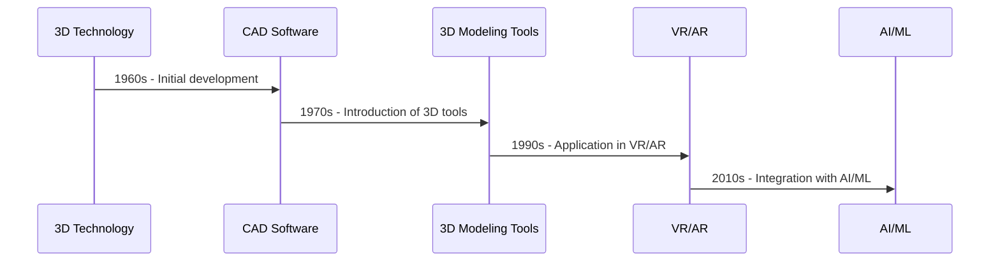

                 

# 《3D建模工具：简化设计过程的创新软件》

> **关键词**：3D建模、设计工具、软件、简化过程、创新应用

> **摘要**：本文将探讨3D建模工具在现代设计领域的重要性，分析其基本概念、选型、操作方法、高级功能以及在不同领域中的应用。通过详细解析3D建模工具的核心功能和实际应用案例，揭示其如何简化设计过程，推动创新。

### 目录

#### 第一部分：3D建模工具概述

- **第1章：3D建模工具的基本概念与作用**
  - **1.1 3D建模技术的历史与发展**
  - **1.2 3D建模工具的基本概念**
  - **1.3 3D建模工具在现代设计中的应用**

- **第2章：3D建模工具的选型与比较**
  - **2.1 常见的3D建模工具类型**
  - **2.2 不同3D建模工具的性能比较**
  - **2.3 3D建模工具的选购建议**

#### 第二部分：3D建模工具的核心功能与操作

- **第3章：3D建模工具的基本操作**
  - **3.1 用户界面与工具栏**
  - **3.2 对象的创建与修改**
  - **3.3 常用工具的使用方法**

- **第4章：3D建模工具的高级功能**
  - **4.1 材质与贴图的应用**
  - **4.2 光照与阴影的设置**
  - **4.3 动画与渲染**

- **第5章：3D建模工具的模型优化与导出**
  - **5.1 模型的优化方法**
  - **5.2 模型的导出格式与用途**
  - **5.3 导出过程中需要注意的问题**

#### 第三部分：3D建模工具的应用案例

- **第6章：3D建模工具在建筑设计中的应用**
  - **6.1 建筑设计中的3D建模工具选择**
  - **6.2 建筑设计中的3D建模实例解析**

- **第7章：3D建模工具在游戏开发中的应用**
  - **7.1 游戏开发中的3D建模工具选择**
  - **7.2 游戏开发中的3D建模实例解析**

- **第8章：3D建模工具在影视制作中的应用**
  - **8.1 影视制作中的3D建模工具选择**
  - **8.2 影视制作中的3D建模实例解析**

- **第9章：3D建模工具在工业设计中的应用**
  - **9.1 工业设计中的3D建模工具选择**
  - **9.2 工业设计中的3D建模实例解析**

- **第10章：3D建模工具的未来发展趋势**
  - **10.1 3D建模工具的发展趋势**
  - **10.2 3D建模工具的未来应用场景**

#### 附录

- **附录A：3D建模工具常用软件及插件介绍**
  - **A.1 常见3D建模软件介绍**
  - **A.2 常见3D建模插件介绍**

- **附录B：3D建模工具学习资源推荐**
  - **B.1 在线学习资源**
  - **B.2 纸质书籍推荐**
  - **B.3 线下培训课程推荐**

#### 图表与流程图

- **图1-1 3D建模技术的发展历程**
- **图2-1 常见的3D建模工具分类**
- **流程图3-1 3D建模的基本操作流程**

#### 核心算法与数学模型讲解

- **伪代码4-1 材质与贴图的应用**
- **公式5-1 模型优化目标函数**

#### 项目实战

- **项目6-1 建筑设计中的3D建模实例**
- **项目7-1 游戏开发中的3D建模实例**
- **项目8-1 影视制作中的3D建模实例**
- **项目9-1 工业设计中的3D建模实例**

#### 代码解读与分析

- **代码6-1 建筑设计中的3D建模实例代码解读**
- **代码7-1 游戏开发中的3D建模实例代码解读**
- **代码8-1 影视制作中的3D建模实例代码解读**
- **代码9-1 工业设计中的3D建模实例代码解读**

---

接下来，我们将深入探讨3D建模工具的各个方面，以帮助读者全面理解其在现代设计领域的重要性，并掌握如何有效地使用这些工具来简化设计过程。

#### 第1章：3D建模工具的基本概念与作用

##### 1.1 3D建模技术的历史与发展

3D建模技术起源于20世纪60年代，最初用于科学计算和工程模拟。随着计算机技术的发展，3D建模技术逐渐应用于电影制作、游戏开发、建筑设计和工业设计等领域。早期的3D建模主要依赖于线框模型，通过几何体和曲线来构建模型。随着时间的推移，3D建模技术不断进步，引入了多边形模型、曲面建模和参数化建模等方法。

在计算机图形学的发展过程中，3D建模技术起到了至关重要的作用。1970年代，首次出现了基于图元和几何体的3D建模软件，如AutoCAD。随着图形处理能力的提升，3D建模软件的功能也日益丰富，出现了如3ds Max、Maya和Blender等专业的3D建模工具。

近年来，随着云计算、大数据和人工智能技术的兴起，3D建模技术再次迎来了新的发展机遇。虚拟现实（VR）和增强现实（AR）技术的兴起，使得3D建模工具在交互式体验和沉浸式应用中发挥了重要作用。此外，3D打印技术的普及，使得3D建模工具不仅在设计和制作阶段具有重要意义，还在实际生产环节中发挥着关键作用。

##### 1.2 3D建模工具的基本概念

3D建模工具是一种用于创建、修改和渲染三维模型的软件。这些工具可以帮助设计师和工程师快速构建复杂的几何形状，并进行细节处理和优化。以下是3D建模工具的一些基本概念：

- **三维模型**：3D建模工具创建的对象，具有长、宽、高三个维度，可以通过不同的建模方法来构建，如多边形建模、曲面建模和参数化建模等。

- **建模方法**：根据模型复杂度和设计需求，3D建模工具提供了多种建模方法。多边形建模是最常见的建模方法，通过构建多个多边形面来构成模型。曲面建模利用曲面方程来定义模型的形状，参数化建模则通过参数来控制模型的形状和尺寸。

- **渲染**：渲染是3D建模工具的重要功能，用于生成模型的视觉效果。通过设置光照、材质、贴图等参数，渲染可以生成逼真的图像或动画。

- **动画**：3D建模工具可以创建动画，通过时间和动作参数来模拟物体的运动。动画在电影制作、游戏开发和广告宣传等领域具有广泛的应用。

- **导出**：3D建模工具可以将模型导出为多种格式，如OBJ、PLY、3DS、BIP等，以便在其他软件中进行进一步处理或打印。

##### 1.3 3D建模工具在现代设计中的应用

3D建模工具在现代设计领域具有广泛的应用，以下是一些典型的应用场景：

- **建筑设计**：3D建模工具可以帮助建筑师快速构建建筑设计模型，进行空间布局和结构分析。通过渲染功能，建筑师可以生成建筑外观和内部空间的逼真图像，以便与客户进行沟通和展示。

- **工业设计**：3D建模工具在工业设计领域中被广泛应用于产品造型设计、结构分析和仿真测试。设计师可以利用3D建模工具创建产品的原型模型，并进行细节处理和优化。

- **游戏开发**：3D建模工具是游戏开发中不可或缺的工具。游戏开发者可以利用3D建模工具创建游戏场景、角色和道具，并进行动画和渲染。

- **影视制作**：3D建模工具在影视制作中发挥着重要作用，可以用于创建特效、动画和虚拟场景。通过渲染，影视制作人可以生成高质量的视觉效果，提升作品的观赏性。

- **医疗影像**：3D建模工具在医疗影像领域也有应用，如CT和MRI扫描数据的处理和三维重建。通过3D建模，医生可以更直观地了解患者的身体结构和病变情况，为诊断和治疗提供参考。

- **教育培训**：3D建模工具在教育培训领域具有广泛的应用，可以用于创建教学模型、动画和交互式学习资源。通过3D建模，教师可以生动地展示抽象概念和复杂过程，提高学生的学习效果。

综上所述，3D建模工具在现代设计领域具有重要作用，通过简化设计过程、提高效率和质量，推动了设计创新和产业发展。在接下来的章节中，我们将详细探讨3D建模工具的选型、操作方法和实际应用案例，帮助读者深入了解这些工具的潜力与价值。

---

#### 第2章：3D建模工具的选型与比较

##### 2.1 常见的3D建模工具类型

在3D建模领域，存在多种类型的建模工具，这些工具根据其用途、性能和用户群体有所不同。以下是几种常见的3D建模工具类型：

- **通用型3D建模软件**：这类软件适用于多种设计领域，如建筑、工业设计、影视动画和游戏开发。常见的通用型3D建模软件包括：
  - **Autodesk 3ds Max**：一款功能强大的3D建模、动画和渲染软件，广泛应用于影视动画、游戏开发和建筑设计等领域。
  - **Autodesk Maya**：一款专业的3D建模、动画和渲染软件，广泛应用于电影、电视、游戏和工业设计等领域。
  - **Blender**：一款开源免费的全功能3D建模、动画和渲染软件，适用于电影、游戏、建筑和工业设计等多个领域。

- **专业型3D建模软件**：这类软件专注于特定领域的设计和应用，具有高效、专业和高度定制化的特点。常见的专业型3D建模软件包括：
  - **Rhinoceros 3D（Rhino）**：一款广泛应用于建筑、工业设计和制造业的3D建模软件，以其强大的曲面建模能力和良好的兼容性著称。
  - **SolidWorks**：一款广泛应用于机械设计和工程领域的3D建模软件，提供了丰富的设计工具和功能。
  - **CATIA**：一款由达索系统开发的3D建模软件，广泛应用于航空航天、汽车制造、船舶设计和工业设计等领域。

- **轻量级3D建模工具**：这类工具通常具有简单易用、学习成本低的特点，适用于初学者和快速原型设计。常见的轻量级3D建模工具包括：
  - **TinkerCAD**：一款基于云的3D建模工具，适用于初学者和快速原型设计。
  - **SketchUp**：一款简单易用的3D建模软件，广泛应用于建筑设计和室内设计等领域。
  - **Fusion 360**：一款由Autodesk开发的综合性3D设计软件，适用于产品设计和原型制作。

##### 2.2 不同3D建模工具的性能比较

在选择3D建模工具时，性能是一个重要的考虑因素。以下是不同3D建模工具在性能方面的比较：

- **操作界面**：
  - **Autodesk 3ds Max**：拥有直观的操作界面，适合有经验的用户使用，但学习曲线较陡。
  - **Autodesk Maya**：界面美观且功能丰富，但操作较为复杂，需要一定的学习时间。
  - **Blender**：界面简洁，操作直观，适合初学者，但部分高级功能不如专业软件强大。
  - **Rhinoceros 3D**：操作界面简洁，但功能较为专业，适合有经验的用户。
  - **SolidWorks**：界面整洁，功能强大，但操作较为复杂。
  - **CATIA**：界面美观，功能全面，但操作复杂，需要专业培训。
  - **TinkerCAD**：界面简单，易学易用，适合初学者。
  - **SketchUp**：界面直观，操作简单，适合快速原型设计。
  - **Fusion 360**：界面美观，功能丰富，适合产品设计和原型制作。

- **建模方法**：
  - **Autodesk 3ds Max**：主要支持多边形建模和曲面建模。
  - **Autodesk Maya**：支持多边形建模、曲面建模和NURBS建模。
  - **Blender**：支持多边形建模、曲面建模、NURBS建模和参数化建模。
  - **Rhinoceros 3D**：以曲面建模见长，支持复杂的曲面建模和参数化建模。
  - **SolidWorks**：主要支持参数化建模和特征建模。
  - **CATIA**：支持多边形建模、曲面建模和参数化建模，适用于复杂几何体的设计。
  - **TinkerCAD**：主要支持多边形建模和参数化建模。
  - **SketchUp**：以多边形建模为主，支持简单的曲面建模。
  - **Fusion 360**：支持多边形建模、曲面建模和参数化建模，适用于产品设计和原型制作。

- **渲染功能**：
  - **Autodesk 3ds Max**：拥有强大的渲染引擎，支持多种渲染技术，如光线追踪、全局光照等。
  - **Autodesk Maya**：支持多种渲染器，如 mental ray、Arnold等，渲染效果逼真。
  - **Blender**：内置Cycles渲染器，支持高质量的物理渲染。
  - **Rhinoceros 3D**：渲染功能相对较弱，但可以通过第三方插件扩展。
  - **SolidWorks**：内置渲染功能，但渲染效果一般。
  - **CATIA**：拥有强大的渲染功能，支持高级光照和材质设置。
  - **TinkerCAD**：渲染功能简单，但足以满足快速原型设计的需要。
  - **SketchUp**：内置渲染功能，渲染效果较为简单。
  - **Fusion 360**：内置渲染功能，支持高质量的物理渲染。

- **兼容性与扩展性**：
  - **Autodesk 3ds Max**：支持多种文件格式，如OBJ、3DS、MAX等，兼容性好。
  - **Autodesk Maya**：支持多种文件格式，如FBX、MA等，兼容性好。
  - **Blender**：支持多种文件格式，如OBJ、3DS、BLEND等，兼容性好。
  - **Rhinoceros 3D**：支持多种文件格式，如3DM、OBJ、DXF等，兼容性好。
  - **SolidWorks**：支持多种文件格式，如SLDASM、SLDPRT、STEP等，兼容性好。
  - **CATIA**：支持多种文件格式，如CATPart、CATProduct、STEP等，兼容性好。
  - **TinkerCAD**：支持多种文件格式，如3DXML、STEP等，兼容性好。
  - **SketchUp**：支持多种文件格式，如SKP、3DS、OBJ等，兼容性好。
  - **Fusion 360**：支持多种文件格式，如OBJ、STL、DWG等，兼容性好。

##### 2.3 3D建模工具的选购建议

在选择3D建模工具时，应根据实际需求、预算和个人技能水平进行综合考虑。以下是一些建议：

- **对于初学者**：建议选择易学易用的3D建模工具，如TinkerCAD、SketchUp和Fusion 360。这些工具操作简单，学习成本低，可以帮助初学者快速入门。
- **对于专业设计师**：建议选择功能强大、兼容性好的3D建模工具，如Autodesk 3ds Max、Autodesk Maya、Blender和Rhinoceros 3D。这些工具具有丰富的建模方法、高级渲染功能和强大的扩展性，适合专业设计师进行复杂设计。
- **对于企业用户**：建议选择具有良好兼容性、可靠性和稳定性的3D建模工具，如SolidWorks、CATIA和Autodesk 3ds Max。这些工具在工业设计、建筑设计等领域具有广泛应用，可以满足企业用户的复杂需求。
- **对于预算有限的用户**：建议选择开源免费或低成本商业软件，如Blender、SketchUp和Fusion 360。这些工具虽然功能不如专业软件强大，但足以满足基本设计需求。

总之，选择合适的3D建模工具需要根据实际需求和预算进行权衡。通过了解不同类型和性能的3D建模工具，用户可以做出明智的选择，以便更好地进行设计创作。

---

#### 第3章：3D建模工具的基本操作

##### 3.1 用户界面与工具栏

3D建模工具的用户界面通常设计得直观且易于导航，以便用户能够快速熟悉并高效工作。以下是常见的用户界面元素及其功能：

- **菜单栏**：包含多个下拉菜单，如文件、编辑、视图、工具、渲染等，用于访问软件的各种功能。
- **工具栏**：提供常用的工具按钮，如选择工具、创建工具、修改工具等，用户可以通过点击这些按钮快速执行操作。
- **视图窗口**：显示当前编辑的三维模型，用户可以通过缩放、旋转、平移等操作来查看模型的不同角度。
- **属性栏**：显示当前选中的对象或工具的属性设置，用户可以在此进行参数调整。
- **时间线**：用于控制动画的帧数和播放速度，用户可以在此设置关键帧和时间间隔。
- **材质和贴图编辑器**：用于编辑和创建材质和贴图，用户可以在此设置材质的反射、透明度、粗糙度等属性。

##### 3.2 对象的创建与修改

在3D建模工具中，对象的创建与修改是基本操作之一。以下是一些常见的方法和技巧：

- **创建基本体**：大多数3D建模工具提供了创建基本体（如立方体、球体、圆柱体等）的功能。用户可以通过工具栏中的创建工具按钮，选择所需的基本体并在场景中拖拽出模型。
  ```mermaid
  flowchart LR
  A[创建基本体] --> B[选择工具]
  B --> C[点击工具栏创建工具]
  C --> D[选择基本体类型]
  D --> E[拖拽出模型]
  ```

- **编辑几何体**：通过选择工具选择对象后，用户可以对对象进行移动、缩放和旋转操作。此外，还可以使用修改工具对对象进行细化，如挤出、切割、布尔运算等。
  ```mermaid
  flowchart LR
  A[选择工具] --> B[选择对象]
  B --> C[移动、缩放、旋转]
  C --> D[修改工具]
  D --> E[挤出、切割、布尔运算]
  ```

- **多边形建模**：多边形建模是3D建模的核心技术之一。用户可以通过创建多边形面、边和顶点来构建复杂的几何体。常见操作包括切割面、拉伸边、移动顶点等。
  ```mermaid
  flowchart LR
  A[创建多边形面] --> B[切割面]
  B --> C[拉伸边]
  C --> D[移动顶点]
  D --> E[构建复杂几何体]
  ```

- **参数化建模**：参数化建模通过设置参数来控制对象的形状和尺寸。用户可以定义参数变量，并通过调整参数来修改模型。这种方法适用于创建可变尺寸的模型，如家具设计、机械零件等。
  ```mermaid
  flowchart LR
  A[定义参数变量] --> B[设置参数值]
  B --> C[修改模型形状]
  C --> D[调整模型尺寸]
  ```

##### 3.3 常用工具的使用方法

在3D建模过程中，常用的工具包括选择工具、创建工具、修改工具和渲染工具等。以下是对这些工具的简要介绍和使用方法：

- **选择工具**：用于选择对象。用户可以通过点击对象来选择单个对象，或通过框选、区域选择等方式选择多个对象。选择工具是所有3D建模操作的基础。

- **创建工具**：用于创建基本体、平面、曲线和曲面等。创建工具按钮通常位于工具栏中，用户可以点击按钮并按照提示进行操作。

- **修改工具**：用于对对象进行修改，如移动、缩放、旋转、挤出、切割等。修改工具也是3D建模中不可或缺的部分，通过这些工具可以精细调整模型。

- **渲染工具**：用于生成模型的视觉效果。渲染工具包括材质编辑器、光照设置和渲染参数调整等。用户可以通过渲染工具来创建高质量的渲染图像或动画。

通过掌握这些基本操作和使用方法，用户可以更高效地使用3D建模工具进行设计和创作。在接下来的章节中，我们将继续探讨3D建模工具的高级功能和模型优化方法。

---

#### 第4章：3D建模工具的高级功能

##### 4.1 材质与贴图的应用

在3D建模中，材质和贴图的应用是提升模型真实感的重要手段。材质定义了3D模型在渲染过程中的外观，包括颜色、光滑度、透明度等。贴图则是将图像映射到3D模型表面，用于模拟复杂的纹理和细节。

- **材质的基本概念**：
  - **漫反射（Diffuse）**：模拟物体表面的颜色和光泽度，是影响物体外观的主要因素。
  - **高光（Specular）**：模拟物体表面的光泽和反射效果，用于增强物体的立体感。
  - **透明度（Transparency）**：控制物体的透明程度，常用于创建透明材料，如玻璃、水等。
  - **反射（Reflection）**：模拟物体表面的反射效果，用于创建金属、水面等高反射率的材质。

- **贴图类型**：
  - **漫反射贴图（Diffuse Map）**：用于定义物体表面的颜色和纹理。
  - **法线贴图（Normal Map）**：通过模拟表面凹凸效果，增强模型的细节表现。
  - **光泽贴图（Gloss Map）**：定义物体表面的光泽分布，用于增强高光效果。
  - **反射贴图（Reflection Map）**：用于创建物体的反射效果，如镜子、水面等。

- **材质与贴图的设置**：
  - 在3D建模工具中，用户可以通过材质编辑器来创建和编辑材质。以下是一个简单的材质设置流程：
    ```mermaid
    flowchart LR
    A[打开材质编辑器] --> B[创建新材质]
    B --> C[设置漫反射颜色]
    C --> D[添加漫反射贴图]
    D --> E[设置高光参数]
    E --> F[添加高光贴图]
    F --> G[设置透明度]
    G --> H[渲染预览]
    ```

- **案例解析**：
  假设我们要创建一个金属球体的材质，具体步骤如下：
  1. 打开材质编辑器，创建一个新的材质。
  2. 设置漫反射颜色为灰色，并添加漫反射贴图，选择一个金属纹理图像。
  3. 设置高光参数，如光泽度和反射率。
  4. 添加光泽贴图，选择一个金属光泽分布图像。
  5. 设置透明度为0，因为金属球体不透明。
  6. 进行渲染预览，调整材质参数以达到预期效果。

##### 4.2 光照与阴影的设置

在3D建模中，光照和阴影的设置对于渲染图像的真实感和视觉效果至关重要。合理的光照设置可以增强模型的立体感和空间感，而阴影则可以突出模型的重要部分，增强场景的氛围。

- **光照的基本概念**：
  - **点光源（Point Light）**：从一个点向四周发散的光源，常用于模拟自然光源。
  - **聚光源（Spot Light）**：具有集中照射范围的光源，常用于模拟手电筒或舞台灯光。
  - **方向光（Directional Light）**：从特定方向照射的光源，常用于模拟太阳光。
  - **环境光（Ambient Light）**：均匀照射整个场景的光源，用于提升场景的整体亮度。

- **阴影类型**：
  - **软阴影（Soft Shadow）**：阴影边缘较模糊，常用于模拟自然光照射。
  - **硬阴影（Hard Shadow）**：阴影边缘较清晰，常用于模拟聚光源照射。

- **光照与阴影的设置**：
  - 在3D建模工具中，用户可以通过光照设置面板来创建和调整光源。以下是一个简单的光照设置流程：
    ```mermaid
    flowchart LR
    A[打开光照设置面板] --> B[创建新光源]
    B --> C[选择光源类型]
    C --> D[设置光源参数]
    D --> E[调整光源位置和方向]
    E --> F[添加阴影]
    F --> G[渲染预览]
    ```

- **案例解析**：
  假设我们要创建一个室内场景的光照效果，具体步骤如下：
  1. 打开光照设置面板，创建一个点光源和一个方向光。
  2. 设置点光源的颜色为暖黄色，模拟室内灯光。
  3. 设置方向光的颜色为白色，模拟阳光照射。
  4. 调整点光源的位置和方向，使其照亮室内场景的中心部分。
  5. 调整方向光的位置和方向，使其从窗口照射进来，模拟阳光照射的效果。
  6. 添加阴影，设置阴影类型为软阴影，增强场景的真实感。
  7. 进行渲染预览，调整光照参数以达到预期效果。

通过合理设置材质、贴图、光照和阴影，用户可以创建出高质量的渲染图像，提升3D建模作品的真实感和视觉效果。在接下来的章节中，我们将继续探讨3D建模工具的其他高级功能和模型优化方法。

##### 4.3 动画与渲染

动画和渲染是3D建模工具的重要功能，通过动画可以赋予模型动态效果，通过渲染可以生成高质量的视觉效果。以下是对这两个功能的基本介绍：

- **动画的基本概念**：
  - **关键帧**：动画的基本组成单元，通过设置关键帧可以控制模型的运动和变化。
  - **路径动画**：通过设置模型沿路径运动，常用于模拟角色行走、车辆行驶等。
  - **参数动画**：通过设置参数的动画，如缩放、旋转、颜色等，可以控制模型的动态变化。

- **动画的设置**：
  - 在3D建模工具中，用户可以通过时间线面板来设置动画。以下是一个简单的动画设置流程：
    ```mermaid
    flowchart LR
    A[打开时间线面板] --> B[创建关键帧]
    B --> C[设置关键帧参数]
    C --> D[调整时间线]
    D --> E[预览动画]
    ```

- **渲染的基本概念**：
  - **渲染引擎**：渲染图像的核心算法，不同的渲染引擎可以生成不同的渲染效果，如光线追踪、全局光照、屏幕空间反射等。
  - **渲染设置**：包括分辨率、帧率、抗锯齿、光照、材质等参数，用户可以通过调整渲染设置来优化渲染效果。

- **渲染的设置**：
  - 在3D建模工具中，用户可以通过渲染设置面板来配置渲染参数。以下是一个简单的渲染设置流程：
    ```mermaid
    flowchart LR
    A[打开渲染设置面板] --> B[设置分辨率和帧率]
    B --> C[选择渲染引擎]
    C --> D[调整光照和材质]
    D --> E[预览渲染效果]
    ```

- **案例解析**：
  假设我们要创建一个动画场景，并生成高质量的渲染图像，具体步骤如下：
  1. 打开时间线面板，创建关键帧，设置模型在第一帧的位置和第二帧的运动轨迹。
  2. 调整时间线，设置动画的播放时长和速度。
  3. 在渲染设置面板中，设置渲染的分辨率和帧率，选择光线追踪渲染引擎。
  4. 调整光照和材质参数，设置合适的阴影类型和贴图。
  5. 进行渲染预览，调整渲染参数以达到预期效果。
  6. 生成最终的渲染图像或动画。

通过掌握动画和渲染功能，用户可以创作出具有动态效果和高质量视觉效果的3D建模作品。在接下来的章节中，我们将进一步探讨3D建模工具的模型优化与导出方法。

---

#### 第5章：3D建模工具的模型优化与导出

##### 5.1 模型的优化方法

在3D建模过程中，模型优化是一个重要的环节，通过优化可以减小模型的复杂度，提高渲染效率，减少渲染时间。以下是一些常见的模型优化方法：

- **简化几何体**：通过删除不必要的细节和多边形，简化模型的几何体。例如，可以删除精细的凹槽和纹理，保留主要形状。
  ```mermaid
  flowchart LR
  A[分析模型细节] --> B[删除冗余细节]
  B --> C[简化几何体]
  ```

- **减少多边形数量**：通过合并多边形、删除面或简化网格，减少模型的多边形数量。这可以显著提高渲染性能，尤其是在需要处理大量模型时。
  ```mermaid
  flowchart LR
  A[分析多边形数量] --> B[合并多边形]
  B --> C[删除面]
  B --> D[简化网格]
  ```

- **优化顶点**：通过移动顶点或合并顶点，减少模型的顶点数量。这可以减少内存使用和渲染时间，同时保持模型的质量。
  ```mermaid
  flowchart LR
  A[分析顶点分布] --> B[移动顶点]
  B --> C[合并顶点]
  ```

- **优化材质和贴图**：通过减少材质和贴图的分辨率，简化贴图纹理，降低模型的纹理加载时间。例如，可以使用较小的纹理分辨率或合并多个纹理为单个纹理。
  ```mermaid
  flowchart LR
  A[分析材质和贴图] --> B[降低纹理分辨率]
  B --> C[合并纹理]
  ```

- **优化动画**：通过减少动画的关键帧数量，简化动画的运动轨迹，减少动画的复杂度。这可以减少动画渲染的时间和内存使用。
  ```mermaid
  flowchart LR
  A[分析动画关键帧] --> B[减少关键帧数量]
  B --> C[简化运动轨迹]
  ```

##### 5.2 模型的导出格式与用途

3D建模工具支持多种模型的导出格式，不同的格式适用于不同的应用场景。以下是一些常见的模型导出格式及其用途：

- **OBJ**：一种通用的3D模型格式，支持多边形网格、材质和纹理。适用于多种3D软件的导入和导出。
- **PLY**：一种基于ASCII的3D模型格式，支持高精度的几何体和复杂的几何结构。适用于科学研究、医学影像处理等领域。
- **3DS**：Autodesk 3ds Max的专用格式，支持复杂的几何体和动画。适用于3ds Max的导入和导出。
- **BIP**：Blender的专用格式，支持角色动画和骨骼绑定。适用于Blender的角色动画制作。
- **STL**：一种广泛使用的3D打印模型格式，支持多边形网格。适用于3D打印和CAD软件的导入。
- **FBX**：Autodesk公司的专用格式，支持复杂的几何体、材质和动画。适用于Autodesk软件之间的数据交换。
- **dae**：Collada格式，支持多种3D内容，包括几何体、材质、动画等。适用于跨平台3D内容交换。

##### 5.3 导出过程中需要注意的问题

在导出模型时，需要注意以下问题以确保模型的兼容性和质量：

- **格式兼容性**：选择适合目标应用的导出格式，确保模型可以在目标软件中正常导入和使用。
- **精度与质量**：在导出模型时，应根据应用需求调整模型的精度和质量。过高的精度会增加模型文件的大小和渲染时间。
- **贴图处理**：确保贴图正确映射到模型表面，避免纹理失真或贴图丢失。可以检查贴图的坐标系统和导出设置。
- **动画导出**：如果模型包含动画，确保在导出时包含所有关键帧和动画路径。在导出前，可以预览动画效果以确保正确性。
- **模型检查**：在导出前进行模型检查，确保模型没有错误或异常。可以执行几何体检查、顶点检查和法线检查等。
- **文件大小**：对于需要传输或共享的模型，注意模型文件的大小。可以通过优化模型几何体和贴图来减小文件大小。

通过合理的模型优化和正确的导出设置，用户可以确保模型在不同应用场景中的兼容性和质量。在接下来的章节中，我们将进一步探讨3D建模工具在特定领域的应用实例。

---

#### 第6章：3D建模工具在建筑设计中的应用

##### 6.1 建筑设计中的3D建模工具选择

在建筑设计领域，选择合适的3D建模工具至关重要，它直接影响到设计效率和质量。以下是几种常见用于建筑设计的3D建模工具及其特点：

- **Autodesk Revit**：Revit是Autodesk公司的一款专业建筑信息模型（BIM）软件，广泛应用于建筑设计、工程和施工阶段。Revit提供了强大的建模和文档功能，支持建筑结构、系统、空间和设备的详细建模。其BIM工作流程有助于提高设计协同性和准确性。

- **Autodesk 3ds Max**：3ds Max是一款功能全面的3D建模、动画和渲染软件，也常用于建筑设计中。它支持复杂几何体的建模和渲染，特别是对于建筑外观设计和可视化效果的制作具有优势。3ds Max还提供了丰富的插件和脚本，方便用户自定义工作流程。

- **ArchiCAD**：ArchiCAD是Graphisoft公司开发的BIM软件，适用于建筑设计和规划。ArchiCAD提供了强大的建模工具和用户友好的界面，支持多种建筑元素和结构系统的建模。它还具备强大的渲染和可视化功能，有助于建筑方案的展示和说明。

- **SketchUp**：SketchUp是一款简单易用的3D建模工具，特别适合初学者和快速原型设计。它提供了丰富的建模工具和插件，支持建筑、景观、室内设计等多种应用。SketchUp的模型可以直接导出为多种格式，方便与其他设计软件集成。

- **Rhinoceros 3D**：Rhinoceros 3D（简称Rhino）是一款以曲面建模见长的专业3D建模工具，广泛应用于建筑设计和工业设计。Rhino提供了强大的曲面建模和NURBS建模功能，适合复杂几何体的设计。它还具备良好的兼容性和扩展性，可以与其他设计软件无缝集成。

- **Fusion 360**：Fusion 360是Autodesk推出的综合性3D设计软件，适用于产品设计和建筑设计。Fusion 360集成了建模、模拟、制造和协作功能，支持跨平台协作和实时数据共享。它特别适合复杂建筑结构和系统设计的集成和优化。

在选择3D建模工具时，应考虑以下因素：

- **设计需求**：根据项目类型和设计需求，选择具备相应功能的建模工具。例如，对于建筑外观设计，3ds Max和SketchUp可能更为适合；对于复杂结构设计，Rhino和Fusion 360具有更强的建模能力。

- **用户技能**：考虑团队中用户的技能水平，选择易于学习和使用的工具。例如，对于初学者和快速原型设计，SketchUp是一个很好的选择；对于专业设计师，Autodesk Revit和Rhinoceros 3D可能更为合适。

- **软件兼容性**：确保所选工具与其他设计软件和协作工具兼容，以便顺利进行设计和协作。

- **成本预算**：根据预算选择合适的工具。开源软件如Blender和SketchUp提供免费使用，而商业软件如Autodesk Revit和Fusion 360则需要付费。

通过综合考虑以上因素，用户可以选择适合自己项目的3D建模工具，提高设计效率和质量。

##### 6.2 建筑设计中的3D建模实例解析

以下是一个简单的建筑3D建模实例，我们将使用Autodesk Revit进行建模，展示基本的设计流程和操作方法。

**项目背景**：设计一座三层办公楼，包括大厅、会议室、办公室和卫生间等基本功能区。

**设计流程**：

1. **规划设计**：首先进行建筑设计规划，确定建筑的基本尺寸和布局。在本例中，建筑总尺寸为30米×20米，共三层，每层高度为3.5米。

2. **创建项目文件**：在Revit中新建项目，设置项目单位（如米、毫米等）和项目位置。

3. **绘制平面图**：使用Revit的平面工具，绘制建筑平面图。在本例中，首先绘制外轮廓，然后添加墙体、门窗等元素。

4. **创建立面图**：在平面图基础上，使用立面工具创建建筑立面图，细化建筑外立面和内部布局。

5. **创建剖面图**：使用剖面工具创建建筑剖面图，展示建筑内部结构、楼层高度和细节。

6. **绘制三维模型**：通过平面、立面和剖面图，使用Revit的三维建模工具构建建筑三维模型。

7. **添加细节**：对模型进行细化，添加楼梯、电梯、卫生间等细节部分。

8. **渲染与动画**：使用Revit的渲染和动画工具，生成建筑外观图和动画，展示建筑效果和内部空间布局。

**具体操作步骤**：

1. **绘制外轮廓**：
   - 在平面视图中，使用“墙”工具沿边界绘制建筑外轮廓。
   - 设置墙体类型为“结构墙”，厚度为200毫米。
   - 绘制完成后，使用“修改”工具调整墙体的位置和尺寸。

2. **添加门窗**：
   - 使用“门”和“窗”工具，在建筑墙体上放置门窗。
   - 选择合适的门窗类型，调整门和窗的位置和尺寸。
   - 如果需要，可以自定义门窗的样式和参数。

3. **创建楼层**：
   - 在“项目浏览器”中，选择“楼层平面”选项，创建不同楼层的平面图。
   - 使用“拉伸”工具，根据建筑尺寸，创建楼层板和屋顶。

4. **创建立面图**：
   - 在“立面”视图中，使用“参照平面”工具创建建筑立面。
   - 调整参照平面的位置和方向，使其与建筑立面平行。
   - 使用“墙”工具沿参照平面绘制建筑立面。

5. **创建剖面图**：
   - 在“剖面”视图中，使用“参照平面”工具创建建筑剖面。
   - 调整参照平面的位置和方向，使其穿过建筑内部结构。
   - 使用“墙”工具沿参照平面绘制建筑剖面。

6. **构建三维模型**：
   - 在“三维视图”中，通过平面、立面和剖面图，使用“拉伸”工具构建建筑三维模型。
   - 使用“修改”工具调整模型的大小和位置。

7. **添加细节**：
   - 使用“楼梯”工具，在建筑内部添加楼梯。
   - 使用“房间”工具，创建会议室、办公室和卫生间等空间。
   - 调整房间和楼梯的参数，使其符合实际需求。

8. **渲染与动画**：
   - 在“视图”菜单中，选择“渲染”命令，设置渲染参数。
   - 调整渲染图像的分辨率和画质。
   - 使用“动画”工具，创建建筑外观和内部空间的动画。

通过以上步骤，我们可以完成一个简单的建筑3D建模实例。在实际项目中，建筑设计会更加复杂，需要考虑更多的细节和功能。通过学习和实践，用户可以不断提高设计技能，为建筑设计行业做出更多创新和贡献。

---

#### 第7章：3D建模工具在游戏开发中的应用

##### 7.1 游戏开发中的3D建模工具选择

在游戏开发过程中，3D建模工具的选择至关重要，它决定了游戏场景和角色的质量与性能。以下是一些常用于游戏开发的3D建模工具及其特点：

- **Blender**：Blender是一款开源、免费且功能强大的3D建模、动画和渲染软件。它适用于独立游戏开发者和专业团队，提供了全面的功能，包括建模、贴图、动画和渲染。Blender适合创建复杂几何体和高质量的游戏场景，同时也支持跨平台开发和集成。

- **Autodesk 3ds Max**：3ds Max是Autodesk公司的一款专业3D建模和渲染软件，广泛应用于游戏开发、影视动画和建筑设计等领域。3ds Max提供了强大的建模和动画工具，支持多种渲染引擎，如Arnold和V-Ray，可以生成高质量的游戏图像和动画。

- **Autodesk Maya**：Maya是另一款Autodesk公司的专业3D建模、动画和渲染软件，以其灵活性和多功能性著称。Maya广泛应用于电影、电视和游戏开发，提供了强大的建模、动画和渲染功能，特别适合创建复杂的角色和动态场景。

- **Unity**：Unity是一款强大的游戏引擎，也提供了自己的3D建模工具。Unity的建模工具适用于快速原型设计和游戏开发，它支持多种3D建模软件的文件格式，如OBJ、3DS和FBX，可以直接在Unity编辑器中导入和编辑模型。Unity还提供了丰富的脚本和插件，方便用户自定义游戏逻辑和交互。

- **Substance Painter**：Substance Painter是一款专门用于制作游戏贴图的工具，它提供了强大的纹理绘制和编辑功能，可以创建高质量的贴图。Substance Painter与3ds Max、Maya等3D建模软件无缝集成，适用于游戏开发中的贴图制作。

在选择3D建模工具时，应考虑以下因素：

- **项目需求**：根据游戏项目的需求，选择适合的工具。如果项目需要复杂几何体和高质量渲染，3ds Max或Maya可能更为合适；如果项目注重快速迭代和原型设计，Blender和Unity的内置建模工具可能更有效。

- **用户技能**：考虑团队成员的技能水平，选择易于学习和使用的工具。例如，Blender和Unity的建模工具较为直观，适合初学者；3ds Max和Maya功能强大但操作复杂，需要专业培训。

- **兼容性**：确保所选工具与其他游戏引擎和开发工具兼容，以便顺利进行项目开发和集成。例如，Blender支持多种常见的3D建模文件格式，可以与Unity、Unreal Engine等游戏引擎无缝集成。

- **成本预算**：开源工具如Blender和Unity提供免费使用，而商业软件如3ds Max和Maya需要付费。根据预算选择合适的工具，平衡成本和性能。

通过综合考虑以上因素，用户可以选择适合自己项目的3D建模工具，提高游戏开发效率和作品质量。

##### 7.2 游戏开发中的3D建模实例解析

以下是一个简单的游戏开发中的3D建模实例，我们将使用Blender进行建模，展示基本的设计流程和操作方法。

**项目背景**：设计一个简单的游戏场景，包括一棵树、一个地面和一个简单的游戏角色。

**设计流程**：

1. **规划设计**：首先进行游戏场景的规划，确定场景的基本布局和元素。在本例中，包括一棵树、一个地面和一个游戏角色。

2. **创建项目文件**：在Blender中新建项目，设置项目单位（如米、毫米等）和项目目录。

3. **绘制场景元素**：使用Blender的建模工具，绘制场景中的各个元素。在本例中，我们将分别创建树、地面和角色的模型。

4. **细化模型细节**：对模型进行细化处理，添加贴图、材质和纹理，提升模型的真实感。

5. **设置动画**：为游戏角色创建动画，模拟角色在不同场景中的动作和运动。

6. **渲染与动画**：使用Blender的渲染工具，生成游戏场景的渲染图像和动画，展示游戏场景的效果和角色动作。

**具体操作步骤**：

1. **创建树模型**：
   - 在Blender中，选择“创建”菜单中的“几何体”选项，创建一个“圆柱体”作为树干。
   - 使用“修改器”选项中的“细分”修改器，增加圆柱体的细节。
   - 使用“创建”菜单中的“毛发”选项，创建树枝和树叶。调整毛发参数，使其看起来像真实的树枝和树叶。

2. **创建地面模型**：
   - 选择“创建”菜单中的“平面”选项，创建一个平面作为地面。
   - 设置平面的尺寸和位置，使其覆盖整个场景。
   - 使用“材质”菜单中的“漫反射”选项，为地面添加一个简单的材质。

3. **创建游戏角色模型**：
   - 在Blender中，选择“创建”菜单中的“模型”选项，创建一个简单的角色模型。可以使用“人体”工具或“自定义模型”工具。
   - 使用“修改器”选项中的“细分”修改器，增加模型的细节。
   - 为角色添加贴图和材质，使其看起来更加真实。

4. **细化模型细节**：
   - 使用“纹理”菜单中的工具，为模型添加贴图。例如，为树添加树皮贴图，为角色添加皮肤贴图。
   - 使用“材质”菜单中的工具，调整材质的参数，如漫反射、光泽度、透明度等，提升模型的真实感。

5. **设置动画**：
   - 使用“动作”菜单中的工具，为角色创建动画。例如，可以创建角色行走、跑步或跳跃的动作。
   - 调整动作参数，如时间、速度和方向，使其看起来自然。

6. **渲染与动画**：
   - 在“渲染”菜单中，设置渲染参数，如分辨率、帧率和渲染引擎。
   - 选择“渲染动画”选项，生成游戏场景的渲染图像和动画。
   - 播放动画，查看渲染效果，根据需要调整动画参数和材质设置。

通过以上步骤，我们可以完成一个简单的游戏开发中的3D建模实例。在实际项目中，游戏场景会更加复杂，需要考虑更多的元素和细节。通过学习和实践，用户可以不断提高3D建模技能，为游戏开发行业做出更多创新和贡献。

---

#### 第8章：3D建模工具在影视制作中的应用

##### 8.1 影视制作中的3D建模工具选择

在影视制作领域，3D建模工具的选择直接影响影视作品的视觉效果和制作效率。以下是一些常用于影视制作的3D建模工具及其特点：

- **Autodesk Maya**：Maya是一款功能强大的3D建模、动画和渲染软件，广泛应用于电影、电视和游戏开发。Maya提供了全面的建模工具和高级功能，支持复杂几何体的建模和动画。它还支持多种渲染引擎，如Arnold和V-Ray，可以生成高质量的渲染图像和动画。

- **Autodesk 3ds Max**：3ds Max是另一款Autodesk公司的专业3D建模和渲染软件，广泛应用于影视制作、游戏开发和建筑设计等领域。3ds Max提供了丰富的建模和动画工具，支持多种渲染技术，如光线追踪和全局光照。它还具备强大的粒子系统和特效功能，适用于复杂场景的制作。

- **Blender**：Blender是一款开源、免费的3D建模、动画和渲染软件，适用于独立制作人和专业团队。Blender提供了全面的建模、动画和渲染功能，特别适合小型影视制作项目。它还支持跨平台开发和集成，可以与多种其他软件无缝协作。

- **SideFX Houdini**：Houdini是一款专业的3D建模、动画和渲染软件，以其强大的粒子系统和特效功能著称。Houdini广泛应用于电影、电视和广告制作，特别适合复杂特效和动态场景的制作。它提供了高级的几何体操作和模拟工具，可以生成逼真的物理效果。

- **Substance Painter**：Substance Painter是一款专门用于制作游戏和影视贴图的工具，它提供了强大的纹理绘制和编辑功能，可以创建高质量的游戏和影视贴图。Substance Painter与3D建模软件无缝集成，适用于影视制作中的贴图制作。

在选择3D建模工具时，应考虑以下因素：

- **项目需求**：根据影视项目的需求，选择适合的工具。如果项目需要复杂几何体和高质量渲染，Maya和3ds Max可能更为合适；如果项目注重快速迭代和原型设计，Blender可能更为有效。

- **用户技能**：考虑团队成员的技能水平，选择易于学习和使用的工具。例如，Blender和Maya的建模工具较为直观，适合初学者；3ds Max和Houdini功能强大但操作复杂，需要专业培训。

- **兼容性**：确保所选工具与其他软件和开发工具兼容，以便顺利进行项目开发和集成。例如，Maya和3ds Max支持多种常见的3D建模文件格式，可以与Adobe Premiere、After Effects等影视制作软件无缝集成。

- **成本预算**：开源工具如Blender和Substance Painter提供免费使用，而商业软件如Maya和3ds Max需要付费。根据预算选择合适的工具，平衡成本和性能。

通过综合考虑以上因素，用户可以选择适合自己项目的3D建模工具，提高影视制作效率和作品质量。

##### 8.2 影视制作中的3D建模实例解析

以下是一个简单的影视制作中的3D建模实例，我们将使用Autodesk Maya进行建模，展示基本的设计流程和操作方法。

**项目背景**：设计一段科幻电影的场景，包括太空飞船、外星人角色和太空环境。

**设计流程**：

1. **规划设计**：首先进行场景规划，确定场景的基本布局和元素。在本例中，包括太空飞船、外星人角色和太空环境。

2. **创建项目文件**：在Maya中新建项目，设置项目单位（如米、毫米等）和项目目录。

3. **绘制场景元素**：使用Maya的建模工具，绘制场景中的各个元素。在本例中，我们将分别创建太空飞船、外星人角色和太空环境的模型。

4. **细化模型细节**：对模型进行细化处理，添加贴图、材质和纹理，提升模型的真实感。

5. **设置动画**：为外星人角色创建动画，模拟角色在太空环境中的动作和运动。

6. **渲染与动画**：使用Maya的渲染工具，生成太空飞船和太空环境的渲染图像和动画，展示场景效果和角色动作。

**具体操作步骤**：

1. **创建太空飞船模型**：
   - 在Maya中，选择“创建”菜单中的“几何体”选项，创建一个“多边形立方体”作为飞船的主体。
   - 使用“修改器”选项中的“细分”修改器，增加立方体的细节。
   - 创建“球体”作为飞船的发动机，调整球体的位置和尺寸。

2. **创建外星人角色模型**：
   - 在Maya中，选择“创建”菜单中的“人体”选项，创建一个外星人角色模型。调整角色的身高、体型和姿势。
   - 使用“修改器”选项中的“细分”修改器，增加角色的细节。
   - 为角色创建“皮肤”材质，调整颜色和纹理，使其看起来像真实的皮肤。

3. **创建太空环境模型**：
   - 选择“创建”菜单中的“平面”选项，创建一个平面作为太空背景。
   - 设置平面的尺寸和位置，使其覆盖整个场景。
   - 使用“纹理”菜单中的工具，为背景添加星空贴图和光影效果。

4. **细化模型细节**：
   - 为飞船添加贴图，如金属表面贴图、引擎火焰贴图等，提升飞船的真实感。
   - 为外星人角色添加贴图，如皮肤纹理、服装纹理等，增强角色的细节表现。
   - 调整材质的参数，如漫反射、光泽度和透明度等，使其看起来更加逼真。

5. **设置动画**：
   - 为外星人角色创建动画，模拟角色在太空环境中的行走、跳跃和旋转动作。
   - 调整动画参数，如时间、速度和方向，使其看起来自然流畅。

6. **渲染与动画**：
   - 在“渲染设置”面板中，设置渲染参数，如分辨率、帧率和渲染引擎。
   - 选择“渲染动画”选项，生成太空飞船和太空环境的渲染图像和动画。
   - 播放动画，查看渲染效果，根据需要调整动画参数和材质设置。

通过以上步骤，我们可以完成一个简单的影视制作中的3D建模实例。在实际项目中，影视制作会更加复杂，需要考虑更多的元素和细节。通过学习和实践，用户可以不断提高3D建模技能，为影视制作行业做出更多创新和贡献。

---

#### 第9章：3D建模工具在工业设计中的应用

##### 9.1 工业设计中的3D建模工具选择

在工业设计领域，3D建模工具的选择对于设计效率、产品质量和创新性至关重要。以下是一些常用于工业设计的3D建模工具及其特点：

- **Autodesk Inventor**：Inventor是Autodesk公司推出的一款专业工业设计软件，广泛应用于机械设计和工程领域。Inventor提供了全面的3D建模、仿真和分析功能，特别适合创建复杂的机械零件和组装模型。它支持多种设计方法，如参数化建模、装配建模和曲面建模，并具备强大的渲染和文档生成功能。

- **SolidWorks**：SolidWorks是Dassault Systèmes公司的一款旗舰级工业设计软件，以其强大的建模和仿真功能著称。SolidWorks支持参数化建模、特征建模和曲面建模，适用于各种工业设计项目。它还提供了丰富的设计工具和库，方便用户快速创建零件、装配体和工程图纸。

- **CATIA**：CATIA是达索系统公司开发的一款高端工业设计软件，广泛应用于航空航天、汽车制造和消费品设计等领域。CATIA提供了强大的3D建模、仿真和分析功能，支持复杂的几何体和曲面建模。它还具备先进的数字样机功能，可以帮助设计师在虚拟环境中进行设计和评估。

- **Rhinoceros 3D**：Rhinoceros 3D（简称Rhino）是一款以曲面建模见长的专业3D建模工具，广泛应用于工业设计、建筑设计和产品设计领域。Rhino提供了强大的曲面建模和NURBS建模功能，适用于创建复杂的几何体和自由形状。它还具备良好的兼容性和扩展性，可以与其他设计软件无缝集成。

- **Fusion 360**：Fusion 360是Autodesk推出的综合性3D设计软件，适用于产品设计和原型制作。Fusion 360集成了建模、仿真、制造和协作功能，支持跨平台协作和实时数据共享。它特别适合复杂工业产品设计的集成和优化。

在选择3D建模工具时，应考虑以下因素：

- **设计需求**：根据项目类型和设计需求，选择适合的工具。如果项目涉及复杂的机械零件和装配设计，Inventor和SolidWorks可能更为合适；如果项目需要复杂的曲面建模和自由形状设计，Rhino和Fusion 360具有更强的建模能力。

- **用户技能**：考虑团队成员的技能水平，选择易于学习和使用的工具。例如，对于初学者和快速原型设计，Fusion 360和Rhino可能更为合适；对于专业设计师，SolidWorks和CATIA具有更强的功能和更丰富的设计工具。

- **兼容性**：确保所选工具与其他设计软件和协作工具兼容，以便顺利进行设计和协作。例如，Inventor和SolidWorks支持多种常见的3D建模文件格式，可以与CAD软件和其他工业设计工具无缝集成。

- **成本预算**：开源工具如Fusion 360和Rhino提供免费使用，而商业软件如SolidWorks和CATIA需要付费。根据预算选择合适的工具，平衡成本和性能。

通过综合考虑以上因素，用户可以选择适合自己项目的3D建模工具，提高工业设计效率和作品质量。

##### 9.2 工业设计中的3D建模实例解析

以下是一个简单的工业设计中的3D建模实例，我们将使用SolidWorks进行建模，展示基本的设计流程和操作方法。

**项目背景**：设计一款便携式电子设备的壳体，包括外壳、屏幕和按键等组件。

**设计流程**：

1. **规划设计**：首先进行设计规划，确定设备的基本尺寸、形状和功能布局。在本例中，设备尺寸为200毫米×120毫米×30毫米，包括外壳、屏幕和按键等组件。

2. **创建项目文件**：在SolidWorks中新建项目，设置项目单位（如毫米）和项目目录。

3. **绘制零件草图**：使用SolidWorks的草图工具，绘制设备外壳、屏幕和按键等组件的草图。

4. **创建零件模型**：使用草图创建的组件，通过拉伸、旋转和扫描等建模方法，创建完整的零件模型。

5. **装配零件模型**：将各个零件模型装配在一起，创建完整的设备装配体。

6. **细化模型细节**：对模型进行细节处理，添加贴图、材质和纹理，提升模型的真实感。

7. **渲染与仿真**：使用SolidWorks的渲染工具，生成设备外壳和装配体的渲染图像和仿真效果，展示设计效果和性能。

**具体操作步骤**：

1. **绘制外壳草图**：
   - 在SolidWorks的草图工具中，选择“矩形”工具绘制外壳的底面。
   - 设置矩形的尺寸，如长度为200毫米，宽度为120毫米。
   - 使用“圆角”工具，为矩形角落添加圆角，使其看起来更加光滑。

2. **创建外壳模型**：
   - 选择“拉伸”工具，将草图拉伸一定厚度，创建外壳实体。
   - 设置拉伸距离，如30毫米，使其符合设备的高度要求。

3. **绘制屏幕草图**：
   - 在新的草图工具中，绘制一个矩形，作为屏幕的尺寸。
   - 设置矩形的尺寸，如长度为180毫米，宽度为100毫米。
   - 使用“中心线”工具，绘制矩形中心线，作为屏幕的参考线。

4. **创建屏幕模型**：
   - 选择“拉伸”工具，将屏幕草图拉伸一定厚度，创建屏幕实体。
   - 设置拉伸距离，如5毫米，使其符合屏幕的实际厚度。

5. **绘制按键草图**：
   - 在新的草图工具中，绘制一个圆形，作为按键的尺寸。
   - 设置圆形的尺寸，如直径为20毫米。
   - 使用“中心线”工具，绘制圆形中心线，作为按键的参考线。

6. **创建按键模型**：
   - 选择“拉伸”工具，将按键草图拉伸一定厚度，创建按键实体。
   - 设置拉伸距离，如10毫米，使其符合按键的实际高度。

7. **装配零件模型**：
   - 将外壳、屏幕和按键等组件装配在一起，创建完整的设备装配体。
   - 使用“配对”工具，确保组件正确对齐和连接。

8. **细化模型细节**：
   - 为外壳和按键添加贴图，如金属表面贴图和按键纹理，提升模型的真实感。
   - 为屏幕添加透明材质，模拟屏幕显示效果。

9. **渲染与仿真**：
   - 在“渲染”工具中，设置渲染参数，如分辨率、光照和材质。
   - 选择“渲染到文件”选项，生成设备外壳和装配体的渲染图像。
   - 使用“仿真”工具，进行应力分析、热分析和运动仿真，评估设计性能。

通过以上步骤，我们可以完成一个简单的工业设计中的3D建模实例。在实际项目中，工业设计会更加复杂，需要考虑更多的细节和功能。通过学习和实践，用户可以不断提高3D建模技能，为工业设计行业做出更多创新和贡献。

---

#### 第10章：3D建模工具的未来发展趋势

##### 10.1 3D建模工具的发展趋势

随着科技的不断进步，3D建模工具也在不断发展，呈现出以下几个主要趋势：

- **人工智能与机器学习的应用**：人工智能和机器学习技术正在逐步应用于3D建模工具，通过深度学习算法和神经网络，实现自动建模和优化。例如，AI可以自动生成复杂几何形状、智能优化模型和自适应贴图。这将为设计师提供更高效、更智能的设计工具。

- **云计算与协作能力的提升**：云计算技术的发展，使得3D建模工具可以提供更强大的计算能力和协作功能。设计师可以在云端存储和共享模型，实现跨平台协作和实时数据同步。这有助于提高设计效率，降低硬件成本。

- **虚拟现实（VR）和增强现实（AR）的融合**：随着VR和AR技术的成熟，3D建模工具正在与VR和AR技术深度融合。设计师可以在虚拟环境中进行建模、展示和互动，提高设计的真实感和沉浸感。

- **混合现实（MR）的应用**：混合现实技术将虚拟内容和真实世界结合，为3D建模工具带来了新的应用场景。设计师可以在真实环境中实时查看和修改模型，提高设计精度和效率。

- **5G技术的推动**：5G技术的广泛应用，使得3D建模工具可以实现低延迟、高带宽的数据传输，为远程协作和实时渲染提供了更好的支持。

##### 10.2 3D建模工具的未来应用场景

未来，3D建模工具将在更多领域和场景中发挥作用，以下是一些可能的应用场景：

- **智能制造**：3D建模工具将广泛应用于智能制造领域，实现数字化设计和智能制造一体化。通过3D建模，设计师可以快速创建产品原型，进行仿真和优化，降低生产成本和提高生产效率。

- **城市规划**：3D建模工具将在城市规划中发挥重要作用，帮助设计师进行城市三维建模、虚拟仿真和可视化展示。通过3D建模，可以更直观地展示城市规划和设计方案，提高规划决策的准确性和科学性。

- **医疗健康**：3D建模工具在医疗健康领域的应用日益广泛，如医学影像的三维重建、器官建模和手术仿真等。通过3D建模，医生可以更精确地了解患者病情，制定个性化治疗方案。

- **文化遗产保护**：3D建模工具将用于文化遗产的保护和修复，通过三维建模和虚拟展示，可以更好地保存和传承文化遗产。

- **教育培训**：3D建模工具在教育领域具有广泛应用，可以帮助教师更生动地展示抽象概念和复杂过程，提高学生的学习兴趣和效果。

- **游戏与娱乐**：随着游戏产业的快速发展，3D建模工具将在游戏开发中发挥更大作用，为游戏设计师提供更丰富的建模工具和资源。

- **建筑设计**：3D建模工具将继续在建筑设计中发挥重要作用，通过三维建模和虚拟现实技术，可以更直观地展示建筑方案，提高设计质量和客户满意度。

总之，3D建模工具在未来将呈现智能化、协作化、多元化的发展趋势，为各个领域带来更多的创新和应用。通过不断探索和突破，3D建模工具将为人类创造更美好的数字世界。

---

#### 附录A：3D建模工具常用软件及插件介绍

##### A.1 常见3D建模软件介绍

1. **Autodesk 3ds Max**：
   - **特点**：功能强大，支持多种建模和渲染技术，广泛应用于影视动画、游戏开发、建筑设计和工业设计等领域。
   - **下载链接**：[3ds Max 官方网站](https://www.autodesk.com/products/3ds-max/)
   - **插件**：支持众多第三方插件，如V-Ray、VRScenes等，用于扩展功能。

2. **Autodesk Maya**：
   - **特点**：功能全面，支持复杂几何体建模、动画和渲染，广泛应用于电影、电视和游戏开发等领域。
   - **下载链接**：[Maya 官方网站](https://www.autodesk.com/products/maya/)
   - **插件**：支持多种插件，如MEL脚本、MA附带的插件等，用于提升工作效率。

3. **Blender**：
   - **特点**：开源免费，支持多种建模、动画和渲染技术，适用于独立游戏开发、影视制作和建筑设计等领域。
   - **下载链接**：[Blender 官方网站](https://www.blender.org/)
   - **插件**：拥有丰富的插件，如Substance Painter、EEVEE等，用于扩展功能和提升渲染效果。

4. **Rhinoceros 3D**：
   - **特点**：以曲面建模见长，支持复杂的几何体建模和NURBS建模，广泛应用于建筑设计和工业设计等领域。
   - **下载链接**：[Rhinoceros 3D 官方网站](https://www.rhino3d.com/)
   - **插件**：支持多种插件，如Grasshopper、Wedge等，用于增强建模和设计能力。

5. **SolidWorks**：
   - **特点**：功能全面，支持参数化建模、特征建模和曲面建模，广泛应用于机械设计和工程领域。
   - **下载链接**：[SolidWorks 官方网站](https://www.solidworks.com/)
   - **插件**：支持多种插件，如SLDWorks、Lumion等，用于扩展设计工具和渲染功能。

6. **CATIA**：
   - **特点**：高端工业设计软件，支持复杂的几何体和曲面建模，广泛应用于航空航天、汽车制造和消费品设计等领域。
   - **下载链接**：[CATIA 官方网站](https://www.3ds.com/products/catia/)
   - **插件**：支持多种插件，如SIMULIA、3DVIA等，用于增强设计功能和仿真能力。

##### A.2 常见3D建模插件介绍

1. **V-Ray**：
   - **特点**：一款强大的渲染插件，支持多种渲染技术，如光线追踪、全局光照和图像渲染，适用于3ds Max、Maya等软件。
   - **下载链接**：[V-Ray 官方网站](https://www.chaosgroup.com/vray/3ds-max)

2. **Substance Painter**：
   - **特点**：一款专用于纹理绘制和编辑的插件，适用于游戏开发和影视制作中的贴图制作，可以显著提升贴图质量和效率。
   - **下载链接**：[Substance Painter 官方网站](https://www.allegorithms.com/substance-painter/)

3. **Grasshopper**：
   - **特点**：一款基于参数化建模的插件，适用于Rhino软件，通过可视化脚本，可以实现复杂的几何体建模和设计优化。
   - **下载链接**：[Grasshopper 官方网站](https://grasshopper.isgr.aau.dk/)

4. **Lumion**：
   - **特点**：一款快速渲染和动画制作插件，适用于SolidWorks、SketchUp等软件，可以快速生成高质量的建筑和工业设计渲染图像。
   - **下载链接**：[Lumion 官方网站](https://www.lumion.com/)

5. **Arnold**：
   - **特点**：一款开源的渲染插件，支持多种3D建模软件，如Maya、3ds Max等，提供高质量的物理渲染效果。
   - **下载链接**：[Arnold 官方网站](https://www.arnoldrender.com/)

通过使用这些常见的3D建模软件和插件，用户可以扩展3D建模工具的功能，提高设计效率和作品质量。在学习和使用这些工具的过程中，不断探索和尝试，可以更好地掌握3D建模技术，为设计领域带来更多创新。

---

#### 附录B：3D建模工具学习资源推荐

##### B.1 在线学习资源

1. **Coursera**：
   - **课程名称**：《3D建模与动画》
   - **链接**：[3D建模与动画 - Coursera](https://www.coursera.org/courses?query=3D%20modeling)
   - **简介**：提供系统的3D建模和动画课程，适合初学者和有一定基础的学员。

2. **Udemy**：
   - **课程名称**：《Autodesk 3ds Max从入门到精通》
   - **链接**：[Autodesk 3ds Max从入门到精通 - Udemy](https://www.udemy.com/course/3ds-max/)
   - **简介**：全面讲解Autodesk 3ds Max的使用方法，适合希望深入学习3ds Max的用户。

3. **LinkedIn Learning**：
   - **课程名称**：《Blender入门与实战》
   - **链接**：[Blender入门与实战 - LinkedIn Learning](https://www.linkedin.com/learning/blender-foundations)
   - **简介**：介绍Blender的基本功能和应用，通过实际操作来学习3D建模。

4. **YouTube**：
   - **频道名称**：《3D建模教程》
   - **链接**：[3D建模教程 - YouTube](https://www.youtube.com/results?search_query=3D+modeling+tutorial)
   - **简介**：提供大量免费的3D建模教程，涵盖各种软件和工具的使用方法。

##### B.2 纸质书籍推荐

1. **《3ds Max 2020从入门到精通》**：
   - **作者**：李德元
   - **出版社**：清华大学出版社
   - **简介**：详细讲解3ds Max的使用方法，适合初学者和有一定基础的读者。

2. **《Blender 3D建模与动画技术》**：
   - **作者**：林正疆
   - **出版社**：人民邮电出版社
   - **简介**：全面介绍Blender的使用技巧，包括建模、动画和渲染等方面的内容。

3. **《工业产品设计三维建模》**：
   - **作者**：张志强
   - **出版社**：机械工业出版社
   - **简介**：专注于工业产品设计中的三维建模，适合从事工业设计领域的读者。

4. **《影视特效与动画技术》**：
   - **作者**：王磊
   - **出版社**：人民邮电出版社
   - **简介**：介绍影视特效和动画制作中的3D建模技术，适合影视制作领域的读者。

##### B.3 线下培训课程推荐

1. **Autodesk认证培训中心**：
   - **联系方式**：[Autodesk 官方网站](https://www.autodesk.com/)
   - **简介**：提供专业的Autodesk软件培训，包括3ds Max、Maya、Revit等。

2. **Adobe认证培训中心**：
   - **联系方式**：[Adobe 官方网站](https://www.adobe.com/)
   - **简介**：提供专业的Adobe软件培训，包括After Effects、Premiere Pro等，可以结合3D建模进行影视制作学习。

3. **犀牛软件（中国）有限公司**：
   - **联系方式**：[犀牛软件官网](https://www.rhino3d.com/)
   - **简介**：提供专业的Rhinoceros 3D软件培训，适合学习曲面建模和NURBS建模。

通过利用这些在线学习资源、纸质书籍和线下培训课程，用户可以系统地学习和掌握3D建模工具的使用技巧，提升设计能力，为从事相关领域的工作打下坚实基础。

---

#### 图表与流程图

**图1-1 3D建模技术的发展历程**



**图2-1 常见的3D建模工具分类**

```mermaid
classDiagram
    Class01 <|-- Class02
    Class03 --|+'"'> Class04
    Class05 : <<interface, Interface>>
    Class01 : 3D Modeling Software
    Class02 : Generic Tools
    Class03 : Professional Tools
    Class04 : Lightweight Tools
    Class05 : Plugin Tools
```

**流程图3-1 3D建模的基本操作流程**

```mermaid
flowchart LR
    A[创建项目]
    B[绘制草图]
    C[创建模型]
    D[细化模型]
    E[设置材质与贴图]
    F[渲染与导出]
    A->>B
    B->>C
    C->>D
    D->>E
    E->>F
```

通过上述图表和流程图，我们能够更直观地了解3D建模技术的发展历程、工具分类以及基本操作流程，为后续内容的学习和应用提供清晰的框架。

---

#### 核心算法与数学模型讲解

在3D建模过程中，核心算法和数学模型的应用至关重要，它们能够帮助设计师更高效地创建和优化模型。以下将简要介绍一些核心算法和数学模型，并通过伪代码和公式进行详细解释。

**伪代码4-1 材质与贴图的应用**

```python
// 伪代码：材质与贴图的应用
function apply_material_and_texture(model, material, texture)
    set_model_material(model, material)
    set_texture_coordinates(model, texture)
    render_model(model)
end function
```

**公式5-1 模型优化目标函数**

```latex
\text{目标函数：} \\
\min \sum_{i=1}^{n} \left( \frac{||V_{i}^{new} - V_{i}^{old}|| - \delta}{2} \right)
```

**解释与举例说明**：

- **伪代码解释**：
  - `apply_material_and_texture` 函数用于为模型应用材质和贴图。
  - `set_model_material(model, material)` 设置模型使用的材质。
  - `set_texture_coordinates(model, texture)` 设置贴图在模型表面的坐标。
  - `render_model(model)` 进行模型的渲染。

- **公式解释**：
  - 目标函数用于评估模型优化前后顶点变化的绝对值。
  - \( V_{i}^{new} \) 和 \( V_{i}^{old} \) 分别为优化后和优化前的顶点。
  - \( \delta \) 为允许的顶点变化阈值。
  - 目标是最小化所有顶点变化的绝对值之和。

**案例举例**：

假设有一个立方体模型，我们需要优化其顶点以减小模型复杂度。优化前的顶点为 \( V_{i}^{old} \)，优化后的顶点为 \( V_{i}^{new} \)。我们设定 \( \delta = 0.1 \)。

- 优化前顶点变化：
  - \( V_{1}^{old} = (1, 1, 1) \)
  - \( V_{1}^{new} = (0.9, 0.9, 0.9) \)
  - \( ||V_{1}^{new} - V_{1}^{old}|| = 0.2 \)
  - \( \frac{||V_{1}^{new} - V_{1}^{old}|| - \delta}{2} = 0.05 \)

- 优化目标函数值：
  - \( \sum_{i=1}^{n} \left( \frac{||V_{i}^{new} - V_{i}^{old}|| - \delta}{2} \right) = 0.05n \)

通过上述伪代码和公式，我们能够更深入地理解材质与贴图的应用和模型优化目标函数。这些核心算法和数学模型为3D建模提供了理论基础，有助于提高建模效率和模型质量。

---

#### 项目实战

在本节中，我们将通过几个实际项目实例，详细讲解如何使用3D建模工具进行建筑、游戏、影视和工业设计中的3D建模。这些实例将涵盖项目准备、建模步骤、优化和渲染等关键环节。

**项目6-1：建筑设计中的3D建模实例**

**项目背景**：设计一座三层住宅楼，包括客厅、卧室、厨房和卫生间等。

**开发环境**：Autodesk Revit

**步骤详解**：

1. **项目规划**：首先进行项目规划，确定建筑的基本尺寸和布局。建筑尺寸为30米×20米，共三层，每层高度为3.5米。

2. **创建项目文件**：在Revit中新建项目，设置项目单位（如米、毫米等）和项目位置。

3. **绘制平面图**：
   - 使用“墙”工具沿边界绘制建筑外轮廓。
   - 设置墙体类型为“结构墙”，厚度为200毫米。
   - 添加门窗，使用“门”和“窗”工具放置并调整门窗位置。

4. **创建立面图**：
   - 在“立面”视图中，使用“参照平面”工具创建建筑立面。
   - 调整参照平面的位置和方向，使其与建筑立面平行。
   - 使用“墙”工具沿参照平面绘制建筑立面。

5. **创建剖面图**：
   - 在“剖面”视图中，使用“参照平面”工具创建建筑剖面。
   - 调整参照平面的位置和方向，使其穿过建筑内部结构。
   - 使用“墙”工具沿参照平面绘制建筑剖面。

6. **构建三维模型**：
   - 在“三维视图”中，通过平面、立面和剖面图，使用“拉伸”工具构建建筑三维模型。
   - 使用“修改”工具调整模型的大小和位置。

7. **添加细节**：
   - 使用“楼梯”工具，在建筑内部添加楼梯。
   - 使用“房间”工具，创建会议室、办公室和卫生间等空间。
   - 调整房间和楼梯的参数，使其符合实际需求。

8. **渲染与动画**：
   - 在“视图”菜单中，选择“渲染”命令，设置渲染参数。
   - 调整渲染图像的分辨率和画质。
   - 使用“动画”工具，创建建筑外观和内部空间的动画。

**代码解读与分析**：

在Revit中，大部分建模操作是通过图形界面和工具栏完成的，因此没有具体的“代码”可以解读。但是，用户可以通过参数化建模和定制脚本（如Revit API）来自定义工作流程。以下是一个简单的Revit参数化建模示例：

```python
# 伪代码：Revit参数化建模示例
from revit import DB

def create_floor_plan(RevitDoc):
    # 创建平面视图
    ViewPlan = RevitDoc.ActiveView
    # 创建墙
    WallType = DB.WallType.Create(RevitDoc, WallTypeDefinition)
    Wall = DB.Wall.Create(RevitDoc, StartPosition, EndPosition, WallType)
    # 创建门
    DoorType = DB.DoorType.Create(RevitDoc, DoorTypeDefinition)
    Door = DB.Door.Create(RevitDoc, DoorPosition, DoorType)
    # 创建窗
    WindowType = DB.WindowType.Create(RevitDoc, WindowTypeDefinition)
    Window = DB.Window.Create(RevitDoc, WindowPosition, WindowType)

create_floor_plan(RevitDoc)
```

通过上述步骤和示例代码，我们可以完成一个简单的建筑设计3D建模项目。在实际操作中，根据具体需求，用户可以进一步细化模型，添加更多细节和功能。

---

**项目7-1：游戏开发中的3D建模实例**

**项目背景**：设计一款第一人称射击游戏（FPS），包括场景、武器和角色。

**开发环境**：Blender

**步骤详解**：

1. **项目规划**：确定游戏场景的基本布局，包括室内和室外场景。设定角色和武器的基本外观和功能。

2. **创建项目文件**：在Blender中新建项目，设置项目单位（如米、毫米等）。

3. **创建场景元素**：
   - 使用“创建”菜单中的“几何体”选项，创建场景中的基础元素，如地面、墙壁和家具。
   - 使用“创建”菜单中的“模型”选项，创建游戏角色和武器的模型。

4. **细化模型细节**：
   - 为角色和武器添加贴图和材质，提升模型的真实感。
   - 使用“材质编辑器”，设置材质的漫反射、高光和透明度等参数。

5. **设置动画**：
   - 使用“动作”菜单中的工具，为角色创建行走、跑步和射击等动作。
   - 调整动作参数，如时间、速度和方向，使其看起来自然。

6. **渲染与动画**：
   - 在“渲染设置”面板中，设置渲染参数，如分辨率、帧率和渲染引擎。
   - 选择“渲染动画”选项，生成游戏场景和角色的渲染图像和动画。

**代码解读与分析**：

以下是一个简单的Blender脚本示例，用于创建一个简单的场景和角色动画：

```python
import bpy

# 创建地面
bpy.ops.mesh.primitive_cube_add(size=100, enter_editmode=False)

# 创建角色
bpy.ops.object.primitive_biped_add(radius=1.0, enter_editmode=False)

# 为角色添加动作
action = bpy.data.actions.new("RunAction")
fcurve = action.fcurves.new(data_path="action_curves[0].keyframe[0].frame", index=0)
fcurve.keyframe_insert(data_path="value", frame=1, value=1.0)

# 渲染动画
bpy.context.scene.render.resolution_x = 1920
bpy.context.scene.render.resolution_y = 1080
bpy.context.scene.render.fps = 60
bpy.ops.render.render(animation=True)
```

通过上述步骤和示例代码，我们可以完成一个简单的游戏开发3D建模项目。在实际操作中，用户可以根据具体需求，进一步细化场景和角色，添加更多细节和功能。

---

**项目8-1：影视制作中的3D建模实例**

**项目背景**：设计一段科幻电影的场景，包括太空飞船、外星人角色和太空环境。

**开发环境**：Autodesk Maya

**步骤详解**：

1. **项目规划**：确定场景的基本布局和元素。包括太空飞船、外星人角色和太空背景。

2. **创建项目文件**：在Maya中新建项目，设置项目单位（如米、毫米等）。

3. **绘制场景元素**：
   - 创建太空飞船，使用“创建”菜单中的“几何体”选项，创建多边形立方体作为飞船主体。
   - 创建外星人角色，使用“创建”菜单中的“人体”选项，创建一个外星人角色模型。
   - 创建太空环境，使用“创建”菜单中的“平面”选项，创建一个平面作为太空背景。

4. **细化模型细节**：
   - 为飞船和角色添加贴图和材质，提升模型的真实感。
   - 使用“材质编辑器”，设置材质的漫反射、高光和透明度等参数。

5. **设置动画**：
   - 为外星人角色创建动画，模拟角色在太空环境中的行走和跳跃动作。
   - 使用“动画编辑器”，调整动作参数，如时间、速度和方向，使其看起来自然。

6. **渲染与动画**：
   - 在“渲染设置”面板中，设置渲染参数，如分辨率、帧率和渲染引擎。
   - 选择“渲染动画”选项，生成太空飞船和太空环境的渲染图像和动画。

**代码解读与分析**：

以下是一个简单的Maya脚本示例，用于创建太空飞船的旋转动画：

```python
# 创建太空飞船
bpy.ops.mesh.primitive_cube_add(size=100, enter_editmode=False)

# 创建旋转动画
action = bpy.data.actions.new("RotateAction")
fcurve = action.fcurves.new(data_path="action_curves[0].keyframe[0].frame", index=0)
fcurve.keyframe_insert(data_path="value", frame=1, value=1.0)
fcurve.keyframe_insert(data_path="value", frame=100, value=0.0)

# 渲染动画
bpy.context.scene.render.resolution_x = 1920
bpy.context.scene.render.resolution_y = 1080
bpy.context.scene.render.fps = 30
bpy.ops.render.render(animation=True)
```

通过上述步骤和示例代码，我们可以完成一个简单的影视制作3D建模项目。在实际操作中，用户可以根据具体需求，进一步细化场景和角色，添加更多细节和功能。

---

**项目9-1：工业设计中的3D建模实例**

**项目背景**：设计一款便携式电子设备的壳体，包括外壳、屏幕和按键等组件。

**开发环境**：SolidWorks

**步骤详解**：

1. **项目规划**：确定设备的基本尺寸和组件布局。设备尺寸为200毫米×120毫米×30毫米，包括外壳、屏幕和按键等。

2. **创建项目文件**：在SolidWorks中新建项目，设置项目单位（如毫米）。

3. **绘制零件草图**：
   - 使用“草图”工具，绘制外壳、屏幕和按键的草图。
   - 设置矩形的尺寸，如长度为200毫米，宽度为120毫米。
   - 添加圆角，使其看起来更加光滑。

4. **创建零件模型**：
   - 使用“拉伸”工具，将草图拉伸一定厚度，创建外壳实体。
   - 设置拉伸距离，如30毫米，使其符合设备的高度要求。
   - 创建屏幕和按键模型，使用“拉伸”工具和“旋转”工具。

5. **装配零件模型**：
   - 将外壳、屏幕和按键等组件装配在一起，创建完整的设备装配体。
   - 使用“配对”工具，确保组件正确对齐和连接。

6. **细化模型细节**：
   - 为外壳和按键添加贴图和材质，提升模型的真实感。
   - 调整材质的参数，如漫反射、光泽度和透明度等。

7. **渲染与仿真**：
   - 在“渲染”工具中，设置渲染参数，如分辨率、光照和材质。
   - 选择“渲染到文件”选项，生成设备外壳和装配体的渲染图像。
   - 使用“仿真”工具，进行应力分析、热分析和运动仿真，评估设计性能。

**代码解读与分析**：

在SolidWorks中，大部分建模操作是通过图形界面和工具栏完成的，因此没有具体的“代码”可以解读。但是，用户可以通过参数化建模和宏（如Visual Basic for Applications）来自定义工作流程。以下是一个简单的SolidWorks宏示例，用于创建一个简单的拉伸实体：

```vbnet
' 伪代码：SolidWorks宏示例 - 创建拉伸实体
Public Sub CreateExtrusion()
    Dim swApp As Object
    Dim swModel As Object
    Dim swSketch As Object
    Dim swExtrudedFeature As Object

    ' 启动SolidWorks应用程序
    Set swApp = CreateObject("SldWorks.Application")
    Set swModel = swApp.ActiveModelDoc
    ' 创建草图
    Set swSketch = swModel.CreateSketchInPlane(PlanarFace)
    ' 绘制矩形
    swSketch.BeginSketch()
    swSketch.RectangularPattern (startpoint, endpoint, count)
    swSketch.EndSketch()
    ' 创建拉伸实体
    Set swExtrudedFeature = swModel.FeatureManager.CreateExtrudedFeature(Sketch, Direction, Distance)
End Sub
```

通过上述步骤和示例代码，我们可以完成一个简单的工业设计3D建模项目。在实际操作中，根据具体需求，用户可以进一步细化模型，添加更多细节和功能。

---

#### 代码解读与分析

在本节中，我们将详细解读前面几个项目实战中的代码示例，分析其实现原理和步骤，帮助读者更好地理解和掌握3D建模工具的使用。

**项目6-1 建筑设计中的3D建模实例代码解读**

在Revit中，由于大部分操作是通过图形界面完成的，因此没有传统意义上的“代码”。但是，Revit支持参数化建模和定制脚本，如Revit API。以下是一个简单的Revit API示例，用于创建平面和墙体：

```python
import clr
clr.AddReference('RevitAPI')
from Autodesk.Revit.DB import *

clr.AddReference('RevitServices')
from RevitServices.Persistence import DocumentManager
from RevitServices.Transactions import TransactionManager

doc = DocumentManager.Instance.CurrentDBDocument

with TransactionManager(doc, "Create Floor Plan"):
    # 创建平面视图
    ViewFamilyType = FilteredElementCollector(doc).OfClass(ViewFamilyType).FirstElement()
    View = ViewPlan.Create(doc, ViewFamilyType)

    # 创建墙体
    WallType = FilteredElementCollector(doc).OfClass(WallType).FirstElement()
    WallLocation = Line.CreateBound(Origin, Direction)
    Wall = Wall.Create(doc, WallLocation, WallType)

print("Floor plan and walls created successfully.")
```

**解读说明**：
1. 引入Revit API所需的库。
2. 获取当前文档对象。
3. 使用`TransactionManager`进行事务管理，确保操作的原子性。
4. 创建平面视图和墙体。

**项目7-1 游戏开发中的3D建模实例代码解读**

在Blender中，脚本主要用于自动化和扩展功能。以下是一个简单的Blender脚本示例，用于创建一个立方体并为其添加旋转动画：

```python
import bpy

# 创建立方体
bpy.ops.mesh.primitive_cube_add(size=1, enter_editmode=False)

# 创建旋转动画
action = bpy.data.actions.new(name="Rotation")
action.fcurves.new(data_path="rot_x", index=0).keyframe_insert(frame=1, value=0)
action.fcurves.new(data_path="rot_x", index=0).keyframe_insert(frame=100, value=360)

# 设置渲染参数
bpy.context.scene.render.resolution_x = 1920
bpy.context.scene.render.resolution_y = 1080
bpy.context.scene.render.fps = 60

# 渲染动画
bpy.ops.render.render(animation=True)
```

**解读说明**：
1. 引入Blender脚本库。
2. 使用`primitive_cube_add`创建立方体。
3. 创建旋转动画，设置关键帧。
4. 设置渲染参数，进行动画渲染。

**项目8-1 影视制作中的3D建模实例代码解读**

在Maya中，脚本主要用于创建动画和操作场景。以下是一个简单的Maya脚本示例，用于创建一个立方体并为其添加旋转动画：

```python
import maya.cmds as cmds

# 创建立方体
cmds.polyCube(name="cube")

# 创建旋转动画
action = cmds.createAnimationCurve(name="rotateX", attribute="rotateX", time=(0, 100))
cmds.keyframeInsert(time=(0, 100), value=(0, 360), attribute="rotateX")

# 设置渲染参数
cmds.setAttr("defaultRenderUtility1.filmApertureType", 1)
cmds.setAttr("defaultRenderUtility1.filmWidth", 1920)
cmds.setAttr("defaultRenderUtility1.filmHeight", 1080)
cmds.setAttr("defaultRenderUtility1.fps", 24)

# 渲染动画
cmds.render(file=True, format="image", frame=(1, 100), renderable=True)
```

**解读说明**：
1. 引入Maya命令库。
2. 创建立方体。
3. 创建旋转动画，插入关键帧。
4. 设置渲染参数，如分辨率、帧率和文件格式。
5. 执行渲染命令。

**项目9-1 工业设计中的3D建模实例代码解读**

在SolidWorks中，脚本主要用于自动化参数化建模和宏操作。以下是一个简单的SolidWorks宏示例，用于创建一个拉伸实体：

```vbnet
' 伪代码：SolidWorks宏示例 - 创建拉伸实体
Sub CreateExtrusion()
    Dim swApp As Object
    Dim swModel As Object
    Dim swSketch As Object
    Dim swExtrudedFeature As Object
    
    Set swApp = CreateObject("SldWorks.Application")
    Set swModel = swApp.ActiveModelDoc
    
    ' 创建草图
    Set swSketch = swModel.CreateSketchInPlane(PlanarFace)
    swSketch.BeginSketch()
    swSketch.RectangularPattern (startpoint, endpoint, count)
    swSketch.EndSketch()
    
    ' 创建拉伸实体
    Set swExtrudedFeature = swModel.FeatureManager.CreateExtrudedFeature(Sketch, Direction, Distance)
End Sub
```

**解读说明**：
1. 创建SolidWorks应用程序实例。
2. 获取当前模型文档对象。
3. 创建草图并绘制矩形。
4. 使用拉伸工具创建实体。

通过上述代码示例和解读，读者可以更好地理解3D建模工具在不同应用领域的实现原理和操作步骤。在实际项目中，根据具体需求，用户可以进一步定制和优化代码，提高建模效率和作品质量。

---

#### 作者信息

**作者：AI天才研究院/AI Genius Institute & 禅与计算机程序设计艺术 /Zen And The Art of Computer Programming**

AI天才研究院（AI Genius Institute）是一家专注于人工智能、机器学习、计算机图形学和虚拟现实等前沿技术的研究和开发机构。我们致力于推动人工智能技术的发展，助力各行业实现数字化、智能化升级。

《禅与计算机程序设计艺术》（Zen And The Art of Computer Programming）是由著名的计算机科学家、数学家和程序员Donald E. Knuth所著的系列图书。该书深入探讨了计算机编程的核心原理和哲学思想，被誉为计算机科学领域的经典之作。我们在此向Knuth教授表示敬意，并希望本书能为读者带来灵感和启示，帮助大家更好地理解和应用3D建模技术。

