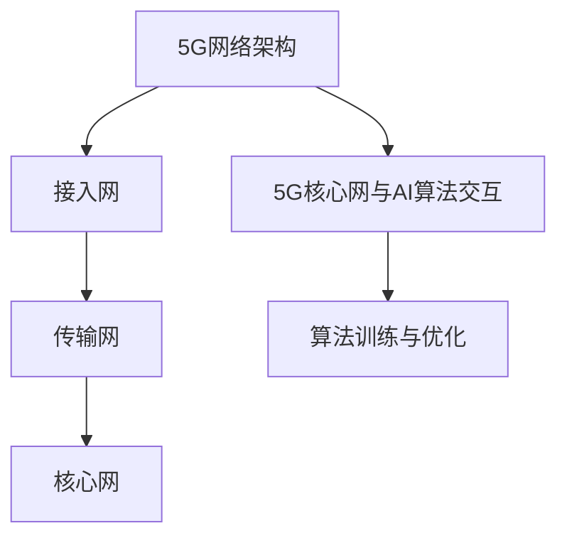

                 

# 《5G+AI：注意力经济的新引擎》

> **关键词**：5G，AI，注意力经济，新引擎，应用场景，技术创新，挑战，未来展望

> **摘要**：本文深入探讨了5G和AI技术的融合如何成为推动注意力经济的新引擎。通过对5G技术基础、AI基础知识、5G与AI联系以及应用场景的详细解析，揭示了5G与AI结合所带来的巨大潜力和创新。同时，文章也探讨了实施过程中的挑战，并展望了未来的发展趋势。通过具体的案例分析和项目实战，本文为读者提供了关于5G和AI技术结合的实际应用见解。

### 《5G+AI：注意力经济的新引擎》目录大纲

#### 第一部分：5G与AI的基本原理

**1. 5G技术基础**

- **1.1 5G网络概述**

    - **1.1.1 5G网络的主要特点**：高速、低延迟、大连接、低功耗。
    - **1.1.2 5G网络的关键技术**：毫米波、网络切片、边缘计算。

- **1.2 5G网络架构**

    - **1.2.1 5G网络分层架构**：接入网、传输网、核心网。
    - **1.2.2 5G网络协议栈**：NR（新无线电）和NG-RAN（新无线电接入网）。

- **1.3 5G网络的安全性和可靠性**

    - **1.3.1 5G网络的安全性机制**：加密、认证、隐私保护。
    - **1.3.2 5G网络的可靠性保障**：冗余设计、故障恢复、高可用性。

**2. AI基础知识**

- **2.1 AI概述**

    - **2.1.1 AI的定义**：人工智能是一门研究、开发用于模拟、延伸和扩展人的智能的理论、方法、技术及应用。
    - **2.1.2 AI的发展历程**：从早期的符号主义到连接主义，再到现代的数据驱动方法。

- **2.2 AI的核心算法**

    - **2.2.1 机器学习算法**：监督学习、无监督学习、强化学习。
    - **2.2.2 深度学习算法**：卷积神经网络（CNN）、循环神经网络（RNN）、生成对抗网络（GAN）。

- **2.3 AI的应用领域**

    - **2.3.1 图像识别**：人脸识别、物体检测、图像分割。
    - **2.3.2 自然语言处理**：文本分类、情感分析、机器翻译。
    - **2.3.3 语音识别**：语音转文本、语音合成、语音识别率优化。

**3. 5G与AI的联系**

- **3.1 5G对AI的影响**

    - **3.1.1 5G网络的高速与低延迟对AI算法的影响**：加速算法训练和实时应用。
    - **3.1.2 5G网络的大连接能力对AI应用的扩展**：实现更多智能设备的互联互通。

- **3.2 AI对5G网络的优化**

    - **3.2.1 AI在5G网络优化中的应用**：网络流量预测、网络性能优化。
    - **3.2.2 AI在5G网络安全方面的应用**：入侵检测、恶意流量识别。

#### 第二部分：5G与AI结合的应用场景

**4. 智能物联网（IoT）**

- **4.1 5G+AI在IoT中的应用**

    - **4.1.1 智能家居**：智能家电控制、智能安防监控。
    - **4.1.2 智能制造**：设备预测性维护、生产过程优化。

- **4.2 案例解析**

    - **4.2.1 智能农场**：作物监测、精准灌溉。
    - **4.2.2 车联网**：自动驾驶、车与车之间的通信。

**5. 智能交通**

- **5.1 5G+AI在交通管理中的应用**

    - **5.1.1 智能路况预测**：实时交通流量分析。
    - **5.1.2 智能交通信号控制**：自适应交通信号系统。

- **5.2 案例解析**

    - **5.2.1 智能公交系统**：优化路线和调度。
    - **5.2.2 智能交通监控**：实时监控交通状况。

**6. 智能医疗**

- **6.1 5G+AI在医疗领域的应用**

    - **6.1.1 疾病预测与诊断**：早期疾病筛查。
    - **6.1.2 医疗图像分析**：影像诊断辅助。

- **6.2 案例解析**

    - **6.2.1 智能健康监测**：实时监控健康状况。
    - **6.2.2 虚拟医生助手**：智能问答、辅助诊断。

**7. 智能金融**

- **7.1 5G+AI在金融服务中的应用**

    - **7.1.1 信用评估**：个性化信用评分。
    - **7.1.2 量化交易**：基于大数据的交易策略。

- **7.2 案例解析**

    - **7.2.1 智能投顾**：个性化投资建议。
    - **7.2.2 风险管理**：实时风险监控与预测。

#### 第三部分：5G与AI技术实施与挑战

**8. 5G与AI技术的实施流程**

- **8.1 项目规划与需求分析**
- **8.2 技术选型与架构设计**
- **8.3 数据收集与处理**
- **8.4 算法训练与优化**
- **8.5 系统集成与测试**

**9. 5G与AI技术面临的挑战**

- **9.1 数据隐私与安全问题**
- **9.2 技术标准和法规**
- **9.3 技能人才短缺**

#### 第四部分：未来展望

**10. 5G与AI融合的发展趋势**

- **10.1 5G与AI融合的技术创新**
- **10.2 未来应用场景的拓展**

#### 附录

**11. 5G与AI技术资源汇总**

- **11.1 开源框架与工具**
- **11.2 学术论文与研究报告**
- **11.3 相关标准与规范**

### 核心概念与联系

**5G网络架构**与**AI算法原理**的Mermaid流程图：



### 核心算法原理讲解

**神经网络与深度学习算法**：

```python
# 伪代码：神经网络前向传播过程
for each layer in network:
    z = X * weights + bias
    a = sigmoid(z)
output = a
```

### 数学模型和数学公式

**损失函数与优化算法**：

$$J(\theta) = \frac{1}{m}\sum_{i=1}^{m}(h_\theta(x^{(i)}) - y^{(i)})^2$$

### 项目实战

**智能医疗诊断系统的开发**：

- **开发环境搭建**：配置Python环境、安装TensorFlow等深度学习库。
- **数据收集与处理**：收集医疗数据，进行数据清洗、归一化处理。
- **算法训练与优化**：使用卷积神经网络（CNN）进行图像分类训练，使用交叉熵损失函数进行优化。
- **系统集成与测试**：集成前端界面和后端模型，进行系统测试与验证。
- **代码解读与分析**：解析模型代码，分析模型训练过程和优化策略。

### 作者

**作者：AI天才研究院/AI Genius Institute & 禅与计算机程序设计艺术 /Zen And The Art of Computer Programming**

（注：文章标题、关键词、摘要、目录大纲以及内容为示例，实际撰写过程中需根据具体情况进行调整和补充。）<|end|>

