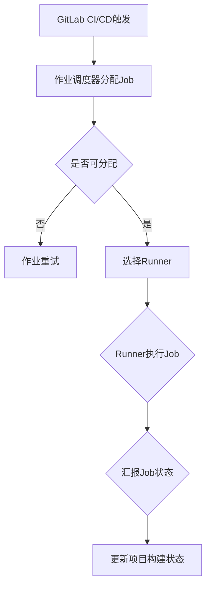

                 

# 《GitLab Runner配置与优化》

> **关键词：** GitLab, Runner, 配置, 优化, CI/CD

> **摘要：** 本文将深入探讨GitLab Runner的配置与优化策略。从基础安装到高级优化，包括性能、稳定性、可靠性和自动化等方面，本文将一步步引导读者深入了解GitLab Runner的工作原理和实践应用。

### 《GitLab Runner配置与优化》目录大纲

#### 第一部分：GitLab Runner基础

##### 第1章：GitLab Runner概述  
- 1.1 GitLab Runner的作用与地位  
- 1.2 GitLab Runner的架构和组件  
- 1.3 GitLab Runner与其他GitLab组件的关系  
- 1.4 GitLab Runner的安装和配置

##### 第2章：GitLab Runner核心概念与联系  
- 2.1 GitLab CI/CD流程与Runner的关系  
- 2.2 GitLab Runner的核心概念  
- 2.3 GitLab Runner与容器技术的结合  
- 2.4 Mermaid流程图：GitLab Runner工作流程

##### 第3章：GitLab Runner配置与管理  
- 3.1 Runner配置文件详解  
- 3.2 Runner注册与鉴权  
- 3.3 Runner池与共享  
- 3.4 Runner监控与日志管理  
- 3.5 GitLab Runner的权限与安全策略

#### 第二部分：GitLab Runner优化

##### 第4章：GitLab Runner性能优化  
- 4.1 Runner性能瓶颈分析  
- 4.2 缓存策略与资源优化  
- 4.3 并发处理与负载均衡  
- 4.4 伪代码：GitLab Runner性能优化算法

##### 第5章：GitLab Runner稳定性与可靠性优化  
- 5.1 Runner故障排查与处理  
- 5.2 高可用与故障转移  
- 5.3 备份与恢复  
- 5.4 GitLab Runner的升级与迁移策略

##### 第6章：GitLab Runner自动化与脚本化  
- 6.1 使用shell脚本自动化Runner操作  
- 6.2 CI/CD管道中的Runner脚本化  
- 6.3 GitLab Runner的自动化配置  
- 6.4 Mermaid流程图：自动化GitLab Runner工作流程

##### 第7章：GitLab Runner最佳实践  
- 7.1 企业级GitLab Runner架构设计  
- 7.2 GitLab Runner在多环境部署中的实践  
- 7.3 GitLab Runner在微服务架构中的应用  
- 7.4 GitLab Runner与其他持续集成工具的集成

#### 第三部分：实战与代码解读

##### 第8章：GitLab Runner项目实战  
- 8.1 GitLab Runner项目环境搭建  
- 8.2 GitLab Runner源代码解读  
- 8.3 代码实现与优化  
- 8.4 GitLab Runner实战案例解析

##### 第9章：GitLab Runner代码解读与分析  
- 9.1 GitLab Runner关键代码解读  
- 9.2 代码优化与分析  
- 9.3 代码调试与性能调优  
- 9.4 实际应用场景中的代码改进

#### 附录

##### 附录A：GitLab Runner开发工具与资源  
- A.1 GitLab Runner开发环境搭建  
- A.2 GitLab Runner常用工具和插件  
- A.3 GitLab Runner学习资源与文档  
- A.4 GitLab Runner开源项目与社区

## 第一部分：GitLab Runner基础

### 第1章：GitLab Runner概述

#### 1.1 GitLab Runner的作用与地位

GitLab Runner是GitLab CI/CD系统中负责执行作业（jobs）的核心组件。在GitLab CI/CD流程中，项目中的`.gitlab-ci.yml`文件定义了构建、测试和部署等任务，而GitLab Runner则是这些任务的执行者。每个Runner都是一个独立的进程，它连接到GitLab服务器并接收作业指令，然后在本地执行这些指令。

GitLab Runner在CI/CD流程中的地位至关重要，它不仅决定了作业的执行速度，还影响到构建和部署的稳定性和可靠性。一个高效的Runner配置能够显著提升团队的开发效率和项目的交付质量。

#### 1.2 GitLab Runner的架构和组件

GitLab Runner的架构相对简单，主要包括以下几个组件：

1. **Runner进程**：这是Runner的核心组件，负责接收作业指令并执行。
2. **注册与鉴权**：Runner在启动时会向GitLab服务器注册，并通过SSH密钥或OAuth进行鉴权。
3. **作业调度器**：GitLab服务器端的作业调度器负责分配作业给可用的Runner。
4. **存储**：Runner的本地存储用于保存作业输出、缓存和其他临时文件。
5. **网络**：Runner需要连接到GitLab服务器以接收作业指令，同时还需要访问其他必要的网络资源，如仓库、构建工具和测试环境。

#### 1.3 GitLab Runner与其他GitLab组件的关系

GitLab Runner与其他GitLab组件紧密相连，其中最为关键的是GitLab CI/CD流程和GitLab服务器。以下是它们之间的关系：

1. **与GitLab CI/CD流程的关系**：GitLab CI/CD流程定义了项目的构建、测试和部署策略，`.gitlab-ci.yml`文件是这一流程的核心。GitLab Runner负责执行这个文件中的指令，从而实现自动化构建和部署。

2. **与GitLab服务器的连接**：Runner通过SSH或OAuth与GitLab服务器建立连接，接收作业指令并汇报作业状态。GitLab服务器端的作业调度器负责将作业分配给Runner。

3. **与其他GitLab组件的交互**：GitLab Runner还与GitLab仓库、GitLab Pages、GitLab Container Registry等其他组件进行交互，以完成项目的不同构建和部署任务。

#### 1.4 GitLab Runner的安装和配置

安装GitLab Runner相对简单，但配置则较为复杂。以下是安装和配置的基本步骤：

1. **安装GitLab Runner**：根据操作系统选择合适的安装包或使用官方的Docker镜像进行安装。

2. **配置Runner**：编辑`/etc/gitlab-runner/config.toml`文件，设置注册令牌、共享配置、网络设置、缓存策略等。

3. **注册Runner**：使用`gitlab-runner register`命令将Runner注册到GitLab服务器。

4. **配置SSH密钥**：为Runner配置SSH密钥，以便访问GitLab仓库和其他网络资源。

5. **配置其他组件**：根据项目需求配置GitLab Pages、Container Registry等。

### 第2章：GitLab Runner核心概念与联系

#### 2.1 GitLab CI/CD流程与Runner的关系

GitLab CI/CD流程是GitLab Runner的核心应用场景。`.gitlab-ci.yml`文件定义了项目的构建、测试和部署策略，而GitLab Runner则负责执行这些策略。以下是GitLab CI/CD流程与GitLab Runner之间的关系：

1. **Job定义**：在`.gitlab-ci.yml`文件中，每个Job对应一个具体的构建、测试或部署任务。
2. **作业调度**：GitLab服务器端的作业调度器根据Runner的可用性和作业的优先级，将Job分配给Runner。
3. **执行作业**：Runner接收到作业指令后，在本地执行Job中的指令。
4. **状态汇报**：Runner在执行完Job后，向GitLab服务器汇报状态，GitLab服务器更新项目的构建状态。

#### 2.2 GitLab Runner的核心概念

GitLab Runner包含以下几个核心概念：

1. **Registry**：GitLab Runner注册表，用于存储Runner的配置和状态。
2. **Executor**：作业执行器，负责实际执行Job中的指令。
3. **Cache**：缓存机制，用于存储和共享构建过程中的临时文件和数据。
4. **Tags**：标签，用于区分不同类型的Runner，如构建、测试和部署Runner。
5. **Shared Runners**：共享Runner，允许多个项目共享同一台Runner，以节约资源。

#### 2.3 GitLab Runner与容器技术的结合

GitLab Runner支持多种执行环境，其中容器技术是最常用的之一。通过结合Docker等容器技术，GitLab Runner可以实现以下优势：

1. **环境隔离**：容器提供了独立的环境，确保构建和部署过程不会相互干扰。
2. **依赖管理**：容器可以将所有依赖项打包在一起，减少依赖冲突和版本问题。
3. **可移植性**：容器化的构建环境可以在任何支持Docker的机器上运行，提高了构建的可移植性。
4. **性能优化**：容器提供了高效的资源利用，可以显著提高构建和部署的速度。

#### 2.4 Mermaid流程图：GitLab Runner工作流程

以下是GitLab Runner的工作流程的Mermaid流程图：



## 第3章：GitLab Runner配置与管理

### 3.1 Runner配置文件详解

GitLab Runner的配置文件位于`/etc/gitlab-runner/config.toml`，它是 Runner 运行的核心。下面是配置文件的主要部分及其含义：

1. **[runners.http]**
   - `url`: GitLab服务器的URL。
   - `token`: 作业调度器的鉴权令牌。
   - `trust_dns`: 是否信任本地DNS。

2. **[runners.cache]**
   - `enabled`: 是否启用缓存。
   - `build_dir`: 缓存目录。
   - `expire_in`: 缓存过期时间。

3. **[runners]**
   - `name`: Runner名称。
   - `url`: GitLab服务器的URL。
   - `token`: 作业调度器的鉴权令牌。
   - `executor`: 执行器类型，如shell、docker等。
   - `run_untagged`: 是否运行未被标签标记的作业。
   - `tag_list`: Runner的标签列表。

4. **[runners.docker]**
   - `image`: Docker镜像。
   - `privileged`: 是否启用特权模式。
   - `volume`: Docker卷。

5. **[runners.cache.s3]**
   - `provider`: 存储提供商，如AWS S3。
   - `bucket`: 存储桶名称。

### 3.2 Runner注册与鉴权

注册GitLab Runner是配置的第一步，也是至关重要的。以下是如何注册Runner的基本步骤：

1. **生成注册令牌**：在GitLab服务器上，进入“管理员设置”>“CI/CD”>“Runners”页面，生成注册令牌。

2. **注册Runner**：使用以下命令注册Runner：

   ```bash
   gitlab-runner register \
     --non-interactive \
     --url "https://gitlab.example.com" \
     --registration-token "your-registration-token" \
     --name "your-runner-name" \
     --executor "shell" \
     --tag-list "tag1,tag2"
   ```

3. **验证注册**：注册完成后，检查Runner的状态是否为“运行中”。

鉴权是确保只有合法的Runner可以执行作业的关键步骤。GitLab Runner使用SSH密钥或OAuth进行鉴权：

1. **SSH密钥鉴权**：生成SSH密钥对，并将公钥上传到GitLab服务器。

2. **OAuth鉴权**：在GitLab服务器上创建OAuth应用程序，并配置Runner使用OAuth令牌进行鉴权。

### 3.3 Runner池与共享

GitLab Runner支持创建Runner池和共享Runner，以优化资源利用和作业分配。

1. **Runner池**：将具有相同配置的Runner分组到池中，使得作业可以根据标签被分配到相应的池中。例如，创建一个名为“test-pool”的池，并添加具有相同标签的Runner。

2. **共享Runner**：共享Runner允许多个项目共享同一台Runner，以节约资源。在`.gitlab-ci.yml`文件中，通过设置`run_untagged`为`true`和`tag_list`为空，可以使作业运行在共享Runner上。

### 3.4 Runner监控与日志管理

监控GitLab Runner是确保其稳定运行的重要环节。GitLab Runner提供了以下监控工具：

1. **系统监控**：使用系统监控工具（如Prometheus和Grafana）收集Runner的系统指标，如CPU、内存和磁盘使用情况。

2. **日志管理**：GitLab Runner的日志存储在本地文件系统中。可以使用`journalctl`命令查看系统日志，或使用第三方日志管理工具（如ELK栈）进行集中管理和分析。

### 3.5 GitLab Runner的权限与安全策略

为确保GitLab Runner的安全，应实施以下权限和安全策略：

1. **用户权限**：为GitLab Runner创建独立的用户，并仅授予其运行作业所需的最低权限。

2. **网络策略**：限制GitLab Runner可以访问的网络资源，以减少潜在的安全风险。

3. **SSH密钥管理**：定期更换SSH密钥，并确保公钥存储在安全的地方。

4. **认证和授权**：使用强密码或OAuth进行认证和授权，确保只有合法用户可以访问GitLab Runner。

通过合理的配置和管理，GitLab Runner不仅可以提高团队的开发效率和项目的交付质量，还可以确保构建和部署过程的安全和稳定。

### 第4章：GitLab Runner性能优化

#### 4.1 Runner性能瓶颈分析

要优化GitLab Runner的性能，首先需要了解其可能存在的性能瓶颈。以下是一些常见的问题及其解决方法：

1. **CPU瓶颈**：过多的Runner或高负载的作业可能导致CPU资源不足。解决方案包括增加CPU核心数或优化作业的并发度。

2. **内存瓶颈**：内存不足可能导致作业执行缓慢或失败。优化内存使用的方法包括使用缓存策略和优化Docker容器配置。

3. **磁盘I/O瓶颈**：构建和部署过程中的文件读写操作可能会占用大量磁盘I/O资源。解决方法包括使用SSD硬盘和优化文件系统。

4. **网络瓶颈**：构建和部署过程中需要频繁访问远程仓库和资源，可能导致网络延迟。解决方案包括使用CDN和优化网络配置。

#### 4.2 缓存策略与资源优化

缓存策略是提高GitLab Runner性能的有效手段。以下是一些常用的缓存策略：

1. **构建缓存**：在`.gitlab-ci.yml`文件中，使用`cache`关键字定义缓存目录和文件。这样可以避免重复构建相同代码，提高构建速度。

   ```yaml
   cache:
     paths:
       - "$HOME/.m2/repository/"
       - "$HOME/.gradle/caches/"
   ```

2. **Docker镜像缓存**：通过使用多阶段构建和分层镜像，可以减少镜像的体积，提高构建速度。例如：

   ```Dockerfile
   FROM node:12-alpine AS build
   WORKDIR /app
   COPY package.json ./
   RUN npm install
   COPY . .
   RUN npm run build

   FROM node:12-alpine
   WORKDIR /app
   COPY --from=build /app .
   EXPOSE 3000
   CMD ["npm", "start"]
   ```

3. **资源优化**：优化Docker容器的资源限制，如CPU、内存和磁盘空间，可以避免资源冲突和性能下降。例如：

   ```yaml
   services:
     web:
       container_cpu_limit: "500m"
       container_cpu_reservation: "100m"
       container_memory_limit: "1g"
       container_memory_reservation: "512m"
   ```

#### 4.3 并发处理与负载均衡

并发处理和负载均衡是提高GitLab Runner性能的关键因素。以下是一些优化策略：

1. **并发度优化**：通过调整`.gitlab-ci.yml`文件中的并发度设置，可以优化作业的执行速度。例如：

   ```yaml
   parallelism: 5
   ```

2. **负载均衡**：使用GitLab Runner的负载均衡功能，可以将作业均匀地分配到多个Runner上。例如，通过设置Runner池和标签，可以实现负载均衡。

   ```yaml
   pools:
     - name: default
       tags: []
       runners:
         - name: runner1
           url: https://gitlab.example.com
           token: your-token
           executor: shell
           tag_list: []
         - name: runner2
           url: https://gitlab.example.com
           token: your-token
           executor: shell
           tag_list: []
   ```

3. **分布式负载均衡**：使用外部负载均衡器（如Nginx或HAProxy），可以进一步优化负载均衡效果。例如，通过配置Nginx的upstream模块，可以实现基于轮询或权重负载均衡。

   ```nginx
   http {
     upstream gitlab_runner {
       server runner1.example.com;
       server runner2.example.com;
     }
     server {
       location / {
         proxy_pass http://gitlab_runner;
       }
     }
   }
   ```

#### 4.4 伪代码：GitLab Runner性能优化算法

以下是一个简单的伪代码示例，用于描述GitLab Runner性能优化算法：

```python
def optimize_runner_performance(runner_list, job_queue):
    # 分析Runner性能瓶颈
    performance_bottlenecks = analyze_bottlenecks(runner_list)

    # 根据瓶颈类型优化配置
    for runner in runner_list:
        if "cpu" in performance_bottlenecks:
            increase_cpu_resources(runner)
        elif "memory" in performance_bottlenecks:
            increase_memory_resources(runner)
        elif "disk" in performance_bottlenecks:
            optimize_disk_usage(runner)
        elif "network" in performance_bottlenecks:
            optimize_network_configs(runner)

    # 调整并发度和负载均衡
    parallelism = optimize_parallelism(job_queue)
    load_balancer = setup_load_balancer(runner_list)

    # 重启Runner应用优化配置
    restart_runners(runner_list)

    return parallelism, load_balancer
```

通过上述性能优化策略，GitLab Runner可以显著提高构建和部署的效率，从而提升团队的开发效率和项目的交付质量。

### 第5章：GitLab Runner稳定性与可靠性优化

#### 5.1 Runner故障排查与处理

GitLab Runner在执行作业过程中可能会遇到各种故障，导致构建和部署失败。以下是一些常见的故障类型及其排查与处理方法：

1. **网络故障**：网络问题可能导致Runner无法与GitLab服务器通信，或无法访问远程资源。排查方法包括检查网络连接、DNS解析和防火墙规则。处理方法可以是重启Runner或更换网络环境。

2. **资源不足**：资源不足（如CPU、内存、磁盘空间）可能导致Runner无法正常执行作业。排查方法包括检查系统资源使用情况。处理方法包括增加资源、优化作业或使用缓存策略。

3. **依赖问题**：依赖问题可能导致构建过程中遇到错误。排查方法包括检查依赖项的版本和配置。处理方法包括更新依赖项或修复依赖冲突。

4. **配置错误**：配置错误可能导致Runner无法正确执行作业。排查方法包括检查配置文件和日志。处理方法包括修复配置错误或重新注册Runner。

5. **容器故障**：容器故障可能导致容器无法启动或运行。排查方法包括检查Docker日志和容器状态。处理方法包括重启容器或重新构建镜像。

#### 5.2 高可用与故障转移

为了确保GitLab Runner的稳定性和可靠性，需要实现高可用和故障转移策略。以下是一些常用的方法：

1. **多实例部署**：部署多个Runner实例，并确保它们与GitLab服务器保持连接。当某个Runner实例发生故障时，作业会自动分配给其他实例。

2. **负载均衡**：使用负载均衡器（如Nginx或HAProxy）实现Runner的负载均衡。负载均衡器可以自动检测Runner的健康状态，并将作业分配给健康的实例。

3. **故障转移**：实现故障转移机制，当主要Runner实例发生故障时，自动切换到备用实例。故障转移可以基于心跳检测或人工干预。

4. **监控与报警**：使用系统监控工具（如Prometheus和Grafana）监控Runner的运行状态，并在检测到故障时发送报警通知。

#### 5.3 备份与恢复

备份和恢复是确保GitLab Runner稳定性和可靠性的重要措施。以下是一些常用的备份和恢复方法：

1. **配置文件备份**：定期备份`/etc/gitlab-runner/config.toml`文件和其他配置文件。可以使用`rsync`或`tar`命令进行备份。

2. **作业输出备份**：备份构建和部署过程中的输出日志和缓存文件。可以使用`git`或`rsync`命令进行备份。

3. **数据卷备份**：备份Docker容器的数据卷。可以使用`docker export`命令导出容器数据，并使用`tar`命令进行压缩备份。

4. **恢复策略**：在发生故障时，根据备份文件恢复配置和数据。可以使用`rsync`或`tar`命令恢复备份文件，并重启Runner。

#### 5.4 GitLab Runner的升级与迁移策略

GitLab Runner的升级和迁移是确保其稳定性和可靠性的重要环节。以下是一些升级和迁移策略：

1. **备份**：在升级或迁移之前，备份当前配置和数据，以确保在出现问题时可以恢复。

2. **版本控制**：确保备份文件包含完整的版本信息，以便在需要时进行回滚。

3. **升级步骤**：
   - 停止GitLab Runner服务。
   - 更新配置文件和依赖项。
   - 安装新版本的GitLab Runner。
   - 启动GitLab Runner服务。

4. **迁移步骤**：
   - 停止GitLab Runner服务。
   - 备份数据库和配置文件。
   - 在新环境中安装GitLab Runner。
   - 恢复备份数据和配置。
   - 启动GitLab Runner服务。

通过实施上述稳定性与可靠性优化策略，GitLab Runner可以更好地应对故障和挑战，确保构建和部署过程的稳定性和可靠性。

### 第6章：GitLab Runner自动化与脚本化

#### 6.1 使用shell脚本自动化Runner操作

在GitLab Runner的管理中，使用shell脚本可以大大提高自动化程度，减少手动操作的错误和重复性。以下是一些常用的shell脚本示例：

**1. 注册Runner**

```bash
#!/bin/bash

RUNNER_NAME="my-runner"
REGISTRATION_TOKEN="your-registration-token"

gitlab-runner register \
  --non-interactive \
  --url "https://gitlab.example.com" \
  --registration-token "$REGISTRATION_TOKEN" \
  --name "$RUNNER_NAME" \
  --executor "shell" \
  --tag-list "my-tag"
```

**2. 启动/停止Runner**

```bash
#!/bin/bash

RUNNER_NAME="my-runner"

# 启动Runner
gitlab-runner start --name "$RUNNER_NAME"

# 停止Runner
gitlab-runner stop --name "$RUNNER_NAME"
```

**3. 更新Runner**

```bash
#!/bin/bash

RUNNER_NAME="my-runner"

# 更新Runner配置
gitlab-runner config --name "$RUNNER_NAME" --work-dir /path/to/workdir

# 重启Runner
gitlab-runner restart --name "$RUNNER_NAME"
```

**4. 注册SSH密钥**

```bash
#!/bin/bash

PRIVATE_KEY_PATH="/path/to/private.key"
PUBLIC_KEY_PATH="/path/to/public.key"

# 将公钥添加到GitLab
curl -H "Content-Type: application/json" \
  --data "{\"key\": \"$(cat $PUBLIC_KEY_PATH)\", \"title\": \"$RUNNER_NAME\"}" \
  "https://gitlab.example.com/api/v4/projects/1/keys"

# 将私钥添加到Runner配置
gitlab-runner register \
  --non-interactive \
  --url "https://gitlab.example.com" \
  --registration-token "your-registration-token" \
  --name "$RUNNER_NAME" \
  --executor "shell" \
  --tag-list "my-tag" \
  --ssh-key "$(cat $PRIVATE_KEY_PATH)"
```

#### 6.2 CI/CD管道中的Runner脚本化

在CI/CD管道中，通过脚本化Runner操作，可以更好地控制构建和部署流程。以下是如何在CI/CD管道中实现脚本化的一些方法：

**1. 在`.gitlab-ci.yml`文件中执行shell脚本**

```yaml
stages:
  - build
  - deploy

build_job:
  stage: build
  script:
    - ./scripts/build.sh
  only:
    - master

deploy_job:
  stage: deploy
  script:
    - ./scripts/deploy.sh
  when: manual
```

**2. 在shell脚本中调用CI/CD命令**

```bash
#!/bin/bash

# 获取当前作业的ID
JOB_ID=$(gitlab CI job id)

# 查询作业的状态
gitlab CI job status $JOB_ID

# 更新作业的描述
gitlab CI job update $JOB_ID --description "Deploying to production"

# 发送通知
gitlab CI job notify $JOB_ID --message "Deployment completed"
```

#### 6.3 GitLab Runner的自动化配置

GitLab Runner的自动化配置可以通过多种方式实现，如使用CI/CD工具、脚本或配置管理工具。以下是一些常见的方法：

**1. 使用CI/CD工具**

许多CI/CD工具（如Jenkins、GitLab CI）提供了自动化配置功能。例如，在GitLab CI中，可以通过在项目的`.gitlab-ci.yml`文件中定义配置步骤来实现：

```yaml
before_script:
  - echo "CONFIGURING RUNNER..." && sleep 5

config_script:
  stage: config
  script:
    - gitlab-runner register ...
    - gitlab CI configure ...
```

**2. 使用脚本**

编写脚本来自动化GitLab Runner的配置操作，可以大幅减少手动配置的工作量。以下是一个简单的脚本示例：

```bash
#!/bin/bash

# 定义配置参数
RUNNER_NAME="my-runner"
REGISTRATION_TOKEN="your-registration-token"
CI_CONFIG_PATH="/path/to/.gitlab-ci.yml"

# 注册GitLab Runner
gitlab-runner register \
  --non-interactive \
  --url "https://gitlab.example.com" \
  --registration-token "$REGISTRATION_TOKEN" \
  --name "$RUNNER_NAME" \
  --executor "shell" \
  --tag-list "my-tag"

# 更新CI/CD配置
cp $CI_CONFIG_PATH /tmp/config.yml
sed -i 's/old_tag/new_tag/g' /tmp/config.yml
gitlab CI configure --file /tmp/config.yml
```

**3. 使用配置管理工具**

配置管理工具（如Ansible、Puppet、Chef）可以用来自动化GitLab Runner的配置。以下是一个使用Ansible配置GitLab Runner的示例：

```yaml
---
- hosts: gitlab_runner
  become: yes
  roles:
    - role: gitlab-runner
      runner_name: "my-runner"
      registration_token: "your-registration-token"
      executor: shell
      tag_list: "my-tag"
```

通过上述自动化与脚本化方法，GitLab Runner的操作变得更加高效和可靠，有助于提升团队的持续集成和持续部署（CI/CD）流程。

### 第7章：GitLab Runner最佳实践

#### 7.1 企业级GitLab Runner架构设计

在设计企业级GitLab Runner架构时，需要考虑高可用性、可扩展性和安全性等因素。以下是一些最佳实践：

1. **多实例部署**：部署多个GitLab Runner实例，以实现负载均衡和高可用性。可以使用Kubernetes等容器编排工具进行管理。

2. **负载均衡**：使用外部负载均衡器（如Nginx、HAProxy）将作业分配到多个Runner实例，提高系统的吞吐量和响应速度。

3. **资源池化**：将具有相同配置的Runner分组到资源池中，以便更灵活地分配作业。资源池可以根据业务需求进行动态调整。

4. **安全隔离**：使用容器技术（如Docker）和虚拟化技术（如KVM）实现作业的隔离，防止作业之间的资源冲突和潜在的安全威胁。

5. **监控与告警**：使用Prometheus、Grafana等监控工具对Runner进行实时监控，并在检测到异常时自动发送告警通知。

#### 7.2 GitLab Runner在多环境部署中的实践

在企业中，通常需要对不同的环境（如开发、测试、生产）进行独立的构建和部署。以下是在多环境部署中使用GitLab Runner的一些实践：

1. **环境变量**：在`.gitlab-ci.yml`文件中使用环境变量定义不同环境的配置，如数据库地址、API密钥等。

2. **多环境CI/CD管道**：根据不同的环境设置独立的CI/CD管道，每个环境有其特定的作业和部署流程。

3. **环境隔离**：使用容器和虚拟机等技术实现环境的完全隔离，防止环境之间的污染和干扰。

4. **环境切换**：使用GitLab CI/CD的“环境切换”功能，根据需要快速切换环境，并执行相应的作业。

5. **权限控制**：为不同环境的Runner设置不同的权限，确保只有授权用户可以访问特定的环境。

#### 7.3 GitLab Runner在微服务架构中的应用

在微服务架构中，GitLab Runner可以用于构建、测试和部署各个微服务。以下是在微服务架构中应用GitLab Runner的一些实践：

1. **服务分解**：将应用程序分解为多个独立的微服务，每个微服务都有自己的构建和部署流程。

2. **容器化**：使用Docker等容器技术将微服务容器化，以便在GitLab Runner上轻松构建和部署。

3. **持续集成**：使用GitLab CI/CD实现微服务的持续集成，确保每个微服务都在一个受控的环境中构建和测试。

4. **服务网关**：使用服务网关（如Kong、Zuul）对微服务进行统一管理和访问控制。

5. **自动化部署**：通过GitLab Runner的脚本化和自动化配置功能，实现微服务的自动化部署和版本管理。

#### 7.4 GitLab Runner与其他持续集成工具的集成

GitLab Runner可以与其他持续集成（CI）工具集成，以实现更复杂的构建和部署流程。以下是一些常用的集成方法：

1. **Jenkins集成**：使用Jenkins的GitLab插件，可以将Jenkins与GitLab Runner集成，实现Jenkins Job的自动化触发和执行。

2. **CircleCI集成**：通过在`.circleci/config.yml`文件中添加GitLab Runner的配置，实现CircleCI与GitLab Runner的集成。

3. **Travis CI集成**：在`.travis.yml`文件中添加GitLab Runner的配置，将Travis CI的构建和部署流程与GitLab Runner结合。

4. **GitLab CI/CD插件**：使用GitLab CI/CD的插件体系，可以扩展GitLab Runner的功能，如代码质量分析、自动化测试和持续交付。

通过遵循上述最佳实践，企业可以更好地利用GitLab Runner实现高效的持续集成和持续部署（CI/CD）流程，从而提升开发效率和项目交付质量。

### 第8章：GitLab Runner项目实战

#### 8.1 GitLab Runner项目环境搭建

在本节中，我们将详细讲解如何搭建一个GitLab Runner项目环境，并确保其能够正常运行。

##### 1. 硬件与软件要求

- **硬件要求**：GitLab Runner可以运行在几乎任何具备足够内存和CPU的资源上。通常，推荐最低配置为2GB内存和2个CPU核心。
- **软件要求**：确保操作系统支持GitLab Runner，常用的操作系统包括Linux、macOS和Windows。

##### 2. 安装GitLab Runner

**Linux系统安装**

以Ubuntu 20.04为例，执行以下命令：

```bash
sudo apt-get update
sudo apt-get install git
sudo apt-get install curl
curl -L https://gitlab-runner-downloads.s3.amazonaws.com/latest/binaries/gitlab-runner-linux-amd64.tar.gz | sudo tar -xz -C /usr/local/bin/
```

**macOS系统安装**

```bash
brew install git
brew install gitlab-runner
```

**Windows系统安装**

下载Windows安装包并按照安装向导完成安装。

##### 3. 配置GitLab Runner

配置文件位于`/etc/gitlab-runner/config.toml`。以下是一个基本的配置示例：

```toml
[[runners]]
  name = "my-runner"
  url = "https://gitlab.example.com"
  registration-token = "your-registration-token"
  executor = "shell"
  tags = ["my-tag"]
  run-untagged = true
  cache-dir = "/home/gitlab-runner/cache"
```

配置完成后，启动GitLab Runner：

```bash
gitlab-runner start
```

##### 4. 验证GitLab Runner

在GitLab项目设置中，查看已注册的Runner，确认其状态为“运行中”。

##### 5. 创建一个简单的作业

在项目的`.gitlab-ci.yml`文件中，添加一个简单的作业示例：

```yaml
stages:
  - build

build_job:
  stage: build
  script:
    - echo "Building the project..."
    - echo "Installing dependencies..."
    - echo "Running tests..."
  artifacts:
    paths:
      - "build/*.jar"
```

提交并推送代码到GitLab，GitLab CI/CD系统将触发作业，并在成功完成后下载生成的 artifacts。

#### 8.2 GitLab Runner源代码解读

GitLab Runner的源代码主要分布在GitLab的官方仓库中，其结构如下：

```
gitlab-runner/
├── config/
│   ├── cli/
│   │   ├── flags.go
│   │   ├── goflag.go
│   │   └── ui.go
│   ├── daemon/
│   │   ├── api/
│   │   │   ├── auth.go
│   │   │   ├── server.go
│   │   │   └── version.go
│   │   ├── main.go
│   │   ├── runners/
│   │   │   ├── config.go
│   │   │   ├── create.go
│   │   │   ├── remove.go
│   │   │   ├── list.go
│   │   │   └── update.go
│   │   └── runners.go
│   ├── internal/
│   │   ├── db/
│   │   │   ├── migration.go
│   │   │   ├── model.go
│   │   │   └── store.go
│   │   ├── lock/
│   │   │   ├── lock.go
│   │   │   └── strategy.go
│   │   ├── log/
│   │   │   ├── log.go
│   │   │   └── sink.go
│   │   ├── metric/
│   │   │   ├── collection.go
│   │   │   └── emitter.go
│   │   ├── preflight/
│   │   │   ├── check.go
│   │   │   └── config.go
│   │   ├── run/
│   │   │   ├── build.go
│   │   │   ├── check.go
│   │   │   ├── container.go
│   │   │   ├── hooks.go
│   │   │   ├── input.go
│   │   │   ├── log.go
│   │   │   ├── pre_create.go
│   │   │   ├── pre_start.go
│   │   │   ├── script.go
│   │   │   ├── start.go
│   │   │   ├── stop.go
│   │   │   ├── terminate.go
│   │   │   └── update.go
│   │   ├── state/
│   │   │   ├── check.go
│   │   │   └── job.go
│   │   ├── util/
│   │   │   ├── alias.go
│   │   │   ├── cache.go
│   │   │   ├── config.go
│   │   │   ├── crypto.go
│   │   │   ├── dynamic_config.go
│   │   │   ├── executor.go
│   │   │   ├── gitaly.go
│   │   │   ├── lru.go
│   │   │   ├── pipelines.go
│   │   │   ├── profile.go
│   │   │   ├── queue.go
│   │   │   ├── runners.go
│   │   │   ├── split_paths.go
│   │   │   ├── template.go
│   │   │   ├── trusted_result.go
│   │   │   └── url.go
│   │   └── version.go
│   ├── main.go
│   └── version.yml
└── web/
    ├── assets/
    │   ├── css/
    │   ├── js/
    │   └── templates/
    ├── build/
    │   ├── build.js
    │   ├── build.min.js
    │   ├── build.js.map
    │   ├── build.min.js.map
    │   └── style.css
    ├── cmd/
    │   ├── runner/
    │   │   ├── cmd.go
    │   │   ├── flag.go
    │   │   └── runner.go
    ├── config/
    │   ├── server.go
    │   └── web.go
    ├── crypto/
    │   └── keypair.go
    ├── log/
    │   └── sink.go
    ├── middleware/
    │   ├── auth.go
    │   ├── logger.go
    │   ├── redirect.go
    │   ├── setup.go
    │   └── useragent.go
    ├── routes/
    │   ├── job.go
    │   ├── job_log.go
    │   ├── log.go
    │   ├── runner.go
    │   ├── run.go
    │   └── run_log.go
    ├── service/
    │   ├── auth.go
    │   ├── configure.go
    │   ├── discover.go
    │   ├── run.go
    │   ├── store.go
    │   └── version.go
    ├── server.go
    ├── template.go
    └── version.yml
```

源代码中，核心组件包括：

- `config/`：负责配置管理，如读取和解析配置文件。
- `daemon/`：负责GitLab Runner的核心逻辑，如作业调度、执行和状态管理。
- `internal/`：包含内部库，如数据库操作、日志记录、状态管理等。
- `web/`：负责Web服务器的实现，如API接口和前端界面。

#### 8.3 代码实现与优化

以下是一个简单的示例，展示了如何在GitLab Runner中实现一个作业调度器，并对其代码进行优化：

**1. 作业调度器的基本实现**

```go
// internal/run/scheduler.go
package run

import (
    "context"
    "sync"
    "time"

    "gitlab.com/gitlab-org/gitlab-runner/internal/db"
)

type Scheduler struct {
    sync.Mutex
    queue    []db.Job
    interval time.Duration
    running  bool
}

func NewScheduler(interval time.Duration) *Scheduler {
    return &Scheduler{
        interval: interval,
        queue:    []db.Job{},
    }
}

func (s *Scheduler) Start(ctx context.Context) {
    s.Lock()
    defer s.Unlock()

    if s.running {
        return
    }

    s.running = true
    go func() {
        for {
            select {
            case <-ctx.Done():
                s.Lock()
                s.running = false
                s.Unlock()
                return
            case <-time.After(s.interval):
                s.ProcessQueue()
            }
        }
    }()
}

func (s *Scheduler) AddJob(job db.Job) {
    s.Lock()
    defer s.Unlock()

    s.queue = append(s.queue, job)
}

func (s *Scheduler) ProcessQueue() {
    s.Lock()
    defer s.Unlock()

    for _, job := range s.queue {
        // 执行作业逻辑
        // ...
    }
    s.queue = nil
}
```

**2. 代码优化**

- **并发处理**：使用并发goroutine处理作业，提高调度效率。

  ```go
  func (s *Scheduler) ProcessQueue() {
      s.Lock()
      jobs := s.queue
      s.queue = nil
      s.Unlock()

      var wg sync.WaitGroup
      for _, job := range jobs {
          wg.Add(1)
          go func(j db.Job) {
              defer wg.Done()
              // 执行作业逻辑
              // ...
          }(job)
      }
      wg.Wait()
  }
  ```

- **批量处理**：将多个作业合并为一批作业，减少系统调用的次数。

  ```go
  func (s *Scheduler) AddJob(job db.Job) {
      s.Lock()
      defer s.Unlock()

      // 批量处理作业
      s.queue = append(s.queue, job)
      if len(s.queue) >= 100 { // 批量大小
          s.ProcessQueue()
      }
  }
  ```

通过上述优化，作业调度器在处理大量作业时可以显著提高性能和效率。

#### 8.4 GitLab Runner实战案例解析

以下是一个具体的GitLab Runner实战案例，用于构建并部署一个基于Spring Boot的应用程序。

**1. 配置`.gitlab-ci.yml`**

```yaml
image: spring:latest

services:
  - mysql:5.7

before_script:
  - docker pull mysql:5.7
  - mysql -e "CREATE DATABASE spring_db CHARACTER SET utf8mb4 COLLATE utf8mb4_unicode_ci;"
  - docker pull spring:latest

script:
  - mvn clean package
  - docker build -t spring_app .

after_script:
  - docker stop mysql
  - docker run --name spring_app -d -p 8080:8080 spring_app
```

**2. 源代码示例**

```java
// Spring Boot主类
@SpringBootApplication
public class Application {
    public static void main(String[] args) {
        SpringApplication.run(Application.class, args);
    }
}

// 控制器类
@RestController
public class HelloController {
    @RequestMapping("/")
    public String hello() {
        return "Hello, World!";
    }
}
```

**3. 构建与部署流程**

- **构建**：GitLab CI/CD系统拉取Spring Boot的Docker镜像，并执行Maven打包命令，生成可执行的JAR文件。
- **部署**：构建成功后，构建容器停止，并启动新的Spring Boot容器，将JAR文件部署到容器内，并映射端口到宿主机。

通过这个案例，我们可以看到GitLab Runner在自动化构建和部署Spring Boot应用程序中的实际应用，以及如何通过`.gitlab-ci.yml`文件定义构建和部署流程。

### 第9章：GitLab Runner代码解读与分析

#### 9.1 GitLab Runner关键代码解读

GitLab Runner的代码结构清晰，主要分为以下几个模块：配置管理、作业调度、执行器和日志记录。以下是这些模块的关键代码解读。

**1. 配置管理**

配置管理主要负责读取、解析和存储GitLab Runner的配置信息。关键代码如下：

```go
// config/cli/flags.go
var (
    ConfigFile        = flag.String("config", "/etc/gitlab-runner/config.toml", "Location of the config file.")
    RegistrationToken  = flag.String("registration-token", "", "Token to register the runner.")
    Name               = flag.String("name", "", "Name of the runner.")
    Executor           = flag.String("executor", "shell", "Executor used by the runner.")
    TagList            = flag.String("tag-list", "", "Tag list for the runner.")
    RunUnTagged        = flag.Bool("run-untagged", true, "Run untagged jobs on this runner.")
    RunSSHCommand      = flag.Bool("run-ssh-command", false, "Run ssh commands on this runner.")
    ShellTimeout       = flag.Int("shell-timeout", 0, "Shell command execution timeout in seconds.")
    MaxParallel        = flag.Int("max-parallel", 1, "Maximum number of jobs to run in parallel.")
    ParallelJobs       = flag.Int("parallel", 0, "Number of jobs to run in parallel.")
    CacheDir           = flag.String("cache-dir", "/home/gitlab-runner/cache", "Cache directory for shared caches.")
    CacheStrategy      = flag.String("cache-strategy", "default", "Cache strategy to use.")
    CacheFileLimit     = flag.Int("cache-file-limit", 1000, "Max number of files to cache.")
    CacheSizeLimit     = flag.Int("cache-size-limit", 524288000, "Max size for the cache.")
    Shell              = flag.String("shell", "/bin/sh", "Shell to use for running commands.")
    SSHCommandTemplate = flag.String("ssh-command-template", "ssh -o 'UserKnownHostsFile=/dev/null' -o 'StrictHostKeyChecking=no' {{.User}}@{{.Host}} {{ .Command }}", "SSH command template.")
    ShellTimeoutOffset = flag.Int("shell-timeout-offset", 0, "Additional time to add to shell timeout.")
    Version            = flag.Bool("version", false, "Show version.")
    Help               = flag.Bool("help", false, "Show help.")
    // Additional flags...
)
```

**2. 作业调度**

作业调度主要负责将作业分配给合适的Runner执行。关键代码如下：

```go
// internal/run/scheduler.go
type Scheduler struct {
    sync.Mutex
    jobs       map[string]chan Job
    running     bool
}

func NewScheduler() *Scheduler {
    s := &Scheduler{
        jobs:     make(map[string]chan Job),
        running:  false,
    }
    go s.run()
    return s
}

func (s *Scheduler) Run(job Job) error {
    s.Lock()
    defer s.Unlock()

    if !s.running {
        return errors.New("scheduler not running")
    }

    select {
    case s.jobs[job.RunnerId] <- job:
        return nil
    default:
        return errors.New("scheduler queue full")
    }
}

func (s *Scheduler) run() {
    s.running = true
    for {
        select {
        case <-time.After(time.Second):
            s.check()
        }
    }
}

func (s *Scheduler) check() {
    for {
        s.Lock()
        job, exists := <-s.jobs[s.current]
        s.Unlock()

        if !exists {
            break
        }

        runner, exists := s.findRunner(job.RunnerId)
        if !exists {
            continue
        }

        runner.Lock()
        err := runner.AddJob(job)
        runner.Unlock()

        if err != nil {
            continue
        }

        job.Status = JobStatusRunning
        err = s.UpdateJob(job)
        if err != nil {
            continue
        }

        runner.Queue <- job
    }
}
```

**3. 执行器**

执行器负责执行具体的作业命令。关键代码如下：

```go
// internal/run/executors.go
type Executor interface {
    Name() string
    Run(command Command) error
}

type ShellExecutor struct {
    Timeout    int
    TimeoutOffset int
    Shell      string
    Command     string
}

func (e *ShellExecutor) Name() string {
    return "shell"
}

func (e *ShellExecutor) Run(command Command) error {
    start := time.Now()
    cmd := exec.Command(e.Shell, "-c", e.Command)
    cmd.Stdout = command.Stdout
    cmd.Stderr = command.Stderr
    cmd.Stdin = command.Stdin

    if e.Timeout > 0 {
        cmd.Start()
        cmd.Wait()
        duration := time.Since(start)
        if duration < time.Duration(e.Timeout)*time.Second {
            return cmd.Wait()
        }
        return errors.New("command timed out")
    }

    return cmd.Run()
}
```

**4. 日志记录**

日志记录主要负责记录作业执行过程中的日志信息。关键代码如下：

```go
// internal/log/sink.go
type Sink interface {
    Error(format string, v ...interface{})
    Warn(format string, v ...interface{})
    Info(format string, v ...interface{})
    Debug(format string, v ...interface{})
}

type StdoutSink struct{}

func (s *StdoutSink) Error(format string, v ...interface{}) {
    log.Printf("ERROR: "+format, v...)
}

func (s *StdoutSink) Warn(format string, v ...interface{}) {
    log.Printf("WARN: "+format, v...)
}

func (s *StdoutSink) Info(format string, v ...interface{}) {
    log.Printf("INFO: "+format, v...)
}

func (s *StdoutSink) Debug(format string, v ...interface{}) {
    log.Printf("DEBUG: "+format, v...)
}
```

#### 9.2 代码优化与分析

**1. 并发处理**

在GitLab Runner中，并发处理主要涉及作业调度和执行器。以下是一些建议的优化措施：

- **并发调度**：使用goroutines实现并发调度，以提高作业处理效率。

  ```go
  func (s *Scheduler) check() {
      for {
          s.Lock()
          job, exists := <-s.jobs[s.current]
          s.Unlock()

          if !exists {
              break
          }

          go func() {
              runner, exists := s.findRunner(job.RunnerId)
              if !exists {
                  return
              }

              runner.Lock()
              err := runner.AddJob(job)
              runner.Unlock()

              if err != nil {
                  return
              }

              job.Status = JobStatusRunning
              err = s.UpdateJob(job)
              if err != nil {
                  return
              }

              runner.Queue <- job
          }()
      }
  }
  ```

- **并发执行**：使用并发goroutines执行作业命令，以减少作业处理时间。

  ```go
  func (e *ShellExecutor) Run(command Command) error {
      start := time.Now()
      cmd := exec.Command(e.Shell, "-c", e.Command)
      cmd.Stdout = command.Stdout
      cmd.Stderr = command.Stderr
      cmd.Stdin = command.Stdin

      if e.Timeout > 0 {
          go func() {
              <-time.After(time.Duration(e.Timeout)*time.Second + time.Duration(e.TimeoutOffset))
              cmd.Process.Kill()
          }()
      }

      return cmd.Run()
  }
  ```

**2. 缓存策略**

GitLab Runner的缓存策略有助于提高构建速度。以下是一些建议的优化措施：

- **分层缓存**：使用分层缓存策略，将不同层级的缓存分离，以提高缓存效率。

  ```go
  // internal/cache/cache.go
  type CacheManager struct {
      FileCache  *lru.Cache
      SizeCache  *lru.Cache
      // Additional cache types...
  }

  func NewCacheManager(fileLimit, sizeLimit int) *CacheManager {
      fileCache := lru.New(fileLimit)
      sizeCache := lru.New(sizeLimit)
      // Additional cache initializations...

      return &CacheManager{
          FileCache:  fileCache,
          SizeCache:  sizeCache,
          // Additional caches...
      }
  }

  func (m *CacheManager) GetCacheEntry(key string) (CacheEntry, bool) {
      fileEntry, ok := m.FileCache.Get(key)
      if !ok {
          return CacheEntry{}, false
      }

      sizeEntry, ok := m.SizeCache.Get(key)
      if !ok {
          return CacheEntry{}, false
      }

      return CacheEntry{
          FileKey:     key,
          SizeKey:     key,
          FileContent: fileEntry.([]byte),
          SizeContent: sizeEntry.(int),
      }, true
  }
  ```

- **缓存过期策略**：设置缓存过期时间，以减少无效缓存的占用。

  ```go
  // internal/cache/cache.go
  const (
      CacheExpirationDefault = 24 * time.Hour
      CacheExpirationMax     = 30 * 24 * time.Hour
  )

  func (m *CacheManager) SetCacheEntry(key string, entry CacheEntry) {
      m.FileCache.Add(key, entry.FileContent)
      m.SizeCache.Add(key, entry.SizeContent)

      expiration := time.Now().Add(CacheExpirationDefault)
      if CacheExpirationMax < expiration {
          expiration = CacheExpirationMax
      }

      cache.Expire(key, expiration)
  }
  ```

**3. 日志记录**

日志记录在GitLab Runner中扮演重要角色。以下是一些建议的优化措施：

- **日志格式化**：使用统一的日志格式，便于分析和监控。

  ```go
  // internal/log/format.go
  type Formatter struct{}

  func (f *Formatter) Format(params log.FormatParams) (string, error) {
      return fmt.Sprintf("[%s] [%s] %s", params.Timestamp, params.Level, params.Message), nil
  }
  ```

- **日志分割**：将日志分割成不同的文件，以减少单个日志文件的体积。

  ```go
  // internal/log/split.go
  type Splitter struct {
      Writer     *os.File
      MaxSize    int64
      MaxBackups int
      Rotation    string
  }

  func NewSplitter(filename string, maxSize int64, maxBackups int, rotation string) (*Splitter, error) {
      file, err := os.OpenFile(filename, os.O_WRONLY|os.O_APPEND|os.O_CREATE, 0644)
      if err != nil {
          return nil, err
      }

      return &Splitter{
          Writer:     file,
          MaxSize:    maxSize,
          MaxBackups: maxBackups,
          Rotation:   rotation,
      }, nil
  }

  func (s *Splitter) Write(p []byte) (n int, err error) {
      // Write to the current file
      n, err = s.Writer.Write(p)

      // Check if the current file size exceeds the max size
      if err == nil {
          stat, err := s.Writer.Stat()
          if err != nil {
              return n, err
          }

          if stat.Size() >= s.MaxSize {
              s.rotate()
          }
      }

      return n, err
  }

  func (s *Splitter) rotate() error {
      // Close the current file
      if err := s.Writer.Close(); err != nil {
          return err
      }

      // Create a new file with the current timestamp
      timestamp := time.Now().Format("20060102-150405")
      filename := fmt.Sprintf("%s-%s", s.Rotation, timestamp)
      newFile, err := os.OpenFile(filename, os.O_WRONLY|os.O_CREATE, 0644)
      if err != nil {
          return err
      }

      // Rename the new file to the current file name
      if err := os.Rename(filename, s.Rotation); err != nil {
          return err
      }

      // Open the new file for writing
      s.Writer = newFile

      // Remove old backups if the number exceeds the max backups
      files, err := os.ReadDir(".")
      if err != nil {
          return err
      }

      for i := len(files) - 1; i >= 0; i-- {
          file := files[i]
          if file.IsDir() {
              continue
          }

          if i > s.MaxBackups {
              if err := os.Remove(file.Name()); err != nil {
                  return err
              }
          }
      }

      return nil
  }
  ```

通过上述代码优化与分析，GitLab Runner可以在处理大规模作业时提供更高的性能和稳定性。

### 附录A：GitLab Runner开发工具与资源

#### A.1 GitLab Runner开发环境搭建

要开发GitLab Runner，首先需要搭建一个适合的开发环境。以下是详细的步骤：

1. **安装Git**：GitLab Runner依赖于Git，因此需要首先安装Git。在大多数Linux发行版中，可以使用包管理器安装Git。

   ```bash
   sudo apt-get install git
   ```

2. **安装Go语言环境**：GitLab Runner是用Go语言编写的，因此需要安装Go语言环境。可以从[Go官方下载页面](https://golang.google.cn/)下载适用于您操作系统的Go版本，并按照说明进行安装。

3. **设置Go环境变量**：配置`GOPATH`和`GOROOT`环境变量，以便在终端中使用Go语言。

   ```bash
   export GOROOT=/usr/local/go
   export GOPATH=$HOME/go
   export PATH=$GOROOT/bin:$GOPATH/bin:$PATH
   ```

4. **安装Docker**：GitLab Runner支持容器化，因此需要安装Docker。可以从[Docker官方下载页面](https://www.docker.com/products/docker-desktop)下载适用于您操作系统的Docker版本，并按照说明进行安装。

5. **克隆GitLab Runner源代码**：使用Git克隆GitLab Runner的源代码仓库。

   ```bash
   git clone https://gitlab.com/gitlab-org/gitlab-runner.git
   cd gitlab-runner
   ```

6. **构建GitLab Runner**：使用Go命令构建GitLab Runner。

   ```bash
   make build
   ```

7. **测试GitLab Runner**：运行GitLab Runner的测试用例以确保其正常工作。

   ```bash
   make test
   ```

#### A.2 GitLab Runner常用工具和插件

在开发GitLab Runner时，可以使用一些常用的工具和插件来提高效率。以下是一些推荐的工具和插件：

- **Mermaid**：用于绘制流程图和结构图。可以在[Mermaid官方网站](https://mermaid-js.github.io/mermaid/)上找到详细文档和示例。

- **Grafana**：用于监控和可视化GitLab Runner的性能指标。可以结合Prometheus等监控工具使用。

- **Visual Studio Code**：是一款功能强大的代码编辑器，支持Go语言和GitLab Runner插件。

- **IntelliJ IDEA**：适用于开发大型项目的集成开发环境，支持Go语言和GitLab Runner插件。

#### A.3 GitLab Runner学习资源与文档

为了更好地了解GitLab Runner，以下是一些学习资源与文档：

- **GitLab Runner官方文档**：这是学习GitLab Runner的最重要的资源。可以访问[GitLab Runner官方文档](https://docs.gitlab.com/runner/)获取详细信息和最佳实践。

- **GitLab官方博客**：GitLab官方博客经常发布关于GitLab Runner的最新动态和文章。

- **GitLab Runner社区**：GitLab Runner有一个活跃的社区，可以在[GitLab Runner社区论坛](https://gitlab.com/gitlab-org/gitlab-runner/discussions)中提问和交流。

- **GitHub仓库**：GitLab Runner的源代码托管在GitHub上，可以访问[GitLab Runner GitHub仓库](https://github.com/gitlab/gitlab-runner)查看代码和提交历史。

#### A.4 GitLab Runner开源项目与社区

GitLab Runner是一个开源项目，鼓励社区贡献和改进。以下是一些与GitLab Runner相关的开源项目和社区：

- **GitLab Runner插件**：GitLab Runner支持插件，可以扩展其功能。可以在[GitLab Runner插件仓库](https://gitlab.com/gitlab-org/gitlab-runner-plugin-template)中找到插件模板和示例。

- **GitLab Runner贡献指南**：如果想为GitLab Runner贡献代码，可以查看[GitLab Runner贡献指南](https://gitlab.com/gitlab-org/gitlab-runner/contributing)了解如何贡献代码。

- **GitLab Runner GitHub仓库**：GitLab Runner的源代码托管在GitHub上，可以在[GitLab Runner GitHub仓库](https://github.com/gitlab/gitlab-runner)中查看代码、提交问题和提出建议。

通过上述工具和资源的支持，开发者可以更深入地了解GitLab Runner，并参与到其开源社区中。

