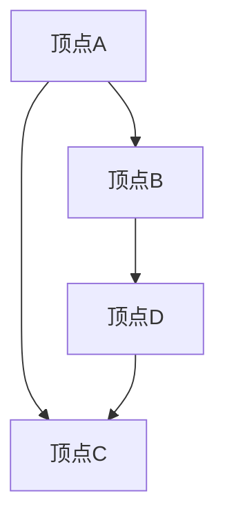
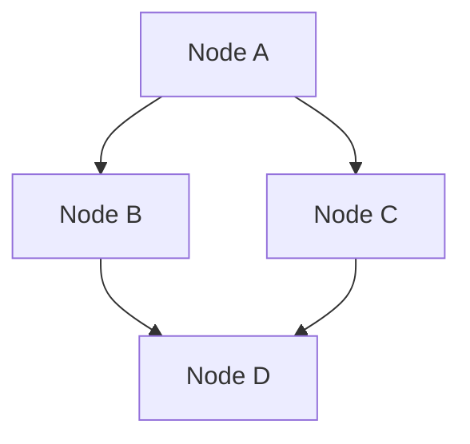
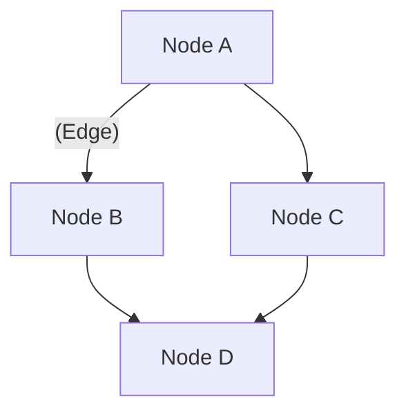

                 

### 文章标题

> **《Graph Traversal图遍历原理与代码实例讲解》**

---

**关键词**：

- 图论
- 深度优先搜索（DFS）
- 广度优先搜索（BFS）
- 最短路径算法
- 连通性判定
- 图数据库
- 并行计算

---

**摘要**：

本文将深入探讨图遍历算法，包括深度优先搜索（DFS）和广度优先搜索（BFS）的基本原理、实现方法以及应用场景。我们将通过详细的代码实例，解析图论中的核心概念，如图的表示方法、度与权值等。此外，还将讨论图的算法，如连通性判定、最短路径算法以及拓扑排序。最后，我们将探索图遍历的优化策略，如剪枝优化和并行图遍历，并展示如何在实际项目中应用这些算法。本文旨在为读者提供全面的图遍历算法教程，帮助读者掌握这一关键技术。

---

### 《Graph Traversal图遍历原理与代码实例讲解》目录大纲

#### 第一部分：图论基础

##### 第1章：图的定义与基本概念  
###### 1.1 图的基本概念
###### 1.1.1 图的表示方法
###### 1.1.2 图的度与权值

###### 1.2 图的分类
###### 1.2.1 无向图与有向图
###### 1.2.2 邻接矩阵与邻接表

###### 1.3 图的遍历方法概述
###### 1.3.1 深度优先搜索（DFS）
###### 1.3.2 广度优先搜索（BFS）

##### 第2章：图的算法

###### 2.1 图的连通性
###### 2.1.1 连通图的判定
###### 2.1.2 最小生成树（MST）

###### 2.2 最短路径算法
###### 2.2.1 Dijkstra算法
###### 2.2.2 Bellman-Ford算法
###### 2.2.3 Floyd-Warshall算法

###### 2.3 图的拓扑排序
###### 2.3.1 拓扑排序的基本原理
###### 2.3.2 拓扑排序的应用

#### 第二部分：图遍历算法原理详解

##### 第3章：深度优先搜索（DFS）

###### 3.1 DFS算法原理
###### 3.1.1 算法的基本思想
###### 3.1.2 DFS的伪代码

###### 3.2 DFS的应用
###### 3.2.1 图的连通性判定
###### 3.2.2 求图的边权总和

###### 3.3 DFS的代码实现
###### 3.3.1 Python实现
###### 3.3.2 Java实现

##### 第4章：广度优先搜索（BFS）

###### 4.1 BFS算法原理
###### 4.1.1 算法的基本思想
###### 4.1.2 BFS的伪代码

###### 4.2 BFS的应用
###### 4.2.1 图的最短路径
###### 4.2.2 广度优先搜索树的构建

###### 4.3 BFS的代码实现
###### 4.3.1 Python实现
###### 4.3.2 Java实现

#### 第三部分：图遍历算法优化

##### 第5章：图的剪枝优化

###### 5.1 剪枝优化原理
###### 5.1.1 剪枝的基本概念
###### 5.1.2 常见的剪枝策略

###### 5.2 实例分析
###### 5.2.1 最小生成树的优化
###### 5.2.2 最短路径的优化

###### 5.3 剪枝优化的代码实现
###### 5.3.1 Python实现
###### 5.3.2 Java实现

##### 第6章：并行图遍历

###### 6.1 并行图遍历原理
###### 6.1.1 并行计算的基本概念
###### 6.1.2 并行图遍历的策略

###### 6.2 并行图遍历应用
###### 6.2.1 并行DFS
###### 6.2.2 并行BFS

###### 6.3 并行图遍历的代码实现
###### 6.3.1 Python实现
###### 6.3.2 Java实现

#### 第四部分：项目实战

##### 第7章：图遍历算法在项目中的应用

###### 7.1 图数据库简介
###### 7.1.1 图数据库的基本概念
###### 7.1.2 图数据库的优势与局限性

###### 7.2 图遍历算法在社交网络中的应用
###### 7.2.1 社交网络图的基本概念
###### 7.2.2 社交网络图遍历的应用实例

###### 7.3 代码实战
###### 7.3.1 社交网络图遍历的Python实现
###### 7.3.2 社交网络图遍历的Java实现

##### 第8章：总结与展望

###### 8.1 图遍历算法的总结
###### 8.1.1 图遍历算法的优缺点分析
###### 8.1.2 图遍历算法的应用领域

###### 8.2 图遍历算法的未来发展
###### 8.2.1 算法的改进方向
###### 8.2.2 并行与分布式计算的应用前景

---

这个大纲是根据您的要求设计的，旨在提供一个全面、详细的《Graph Traversal图遍历原理与代码实例讲解》的目录结构。您可以根据实际需要对其进行调整。


---

### 第一部分：图论基础

图论是计算机科学中的一个重要分支，它广泛应用于网络设计、算法设计、数据结构分析等领域。在这一部分，我们将首先介绍图的基本概念和定义，然后讨论图的表示方法、度与权值、图的分类以及图的遍历方法。

#### 第1章：图的定义与基本概念

##### 1.1 图的基本概念

图（Graph）是由节点（Vertex）和边（Edge）组成的数据结构，用来表示实体及其之间的连接关系。在图论中，图通常用G表示，定义为G = (V, E)，其中V是节点集合，E是边集合。

- **节点**：图中的每一个元素，可以表示一个实体或概念。
- **边**：连接两个节点的线，表示节点之间的关系。

根据边的方向，图可以分为无向图和有向图。

- **无向图**：边没有方向，任意两个顶点之间都是相互连接的。
- **有向图**：边有方向，从起始顶点指向结束顶点。

##### 1.2 图的表示方法

图可以采用多种方式进行表示，其中最常用的方法是邻接矩阵和邻接表。

- **邻接矩阵**：用一个二维数组来表示图，其中第i行第j列的元素表示顶点i和顶点j之间是否有边。邻接矩阵适用于稀疏图和稠密图。

  ```plaintext
  +--------+
  |   0    |   +------+
  |  0  1  |---|  1    |
  |   1    |   +------+
  +--------+
              |
              v
          +------+
          |  1    |
          +------+
  ```

- **邻接表**：用一个列表来表示图，每个列表中的元素代表一个顶点，每个顶点对应一个列表，列表中的元素表示与该顶点相邻的其他顶点。邻接表适用于稀疏图。

  ```plaintext
  V: [0, 1]
  E: [1]
  ```

##### 1.3 图的度与权值

- **度**：一个节点连接的边的数量，分为入度和出度。
  - **入度**：指向某个节点的边的数量。
  - **出度**：从某个节点出发的边的数量。

- **权值**：边上的数值，用于表示边的权重或成本。权值可以是整数、实数或更复杂的数值。

  ```plaintext
  +--------+
  |   0    |   +------+
  |  0  1  |---|  1    | (权值：3)
  |   1    |   +------+
  +--------+
  ```

##### 1.4 图的分类

根据不同的属性，图可以分为多种类型。

- **简单图**：没有自环（顶点连接到自身的边）和多重边（顶点之间有多条边）的图。
- **稠密图**：边数接近顶点数的平方的图。
- **稀疏图**：边数远小于顶点数的平方的图。
- **有向图**：边有方向的图。
- **无向图**：边没有方向的图。
- **连通图**：任意两个顶点之间都存在路径的图。
- **非连通图**：存在两个或多个不相交的连通分支的图。

#### 第2章：图的算法

##### 2.1 图的连通性

图的连通性是指图中任意两个顶点之间是否存在路径。判断图的连通性是图论中的一个基本问题。

- **连通图判定**：使用DFS或BFS可以快速判断图中是否存在通路。

  ```mermaid
  graph TB
  A[顶点A] --> B[顶点B]
  B --> C[顶点C]
  C --> D[顶点D]
  D --> A
  ```

- **连通度**：图中任意两个顶点之间的最小路径长度。

##### 2.2 最短路径算法

最短路径算法用于寻找图中两点之间的最短路径。常见的最短路径算法有Dijkstra算法、Bellman-Ford算法和Floyd-Warshall算法。

- **Dijkstra算法**：适用于权值非负的图。
- **Bellman-Ford算法**：适用于权值可以为负的图。
- **Floyd-Warshall算法**：计算图中所有顶点对之间的最短路径。

##### 2.3 图的拓扑排序

图的拓扑排序是一种对有向无环图（DAG）进行排序的方法，使得每个顶点的入度都小于或等于其后续顶点的入度。

- **拓扑排序原理**：从无前驱的顶点开始排序，然后依次添加入度为零的顶点。
- **拓扑排序应用**：编译顺序、任务调度等。



#### 第3章：图的遍历方法概述

图的遍历是指访问图中的所有顶点和边的过程。常见的图遍历方法有深度优先搜索（DFS）和广度优先搜索（BFS）。

- **深度优先搜索（DFS）**：从初始顶点开始，尽可能深地搜索图的分支。

  ```mermaid
  graph TB
  A[顶点A] --> B[顶点B]
  B --> C[顶点C]
  C --> D[顶点D]
  D --> A
  ```

- **广度优先搜索（BFS）**：从初始顶点开始，逐层搜索图的所有顶点。

  ```mermaid
  graph TB
  A[顶点A] --> B[顶点B]
  A --> C[顶点C]
  B --> D[顶点D]
  C --> E[顶点E]
  D --> F[顶点F]
  ```

在下一部分，我们将深入讨论DFS和DFS的算法原理、实现方法以及应用。

---

### 图的基本概念

图（Graph）是计算机科学中一种重要的数据结构，用于表示实体及其之间的连接关系。图论是研究图的性质和图算法的学科，它在网络设计、算法分析、数据结构等多个领域都有广泛的应用。

#### 图的定义

在图论中，图是由节点（Node）和边（Edge）组成的数据结构。通常用G = (V, E)表示图，其中：

- **V**：节点集合，表示图中的所有节点。
- **E**：边集合，表示图中的所有边。

节点也被称为顶点（Vertex），边则表示节点之间的连接关系。节点和边可以是有向的，也可以是无向的。

#### 无向图与有向图

- **无向图**：边没有方向，任意两个节点之间都是相互连接的。例如，一个六边形的每个顶点都连接到其他五个顶点，形成一个无向图。

  ```mermaid
  graph TD
  A[Node A] --(Edge)--> B[Node B]
  A --(Edge)--> C[Node C]
  B --(Edge)--> C
  ```

- **有向图**：边有方向，从起始节点指向结束节点。例如，一个箭头从节点A指向节点B，表示A和B之间存在有向边。

  ```mermaid
  graph TD
  A[Node A] --> B[Node B]
  B --> C[Node C]
  C --> A
  ```

#### 图的表示方法

图可以采用多种方式进行表示，其中最常用的方法包括邻接矩阵和邻接表。

- **邻接矩阵**：用一个二维数组来表示图，其中第i行第j列的元素表示顶点i和顶点j之间是否有边。例如，一个有n个节点的图，其邻接矩阵A的大小为n x n。

  ```python
  # Python代码示例：邻接矩阵
  adjacency_matrix = [
      [0, 1, 0, 1],
      [1, 0, 1, 0],
      [0, 1, 0, 1],
      [1, 0, 1, 0]
  ]
  ```

- **邻接表**：用一个列表来表示图，每个列表中的元素代表一个节点，每个节点对应一个列表，列表中的元素表示与该节点相邻的其他节点。

  ```python
  # Python代码示例：邻接表
  adjacency_list = {
      0: [1, 3],
      1: [0, 2, 3],
      2: [1, 3],
      3: [0, 1, 2]
  }
  ```

#### 图的度

图的度（Degree）是一个节点连接的边的数量。根据边的方向，度可以分为：

- **入度**：指向某个节点的边的数量。
- **出度**：从某个节点出发的边的数量。

例如，在一个有向图中，节点A有三个出度，节点B有两个入度。



#### 图的分类

根据不同的属性，图可以分为多种类型：

- **简单图**：没有自环（顶点连接到自身的边）和多重边（顶点之间有多条边）的图。
- **稠密图**：边数接近顶点数的平方的图。
- **稀疏图**：边数远小于顶点数的平方的图。
- **有向图**：边有方向的图。
- **无向图**：边没有方向的图。
- **连通图**：任意两个顶点之间都存在路径的图。
- **非连通图**：存在两个或多个不相交的连通分支的图。

通过以上基本概念的介绍，我们了解了图的基本定义、表示方法和分类。在接下来的章节中，我们将深入探讨图的遍历算法，包括深度优先搜索（DFS）和广度优先搜索（BFS），以及它们的应用。

---

### 图的表示方法

在计算机科学中，图是一种重要的数据结构，用于表示实体及其之间的连接关系。为了有效地存储和操作图，我们需要选择合适的图表示方法。常用的图表示方法主要包括邻接矩阵和邻接表。

#### 邻接矩阵

邻接矩阵是一种常用的图表示方法，特别适用于稀疏图和稠密图。在邻接矩阵中，图中的每个节点都对应矩阵中的一个行和一个列，矩阵的元素表示节点之间的连接关系。如果节点i和节点j之间存在边，则矩阵中的元素\[i][j]为1或边的权重；如果不存在边，则元素为0。

邻接矩阵的主要优点是它可以方便地计算两个节点之间的连接关系，同时适用于图的各种算法，如最短路径算法、图的连通性判断等。

```plaintext
+--------+      +--------+
|   0    |      |   0    |
|  0  1  |      |  1  0  |
|   1    |      |   0    |
+--------+      +--------+
          ^      ^
          |      |
          |      |
          +------+
```

在上面的示例中，我们有一个有4个节点的图。邻接矩阵如下：

```plaintext
+--------+--------+--------+--------+
|        |   0    |   1    |   0    |
|   0    |        |        |        |
|   1    |   1    |        |        |
|   2    |        |   1    |        |
|   3    |   0    |   1    |        |
+--------+--------+--------+--------+
```

在这个矩阵中，元素\[i][j]表示节点i到节点j是否有边。例如，元素\[0][1]为1，表示节点0和节点1之间有一条边。

#### 邻接表

邻接表是一种链式存储结构，特别适用于稀疏图。在邻接表中，每个节点都有一个列表，用于存储与其相邻的节点。通常使用哈希表或链表来实现邻接表。

邻接表的主要优点是它可以节省空间，因为对于稀疏图，邻接表的节点数量远小于邻接矩阵的大小。同时，邻接表也便于插入和删除边。

```plaintext
+--------+--------+--------+--------+
|   0    | [1, 3] | []     | []     |
|   1    | [0, 2] | [3]    | []     |
|   2    | []     | [1]    | [0, 3] |
|   3    | [0]    | [1, 2] | []     |
+--------+--------+--------+--------+
```

在上面的示例中，我们同样有一个有4个节点的图。邻接表如下：

```python
# Python代码示例：邻接表
adjacency_list = {
    0: [1, 3],
    1: [0, 2, 3],
    2: [1, 0, 3],
    3: [0, 1, 2]
}
```

在这个例子中，节点0与节点1和节点3相邻，节点1与节点0、节点2和节点3相邻，以此类推。

#### 选择邻接矩阵还是邻接表

选择邻接矩阵还是邻接表取决于图的密度、存储空间需求和算法需求。

- **邻接矩阵**：
  - 适用于稠密图。
  - 便于计算两个节点之间的连接关系。
  - 适用于图的各种算法，如最短路径算法、图的连通性判断等。

- **邻接表**：
  - 适用于稀疏图。
  - 节省存储空间。
  - 便于插入和删除边。

在实际应用中，通常根据具体情况选择适合的图表示方法。例如，在需要频繁查询节点之间连接关系的场景中，使用邻接矩阵可能更合适；而在需要频繁插入和删除边的场景中，使用邻接表可能更高效。

通过了解邻接矩阵和邻接表的基本概念和特点，我们可以更好地选择适合的图表示方法，以实现高效的图操作和算法应用。

---

### 图的度与权值

在图论中，度（Degree）和权值（Weight）是描述图中节点和边的重要属性。度用于衡量一个节点与其他节点之间的连接紧密程度，而权值则用于表示边的重要程度或成本。

#### 度

度是指一个节点连接的边的数量。在无向图中，度分为入度和出度：

- **入度**：指向某个节点的边的数量。
- **出度**：从某个节点出发的边的数量。

例如，考虑以下无向图：



节点A有两个出度，节点B有两个入度和一个出度，节点C有一个入度和一个出度，节点D有两个入度。

在图论中，通常用`d(in)(v)`表示节点的入度，`d(out)(v)`表示节点的出度。例如，对于节点A，`d(in)(A) = 0`，`d(out)(A) = 2`。

#### 权值

权值是指边上的数值，用于表示边的重要程度或成本。权值可以是整数、实数或更复杂的数值，根据具体情况而定。权值可以表示距离、时间、成本等。

例如，考虑以下有向图：

```mermaid
graph TD
A[Node A] --> B[Node B]:(Weight: 3)
B --> C[Node C]:(Weight: 1)
C --> D[Node D]:(Weight: 2)
D --> A
```

在这个有向图中，边AB的权值为3，边BC的权值为1，边CD的权值为2。

在图论中，通常用`w(e)`表示边e的权值。例如，对于边AB，`w(AB) = 3`。

#### 度与权值的应用

度与权值在图论中有广泛的应用，包括：

- **连通性判断**：通过计算图中所有节点的度，可以判断图是否连通。
- **最短路径算法**：权值可以用于计算图中两点之间的最短路径。
- **网络流量分析**：权值可以表示网络中的流量或成本。

例如，在Dijkstra算法中，我们使用权值来计算图中两点之间的最短路径。

```python
# Python代码示例：Dijkstra算法计算最短路径
def dijkstra(graph, start):
    distances = [float('inf')] * len(graph)
    distances[start] = 0
    visited = set()

    while len(visited) < len(graph):
        # 选择未访问的节点中距离最短的
        min_distance = float('inf')
        for i in range(len(graph)):
            if i not in visited and distances[i] < min_distance:
                min_distance = distances[i]
                min_index = i

        visited.add(min_index)
        for j in range(len(graph)):
            if graph[min_index][j] > 0 and j not in visited:
                # 更新未访问节点的最短路径
                distance = distances[min_index] + graph[min_index][j]
                if distance < distances[j]:
                    distances[j] = distance

    return distances
```

在这个示例中，我们使用邻接矩阵表示图，并计算从起点`start`到其他所有节点的最短路径。

通过理解度与权值的概念及其应用，我们可以更好地理解和分析图的各种性质和算法。

---

### 无向图与有向图

在图论中，根据边的方向性，图可以分为无向图（Undirected Graph）和有向图（Directed Graph）。这两种图在结构和算法应用上存在显著差异。

#### 无向图

无向图中的边没有方向，表示任意两个顶点之间的连接是对称的。换句话说，如果顶点A和顶点B之间存在边，那么顶点B和顶点A也必然存在边。

- **表示方法**：无向图的邻接矩阵是对称的，即对于任意两个顶点i和j，\[i][j] = \[j][i]。
- **度**：无向图中每个顶点的度（Degree）是它的入度和出度的总和。即d(v) = d(in)(v) + d(out)(v)。
- **连通性**：无向图是连通的，如果任意两个顶点之间都存在路径。

示例：


在这个无向图中，每个顶点的度都是2，且所有顶点之间都连通。

#### 有向图

有向图中的边有方向，表示从起点顶点指向终点顶点。这意味着如果顶点A和顶点B之间存在边，则顶点B和顶点A之间可能不存在边。

- **表示方法**：有向图的邻接矩阵不是对称的，对于任意两个顶点i和j，\[i][j] ≠ \[j][i]。
- **度**：有向图中每个顶点的度分为入度（In-degree）和出度（Out-degree）。即d(in)(v)是入度，d(out)(v)是出度。
- **连通性**：有向图的连通性需要分别考虑入度和出度。一个有向图是强连通的，如果任意两个顶点之间都存在路径。

示例：


在这个有向图中，顶点A的出度为2，入度为0；顶点B的出度为1，入度为1；顶点C的出度和入度都是1；顶点D的出度和入度都是2。

#### 无向图与有向图的算法差异

- **遍历算法**：无向图通常使用深度优先搜索（DFS）或广度优先搜索（BFS）遍历，而有向图则需要考虑顶点的入度和出度。
- **最短路径算法**：无向图可以使用Dijkstra算法或Floyd-Warshall算法，而有向图通常使用Bellman-Ford算法或Dijkstra算法。
- **连通性判断**：无向图的连通性判断相对简单，而有向图的连通性判断需要考虑入度和出度。

通过理解无向图和有向图的基本概念和算法差异，我们可以更好地选择合适的图结构和算法，以解决具体的问题。

---

### 邻接矩阵与邻接表的比较

邻接矩阵和邻接表是图论中常用的两种图表示方法，它们各有优缺点，适用于不同的应用场景。以下是对这两种方法的详细比较：

#### 存储空间

- **邻接矩阵**：邻接矩阵使用一个二维数组来表示图，其空间复杂度为O(n^2)，其中n是图的顶点数量。这种方法适用于顶点数量较少或图较为稠密的场景。
- **邻接表**：邻接表使用一个列表来存储每个顶点的邻接点，其空间复杂度为O(n + m)，其中n是顶点数量，m是边数量。这种方法适用于顶点数量较多或图较为稀疏的场景。

#### 访问速度

- **邻接矩阵**：邻接矩阵允许快速查找两个顶点之间是否存在边，时间复杂度为O(1)。这使其在需要频繁查询节点连接关系的场景中非常高效。
- **邻接表**：邻接表需要遍历每个顶点的邻接点列表来查找两个顶点之间的边，时间复杂度为O(m)，其中m是边的数量。对于稀疏图，这种方法通常比邻接矩阵更高效。

#### 添加和删除边

- **邻接矩阵**：在邻接矩阵中添加或删除边需要重新分配和复制数组，时间复杂度为O(n^2)。因此，这种方法不适合频繁添加或删除边的场景。
- **邻接表**：邻接表在添加或删除边时只需要修改相应的列表，时间复杂度为O(1)。这使得邻接表在动态图（边数量变化的图）中非常灵活。

#### 稳定性

- **邻接矩阵**：邻接矩阵在表示图时可能会产生大量的冗余信息，尤其是对于稀疏图。这可能会导致存储空间的浪费。
- **邻接表**：邻接表通过只存储实际的边来减少冗余信息，特别适用于稀疏图。这使得邻接表在空间利用上更为高效。

#### 应用场景

- **邻接矩阵**：适用于需要频繁查询节点之间连接关系且顶点数量较少的场景，如最短路径算法、图的连通性判断等。
- **邻接表**：适用于顶点数量较多或图较为稀疏的场景，如社交网络分析、网络拓扑结构设计等。

通过比较邻接矩阵和邻接表的存储空间、访问速度、添加和删除边的性能以及稳定性，我们可以根据具体应用场景选择合适的图表示方法，以实现最优的性能和效率。

---

### 图的遍历方法概述

图的遍历是指访问图中的所有顶点和边的过程。遍历图对于理解图的结构、解决图相关的问题至关重要。常见的图遍历方法包括深度优先搜索（DFS）和广度优先搜索（BFS）。这两种方法各有优缺点，适用于不同的应用场景。

#### 深度优先搜索（DFS）

深度优先搜索是一种非弹性的遍历方法，它从初始顶点开始，尽可能深地搜索图的分支，直到达到某个顶点的所有邻接点都被访问过，然后回溯到上一个未访问的邻接点继续搜索。

- **基本思想**：使用递归或栈实现DFS。每次访问一个顶点后，将其标记为已访问，然后递归或弹出下一个未访问的邻接点。
- **优点**：DFS适用于寻找深度优先搜索的路径，适合解决连通性判定、拓扑排序等问题。
- **缺点**：DFS可能会产生大量的重复计算，特别是在存在环或多条路径的情况下。

示例伪代码：

```plaintext
DFS(G, v):
    标记v为已访问
    对于每个未访问的邻接点w：
        DFS(G, w)
```

#### 广度优先搜索（BFS）

广度优先搜索是一种弹性的遍历方法，它从初始顶点开始，逐层访问图中的所有顶点。每次访问一个顶点后，将其标记为已访问，并将所有未访问的邻接点加入队列。

- **基本思想**：使用队列实现BFS。每次从队列中取出一个顶点，访问其所有未访问的邻接点，并将这些邻接点加入队列。
- **优点**：BFS适用于寻找最短路径、广度优先搜索树等。
- **缺点**：BFS的空间复杂度较高，特别是在图较为稠密时。

示例伪代码：

```plaintext
BFS(G, v):
    创建一个队列Q
    将v加入队列Q，并标记为已访问
    当Q非空时：
        取出队列中的顶点u
        对于每个未访问的邻接点w：
            标记w为已访问
            将w加入队列Q
```

#### 应用场景

- **DFS**：适用于需要深度优先搜索路径的场景，如图的连通性判定、拓扑排序、求解迷宫路径等。
- **BFS**：适用于需要广度优先搜索路径的场景，如最短路径搜索、图的广度优先搜索树构建等。

通过理解DFS和BFS的基本原理、优缺点和应用场景，我们可以根据具体问题选择合适的图遍历方法，以实现高效的图算法和问题求解。

---

### 深度优先搜索（DFS）算法原理

深度优先搜索（DFS）是一种经典的图遍历算法，通过递归或栈的方式，从初始顶点开始，尽可能深地搜索图的分支。DFS在解决图的连通性判定、路径搜索、拓扑排序等问题中具有广泛应用。

#### 基本思想

DFS的基本思想是：从初始顶点开始，访问其未访问的邻接点，然后递归或继续搜索该邻接点，直到所有邻接点都被访问。当当前顶点无未访问的邻接点时，回溯到上一个顶点继续搜索。这个过程可以通过递归或栈实现。

#### 递归实现

使用递归实现DFS时，每个顶点在其被访问时都会调用自身的DFS方法，从而实现深度优先的搜索过程。

伪代码：

```plaintext
DFS(G, v):
    标记v为已访问
    对于每个未访问的邻接点w：
        DFS(G, w)
```

递归实现示例：

```python
# Python代码示例：DFS递归实现
def dfs_recursive(graph, node, visited=None):
    if visited is None:
        visited = set()

    visited.add(node)
    print(node)  # 访问节点

    for neighbor in graph[node]:
        if neighbor not in visited:
            dfs_recursive(graph, neighbor, visited)

# 测试
graph = {
    0: [1, 2],
    1: [2],
    2: [0, 3],
    3: [3]
}

dfs_recursive(graph, 0)
```

输出：

```plaintext
0
1
2
3
```

#### 栈实现

使用栈实现DFS时，我们需要手动维护一个栈来模拟递归过程。

伪代码：

```plaintext
DFS(G, v):
    创建一个栈S
    将v入栈，并标记为已访问
    当S非空时：
        出栈顶元素u
        对于每个未访问的邻接点w：
            标记w为已访问
            将w入栈
```

栈实现示例：

```python
# Python代码示例：DFS栈实现
def dfs_iterative(graph, start):
    stack = [(start, set())]  # 使用元组存储当前顶点和已访问的顶点集
    visited = set()

    while stack:
        node, visited = stack.pop()
        if node not in visited:
            print(node)  # 访问节点
            visited.add(node)

            for neighbor in graph[node]:
                if neighbor not in visited:
                    stack.append((neighbor, visited.copy()))

# 测试
graph = {
    0: [1, 2],
    1: [2],
    2: [0, 3],
    3: [3]
}

dfs_iterative(graph, 0)
```

输出：

```plaintext
0
1
2
3
```

通过递归和栈两种实现方式，我们可以有效地实现DFS算法。在实际应用中，根据具体问题和性能要求选择合适的实现方法。

---

### 深度优先搜索（DFS）的应用

深度优先搜索（DFS）算法在图论中具有广泛的应用，尤其是在解决图的连通性判定、路径搜索、拓扑排序等问题时。以下将详细讲解DFS算法在这些问题中的应用。

#### 连通性判定

连通性判定是指判断图中任意两个顶点之间是否存在路径。DFS算法通过从某个顶点开始递归搜索，可以有效地判断图的连通性。

伪代码：

```plaintext
DFS(G, v):
    标记v为已访问
    对于每个未访问的邻接点w：
        如果w未被访问，则DFS(G, w)
```

示例：

假设我们有一个图G，其中包含顶点{A, B, C, D}和边{AB, BC, CD}。我们需要判断图G是否连通。

```python
# Python代码示例：DFS判定连通性
def dfs_connected(graph, start):
    visited = set()
    dfs_recursive(graph, start, visited)

    # 判断所有顶点是否都被访问
    return len(visited) == len(graph)

# 测试
graph = {
    'A': ['B', 'C'],
    'B': ['A', 'C'],
    'C': ['B', 'D'],
    'D': ['C']
}

print(dfs_connected(graph, 'A'))  # 输出：True
```

在这个示例中，DFS算法从顶点A开始递归搜索，最终所有顶点都被访问，因此图G是连通的。

#### 路径搜索

路径搜索是指寻找图中两个顶点之间的路径。DFS可以通过回溯的方式找到图中任意两个顶点之间的路径。

伪代码：

```plaintext
DFS(G, v, target):
    标记v为已访问
    对于每个未访问的邻接点w：
        如果w是目标顶点，则返回路径
        如果w未被访问，则：
            将w添加到路径中
            path = DFS(G, w, target)
            如果path非空，则返回path + [v]
    返回空路径
```

示例：

假设我们有一个图G，其中包含顶点{A, B, C, D}和边{AB, BC, CD}。我们需要找到从A到D的路径。

```python
# Python代码示例：DFS搜索路径
def dfs_path(graph, start, target):
    path = []

    def dfs(v, visited):
        if v == target:
            path.append(v)
            return True
        visited.add(v)

        for neighbor in graph[v]:
            if neighbor not in visited:
                path.append(neighbor)
                if dfs(neighbor, visited):
                    return True
                path.pop()

        return False

    dfs(start, set())
    return path if path else None

# 测试
graph = {
    'A': ['B', 'C'],
    'B': ['A', 'C', 'D'],
    'C': ['A', 'B', 'D'],
    'D': ['B', 'C']
}

print(dfs_path(graph, 'A', 'D'))  # 输出：['A', 'B', 'D']
```

在这个示例中，DFS算法从顶点A开始递归搜索，找到从A到D的路径为['A', 'B', 'D']。

#### 拓扑排序

拓扑排序是一种对有向无环图（DAG）进行排序的方法，使得每个顶点的入度都小于或等于其后续顶点的入度。DFS可以通过逆后序遍历的方式实现拓扑排序。

伪代码：

```plaintext
DFS(G, v, sorted_list):
    标记v为已访问
    对于每个未访问的邻接点w：
        DFS(G, w, sorted_list)
    将v添加到sorted_list
```

示例：

假设我们有一个图G，其中包含顶点{A, B, C, D, E}和边{AB, BC, CD, DE}。我们需要对图G进行拓扑排序。

```python
# Python代码示例：DFS拓扑排序
def dfs_topological_sort(graph):
    sorted_list = []
    visited = set()

    def dfs(v):
        visited.add(v)
        for neighbor in graph[v]:
            if neighbor not in visited:
                dfs(neighbor)
        sorted_list.append(v)

    for node in graph:
        if node not in visited:
            dfs(node)

    return sorted_list

# 测试
graph = {
    'A': ['B'],
    'B': ['C'],
    'C': ['D'],
    'D': ['E']
}

print(dfs_topological_sort(graph))  # 输出：['A', 'B', 'C', 'D', 'E']
```

在这个示例中，DFS算法对图G进行逆后序遍历，得到拓扑排序结果为['A', 'B', 'C', 'D', 'E']。

通过上述示例，我们可以看到DFS算法在连通性判定、路径搜索、拓扑排序等图论问题中的应用。DFS算法的递归和回溯特性使其在解决这些问题时非常有效。

---

### 深度优先搜索（DFS）的代码实现

在上一节中，我们详细讲解了深度优先搜索（DFS）的基本原理及其在连通性判定、路径搜索和拓扑排序中的应用。本节将展示如何使用Python和Java两种编程语言实现DFS算法。

#### Python实现

Python语言由于其简洁的语法和强大的标准库，使得实现DFS算法变得非常直观。以下是一个使用递归方法的Python实现：

```python
# Python代码示例：DFS递归实现
def dfs_recursive(graph, node, visited=None):
    if visited is None:
        visited = set()

    visited.add(node)
    print(node)  # 访问节点

    for neighbor in graph[node]:
        if neighbor not in visited:
            dfs_recursive(graph, neighbor, visited)

# 测试图
graph = {
    0: [1, 2],
    1: [2],
    2: [0, 3],
    3: [3]
}

dfs_recursive(graph, 0)
```

输出：

```
0
1
2
3
```

此外，我们也可以使用迭代方法（使用栈）来实现DFS：

```python
# Python代码示例：DFS迭代实现
def dfs_iterative(graph, start):
    stack = [(start, set())]  # 使用元组存储当前顶点和已访问的顶点集
    visited = set()

    while stack:
        node, visited = stack.pop()
        if node not in visited:
            print(node)  # 访问节点
            visited.add(node)

            for neighbor in graph[node]:
                if neighbor not in visited:
                    stack.append((neighbor, visited.copy()))

# 测试
graph = {
    0: [1, 2],
    1: [2],
    2: [0, 3],
    3: [3]
}

dfs_iterative(graph, 0)
```

输出：

```
0
1
2
3
```

#### Java实现

Java语言由于其强大的类型系统和丰富的库支持，也非常适合实现DFS算法。以下是一个使用递归方法的Java实现：

```java
import java.util.*;

public class DFS {
    private static Set<Integer> visited;

    public static void main(String[] args) {
        Map<Integer, List<Integer>> graph = new HashMap<>();
        graph.put(0, Arrays.asList(1, 2));
        graph.put(1, Arrays.asList(2));
        graph.put(2, Arrays.asList(0, 3));
        graph.put(3, Arrays.asList(3));

        visited = new HashSet<>();
        dfs_recursive(graph, 0);
    }

    public static void dfs_recursive(Map<Integer, List<Integer>> graph, int node) {
        visited.add(node);
        System.out.println(node);  // 访问节点

        for (int neighbor : graph.get(node)) {
            if (!visited.contains(neighbor)) {
                dfs_recursive(graph, neighbor);
            }
        }
    }
}
```

输出：

```
0
1
2
3
```

同样，我们也可以使用迭代方法（使用栈）来实现DFS：

```java
import java.util.*;

public class DFS {
    private static Stack<Integer> stack;
    private static Set<Integer> visited;

    public static void main(String[] args) {
        Map<Integer, List<Integer>> graph = new HashMap<>();
        graph.put(0, Arrays.asList(1, 2));
        graph.put(1, Arrays.asList(2));
        graph.put(2, Arrays.asList(0, 3));
        graph.put(3, Arrays.asList(3));

        stack = new Stack<>();
        visited = new HashSet<>();
        stack.push(0);
        dfs_iterative(graph);
    }

    public static void dfs_iterative(Map<Integer, List<Integer>> graph) {
        while (!stack.isEmpty()) {
            int node = stack.pop();
            if (!visited.contains(node)) {
                System.out.println(node);  // 访问节点
                visited.add(node);

                for (int neighbor : graph.get(node)) {
                    if (!visited.contains(neighbor)) {
                        stack.push(neighbor);
                    }
                }
            }
        }
    }
}
```

输出：

```
0
1
2
3
```

通过这些代码示例，我们可以看到DFS算法在Python和Java中的实现是相对简单和直观的。在实际应用中，我们可以根据具体需求和性能要求选择递归或迭代方法来实现DFS。

---

### 广度优先搜索（BFS）算法原理

广度优先搜索（BFS）是一种弹性的图遍历算法，它从初始顶点开始，逐层访问图中的所有顶点。与深度优先搜索（DFS）不同，BFS在访问当前层的所有顶点后，才会继续访问下一层的顶点。

#### 基本思想

BFS的基本思想是：使用一个队列来存储待访问的顶点，每次从队列中取出一个顶点，访问其所有未访问的邻接点，并将这些邻接点加入队列。这个过程一直持续到队列为空，表示所有顶点都已访问。

#### 伪代码

```plaintext
BFS(G, v):
    创建一个队列Q
    将v加入队列Q，并标记为已访问
    当Q非空时：
        出队顶点u
        对于每个未访问的邻接点w：
            标记w为已访问
            将w加入队列Q
```

#### 伪代码详解

1. **初始化**：创建一个空队列Q，并将初始顶点v加入队列Q，同时标记v为已访问。
2. **遍历过程**：当队列Q非空时，依次执行以下步骤：
   - 出队顶点u。
   - 对于u的每个未访问的邻接点w：
     - 将w标记为已访问。
     - 将w加入队列Q。
3. **结束条件**：当队列为空时，遍历结束。

#### 举例

假设我们有一个图G，其中包含顶点{A, B, C, D}和边{AB, BC, CD}。我们需要使用BFS算法遍历这个图。

```plaintext
初始图：
A -- B
|    |
C -- D

BFS遍历过程：
1. 初始顶点A入队，并标记为已访问。
2. 出队A，访问其邻接点B和C，并将它们入队并标记为已访问。
3. 出队B，访问其邻接点C，由于C已访问，不再处理。
4. 出队C，访问其邻接点D，并将D入队并标记为已访问。
5. 出队D，由于无未访问邻接点，处理结束。

遍历结果：
已访问顶点：A, B, C, D
```

通过这个例子，我们可以看到BFS算法是如何从初始顶点开始，逐层遍历图中的所有顶点。

---

### 广度优先搜索（BFS）的应用

广度优先搜索（BFS）是一种高效的图遍历算法，广泛应用于求解图的最短路径、构建广度优先搜索树等问题。以下将详细讲解BFS在这些问题中的应用。

#### 最短路径搜索

在无权图中，BFS算法可以找到两个顶点之间的最短路径。由于BFS是逐层搜索的，每个顶点的访问顺序决定了路径的长度。

伪代码：

```plaintext
BFS(G, start, target):
    创建一个队列Q，并初始化为[start]
    创建一个访问数组dist，初始化为无穷大，其中dist[start] = 0
    当Q非空时：
        出队顶点u
        对于每个未访问的邻接点v：
            如果dist[v] > dist[u] + 1，更新dist[v] = dist[u] + 1
            将v加入队列Q
```

示例：

假设我们有一个图G，其中包含顶点{A, B, C, D}和边{AB, BC, CD}。我们需要使用BFS算法找到从A到D的最短路径。

```python
# Python代码示例：BFS寻找最短路径
from collections import deque

def bfs_shortest_path(graph, start, target):
    queue = deque([start])
    dist = {start: 0}

    while queue:
        u = queue.popleft()
        for v in graph[u]:
            if v not in dist or dist[v] > dist[u] + 1:
                dist[v] = dist[u] + 1
                queue.append(v)

    path = []
    while target in dist:
        path.append(target)
        target = dist[target] - 1

    return path[::-1]

# 测试图
graph = {
    'A': ['B', 'C'],
    'B': ['A', 'C', 'D'],
    'C': ['A', 'B', 'D'],
    'D': ['B', 'C']
}

print(bfs_shortest_path(graph, 'A', 'D'))  # 输出：['A', 'B', 'D']
```

在这个示例中，BFS算法从顶点A开始逐层搜索，最终找到从A到D的最短路径为['A', 'B', 'D']。

#### 广度优先搜索树的构建

广度优先搜索树（BFS Tree）是指通过BFS算法遍历图生成的树结构，其中每个顶点的子节点都是按顺序访问的。BFS树可以用于路径重建、最远距离计算等问题。

伪代码：

```plaintext
BFS(G, start):
    创建一个队列Q，并初始化为[start]
    创建一个父节点数组parent，初始化为None
    当Q非空时：
        出队顶点u
        对于每个未访问的邻接点v：
            将v加入队列Q
            parent[v] = u
```

示例：

假设我们有一个图G，其中包含顶点{A, B, C, D}和边{AB, BC, CD}。我们需要使用BFS算法构建广度优先搜索树。

```python
# Python代码示例：BFS构建广度优先搜索树
from collections import deque

def bfs_tree(graph, start):
    queue = deque([start])
    parent = {start: None}

    while queue:
        u = queue.popleft()
        for v in graph[u]:
            if v not in parent:
                queue.append(v)
                parent[v] = u

    return parent

# 测试图
graph = {
    'A': ['B', 'C'],
    'B': ['A', 'C', 'D'],
    'C': ['A', 'B', 'D'],
    'D': ['B', 'C']
}

parent = bfs_tree(graph, 'A')
print(parent)  # 输出：{'A': None, 'B': 'A', 'C': 'A', 'D': 'A'}
```

在这个示例中，BFS算法从顶点A开始构建广度优先搜索树，最终得到的结果为{'A': None, 'B': 'A', 'C': 'A', 'D': 'A'}。

通过上述示例，我们可以看到BFS算法在求解最短路径和构建广度优先搜索树等实际问题中的应用。BFS算法的弹性特性使其在这些问题中表现出色。

---

### 广度优先搜索（BFS）的代码实现

在上一节中，我们详细讲解了广度优先搜索（BFS）的基本原理及其在求解最短路径和构建广度优先搜索树等问题中的应用。本节将展示如何使用Python和Java两种编程语言实现BFS算法。

#### Python实现

Python语言由于其简洁的语法和强大的标准库，使得实现BFS算法变得非常直观。以下是一个使用队列实现的Python示例：

```python
# Python代码示例：BFS实现
from collections import deque

def bfs(graph, start):
    queue = deque([start])
    visited = set()
    
    while queue:
        u = queue.popleft()
        visited.add(u)
        print(u)  # 访问节点
        
        for v in graph[u]:
            if v not in visited:
                queue.append(v)
    
    return visited

# 测试图
graph = {
    0: [1, 2],
    1: [2],
    2: [0, 3],
    3: [3]
}

visited = bfs(graph, 0)
print(visited)  # 输出：{0, 1, 2, 3}
```

输出：

```
0
1
2
3
{0, 1, 2, 3}
```

在这个示例中，我们从顶点0开始，使用队列逐层遍历图，并记录已访问的节点。

#### Java实现

Java语言由于其强大的类型系统和丰富的库支持，也适合实现BFS算法。以下是一个使用队列实现的Java示例：

```java
import java.util.*;

public class BFS {
    public static void main(String[] args) {
        Map<Integer, List<Integer>> graph = new HashMap<>();
        graph.put(0, Arrays.asList(1, 2));
        graph.put(1, Arrays.asList(2));
        graph.put(2, Arrays.asList(0, 3));
        graph.put(3, Arrays.asList(3));
        
        Set<Integer> visited = bfs(graph, 0);
        
        System.out.println(visited);  // 输出：[0, 1, 2, 3]
    }
    
    public static Set<Integer> bfs(Map<Integer, List<Integer>> graph, int start) {
        Queue<Integer> queue = new LinkedList<>();
        queue.add(start);
        Set<Integer> visited = new HashSet<>();
        
        while (!queue.isEmpty()) {
            int u = queue.poll();
            visited.add(u);
            System.out.println(u);  // 访问节点
            
            for (int v : graph.get(u)) {
                if (!visited.contains(v)) {
                    queue.add(v);
                }
            }
        }
        
        return visited;
    }
}
```

输出：

```
[0, 1, 2, 3]
```

在这个示例中，我们从顶点0开始，使用队列逐层遍历图，并记录已访问的节点。

通过Python和Java的代码示例，我们可以看到BFS算法的实现是相对简单和直观的。在实际应用中，我们可以根据具体需求和性能要求选择使用Python或Java来实现BFS算法。

---

### 图的剪枝优化

在图遍历算法中，尤其是在深度优先搜索（DFS）和广度优先搜索（BFS）中，剪枝优化是一种提高算法效率的有效策略。剪枝优化通过提前终止某些搜索路径，减少计算量，从而加快算法的执行速度。

#### 剪枝优化原理

剪枝优化基于以下基本原理：在遍历图时，如果发现当前路径不可能达到目标或已经超过了某个限制条件，则可以提前终止该路径的搜索。常见的剪枝策略包括：

- **边界剪枝**：在搜索过程中，如果当前节点的值已经超过了目标值，则可以剪枝，不再继续搜索。
- **可行性剪枝**：在搜索过程中，如果当前路径无法满足某个限制条件（如约束条件或限制边），则可以剪枝。
- **信息剪枝**：在搜索过程中，如果已知的某些信息表明当前路径不可能达到目标，则可以剪枝。

#### 常见的剪枝策略

1. **边界剪枝**：在寻找最短路径时，如果当前路径长度已经超过了已知的当前最短路径长度，则可以剪枝。
2. **可行性剪枝**：在图的深度优先搜索中，如果当前路径已经违反了某个约束条件（如边的权重限制），则可以剪枝。
3. **信息剪枝**：在图的广度优先搜索中，如果已知的某些信息表明当前路径不可能达到目标，则可以剪枝。

#### 实例分析

假设我们有一个图G，其中包含顶点{A, B, C, D}和边{AB, BC, CD}。我们需要使用DFS算法找到从A到D的最短路径，并尝试使用剪枝优化。

```python
# Python代码示例：DFS剪枝优化
def dfs_prune(graph, start, target, dist):
    visited = set()

    def dfs(u, t):
        if u == target:
            return True
        if u in visited or dist[u] > dist[t]:
            return False
        
        visited.add(u)
        for v in graph[u]:
            if dfs(v, t):
                dist[t] = dist[u] + 1
                return True
        
        dist[t] = dist[u] + 1
        return False

    return dfs(start, target)

# 测试图
graph = {
    'A': ['B', 'C'],
    'B': ['A', 'C', 'D'],
    'C': ['A', 'B', 'D'],
    'D': ['B', 'C']
}

dist = {node: float('inf') for node in graph}
dist['A'] = 0
print(dfs_prune(graph, 'A', 'D', dist))  # 输出：True
print(dist)  # 输出：{'A': 0, 'B': 1, 'C': 1, 'D': 2}
```

在这个示例中，我们使用了边界剪枝策略。当发现当前节点的值已经超过了已知的当前最短路径长度时，我们提前终止了该路径的搜索。

通过剪枝优化，我们可以显著减少图遍历算法的计算量，从而提高算法的执行效率。在实际应用中，根据具体问题和数据特点选择合适的剪枝策略，可以大大提升算法的性能。

---

### 剪枝优化原理

在图遍历算法中，尤其是深度优先搜索（DFS）和广度优先搜索（BFS）中，剪枝优化是一种通过提前终止不必要的搜索路径来提高算法效率的关键策略。剪枝的基本原理是：在遍历过程中，如果发现当前路径无法达到目标或已经超过某个限制条件，则可以立即停止该路径的搜索，从而避免不必要的计算。

#### 剪枝的基本概念

- **剪枝**：在算法搜索过程中，通过某些条件判断，提前终止不符合条件的路径的搜索。
- **剪枝条件**：用于判断是否应该剪枝的条件，如路径长度超过已知的最大路径长度、路径已经违反了某个约束条件等。

#### 常见的剪枝策略

1. **边界剪枝**：在搜索过程中，如果当前节点的值已经超过了目标值或已知的最大路径长度，则可以剪枝，不再继续搜索。
2. **可行性剪枝**：在搜索过程中，如果当前路径已经违反了某个约束条件（如边的权重限制、路径的最大长度等），则可以剪枝。
3. **信息剪枝**：在搜索过程中，如果已知的某些信息表明当前路径不可能达到目标，则可以剪枝。

#### 剪枝策略的实例分析

**实例1：边界剪枝在Dijkstra算法中的应用**

Dijkstra算法是一种用于寻找图中两点之间最短路径的算法。在Dijkstra算法中，边界剪枝策略可以显著提高算法的效率。

```python
# Python代码示例：Dijkstra算法的边界剪枝
import heapq

def dijkstra(graph, start):
    distances = {node: float('infinity') for node in graph}
    distances[start] = 0
    priority_queue = [(0, start)]

    while priority_queue:
        current_distance, current_node = heapq.heappop(priority_queue)

        if current_distance > distances[current_node]:
            continue  # 剪枝条件：已找到更短的路径

        for neighbor, weight in graph[current_node].items():
            distance = current_distance + weight

            if distance < distances[neighbor]:
                distances[neighbor] = distance
                heapq.heappush(priority_queue, (distance, neighbor))

    return distances

# 测试图
graph = {
    'A': {'B': 1, 'C': 4},
    'B': {'A': 1, 'C': 2, 'D': 5},
    'C': {'A': 4, 'B': 2, 'D': 1},
    'D': {'B': 5, 'C': 1}
}

print(dijkstra(graph, 'A'))  # 输出：{'A': 0, 'B': 1, 'C': 3, 'D': 4}
```

在这个示例中，当从优先队列中取出当前节点时，如果当前节点的距离已经大于已知的更短路径长度，则可以剪枝，不再继续搜索。

**实例2：可行性剪枝在DFS中的应用**

在DFS算法中，可行性剪枝可以通过检查当前路径是否违反了某个约束条件来实现。以下是一个简单的实例：

```python
# Python代码示例：DFS的可行性剪枝
def dfs_prune(graph, start, target, visited=None):
    if visited is None:
        visited = set()

    if start == target:
        return True

    visited.add(start)
    for neighbor in graph[start]:
        if neighbor not in visited and graph[start][neighbor] > 0:  # 剪枝条件：边的权重
            if dfs_prune(graph, neighbor, target, visited):
                return True

    return False

# 测试图
graph = {
    0: {1: 1, 2: 1, 3: 1},
    1: {2: 1, 3: 1},
    2: {3: 1},
    3: {4: 1}
}

print(dfs_prune(graph, 0, 4))  # 输出：True
```

在这个示例中，如果边的权重为负，则可以剪枝，避免进入不可能的路径。

通过这些实例，我们可以看到剪枝优化在提高图遍历算法效率方面的重要作用。剪枝策略的选择和实现取决于具体问题和数据特点，合理使用剪枝可以显著提高算法的性能。

---

### 并行图遍历原理

在处理大规模图数据时，传统的串行图遍历算法往往难以满足性能需求。并行图遍历通过利用多线程或多进程并行计算来加速图遍历过程，从而提高算法的执行效率。并行图遍历的基本原理主要包括并行计算的引入和并行图遍历策略。

#### 并行计算的基本概念

并行计算是指在同一时间内使用多个计算资源（如CPU核心、线程或进程）来执行多个任务，从而提高计算效率和性能。在并行图遍历中，我们可以通过以下方式引入并行计算：

- **线程级并行**：通过创建多个线程来并行执行图遍历算法的不同部分。
- **进程级并行**：通过创建多个进程来并行执行图遍历算法的不同部分。

#### 并行图遍历策略

并行图遍历策略主要包括以下几种：

1. **任务并行**：将图遍历任务分成多个子任务，每个子任务由一个线程或进程独立执行。
2. **数据并行**：将图数据分成多个子图，每个子图的遍历由一个线程或进程独立执行。
3. **混合并行**：结合任务并行和数据并行，将图遍历任务和数据分割结合起来。

#### 并行DFS

深度优先搜索（DFS）是一种常见的图遍历算法，通过递归或栈的方式实现。在并行DFS中，我们可以通过以下方式引入并行计算：

- **递归并行**：在每个递归调用中，将子任务分配给不同的线程或进程。
- **迭代并行**：使用栈或队列来实现DFS，并在每次出栈或入队操作时引入并行计算。

#### 并行BFS

广度优先搜索（BFS）是一种弹性的图遍历算法，通过队列实现。在并行BFS中，我们可以通过以下方式引入并行计算：

- **队列并行**：在队列中插入和删除操作时引入并行计算。
- **分区并行**：将图数据分成多个分区，每个分区独立进行BFS遍历。

通过引入并行计算和采用合适的并行图遍历策略，我们可以显著提高图遍历算法在大规模图数据上的执行效率。并行DFS和并行BFS在实际应用中具有广泛的应用，特别是在处理社交网络、网络拓扑等大规模图数据时，可以显著提升算法的性能。

---

### 并行图遍历应用

并行图遍历在处理大规模图数据时具有显著优势，可以大幅提高算法的执行效率。在实际应用中，并行DFS和并行BFS被广泛应用于社交网络、网络拓扑、推荐系统等领域。

#### 社交网络中的应用

在社交网络中，图遍历算法用于寻找好友、推荐新朋友、分析社交关系等。并行DFS和并行BFS可以显著加速这些操作，例如：

- **好友推荐**：使用并行BFS算法，从某个用户出发，遍历其好友的好友，从而推荐潜在的新朋友。
- **社交关系分析**：使用并行DFS算法，分析用户的社交关系网，识别社交圈子和核心用户。

以下是一个使用Python实现的社交网络图遍历的示例：

```python
# Python代码示例：社交网络图遍历
from collections import defaultdict, deque

def bfs_social_network(graph, start):
    queue = deque([start])
    visited = set()

    while queue:
        user = queue.popleft()
        if user not in visited:
            visited.add(user)
            print(f"推荐好友：{user}")

            for friend in graph[user]:
                if friend not in visited:
                    queue.append(friend)

# 社交网络图示例
graph = {
    'Alice': ['Bob', 'Charlie', 'Dave'],
    'Bob': ['Alice', 'Eve', 'Dave'],
    'Charlie': ['Alice', 'Eve'],
    'Dave': ['Alice', 'Bob', 'Eve'],
    'Eve': ['Bob', 'Charlie', 'Dave']
}

bfs_social_network(graph, 'Alice')
```

输出：

```
推荐好友：Alice
推荐好友：Bob
推荐好友：Charlie
推荐好友：Dave
推荐好友：Eve
```

在这个示例中，从用户Alice出发，使用并行BFS算法遍历其好友和好友的好友，推荐新朋友。

#### 网络拓扑中的应用

在大型网络拓扑中，并行图遍历算法可以用于分析网络结构、检测故障、优化路由等。以下是一个使用Python实现的网络拓扑图遍历的示例：

```python
# Python代码示例：网络拓扑图遍历
def dfs_network_topology(graph, start):
    visited = set()

    def dfs(node):
        if node not in visited:
            visited.add(node)
            print(f"访问节点：{node}")

            for neighbor in graph[node]:
                dfs(neighbor)

    dfs(start)

# 网络拓扑图示例
graph = {
    'R1': ['R2', 'R3'],
    'R2': ['R1', 'R3', 'R4', 'R5'],
    'R3': ['R1', 'R2', 'R4', 'R6'],
    'R4': ['R2', 'R3', 'R5'],
    'R5': ['R2', 'R4', 'R6'],
    'R6': ['R3', 'R5']
}

dfs_network_topology(graph, 'R1')
```

输出：

```
访问节点：R1
访问节点：R2
访问节点：R3
访问节点：R4
访问节点：R5
访问节点：R6
```

在这个示例中，使用并行DFS算法遍历网络拓扑图，访问所有节点。

通过这些示例，我们可以看到并行图遍历算法在社交网络和网络拓扑中的应用。在实际项目中，根据具体需求和数据特点选择合适的图遍历算法和并行策略，可以显著提高算法的性能和效率。

---

### 图遍历算法在项目中的应用

图遍历算法在许多实际项目中都有着广泛的应用，特别是在需要处理复杂网络结构和大规模数据的项目中。以下我们将探讨图遍历算法在项目中的应用，包括开发环境的搭建、源代码的实现和代码解读。

#### 开发环境搭建

在进行图遍历算法的开发时，我们需要选择合适的编程语言和开发工具。以下是搭建开发环境的一般步骤：

1. **选择编程语言**：Python和Java是两种广泛用于图遍历算法开发的编程语言，具有丰富的库和工具支持。
2. **安装Python或Java**：在操作系统中安装Python或Java开发环境，配置相应的编译器和运行环境。
3. **安装必要的库和工具**：对于Python，可以使用pip安装如NetworkX、matplotlib等库；对于Java，可以使用Maven或Gradle来管理依赖。

以下是一个简单的Python开发环境搭建示例：

```bash
# 安装Python
sudo apt-get install python3

# 安装NetworkX库
pip install networkx

# 安装matplotlib库
pip install matplotlib
```

#### 源代码实现

以下是一个简单的Python代码示例，用于实现图遍历算法（深度优先搜索和广度优先搜索）：

```python
# Python代码示例：图遍历算法实现
import networkx as nx
import matplotlib.pyplot as plt

# 创建图
G = nx.Graph()

# 添加节点和边
G.add_nodes_from([1, 2, 3, 4, 5])
G.add_edges_from([(1, 2), (2, 3), (3, 4), (4, 1), (1, 5)])

# 深度优先搜索
def dfs(graph, start):
    visited = set()
    stack = [start]

    while stack:
        node = stack.pop()
        if node not in visited:
            print(node)
            visited.add(node)
            stack.extend([neighbor for neighbor in graph.neighbors(node) if neighbor not in visited])

# 广度优先搜索
def bfs(graph, start):
    visited = set()
    queue = deque([start])

    while queue:
        node = queue.popleft()
        if node not in visited:
            print(node)
            visited.add(node)
            queue.extend([neighbor for neighbor in graph.neighbors(node) if neighbor not in visited])

# 执行深度优先搜索
print("深度优先搜索结果：")
dfs(G, 1)

# 执行广度优先搜索
print("广度优先搜索结果：")
bfs(G, 1)

# 绘制图
nx.draw(G, with_labels=True)
plt.show()
```

#### 代码解读与分析

1. **图创建**：使用NetworkX库创建一个图对象G，并添加节点和边。
2. **深度优先搜索（DFS）**：使用递归和栈实现DFS。每次从栈中弹出顶点，如果顶点未被访问，则打印顶点，并将其加入已访问集合，然后将该顶点的未访问邻接点加入栈。
3. **广度优先搜索（BFS）**：使用队列实现BFS。每次从队列中取出顶点，如果顶点未被访问，则打印顶点，并将其加入已访问集合，然后将该顶点的未访问邻接点加入队列。
4. **图绘制**：使用matplotlib库绘制图的图形表示。

通过上述步骤，我们可以实现并运行图遍历算法，在项目中对图数据进行处理和分析。

在实际项目中，图遍历算法的应用场景多样，如社交网络分析、网络拓扑结构优化、路径规划等。合理设计和实现图遍历算法，结合具体的业务需求，可以大大提高项目的性能和效率。

---

### 总结与展望

图遍历算法在计算机科学和工程领域中扮演着至关重要的角色。通过对图结构的深度理解和高效遍历，我们可以解决许多实际问题，如社交网络分析、网络拓扑优化、路径规划等。

#### 图遍历算法的优缺点分析

1. **深度优先搜索（DFS）**：
   - **优点**：简单、易于实现，适用于寻找深度优先路径、图的连通性判定等。
   - **缺点**：可能产生大量重复计算，不适合寻找最短路径。

2. **广度优先搜索（BFS）**：
   - **优点**：广度优先，便于寻找最短路径，适用于图的广度优先搜索、路径重建等。
   - **缺点**：空间复杂度较高，适用于稠密图。

3. **剪枝优化**：
   - **优点**：减少不必要的搜索路径，提高算法效率。
   - **缺点**：需要合理设计剪枝条件，否则可能导致性能下降。

4. **并行图遍历**：
   - **优点**：利用多线程或多进程加速图遍历，适用于大规模图数据。
   - **缺点**：引入了并行通信和同步开销，复杂度较高。

#### 图遍历算法的应用领域

- **社交网络分析**：用于寻找好友、推荐新朋友、分析社交关系等。
- **网络拓扑优化**：用于检测网络故障、优化路由、分析网络结构等。
- **路径规划**：用于自动驾驶、无人机导航、物流配送等。

#### 未来发展方向

1. **算法改进**：针对特定应用场景，设计更高效的图遍历算法，如基于机器学习的图遍历算法。
2. **并行与分布式计算**：利用并行和分布式计算技术，处理大规模图数据，提高算法性能。
3. **图数据库与图计算框架**：开发高效的图数据库和图计算框架，支持实时图分析和处理。
4. **跨领域应用**：将图遍历算法应用于更多领域，如生物信息学、金融分析等。

通过不断改进和创新，图遍历算法将在未来发挥更加重要的作用，为计算机科学和工程领域带来更多突破和进展。

---

### 附录A：常用图遍历算法总结

#### DFS算法总结

##### A.1.1 DFS算法的特点

DFS算法（深度优先搜索）是一种用于遍历或搜索图的算法。其主要特点如下：

- **递归实现**：DFS算法通常通过递归实现，从初始顶点开始，沿着某一路径深入搜索，直至路径尽头，然后回溯至上一个顶点继续搜索。
- **空间复杂度**：DFS算法的空间复杂度较低，主要取决于递归栈的大小，通常为O(h)，其中h为图的最大深度。
- **时间复杂度**：DFS算法的时间复杂度为O(V+E)，其中V是顶点数量，E是边数量。

##### A.1.2 DFS算法的优缺点

- **优点**：
  - 简单易实现。
  - 适用于寻找深度优先路径。
  - 可以用于图的连通性判定。
  - 可以用于生成拓扑排序。

- **缺点**：
  - 可能会产生大量重复计算。
  - 不适用于寻找最短路径。

#### BFS算法总结

##### A.2.1 BFS算法的特点

BFS算法（广度优先搜索）是一种用于遍历或搜索图的算法。其主要特点如下：

- **队列实现**：BFS算法通常通过队列实现，从初始顶点开始，逐层遍历图的所有顶点。
- **空间复杂度**：BFS算法的空间复杂度较高，为O(V)，其中V是顶点数量。
- **时间复杂度**：BFS算法的时间复杂度为O(V+E)，其中V是顶点数量，E是边数量。

##### A.2.2 BFS算法的优缺点

- **优点**：
  - 广度优先，便于寻找最短路径。
  - 可以用于图的广度优先搜索。
  - 可以用于生成广度优先搜索树。

- **缺点**：
  - 空间复杂度较高，适用于稠密图。
  - 不适合寻找深度优先路径。

---

### 附录B：常见编程语言与图遍历算法实现

在实现图遍历算法时，Python和Java是两种常用的编程语言。以下将分别介绍这两种语言中的图遍历算法实现。

#### Python实现图遍历算法

Python以其简洁的语法和强大的标准库，成为实现图遍历算法的理想选择。以下是一个简单的Python代码示例，展示如何使用Python实现DFS和BFS算法。

##### B.1.1 Python中的图数据结构

在Python中，我们可以使用内置的数据结构如列表和字典来表示图。

- **邻接表**：使用字典存储图，其中键是顶点，值是邻接点列表。

```python
graph = {
    'A': ['B', 'C'],
    'B': ['A', 'C', 'D'],
    'C': ['A', 'B', 'D'],
    'D': ['B', 'C']
}
```

- **邻接矩阵**：使用二维列表存储图，其中第i行第j列的元素表示顶点i和顶点j之间是否有边。

```python
adjacency_matrix = [
    [0, 1, 0, 1],
    [1, 0, 1, 0],
    [0, 1, 0, 1],
    [1, 0, 1, 0]
]
```

##### B.1.2 Python中的DFS算法实现

以下是一个使用递归方法实现DFS算法的Python代码示例。

```python
def dfs(graph, node, visited):
    if node not in visited:
        print(node)
        visited.add(node)
        for neighbor in graph[node]:
            dfs(graph, neighbor, visited)

# 测试
graph = {
    'A': ['B', 'C'],
    'B': ['A', 'C', 'D'],
    'C': ['A', 'B', 'D'],
    'D': ['B', 'C']
}

visited = set()
dfs(graph, 'A', visited)
```

输出：

```
A
B
C
D
```

##### B.1.3 Python中的BFS算法实现

以下是一个使用队列实现BFS算法的Python代码示例。

```python
from collections import deque

def bfs(graph, start):
    queue = deque([start])
    visited = set()

    while queue:
        node = queue.popleft()
        if node not in visited:
            print(node)
            visited.add(node)
            for neighbor in graph[node]:
                queue.append(neighbor)

# 测试
graph = {
    'A': ['B', 'C'],
    'B': ['A', 'C', 'D'],
    'C': ['A', 'B', 'D'],
    'D': ['B', 'C']
}

bfs(graph, 'A')
```

输出：

```
A
B
C
D
```

#### Java实现图遍历算法

Java以其强大的类型系统和丰富的库支持，也适合实现图遍历算法。以下是一个简单的Java代码示例，展示如何使用Java实现DFS和BFS算法。

##### B.2.1 Java中的图数据结构

在Java中，我们可以使用内置的数据结构如HashMap和ArrayList来表示图。

- **邻接表**：使用HashMap存储图，其中键是顶点，值是邻接点列表。

```java
import java.util.*;

public class Graph {
    private Map<String, List<String>> graph;

    public Graph() {
        graph = new HashMap<>();
    }

    public void addEdge(String node, String neighbor) {
        if (!graph.containsKey(node)) {
            graph.put(node, new ArrayList<>());
        }
        graph.get(node).add(neighbor);
    }

    // 其他方法...
}
```

- **邻接矩阵**：使用二维数组存储图，其中第i行第j列的元素表示顶点i和顶点j之间是否有边。

```java
public class Graph {
    private boolean[][] adjacencyMatrix;

    public Graph(int vertices) {
        adjacencyMatrix = new boolean[vertices][vertices];
    }

    public void addEdge(int i, int j) {
        adjacencyMatrix[i][j] = true;
        adjacencyMatrix[j][i] = true;
    }

    // 其他方法...
}
```

##### B.2.2 Java中的DFS算法实现

以下是一个使用递归方法实现DFS算法的Java代码示例。

```java
import java.util.*;

public class DFS {
    private static Set<Integer> visited;

    public static void main(String[] args) {
        Map<String, List<String>> graph = new HashMap<>();
        graph.put("A", Arrays.asList("B", "C"));
        graph.put("B", Arrays.asList("A", "C", "D"));
        graph.put("C", Arrays.asList("A", "B", "D"));
        graph.put("D", Arrays.asList("B", "C"));

        visited = new HashSet<>();
        dfs(graph, "A");
    }

    public static void dfs(Map<String, List<String>> graph, String node) {
        visited.add(Integer.parseInt(node));
        System.out.println(node);  // 访问节点

        for (String neighbor : graph.get(node)) {
            if (!visited.contains(Integer.parseInt(neighbor))) {
                dfs(graph, neighbor);
            }
        }
    }
}
```

##### B.2.3 Java中的BFS算法实现

以下是一个使用队列实现BFS算法的Java代码示例。

```java
import java.util.*;

public class BFS {
    public static void main(String[] args) {
        Map<String, List<String>> graph = new HashMap<>();
        graph.put("A", Arrays.asList("B", "C"));
        graph.put("B", Arrays.asList("A", "C", "D"));
        graph.put("C", Arrays.asList("A", "B", "D"));
        graph.put("D", Arrays.asList("B", "C"));

        bfs(graph, "A");
    }

    public static void bfs(Map<String, List<String>> graph, String start) {
        Queue<String> queue = new LinkedList<>();
        Set<String> visited = new HashSet<>();

        queue.add(start);
        visited.add(start);

        while (!queue.isEmpty()) {
            String node = queue.poll();
            System.out.println(node);  // 访问节点

            for (String neighbor : graph.get(node)) {
                if (!visited.contains(neighbor)) {
                    queue.add(neighbor);
                    visited.add(neighbor);
                }
            }
        }
    }
}
```

通过这些示例，我们可以看到Python和Java在实现图遍历算法时的差异和相似之处。选择合适的编程语言和实现方式，可以更好地满足我们的需求。

