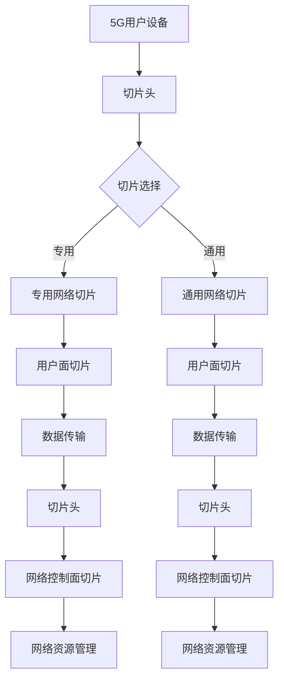
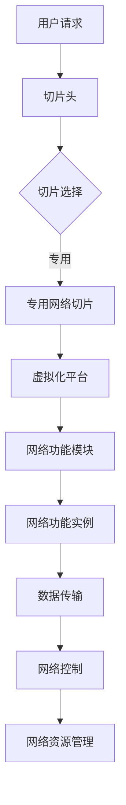
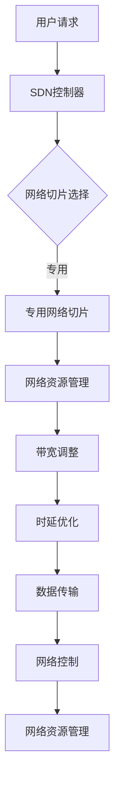

                 

### 《5G网络切片技术：工业应用的质量保证》

> **关键词**：5G网络切片，工业应用，质量保证，网络功能虚拟化（NFV），软件定义网络（SDN），边缘计算

**摘要**：
本文深入探讨了5G网络切片技术在工业应用中的关键作用和质量保证策略。通过概述5G网络切片的基础知识，我们详细分析了网络功能虚拟化（NFV）、软件定义网络（SDN）和边缘计算等关键技术，并在工业自动化、物联网（IIoT）和工业4.0等应用场景中，展示了5G网络切片的实际价值。文章还提出了确保5G网络切片在工业应用中质量的方法和策略，并展望了未来的发展趋势。最终，本文为5G网络切片技术在工业领域的深入应用提供了宝贵的参考。

## 目录

### 《5G网络切片技术：工业应用的质量保证》目录大纲

1. **第一部分：5G网络切片技术概述**

    - 第1章：5G网络切片技术基础
        - 1.1 5G网络切片的概念与重要性
        - 1.2 5G网络切片的架构
        - 1.3 5G网络切片的关键技术
    
    - 第2章：5G网络切片的架构设计
        - 2.1 网络功能虚拟化（NFV）
        - 2.2 软件定义网络（SDN）
    
    - 第3章：5G网络切片在工业应用中的质量保证
        - 3.1 工业应用对网络切片的要求
        - 3.2 5G网络切片在工业应用中的挑战
    
    - 第4章：5G网络切片在工业自动化中的应用
        - 4.1 工业自动化中的网络切片需求
        - 4.2 网络切片在工业自动化中的应用案例
    
    - 第5章：5G网络切片在工业物联网（IIoT）中的应用
        - 5.1 工业物联网中的网络切片需求
        - 5.2 网络切片在工业物联网中的应用案例
    
    - 第6章：5G网络切片在工业4.0中的质量保证
        - 6.1 工业4.0对网络切片的质量要求
        - 6.2 质量保证的方法与策略
    
    - 第7章：5G网络切片技术的未来发展趋势
        - 7.1 5G网络切片技术的新趋势
        - 7.2 5G网络切片在工业应用中的前景
    
    - 附录

        - 附录A：5G网络切片技术资源与工具
        - 附录B：5G网络切片技术术语表
        - 附录C：5G网络切片技术相关标准

---

## 第1章：5G网络切片技术基础

### 1.1 5G网络切片的概念与重要性

5G网络切片技术（Network Slicing）是5G网络的核心特性之一，旨在通过创建多个虚拟网络实例，满足不同业务的需求。网络切片的概念可以类比为“切蛋糕”，将一个完整的网络资源切成多个不同规格的“蛋糕”，每个“蛋糕”代表一个网络切片，服务于特定的应用场景。

**5G网络切片的定义**：

$$
\text{5G网络切片技术是5G网络架构中的一种功能，允许运营商在不同的网络资源上创建多个虚拟网络实例，每个实例针对特定的应用需求提供定制化的网络服务和性能。}
$$

**5G网络切片的重要性**：

1. **定制化服务**：网络切片能够根据不同的业务需求，提供不同的网络服务，如带宽、延迟、可靠性等，从而满足多样化的业务需求。
2. **资源优化**：通过网络切片，可以更高效地利用网络资源，避免资源浪费，提高网络资源利用率。
3. **提升用户体验**：网络切片能够确保关键业务得到优先保障，提供高质量的通信服务，从而提升用户体验。
4. **商业模式创新**：网络切片为运营商提供了新的商业模式，可以根据不同的业务需求提供差异化服务，从而增加收入来源。

### 1.2 5G网络切片的架构

5G网络切片架构包括用户面切片和网络控制面切片。用户面切片负责处理数据传输，而网络控制面切片负责管理网络资源和控制平面功能。

**5G网络切片架构概述**：

1. **用户面切片**：
    - **数据传输**：用户面切片负责数据的传输，包括数据包的路由和转发。
    - **切片选择**：用户设备在连接到网络时，会选择一个合适的网络切片，以获得所需的网络服务。

2. **网络控制面切片**：
    - **网络资源管理**：网络控制面切片负责管理网络资源，如带宽、时延等，确保网络资源的合理分配。
    - **控制平面功能**：控制平面切片负责网络的控制功能，如路由选择、策略决策等。

**网络切片的Mermaid流程图**：

### 1.3 5G网络切片的关键技术

5G网络切片的实现依赖于多项关键技术的支持，主要包括网络功能虚拟化（NFV）、软件定义网络（SDN）和边缘计算等。

**关键技术介绍**：

1. **网络功能虚拟化（NFV）**：
    - **基本原理**：NFV通过将网络功能从专用硬件设备迁移到通用虚拟化平台上，实现网络服务的灵活部署和管理。
    - **优势**：NFV的优势包括降低成本、提高灵活性和响应速度等。

2. **软件定义网络（SDN）**：
    - **工作原理**：SDN通过将网络控制和数据平面分离，实现网络资源的集中管理和自动化控制。
    - **应用场景**：SDN在5G网络切片中的应用，可以实现动态的资源分配和优化网络性能。

3. **边缘计算**：
    - **基本概念**：边缘计算是指在靠近数据源或用户的地方进行数据处理，以降低延迟和带宽需求。
    - **优势**：边缘计算可以提升5G网络切片的性能和效率，特别是在需要低延迟和高带宽的应用场景中。

通过上述关键技术的支持，5G网络切片能够实现高效、灵活和高质量的通信服务，为工业应用提供了强大的支撑。

### 第2章：5G网络切片的架构设计

在5G网络切片的实现中，架构设计是至关重要的环节。本章节将详细探讨5G网络切片架构设计中的核心部分：网络功能虚拟化（NFV）和软件定义网络（SDN）。这些技术的融合为5G网络切片提供了灵活、高效和可管理的解决方案。

#### 2.1 网络功能虚拟化（NFV）

网络功能虚拟化（NFV）是5G网络切片架构的核心技术之一。它通过将传统的网络功能从专用的硬件设备上迁移到虚拟化平台上，实现了网络服务的灵活部署和管理。NFV的基本原理是将网络功能模块化，并运行在标准化的服务器上，从而实现网络服务的动态调整和优化。

**NFV的基本原理**：

$$
\text{NFV通过虚拟化技术，将网络功能从硬件设备中解放出来，运行在通用虚拟化平台上，实现网络功能的灵活部署和管理。}
$$

**NFV的优势**：

1. **成本降低**：通过使用通用硬件设备，NFV可以显著降低网络基础设施的建设和运营成本。
2. **灵活性提高**：NFV使得网络功能的部署和调整更加灵活，可以根据业务需求快速实现网络服务的变更。
3. **响应速度提升**：由于网络功能模块化，NFV能够快速响应业务需求变化，提供即时的网络服务。

**NFV在5G网络切片中的应用**：

在5G网络切片中，NFV被广泛应用于网络功能的重构和优化。通过NFV，运营商可以创建多个虚拟网络功能实例，为不同的网络切片提供定制化的网络服务。例如，对于需要高带宽和低延迟的工业应用，可以创建一个专用的网络切片，并使用NFV技术来实现高效的数据传输和控制功能。

**NFV的Mermaid流程图**：

#### 2.2 软件定义网络（SDN）

软件定义网络（SDN）是另一个关键的技术，它通过将网络控制和数据平面分离，实现了网络资源的集中管理和自动化控制。SDN的基本原理是将网络控制功能从传统的网络设备中提取出来，运行在中央控制器上，从而实现网络资源的统一管理和动态调整。

**SDN的工作原理**：

$$
\text{SDN通过将网络控制功能集中在一个中央控制器上，实现网络资源的统一管理和自动化控制。控制器通过南向接口与网络设备通信，北向接口与业务应用交互。}
$$

**SDN的应用场景**：

在5G网络切片中，SDN被广泛应用于网络资源的动态分配和优化。通过SDN，运营商可以实时监测网络状态，并根据业务需求动态调整网络资源，从而提供高质量的通信服务。例如，在工业自动化中，SDN可以实时调整网络切片的带宽和时延，确保关键任务得到及时处理。

**SDN在5G网络切片中的应用**：

在5G网络切片中，SDN主要用于实现网络切片的动态管理和优化。通过SDN，运营商可以创建和管理多个网络切片，并为每个切片提供定制化的网络服务。例如，对于需要高带宽和低延迟的工业应用，可以创建一个专用的网络切片，并使用SDN技术来实现高效的资源分配和性能优化。

**SDN的Mermaid流程图**：

通过网络功能虚拟化（NFV）和软件定义网络（SDN）的融合，5G网络切片实现了灵活、高效和可管理的网络架构。这些技术不仅为工业应用提供了强大的支持，也为未来的网络创新和发展奠定了基础。

### 第3章：5G网络切片在工业应用中的质量保证

#### 3.1 工业应用对网络切片的要求

在工业领域，网络切片技术的应用对网络性能提出了更高的要求。工业应用通常涉及大量的实时数据传输、远程监控和自动化控制，因此，对网络切片的质量要求尤为严格。以下是工业应用对网络切片的主要质量要求：

1. **低延迟**：工业自动化过程通常要求实时响应，网络延迟必须非常低，以确保操作指令能够及时传达并得到执行。对于某些关键任务，如机器人控制和工业自动化流水线，低延迟是确保操作连续性和安全性的关键因素。

2. **高可靠性**：工业应用对网络的可靠性要求极高。网络中断或数据丢失可能导致生产停止或设备故障，从而造成巨大的经济损失。因此，网络切片必须具备高可靠性，能够保证数据传输的稳定性和完整性。

3. **高带宽**：工业应用往往需要传输大量的数据，包括传感器数据、图像数据和控制指令等。因此，网络切片需要提供足够的带宽，以满足大规模数据传输的需求。

4. **高安全性**：工业控制系统通常是企业的重要资产，因此对数据的安全传输有严格要求。网络切片必须具备强大的安全防护机制，以防止数据泄露、篡改和攻击。

5. **可定制性**：不同的工业应用对网络性能的要求各不相同。网络切片技术需要提供高度可定制的服务，以适应不同应用场景的需求。

#### 3.2 5G网络切片在工业应用中的挑战

尽管5G网络切片技术在工业应用中具有巨大的潜力，但在实际部署和应用过程中，仍面临一系列挑战，主要包括以下几个方面：

1. **网络切片的可靠性和安全性保障**：
    - **可靠性挑战**：工业网络环境复杂，存在多种干扰源和故障点。保证网络切片的可靠传输是一个重大挑战。此外，网络切片的可靠性和稳定性需要长期监控和维护。
    - **安全挑战**：工业控制系统对安全性的要求极高，网络切片必须能够抵御各种网络攻击，如DDoS攻击、数据篡改和恶意软件感染等。

2. **资源管理和优化**：
    - **资源分配**：工业应用对网络资源的需求多样且动态变化，如何高效地分配和管理网络资源，以满足不同切片的需求，是一个复杂的问题。
    - **性能优化**：网络切片的优化需要考虑多种因素，如带宽、时延和能耗等。如何在有限的资源下实现最优的性能，是一个需要深入研究的课题。

3. **边缘计算和云计算的协同**：
    - **边缘计算挑战**：边缘计算能够降低数据传输的延迟，提高处理效率，但在工业应用中，如何平衡边缘计算和云计算之间的关系，实现高效的协同，是一个挑战。
    - **协同优化**：工业应用通常涉及大量的数据采集和处理，如何在边缘计算和云计算之间实现高效的数据流管理和优化，是亟待解决的问题。

4. **标准化和互操作性**：
    - **标准化**：目前，5G网络切片技术的标准化工作仍在进行中，不同设备和平台之间的互操作性尚未完全实现。这给工业应用中的网络切片部署带来了挑战。
    - **互操作性**：工业应用中涉及多种设备和系统，如何确保这些设备和系统能够无缝协作，实现互操作性，是一个关键问题。

通过深入分析上述挑战，我们可以更好地理解5G网络切片在工业应用中面临的复杂性，并为解决这些问题提供思路和策略。

### 第4章：5G网络切片在工业自动化中的应用

#### 4.1 工业自动化中的网络切片需求

工业自动化是工业4.0的重要基石，它通过引入自动化设备和控制系统，实现生产过程的自动化和智能化。在工业自动化中，网络切片技术能够发挥重要作用，满足不同应用场景的特定需求。以下是工业自动化中对网络切片的主要需求：

1. **实时数据传输**：工业自动化系统需要实时采集和处理大量的数据，如传感器数据、控制指令和设备状态等。网络切片能够提供低延迟、高带宽的网络连接，确保数据传输的实时性和准确性。

2. **可靠性保障**：工业自动化系统对网络的可靠性要求极高。网络中断或数据丢失可能导致生产中断或设备故障，因此，网络切片必须具备高可靠性和容错能力。

3. **灵活性**：不同的工业自动化应用场景对网络性能的要求各不相同。网络切片技术提供了高度可定制的网络服务，可以根据具体应用需求进行灵活调整。

4. **安全性**：工业自动化系统涉及敏感数据和关键控制指令，因此，网络切片需要提供强大的安全防护机制，以防止数据泄露和网络攻击。

5. **边缘计算支持**：工业自动化系统往往需要在现场进行实时数据处理和决策，因此，网络切片需要与边缘计算技术相结合，提供高效的边缘计算能力。

#### 4.2 网络切片在工业自动化中的应用案例

以下是一些具体的网络切片在工业自动化中的应用案例，展示了5G网络切片技术如何满足工业自动化对网络性能的高要求：

1. **智能制造**：

    在智能制造领域，网络切片技术被广泛应用于生产线的自动化控制和质量检测。通过创建专用的网络切片，可以确保生产线的实时数据传输和精确控制。例如，在一个智能制造工厂中，可以创建一个低延迟、高带宽的专用网络切片，用于生产线的实时监控和设备控制。此外，还可以创建一个高可靠性、安全性的网络切片，用于关键数据的传输和存储。

    **案例描述**：
    - **低延迟切片**：用于生产线的实时监控和设备控制，确保生产过程的连续性和高效性。
    - **高带宽切片**：用于高质量图像传输和质量检测，提高生产过程的准确性和效率。
    - **高可靠性切片**：用于关键数据的备份和存储，确保数据的安全性和可靠性。

2. **远程监控与维护**：

    通过网络切片技术，可以实现远程监控和设备维护，降低维护成本和风险。在工业自动化系统中，许多设备分布在不同的地理位置，通过网络切片技术，可以创建一个专用的远程监控切片，实现对设备的实时监控和远程维护。

    **案例描述**：
    - **远程监控切片**：用于实时监控设备状态和数据传输，及时发现设备故障和维护需求。
    - **远程维护切片**：用于远程诊断和设备维修，提供高效、安全的远程维护服务。

3. **设备联网与协同作业**：

    在工业自动化中，各种设备需要协同工作，实现高效的生产过程。通过网络切片技术，可以为不同类型的设备创建专用的网络切片，确保设备之间的可靠通信和数据交换。

    **案例描述**：
    - **设备通信切片**：用于不同设备之间的数据交换和控制指令传输，确保协同作业的高效性和准确性。
    - **协同控制切片**：用于集中控制和管理，实现设备的统一调度和协同工作。

通过上述案例可以看出，5G网络切片技术在工业自动化中具有广泛的应用前景，能够满足不同应用场景对网络性能的高要求，推动工业自动化向更加智能化和高效化的方向发展。

### 第5章：5G网络切片在工业物联网（IIoT）中的应用

#### 5.1 工业物联网（IIoT）中的网络切片需求

工业物联网（IIoT）是工业4.0的重要组成部分，通过将各种设备、系统和平台连接起来，实现智能化的生产和管理。在IIoT中，网络切片技术能够发挥关键作用，满足大规模设备连接、低延迟和高可靠性的需求。以下是工业物联网中对网络切片的主要需求：

1. **大规模设备连接**：工业物联网中涉及的设备数量庞大，包括传感器、执行器、机器和控制系统等。网络切片技术能够为不同类型的设备提供定制化的网络连接，确保每个设备都能获得所需的网络资源和服务质量。

2. **低延迟**：工业物联网应用通常需要对实时数据进行分析和响应，如机器状态监测、故障预警和生产调度等。低延迟的网络切片能够保证数据的实时传输和处理，满足实时性要求。

3. **高可靠性**：工业物联网系统需要具备高可靠性，以防止设备故障或网络中断导致生产中断。网络切片技术提供了冗余和容错机制，确保数据传输的稳定性和系统的连续运行。

4. **高带宽**：工业物联网应用涉及大量的数据传输，包括传感器数据、图像数据和视频流等。高带宽的网络切片能够满足这些应用场景的大数据传输需求。

5. **安全性与隐私保护**：工业物联网中的数据安全和隐私保护至关重要。网络切片技术能够提供隔离和加密机制，确保数据传输的安全性和隐私性。

#### 5.2 网络切片在工业物联网中的应用案例

以下是一些具体的网络切片在工业物联网中的应用案例，展示了5G网络切片技术如何满足工业物联网对网络性能的高要求：

1. **智能工厂**：

    在智能工厂中，网络切片技术被广泛应用于设备互联和生产管理。通过创建专用的网络切片，可以实现设备之间的实时通信和生产过程的智能化管理。

    **案例描述**：
    - **设备通信切片**：用于不同设备之间的数据交换和控制指令传输，确保协同作业的高效性和准确性。
    - **生产管理切片**：用于实时监测生产状态和调度生产任务，提高生产效率和灵活性。
    - **质量控制切片**：用于实时监控产品质量和检测数据传输，确保产品质量的稳定性和一致性。

2. **智能电网**：

    在智能电网中，网络切片技术被广泛应用于电力设备的监测、控制和优化。通过创建专用的网络切片，可以实现对电力系统的实时监控和管理，提高电力传输的效率和可靠性。

    **案例描述**：
    - **监测切片**：用于实时监测电力设备的状态和数据传输，及时发现故障和异常。
    - **控制切片**：用于远程控制和优化电力系统的运行，确保电力供应的稳定性和安全性。
    - **优化切片**：用于数据分析和预测，优化电力资源的分配和调度，提高电力传输的效率。

3. **智能交通系统**：

    在智能交通系统中，网络切片技术被广泛应用于车辆管理、交通监控和智能导航。通过创建专用的网络切片，可以实现对交通系统的实时监控和智能管理，提高交通效率和安全性。

    **案例描述**：
    - **车辆管理切片**：用于实时监控车辆状态和数据传输，确保车辆安全行驶。
    - **交通监控切片**：用于实时监测交通流量和路况，提供智能导航和交通调度。
    - **安全切片**：用于数据加密和安全传输，防止网络攻击和数据泄露。

通过上述案例可以看出，5G网络切片技术在工业物联网中具有广泛的应用前景，能够满足不同应用场景对网络性能的高要求，推动工业物联网向更加智能化和高效化的方向发展。

### 第6章：5G网络切片在工业4.0中的质量保证

#### 6.1 工业4.0对网络切片的质量要求

工业4.0，即第四次工业革命，是一场基于信息化、智能化和网络化的产业变革。在工业4.0的背景下，网络切片技术成为实现智能制造和智能生产的关键支撑。工业4.0对网络切片的质量要求尤为苛刻，主要体现在以下几个方面：

1. **高带宽**：工业4.0中的智能制造和智能生产需要传输大量的数据，包括传感器数据、机器控制指令和监控视频等。高带宽的网络切片能够确保这些大数据量的实时传输和处理。

2. **低延迟**：工业4.0的实时性要求极高，如机器人的精确动作控制、自动化流水线的实时监控等。低延迟的网络切片能够保证实时数据的快速传输和处理，确保生产过程的连续性和准确性。

3. **高可靠性**：工业4.0系统对网络的可靠性要求极高。网络中断或数据丢失可能导致生产停止或设备故障，从而造成巨大的经济损失。因此，网络切片必须具备高可靠性和容错能力。

4. **安全性**：工业4.0系统中的数据安全和隐私保护至关重要。网络切片需要提供强大的安全防护机制，以防止数据泄露、篡改和网络攻击。

5. **可定制性**：不同的工业4.0应用场景对网络性能的要求各不相同。网络切片技术需要提供高度可定制的服务，以适应不同应用场景的需求。

#### 6.2 质量保证的方法与策略

为了确保5G网络切片在工业4.0中的应用质量，需要采取一系列的方法与策略，包括网络性能监测、故障诊断和优化算法等。以下是一些具体的方法与策略：

1. **网络性能监测**：
    - **实时监测**：通过部署网络性能监测系统，实时监测网络状态，包括带宽、时延、丢包率和链路质量等。实时监测能够及时发现网络异常，并采取相应措施。
    - **数据可视化**：将网络性能数据进行可视化展示，帮助管理人员直观了解网络状态和性能指标，从而做出快速决策。

2. **故障诊断**：
    - **故障检测**：利用智能算法和数据分析技术，自动检测网络故障和异常。例如，通过机器学习算法分析网络流量数据，识别异常流量模式，从而发现潜在故障。
    - **故障定位**：一旦检测到故障，系统需要快速定位故障的具体位置和原因。通过故障诊断工具，可以追踪数据传输路径，识别故障节点。

3. **优化算法**：
    - **资源分配**：采用智能算法，动态分配网络资源，确保每个网络切片获得所需的带宽、时延和可靠性等。例如，基于资源利用率、流量负载和业务优先级等因素，实现资源的智能调度。
    - **网络优化**：通过优化算法，持续调整网络配置和参数，提高网络性能和效率。例如，使用基于时延优化的路由算法，减少数据传输的延迟。

4. **安全防护**：
    - **数据加密**：对网络传输的数据进行加密处理，确保数据在传输过程中的安全性。
    - **访问控制**：通过访问控制机制，限制只有授权用户和设备可以访问网络资源，防止未授权访问和数据泄露。
    - **入侵检测**：部署入侵检测系统（IDS），实时监测网络流量，识别和阻止潜在的网络攻击。

通过上述方法与策略，可以确保5G网络切片在工业4.0中的应用质量，满足高带宽、低延迟、高可靠性和安全性的要求，为工业4.0的智能化和高效化提供坚实的网络保障。

### 第7章：5G网络切片技术的未来发展趋势

#### 7.1 5G网络切片技术的新趋势

随着5G技术的不断成熟和普及，网络切片技术也迎来了新的发展趋势。这些趋势不仅推动了5G网络切片技术的不断创新，也为未来的工业应用提供了更多可能性。

1. **网络切片的自动化管理**：
    - **自动切片创建和部署**：未来的网络切片技术将实现自动化的切片创建和部署，通过自动化工具和算法，快速生成和配置网络切片，满足不同业务需求。
    - **自动性能优化**：利用人工智能和机器学习技术，实现对网络切片的自动性能优化，根据实时网络状态和业务需求，动态调整网络资源和性能参数。

2. **网络切片的跨域协同**：
    - **跨域网络切片**：未来的网络切片技术将支持跨域的网络切片，实现不同运营商和不同区域之间的网络资源协同和共享，提供更广泛和更灵活的网络服务。
    - **多网络切片协作**：通过跨域的网络切片，可以实现不同业务和网络切片之间的协作，优化资源利用和性能表现，满足更加复杂和多样化的业务需求。

3. **虚拟化技术的进一步发展**：
    - **虚拟化程度的提升**：未来的虚拟化技术将进一步发展，实现更高程度的网络功能虚拟化，将更多的网络功能模块化和虚拟化，提高网络服务的灵活性和可管理性。
    - **虚拟化平台的优化**：虚拟化平台将不断优化，提高资源利用率和性能表现，同时降低运营成本，为网络切片技术提供更强大的支持。

#### 7.2 5G网络切片在工业应用中的前景

5G网络切片技术在工业应用中具有广阔的前景，它将为工业4.0、智能制造、智能交通和智能电网等领域的数字化转型提供强大动力。以下是5G网络切片在工业应用中的前景展望：

1. **智能制造的深化应用**：
    - **实时数据驱动**：通过5G网络切片技术，可以实现智能制造中的实时数据驱动，实现生产过程的智能化和自动化，提高生产效率和产品质量。
    - **协同制造**：网络切片技术将实现不同制造设备和系统之间的协同作业，实现更高效、灵活和智能的生产流程。

2. **智能交通的系统优化**：
    - **实时监控与调度**：通过网络切片技术，可以实现智能交通系统中的实时监控与调度，优化交通流量和交通管理，提高交通效率和安全性。
    - **自动驾驶**：5G网络切片技术将为自动驾驶技术提供低延迟、高可靠性的网络连接，推动智能交通的进一步发展。

3. **智能电网的稳定运行**：
    - **实时监测与控制**：通过网络切片技术，可以实现智能电网中的实时监测与控制，提高电力系统的运行效率和稳定性。
    - **能源管理**：网络切片技术将为智能电网的能源管理提供支持，实现能源的高效利用和优化调度。

4. **工业物联网的广泛覆盖**：
    - **大规模设备连接**：5G网络切片技术将为工业物联网中的大规模设备连接提供支持，实现设备之间的高效通信和数据交换。
    - **智能决策与优化**：通过网络切片技术，可以实现工业物联网中的智能决策与优化，提高生产和管理效率。

总之，5G网络切片技术在工业应用中的前景非常广阔，它将推动工业互联网的进一步发展和工业生产的智能化升级，为工业4.0的实现提供坚实的网络基础。

### 附录

#### 附录A：5G网络切片技术资源与工具

为了更好地理解和使用5G网络切片技术，以下是一些常用的资源与工具，包括开源框架、仿真平台和测试工具等。

1. **开源框架**：
    - **ONAP（Open Network Automation Platform）**：ONAP是一个开源的网络功能虚拟化和网络切片管理框架，提供了丰富的网络服务和自动化功能。
    - **Open vSwitch**：Open vSwitch是一个开源的虚拟交换机，支持虚拟机之间的高效通信和网络切片功能。
    - **OpenDaylight**：OpenDaylight是一个开源的SDN控制器，提供了SDN网络管理和控制功能，适用于5G网络切片架构。

2. **仿真平台**：
    - **NS3（Network Simulator 3）**：NS3是一个开源的网络仿真平台，可以模拟5G网络切片的运行环境和行为，帮助开发者进行网络切片的测试和优化。
    - **OPNET**：OPNET是一个商业网络仿真平台，提供了详细的网络切片仿真功能，适用于复杂网络场景的仿真和测试。

3. **测试工具**：
    - **Ixia**：Ixia提供了一系列的网络测试工具，包括网络性能测试仪和网络切片测试平台，可以用于5G网络切片的性能测试和验证。
    - **Netronome**：Netronome提供了高性能的网络处理器和测试工具，可以用于网络切片的功能测试和性能优化。

通过使用这些资源与工具，开发者可以更深入地理解5G网络切片技术，进行有效的开发、测试和优化。

#### 附录B：5G网络切片技术术语表

为了帮助读者更好地理解5G网络切片技术相关的专业术语，以下列出了一些关键术语及其解释：

1. **网络切片**：网络切片是5G网络的一个核心特性，允许运营商在同一个物理网络基础设施上创建多个虚拟网络实例，每个实例提供特定的网络服务和性能。
2. **NFV**：网络功能虚拟化（Network Functions Virtualization），通过虚拟化技术将网络功能从专用硬件设备迁移到通用虚拟化平台上，实现网络服务的灵活部署和管理。
3. **SDN**：软件定义网络（Software Defined Networking），通过将网络控制和数据平面分离，实现网络资源的集中管理和自动化控制。
4. **边缘计算**：边缘计算是在靠近数据源或用户的地方进行数据处理，以降低延迟和带宽需求，提升数据处理效率和用户体验。
5. **切片头**：切片头是网络切片管理功能的一部分，负责网络切片的创建、配置和管理。
6. **用户面切片**：用户面切片负责处理用户数据传输，包括数据包的路由和转发。
7. **控制面切片**：控制面切片负责管理网络资源和控制平面功能，如路由选择、策略决策等。
8. **QoS**：服务质量（Quality of Service），用于定义网络传输的质量指标，包括带宽、时延、丢包率和可靠性等。
9. **SLA**：服务级别协议（Service Level Agreement），用于定义网络服务提供商和用户之间的服务质量标准和责任。
10. **MEC**：移动边缘计算（Mobile Edge Computing），是一种将计算和存储资源部署在靠近移动网络用户的地方，以提升用户体验和响应速度。

#### 附录C：5G网络切片技术相关标准

5G网络切片技术的标准化工作对于推动技术的成熟和普及具有重要意义。以下介绍一些与5G网络切片技术相关的国际和国家标准：

1. **3GPP**：3GPP（第三代合作伙伴计划）是负责制定移动通信标准的国际组织，其R15和R16版本规范中包含了5G网络切片的核心技术要求和架构设计。

2. **ETSI**：ETSI（欧洲电信标准协会）发布了多个与5G网络切片相关的标准，如NFV、SDN和边缘计算等，为5G网络切片的实现提供了详细的规范和指南。

3. **IEEE**：IEEE（电气和电子工程师协会）在5G网络切片的协议和通信标准方面也做出了贡献，如IEEE 802.1Q和IEEE 802.3bt等。

4. **中国IMT-2020（5G）推进组**：中国IMT-2020（5G）推进组是中国推动5G技术发展的主要机构，发布了多个与5G网络切片相关的测试规范和评估标准。

5. **ITU-R**：国际电信联盟的无线电通信部门（ITU-R）也参与了5G网络切片的国际标准化工作，发布了关于5G网络性能指标和测试方法的建议书。

这些标准和规范为5G网络切片技术的研发、测试和部署提供了重要的指导和支持，有助于确保网络切片技术的成熟和应用推广。

