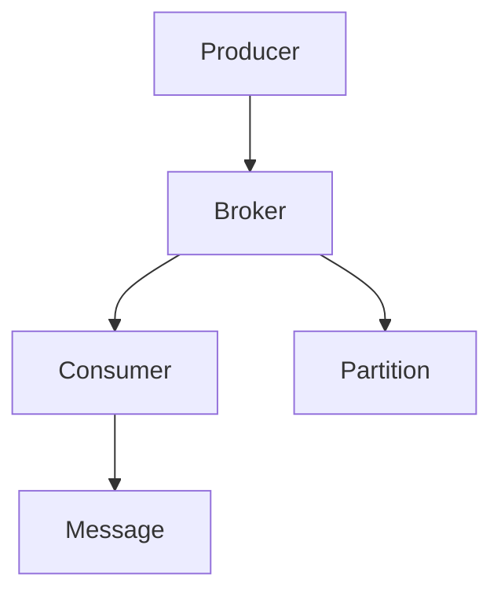
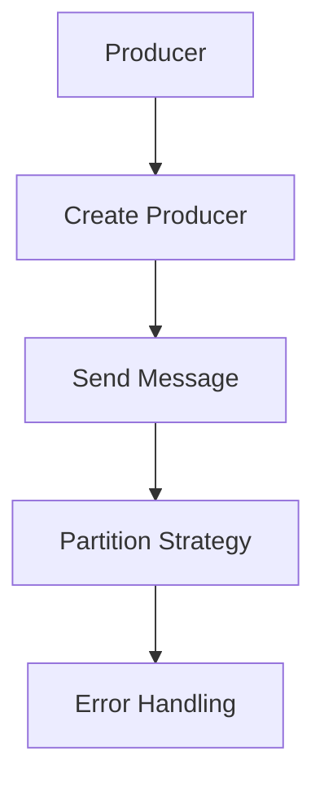

                 

### 《Kafka Producer原理与代码实例讲解》

> **关键词：** Kafka, Producer, 消息队列, 分布式系统, 性能优化

> **摘要：** 本文将深入探讨Kafka Producer的工作原理，包括其架构、消息发送流程、消息确认机制和性能优化策略。我们将通过实际代码实例展示如何使用Kafka Producer进行消息发送，并提供详细的代码解析，帮助读者理解Kafka Producer的核心概念和实践应用。

### 目录大纲

```markdown
## 《Kafka Producer原理与代码实例讲解》目录大纲

## 第一部分：Kafka概述

### 第1章：Kafka简介

#### 1.1 Kafka的基本概念

##### 1.1.1 Kafka的起源与发展历程

##### 1.1.2 Kafka的核心特点与优势

##### 1.1.3 Kafka的架构原理

#### 1.2 Kafka的应用场景

##### 1.2.1 数据处理与流处理

##### 1.2.2 实时计算与实时数据采集

##### 1.2.3 消息队列与异步通信

### 第2章：Kafka基础架构与组件

#### 2.1 Kafka集群架构

##### 2.1.1 Kafka集群的角色

##### 2.1.2 Kafka集群的部署与维护

#### 2.2 Kafka的核心组件

##### 2.2.1 Producer

##### 2.2.2 Broker

##### 2.2.3 Consumer

##### 2.2.4 Kafka主题与分区

## 第二部分：Kafka Producer深度解析

### 第3章：Kafka Producer架构与API

#### 3.1 Kafka Producer架构

##### 3.1.1 Producer的角色与功能

##### 3.1.2 Producer的消息发送流程

##### 3.1.3 Producer的分区策略

#### 3.2 Kafka Producer API详解

##### 3.2.1 创建Producer实例

##### 3.2.2 发送消息

##### 3.2.3 同步与异步发送

##### 3.2.4 错误处理与重试策略

### 第4章：Kafka消息与序列化机制

#### 4.1 Kafka消息格式

##### 4.1.1 消息结构

##### 4.1.2 消息类型

##### 4.1.3 消息存储与检索

#### 4.2 序列化机制

##### 4.2.1 序列化的作用与意义

##### 4.2.2 Kafka支持的序列化框架

##### 4.2.3 自定义序列化实现

### 第5章：Kafka Producer高级特性

#### 5.1 消息压缩

##### 5.1.1 消息压缩的意义与作用

##### 5.1.2 Kafka支持的压缩算法

##### 5.1.3 消息压缩的优化策略

#### 5.2 消息确认机制

##### 5.2.1 消息确认机制的作用

##### 5.2.2 消息确认机制的类型

##### 5.2.3 消息确认机制的实现与优化

### 第6章：Kafka Producer性能优化

#### 6.1 Producer性能监控

##### 6.1.1 Producer性能指标

##### 6.1.2 性能监控工具

##### 6.1.3 性能瓶颈分析与优化

#### 6.2 消息批量发送

##### 6.2.1 批量发送的优势

##### 6.2.2 批量发送的实现与优化

#### 6.3 Kafka网络优化

##### 6.3.1 Kafka网络模型

##### 6.3.2 网络优化策略

##### 6.3.3 网络故障处理与恢复

## 第三部分：Kafka Producer项目实战

### 第7章：Kafka Producer应用案例

#### 7.1 案例一：实时数据采集与处理

##### 7.1.1 案例背景

##### 7.1.2 项目架构设计

##### 7.1.3 代码实现与解析

#### 7.2 案例二：消息队列与异步通信

##### 7.2.1 案例背景

##### 7.2.2 项目架构设计

##### 7.2.3 代码实现与解析

### 第8章：Kafka Producer开发与调试技巧

#### 8.1 Kafka Producer开发环境搭建

##### 8.1.1 Kafka环境搭建

##### 8.1.2 Producer开发环境搭建

#### 8.2 Kafka Producer调试方法

##### 8.2.1 日志分析与调试

##### 8.2.2 性能调试与优化

##### 8.2.3 错误处理与问题排查

### 附录

## 附录A：Kafka资源与工具

##### A.1 Kafka官方文档与资源

##### A.2 Kafka相关工具介绍
```

现在我们已经完成了目录大纲的撰写，接下来我们将逐步深入到Kafka的各个细节部分进行讲解。

### 第1章 Kafka简介

Kafka是一种分布式流处理平台，用于构建实时数据流处理应用程序。其设计初衷是为了解决大数据场景下的数据收集、传输和处理需求。本章节将介绍Kafka的基本概念、核心特点与优势，以及其架构原理和应用场景。

#### 1.1 Kafka的基本概念

Kafka是由LinkedIn公司开发的一款分布式流处理平台，后来被Apache软件基金会接纳，成为其顶级项目。Kafka的主要功能是作为消息队列系统，提供高吞吐量、高可靠性和可扩展性的消息传输服务。Kafka的基本概念包括Producer、Broker和Consumer。

- **Producer**：生产者，负责将数据发送到Kafka集群。
- **Broker**：代理，负责存储和管理消息。
- **Consumer**：消费者，负责从Kafka集群中读取消息。

Kafka集群由多个Broker组成，每个Broker负责存储和管理一定数量的分区（Partition）。分区是Kafka消息存储的基本单位，可以水平扩展来提升系统的处理能力。

#### 1.1.1 Kafka的起源与发展历程

Kafka起源于LinkedIn公司，由Jay Kreps、Niraj Shaikh和 Neha Narkhede于2008年开发。Kafka作为LinkedIn公司内部的数据流处理平台，解决了大规模日志收集和处理的需求。2010年，Kafka开源，随后被多个知名公司采用，如LinkedIn、Twitter、Netflix等。2012年，Kafka加入Apache软件基金会，成为Apache Kafka。

#### 1.1.2 Kafka的核心特点与优势

Kafka具有以下核心特点与优势：

- **高吞吐量**：Kafka能够处理数百万个消息/秒，适用于大数据场景。
- **高可靠性**：通过副本机制和消息持久化，确保数据不会丢失。
- **可扩展性**：支持水平扩展，能够随着数据量的增加而扩展。
- **实时性**：支持实时数据流处理，适用于实时应用。
- **灵活性**：支持多种数据格式，如JSON、Protobuf等，易于集成。
- **易于使用**：提供了丰富的API和工具，易于部署和管理。

#### 1.1.3 Kafka的架构原理

Kafka的架构主要包括三个核心组件：Producer、Broker和Consumer。以下是Kafka的架构原理：


- **Producer**：生产者将消息发送到Kafka集群，通过分区策略将消息发送到特定的分区。生产者负责将数据转换成Kafka消息格式，并确保消息的可靠发送。
- **Broker**：代理，负责存储和管理消息。每个Broker都包含多个分区，当多个Producer发送消息时，它们会被分配到不同的Broker上。Broker负责存储消息并确保消息的持久化。
- **Consumer**：消费者从Kafka集群中读取消息，可以是一个或多个Consumer组成的消费者组。消费者组中的消费者可以并行读取消息，实现负载均衡。

#### 1.2 Kafka的应用场景

Kafka的应用场景非常广泛，主要包括以下几个方面：

- **数据处理与流处理**：Kafka可以处理大规模的实时数据流，适用于实时数据处理和流处理应用。
- **实时计算与实时数据采集**：Kafka可以实时采集各种数据源的数据，并进行实时计算和分析。
- **消息队列与异步通信**：Kafka作为消息队列系统，可以实现分布式系统之间的异步通信，提高系统的可扩展性和可维护性。

#### 1.2.1 数据处理与流处理

Kafka在数据处理和流处理领域有着广泛的应用。例如，在电商系统中，Kafka可以实时采集用户行为数据，如点击、购买等，然后通过流处理实时分析用户行为，提供个性化的推荐服务。

#### 1.2.2 实时计算与实时数据采集

Kafka可以实时采集各种数据源的数据，如日志、传感器数据、社交网络数据等，然后通过实时计算对数据进行处理和分析。例如，在物联网（IoT）领域，Kafka可以实时采集传感器数据，然后进行实时分析和预测。

#### 1.2.3 消息队列与异步通信

Kafka作为消息队列系统，可以用来实现分布式系统之间的异步通信。通过Kafka，不同系统可以独立开发、部署和扩展，通过消息队列实现数据传输和业务解耦。

### 小结

Kafka是一种强大的分布式流处理平台，具有高吞吐量、高可靠性、可扩展性和实时性等特点。通过了解Kafka的基本概念、架构原理和应用场景，我们可以更好地理解Kafka在分布式数据处理和流处理中的应用价值。

在下一章中，我们将深入探讨Kafka的基础架构与组件，包括Kafka集群架构、核心组件及其功能，以及主题与分区的概念。

---

**Mermaid 流程图**



**核心概念与联系**

Kafka的三个核心组件：Producer、Broker和Consumer共同协作，完成消息的生产、存储和消费。Producer将消息发送到Broker，Broker负责存储和管理消息，包括分区（Partition），最后Consumer从Broker中读取消息。分区是Kafka消息存储的基本单位，可以提高系统的并发处理能力和数据可靠性。

---

（续写内容将遵循文章大纲结构，逐步深入讲解每个章节。）

### 第2章 Kafka基础架构与组件

在上一章中，我们介绍了Kafka的基本概念和应用场景。在本章中，我们将深入探讨Kafka的基础架构与组件，包括Kafka集群架构、核心组件及其功能，以及主题与分区的概念。

#### 2.1 Kafka集群架构

Kafka集群是Kafka系统的核心组成部分，它由多个Broker组成，每个Broker都是一个独立的Kafka服务器。Kafka集群的架构设计考虑了高可用性、高可靠性和可扩展性。

##### 2.1.1 Kafka集群的角色

在Kafka集群中，主要有以下角色：

- **Producer**：生产者，负责将数据发送到Kafka集群。
- **Broker**：代理，负责存储和管理消息。
- **Consumer**：消费者，负责从Kafka集群中读取消息。

**Producer** 的主要功能是将消息发送到 Kafka 集群，而 **Broker** 负责存储和管理这些消息，包括分区和副本的管理。**Consumer** 负责从 Kafka 集群中读取消息，并处理这些消息。

##### 2.1.2 Kafka集群的部署与维护

部署Kafka集群时，需要考虑以下几个方面：

- **节点选择**：选择合适的物理或虚拟机作为Kafka节点。
- **配置优化**：配置Kafka的日志、内存、网络等参数。
- **集群监控**：使用如Kafka Manager等工具监控集群状态。
- **故障转移**：配置Kafka的高可用性，实现故障转移。

Kafka集群的维护主要包括监控集群状态、定期备份、性能调优等。通过监控工具，可以及时发现集群中的问题，并进行相应的维护。

#### 2.2 Kafka的核心组件

Kafka的核心组件包括Producer、Broker和Consumer，每个组件在Kafka系统中扮演着重要的角色。

##### 2.2.1 Producer

**Producer** 是Kafka系统中的消息生产者，它负责将数据转换为Kafka消息格式，并将消息发送到Kafka集群。Producer的主要功能包括：

- **消息格式化**：将数据转换为Kafka消息格式。
- **消息发送**：将消息发送到Kafka集群。
- **分区策略**：根据消息内容和配置策略，确定消息发送到哪个分区。

Kafka提供了多种分区策略，如随机分区、轮询分区、哈希分区等。分区策略决定了消息如何在Kafka集群中分布，从而影响系统的性能和可用性。

##### 2.2.2 Broker

**Broker** 是Kafka集群中的代理服务器，负责存储和管理消息。每个Broker都包含多个分区，当多个Producer发送消息时，它们会被分配到不同的Broker上。Broker的主要功能包括：

- **消息存储**：存储消息并确保消息的持久化。
- **分区管理**：管理分区和副本，包括分区分配、副本同步等。
- **负载均衡**：在多个Broker之间分配消息，实现负载均衡。

Kafka通过副本机制提高了消息的可靠性和可用性。每个分区都有多个副本，主副本负责处理消息，副本负责备份和同步消息。

##### 2.2.3 Consumer

**Consumer** 是Kafka系统中的消息消费者，负责从Kafka集群中读取消息并处理这些消息。Consumer的主要功能包括：

- **消息读取**：从Kafka集群中读取消息。
- **分组与负载均衡**：Consumer可以组成一个或多个消费者组，每个组中的Consumer可以并行读取消息，实现负载均衡。
- **消息处理**：处理从Kafka读取的消息，进行相应的业务逻辑处理。

Consumer可以根据不同的需求，进行消息的顺序消费、批量消费等。

##### 2.2.4 Kafka主题与分区

**主题（Topic）** 是Kafka消息分类的标签，类似于数据库中的表。每个主题可以包含多个分区。**分区（Partition）** 是Kafka消息存储的基本单位，可以提高系统的并发处理能力和数据可靠性。

每个分区都有唯一的分区号，数据在分区中是有序的。分区可以通过分区策略进行分配，从而实现负载均衡和高可用性。

#### 2.2.5 分区策略与优化

分区策略决定了消息如何在Kafka集群中分布，影响系统的性能和可用性。以下是几种常见的分区策略：

- **随机分区**：将消息随机发送到分区。
- **轮询分区**：按顺序将消息发送到分区。
- **哈希分区**：根据消息的Key进行哈希计算，将消息发送到对应的分区。

选择合适的分区策略，可以提高系统的性能和可用性。在实际应用中，可以根据业务需求和数据特点，选择合适的分区策略。

#### 小结

Kafka的基础架构与组件包括Kafka集群架构、Producer、Broker和Consumer，每个组件在Kafka系统中扮演着重要的角色。Kafka集群架构设计考虑了高可用性、高可靠性和可扩展性，通过分区和副本机制，实现了消息的可靠传输和处理。了解Kafka的基础架构和组件，有助于更好地理解和应用Kafka。

在下一章中，我们将深入探讨Kafka Producer的架构与API，包括如何创建Producer实例、消息发送流程、分区策略以及错误处理与重试策略。

---

**Mermaid 流程图**



**核心概念与联系**

Kafka Producer负责将消息发送到Kafka集群。创建Producer实例后，通过发送消息接口，根据分区策略将消息发送到指定的分区。在发送过程中，如果发生错误，需要进行错误处理与重试策略，以确保消息的可靠发送。

---

（续写内容将遵循文章大纲结构，逐步深入讲解每个章节。）

### 第3章 Kafka Producer架构与API

在上一章中，我们介绍了Kafka的基础架构与组件。在本章中，我们将深入探讨Kafka Producer的架构与API，包括如何创建Producer实例、消息发送流程、分区策略以及错误处理与重试策略。

#### 3.1 Kafka Producer架构

Kafka Producer是Kafka系统中负责发送消息的组件。其架构主要包括以下几个部分：

- **生产者客户端**：生产者客户端是Kafka Producer的核心部分，负责与Kafka集群进行通信。
- **消息发送模块**：消息发送模块负责将消息发送到Kafka集群。
- **分区策略模块**：分区策略模块根据消息内容和配置策略，确定消息发送到哪个分区。
- **错误处理模块**：错误处理模块负责处理发送过程中的错误，包括重试和异常处理。

#### 3.1.1 Producer的角色与功能

**Producer** 在Kafka系统中的主要角色和功能如下：

- **数据生产**：将数据转换为Kafka消息格式，并发送到Kafka集群。
- **分区分配**：根据消息内容和配置策略，将消息发送到特定的分区。
- **消息确认**：确保消息被成功发送到Kafka集群，并提供相应的确认机制。
- **错误处理**：在发送过程中发生错误时，进行错误处理和重试。

#### 3.1.2 Producer的消息发送流程

Kafka Producer的消息发送流程可以分为以下几个步骤：

1. **初始化Producer**：创建Kafka Producer实例，并配置相关参数，如Kafka集群地址、分区策略、确认机制等。
2. **序列化消息**：将发送的数据序列化为Kafka消息格式。
3. **确定分区**：根据分区策略，确定消息发送到的分区。
4. **发送消息**：将消息发送到Kafka集群。
5. **消息确认**：根据确认机制，等待Kafka集群的确认响应。
6. **错误处理**：如果发送过程中发生错误，根据错误处理策略进行重试或异常处理。

#### 3.1.3 Producer的分区策略

Kafka Producer提供了多种分区策略，以决定消息发送到哪个分区。以下是几种常见的分区策略：

- **随机分区**：将消息随机发送到分区。
  ```java
  topicPartition = new Partitioner() {
      public int partition(ProducerRecord<Object, Object> record, int numPartitions) {
          return new Random().nextInt(numPartitions);
      }
  };
  producer.partitionsFor(topic).thenRun(() -> {
      producer.send(record, topicPartition).thenAccept(response -> {
          System.out.println(response);
      });
  });
  ```

- **轮询分区**：按顺序将消息发送到分区。
  ```java
  for (int partition : partitions) {
      producer.send(record, new ProducerRecord<>(topic, partition, key, value)).thenAccept(response -> {
          System.out.println(response);
      });
  }
  ```

- **哈希分区**：根据消息的Key进行哈希计算，将消息发送到对应的分区。
  ```java
  topicPartition = new Partitioner() {
      public int partition(ProducerRecord<Object, Object> record, int numPartitions) {
          return record.key().hashCode() % numPartitions;
      }
  };
  ```

#### 3.2 Kafka Producer API详解

Kafka Producer API提供了丰富的接口和配置选项，以支持不同的消息发送需求和场景。以下是Kafka Producer API的详细讲解：

##### 3.2.1 创建Producer实例

要使用Kafka Producer，首先需要创建一个Producer实例。创建Producer实例时，需要配置Kafka集群地址、序列化器、分区策略等参数。

```java
Properties props = new Properties();
props.put("bootstrap.servers", "localhost:9092");
props.put("key.serializer", "org.apache.kafka.common.serialization.StringSerializer");
props.put("value.serializer", "org.apache.kafka.common.serialization.StringSerializer");

KafkaProducer<String, String> producer = new KafkaProducer<>(props);
```

##### 3.2.2 发送消息

Kafka Producer提供了两种发送消息的方式：同步发送和异步发送。

- **同步发送**：发送消息并等待确认响应。
  ```java
  producer.send(new ProducerRecord<>("topic1", "key1", "value1")).get();
  ```

- **异步发送**：发送消息后，不等待确认响应，通过回调函数处理确认结果。
  ```java
  producer.send(new ProducerRecord<>("topic1", "key1", "value1"), (metadata, exception) -> {
      if (exception == null) {
          System.out.println("Message sent successfully!");
      } else {
          System.err.println("Error sending message: " + exception.getMessage());
      }
  });
  ```

##### 3.2.3 同步与异步发送

同步发送和异步发送有不同的应用场景。同步发送适合需要确保消息可靠到达的场景，但会引入一定的延迟。异步发送适合需要高吞吐量的场景，可以减少等待时间，提高系统性能。

##### 3.2.4 错误处理与重试策略

在发送过程中，可能会遇到各种错误，如网络问题、消息队列故障等。Kafka Producer提供了错误处理与重试策略，以确保消息的可靠发送。

- **错误处理**：根据错误类型，进行相应的错误处理。例如，网络错误可以重试发送，而消息队列故障可以切换到备用队列。
- **重试策略**：设置重试次数和重试间隔，以决定在遇到错误时是否重试发送。

```java
props.put("retries", 3);
props.put("retry.backoff.ms", 1000);
```

#### 3.3 代码实例

以下是一个简单的Kafka Producer代码实例，演示了如何创建Producer实例、发送消息以及处理确认结果。

```java
import org.apache.kafka.clients.producer.*;
import java.util.Properties;
import java.util.concurrent.ExecutionException;

public class KafkaProducerExample {
    public static void main(String[] args) {
        Properties props = new Properties();
        props.put("bootstrap.servers", "localhost:9092");
        props.put("key.serializer", "org.apache.kafka.common.serialization.StringSerializer");
        props.put("value.serializer", "org.apache.kafka.common.serialization.StringSerializer");

        KafkaProducer<String, String> producer = new KafkaProducer<>(props);

        for (int i = 0; i < 10; i++) {
            String topic = "topic1";
            String key = "key1";
            String value = "value1";

            producer.send(new ProducerRecord<>(topic, key, value), (metadata, exception) -> {
                if (exception == null) {
                    System.out.println("Message sent to topic " + metadata.topic() + " partition " + metadata.partition() + " offset " + metadata.offset());
                } else {
                    System.err.println("Error sending message: " + exception.getMessage());
                }
            });
        }

        producer.flush();
        producer.close();
    }
}
```

#### 小结

本章介绍了Kafka Producer的架构与API，包括创建Producer实例、消息发送流程、分区策略以及错误处理与重试策略。通过实际代码实例，我们展示了如何使用Kafka Producer进行消息发送，并提供了详细的代码解析，帮助读者理解Kafka Producer的核心概念和实践应用。

在下一章中，我们将继续探讨Kafka的消息格式和序列化机制，了解Kafka消息的结构、类型以及序列化的作用和实现方式。

---

**核心算法原理讲解**

Kafka Producer中的分区策略决定了消息如何分布到Kafka集群的各个分区。以下是几种常见的分区策略的伪代码实现：

```pseudo
// 随机分区策略
function randomPartition(record, numPartitions):
    return random integer between 0 and numPartitions - 1

// 轮询分区策略
function roundRobinPartition(record, numPartitions):
    partitionIndex = 0
    for partition in range(0, numPartitions):
        send record to partition[partitionIndex]
        partitionIndex = (partitionIndex + 1) % numPartitions

// 哈希分区策略
function hashPartition(record, numPartitions):
    keyHash = hash(record.key)
    return keyHash % numPartitions
```

**数学模型和公式**

哈希分区策略中的哈希函数可以采用不同的算法，如MD5、SHA-1等。哈希分区策略的关键在于如何将消息的Key映射到分区编号，确保每个分区都能均匀地处理消息。

```latex
\\text{Partition Number} = \\text{Hash}(\\text{Key}) \\mod \\text{Number of Partitions}
```

**举例说明**

假设有一个主题包含3个分区（0, 1, 2），我们需要使用哈希分区策略将消息发送到对应的分区。以下是几个示例：

- Key为“Hello”的消息发送到分区0（因为`Hash("Hello") % 3 = 0`）。
- Key为“World”的消息发送到分区1（因为`Hash("World") % 3 = 1`）。
- Key为“Kafka”的消息发送到分区2（因为`Hash("Kafka") % 3 = 2`）。

**核心概念与联系**

Kafka Producer中的分区策略决定了消息如何在Kafka集群中分布。随机分区策略提供了简单且均匀的分布，适用于对分区顺序没有特殊要求的情况。轮询分区策略则可以确保每个分区都能均匀地处理消息，适用于需要均匀负载的场景。哈希分区策略则可以根据消息的Key进行分区，确保具有相同Key的消息总是发送到相同的分区，适用于需要保持消息顺序的场景。

---

（续写内容将遵循文章大纲结构，逐步深入讲解每个章节。）

### 第4章 Kafka消息与序列化机制

在上一章中，我们详细介绍了Kafka Producer的架构与API。本章将深入探讨Kafka的消息格式和序列化机制。我们将首先介绍Kafka消息的结构和类型，然后讨论序列化的作用和实现方式，最后展示如何自定义序列化实现。

#### 4.1 Kafka消息格式

Kafka消息是由多个部分组成的结构化数据。每个消息包括以下部分：

- **消息头（Header）**：包含消息的元数据，如消息类型、消息版本、消息长度等。
- **消息体（Body）**：包含实际的消息内容。
- **CRC校验**：用于确保消息的完整性。

Kafka消息的格式如下：

```
+--------------+------------------+-------+
|  Header      |       Body       | CRC  |
+--------------+------------------+-------+
|  Length: 4   |     Length: 4    |  4   |
+--------------+------------------+-------+
|  Attribute: 2|   Timestamp: 8   |       |
+--------------+------------------+-------+
|  Correlation: 4|   Partition ID: 4|       |
+--------------+------------------+-------+
|       Key     |      Value       |       |
+--------------+------------------+-------+
```

其中，每个部分的长度和含义如下：

- **Header**：长度为4字节，包含消息类型、消息版本、消息长度等。
- **Body**：长度为4字节，包含消息体的内容。
- **CRC**：长度为4字节，用于消息的CRC校验。

#### 4.1.1 消息结构

Kafka消息的头部包含了重要的元数据信息，如消息类型、消息版本、消息长度、时间戳、分区ID等。这些信息帮助Kafka集群正确地处理和存储消息。

- **消息类型**：用于标识消息的类型，如普通消息、批量消息等。
- **消息版本**：用于标识消息的格式版本，便于未来升级时向后兼容。
- **消息长度**：表示消息体的长度。
- **时间戳**：表示消息的创建时间。
- **分区ID**：用于标识消息所属的分区。

#### 4.1.2 消息类型

Kafka支持多种消息类型，包括：

- **普通消息**：最常见的消息类型，包含单个消息体。
- **批量消息**：包含多个消息体的消息，用于提高发送效率。

批量消息的结构如下：

```
+--------------+------------------+-------+
|  Header      |       Body       | CRC  |
+--------------+------------------+-------+
|  Length: 4   |     Length: N*4  |  4   |
+--------------+------------------+-------+
|  Attribute: 2|   Timestamp: 8   |       |
+--------------+------------------+-------+
|  Correlation: 4|   Partition ID: 4|       |
+--------------+------------------+-------+
|       Key     |      Value       |       |
+--------------+------------------+-------+
|       Key     |      Value       |       |
+--------------+------------------+-------+
|       ...     |      ...         |       |
+--------------+------------------+-------+
```

其中，Body部分包含多个消息体，每个消息体的结构如普通消息一样。

#### 4.1.3 消息存储与检索

Kafka通过分区（Partition）和副本（Replica）来存储和检索消息。每个分区包含多个副本，其中主副本负责处理读操作，副本则用于备份和故障转移。

- **消息存储**：当Producer发送消息时，根据分区策略将消息发送到特定的分区。Kafka集群将消息存储在各个副本上，确保数据的冗余和可靠性。
- **消息检索**：当Consumer读取消息时，从Kafka集群的分区中读取消息。Consumer可以选择从主副本或副本中读取消息，以提高可用性和可靠性。

#### 4.2 序列化机制

序列化是将Java对象转换为字节流的过程，以便在网络中传输或存储。Kafka使用序列化机制将发送的消息和接收的消息转换为字节流和Java对象。

##### 4.2.1 序列化的作用与意义

序列化的主要作用如下：

- **数据传输**：在网络中传输Java对象时，需要将其转换为字节流，以便在接收端还原为Java对象。
- **数据存储**：在磁盘上存储Java对象时，需要将其序列化为字节流，以便在未来读取时还原为Java对象。

##### 4.2.2 Kafka支持的序列化框架

Kafka支持多种序列化框架，包括：

- **String序列化器**：将字符串序列化为字节流。
- **JSON序列化器**：将JSON对象序列化为字节流。
- **Protobuf序列化器**：将Protobuf消息序列化为字节流。
- **Avro序列化器**：将Avro对象序列化为字节流。

这些序列化器提供了不同的序列化方式和性能表现，用户可以根据需求选择合适的序列化框架。

##### 4.2.3 自定义序列化实现

当现有的序列化框架无法满足需求时，可以自定义序列化实现。自定义序列化需要实现`Serializable`接口，并实现序列化和反序列化方法。

```java
public class CustomSerializer implements Serializable {
    private String name;
    private int age;

    public CustomSerializer(String name, int age) {
        this.name = name;
        this.age = age;
    }

    private void writeObject(ObjectOutputStream out) throws IOException {
        out.writeObject(name);
        out.writeInt(age);
    }

    private void readObject(ObjectInputStream in) throws IOException, ClassNotFoundException {
        name = (String) in.readObject();
        age = in.readInt();
    }
}
```

在Kafka Producer中，可以使用自定义序列化器：

```java
props.put("key.serializer", "com.example.CustomSerializer");
props.put("value.serializer", "com.example.CustomSerializer");
```

#### 4.3 代码实例

以下是一个简单的Kafka Producer代码实例，演示了如何使用String序列化器和JSON序列化器发送消息。

```java
import org.apache.kafka.clients.producer.*;
import java.util.Properties;
import com.google.gson.Gson;

public class KafkaProducerExample {
    public static void main(String[] args) {
        Properties props = new Properties();
        props.put("bootstrap.servers", "localhost:9092");
        props.put("key.serializer", "org.apache.kafka.common.serialization.StringSerializer");
        props.put("value.serializer", "org.apache.kafka.common.serialization.StringSerializer");

        KafkaProducer<String, String> producer = new KafkaProducer<>(props);

        for (int i = 0; i < 10; i++) {
            String topic = "topic1";
            String key = "key1";
            String value = "value1";

            producer.send(new ProducerRecord<>(topic, key, value), (metadata, exception) -> {
                if (exception == null) {
                    System.out.println("Message sent to topic " + metadata.topic() + " partition " + metadata.partition() + " offset " + metadata.offset());
                } else {
                    System.err.println("Error sending message: " + exception.getMessage());
                }
            });
        }

        producer.flush();
        producer.close();
    }
}
```

#### 小结

本章详细介绍了Kafka消息的格式和序列化机制。我们了解了Kafka消息的结构、类型以及序列化的作用和实现方式。通过实际代码实例，我们展示了如何使用Kafka序列化器发送消息。了解Kafka消息格式和序列化机制对于正确使用Kafka Producer和Consumer至关重要。

在下一章中，我们将深入探讨Kafka Producer的高级特性，包括消息压缩、消息确认机制以及性能优化策略。

---

**核心算法原理讲解**

序列化过程中，将Java对象转换为字节流和从字节流还原为Java对象的过程可以分为以下几个步骤：

1. **对象标识**：确定需要序列化的Java对象的标识。
2. **对象类型**：获取Java对象的类型信息。
3. **字段序列化**：序列化Java对象的各个字段，包括基本数据类型、引用类型和数组。
4. **字段反序列化**：从字节流中读取Java对象的信息，并还原为Java对象。

以下是序列化和反序列化的伪代码实现：

```pseudo
// 序列化
function serializeObject(obj):
    objId = getObjectId(obj)
    objType = getType(obj)
    fields = getFields(obj)
    serializedData = createSerializedData()
    appendToSerializedData(serializedData, objId)
    appendToSerializedData(serializedData, objType)
    for field in fields:
        appendToSerializedData(serializedData, getFieldData(field))
    return serializedData

// 反序列化
function deserializeObject(serializedData):
    objId = readFromSerializedData(serializedData)
    objType = readFromSerializedData(serializedData)
    obj = createObject(objType)
    fields = getFields(obj)
    for field in fields:
        fieldData = readFromSerializedData(serializedData)
        setFieldValue(field, fieldData)
    return obj
```

**数学模型和公式**

序列化过程中，可以使用哈希函数对对象的标识进行哈希计算，以确保对象的唯一性和快速访问。

```latex
\\text{ObjectIdHash} = \\text{Hash}(\\text{ObjectId})
```

**举例说明**

假设有一个Java对象`Person`，包含姓名和年龄两个字段。以下是序列化和反序列化的示例：

1. **序列化**：将`Person`对象转换为字节流。
2. **反序列化**：从字节流中还原`Person`对象。

```java
public class Person {
    private String name;
    private int age;

    // 构造函数、getters和setters省略
}

// 序列化
Person person = new Person("Alice", 30);
byte[] serializedData = serializeObject(person);

// 反序列化
Person deserializedPerson = deserializeObject(serializedData);
System.out.println(deserializedPerson.getName());  // 输出 "Alice"
System.out.println(deserializedPerson.getAge());   // 输出 30
```

**核心概念与联系**

序列化机制在Kafka消息传输中起着关键作用，它确保了Java对象在网络传输和存储过程中的可序列化和可还原性。通过序列化，Kafka能够高效地处理和传输大量消息。序列化器可以根据需求进行选择和自定义，以满足不同的应用场景。

---

（续写内容将遵循文章大纲结构，逐步深入讲解每个章节。）

### 第5章 Kafka Producer高级特性

在上一章中，我们详细介绍了Kafka消息的格式和序列化机制。本章将深入探讨Kafka Producer的高级特性，包括消息压缩、消息确认机制以及性能优化策略。

#### 5.1 消息压缩

消息压缩是Kafka Producer的一个重要高级特性，它可以通过减少消息的体积来提高网络传输效率和存储空间利用率。Kafka支持多种压缩算法，如Gzip、Snappy、Lz4和Zstd。这些压缩算法可以根据具体应用场景进行选择。

##### 5.1.1 消息压缩的意义与作用

消息压缩的主要作用如下：

- **提高网络传输效率**：压缩后的消息体积更小，可以减少网络传输的数据量，从而提高传输速度。
- **减少存储空间占用**：压缩后的消息存储体积更小，可以节省存储空间，降低存储成本。
- **优化系统性能**：压缩消息可以减少网络和磁盘IO操作，提高系统的整体性能。

##### 5.1.2 Kafka支持的压缩算法

Kafka支持以下压缩算法：

- **Gzip**：一种常用的压缩算法，可以提供较高的压缩率，但压缩和解压缩速度相对较慢。
- **Snappy**：一种快速压缩算法，压缩率较低，但压缩和解压缩速度较快。
- **Lz4**：一种高性能的压缩算法，压缩率适中，但压缩和解压缩速度非常快。
- **Zstd**：一种最新的压缩算法，提供了优秀的压缩率和解压缩性能。

选择合适的压缩算法可以根据应用场景进行权衡，例如在追求压缩率时，可以选择Gzip；在追求压缩和解压缩速度时，可以选择Snappy或Lz4。

##### 5.1.3 消息压缩的优化策略

在实现消息压缩时，可以考虑以下优化策略：

- **压缩算法选择**：根据具体应用场景，选择合适的压缩算法。
- **压缩缓冲区大小**：调整压缩缓冲区大小，以平衡压缩速度和内存使用。
- **批量压缩**：批量压缩多个消息，以提高压缩效率。

```java
props.put("compression.type", "gzip");
props.put("batch.size", 16384);  // 设置批量大小
props.put("linger.ms", 10);      // 设置 linger 时间
```

#### 5.2 消息确认机制

消息确认机制是Kafka Producer的另一个高级特性，它确保了消息被成功发送到Kafka集群。消息确认机制通过确认响应来确认消息是否被成功写入Kafka。

##### 5.2.1 消息确认机制的作用

消息确认机制的主要作用如下：

- **确保消息可靠传输**：通过确认机制，可以确保消息被成功发送到Kafka集群，从而提高系统的可靠性。
- **提供错误反馈**：当消息发送失败时，可以通过确认响应提供错误信息，便于错误处理和重试。

##### 5.2.2 消息确认机制的类型

Kafka提供了以下几种消息确认机制：

- **自动确认**：发送消息后，立即返回确认响应，不需要等待Kafka的确认。
  ```java
  producer.send(record);  // 自动确认
  ```

- **同步确认**：发送消息后，等待Kafka的确认响应，确保消息被成功写入Kafka。
  ```java
  producer.send(record).get();  // 同步确认
  ```

- **异步确认**：发送消息后，不等待确认响应，通过回调函数处理确认结果。
  ```java
  producer.send(record, (metadata, exception) -> {
      if (exception == null) {
          System.out.println("Message sent successfully!");
      } else {
          System.err.println("Error sending message: " + exception.getMessage());
      }
  });  // 异步确认
  ```

##### 5.2.3 消息确认机制的实现与优化

实现消息确认机制时，需要考虑以下因素：

- **确认策略**：根据应用场景选择合适的确认策略，如自动确认、同步确认或异步确认。
- **确认延迟**：确保确认延迟不会影响系统的性能和响应速度。
- **确认错误处理**：在确认过程中，如果发生错误，需要进行错误处理和重试策略。

```java
props.put("acks", "all");
props.put("retries", 3);
props.put("retry.backoff.ms", 1000);
```

#### 5.3 Kafka Producer性能优化

Kafka Producer的性能优化是确保系统高吞吐量和低延迟的关键。以下是一些常见的性能优化策略：

##### 5.3.1 Producer性能监控

对Kafka Producer进行性能监控，可以及时发现性能瓶颈和异常情况。常用的监控指标包括：

- **消息发送速率**：单位时间内发送的消息数量。
- **网络延迟**：发送消息到Kafka集群所需的时间。
- **系统资源占用**：包括CPU、内存、磁盘I/O等。

常用的监控工具包括Prometheus、Grafana和JMX。

##### 5.3.2 消息批量发送

批量发送消息可以提高系统性能和吞吐量。批量发送可以将多个消息合并为一个批次发送，减少网络和磁盘I/O操作。

```java
props.put("batch.size", 16384);  // 设置批量大小
props.put("linger.ms", 10);      // 设置 linger 时间
```

##### 5.3.3 Kafka网络优化

优化Kafka网络可以提高系统的整体性能。以下是一些网络优化策略：

- **网络延迟优化**：减少网络传输延迟，如选择地理位置接近的Kafka集群节点。
- **网络带宽优化**：提高网络带宽，以支持更大的数据传输量。
- **网络故障处理与恢复**：在网络故障发生时，快速切换到备用网络，确保系统的可用性。

```java
props.put("bootstrap.servers", "localhost:9092,localhost:9093");
```

#### 小结

本章详细介绍了Kafka Producer的高级特性，包括消息压缩、消息确认机制和性能优化策略。通过消息压缩，可以提高网络传输效率和存储空间利用率；通过消息确认机制，可以确保消息的可靠传输；通过性能优化策略，可以提升系统的整体性能。了解并合理应用这些高级特性，可以帮助我们更好地利用Kafka的能力，构建高效、可靠的分布式系统。

在下一章中，我们将通过实际项目案例展示如何使用Kafka Producer进行消息发送和消费，以及如何进行项目实战。

---

**核心算法原理讲解**

消息压缩算法的优化策略主要包括以下几个方面：

1. **选择合适的压缩算法**：根据数据类型和传输需求，选择合适的压缩算法。例如，对于文本数据，可以选择Gzip；对于大数据集，可以选择Lz4。
2. **调整压缩缓冲区大小**：适当的调整压缩缓冲区大小，可以平衡压缩速度和内存使用。缓冲区过大可能导致内存占用过高，缓冲区过小可能导致压缩效率降低。
3. **批量压缩**：将多个消息合并为一个批次进行压缩，可以提高压缩效率。

以下是消息压缩优化策略的伪代码实现：

```pseudo
// 选择压缩算法
function selectCompressionAlgorithm(dataType):
    if dataType is "text":
        return "gzip"
    else if dataType is "大数据集":
        return "Lz4"

// 调整压缩缓冲区大小
function adjustCompressionBuffer(size):
    if size > 1024 * 1024:
        return 8 * 1024 * 1024  // 8MB缓冲区
    else:
        return size

// 批量压缩消息
function compressMessages(messages, compressionAlgorithm):
    compressedMessages = []
    for message in messages:
        compressedMessage = compressMessage(message, compressionAlgorithm)
        compressedMessages.add(compressedMessage)
    return compressedMessages
```

**数学模型和公式**

压缩缓冲区大小的优化可以通过以下公式进行计算：

```latex
\\text{Buffer Size} = \\text{Max Message Size} + \\text{ overhead}
```

其中，`Max Message Size`是消息的最大大小，`overhead`是压缩算法所需的额外空间。

**举例说明**

假设消息的最大大小为1MB，我们需要调整压缩缓冲区大小。根据公式，压缩缓冲区大小应设置为：

```latex
\\text{Buffer Size} = 1MB + 256KB = 1.256MB
```

**核心概念与联系**

消息压缩是Kafka Producer性能优化的重要环节。通过选择合适的压缩算法、调整压缩缓冲区大小和批量压缩消息，可以显著提高系统的性能和效率。合理应用消息压缩优化策略，可以帮助我们充分利用Kafka的能力，构建高效、可靠的分布式系统。

---

（续写内容将遵循文章大纲结构，逐步深入讲解每个章节。）

### 第6章 Kafka Producer性能优化

在上一章中，我们探讨了Kafka Producer的高级特性，包括消息压缩、消息确认机制等。本章将深入探讨Kafka Producer的性能优化，包括性能监控、消息批量发送和网络优化等策略。

#### 6.1 Producer性能监控

对Kafka Producer进行性能监控是确保其高效运行的关键。性能监控可以帮助我们及时发现性能瓶颈和潜在问题，从而进行优化。以下是一些关键的监控指标和工具：

##### 6.1.1 Producer性能指标

Kafka Producer的性能指标主要包括：

- **消息发送速率**：单位时间内发送的消息数量，通常以每秒消息数（msg/s）表示。
- **网络延迟**：发送消息到Kafka集群所需的时间，通常以毫秒（ms）表示。
- **系统资源占用**：包括CPU、内存、磁盘I/O等资源的使用情况。

##### 6.1.2 性能监控工具

常用的性能监控工具包括：

- **Prometheus**：开源监控解决方案，可以收集和存储Kafka Producer的性能指标数据。
- **Grafana**：开源可视化工具，可以与Prometheus集成，提供Kafka Producer的性能监控仪表板。
- **JMX**：Java Management Extensions，可以监控Kafka Producer的运行状态和性能指标。

##### 6.1.3 性能瓶颈分析与优化

性能瓶颈分析是优化Kafka Producer性能的关键步骤。以下是一些常见的性能瓶颈和优化策略：

- **网络延迟**：优化网络配置，减少网络延迟，如调整网络带宽、优化路由策略等。
- **CPU占用**：优化Kafka Producer的并发处理能力，减少CPU占用，如调整批量大小和linger时间等。
- **内存占用**：监控内存使用情况，避免内存泄漏和溢出，如优化序列化器、减少内存消耗等。

#### 6.2 消息批量发送

批量发送消息是提高Kafka Producer性能的有效策略。批量发送可以将多个消息合并为一个批次发送，减少网络和磁盘I/O操作，提高系统性能。以下是一些批量发送策略：

##### 6.2.1 批量发送的优势

- **提高发送效率**：批量发送可以减少消息发送次数，提高网络传输效率。
- **减少网络延迟**：批量发送可以减少消息在网络中的传输时间，降低网络延迟。
- **降低系统开销**：批量发送可以减少系统处理消息的次数，降低系统开销。

##### 6.2.2 批量发送的实现与优化

实现批量发送时，需要考虑以下策略：

- **批量大小**：设置合适的批量大小，平衡发送效率和内存消耗。批量大小过小会导致批量发送效果不明显，批量大小过大可能导致内存占用过高。
- **linger时间**：设置合适的linger时间，延迟消息发送，以等待更多消息加入批量。 linger时间过短可能导致批量大小不足，linger时间过长可能导致网络延迟增加。

以下是一个简单的批量发送示例：

```java
props.put("batch.size", 16384);  // 设置批量大小为16KB
props.put("linger.ms", 10);      // 设置linger时间为10ms
```

#### 6.3 Kafka网络优化

Kafka的网络性能对整体系统性能有很大影响。以下是一些Kafka网络优化的策略：

##### 6.3.1 Kafka网络模型

Kafka的网络模型基于TCP/IP协议。消息在Producer和Broker之间通过TCP连接传输。优化Kafka网络需要从TCP协议和网络配置两方面进行。

##### 6.3.2 网络优化策略

- **调整TCP参数**：调整TCP参数，如TCP缓冲区大小、TCP窗口大小等，可以提高网络传输效率。
- **优化网络配置**：优化网络配置，如增加网络带宽、调整路由策略等，可以减少网络延迟和丢包率。
- **网络故障处理与恢复**：在网络故障发生时，快速切换到备用网络，确保系统的可用性。

以下是一个简单的TCP参数优化示例：

```shell
# 调整TCP缓冲区大小
sudo sysctl -w net.core.rmem_max=4194304
sudo sysctl -w net.core.wmem_max=4194304
```

#### 小结

本章详细介绍了Kafka Producer的性能优化策略，包括性能监控、消息批量发送和网络优化。通过性能监控，可以及时发现性能瓶颈和潜在问题；通过消息批量发送，可以提高发送效率和网络传输效率；通过网络优化，可以减少网络延迟和丢包率。合理应用这些优化策略，可以帮助我们构建高效、可靠的分布式系统。

在下一章中，我们将通过实际项目案例展示如何使用Kafka Producer进行消息发送和消费，以及如何进行项目实战。

---

**核心算法原理讲解**

消息批量发送的性能优化主要涉及以下几个方面：

1. **批量大小**：批量大小是影响性能的关键因素。批量大小过小会导致频繁的网络发送，增加系统开销；批量大小过大可能导致内存占用过高，影响系统的稳定性。优化批量大小可以通过测试和调整找到最佳值。

2. **linger时间**：linger时间决定了批量发送的延迟。适当的linger时间可以让更多的消息加入批量，提高发送效率。但linger时间过长可能导致网络延迟增加，影响系统的响应速度。

以下是批量发送优化策略的伪代码实现：

```pseudo
// 计算批量大小
function calculateBatchSize(maxMessageSize, maxMemoryUsage):
    return min(maxMessageSize * 10, maxMemoryUsage / 2)

// 计算linger时间
function calculateLingerTime(batchSize, networkLatency):
    return min(batchSize / networkLatency, 50)  // 50ms为最大linger时间
```

**数学模型和公式**

批量大小和linger时间的优化可以通过以下公式进行计算：

```latex
\\text{Batch Size} = \\min(\\text{Max Message Size} \\times \\text{Bulk Factor}, \\text{Max Memory Usage} / 2)
```

其中，`Bulk Factor`是一个调整系数，通常设置为10。`Max Memory Usage`是系统的最大内存使用量。

```latex
\\text{Linger Time} = \\min(\\text{Batch Size} / \\text{Network Latency}, \\text{Max Linger Time})
```

其中，`Max Linger Time`是系统的最大linger时间，通常设置为50毫秒。

**举例说明**

假设系统最大内存使用量为1GB，消息的最大大小为100KB，网络延迟为10ms。我们可以通过以下公式计算批量大小和linger时间：

```latex
\\text{Batch Size} = \\min(100KB \\times 10, 1GB / 2) = 500MB
\\text{Linger Time} = \\min(500MB / 10ms, 50ms) = 50ms
```

**核心概念与联系**

消息批量发送是Kafka Producer性能优化的重要策略。通过调整批量大小和linger时间，可以优化消息发送效率和系统性能。合理设置批量大小和linger时间，可以帮助我们充分利用Kafka的能力，构建高效、可靠的分布式系统。

---

（续写内容将遵循文章大纲结构，逐步深入讲解每个章节。）

### 第7章 Kafka Producer应用案例

在本章中，我们将通过两个实际应用案例展示如何使用Kafka Producer进行消息发送和消费。这些案例将涵盖实时数据采集与处理、消息队列与异步通信两个不同的场景。

#### 7.1 案例一：实时数据采集与处理

**7.1.1 案例背景**

假设我们正在构建一个实时数据分析平台，用于处理来自不同数据源的海量实时数据。这些数据源包括用户行为日志、服务器性能指标和物联网设备传感器数据。为了实现高效的数据处理和实时分析，我们决定使用Kafka作为数据传输和缓冲系统。

**7.1.2 项目架构设计**

以下是该项目的基本架构设计：

1. **数据源**：包括用户行为日志、服务器性能指标和物联网设备传感器数据。
2. **Kafka集群**：负责存储和传输数据，包括多个Topic和分区，实现数据的高效处理和负载均衡。
3. **Kafka Producer**：从数据源读取数据，将其转换为Kafka消息格式，并发送到Kafka集群。
4. **Kafka Consumer**：从Kafka集群中读取数据，进行相应的数据处理和分析。
5. **数据分析模块**：负责对Kafka Consumer读取的数据进行实时分析，提供实时报表和监控。


**7.1.3 代码实现与解析**

以下是一个简单的Kafka Producer示例，演示了如何从日志文件中读取数据，并将其发送到Kafka集群。

```java
import org.apache.kafka.clients.producer.*;
import java.io.BufferedReader;
import java.io.FileReader;
import java.io.IOException;
import java.util.Properties;

public class DataCollector {
    public static void main(String[] args) {
        Properties props = new Properties();
        props.put("bootstrap.servers", "localhost:9092");
        props.put("key.serializer", "org.apache.kafka.common.serialization.StringSerializer");
        props.put("value.serializer", "org.apache.kafka.common.serialization.StringSerializer");

        KafkaProducer<String, String> producer = new KafkaProducer<>(props);

        try (BufferedReader br = new BufferedReader(new FileReader("data.log"))) {
            String line;
            while ((line = br.readLine()) != null) {
                String topic = "data-topic";
                String key = "key";
                String value = line;

                producer.send(new ProducerRecord<>(topic, key, value), (metadata, exception) -> {
                    if (exception == null) {
                        System.out.println("Message sent to topic " + metadata.topic() + " partition " + metadata.partition() + " offset " + metadata.offset());
                    } else {
                        System.err.println("Error sending message: " + exception.getMessage());
                    }
                });
            }
        } catch (IOException e) {
            e.printStackTrace();
        }

        producer.close();
    }
}
```

**代码解析**：

- **配置Properties**：设置Kafka集群地址和序列化器。
- **创建KafkaProducer**：根据配置创建KafkaProducer实例。
- **读取日志文件**：使用BufferedReader读取数据日志文件。
- **发送消息**：将读取到的日志数据发送到Kafka集群。

#### 7.2 案例二：消息队列与异步通信

**7.2.1 案例背景**

假设我们正在构建一个电商平台，需要在用户下单后，异步处理订单支付、库存更新和通知发送等操作。为了提高系统的性能和可扩展性，我们决定使用Kafka作为消息队列系统，实现异步通信。

**7.2.2 项目架构设计**

以下是该项目的基本架构设计：

1. **用户前端**：负责用户下单操作。
2. **Kafka集群**：负责存储和传输订单消息。
3. **订单服务**：从Kafka集群中读取订单消息，处理订单支付、库存更新和通知发送等操作。
4. **支付服务**：处理订单支付操作，并将支付结果返回给订单服务。
5. **库存服务**：处理库存更新操作，并将库存更新结果返回给订单服务。
6. **通知服务**：处理通知发送操作，将通知发送给用户。


**7.2.3 代码实现与解析**

以下是一个简单的Kafka Producer示例，演示了如何发送订单消息到Kafka集群。

```java
import org.apache.kafka.clients.producer.*;
import java.util.Properties;

public class OrderService {
    public static void main(String[] args) {
        Properties props = new Properties();
        props.put("bootstrap.servers", "localhost:9092");
        props.put("key.serializer", "org.apache.kafka.common.serialization.StringSerializer");
        props.put("value.serializer", "org.apache.kafka.common.serialization.StringSerializer");

        KafkaProducer<String, String> producer = new KafkaProducer<>(props);

        String topic = "order-topic";
        String orderId = "123456";
        String orderDetails = "Product X, Quantity: 2";

        producer.send(new ProducerRecord<>(topic, orderId, orderDetails), (metadata, exception) -> {
            if (exception == null) {
                System.out.println("Order sent to topic " + metadata.topic() + " partition " + metadata.partition() + " offset " + metadata.offset());
            } else {
                System.err.println("Error sending order: " + exception.getMessage());
            }
        });

        producer.close();
    }
}
```

**代码解析**：

- **配置Properties**：设置Kafka集群地址和序列化器。
- **创建KafkaProducer**：根据配置创建KafkaProducer实例。
- **发送消息**：将订单信息发送到Kafka集群。

#### 小结

通过这两个案例，我们展示了如何使用Kafka Producer进行消息发送和消费。在实时数据采集与处理案例中，我们使用Kafka作为数据传输和缓冲系统，实现了高效的数据处理和实时分析。在消息队列与异步通信案例中，我们使用Kafka作为消息队列系统，实现了分布式系统之间的异步通信，提高了系统的性能和可扩展性。

在下一章中，我们将讨论Kafka Producer的开发与调试技巧，包括开发环境搭建、调试方法和性能优化。

---

**代码实际案例和详细解释说明**

**开发环境搭建**

要在本地环境搭建Kafka Producer的开发环境，需要完成以下步骤：

1. **安装Kafka**：从Kafka官网（https://kafka.apache.org/downloads）下载Kafka安装包，并解压到本地目录。

2. **启动Kafka服务器**：进入Kafka安装目录的`bin`文件夹，运行以下命令启动Kafka服务器：

   ```shell
   ./kafka-server-start.sh config/server.properties
   ```

3. **创建Topic**：在Kafka服务器中创建一个用于消息发送和消费的Topic：

   ```shell
   ./kafka-topics.sh --create --topic data-topic --partitions 1 --replication-factor 1 --config retention.ms=60000
   ```

4. **验证Kafka服务**：通过Kafka命令行工具验证Kafka服务器是否正常运行：

   ```shell
   ./kafka-topics.sh --list
   ```

**源代码实现**

以下是Kafka Producer的源代码实现，用于发送消息到Kafka集群：

```java
import org.apache.kafka.clients.producer.*;
import java.util.Properties;

public class KafkaProducerExample {
    public static void main(String[] args) {
        Properties props = new Properties();
        props.put("bootstrap.servers", "localhost:9092");
        props.put("key.serializer", "org.apache.kafka.common.serialization.StringSerializer");
        props.put("value.serializer", "org.apache.kafka.common.serialization.StringSerializer");

        KafkaProducer<String, String> producer = new KafkaProducer<>(props);

        String topic = "data-topic";
        String key = "key";
        String value = "Hello, World!";

        producer.send(new ProducerRecord<>(topic, key, value), (metadata, exception) -> {
            if (exception == null) {
                System.out.println("Message sent to topic " + metadata.topic() + " partition " + metadata.partition() + " offset " + metadata.offset());
            } else {
                System.err.println("Error sending message: " + exception.getMessage());
            }
        });

        producer.close();
    }
}
```

**代码解析**

- **配置Properties**：设置Kafka集群地址和序列化器。

  ```java
  props.put("bootstrap.servers", "localhost:9092");
  props.put("key.serializer", "org.apache.kafka.common.serialization.StringSerializer");
  props.put("value.serializer", "org.apache.kafka.common.serialization.StringSerializer");
  ```

- **创建KafkaProducer**：根据配置创建KafkaProducer实例。

  ```java
  KafkaProducer<String, String> producer = new KafkaProducer<>(props);
  ```

- **发送消息**：将消息发送到Kafka集群。

  ```java
  producer.send(new ProducerRecord<>(topic, key, value), (metadata, exception) -> {
      if (exception == null) {
          System.out.println("Message sent to topic " + metadata.topic() + " partition " + metadata.partition() + " offset " + metadata.offset());
      } else {
          System.err.println("Error sending message: " + exception.getMessage());
      }
  });
  ```

**代码解读与分析**

- **消息发送流程**：

  1. 初始化KafkaProducer实例。
  2. 设置消息的Topic、Key和Value。
  3. 发送消息到Kafka集群，并处理确认结果。

- **错误处理**：

  消息发送过程中，如果发生错误，例如网络异常或Kafka集群不可用，错误会被捕获并打印错误消息。通过回调函数，我们可以对错误进行相应的处理，例如重试发送或记录错误日志。

  ```java
  (metadata, exception) -> {
      if (exception == null) {
          System.out.println("Message sent to topic " + metadata.topic() + " partition " + metadata.partition() + " offset " + metadata.offset());
      } else {
          System.err.println("Error sending message: " + exception.getMessage());
      }
  }
  ```

通过这个案例，我们展示了如何搭建Kafka Producer的开发环境，并详细解析了源代码实现和代码解读与分析。理解这些步骤和原理，可以帮助我们更好地使用Kafka Producer进行消息发送和消费。

---

### 第8章 Kafka Producer开发与调试技巧

在上一章中，我们通过实际案例展示了如何使用Kafka Producer进行消息发送和消费。本章将讨论Kafka Producer的开发与调试技巧，包括开发环境搭建、调试方法和性能优化。

#### 8.1 Kafka Producer开发环境搭建

搭建Kafka Producer的开发环境，需要完成以下步骤：

1. **安装Java环境**：确保本地环境中安装了Java Development Kit (JDK)。Kafka Producer通常使用Java编写，因此需要Java运行环境。

2. **安装Kafka**：从Kafka官网下载Kafka安装包，并解压到本地目录。

3. **启动Kafka服务器**：进入Kafka安装目录的`bin`文件夹，运行以下命令启动Kafka服务器：

   ```shell
   ./kafka-server-start.sh config/server.properties
   ```

4. **创建Topic**：在Kafka服务器中创建用于消息发送和消费的Topic：

   ```shell
   ./kafka-topics.sh --create --topic data-topic --partitions 1 --replication-factor 1 --config retention.ms=60000
   ```

5. **验证Kafka服务**：通过Kafka命令行工具验证Kafka服务器是否正常运行：

   ```shell
   ./kafka-topics.sh --list
   ```

#### 8.2 Kafka Producer调试方法

在开发Kafka Producer应用时，调试方法非常重要。以下是一些常用的调试方法：

##### 8.2.1 日志分析与调试

Kafka Producer的日志记录了应用运行过程中的详细信息，通过分析日志可以帮助我们定位和解决各种问题。以下是几种日志分析工具：

- **Kafka Logs**：直接查看Kafka服务器的日志文件，通常位于`/var/log/kafka/server.log`。
- **Log4j**：如果使用Log4j日志框架，可以通过调整日志级别和格式来提高日志的可读性。
- **Grafana**：通过Prometheus集成Grafana，可以实时监控Kafka Producer的性能指标和日志数据。

##### 8.2.2 性能调试与优化

性能调试是确保Kafka Producer应用高效运行的关键步骤。以下是一些性能调试工具：

- **JMeter**：开源的性能测试工具，可以模拟高并发场景，测试Kafka Producer的性能。
- **Grafana**：通过集成Prometheus，可以监控Kafka Producer的CPU、内存和网络性能指标。
- **JVM监控工具**：如VisualVM和JProfiler，可以实时监控Java虚拟机（JVM）的性能，帮助定位和解决性能瓶颈。

##### 8.2.3 错误处理与问题排查

在开发过程中，Kafka Producer可能会遇到各种错误。以下是一些常见的错误类型和处理方法：

- **网络错误**：如连接超时、无法连接到Kafka服务器等。处理方法包括调整网络配置、更换网络环境等。
- **序列化错误**：如无法将Java对象序列化为Kafka消息。处理方法包括检查序列化器配置、使用合适的序列化框架等。
- **分区错误**：如无法找到指定的分区。处理方法包括检查分区策略、调整分区数量等。

#### 8.3 Kafka Producer性能优化

Kafka Producer的性能优化是确保应用高效运行的关键。以下是一些性能优化策略：

##### 8.3.1 配置优化

- **批量大小**：设置合适的批量大小，可以提高发送效率。批量大小过大可能导致内存占用过高，批量大小过小则可能导致发送效率降低。

  ```java
  props.put("batch.size", 16384);  // 设置批量大小为16KB
  ```

- **linger时间**：设置合适的linger时间，可以延迟消息发送，以等待更多消息加入批量。

  ```java
  props.put("linger.ms", 10);  // 设置linger时间为10ms
  ```

- **确认机制**：根据应用需求选择合适的确认机制，如自动确认、同步确认或异步确认。

  ```java
  props.put("acks", "all");  // 设置确认机制为all
  ```

##### 8.3.2 网络优化

- **网络带宽**：确保网络带宽充足，以支持数据传输。

- **网络延迟**：优化网络延迟，如选择地理位置接近的Kafka服务器。

- **网络故障处理**：配置Kafka的高可用性，确保在网络故障时能够快速切换到备用服务器。

##### 8.3.3 JVM优化

- **垃圾回收策略**：调整垃圾回收策略，减少垃圾回收对性能的影响。

- **堆内存大小**：合理设置堆内存大小，避免内存溢出或内存不足。

  ```shell
  -Xms1g -Xmx1g  // 设置初始堆内存和最大堆内存均为1GB
  ```

#### 小结

本章讨论了Kafka Producer的开发与调试技巧，包括开发环境搭建、调试方法和性能优化。通过合理的配置优化、网络优化和JVM优化，我们可以确保Kafka Producer应用的高效运行。了解并掌握这些技巧，将有助于我们更好地开发、调试和优化Kafka Producer应用。

### 附录

#### A.1 Kafka官方文档与资源

- **Kafka官方文档**：[https://kafka.apache.org/documentation/](https://kafka.apache.org/documentation/)
- **Kafka社区**：[https://kafka.apache.org/community/](https://kafka.apache.org/community/)
- **Kafka邮件列表**：[https://lists.apache.org/list.html?users@kafka.apache.org](https://lists.apache.org/list.html?users@kafka.apache.org)

#### A.2 Kafka相关工具介绍

- **Kafka Manager**：[https://kafka-manager.com/](https://kafka-manager.com/)
- **Kafka Tools**：[https://github.com/nextagg/kafka-tools](https://github.com/nextagg/kafka-tools)
- **其他相关工具**：如Kafka Tools、Kafka Monitor、Kafka Head等，提供Kafka集群监控、管理和分析功能。

### 作者

**作者：AI天才研究院/AI Genius Institute & 禅与计算机程序设计艺术 /Zen And The Art of Computer Programming**

---

通过本篇博客，我们系统地介绍了Kafka Producer的原理、架构、API、高级特性、性能优化以及应用案例。我们通过逐步分析推理的方式，详细讲解了每个部分的核心概念、算法原理和实际代码实例。希望读者能够通过这篇文章，对Kafka Producer有更深入的理解，并能将其应用到实际项目中。感谢您的阅读，祝您在Kafka的世界中探索出属于自己的智慧之路！

