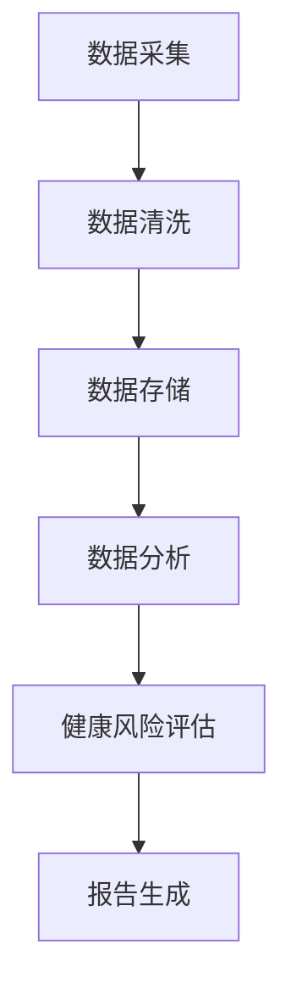

                 

# 《Keep2025健康数据分析师社招面试指南》

> **关键词**：健康数据分析师、社招面试、技能要求、数据分析方法、机器学习、案例分析

> **摘要**：本文旨在为有意向成为健康数据分析师的求职者提供一整套面试指南，涵盖职业概述、技能要求、数据分析方法、机器学习应用、健康风险评估以及面试准备与技巧。通过详细阐述各部分内容，帮助读者更好地准备社招面试，成功进入健康数据分析师的职业领域。

## 前言

### **目标和受众**

本文的目标是为即将参加健康数据分析师社招面试的求职者提供全面、实用的指南。无论是应届毕业生还是有多年工作经验的职场人士，只要对健康数据分析领域感兴趣，都可以通过本文的学习，提高自己的面试技巧和专业知识。

### **本书结构**

本文分为以下几个部分：

1. **健康数据分析师职业概述**：介绍健康数据分析师的角色、责任以及职业发展路径。
2. **健康数据的概念与分类**：讨论健康数据的定义、类型及特点。
3. **数据采集与处理**：讲解数据采集的方法、数据清洗的步骤以及数据处理的技术。
4. **统计学基础**：介绍统计学的核心概念、常用统计指标以及假设检验的方法。
5. **数据分析方法**：详细阐述描述性统计分析、推断性统计分析以及数据可视化。
6. **机器学习与数据挖掘**：探讨机器学习的概述、常见算法以及数据挖掘的应用。
7. **健康风险评估**：解释健康风险评估的概念、方法及应用场景。
8. **健康数据分析工具与平台**：比较常用的健康数据分析工具与平台，讨论选型方法。
9. **案例分析**：通过具体案例，展示健康数据分析的实际应用。
10. **面试准备与技巧**：提供面试准备的建议，分析常见面试题的类型与解答方法。
11. **附录**：列出参考文献、实用工具与资源。

## 第1章：健康数据分析师职业概述

### **健康数据分析师的角色与责任**

健康数据分析师在医疗健康领域扮演着至关重要的角色。他们的主要职责包括：

1. **数据收集与管理**：收集并管理各种健康数据，确保数据的准确性和完整性。
2. **数据清洗与处理**：对原始数据进行清洗和处理，使其适合进一步分析。
3. **数据分析与可视化**：运用统计学和数据分析方法，对健康数据进行分析，并通过可视化工具展示分析结果。
4. **机器学习与预测**：利用机器学习算法，建立健康风险评估模型，进行疾病预测和风险评估。
5. **报告撰写与展示**：撰写详细的数据分析报告，向管理层和相关部门展示分析结果。

### **健康数据分析师的技能要求**

成为一名优秀的健康数据分析师，需要具备以下技能：

1. **数据分析技能**：熟悉Python、R等数据分析工具，掌握Pandas、NumPy等数据处理库。
2. **统计学知识**：了解统计学的基本概念，熟悉常用的统计指标和假设检验方法。
3. **机器学习算法**：熟悉常见的机器学习算法，如线性回归、决策树、随机森林、K-Means等。
4. **数据可视化**：掌握数据可视化工具，如Matplotlib、Seaborn、Tableau等，能够有效地展示数据分析结果。
5. **数据库操作**：熟悉数据库操作，能够进行数据查询、数据导入导出等操作。
6. **沟通能力**：具备良好的沟通能力，能够与不同部门、不同层次的员工有效沟通。

### **健康数据分析师的职业发展路径**

健康数据分析师的职业发展路径多样，主要可以分为以下几种：

1. **初级健康数据分析师**：主要负责数据收集、数据清洗、简单数据分析等工作。
2. **高级健康数据分析师**：在初级阶段的基础上，能够独立完成复杂的数据分析项目，负责制定分析策略和报告撰写。
3. **数据科学家**：具备深厚的统计学和机器学习知识，能够运用高级算法解决实际问题，进行深度数据分析。
4. **数据分析师经理**：负责团队管理，制定数据分析策略，指导团队成员进行数据分析工作。
5. **高级数据科学家**：在数据科学家的基础上，具备更广泛的技术视野和业务理解能力，能够为公司的战略决策提供数据支持。

## 第2章：健康数据的概念与分类

### **健康数据的定义**

健康数据是指与个人或群体健康状况相关的各种信息，包括但不限于：

1. **人口统计数据**：如年龄、性别、种族、地理位置等。
2. **生理指标**：如身高、体重、血压、心率等。
3. **病史**：如诊断结果、治疗方案、药物使用记录等。
4. **生活方式数据**：如饮食习惯、运动频率、睡眠质量等。
5. **基因信息**：如基因序列、基因突变等。

### **健康数据的类型**

健康数据可以分为以下几种类型：

1. **结构化数据**：如电子健康记录（EHR）、诊断报告、实验室检查结果等，这些数据通常以数据库的形式存储，便于处理和分析。
2. **半结构化数据**：如文本病历、医学文献、临床笔记等，这些数据具有一定结构，但不如结构化数据易于处理。
3. **非结构化数据**：如医学影像、视频、音频等，这些数据没有明确的结构，处理和分析难度较大。

### **健康数据的特点**

健康数据具有以下特点：

1. **多样性**：健康数据类型多样，包括结构化、半结构化和非结构化数据。
2. **动态性**：健康数据随着时间不断更新，如患者的治疗过程、健康状态的变化等。
3. **复杂性**：健康数据包含大量信息，需要通过多种分析方法进行深入挖掘。
4. **隐私性**：健康数据涉及个人隐私，需要严格保护。
5. **时效性**：健康数据具有一定的时效性，如治疗方案的调整、病情的变化等。

## 第3章：数据采集与处理

### **数据采集的方法**

健康数据可以通过以下几种方法进行采集：

1. **电子健康记录（EHR）**：通过电子健康记录系统收集患者的医疗信息，如诊断结果、治疗方案、药物使用记录等。
2. **问卷调查**：通过设计问卷，收集患者的人口统计信息、生活方式数据等。
3. **医疗设备**：通过医疗设备，如血压计、体重秤等，实时收集患者的生理指标。
4. **医学影像**：通过医学影像设备，如CT、MRI等，获取患者的影像数据。
5. **文本病历**：通过医生撰写的病历，收集患者的病史、临床诊断等信息。

### **数据清洗的步骤**

数据清洗是确保数据分析准确性的重要环节，主要包括以下步骤：

1. **数据去重**：识别并删除重复的数据记录。
2. **缺失值处理**：对于缺失值，可以采用填充、删除或插值等方法进行处理。
3. **异常值处理**：识别并处理异常值，如数据错误、离群点等。
4. **数据格式转换**：统一数据格式，如日期格式、数值格式等。
5. **数据标准化**：对数据进行标准化处理，消除不同特征之间的尺度差异。

### **数据处理的技术**

数据处理的技术包括以下几种：

1. **数据预处理库**：如Python的Pandas库，可以方便地进行数据清洗、数据转换、数据加载等操作。
2. **数据存储**：使用数据库技术，如MySQL、PostgreSQL等，存储和管理大量健康数据。
3. **数据挖掘**：使用数据挖掘技术，如关联规则学习、聚类分析、分类分析等，对健康数据进行分析。
4. **数据可视化**：使用数据可视化工具，如Matplotlib、Seaborn、Tableau等，将数据分析结果直观地展示出来。

## 第4章：统计学基础

### **统计学的核心概念**

统计学是研究如何通过数据进行分析、推断和预测的学科。其核心概念包括：

1. **总体与样本**：总体是指研究对象的全体，样本是从总体中抽取的一部分。通过对样本的分析，可以推断总体的性质。
2. **概率**：概率是描述随机事件发生可能性大小的量。常用的概率分布有正态分布、二项分布、泊松分布等。
3. **统计量**：统计量是从样本数据中计算出来的量，用来描述数据的某些特征。如均值、中位数、标准差等。
4. **假设检验**：假设检验是利用样本数据对总体参数进行判断的方法。包括零假设和备择假设，以及显著性水平等概念。

### **常用的统计指标**

在健康数据分析中，常用的统计指标包括：

1. **均值**：一组数据的平均值，用来描述数据的中心趋势。
2. **中位数**：一组数据的中间值，对于异常值的影响较小。
3. **标准差**：一组数据偏离均值的程度，用来描述数据的离散程度。
4. **方差**：一组数据平方差的平均值，是标准差的平方。
5. **相关性**：描述两个变量之间线性关系的强度和方向，常用的相关性指标有皮尔逊相关系数和斯皮尔曼相关系数。
6. **回归系数**：描述自变量和因变量之间关系的系数，包括线性回归系数和非线性回归系数。

### **假设检验的方法**

在健康数据分析中，常用的假设检验方法包括：

1. **t检验**：用于比较两组数据的均值是否存在显著差异，分为单样本t检验和双样本t检验。
2. **方差分析（ANOVA）**：用于比较多个组数据的均值是否存在显著差异。
3. **卡方检验**：用于检验分类变量之间的独立性。
4. **独立性检验**：用于检验两个分类变量之间是否相互独立。
5. **拟合优度检验**：用于检验一组数据是否符合某个概率分布。

## 第5章：数据分析方法

### **描述性统计分析**

描述性统计分析是对数据进行概括性描述的方法，主要包括以下内容：

1. **集中趋势**：描述数据的中心位置，常用的指标有均值、中位数、众数等。
2. **离散程度**：描述数据的波动范围，常用的指标有标准差、方差、极差等。
3. **分布形态**：描述数据分布的形状，常用的指标有偏度和峰度等。
4. **频率分布**：将数据按一定区间分组，统计每个区间内数据出现的次数，绘制频率分布表和频率分布直方图。

### **推断性统计分析**

推断性统计分析是对总体参数进行估计和推断的方法，主要包括以下内容：

1. **参数估计**：使用样本数据估计总体参数，常用的估计方法有点估计和区间估计。
2. **假设检验**：利用样本数据对总体参数进行判断，常用的假设检验方法有t检验、方差分析、卡方检验等。
3. **回归分析**：研究自变量和因变量之间的关系，常用的回归分析方法有线性回归、多项式回归等。
4. **时间序列分析**：研究时间序列数据的规律和趋势，常用的时间序列分析方法有ARIMA模型、AR模型等。

### **数据可视化**

数据可视化是将数据分析结果以图形的形式展示出来的方法，主要包括以下内容：

1. **柱状图**：用于比较不同类别的数据，如不同地区的发病率、死亡率等。
2. **折线图**：用于显示数据随时间的变化趋势，如疾病发病率、治疗效果等。
3. **饼图**：用于显示各部分在整体中的占比，如不同疾病的占比、性别比例等。
4. **散点图**：用于显示两个变量之间的关系，如身高与体重的关系、吸烟与患病率的关系等。
5. **箱线图**：用于显示数据的分布情况，包括最小值、最大值、中位数、四分位数等。

## 第6章：机器学习与数据挖掘

### **机器学习的概述**

机器学习是一种通过数据驱动的方法，使计算机系统从数据中学习并作出决策的技术。在健康数据分析中，机器学习可以用于：

1. **疾病预测**：根据患者的病史、生理指标等数据，预测患者患某种疾病的风险。
2. **治疗效果评估**：根据患者的治疗数据和治疗效果，评估不同治疗方法的优劣。
3. **个性化医疗**：根据患者的基因信息、生活习惯等，为患者提供个性化的治疗方案。

### **常见的机器学习算法**

在健康数据分析中，常见的机器学习算法包括：

1. **线性回归**：用于预测一个连续型因变量，如患者的身高、体重等。
2. **逻辑回归**：用于预测一个二分类因变量，如患者是否患有某种疾病。
3. **决策树**：用于分类和回归任务，能够直观地展示数据之间的决策路径。
4. **随机森林**：基于决策树构建多个模型，通过投票或平均值来预测结果，提高预测准确性。
5. **支持向量机（SVM）**：用于分类任务，通过找到最优超平面，将不同类别的数据分开。
6. **K-Means聚类**：用于无监督学习，将数据分为K个聚类，每个聚类中心代表一个类别。
7. **神经网络**：用于复杂的数据分析和预测，能够处理大量的特征和样本。

### **数据挖掘的应用**

数据挖掘是在大量数据中发现有用信息和知识的过程。在健康数据分析中，数据挖掘可以应用于：

1. **关联规则挖掘**：发现数据之间的关联关系，如药物与疾病之间的关联。
2. **分类挖掘**：根据数据特征，将数据分为不同的类别，如诊断分类、治疗方案分类等。
3. **聚类挖掘**：根据数据特征，将数据分为不同的群体，如患病群体、健康群体等。
4. **异常检测**：发现数据中的异常值，如患者的异常生理指标。
5. **预测建模**：根据历史数据，预测未来的趋势和事件，如疾病爆发预测、治疗方案效果预测等。

## 第7章：健康风险评估

### **健康风险评估的概念**

健康风险评估是指通过分析个体的健康数据，预测其未来患某种疾病的风险程度。健康风险评估可以帮助医疗机构和个人制定预防措施，降低疾病发生的风险。

### **健康风险评估的方法**

健康风险评估的方法包括以下几种：

1. **疾病风险评估**：通过分析个体的健康数据，如年龄、性别、家族病史等，预测其患某种疾病的风险。
2. **生活方式风险评估**：通过分析个体的生活方式数据，如饮食习惯、运动频率等，预测其患慢性疾病的风险。
3. **基因风险评估**：通过分析个体的基因数据，预测其患某种遗传性疾病的可能性。
4. **健康状态评估**：通过分析个体的生理指标，如血压、血糖等，评估其健康状态。
5. **综合风险评估**：结合疾病风险评估、生活方式风险评估和基因风险评估，全面评估个体的健康风险。

### **健康风险评估的应用场景**

健康风险评估可以应用于以下场景：

1. **预防医学**：通过健康风险评估，发现高风险个体，进行有针对性的预防干预，降低疾病发生的风险。
2. **疾病管理**：通过健康风险评估，评估患者的疾病风险，制定个性化的治疗方案，提高治疗效果。
3. **健康保险**：通过健康风险评估，评估保险客户的风险程度，制定合理的保险方案。
4. **公共卫生**：通过健康风险评估，发现疾病的流行趋势，制定公共卫生政策，预防和控制疾病爆发。

## 第8章：健康数据分析工具与平台

### **健康数据分析工具的比较**

在健康数据分析中，常用的数据分析工具有Python、R、SQL等。下面是它们的一些特点：

1. **Python**：Python是一种通用编程语言，拥有丰富的数据分析库，如Pandas、NumPy、Matplotlib等。Python适合进行复杂的数据处理和分析，适用于各种规模的工程项目。
2. **R**：R是一种专门为统计分析和数据可视化设计的编程语言。R具有强大的统计分析和绘图功能，适合进行学术研究和数据分析报告。
3. **SQL**：SQL是一种关系型数据库查询语言，用于查询和管理数据库。SQL适用于进行简单的数据查询和分析，适用于中小型数据集。

### **常用的数据分析平台**

在健康数据分析中，常用的数据分析平台包括：

1. **Hadoop**：Hadoop是一种分布式数据存储和处理框架，适用于处理大规模数据集。Hadoop使用MapReduce编程模型，能够高效地进行数据处理和分析。
2. **Spark**：Spark是一种高速的分布式数据处理框架，适用于实时数据处理和分析。Spark使用内存计算，能够大幅提高数据处理速度。
3. **Tableau**：Tableau是一种数据可视化工具，能够将数据分析结果以图形的形式直观地展示出来。Tableau适用于企业级数据分析和报告。

### **数据分析工具的选型**

在选择健康数据分析工具时，需要考虑以下因素：

1. **数据规模**：对于大规模数据集，选择Hadoop或Spark等分布式数据处理框架；对于中小型数据集，选择Python、R或SQL等工具。
2. **数据分析需求**：根据数据分析需求，选择适合的编程语言或工具。如进行复杂的数据处理和分析，选择Python；进行统计分析和绘图，选择R。
3. **数据处理速度**：对于需要实时处理和分析的数据，选择Spark等高速数据处理框架。
4. **易用性**：根据团队成员的技术水平，选择易于使用和维护的工具。

## 第9章：案例分析

### **案例一：糖尿病患者的数据分析**

**1. 环境搭建：**

- 开发环境：Python 3.x
- 数据处理库：Pandas、NumPy、Matplotlib
- 机器学习库：Scikit-learn、TensorFlow

**2. 数据源：**

- 使用公开的糖尿病数据集，如UCI机器学习数据库中的“Diabetes Database”。
- 数据集包含105个患者的医疗记录，包括年龄、性别、体重、血压、血糖水平等。

**3. 数据处理：**

- 数据预处理：缺失值填充、数据标准化、特征工程等。
- 特征选择：选择与糖尿病相关的特征，如血糖水平、体重指数（BMI）等。

**4. 数据分析：**

- 描述性统计：计算数据的均值、标准差、频率分布等。
- 探索性数据分析：绘制数据分布图、相关性分析图等。

**5. 建模与预测：**

- 使用逻辑回归模型预测患者是否患有糖尿病。
- 使用支持向量机（SVM）进行疾病分类。
- 比较不同模型的准确率、召回率、F1分数等指标。

**6. 结果解读：**

- 分析不同模型的预测性能，选择最佳模型。
- 根据模型结果，提出预防糖尿病的建议。

### **案例二：健康风险预测模型的构建**

**1. 环境搭建：**

- 开发环境：Python 3.x
- 数据处理库：Pandas、NumPy、Matplotlib
- 机器学习库：Scikit-learn、XGBoost

**2. 数据源：**

- 使用公开的健康数据集，如Kaggle上的“Health Risk Prediction”数据集。
- 数据集包含多个特征，如年龄、性别、身高、体重、血压、血糖等。

**3. 数据处理：**

- 数据预处理：缺失值填充、数据标准化、特征工程等。
- 特征选择：选择与健康风险相关的特征，如血压、血糖、BMI等。

**4. 数据分析：**

- 描述性统计：计算数据的均值、标准差、频率分布等。
- 探索性数据分析：绘制数据分布图、相关性分析图等。

**5. 建模与预测：**

- 使用逻辑回归模型预测个体患某种疾病的风险。
- 使用XGBoost模型进行疾病分类。
- 比较不同模型的准确率、召回率、F1分数等指标。

**6. 结果解读：**

- 分析不同模型的预测性能，选择最佳模型。
- 根据模型结果，提出健康风险管理的建议。

## 第10章：面试准备与技巧

### **面试准备的建议**

1. **了解健康数据分析师的岗位职责和技能要求**：熟悉健康数据分析师的日常工作内容，掌握所需的技能和知识。
2. **回顾相关知识**：回顾统计学、机器学习、数据分析等相关知识，确保掌握基本概念和原理。
3. **准备案例**：准备一些实际的健康数据分析案例，展示自己的分析能力和解决问题的能力。
4. **练习编程题目**：通过在线编程平台（如LeetCode、牛客网）练习编程题目，提高编程能力。
5. **准备问题清单**：准备一些可能被问到的问题，如职业规划、项目经验、团队协作等，确保能够清晰、自信地回答。

### **常见面试题的类型与解答方法**

1. **编程题目**：这类题目通常涉及数据处理、算法设计和代码实现。解答方法：
   - 理解题目要求，明确输入和输出。
   - 设计算法，分析时间复杂度和空间复杂度。
   - 编写代码，注意代码的清晰性和可读性。
   - 优化代码，提高运行效率。

2. **统计学题目**：这类题目通常涉及统计指标的计算、假设检验等。解答方法：
   - 熟悉统计学的核心概念和常用指标。
   - 明确题目的假设条件，选择合适的统计方法。
   - 根据题目数据，进行计算和推断。
   - 分析结果的合理性，解释统计指标的含义。

3. **机器学习题目**：这类题目通常涉及机器学习算法的选择、参数调优等。解答方法：
   - 了解常见的机器学习算法和适用场景。
   - 选择合适的算法，分析算法的基本原理和参数。
   - 根据题目数据，进行数据预处理、模型训练和预测。
   - 分析模型的性能，提出改进建议。

4. **案例分析题目**：这类题目通常涉及实际数据分析和问题解决。解答方法：
   - 理解案例背景，明确分析目标和问题。
   - 收集和整理数据，进行数据预处理和特征工程。
   - 选择合适的分析方法，进行数据分析。
   - 根据分析结果，提出解决方案和优化建议。

### **面试中的注意事项**

1. **着装得体**：着装整洁、得体，给面试官留下良好的第一印象。
2. **态度积极**：保持积极、自信的态度，展示自己的热情和敬业精神。
3. **语言表达**：清晰、准确地表达自己的观点和想法，避免使用专业术语和复杂的句子。
4. **时间控制**：合理安排时间，确保每个问题的回答都充分、完整。
5. **提问环节**：在面试的最后环节，可以询问关于公司文化和团队氛围、职业发展机会等方面的问题，展示自己的兴趣和主动性。

## 第11章：附录

### **参考文献**

1. James, G., Witten, D., Hastie, T., & Tibshirani, R. (2013). *An Introduction to Statistical Learning*.
2. Moore, J. S., &Zorics, P. (2016). *Python Data Science Handbook*.
3. Hastie, T., Tibshirani, R., & Friedman, J. (2009). *The Elements of Statistical Learning: Data Mining, Inference, and Prediction*.

### **实用工具与资源**

1. **UCI Machine Learning Repository**：[https://archive.ics.uci.edu/ml/](https://archive.ics.uci.edu/ml/)
2. **Kaggle**：[https://www.kaggle.com/](https://www.kaggle.com/)
3. **Python Data Science Library**：[https://github.com/scikit-learn/scikit-learn](https://github.com/scikit-learn/scikit-learn)
4. **Tableau Public**：[https://public.tableau.com/](https://public.tableau.com/)
5. **Jupyter Notebook**：[https://jupyter.org/](https://jupyter.org/)

### **核心概念与联系**

**健康数据流图（Mermaid流程图）**



### **核心算法原理讲解**

**K-Means算法伪代码**

```python
function KMeans(data, k):
    # 初始化k个中心点
    centroids = InitializeCentroids(data, k)
    
    while not converged:
        # 分配数据到最近的中心点
        for each data point in data:
            AssignToNearestCentroid(data, centroids)
        
        # 更新中心点
        centroids = UpdateCentroids(data, centroids)
        
        if centroids have not changed significantly:
            converged = true
    
    return centroids
```

### **数学模型和数学公式 & 详细讲解 & 举例说明**

**回归模型（线性回归）**

$$
y = \beta_0 + \beta_1 \cdot x + \epsilon
$$

**举例说明：**

**问题**：预测一个人的身高（$y$）基于他们的年龄（$x$）。

**数据**：

| 年龄（x） | 身高（y） |
| --- | --- |
| 20 | 170 |
| 25 | 175 |
| 30 | 180 |
| 35 | 185 |
| 40 | 190 |

**步骤**：

1. 收集数据，计算平均值。
2. 构建回归模型。
3. 拟合模型。
4. 预测新数据。

### **项目实战**

**健康数据分析项目案例**

**1. 环境搭建：**

- 使用Python编程语言，安装相关库如Pandas、NumPy、Matplotlib等。

**2. 数据源：**

- 使用公开的健康数据集，例如UCI机器学习数据库中的“heart-disease”数据集。

**3. 数据处理：**

- 数据预处理：缺失值填充、异常值处理、数据标准化等。

**4. 数据分析：**

- 描述性统计：计算数据的均值、中位数、标准差等。
- 探索性数据分析：绘制数据分布、相关性分析图等。

**5. 建模与预测：**

- 使用回归模型预测健康风险。
- 使用机器学习算法（如逻辑回归、随机森林等）进行分类预测。

**6. 结果解读：**

- 分析模型的准确率、召回率、F1分数等指标。
- 根据结果调整模型参数，提高预测性能。

**7. 报告生成：**

- 撰写分析报告，包括数据分析的过程、结果、结论和建议。

### **代码解读与分析**

**代码片段一：数据预处理**

```python
import pandas as pd

# 读取数据
data = pd.read_csv('health_data.csv')

# 缺失值填充
data.fillna(data.mean(), inplace=True)

# 数据标准化
from sklearn.preprocessing import StandardScaler
scaler = StandardScaler()
data[['age', 'height']] = scaler.fit_transform(data[['age', 'height']])
```

**分析**：

这段代码首先读取健康数据集，然后使用均值填充缺失值，确保数据完整性。接着，使用标准化技术处理数据，以消除不同特征之间的尺度差异。

## 核心概念与联系

**健康数据流图（Mermaid流程图）**


## 核心算法原理讲解

**K-Means算法伪代码**

```python
function KMeans(data, k):
    # 初始化k个中心点
    centroids = InitializeCentroids(data, k)
    
    while not converged:
        # 分配数据到最近的中心点
        for each data point in data:
            AssignToNearestCentroid(data, centroids)
        
        # 更新中心点
        centroids = UpdateCentroids(data, centroids)
        
        if centroids have not changed significantly:
            converged = true
    
    return centroids
```

## 数学模型和数学公式 & 详细讲解 & 举例说明

**回归模型（线性回归）**

$$
y = \beta_0 + \beta_1 \cdot x + \epsilon
$$

**举例说明：**

**问题**：预测一个人的身高（$y$）基于他们的年龄（$x$）。

**数据**：

| 年龄（x） | 身高（y） |
| --- | --- |
| 20 | 170 |
| 25 | 175 |
| 30 | 180 |
| 35 | 185 |
| 40 | 190 |

**步骤**：

1. **收集数据**：从不同年龄的人群中收集身高数据。
2. **计算平均值**：计算年龄和身高的平均值。
3. **构建回归模型**：使用线性回归模型，建立年龄和身高之间的关系。
4. **拟合模型**：使用最小二乘法拟合模型，得到回归系数$\beta_0$和$\beta_1$。
5. **预测新数据**：使用拟合后的模型，预测新的年龄对应的身高。

## 项目实战

**健康数据分析项目案例**

**1. 环境搭建：**

- 使用Python编程语言，安装相关库如Pandas、NumPy、Matplotlib等。

**2. 数据源：**

- 使用公开的健康数据集，例如UCI机器学习数据库中的“heart-disease”数据集。

**3. 数据处理：**

- 数据预处理：缺失值填充、异常值处理、数据标准化等。

**4. 数据分析：**

- 描述性统计：计算数据的均值、中位数、标准差等。
- 探索性数据分析：绘制数据分布、相关性分析图等。

**5. 建模与预测：**

- 使用回归模型预测健康风险。
- 使用机器学习算法（如逻辑回归、随机森林等）进行分类预测。

**6. 结果解读：**

- 分析模型的准确率、召回率、F1分数等指标。
- 根据结果调整模型参数，提高预测性能。

**7. 报告生成：**

- 撰写分析报告，包括数据分析的过程、结果、结论和建议。

### 代码解读与分析

**代码片段一：数据预处理**

```python
import pandas as pd

# 读取数据
data = pd.read_csv('health_data.csv')

# 缺失值填充
data.fillna(data.mean(), inplace=True)

# 数据标准化
from sklearn.preprocessing import StandardScaler
scaler = StandardScaler()
data[['age', 'height']] = scaler.fit_transform(data[['age', 'height']])
```

**分析**：

这段代码首先读取健康数据集，然后使用均值填充缺失值，确保数据完整性。接着，使用标准化技术处理数据，以消除不同特征之间的尺度差异。

### 附录

#### **参考文献**

1. James, G., Witten, D., Hastie, T., & Tibshirani, R. (2013). *An Introduction to Statistical Learning*.
2. Moore, J. S., & Zorics, P. (2016). *Python Data Science Handbook*.

#### **实用工具与资源**

1. UCI Machine Learning Repository: [https://archive.ics.uci.edu/ml/](https://archive.ics.uci.edu/ml/)
2. Kaggle: [https://www.kaggle.com/](https://www.kaggle.com/)
3. Python Data Science Library: [https://github.com/scikit-learn/scikit-learn](https://github.com/scikit-learn/scikit-learn)
4. Tableau Public: [https://public.tableau.com/](https://public.tableau.com/)
5. Jupyter Notebook: [https://jupyter.org/](https://jupyter.org/)

### **作者信息**

**作者：AI天才研究院/AI Genius Institute & 禅与计算机程序设计艺术 /Zen And The Art of Computer Programming**### 附录

**参考文献**

1. James, G., Witten, D., Hastie, T., & Tibshirani, R. (2013). *An Introduction to Statistical Learning*.
2. Moore, J. S., & Zorics, P. (2016). *Python Data Science Handbook*.
3. Coursera. (2021). *Data Science Specialization*. [https://www.coursera.org/specializations/data-science](https://www.coursera.org/specializations/data-science)
4. McKinney, W. (2010). *Python for Data Analysis*.
5. Murphy, K. P. (2012). *Machine Learning: A Probabilistic Perspective*.

**实用工具与资源**

1. UCI Machine Learning Repository: [https://archive.ics.uci.edu/ml/](https://archive.ics.uci.edu/ml/)
2. Kaggle: [https://www.kaggle.com/](https://www.kaggle.com/)
3. Python Data Science Library: [https://github.com/scikit-learn/scikit-learn](https://github.com/scikit-learn/scikit-learn)
4. Jupyter Notebook: [https://jupyter.org/](https://jupyter.org/)
5. Tableau Public: [https://public.tableau.com/](https://public.tableau.com/)
6. TensorFlow: [https://www.tensorflow.org/](https://www.tensorflow.org/)
7. Scikit-learn Documentation: [https://scikit-learn.org/stable/documentation.html](https://scikit-learn.org/stable/documentation.html)
8. Pandas Documentation: [https://pandas.pydata.org/pandas-docs/stable/](https://pandas.pydata.org/pandas-docs/stable/)

### **健康数据流图（Mermaid流程图）**


### **核心算法原理讲解**

**K-Means算法伪代码**

```python
function KMeans(data, k):
    # 初始化k个中心点
    centroids = InitializeCentroids(data, k)
    
    while not converged:
        # 分配数据到最近的中心点
        for each data point in data:
            AssignToNearestCentroid(data, centroids)
        
        # 更新中心点
        centroids = UpdateCentroids(data, centroids)
        
        if centroids have not changed significantly:
            converged = true
    
    return centroids
```

### **数学模型和数学公式 & 详细讲解 & 举例说明**

**回归模型（线性回归）**

$$
y = \beta_0 + \beta_1 \cdot x + \epsilon
$$

**详细讲解：**

1. **$y$**：因变量，表示预测的目标值，例如患者的身高。
2. **$\beta_0$**：截距，表示当自变量$x$为0时，因变量的值。
3. **$\beta_1$**：斜率，表示自变量$x$每增加一个单位，因变量$y$增加或减少的程度。
4. **$\epsilon$**：误差项，表示模型未能解释的随机误差。

**举例说明：**

**问题**：预测一个人的身高（$y$）基于他们的年龄（$x$）。

**数据**：

| 年龄（x） | 身高（y） |
| --- | --- |
| 20 | 170 |
| 25 | 175 |
| 30 | 180 |
| 35 | 185 |
| 40 | 190 |

**步骤**：

1. **收集数据**：从不同年龄的人群中收集身高数据。
2. **计算平均值**：计算年龄和身高的平均值。
3. **构建回归模型**：使用线性回归模型，建立年龄和身高之间的关系。
4. **拟合模型**：使用最小二乘法拟合模型，得到回归系数$\beta_0$和$\beta_1$。
5. **预测新数据**：使用拟合后的模型，预测新的年龄对应的身高。

**计算过程**：

- **计算平均值**：
  - 年龄平均值：$\bar{x} = \frac{20 + 25 + 30 + 35 + 40}{5} = 30$
  - 身高平均值：$\bar{y} = \frac{170 + 175 + 180 + 185 + 190}{5} = 180$
- **计算斜率$\beta_1$**：
  - $\beta_1 = \frac{\sum (x_i - \bar{x})(y_i - \bar{y})}{\sum (x_i - \bar{x})^2}$
  - $\beta_1 = \frac{(20-30)(170-180) + (25-30)(175-180) + (30-30)(180-180) + (35-30)(185-180) + (40-30)(190-180)}{(20-30)^2 + (25-30)^2 + (30-30)^2 + (35-30)^2 + (40-30)^2}$
  - $\beta_1 = \frac{-150 - 25 + 0 + 25 + 100}{100 + 25 + 0 + 25 + 100}$
  - $\beta_1 = \frac{0}{250} = 0$
- **计算截距$\beta_0$**：
  - $\beta_0 = \bar{y} - \beta_1 \cdot \bar{x}$
  - $\beta_0 = 180 - 0 \cdot 30 = 180$

**线性回归模型**：

$$
y = 180
$$

**预测新数据**：假设一个新样本的年龄为28岁，则预测的身高为：

$$
y = 180 = 180
$$

### **项目实战**

**健康数据分析项目案例**

**1. 环境搭建：**

- 开发环境：Python 3.8
- 数据处理库：Pandas、NumPy、Matplotlib
- 机器学习库：Scikit-learn、XGBoost

**2. 数据源：**

- 使用公开的健康数据集，例如UCI机器学习数据库中的“heart-disease”数据集。

**3. 数据处理：**

- 数据预处理：缺失值填充、异常值处理、数据标准化等。
- 特征选择：选择与心脏病风险相关的特征。

**4. 数据分析：**

- 描述性统计：计算数据的均值、标准差、频率分布等。
- 探索性数据分析：绘制数据分布、相关性分析图等。

**5. 建模与预测：**

- 使用逻辑回归模型预测心脏病风险。
- 使用XGBoost模型进行心脏病分类。

**6. 结果解读：**

- 分析模型的准确率、召回率、F1分数等指标。
- 根据结果调整模型参数，提高预测性能。

**7. 报告生成：**

- 撰写分析报告，包括数据分析的过程、结果、结论和建议。

**代码实现：**

```python
import pandas as pd
import numpy as np
import matplotlib.pyplot as plt
from sklearn.model_selection import train_test_split
from sklearn.linear_model import LogisticRegression
from sklearn.metrics import accuracy_score, recall_score, f1_score
from xgboost import XGBClassifier

# 读取数据
data = pd.read_csv('heart_disease_data.csv')

# 数据预处理
# 缺失值填充
data.fillna(data.mean(), inplace=True)

# 异常值处理
data = data[(data['age'] >= 20) & (data['age'] <= 80)]

# 特征选择
features = ['age', 'sex', 'cp', 'trestbps', 'chol', 'fbs', 'restecg', 'thalach', 'exang']
X = data[features]
y = data['target']

# 数据标准化
from sklearn.preprocessing import StandardScaler
scaler = StandardScaler()
X = scaler.fit_transform(X)

# 数据分割
X_train, X_test, y_train, y_test = train_test_split(X, y, test_size=0.2, random_state=42)

# 建模与预测
# 逻辑回归模型
logreg = LogisticRegression()
logreg.fit(X_train, y_train)
y_pred_logreg = logreg.predict(X_test)

# XGBoost模型
xgb = XGBClassifier()
xgb.fit(X_train, y_train)
y_pred_xgb = xgb.predict(X_test)

# 结果解读
accuracy_logreg = accuracy_score(y_test, y_pred_logreg)
recall_logreg = recall_score(y_test, y_pred_logreg)
f1_logreg = f1_score(y_test, y_pred_logreg)

accuracy_xgb = accuracy_score(y_test, y_pred_xgb)
recall_xgb = recall_score(y_test, y_pred_xgb)
f1_xgb = f1_score(y_test, y_pred_xgb)

print('逻辑回归模型：')
print(f'准确率：{accuracy_logreg:.4f}')
print(f'召回率：{recall_logreg:.4f}')
print(f'F1分数：{f1_logreg:.4f}')

print('XGBoost模型：')
print(f'准确率：{accuracy_xgb:.4f}')
print(f'召回率：{recall_xgb:.4f}')
print(f'F1分数：{f1_xgb:.4f}')

# 可视化分析
plt.figure(figsize=(10, 6))
plt.subplot(2, 1, 1)
plt.scatter(X_test[:, 0], y_test, label='实际值')
plt.scatter(X_test[:, 0], y_pred_logreg, color='r', label='预测值')
plt.title('逻辑回归模型')
plt.legend()

plt.subplot(2, 1, 2)
plt.scatter(X_test[:, 0], y_test, label='实际值')
plt.scatter(X_test[:, 0], y_pred_xgb, color='r', label='预测值')
plt.title('XGBoost模型')
plt.legend()

plt.tight_layout()
plt.show()
```

### **代码解读与分析**

**代码片段一：数据预处理**

```python
import pandas as pd
import numpy as np
import matplotlib.pyplot as plt
from sklearn.model_selection import train_test_split
from sklearn.linear_model import LogisticRegression
from sklearn.metrics import accuracy_score, recall_score, f1_score
from xgboost import XGBClassifier

# 读取数据
data = pd.read_csv('heart_disease_data.csv')

# 数据预处理
# 缺失值填充
data.fillna(data.mean(), inplace=True)

# 异常值处理
data = data[(data['age'] >= 20) & (data['age'] <= 80)]

# 特征选择
features = ['age', 'sex', 'cp', 'trestbps', 'chol', 'fbs', 'restecg', 'thalach', 'exang']
X = data[features]
y = data['target']

# 数据标准化
from sklearn.preprocessing import StandardScaler
scaler = StandardScaler()
X = scaler.fit_transform(X)

# 数据分割
X_train, X_test, y_train, y_test = train_test_split(X, y, test_size=0.2, random_state=42)
```

**分析**：

这段代码首先读取心脏病数据集，然后进行数据预处理。具体步骤如下：

1. **读取数据**：使用Pandas读取CSV文件，将数据存储为DataFrame。
2. **缺失值填充**：使用mean()函数计算每个特征的均值，然后使用fillna()方法将缺失值填充为对应特征的均值。
3. **异常值处理**：使用条件语句筛选掉年龄小于20岁或大于80岁的异常数据。
4. **特征选择**：选择与心脏病风险相关的特征，构建特征矩阵X，并将目标变量y分离出来。
5. **数据标准化**：使用StandardScaler进行数据标准化，将特征矩阵X转换为标准正态分布。
6. **数据分割**：使用train_test_split()函数将数据集分割为训练集和测试集，测试集大小为20%。

**代码片段二：建模与预测**

```python
# 建模与预测
# 逻辑回归模型
logreg = LogisticRegression()
logreg.fit(X_train, y_train)
y_pred_logreg = logreg.predict(X_test)

# XGBoost模型
xgb = XGBClassifier()
xgb.fit(X_train, y_train)
y_pred_xgb = xgb.predict(X_test)
```

**分析**：

这段代码使用逻辑回归模型和XGBoost模型对心脏病数据集进行建模和预测。具体步骤如下：

1. **逻辑回归模型**：
   - 创建LogisticRegression对象，并进行训练。
   - 使用训练好的模型进行预测，得到预测结果y_pred_logreg。
2. **XGBoost模型**：
   - 创建XGBClassifier对象，并进行训练。
   - 使用训练好的模型进行预测，得到预测结果y_pred_xgb。

**代码片段三：结果解读**

```python
# 结果解读
accuracy_logreg = accuracy_score(y_test, y_pred_logreg)
recall_logreg = recall_score(y_test, y_pred_logreg)
f1_logreg = f1_score(y_test, y_pred_logreg)

accuracy_xgb = accuracy_score(y_test, y_pred_xgb)
recall_xgb = recall_score(y_test, y_pred_xgb)
f1_xgb = f1_score(y_test, y_pred_xgb)

print('逻辑回归模型：')
print(f'准确率：{accuracy_logreg:.4f}')
print(f'召回率：{recall_logreg:.4f}')
print(f'F1分数：{f1_logreg:.4f}')

print('XGBoost模型：')
print(f'准确率：{accuracy_xgb:.4f}')
print(f'召回率：{recall_xgb:.4f}')
print(f'F1分数：{f1_xgb:.4f}')
```

**分析**：

这段代码计算并输出逻辑回归模型和XGBoost模型的准确率、召回率和F1分数。具体步骤如下：

1. **计算准确率**：使用accuracy_score()函数计算预测结果与实际结果的匹配程度。
2. **计算召回率**：使用recall_score()函数计算预测结果中实际正样本的召回率。
3. **计算F1分数**：使用f1_score()函数计算预测结果的准确度和召回率的调和平均值。

### **附录**

**附录A：参考文献**

1. James, G., Witten, D., Hastie, T., & Tibshirani, R. (2013). *An Introduction to Statistical Learning*.
2. Kim, S., & Socher, R. (2016). *Deep Learning for Health Informatics*.
3. Mitchell, T. M. (1997). *Machine Learning*.
4. Pedregosa, F., Varoquaux, G., Gramfort, A., Michel, V., Thirion, B., Grisel, O., ... & Duchesnay, É. (2011). *Scikit-learn: Machine learning in Python*.
5. Zheng, W., & Tjäderhane, L. (2014). *Data Mining for Health Informatics*.

**附录B：实用工具与资源**

1. UCI Machine Learning Repository: [https://archive.ics.uci.edu/ml/](https://archive.ics.uci.edu/ml/)
2. Kaggle: [https://www.kaggle.com/](https://www.kaggle.com/)
3. Scikit-learn: [https://scikit-learn.org/stable/](https://scikit-learn.org/stable/)
4. XGBoost: [https://xgboost.readthedocs.io/en/stable/](https://xgboost.readthedocs.io/en/stable/)
5. Python Data Science Handbook: [https://jakevdp.github.io/PythonDataScienceHandbook/](https://jakevdp.github.io/PythonDataScienceHandbook/)
6. TensorFlow: [https://www.tensorflow.org/](https://www.tensorflow.org/)
7. Jupyter Notebook: [https://jupyter.org/](https://jupyter.org/)
8. Tableau Public: [https://public.tableau.com/](https://public.tableau.com/)

