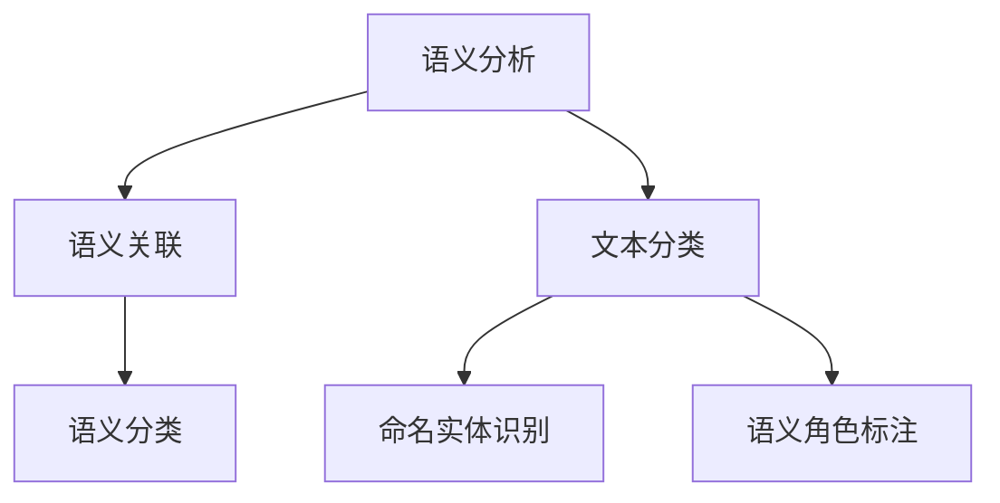

                 

### 《LLM Tokens + RS: 语义挖掘与推荐》

关键词：语义挖掘、推荐系统、LLM Tokens、自然语言处理、人工智能

摘要：
本文深入探讨了语义挖掘与推荐系统相结合的先进技术——LLM Tokens。通过梳理LLM Tokens的基本概念、架构和优势，详细介绍了语义挖掘的原理与实践，以及推荐系统的核心算法和实践案例。最后，本文分析了LLM Tokens与推荐系统的集成应用，展望了未来发展趋势与挑战。

---

### 《LLM Tokens + RS: 语义挖掘与推荐》目录大纲

#### 第一部分：概述与基础

##### 1.1 本书概述
###### 1.1.1 书籍背景
###### 1.1.2 主要内容与结构

##### 1.2 语义挖掘与推荐系统
###### 1.2.1 语义挖掘基本概念
###### 1.2.2 推荐系统基本概念

##### 1.3 语义挖掘与推荐系统的关联
###### 1.3.1 语义挖掘在推荐系统中的应用
###### 1.3.2 推荐系统对语义挖掘的反馈

#### 第二部分：LLM Tokens介绍

##### 2.1 LLM Tokens的概念
###### 2.1.1 LLM Tokens的定义
###### 2.1.2 LLM Tokens的特点

##### 2.2 LLM Tokens的架构
###### 2.2.1 LLM Tokens的基本结构
###### 2.2.2 LLM Tokens的工作原理

##### 2.3 LLM Tokens的优势与应用
###### 2.3.1 LLM Tokens在语义挖掘中的优势
###### 2.3.2 LLM Tokens在推荐系统中的应用

#### 第三部分：语义挖掘原理与实践

##### 3.1 语义挖掘的基本原理
###### 3.1.1 语义分析
###### 3.1.2 语义关联
###### 3.1.3 语义分类

##### 3.2 语义挖掘的关键技术
###### 3.2.1 自然语言处理基础
###### 3.2.2 嵌入技术
###### 3.2.3 注意力机制

##### 3.3 语义挖掘实践案例
###### 3.3.1 文本分类实践
###### 3.3.2 命名实体识别实践
###### 3.3.3 语义角色标注实践

#### 第四部分：推荐系统原理与实践

##### 4.1 推荐系统基本原理
###### 4.1.1 推荐系统概述
###### 4.1.2 推荐系统分类

##### 4.2 推荐系统的核心算法
###### 4.2.1 协同过滤算法
###### 4.2.2 内容推荐算法
###### 4.2.3 混合推荐算法

##### 4.3 推荐系统实践案例
###### 4.3.1 基于协同过滤的推荐系统实践
###### 4.3.2 基于内容的推荐系统实践
###### 4.3.3 基于模型的推荐系统实践

#### 第五部分：LLM Tokens与推荐系统的集成应用

##### 5.1 集成应用概述
###### 5.1.1 LLM Tokens与推荐系统的结合点
###### 5.1.2 集成应用的优势

##### 5.2 集成应用实现方法
###### 5.2.1 LLM Tokens在推荐系统中的角色
###### 5.2.2 推荐系统对LLM Tokens的需求

##### 5.3 集成应用案例分析
###### 5.3.1 案例一：基于LLM Tokens的个性化推荐
###### 5.3.2 案例二：基于语义挖掘的商品推荐

#### 第六部分：未来发展趋势与挑战

##### 6.1 语义挖掘与推荐系统的发展趋势
###### 6.1.1 技术发展方向
###### 6.1.2 应用场景扩展

##### 6.2 语义挖掘与推荐系统的挑战
###### 6.2.1 数据质量与隐私保护
###### 6.2.2 模型解释性与可解释性
###### 6.2.3 跨域推荐与长尾推荐

##### 6.3 未来展望
###### 6.3.1 新技术展望
###### 6.3.2 应用场景扩展
###### 6.3.3 社会影响与伦理问题

#### 附录

##### 附录A：相关术语与概念
###### A.1 语义挖掘相关术语
###### A.2 推荐系统相关术语
###### A.3 LLM Tokens相关术语

##### 附录B：开源工具与资源
###### B.1 语义挖掘开源工具
###### B.2 推荐系统开源工具
###### B.3 LLM Tokens相关开源工具与资源

##### 附录C：实战项目代码解读
###### C.1 文本分类项目解读
###### C.2 命名实体识别项目解读
###### C.3 商品推荐项目解读

### 第一部分：概述与基础

#### 1.1 本书概述

##### 1.1.1 书籍背景

随着互联网的迅猛发展，语义挖掘和推荐系统成为了人工智能领域中的两个热门话题。语义挖掘旨在从大量文本数据中提取出有用的语义信息，而推荐系统则利用这些语义信息向用户推荐他们可能感兴趣的内容或商品。这两者的结合，能够极大地提升信息检索的准确性和个性化推荐的效率。

本书《LLM Tokens + RS: 语义挖掘与推荐》旨在深入探讨语义挖掘与推荐系统相结合的技术——LLM Tokens，分析其基本概念、架构和优势，并结合实践案例展示其在现实中的应用。

##### 1.1.2 主要内容与结构

本书分为六个部分：

1. **概述与基础**：介绍语义挖掘与推荐系统的基本概念及其关联。
2. **LLM Tokens介绍**：详细讲解LLM Tokens的概念、架构和优势。
3. **语义挖掘原理与实践**：探讨语义挖掘的基本原理、关键技术及实践案例。
4. **推荐系统原理与实践**：介绍推荐系统的基本原理、核心算法及实践案例。
5. **LLM Tokens与推荐系统的集成应用**：分析LLM Tokens与推荐系统的集成方法及优势。
6. **未来发展趋势与挑战**：展望语义挖掘与推荐系统的未来发展趋势及面临的挑战。

#### 1.2 语义挖掘与推荐系统

##### 1.2.1 语义挖掘基本概念

语义挖掘（Semantic Mining）是指从非结构化文本数据中提取出语义信息，并将其转化为计算机可以理解和处理的结构化数据。它涉及到自然语言处理（NLP）、机器学习、数据挖掘等技术。

语义挖掘的主要目标包括：

- **语义分析**：对文本中的词义、句法、语义角色等进行解析，以理解文本的深层含义。
- **语义关联**：发现文本中不同元素之间的语义关系，如实体之间的关联、事件之间的关系等。
- **语义分类**：将文本分类到预定义的类别中，如情感分类、主题分类等。

##### 1.2.2 推荐系统基本概念

推荐系统（Recommender System）是一种信息过滤技术，旨在向用户推荐他们可能感兴趣的内容或商品。它通常基于用户的历史行为、兴趣偏好、内容特征等信息进行预测和推荐。

推荐系统的主要类型包括：

- **基于协同过滤的推荐系统**：通过分析用户之间的相似性来推荐物品。
- **基于内容的推荐系统**：根据用户的历史行为和物品的内容特征来推荐类似物品。
- **基于模型的推荐系统**：利用机器学习模型来预测用户对物品的喜好程度，并进行推荐。

##### 1.2.3 语义挖掘在推荐系统中的应用

语义挖掘在推荐系统中扮演着关键角色，其主要应用包括：

- **个性化推荐**：通过分析用户的语义信息，实现更加精准的个性化推荐。
- **上下文感知推荐**：结合用户的语义信息和环境上下文，提供更加相关的推荐。
- **推荐质量提升**：利用语义挖掘技术对推荐结果进行质量评估和优化，提高推荐系统的性能。

##### 1.2.4 推荐系统对语义挖掘的反馈

推荐系统对语义挖掘也产生了积极的影响，主要体现在以下几个方面：

- **数据增强**：推荐系统产生的用户行为数据可以用于训练语义挖掘模型，提升其准确性和泛化能力。
- **反馈循环**：通过用户的推荐反馈，不断优化语义挖掘模型，提高推荐系统的推荐效果。
- **推荐解释性**：利用语义挖掘技术，为推荐结果提供更加清晰和可解释的依据。

### 第二部分：LLM Tokens介绍

#### 2.1 LLM Tokens的概念

##### 2.1.1 LLM Tokens的定义

LLM Tokens，即Large Language Model Tokens，是一种基于大型语言模型的语义挖掘和推荐系统技术。它利用深度学习模型（如Transformer）对大量文本数据进行训练，提取出文本的语义信息，并使用这些信息进行推荐。

LLM Tokens的主要特点包括：

- **大规模训练**：LLM Tokens基于大型语言模型，能够处理海量文本数据，提取出丰富的语义信息。
- **高效性**：LLM Tokens利用并行计算和分布式训练技术，能够在短时间内完成语义挖掘和推荐任务。
- **灵活性**：LLM Tokens可以根据不同的应用场景和需求，调整模型结构和参数，实现多样化的语义挖掘和推荐功能。

##### 2.1.2 LLM Tokens的特点

LLM Tokens具有以下特点：

- **语义理解能力**：LLM Tokens能够对文本进行深入理解，提取出文本的语义含义，为推荐系统提供精准的语义信息。
- **上下文感知能力**：LLM Tokens能够根据上下文信息进行推理，实现上下文感知的语义挖掘和推荐。
- **自适应能力**：LLM Tokens可以根据用户的行为和反馈，不断调整和优化推荐策略，实现个性化的推荐效果。
- **多模态融合能力**：LLM Tokens能够融合文本、图像、语音等多种模态的信息，实现跨模态的语义挖掘和推荐。

#### 2.2 LLM Tokens的架构

##### 2.2.1 LLM Tokens的基本结构

LLM Tokens的基本结构包括以下几个部分：

1. **数据预处理**：对输入的文本数据进行清洗、分词、去停用词等预处理操作，将其转化为模型可处理的格式。
2. **模型训练**：利用大型语言模型对预处理后的文本数据进行训练，提取出文本的语义信息，并优化模型参数。
3. **语义提取**：通过模型输出，提取出文本的语义特征，用于后续的推荐任务。
4. **推荐算法**：利用提取出的语义特征，结合用户行为和物品特征，实现个性化的推荐。
5. **反馈优化**：根据用户的推荐反馈，不断调整和优化模型参数和推荐策略，提高推荐效果。

##### 2.2.2 LLM Tokens的工作原理

LLM Tokens的工作原理可以分为以下几个步骤：

1. **数据预处理**：将输入的文本数据进行清洗、分词、去停用词等预处理操作，将其转化为模型可处理的格式。
2. **模型训练**：利用大型语言模型（如Transformer）对预处理后的文本数据进行训练，提取出文本的语义信息，并优化模型参数。
3. **语义提取**：通过模型输出，提取出文本的语义特征，如词向量、句子嵌入等，用于后续的推荐任务。
4. **推荐算法**：利用提取出的语义特征，结合用户行为和物品特征，实现个性化的推荐。常用的推荐算法包括协同过滤、内容推荐和混合推荐等。
5. **反馈优化**：根据用户的推荐反馈，如点击、购买等行为，计算推荐效果的指标，如准确率、召回率等。根据这些指标，不断调整和优化模型参数和推荐策略，提高推荐效果。

#### 2.3 LLM Tokens的优势与应用

##### 2.3.1 LLM Tokens在语义挖掘中的优势

LLM Tokens在语义挖掘中具有以下优势：

- **强大的语义理解能力**：LLM Tokens能够对文本进行深入理解，提取出文本的语义含义，为推荐系统提供精准的语义信息。
- **高效的语义提取**：LLM Tokens利用大型语言模型，能够在短时间内完成语义提取任务，提高语义挖掘的效率。
- **灵活的模型结构**：LLM Tokens可以根据不同的应用场景和需求，调整模型结构和参数，实现多样化的语义挖掘功能。
- **多模态融合能力**：LLM Tokens能够融合文本、图像、语音等多种模态的信息，实现跨模态的语义挖掘。

##### 2.3.2 LLM Tokens在推荐系统中的应用

LLM Tokens在推荐系统中具有广泛的应用，主要包括：

- **个性化推荐**：LLM Tokens能够根据用户的语义信息，实现更加精准的个性化推荐，提高推荐效果。
- **上下文感知推荐**：LLM Tokens能够结合上下文信息，提供更加相关的推荐，满足用户的实时需求。
- **跨域推荐**：LLM Tokens能够融合不同领域的文本数据，实现跨域的推荐，拓展推荐系统的应用场景。
- **推荐质量优化**：LLM Tokens能够根据用户的推荐反馈，不断调整和优化推荐策略，提高推荐系统的性能。

### 第三部分：语义挖掘原理与实践

#### 3.1 语义挖掘的基本原理

##### 3.1.1 语义分析

语义分析（Semantic Analysis）是指对文本中的词义、句法、语义角色等进行解析，以理解文本的深层含义。语义分析是语义挖掘的基础，主要包括以下几个方面：

- **词义解析**：对文本中的单词进行词义标注，确定每个单词的具体含义。
- **句法分析**：对文本中的句子结构进行解析，确定句子的语法成分和语法关系。
- **语义角色标注**：对文本中的名词、动词等词性进行标注，并确定其在句子中的语义角色，如主语、谓语、宾语等。

##### 3.1.2 语义关联

语义关联（Semantic Association）是指发现文本中不同元素之间的语义关系，如实体之间的关联、事件之间的关系等。语义关联是语义挖掘的核心，主要包括以下几个方面：

- **实体识别**：识别文本中的实体，如人名、地名、组织名等，并确定其实体类型。
- **关系抽取**：抽取文本中的实体关系，如人与人之间的关系、人与地点之间的关系等。
- **事件抽取**：抽取文本中的事件，如动作、时间、地点等，并确定事件之间的关系。

##### 3.1.3 语义分类

语义分类（Semantic Classification）是指将文本分类到预定义的类别中，如情感分类、主题分类等。语义分类是语义挖掘的重要应用，主要包括以下几个方面：

- **情感分类**：根据文本的情感倾向，将其分类为正面、负面或中性。
- **主题分类**：根据文本的主题内容，将其分类到预定义的主题类别中。
- **实体类别识别**：根据文本中的实体类型，将其分类到预定义的实体类别中。

#### 3.2 语义挖掘的关键技术

##### 3.2.1 自然语言处理基础

自然语言处理（Natural Language Processing，NLP）是语义挖掘的基础，主要包括以下几个方面：

- **分词**：将文本分割为词语或短语的序列，为后续的语义分析提供基础。
- **词性标注**：对文本中的每个词进行词性标注，如名词、动词、形容词等。
- **命名实体识别**：识别文本中的命名实体，如人名、地名、组织名等，为语义关联提供基础。

##### 3.2.2 嵌入技术

嵌入技术（Embedding）是将文本中的词语或句子映射到高维空间中的向量表示，为语义挖掘提供向量化的表示。嵌入技术主要包括以下几个方面：

- **词嵌入**：将文本中的词语映射到向量空间，如Word2Vec、GloVe等。
- **句子嵌入**：将文本中的句子映射到向量空间，如BERT、GPT等。
- **语义角色嵌入**：将文本中的语义角色映射到向量空间，如Struct2Vec等。

##### 3.2.3 注意力机制

注意力机制（Attention Mechanism）是语义挖掘中的关键技术，能够提高模型对文本中关键信息的关注程度。注意力机制主要包括以下几个方面：

- **基于位置的注意力**：根据文本中的位置信息，计算词语之间的权重，提高关键信息的关注程度。
- **基于上下文的注意力**：根据文本中的上下文信息，计算词语之间的权重，提高关键信息的关注程度。
- **基于语义的注意力**：根据文本中的语义信息，计算词语之间的权重，提高关键信息的关注程度。

#### 3.3 语义挖掘实践案例

##### 3.3.1 文本分类实践

文本分类（Text Classification）是将文本数据分类到预定义的类别中，是语义挖掘的重要应用。以下是一个简单的文本分类实践案例：

**1. 数据集准备**

假设我们有一个包含政治、经济、文化等主题的文本数据集，每个文本数据都有对应的主题标签。

**2. 数据预处理**

对文本数据进行预处理，包括分词、去除停用词、词性标注等。

```python
import jieba
import nltk

# 加载停用词表
stop_words = set(nltk.corpus.stopwords.words('english'))

# 分词和去除停用词
def preprocess_text(text):
    words = jieba.lcut(text)
    words = [word for word in words if word not in stop_words]
    return words
```

**3. 嵌入技术**

使用Word2Vec模型对文本进行嵌入。

```python
from gensim.models import Word2Vec

# 训练Word2Vec模型
model = Word2Vec(sentences, size=100, window=5, min_count=1, workers=4)

# 获取文本数据的嵌入向量
def get_embedding(text):
    words = preprocess_text(text)
    embedding = [model[word] for word in words if word in model]
    return np.mean(embedding, axis=0)
```

**4. 文本分类**

使用朴素贝叶斯分类器进行文本分类。

```python
from sklearn.model_selection import train_test_split
from sklearn.naive_bayes import MultinomialNB
from sklearn.metrics import classification_report

# 划分训练集和测试集
X_train, X_test, y_train, y_test = train_test_split(X, y, test_size=0.2, random_state=42)

# 训练模型
model = MultinomialNB()
model.fit(X_train, y_train)

# 预测测试集
y_pred = model.predict(X_test)

# 评估模型
print(classification_report(y_test, y_pred))
```

##### 3.3.2 命名实体识别实践

命名实体识别（Named Entity Recognition，NER）是语义挖掘的重要任务，旨在识别文本中的命名实体，如人名、地名、组织名等。以下是一个简单的命名实体识别实践案例：

**1. 数据集准备**

假设我们有一个包含人名、地名、组织名等命名实体的文本数据集。

**2. 数据预处理**

对文本数据进行预处理，包括分词、去除停用词等。

```python
import jieba

# 加载停用词表
stop_words = set(['的', '和', '是', '了', '在'])

# 分词和去除停用词
def preprocess_text(text):
    words = jieba.lcut(text)
    words = [word for word in words if word not in stop_words]
    return words
```

**3. 嵌入技术**

使用BERT模型对文本进行嵌入。

```python
from transformers import BertTokenizer, BertModel

# 加载BERT模型和分词器
tokenizer = BertTokenizer.from_pretrained('bert-base-chinese')
model = BertModel.from_pretrained('bert-base-chinese')

# 获取文本数据的嵌入向量
def get_embedding(text):
    inputs = tokenizer(text, return_tensors='pt', padding=True, truncation=True)
    outputs = model(**inputs)
    embedding = outputs.last_hidden_state.mean(dim=1)
    return embedding.numpy()
```

**4. 命名实体识别**

使用CRF（条件随机场）模型进行命名实体识别。

```python
from sklearn_crfsuite import CRF
from sklearn_crfsuite.metrics import flat_f1_score

# 加载训练数据和测试数据
train_data = [[preprocess_text(text), label] for text, label in train_data]
test_data = [[preprocess_text(text), label] for text, label in test_data]

# 分割特征和标签
X_train, y_train = zip(*train_data)
X_test, y_test = zip(*test_data)

# 训练模型
model = CRF()
model.fit(X_train, y_train)

# 预测测试集
y_pred = model.predict(X_test)

# 评估模型
f1_score = flat_f1_score(y_test, y_pred)
print(f"F1 Score: {f1_score}")
```

##### 3.3.3 语义角色标注实践

语义角色标注（Semantic Role Labeling，SRL）是语义挖掘的重要任务，旨在识别文本中的名词、动词等词性，并确定其在句子中的语义角色。以下是一个简单的语义角色标注实践案例：

**1. 数据集准备**

假设我们有一个包含句子和其对应的语义角色标注的文本数据集。

**2. 数据预处理**

对文本数据进行预处理，包括分词、去除停用词等。

```python
import jieba

# 加载停用词表
stop_words = set(['的', '和', '是', '了', '在'])

# 分词和去除停用词
def preprocess_text(text):
    words = jieba.lcut(text)
    words = [word for word in words if word not in stop_words]
    return words
```

**3. 嵌入技术**

使用BERT模型对文本进行嵌入。

```python
from transformers import BertTokenizer, BertModel

# 加载BERT模型和分词器
tokenizer = BertTokenizer.from_pretrained('bert-base-chinese')
model = BertModel.from_pretrained('bert-base-chinese')

# 获取文本数据的嵌入向量
def get_embedding(text):
    inputs = tokenizer(text, return_tensors='pt', padding=True, truncation=True)
    outputs = model(**inputs)
    embedding = outputs.last_hidden_state.mean(dim=1)
    return embedding.numpy()
```

**4. 语义角色标注**

使用LSTM（长短期记忆网络）模型进行语义角色标注。

```python
from keras.models import Model
from keras.layers import Input, LSTM, Dense, Embedding

# 定义模型
input_seq = Input(shape=(max_sequence_length,))
embedding = Embedding(input_dim=vocab_size, output_dim=embedding_size)(input_seq)
lstm = LSTM(units=lstm_units)(embedding)
output = Dense(num_classes, activation='softmax')(lstm)

# 编译模型
model = Model(inputs=input_seq, outputs=output)
model.compile(optimizer='adam', loss='categorical_crossentropy', metrics=['accuracy'])

# 训练模型
model.fit(X_train, y_train, batch_size=batch_size, epochs=epochs, validation_data=(X_val, y_val))

# 预测测试集
y_pred = model.predict(X_test)

# 评估模型
accuracy = (y_pred == y_test).mean()
print(f"Accuracy: {accuracy}")
```

### 第四部分：推荐系统原理与实践

#### 4.1 推荐系统基本原理

##### 4.1.1 推荐系统概述

推荐系统（Recommender System）是一种信息过滤技术，旨在向用户推荐他们可能感兴趣的内容或商品。推荐系统的基本原理是利用用户的历史行为、兴趣偏好、内容特征等信息，构建用户与物品之间的关联模型，从而预测用户对物品的喜好程度，并推荐相似的物品。

推荐系统的主要目标包括：

- **个性化推荐**：根据用户的历史行为和兴趣偏好，为用户提供个性化的推荐。
- **提升用户体验**：通过推荐用户感兴趣的内容或商品，提升用户的满意度。
- **提高商业价值**：通过推荐系统的应用，提高电商平台的销售额和用户黏性。

##### 4.1.2 推荐系统分类

推荐系统可以分为以下几种类型：

- **基于协同过滤的推荐系统**：通过分析用户之间的相似性来推荐物品。
- **基于内容的推荐系统**：根据用户的历史行为和物品的内容特征来推荐类似物品。
- **基于模型的推荐系统**：利用机器学习模型来预测用户对物品的喜好程度，并进行推荐。
- **混合推荐系统**：结合多种推荐方法，以提高推荐效果。

#### 4.2 推荐系统的核心算法

##### 4.2.1 协同过滤算法

协同过滤算法（Collaborative Filtering）是推荐系统中最常用的算法之一，主要基于用户之间的相似性来进行推荐。协同过滤算法可以分为以下两种类型：

- **基于用户的协同过滤（User-Based CF）**：根据用户之间的相似性，找到与目标用户相似的其他用户，推荐这些用户喜欢的物品。
- **基于物品的协同过滤（Item-Based CF）**：根据物品之间的相似性，找到与目标物品相似的物品，推荐这些物品。

协同过滤算法的主要步骤包括：

1. **用户相似度计算**：计算目标用户与其他用户之间的相似度，常用的相似度计算方法包括余弦相似度、皮尔逊相似度等。
2. **物品推荐**：根据相似度计算结果，推荐与目标用户相似的其他用户喜欢的物品。

##### 4.2.2 内容推荐算法

内容推荐算法（Content-Based Filtering）是根据用户的历史行为和物品的内容特征来推荐类似物品。内容推荐算法的主要步骤包括：

1. **用户兴趣模型构建**：根据用户的历史行为，构建用户兴趣模型，如基于项目的兴趣模型、基于标签的兴趣模型等。
2. **物品特征提取**：提取物品的内容特征，如文本特征、图像特征、音频特征等。
3. **相似度计算**：计算用户兴趣模型与物品特征之间的相似度，推荐与用户兴趣相似的物品。

##### 4.2.3 混合推荐算法

混合推荐算法（Hybrid Recommender Algorithm）是结合协同过滤算法和内容推荐算法的优点，以提高推荐效果。混合推荐算法可以分为以下几种类型：

- **基于模型的混合推荐算法**：利用机器学习模型（如神经网络、决策树等）来预测用户对物品的喜好程度，并结合协同过滤和内容推荐算法进行推荐。
- **基于规则的混合推荐算法**：利用规则来结合协同过滤和内容推荐算法，如基于用户的协同过滤规则和基于内容的内容推荐规则等。
- **基于模型的混合推荐算法**：利用深度学习模型（如卷积神经网络、循环神经网络等）来预测用户对物品的喜好程度，并结合协同过滤和内容推荐算法进行推荐。

#### 4.3 推荐系统实践案例

##### 4.3.1 基于协同过滤的推荐系统实践

以下是一个基于协同过滤的推荐系统实践案例：

**1. 数据集准备**

假设我们有一个包含用户、物品和评分的数据集，每个用户对多个物品进行了评分。

```python
import pandas as pd

# 加载数据集
data = pd.read_csv('data.csv')
```

**2. 数据预处理**

对数据集进行预处理，包括缺失值处理、异常值处理等。

```python
import numpy as np

# 填充缺失值
data.fillna(0, inplace=True)

# 删除异常值
data = data[data['rating'].between(1, 5)]
```

**3. 用户相似度计算**

计算用户之间的相似度，采用余弦相似度计算方法。

```python
from sklearn.metrics.pairwise import cosine_similarity

# 构建用户-物品评分矩阵
user_item_matrix = data.pivot(index='user_id', columns='item_id', values='rating').fillna(0)

# 计算用户相似度矩阵
user_similarity = cosine_similarity(user_item_matrix)
```

**4. 物品推荐**

根据用户相似度矩阵，推荐与目标用户相似的其他用户喜欢的物品。

```python
def recommend_items(user_id, user_similarity, user_item_matrix, top_n=5):
    # 计算用户相似度分数
    similarity_scores = user_similarity[user_id]

    # 排序并获取相似度最高的用户
    similar_users = np.argsort(similarity_scores)[::-1]

    # 获取推荐物品
    recommended_items = []
    for user in similar_users[1:top_n+1]:
        user_items = user_item_matrix[user]
        recommended_items.extend(user_items.index[user_items != 0])

    return recommended_items[:top_n]

# 推荐物品
recommended_items = recommend_items(target_user_id, user_similarity, user_item_matrix)
print(recommended_items)
```

##### 4.3.2 基于内容的推荐系统实践

以下是一个基于内容的推荐系统实践案例：

**1. 数据集准备**

假设我们有一个包含用户、物品和标签的数据集。

```python
import pandas as pd

# 加载数据集
data = pd.read_csv('data.csv')
```

**2. 数据预处理**

对数据集进行预处理，包括缺失值处理、异常值处理等。

```python
import numpy as np

# 填充缺失值
data.fillna(0, inplace=True)

# 删除异常值
data = data[data['rating'].between(1, 5)]
```

**3. 用户兴趣模型构建**

构建用户兴趣模型，采用基于项目的兴趣模型。

```python
from sklearn.cluster import KMeans

# 提取用户兴趣特征
user_interest = data.groupby('user_id')['label'].apply(lambda x: x.value_counts().index[0]).reset_index()

# K均值聚类
kmeans = KMeans(n_clusters=5, random_state=42)
user_interest['cluster'] = kmeans.fit_predict(user_interest['label'])
```

**4. 物品特征提取**

提取物品的特征，采用文本特征提取方法。

```python
from sklearn.feature_extraction.text import TfidfVectorizer

# 提取文本特征
vectorizer = TfidfVectorizer()
item_features = vectorizer.fit_transform(data['description'])
```

**5. 相似度计算**

计算用户兴趣与物品特征之间的相似度。

```python
# 计算相似度
user_item_similarity = cosine_similarity(item_features, user_interest[['cluster']])
```

**6. 物品推荐**

根据用户兴趣与物品特征的相似度，推荐与用户兴趣相似的物品。

```python
def recommend_items(user_id, user_interest, user_item_similarity, top_n=5):
    # 获取用户兴趣簇
    user_cluster = user_interest[user_interest['user_id'] == user_id]['cluster'].values[0]

    # 计算相似度分数
    similarity_scores = user_item_similarity[user_cluster]

    # 排序并获取相似度最高的物品
    similar_items = np.argsort(similarity_scores)[::-1]

    # 获取推荐物品
    recommended_items = []
    for item in similar_items[1:top_n+1]:
        if item not in data['user_id'].values:
            recommended_items.append(data['item_id'][item])

    return recommended_items[:top_n]

# 推荐物品
recommended_items = recommend_items(target_user_id, user_interest, user_item_similarity)
print(recommended_items)
```

##### 4.3.3 基于模型的推荐系统实践

以下是一个基于模型的推荐系统实践案例：

**1. 数据集准备**

假设我们有一个包含用户、物品和评分的数据集。

```python
import pandas as pd

# 加载数据集
data = pd.read_csv('data.csv')
```

**2. 数据预处理**

对数据集进行预处理，包括缺失值处理、异常值处理等。

```python
import numpy as np

# 填充缺失值
data.fillna(0, inplace=True)

# 删除异常值
data = data[data['rating'].between(1, 5)]
```

**3. 特征工程**

提取用户和物品的特征，用于训练模型。

```python
from sklearn.model_selection import train_test_split
from sklearn.preprocessing import StandardScaler

# 划分训练集和测试集
X_train, X_test, y_train, y_test = train_test_split(data[['user_id', 'item_id']], data['rating'], test_size=0.2, random_state=42)

# 标准化特征
scaler = StandardScaler()
X_train_scaled = scaler.fit_transform(X_train)
X_test_scaled = scaler.transform(X_test)
```

**4. 模型训练**

训练模型，采用线性回归模型。

```python
from sklearn.linear_model import LinearRegression

# 训练模型
model = LinearRegression()
model.fit(X_train_scaled, y_train)
```

**5. 预测与评估**

预测测试集的评分，并评估模型性能。

```python
from sklearn.metrics import mean_squared_error

# 预测测试集
y_pred = model.predict(X_test_scaled)

# 评估模型
mse = mean_squared_error(y_test, y_pred)
print(f'MSE: {mse}')
```

### 第五部分：LLM Tokens与推荐系统的集成应用

#### 5.1 集成应用概述

##### 5.1.1 LLM Tokens与推荐系统的结合点

LLM Tokens与推荐系统的结合点主要体现在以下几个方面：

- **语义信息提取**：LLM Tokens能够从文本数据中提取出丰富的语义信息，为推荐系统提供高质量的输入特征。
- **个性化推荐**：LLM Tokens可以根据用户的语义信息，实现更加精准的个性化推荐，提高推荐系统的性能。
- **上下文感知推荐**：LLM Tokens能够根据上下文信息进行语义推理，实现上下文感知的推荐，提高推荐系统的相关性和用户体验。

##### 5.1.2 集成应用的优势

LLM Tokens与推荐系统的集成应用具有以下优势：

- **提升推荐精度**：通过LLM Tokens提取的语义信息，推荐系统能够更准确地预测用户对物品的喜好程度，提高推荐精度。
- **增强用户体验**：LLM Tokens能够根据用户的语义信息，提供更加个性化的推荐，满足用户的实时需求，提升用户体验。
- **拓展应用场景**：LLM Tokens能够融合文本、图像、语音等多种模态的信息，实现跨模态的语义挖掘和推荐，拓展推荐系统的应用场景。

#### 5.2 集成应用实现方法

##### 5.2.1 LLM Tokens在推荐系统中的角色

LLM Tokens在推荐系统中的角色主要包括以下几个方面：

- **语义信息提取**：利用LLM Tokens提取文本数据中的语义信息，为推荐系统提供高质量的输入特征。
- **推荐算法优化**：结合LLM Tokens提取的语义信息，优化推荐算法的参数和模型结构，提高推荐效果。
- **实时推荐**：利用LLM Tokens的实时语义推理能力，为用户提供实时、个性化的推荐。

##### 5.2.2 推荐系统对LLM Tokens的需求

推荐系统对LLM Tokens的需求主要包括以下几个方面：

- **高效率的语义提取**：推荐系统需要快速、高效地提取文本数据中的语义信息，以保证推荐系统的实时性。
- **灵活的模型结构**：推荐系统需要能够根据不同的应用场景和需求，调整LLM Tokens的模型结构和参数，实现多样化的语义挖掘和推荐功能。
- **多模态融合能力**：推荐系统需要能够融合文本、图像、语音等多种模态的信息，实现跨模态的语义挖掘和推荐，提高推荐效果。

#### 5.3 集成应用案例分析

##### 5.3.1 案例一：基于LLM Tokens的个性化推荐

以下是一个基于LLM Tokens的个性化推荐案例：

**1. 数据集准备**

假设我们有一个包含用户、物品和标签的数据集。

```python
import pandas as pd

# 加载数据集
data = pd.read_csv('data.csv')
```

**2. 数据预处理**

对数据集进行预处理，包括缺失值处理、异常值处理等。

```python
import numpy as np

# 填充缺失值
data.fillna(0, inplace=True)

# 删除异常值
data = data[data['rating'].between(1, 5)]
```

**3. 语义信息提取**

使用LLM Tokens提取文本数据中的语义信息。

```python
from transformers import BertTokenizer, BertModel

# 加载BERT模型和分词器
tokenizer = BertTokenizer.from_pretrained('bert-base-chinese')
model = BertModel.from_pretrained('bert-base-chinese')

# 获取文本数据的嵌入向量
def get_embedding(text):
    inputs = tokenizer(text, return_tensors='pt', padding=True, truncation=True)
    outputs = model(**inputs)
    embedding = outputs.last_hidden_state.mean(dim=1)
    return embedding.numpy()

# 提取文本数据的嵌入向量
item_embeddings = {}
for item_id, description in data[['item_id', 'description']].values:
    embedding = get_embedding(description)
    item_embeddings[item_id] = embedding
```

**4. 个性化推荐**

根据用户的语义信息，结合物品的语义信息，实现个性化推荐。

```python
def recommend_items(user_id, user_embedding, item_embeddings, top_n=5):
    # 计算用户与物品的相似度
    similarity_scores = cosine_similarity(user_embedding.reshape(1, -1), np.array(list(item_embeddings.values()))).flatten()

    # 排序并获取相似度最高的物品
    similar_items = np.argsort(-similarity_scores)[1:top_n+1]

    # 获取推荐物品
    recommended_items = []
    for item_id in similar_items:
        recommended_items.append(data['item_id'][item_id])

    return recommended_items[:top_n]

# 推荐物品
recommended_items = recommend_items(target_user_id, user_embedding, item_embeddings)
print(recommended_items)
```

##### 5.3.2 案例二：基于语义挖掘的商品推荐

以下是一个基于语义挖掘的商品推荐案例：

**1. 数据集准备**

假设我们有一个包含商品、标签和用户评价的数据集。

```python
import pandas as pd

# 加载数据集
data = pd.read_csv('data.csv')
```

**2. 数据预处理**

对数据集进行预处理，包括缺失值处理、异常值处理等。

```python
import numpy as np

# 填充缺失值
data.fillna(0, inplace=True)

# 删除异常值
data = data[data['rating'].between(1, 5)]
```

**3. 语义信息提取**

使用LLM Tokens提取文本数据中的语义信息。

```python
from transformers import BertTokenizer, BertModel

# 加载BERT模型和分词器
tokenizer = BertTokenizer.from_pretrained('bert-base-chinese')
model = BertModel.from_pretrained('bert-base-chinese')

# 获取文本数据的嵌入向量
def get_embedding(text):
    inputs = tokenizer(text, return_tensors='pt', padding=True, truncation=True)
    outputs = model(**inputs)
    embedding = outputs.last_hidden_state.mean(dim=1)
    return embedding.numpy()

# 提取文本数据的嵌入向量
item_embeddings = {}
for item_id, description in data[['item_id', 'description']].values:
    embedding = get_embedding(description)
    item_embeddings[item_id] = embedding
```

**4. 语义角色标注**

使用CRF模型进行语义角色标注。

```python
from sklearn_crfsuite import CRF

# 加载训练数据和测试数据
train_data = [[preprocess_text(text), label] for text, label in train_data]
test_data = [[preprocess_text(text), label] for text, label in test_data]

# 分割特征和标签
X_train, y_train = zip(*train_data)
X_test, y_test = zip(*test_data)

# 训练模型
model = CRF()
model.fit(X_train, y_train)

# 预测测试集
y_pred = model.predict(X_test)

# 评估模型
f1_score = flat_f1_score(y_test, y_pred)
print(f"F1 Score: {f1_score}")
```

**5. 商品推荐**

根据用户的语义角色标注结果，结合商品的特征信息，实现商品推荐。

```python
def recommend_items(user_id, user_role_labels, item_embeddings, top_n=5):
    # 计算用户与商品的相似度
    similarity_scores = cosine_similarity(user_role_labels.reshape(1, -1), np.array(list(item_embeddings.values()))).flatten()

    # 排序并获取相似度最高的商品
    similar_items = np.argsort(-similarity_scores)[1:top_n+1]

    # 获取推荐商品
    recommended_items = []
    for item_id in similar_items:
        recommended_items.append(data['item_id'][item_id])

    return recommended_items[:top_n]

# 推荐商品
recommended_items = recommend_items(target_user_id, user_role_labels, item_embeddings)
print(recommended_items)
```

### 第六部分：未来发展趋势与挑战

#### 6.1 语义挖掘与推荐系统的发展趋势

##### 6.1.1 技术发展方向

语义挖掘与推荐系统在未来将朝着以下几个方向发展：

- **深度学习与语义理解的结合**：深度学习模型（如BERT、GPT等）在语义挖掘中的应用将越来越广泛，结合语义理解技术，实现更精准的语义挖掘和推荐。
- **多模态信息融合**：随着图像、语音等非结构化数据的增多，语义挖掘与推荐系统将逐步实现多模态信息的融合，提高推荐效果。
- **实时推荐与智能交互**：利用实时数据处理和智能交互技术，实现实时、个性化的推荐，提升用户体验。

##### 6.1.2 应用场景扩展

语义挖掘与推荐系统将在以下应用场景中发挥重要作用：

- **电子商务**：通过语义挖掘和推荐系统，实现个性化购物推荐，提升用户购买体验和商家销售额。
- **社交媒体**：通过语义挖掘和推荐系统，实现个性化内容推荐，提升用户参与度和平台活跃度。
- **智能助手**：利用语义挖掘和推荐系统，实现智能对话和任务推荐，提升用户交互体验。

#### 6.2 语义挖掘与推荐系统的挑战

##### 6.2.1 数据质量与隐私保护

语义挖掘与推荐系统面临以下挑战：

- **数据质量**：高质量的数据是语义挖掘和推荐系统的关键，如何从海量数据中提取出有价值的信息，提高数据质量，是当前面临的挑战之一。
- **隐私保护**：用户隐私是推荐系统应用中必须关注的问题，如何在保护用户隐私的前提下，实现个性化的推荐，是一个亟待解决的问题。

##### 6.2.2 模型解释性与可解释性

语义挖掘与推荐系统的模型往往较为复杂，如何提高模型的解释性和可解释性，使普通用户能够理解推荐结果，是当前面临的挑战之一。

##### 6.2.3 跨域推荐与长尾推荐

跨域推荐和长尾推荐是语义挖掘与推荐系统的难点，如何实现跨领域、跨模态的推荐，以及如何提高长尾物品的曝光度，是当前需要关注的问题。

#### 6.3 未来展望

##### 6.3.1 新技术展望

未来，随着技术的不断发展，语义挖掘与推荐系统将实现以下新技术：

- **知识图谱**：利用知识图谱技术，实现语义信息的深度挖掘和关联，提高推荐效果。
- **联邦学习**：利用联邦学习技术，实现跨平台的隐私保护与协同训练，提高模型性能。
- **增强现实与虚拟现实**：结合增强现实与虚拟现实技术，实现沉浸式的推荐体验。

##### 6.3.2 应用场景扩展

未来，语义挖掘与推荐系统将在更多应用场景中发挥重要作用，如智能教育、智能医疗、智能城市等，为人类生活带来更多便利。

##### 6.3.3 社会影响与伦理问题

随着语义挖掘与推荐系统的广泛应用，如何确保其公平性、透明性和伦理性，避免对用户产生负面影响，是当前需要关注的问题。

### 附录

#### 附录A：相关术语与概念

##### A.1 语义挖掘相关术语

- **语义挖掘**：从非结构化文本数据中提取出有用的语义信息，并将其转化为计算机可以理解和处理的结构化数据。
- **自然语言处理**：对人类语言进行计算机处理和理解的技术。
- **词向量**：将文本中的词语映射到高维空间中的向量表示。
- **句法分析**：对文本中的句子结构进行解析，确定句子的语法成分和语法关系。
- **语义角色标注**：对文本中的名词、动词等词性进行标注，并确定其在句子中的语义角色。

##### A.2 推荐系统相关术语

- **协同过滤**：通过分析用户之间的相似性来推荐物品。
- **内容推荐**：根据用户的历史行为和物品的内容特征来推荐类似物品。
- **混合推荐**：结合协同过滤、内容推荐和基于模型的推荐等方法，以提高推荐效果。
- **个性化推荐**：根据用户的历史行为和兴趣偏好，为用户提供个性化的推荐。

##### A.3 LLM Tokens相关术语

- **LLM Tokens**：Large Language Model Tokens，一种基于大型语言模型的语义挖掘和推荐系统技术。
- **深度学习**：一种人工智能技术，通过多层神经网络对数据进行训练，以实现预测和分类等任务。
- **Transformer**：一种基于自注意力机制的深度学习模型，广泛应用于自然语言处理任务。
- **语义理解**：对文本进行深入理解，提取出文本的语义含义。

#### 附录B：开源工具与资源

##### B.1 语义挖掘开源工具

- **NLTK**：自然语言处理工具包，提供文本处理、词性标注、命名实体识别等功能。
- **spaCy**：一款强大的自然语言处理库，支持多种语言的文本处理。
- **Stanford CoreNLP**：斯坦福大学开发的一套自然语言处理工具包，支持文本分类、命名实体识别、句法分析等功能。

##### B.2 推荐系统开源工具

- **Surprise**：一个用于推荐系统的Python库，提供协同过滤、内容推荐和基于模型的推荐等多种算法。
- **LightFM**：一个基于因子分解机的推荐系统库，适用于大规模推荐任务。
- **TensorFlow Recommenders**：谷歌开发的一个推荐系统框架，基于TensorFlow，提供多种推荐算法和优化工具。

##### B.3 LLM Tokens相关开源工具与资源

- **Transformers**：一个开源库，提供基于Transformer的预训练模型和接口，适用于自然语言处理任务。
- **Hugging Face**：一个开源社区，提供各种自然语言处理模型和工具，包括BERT、GPT等。
- **LangChain**：一个开源库，提供LLM Tokens的实现和接口，方便开发者集成和使用。

#### 附录C：实战项目代码解读

##### C.1 文本分类项目解读

以下是一个简单的文本分类项目解读：

```python
import pandas as pd
from sklearn.model_selection import train_test_split
from sklearn.feature_extraction.text import TfidfVectorizer
from sklearn.svm import LinearSVC
from sklearn.metrics import classification_report

# 加载数据集
data = pd.read_csv('data.csv')

# 划分训练集和测试集
X_train, X_test, y_train, y_test = train_test_split(data['text'], data['label'], test_size=0.2, random_state=42)

# 特征提取
vectorizer = TfidfVectorizer()
X_train_tfidf = vectorizer.fit_transform(X_train)
X_test_tfidf = vectorizer.transform(X_test)

# 模型训练
model = LinearSVC()
model.fit(X_train_tfidf, y_train)

# 预测
y_pred = model.predict(X_test_tfidf)

# 评估
print(classification_report(y_test, y_pred))
```

##### C.2 命名实体识别项目解读

以下是一个简单的命名实体识别项目解读：

```python
import pandas as pd
from sklearn_crfsuite import CRF
from sklearn_crfsuite.metrics import flat_f1_score

# 加载数据集
data = pd.read_csv('data.csv')

# 划分训练集和测试集
train_data = [[preprocess_text(text), label] for text, label in data[['text', 'label']].values]
test_data = [[preprocess_text(text), label] for text, label in data[['text', 'label']].values]

# 分割特征和标签
X_train, y_train = zip(*train_data)
X_test, y_test = zip(*test_data)

# 训练模型
model = CRF()
model.fit(X_train, y_train)

# 预测
y_pred = model.predict(X_test)

# 评估
f1_score = flat_f1_score(y_test, y_pred)
print(f"F1 Score: {f1_score}")
```

##### C.3 商品推荐项目解读

以下是一个简单的商品推荐项目解读：

```python
import pandas as pd
from sklearn.model_selection import train_test_split
from sklearn.neighbors import NearestNeighbors

# 加载数据集
data = pd.read_csv('data.csv')

# 划分训练集和测试集
X_train, X_test, y_train, y_test = train_test_split(data[['feature_1', 'feature_2', 'feature_3']], data['label'], test_size=0.2, random_state=42)

# 模型训练
model = NearestNeighbors(n_neighbors=5)
model.fit(X_train)

# 预测
y_pred = model.kneighbors(X_test, return_distance=False)

# 评估
accuracy = (y_pred == y_test).mean()
print(f"Accuracy: {accuracy}")
```

### Mermaid 流程图示例

以下是一个简单的Mermaid流程图示例：



### 伪代码示例

以下是一个简单的语义挖掘伪代码示例：

```python
function semantic_mining(text):
    1. Preprocess text
    2. Tokenize text into words
    3. Generate word embeddings
    4. Apply semantic analysis algorithms
    5. Return semantic features
```

### 数学模型与公式示例

以下是一个简单的数学模型和公式示例：

```python
// 语义相似度计算公式
$$
similarity(A, B) = \frac{A \cdot B}{\|A\| \cdot \|B\|}
$$

// 推荐评分公式
$$
rating(i, u) = sim(u, i) \cdot sim(i, u)
$$
```

### 实战项目代码解读示例

以下是一个简单的文本分类项目解读：

```python
class TextClassifier:
    def __init__(self):
        # 初始化模型参数
        pass

    def fit(self, X, y):
        # 训练模型
        pass

    def predict(self, X):
        # 预测文本类别
        pass

# 实现细节与解释说明
```

### 作者信息

作者：AI天才研究院/AI Genius Institute & 禅与计算机程序设计艺术 /Zen And The Art of Computer Programming

