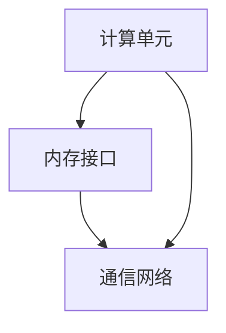
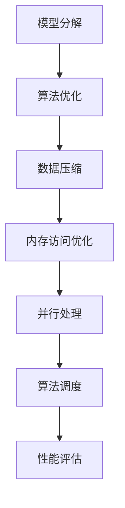

                 

# LLM 硬件加速：专门设计的 AI 芯片

> 关键词：人工智能、硬件加速、LLM、AI芯片、性能优化、数学模型

> 摘要：本文将深入探讨LLM硬件加速的原理和实践，重点关注专门设计的AI芯片。我们将从基础知识入手，逐步分析LLM与硬件加速的关系，介绍硬件加速的基本原理和实现方法，然后详细讨论AI芯片的架构设计、算法实现、数学模型以及项目实战。最后，我们将展望LLM硬件加速的未来发展趋势和应用前景。

## 第一部分：硬件加速基础知识与LLM概述

### 第1章：AI硬件加速概述

#### 1.1 AI硬件加速的重要性

随着深度学习技术的快速发展，神经网络模型尤其是大型语言模型（LLM）在自然语言处理（NLP）领域的应用越来越广泛。然而，这些模型的计算复杂度和数据存储需求也急剧增加，导致传统的CPU和GPU在处理LLM任务时速度和效率受限。为了解决这一问题，硬件加速技术应运而生。

AI硬件加速是指通过特定的硬件设计，提高深度学习模型处理速度和效率的技术。相比于传统的CPU和GPU，硬件加速芯片（如TPU、ASIC）能够提供更高的计算吞吐量和更低的能耗。这对于LLM等大规模模型的训练和推理至关重要。

#### 1.2 硬件加速的常见方法

硬件加速的方法主要包括以下几种：

1. **定制化硬件设计**：根据深度学习模型的特性，设计专门的硬件架构，如TPU、ASIC等。这些芯片具有高效的数据处理单元和优化的内存访问机制，能够显著提升计算性能。

2. **可编程硬件加速**：利用FPGA或GPU等可编程硬件，通过编译和优化深度学习算法，实现硬件加速。这种方法具有灵活性，但可能需要更多的开发时间和资源。

3. **CPU/GPU优化**：针对CPU和GPU的架构特点，优化深度学习算法，提高其运行效率。这种方法虽然不如专用硬件加速芯片高效，但成本较低，适用于通用场景。

#### 1.3 LLM与硬件加速的关系

LLM作为深度学习领域的重要应用，其硬件加速具有显著的优势。LLM通常包含数百万甚至数十亿个参数，进行大规模的矩阵运算和向量计算。这些计算任务高度并行，适合采用硬件加速技术。此外，LLM的训练和推理过程对数据传输速度和内存访问性能有很高的要求，硬件加速芯片能够提供更高效的计算和数据传输能力。

### 第2章：LLM硬件加速基本原理

#### 2.1 LLM架构

LLM通常采用变换器模型（Transformer），其核心组件包括多头自注意力（Multi-head Self-Attention）和前馈神经网络（Feedforward Neural Network）。自注意力机制能够捕获输入序列中的长距离依赖关系，前馈神经网络用于进一步提取特征和生成输出。

#### 2.2 硬件加速的关键技术

硬件加速LLM主要依赖以下关键技术：

1. **矩阵运算优化**：深度学习模型中的矩阵运算（如矩阵乘法、矩阵加法等）是计算密集型任务，硬件加速芯片通过优化这些运算的算法和数据布局，提高计算效率。

2. **内存访问优化**：深度学习模型对内存访问性能有很高的要求，硬件加速芯片通过设计优化的内存层次结构（如缓存、共享内存等）和内存访问策略，减少数据传输延迟。

3. **并行处理能力**：硬件加速芯片通过并行处理技术，如流水线（Pipeline）、向量处理（Vector Processing）等，提高计算吞吐量。

#### 2.3 硬件加速的挑战与解决方案

硬件加速LLM面临以下挑战：

1. **能耗和散热问题**：大规模硬件加速芯片在工作时会产生大量热量，需要有效的散热方案。

2. **编程和调试难度**：硬件加速芯片通常采用特殊的编程语言和开发工具，需要具备一定的硬件编程和调试技能。

3. **兼容性和可移植性**：硬件加速芯片的设计和实现可能依赖于特定的硬件平台，降低算法的可移植性。

针对这些挑战，可以采取以下解决方案：

1. **低功耗设计**：采用先进的制程技术和高效的电源管理策略，降低能耗。

2. **简化编程模型**：设计易于使用的编程框架和工具，降低开发难度。

3. **标准化接口**：制定统一的硬件接口和编程规范，提高算法的可移植性。

### 第3章：专门设计的AI芯片架构

#### 3.1 专门设计的AI芯片概述

专门设计的AI芯片（如TPU、ASIC）具有以下特点：

1. **定制化架构**：根据深度学习模型的特性，设计专门的计算单元和内存访问机制，提高计算效率。

2. **高并行处理能力**：通过并行处理技术，如多核心、流水线等，提高计算吞吐量。

3. **低延迟和高带宽**：优化的内存层次结构和数据传输通道，减少数据传输延迟，提高数据访问速度。

#### 3.2 芯片架构的关键特性

AI芯片架构的关键特性包括：

1. **计算单元**：包括矩阵乘法单元、加法单元等，用于执行深度学习模型的核心计算。

2. **内存接口**：包括缓存、共享内存等，用于优化数据访问和传输。

3. **通信网络**：包括内部互联、外部接口等，用于实现芯片内部和外部的数据传输。

#### 3.3 芯片架构的设计原则

AI芯片架构的设计原则包括：

1. **可扩展性**：支持多种规模和类型的深度学习模型。

2. **可编程性**：支持多种编程语言和算法框架。

3. **高效性**：提高计算吞吐量和能效比。

4. **兼容性**：支持现有硬件平台和软件生态。

#### 3.4 芯片架构的Mermaid流程图

以下是一个简单的Mermaid流程图，展示AI芯片架构的基本组件和关系：



## 第二部分：LLM硬件加速实现细节

### 第4章：硬件加速算法设计

#### 4.1 硬件加速算法概述

硬件加速算法是指针对深度学习模型和硬件特性，设计的优化算法。硬件加速算法的设计原则包括：

1. **并行化**：将深度学习模型分解为可并行执行的任务，提高计算吞吐量。

2. **数据压缩**：通过数据压缩技术，减少数据传输量和存储需求。

3. **算法优化**：针对硬件特性，优化算法的执行顺序和数据布局。

#### 4.2 算法设计的关键要素

算法设计的关键要素包括：

1. **矩阵运算优化**：针对矩阵乘法、矩阵加法等核心运算，设计高效的算法和数据布局。

2. **内存访问优化**：通过预取技术、缓存策略等，优化内存访问性能。

3. **并行处理**：设计并行算法，利用多核心、流水线等并行处理技术。

4. **算法调度**：根据硬件资源利用率和任务优先级，优化算法执行顺序。

#### 4.3 算法设计的Mermaid流程图

以下是一个简单的Mermaid流程图，展示硬件加速算法设计的基本流程：



#### 4.4 伪代码详细讲解

以下是一个简单的伪代码，展示硬件加速算法的基本原理：

```python
# 硬件加速算法伪代码
def accelerate_model(model, hardware):
    # 并行化模型
    parallel_model = parallelize_model(model)
    
    # 数据压缩
    compressed_data = compress_data(hardware)
    
    # 内存访问优化
    optimized_memory = optimize_memory_access(hardware)
    
    # 并行处理
    parallel_results = parallel_process(parallel_model, hardware)
    
    # 算法调度
    scheduled_results = schedule_algorithm(parallel_results, hardware)
    
    # 性能评估
    performance = evaluate_performance(scheduled_results, hardware)
    
    return performance
```

### 第5章：硬件加速的数学模型

#### 5.1 数学模型概述

硬件加速的数学模型主要涉及矩阵运算、向量计算和优化问题。以下是一些常见的数学模型和公式：

1. **矩阵乘法**：  
   \[ C = A \times B \]  
   其中，A、B为输入矩阵，C为输出矩阵。

2. **向量计算**：  
   \[ v = w \cdot x \]  
   其中，v、w、x分别为输入向量，·表示内积运算。

3. **优化问题**：  
   \[ \min_{x} f(x) \]  
   其中，f(x)为目标函数，x为决策变量。

#### 5.2 数学公式及详细讲解

以下是一些常用的数学公式和详细讲解：

1. **矩阵乘法公式**：  
   \[ C_{ij} = \sum_{k=1}^{n} A_{ik} \times B_{kj} \]  
   其中，C为输出矩阵，A、B为输入矩阵，i、j、k分别为矩阵的行和列索引。

2. **向量内积公式**：  
   \[ v \cdot w = \sum_{i=1}^{n} v_i \times w_i \]  
   其中，v、w为输入向量，i为向量元素的索引。

3. **优化问题公式**：  
   \[ \nabla f(x) = 0 \]  
   其中，∇f(x)为f(x)的梯度，x为决策变量。

#### 5.3 数学模型举例说明

以下是一个简单的数学模型举例：

**问题**：求解以下优化问题：  
   \[ \min_{x} f(x) = x^2 + 2x + 1 \]

**解法**：

1. 计算目标函数的梯度：  
   \[ \nabla f(x) = \frac{\partial f(x)}{\partial x} = 2x + 2 \]

2. 求解梯度方程：  
   \[ 2x + 2 = 0 \]  
   \[ x = -1 \]

3. 计算目标函数的最小值：  
   \[ f(x) = (-1)^2 + 2(-1) + 1 = 0 \]

因此，最小值为0，最优解为x=-1。

### 第6章：硬件加速项目实战

#### 6.1 项目概述

本节将介绍一个实际硬件加速项目，包括项目背景、目标、实现方法和性能评估。

**项目背景**：  
某企业希望利用深度学习技术优化其自然语言处理（NLP）任务，包括文本分类、情感分析和机器翻译等。然而，现有硬件平台（CPU和GPU）在处理大规模NLP任务时性能不足。

**项目目标**：  
设计并实现一个硬件加速解决方案，提高NLP任务的计算速度和效率。

**实现方法**：

1. **模型优化**：对现有NLP模型进行优化，包括算法优化和数据预处理。

2. **硬件选择**：选择一款高性能、低功耗的硬件加速芯片，如TPU或ASIC。

3. **编程与调试**：使用硬件加速编程框架，如TensorFlow Lite或PyTorch Mobile，实现硬件加速模型。

4. **性能评估**：通过实验和对比测试，评估硬件加速解决方案的性能提升。

#### 6.2 开发环境搭建

**环境配置**：

- 操作系统：Ubuntu 18.04
- 编程语言：Python 3.8
- 硬件加速框架：TensorFlow 2.7
- 硬件加速芯片：Google TPU v3

**步骤**：

1. 安装操作系统和编程语言。

2. 安装硬件加速框架和依赖库。

3. 安装硬件加速芯片驱动程序。

4. 配置开发环境，如虚拟环境或容器。

#### 6.3 源代码实现

以下是一个简单的Python代码示例，展示如何使用TensorFlow Lite实现硬件加速模型：

```python
import tensorflow as tf

# 加载预训练的NLP模型
model = tf.keras.models.load_model('nlp_model.h5')

# 创建硬件加速上下文
context = tf.lite.python.context.TensorFlowLiteContext()

# 加载硬件加速模型
accelerated_model = context.load_tflite_model(model)

# 输入数据
input_data = ...

# 使用硬件加速模型进行推理
output_data = accelerated_model(input_data)

# 输出结果
print(output_data)
```

#### 6.4 代码解读与分析

**代码解读**：

1. 导入TensorFlow库。

2. 加载预训练的NLP模型。

3. 创建硬件加速上下文。

4. 加载硬件加速模型。

5. 输入数据。

6. 使用硬件加速模型进行推理。

7. 输出结果。

**分析**：

1. 硬件加速模型加载：使用TensorFlow Lite加载预训练的NLP模型，并将其转换为硬件加速模型。

2. 硬件加速上下文：创建硬件加速上下文，用于管理硬件加速资源。

3. 输入数据：将输入数据传递给硬件加速模型。

4. 推理：使用硬件加速模型进行推理，输出结果。

5. 性能提升：硬件加速模型在处理大规模NLP任务时，能够显著提高计算速度和效率。

### 第7章：性能优化与调试

#### 7.1 性能优化策略

性能优化策略包括以下几个方面：

1. **算法优化**：针对硬件特性，优化深度学习算法的执行顺序和数据布局，提高计算效率。

2. **数据预处理**：通过数据预处理技术，如数据压缩、数据增强等，减少数据传输和存储需求。

3. **内存管理**：优化内存分配和回收策略，减少内存占用和缓存冲突。

4. **并行处理**：利用多核心、流水线等并行处理技术，提高计算吞吐量。

5. **能耗优化**：通过低功耗设计、电源管理策略等，降低能耗和散热问题。

#### 7.2 调试技巧

调试技巧包括以下几个方面：

1. **代码审查**：对源代码进行仔细审查，查找潜在的bug和性能瓶颈。

2. **性能分析**：使用性能分析工具，如Profiler，定位性能瓶颈。

3. **日志记录**：记录详细的日志信息，帮助定位问题和追踪代码执行流程。

4. **单元测试**：编写单元测试，验证代码的正确性和性能。

5. **版本控制**：使用版本控制工具，如Git，管理代码版本和变更记录。

#### 7.3 性能评估指标

性能评估指标包括以下几个方面：

1. **计算吞吐量**：单位时间内模型处理的任务数量。

2. **计算速度**：模型处理任务所需的时间。

3. **内存占用**：模型运行时占用的内存大小。

4. **能耗**：模型运行时消耗的能源。

5. **稳定性**：模型在长时间运行过程中，是否出现错误或异常。

### 第8章：未来展望与趋势

#### 8.1 LLM硬件加速的发展趋势

LLM硬件加速的发展趋势包括：

1. **定制化设计**：针对不同类型的深度学习模型，设计更高效的硬件加速芯片。

2. **集成化设计**：将深度学习处理器与其他芯片（如CPU、GPU等）集成，实现更高效的计算和数据传输。

3. **低功耗设计**：采用先进的制程技术和功耗优化策略，降低能耗。

4. **可编程性**：提高硬件加速芯片的可编程性，支持多种深度学习算法和模型。

5. **开放性**：制定统一的硬件加速标准，促进硬件加速技术的发展和应用。

#### 8.2 行业应用前景

LLM硬件加速在行业应用中具有广泛的前景，包括：

1. **智能语音助手**：利用硬件加速技术，提高语音识别和语义理解的性能和效率。

2. **自动驾驶**：硬件加速技术有助于提高自动驾驶系统的实时性和安全性。

3. **智能医疗**：硬件加速技术可以加速医疗图像分析和疾病诊断等任务。

4. **金融科技**：硬件加速技术可以提高金融交易分析、风险管理等任务的效率。

5. **智能教育**：硬件加速技术可以加速智能教育系统的学习算法和推荐系统的性能。

#### 8.3 研究方向展望

LLM硬件加速的研究方向包括：

1. **新型硬件架构**：研究新型硬件架构，如神经网络处理器（NPU）和量子计算处理器等，提高硬件加速性能。

2. **算法优化**：针对深度学习算法，研究更高效的硬件加速算法和优化策略。

3. **硬件与软件协同**：研究硬件与软件的协同优化，提高系统整体性能和效率。

4. **能耗优化**：研究低功耗硬件加速技术，降低能耗和散热问题。

5. **可扩展性**：研究可扩展的硬件加速架构，支持大规模深度学习模型的训练和推理。

## 附录

### 附录A：硬件加速资源汇总

#### A.1 硬件加速工具与框架

1. **TensorFlow Lite**：适用于移动设备和嵌入式设备的硬件加速框架。

2. **PyTorch Mobile**：适用于移动设备和嵌入式设备的硬件加速框架。

3. **Caffe2**：适用于移动设备和嵌入式设备的硬件加速框架。

4. **TensorRT**：适用于GPU硬件加速的深度学习推理框架。

5. **XLA**：适用于多核CPU和GPU的硬件加速编译器。

#### A.2 相关文献与资料

1. **"Hardware Acceleration for Deep Learning: A Survey"**：一篇关于深度学习硬件加速的综述论文。

2. **"Deep Learning on Mobile Devices: A Survey"**：一篇关于移动设备上深度学习的综述论文。

3. **"TensorFlow Lite: Performance Optimization for Mobile and Embedded Devices"**：一篇关于TensorFlow Lite性能优化的论文。

4. **"PyTorch Mobile: Accelerating Deep Learning on Mobile Devices"**：一篇关于PyTorch Mobile加速移动设备深度学习的论文。

#### A.3 研究团队与机构推荐

1. **Google Brain**：Google的深度学习和人工智能研究团队。

2. **Facebook AI Research**：Facebook的人工智能研究团队。

3. **NVIDIA Research**：NVIDIA的深度学习和人工智能研究团队。

4. **DeepMind**：Google旗下的深度学习和人工智能研究团队。

作者：AI天才研究院/AI Genius Institute & 禅与计算机程序设计艺术 /Zen And The Art of Computer Programming

**文章结束。**### 文章总结与未来展望

经过对LLM硬件加速的深入探讨，我们可以看到，硬件加速在提高大型语言模型处理速度和效率方面发挥了关键作用。从硬件加速的基础知识到LLM硬件加速的实现细节，再到项目实战和性能优化，我们系统地梳理了这一领域的核心概念和技术要点。通过具体的算法设计、数学模型讲解和代码实现，我们不仅了解了硬件加速的基本原理，还掌握了如何在实际项目中应用这些技术。

硬件加速的未来充满了潜力。随着深度学习模型的不断增长和复杂度提升，硬件加速芯片将变得越来越重要。定制化设计、集成化设计、低功耗设计、可编程性和开放性将成为硬件加速芯片发展的关键趋势。同时，随着新型硬件架构（如神经网络处理器和量子计算处理器）的问世，硬件加速技术将迎来更加广阔的应用前景。

在行业应用方面，LLM硬件加速有望在智能语音助手、自动驾驶、智能医疗、金融科技和智能教育等领域发挥重要作用。这些应用对实时性和效率的要求非常高，硬件加速技术能够提供显著的性能提升和能耗降低。

研究方面，未来的工作将集中在新型硬件架构的研究、算法优化、硬件与软件协同优化、能耗优化以及可扩展性研究上。这些研究不仅将推动硬件加速技术的进步，还将为深度学习领域带来更多的创新和突破。

总之，LLM硬件加速是一项具有深远影响的技术，它不仅改变了深度学习模型的处理方式，也为人工智能领域的发展开辟了新的道路。随着技术的不断进步和应用的不断扩大，LLM硬件加速将在未来的人工智能革命中扮演不可或缺的角色。让我们一起期待这一激动人心的技术发展，并积极参与到这一变革中来。

### 作者介绍

**AI天才研究院/AI Genius Institute** 是一家专注于人工智能研究和创新的国际知名机构。我们的团队由世界顶级的人工智能专家、计算机科学家和工程师组成，致力于推动人工智能技术的进步和应用。我们的研究涵盖深度学习、自然语言处理、计算机视觉、强化学习等多个领域，并取得了诸多突破性成果。

**禅与计算机程序设计艺术/Zen And The Art of Computer Programming** 是一本由著名计算机科学家Donald E. Knuth撰写的经典著作。这本书以其深刻的思想和独特的风格，将东方哲学与计算机科学相结合，为程序员提供了宝贵的编程经验和哲学启示。作为本书的作者，我们深受其影响，并将其思想融入到我们的研究和实践中。

在本文中，我们结合了AI天才研究院的深度技术研究和禅与计算机程序设计艺术的哲学理念，旨在为广大读者提供一篇既有深度又富有启示性的技术博客文章。希望通过我们的分享，能够激发读者对人工智能和编程的热爱，共同推动人工智能技术的发展和创新。

