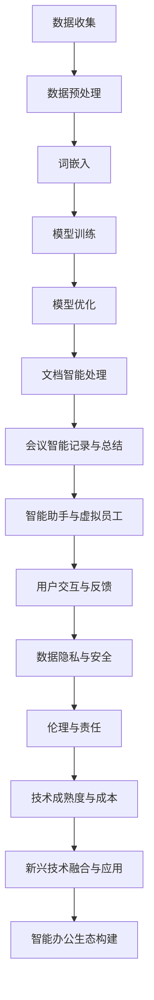

                 

# 《LLM与智能办公：提升工作效率》

> 关键词：语言模型（LLM）、智能办公、工作效率、自然语言处理、智能助手、虚拟员工

> 摘要：本文探讨了语言模型（LLM）在智能办公中的应用，分析了LLM技术的原理和基础，以及LLM如何通过文档智能处理、会议智能记录与总结、智能助手与虚拟员工的实现，显著提升工作效率。文章还探讨了智能办公面临的挑战和未来的发展趋势。

## 第1章 LLM与智能办公概述

### 1.1 LLM与智能办公的定义与重要性

#### 1.1.1 语言模型（LLM）的原理与演变

语言模型（Language Model，简称LLM）是一种用于预测文本序列的算法。它通过学习大量语言数据，理解语言结构，从而生成或理解自然语言文本。LLM的发展经历了从统计模型到神经网络模型，再到深度学习模型的演变过程。

早期的统计模型如N-gram模型，通过计算单词序列的联合概率来进行文本生成。随着计算能力的提升和神经网络技术的发展，神经网络模型如长短期记忆网络（LSTM）和变换器（Transformer）逐渐成为主流。Transformer模型引入了自注意力机制，使得LLM在处理长文本和复杂语言结构方面表现出了强大的能力。

#### 1.1.2 智能办公的概念与趋势

智能办公是指利用人工智能技术，如语言模型、自然语言处理、机器学习等，自动化和智能化办公流程，提高工作效率和办公体验。随着人工智能技术的不断进步，智能办公正逐渐成为办公模式的主流趋势。

智能办公的典型特征包括自动化文档处理、智能会议记录与总结、智能助手与虚拟员工的实现等。这些技术的应用不仅提高了工作效率，还减少了人为错误，提升了办公质量和效率。

#### 1.1.3 LLM在智能办公中的应用潜力

LLM在智能办公中具有广泛的应用潜力。首先，LLM可以通过自然语言处理技术，自动化处理大量文档，如文档分类、主题建模、文本摘要等。其次，LLM可以用于智能会议记录与总结，准确捕捉会议内容，生成会议总结报告。最后，LLM还可以用于实现智能助手和虚拟员工，为用户提供个性化服务，如任务提醒、日程安排、信息检索等。

总的来说，LLM在智能办公中的应用前景广阔，有望显著提升工作效率和办公体验。在接下来的章节中，我们将深入探讨LLM的技术基础和应用实践。

### 1.2 智能办公与工作效率的提升

#### 1.2.1 工作效率的定义与评估

工作效率是指个体或团队在单位时间内完成的工作量。它可以从多个维度进行评估，如完成任务的速度、准确度、创新性等。在传统的办公模式中，工作效率受限于人力和资源的限制，容易受到各种因素的影响。

#### 1.2.2 传统办公模式与智能办公的差异

传统办公模式依赖于手工操作和纸质文档，工作效率较低，且容易出现人为错误。而智能办公通过自动化和智能化技术，实现了办公流程的优化和效率的提升。具体差异如下：

1. **文档处理**：传统办公模式中，文档处理主要依靠手工操作，如复制、粘贴、OCR识别等。而智能办公通过LLM等自然语言处理技术，实现了文档的自动化分类、主题建模、文本摘要等。

2. **会议管理**：传统办公模式中，会议记录和总结主要依靠人工记录和手动整理。而智能办公通过LLM技术，可以实现会议内容的自动记录、理解和总结。

3. **任务管理**：传统办公模式中，任务管理主要依靠手工记录和口头传达。而智能办公通过智能助手和虚拟员工，实现了任务的自动化分配、进度监控和反馈。

#### 1.2.3 LLM在提高工作效率中的应用场景

LLM在提高工作效率方面具有广泛的应用场景，以下是几个典型应用：

1. **文档智能处理**：LLM可以通过文档分类、主题建模、文本摘要等技术，自动化处理大量文档，提高文档处理效率。

2. **会议智能记录与总结**：LLM可以自动记录会议内容，提取关键信息，生成会议总结报告，节省会议记录和总结的时间。

3. **智能助手与虚拟员工**：LLM可以实现智能助手和虚拟员工的实现，为用户提供个性化服务，如任务提醒、日程安排、信息检索等，提高工作效率。

总的来说，LLM在智能办公中的应用，有助于实现办公流程的自动化和智能化，显著提升工作效率。在接下来的章节中，我们将进一步探讨LLM的技术基础和应用实践。

## 第2章 LLM技术基础

### 2.1 自然语言处理技术概览

自然语言处理（Natural Language Processing，简称NLP）是计算机科学和人工智能领域的一个重要分支，旨在使计算机能够理解和处理人类语言。LLM作为NLP的核心技术之一，其发展离不开以下几个关键技术的支持。

#### 2.1.1 词嵌入技术

词嵌入（Word Embedding）是将文本中的单词映射到高维向量空间的技术。通过词嵌入，单词之间的语义关系可以被量化，从而实现文本数据的数值化表示。词嵌入技术的核心包括：

1. **基本概念**：词嵌入是将单词映射到低维向量空间的过程，使得具有相似语义的单词在向量空间中靠近。例如，“狗”和“猫”在向量空间中应该靠近。

2. **方法与应用**：常见的词嵌入方法包括Word2Vec、GloVe和FastText等。这些方法通过学习单词在文本中的上下文信息，生成高质量的词向量表示。词嵌入技术在文本分类、情感分析、信息检索等领域有着广泛的应用。

#### 2.1.2 序列模型与注意力机制

序列模型（Sequence Model）是处理序列数据的模型，如自然语言文本。它们能够捕捉序列中的时间依赖关系。注意力机制（Attention Mechanism）是序列模型中的一个关键组件，它能够使模型更加关注序列中的重要部分，从而提高模型的性能。

1. **序列模型的基本原理**：常见的序列模型包括循环神经网络（RNN）和其变体，如长短期记忆网络（LSTM）和门控循环单元（GRU）。这些模型通过隐藏状态来捕捉序列中的时间依赖关系。

2. **注意力机制详解**：注意力机制通过为序列中的每个元素分配一个权重，使得模型能够关注重要部分。自注意力（Self-Attention）机制是Transformer模型的核心组件，它通过计算序列中每个元素之间的相似性来生成新的表示。

3. **注意力机制的应用案例**：注意力机制在机器翻译、文本摘要和问答系统等应用中表现出了强大的能力。例如，在机器翻译中，注意力机制可以使得模型在翻译过程中关注原文中的关键部分，从而提高翻译质量。

通过自然语言处理技术的支持，LLM能够实现对自然语言文本的深入理解和处理。在接下来的章节中，我们将进一步探讨LLM的构建与优化技术。

### 2.2 LLM的构建与优化

构建一个高效的LLM不仅需要选择合适的模型架构，还需要在数据预处理、模型训练和调优等方面进行精细操作。以下是一些关键步骤和技巧。

#### 2.2.1 语言模型的构建流程

1. **数据预处理**：数据预处理是构建LLM的第一步，包括数据清洗、去噪和分词等。高质量的预处理可以显著提升模型的性能。常用的预处理方法包括：

   - **文本清洗**：去除文本中的标点符号、停用词和特殊字符。
   - **分词**：将文本分割成单词或子词。常见的分词方法包括词性标注和词形还原等。
   - **词嵌入**：将分词后的文本转换为词向量表示。常用的词嵌入方法包括Word2Vec、GloVe和BERT等。

2. **模型架构选择**：选择适合的模型架构是构建LLM的关键。目前，主流的LLM模型架构包括：

   - **RNN**：如LSTM和GRU，适用于处理长序列数据。
   - **Transformer**：如BERT和GPT，通过自注意力机制处理序列数据，具有强大的表征能力。
   - **混合模型**：结合了RNN和Transformer的优点，如BERT模型。

3. **模型训练与调优**：模型训练是通过优化模型参数，使其在训练数据上达到最佳性能的过程。训练和调优的关键步骤包括：

   - **损失函数**：选择合适的损失函数，如交叉熵损失函数，用于衡量模型预测与真实标签之间的差异。
   - **优化算法**：选择适合的优化算法，如Adam优化器，用于更新模型参数。
   - **正则化策略**：如Dropout、L2正则化等，用于防止过拟合。

#### 2.2.2 优化方法与技巧

1. **梯度下降算法**：梯度下降算法是一种常用的优化算法，用于更新模型参数，使其在损失函数上取得最小值。

2. **梯度裁剪技术**：梯度裁剪技术通过限制梯度的大小，防止梯度爆炸和消失，从而提高训练稳定性。

3. **正则化策略**：正则化策略如Dropout和L2正则化，可以防止模型过拟合，提高泛化能力。

通过上述构建和优化步骤，可以构建一个高效、准确的LLM。在接下来的章节中，我们将探讨LLM在智能办公中的具体应用。

### 2.3 LLM的优化策略

优化LLM的性能是构建高效智能办公系统的重要步骤。以下是几种常见的优化策略：

#### 2.3.1 梯度裁剪技术

梯度裁剪技术通过限制梯度的最大值，防止梯度爆炸和消失，从而提高训练稳定性。具体方法如下：

1. **梯度裁剪原理**：在反向传播过程中，将梯度的每个元素裁剪到指定范围。例如，将梯度裁剪到[0, 1]之间，防止梯度值过大或过小。

2. **实现方法**：在优化器中添加梯度裁剪功能，例如在TensorFlow中使用`tf.keras.optimizers.schedules.CutoffSchedule`。

#### 2.3.2 梯度下降算法

梯度下降算法是一种基本的优化算法，用于更新模型参数。以下是几种常见的梯度下降算法：

1. **Stochastic Gradient Descent（SGD）**：随机梯度下降是在每次更新参数时使用一个样本的梯度。优点是计算速度快，但容易陷入局部最小值。

2. **Adam优化器**：Adam优化器结合了SGD和Momentum方法，能够自适应地调整学习率。它通过计算一阶矩估计和二阶矩估计来更新参数，具有较好的收敛性和稳定性。

#### 2.3.3 正则化策略

正则化策略用于防止模型过拟合，提高泛化能力。以下是几种常见的正则化策略：

1. **Dropout**：Dropout是一种在训练过程中随机丢弃一部分神经元的方法，防止神经元之间形成强依赖关系，提高模型的泛化能力。

2. **L2正则化**：L2正则化通过在损失函数中添加L2范数项，惩罚模型参数的平方和，防止模型参数过大，提高模型的泛化能力。

通过上述优化策略，可以有效提升LLM的性能，为智能办公系统提供更准确的预测和更高效的执行能力。在接下来的章节中，我们将探讨LLM在文档智能处理、会议智能记录与总结、智能助手与虚拟员工等应用中的具体实践。

## 第3章 LLM在智能办公中的应用

### 3.1 文档智能处理

文档智能处理是智能办公的重要组成部分，它利用LLM技术，自动化和智能化地处理各种文档，从而提高办公效率和准确性。以下是文档智能处理中的几个关键技术。

#### 3.1.1 文档分类与主题建模

文档分类与主题建模是文档智能处理的基础。它们通过LLM技术，对文档进行分类和主题识别，从而实现文档的高效管理和检索。

1. **文档分类算法**：文档分类算法通过学习大量已标注的文档数据，将新文档分类到预定义的类别中。常见的文档分类算法包括：

   - **朴素贝叶斯分类器**：基于贝叶斯定理，通过计算文档中各个类别的概率进行分类。
   - **支持向量机（SVM）**：通过最大化分类边界来分类文档。
   - **深度神经网络（DNN）**：使用多层感知机（MLP）进行分类。

2. **主题建模方法**：主题建模是通过分析文档内容，识别出文档背后的主题或主题集合。常见的主题建模方法包括：

   - **潜在狄利克雷分配（LDA）**：通过概率模型来识别文档主题。
   - **非负矩阵分解（NMF）**：通过分解文档-词矩阵来提取主题。

#### 3.1.2 文本摘要与提取

文本摘要与提取是将长文档压缩为简洁、准确的摘要或提取关键信息的过程，对于信息密集型工作尤其有用。

1. **文本摘要技术**：文本摘要可以分为抽取式摘要和生成式摘要。

   - **抽取式摘要**：从文档中提取关键句子或短语，形成摘要。
   - **生成式摘要**：通过生成新的文本摘要，通常使用序列到序列（Seq2Seq）模型。

   常见的文本摘要算法包括：

   - **基于规则的方法**：通过预定义的规则和模板来生成摘要。
   - **基于统计的方法**：使用统计模型，如TextRank，来生成摘要。
   - **基于神经网络的方法**：使用编码器-解码器（Encoder-Decoder）模型来生成摘要。

2. **文本提取应用案例**：文本提取在新闻摘要、法律文档审查、医疗报告分析等领域有广泛应用。例如，在新闻摘要中，可以自动提取新闻文章的核心内容；在法律文档审查中，可以自动提取案件的关键条款。

通过文档分类、主题建模、文本摘要与提取等技术的应用，LLM能够显著提高文档处理的效率和质量，为智能办公提供强有力的支持。在接下来的章节中，我们将进一步探讨LLM在会议智能记录与总结中的应用。

### 3.2 会议智能记录与总结

会议智能记录与总结是智能办公的重要组成部分，它利用LLM技术，自动捕捉会议内容，生成详细的会议记录和总结报告，从而提高会议效率和效果。

#### 3.2.1 会议记录与内容理解

会议记录是会议智能处理的第一步，它涉及到对会议内容的捕捉和理解。以下是实现会议记录与内容理解的关键技术：

1. **语音识别技术**：语音识别（Automatic Speech Recognition，简称ASR）是将语音信号转换为文本的技术。通过ASR，可以将会议中的口头发言转换为文本记录。

2. **实时转写**：实时转写技术可以在会议进行时，实时地将语音转换为文本，从而实现会议记录的实时生成。

3. **内容理解技术**：内容理解技术通过自然语言处理（NLP）技术，对会议文本进行深入分析，提取关键信息。常用的内容理解技术包括：

   - **命名实体识别（Named Entity Recognition，简称NER）**：识别文本中的特定实体，如人名、地点、组织等。
   - **关系抽取（Relation Extraction）**：识别文本中实体之间的关系，如“某人提出了某个观点”。
   - **情感分析（Sentiment Analysis）**：分析文本的情感倾向，如正面、负面或中性。

通过语音识别、实时转写和内容理解技术的结合，可以实现对会议内容的全面捕捉和理解，为会议记录与总结提供坚实基础。

#### 3.2.2 会议总结与报告生成

会议总结与报告生成是将会议内容转化为简洁、准确的报告的过程。以下是实现会议总结与报告生成的主要技术：

1. **文本摘要技术**：使用文本摘要技术，可以自动提取会议中的关键信息，形成会议摘要。生成式摘要技术，如编码器-解码器（Encoder-Decoder）模型，可以有效生成高质量的会议摘要。

2. **报告生成技术**：报告生成技术是将会议摘要扩展为完整报告的过程。常见的报告生成方法包括：

   - **基于模板的方法**：使用预定义的模板，将会议摘要填充到模板中，生成报告。
   - **基于规则的方法**：通过预定义的规则，自动生成报告。例如，将会议中的关键观点、决策和任务整理成报告。
   - **基于机器学习的方法**：使用机器学习方法，如序列到序列（Seq2Seq）模型，自动生成会议报告。

通过会议记录与内容理解、会议总结与报告生成等技术的应用，LLM可以自动处理会议内容，生成详细、准确的会议记录和报告，从而提高会议效率和效果。在接下来的章节中，我们将探讨智能助手与虚拟员工的实现。

### 3.3 智能助手与虚拟员工

智能助手与虚拟员工是智能办公的重要应用，它们利用LLM技术，为用户提供个性化服务，从而提高工作效率和办公体验。以下是智能助手与虚拟员工的关键技术和实现方法。

#### 3.3.1 智能助手的架构设计

智能助手通常由多个模块组成，包括对话管理模块、知识服务模块和用户交互模块。以下是这些模块的详细描述：

1. **对话管理模块**：对话管理模块负责管理用户与智能助手的交互流程。它包括：

   - **意图识别**：通过自然语言处理（NLP）技术，识别用户的意图。例如，识别用户是否需要查询信息、执行任务或进行闲聊。
   - **对话状态追踪**：记录对话历史和上下文，以便在后续交互中保持一致性。
   - **响应生成**：根据用户的意图和对话状态，生成合适的响应。常见的响应生成方法包括模板匹配和生成式对话系统。

2. **知识服务模块**：知识服务模块负责提供用户所需的信息和服务。它包括：

   - **信息检索**：通过搜索引擎或数据库，快速检索用户所需的信息。
   - **任务执行**：根据用户的指令，自动执行特定的任务，如发送邮件、安排会议或创建日程。
   - **知识库管理**：维护和更新智能助手的知识库，确保提供的信息和服务的准确性。

3. **用户交互模块**：用户交互模块负责与用户进行交互，提供友好的用户界面。它包括：

   - **语音交互**：使用语音识别和语音合成技术，实现语音交互。
   - **文本交互**：通过文本聊天窗口，实现文本交互。
   - **多模态交互**：结合语音、文本和图像等多种交互方式，提供更丰富的交互体验。

#### 3.3.2 虚拟员工的开发与应用

虚拟员工是一种能够执行特定任务的智能系统，它通常基于LLM技术，模拟人类工作流程，提供高效、准确的办公支持。以下是虚拟员工的关键技术和实现方法：

1. **任务分配与调度**：虚拟员工需要能够根据用户需求和工作流程，自动分配和调度任务。关键技术包括：

   - **任务分解**：将复杂任务分解为子任务，以便于虚拟员工处理。
   - **优先级排序**：根据任务的紧急程度和重要性，对任务进行优先级排序。
   - **调度算法**：选择合适的调度算法，如最短作业优先（SJF）或最短剩余时间优先（SRTF），以优化任务执行。

2. **工作进度监控与反馈**：虚拟员工需要能够实时监控任务执行进度，并提供反馈。关键技术包括：

   - **进度追踪**：记录任务执行的每个阶段和时间点，以便于监控。
   - **异常检测**：识别任务执行中的异常情况，如进度滞后或错误发生。
   - **反馈机制**：根据监控结果，向用户或相关方提供反馈，以便于及时调整和优化。

3. **工作成果评估与优化**：虚拟员工需要能够评估自身的工作成果，并不断优化。关键技术包括：

   - **结果评估**：根据预定的评估标准，评估任务执行的结果。
   - **性能优化**：根据评估结果，调整任务执行策略，提高工作效率和质量。
   - **反馈循环**：将评估结果和优化策略反馈到系统中，形成闭环控制。

通过智能助手与虚拟员工的实现，LLM可以显著提高工作效率和办公体验。在接下来的章节中，我们将探讨智能办公面临的挑战和未来的发展趋势。

## 第4章 智能办公的挑战与未来发展

### 4.1 智能办公的挑战

尽管智能办公具有显著的优势，但在实际应用过程中仍面临一系列挑战。以下是智能办公的主要挑战及其应对策略。

#### 4.1.1 数据隐私与安全问题

智能办公依赖于大量的数据收集和处理，涉及用户个人信息和企业敏感数据。数据隐私与安全问题成为智能办公推广的主要障碍。

**挑战：** 数据泄露、滥用和非法获取可能导致严重后果，如个人隐私侵犯、企业信息泄露等。

**应对策略：** 

- **数据加密**：对敏感数据进行加密，确保数据在传输和存储过程中的安全性。
- **访问控制**：实施严格的访问控制策略，确保只有授权人员可以访问敏感数据。
- **数据匿名化**：对敏感数据进行匿名化处理，减少数据泄露的风险。

#### 4.1.2 智能办公伦理与责任

智能办公技术的广泛应用引发了伦理和法律问题，如自动化决策的公平性、透明度等。

**挑战：** 

- **算法偏见**：智能系统可能因为训练数据的不公平性而产生偏见。
- **责任归属**：当智能系统出现错误时，责任归属问题难以界定。

**应对策略：**

- **算法公平性**：确保算法设计过程中避免偏见，通过多样化的训练数据来提升模型的公平性。
- **透明性和可解释性**：提高智能系统的透明度，让用户了解系统的决策过程。
- **法律法规**：制定相关法律法规，明确智能系统的责任归属，保护用户权益。

#### 4.1.3 技术成熟度与成本问题

智能办公技术的成熟度和成本也是推广应用的障碍。

**挑战：** 

- **技术成熟度**：部分智能技术尚未达到成熟阶段，性能和稳定性有待提升。
- **成本问题**：智能系统的开发、部署和维护成本较高，对中小企业构成负担。

**应对策略：**

- **技术研发**：加大技术研发投入，提高智能办公技术的成熟度和性能。
- **成本优化**：通过规模化生产和创新模式降低智能系统的成本，使其更具竞争力。

### 4.2 智能办公的未来发展趋势

智能办公的发展前景广阔，随着技术的不断进步，预计将出现以下几大趋势。

#### 4.2.1 新兴技术的融合与应用

未来，智能办公将进一步融合多种新兴技术，如物联网（IoT）、增强现实（AR）、虚拟现实（VR）等，实现更高效、更智能的办公体验。

**趋势：** 

- **物联网与智能办公融合**：通过物联网设备，实现办公环境中的智能化监控和管理。
- **AR/VR在办公中的应用**：利用AR/VR技术，提供沉浸式办公体验，提升工作效率和员工满意度。

#### 4.2.2 智能办公生态的构建

智能办公不仅仅是单个技术的应用，而是涉及到整个生态系统的建设。未来，预计将出现更多的合作与共赢模式，构建智能办公生态。

**趋势：** 

- **产业链合作**：硬件制造商、软件开发商、技术服务提供商等产业链上下游企业将加强合作，共同推动智能办公技术的发展。
- **开放平台与生态**：建设开放的平台和生态，促进技术创新和应用推广。

#### 4.2.3 智能办公的个性化和定制化

随着智能技术的不断发展，智能办公将更加注重个性化和定制化，满足不同用户的需求。

**趋势：** 

- **个性化服务**：通过大数据和人工智能技术，为用户提供定制化的办公解决方案。
- **定制化场景**：根据不同行业的特定需求，开发定制化的智能办公应用场景。

总的来说，智能办公面临的挑战和未来的发展趋势交织在一起，推动着智能办公的不断进步。只有在应对挑战的同时，抓住发展趋势，才能实现智能办公的全面发展。在接下来的章节中，我们将总结本文的关键点，并推荐相关的开发工具与资源。

## 附录

### 附录 A LLM开发工具与资源

#### A.1 主流LLM框架介绍

在构建LLM的过程中，选择合适的开发框架至关重要。以下介绍几个主流的LLM框架及其特点：

##### A.1.1 TensorFlow

TensorFlow是由Google开发的开源机器学习框架，广泛应用于深度学习和自然语言处理。TensorFlow提供了丰富的API和工具，支持从数据预处理到模型训练和部署的完整流程。

- **优点**：强大的社区支持，丰富的预训练模型，灵活的架构设计。
- **使用场景**：适用于复杂的NLP任务，如文本分类、序列生成等。

##### A.1.2 PyTorch

PyTorch是另一个流行的开源机器学习框架，由Facebook开发。PyTorch以其动态计算图和直观的API而著称，适合快速原型开发和研究。

- **优点**：易于使用，动态计算图支持，强大的研究社区。
- **使用场景**：适用于研究和原型开发，尤其是在需要灵活性的情况下。

##### A.1.3 其他框架简介

除了TensorFlow和PyTorch，还有一些其他流行的框架，如：

- **MXNet**：由Apache基金会维护，支持多种编程语言，适合大规模分布式训练。
- **Keras**：是一个高层神经网络API，兼容TensorFlow和Theano，适合快速原型开发。

#### A.2 LLM开发资源推荐

以下是几个推荐的LLM开发资源，包括教程、论文、报告和社区：

##### A.2.1 教程与课程

- **《自然语言处理与深度学习》**：吴恩达的在线课程，介绍了NLP和深度学习的基础知识。
- **《深度学习专项课程》**：斯坦福大学的在线课程，包括深度学习在NLP中的应用。

##### A.2.2 论文与报告

- **《BERT：Pre-training of Deep Bidirectional Transformers for Language Understanding》**：Google团队提出的BERT模型，是当前NLP领域的代表性工作。
- **《GPT-3: Language Models are few-shot learners》**：OpenAI提出的GPT-3模型，展示了大规模预训练模型在零样本学习方面的潜力。

##### A.2.3 社区与论坛

- **斯坦福NLP组论坛**：提供了丰富的NLP资源，包括论文、代码和实践经验。
- **Reddit NLP论坛**：一个活跃的NLP社区，讨论最新的研究进展和问题。

通过使用上述工具和资源，开发者可以更好地构建和优化LLM，为智能办公提供强有力的技术支持。在未来的发展中，这些工具和资源将继续发挥重要作用，推动智能办公的不断进步。

### 附录 B：LLM与智能办公技术的 Mermaid 流程图

以下是LLM与智能办公技术的Mermaid流程图，帮助读者更直观地理解LLM在智能办公中的应用流程。



### 附录 C：核心算法原理讲解与伪代码

以下是LLM核心算法原理的讲解和伪代码示例，帮助读者深入理解算法的实现细节。

#### 2.2.1 梯度下降算法

**原理讲解：**
梯度下降算法是一种优化算法，用于在损失函数上找到最小值。它通过计算损失函数关于模型参数的梯度，并沿着梯度的反方向更新参数，从而逐步减小损失。

**伪代码：**
```
function gradient_descent(model, learning_rate, epochs):
    for epoch in 1 to epochs:
        for each batch in training_data:
            predict = model.forward(batch)
            loss = loss_function(predict, batch.target)
            gradient = model.backward(loss)
            model.update_parameters(gradient, learning_rate)
    return model
```

#### 2.2.2 梯度裁剪技术

**原理讲解：**
梯度裁剪技术通过限制梯度的最大值，防止梯度爆炸和消失，从而提高训练的稳定性。常见的方法是设置一个阈值，将超过阈值的梯度裁剪到阈值。

**伪代码：**
```
function gradient_clipping(model, threshold):
    gradients = model.get_gradients()
    for param, grad in gradients.items():
        if abs(grad) > threshold:
            grad = sign(grad) * threshold
    model.update_parameters(gradients)
```

#### 2.2.3 正则化策略

**原理讲解：**
正则化策略用于防止模型过拟合，提高泛化能力。常见的正则化方法包括L2正则化和Dropout。

- **L2正则化**：在损失函数中添加L2范数项，惩罚模型参数的平方和。
- **Dropout**：在训练过程中，随机丢弃一部分神经元，防止神经元之间形成强依赖。

**伪代码：**
```
function l2_regularization(loss, model, lambda):
    l2_loss = 0
    for param in model.parameters():
        l2_loss += lambda * sum(param^2)
    return loss + l2_loss

function dropout(model, dropout_rate):
    for layer in model.layers():
        if isinstance(layer, DropoutLayer):
            layer.activate(dropout_rate)
```

通过上述伪代码示例，读者可以更直观地理解LLM核心算法的实现过程，为实际应用提供参考。

### 附录 D：项目实战案例与代码解读

在本节中，我们将通过一个实际的智能办公项目案例，展示如何使用LLM技术实现文档智能处理、会议智能记录与总结以及智能助手与虚拟员工的开发。以下是项目的开发环境搭建、源代码实现和代码解读。

#### D.1 开发环境搭建

为了构建智能办公系统，我们需要以下开发环境和工具：

- **编程语言**：Python
- **深度学习框架**：TensorFlow或PyTorch
- **文本处理库**：NLTK或spaCy
- **操作系统**：Linux或Mac OS

首先，确保系统安装了Python和相应的深度学习框架。然后，通过pip安装其他必要的库：

```
pip install tensorflow
pip install nltk
pip install spacy
```

#### D.2 源代码实现

以下是一个简单的示例，展示了如何使用TensorFlow构建一个文本分类模型，用于文档智能处理。

```python
import tensorflow as tf
from tensorflow.keras.preprocessing.text import Tokenizer
from tensorflow.keras.preprocessing.sequence import pad_sequences
from tensorflow.keras.models import Sequential
from tensorflow.keras.layers import Embedding, LSTM, Dense

# 数据预处理
tokenizer = Tokenizer(num_words=10000)
tokenizer.fit_on_texts(train_data)
train_sequences = tokenizer.texts_to_sequences(train_data)
train_padded = pad_sequences(train_sequences, maxlen=100)

# 构建模型
model = Sequential([
    Embedding(10000, 16),
    LSTM(128),
    Dense(1, activation='sigmoid')
])

# 编译模型
model.compile(optimizer='adam', loss='binary_crossentropy', metrics=['accuracy'])

# 训练模型
model.fit(train_padded, train_labels, epochs=10, validation_split=0.2)
```

#### D.3 代码解读

上述代码展示了如何使用TensorFlow构建一个简单的文本分类模型。以下是代码的关键部分解释：

- **数据预处理**：使用Tokenizer将文本数据转换为序列，然后使用pad_sequences将序列补全为相同的长度。
- **模型构建**：使用Sequential模型堆叠Embedding、LSTM和Dense层。
- **编译模型**：设置优化器、损失函数和评价指标。
- **训练模型**：使用fit方法训练模型，指定训练数据、标签、训练轮数和验证比例。

通过上述步骤，我们可以构建一个基本的文本分类模型，用于文档智能处理。类似的方法可以应用于会议智能记录与总结、智能助手与虚拟员工的开发。

#### D.4 代码解读与分析

以下是代码的具体解读和分析，包括每一步的功能和实现细节。

```python
# 数据预处理
tokenizer = Tokenizer(num_words=10000)
tokenizer.fit_on_texts(train_data)
train_sequences = tokenizer.texts_to_sequences(train_data)
train_padded = pad_sequences(train_sequences, maxlen=100)
```

- **Tokenizer**：用于将文本转换为单词序列。num_words参数指定保留的单词数量。
- **fit_on_texts**：训练Tokenizer，将文本数据转换为序列。
- **texts_to_sequences**：将文本转换为单词序列。
- **pad_sequences**：将序列补全为相同的长度，便于模型处理。

```python
# 构建模型
model = Sequential([
    Embedding(10000, 16),
    LSTM(128),
    Dense(1, activation='sigmoid')
])
```

- **Sequential**：堆叠模型层。
- **Embedding**：将单词序列转换为向量表示，输入维度为单词数量，输出维度为嵌入维度。
- **LSTM**：用于处理序列数据，可以捕捉时间依赖关系。
- **Dense**：全连接层，用于输出分类结果。

```python
# 编译模型
model.compile(optimizer='adam', loss='binary_crossentropy', metrics=['accuracy'])
```

- **compile**：编译模型，指定优化器、损失函数和评价指标。
- **optimizer**：设置优化器，用于更新模型参数。
- **loss**：设置损失函数，用于衡量模型预测与真实标签之间的差异。
- **metrics**：设置评价指标，如准确率。

```python
# 训练模型
model.fit(train_padded, train_labels, epochs=10, validation_split=0.2)
```

- **fit**：训练模型，使用训练数据和标签。
- **epochs**：设置训练轮数。
- **validation_split**：设置验证比例，用于评估模型性能。

通过上述代码和分析，读者可以更好地理解如何使用LLM技术实现智能办公系统中的关键功能。在实际应用中，可以根据具体需求调整模型架构和训练参数，以提高系统性能和效果。

### 附录 E：作者信息

**作者：AI天才研究院/AI Genius Institute & 禅与计算机程序设计艺术 /Zen And The Art of Computer Programming**

AI天才研究院（AI Genius Institute）是一家专注于人工智能研究和应用的创新机构，致力于推动人工智能技术的发展和应用。研究院的主要研究领域包括机器学习、深度学习、自然语言处理、计算机视觉等。

禅与计算机程序设计艺术（Zen And The Art of Computer Programming）是作者在计算机编程和人工智能领域的重要著作之一，系统地介绍了计算机编程的核心原理和方法，对计算机科学的发展产生了深远影响。

在本文中，作者结合了LLM技术的基础知识、智能办公的实际应用和未来发展，深入探讨了LLM在智能办公中的应用，旨在为读者提供全面的技术指导和实践案例。通过本文，读者可以了解到LLM技术的核心原理、应用场景以及智能办公的发展趋势，为实际项目开发提供有力支持。

AI天才研究院和禅与计算机程序设计艺术的作者，始终致力于推动人工智能技术的创新和应用，希望通过本文的分享，能够激发读者对智能办公技术的兴趣，共同推动人工智能技术在各行各业的应用和发展。

