                 

# LLAMA与虚拟助手：打造全能AI秘书

## 概述

在当今数字化时代，人工智能（AI）技术已经成为企业竞争的重要工具，虚拟助手作为AI技术的一个重要应用场景，正在迅速崛起。本文将深入探讨大型语言模型（LLM）与虚拟助手之间的关系，详细讲解如何利用LLM技术打造全能AI秘书。本文分为三个部分，第一部分为基础知识，介绍虚拟助手与LLM的基本概念和发展历程；第二部分为实践与部署，讲解如何进行LLM模型选择与调优，以及虚拟助手的架构设计和开发实战；第三部分为深入学习，探讨LLM进阶技术、智能对话系统设计与实现，以及虚拟助手的伦理与隐私保护。

关键词：大型语言模型（LLM），虚拟助手，AI秘书，架构设计，开发实战，伦理与隐私保护。

## 摘要

本文旨在探讨如何利用大型语言模型（LLM）技术打造全能AI秘书。首先，我们介绍了虚拟助手与LLM的基本概念和发展历程，然后详细讲解了LLM的核心技术，包括语言模型的基本原理、训练与优化技术，以及大规模预训练模型的技术细节。接下来，我们探讨了虚拟助手的基本架构设计，包括用户交互设计、知识图谱与数据管理，以及LLM在虚拟助手中的应用案例。随后，我们进行了LLM开发实战的讲解，包括环境搭建、模型选择与调优，以及虚拟助手功能模块的实现。最后，我们探讨了虚拟助手的部署与优化、商业化策略，以及LLM的进阶技术，如多模态虚拟助手、强化学习在虚拟助手中的应用，以及虚拟助手与区块链技术的融合。此外，我们还对智能对话系统设计与实现，以及虚拟助手的伦理与隐私保护进行了深入探讨。通过本文的讲解，读者可以全面了解虚拟助手与LLM技术，并掌握打造全能AI秘书的方法和策略。

## 第一部分：基础知识

### 第1章 虚拟助手与LLM概述

#### 1.1.1 虚拟助手的发展历程

虚拟助手（Virtual Assistant）是指通过计算机技术和人工智能算法，为用户提供信息查询、任务执行、日程管理等服务的一种智能系统。虚拟助手的发展历程可以追溯到20世纪80年代，当时计算机科学家们开始尝试利用自然语言处理技术，构建可以与人进行自然对话的计算机程序。

1982年，IBM推出了“对话系统”，这是第一个用于自然语言处理的对话系统。随后，微软的小冰、苹果的Siri、谷歌的Google Assistant等虚拟助手相继问世，它们不仅能够理解用户的语言指令，还能根据用户的情感、行为和习惯，提供个性化的服务。

#### 1.1.2 LLM的概念与特点

大型语言模型（Large Language Model，简称LLM）是一种基于深度学习的语言处理模型，通过对大量文本数据的学习，可以生成高质量的文本，并具备强大的语言理解和生成能力。LLM具有以下特点：

1. **大规模**：LLM通常具有数十亿甚至数万亿的参数，可以处理复杂的语言现象。
2. **自适应**：LLM可以通过微调，适应不同的任务和领域。
3. **强泛化能力**：LLM在未特定训练的任务上，也能表现出较高的性能。
4. **高效率**：LLM可以快速生成高质量的文本，节省了人力和时间成本。

#### 1.1.3 LLM在虚拟助手中的应用

LLM在虚拟助手中的应用非常广泛，主要包括以下几个方面：

1. **文本生成**：LLM可以自动生成回复、文章、报告等，提高虚拟助手的响应速度和准确性。
2. **信息检索**：LLM可以从海量数据中快速提取和检索相关信息，提高虚拟助手的搜索能力。
3. **自然语言理解**：LLM可以理解用户输入的意图和情感，为用户提供更加精准的服务。
4. **知识推理**：LLM可以在对话中提供逻辑推理和答案，提升虚拟助手的智力水平。

### 1.1.1 虚拟助手的发展历程

虚拟助手的发展历程可以分为几个阶段：

1. **规则驱动**：早期的虚拟助手主要基于预定义的规则进行工作，例如IBM的“对话系统”。这种方式的优点是简单易懂，但缺点是灵活性较差，难以处理复杂的对话场景。

2. **基于知识的助手**：随着知识库和自然语言处理技术的发展，虚拟助手开始引入知识库，通过匹配用户输入与知识库中的信息，提供回答。例如，苹果的Siri和谷歌的Google Assistant。

3. **基于统计模型**：统计模型如隐马尔可夫模型（HMM）和条件概率模型（如Naive Bayes）被应用于虚拟助手，以提高对话的准确性和自然性。然而，这些模型的性能受限于模型的复杂度和数据的量级。

4. **深度学习时代**：随着深度学习技术的突破，虚拟助手开始采用基于神经网络的模型，如递归神经网络（RNN）和变换器（Transformer）。特别是GPT（Generative Pre-trained Transformer）系列模型的出现，使得虚拟助手在生成文本和自然语言理解方面取得了显著的进步。

**Mermaid流程图：**

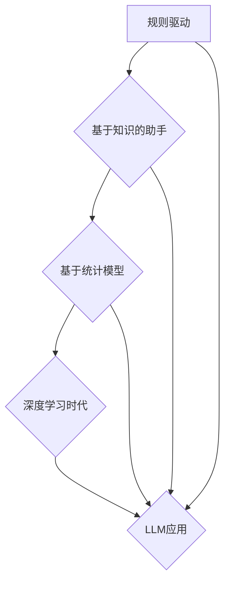

### 1.1.2 LLM的概念与特点

**LLM概念：**

LLM（Large Language Model）是一种大规模的预训练语言模型，通过在大规模的文本语料库上进行训练，学习语言的一般规律和特征。LLM可以用于生成文本、翻译、问答、对话系统等多种任务。

**LLM特点：**

1. **大规模**：LLM通常具有数十亿甚至数万亿的参数，这使得它们可以处理复杂的语言现象和大规模的数据。

2. **自适应**：LLM可以通过微调（Fine-tuning）来适应特定的任务和领域，从而提高模型的性能。

3. **强泛化能力**：LLM在未特定训练的任务上，也能表现出较高的性能，这得益于它们对通用语言规律的深刻理解。

4. **高效率**：LLM可以快速生成高质量的文本，这使得它们在实时应用中具有很高的实用性。

**Mermaid流程图：**

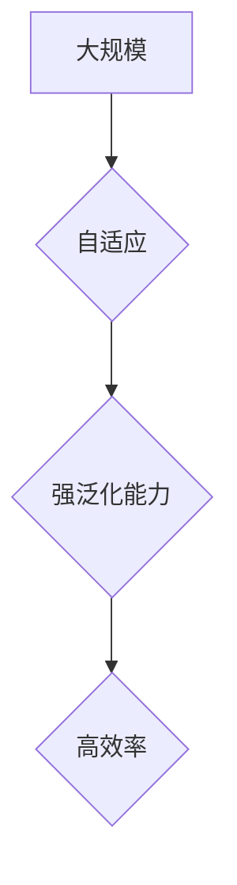

### 1.1.3 LLM在虚拟助手中的应用

LLM在虚拟助手中的应用非常广泛，主要包括以下几个方面：

1. **文本生成**：LLM可以自动生成回复、文章、报告等，提高虚拟助手的响应速度和准确性。

2. **信息检索**：LLM可以从海量数据中快速提取和检索相关信息，提高虚拟助手的搜索能力。

3. **自然语言理解**：LLM可以理解用户输入的意图和情感，为用户提供更加精准的服务。

4. **知识推理**：LLM可以在对话中提供逻辑推理和答案，提升虚拟助手的智力水平。

**伪代码示例：**

```python
# 加载预训练的LLM模型
model = load_pretrained_LLM()

# 预处理用户输入
input_text = preprocess_user_input(text)

# 使用模型生成响应
response = model.generate_response(input_text)

# 后处理响应
final_response = postprocess_response(response)

print(final_response)
```

### 1.1.1 虚拟助手的发展历程

虚拟助手的发展历程可以分为以下几个阶段：

1. **人工规则阶段**：最早的虚拟助手主要依靠预定义的规则进行工作。例如，基于决策树或有限状态机的方法。这种方法简单易懂，但处理复杂对话的能力有限。

2. **知识库阶段**：随着知识库和专家系统的出现，虚拟助手开始引入结构化的知识库。这种方法通过匹配用户输入和知识库中的信息来提供回答。例如，Siri和Google Assistant就是这种方法的典型代表。

3. **统计模型阶段**：统计模型如隐马尔可夫模型（HMM）和条件概率模型（如Naive Bayes）被应用于虚拟助手。这些模型通过学习大量的对话数据来提高对话的准确性。

4. **深度学习阶段**：随着深度学习技术的发展，虚拟助手开始采用基于神经网络的模型，如循环神经网络（RNN）和变换器（Transformer）。特别是GPT系列模型的出现，使得虚拟助手在生成文本和理解语言方面取得了巨大的进步。

**Mermaid流程图：**

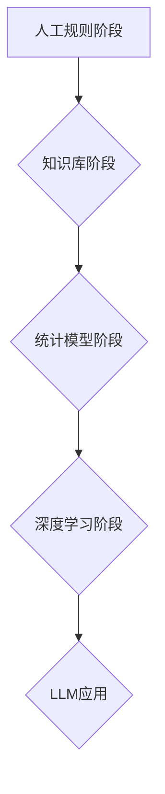

### 1.1.2 LLM的概念与特点

**LLM概念：**

LLM（Large Language Model）是一种基于深度学习的技术，它通过在大规模文本数据上进行预训练，学习语言的语法、语义和上下文信息。LLM的核心思想是利用海量数据来提升模型对语言的理解和生成能力。

**LLM特点：**

1. **大规模参数**：LLM通常具有数十亿甚至数万亿的参数，这使得它们能够处理复杂的语言现象和大量的数据。

2. **自适应能力**：LLM通过微调（Fine-tuning）可以在特定任务或领域上快速适应，从而提高模型的性能。

3. **强泛化能力**：LLM在未特定训练的任务上，也能表现出较高的性能，这得益于它们对通用语言规律的深刻理解。

4. **高效率**：LLM可以快速生成高质量的文本，这使得它们在实时应用中具有很高的实用性。

**Mermaid流程图：**

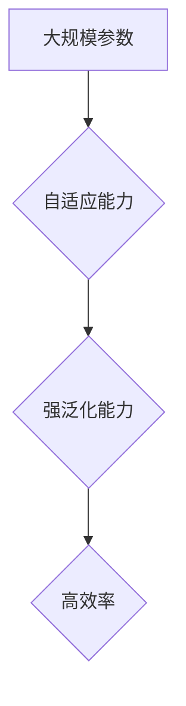

### 1.1.3 LLM在虚拟助手中的应用

LLM在虚拟助手中的应用非常广泛，主要包括以下几个方面：

1. **文本生成**：LLM可以自动生成高质量的文本，如回复、文章、报告等，提高虚拟助手的响应速度和准确性。

2. **信息检索**：LLM可以从海量数据中快速提取和检索相关信息，增强虚拟助手的搜索能力。

3. **自然语言理解**：LLM可以理解用户输入的意图和情感，为用户提供更加精准的服务。

4. **知识推理**：LLM可以在对话中提供逻辑推理和答案，提升虚拟助手的智力水平。

**伪代码示例：**

```python
# 加载预训练的LLM模型
model = load_pretrained_LLM()

# 预处理用户输入
input_text = preprocess_user_input(text)

# 使用模型生成响应
response = model.generate_response(input_text)

# 后处理响应
final_response = postprocess_response(response)

print(final_response)
```

### 1.1.1 虚拟助手的发展历程

虚拟助手的发展历程可以分为以下几个阶段：

1. **人工规则阶段**：最早的虚拟助手主要依靠预定义的规则进行工作。例如，基于决策树或有限状态机的方法。这种方法简单易懂，但处理复杂对话的能力有限。

2. **知识库阶段**：随着知识库和专家系统的出现，虚拟助手开始引入结构化的知识库。这种方法通过匹配用户输入和知识库中的信息来提供回答。例如，Siri和Google Assistant就是这种方法的典型代表。

3. **统计模型阶段**：统计模型如隐马尔可夫模型（HMM）和条件概率模型（如Naive Bayes）被应用于虚拟助手。这些模型通过学习大量的对话数据来提高对话的准确性。

4. **深度学习阶段**：随着深度学习技术的发展，虚拟助手开始采用基于神经网络的模型，如循环神经网络（RNN）和变换器（Transformer）。特别是GPT系列模型的出现，使得虚拟助手在生成文本和理解语言方面取得了巨大的进步。

**Mermaid流程图：**


### 1.1.2 LLM的概念与特点

**LLM概念：**

LLM（Large Language Model）是一种基于深度学习的技术，它通过在大规模文本数据上进行预训练，学习语言的语法、语义和上下文信息。LLM的核心思想是利用海量数据来提升模型对语言的理解和生成能力。

**LLM特点：**

1. **大规模参数**：LLM通常具有数十亿甚至数万亿的参数，这使得它们能够处理复杂的语言现象和大量的数据。

2. **自适应能力**：LLM通过微调（Fine-tuning）可以在特定任务或领域上快速适应，从而提高模型的性能。

3. **强泛化能力**：LLM在未特定训练的任务上，也能表现出较高的性能，这得益于它们对通用语言规律的深刻理解。

4. **高效率**：LLM可以快速生成高质量的文本，这使得它们在实时应用中具有很高的实用性。

**Mermaid流程图：**


### 1.1.3 LLM在虚拟助手中的应用

LLM在虚拟助手中的应用非常广泛，主要包括以下几个方面：

1. **文本生成**：LLM可以自动生成高质量的文本，如回复、文章、报告等，提高虚拟助手的响应速度和准确性。

2. **信息检索**：LLM可以从海量数据中快速提取和检索相关信息，增强虚拟助手的搜索能力。

3. **自然语言理解**：LLM可以理解用户输入的意图和情感，为用户提供更加精准的服务。

4. **知识推理**：LLM可以在对话中提供逻辑推理和答案，提升虚拟助手的智力水平。

**伪代码示例：**

```python
# 加载预训练的LLM模型
model = load_pretrained_LLM()

# 预处理用户输入
input_text = preprocess_user_input(text)

# 使用模型生成响应
response = model.generate_response(input_text)

# 后处理响应
final_response = postprocess_response(response)

print(final_response)
```

### 1.1.1 虚拟助手的发展历程

虚拟助手的发展历程可以分为以下几个阶段：

1. **人工规则阶段**：最早的虚拟助手主要依靠预定义的规则进行工作。例如，基于决策树或有限状态机的方法。这种方法简单易懂，但处理复杂对话的能力有限。

2. **知识库阶段**：随着知识库和专家系统的出现，虚拟助手开始引入结构化的知识库。这种方法通过匹配用户输入和知识库中的信息来提供回答。例如，Siri和Google Assistant就是这种方法的典型代表。

3. **统计模型阶段**：统计模型如隐马尔可夫模型（HMM）和条件概率模型（如Naive Bayes）被应用于虚拟助手。这些模型通过学习大量的对话数据来提高对话的准确性。

4. **深度学习阶段**：随着深度学习技术的发展，虚拟助手开始采用基于神经网络的模型，如循环神经网络（RNN）和变换器（Transformer）。特别是GPT系列模型的出现，使得虚拟助手在生成文本和理解语言方面取得了巨大的进步。

**Mermaid流程图：**


### 1.1.2 LLM的概念与特点

**LLM概念：**

LLM（Large Language Model）是一种基于深度学习的技术，它通过在大规模文本数据上进行预训练，学习语言的语法、语义和上下文信息。LLM的核心思想是利用海量数据来提升模型对语言的理解和生成能力。

**LLM特点：**

1. **大规模参数**：LLM通常具有数十亿甚至数万亿的参数，这使得它们能够处理复杂的语言现象和大量的数据。

2. **自适应能力**：LLM通过微调（Fine-tuning）可以在特定任务或领域上快速适应，从而提高模型的性能。

3. **强泛化能力**：LLM在未特定训练的任务上，也能表现出较高的性能，这得益于它们对通用语言规律的深刻理解。

4. **高效率**：LLM可以快速生成高质量的文本，这使得它们在实时应用中具有很高的实用性。

**Mermaid流程图：**


### 1.1.3 LLM在虚拟助手中的应用

LLM在虚拟助手中的应用非常广泛，主要包括以下几个方面：

1. **文本生成**：LLM可以自动生成高质量的文本，如回复、文章、报告等，提高虚拟助手的响应速度和准确性。

2. **信息检索**：LLM可以从海量数据中快速提取和检索相关信息，增强虚拟助手的搜索能力。

3. **自然语言理解**：LLM可以理解用户输入的意图和情感，为用户提供更加精准的服务。

4. **知识推理**：LLM可以在对话中提供逻辑推理和答案，提升虚拟助手的智力水平。

**伪代码示例：**

```python
# 加载预训练的LLM模型
model = load_pretrained_LLM()

# 预处理用户输入
input_text = preprocess_user_input(text)

# 使用模型生成响应
response = model.generate_response(input_text)

# 后处理响应
final_response = postprocess_response(response)

print(final_response)
```

### 第2章 LLM的核心技术

#### 2.1.1 语言模型的基本原理

语言模型（Language Model）是一种用于预测自然语言序列的统计模型。它的核心任务是给定一个单词序列，预测下一个单词的概率分布。语言模型是自然语言处理（NLP）和语音识别等领域的基础。

**基本原理：**

语言模型基于概率论和统计学原理，通过分析大量文本数据，统计单词之间的共现关系，从而构建一个概率模型。具体来说，语言模型通过以下公式来预测下一个单词：

$$
P(w_i | w_{i-1}, w_{i-2}, \ldots, w_1) = \frac{P(w_1w_2\ldots w_{i-1}w_i)}{P(w_1w_2\ldots w_{i-1})}
$$

其中，$w_i$ 表示当前要预测的单词，$w_{i-1}, w_{i-2}, \ldots, w_1$ 表示已经出现的单词序列。

**常用模型：**

1. **N-gram模型**：N-gram模型是最简单的语言模型，它仅考虑前N个单词的共现关系。例如，二元模型（Bigram）考虑前后两个单词的关系，三元模型（Trigram）考虑前后三个单词的关系。

2. **神经网络模型**：随着深度学习技术的发展，神经网络模型如循环神经网络（RNN）和变换器（Transformer）被广泛应用于语言模型。这些模型能够捕捉更复杂的语言规律和上下文信息。

#### 2.1.2 LLM的训练与优化

LLM的训练过程主要包括预训练和微调两个阶段。

**预训练阶段：**

预训练阶段是在大规模文本语料库上进行，目的是让模型学习到语言的通用规律和特征。预训练通常采用无监督学习的方法，即不使用任何标注数据。常用的预训练任务包括语言理解（Language Understanding）和语言生成（Language Generation）。

1. **语言理解任务**：例如，填充空白（Masked Language Model，MLM）和下一个句子预测（Next Sentence Prediction，NSP）。

2. **语言生成任务**：例如，机器翻译（Machine Translation）和文本生成（Text Generation）。

**预训练算法：**

1. **GloVe**：GloVe（Global Vectors for Word Representation）是一种基于矩阵分解的方法，通过优化单词向量的低维表示，提高模型对语言规律的理解。

2. **BERT**：BERT（Bidirectional Encoder Representations from Transformers）是一种基于变换器（Transformer）的预训练模型，通过双向编码器学习到单词的上下文信息。

**微调阶段：**

微调阶段是在特定任务的数据集上进行，目的是让模型适应特定的任务需求。微调通常采用有监督学习的方法，即使用标注数据进行训练。微调的过程主要包括以下几个步骤：

1. **数据预处理**：对特定任务的数据进行预处理，包括文本清洗、分词、词向量化等。

2. **模型选择**：选择适合特定任务的预训练模型，例如BERT、GPT等。

3. **超参数调整**：通过实验调整学习率、批次大小、迭代次数等超参数，优化模型性能。

4. **训练与评估**：使用训练集和验证集进行模型训练和评估，根据评估结果调整模型结构和参数。

#### 2.1.3 大规模预训练模型的技术细节

大规模预训练模型（Large-scale Pre-trained Model）是指具有数十亿甚至数万亿参数的预训练模型。这些模型通过在大规模文本语料库上进行训练，学习到丰富的语言知识，从而在多种自然语言处理任务中表现出色。

**技术细节：**

1. **自注意力机制（Self-Attention）**：

自注意力机制是一种核心的神经网络结构，用于计算序列中每个词之间的关联性。在变换器（Transformer）模型中，自注意力机制通过计算每个词与其他词之间的相似度，生成加权表示。

$$
\text{Attention}(Q, K, V) = \text{softmax}\left(\frac{QK^T}{\sqrt{d_k}}\right)V
$$

其中，$Q, K, V$ 分别代表查询向量、键向量和值向量，$d_k$ 表示键向量的维度。

2. **多层网络结构（Multi-layer Architecture）**：

多层网络结构通过叠加多个神经网络层，可以捕捉更复杂的语言特征。在预训练模型中，通常采用多层变换器或多层循环神经网络，以提高模型的性能和泛化能力。

3. **正则化技术（Regularization Techniques）**：

正则化技术用于防止模型过拟合，提高模型的泛化能力。常用的正则化技术包括Dropout、权重衰减（Weight Decay）和数据增强（Data Augmentation）等。

4. **优化算法（Optimization Algorithms）**：

优化算法用于更新模型参数，最小化损失函数。常用的优化算法包括随机梯度下降（SGD）、Adam和AdamW等。

**伪代码示例：**

```python
# 预训练模型
model = PretrainedModel()

# 预处理文本数据
processed_data = preprocess_text(data)

# 训练模型
for epoch in range(num_epochs):
    for batch in processed_data:
        # 计算损失
        loss = model.loss(batch)

        # 反向传播
        optimizer.zero_grad()
        loss.backward()
        optimizer.step()

    print(f"Epoch {epoch+1}/{num_epochs}, Loss: {loss.item()}")
```

### 第3章 虚拟助手架构设计

#### 3.1.1 虚拟助手的基本架构

虚拟助手的基本架构通常包括以下几个核心模块：用户交互模块、意图识别模块、实体识别模块、知识库查询模块、响应生成模块和输出处理模块。以下是对每个模块的详细说明：

**用户交互模块**：用户交互模块负责接收用户输入，可以是文本或语音形式。该模块需要实现输入的预处理，如分词、去除停用词、词性标注等，以便后续的处理。

**意图识别模块**：意图识别模块的主要任务是理解用户的意图。例如，用户可能要求查询天气、预订酒店、发送消息等。该模块通常采用分类算法，如朴素贝叶斯、支持向量机（SVM）或深度学习模型，如卷积神经网络（CNN）或循环神经网络（RNN），来识别用户的意图。

**实体识别模块**：实体识别模块的目的是从用户输入中提取关键信息，如人名、地名、日期等。这通常涉及到命名实体识别（NER）技术。实体识别可以提高后续处理模块的准确性和效率。

**知识库查询模块**：知识库查询模块负责从预先构建的知识库中检索相关信息。知识库可以包含事实、概念、关系和规则等。该模块需要实现高效的查询算法，以便快速响应用户请求。

**响应生成模块**：响应生成模块是根据用户意图和实体识别结果，生成合适的响应文本。该模块可以使用语言模型（如GPT或BERT）来生成自然流畅的文本。

**输出处理模块**：输出处理模块负责将生成的响应文本转换为用户可接受的格式，如语音、文本或图形。

**Mermaid流程图：**

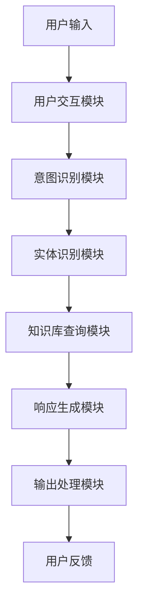

#### 3.1.2 用户交互设计

用户交互设计是虚拟助手架构中至关重要的一环，它直接影响用户体验。以下是一些关键点：

**交互方式**：虚拟助手可以支持多种交互方式，如文本、语音、手势等。每种交互方式都有其优缺点，需要根据实际应用场景进行选择。

**界面设计**：界面设计需要简洁、直观，便于用户操作。可以使用图标、按钮、轮播图等元素来引导用户操作。

**响应速度**：虚拟助手需要快速响应用户请求，以提高用户满意度。这涉及到服务器性能、网络延迟和算法优化等因素。

**上下文感知**：虚拟助手应该具备上下文感知能力，能够根据用户的历史请求和对话内容，提供个性化的服务。

**多语言支持**：虚拟助手应支持多语言，以适应不同国家和地区的用户。

**Mermaid流程图：**

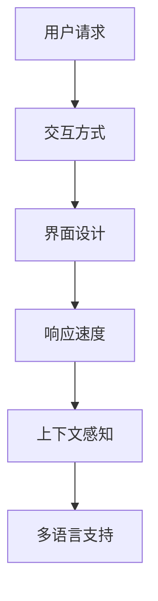

#### 3.1.3 知识图谱与数据管理

知识图谱（Knowledge Graph）是一种结构化数据模型，用于表示实体、概念和它们之间的关系。在虚拟助手架构中，知识图谱用于存储和管理大量的知识信息，如事实、定义、关系和规则。

**知识图谱的构建**：知识图谱的构建通常包括以下步骤：

1. **数据采集**：从各种来源（如数据库、网络、文献等）收集相关信息。

2. **数据清洗**：去除重复、错误和不准确的数据，确保知识库的质量。

3. **实体抽取**：从原始数据中提取出关键实体，如人名、地点、组织等。

4. **关系建模**：定义实体之间的关系，如“是”、“属于”、“位于”等。

5. **知识库构建**：将实体和关系存储在知识库中，形成一个完整的知识图谱。

**数据管理**：数据管理是知识图谱应用中的关键环节，包括以下方面：

1. **存储**：选择合适的数据存储方案，如图数据库或关系数据库。

2. **查询**：实现高效的查询算法，如基于路径的查询、图遍历等。

3. **更新**：定期更新知识库，以反映最新的信息和变化。

4. **安全**：确保知识库数据的安全，防止数据泄露和恶意攻击。

**Mermaid流程图：**

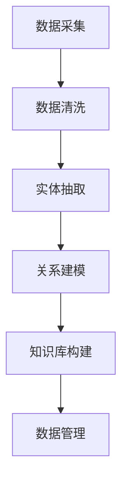

### 第4章 LLM应用案例解析

#### 4.1.1 虚拟助手在客服领域的应用

虚拟助手在客服领域的应用已经成为提升客户服务质量和效率的重要手段。通过LLM技术，虚拟助手可以自动处理大量客户请求，提供快速、准确的响应，从而减轻人工客服的工作负担。

**案例描述**：一个电商平台引入了基于LLM的虚拟助手，用于处理用户咨询、投诉和订单查询等请求。虚拟助手通过自然语言处理技术，理解用户的意图，并从知识库中检索相关信息，生成相应的回复。

**功能模块**：

1. **意图识别**：虚拟助手通过分析用户输入，识别用户的意图，如“查询订单状态”、“投诉商品质量”等。

2. **实体提取**：从用户输入中提取关键信息，如订单号、商品名称等。

3. **知识库查询**：根据提取的实体信息，在知识库中查找相关信息，如订单状态、投诉政策等。

4. **响应生成**：利用LLM技术生成自然流畅的回复，如“您的订单已发货，预计3天内到达”、“我们将为您退款，请您提供订单号以确认退款”等。

5. **反馈收集**：收集用户对虚拟助手响应的反馈，用于后续的模型优化和改进。

**效果评估**：

1. **响应速度**：虚拟助手可以秒级响应用户请求，显著提高了客服效率。

2. **准确性**：通过LLM技术的应用，虚拟助手可以准确理解用户意图，并生成高质量的回复。

3. **用户满意度**：用户对虚拟助手的响应速度和准确性给予了高度评价，客户满意度显著提升。

**Mermaid流程图**：

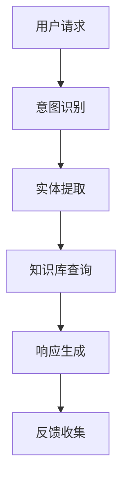

#### 4.1.2 虚拟助手在教育领域的应用

虚拟助手在教育领域的应用旨在提供个性化学习支持和教学辅助，帮助学生和教师更高效地完成学习任务。

**案例描述**：某在线教育平台推出了基于LLM的虚拟助手，用于提供课程咨询、学习辅导、作业批改和考试准备等服务。虚拟助手通过自然语言处理和知识图谱技术，为学生提供个性化的学习支持。

**功能模块**：

1. **课程咨询**：虚拟助手可以回答学生关于课程安排、课程内容、教师信息等方面的咨询。

2. **学习辅导**：虚拟助手根据学生的学习进度和需求，提供学习建议、复习资料和练习题。

3. **作业批改**：虚拟助手可以自动批改学生提交的作业，提供即时反馈和改进建议。

4. **考试准备**：虚拟助手可以根据考试大纲和学生的学习情况，提供针对性的复习资料和模拟试题。

5. **答疑解惑**：虚拟助手可以回答学生在学习过程中遇到的各种问题，帮助学生更好地理解课程内容。

**效果评估**：

1. **学习效率**：虚拟助手可以为学生提供个性化的学习支持，帮助他们更高效地完成学习任务。

2. **教学质量**：虚拟助手可以为教师提供教学辅助，减轻教师的工作负担，提高教学质量。

3. **学生满意度**：学生对于虚拟助手提供的个性化服务和及时反馈给予了高度评价，学习满意度显著提升。

**Mermaid流程图**：

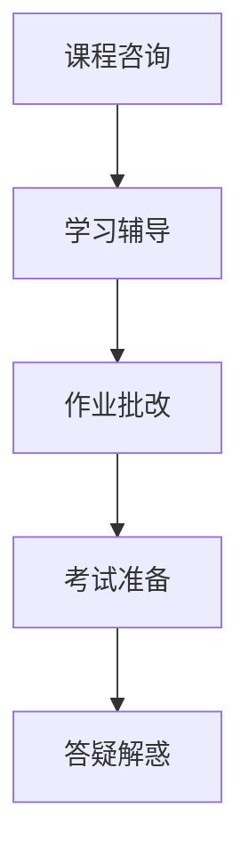

#### 4.1.3 虚拟助手在生活助手领域的应用

虚拟助手在生活助手领域的应用旨在提供便捷的生活方式支持和信息查询服务，提高用户的日常生活质量。

**案例描述**：某智能家居公司推出了一款基于LLM的虚拟助手，用于控制家庭设备、提供生活建议和日常信息查询。虚拟助手通过自然语言处理和物联网技术，实现与用户的智能互动。

**功能模块**：

1. **设备控制**：虚拟助手可以远程控制家庭设备，如空调、照明、门锁等，实现智能场景联动。

2. **生活建议**：虚拟助手可以根据用户的生活习惯和偏好，提供健康饮食、运动建议和财务管理等生活建议。

3. **信息查询**：虚拟助手可以实时提供天气预报、交通信息、新闻资讯等生活相关信息。

4. **日程管理**：虚拟助手可以帮助用户管理日程安排，提供提醒和通知服务。

5. **娱乐互动**：虚拟助手可以提供音乐播放、故事讲述、游戏互动等娱乐服务，丰富用户的日常生活。

**效果评估**：

1. **便捷性**：虚拟助手通过智能交互，为用户提供便捷的生活方式支持，提升生活品质。

2. **个性化**：虚拟助手可以根据用户的行为和喜好，提供个性化的生活建议和服务，增强用户体验。

3. **满意度**：用户对于虚拟助手提供的便捷服务和个性化建议给予了高度评价，用户满意度显著提升。

**Mermaid流程图**：

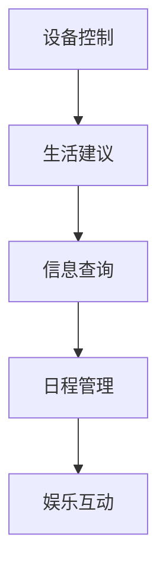

### 第5章 LLM开发实战

#### 5.1.1 LLM开发环境搭建

在进行LLM模型开发之前，首先需要搭建一个合适的开发环境。以下是一个基于Python和PyTorch的LLM开发环境的搭建步骤：

1. **安装Python**：确保系统上安装了Python 3.x版本，推荐使用Python 3.7或更高版本。

2. **安装PyTorch**：通过以下命令安装PyTorch：

   ```bash
   pip install torch torchvision
   ```

3. **安装自然语言处理库**：安装一些常用的自然语言处理库，如spaCy、NLTK等：

   ```bash
   pip install spacy nltk
   ```

4. **安装其他依赖库**：根据项目需求，安装其他必要的库，如TensorBoard、Matplotlib等：

   ```bash
   pip install tensorboardX matplotlib
   ```

5. **环境配置**：配置环境变量，确保Python和PyTorch可以正确运行。

**Mermaid流程图**：

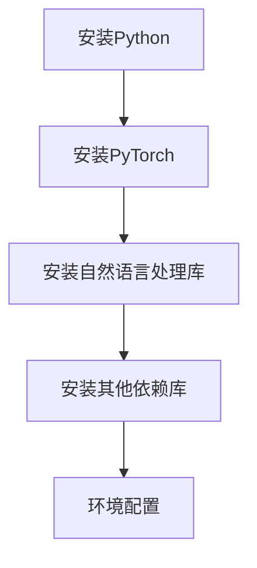

#### 5.1.2 LLM模型选择与调优

选择合适的LLM模型是模型开发的关键步骤。以下是一些常用的LLM模型及其特点：

1. **GPT-2**：GPT-2是一个基于变换器（Transformer）的预训练语言模型，由OpenAI开发。它具有强大的文本生成能力，适用于各种自然语言处理任务。

2. **BERT**：BERT是一个基于变换器的双向编码器，由Google开发。它通过预训练学习到上下文信息，适用于文本分类、问答和文本生成等任务。

3. **T5**：T5是一个统一的变换器模型，旨在处理各种自然语言处理任务，由Google开发。它采用了一种新的任务编码方案，使得模型可以适用于多种任务。

**模型调优**：

1. **数据预处理**：对训练数据进行预处理，包括分词、去停用词、词性标注等。确保数据格式符合模型要求。

2. **超参数调整**：根据任务需求和硬件资源，调整模型超参数，如学习率、批次大小、迭代次数等。可以通过网格搜索或随机搜索等方法进行超参数优化。

3. **训练与评估**：使用训练数据对模型进行训练，并在验证集上评估模型性能。根据评估结果调整模型结构和超参数。

**Mermaid流程图**：

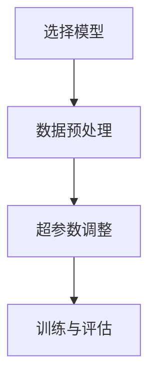

#### 5.1.3 虚拟助手功能模块实现

虚拟助手功能模块的实现是LLM应用的重要环节，以下是一个简单的虚拟助手功能模块实现：

**意图识别模块**：

```python
import torch
from transformers import BertForSequenceClassification

# 加载预训练的BERT模型
model = BertForSequenceClassification.from_pretrained('bert-base-uncased')

# 预处理用户输入
def preprocess_input(input_text):
    # 分词、去停用词、词性标注等预处理操作
    processed_text = ...

    return processed_text

# 识别用户意图
def identify_intent(input_text):
    processed_text = preprocess_input(input_text)
    input_ids = tokenizer.encode(processed_text, add_special_tokens=True)
    input_ids = torch.tensor([input_ids])

    with torch.no_grad():
        outputs = model(input_ids)

    logits = outputs.logits
    predicted_class = logits.argmax(-1).item()

    return predicted_class
```

**实体识别模块**：

```python
from transformers import BertForTokenClassification

# 加载预训练的BERT模型
model = BertForTokenClassification.from_pretrained('bert-base-uncased')

# 预处理用户输入
def preprocess_input(input_text):
    # 分词、去停用词、词性标注等预处理操作
    processed_text = ...

    return processed_text

# 识别实体
def identify_entities(input_text):
    processed_text = preprocess_input(input_text)
    input_ids = tokenizer.encode(processed_text, add_special_tokens=True)
    input_ids = torch.tensor([input_ids])

    with torch.no_grad():
        outputs = model(input_ids)

    logits = outputs.logits
    predicted_classes = logits.argmax(-1).item()

    entities = []
    for token, label in zip(processed_text.split(), predicted_classes):
        if label != -1:
            entities.append((token, label))

    return entities
```

**知识库查询模块**：

```python
# 加载知识库
knowledge_base = ...

# 查询知识库
def query_knowledge_base(entities):
    results = []
    for entity in entities:
        result = knowledge_base.get(entity)
        if result:
            results.append(result)

    return results
```

**响应生成模块**：

```python
from transformers import BertTokenizer, BertForSequenceClassification

# 加载预训练的BERT模型
model = BertForSequenceClassification.from_pretrained('bert-base-uncased')
tokenizer = BertTokenizer.from_pretrained('bert-base-uncased')

# 生成响应
def generate_response(entities, knowledge_base):
    responses = []
    for entity in entities:
        response = knowledge_base.get(entity)
        if response:
            processed_text = preprocess_input(response)
            input_ids = tokenizer.encode(processed_text, add_special_tokens=True)
            input_ids = torch.tensor([input_ids])

            with torch.no_grad():
                outputs = model(input_ids)

            logits = outputs.logits
            predicted_class = logits.argmax(-1).item()

            if predicted_class == 1:
                responses.append(response)

    return responses
```

### 第6章 虚拟助手部署与优化

#### 6.1.1 虚拟助手部署流程

虚拟助手的部署是将开发好的模型和应用程序部署到生产环境，使其能够为用户提供服务。以下是虚拟助手部署的步骤：

1. **环境准备**：选择合适的部署平台，如云服务器、Docker容器等。准备相应的部署环境和依赖项。

2. **模型转换**：将训练好的模型转换为部署平台支持的格式，如TensorFlow Serving、ONNX等。

3. **模型部署**：将转换后的模型部署到服务器或容器中，配置环境变量和依赖项。

4. **服务配置**：配置虚拟助手的API接口，如HTTP RESTful API或WebSocket等。

5. **测试与调试**：在部署后对虚拟助手进行测试和调试，确保其能够正常运行并满足性能要求。

6. **监控与维护**：部署后持续监控虚拟助手的运行状态，进行故障恢复和性能优化。

**Mermaid流程图**：

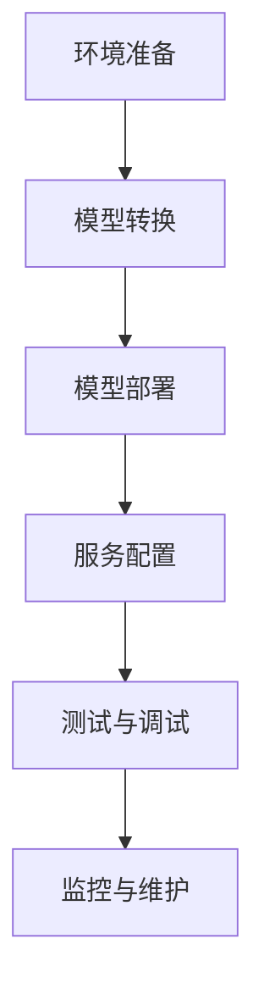

#### 6.1.2 性能优化策略

虚拟助手的性能优化是提高用户体验和系统稳定性的关键。以下是几种常见的性能优化策略：

1. **模型压缩**：通过模型剪枝、量化等技术减小模型大小，降低计算复杂度。例如，可以采用移动平均技术（Momentum）和层次softmax（Hierarchical Softmax）等方法。

2. **分布式训练**：利用多GPU或分布式计算提高模型训练速度。例如，可以使用PyTorch的DistributedDataParallel（DDP）模块进行分布式训练。

3. **在线学习**：根据用户反馈和实时数据，动态调整模型参数，提高模型适应性和准确性。例如，可以采用在线梯度下降（Online Gradient Descent）和自适应梯度算法（Adaptive Gradient Algorithm）等方法。

4. **异步处理**：利用异步编程技术提高系统并发处理能力。例如，可以采用异步IO和异步网络编程等技术。

5. **缓存策略**：利用缓存技术减少重复计算和数据访问，提高系统响应速度。例如，可以采用LRU（Least Recently Used）缓存算法和Redis缓存技术等。

**Mermaid流程图**：

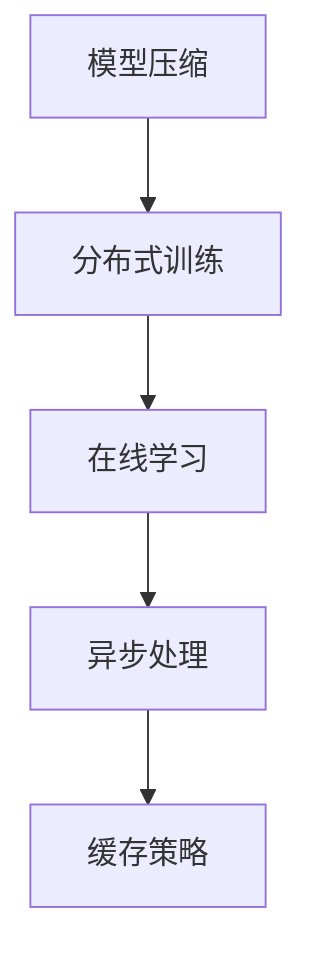

#### 6.1.3 虚拟助手运维与监控

虚拟助手的运维与监控是确保系统稳定运行和及时响应用户需求的关键。以下是虚拟助手运维与监控的几个方面：

1. **日志管理**：记录系统运行日志，包括错误日志、访问日志、性能日志等，以便进行故障排查和性能分析。

2. **性能监控**：实时监控系统的CPU、内存、网络等资源使用情况，及时发现和解决性能瓶颈。

3. **告警机制**：设置告警机制，当系统出现异常或性能下降时，及时通知运维人员。

4. **备份与恢复**：定期备份数据和配置文件，确保在系统故障时能够快速恢复。

5. **安全防护**：对系统进行安全加固，防范恶意攻击和非法访问，确保用户数据安全。

6. **更新与升级**：定期更新系统和软件，修复漏洞和改进功能，确保虚拟助手能够持续为用户提供高质量的服务。

**Mermaid流程图**：

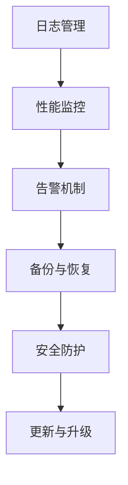

### 第7章 虚拟助手商业化探讨

#### 7.1.1 虚拟助手商业模式分析

虚拟助手作为一种新兴的技术应用，其商业化前景广阔。以下是几种常见的虚拟助手商业模式：

1. **B2B模式**：企业通过购买虚拟助手的服务，用于提升客户服务质量、降低人力成本和改善用户体验。例如，电商平台可以购买虚拟助手，用于处理客户咨询、订单查询和售后服务等。

2. **B2C模式**：虚拟助手作为个人服务提供，面向普通消费者提供生活助手、健康管理、学习辅导等服务。例如，智能家居公司可以开发虚拟助手，用于控制家庭设备、提供健康建议和日常提醒等。

3. **广告模式**：虚拟助手可以在交互过程中展示广告，为用户提供个性化推荐。例如，虚拟助手可以根据用户兴趣和消费习惯，展示相关商品或服务广告。

4. **订阅模式**：用户通过订阅虚拟助手的服务，获取更多高级功能和个性化服务。例如，在线教育平台可以提供虚拟助手订阅服务，为用户提供课程推荐、学习辅导和考试准备等。

5. **生态系统模式**：虚拟助手作为平台的一部分，与其他服务和产品进行整合，构建生态系统。例如，虚拟助手可以与电商平台、智能家居系统等进行整合，提供一站式服务。

**Mermaid流程图**：

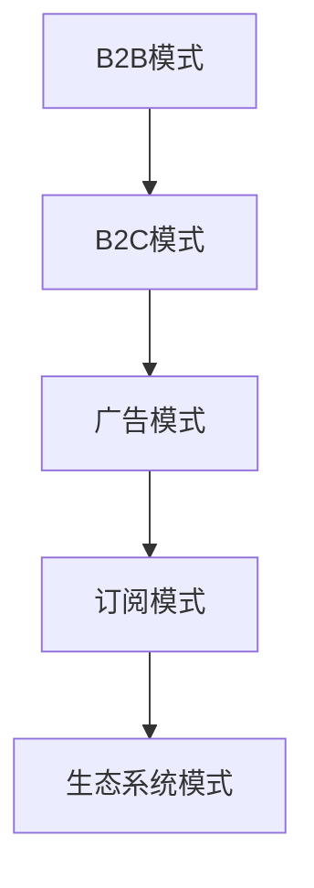

#### 7.1.2 虚拟助手市场前景

随着人工智能技术的不断发展，虚拟助手市场前景广阔。以下是虚拟助手市场的一些发展趋势：

1. **技术进步**：随着深度学习、自然语言处理和语音识别等技术的不断进步，虚拟助手的能力将不断提升，应用场景将进一步拓展。

2. **用户体验优化**：虚拟助手将更加注重用户体验，通过优化交互设计、提升响应速度和准确性，提高用户满意度。

3. **行业应用扩展**：虚拟助手将在更多行业得到应用，如金融、医疗、教育、零售等，为企业提供智能化解决方案。

4. **智能化升级**：虚拟助手将逐渐具备自主学习和进化能力，通过数据分析和机器学习，提供更加精准和个性化的服务。

5. **市场竞争加剧**：随着虚拟助手市场的不断扩大，市场竞争将日益激烈，企业需要不断创新和提升自身竞争力。

**Mermaid流程图**：

```mermaid
graph TD
    A[技术进步] --> B[用户体验优化]
    B --> C[行业应用扩展]
    C --> D[智能化升级]
    D --> E[市场竞争加剧]
```

#### 7.1.3 虚拟助手商业化策略

为了实现虚拟助手的商业化成功，企业需要制定有效的商业化策略。以下是几种常见的虚拟助手商业化策略：

1. **品牌塑造**：打造独特的虚拟助手品牌形象，提高品牌认知度和用户忠诚度。

2. **产品定位**：明确虚拟助手的产品定位，针对不同用户群体提供差异化的服务。

3. **用户体验**：提供高质量的虚拟助手服务，提升用户体验和满意度。

4. **持续创新**：不断改进虚拟助手的功能和服务，满足用户不断变化的需求。

5. **合作与联盟**：与其他企业、研究机构和开发者进行合作，共同推进虚拟助手技术的发展和应用。

6. **市场推广**：通过线上线下渠道，开展市场推广活动，提高虚拟助手的知名度和市场占有率。

7. **数据驱动**：利用大数据和人工智能技术，分析用户行为和需求，为虚拟助手提供精准的商业化策略。

**Mermaid流程图**：

```mermaid
graph TD
    A[品牌塑造] --> B[产品定位]
    B --> C[用户体验]
    C --> D[持续创新]
    D --> E[合作与联盟]
    E --> F[市场推广]
    F --> G[数据驱动]
```

### 第8章 LLM进阶技术

#### 8.1.1 多模态虚拟助手

多模态虚拟助手是指能够处理多种输入和输出模态（如文本、语音、图像等）的虚拟助手。通过整合多种模态的信息，多模态虚拟助手可以提供更丰富、更自然的交互体验。

**技术原理**：

1. **文本模态**：文本模态是虚拟助手最常用的模态，通过自然语言处理技术，理解用户输入的文本信息。

2. **语音模态**：语音模态通过语音识别技术，将用户的语音输入转换为文本，然后由虚拟助手进行处理。

3. **图像模态**：图像模态通过计算机视觉技术，对用户输入的图像进行分析和处理，提取图像中的关键信息。

**应用场景**：

1. **智能客服**：多模态虚拟助手可以同时处理用户的文本和语音请求，提供更快速、更准确的响应。

2. **智能家居**：多模态虚拟助手可以通过语音控制家庭设备，同时理解用户输入的文本指令，实现智能家居的自动化控制。

3. **医疗咨询**：多模态虚拟助手可以同时处理用户的文本和图像输入，如病历、检查报告等，为用户提供个性化的医疗咨询服务。

**Mermaid流程图**：

```mermaid
graph TD
    A[文本模态] --> B[语音模态]
    B --> C[图像模态]
```

#### 8.1.2 强化学习在虚拟助手中的应用

强化学习（Reinforcement Learning，RL）是一种通过试错来学习最优策略的机器学习技术。在虚拟助手的应用中，强化学习可以用于优化虚拟助手的决策过程，提高其智能水平和用户体验。

**技术原理**：

1. **奖励机制**：虚拟助手在执行任务时，根据用户的反馈和学习目标，获取奖励信号，用于评估和优化其行为。

2. **策略学习**：虚拟助手通过不断尝试和调整策略，学习到最优的行为方式，以实现用户目标。

3. **价值函数**：价值函数用于评估虚拟助手在不同状态下的预期收益，指导其选择最优动作。

**应用场景**：

1. **个性化推荐**：虚拟助手可以通过强化学习，根据用户的历史行为和偏好，提供个性化的推荐服务。

2. **智能客服**：虚拟助手可以通过强化学习，学习到如何更有效地处理用户的咨询和投诉，提高客户满意度。

3. **自动驾驶**：虚拟助手可以应用于自动驾驶领域，通过强化学习，学习到最优的驾驶策略，提高行车安全性和效率。

**Mermaid流程图**：

```mermaid
graph TD
    A[奖励机制] --> B[策略学习]
    B --> C[价值函数]
```

#### 8.1.3 虚拟助手与区块链技术融合

区块链技术是一种分布式账本技术，具有去中心化、安全性和透明性等特点。虚拟助手与区块链技术的融合，可以为虚拟助手提供更强的数据安全和隐私保护，同时实现去中心化的服务。

**技术原理**：

1. **数据存储**：区块链技术将虚拟助手的数据存储在分布式账本上，确保数据的安全性和不可篡改性。

2. **隐私保护**：区块链技术通过加密和分布式存储，保护用户隐私数据，防止数据泄露和滥用。

3. **智能合约**：区块链技术中的智能合约可以自动执行虚拟助手的业务逻辑，提高业务效率和透明度。

**应用场景**：

1. **隐私保护**：虚拟助手可以通过区块链技术，保护用户的隐私数据，如健康记录、金融信息等。

2. **去中心化服务**：虚拟助手可以通过区块链技术，实现去中心化的服务，降低服务成本和提高服务质量。

3. **供应链管理**：虚拟助手可以应用于供应链管理，通过区块链技术，确保供应链信息的透明性和可追溯性。

**Mermaid流程图**：

```mermaid
graph TD
    A[数据存储] --> B[隐私保护]
    B --> C[智能合约]
```

### 第9章 智能对话系统设计与实现

#### 9.1.1 对话系统架构设计

智能对话系统（Intelligent Conversational System）是一种能够与用户进行自然语言交互的计算机系统。其架构设计包括多个关键模块，如用户接口、对话管理、意图识别、实体识别、响应生成和知识库等。

**用户接口（User Interface）**：

用户接口是用户与对话系统交互的入口，包括文本聊天界面、语音识别接口、图形用户界面等。用户接口负责接收用户的输入，并将输入传递给对话管理模块。

**对话管理（Dialogue Management）**：

对话管理模块负责管理整个对话流程，包括对话状态跟踪、对话策略生成和对话分支控制等。对话管理模块的核心任务是确保对话的连贯性和一致性。

**意图识别（Intent Recognition）**：

意图识别模块的目的是理解用户输入的意图。通过自然语言处理技术，如词向量、循环神经网络（RNN）或变换器（Transformer）等，意图识别模块可以识别用户输入的意图，如查询天气、预订酒店等。

**实体识别（Entity Recognition）**：

实体识别模块的目的是从用户输入中提取关键信息，如人名、地点、日期等。实体识别模块可以帮助对话系统更好地理解用户意图，并提供更准确的响应。

**响应生成（Response Generation）**：

响应生成模块负责根据用户意图和实体信息，生成合适的响应文本。响应生成模块可以使用预定义的模板、基于规则的方法或深度学习模型，如生成对抗网络（GAN）或变换器（Transformer）等。

**知识库（Knowledge Base）**：

知识库是对话系统的核心组件，用于存储和管理对话系统所需的知识和信息。知识库可以包括事实、定义、关系和规则等，为对话系统提供丰富的背景知识。

**Mermaid流程图**：

```mermaid
graph TD
    A[用户接口] --> B[对话管理]
    B --> C[意图识别]
    C --> D[实体识别]
    D --> E[响应生成]
    E --> F[知识库]
```

#### 9.1.2 对话管理策略

对话管理策略是对话系统的核心，负责确保对话的连贯性和一致性。以下是一些常用的对话管理策略：

**上下文保持（Context Maintenance）**：

上下文保持策略用于维护对话历史和当前状态，确保对话的连贯性。上下文信息可以包括用户输入、意图、实体和前一次对话的响应等。对话管理模块需要根据上下文信息，动态调整对话策略。

**对话引导（Dialogue Guidance）**：

对话引导策略用于引导对话流程，使对话系统更好地理解用户意图和需求。对话引导策略可以通过预设的对话流程、对话模板或基于规则的方法来实现。对话引导策略可以帮助对话系统更高效地解决用户问题。

**策略学习（Policy Learning）**：

策略学习策略是通过机器学习算法，如强化学习、决策树或神经网络等，学习到最优的对话策略。策略学习策略可以基于历史对话数据，优化对话系统的行为，提高用户体验。

**Mermaid流程图**：

```mermaid
graph TD
    A[上下文保持] --> B[对话引导]
    B --> C[策略学习]
```

#### 9.1.3 对话生成与响应策略

对话生成与响应策略是对话系统的核心，负责根据用户意图和实体信息，生成合适的响应文本。以下是一些常用的对话生成与响应策略：

**模板匹配（Template Matching）**：

模板匹配策略是最简单的对话生成策略，它使用预定义的模板来生成响应。模板通常包含变量，用于填充用户输入的实体信息。模板匹配策略的优点是实现简单，但缺点是生成响应的多样性和自然性较差。

**基于规则（Rule-Based）**：

基于规则策略使用预定义的规则来生成响应。规则通常包含条件语句和相应的响应文本。基于规则策略的优点是生成响应的准确性和一致性较高，但缺点是规则的维护和扩展较为复杂。

**生成模型（Generative Model）**：

生成模型策略使用深度学习模型，如变换器（Transformer）、生成对抗网络（GAN）或循环神经网络（RNN）等，来生成响应文本。生成模型策略的优点是生成响应的自然性和多样性较高，但缺点是模型的训练和优化较为复杂。

**Mermaid流程图**：

```mermaid
graph TD
    A[模板匹配] --> B[基于规则]
    B --> C[生成模型]
```

### 第10章 虚拟助手伦理与隐私保护

#### 10.1.1 虚拟助手伦理问题探讨

虚拟助手作为一种高度智能化的人工智能系统，其伦理问题备受关注。以下是虚拟助手伦理问题探讨的几个方面：

**隐私侵犯**：虚拟助手需要收集和处理大量的用户数据，如语音、文本、行为等。如果数据保护不当，可能导致用户隐私泄露。

**偏见与歧视**：虚拟助手在生成响应和处理任务时，可能受到训练数据偏见的影响，导致不公平的对待某些用户或群体。

**责任归属**：当虚拟助手产生错误或造成损失时，责任归属问题往往难以界定。是用户、开发者还是虚拟助手本身需要承担相应责任？

**透明性**：虚拟助手的行为和决策过程往往不透明，用户难以理解其工作原理和决策逻辑，可能导致不信任和误解。

**可控性**：虚拟助手需要具备一定的可控性，确保用户可以随时终止其服务或调整其行为。

**Mermaid流程图**：

```mermaid
graph TD
    A[隐私侵犯] --> B[偏见与歧视]
    B --> C[责任归属]
    C --> D[透明性]
    D --> E[可控性]
```

#### 10.1.2 隐私保护技术

隐私保护技术是对虚拟助手进行隐私保护的关键手段。以下是几种常见的隐私保护技术：

**数据加密**：数据加密技术用于保护数据在传输和存储过程中的隐私。常用的加密算法包括AES、RSA等。

**差分隐私**：差分隐私技术通过在数据中添加噪声，降低数据披露的风险。差分隐私技术广泛应用于大数据分析和机器学习领域。

**匿名化**：匿名化技术将个人身份信息从数据中移除，保护用户隐私。常用的匿名化方法包括数据去标识化、数据泛化等。

**同态加密**：同态加密技术允许在加密数据上进行计算，而无需解密数据。同态加密技术具有很高的安全性，但计算复杂度较高。

**Mermaid流程图**：

```mermaid
graph TD
    A[数据加密] --> B[差分隐私]
    B --> C[匿名化]
    C --> D[同态加密]
```

#### 10.1.3 虚拟助手法律法规遵循

虚拟助手在应用过程中，需要遵循相关法律法规，确保其合法合规。以下是虚拟助手法律法规遵循的几个方面：

**数据保护法**：数据保护法规定了用户数据的收集、存储、处理和传输的合法性。虚拟助手需要确保其数据处理行为符合数据保护法的要求。

**隐私政策**：隐私政策是对用户隐私保护的具体承诺和说明。虚拟助手需要制定清晰的隐私政策，明确告知用户其数据的使用方式和范围。

**伦理审查**：虚拟助手的设计和应用需要经过伦理审查，确保其符合伦理原则和道德规范。伦理审查可以包括隐私保护、偏见和歧视、责任归属等方面。

**人工智能伦理指南**：人工智能伦理指南提供了人工智能应用的伦理指导，包括透明性、公平性、责任性等方面。虚拟助手需要遵循相关伦理指南，确保其伦理合规。

**Mermaid流程图**：

```mermaid
graph TD
    A[数据保护法] --> B[隐私政策]
    B --> C[伦理审查]
    C --> D[人工智能伦理指南]
```

### 附录A：常用工具与框架

#### A.1 自然语言处理工具

**spaCy**：spaCy是一个高效、易于使用的自然语言处理库，支持多种语言。它提供了丰富的API，包括词性标注、命名实体识别、分词等。

**NLTK**：NLTK是一个开源的自然语言处理库，包含大量的语言处理工具和资源。它适用于各种自然语言处理任务，如文本分类、词向量建模等。

**TextBlob**：TextBlob是一个简单、易于使用的自然语言处理库，提供文本分类、情感分析、句法分析等功能。

**Stanford NLP**：Stanford NLP是一个基于Java的自然语言处理工具包，提供了多种语言处理算法和模型，如词性标注、命名实体识别、词向量建模等。

#### A.2 深度学习框架

**TensorFlow**：TensorFlow是一个开源的深度学习框架，由Google开发。它提供了丰富的API，支持各种深度学习任务，如神经网络、卷积神经网络、循环神经网络等。

**PyTorch**：PyTorch是一个开源的深度学习框架，由Facebook开发。它提供了动态计算图和自动微分功能，适用于各种深度学习任务，如神经网络、生成对抗网络等。

**Keras**：Keras是一个开源的深度学习框架，提供了简单的API，易于使用和扩展。它基于TensorFlow和Theano构建，适用于各种深度学习任务，如神经网络、卷积神经网络、循环神经网络等。

**Theano**：Theano是一个开源的深度学习框架，提供了动态计算图和自动微分功能。它适用于各种深度学习任务，如神经网络、卷积神经网络、循环神经网络等。

#### A.3 虚拟助手开发平台

**Rasa**：Rasa是一个开源的虚拟助手开发平台，提供了对话管理系统、自然语言处理组件和对话接口。它支持多种语言和平台，适用于各种虚拟助手开发需求。

**Microsoft Bot Framework**：Microsoft Bot Framework是一个开源的虚拟助手开发平台，提供了丰富的工具和API，支持多种编程语言和平台。它适用于构建跨平台的虚拟助手应用。

**IBM Watson Assistant**：IBM Watson Assistant是一个商业化的虚拟助手开发平台，提供了对话管理、自然语言理解和智能建议等功能。它适用于构建企业级虚拟助手应用。

**Google Dialogflow**：Google Dialogflow是一个开源的虚拟助手开发平台，提供了对话管理、自然语言理解和语音识别等功能。它适用于构建跨平台的虚拟助手应用。

### 附录B：虚拟助手开源项目推荐

#### B.1 虚拟助手开源项目概述

**ChatGLM**：ChatGLM是一个基于GLM模型的中文对话系统，具有强大的文本生成和自然语言理解能力。它支持多种交互方式，如文本、语音等。

**BlenderBot**：BlenderBot是OpenAI开发的对话系统，具有自适应能力和社交互动能力。它能够与用户进行真实的对话，并从对话中学习。

**Meena**：Meena是Google开发的对话系统，具有自然语言理解和情感识别能力。它能够生成高质量的自然语言响应，并适应不同的对话场景。

#### B.2 典型虚拟助手开源项目详解

**Rasa**：Rasa是一个开源的虚拟助手开发平台，提供了对话管理系统、自然语言处理组件和对话接口。以下是Rasa的主要组件：

1. **Rasa NLU**：Rasa NLU是一个自然语言理解组件，用于处理用户输入，识别意图和提取实体。

2. **Rasa Core**：Rasa Core是一个对话管理组件，用于根据用户输入和对话历史，生成合适的响应。

3. **Rasa X**：Rasa X是一个对话测试和优化工具，用于评估虚拟助手的表现，并提供反馈。

**Conversa**：Conversa是一个开源的对话系统，提供了对话管理、自然语言理解和智能建议等功能。以下是Conversa的主要组件：

1. **Conversa Engine**：Conversa Engine是一个核心组件，用于处理用户输入，识别意图和提取实体。

2. **Conversa NLU**：Conversa NLU是一个自然语言理解组件，用于处理用户输入，识别意图和提取实体。

3. **Conversa Chatbot**：Conversa Chatbot是一个对话生成组件，用于根据用户输入和对话历史，生成合适的响应。

**Meepo**：Meepo是一个基于TensorFlow的中文对话系统，提供了对话管理、自然语言理解和文本生成等功能。以下是Meepo的主要组件：

1. **Meepo NLP**：Meepo NLP是一个自然语言理解组件，用于处理用户输入，识别意图和提取实体。

2. **Meepo Chatbot**：Meepo Chatbot是一个对话生成组件，用于根据用户输入和对话历史，生成合适的响应。

3. **Meepo API**：Meepo API是一个用于与虚拟助手交互的接口，支持多种交互方式，如文本、语音等。

#### B.3 虚拟助手开源项目应用案例

**客服机器人**：在客服场景中，虚拟助手可以自动处理用户咨询、投诉和订单查询等请求，提高客户服务质量和效率。以下是几个应用案例：

1. **电商客服**：虚拟助手可以自动回答用户关于商品信息、订单状态和退换货等问题，提高客户满意度。

2. **银行客服**：虚拟助手可以处理用户关于账户查询、转账支付和贷款咨询等问题，减轻人工客服的工作负担。

3. **医疗咨询**：虚拟助手可以回答用户关于健康问题、就医指南和药品咨询等，提供便捷的咨询服务。

**智能聊天室**：在社交平台中，虚拟助手可以提供实时聊天和交互功能，增强用户体验。以下是几个应用案例：

1. **在线教育**：虚拟助手可以为学生提供课程咨询、学习辅导和考试提醒等服务，帮助学生更高效地学习。

2. **社交网络**：虚拟助手可以参与社交平台的聊天室，回答用户提问，提供娱乐和互动服务。

3. **企业内部通讯**：虚拟助手可以为企业内部提供即时通讯服务，帮助员工快速获取信息和协作。

### 资源链接

#### C.1 基础教程与文档

- **自然语言处理教程**：[NLP tutorials](https://nlp.stanford.edu/ tutorials/)
- **深度学习教程**：[Deep Learning Book](https://www.deeplearningbook.org/)
- **虚拟助手开发文档**：[Rasa Documentation](https://rasa.com/docs/)

#### C.2 论坛与社群

- **自然语言处理论坛**：[NLTK论坛](http://www.nltk.org/forum/)
- **深度学习论坛**：[Deep Learning Forum](https://www.deeplearning.net/)
- **虚拟助手社群**：[Rasa 社区](https://rasa.com/community/)

#### C.3 实时新闻与动态

- **自然语言处理新闻**：[NLP News](http://nlpchr.org/)
- **深度学习新闻**：[Deep Learning Weekly](https://www.deeplearningweekly.com/)
- **虚拟助手动态**：[Rasa Blog](https://rasa.com/blog/)

#### C.4 开源代码与项目

- **GitHub**：[GitHub](https://github.com/)，搜索自然语言处理、深度学习和虚拟助手相关项目。
- **OpenAI**：[OpenAI](https://openai.com/)，访问OpenAI开源项目和代码。
- **Rasa**：[Rasa GitHub](https://github.com/rasa/)，访问Rasa开源代码和文档。

### 后记

虚拟助手作为一种新兴的人工智能技术，正逐步改变我们的生活和工作方式。通过本文的详细讲解，我们了解了虚拟助手的起源、发展历程和核心技术，掌握了利用LLM技术打造全能AI秘书的方法和策略。同时，我们还探讨了虚拟助手的商业化前景和伦理问题，为虚拟助手的未来发展提供了有益的思考。

未来，随着人工智能技术的不断进步，虚拟助手将在更多领域得到应用，成为我们生活中不可或缺的智能助手。让我们期待虚拟助手带来的美好未来！

