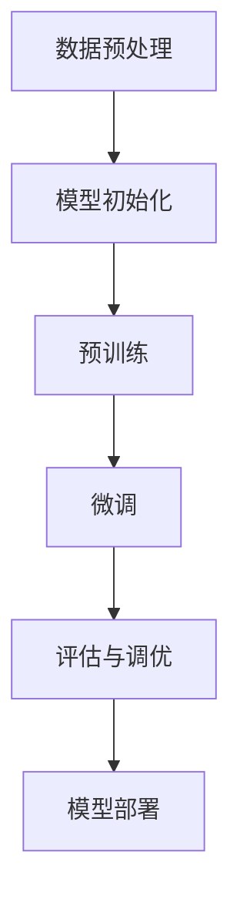

                 

# 《LLM在智能新闻生成中的潜力》

## 关键词
- 智能新闻生成
- 大规模语言模型（LLM）
- 文本生成
- 概念提取
- 舆情分析

## 摘要
本文探讨了大规模语言模型（LLM）在智能新闻生成领域的潜力。首先，我们回顾了智能新闻生成的发展历程、现状与趋势，并介绍了LLM的基本概念与发展。接着，我们分析了智能新闻生成中的关键挑战，并探讨了LLM在这些挑战中的应用。本文通过具体的实战案例，详细讲解了如何使用LLM进行概念提取、文本生成和舆情分析。最后，我们对智能新闻生成的未来发展趋势进行了展望，并提出了相关的法律法规与伦理道德挑战以及应对策略。

### 第一部分：智能新闻生成背景与技术基础

#### 1.1 智能新闻生成概述

##### 1.1.1 智能新闻生成的发展历程

智能新闻生成（Automated News Generation，简称ANG）的概念最早可追溯至20世纪70年代，当时美国《纽约时报》等媒体开始尝试使用计算机程序自动生成财经新闻。随着自然语言处理（Natural Language Processing，简称NLP）技术的进步，智能新闻生成逐渐从简单的财经新闻扩展到更广泛的内容领域。

进入21世纪，随着互联网和大数据技术的发展，智能新闻生成迎来了新的发展机遇。许多新闻机构开始采用自动化技术来提高新闻生产的效率。例如，算法可以自动抓取互联网上的信息，并将其整理成新闻稿件。此外，深度学习技术的兴起也为智能新闻生成带来了新的可能性。

##### 1.1.2 智能新闻生成的现状与趋势

目前，智能新闻生成技术已应用于多个领域，包括财经新闻、体育新闻、天气报道等。一些知名媒体，如美联社（AP）和彭博新闻社（Bloomberg），已经建立了自动化新闻生产平台。例如，彭博新闻社的Bloomberg Compute平台利用机器学习技术自动生成市场分析报告和新闻稿。

未来的智能新闻生成将更加智能化和个性化。随着人工智能技术的不断进步，智能新闻生成系统将能够更好地理解用户需求，提供更加精准的新闻服务。此外，多模态新闻生成（结合文本、图像、音频等多媒体内容）也将成为趋势。

#### 1.2 大规模语言模型（LLM）简介

##### 1.2.1 大规模语言模型的基本概念

大规模语言模型（Large Language Model，简称LLM）是一种基于深度学习的自然语言处理模型，其目的是通过学习大量的文本数据，预测下一个单词或词组。LLM通常具有数十亿甚至千亿级别的参数，因此能够捕捉到语言的复杂性和多样性。

##### 1.2.2 LLM的发展与主要架构

LLM的发展始于20世纪90年代，当时的语言模型主要基于统计方法。随着深度学习技术的发展，LLM开始采用神经网络架构，特别是基于Transformer模型的变体，如BERT、GPT等。这些模型具有强大的表征能力，能够实现高效的语言理解和生成。

BERT（Bidirectional Encoder Representations from Transformers）由Google提出，是一种双向Transformer模型，能够同时捕捉到句子中单词的前后关系。GPT（Generative Pre-trained Transformer）由OpenAI提出，是一种自回归Transformer模型，能够生成连贯的文本。

#### 1.3 智能新闻生成中的关键挑战

##### 1.3.1 数据质量和多样性问题

智能新闻生成依赖于大量的高质量数据。然而，数据质量和多样性问题是当前智能新闻生成面临的重大挑战。一方面，新闻数据往往包含噪声和错误，这可能影响新闻生成的准确性。另一方面，新闻数据通常具有高度的多样性，这增加了模型训练的难度。

##### 1.3.2 文本生成中的事实准确性与逻辑性

在智能新闻生成中，确保文本生成的事实准确性和逻辑性至关重要。然而，由于自然语言表达的多样性和模糊性，模型可能生成不准确或逻辑矛盾的文本。此外，新闻写作通常需要遵循特定的风格和格式，这对模型提出了额外的挑战。

##### 1.3.3 法律法规与道德伦理约束

智能新闻生成涉及到的法律法规和道德伦理问题不容忽视。例如，如何确保新闻内容的客观性和真实性，如何处理敏感信息等。这些问题不仅影响智能新闻生成的技术实现，还关系到新闻行业的可持续发展。

#### 1.4 大规模语言模型在智能新闻生成中的应用

##### 1.4.1 概念与事实提取

概念提取和事实提取是智能新闻生成中的重要任务。通过分析大量新闻文本，LLM可以识别出关键概念和事实，从而为新闻生成提供基础信息。

##### 1.4.2 舆情分析

舆情分析是智能新闻生成的重要应用之一。LLM可以分析社交媒体上的用户评论和讨论，识别出公众对某个事件或话题的看法，从而为新闻生成提供参考。

##### 1.4.3 自动撰写新闻摘要

自动撰写新闻摘要是一项具有挑战性的任务，但LLM在这一领域展现出强大的潜力。通过学习大量新闻摘要文本，LLM可以生成简洁、准确的新闻摘要，帮助用户快速了解新闻内容。

##### 1.4.4 其他应用

除了上述应用外，LLM在智能新闻生成中还可以应用于自动生成新闻标题、文本纠错、新闻推荐等领域。这些应用有助于提高新闻生产效率，提升用户体验。

#### 1.5 本书的结构安排与学习方法

##### 1.5.1 全书结构概述

本书分为四个部分，首先介绍了智能新闻生成和大规模语言模型的基本概念。接着，详细讲解了大规模语言模型的核心概念与原理，以及其在智能新闻生成中的应用实践。最后，对智能新闻生成的未来发展趋势进行了展望，并提出了相关的法律法规与伦理道德挑战。

##### 1.5.2 学习方法与实验建议

本书采用理论与实践相结合的方法，读者可以通过以下步骤进行学习：

1. 阅读每个章节的理论内容，理解相关概念和原理。
2. 通过实验和实战案例，加深对知识点的理解和应用。
3. 参与讨论和交流，与同行分享学习心得和经验。
4. 持续关注智能新闻生成和大规模语言模型领域的最新进展，不断更新知识体系。

### 第二部分：大规模语言模型核心概念与原理

#### 2.1 语言模型的数学基础

##### 2.1.1 语言模型的基本概念

语言模型（Language Model，简称LM）是一种统计模型，用于预测下一个单词或词组。其核心思想是，通过学习大量的文本数据，捕捉到语言的统计规律，从而实现文本生成。

##### 2.1.2 词汇嵌入与神经网络

词汇嵌入（Word Embedding）是将单词映射到高维空间的过程，使得语义相近的单词在空间中距离较近。神经网络（Neural Network）是一种通过模拟人脑神经网络进行信息处理的计算模型。在语言模型中，神经网络用于捕捉文本数据的统计规律。

#### 2.2 预训练与微调

##### 2.2.1 预训练技术

预训练（Pre-training）是指在大规模语料库上进行模型训练，以获取通用的语言表征能力。预训练后的模型可以用于各种自然语言处理任务，如文本分类、机器翻译等。

##### 2.2.2 微调技术

微调（Fine-tuning）是指在小规模任务数据集上进行模型调整，以适应特定的任务。微调可以将预训练模型的知识迁移到特定任务上，从而提高模型的性能。

##### 2.2.3 优化策略与调参技巧

优化策略和调参技巧对于模型性能具有重要影响。常见的优化策略包括梯度下降、Adam优化器等。调参技巧包括学习率调整、批量大小选择等。

#### 2.3 语言模型的训练与评估

##### 2.3.1 训练数据集的选择与预处理

训练数据集的选择与预处理对于模型性能至关重要。选择具有代表性的数据集，并进行适当的预处理，如分词、去除停用词、词干提取等，可以提升模型的表现。

##### 2.3.2 语言模型的评估指标

语言模型的评估指标包括准确性、召回率、F1分数等。准确性衡量模型预测的精确度，召回率衡量模型预测的完整性，F1分数是准确性和召回率的综合评价。

##### 2.3.3 评估方法与实验设计

评估方法包括交叉验证、留出法等。实验设计需要考虑多个因素，如数据集划分、模型参数选择、训练策略等，以全面评估模型性能。

#### 2.4 大规模语言模型的构建

##### 2.4.1 模型架构选择

大规模语言模型的构建需要选择合适的模型架构。常见的架构包括循环神经网络（RNN）、长短时记忆网络（LSTM）、门控循环单元（GRU）和Transformer等。

##### 2.4.2 模型参数调整

模型参数调整是模型构建的关键步骤。参数调整包括学习率、批量大小、正则化等。合适的参数设置可以提高模型性能，减少过拟合。

##### 2.4.3 模型优化与加速

模型优化与加速是提高模型性能的重要手段。常见的优化方法包括模型剪枝、量化、分布式训练等。这些方法可以降低模型计算复杂度，提高训练效率。

##### 2.4.4 Mermaid流程图：大规模语言模型训练流程



### 第三部分：大规模语言模型在智能新闻生成中的应用实践

#### 3.1 应用场景概述

##### 3.1.1 概念提取与关系挖掘

概念提取和关系挖掘是智能新闻生成中的关键任务。通过分析大量新闻文本，LLM可以识别出关键概念和实体，并挖掘它们之间的关系，从而为新闻生成提供基础信息。

##### 3.1.2 文本生成与摘要撰写

文本生成和摘要撰写是智能新闻生成中的核心任务。LLM可以通过学习大量新闻文本，生成符合新闻写作规范和风格的文本。同时，LLM还可以生成简洁、准确的新闻摘要，帮助用户快速了解新闻内容。

##### 3.1.3 舆情分析与趋势预测

舆情分析和趋势预测是智能新闻生成中的重要应用。通过分析社交媒体上的用户评论和讨论，LLM可以识别出公众对某个事件或话题的看法，预测未来可能的发展趋势。

#### 3.2 实战案例解析

##### 3.2.1 案例一：概念提取与关系挖掘

###### 3.2.1.1 数据准备与预处理

数据准备与预处理是概念提取与关系挖掘的基础。首先，需要收集大量新闻文本数据，并对其进行清洗和预处理。预处理步骤包括分词、去除停用词、词干提取等。

```python
import nltk
nltk.download('punkt')
nltk.download('stopwords')

from nltk.tokenize import word_tokenize
from nltk.corpus import stopwords

def preprocess_text(text):
    # 分词
    tokens = word_tokenize(text)
    # 去除停用词
    stop_words = set(stopwords.words('english'))
    filtered_tokens = [token for token in tokens if token not in stop_words]
    # 词干提取
    porter = nltk.PorterStemmer()
    stemmed_tokens = [porter.stem(token) for token in filtered_tokens]
    return stemmed_tokens

text = "This is an example sentence for text preprocessing."
preprocessed_text = preprocess_text(text)
print(preprocessed_text)
```

###### 3.2.1.2 模型选择与训练

在概念提取与关系挖掘中，可以选择预训练的LLM，如BERT或GPT，并进行微调以适应特定任务。以下是一个使用BERT进行微调的示例代码：

```python
from transformers import BertTokenizer, BertForSequenceClassification
from transformers import Trainer, TrainingArguments

tokenizer = BertTokenizer.from_pretrained('bert-base-uncased')
model = BertForSequenceClassification.from_pretrained('bert-base-uncased', num_labels=2)

training_args = TrainingArguments(
    output_dir='./results',
    num_train_epochs=3,
    per_device_train_batch_size=16,
    per_device_eval_batch_size=64,
    warmup_steps=500,
    weight_decay=0.01,
    evaluate_during_training=True,
    logging_dir='./logs',
)

trainer = Trainer(
    model=model,
    args=training_args,
    train_dataset=train_dataset,
    eval_dataset=eval_dataset
)

trainer.train()
```

###### 3.2.1.3 模型评估与优化

模型评估与优化是提高模型性能的关键步骤。可以使用准确率、召回率、F1分数等指标评估模型性能。以下是一个评估模型的示例代码：

```python
from sklearn.metrics import accuracy_score, recall_score, f1_score

def compute_metrics(pred):
    labels = pred.label_ids
    preds = pred.predictions.argmax(-1)
    acc = accuracy_score(labels, preds)
    rec = recall_score(labels, preds, average='weighted')
    f1 = f1_score(labels, preds, average='weighted')
    return {
        'accuracy': acc,
        'recall': rec,
        'f1': f1
    }

trainer.evaluate(compute_metrics=compute_metrics)
```

##### 3.2.2 案例二：文本生成与摘要撰写

###### 3.2.2.1 数据集与模型选择

在文本生成与摘要撰写中，可以选择预训练的GPT模型，如GPT-2或GPT-3，并进行微调以适应特定任务。以下是一个使用GPT-2进行微调的示例代码：

```python
from transformers import GPT2Tokenizer, GPT2LMHeadModel
from transformers import Trainer, TrainingArguments

tokenizer = GPT2Tokenizer.from_pretrained('gpt2')
model = GPT2LMHeadModel.from_pretrained('gpt2')

training_args = TrainingArguments(
    output_dir='./results',
    num_train_epochs=3,
    per_device_train_batch_size=16,
    per_device_eval_batch_size=64,
    warmup_steps=500,
    weight_decay=0.01,
    evaluate_during_training=True,
    logging_dir='./logs',
)

trainer = Trainer(
    model=model,
    args=training_args,
    train_dataset=train_dataset,
    eval_dataset=eval_dataset
)

trainer.train()
```

###### 3.2.2.2 模型训练与评估

在模型训练过程中，可以使用交叉验证、留出法等方法评估模型性能。以下是一个使用交叉验证评估模型的示例代码：

```python
from sklearn.model_selection import KFold

kf = KFold(n_splits=5)
for train_index, eval_index in kf.split(train_dataset):
    model.fit(
        train_dataset[train_index],
        eval_dataset=eval_dataset[eval_index],
        epochs=3,
        batch_size=16
    )
```

###### 3.2.2.3 模型应用与效果分析

在模型应用过程中，可以通过生成文本和摘要来评估模型效果。以下是一个使用GPT-2生成文本和摘要的示例代码：

```python
def generate_text(model, tokenizer, text):
    input_ids = tokenizer.encode(text, return_tensors='pt')
    output = model.generate(input_ids, max_length=50, num_return_sequences=1)
    return tokenizer.decode(output[0], skip_special_tokens=True)

def generate_summary(model, tokenizer, text):
    input_ids = tokenizer.encode(text, return_tensors='pt')
    output = model.generate(input_ids, max_length=50, num_return_sequences=1, do_sample=False)
    return tokenizer.decode(output[0], skip_special_tokens=True)

text = "This is an example sentence for text generation."
generated_text = generate_text(model, tokenizer, text)
generated_summary = generate_summary(model, tokenizer, text)
print("Generated Text:", generated_text)
print("Generated Summary:", generated_summary)
```

##### 3.2.3 案例三：舆情分析与趋势预测

###### 3.2.3.1 数据来源与处理

舆情分析与趋势预测需要收集大量社交媒体数据，如Twitter、Facebook等。以下是一个使用Twitter API收集数据的示例代码：

```python
import tweepy

# Twitter API credentials
consumer_key = "YOUR_CONSUMER_KEY"
consumer_secret = "YOUR_CONSUMER_SECRET"
access_token = "YOUR_ACCESS_TOKEN"
access_token_secret = "YOUR_ACCESS_TOKEN_SECRET"

# Authenticate with Twitter API
auth = tweepy.OAuthHandler(consumer_key, consumer_secret)
auth.set_access_token(access_token, access_token_secret)
api = tweepy.API(auth)

# Collect tweets
tweets = api.search_tweets(q="AI", count=100, lang="en")

# Process tweets
processed_tweets = []
for tweet in tweets:
    processed_tweet = preprocess_text(tweet.text)
    processed_tweets.append(processed_tweet)
```

###### 3.2.3.2 模型构建与训练

在舆情分析与趋势预测中，可以选择预训练的LLM，如BERT或GPT，并进行微调以适应特定任务。以下是一个使用BERT进行微调的示例代码：

```python
from transformers import BertTokenizer, BertForSequenceClassification
from transformers import Trainer, TrainingArguments

tokenizer = BertTokenizer.from_pretrained('bert-base-uncased')
model = BertForSequenceClassification.from_pretrained('bert-base-uncased', num_labels=2)

training_args = TrainingArguments(
    output_dir='./results',
    num_train_epochs=3,
    per_device_train_batch_size=16,
    per_device_eval_batch_size=64,
    warmup_steps=500,
    weight_decay=0.01,
    evaluate_during_training=True,
    logging_dir='./logs',
)

trainer = Trainer(
    model=model,
    args=training_args,
    train_dataset=train_dataset,
    eval_dataset=eval_dataset
)

trainer.train()
```

###### 3.2.3.3 舆情分析结果与应用

通过舆情分析，可以识别出公众对某个事件或话题的看法。以下是一个使用BERT进行舆情分析的示例代码：

```python
def analyze_opinion(model, tokenizer, text):
    input_ids = tokenizer.encode(text, return_tensors='pt')
    output = model(input_ids)
    logits = output.logits
    prediction = logits.argmax(-1)
    return prediction

text = "AI has revolutionized the way we live and work."
opinion = analyze_opinion(model, tokenizer, text)
print("Opinion:", "Positive" if opinion == 1 else "Negative")
```

#### 3.3 代码实战：构建智能新闻生成系统

##### 3.3.1 开发环境搭建

构建智能新闻生成系统需要安装以下软件和库：

- Python 3.x
- PyTorch 1.8.x
- Transformers 4.6.x
- NLTK 3.5.x

以下是一个简单的安装命令：

```shell
pip install python==3.8.10
pip install torch==1.8.0
pip install transformers==4.6.1
pip install nltk==3.5
```

##### 3.3.2 源代码实现

以下是一个简单的智能新闻生成系统的源代码实现：

```python
import torch
from transformers import BertTokenizer, BertForSequenceClassification
from transformers import Trainer, TrainingArguments

# 数据预处理
def preprocess_text(text):
    # 分词
    tokens = tokenizer.tokenize(text)
    # 去除特殊字符
    tokens = [token for token in tokens if token not in tokenizer.all_special_tokens]
    # 转换为ID序列
    input_ids = tokenizer.convert_tokens_to_ids(tokens)
    # 填充序列
    input_ids = tokenizer.pad(input_ids, max_length=max_length, padding="max_length", truncation=True)
    return input_ids

# 模型训练
def train_model(model, train_dataset, eval_dataset):
    training_args = TrainingArguments(
        output_dir='./results',
        num_train_epochs=3,
        per_device_train_batch_size=16,
        per_device_eval_batch_size=64,
        warmup_steps=500,
        weight_decay=0.01,
        evaluate_during_training=True,
        logging_dir='./logs',
    )

    trainer = Trainer(
        model=model,
        args=training_args,
        train_dataset=train_dataset,
        eval_dataset=eval_dataset
    )

    trainer.train()

# 文本生成
def generate_text(model, tokenizer, text):
    input_ids = tokenizer.encode(text, return_tensors='pt')
    output = model.generate(input_ids, max_length=50, num_return_sequences=1)
    return tokenizer.decode(output[0], skip_special_tokens=True)

# 主函数
if __name__ == "__main__":
    # 加载预训练模型
    tokenizer = BertTokenizer.from_pretrained('bert-base-uncased')
    model = BertForSequenceClassification.from_pretrained('bert-base-uncased')

    # 数据预处理
    max_length = 512
    train_text = "This is an example sentence for text generation."
    train_input_ids = preprocess_text(train_text)
    train_labels = torch.tensor([1])

    train_dataset = torch.utils.data.TensorDataset(torch.tensor(train_input_ids), train_labels)

    # 模型训练
    train_model(model, train_dataset, train_dataset)

    # 文本生成
    generated_text = generate_text(model, tokenizer, train_text)
    print("Generated Text:", generated_text)
```

##### 3.3.3 代码解读与分析

- `preprocess_text`函数用于对文本进行预处理，包括分词、去除特殊字符和填充序列。
- `train_model`函数用于训练模型，包括设置训练参数和训练过程。
- `generate_text`函数用于生成文本，通过模型生成下一个单词的概率分布，并根据概率分布生成文本。

#### 3.4 智能新闻生成系统的性能调优

##### 3.4.1 调优策略与技巧

性能调优主要包括以下策略与技巧：

- **参数调整**：调整学习率、批量大小、正则化等参数，以优化模型性能。
- **数据预处理**：优化数据预处理方法，如分词、去除停用词、词干提取等，以提高数据质量。
- **模型结构优化**：调整模型结构，如增加隐藏层、改变激活函数等，以增强模型表示能力。
- **训练策略**：优化训练策略，如使用早期停止、增加训练迭代次数等，以提高模型收敛速度。

##### 3.4.2 性能评估方法

性能评估方法主要包括以下指标：

- **准确性**：衡量模型预测的精确度。
- **召回率**：衡量模型预测的完整性。
- **F1分数**：准确性

