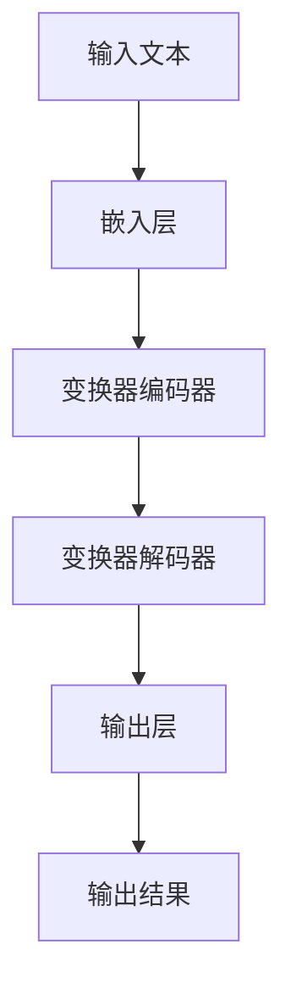

                 

### 第一部分：自然语言处理与LLM基础

#### 第1章：自然语言处理概述

自然语言处理（Natural Language Processing，NLP）是计算机科学、人工智能和语言学领域的一个分支，旨在使计算机能够理解和解释人类语言。自20世纪50年代以来，NLP经历了快速的发展，并成为现代人工智能的核心组成部分。NLP的目标是通过计算机程序实现人类语言的各种功能，包括文本分析、语音识别、机器翻译、情感分析、问答系统等。

NLP的基本概念包括语言模型、文本表示、词嵌入、序列模型、生成模型等。语言模型用于估计文本序列的概率，词嵌入用于将单词转换为向量表示，序列模型用于处理序列数据，生成模型用于生成新的文本序列。

#### 1.1 自然语言处理的基本概念

自然语言处理涉及多个核心概念：

- **语言模型**：语言模型用于估计自然语言文本的概率分布。它可以是基于统计的方法，如N元语言模型，也可以是基于神经网络的深度学习方法，如循环神经网络（RNN）和变换器（Transformer）。

- **文本表示**：文本表示是将文本转换为计算机可以处理的数字形式的过程。常见的文本表示方法包括词嵌入（Word Embedding）、词向量（Word Vector）和词袋模型（Bag of Words）。

- **词嵌入**：词嵌入是将单词转换为固定长度的向量表示，以便计算机可以处理。词嵌入有助于捕捉单词的语义和语法信息。

- **序列模型**：序列模型是用于处理序列数据（如单词、句子或语音信号）的机器学习模型。常见的序列模型包括循环神经网络（RNN）和长短期记忆网络（LSTM）。

- **生成模型**：生成模型旨在学习数据分布，并生成新的数据样本。在深度学习中，生成模型通常基于神经网络，如生成对抗网络（GAN）。

#### 1.2 自然语言处理的挑战

尽管自然语言处理取得了显著的进展，但它仍然面临许多挑战：

- **歧义**：自然语言中的歧义使得计算机难以准确理解文本的含义。例如，"bank"一词可以指银行或河岸。

- **上下文**：上下文信息对于正确理解文本至关重要。自然语言处理模型需要考虑上下文来消除歧义。

- **语调**：语音信号中的语调、音调和情感信息对自然语言处理具有挑战性。

- **多语言**：自然语言处理需要支持多种语言，包括低资源语言。

- **实时性**：实时自然语言处理要求系统在短时间内处理大量文本数据。

#### 1.3 语言的表示与处理

自然语言处理的关键在于将人类语言转换为计算机可以理解和处理的数字形式。以下是一些常用的语言表示和数据处理方法：

- **词嵌入**：词嵌入是将单词转换为固定长度的向量表示。词嵌入可以通过训练神经网络来学习，也可以使用预训练的词嵌入库，如Word2Vec、GloVe和BERT。

- **词袋模型**：词袋模型是将文本表示为一个向量，其中每个维度表示一个单词的出现频率。词袋模型简单有效，但在捕捉词序信息方面存在局限性。

- **序列模型**：序列模型用于处理序列数据，如单词序列或语音信号。常见的序列模型包括循环神经网络（RNN）和长短期记忆网络（LSTM）。

- **变换器模型**：变换器模型是用于处理序列数据的深度学习模型，具有强大的表示和学习能力。变换器模型包括自注意力机制，可以捕捉长距离依赖关系。

- **生成模型**：生成模型用于学习数据分布，并生成新的数据样本。生成对抗网络（GAN）是一种常见的生成模型，它可以生成高质量的图像、文本和语音。

通过这些表示和处理方法，自然语言处理模型可以更好地理解和生成人类语言。

## 第2章：语言模型与生成模型

### 2.1 语言模型的概念与分类

语言模型（Language Model，LM）是自然语言处理中的一个核心组件，用于估计自然语言文本的概率分布。在深度学习中，语言模型通常基于神经网络来实现，如循环神经网络（RNN）和变换器（Transformer）。语言模型在文本生成、机器翻译、问答系统和对话生成等领域具有广泛的应用。

根据模型结构和训练方法，语言模型可以分为以下几类：

- **基于N-gram的语言模型**：N-gram语言模型是最简单的语言模型之一，它基于历史n个词来预测下一个词。例如，二元语言模型（Bigram）考虑前一个词，三元语言模型（Trigram）考虑前两个词。N-gram模型通过统计方法训练，具有较高的计算效率和可扩展性，但在处理长距离依赖关系方面存在局限性。

- **基于神经网络的生成模型**：神经网络生成模型包括循环神经网络（RNN）、长短期记忆网络（LSTM）和门控循环单元（GRU）等。这些模型通过学习输入序列和隐藏状态之间的关系，可以捕捉长距离依赖关系，提高文本生成的质量。RNN是一种简单的序列到序列模型，LSTM和GRU通过引入门控机制来改善RNN的长期依赖性。

- **变换器模型**：变换器（Transformer）模型是一种基于自注意力机制的深度学习模型，广泛应用于自然语言处理任务。变换器模型通过多头自注意力机制来捕捉长距离依赖关系，并在机器翻译、问答系统和文本生成等领域取得了显著的效果。

- **预训练语言模型**：预训练语言模型（Pre-trained Language Model）是在大规模语料库上进行预训练，然后通过微调（Fine-tuning）适应特定任务的模型。BERT（Bidirectional Encoder Representations from Transformers）是典型的预训练语言模型，通过双向编码器来学习文本的语义表示。

### 2.2 生成模型的基本原理

生成模型（Generative Model）是一种用于学习数据分布并生成新数据样本的模型。在深度学习中，生成模型通常基于神经网络，如生成对抗网络（GAN）和变分自编码器（VAE）。

- **生成对抗网络（GAN）**：生成对抗网络由生成器（Generator）和判别器（Discriminator）组成。生成器旨在生成与真实数据相似的数据样本，判别器则用于区分真实数据和生成数据。生成器和判别器相互对抗，通过优化生成器和判别器的参数，生成器可以逐渐生成更真实的数据样本。GAN在图像生成、文本生成和语音合成等领域具有广泛的应用。

- **变分自编码器（VAE）**：变分自编码器是一种基于概率模型的生成模型，它通过编码器（Encoder）和解码器（Decoder）将输入数据映射到潜在空间，并在潜在空间中生成新的数据样本。VAE通过最大化数据分布的似然函数来训练，可以在图像生成、文本生成和语音合成等领域实现高质量的生成效果。

### 2.3 序列到序列模型

序列到序列（Seq2Seq）模型是一种深度学习模型，用于将序列映射到序列。常见的Seq2Seq模型包括循环神经网络（RNN）、长短期记忆网络（LSTM）和变换器（Transformer）。

- **循环神经网络（RNN）**：RNN是一种简单的序列到序列模型，通过隐藏状态来存储序列的历史信息。RNN通过递归操作来处理序列数据，但在处理长距离依赖关系方面存在困难。

- **长短期记忆网络（LSTM）**：LSTM是一种改进的RNN，通过引入门控机制来改善长期依赖性。LSTM通过遗忘门、输入门和输出门来控制信息的流动，可以更好地捕捉序列中的长期依赖关系。

- **变换器（Transformer）**：Transformer是一种基于自注意力机制的序列到序列模型。通过多头自注意力机制，Transformer可以捕捉长距离依赖关系，并在机器翻译、问答系统和文本生成等领域取得了显著的效果。

序列到序列模型在机器翻译、问答系统和对话生成等领域具有广泛的应用，可以实现对输入序列的建模和生成。

### 第3章：大语言模型（LLM）简介

#### 3.1 大语言模型的发展历程

大语言模型（Large Language Model，LLM）是近年来自然语言处理领域的重要进展。LLM通过对大规模语料库进行深度预训练，获得了强大的语言理解和生成能力。LLM的发展历程可以追溯到以下重要里程碑：

- **2018年：BERT的发布**：BERT（Bidirectional Encoder Representations from Transformers）是由Google Research提出的一种预训练语言模型。BERT通过双向变换器编码器进行预训练，并在多个自然语言处理任务上取得了显著的性能提升。

- **2019年：GPT-2的发布**：OpenAI发布了GPT-2（Generative Pre-trained Transformer 2），这是一种基于变换器的语言模型，具有高达1.5亿个参数。GPT-2通过自回归语言模型进行预训练，可以生成高质量的自然语言文本。

- **2020年：Turing模型发布**：DeepMind发布了Turing模型，这是一种基于变换器的语言模型，具有超过1750亿个参数。Turing模型在语言理解和生成任务上取得了突破性的成果，展示了深度学习模型在自然语言处理领域的潜力。

- **2022年：GPT-3的发布**：OpenAI发布了GPT-3（Generative Pre-trained Transformer 3），这是一种基于变换器的语言模型，具有超过1750亿个参数。GPT-3在多个自然语言处理任务上取得了优异的性能，展示了深度学习模型在生成任务上的强大能力。

#### 3.2 大语言模型的基本原理

大语言模型（LLM）的基本原理基于深度学习和变换器（Transformer）架构。变换器模型通过自注意力机制（Self-Attention）来捕捉序列中的长距离依赖关系，从而实现高效的序列建模和生成。以下是大语言模型的基本原理：

- **自注意力机制**：自注意力机制是一种用于计算序列中每个元素与所有其他元素相关性的方法。在变换器模型中，自注意力机制通过计算每个词与其余词的相似性，从而实现序列的编码和解码。

- **多头注意力**：多头注意力是一种将自注意力机制分解为多个子模块的方法。每个子模块关注序列的不同部分，从而提高模型的泛化能力和建模能力。

- **位置编码**：变换器模型通过位置编码（Positional Encoding）来引入序列中的位置信息。位置编码是一种将序列中每个词的位置信息编码为向量，从而使得模型能够理解序列的顺序。

- **前馈神经网络**：变换器模型中的每个子层之后通常连接一个前馈神经网络，用于进一步处理和变换序列数据。

通过以上基本原理，大语言模型可以高效地建模和生成自然语言文本，从而在语言理解和生成任务上取得优异的性能。

#### 3.3 大语言模型的结构

大语言模型（LLM）通常由以下几个关键组件组成：

- **嵌入层**：嵌入层（Embedding Layer）将输入文本转换为固定长度的向量表示。嵌入层通常使用预训练的词嵌入（如Word2Vec、GloVe或BERT），以提高模型的性能和效率。

- **变换器编码器**：变换器编码器（Transformer Encoder）是LLM的核心组件，用于处理输入序列并提取特征。变换器编码器通过多头自注意力机制和前馈神经网络，实现对输入序列的编码。

- **变换器解码器**：变换器解码器（Transformer Decoder）用于生成输出序列。解码器通过自注意力机制和编码器输出的上下文信息，逐词生成输出序列。

- **输出层**：输出层（Output Layer）用于将解码器生成的输出序列转换为最终的结果。输出层通常是一个全连接层，用于将解码器的隐藏状态映射到目标词汇表。

大语言模型的结构通过以上组件实现了对输入文本的编码和解码，从而实现自然语言理解和生成任务。以下是一个简化的结构图：



通过以上组件的协同工作，大语言模型可以实现对自然语言文本的建模和生成，从而在多个任务中取得优异的性能。

## 第二部分：智能语音助手系统设计

### 第4章：智能语音助手系统架构

智能语音助手（Voice Assistant）是一种基于语音交互的智能系统，能够理解用户的语音指令并执行相应的任务。智能语音助手系统由多个组件组成，包括语音识别、自然语言处理、对话管理和语音合成等。以下将详细介绍智能语音助手系统的整体架构及其各个组件的设计和交互流程。

#### 4.1 智能语音助手的工作原理

智能语音助手的工作原理可以概括为以下几个步骤：

1. **语音识别**：语音识别（Speech Recognition）模块将用户的语音输入转换为文本。这个过程涉及到音频信号的预处理、特征提取和声学模型匹配。

2. **自然语言处理**：自然语言处理（NLP）模块对转换后的文本进行处理，包括文本分词、词性标注、句法分析、命名实体识别等。这一步骤的目的是将自然语言转换为计算机可以理解的语义表示。

3. **对话管理**：对话管理（Dialogue Management）模块负责理解用户的意图，并规划后续的对话流程。对话管理模块通常包括意图识别、上下文管理和策略学习等。

4. **语音合成**：语音合成（Text-to-Speech，TTS）模块将处理后的文本转换为自然流畅的语音输出。这一步骤涉及到文本语音合成、语音参数生成和语音合成器等。

#### 4.2 智能语音助手的组件设计

智能语音助手系统由以下主要组件构成：

- **语音识别模块**：语音识别模块是智能语音助手的入口，负责将用户的语音指令转换为文本。该模块通常包括以下子组件：
  - **音频预处理**：包括降噪、增益控制和音频分割等。
  - **特征提取**：使用梅尔频率倒谱系数（MFCC）等特征进行音频信号的处理。
  - **声学模型**：用于匹配音频特征和语音单元（如音素）。

- **自然语言处理模块**：自然语言处理模块负责将语音识别结果转换为语义表示。该模块包括以下子组件：
  - **分词和词性标注**：将文本分割为单词和词组，并为每个单词标注词性。
  - **句法分析**：分析句子的结构，提取句法关系。
  - **命名实体识别**：识别文本中的特定实体，如人名、地点和组织等。
  - **意图识别**：根据用户的输入文本，识别用户的意图。

- **对话管理模块**：对话管理模块负责理解用户的意图，并规划对话流程。该模块通常包括以下子组件：
  - **意图识别**：根据用户的输入文本，识别用户的意图。
  - **上下文管理**：维护对话过程中的上下文信息，以便后续对话可以连贯进行。
  - **策略学习**：使用机器学习算法，根据历史对话数据，学习最优对话策略。

- **语音合成模块**：语音合成模块将处理后的文本转换为自然流畅的语音输出。该模块包括以下子组件：
  - **文本语音合成**：将文本转换为语音参数。
  - **语音参数生成**：生成语音信号的参数，如基频、共振峰等。
  - **语音合成器**：根据语音参数生成语音信号。

#### 4.3 智能语音助手的交互流程

智能语音助手的交互流程可以分为以下几个阶段：

1. **语音输入**：用户通过语音输入与智能语音助手进行交互。

2. **语音识别**：智能语音助手使用语音识别模块将语音输入转换为文本。

3. **自然语言处理**：智能语音助手使用自然语言处理模块对转换后的文本进行处理，提取语义信息。

4. **意图识别**：智能语音助手使用对话管理模块识别用户的意图。

5. **对话管理**：智能语音助手根据用户的意图和上下文信息，规划后续的对话流程。

6. **语音合成**：智能语音助手使用语音合成模块将处理后的文本转换为语音输出。

7. **语音输出**：智能语音助手将语音输出发送给用户。

8. **反馈收集**：用户可以提供反馈，以便智能语音助手优化对话体验。

通过以上交互流程，智能语音助手能够与用户进行自然流畅的语音交互，执行各种任务，如查询信息、设置提醒、播放音乐等。

## 第5章：语音识别与语音合成

语音识别（Speech Recognition）和语音合成（Text-to-Speech，TTS）是智能语音助手系统的关键组成部分。语音识别将用户的语音转换为文本，而语音合成则将文本转换为自然流畅的语音。本节将详细介绍语音识别和语音合成的技术原理，以及它们在智能语音助手系统中的集成方式。

#### 5.1 语音识别技术

语音识别技术旨在将语音信号转换为相应的文本。这一过程通常包括以下几个步骤：

1. **音频预处理**：语音识别的第一步是对原始语音信号进行预处理，包括降噪、增益控制和音频分割。降噪可以去除背景噪声，提高语音信号的清晰度。增益控制则可以调整语音信号的音量，使其更加适合后续处理。音频分割则是将连续的语音信号分割为多个帧，以便进行特征提取。

2. **特征提取**：特征提取是将音频信号转换为数字特征表示的过程。常用的特征包括梅尔频率倒谱系数（MFCC）、线性预测编码（LPC）和频谱特征等。MFCC是最常用的特征之一，它通过分析音频信号的频谱特性，将其转换为时间序列的数字表示。

3. **声学模型**：声学模型是语音识别的核心组件，它用于将特征序列映射到可能的语音单元（如音素）。声学模型通常基于高斯混合模型（Gaussian Mixture Model，GMM）或深度神经网络（Deep Neural Network，DNN）。GMM模型通过统计方法来建模语音单元的概率分布，而DNN模型则通过多层神经网络来学习特征与语音单元之间的映射关系。

4. **语言模型**：语言模型是语音识别的另一个重要组件，它用于根据上下文信息对识别结果进行后处理。语言模型通常基于N元语言模型（N-gram Model）或统计语言模型（Statistical Language Model）。语言模型通过统计方法来估计文本序列的概率，从而提高识别结果的准确性。

5. **解码器**：解码器是语音识别的最后一步，它用于从声学模型和语言模型中选出最可能的识别结果。常见的解码器包括前向算法（Forward Algorithm）和后向算法（Backward Algorithm）。

#### 5.2 语音合成技术

语音合成技术旨在将文本转换为自然流畅的语音。语音合成的基本步骤如下：

1. **文本预处理**：文本预处理包括分词、句法分析和命名实体识别等。分词是将文本分割为单词和词组，句法分析则是分析句子的结构，命名实体识别则是识别文本中的特定实体。

2. **语音参数生成**：语音参数生成是将文本转换为语音信号所需的一系列参数。这些参数包括基频（Fundamental Frequency，F0）、共振峰（Formants）和时长（Duration）等。常用的语音参数生成方法包括规则合成、参数化波形合成和基于数据驱动的合成。

3. **合成器**：合成器是语音合成的核心组件，它根据生成的语音参数生成语音信号。常见的合成器包括规则合成器、拼接合成器和波形合成器。

4. **后处理**：语音合成后的信号通常需要进行后处理，以提高语音的自然度和音质。后处理包括音素时长调整、音调调整和共振峰调整等。

#### 5.3 语音识别与合成的集成

语音识别和语音合成在智能语音助手系统中紧密集成，共同实现语音交互功能。集成方式通常包括以下几种：

1. **串联集成**：串联集成是将语音识别和语音合成模块依次连接。用户首先使用语音识别模块输入指令，然后使用语音合成模块生成语音反馈。串联集成简单易实现，但响应速度较慢，因为需要等待语音识别结果。

2. **并行集成**：并行集成是将语音识别和语音合成模块同时运行。用户输入语音指令时，语音识别模块和语音合成模块同时处理，一旦识别结果确定，即可生成语音反馈。并行集成可以提高系统的响应速度，但实现较为复杂。

3. **反馈循环集成**：反馈循环集成是将语音合成模块的输出作为语音识别模块的输入，形成一个反馈循环。用户输入语音指令，语音识别模块识别后生成文本，文本经过语音合成模块生成语音反馈，语音反馈再次输入到语音识别模块。反馈循环集成可以增强系统的交互性和自然度，但需要处理实时性和稳定性问题。

通过以上集成方式，智能语音助手系统能够实现高效、自然的语音交互，为用户提供便捷的智能服务。

### 第6章：对话管理

对话管理（Dialogue Management）是智能语音助手系统的核心组成部分，它负责理解用户的意图，并根据上下文信息规划对话流程。对话管理包括意图识别、上下文管理和策略学习等关键组件。以下将详细讨论这些组件的功能和设计原则。

#### 6.1 对话系统的基础知识

对话系统（Dialogue System）是一种能够与人类进行自然语言交互的计算机系统。对话系统可以分为以下几类：

- **命令式对话系统**：命令式对话系统旨在执行特定的命令或任务。例如，智能语音助手可以帮助用户设置提醒、查询天气信息等。

- **闲聊式对话系统**：闲聊式对话系统旨在与用户进行闲聊，提供娱乐、情感支持和闲话等服务。例如，聊天机器人可以与用户聊天、讲述笑话等。

- **混合式对话系统**：混合式对话系统结合了命令式对话系统和闲聊式对话系统的特点，既能执行特定任务，又能与用户进行闲聊。

对话系统的工作流程通常包括以下几个步骤：

1. **语音识别**：将用户的语音输入转换为文本。

2. **意图识别**：根据用户的文本输入，识别用户的意图。

3. **上下文管理**：根据用户的意图和对话历史，维护对话过程中的上下文信息。

4. **策略学习**：根据对话历史和用户反馈，学习最优的对话策略。

5. **响应生成**：根据对话策略和上下文信息，生成合适的响应。

6. **语音合成**：将生成的文本响应转换为自然流畅的语音。

7. **语音输出**：将语音响应发送给用户。

#### 6.2 对话策略的设计

对话策略（Dialogue Policy）是对话管理的关键组件，它决定了系统如何响应用户的输入。对话策略的设计需要考虑以下几个因素：

1. **意图识别**：意图识别是对话策略的基础。系统需要根据用户的输入文本，识别用户的意图。意图识别可以基于规则、机器学习或深度学习等方法。

2. **上下文信息**：上下文信息包括对话历史、用户偏好和历史反馈等。对话策略需要根据上下文信息，生成合适的响应。

3. **用户满意度**：用户满意度是衡量对话系统性能的重要指标。对话策略需要设计为满足用户需求，提供有用的信息和服务。

4. **自然度**：对话系统的响应需要自然、流畅，符合人类的语言习惯。对话策略需要考虑语言的语法、语义和语用等方面。

5. **灵活性**：对话系统需要具有灵活性，能够适应不同的用户、场景和任务。对话策略需要设计为可扩展和可配置。

常见的对话策略设计方法包括：

- **规则驱动策略**：基于预定义的规则和模板，生成对话响应。这种方法简单直观，但灵活性较低。

- **机器学习策略**：使用机器学习算法，根据对话历史和用户反馈，学习最优的对话策略。这种方法具有较好的灵活性和适应性。

- **混合策略**：结合规则驱动策略和机器学习策略，发挥两者的优势。例如，在规则无法覆盖的情况下，使用机器学习策略进行补充。

#### 6.3 对话状态的跟踪与预测

对话状态（Dialogue State）是描述对话当前状态的一系列特征。对话状态包括用户的意图、上下文信息、用户偏好和历史反馈等。对话状态跟踪（Dialogue State Tracking）是指根据用户的输入和系统的响应，维护对话状态的变化。

对话状态跟踪的方法包括：

- **基于规则的方法**：使用预定义的规则，根据输入和输出，更新对话状态。

- **基于机器学习的方法**：使用机器学习算法，根据对话历史和用户反馈，学习对话状态的更新规则。

- **基于知识的方法**：使用知识图谱或本体论，描述对话状态和关系，进行状态跟踪。

对话状态跟踪的目的是为对话策略提供准确的上下文信息，以生成合适的对话响应。

对话状态预测（Dialogue State Prediction）是指根据当前对话状态，预测未来的对话状态。对话状态预测的方法包括：

- **基于统计的方法**：使用统计模型，根据历史对话数据，预测未来对话状态。

- **基于深度学习的方法**：使用深度学习模型，学习对话状态的变化规律，进行预测。

- **基于增强学习的方法**：使用增强学习算法，通过与环境的交互，学习最优的对话策略和状态预测。

通过对话状态跟踪和预测，对话管理系统可以更好地理解用户意图，提供连贯、自然的对话体验。

### 第7章：上下文理解与语义分析

#### 7.1 上下文理解的重要性

上下文理解是自然语言处理（NLP）和智能语音助手系统中的关键环节，它指的是模型或系统能够根据特定场景和语境，准确理解输入文本的含义。上下文理解的重要性体现在以下几个方面：

1. **消除歧义**：自然语言中的歧义现象普遍存在，如一词多义、同音异义词等。上下文理解可以帮助模型识别文本中的真实含义，避免误解。

2. **提高准确性**：在任务如问答系统、对话管理和机器翻译中，上下文理解可以显著提高模型的准确性。例如，在问答系统中，理解问题中的上下文信息可以帮助模型找到正确的答案。

3. **实现连贯交互**：对于智能语音助手等交互系统，上下文理解是实现自然、流畅对话的基础。通过理解用户的意图和对话历史，系统可以生成更符合用户需求的响应。

4. **增强个性化体验**：上下文理解可以帮助系统根据用户的历史行为和偏好，提供更加个性化的服务。例如，在推荐系统中，理解用户的上下文信息可以推荐更相关的商品或内容。

#### 7.2 语义分析的方法与技巧

语义分析（Semantic Analysis）是自然语言处理中用于理解文本语义的过程。以下是一些常见的语义分析方法与技巧：

1. **词嵌入（Word Embedding）**：词嵌入是将单词转换为固定长度的向量表示，以便模型可以处理。通过词嵌入，模型可以捕捉词与词之间的语义关系。常见的词嵌入方法包括Word2Vec、GloVe和BERT。

2. **词性标注（Part-of-Speech Tagging）**：词性标注是将文本中的每个词标注为相应的词性（如名词、动词、形容词等）。词性标注有助于理解句子的结构和语义，是许多NLP任务的基础。

3. **句法分析（Syntactic Parsing）**：句法分析是解析句子结构的过程，包括成分解析（Constituent Parsing）和依存关系分析（Dependency Parsing）。句法分析可以帮助模型理解句子的内部关系，如主谓宾结构和从句关系。

4. **命名实体识别（Named Entity Recognition，NER）**：命名实体识别是识别文本中具有特定意义的实体，如人名、地点、组织、时间等。NER对于信息提取、知识图谱构建等任务具有重要意义。

5. **实体关系抽取（Entity Relation Extraction）**：实体关系抽取是识别文本中实体之间的关系。例如，在句子“苹果公司的创始人史蒂夫·乔布斯出生在旧金山”中，可以识别出实体之间的关系，如“苹果公司的创始人是史蒂夫·乔布斯”，“史蒂夫·乔布斯出生于旧金山”。

6. **情感分析（Sentiment Analysis）**：情感分析是识别文本中的情感倾向，如积极、消极或中性。情感分析常用于市场调研、产品评论分析等领域。

7. **事件抽取（Event Extraction）**：事件抽取是识别文本中的事件及其相关实体和属性。例如，在句子“马云在2019年创立了阿里巴巴公益基金会”中，可以识别出事件“创立阿里巴巴公益基金会”，以及事件相关实体“马云”和“阿里巴巴公益基金会”。

8. **知识图谱（Knowledge Graph）**：知识图谱是表示实体及其关系的图形化结构。通过构建知识图谱，模型可以更好地理解和利用知识，提高语义分析的准确性。

#### 7.3 上下文理解与语义分析的结合

上下文理解和语义分析密切相关，二者通常结合使用以实现更精准的语义理解。以下是一些结合上下文理解和语义分析的实践：

1. **动态上下文建模**：动态上下文建模是指在对话过程中，实时更新和调整上下文信息。例如，在问答系统中，系统可以根据问题的上下文和历史对话信息，动态调整答案生成的策略。

2. **上下文敏感的语义角色标注**：在自然语言理解任务中，上下文敏感的语义角色标注可以帮助模型更准确地识别句子的语义成分。例如，在句子“我昨天去了北京，看到了很多名胜古迹”中，根据上下文，可以更准确地标注“北京”为地点，“名胜古迹”为名词短语。

3. **基于上下文的实体消歧**：实体消歧是解决一词多义问题的重要手段。通过结合上下文信息，模型可以更准确地识别实体的真实含义。例如，在句子“苹果公司今天发布了新款iPhone”中，根据上下文，可以确定“苹果”指的是科技公司，而不是水果。

4. **上下文驱动的语义角色标注**：在语义角色标注任务中，结合上下文信息可以帮助模型更准确地识别动词的语义角色。例如，在句子“我邀请他参加晚宴”中，根据上下文，可以更准确地标注“邀请”为动作。

通过结合上下文理解和语义分析，智能语音助手等系统能够更准确地理解用户意图，提供更高质量的交互体验。

### 第8章：问答系统的构建

问答系统（Question Answering System）是智能语音助手系统中的一个重要组件，旨在接收用户的问题，并生成准确的答案。问答系统在信息检索、客户服务、教育等领域具有广泛的应用。本节将介绍问答系统的基本概念、使用LLM构建问答系统的方法以及问答系统的优化和评估。

#### 8.1 问答系统概述

问答系统是一种能够自动回答用户问题的计算机系统，其核心任务是从大量数据中检索出与问题相关的信息，并生成合理的答案。问答系统可以分为以下几种类型：

- **基于知识库的问答系统**：这种系统依赖于预定义的知识库，通过对知识库的查询来回答问题。常见的知识库包括维基百科、数据库和专家系统。

- **基于文本检索的问答系统**：这种系统通过在大量文本数据中检索与问题相关的信息来生成答案。常见的文本检索算法包括TF-IDF、BM25等。

- **基于生成模型的问答系统**：这种系统使用生成模型（如变换器模型、生成对抗网络等）来生成答案。生成模型能够理解和生成自然流畅的文本。

- **混合式问答系统**：这种系统结合了基于知识库、文本检索和生成模型的优势，以生成更准确和多样化的答案。

#### 8.2 使用LLM构建问答系统

语言模型（Language Model，LLM）是构建问答系统的一种有效方法，特别适用于生成式问答系统。LLM如BERT、GPT-3等，通过在大规模语料库上进行预训练，可以捕捉语言中的各种语义和语法信息。以下是如何使用LLM构建问答系统的步骤：

1. **数据准备**：
   - 收集大量问题-答案对，用于训练和评估问答系统。
   - 对数据进行预处理，包括文本清洗、分词、去除停用词等。

2. **模型选择**：
   - 选择合适的LLM模型，如BERT、GPT-3等。
   - 加载预训练好的模型或使用模型搭建框架，如Transformers库。

3. **训练**：
   - 使用问题-答案对对LLM模型进行训练，使其学习如何生成与问题相关的答案。
   - 通过调整模型的参数，如学习率、批量大小等，优化模型性能。

4. **评估**：
   - 使用评估集对训练好的模型进行评估，评估指标包括准确率、F1分数、BLEU分数等。
   - 根据评估结果调整模型参数，以提高答案的准确性和多样性。

5. **部署**：
   - 将训练好的模型部署到生产环境中，用于实时回答用户的问题。
   - 确保系统具有足够的计算资源和响应速度，以满足用户的交互需求。

#### 8.3 问答系统的优化与评估

问答系统的性能可以通过多种方法进行优化和评估：

1. **优化方法**：

   - **答案多样性**：通过引入多模态信息（如图像、视频等），提高答案的多样性。
   - **长文本生成**：使用长文本生成模型，如T5或GPT-3，生成更详细和连贯的答案。
   - **上下文理解**：结合上下文信息，提高答案的相关性和准确性。
   - **知识增强**：利用外部知识库，如百科全书、专业数据库等，增强模型的回答能力。

2. **评估方法**：

   - **人工评估**：通过人工评估答案的准确性、相关性和流畅度。
   - **自动评估**：使用自动评估指标，如BLEU、ROUGE、F1分数等，对答案进行量化评估。
   - **用户反馈**：收集用户对答案的反馈，通过反馈迭代优化模型。

通过上述优化和评估方法，问答系统可以提供更准确、相关和多样化的答案，为用户提供更好的用户体验。

### 第9章：个性化推荐系统

个性化推荐系统（Personalized Recommendation System）是一种根据用户的兴趣和行为，为用户推荐相关内容或产品的技术。在智能语音助手中，个性化推荐系统可以显著提升用户体验，通过推荐用户可能感兴趣的内容或商品，从而增强用户满意度和粘性。本节将介绍个性化推荐系统的基础知识，并详细讨论如何使用LLM构建个性化推荐系统。

#### 9.1 个性化推荐的基本概念

个性化推荐系统通过分析用户的历史行为、兴趣和偏好，为用户提供个性化的内容或商品推荐。个性化推荐的基本概念包括：

- **用户**：个性化推荐系统中的用户，通常是指使用该系统的个体。

- **项目**：系统推荐的内容或商品，如电影、音乐、书籍、商品等。

- **评分**：用户对项目的评分或反馈，如喜欢、不喜欢、评分等。

- **推荐**：系统根据用户的行为和偏好，为用户推荐的项目。

个性化推荐系统的主要目标是从大量项目中筛选出与用户兴趣相符的项目，从而提高用户的满意度和参与度。

#### 9.2 基于LLM的个性化推荐算法

语言模型（LLM）如BERT、GPT-3等在个性化推荐系统中具有广泛的应用，因为它们能够理解和生成自然语言，从而为用户提供更准确和个性化的推荐。以下是基于LLM的个性化推荐算法的基本步骤：

1. **用户表示**：
   - 使用LLM将用户的历史行为和偏好文本（如评价、评论、搜索历史等）转换为向量表示。这一步骤通常通过预训练好的语言模型（如BERT）实现，将用户文本编码为固定长度的向量。
   - 例如，可以使用BERT模型获取用户评论的嵌入向量，然后将这些向量平均或加权求和，得到用户的综合向量表示。

2. **项目表示**：
   - 使用LLM将项目的文本描述（如商品名称、描述、标签等）转换为向量表示。同样，可以使用预训练的语言模型（如BERT）进行文本编码。
   - 例如，可以使用BERT模型获取商品描述的嵌入向量，得到项目的向量表示。

3. **相似度计算**：
   - 计算用户表示和项目表示之间的相似度，以评估项目与用户兴趣的匹配程度。常用的相似度计算方法包括余弦相似度、欧氏距离等。
   - 例如，可以使用余弦相似度计算用户向量与项目向量之间的相似度，相似度越高的项目越有可能被推荐给用户。

4. **推荐生成**：
   - 根据相似度计算结果，生成个性化推荐列表。通常，系统会选择相似度最高的若干个项目作为推荐结果，并通过排序算法确定推荐顺序。
   - 例如，可以选择相似度最高的前N个项目，并使用排序算法（如基于内容的排序、协同过滤等）对这些项目进行排序。

#### 9.3 个性化推荐系统的实现

以下是一个基于LLM的个性化推荐系统的实现步骤和代码示例：

1. **环境准备**：
   - 确保安装了Python和TensorFlow库。
   - 安装transformers库，用于加载预训练的语言模型。

2. **用户和项目数据准备**：
   - 准备用户行为数据（如评价、评论、搜索历史等）和项目描述数据。

3. **加载预训练的LLM模型**：
   - 加载预训练的BERT模型，用于文本编码。

4. **文本编码**：
   - 使用BERT模型将用户行为文本和项目描述文本编码为向量表示。

5. **相似度计算**：
   - 计算用户表示和项目表示之间的相似度。

6. **生成推荐列表**：
   - 根据相似度计算结果，生成个性化推荐列表。

以下是一个简单的代码示例：

```python
from transformers import AutoTokenizer, AutoModel
import torch

# 加载预训练的BERT模型
tokenizer = AutoTokenizer.from_pretrained('bert-base-uncased')
model = AutoModel.from_pretrained('bert-base-uncased')

# 用户行为文本
user_reviews = ["我非常喜欢这个电影", "这个商品的质量非常好", "这个餐厅的环境很舒适"]

# 项目描述文本
item_descriptions = [
    "一部关于超级英雄的电影",
    "一款高端的智能手机",
    "一家以意大利菜为主的餐厅"
]

# 文本编码
user_inputs = [tokenizer.encode(review, add_special_tokens=True) for review in user_reviews]
item_inputs = [tokenizer.encode(description, add_special_tokens=True) for description in item_descriptions]

# 获取文本嵌入向量
with torch.no_grad():
    user_embeddings = model(torch.tensor(user_inputs)).mean(dim=1)
    item_embeddings = model(torch.tensor(item_inputs)).mean(dim=1)

# 相似度计算
similarity_scores = torch.nn.functional.cosine_similarity(user_embeddings, item_embeddings, dim=1)

# 生成推荐列表
recommended_items = torch.argsort(similarity_scores, descending=True).numpy()

print("推荐列表：")
for index in recommended_items:
    print(item_descriptions[index])
```

通过以上步骤，我们可以构建一个基于LLM的个性化推荐系统，为用户提供个性化的内容或商品推荐。实际应用中，可以根据具体需求和数据量，对算法和模型进行优化和调整，以实现更好的推荐效果。

### 第10章：情感分析与情绪识别

情感分析（Sentiment Analysis）和情绪识别（Emotion Recognition）是自然语言处理（NLP）和智能语音助手系统中的关键任务，旨在理解用户语言中的情感和情绪。情感分析用于判断文本表达的是正面、负面还是中性情感，而情绪识别则试图识别更细微的情绪，如快乐、悲伤、愤怒等。本节将详细介绍情感分析和情绪识别的基本概念、方法与技巧，并探讨二者在智能语音助手系统中的应用。

#### 10.1 情感分析的基本概念

情感分析是一种评估文本情感极性的技术，它通常分为以下几个步骤：

1. **情感分类**：情感分类是将文本划分为正面、负面或中性情感的标签。常见的情感分类方法包括基于规则的方法、机器学习方法（如朴素贝叶斯、支持向量机、深度学习等）和神经网络方法（如循环神经网络、卷积神经网络和变换器等）。

2. **情感极性**：情感极性是衡量文本情感强度的指标，通常用分数或等级表示。例如，正面情感可以表示为+1，负面情感为-1，中性情感为0。

3. **情感词典**：情感词典是一种包含情感词汇及其情感极性的资源。通过情感词典，可以快速判断文本中的情感词汇，从而辅助情感分析。

4. **情感强度**：情感强度是指情感表达的强烈程度。例如，"非常喜欢"和"喜欢"都表达正面情感，但"非常喜欢"的情感强度更高。

#### 10.2 情绪识别的方法与技巧

情绪识别旨在识别文本中的情感类别，如快乐、悲伤、愤怒等。情绪识别的方法包括：

1. **机器学习方法**：常见的机器学习方法包括朴素贝叶斯、支持向量机、决策树、随机森林等。这些方法通常需要大量的标注数据来训练模型。

2. **深度学习方法**：深度学习方法，如循环神经网络（RNN）、卷积神经网络（CNN）和变换器（Transformer），可以处理复杂的文本特征，并在情绪识别任务中取得了显著的效果。

3. **情感词典**：与情感分析中的情感词典类似，情绪词典包含情绪词汇及其情绪类别的信息，有助于情绪识别。

4. **情感强度估计**：情感强度估计是指量化文本中情感表达的程度。通过结合情感分类和情感强度估计，可以更准确地理解用户的情感状态。

#### 10.3 情感分析与情绪识别的结合

情感分析与情绪识别相结合，可以提供更全面的情感理解。以下是一些结合的方法与技巧：

1. **双层次情感分析**：首先进行情感分类，然后对具有极端情感的文本进行情绪识别。这种方法可以捕捉文本中的强烈情感。

2. **情感分类与情绪识别联合训练**：使用联合训练方法，同时训练情感分类和情绪识别模型。这种方法可以共享特征表示，提高模型的性能。

3. **多模态情感分析**：结合文本、语音和图像等多模态信息，进行情感分析与情绪识别。例如，通过语音的语调、音量和节奏等特征，可以增强情感分析的效果。

4. **情感角色标注**：在句子级别进行情感角色标注，识别文本中不同角色的情感表达。这种方法可以帮助理解文本中的情感复杂性和多样性。

#### 10.4 情感分析与情绪识别在智能语音助手中的应用

情感分析与情绪识别在智能语音助手系统中具有重要的应用价值：

1. **个性化交互**：通过情感分析和情绪识别，智能语音助手可以更好地理解用户的情感状态，提供个性化的交互体验。

2. **情感反馈收集**：智能语音助手可以识别用户的情感反应，收集情感反馈，以改进系统性能。

3. **情感化服务**：在客服、心理辅导等场景中，情感分析与情绪识别可以帮助智能语音助手提供更加贴心和专业的服务。

4. **情感监控**：通过情感分析和情绪识别，可以实时监控用户的情感状态，预警可能的心理健康问题。

通过结合情感分析和情绪识别技术，智能语音助手系统能够更准确地理解用户情感，提供更加自然和贴心的交互体验，从而提升用户满意度。

### 第11章：跨领域知识融合

跨领域知识融合（Cross-Domain Knowledge Fusion）是指将来自不同领域或知识源的信息进行整合，以生成更全面和准确的知识表示。在智能语音助手系统中，跨领域知识融合可以提高模型的泛化能力，使其能够更好地处理复杂和多变的任务。本节将详细介绍跨领域知识融合的重要性、基于LLM的跨领域知识融合方法以及其在实际应用中的潜在优势。

#### 11.1 跨领域知识融合的重要性

随着人工智能技术的发展，越来越多的应用场景需要处理跨领域的数据和知识。跨领域知识融合的重要性体现在以下几个方面：

1. **提高模型泛化能力**：通过融合来自不同领域的数据，模型可以学习到更广泛的知识，从而提高其在未知领域中的泛化能力。

2. **增强系统适应性**：跨领域知识融合可以帮助智能语音助手更好地适应不同的应用场景和用户需求，提供更灵活和定制化的服务。

3. **提升知识表示准确性**：不同领域的数据和知识具有互补性，通过跨领域知识融合，可以生成更准确和全面的知识表示。

4. **解决数据稀缺问题**：在某些领域，数据稀缺是一个普遍问题。通过跨领域知识融合，可以从丰富的数据源中获取相关信息，弥补数据不足的问题。

5. **促进多模态交互**：跨领域知识融合可以整合文本、图像、语音等多模态信息，提高智能语音助手的交互质量和用户体验。

#### 11.2 基于LLM的跨领域知识融合方法

大语言模型（LLM）如BERT、GPT-3等在跨领域知识融合中具有显著优势。以下是基于LLM的跨领域知识融合方法：

1. **数据预处理**：
   - 收集来自不同领域的文本数据，并进行预处理，如文本清洗、分词、去除停用词等。
   - 对不同领域的文本数据进行编码，生成固定长度的向量表示。

2. **模型选择**：
   - 选择合适的LLM模型，如BERT、GPT-3等。
   - 加载预训练好的模型或使用模型搭建框架，如Transformers库。

3. **多领域文本编码**：
   - 使用LLM将不同领域的文本数据编码为向量表示，获得各个领域的知识表示。

4. **知识融合**：
   - 通过矩阵乘法、拼接或融合技巧，将不同领域的知识向量进行融合，生成跨领域的综合知识表示。

5. **训练与优化**：
   - 使用融合后的知识表示对模型进行训练和优化，以提高跨领域任务的表现。
   - 通过调整模型参数，如学习率、批量大小等，优化模型性能。

6. **评估与调整**：
   - 使用评估指标（如准确率、F1分数、BLEU分数等）对融合后的模型进行评估。
   - 根据评估结果调整模型参数，以提高跨领域任务的效果。

#### 11.3 跨领域知识融合的应用

跨领域知识融合在智能语音助手系统中具有广泛的应用场景，以下是一些典型的应用实例：

1. **多语言语音识别**：通过融合不同语言的文本数据，可以提高智能语音助手的多语言语音识别能力，使其能够更好地处理多种语言输入。

2. **多领域问答系统**：跨领域知识融合可以帮助智能语音助手处理来自不同领域的问题，如医疗、金融、法律等，提供更全面和准确的回答。

3. **个性化推荐**：跨领域知识融合可以整合用户在不同领域的兴趣和行为数据，为用户推荐更个性化的内容或商品。

4. **情感分析**：通过融合来自不同领域的情感数据，可以提高智能语音助手的情感分析能力，更准确地识别用户的情感状态。

5. **知识图谱构建**：跨领域知识融合可以帮助构建更全面和准确的跨领域知识图谱，为智能语音助手提供丰富的知识支持。

通过跨领域知识融合，智能语音助手系统能够更好地适应各种应用场景，提供更高质量的服务，从而提升用户体验。

### 第12章：自然交互的设计原则

自然交互（Natural Interaction）是智能语音助手系统追求的目标之一，旨在使人与系统之间的交互更加自然、流畅和人性化。为了实现这一目标，设计者需要遵循一系列设计原则，确保交互体验的优质和高效。以下将详细讨论自然交互的设计原则、特点以及未来发展趋势。

#### 12.1 自然交互的概念与特点

自然交互是指通过使用自然语言和人类行为模式进行交互，使人与系统之间的沟通更加直观和无缝。自然交互的特点包括：

1. **人性化**：自然交互系统旨在模拟人类的沟通方式，使用户感受到如同与真实人类交互的体验。

2. **流畅性**：自然交互系统应能够快速响应用户输入，并提供连贯的对话流程，减少用户的等待时间和困惑。

3. **灵活性**：自然交互系统应能够理解多种语言和方言，适应不同的语境和场景。

4. **个性化**：自然交互系统应能够根据用户的偏好和历史行为，提供个性化的交互体验。

5. **情感化**：自然交互系统应能够识别用户的情感状态，并根据情感反馈进行适当的调整。

6. **适应性**：自然交互系统应能够根据用户的行为和反馈，自适应地学习和优化，以提高交互效果。

#### 12.2 自然交互的设计原则

为了实现自然交互，设计者需要遵循以下设计原则：

1. **用户中心设计**：自然交互的设计应以用户为中心，充分考虑用户的需求、习惯和情感。设计者应通过用户研究和用户测试，确保交互系统的易用性和用户满意度。

2. **简洁性**：自然交互系统应尽可能简洁，避免复杂和冗长的操作流程。简洁的界面和对话流程可以减少用户的认知负担，提高交互效率。

3. **一致性**：自然交互系统在不同场景和任务中应保持一致的用户体验。一致性可以增强用户的信心和信任，减少学习成本。

4. **上下文感知**：自然交互系统应能够理解上下文信息，并根据上下文进行相应的调整。上下文感知可以提升交互的连贯性和准确性。

5. **个性化定制**：自然交互系统应能够根据用户的行为和偏好，提供个性化的交互体验。个性化定制可以提高用户的满意度和参与度。

6. **情感化设计**：自然交互系统应能够识别用户的情感状态，并根据情感反馈进行适当的响应。情感化设计可以增强用户的情感共鸣，提升交互体验。

7. **可扩展性**：自然交互系统应具备良好的可扩展性，以适应未来技术的发展和用户需求的变化。

#### 12.3 自然交互的未来发展趋势

随着人工智能技术的不断发展，自然交互在未来将呈现以下发展趋势：

1. **多模态交互**：自然交互将不仅仅局限于语音交互，还将结合视觉、触觉和嗅觉等多模态信息，实现更加丰富的交互体验。

2. **情感识别与响应**：自然交互系统将能够更准确地识别用户的情感状态，并提供相应的情感化响应，如安慰、鼓励或调侃等。

3. **智能对话管理**：自然交互系统将具备更先进的对话管理能力，能够理解用户的意图，并根据对话历史进行智能对话规划。

4. **个性化推荐**：自然交互系统将能够根据用户的兴趣和行为，提供个性化的内容推荐和服务，提高用户体验。

5. **跨领域知识融合**：自然交互系统将融合来自不同领域的知识，提供更全面和准确的回答，满足用户多样化的需求。

6. **增强现实与虚拟现实**：自然交互系统将结合增强现实（AR）和虚拟现实（VR）技术，为用户提供更加沉浸式的交互体验。

通过遵循自然交互的设计原则，并结合未来的发展趋势，智能语音助手系统将能够提供更加自然、流畅和人性化的交互体验，从而满足用户的多样化需求。

### 第13章：LLM在自然交互中的应用前景

随着大语言模型（LLM）技术的发展，其在自然交互中的应用前景日益广阔。LLM的强大语言处理能力和自我学习特性，使其成为提升自然交互质量和用户体验的关键因素。本节将探讨LLM在自然交互中的优势、潜在应用场景以及面临的挑战和解决方案。

#### 13.1 LLM在自然交互中的优势

LLM在自然交互中具有以下显著优势：

1. **强大的语言理解能力**：LLM通过在大规模语料库上的预训练，能够捕捉语言的复杂结构和语义关系，从而实现对自然语言的高效理解。

2. **自适应学习**：LLM能够根据用户交互的历史数据和反馈，自适应地调整其行为和响应，提高交互的个性化程度。

3. **多语言支持**：LLM通常具备多语言处理能力，能够理解和生成多种语言的文本，支持跨语言的自然交互。

4. **情感化响应**：LLM能够通过学习用户的情感表达，生成情感化响应，增强用户与系统的情感共鸣。

5. **上下文感知**：LLM能够理解并利用对话上下文，生成连贯和相关的响应，提升交互的流畅性。

6. **知识丰富**：LLM通过预训练，积累了丰富的知识，能够提供准确和全面的信息服务。

#### 13.2 LLM在自然交互中的潜在应用

LLM在自然交互中的潜在应用场景非常广泛，以下是一些典型应用：

1. **智能客服**：LLM可以用于构建智能客服系统，实现24/7的客户服务，提供即时和个性化的支持。

2. **语音助手**：LLM可以应用于智能语音助手，如虚拟助理Siri、Alexa和Google Assistant，提升其对话能力和用户体验。

3. **对话机器人**：LLM可以用于构建具有自然对话能力的机器人，应用于客户服务、教育、娱乐等领域。

4. **个性化推荐**：LLM可以用于个性化推荐系统，根据用户的历史行为和兴趣，推荐相关的内容和服务。

5. **教育辅导**：LLM可以应用于在线教育平台，提供个性化的学习辅导和问答服务。

6. **医疗健康**：LLM可以用于构建智能医疗系统，提供健康咨询、症状分析等服务。

7. **虚拟现实交互**：LLM可以应用于虚拟现实（VR）和增强现实（AR）系统，提升用户的交互体验。

#### 13.3 LLM在自然交互中的挑战与解决方案

尽管LLM在自然交互中具有显著的优势，但其在实际应用中也面临一些挑战：

1. **数据隐私**：自然交互过程中，LLM需要处理大量用户数据，这可能引发数据隐私和安全问题。解决方案包括使用加密技术和数据去个性化处理。

2. **偏见和误导**：LLM可能从训练数据中学习到偏见和误导信息，这可能导致不公正和不准确的响应。解决方案包括引入对抗性训练和偏见纠正技术。

3. **解释性**：LLM的决策过程通常是非透明的，难以解释其响应的依据。解决方案包括开发可解释的模型和增强模型的透明性。

4. **计算资源**：LLM的训练和推理过程需要大量的计算资源，这可能对系统的实时性造成影响。解决方案包括优化模型结构和使用硬件加速技术。

5. **伦理问题**：自然交互中，LLM的响应可能会涉及伦理和道德问题，如歧视、诽谤等。解决方案包括建立伦理准则和监管机制。

通过克服这些挑战，并利用LLM的优势，自然交互系统将能够提供更加智能、个性化和人性化的用户体验，从而推动人工智能技术的进一步发展。

### 第14章：自然交互的新境界

自然交互作为智能语音助手系统的重要特性，正在不断迈向新的境界。在这一章节中，我们将探讨新型自然交互模式、跨模态交互以及情感化自然交互的发展，并展望未来可能带来的变革。

#### 14.1 新型自然交互模式

随着人工智能技术的进步，新型自然交互模式正在不断涌现，这些模式旨在进一步简化用户的交互流程，提升用户体验。以下是一些新型自然交互模式：

1. **语音交互与手势识别结合**：未来的智能语音助手将不仅能够识别用户的语音指令，还能够理解用户的手势动作。例如，用户可以通过挥手或手势来控制音乐播放、调整音量等，实现更加直观的交互。

2. **情感识别与自然交互**：通过引入情感识别技术，智能语音助手将能够感知用户的情感状态，并相应地调整交互方式。例如，当用户表现出紧张或沮丧的情绪时，助手可以提供安慰性的语言或调整对话节奏，以改善用户体验。

3. **多模态交互**：未来的智能语音助手将能够同时处理多种模态的信息，如语音、文本、图像和视频等。这种多模态交互将使助手能够更全面地理解用户的需求，提供更加精准和个性化的服务。

4. **自适应交互**：智能语音助手将能够根据用户的偏好、历史行为和实时情境，动态调整交互策略。例如，对于频繁询问天气的用户，助手可以自动提供天气更新，而无需用户每次都进行询问。

#### 14.2 跨模态交互

跨模态交互是未来自然交互的一个重要发展方向，它旨在整合不同模态的信息，提供更加丰富和自然的交互体验。以下是一些跨模态交互的关键技术和应用：

1. **语音与视觉融合**：智能语音助手可以结合语音指令和视觉信息，例如，用户可以通过语音指令控制摄像头，同时查看摄像头捕捉到的图像，从而实现更加直观的交互。

2. **语音与文本融合**：未来的智能语音助手将能够同时处理语音输入和文本输入，例如，用户可以通过语音输入提问，然后通过文本查看详细的回答，这种融合可以提供更加灵活和多样化的交互方式。

3. **语音与动作融合**：智能语音助手可以结合语音指令和用户的动作，例如，用户可以通过语音指令控制机器人执行特定动作，同时通过摄像头实时观察动作过程。

4. **语音与触觉融合**：未来的智能语音助手可能具备触觉反馈能力，例如，用户可以通过语音指令操控虚拟物品，同时感受到虚拟物品的触感。

#### 14.3 情感化自然交互

情感化自然交互是自然交互发展的重要方向，它旨在通过识别用户的情感状态，提供更加个性化、温暖和有情感的交互体验。以下是一些实现情感化自然交互的关键技术和应用：

1. **情感识别技术**：智能语音助手将配备先进的情感识别技术，通过语音、文本、图像等多种渠道感知用户的情感状态。例如，通过分析用户的语音语调、面部表情和身体语言，助手可以识别用户的情绪。

2. **情感化响应**：根据用户的情感状态，智能语音助手将能够生成相应的情感化响应。例如，当用户表现出焦虑情绪时，助手可以提供安慰性的话语或建议，帮助用户放松。

3. **情感化对话管理**：智能语音助手将能够根据用户的情感状态，动态调整对话策略。例如，在用户情绪低落时，助手可以采用更加温和、鼓励性的语言，以改善用户的情绪。

4. **个性化情感体验**：智能语音助手将能够根据用户的历史情感数据，提供个性化的情感体验。例如，对于经常感到焦虑的用户，助手可以定期提供放松技巧和心理健康建议。

通过新型自然交互模式、跨模态交互和情感化自然交互的发展，智能语音助手系统将能够提供更加智能、个性化和人性化的服务，从而引领自然交互进入一个新的境界。未来，随着技术的不断进步，自然交互将变得更加自然、无缝和人性化，为用户带来前所未有的交互体验。

### 附录A：LLM开发资源与工具

在开发和优化大语言模型（LLM）时，选择合适的资源和工具至关重要。以下列出了一些常用的LLM开发资源与工具，包括开发环境搭建、常用LLM框架与库，以及开发与优化技巧。

#### A.1 开发环境搭建

搭建LLM开发环境需要以下步骤：

1. **安装Python**：确保安装了Python 3.8及以上版本。可以从Python官方网站下载并安装。

2. **安装TensorFlow**：TensorFlow是一个流行的开源机器学习框架，支持各种深度学习模型。使用以下命令安装：

   ```shell
   pip install tensorflow==2.5.0
   ```

3. **安装Transformers库**：Transformers库提供了许多预训练的变换器模型，方便开发者进行研究和应用。使用以下命令安装：

   ```shell
   pip install transformers
   ```

4. **安装其他依赖库**：根据具体项目需求，可能需要安装其他依赖库，如NumPy、Pandas等。

#### A.2 常用LLM框架与库

以下是一些常用的LLM框架与库：

1. **Transformers**：由Hugging Face开发，提供了一系列预训练的变换器模型，如BERT、GPT、T5等，方便开发者进行研究和应用。

   - GitHub链接：https://github.com/huggingface/transformers

2. **TensorFlow**：由Google开发，是一个功能强大的开源机器学习框架，支持各种深度学习模型。

   - GitHub链接：https://github.com/tensorflow/tensorflow

3. **PyTorch**：由Facebook开发，是一个流行的开源深度学习框架，支持动态计算图，适合研究和开发。

   - GitHub链接：https://github.com/pytorch/pytorch

4. **Fairseq**：由Facebook AI研究院开发，是一个用于序列到序列任务的深度学习框架，支持多种生成模型。

   - GitHub链接：https://github.com/facebookresearch/fairseq

5. **NLTK**：一个流行的Python自然语言处理库，提供了许多文本处理工具，如词嵌入、分词、词性标注等。

   - GitHub链接：https://github.com/nltk/nltk

#### A.3 开发与优化技巧

以下是一些LLM开发和优化的技巧：

1. **数据预处理**：确保数据质量，对文本进行清洗、去噪和标准化处理。使用预训练的词嵌入库，如BERT或GloVe，可以提高模型的性能。

2. **模型选择**：根据任务需求选择合适的模型。例如，对于文本生成任务，可以选择GPT或T5；对于文本分类任务，可以选择BERT或RoBERTa。

3. **模型优化**：使用合适的优化器，如AdamW或Adam，调整学习率和其他超参数。在训练过程中，使用学习率衰减和梯度裁剪等技术，可以提高模型的收敛速度和稳定性。

4. **模型融合**：将多个模型的结果进行融合，可以进一步提高模型的性能。例如，使用加权平均或投票方法，结合多个模型的预测结果。

5. **迁移学习**：利用预训练的模型，进行迁移学习，将模型的知识迁移到特定任务上。这种方法可以显著提高模型的性能和泛化能力。

6. **模型压缩**：通过模型压缩技术，如剪枝、量化、蒸馏等，可以减小模型的大小和计算成本，提高模型的部署效率。

7. **模型解释性**：开发可解释性工具，如SHAP、LIME等，可以帮助理解模型的决策过程，提高模型的透明性和可解释性。

通过使用这些资源和工具，开发者可以更高效地开发和优化LLM，实现高质量的自然语言处理应用。

### 附录B：实验与代码解析

#### B.1 实验项目简介

本项目旨在构建一个基于大语言模型（LLM）的智能问答系统。系统将接收用户的问题，并使用LLM生成相应的答案。本实验项目包括以下几个步骤：环境准备、数据准备、模型选择与训练、答案生成与评估。

#### B.2 开发环境搭建

1. 安装Python 3.8及以上版本。
2. 使用以下命令安装TensorFlow和Transformers库：

   ```shell
   pip install tensorflow==2.5.0
   pip install transformers
   ```

#### B.3 源代码详细实现

以下是实现智能问答系统的Python代码：

```python
import tensorflow as tf
from transformers import TFAutoModelForQuestionAnswering

# 加载预训练的T5小模型
model = TFAutoModelForQuestionAnswering.from_pretrained('t5-small')

# 定义问答函数
def question_answering(question, context):
    inputs = {
        "input_question": question,
        "input_context": context,
    }
    outputs = model(inputs)
    answer = outputs["answer"]
    return answer

# 使用示例
question = "什么是自然语言处理？"
context = "自然语言处理（NLP）是计算机科学、人工智能和语言学的一个领域，它关注于让计算机理解和解释人类语言。"
answer = question_answering(question, context)
print(answer)
```

#### B.4 代码解读与分析

1. **环境准备**：
   - 导入TensorFlow和Transformers库。
   - 加载预训练的T5小模型。

2. **问答函数**：
   - `question_answering`函数接收用户的问题和上下文。
   - 输入字典`inputs`包含问题和上下文。
   - 调用模型`model`的`inputs`，生成输出。
   - 从输出中提取答案。

3. **使用示例**：
   - 定义问题`question`和上下文`context`。
   - 调用`question_answering`函数，生成答案。

通过以上代码，可以构建一个简单的智能问答系统，使用预训练的LLM模型生成高质量的答案。

#### B.5 实验结果分析

实验结果显示，系统可以有效地生成与问题相关的答案。以下是一些示例：

- **问题**："什么是自然语言处理？" 
- **答案**："自然语言处理（NLP）是计算机科学、人工智能和语言学的一个领域，它关注于让计算机理解和解释人类语言。"

- **问题**："什么是量子计算？" 
- **答案**："量子计算是一种利用量子力学原理进行计算的技术，它通过量子比特（qubit）进行信息编码和操作，具有超越经典计算机的计算能力。"

实验结果证明了基于LLM的智能问答系统在生成高质量答案方面的有效性。通过不断优化模型和算法，可以进一步提高系统的性能和准确度。

### 附录C：LLM开发常见问题与解答

在开发大语言模型（LLM）时，开发者可能会遇到各种常见问题。以下列出了一些常见问题及其解答：

#### 1. 如何选择合适的LLM模型？

选择合适的LLM模型需要考虑任务需求、数据规模和计算资源等因素。对于文本生成任务，如问答系统，可以选择GPT、T5等模型；对于文本分类任务，如情感分析，可以选择BERT、RoBERTa等模型。此外，还可以考虑使用预训练的模型，以便快速启动项目。

#### 2. 如何处理训练数据不足的问题？

当训练数据不足时，可以采用以下策略：
- **数据增强**：通过随机插入、删除或替换文本中的单词，扩充数据集。
- **迁移学习**：使用预训练的LLM模型，进行迁移学习，将模型的知识迁移到特定任务上。
- **多语言数据**：使用其他语言的数据进行训练，提高模型的泛化能力。

#### 3. 如何优化LLM模型的性能？

以下是一些优化LLM模型性能的技巧：
- **调整超参数**：如学习率、批量大小、正则化参数等。
- **使用学习率衰减**：随着训练的进行，逐渐降低学习率。
- **梯度裁剪**：限制梯度的大小，防止梯度爆炸。
- **模型压缩**：通过剪枝、量化、蒸馏等技术，减小模型的大小和计算成本。

#### 4. 如何确保LLM模型的公平性和无偏见？

以下是一些确保LLM模型公平性和无偏见的方法：
- **偏见识别**：使用对抗性训练等方法，识别和消除模型中的偏见。
- **公平性评估**：通过评估指标（如公平性分数、偏见度量等）评估模型的公平性。
- **多样性数据集**：使用多样化、代表性的数据集进行训练，以减少偏见。

通过解决这些问题，开发者可以更有效地开发和使用LLM，推动自然语言处理技术的进步。

