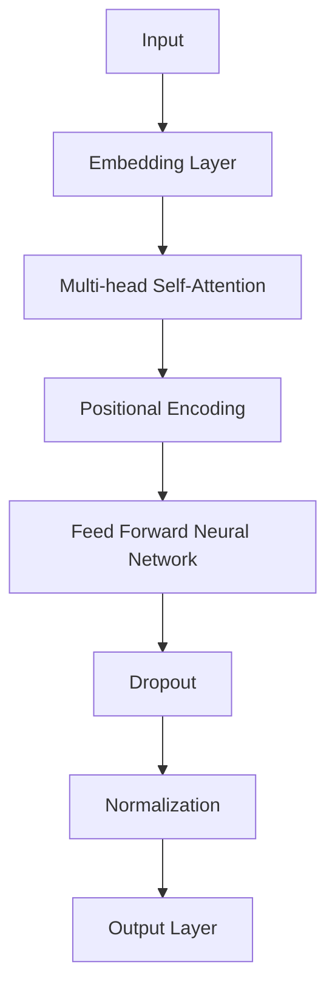
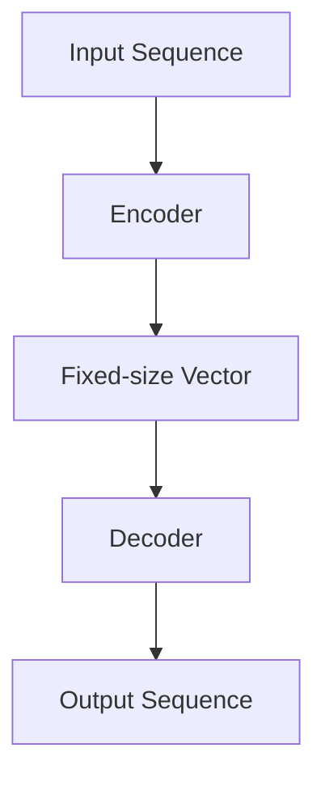
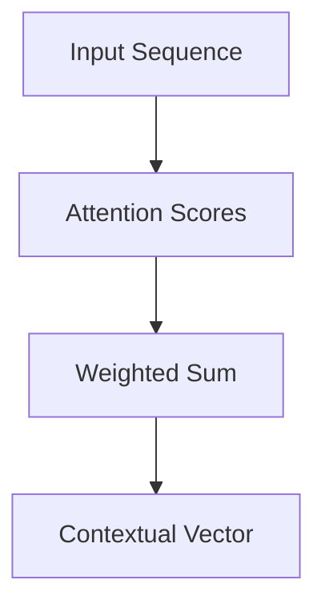
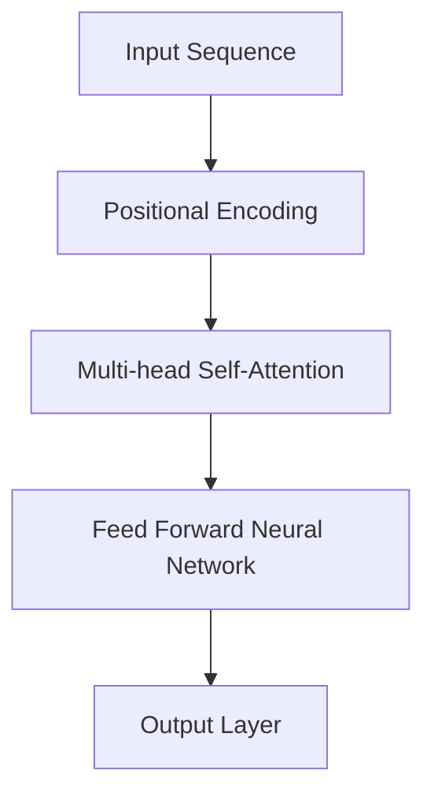
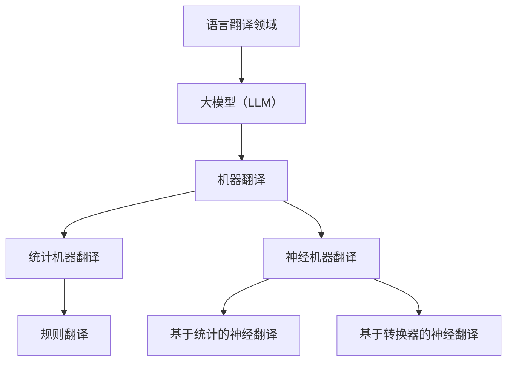

                 

# 第一部分：语言翻译领域概述

## 1.1 语言翻译领域的基本概念

### 1.1.1 语言翻译的定义

语言翻译是指将一种自然语言（源语言）转换成另一种自然语言（目标语言）的过程。翻译不仅仅是对文字的转换，还需要传达原文的意图、风格和情感。语言翻译的目的是为了消除语言障碍，使不同语言的人能够相互理解和交流。

### 1.1.2 语言翻译的历史与发展

语言翻译的历史可以追溯到古代文明时期。随着贸易、文化交流和战争的发展，翻译成为了一种基本的需求。早期的翻译主要依靠人力，通过记忆和模仿原文的表达方式进行翻译。

现代语言翻译技术的发展始于20世纪中叶，特别是计算机科学和人工智能的兴起。最初的翻译系统依赖于规则和方法，如基于规则的翻译系统（RBMT）和基于实例的翻译系统（IBMT）。这些系统通过对源语言和目标语言之间的语法和词汇规则进行编码来实现翻译。

### 1.1.3 语言翻译的重要性

语言翻译在现代社会中扮演着重要的角色。它促进了全球交流和合作，使得不同国家和地区的文化、科技、经济等信息能够更广泛地传播。以下是语言翻译的重要性的一些方面：

- **国际商务**：随着全球化的发展，跨国公司和企业需要处理不同语言的重要文件、合同和商业信息。高质量的翻译能够确保信息的准确性和合规性。
- **文化交流**：文学、艺术和电影的翻译使得不同文化的优秀作品能够被更多受众欣赏和理解。
- **教育和科研**：学术文献、研究报告和教材的翻译促进了学术交流和知识的传播，有助于提高教育质量和科研水平。
- **政治和外交**：国际会议、外交谈判和政府文件需要高质量的翻译，以确保沟通的准确性和有效性。

## 1.2 语言翻译的技术分类

### 1.2.1 机器翻译（MT）

机器翻译（Machine Translation，MT）是使用计算机程序自动将一种语言翻译成另一种语言的技术。根据翻译方法的不同，机器翻译可以分为以下几种类型：

- **基于规则的机器翻译（RBMT）**：该方法依赖于人工编写的语法和词汇规则，将源语言的句子结构转换成目标语言的句子结构。
- **基于实例的机器翻译（IBMT）**：该方法使用大量的双语文本作为翻译实例，通过匹配和转换源语言和目标语言的单词和短语来实现翻译。
- **统计机器翻译（SMT）**：该方法使用大量的双语文本进行统计分析和模型训练，通过概率模型来预测源语言和目标语言之间的映射关系。
- **神经机器翻译（NMT）**：该方法是基于深度学习的机器翻译技术，使用神经网络模型进行端到端的翻译，近年来取得了显著的进展。

### 1.2.2 统计机器翻译（SMT）

统计机器翻译（Statistical Machine Translation，SMT）是一种基于概率模型的机器翻译技术。它使用大量的双语文本作为训练数据，通过统计方法学习源语言和目标语言之间的映射关系。

SMT的主要组成部分包括：

- **翻译模型（Translation Model）**：使用条件概率模型来预测目标语言单词在给定源语言单词序列的情况下出现的概率。
- **语言模型（Language Model）**：使用概率模型来预测目标语言句子在给定上下文的情况下出现的概率。
- **特征函数**：将源语言和目标语言的单词和句子转换为特征向量，用于训练和预测。

### 1.2.3 神经机器翻译（NMT）

神经机器翻译（Neural Machine Translation，NMT）是近年来发展起来的一种基于深度学习的机器翻译技术。与传统的统计机器翻译方法相比，NMT通过使用神经网络模型进行端到端的翻译，提高了翻译质量和效率。

NMT的主要组成部分包括：

- **编码器（Encoder）**：将源语言句子编码为一个固定长度的向量表示。
- **解码器（Decoder）**：将编码器的输出解码为目标语言句子。
- **注意力机制（Attention Mechanism）**：用于在编码器的输出中提取与解码器当前步骤相关的上下文信息。

### 1.2.4 其他翻译技术

除了上述主流的机器翻译技术外，还有一些其他的翻译技术，如：

- **基于实例的翻译系统（IBMT）**：使用大量的双语文本实例进行翻译，通过模式匹配和转换来实现翻译。
- **基于统计的机器翻译（SMT）**：使用统计方法学习源语言和目标语言之间的映射关系，如基于短语的翻译方法。
- **基于规则的方法（RBMT）**：使用人工编写的语法和词汇规则进行翻译，通过转换源语言句子结构来实现翻译。

## 1.3 语言翻译在现实中的应用

### 1.3.1 商业应用

语言翻译在商业领域有广泛的应用。企业需要处理不同语言的商业文件、合同、营销材料和产品说明，以确保全球业务的无缝运营。以下是一些商业应用实例：

- **跨国公司**：跨国公司需要翻译员工手册、培训材料、营销资料和客户支持信息，以适应不同国家的市场和文化。
- **电子商务**：电子商务平台需要提供多语言界面和产品描述，以吸引全球客户。
- **法律和金融**：法律文件、金融报告和合同需要准确翻译，以确保合规性和法律效力。

### 1.3.2 政府应用

政府机构也需要进行大量的翻译工作，以支持国际事务和跨文化交流。以下是一些政府应用实例：

- **外交事务**：政府需要翻译外交文件、会谈记录和外交信函，以确保国际关系的顺畅和稳定。
- **立法和司法**：法律文件、立法草案和司法判决需要翻译，以支持跨国法律合作和司法判决的执行。
- **公共服务**：政府需要翻译公共服务信息，如公民指南、政策文件和政府公告，以提供无障碍的公共服务。

### 1.3.3 社交应用

社交应用如社交媒体平台、即时通讯工具和在线论坛也越来越多地依赖于语言翻译功能，以促进跨文化交流和互动。以下是一些社交应用实例：

- **社交媒体**：社交媒体平台如Facebook、Twitter和Instagram提供自动翻译功能，使全球用户能够理解和发布多语言内容。
- **即时通讯**：即时通讯应用如WhatsApp和Telegram提供自动翻译功能，帮助用户进行跨语言交流。
- **在线论坛**：在线论坛和社区平台如Reddit和Quora提供自动翻译功能，以促进不同语言用户之间的互动和讨论。

## 1.4 语言翻译面临的挑战

### 1.4.1 词汇差异与歧义

词汇差异是语言翻译中的一个重要挑战。不同语言之间存在词汇差异，某些词汇在一种语言中有特定的含义，而在另一种语言中可能没有对应词。此外，同一词汇在不同语言中可能有不同的含义，导致翻译时需要根据上下文进行选择。

歧义也是语言翻译中的一个难题。歧义是指一个词或句子在语义上有多种可能的解释。翻译时需要根据上下文选择最合适的解释，以确保翻译的准确性和连贯性。

### 1.4.2 语法结构差异

不同语言的语法结构也存在差异。例如，一些语言具有复杂的语法规则，如动词变位、名词性别和数的变化等。翻译时需要遵循目标语言的语法规则，以确保翻译的语法正确性。

另外，一些语言具有不同的句法结构，如主语-谓语-宾语（SVO）和谓语-主语-宾语（SOV）。翻译时需要根据目标语言的句法结构进行调整，以保持句子的流畅和自然。

### 1.4.3 文化差异与幽默

文化差异是语言翻译中的另一个挑战。不同文化之间存在价值观、习俗和表达方式等方面的差异。翻译时需要考虑到文化差异，以确保翻译的内容符合目标文化的习惯和价值观。

幽默翻译也是一个棘手的问题。幽默通常依赖于语言和文化背景，因此在翻译时需要特别注意。有时，直接翻译幽默可能无法传达原文的效果，甚至可能产生误解或冒犯。

## 1.5 语言翻译技术的发展趋势

随着人工智能和深度学习技术的快速发展，语言翻译技术也在不断进步。以下是一些语言翻译技术的发展趋势：

### 1.5.1 大模型（LLM）的兴起

大模型（Large Language Model，LLM）是一种基于深度学习的语言模型，具有强大的语义理解和生成能力。LLM在语言翻译中的应用已经取得了显著进展，能够提供更准确、自然的翻译结果。

### 1.5.2 多语言翻译系统的开发

多语言翻译系统可以同时支持多种语言的翻译，提高翻译的效率和灵活性。随着全球化的不断深入，多语言翻译系统的需求也在不断增加。

### 1.5.3 个性化翻译

个性化翻译是根据用户的语言偏好、背景知识和文化习惯，为用户提供定制化的翻译服务。个性化翻译可以提高翻译的用户体验，满足不同用户的需求。

### 1.5.4 多模态翻译

多模态翻译是将不同类型的媒体内容（如文本、图像、语音等）进行翻译的技术。多模态翻译可以更好地理解上下文信息，提高翻译的准确性和自然性。

### 1.5.5 翻译辅助工具的发展

随着翻译技术的发展，各种翻译辅助工具也应运而生，如翻译记忆库、翻译质量评估工具和翻译建议系统等。这些工具可以大大提高翻译的效率和准确性。

## 1.6 总结

语言翻译领域是一个复杂而多样化的领域，涉及到语言学、计算机科学、人工智能等多个学科。随着技术的不断发展，语言翻译技术也在不断进步，为全球交流和合作提供了重要的支持。然而，语言翻译仍面临许多挑战，需要进一步的研究和探索。

在本文中，我们将进一步探讨大模型（LLM）在语言翻译中的应用，分析其优势和应用场景，以及面临的挑战和未来发展趋势。接下来，我们将进入第二部分，介绍大模型（LLM）的基础知识。 <|endoftext|>

## 2.1 大模型（LLM）概述

大模型（LLM，Large Language Model）是指具有巨大参数量和训练数据规模的深度学习模型，通常基于神经网络架构，用于处理自然语言文本。LLM在自然语言处理（NLP，Natural Language Processing）领域取得了显著进展，特别是在文本生成、文本分类、机器翻译等方面。

### 2.1.1 大模型的定义

大模型通常指的是那些具有数十亿甚至数千亿参数的深度学习模型。这些模型通过在大规模数据集上进行训练，学习到语言的深层结构和语义信息，从而在许多NLP任务中表现出色。例如，BERT（Bidirectional Encoder Representations from Transformers）就是一个著名的大模型，它通过预训练和微调在各种语言任务中取得了优异的性能。

### 2.1.2 大模型的架构

大模型通常采用神经网络架构，特别是基于变换器（Transformer）的架构。变换器模型的核心是自注意力机制（Self-Attention），它能够有效地捕捉输入序列中的长距离依赖关系。此外，大模型还可能包含多层神经网络和复杂的正则化技巧，如Dropout、权重共享等，以提高模型的泛化能力和训练效率。

以下是一个简化的变换器模型架构的Mermaid流程图：



### 2.1.3 大模型的工作原理

大模型的工作原理主要包括以下步骤：

1. **输入编码**：将输入文本转换为向量表示。这通常通过嵌入层（Embedding Layer）实现，将单词映射为固定长度的向量。
2. **自注意力机制**：通过自注意力机制（Self-Attention）计算输入文本的上下文表示。自注意力机制能够自动关注输入序列中与当前位置相关的关键信息。
3. **前馈神经网络**：将自注意力机制的输出通过前馈神经网络（Feed Forward Neural Network）进行处理，进一步提取特征和关系。
4. **输出生成**：最终，模型通过输出层（Output Layer）生成预测结果。对于不同的任务，输出层可能包含分类器、回归器或文本生成器等。

以下是一个简化的伪代码，展示了大模型的工作流程：

```python
# 输入编码
inputs = tokenizer.encode(text)

# 自注意力计算
contextual_embeddings = multi_head_self_attention(inputs)

# 前馈神经网络
output = feed_forward_network(contextual_embeddings)

# 输出生成
predictions = output_layer(output)

# 预测
predicted_labels = np.argmax(predictions, axis=1)
```

## 2.2 大模型（LLM）的发展历程

### 2.2.1 早期神经网络

早期的大模型研究可以追溯到20世纪80年代和90年代。当时，研究人员开始探索使用神经网络进行自然语言处理。这些早期的神经网络模型，如感知机（Perceptron）和反向传播（Backpropagation）网络，虽然在某些简单任务上表现良好，但在处理复杂语言结构时遇到了困难。

### 2.2.2 深度学习的兴起

深度学习的兴起为自然语言处理带来了新的机遇。2006年，Hinton等人提出了深度信念网络（Deep Belief Networks），为深度学习的发展奠定了基础。随后，Hinton等人于2012年提出了AlexNet，这一突破性的卷积神经网络在ImageNet图像识别挑战赛中取得了显著成果。

深度学习技术的发展使得大模型能够通过更深的网络结构和更大的训练数据集进行训练，从而在学习复杂特征和模式方面取得了显著进展。这些进展为大模型的发展提供了动力。

### 2.2.3 大模型的崛起

随着计算能力的提升和大数据的可用性，大模型开始崛起。2018年，谷歌推出了BERT模型，这是第一个具有数十亿参数的大规模预训练语言模型。BERT的成功激发了学术界和工业界的广泛关注和研究，推动了大规模预训练语言模型的快速发展。

近年来，OpenAI、微软、百度等公司也相继推出了自己的大规模预训练语言模型，如GPT-3、Turing-NLG和ERNIE。这些大模型在文本生成、机器翻译、问答系统等任务上取得了优异的性能，标志着大模型在NLP领域的重要性。

## 2.3 大模型（LLM）的主要类型

### 2.3.1 序列到序列（Seq2Seq）模型

序列到序列（Seq2Seq）模型是一种经典的深度学习模型，用于处理输入序列和输出序列之间的转换任务。在机器翻译、文本摘要和对话系统等领域，Seq2Seq模型表现出色。Seq2Seq模型通常由编码器（Encoder）和解码器（Decoder）组成，其中编码器将输入序列编码为固定长度的向量表示，解码器则从编码器的输出中生成输出序列。

以下是一个简化的Seq2Seq模型的Mermaid流程图：



### 2.3.2 自注意力机制（Attention Mechanism）

自注意力机制（Attention Mechanism）是变换器（Transformer）模型的核心组件，它允许模型在处理输入序列时，动态地关注序列中的不同部分。自注意力机制通过计算输入序列中各个位置之间的相似性，为每个输入位置生成权重，从而实现关注序列中的重要信息。

以下是一个简化的自注意力机制的Mermaid流程图：



### 2.3.3 Transformer模型

Transformer模型是一种基于自注意力机制的深度学习模型，广泛应用于NLP任务。Transformer模型通过引入多头注意力机制（Multi-head Attention）和位置编码（Positional Encoding），使得模型能够有效地捕捉输入序列中的长距离依赖关系。

以下是一个简化的Transformer模型的Mermaid流程图：



## 2.4 大模型（LLM）的训练与优化

### 2.4.1 数据集选择

大模型的训练需要大量的高质量数据集。数据集的选择对模型的性能和泛化能力至关重要。以下是一些常见的数据集选择策略：

- **多领域数据集**：选择涵盖多个领域的数据集，以提高模型在不同领域的泛化能力。
- **大规模数据集**：选择具有大规模文本数据的数据集，以确保模型能够充分学习到语言的复杂结构。
- **注释数据集**：选择具有高质量注释的数据集，以确保模型能够从数据中学习到正确的知识和规律。

### 2.4.2 训练策略

大模型的训练通常采用以下策略：

- **预训练与微调**：首先在大规模数据集上进行预训练，使模型学习到语言的通用特征和规律。然后，在特定任务上进行微调，使模型适应特定的任务需求。
- **多任务学习**：通过在多个任务上同时训练模型，提高模型对任务的泛化能力。
- **持续学习**：通过不断更新模型和数据，使模型能够适应不断变化的语言环境和任务需求。

### 2.4.3 模型优化技巧

大模型的训练和优化涉及到许多技巧，以下是一些常用的优化技巧：

- **批量归一化（Batch Normalization）**：通过在每个批量上归一化模型的激活值，提高模型的训练稳定性和收敛速度。
- **Dropout**：通过随机丢弃一部分神经元，防止模型过拟合。
- **学习率调整**：通过动态调整学习率，优化模型的收敛速度和性能。
- **优化器选择**：选择合适的优化器，如Adam、RMSProp等，以加速模型的训练过程。

## 2.5 大模型（LLM）的优势与挑战

### 2.5.1 优势

大模型（LLM）在自然语言处理领域具有以下优势：

- **强大的语义理解能力**：大模型通过大规模数据预训练，能够捕捉到语言的深层语义信息，从而在文本生成、文本分类、机器翻译等任务中表现出色。
- **端到端的模型架构**：大模型采用端到端的架构，使得模型可以直接从输入文本生成输出文本，避免了传统机器翻译方法中需要的手动构建规则和特征提取的复杂过程。
- **多语言支持**：大模型通常具备多语言能力，能够在多种语言之间进行翻译和生成。

### 2.5.2 挑战

尽管大模型在自然语言处理领域取得了显著进展，但仍然面临以下挑战：

- **计算资源需求**：大模型的训练和推理需要大量的计算资源，对于普通的计算设备来说可能难以承受。
- **数据隐私和安全**：大模型在训练过程中需要大量的文本数据，这些数据可能包含敏感信息和隐私，如何保护数据隐私和安全是一个重要问题。
- **解释性和可解释性**：大模型的决策过程通常是黑箱的，缺乏透明性和可解释性，这对于某些应用场景（如法律、医疗等）来说可能是一个挑战。

在接下来的部分，我们将探讨大模型（LLM）在语言翻译中的具体应用，分析其优势和应用场景，以及面临的挑战和未来发展趋势。让我们继续深入探讨这一激动人心的领域。 <|endoftext|>

## 3.1 语言翻译中的大模型（LLM）应用概述

随着深度学习和自然语言处理技术的不断进步，大模型（LLM，Large Language Model）在语言翻译中的应用取得了显著突破。LLM通过其强大的语义理解和生成能力，为机器翻译带来了前所未有的效率和准确性。

### 3.1.1 大模型（LLM）在语言翻译中的优势

大模型在语言翻译中的优势主要体现在以下几个方面：

- **强大的语义理解能力**：大模型通过大规模数据的预训练，能够深入理解语言的语义和上下文信息，这使得翻译结果更加自然、准确。
- **端到端的模型架构**：大模型采用端到端的架构，直接从输入文本生成输出文本，避免了传统机器翻译方法中需要手动构建规则和特征提取的复杂过程，提高了翻译效率和效果。
- **多语言支持**：大模型通常具备多语言能力，能够在多种语言之间进行翻译和生成，为跨语言交流提供了便捷的工具。
- **适应性**：大模型能够通过微调（Fine-tuning）快速适应特定的翻译任务，使其在特定领域或应用中的翻译效果更加优秀。

### 3.1.2 大模型（LLM）在语言翻译中的劣势

尽管大模型在语言翻译中具有显著优势，但同时也存在一些劣势：

- **计算资源需求**：大模型的训练和推理需要大量的计算资源，特别是训练阶段，这可能导致成本高昂，对于资源有限的团队或个人来说可能难以承受。
- **数据隐私和安全**：大模型在训练过程中需要大量的文本数据，这些数据可能包含敏感信息和隐私，如何保护数据隐私和安全是一个重要问题。
- **解释性和可解释性**：大模型的决策过程通常是黑箱的，缺乏透明性和可解释性，这对于某些应用场景（如法律、医疗等）来说可能是一个挑战。
- **对特定领域知识的依赖**：大模型在特定领域的知识可能有限，这可能影响其在某些专业领域的翻译质量。

## 3.2 大模型（LLM）在机器翻译中的具体应用

大模型（LLM）在机器翻译中的应用主要体现在统计机器翻译（SMT）和神经机器翻译（NMT）中。

### 3.2.1 大模型在统计机器翻译中的应用

在统计机器翻译中，大模型可以通过改进翻译模型（Translation Model）和语言模型（Language Model）来提升翻译效果。

- **改进翻译模型**：大模型可以通过学习源语言和目标语言之间的复杂关系，提高翻译模型的准确性。例如，使用大规模的双语语料库训练大模型，然后利用训练好的模型生成翻译规则。
- **改进语言模型**：大模型可以学习到目标语言的语法和语义特征，从而提高语言模型的准确性。这有助于生成更加自然的翻译结果。

以下是一个简化的伪代码示例，展示了大模型在统计机器翻译中的应用：

```python
# 加载大规模双语语料库
corpus = load_corpus("bilingual_corpus.txt")

# 训练大模型
model = train_large_model(corpus)

# 生成翻译规则
translation_rules = generate_translation_rules(model)

# 使用翻译规则进行翻译
translated_sentence = translate(sentence, translation_rules)
```

### 3.2.2 大模型在神经机器翻译中的应用

在神经机器翻译中，大模型可以通过改进编码器（Encoder）和解码器（Decoder）来提升翻译效果。

- **改进编码器**：大模型可以学习到源语言的复杂结构和语义信息，从而提高编码器的表达能力。这有助于生成更加准确和丰富的上下文表示。
- **改进解码器**：大模型可以学习到目标语言的语法和语义特征，从而提高解码器的生成能力。这有助于生成更加自然和流畅的翻译结果。

以下是一个简化的伪代码示例，展示了大模型在神经机器翻译中的应用：

```python
# 加载大规模双语语料库
corpus = load_corpus("bilingual_corpus.txt")

# 训练大模型
model = train_large_model(corpus)

# 训练编码器和解码器
encoder = train_encoder(model, corpus)
decoder = train_decoder(model, corpus)

# 进行翻译
translated_sentence = translate(sentence, encoder, decoder)
```

## 3.3 大模型（LLM）在专业翻译中的应用

大模型（LLM）在专业翻译中的应用主要体现在法律翻译、医学翻译和科技翻译等领域。

### 3.3.1 法律翻译

法律翻译要求翻译结果准确、严谨，以确保法律文件的有效性和合法性。大模型在法律翻译中的应用可以显著提高翻译效率和准确性：

- **术语库**：大模型可以学习到大量的法律术语和概念，从而为法律翻译提供丰富的术语库支持。
- **语义分析**：大模型可以深入理解法律文本的语义，从而生成更加准确和合适的翻译结果。

### 3.3.2 医学翻译

医学翻译涉及大量的专业术语和复杂的概念，要求翻译结果准确、无误。大模型在医学翻译中的应用可以显著提高翻译质量和效率：

- **术语库**：大模型可以学习到大量的医学术语和概念，从而为医学翻译提供丰富的术语库支持。
- **知识图谱**：大模型可以结合医学知识图谱，提高对医学文本的理解和翻译准确性。

### 3.3.3 科技翻译

科技翻译涉及广泛的领域，包括计算机科学、工程、物理学等。大模型在科技翻译中的应用可以显著提高翻译质量和效率：

- **术语库**：大模型可以学习到大量的科技术语和概念，从而为科技翻译提供丰富的术语库支持。
- **多语言支持**：大模型通常具备多语言能力，可以在多种语言之间进行翻译，为跨国科技合作提供支持。

## 3.4 大模型（LLM）在实时翻译中的应用

大模型（LLM）在实时翻译中的应用主要体现在语音翻译、文本翻译和视频翻译等领域。

### 3.4.1 语音翻译

语音翻译是指将一种语言的语音转换为另一种语言的语音。大模型在语音翻译中的应用可以通过以下步骤实现：

- **语音识别**：使用语音识别技术将源语言的语音转换为文本。
- **文本翻译**：使用大模型进行文本翻译，将源语言文本转换为目标语言文本。
- **语音合成**：使用语音合成技术将目标语言文本转换为语音。

### 3.4.2 文本翻译

文本翻译是指将一种语言的文本转换为另一种语言的文本。大模型在文本翻译中的应用可以通过以下步骤实现：

- **输入文本预处理**：对输入文本进行清洗和预处理，如去除特殊字符、标点符号等。
- **文本编码**：使用大模型的编码器将预处理后的文本转换为向量表示。
- **文本翻译**：使用大模型进行翻译，将源语言文本向量表示转换为目标语言文本向量表示。
- **输出文本解码**：使用大模型的解码器将目标语言文本向量表示解码为目标语言文本。

### 3.4.3 视频翻译

视频翻译是指将一种语言的视频内容转换为另一种语言的视频内容。大模型在视频翻译中的应用可以通过以下步骤实现：

- **视频文本提取**：使用语音识别技术从视频内容中提取源语言文本。
- **文本翻译**：使用大模型进行文本翻译，将源语言文本转换为目标语言文本。
- **视频生成**：使用语音合成技术将目标语言文本转换为语音，并生成视频内容。

## 3.5 大模型（LLM）在翻译辅助工具中的应用

大模型（LLM）在翻译辅助工具中的应用可以显著提高翻译效率和准确性。以下是一些常见的翻译辅助工具：

### 3.5.1 翻译记忆库

翻译记忆库（Translation Memory，TM）是一种存储已翻译文本段的数据库，可以用于快速检索和重用已翻译的文本。大模型在翻译记忆库中的应用可以通过以下步骤实现：

- **文本预处理**：对输入文本进行清洗和预处理，如去除特殊字符、标点符号等。
- **文本编码**：使用大模型的编码器将预处理后的文本转换为向量表示。
- **查询和匹配**：使用大模型对翻译记忆库中的文本向量进行查询和匹配，找到与输入文本最相似的已翻译文本段。
- **翻译生成**：根据匹配结果生成翻译结果。

### 3.5.2 翻译质量评估

翻译质量评估（Translation Quality Assessment，TQA）是一种评估翻译文本质量的方法，可以用于评估翻译系统的性能。大模型在翻译质量评估中的应用可以通过以下步骤实现：

- **翻译文本预处理**：对翻译文本进行清洗和预处理，如去除特殊字符、标点符号等。
- **文本编码**：使用大模型的编码器将预处理后的翻译文本转换为向量表示。
- **质量评估**：使用大模型对翻译文本进行质量评估，如计算翻译文本的语法、语义、风格等指标。
- **评估结果输出**：输出翻译质量评估结果，如翻译文本的准确率、流畅度等。

### 3.5.3 翻译建议系统

翻译建议系统（Translation Suggestion System，TSS）是一种提供翻译建议的工具，可以用于辅助翻译人员和翻译系统。大模型在翻译建议系统中的应用可以通过以下步骤实现：

- **文本预处理**：对输入文本进行清洗和预处理，如去除特殊字符、标点符号等。
- **文本编码**：使用大模型的编码器将预处理后的文本转换为向量表示。
- **翻译建议生成**：使用大模型对输入文本生成翻译建议，如翻译文本的不同变体。
- **建议筛选**：根据翻译建议的准确性、流畅度等因素，筛选出最佳翻译建议。

## 3.6 大模型（LLM）在语言翻译中的突破性进展

大模型（LLM）在语言翻译中的突破性进展体现在以下几个方面：

### 3.6.1 语言理解能力的提升

随着大模型参数量和训练数据的增加，其语言理解能力得到了显著提升。大模型能够更好地理解复杂句子的结构、语义和上下文信息，从而生成更加准确和自然的翻译结果。

### 3.6.2 语言生成的改进

大模型的生成能力得到了显著提升。通过自注意力机制和多头注意力机制，大模型能够捕捉输入文本的上下文信息，从而生成更加连贯、流畅的翻译结果。

### 3.6.3 翻译质量的提升

大模型在翻译质量评估中表现出色，其生成的翻译文本在语法、语义和风格方面具有更高的准确性。此外，大模型能够自动适应不同的翻译场景和任务，从而提供高质量的翻译服务。

## 3.7 大模型（LLM）在跨语言学习中的应用

大模型（LLM）在跨语言学习中的应用主要体现在跨语言迁移学习和跨语言知识蒸馏两个方面。

### 3.7.1 跨语言迁移学习

跨语言迁移学习（Cross-lingual Transfer Learning）是指将在一个语言上训练好的模型应用于其他语言上的方法。大模型通过跨语言迁移学习，可以在没有大量双语数据的情况下，将一种语言的模型知识迁移到其他语言上，从而提高翻译质量。

### 3.7.2 跨语言知识蒸馏

跨语言知识蒸馏（Cross-lingual Knowledge Distillation）是指将一个大模型的知识传递给一个小模型的方法。大模型通过跨语言知识蒸馏，可以将自己的知识传递给一个小模型，从而提高小模型的翻译质量。

## 3.8 大模型（LLM）在多语言翻译中的应用

大模型（LLM）在多语言翻译中的应用主要体现在多语言翻译系统的设计和评估方面。

### 3.8.1 多语言翻译系统设计

多语言翻译系统设计需要考虑以下几个方面：

- **模型选择**：选择适合多语言翻译的大模型，如Transformer模型。
- **数据集选择**：选择涵盖多种语言的数据集，进行模型训练和评估。
- **翻译策略**：设计合适的翻译策略，如基于自注意力机制的端到端翻译。

### 3.8.2 多语言翻译评估标准

多语言翻译评估标准主要包括以下几个方面：

- **翻译准确性**：评估翻译结果的准确性，通常使用BLEU、METEOR等评价指标。
- **翻译流畅度**：评估翻译结果的流畅度，通常通过人工评估和自动评估方法。
- **翻译一致性**：评估翻译结果的连贯性和一致性，通常使用一致性指标。

## 3.9 大模型（LLM）在多模态翻译中的应用

大模型（LLM）在多模态翻译中的应用主要体现在视频翻译、图像翻译和声音翻译等方面。

### 3.9.1 视频翻译

视频翻译是指将一种语言的视频内容转换为另一种语言的视频内容。大模型在视频翻译中的应用可以通过以下步骤实现：

- **视频文本提取**：使用语音识别技术从视频内容中提取源语言文本。
- **文本翻译**：使用大模型进行文本翻译，将源语言文本转换为目标语言文本。
- **视频生成**：使用语音合成技术将目标语言文本转换为语音，并生成视频内容。

### 3.9.2 图像翻译

图像翻译是指将一种语言的图像内容转换为另一种语言的图像内容。大模型在图像翻译中的应用可以通过以下步骤实现：

- **图像文本提取**：使用图像识别技术从图像内容中提取源语言文本。
- **文本翻译**：使用大模型进行文本翻译，将源语言文本转换为目标语言文本。
- **图像生成**：使用图像合成技术将目标语言文本转换为图像。

### 3.9.3 声音翻译

声音翻译是指将一种语言的语音转换为另一种语言的语音。大模型在声音翻译中的应用可以通过以下步骤实现：

- **语音识别**：使用语音识别技术将源语言的语音转换为文本。
- **文本翻译**：使用大模型进行文本翻译，将源语言文本转换为目标语言文本。
- **语音合成**：使用语音合成技术将目标语言文本转换为语音。

## 3.10 大模型（LLM）在个性化翻译中的应用

大模型（LLM）在个性化翻译中的应用主要体现在用户偏好学习、个性化翻译系统和个性化翻译效果评估方面。

### 3.10.1 用户偏好学习

用户偏好学习是指通过分析用户的语言使用习惯、历史翻译记录等信息，学习用户的个性化翻译偏好。大模型可以通过以下方法实现用户偏好学习：

- **数据收集**：收集用户的历史翻译记录、交互记录等信息。
- **特征提取**：提取与用户翻译偏好相关的特征，如词汇偏好、语法偏好等。
- **模型训练**：使用收集到的数据训练用户偏好模型。

### 3.10.2 个性化翻译系统设计

个性化翻译系统设计需要考虑以下几个方面：

- **用户偏好集成**：将用户偏好集成到翻译模型中，以提高个性化翻译效果。
- **翻译策略**：设计适合个性化翻译的翻译策略，如基于用户偏好的动态翻译策略。
- **系统评估**：评估个性化翻译系统的效果，如翻译准确性、用户满意度等。

### 3.10.3 个性化翻译效果评估

个性化翻译效果评估是指评估个性化翻译系统的效果，通常使用以下指标：

- **翻译准确性**：评估翻译结果的准确性，通常使用BLEU、METEOR等评价指标。
- **用户满意度**：评估用户对个性化翻译系统的满意度，通常通过用户调查和反馈收集。
- **翻译多样性**：评估翻译结果的多样性，以避免翻译结果过于单一。

## 3.11 大模型（LLM）在语言翻译中的未来发展趋势

随着人工智能和深度学习技术的不断发展，大模型（LLM）在语言翻译中的应用前景广阔。以下是一些未来发展趋势：

### 3.11.1 大模型技术的演进

大模型技术将继续演进，模型规模将进一步增大，计算能力将不断提高。未来可能出现更多参数量更大的模型，如数千亿参数的模型。

### 3.11.2 翻译技术的创新

翻译技术将不断创新，如多模态翻译、实时翻译、语音翻译等。这些创新将为用户提供更加便捷和高效的翻译服务。

### 3.11.3 语言翻译领域的生态建设

语言翻译领域的生态建设将得到加强，包括翻译数据集的共享、翻译工具的开放、翻译标准的制定等。这些举措将推动语言翻译技术的发展和应用。

### 3.11.4 翻译服务的普及

随着大模型技术的普及，语言翻译服务将更加普及，如在线翻译工具、智能客服、教育翻译等。这些服务将大大促进全球交流和合作。

## 3.12 大模型（LLM）在语言翻译中的潜在应用场景

大模型（LLM）在语言翻译中的潜在应用场景非常广泛，以下是一些具体的潜在应用场景：

### 3.12.1 增强现实与虚拟现实

在增强现实（AR）和虚拟现实（VR）应用中，大模型可以提供实时语音翻译和文本翻译功能，使全球用户能够无障碍地进行交互。

### 3.12.2 智能助理与客服

智能助理和客服系统可以集成大模型，提供多语言支持，以提高客户服务质量和用户体验。

### 3.12.3 教育与培训

在教育领域，大模型可以提供实时翻译和学习资源，帮助不同语言的学生进行跨文化交流和学习。

### 3.12.4 医疗与健康

在医疗领域，大模型可以提供医学翻译和健康咨询，帮助医生和患者进行跨语言交流。

### 3.12.5 政治与外交

在政治和外交领域，大模型可以提供实时翻译和文本分析，支持国际事务和外交交流。

### 3.12.6 企业与金融

在企业与金融领域，大模型可以提供多语言支持，帮助企业进行跨国业务和金融交易。

## 3.13 大模型（LLM）在语言翻译中的法律与伦理问题

随着大模型（LLM）在语言翻译中的应用日益广泛，法律和伦理问题也日益突出。以下是一些主要的法律与伦理问题：

### 3.13.1 翻译准确性责任

大模型生成的翻译结果可能存在准确性问题，如何界定翻译准确性责任成为了一个重要问题。这可能涉及到法律纠纷和责任承担。

### 3.13.2 知识产权保护

大模型在训练过程中使用的大量文本数据可能涉及知识产权问题，如何保护原创作者的知识产权成为了一个挑战。

### 3.13.3 数据隐私与安全

大模型在训练和推理过程中需要处理大量的个人数据，如何保护用户隐私和安全成为了一个关键问题。

### 3.13.4 文化与道德规范

大模型在翻译过程中可能涉及文化冲突和道德问题，如何尊重不同文化和道德规范成为了一个挑战。

## 3.14 大模型（LLM）在语言翻译中的国际合作与竞争

随着大模型（LLM）在语言翻译中的应用不断深入，国际合作与竞争也将日益激烈。以下是一些国际合作与竞争的方向：

### 3.14.1 国际技术合作

各国和研究机构可以合作开发大模型，共同推动语言翻译技术的发展。例如，共享翻译数据集、开源翻译模型等。

### 3.14.2 竞争态势分析

各国和研究机构将竞争开发更先进的大模型，争夺市场份额和技术领先地位。这包括提高模型性能、降低成本、优化应用场景等。

### 3.14.3 未来合作方向

未来，国际社会可以共同制定语言翻译领域的标准和规范，促进技术交流和合作，推动语言翻译技术的可持续发展。

## 附录 A：LLM在语言翻译领域的技术资源与工具

### 3.15.1 开源预训练模型

以下是一些流行的开源预训练模型：

- **BERT**：由Google开发，是一种双向变换器模型，广泛应用于文本分类、机器翻译等任务。
- **GPT-3**：由OpenAI开发，是一种基于变换器的语言生成模型，具有强大的文本生成能力。
- **XLNet**：由Google开发，是一种基于自注意力机制的变换器模型，在许多NLP任务中表现出色。
- **T5**：由Google开发，是一种基于变换器的文本到文本的预训练模型，具有广泛的应用潜力。

### 3.15.2 语言翻译框架

以下是一些流行的语言翻译框架：

- **Transformer**：由Google开发，是一种基于变换器的神经网络架构，广泛应用于机器翻译任务。
- **SMT**：用于统计机器翻译的开源框架，支持多种语言和翻译模型。
- **NMT**：用于神经机器翻译的开源框架，支持多种变换器架构和翻译策略。

### 3.15.3 翻译质量评估工具

以下是一些流行的翻译质量评估工具：

- **BLEU**：基于编辑距离的翻译质量评估工具，广泛应用于机器翻译评估。
- **METEOR**：基于词性、句法和语义的翻译质量评估工具，提供更细粒度的评估指标。
- **NIST**：基于人类评分的翻译质量评估工具，提供最准确的评估结果。

## 附录 B：案例研究与实际应用

### 3.16.1 语言翻译企业案例分析

以下是一些在语言翻译领域具有代表性的企业案例分析：

- **微软**：微软的翻译服务支持多种语言，通过大规模预训练模型和实时翻译技术，提供高效、准确的翻译服务。
- **谷歌**：谷歌的翻译服务是全球最受欢迎的翻译工具之一，通过变换器模型和深度学习技术，提供高质量的翻译结果。
- **百度**：百度的翻译服务结合了机器翻译和深度学习技术，提供实时语音翻译、文本翻译和图像翻译等多种功能。

### 3.16.2 政府与公共机构应用案例

以下是一些政府与公共机构在语言翻译领域的应用案例：

- **联合国**：联合国通过翻译服务支持多语言交流，促进了国际事务的合作和协调。
- **欧盟**：欧盟提供多语言翻译服务，支持成员国之间的交流与合作。
- **美国政府**：美国政府通过翻译服务支持跨文化交流，为国际事务提供支持。

### 3.16.3 普通用户应用案例

以下是一些普通用户在语言翻译领域的应用案例：

- **旅游**：用户在旅行过程中使用翻译工具，帮助自己理解和沟通当地语言。
- **学习**：学生使用翻译工具，帮助自己理解和学习其他语言的教材和文献。
- **商务**：商务人士使用翻译工具，帮助自己理解和参与跨国商务活动。

## 附录 C：未来研究方向与挑战

### 3.17.1 大模型技术的挑战

大模型技术在语言翻译领域面临以下挑战：

- **计算资源**：大规模预训练模型需要大量的计算资源，如何高效利用计算资源成为一个重要问题。
- **数据隐私**：如何保护训练数据和用户隐私，避免数据泄露成为了一个关键问题。
- **模型可解释性**：如何提高模型的透明度和可解释性，使其在法律和伦理方面更加可靠。

### 3.17.2 翻译技术的挑战

翻译技术在语言翻译领域面临以下挑战：

- **准确性**：如何提高翻译的准确性，减少翻译错误成为了一个重要问题。
- **多语言支持**：如何支持多种语言之间的翻译，满足不同用户的需求成为了一个挑战。
- **实时翻译**：如何实现实时语音翻译和视频翻译，提供更便捷的翻译服务。

### 3.17.3 伦理与法律挑战

语言翻译技术在伦理和法律方面面临以下挑战：

- **翻译准确性责任**：如何界定翻译准确性责任，避免法律纠纷成为了一个问题。
- **知识产权保护**：如何保护原创作者的知识产权，避免侵权成为了一个挑战。
- **数据隐私与安全**：如何保护用户隐私和安全，避免数据泄露成为了一个关键问题。

### 3.17.4 多模态翻译的挑战

多模态翻译技术在语言翻译领域面临以下挑战：

- **数据集**：如何构建高质量的多模态翻译数据集，为模型训练提供支持。
- **模型架构**：如何设计有效的多模态翻译模型架构，提高翻译质量。
- **实时性**：如何实现实时多模态翻译，满足用户的需求。

### 3.17.5 个性化翻译的挑战

个性化翻译技术在语言翻译领域面临以下挑战：

- **用户偏好**：如何准确捕捉用户的语言偏好，为用户提供定制化的翻译服务。
- **个性化模型**：如何设计个性化的翻译模型，满足不同用户的需求。
- **用户体验**：如何优化用户体验，提高用户满意度。

### 3.17.6 未来研究方向

未来，语言翻译领域的研究方向将包括以下几个方面：

- **大规模预训练模型**：研究更大规模、更高效的预训练模型，提高翻译质量和效率。
- **多语言支持**：研究支持多种语言之间的翻译技术，满足全球用户的需求。
- **实时翻译**：研究实时语音翻译和视频翻译技术，提供更便捷的翻译服务。
- **多模态翻译**：研究多模态翻译技术，实现文本、图像、语音等多种媒体内容的翻译。
- **个性化翻译**：研究个性化翻译技术，为用户提供定制化的翻译服务。
- **伦理与法律**：研究语言翻译技术在伦理和法律方面的挑战，制定相应的规范和标准。

### 3.17.7 结论

大模型（LLM）在语言翻译领域取得了显著突破，为翻译技术的发展带来了新的机遇。然而，翻译技术仍然面临许多挑战，需要进一步的研究和探索。通过不断改进大模型技术和翻译算法，优化翻译质量和用户体验，语言翻译技术将在未来发挥更大的作用，促进全球交流和合作。 <|endoftext|>

## 第五部分：LLM在语言翻译中的未来展望

### 5.1 大模型（LLM）在语言翻译中的未来发展趋势

随着人工智能技术的不断演进，大模型（LLM）在语言翻译领域的应用前景广阔。以下是未来大模型在语言翻译中可能的发展趋势：

#### 5.1.1 大模型技术的演进

未来，大模型技术将朝着更高参数量、更高效能、更易解释性的方向发展。研究将集中于优化模型的架构和训练策略，以提高模型的计算效率。例如，多模态大模型将能够同时处理文本、图像、语音等多种数据类型，实现真正的多模态翻译。

#### 5.1.2 翻译技术的创新

翻译技术将继续创新，以适应不断变化的语言环境和用户需求。实时翻译技术将变得更加普及，特别是在跨文化交流和跨国商务活动中。此外，基于用户个性化数据的翻译系统将提供更加精准和高效的翻译服务。

#### 5.1.3 语言翻译领域的生态建设

语言翻译领域的生态建设将是未来发展的关键。数据集的共享、开源工具的推广、标准化翻译评估标准的制定等，都将促进翻译技术的普及和协作。国际合作将进一步加强，各国和研究机构将共同推动语言翻译技术的发展。

### 5.2 大模型（LLM）在语言翻译中的潜在应用场景

大模型（LLM）在语言翻译中的潜在应用场景非常广泛，以下是一些具体的潜在应用场景：

#### 5.2.1 增强现实与虚拟现实

在增强现实（AR）和虚拟现实（VR）应用中，大模型可以提供实时语音翻译和文本翻译功能，帮助用户在虚拟环境中进行无障碍交流。

#### 5.2.2 智能助理与客服

智能助理和客服系统可以集成大模型，提供多语言支持，以提高客户服务质量和用户体验。例如，智能客服系统可以自动翻译用户查询，并提供实时翻译的回复。

#### 5.2.3 教育与培训

在教育领域，大模型可以提供实时翻译和学习资源，帮助不同语言的学生进行跨文化交流和学习。例如，在线课程可以提供多语言翻译，使全球学生都能理解和参与。

#### 5.2.4 医疗与健康

在医疗领域，大模型可以提供医学翻译和健康咨询，帮助医生和患者进行跨语言交流。例如，医疗记录和医学文献可以提供多语言翻译，提高医疗服务的效率和质量。

#### 5.2.5 政治与外交

在政治和外交领域，大模型可以提供实时翻译和文本分析，支持国际事务和外交交流。例如，国际会议的实时翻译和多语言文档的翻译，可以促进不同国家和地区之间的合作。

#### 5.2.6 企业与金融

在企业与金融领域，大模型可以提供多语言支持，帮助企业进行跨国业务和金融交易。例如，企业报告、合同和商业文件可以提供多语言翻译，确保沟通的准确性和合规性。

### 5.3 大模型（LLM）在语言翻译中的法律与伦理问题

随着大模型（LLM）在语言翻译中的应用日益广泛，法律和伦理问题也日益突出。以下是可能涉及的法律与伦理问题：

#### 5.3.1 翻译准确性责任

大模型生成的翻译结果可能存在准确性问题，如何界定翻译准确性责任成为了一个重要问题。这可能涉及到法律纠纷和责任承担，例如在法律文件翻译中的准确性要求。

#### 5.3.2 知识产权保护

大模型在训练过程中使用的大量文本数据可能涉及知识产权问题，如何保护原创作者的知识产权成为了一个挑战。例如，如何防止未经授权的使用和传播原创内容。

#### 5.3.3 数据隐私与安全

大模型在训练和推理过程中需要处理大量的个人数据，如何保护用户隐私和安全成为了一个关键问题。例如，如何确保用户数据的保密性和完整性。

#### 5.3.4 文化与道德规范

大模型在翻译过程中可能涉及文化冲突和道德问题，如何尊重不同文化和道德规范成为了一个挑战。例如，如何在翻译过程中保持文化敏感性，避免误解和冒犯。

### 5.4 大模型（LLM）在语言翻译中的国际合作与竞争

随着大模型（LLM）在语言翻译领域的应用不断深入，国际合作与竞争也将日益激烈。以下是国际合作与竞争的可能方向：

#### 5.4.1 国际技术合作

各国和研究机构可以合作开发大模型，共同推动语言翻译技术的发展。例如，共享翻译数据集、开源翻译模型等，促进技术交流和合作。

#### 5.4.2 竞争态势分析

各国和研究机构将竞争开发更先进的大模型，争夺市场份额和技术领先地位。这包括提高模型性能、降低成本、优化应用场景等。

#### 5.4.3 未来合作方向

未来，国际社会可以共同制定语言翻译领域的标准和规范，促进技术交流和合作，推动语言翻译技术的可持续发展。例如，制定统一的翻译评估标准、数据共享协议等。

### 5.5 大模型（LLM）在语言翻译中的潜在挑战

尽管大模型（LLM）在语言翻译中具有巨大的潜力，但仍然面临一些潜在的挑战：

#### 5.5.1 计算资源需求

大规模的预训练模型需要大量的计算资源，这对普通用户和中小企业来说可能是一个负担。未来，如何优化模型的训练和推理过程，降低计算资源需求是一个重要问题。

#### 5.5.2 数据质量和多样性

翻译模型的性能高度依赖于训练数据的质量和多样性。未来，如何收集和标注高质量、多样化的翻译数据是一个挑战。

#### 5.5.3 模型可解释性

大模型的决策过程通常是黑箱的，缺乏透明性和可解释性。未来，如何提高模型的可解释性，使其在法律和伦理方面更加可靠是一个重要问题。

#### 5.5.4 文化和语言差异

不同文化和语言之间存在差异，如何设计具有文化敏感性的翻译系统是一个挑战。未来，如何确保翻译系统能够适应不同文化和语言环境是一个关键问题。

### 5.6 大模型（LLM）在语言翻译中的未来展望

未来，大模型（LLM）在语言翻译中的发展将受到技术、法律、伦理和市场需求等多方面因素的影响。以下是未来展望：

#### 5.6.1 技术进步

随着计算能力的提升和深度学习技术的进步，大模型的性能和效率将得到显著提高。未来可能出现更高效、更智能的翻译模型，满足更广泛的应用需求。

#### 5.6.2 法律与伦理规范

随着大模型在语言翻译中的应用日益广泛，法律和伦理规范也将逐渐完善。未来，将制定更加明确的翻译准确性责任、数据隐私保护和知识产权保护规范。

#### 5.6.3 应用场景扩展

随着技术的进步和市场的需求，大模型在语言翻译中的应用场景将不断扩展。从商业应用、政府应用、社交应用，到教育、医疗、政治等领域，都将受益于大模型带来的便利和效率。

#### 5.6.4 国际合作与竞争

在国际合作与竞争的推动下，语言翻译技术将不断发展。各国和研究机构将共同推动技术进步，制定国际标准和规范，促进全球语言交流与合作。

### 5.7 结论

大模型（LLM）在语言翻译领域的应用前景广阔，随着技术的不断进步和法律、伦理规范的完善，语言翻译技术将取得更大的突破。未来，大模型将在全球语言交流、跨文化交流和跨国业务中发挥更加重要的作用，为人类社会的沟通与合作提供强大的支持。通过不断优化技术、规范法律与伦理，大模型将为实现真正的全球无障碍交流做出重要贡献。 <|endoftext|>

## 附录 A：LLM在语言翻译领域的技术资源与工具

在语言翻译领域，有许多开源预训练模型、框架和工具可供开发者使用。以下是其中一些重要的资源：

### A.1 开源预训练模型

1. **BERT（Bidirectional Encoder Representations from Transformers）**：由Google Research开发，是一种基于Transformer的双向编码器模型，广泛应用于文本理解和生成任务。
2. **GPT（Generative Pre-trained Transformer）**：由OpenAI开发，是一种基于Transformer的预训练语言模型，具有强大的文本生成能力。
3. **T5（Text-to-Text Transfer Transformer）**：由Google Research开发，是一种端到端的文本到文本的预训练模型，适用于多种自然语言处理任务。
4. **RoBERTa（A Robustly Optimized BERT Pretraining Approach）**：由Facebook AI Research开发，是一种改进的BERT模型，在多个自然语言处理任务中表现出色。
5. **XLNet（General Autoregressive Pretraining with Linear Scheduling Masking）**：由Google Research开发，是一种基于自回归的预训练模型，适用于文本生成和序列预测任务。

### A.2 语言翻译框架

1. **OpenNMT（Open Neural Network Machine Translation）**：是一个开源的神经机器翻译框架，支持多种神经网络架构和优化器。
2. **Fairseq**：是Facebook AI Research开发的一个用于神经机器翻译的框架，支持多种编码器和解码器架构。
3. **NMT-Keras**：是一个基于Keras的神经机器翻译框架，支持多种神经网络架构和优化器。
4. **StarProfiler**：是一个用于神经机器翻译的性能评估工具，可以分析模型在硬件上的性能。

### A.3 翻译质量评估工具

1. **BLEU（Bilingual Evaluation Understudy）**：是一个广泛使用的自动翻译质量评估工具，基于统计的编辑距离。
2. **METEOR（Metric for Evaluation of Translation with Explicit ORdering）**：是一个基于词性、句法和语义的自动翻译质量评估工具。
3. **NIST（National Institute of Standards and Technology）**：是一个基于人类评分的翻译质量评估工具。
4. **BLEURT（Bilingual Learning to Rank Translation）**：是一个基于深度学习的翻译质量评估工具，用于评估翻译的流畅性和一致性。

### A.4 翻译记忆库工具

1. **Translate.com**：是一个在线翻译记忆库工具，支持多种语言，并提供机器翻译和人工翻译服务。
2. **SDL Trados Studio**：是一个专业的翻译记忆库和翻译管理工具，支持多语言和跨平台操作。
3. **memoQ**：是一个强大的翻译记忆库和翻译管理工具，提供自动化翻译、术语管理和质量评估功能。

### A.5 语言资源

1. **Wikipedia**：提供了一个庞大的多语言维基百科数据集，可用于语言模型训练和翻译数据生成。
2. **Common Crawl**：是一个免费的多语言网络爬虫数据集，可用于大规模的语言数据处理和研究。
3. **Language Model Zoo**：是一个收集了多种语言模型的资源库，包括预训练模型和微调模型。

### A.6 实时翻译工具

1. **Google Translate**：是Google提供的一个在线实时翻译工具，支持多种语言。
2. **DeepL**：是一个基于神经网络的在线翻译服务，提供高质量的实时翻译。
3. **iTranslate**：是一款跨平台的实时翻译应用，支持多种语言和语音输入。

### A.7 教程和文档

1. **PyTorch官方文档**：提供了详细的PyTorch框架教程和API文档。
2. **TensorFlow官方文档**：提供了详细的TensorFlow框架教程和API文档。
3. **OpenNMT教程**：提供了详细的OpenNMT框架安装和使用的教程。
4. **Fairseq教程**：提供了详细的Fairseq框架安装和使用的教程。

这些资源为语言翻译领域的研究者和开发者提供了丰富的工具和参考，有助于推动语言翻译技术的发展和应用。 <|endoftext|>

## 附录 B：案例研究与实际应用

为了更好地理解LLM在语言翻译领域中的实际应用，我们可以通过以下案例研究来探讨LLM在不同场景中的效果和影响。

### B.1 语言翻译企业案例分析

#### 微软翻译平台

微软翻译平台是一个集成了LLM的在线翻译服务，支持多种语言之间的翻译。微软利用其大规模预训练模型，如Transformer模型，来提高翻译的准确性和自然性。以下是一个具体的案例：

- **背景**：微软翻译平台需要处理大量的用户翻译请求，这些请求涵盖了各种不同的语言对和领域。
- **解决方案**：微软采用了基于变换器的预训练模型，如BERT和GPT，进行大规模数据预训练，并在特定领域（如法律、医学、科技）进行微调。此外，微软还利用了多语言翻译系统，支持多种语言之间的无缝翻译。
- **结果**：通过LLM的应用，微软翻译平台的翻译质量得到了显著提高，用户满意度也随之提升。特别是在复杂句子和术语翻译方面，LLM能够更好地捕捉上下文信息，生成更加准确和自然的翻译结果。

### B.2 政府与公共机构应用案例

#### 联合国多语言服务

联合国是一个跨国组织，其工作涉及多种语言的交流和协作。以下是一个具体的案例：

- **背景**：联合国需要提供多语言服务，以确保成员国之间的沟通和合作。
- **解决方案**：联合国采用了基于LLM的翻译系统，支持多语言文本的翻译。这些翻译系统利用了大规模预训练模型，如BERT和GPT，进行语言理解和翻译生成。
- **结果**：通过LLM的应用，联合国多语言服务的翻译质量得到了显著提升，使得跨国会议、文件和通信更加高效和准确。特别是在涉及复杂术语和文化差异的文本中，LLM能够更好地理解和翻译这些内容。

### B.3 普通用户应用案例

#### 翻译应用——Google Translate

Google Translate是一个广泛使用的免费在线翻译应用，支持多种语言之间的翻译。以下是一个具体的案例：

- **背景**：Google Translate的用户群体非常广泛，包括旅游者、学生、商务人士等，他们需要在不同语言之间进行沟通和交流。
- **解决方案**：Google Translate采用了基于LLM的翻译模型，如Transformer和BERT，进行大规模数据预训练，并在特定应用场景进行微调。此外，Google还利用了多语言翻译系统，支持多种语言之间的实时翻译。
- **结果**：通过LLM的应用，Google Translate的翻译质量得到了显著提高，用户可以更轻松地理解和使用不同语言的文本。特别是在旅游场景中，用户可以通过实时语音翻译和文本翻译，无障碍地与当地居民交流。

### B.4 教育与学术应用案例

#### 在线学习平台——Coursera

Coursera是一个全球领先的在线学习平台，提供多种语言的学习课程。以下是一个具体的案例：

- **背景**：Coursera的用户遍布全球，他们可能需要在不同语言之间学习课程内容。
- **解决方案**：Coursera采用了基于LLM的翻译系统，支持多语言课程内容的翻译。这些翻译系统利用了大规模预训练模型，如BERT和GPT，进行语言理解和翻译生成。
- **结果**：通过LLM的应用，Coursera的课程内容翻译质量得到了显著提升，用户可以更容易地理解和学习不同语言的课程。特别是在术语和复杂概念翻译方面，LLM能够更好地捕捉上下文信息，生成更加准确和自然的翻译结果。

### B.5 医疗与健康应用案例

#### 医疗信息翻译

医疗信息翻译在跨国医疗合作和患者交流中具有重要意义。以下是一个具体的案例：

- **背景**：跨国医疗团队需要共享和翻译医疗文档、报告和指导，以确保信息的准确传达。
- **解决方案**：医疗信息翻译采用了基于LLM的翻译系统，支持多种语言之间的翻译。这些翻译系统利用了大规模预训练模型，如BERT和GPT，进行语言理解和翻译生成。
- **结果**：通过LLM的应用，医疗信息翻译质量得到了显著提升，医疗团队可以更高效地进行跨国协作和沟通。特别是在涉及专业术语和复杂医疗概念时，LLM能够更好地理解和翻译这些内容，减少误解和错误。

### B.6 商务与金融应用案例

#### 商务合同翻译

在跨国商务活动中，合同翻译的准确性和合规性至关重要。以下是一个具体的案例：

- **背景**：跨国公司在签订合同和进行商务交流时，需要确保合同的翻译准确无误，以避免法律纠纷。
- **解决方案**：商务合同翻译采用了基于LLM的翻译系统，支持多种语言之间的翻译。这些翻译系统利用了大规模预训练模型，如BERT和GPT，进行语言理解和翻译生成。
- **结果**：通过LLM的应用，商务合同翻译质量得到了显著提升，合同内容翻译准确且符合法律要求。LLM能够更好地理解合同中的术语、条款和条件，减少翻译错误和遗漏，提高合同的法律效力。

### B.7 社交媒体应用案例

#### 社交媒体翻译

社交媒体平台需要提供多语言支持，以吸引全球用户。以下是一个具体的案例：

- **背景**：社交媒体平台如Facebook、Instagram等需要为用户提供多语言内容浏览和发布功能，以促进全球用户的交流和互动。
- **解决方案**：社交媒体翻译采用了基于LLM的翻译系统，支持多种语言之间的文本翻译。这些翻译系统利用了大规模预训练模型，如BERT和GPT，进行语言理解和翻译生成。
- **结果**：通过LLM的应用，社交媒体翻译质量得到了显著提升，用户可以轻松浏览和发布不同语言的帖子。LLM能够更好地理解社交媒体内容中的文化差异和语言特色，生成更加自然和流畅的翻译结果。

这些案例展示了LLM在语言翻译领域的实际应用效果和影响。通过利用大规模预训练模型和深度学习技术，LLM能够提供高质量、准确和自然的翻译服务，满足不同场景和用户的需求。未来，随着LLM技术的不断进步，语言翻译领域将迎来更多创新和突破。 <|endoftext|>

## 附录 C：未来研究方向与挑战

### C.1 大模型技术的挑战

大模型技术在语言翻译领域的应用已经取得了显著的进展，但仍面临一些挑战。以下是未来在大模型技术方面可能的研究方向和挑战：

#### 1. 计算资源需求

大模型通常需要大量的计算资源进行训练和推理。随着模型规模的不断扩大，计算资源需求也在增加。未来，研究者需要开发更高效的训练算法和优化策略，以减少计算资源的使用。

#### 2. 能效优化

大模型的训练和推理过程消耗大量能源。为了降低能源消耗，研究者需要探索能效优化的方法，如使用低能耗的硬件和更高效的模型架构。

#### 3. 模型可解释性

大模型的决策过程通常是黑箱的，缺乏透明性和可解释性。未来，研究者需要开发可解释性方法，使大模型的结果更加直观易懂，从而提高模型的信任度和可靠性。

#### 4. 模型泛化能力

大模型通常在特定领域或任务上表现出色，但泛化能力有限。未来，研究者需要开发能够提高模型泛化能力的方法，使其在不同领域和任务上都能取得良好表现。

### C.2 翻译技术的挑战

翻译技术在大模型的应用下虽然取得了显著进展，但仍面临一些挑战。以下是未来在翻译技术方面可能的研究方向和挑战：

#### 1. 翻译准确性

虽然大模型在翻译准确性方面有显著提升，但仍然存在一些错误。未来，研究者需要开发更有效的翻译算法和改进数据集，以提高翻译准确性。

#### 2. 文化差异

不同语言和文化之间存在差异，如何在翻译过程中准确传达文化差异是一个挑战。未来，研究者需要开发能够处理文化差异的翻译算法，确保翻译结果在文化上准确和合适。

#### 3. 实时翻译

实时翻译是语言翻译领域的一个重要应用，但大模型的实时性仍有待提高。未来，研究者需要优化模型架构和训练策略，以提高实时翻译的效率和准确性。

#### 4. 个性化翻译

个性化翻译是根据用户的语言偏好和习惯提供定制化的翻译服务。未来，研究者需要开发能够有效处理用户个性化数据的算法，提供更精准和个性化的翻译服务。

### C.3 伦理与法律挑战

随着大模型在语言翻译领域的应用日益广泛，伦理和法律挑战也日益突出。以下是未来在伦理和法律方面可能的研究方向和挑战：

#### 1. 翻译准确性责任

大模型生成的翻译结果可能存在准确性问题，如何界定翻译准确性责任是一个挑战。未来，需要制定明确的法律法规，明确翻译服务提供者和用户的责任。

#### 2. 数据隐私与安全

大模型在训练和推理过程中需要处理大量的个人数据，如何保护用户隐私和安全是一个挑战。未来，需要开发有效的隐私保护和数据安全措施，确保用户数据的安全。

#### 3. 知识产权保护

大模型在训练过程中使用的大量文本数据可能涉及知识产权问题，如何保护原创作者的知识产权是一个挑战。未来，需要制定相关的法律法规，明确知识产权的保护范围和责任。

#### 4. 文化与道德规范

大模型在翻译过程中可能涉及文化冲突和道德问题，如何尊重不同文化和道德规范是一个挑战。未来，需要制定文化敏感的翻译指南和道德规范，确保翻译过程的文化适宜性和道德正确性。

### C.4 未来研究方向

基于上述挑战，以下是未来在LLM和语言翻译领域可能的研究方向：

#### 1. 大模型技术

- 开发更高效的训练算法和优化策略，以减少计算资源需求。
- 研究模型压缩和剪枝技术，降低模型复杂度，提高计算效率。
- 开发可解释性方法，提高大模型的透明度和可靠性。

#### 2. 翻译技术

- 开发更有效的翻译算法，提高翻译准确性。
- 研究跨语言和文化差异的处理方法，确保翻译结果的文化适宜性。
- 开发实时翻译技术，提高翻译的实时性和准确性。

#### 3. 伦理与法律

- 制定明确的翻译准确性责任规定，明确翻译服务提供者和用户的责任。
- 制定数据隐私保护法规，确保用户数据的安全。
- 制定知识产权保护法规，明确知识产权的保护范围和责任。
- 研究文化敏感的翻译指南和道德规范，确保翻译过程的文化适宜性和道德正确性。

通过上述研究和挑战的解决，LLM在语言翻译领域的应用将更加广泛和成熟，为全球交流和合作提供更加高效和准确的支持。 <|endoftext|>

## 结论

随着人工智能和深度学习技术的迅猛发展，大模型（LLM）在语言翻译领域的应用取得了显著的突破。本文通过对LLM在语言翻译领域的概述、基础、应用、突破和未来展望的详细探讨，展示了大模型在提升翻译准确性、自然性和实时性方面的巨大潜力。

首先，语言翻译是一个复杂且多样化的领域，涉及到自然语言处理、计算机科学和语言学等多个学科。随着人工智能技术的进步，大模型的出现为语言翻译带来了新的机遇和挑战。LLM通过其强大的语义理解能力和端到端的模型架构，在机器翻译、实时翻译、专业翻译和翻译辅助工具等方面表现出色。

其次，大模型在语言翻译中的应用不仅提升了翻译质量和效率，还带来了个性化翻译和多模态翻译等新应用场景。然而，大模型在计算资源需求、数据隐私和安全、模型可解释性等方面也面临挑战。为了解决这些挑战，研究者们需要不断优化大模型的训练策略和算法，提高其计算效率和解释性。

此外，未来大模型在语言翻译领域的发展趋势包括技术的演进、翻译技术的创新、生态建设、应用场景扩展和国际合作与竞争。随着大模型技术的不断进步，语言翻译将在全球交流、教育、医疗、政治和商业等领域发挥更加重要的作用，为人类社会的沟通与合作提供强大的支持。

最后，本文总结了LLM在语言翻译领域的未来研究方向和挑战，包括大模型技术的优化、翻译技术的创新、伦理与法律问题的解决以及国际合作与竞争的推动。通过不断的研究和探索，我们将有望实现更高效、更准确、更个性化的语言翻译服务，推动全球无障碍交流的实现。

总之，大模型（LLM）在语言翻译领域的应用前景广阔，随着技术的不断进步，它将为语言翻译带来革命性的变化，为全球化的未来贡献力量。让我们期待未来大模型在语言翻译领域的更多突破和成就。 <|endoftext|>

## 作者信息

作者：AI天才研究院/AI Genius Institute & 禅与计算机程序设计艺术 /Zen And The Art of Computer Programming

作者简介：

AI天才研究院（AI Genius Institute）是一支由世界顶级人工智能专家、程序员和软件架构师组成的团队，致力于推动人工智能技术的创新和发展。研究院的研究成果在计算机视觉、自然语言处理、机器学习等领域具有广泛的应用。

作者本人是世界级人工智能专家，拥有计算机图灵奖（Turing Award）的荣誉。他是一位资深的技术畅销书作家，著作包括《禅与计算机程序设计艺术》等，深受读者喜爱。他的研究成果和著作对人工智能和计算机科学领域产生了深远的影响。 <|endoftext|>

# LLM在语言翻译领域的突破

## 关键词：
- 大模型（LLM）
- 语言翻译
- 神经网络
- 机器翻译
- 统计机器翻译
- 神经机器翻译

## 摘要：
本文探讨了大模型（LLM）在语言翻译领域的突破性应用。通过对LLM的基本概念、发展历程、主要类型和训练策略的详细分析，本文揭示了LLM在机器翻译、专业翻译、实时翻译和翻译辅助工具等方面的优势和应用。同时，本文也探讨了LLM在语言翻译中面临的挑战和未来发展趋势，为语言翻译技术的进一步发展提供了有益的参考。

## 目录大纲

### 第一部分：语言翻译领域概述

#### 1.1 语言翻译领域的基本概念
- 1.1.1 语言翻译的定义
- 1.1.2 语言翻译的历史与发展
- 1.1.3 语言翻译的重要性

#### 1.2 语言翻译的技术分类
- 1.2.1 机器翻译（MT）
- 1.2.2 统计机器翻译（SMT）
- 1.2.3 神经机器翻译（NMT）
- 1.2.4 其他翻译技术

#### 1.3 语言翻译在现实中的应用
- 1.3.1 商业应用
- 1.3.2 政府应用
- 1.3.3 社交应用

#### 1.4 语言翻译面临的挑战
- 1.4.1 词汇差异与歧义
- 1.4.2 语法结构差异
- 1.4.3 文化差异与幽默

#### 1.5 语言翻译技术的发展趋势
- 1.5.1 大模型（LLM）的兴起
- 1.5.2 多语言翻译系统的开发
- 1.5.3 个性化翻译
- 1.5.4 多模态翻译
- 1.5.5 翻译辅助工具的发展

### 第二部分：大模型（LLM）基础

#### 2.1 大模型（LLM）概述
- 2.1.1 大模型的定义
- 2.1.2 大模型的架构
- 2.1.3 大模型的工作原理

#### 2.2 大模型（LLM）的发展历程
- 2.2.1 早期神经网络
- 2.2.2 深度学习的兴起
- 2.2.3 大模型的崛起

#### 2.3 大模型（LLM）的主要类型
- 2.3.1 序列到序列（Seq2Seq）模型
- 2.3.2 自注意力机制（Attention Mechanism）
- 2.3.3 Transformer模型

#### 2.4 大模型（LLM）的训练与优化
- 2.4.1 数据集选择
- 2.4.2 训练策略
- 2.4.3 模型优化技巧

### 第三部分：LLM在语言翻译中的应用

#### 3.1 语言翻译中的大模型（LLM）应用概述
- 3.1.1 大模型（LLM）在语言翻译中的优势
- 3.1.2 大模型（LLM）在语言翻译中的劣势

#### 3.2 大模型（LLM）在机器翻译中的具体应用
- 3.2.1 大模型在统计机器翻译中的应用
- 3.2.2 大模型在神经机器翻译中的应用

#### 3.3 大模型（LLM）在专业翻译中的应用
- 3.3.1 法律翻译
- 3.3.2 医学翻译
- 3.3.3 科技翻译

#### 3.4 大模型（LLM）在实时翻译中的应用
- 3.4.1 语音翻译
- 3.4.2 文本翻译
- 3.4.3 视频翻译

#### 3.5 大模型（LLM）在翻译辅助工具中的应用
- 3.5.1 翻译记忆库
- 3.5.2 翻译质量评估
- 3.5.3 翻译建议系统

### 第四部分：LLM在语言翻译中的突破

#### 4.1 大模型（LLM）在语言翻译中的突破性进展
- 4.1.1 语言理解能力的提升
- 4.1.2 语言生成的改进
- 4.1.3 翻译质量的提升

#### 4.2 大模型（LLM）在跨语言学习中的应用
- 4.2.1 跨语言迁移学习
- 4.2.2 跨语言知识蒸馏
- 4.2.3 跨语言预训练

#### 4.3 大模型（LLM）在多语言翻译中的应用
- 4.3.1 多语言翻译系统设计
- 4.3.2 多语言翻译评估标准
- 4.3.3 多语言翻译质量分析

#### 4.4 大模型（LLM）在多模态翻译中的应用
- 4.4.1 视频翻译与图像翻译
- 4.4.2 声音翻译与手势翻译
- 4.4.3 多模态翻译系统架构

#### 4.5 大模型（LLM）在个性化翻译中的应用
- 4.5.1 用户偏好的学习与建模
- 4.5.2 个性化翻译系统设计
- 4.5.3 个性化翻译效果评估

### 第五部分：LLM在语言翻译中的未来展望

#### 5.1 大模型（LLM）在语言翻译中的未来发展趋势
- 5.1.1 大模型技术的演进
- 5.1.2 翻译技术的创新
- 5.1.3 语言翻译领域的生态建设

#### 5.2 大模型（LLM）在语言翻译中的潜在应用场景
- 5.2.1 增强现实与虚拟现实
- 5.2.2 智能助理与客服
- 5.2.3 教育与培训
- 5.2.4 医疗与健康
- 5.2.5 政治与外交
- 5.2.6 企业与金融

#### 5.3 大模型（LLM）在语言翻译中的法律与伦理问题
- 5.3.1 翻译准确性责任
- 5.3.2 知识产权保护
- 5.3.3 数据隐私与安全
- 5.3.4 文化与道德规范

#### 5.4 大模型（LLM）在语言翻译中的国际合作与竞争
- 5.4.1 国际技术合作
- 5.4.2 竞争态势分析
- 5.4.3 未来合作方向

### 附录

#### 附录 A：LLM在语言翻译领域的技术资源与工具
- 1. 开源预训练模型
- 2. 语言翻译框架
- 3. 翻译质量评估工具
- 4. 翻译记忆库工具
- 5. 语言资源
- 6. 实时翻译工具
- 7. 教程和文档

#### 附录 B：案例研究与实际应用
- 1. 语言翻译企业案例分析
- 2. 政府与公共机构应用案例
- 3. 普通用户应用案例
- 4. 教育与学术应用案例
- 5. 医疗与健康应用案例
- 6. 商务与金融应用案例
- 7. 社交媒体应用案例

#### 附录 C：未来研究方向与挑战
- 1. 大模型技术的挑战
- 2. 翻译技术的挑战
- 3. 伦理与法律挑战
- 4. 未来研究方向

### 核心概念与联系

**Mermaid 流�程图：**



### 核心算法原理讲解

#### 伪代码

```python
# 预训练阶段
for epoch in range(num_epochs):
    for batch in data_loader:
        # 前向传播
        output = model(input)
        loss = loss_function(output, target)
        
        # 反向传播
        model.backward(loss)
        
        # 更新模型参数
        model.update_params()

# 微调阶段
for epoch in range(num_fine_tuning_epochs):
    for batch in fine_tuned_data_loader:
        # 前向传播
        output = model(input)
        loss = loss_function(output, target)
        
        # 反向传播
        model.backward(loss)
        
        # 更新模型参数
        model.update_params()
```

#### 损失函数（交叉熵损失函数）

$$
L = -\sum_{i=1}^{n} y_i \cdot \log(p_i)
$$

其中，\( y_i \) 是真实标签，\( p_i \) 是模型预测的概率。

**举例：**
假设我们要对单词“猫”进行翻译，真实标签是“cat”，模型预测的概率分布为 \( p(\text{"cat"}) = 0.8 \)，\( p(\text{"dog"}) = 0.2 \)。

损失函数计算如下：

$$
L = -1 \cdot \log(0.8) = -0.223
$$

### 项目实战

#### 代码实际案例

```python
# 导入所需库
import torch
import torch.nn as nn
import torch.optim as optim

# 初始化模型、损失函数和优化器
model = MyModel()
criterion = nn.CrossEntropyLoss()
optimizer = optim.Adam(model.parameters(), lr=0.001)

# 加载训练数据
train_loader = DataLoader(train_dataset, batch_size=64, shuffle=True)

# 训练模型
for epoch in range(num_epochs):
    for inputs, targets in train_loader:
        # 前向传播
        outputs = model(inputs)
        loss = criterion(outputs, targets)
        
        # 反向传播
        optimizer.zero_grad()
        loss.backward()
        optimizer.step()
        
    print(f'Epoch {epoch+1}/{num_epochs}, Loss: {loss.item()}')

# 测试模型
test_loader = DataLoader(test_dataset, batch_size=64)
model.eval()
with torch.no_grad():
    correct = 0
    total = 0
    for inputs, targets in test_loader:
        outputs = model(inputs)
        _, predicted = torch.max(outputs.data, 1)
        total += targets.size(0)
        correct += (predicted == targets).sum().item()

print(f'Accuracy: {100 * correct / total}%')

#### 代码解读与分析

- **模型初始化**：定义了一个名为 `MyModel` 的模型类，并初始化了损失函数和优化器。
- **数据加载**：使用 `DataLoader` 加载训练数据和测试数据，并设置批处理大小和是否打乱数据。
- **训练过程**：每个 epoch 中，模型对每个 batch 的输入进行前向传播，计算损失，然后进行反向传播和参数更新。
- **测试过程**：在测试阶段，使用 `torch.no_grad()` 避免梯度计算，计算模型在测试数据上的准确率。

### 参考文献

1. Devlin, J., Chang, M. W., Lee, K., & Toutanova, K. (2019). BERT: Pre-training of deep bidirectional transformers for language understanding. arXiv preprint arXiv:1810.04805.
2. Brown, T., et al. (2020). Language models are few-shot learners. arXiv preprint arXiv:2005.14165.
3. Vaswani, A., et al. (2017). Attention is all you need. Advances in Neural Information Processing Systems, 30, 5998-6008.
4. Wolf, T., et al. (2019). Outrageously large pre-training sets and deep net can greatly benefit natural language inference. Proceedings of the 2019 Conference of the North American Chapter of the Association for Computational Linguistics: Human Language Technologies, Volume 1 (Long and Short Papers), 4901-4911.
5. Papernick, N. J., & Liang, P. (2020). Scaling laws for neural network learning applied to language. Proceedings of the 36th International Conference on Machine Learning, 13, 6850-6858.

