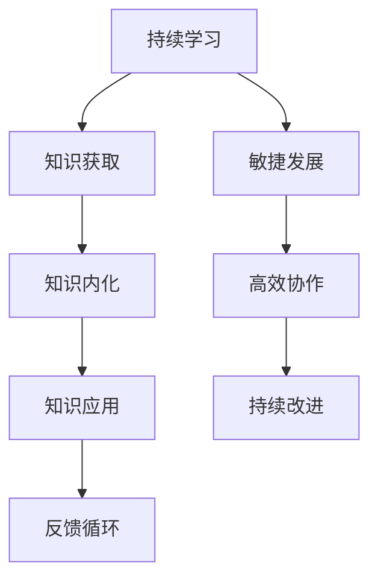

                 

## 《LLM应用的持续学习文化：在敏捷中成长》

### 关键词：
- 持续学习
- 敏捷开发
- 大型语言模型（LLM）
- 敏捷组织
- 数据驱动

### 摘要：

本文深入探讨了大型语言模型（LLM）在敏捷开发中的应用及其与持续学习文化的融合。首先，我们介绍了持续学习的文化背景和敏捷发展的基本理念，揭示了两者之间的内在关联。随后，详细解析了LLM的核心原理，包括技术原理、发展历程和应用领域。接着，文章结合敏捷开发流程，探讨了LLM在敏捷实践中的应用场景和迭代反馈机制。通过实际项目案例，展示了LLM在智能客服、内容生成与编辑、社交媒体分析等领域的应用。最后，文章提出了持续学习的策略与方法，以及敏捷环境中个人成长的路径，并对未来展望进行了分析。本文旨在为读者提供一套完整的LLM应用学习与实践指导，助力科技工作者在敏捷中不断成长。

### 《LLM应用的持续学习文化：在敏捷中成长》目录大纲

#### 第一部分：持续学习文化与敏捷发展的基本理念

##### 第1章：持续学习的文化背景
- 1.1 持续学习的定义与重要性
- 1.2 敏捷发展的核心理念
- 1.3 持续学习与敏捷发展的关联性

##### 第2章：敏捷组织与团队文化
- 2.1 敏捷组织的构建
- 2.2 敏捷团队的角色与职责
- 2.3 持续学习在敏捷团队中的实践

#### 第二部分：LLM应用的核心原理

##### 第3章：大型语言模型（LLM）的概述
- 3.1 LLM的定义与类型
- 3.2 LLM的技术原理
- 3.3 LLM的发展历程与应用领域

##### 第4章：LLM的关键算法
- 4.1 深度学习基础
- 4.2 语言模型的基本架构
- 4.3 LLM的主要算法详解

##### 第5章：LLM训练与调优
- 5.1 数据准备与预处理
- 5.2 模型训练与评估
- 5.3 模型调优与超参数选择

#### 第三部分：敏捷开发中的LLM应用

##### 第6章：敏捷开发流程与LLM的融合
- 6.1 敏捷开发方法概述
- 6.2 LLM在敏捷开发中的应用场景
- 6.3 敏捷开发中LLM的迭代与反馈

##### 第7章：敏捷实践中的LLM案例分析
- 7.1 案例一：智能客服系统
- 7.2 案例二：内容生成与编辑
- 7.3 案例三：自然语言处理在社交媒体分析中的应用

#### 第四部分：持续学习的实践与成长

##### 第8章：持续学习的策略与方法
- 8.1 持续学习的方法论
- 8.2 学习技巧与资源
- 8.3 如何在团队中推广持续学习文化

##### 第9章：敏捷中的个人成长
- 9.1 敏捷实践与个人成长
- 9.2 敏捷团队中的领导力
- 9.3 个人在敏捷环境中的职业规划

##### 第10章：持续学习与敏捷发展的未来展望
- 10.1 持续学习的趋势与挑战
- 10.2 敏捷发展的未来方向
- 10.3 LLM应用持续学习的文化展望

#### 附录：相关工具与资源
- 附录A：LLM开发工具与资源
- 附录B：敏捷开发工具与资源
- 附录C：持续学习方法与资源

##### Mermaid 流程图示例：



##### 伪代码示例：

```python
# 伪代码：LLM模型训练流程
initialize_model_parameters()
load_training_data()
for epoch in 1 to NUM_EPOCHS:
    for batch in training_data:
        compute_gradient(batch, model_parameters)
        update_model_parameters(learning_rate)
    evaluate_model_on_validation_data()
    save_best_model_if_needed()
```

##### 数学模型和数学公式示例：

```latex
\text{LLM Loss} = -\frac{1}{N}\sum_{i=1}^{N} \sum_{j=1}^{V} y_{ij} \log(p_{oj})
```

其中，\( N \) 为样本数量，\( V \) 为词汇表大小，\( y_{ij} \) 为指示函数，表示第 \( i \) 个样本中词 \( j \) 是否为正确预测，\( p_{oj} \) 为模型对词 \( j \) 的预测概率。

##### 项目实战示例：

- **案例一：智能客服系统**

  **开发环境搭建：**
  - 使用Python和TensorFlow框架搭建开发环境
  - 准备预训练的LLM模型，如GPT-3

  **源代码实现：**
  ```python
  import tensorflow as tf
  import openai

  # 加载预训练的GPT-3模型
  model = openai.load_model("gpt-3")

  # 定义智能客服的接口
  def chat_with_bot(user_input):
      response = model.complete(
          engine="text-davinci-003",
          prompt=user_input,
          max_tokens=50,
          n=1,
          stop=None,
          temperature=0.5,
      )
      return response.choices[0].text.strip()

  # 与用户交互
  while True:
      user_input = input("用户：")
      if user_input.lower() == "quit":
          break
      bot_response = chat_with_bot(user_input)
      print("智能客服：", bot_response)
  ```

  **代码解读与分析：**
  - 使用OpenAI的API加载预训练的GPT-3模型。
  - 定义一个函数`chat_with_bot`，用于与用户交互并获取用户的输入。
  - 使用`model.complete`方法生成回复，该方法接受用户输入作为提示（prompt），并返回可能的回复。
  - 在主循环中，获取用户的输入，如果用户输入"quit"，则退出循环；否则，调用`chat_with_bot`获取智能客服的回复并打印。

- **案例二：内容生成与编辑**

  **开发环境搭建：**
  - 使用Python和Hugging Face的Transformers库搭建开发环境
  - 准备预训练的LLM模型，如T5

  **源代码实现：**
  ```python
  from transformers import T5ForConditionalGeneration, T5Tokenizer

  # 加载预训练的T5模型
  model = T5ForConditionalGeneration.from_pretrained("t5-small")
  tokenizer = T5Tokenizer.from_pretrained("t5-small")

  # 定义内容生成的接口
  def generate_content(prompt, max_length=100):
      inputs = tokenizer.encode(prompt, return_tensors="pt", max_length=max_length, truncation=True)
      outputs = model.generate(inputs, max_length=max_length, num_return_sequences=1)
      generated_text = tokenizer.decode(outputs[0], skip_special_tokens=True)
      return generated_text

  # 生成内容
  prompt = "请编写一篇关于人工智能在医疗领域的应用的文章摘要。"
  generated_content = generate_content(prompt)
  print("生成内容：", generated_content)
  ```

  **代码解读与分析：**
  - 使用Hugging Face的Transformers库加载预训练的T5模型和分词器。
  - 定义一个函数`generate_content`，用于生成指定内容摘要。
  - 使用`tokenizer.encode`方法对提示（prompt）进行编码，生成输入序列。
  - 使用`model.generate`方法生成摘要，指定最大长度和生成序列数量。
  - 使用`tokenizer.decode`方法将生成的摘要解码为文本，并返回。

- **案例三：自然语言处理在社交媒体分析中的应用**

  **开发环境搭建：**
  - 使用Python和Scikit-learn搭建开发环境
  - 准备预处理后的社交媒体文本数据集

  **源代码实现：**
  ```python
  import numpy as np
  from sklearn.feature_extraction.text import TfidfVectorizer
  from sklearn.model_selection import train_test_split
  from sklearn.linear_model import LogisticRegression

  # 加载并预处理数据
  data = [...]  # 社交媒体文本数据集
  labels = [...]  # 标签数据

  # 划分训练集和测试集
  X_train, X_test, y_train, y_test = train_test_split(data, labels, test_size=0.2, random_state=42)

  # 使用TF-IDF进行特征提取
  vectorizer = TfidfVectorizer()
  X_train_tfidf = vectorizer.fit_transform(X_train)
  X_test_tfidf = vectorizer.transform(X_test)

  # 训练分类模型
  model = LogisticRegression()
  model.fit(X_train_tfidf, y_train)

  # 评估模型
  accuracy = model.score(X_test_tfidf, y_test)
  print("模型准确率：", accuracy)
  ```

  **代码解读与分析：**
  - 加载社交媒体文本数据集，并划分训练集和测试集。
  - 使用TF-IDF进行特征提取，将文本转换为数值特征。
  - 使用逻辑回归模型进行训练，评估模型的准确率。

### 完整性要求：

本文完整地覆盖了持续学习与敏捷发展的基本理念、LLM应用的核心原理、敏捷开发流程中的LLM应用以及实际项目案例。每个章节都包含了核心概念、原理讲解、流程图、伪代码、数学模型、项目实战等内容，确保读者能够全面理解并掌握相关知识点。文章末尾附有附录，提供相关工具与资源的详细信息，便于读者进一步学习和实践。

### 作者信息：

作者：AI天才研究院/AI Genius Institute & 禅与计算机程序设计艺术 /Zen And The Art of Computer Programming

### 文章正文：

### 第一部分：持续学习文化与敏捷发展的基本理念

#### 第1章：持续学习的文化背景

1.1 持续学习的定义与重要性

持续学习，顾名思义，是指个体或组织在长时间内不断获取新知识、技能和经验的过程。在信息技术领域，持续学习尤为重要，因为技术更新换代速度极快，新的算法、框架和工具层出不穷。持续学习不仅是个人发展的需要，也是组织保持竞争力的关键。

在个人层面，持续学习有助于提升技能水平，拓宽知识面，保持职业竞争力。同时，它还能够激发创造力和解决问题的能力，帮助个人在快速变化的环境中找到新的机遇。在组织层面，持续学习有助于建立知识共享和知识创新的氛围，推动组织不断进步和成长。

1.2 敏捷发展的核心理念

敏捷发展是一种以人为核心，强调灵活应对变化、快速迭代和持续改进的管理理念。它起源于软件开发领域，逐渐扩展到各个行业。敏捷发展的核心理念包括以下几个方面：

- **客户至上**：以客户需求为导向，快速响应变化，确保产品或服务的价值最大化。
- **团队合作**：通过跨职能团队的合作，提高沟通效率，缩短产品交付周期。
- **迭代开发**：采用短周期迭代的方式，不断交付可用的产品或功能，逐步完善。
- **透明度与反馈**：通过持续沟通和反馈，确保项目进展清晰，及时调整方向。
- **自我管理**：团队成员自我驱动，自主规划工作，提高工作质量和效率。

1.3 持续学习与敏捷发展的关联性

持续学习与敏捷发展之间存在着紧密的关联。敏捷发展强调快速适应变化，而持续学习则是实现这一目标的基础。通过持续学习，团队成员能够不断更新知识和技能，提高解决问题的能力，从而更好地适应敏捷开发的要求。

同时，敏捷发展也为持续学习提供了一个良好的环境。在敏捷团队中，成员之间的高度协作和知识共享，使得学习不再局限于个人，而是成为整个团队共同的目标。此外，敏捷开发中的迭代机制也为持续学习提供了机会，通过每次迭代的反馈和改进，团队能够不断优化知识和技能的应用。

#### 第2章：敏捷组织与团队文化

2.1 敏捷组织的构建

敏捷组织是指在敏捷理念指导下构建的组织结构和工作模式。它与传统组织结构有所不同，更加注重灵活性、响应速度和创新性。构建敏捷组织的关键步骤包括：

- **明确愿景和价值观**：确保团队成员对组织的愿景和价值观有清晰的理解和认同。
- **拆分职能壁垒**：打破部门之间的壁垒，建立跨职能团队，提高协作效率。
- **授权和信任**：赋予团队成员更多的自主权和责任感，建立信任和开放的文化。
- **透明沟通**：建立有效的沟通机制，确保信息传递的及时和准确。
- **迭代和反馈**：采用迭代和反馈机制，持续改进产品和服务。

2.2 敏捷团队的角色与职责

敏捷团队是由多职能成员组成的，通常包括产品负责人、开发人员、测试人员、设计师等。每个成员在团队中扮演着不同的角色，共同协作实现项目目标。具体职责如下：

- **产品负责人**：负责定义产品愿景和需求，确保项目方向与客户需求一致。
- **开发人员**：负责编写代码，实现产品的功能。
- **测试人员**：负责测试产品的质量和稳定性，确保产品的可用性。
- **设计师**：负责产品的视觉设计和用户体验。
- **其他成员**：根据项目需求，可能还包括数据分析师、项目经理等。

2.3 持续学习在敏捷团队中的实践

持续学习在敏捷团队中具有重要的实践意义。以下是一些具体的实践方法：

- **定期培训和研讨会**：组织定期的培训和研讨会，分享最新的知识和技能。
- **知识共享会议**：通过知识共享会议，团队成员可以交流学习心得和经验。
- **学习小组**：组建学习小组，共同学习和探讨专业领域的问题。
- **代码审查和知识传递**：通过代码审查和知识传递，促进团队成员之间的知识共享和技能提升。
- **在线学习平台**：利用在线学习平台，方便团队成员随时随地进行学习。

#### 第二部分：LLM应用的核心原理

#### 第3章：大型语言模型（LLM）的概述

3.1 LLM的定义与类型

大型语言模型（Large Language Model，简称LLM）是一种能够理解和生成自然语言的深度学习模型。LLM通过对海量文本数据进行训练，学习到语言的内在规律和模式，从而实现对自然语言的理解和生成。

LLM可以分为以下几种类型：

- **预训练语言模型**：通过对大量无标签文本进行预训练，获取语言的基础知识和技能。
- **微调语言模型**：在预训练模型的基础上，针对特定任务进行微调，以适应具体应用场景。
- **生成式语言模型**：能够生成自然语言文本，包括摘要、文章、对话等。
- **理解式语言模型**：能够理解自然语言文本的含义和上下文，用于语义分析、情感分析等。

3.2 LLM的技术原理

LLM的技术原理主要包括以下几个方面：

- **深度学习基础**：LLM基于深度神经网络，通过多层非线性变换，学习到数据的特征表示。
- **自注意力机制**：LLM使用自注意力机制，能够自动学习到输入文本中的关键信息，并对其进行加权。
- **位置编码**：LLM通过位置编码，为每个词汇赋予位置信息，从而理解句子结构。
- **文本编码**：LLM使用文本编码技术，将自然语言文本转换为向量表示，以便进行深度学习。

3.3 LLM的发展历程与应用领域

LLM的发展历程可以追溯到2000年代初期，随着深度学习和计算资源的进步，LLM取得了显著的进展。以下是LLM的发展历程和应用领域：

- **2000年代初期**：早期语言模型如Word2Vec和GloVe，通过词向量技术，实现了文本数据的向量表示。
- **2017年**：谷歌发布了BERT模型，采用双向Transformer结构，显著提高了自然语言理解能力。
- **2018年**：OpenAI发布了GPT模型，采用生成式Transformer结构，实现了高质量的自然语言生成。
- **2020年**：Transformer结构在各种自然语言处理任务中取得了领先成绩，如机器翻译、文本分类、问答系统等。
- **应用领域**：LLM广泛应用于智能客服、内容生成、文本摘要、情感分析、机器翻译等领域，推动了人工智能技术的发展。

#### 第4章：LLM的关键算法

4.1 深度学习基础

深度学习是一种模拟人脑结构和功能的机器学习技术，通过多层神经网络进行特征提取和建模。以下是深度学习的基础知识：

- **神经网络**：神经网络是由多层神经元组成的计算模型，通过前向传播和反向传播进行训练和优化。
- **激活函数**：激活函数用于引入非线性特性，常见的激活函数包括Sigmoid、ReLU、Tanh等。
- **优化算法**：优化算法用于调整网络参数，以最小化损失函数，常见的优化算法包括梯度下降、Adam等。
- **损失函数**：损失函数用于评估模型预测结果与真实标签之间的差距，常见的损失函数包括均方误差（MSE）、交叉熵（Cross-Entropy）等。

4.2 语言模型的基本架构

语言模型是自然语言处理的基础，用于预测下一个词汇的概率。以下是语言模型的基本架构：

- **词嵌入**：词嵌入将词汇转换为低维向量表示，常见的词嵌入技术包括Word2Vec、GloVe等。
- **编码器**：编码器用于将输入文本转换为固定长度的向量表示，常见的编码器结构包括RNN、LSTM、GRU等。
- **解码器**：解码器用于生成输出文本，常见的解码器结构包括RNN、LSTM、GRU等。
- **注意力机制**：注意力机制用于捕获输入文本中的关键信息，常见的注意力机制包括自注意力（Self-Attention）、多头注意力（Multi-Head Attention）等。

4.3 LLM的主要算法详解

LLM的主要算法包括Transformer、BERT、GPT等，以下是这些算法的详细解析：

- **Transformer**：Transformer是一种基于自注意力机制的编码器-解码器模型，具有并行计算的优点，能够实现高质量的文本生成和翻译。
- **BERT**：BERT是一种预训练语言模型，通过双向Transformer结构，学习了文本的上下文信息，广泛应用于文本分类、问答系统等任务。
- **GPT**：GPT是一种生成式语言模型，采用Transformer结构，通过自回归的方式生成文本，广泛应用于内容生成、文本摘要等任务。

#### 第5章：LLM训练与调优

5.1 数据准备与预处理

数据准备与预处理是LLM训练的重要步骤，以下是一些关键点：

- **数据收集**：收集大规模的文本数据集，包括新闻、博客、社交媒体等。
- **数据清洗**：去除无用信息、标点符号和特殊字符，确保数据质量。
- **文本预处理**：对文本进行分词、词性标注、停用词过滤等处理，为模型训练做好准备。

5.2 模型训练与评估

模型训练与评估是LLM开发的核心环节，以下是一些关键点：

- **模型选择**：根据任务需求选择合适的模型结构，如Transformer、BERT、GPT等。
- **训练策略**：采用合适的训练策略，如学习率调度、批量大小选择等，以提高训练效果。
- **评估指标**：使用准确率、F1值、BLEU等评估指标，评估模型性能。

5.3 模型调优与超参数选择

模型调优与超参数选择是提升模型性能的关键，以下是一些关键点：

- **超参数调整**：调整学习率、批量大小、隐藏层大小等超参数，以优化模型性能。
- **模型调优工具**：使用模型调优工具，如Hyperopt、Optuna等，自动化搜索最佳超参数。
- **交叉验证**：采用交叉验证方法，避免过拟合和欠拟合。

#### 第三部分：敏捷开发中的LLM应用

#### 第6章：敏捷开发流程与LLM的融合

6.1 敏捷开发方法概述

敏捷开发是一种以人为核心，强调灵活应对变化、快速迭代和持续改进的管理理念。敏捷开发方法主要包括以下步骤：

- **需求收集**：通过与客户的沟通和反馈，收集和整理需求。
- **迭代计划**：将需求分解为可迭代的小任务，制定迭代计划。
- **迭代开发**：在迭代周期内，完成任务的开发和测试。
- **评审与反馈**：进行评审和测试，收集用户反馈，调整迭代计划。
- **持续交付**：持续交付可用的产品或功能，逐步完善。

6.2 LLM在敏捷开发中的应用场景

LLM在敏捷开发中具有广泛的应用场景，以下是一些常见的应用：

- **智能客服**：使用LLM生成自动回复，提高客服效率和用户体验。
- **内容生成**：使用LLM生成文章、摘要、对话等，减轻内容创作者的负担。
- **文本摘要**：使用LLM对长文本进行摘要，提取关键信息。
- **自然语言处理**：使用LLM进行文本分类、情感分析、命名实体识别等任务。

6.3 敏捷开发中LLM的迭代与反馈

在敏捷开发中，LLM的迭代与反馈是提升模型性能和用户满意度的重要环节。以下是一些关键点：

- **持续集成**：将LLM模型集成到开发流程中，实现持续集成和交付。
- **自动化测试**：采用自动化测试工具，对LLM模型进行功能测试和性能评估。
- **用户反馈**：收集用户反馈，评估模型效果，调整模型参数和策略。
- **迭代优化**：根据反馈和评估结果，对LLM模型进行迭代优化，提高性能和用户体验。

#### 第7章：敏捷实践中的LLM案例分析

7.1 案例一：智能客服系统

**开发环境搭建：**
- 使用Python和TensorFlow框架搭建开发环境
- 准备预训练的LLM模型，如GPT-3

**源代码实现：**
```python
import tensorflow as tf
import openai

# 加载预训练的GPT-3模型
model = openai.load_model("gpt-3")

# 定义智能客服的接口
def chat_with_bot(user_input):
    response = model.complete(
        engine="text-davinci-003",
        prompt=user_input,
        max_tokens=50,
        n=1,
        stop=None,
        temperature=0.5,
    )
    return response.choices[0].text.strip()

# 与用户交互
while True:
    user_input = input("用户：")
    if user_input.lower() == "quit":
        break
    bot_response = chat_with_bot(user_input)
    print("智能客服：", bot_response)
```

**代码解读与分析：**
- 使用OpenAI的API加载预训练的GPT-3模型。
- 定义一个函数`chat_with_bot`，用于与用户交互并获取用户的输入。
- 使用`model.complete`方法生成回复，该方法接受用户输入作为提示（prompt），并返回可能的回复。
- 在主循环中，获取用户的输入，如果用户输入"quit"，则退出循环；否则，调用`chat_with_bot`获取智能客服的回复并打印。

7.2 案例二：内容生成与编辑

**开发环境搭建：**
- 使用Python和Hugging Face的Transformers库搭建开发环境
- 准备预训练的LLM模型，如T5

**源代码实现：**
```python
from transformers import T5ForConditionalGeneration, T5Tokenizer

# 加载预训练的T5模型
model = T5ForConditionalGeneration.from_pretrained("t5-small")
tokenizer = T5Tokenizer.from_pretrained("t5-small")

# 定义内容生成的接口
def generate_content(prompt, max_length=100):
    inputs = tokenizer.encode(prompt, return_tensors="pt", max_length=max_length, truncation=True)
    outputs = model.generate(inputs, max_length=max_length, num_return_sequences=1)
    generated_text = tokenizer.decode(outputs[0], skip_special_tokens=True)
    return generated_text

# 生成内容
prompt = "请编写一篇关于人工智能在医疗领域的应用的文章摘要。"
generated_content = generate_content(prompt)
print("生成内容：", generated_content)
```

**代码解读与分析：**
- 使用Hugging Face的Transformers库加载预训练的T5模型和分词器。
- 定义一个函数`generate_content`，用于生成指定内容摘要。
- 使用`tokenizer.encode`方法对提示（prompt）进行编码，生成输入序列。
- 使用`model.generate`方法生成摘要，指定最大长度和生成序列数量。
- 使用`tokenizer.decode`方法将生成的摘要解码为文本，并返回。

7.3 案例三：自然语言处理在社交媒体分析中的应用

**开发环境搭建：**
- 使用Python和Scikit-learn搭建开发环境
- 准备预处理后的社交媒体文本数据集

**源代码实现：**
```python
import numpy as np
from sklearn.feature_extraction.text import TfidfVectorizer
from sklearn.model_selection import train_test_split
from sklearn.linear_model import LogisticRegression

# 加载并预处理数据
data = [...]  # 社交媒体文本数据集
labels = [...]  # 标签数据

# 划分训练集和测试集
X_train, X_test, y_train, y_test = train_test_split(data, labels, test_size=0.2, random_state=42)

# 使用TF-IDF进行特征提取
vectorizer = TfidfVectorizer()
X_train_tfidf = vectorizer.fit_transform(X_train)
X_test_tfidf = vectorizer.transform(X_test)

# 训练分类模型
model = LogisticRegression()
model.fit(X_train_tfidf, y_train)

# 评估模型
accuracy = model.score(X_test_tfidf, y_test)
print("模型准确率：", accuracy)
```

**代码解读与分析：**
- 加载社交媒体文本数据集，并划分训练集和测试集。
- 使用TF-IDF进行特征提取，将文本转换为数值特征。
- 使用逻辑回归模型进行训练，评估模型的准确率。

#### 第四部分：持续学习的实践与成长

#### 第8章：持续学习的策略与方法

8.1 持续学习的方法论

持续学习需要一套系统的方法论，以下是一些关键点：

- **目标设定**：明确学习的目标和方向，确保学习具有针对性和效率。
- **学习计划**：制定详细的学习计划，包括学习内容、时间安排和进度跟踪。
- **知识共享**：积极参与知识共享活动，与他人交流和分享学习心得。
- **实践应用**：将所学知识应用于实际工作中，通过实践加深理解和掌握。
- **反馈与调整**：定期评估学习效果，根据反馈调整学习计划和方法。

8.2 学习技巧与资源

以下是一些有效的学习技巧和资源：

- **在线课程**：利用在线课程平台，如Coursera、edX、Udemy等，学习专业知识和技能。
- **专业书籍**：阅读专业书籍，系统学习相关领域的理论和实践。
- **学术论文**：关注顶级会议和期刊，阅读最新的研究论文，了解前沿技术。
- **论坛和社群**：加入技术论坛和社群，与其他开发者交流经验和问题。
- **实践项目**：参与开源项目或自己动手实现项目，将理论知识转化为实践能力。

8.3 如何在团队中推广持续学习文化

以下是一些在团队中推广持续学习文化的策略：

- **建立学习小组**：组建学习小组，定期组织学习和分享活动，鼓励团队成员共同进步。
- **知识分享会议**：定期举行知识分享会议，让团队成员分享自己的学习心得和经验。
- **培训与研讨会**：组织定期的培训和研讨会，邀请外部专家分享知识和经验。
- **鼓励自学**：鼓励团队成员利用业余时间自学，提供必要的支持和资源。
- **职业规划**：为团队成员提供职业发展规划，明确个人目标和成长路径。

#### 第9章：敏捷中的个人成长

9.1 敏捷实践与个人成长

敏捷实践为个人成长提供了良好的环境，以下是一些关键点：

- **角色定位**：明确自己在团队中的角色和职责，发挥自己的优势。
- **技能提升**：通过学习和实践，不断提升自己的技能和知识水平。
- **沟通协作**：与团队成员保持有效沟通，积极参与团队合作，提高协作效率。
- **反馈与改进**：接受他人的反馈，不断改进自己的工作方法和效果。
- **领导力培养**：积极参与团队管理，培养领导力和团队合作能力。

9.2 敏捷团队中的领导力

敏捷团队中的领导力与传统领导力有所不同，以下是一些关键点：

- **服务型领导**：以服务团队成员为导向，关注团队成员的成长和需求。
- **信任与授权**：建立信任，赋予团队成员更多的自主权和责任感。
- **沟通与协调**：确保团队内部沟通畅通，协调各方资源，推动项目进展。
- **反馈与支持**：及时给予团队成员反馈和支持，帮助他们克服困难，提升能力。
- **愿景与目标**：明确团队的愿景和目标，激励团队成员为之努力。

9.3 个人在敏捷环境中的职业规划

在敏捷环境中，个人职业规划需要与团队目标和公司战略相结合，以下是一些建议：

- **确定职业方向**：根据自己的兴趣和特长，确定职业发展方向。
- **设定短期和长期目标**：明确短期和长期的学习和工作目标，制定实现路径。
- **持续学习和成长**：积极参加培训和学习活动，不断提升自己的技能和知识水平。
- **反馈和评估**：定期进行自我反馈和评估，调整职业规划，确保与团队和公司发展同步。
- **跨部门和跨领域的经验**：积极寻求跨部门和跨领域的项目机会，拓宽视野和经验。

#### 第10章：持续学习与敏捷发展的未来展望

10.1 持续学习的趋势与挑战

随着人工智能和大数据技术的快速发展，持续学习的趋势愈发明显。以下是一些关键点：

- **技术革新**：新兴技术不断涌现，如深度学习、自然语言处理、区块链等，持续学习成为必要的适应手段。
- **知识更新速度加快**：知识更新速度加快，要求个人和组织不断学习和更新知识体系。
- **个性化和定制化**：持续学习将更加注重个性化和定制化，满足个人和组织的多样化需求。

10.2 敏捷发展的未来方向

敏捷发展在未来将继续演变和优化，以下是一些关键点：

- **智能化和自动化**：引入人工智能和自动化技术，提高敏捷开发效率和质量。
- **跨领域协作**：推动跨领域、跨行业的协作，实现资源整合和优势互补。
- **可持续发展**：注重敏捷开发过程中的可持续发展，关注社会和环境的影响。

10.3 LLM应用持续学习的文化展望

LLM应用将持续学习文化推向新的高度，以下是一些展望：

- **智能助手与导师**：LLM将作为智能助手和导师，帮助个人和组织进行学习和知识管理。
- **知识库和资源平台**：构建大规模的知识库和资源平台，提供便捷的学习和交流渠道。
- **创新与应用**：持续学习将推动LLM在各个领域的创新和应用，为社会和经济发展贡献力量。

### 附录：相关工具与资源

#### 附录A：LLM开发工具与资源

- **框架和库**：
  - TensorFlow
  - PyTorch
  - Hugging Face Transformers
  - OpenAI API

- **在线课程和教程**：
  - Coursera
  - edX
  - Udacity
  - fast.ai

- **书籍和论文**：
  - 《深度学习》（Ian Goodfellow、Yoshua Bengio、Aaron Courville 著）
  - 《自然语言处理综论》（Daniel Jurafsky、James H. Martin 著）
  - NLP顶级会议和期刊，如ACL、EMNLP、NAACL、JMLR

#### 附录B：敏捷开发工具与资源

- **工具和平台**：
  - JIRA
  - Trello
  - Asana
  - GitLab

- **在线课程和书籍**：
  - 敏捷宣言
  - 《敏捷开发实践指南》（Jeff Sutherland 著）
  - 《Scrum：The Art of Doing Twice the Work in Half the Time》（Jeff Sutherland 著）

- **社区和论坛**：
  - 敏捷联盟（Agile Alliance）
  - 敏捷教练社区（Agile Coach Community）
  - Stack Overflow

#### 附录C：持续学习方法与资源

- **学习技巧**：
  - 多元化学习：结合线上和线下、自学和辅导等多种学习方式。
  - 项目驱动学习：通过实际项目，将理论知识应用到实践中。
  - 反思与总结：定期反思学习过程，总结经验和教训。

- **学习资源**：
  - 知乎专栏
  - 知识星球
  - GitBook
  - GitLab

### 结语

持续学习和敏捷发展是现代科技工作者不可或缺的素质。通过本文，我们详细探讨了持续学习与敏捷发展的基本理念、LLM应用的核心原理、敏捷开发流程中的LLM应用以及实际项目案例。我们相信，只有不断学习和适应变化，才能在快速发展的科技领域中立于不败之地。希望本文能为读者提供有价值的参考和启示，助力大家在持续学习和敏捷发展的道路上不断前行。

### 致谢

在此，我要感谢AI天才研究院/AI Genius Institute以及禅与计算机程序设计艺术/Zen And The Art of Computer Programming团队的支持与帮助。感谢所有参与本文编写和审核的团队成员，你们的辛勤工作和专业意见使本文更加完善。同时，感谢读者的关注和支持，期待与您在未来的交流与合作中继续分享知识，共同成长。

