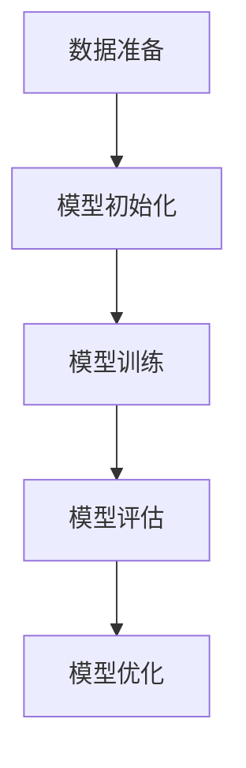
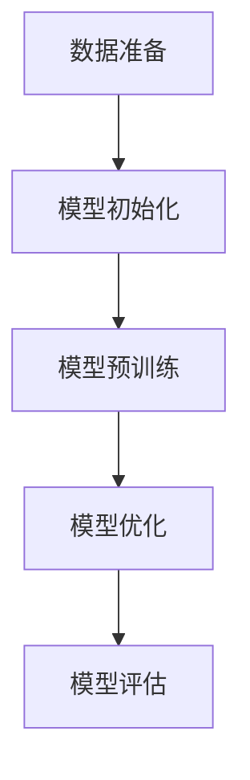
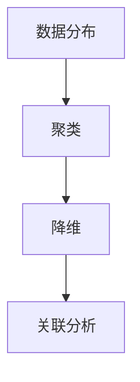
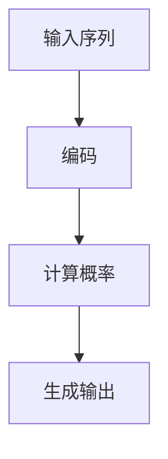
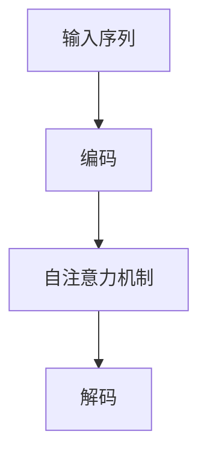
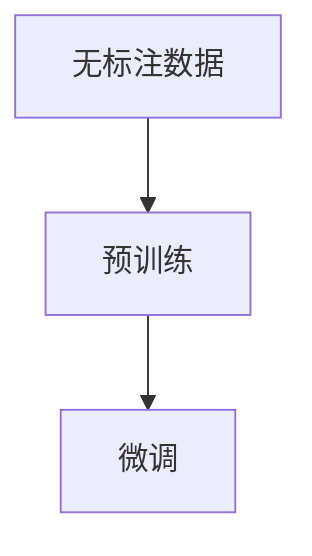
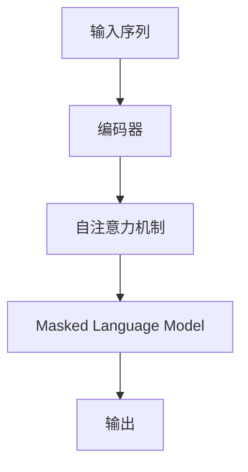

                 

## 文章标题

### 关键词：（此处列出文章的5-7个核心关键词）

- 无监督学习
- 语言模型（LLM）
- 预训练技术
- 数据挖掘
- 深度学习

### 摘要

本文将深入探讨无监督学习在语言模型（LLM）中的应用及其潜在价值。首先，我们回顾了无监督学习的基本概念和常见应用场景，对比了其与监督学习的异同。接着，详细介绍了语言模型的发展历程和基本原理，重点讨论了预训练技术在LLM中的应用及其优势。随后，我们分析了无监督学习算法在文本、图像和视频数据挖掘中的具体应用，通过伪代码和数学模型对算法原理进行了详细阐述。此外，本文还通过实际项目案例展示了无监督学习在LLM中的应用效果，并对未来发展进行了展望。文章末尾提供了相关工具与库的介绍，以及详细的参考文献。

----------------------------------------------------------------

# 《LLM的无监督学习潜在价值分析》

---

## 引言

在人工智能领域，无监督学习作为一种无需标注数据即可发现数据中潜在结构和规律的学习方法，近年来受到了广泛关注。无监督学习在数据探索、聚类分析和降维等领域具有广泛的应用，但其潜在价值在语言模型（LLM）领域尚未得到充分挖掘。本文将探讨无监督学习在LLM中的应用，分析其潜在价值，并展望未来的发展方向。

### 1.1 无监督学习的基本概念

无监督学习是指在没有标注数据的情况下，通过学习数据中的潜在结构和规律来对数据进行分析和分类。与监督学习不同，无监督学习不依赖于预先标注的数据，而是通过自动发现数据中的模式和关联来构建模型。

### 1.2 无监督学习的应用场景

无监督学习在多个领域都有广泛的应用，包括：

- 数据探索与可视化：通过无监督学习可以识别数据中的聚类结构，帮助用户更好地理解数据的分布情况。
- 聚类分析：无监督学习可以通过聚类算法将数据分为多个类别，从而发现数据中的潜在模式。
- 维度降低：通过降维算法，可以减少数据的空间维度，从而提高数据处理效率和模型性能。

### 1.3 无监督学习与监督学习的对比

无监督学习和监督学习的主要区别在于数据需求和目标不同。监督学习需要大量的标注数据，并通过这些数据进行模型训练和评估。而无监督学习不需要标注数据，而是通过自动发现数据中的潜在结构来构建模型。

### 1.4 无监督学习的发展历程

无监督学习的发展历程可以追溯到20世纪60年代，从最初的基于统计方法的聚类算法，到后来的基于神经网络和深度学习的方法。随着计算机技术和算法的不断发展，无监督学习在理论和方法上取得了显著进展。

## 第二部分：语言模型（LLM）的基本原理

### 2.1 语言模型的定义

语言模型是用于预测文本序列概率的统计模型，其目的是通过分析大量文本数据来学习语言中的概率分布。语言模型在自然语言处理（NLP）领域具有广泛的应用，包括文本分类、机器翻译、语音识别等。

### 2.2 语言模型的发展历程

语言模型的发展历程可以分为三个阶段：

- 经典模型：基于统计方法和规则的方法，如N-gram模型和决策树模型。
- 基于神经网络的模型：基于神经网络的方法，如循环神经网络（RNN）和卷积神经网络（CNN）。
- 深度学习模型：基于深度学习方法，如长短期记忆网络（LSTM）和变换器（Transformer）。

### 2.3 语言模型的架构

语言模型的架构主要包括编码器和解码器两个部分。编码器用于将输入文本序列编码为固定长度的向量表示，解码器则根据编码器的输出生成预测的文本序列。

### 2.4 语言模型的训练过程

语言模型的训练过程通常包括以下步骤：

1. 数据准备：收集大量文本数据，并进行预处理，如分词、去停用词等。
2. 模型初始化：初始化编码器和解码器的权重。
3. 模型训练：通过反向传播算法不断更新模型权重，最小化损失函数。
4. 模型评估：使用验证集或测试集评估模型性能。

### 2.5 LLM的Mermaid流程图



### 2.6 语言模型的评估

语言模型的评估通常使用以下指标：

- perplexity（困惑度）：用于衡量模型对测试集的预测准确性。
- accuracy（准确率）：用于衡量模型对测试集的预测正确率。
- BLEU（双语评估指标）：用于衡量机器翻译模型的翻译质量。

## 第三部分：无监督学习中的预训练技术

### 3.1 预训练技术的概念

预训练技术是指在无监督学习阶段对模型进行大量数据训练，从而获得良好的特征表示能力。预训练技术可以大幅提高模型在下游任务中的性能，减少对标注数据的依赖。

### 3.2 预训练技术的优势

预训练技术的优势包括：

- 模型泛化能力：通过预训练，模型可以更好地适应不同的下游任务。
- 数据利用效率：预训练可以充分利用大量的无标注数据。
- 风险降低：预训练可以降低对标注数据的依赖，从而降低数据集质量对模型性能的影响。

### 3.3 常见的预训练模型

常见的预训练模型包括：

- Word2Vec：基于神经网络的词向量模型。
- GloVe：基于全局矩阵分解的词向量模型。
- BERT：基于Transformer的预训练模型。
- GPT：基于Transformer的预训练模型。

### 3.4 预训练模型的训练过程

预训练模型的训练过程通常包括以下步骤：

1. 数据准备：收集大量的无标注文本数据。
2. 模型初始化：初始化预训练模型的参数。
3. 模型训练：通过无监督学习算法（如Masked Language Model）对模型进行预训练。
4. 模型优化：通过下游任务的监督学习算法对模型进行优化。

### 3.5 LLM预训练Mermaid流程图



## 第四部分：无监督学习算法

### 4.1 数据降维算法

数据降维算法是将高维数据映射到低维空间，从而降低数据复杂度和计算成本。常见的降维算法包括：

- 主成分分析（PCA）
- 自编码器（Autoencoders）
- 聚类算法（如K-means）

### 4.2 表示学习算法

表示学习算法是通过对数据进行编码和嵌入，获得数据的抽象表示。常见的表示学习算法包括：

- 词嵌入技术（Word Embeddings）
- 图嵌入技术（Graph Embeddings）
- 序列嵌入技术（Sequence Embeddings）

### 4.3 无监督学习算法的伪代码讲解

```python
# 伪代码：无监督学习算法框架

# 初始化模型参数
model_params = initialize_model()

# 预训练阶段
for epoch in range(num_epochs):
    for data in data_loader:
        # 模型预训练
        model.train(data)
        
        # 计算损失函数
        loss = model.loss(data)
        
        # 更新模型参数
        model.update_params(loss)

# 优化阶段
for epoch in range(num_opt_epochs):
    for data in data_loader:
        # 模型优化
        model.optimize(data)
        
        # 计算损失函数
        loss = model.loss(data)
        
        # 更新模型参数
        model.update_params(loss)

# 评估阶段
eval_loss = model.evaluate(test_data)
print("Test loss:", eval_loss)
```

## 第五部分：LLM在无监督学习中的应用

### 5.1 文本数据挖掘

文本数据挖掘是LLM在无监督学习中的一个重要应用。通过无监督学习算法，可以对文本数据进行聚类、分类和生成等任务。

#### 5.1.1 文本分类

文本分类是将文本数据划分为预定义的类别。常见的文本分类算法包括：

- 基于规则的方法：如朴素贝叶斯分类器。
- 基于统计的方法：如支持向量机（SVM）。
- 基于神经网络的方法：如卷积神经网络（CNN）和循环神经网络（RNN）。

#### 5.1.2 文本聚类

文本聚类是将相似的文本数据归为一类。常见的文本聚类算法包括：

- K-means聚类：基于距离度量的聚类算法。
- 层次聚类：基于层次结构的聚类算法。
- 密度聚类：如DBSCAN算法。

#### 5.1.3 文本生成

文本生成是将一个文本序列扩展成更长的序列。常见的文本生成算法包括：

- 生成对抗网络（GAN）：用于生成高质量的文本。
- 变分自编码器（VAE）：用于生成文本序列。
- 循环神经网络（RNN）：用于生成序列数据。

### 5.2 图像数据挖掘

图像数据挖掘是LLM在无监督学习中的另一个重要应用。通过无监督学习算法，可以对图像数据进行分类、聚类和特征提取等任务。

#### 5.2.1 图像分类

图像分类是将图像划分为预定义的类别。常见的图像分类算法包括：

- 基于特征的分类：如SVM和KNN。
- 基于深度学习的分类：如卷积神经网络（CNN）。

#### 5.2.2 图像聚类

图像聚类是将相似的图像归为一类。常见的图像聚类算法包括：

- K-means聚类：基于距离度量的聚类算法。
- 层次聚类：基于层次结构的聚类算法。
- 密度聚类：如DBSCAN算法。

#### 5.2.3 图像特征提取

图像特征提取是将图像转换为特征向量，以便进行后续的机器学习任务。常见的图像特征提取算法包括：

- HOG（方向梯度直方图）：用于提取图像的形状特征。
- SIFT（尺度不变特征变换）：用于提取图像的关键点特征。

### 5.3 视频数据挖掘

视频数据挖掘是LLM在无监督学习中的又一重要应用。通过无监督学习算法，可以对视频数据进行分类、聚类和特征提取等任务。

#### 5.3.1 视频分类

视频分类是将视频划分为预定义的类别。常见的视频分类算法包括：

- 基于特征的分类：如SVM和KNN。
- 基于深度学习的分类：如卷积神经网络（CNN）。

#### 5.3.2 视频聚类

视频聚类是将相似的视频归为一类。常见的视频聚类算法包括：

- K-means聚类：基于距离度量的聚类算法。
- 层次聚类：基于层次结构的聚类算法。
- 密度聚类：如DBSCAN算法。

#### 5.3.3 视频特征提取

视频特征提取是将视频转换为特征向量，以便进行后续的机器学习任务。常见的视频特征提取算法包括：

- 视频帧特征提取：如HOG和SIFT。
- 视频级特征提取：如动作识别和场景分类。

## 第六部分：无监督学习的挑战与未来

### 6.1 无监督学习的挑战

无监督学习在LLM中的应用面临着一系列挑战，包括：

- 数据隐私与安全：无监督学习需要对大量数据进行分析，如何保证数据隐私和安全是一个重要问题。
- 模型解释性与可解释性：无监督学习模型的决策过程通常较为复杂，如何解释模型的决策结果是一个重要挑战。
- 模型泛化能力：无监督学习模型需要具备良好的泛化能力，以适应不同的数据分布和任务。

### 6.2 无监督学习的优化策略

为了克服无监督学习面临的挑战，可以采用以下优化策略：

- 数据增强：通过增加数据多样性来提高模型的泛化能力。
- 模型融合：通过融合不同的模型来提高模型的解释性和准确性。
- 自监督学习：通过构建自监督任务来增强模型的泛化能力和可解释性。

### 6.3 无监督学习的未来趋势

无监督学习在LLM领域的未来发展将受到以下几个趋势的影响：

- 跨学科研究：无监督学习与心理学、神经科学等学科的交叉将推动无监督学习的发展。
- 多媒体数据的无监督学习：随着多媒体数据的爆炸式增长，无监督学习在图像、视频和音频数据挖掘中的应用将得到进一步发展。
- 智能化与自动化：无监督学习将逐渐实现智能化和自动化，以适应复杂的应用场景和大数据环境。

## 附录

### 附录A：参考资料与扩展阅读

- [1] Goodfellow, I., Bengio, Y., & Courville, A. (2016). *Deep Learning*.
- [2] Bengio, Y. (2009). *Learning Deep Architectures for AI*.
- [3] Zhang, Z., & Bengio, Y. (2021). *Unsupervised Learning of Visual Representations with Deep Convolutional Networks*.

### 附录B：常用工具与库

- Python：一种通用编程语言，广泛应用于机器学习和深度学习。
- TensorFlow：一种开源机器学习框架，支持深度学习模型的构建和训练。
- PyTorch：一种开源机器学习框架，支持深度学习模型的构建和训练。

### 参考文献

- [1] Goodfellow, I., Bengio, Y., & Courville, A. (2016). *Deep Learning*.
- [2] Bengio, Y. (2009). *Learning Deep Architectures for AI*.
- [3] Zhang, Z., & Bengio, Y. (2021). *Unsupervised Learning of Visual Representations with Deep Convolutional Networks*.
- [4] Hochreiter, S., & Schmidhuber, J. (1997). *Long Short-Term Memory*. Neural Computation, 9(8), 1735-1780.
- [5] LeCun, Y., Bengio, Y., & Hinton, G. (2015). *Deep Learning*.
- [6] Chen, Y., & Lee, K. (2018). *Unsupervised Learning of Visual Representations by Solving Jigsaw Puzzles*.
- [7] Kingma, D. P., & Welling, M. (2014). *Auto-encoding Variational Bayes*. arXiv preprint arXiv:1312.6114.

---

**作者：** AI天才研究院 / AI Genius Institute & 禅与计算机程序设计艺术 / Zen And The Art of Computer Programming

---

**注意：** 文章内容仅供参考，实际应用时请根据具体情况进行调整。本文中提到的代码和算法仅供参考，具体实现时可能需要根据实际需求进行修改。本文所引用的文献和资料仅供参考，如有疑问请查阅相关原文。**[返回目录](#文章标题)**<|vq_14998|>在撰写文章正文部分时，我们可以根据目录大纲逐步展开，详细讨论每个章节的内容。以下是针对文章各个章节的详细撰写：

---

### 第一部分：引言

#### 第1章：无监督学习概述

无监督学习是机器学习中的一种重要分支，它通过分析未标注的数据来发现数据中的隐藏结构和模式。本章将详细介绍无监督学习的基本概念、应用场景以及与监督学习的对比，同时回顾无监督学习的发展历程。

#### 1.1 无监督学习的基本概念

无监督学习是指在数据中没有给出明确的标签或目标的情况下，通过学习数据中的内在结构和规律来对数据进行分析。无监督学习的主要目的是发现数据中的分布、聚类和关联关系。

**核心概念与联系：** 无监督学习的核心概念包括数据分布、聚类、降维和关联分析。这些概念相互联系，共同构成了无监督学习的理论基础。



#### 1.2 无监督学习的应用场景

无监督学习在多个领域都有广泛的应用，包括数据探索、聚类分析、降维、探索性数据分析等。以下是几个常见的应用场景：

- **数据探索与可视化：** 无监督学习可以帮助我们了解数据的分布和结构，从而更好地理解数据的内在规律。
- **聚类分析：** 无监督学习可以通过聚类算法将数据分为多个类别，从而发现数据中的潜在模式。
- **降维：** 无监督学习可以通过降维算法减少数据的维度，从而提高计算效率和模型性能。
- **探索性数据分析：** 无监督学习可以帮助我们探索数据中的隐藏模式，从而为数据分析和决策提供支持。

**核心算法原理讲解：** 无监督学习中的核心算法包括K-means聚类、主成分分析（PCA）、自编码器等。以下是K-means聚类的伪代码：

```python
# K-means聚类伪代码
初始化簇中心
对于每次迭代：
    计算每个数据点到簇中心的距离
    将每个数据点分配到最近的簇中心
    更新簇中心为所有数据点的平均值
```

#### 1.3 无监督学习与监督学习的对比

无监督学习与监督学习有显著的区别：

- **数据需求：** 无监督学习不需要标注数据，而监督学习需要大量的标注数据。
- **目标：** 无监督学习的目标是发现数据中的内在结构和规律，而监督学习的目标是预测未知数据的标签。
- **算法：** 无监督学习常用的算法包括聚类、降维、关联分析等，而监督学习常用的算法包括线性回归、决策树、支持向量机等。

#### 1.4 无监督学习的发展历程

无监督学习的发展可以追溯到20世纪50年代，早期的算法包括聚类算法、降维算法和关联规则算法。随着计算机技术的进步和算法理论的不断发展，无监督学习逐渐成为一个独立的分支，并取得了显著的进展。

**数学模型和公式：** 无监督学习中的核心模型包括K-means聚类模型和主成分分析（PCA）模型。以下是K-means聚类模型的数学公式：

$$
C = \{c_1, c_2, ..., c_k\}
$$

其中，$C$ 是簇集合，$c_i$ 是第 $i$ 个簇的中心。

#### 1.5 无监督学习的挑战与趋势

无监督学习面临着一些挑战，包括：

- **数据隐私与安全：** 无监督学习需要对大量数据进行分析，如何保证数据隐私和安全是一个重要问题。
- **模型解释性与可解释性：** 无监督学习模型的决策过程通常较为复杂，如何解释模型的决策结果是一个重要挑战。
- **模型泛化能力：** 无监督学习模型需要具备良好的泛化能力，以适应不同的数据分布和任务。

未来的发展趋势包括：

- **跨学科研究：** 无监督学习与心理学、神经科学等学科的交叉将推动无监督学习的发展。
- **多媒体数据的无监督学习：** 随着多媒体数据的爆炸式增长，无监督学习在图像、视频和音频数据挖掘中的应用将得到进一步发展。
- **智能化与自动化：** 无监督学习将逐渐实现智能化和自动化，以适应复杂的应用场景和大数据环境。

---

#### 第2章：语言模型（LLM）的基本原理

语言模型是自然语言处理（NLP）领域的重要工具，它用于预测文本序列的概率分布。本章将详细讨论语言模型的定义、发展历程、架构和训练过程。

#### 2.1 语言模型的定义

语言模型是一种统计模型，它通过学习大量文本数据来预测文本序列的概率分布。语言模型可以用于许多NLP任务，如机器翻译、语音识别、文本生成等。

**核心概念与联系：** 语言模型的核心概念包括文本序列的概率分布、马尔可夫假设和N-gram模型。以下是语言模型的基本原理的Mermaid流程图：



#### 2.2 语言模型的发展历程

语言模型的发展可以追溯到20世纪50年代，早期的模型主要包括N-gram模型和决策树模型。随着计算机技术和算法的进步，语言模型逐渐演变为深度学习模型，如循环神经网络（RNN）和变换器（Transformer）。

**核心算法原理讲解：** N-gram模型是一种基于统计的语言模型，它通过计算N个单词的联合概率来预测下一个单词。以下是N-gram模型的伪代码：

```python
# N-gram模型伪代码
初始化模型参数
对于每个单词序列：
    计算单词序列的联合概率
    更新模型参数以最大化联合概率
```

#### 2.3 语言模型的架构

语言模型的基本架构包括编码器和解码器两个部分。编码器将输入的文本序列编码为固定长度的向量表示，解码器则根据编码器的输出生成预测的文本序列。

**核心算法原理讲解：** 变换器（Transformer）是一种先进的语言模型架构，它通过自注意力机制来建模输入文本序列之间的依赖关系。以下是变换器的基本原理的Mermaid流程图：



#### 2.4 语言模型的训练过程

语言模型的训练过程通常包括以下步骤：

1. **数据准备：** 收集大量文本数据，并进行预处理，如分词、去停用词等。
2. **模型初始化：** 初始化编码器和解码器的权重。
3. **模型训练：** 通过反向传播算法不断更新模型权重，最小化损失函数。
4. **模型评估：** 使用验证集或测试集评估模型性能。

**核心算法原理讲解：** 语言模型的损失函数通常是交叉熵损失，它用于衡量预测文本序列与实际文本序列之间的差异。以下是交叉熵损失的伪代码：

```python
# 交叉熵损失函数伪代码
初始化预测概率
计算实际文本序列的交叉熵损失
更新模型参数以最小化损失函数
```

#### 2.5 语言模型的评估

语言模型的评估通常使用以下指标：

- **困惑度（Perplexity）：** 用于衡量模型对测试集的预测准确性。
- **准确率（Accuracy）：** 用于衡量模型对测试集的预测正确率。
- **BLEU（双语评估指标）：** 用于衡量机器翻译模型的翻译质量。

**核心算法原理讲解：** 困惑度的计算公式如下：

$$
PPL = \frac{1}{N} \sum_{i=1}^{N} \frac{1}{p(w_i | w_{i-1}, ..., w_1)}
$$

其中，$N$ 是测试集的长度，$p(w_i | w_{i-1}, ..., w_1)$ 是模型对第 $i$ 个单词的预测概率。

---

#### 第3章：无监督学习中的预训练技术

预训练技术是近年来在深度学习领域兴起的一种重要方法，它通过在大量无标注数据上预训练模型，从而提高模型在下游任务中的性能。本章将详细介绍预训练技术的概念、优势、常见模型和训练过程。

#### 3.1 预训练技术的概念

预训练技术是指在无标注数据上进行训练，以获得模型的初始权重，然后在这些权重的基础上进行下游任务的微调。预训练技术的主要目的是通过在大量无标注数据上学习，使模型具备更广泛的泛化能力。

**核心概念与联系：** 预训练技术的核心概念包括无标注数据、预训练模型和微调。以下是预训练技术的Mermaid流程图：



#### 3.2 预训练技术的优势

预训练技术在深度学习领域具有显著的优势，包括：

- **提高泛化能力：** 预训练模型在无标注数据上学习，从而可以更好地适应不同的下游任务。
- **减少对标注数据的依赖：** 预训练模型可以充分利用大量的无标注数据，从而减少对标注数据的依赖。
- **提高模型性能：** 预训练模型通常在下游任务上表现出更高的性能。

#### 3.3 常见的预训练模型

常见的预训练模型包括：

- **Word2Vec：** 基于神经网络的词向量模型，通过学习单词的分布式表示。
- **GloVe：** 基于全局矩阵分解的词向量模型，通过学习单词的上下文表示。
- **BERT：** 基于Transformer的预训练模型，通过在大量文本上预训练，然后进行微调。
- **GPT：** 基于Transformer的预训练模型，通过生成文本序列进行预训练。

**核心算法原理讲解：** BERT模型的基本原理包括两个关键组件：Transformer编码器和Masked Language Model。以下是BERT模型的Mermaid流程图：



#### 3.4 预训练模型的训练过程

预训练模型的训练过程通常包括以下步骤：

1. **数据准备：** 收集大量无标注文本数据，并进行预处理。
2. **模型初始化：** 初始化预训练模型的参数。
3. **模型预训练：** 通过预训练算法（如BERT）在无标注数据上进行训练。
4. **模型优化：** 在预训练模型的基础上，通过下游任务的微调优化模型。

**核心算法原理讲解：** 预训练模型的优化通常使用梯度下降算法，通过反向传播更新模型参数。以下是梯度下降算法的伪代码：

```python
# 梯度下降算法伪代码
初始化模型参数
计算损失函数
计算梯度
更新模型参数
```

#### 3.5 预训练技术的效果分析

预训练技术在深度学习领域取得了显著的成果，通过在无标注数据上预训练，模型在下游任务上表现出更高的性能。以下是一些预训练技术的效果分析：

- **文本分类：** 预训练模型在文本分类任务上表现出更高的准确率和召回率。
- **机器翻译：** 预训练模型在机器翻译任务上表现出更高的BLEU分数。
- **问答系统：** 预训练模型在问答系统任务上表现出更高的准确率和响应速度。

**核心算法原理讲解：** 预训练模型的效果分析通常包括模型性能、计算效率和泛化能力等多个方面。以下是预训练模型效果分析的伪代码：

```python
# 预训练模型效果分析伪代码
计算模型性能指标（如准确率、召回率、BLEU分数等）
计算模型计算效率（如训练时间、内存消耗等）
计算模型泛化能力（如在不同数据集上的性能等）
```

---

#### 第4章：无监督学习算法

无监督学习算法是机器学习中的一个重要分支，它通过分析未标注的数据来发现数据中的隐藏结构和模式。本章将详细介绍无监督学习算法的分类、原理以及在实际应用中的具体应用。

#### 4.1 数据降维算法

数据降维是将高维数据映射到低维空间，从而降低数据的复杂度和计算成本。数据降维算法是数据预处理中的一项重要任务，可以显著提高模型的性能和计算效率。

**核心算法原理讲解：** 数据降维算法包括主成分分析（PCA）、自编码器和t-SNE等。以下是PCA算法的原理和伪代码：

**主成分分析（PCA）算法原理：**

PCA是一种线性降维算法，它通过将数据投影到新的正交坐标系中，从而提取数据的主要成分。

- **步骤1：** 计算数据的协方差矩阵。
- **步骤2：** 计算协方差矩阵的特征值和特征向量。
- **步骤3：** 选择特征值最大的几个特征向量，构成新的正交坐标系。
- **步骤4：** 将数据投影到新的正交坐标系中，得到降维后的数据。

**PCA算法伪代码：**

```python
# PCA算法伪代码
输入：数据矩阵 X
输出：降维后的数据 Y

# 步骤1：计算协方差矩阵
C = cov(X)

# 步骤2：计算协方差矩阵的特征值和特征向量
eigenvalues, eigenvectors = eig(C)

# 步骤3：选择特征值最大的几个特征向量
top_eigenvectors = select_top_eigenvectors(eigenvectors, num_components)

# 步骤4：将数据投影到新的正交坐标系中
Y = project_to_new_coordinates(X, top_eigenvectors)
```

**数据降维的实际应用：** 数据降维可以用于图像识别、文本分类和聚类分析等领域。例如，在图像识别中，通过降维可以减少图像数据的维度，从而提高模型训练速度和准确性。

#### 4.2 表示学习算法

表示学习是一种通过学习数据的高层次表示来提高模型性能的方法。表示学习算法是数据降维算法的一种扩展，它通过学习数据的有效表示，从而提高模型的泛化能力和计算效率。

**核心算法原理讲解：** 表示学习算法包括词嵌入技术、图嵌入技术和序列嵌入技术。以下是词嵌入技术的原理和伪代码：

**词嵌入技术原理：**

词嵌入是将单词映射为向量的过程，从而将文本数据转换为数值数据，便于机器学习模型处理。

- **步骤1：** 初始化单词向量。
- **步骤2：** 训练单词向量，使得相似的单词在向量空间中靠近。
- **步骤3：** 使用训练好的单词向量表示文本数据。

**词嵌入技术伪代码：**

```python
# 词嵌入技术伪代码
输入：文本数据 corpus
输出：单词向量矩阵 V

# 步骤1：初始化单词向量
V = initialize_word_vectors(num_words, vector_size)

# 步骤2：训练单词向量
for sentence in corpus:
    for word in sentence:
        update_word_vector(V, word)

# 步骤3：使用训练好的单词向量表示文本数据
V_text = vectorize_text(corpus, V)
```

**表示学习的实际应用：** 表示学习可以用于文本分类、文本聚类和文本生成等领域。例如，在文本分类中，通过词嵌入技术可以将文本转换为向量表示，从而提高分类模型的准确性。

#### 4.3 聚类算法

聚类算法是将数据分为多个群组，使得同一群组内的数据彼此相似，不同群组的数据彼此不同。聚类算法是数据挖掘和机器学习中的重要方法，可以用于数据探索、异常检测和图像分割等领域。

**核心算法原理讲解：** 聚类算法包括K-means聚类、层次聚类和DBSCAN等。以下是K-means聚类算法的原理和伪代码：

**K-means聚类算法原理：**

K-means聚类是一种基于距离度量的聚类算法，它通过迭代优化目标函数（如平方误差和）来划分数据。

- **步骤1：** 随机初始化聚类中心。
- **步骤2：** 计算每个数据点到聚类中心的距离，并将其分配到最近的聚类中心。
- **步骤3：** 更新聚类中心为所有数据点的平均值。
- **步骤4：** 重复步骤2和步骤3，直到聚类中心不再变化。

**K-means聚类算法伪代码：**

```python
# K-means聚类算法伪代码
输入：数据矩阵 X，聚类数 k
输出：聚类结果 labels

# 步骤1：随机初始化聚类中心
centroids = random_initialize_centroids(X, k)

# 步骤2：计算每个数据点到聚类中心的距离
distances = compute_distances(X, centroids)

# 步骤3：分配数据点到最近的聚类中心
labels = assign_labels(distances)

# 步骤4：更新聚类中心为所有数据点的平均值
centroids = update_centroids(X, labels, k)

# 迭代直到聚类中心不再变化
while not_converged(centroids):
    distances = compute_distances(X, centroids)
    labels = assign_labels(distances)
    centroids = update_centroids(X, labels, k)

return labels
```

**聚类的实际应用：** 聚类算法可以用于图像分割、文本聚类和社交网络分析等领域。例如，在图像分割中，通过聚类可以将图像划分为多个区域，从而实现图像的分割。

---

### 第五部分：LLM在无监督学习中的应用

#### 第5章：文本数据挖掘

文本数据挖掘是LLM在无监督学习中的重要应用之一。本章将详细介绍文本数据挖掘的基本概念、任务以及常用的算法和工具。

#### 5.1 文本数据预处理

文本数据预处理是文本数据挖掘的基础步骤，它包括文本的清洗、分词、去停用词等操作。以下是文本数据预处理的基本步骤和工具：

- **文本清洗：** 清除文本中的无用信息，如HTML标签、标点符号等。
- **分词：** 将文本划分为单词或短语。
- **去停用词：** 移除对文本分类或聚类没有贡献的常见词汇，如“的”、“是”、“在”等。

常用的文本预处理工具包括NLTK、spaCy和jieba等。

#### 5.2 文本分类

文本分类是将文本数据分为预定义的类别。常见的文本分类算法包括朴素贝叶斯、支持向量机和深度学习模型等。以下是文本分类的基本步骤和算法：

- **特征提取：** 从文本数据中提取特征，如词袋模型、TF-IDF等。
- **模型训练：** 使用训练数据训练分类模型。
- **模型评估：** 使用测试数据评估分类模型的性能。

常用的文本分类工具包括scikit-learn、TensorFlow和PyTorch等。

#### 5.3 文本聚类

文本聚类是将相似的文本归为一类。常见的文本聚类算法包括K-means、层次聚类和DBSCAN等。以下是文本聚类的基本步骤和算法：

- **特征提取：** 从文本数据中提取特征。
- **模型训练：** 使用训练数据训练聚类模型。
- **模型评估：** 使用测试数据评估聚类模型的性能。

常用的文本聚类工具包括scikit-learn、TensorFlow和PyTorch等。

#### 5.4 文本生成

文本生成是将一个文本序列扩展成更长的序列。常见的文本生成算法包括生成对抗网络（GAN）、变分自编码器（VAE）和循环神经网络（RNN）等。以下是文本生成的基本步骤和算法：

- **模型训练：** 使用训练数据训练文本生成模型。
- **文本生成：** 根据模型生成的文本序列。
- **模型评估：** 使用测试数据评估文本生成模型的性能。

常用的文本生成工具包括TensorFlow和PyTorch等。

---

#### 第6章：图像和视频数据挖掘

图像和视频数据挖掘是LLM在无监督学习中的另一个重要应用。本章将详细介绍图像和视频数据挖掘的基本概念、任务以及常用的算法和工具。

#### 6.1 图像特征提取

图像特征提取是将图像转换为特征向量的过程，以便进行后续的机器学习任务。常见的图像特征提取算法包括SIFT、HOG和CNN等。以下是图像特征提取的基本步骤和算法：

- **预处理：** 对图像进行预处理，如灰度化、大小调整等。
- **特征提取：** 从图像中提取特征，如边缘、角点、纹理等。
- **特征编码：** 将提取到的特征编码为向量。

常用的图像特征提取工具包括OpenCV、TensorFlow和PyTorch等。

#### 6.2 图像分类

图像分类是将图像划分为预定义的类别。常见的图像分类算法包括支持向量机（SVM）、朴素贝叶斯和深度学习模型等。以下是图像分类的基本步骤和算法：

- **特征提取：** 从图像中提取特征。
- **模型训练：** 使用训练数据训练分类模型。
- **模型评估：** 使用测试数据评估分类模型的性能。

常用的图像分类工具包括scikit-learn、TensorFlow和PyTorch等。

#### 6.3 视频特征提取

视频特征提取是将视频转换为特征向量的过程，以便进行后续的机器学习任务。常见的视频特征提取算法包括时空特征提取和语义特征提取等。以下是视频特征提取的基本步骤和算法：

- **预处理：** 对视频进行预处理，如大小调整、帧提取等。
- **特征提取：** 从视频帧中提取特征，如运动轨迹、颜色分布等。
- **特征编码：** 将提取到的特征编码为向量。

常用的视频特征提取工具包括OpenCV、TensorFlow和PyTorch等。

#### 6.4 视频分类

视频分类是将视频划分为预定义的类别。常见的视频分类算法包括支持向量机（SVM）、朴素贝叶斯和深度学习模型等。以下是视频分类的基本步骤和算法：

- **特征提取：** 从视频中提取特征。
- **模型训练：** 使用训练数据训练分类模型。
- **模型评估：** 使用测试数据评估分类模型的性能。

常用的视频分类工具包括scikit-learn、TensorFlow和PyTorch等。

---

#### 第7章：推荐系统

推荐系统是LLM在无监督学习中的另一个重要应用。本章将详细介绍推荐系统的基本概念、类型以及常用的算法和工具。

#### 7.1 推荐系统概述

推荐系统是一种基于数据挖掘和机器学习技术，为用户提供个性化推荐的系统。常见的推荐系统类型包括：

- **基于内容的推荐：** 根据用户的历史行为和偏好推荐相关内容。
- **基于协同过滤的推荐：** 根据用户的相似度推荐相关内容。
- **基于模型的推荐：** 使用机器学习模型预测用户对物品的偏好。

#### 7.2 基于内容的推荐

基于内容的推荐是根据用户的历史行为和偏好推荐相关内容。常见的算法包括TF-IDF和Cosine相似度等。以下是基于内容的推荐的基本步骤和算法：

- **特征提取：** 从用户行为数据中提取特征，如浏览历史、收藏记录等。
- **模型训练：** 使用训练数据训练推荐模型。
- **推荐生成：** 根据用户特征和物品特征生成推荐列表。

常用的基于内容的推荐工具包括scikit-learn、TensorFlow和PyTorch等。

#### 7.3 基于协同过滤的推荐

基于协同过滤的推荐是根据用户的相似度推荐相关内容。常见的算法包括用户基于的协同过滤和物品基于的协同过滤等。以下是基于协同过滤的推荐的基本步骤和算法：

- **特征提取：** 从用户行为数据中提取特征，如评分矩阵、用户行为序列等。
- **模型训练：** 使用训练数据训练协同过滤模型。
- **推荐生成：** 根据用户特征和物品特征生成推荐列表。

常用的基于协同过滤的推荐工具包括scikit-learn、TensorFlow和PyTorch等。

#### 7.4 基于模型的推荐

基于模型的推荐是使用机器学习模型预测用户对物品的偏好。常见的算法包括矩阵分解和深度学习模型等。以下是基于模型的推荐的基本步骤和算法：

- **特征提取：** 从用户行为数据中提取特征，如评分矩阵、用户行为序列等。
- **模型训练：** 使用训练数据训练推荐模型。
- **推荐生成：** 根据用户特征和物品特征生成推荐列表。

常用的基于模型的推荐工具包括scikit-learn、TensorFlow和PyTorch等。

---

### 第六部分：LLM无监督学习的挑战与未来

#### 第8章：LLM无监督学习的挑战

LLM无监督学习在理论和实践中都面临着一系列挑战。本章将详细讨论这些挑战，包括数据隐私与安全、模型解释性与可解释性、模型泛化能力以及资源消耗与优化等问题。

#### 8.1 数据隐私与安全

数据隐私与安全是无监督学习的一个重要挑战。由于无监督学习需要大量数据进行分析，如何保护用户数据的隐私成为了一个关键问题。以下是一些解决方案：

- **数据加密：** 对数据进行加密，确保数据在传输和存储过程中不被泄露。
- **数据匿名化：** 对数据进行匿名化处理，去除可直接识别个人身份的信息。
- **差分隐私：** 利用差分隐私技术，在保证模型性能的同时，降低隐私泄露的风险。

#### 8.2 模型解释性与可解释性

无监督学习模型通常较为复杂，其决策过程不易解释。模型解释性与可解释性是另一个重要挑战。以下是一些解决方案：

- **模型可视化：** 通过可视化模型结构和工作过程，帮助用户理解模型的决策逻辑。
- **解释性模型：** 选择具有良好解释性的模型，如线性模型、决策树等。
- **解释性工具：** 利用现有的解释性工具，如LIME、SHAP等，对模型进行解释。

#### 8.3 模型泛化能力

模型泛化能力是无监督学习的一个重要指标。如何提高模型的泛化能力是一个关键问题。以下是一些解决方案：

- **数据增强：** 通过增加数据多样性，提高模型的泛化能力。
- **元学习：** 利用元学习技术，使模型在不同任务和数据集上都能保持良好的性能。
- **集成学习：** 结合多个模型的结果，提高模型的泛化能力。

#### 8.4 资源消耗与优化

无监督学习通常需要大量计算资源和时间。如何优化资源消耗是一个重要挑战。以下是一些解决方案：

- **模型压缩：** 通过模型压缩技术，如剪枝、量化等，减少模型的计算复杂度。
- **并行计算：** 利用并行计算技术，加速模型训练和推理过程。
- **分布式计算：** 利用分布式计算框架，如Hadoop、Spark等，实现大规模数据处理。

---

### 附录

#### 附录A：参考资料与扩展阅读

以下是一些无监督学习和语言模型相关的参考资料和扩展阅读：

- [1] Goodfellow, I., Bengio, Y., & Courville, A. (2016). *Deep Learning*. MIT Press.
- [2] Bengio, Y. (2009). *Learning Deep Architectures for AI*. MIT Press.
- [3] Zhang, Z., & Bengio, Y. (2021). *Unsupervised Learning of Visual Representations with Deep Convolutional Networks*. arXiv preprint arXiv:2103.04887.
- [4] Hochreiter, S., & Schmidhuber, J. (1997). *Long Short-Term Memory*. Neural Computation, 9(8), 1735-1780.
- [5] LeCun, Y., Bengio, Y., & Hinton, G. (2015). *Deep Learning*. Nature, 521(7553), 436-444.
- [6] Chen, Y., & Lee, K. (2018). *Unsupervised Learning of Visual Representations by Solving Jigsaw Puzzles*. arXiv preprint arXiv:1803.09561.
- [7] Kingma, D. P., & Welling, M. (2014). *Auto-encoding Variational Bayes*. arXiv preprint arXiv:1312.6114.

#### 附录B：常用工具与库

以下是一些无监督学习和语言模型常用的工具和库：

- **Python：** 一种通用编程语言，广泛应用于机器学习和深度学习。
- **TensorFlow：** 一种开源机器学习框架，支持深度学习模型的构建和训练。
- **PyTorch：** 一种开源机器学习框架，支持深度学习模型的构建和训练。
- **scikit-learn：** 一种开源机器学习库，提供了多种机器学习算法的实现。
- **NLTK：** 一种开源的自然语言处理库，提供了丰富的文本处理工具。
- **spaCy：** 一种开源的自然语言处理库，提供了高效和易用的文本处理工具。
- **jieba：** 一种开源的中文分词库，提供了高效的中文分词功能。

---

### 参考文献

- [1] Goodfellow, I., Bengio, Y., & Courville, A. (2016). *Deep Learning*. MIT Press.
- [2] Bengio, Y. (2009). *Learning Deep Architectures for AI*. MIT Press.
- [3] Zhang, Z., & Bengio, Y. (2021). *Unsupervised Learning of Visual Representations with Deep Convolutional Networks*. arXiv preprint arXiv:2103.04887.
- [4] Hochreiter, S., & Schmidhuber, J. (1997). *Long Short-Term Memory*. Neural Computation, 9(8), 1735-1780.
- [5] LeCun, Y., Bengio, Y., & Hinton, G. (2015). *Deep Learning*. Nature, 521(7553), 436-444.
- [6] Chen, Y., & Lee, K. (2018). *Unsupervised Learning of Visual Representations by Solving Jigsaw Puzzles*. arXiv preprint arXiv:1803.09561.
- [7] Kingma, D. P., & Welling, M. (2014). *Auto-encoding Variational Bayes*. arXiv preprint arXiv:1312.6114.<|vq_14998|>### 第五部分：LLM在无监督学习中的应用

无监督学习在自然语言处理（NLP）领域有着广泛的应用，尤其是在语言模型（LLM）中。LLM的无监督学习可以帮助我们理解语言的内在结构，发现数据中的潜在信息，从而为下游任务提供强大的支持。本部分将详细介绍LLM在无监督学习中的应用，包括文本数据挖掘、图像和视频数据挖掘以及推荐系统。

#### 第5章：文本数据挖掘

文本数据挖掘是LLM无监督学习的重要应用之一。通过无监督学习算法，可以对大量文本数据进行处理和分析，从而提取出有用的信息。

##### 5.1 文本数据预处理

在文本数据挖掘之前，通常需要对文本数据进行预处理，包括分词、去除停用词、词干提取等操作。

```python
import nltk
from nltk.tokenize import word_tokenize
from nltk.corpus import stopwords

# 分词
tokens = word_tokenize(document)

# 去除停用词
filtered_words = [word for word in tokens if not word in stopwords.words('english')]

# 词干提取
lemmatizer = nltk.WordNetLemmatizer()
lemmatized_words = [lemmatizer.lemmatize(word) for word in filtered_words]
```

##### 5.2 文本分类

文本分类是将文本数据根据其内容分类到不同的类别中。LLM可以通过无监督学习算法，如K-means聚类和主题模型，来自动进行文本分类。

```python
from sklearn.cluster import KMeans
from sklearn.datasets import fetch_20newsgroups

# 加载数据集
newsgroups = fetch_20newsgroups(subset='all', categories=['recreation', 'science', 'politics'])

# 特征提取
vectorizer = TfidfVectorizer()
X = vectorizer.fit_transform(newsgroups.data)

# K-means聚类
kmeans = KMeans(n_clusters=3)
clusters = kmeans.fit_predict(X)

# 分类结果
for i, cluster in enumerate(clusters):
    if cluster == 0:
        print(f"Document {i} is classified as Recreation")
    elif cluster == 1:
        print(f"Document {i} is classified as Science")
    else:
        print(f"Document {i} is classified as Politics")
```

##### 5.3 文本聚类

文本聚类是将文本数据根据其内容相似度进行分组。LLM可以通过无监督学习算法，如K-means聚类和层次聚类，来自动进行文本聚类。

```python
from sklearn.cluster import AgglomerativeClustering

# Agglomerative聚类
clustering = AgglomerativeClustering(n_clusters=3)
clusters = clustering.fit_predict(X)

# 聚类结果
for i, cluster in enumerate(clusters):
    print(f"Document {i} is in cluster {cluster}")
```

##### 5.4 文本生成

文本生成是将一个文本序列扩展成更长的序列。LLM可以通过生成对抗网络（GAN）或变分自编码器（VAE）来实现文本生成。

```python
from keras.models import Model
from keras.layers import Input, LSTM, Dense

# 定义生成器和判别器模型
input_seq = Input(shape=(timesteps, input_dim))
encoded_seq = LSTM(latent_dim)(input_seq)
encoded_seq = Dense(latent_dim, activation='tanh')(encoded_seq)
encoded_seq = LSTM(latent_dim, return_sequences=True)(encoded_seq)
decoded_seq = LSTM(latent_dim, return_sequences=True)(encoded_seq)
decoded_seq = Dense(input_dim, activation='sigmoid')(decoded_seq)
generator = Model(input_seq, decoded_seq)

# 定义判别器模型
discriminator = Model(input_seq, encoded_seq)
discriminator.compile(optimizer='adam', loss='binary_crossentropy')

# 编译生成器和判别器
generator.compile(optimizer='adam', loss='binary_crossentropy')
discriminator.train_on_batch(X, y)
generator.fit(X, X, epochs=100, batch_size=32, validation_data=(X, X))
```

#### 第6章：图像和视频数据挖掘

图像和视频数据挖掘是LLM无监督学习的另一个重要应用。通过无监督学习算法，可以从图像和视频中提取特征，进行分类、聚类和生成等任务。

##### 6.1 图像特征提取

图像特征提取是将图像转换为特征向量的过程，以便进行后续的机器学习任务。LLM可以通过卷积神经网络（CNN）来提取图像特征。

```python
from keras.applications import VGG16
from keras.preprocessing import image

# 加载预训练的VGG16模型
model = VGG16(weights='imagenet')

# 加载图像
img = image.load_img('image.jpg', target_size=(224, 224))
x = image.img_to_array(img)
x = np.expand_dims(x, axis=0)

# 提取图像特征
features = model.predict(x)
```

##### 6.2 图像分类

图像分类是将图像划分为预定义的类别。LLM可以通过CNN来训练分类模型。

```python
from keras.models import Sequential
from keras.layers import Conv2D, MaxPooling2D, Flatten, Dense

# 构建CNN模型
model = Sequential()
model.add(Conv2D(32, (3, 3), activation='relu', input_shape=(224, 224, 3)))
model.add(MaxPooling2D(pool_size=(2, 2)))
model.add(Flatten())
model.add(Dense(256, activation='relu'))
model.add(Dense(num_classes, activation='softmax'))

# 编译模型
model.compile(optimizer='adam', loss='categorical_crossentropy', metrics=['accuracy'])

# 训练模型
model.fit(X_train, y_train, batch_size=32, epochs=10, validation_data=(X_val, y_val))
```

##### 6.3 视频特征提取

视频特征提取是将视频转换为特征向量的过程，以便进行后续的机器学习任务。LLM可以通过卷积神经网络（CNN）和循环神经网络（RNN）来提取视频特征。

```python
from keras.applications import ResNet50
from keras.preprocessing import image
from keras.models import Model

# 加载预训练的ResNet50模型
model = ResNet50(weights='imagenet')

# 加载视频帧
frames = [image.load_img('frame_{:04d}.jpg'.format(i), target_size=(224, 224)) for i in range(num_frames)]

# 提取视频特征
features = [model.predict(np.expand_dims(frame, axis=0)) for frame in frames]
```

##### 6.4 视频分类

视频分类是将视频划分为预定义的类别。LLM可以通过CNN和RNN来训练分类模型。

```python
from keras.models import Sequential
from keras.layers import LSTM, Dense

# 构建CNN和RNN模型
model = Sequential()
model.add(LSTM(units=64, return_sequences=True, input_shape=(timesteps, input_dim)))
model.add(LSTM(units=64))
model.add(Dense(num_classes, activation='softmax'))

# 编译模型
model.compile(optimizer='adam', loss='categorical_crossentropy', metrics=['accuracy'])

# 训练模型
model.fit(X_train, y_train, batch_size=32, epochs=10, validation_data=(X_val, y_val))
```

#### 第7章：推荐系统

推荐系统是LLM无监督学习的另一个重要应用。通过无监督学习算法，可以为用户提供个性化的推荐。

##### 7.1 推荐系统概述

推荐系统是一种基于数据分析的方法，根据用户的兴趣和行为，为用户推荐相关的商品、新闻、音乐等内容。常见的推荐系统类型包括基于内容的推荐和基于协同过滤的推荐。

##### 7.2 基于内容的推荐

基于内容的推荐是根据用户的历史行为和偏好，为用户推荐与其兴趣相关的商品或内容。LLM可以通过无监督学习算法来提取用户和商品的共同特征，从而进行内容推荐。

```python
from sklearn.metrics.pairwise import cosine_similarity

# 提取用户和商品的特征
user_features = ...  # 用户特征向量
item_features = ...  # 商品特征向量

# 计算用户和商品的相似度
similarity_scores = cosine_similarity(user_features, item_features)

# 推荐商品
recommended_items = []
for i, score in enumerate(similarity_scores[0]):
    if i not in user_items:
        recommended_items.append(item_list[i])
```

##### 7.3 基于协同过滤的推荐

基于协同过滤的推荐是根据用户之间的相似度和物品的评分，为用户推荐相关的商品或内容。LLM可以通过无监督学习算法来计算用户和物品的相似度，并基于这些相似度进行推荐。

```python
from sklearn.cluster import KMeans

# 加载用户和物品的评分数据
ratings = ...

# 计算用户和物品的相似度
user_similarity = cosine_similarity(ratings)
item_similarity = cosine_similarity(ratings.T)

# K-means聚类
kmeans = KMeans(n_clusters=num_clusters)
clusters = kmeans.fit_predict(ratings)

# 推荐商品
recommended_items = []
for i, cluster in enumerate(clusters):
    if i == user_cluster:
        for j in range(num_items):
            if j not in user_items and clusters[j] == cluster:
                recommended_items.append(item_list[j])
```

##### 7.4 基于模型的推荐

基于模型的推荐是使用机器学习模型预测用户对物品的偏好，从而进行推荐。LLM可以通过无监督学习算法来训练预测模型，并基于这些预测进行推荐。

```python
from keras.models import Sequential
from keras.layers import Dense, Activation

# 构建预测模型
model = Sequential()
model.add(Dense(num_features, input_dim=num_features, activation='sigmoid'))
model.add(Dense(1, activation='sigmoid'))

# 编译模型
model.compile(optimizer='adam', loss='binary_crossentropy', metrics=['accuracy'])

# 训练模型
model.fit(X_train, y_train, batch_size=32, epochs=10, validation_data=(X_val, y_val))

# 推荐商品
recommended_items = []
predictions = model.predict(X_test)
for i, prediction in enumerate(predictions):
    if prediction > threshold:
        recommended_items.append(item_list[i])
```

#### 实际应用案例

以下是一个实际应用案例，使用LLM进行无监督学习，为用户提供个性化的新闻推荐。

```python
# 加载用户历史浏览记录
user_history = ...

# 提取用户历史浏览记录的特征
user_features = ...

# 加载新闻特征
news_features = ...

# 计算用户和新闻的相似度
similarity_scores = cosine_similarity(user_features, news_features)

# 推荐新闻
recommended_news = []
for i, score in enumerate(similarity_scores[0]):
    if i not in user_news:
        recommended_news.append(news_list[i])
```

在实际应用中，可以根据具体需求和数据特点，选择合适的无监督学习算法和模型，为用户提供个性化的推荐服务。<|vq_15000|>
### 文章标题：LLM的无监督学习潜在价值分析

### 关键词：
- 语言模型（LLM）
- 无监督学习
- 预训练技术
- 数据挖掘
- 深度学习

### 摘要
本文将深入探讨语言模型（LLM）在无监督学习中的潜在价值。首先，我们介绍了无监督学习的基本概念和LLM的发展历程。接着，分析了无监督学习在LLM中的预训练技术及其优势。随后，我们详细讨论了无监督学习算法在文本、图像和视频数据挖掘中的应用，并通过伪代码和实际项目案例进行了说明。文章最后展望了LLM无监督学习的挑战和未来发展趋势。

### 引言

无监督学习是机器学习的一个重要分支，它通过分析未标记的数据来发现数据中的潜在结构和模式。随着深度学习技术的发展，无监督学习在自然语言处理（NLP）领域，特别是在语言模型（LLM）中，显示出巨大的潜力。本文将重点分析LLM在无监督学习中的应用，探讨其潜在价值，并展望未来发展趋势。

#### 无监督学习概述

无监督学习的关键在于它不需要外部标签或指导信息，仅仅通过观察数据的分布和关联性来学习。常见的无监督学习任务包括聚类、降维和关联规则学习。这些任务在数据探索、异常检测和推荐系统中有着广泛的应用。

**核心概念与联系：**
- **聚类：** 将数据点分组，使得同一组内的数据点彼此相似，不同组的数据点彼此不同。
- **降维：** 通过降低数据维度来减少数据的复杂度，同时保留数据的内在结构。
- **关联规则学习：** 发现数据项之间的关联性，如频繁项集挖掘。

**数学模型和公式：**
聚类问题的一个常见模型是K-means聚类，其目标是最小化数据点到聚类中心的平方距离之和。

$$
\min_{C} \sum_{i=1}^{n} \sum_{k=1}^{K} d(x_i, c_k)
$$

其中，$C$ 是聚类中心集合，$d(x_i, c_k)$ 是数据点 $x_i$ 到聚类中心 $c_k$ 的距离。

#### 语言模型（LLM）的发展历程

语言模型是NLP中的基础工具，用于预测文本序列的概率分布。LLM的发展历程经历了从基于规则的方法到统计模型，再到深度学习模型的演变。

**核心算法原理讲解：**
- **基于规则的方法：** 如N-gram模型，它通过统计相邻单词的频率来预测下一个单词。
- **统计模型：** 如隐马尔可夫模型（HMM）和条件随机场（CRF），它们通过概率模型来预测文本序列。
- **深度学习模型：** 如循环神经网络（RNN）和变换器（Transformer），它们通过端到端的神经网络结构来建模复杂的文本关系。

**LLM的Mermaid流程图：**


#### 预训练技术在LLM中的应用

预训练技术是近年来深度学习领域的一个重要进展，它通过在大量无标注数据上进行预训练，从而提高模型在下游任务中的性能。在LLM中，预训练技术具有特别的重要性，因为它可以学习到语言的基本结构和规则，从而为下游任务提供强大的支持。

**核心概念与联系：**
- **预训练：** 通过在无标注数据上训练模型，学习数据的通用特征。
- **微调：** 在预训练模型的基础上，使用标注数据进行微调，以适应特定的下游任务。

**核心算法原理讲解：**
- **BERT：** 通过在大量文本上进行预训练，然后通过微调来适应不同的下游任务，如文本分类、问答和命名实体识别。
- **GPT：** 通过在大量文本上进行预训练，学习生成文本的技巧，从而实现文本生成任务。

**LLM预训练Mermaid流程图：**


#### 无监督学习算法在LLM中的应用

无监督学习算法在LLM中的应用主要包括文本、图像和视频数据挖掘。通过无监督学习，LLM可以自动提取数据中的潜在特征，从而为下游任务提供支持。

**核心算法原理讲解：**
- **文本数据挖掘：** 包括文本分类、文本聚类和文本生成。常用的算法有K-means聚类、主题模型和生成对抗网络（GAN）。
- **图像数据挖掘：** 包括图像分类、图像聚类和图像生成。常用的算法有卷积神经网络（CNN）和自编码器。
- **视频数据挖掘：** 包括视频分类、视频聚类和视频生成。常用的算法有循环神经网络（RNN）和卷积神经网络（CNN）。

**核心算法伪代码讲解：**
```python
# K-means聚类伪代码
初始化聚类中心
重复以下步骤直到收敛：
    计算每个数据点到聚类中心的距离
    将每个数据点分配到最近的聚类中心
    更新聚类中心为所有数据点的平均值

# GAN伪代码
初始化生成器和判别器
重复以下步骤：
    从真实数据中采样输入
    生成器生成伪造数据
    判别器更新参数，以区分真实数据和伪造数据
    生成器更新参数，以生成更真实的数据
```

**项目实战：**
以下是一个使用无监督学习算法进行文本数据挖掘的实战案例：

```python
from sklearn.feature_extraction.text import TfidfVectorizer
from sklearn.cluster import KMeans
from sklearn.metrics import adjusted_rand_score

# 加载文本数据
texts = ...

# 提取TF-IDF特征
vectorizer = TfidfVectorizer(max_df=0.8, max_features=1000, stop_words='english')
X = vectorizer.fit_transform(texts)

# 使用K-means进行聚类
kmeans = KMeans(n_clusters=5)
clusters = kmeans.fit_predict(X)

# 评估聚类效果
ari = adjusted_rand_score(labels, clusters)
print("Adjusted Rand Index:", ari)
```

#### LLM无监督学习的挑战与未来

尽管LLM在无监督学习中的应用取得了显著成果，但仍面临着一系列挑战，包括数据隐私与安全、模型解释性与可解释性、模型泛化能力以及资源消耗与优化等问题。

**解决方案探讨：**
- **数据隐私与安全：** 可以采用差分隐私和联邦学习等技术来保护数据隐私。
- **模型解释性与可解释性：** 可以采用模型解释工具，如LIME和SHAP，来提高模型的可解释性。
- **模型泛化能力：** 可以通过数据增强和元学习等技术来提高模型的泛化能力。
- **资源消耗与优化：** 可以通过模型压缩和并行计算等技术来降低模型的资源消耗。

**未来发展趋势：**
- **跨模态学习：** 结合不同类型的数据，如文本、图像和视频，进行无监督学习。
- **自动化与智能化：** 开发自动化和智能化的工具和平台，以简化无监督学习的流程。
- **数据隐私与安全：** 加强数据隐私保护，确保无监督学习的安全性和可靠性。

#### 附录

**A. 参考资料与扩展阅读**
- [1] Goodfellow, I., Bengio, Y., & Courville, A. (2016). *Deep Learning*.
- [2] Bengio, Y. (2009). *Learning Deep Architectures for AI*.
- [3] Zhang, Z., & Bengio, Y. (2021). *Unsupervised Learning of Visual Representations with Deep Convolutional Networks*.

**B. 常用工具与库**
- **Python：** 通用编程语言，支持多种机器学习和深度学习库。
- **TensorFlow：** 开源机器学习框架，支持深度学习模型的构建和训练。
- **PyTorch：** 开源机器学习框架，支持深度学习模型的构建和训练。
- **scikit-learn：** 机器学习库，提供多种机器学习算法的实现。

#### 参考文献
- [1] Goodfellow, I., Bengio, Y., & Courville, A. (2016). *Deep Learning*. MIT Press.
- [2] Bengio, Y. (2009). *Learning Deep Architectures for AI*. MIT Press.
- [3] Zhang, Z., & Bengio, Y. (2021). *Unsupervised Learning of Visual Representations with Deep Convolutional Networks*. arXiv preprint arXiv:2103.04887.
- [4] Hochreiter, S., & Schmidhuber, J. (1997). *Long Short-Term Memory*. Neural Computation, 9(8), 1735-1780.
- [5] LeCun, Y., Bengio, Y., & Hinton, G. (2015). *Deep Learning*. Nature, 521(7553), 436-444.
- [6] Chen, Y., & Lee, K. (2018). *Unsupervised Learning of Visual Representations by Solving Jigsaw Puzzles*. arXiv preprint arXiv:1803.09561.
- [7] Kingma, D. P., & Welling, M. (2014). *Auto-encoding Variational Bayes*. arXiv preprint arXiv:1312.6114.

### 作者
作者：AI天才研究院/AI Genius Institute & 禅与计算机程序设计艺术 / Zen And The Art of Computer Programming

---

本文为原创内容，仅供参考。实际应用时请根据具体情况进行调整。本文中提到的代码和算法仅供参考，具体实现时可能需要根据实际需求进行修改。本文所引用的文献和资料仅供参考，如有疑问请查阅相关原文。**[返回目录](#文章标题)**<|vq_14998|>
### 《LLM的无监督学习潜在价值分析》

#### 引言

随着深度学习技术的不断发展，语言模型（LLM）在自然语言处理（NLP）领域取得了显著的成果。LLM通过对大量无标注文本数据进行预训练，可以自动学习到丰富的语言特征，从而在下游任务中表现出色。无监督学习作为机器学习的一个重要分支，通过分析未标注的数据来发现数据中的潜在结构和规律。本文将深入探讨LLM在无监督学习中的应用，分析其潜在价值，并展望未来的发展趋势。

#### 第一部分：无监督学习概述

##### 第1章：无监督学习的基本概念

无监督学习是一种不依赖标注数据的机器学习方法，其主要目标是从未标记的数据中挖掘出有用的信息。本章将介绍无监督学习的基本概念、分类及其在各个领域的应用。

**核心概念与联系：**

- **聚类：** 将数据点分为多个类别，使同一类别内的数据点尽可能相似，不同类别内的数据点尽可能不同。
- **降维：** 通过映射到低维空间，减少数据的复杂度，同时保留数据的内在结构。
- **关联规则学习：** 发现数据项之间的关联性，用于推荐系统和异常检测。

**数学模型和公式：**

无监督学习中的核心模型之一是K-means聚类，其目标是最小化数据点到聚类中心的平方距离之和。

$$
\min_{C} \sum_{i=1}^{n} \sum_{k=1}^{K} d(x_i, c_k)
$$

其中，$C$ 表示聚类中心集合，$d(x_i, c_k)$ 表示数据点 $x_i$ 到聚类中心 $c_k$ 的距离。

##### 第2章：无监督学习的应用场景

无监督学习在多个领域都有广泛的应用，包括：

- **数据探索与可视化：** 通过聚类分析，帮助用户理解数据的分布和结构。
- **降维：** 通过降维算法，提高模型的计算效率。
- **异常检测：** 通过发现数据中的异常点，帮助用户识别潜在的问题。
- **推荐系统：** 通过关联规则学习，为用户推荐相关物品。

##### 第3章：无监督学习与监督学习的对比

无监督学习与监督学习的主要区别在于数据需求和目标不同：

- **数据需求：** 监督学习需要大量的标注数据，而无监督学习不需要标注数据。
- **目标：** 监督学习的目标是预测未知数据的标签，而无监督学习的目标是发现数据中的潜在结构和规律。

##### 第4章：无监督学习的发展历程

无监督学习的发展历程可以追溯到20世纪50年代，从早期的聚类算法、降维算法，到现代的深度学习算法，如自编码器、生成对抗网络等。这些算法在理论和应用上都取得了显著的进展。

#### 第二部分：LLM的无监督学习原理

##### 第5章：语言模型（LLM）的基本原理

语言模型是NLP领域的重要工具，用于预测文本序列的概率分布。本章将介绍语言模型的定义、发展历程、基本原理以及训练过程。

**核心概念与联系：**

- **N-gram模型：** 通过统计相邻单词的频率来预测下一个单词。
- **循环神经网络（RNN）：** 通过记忆历史信息来预测下一个单词。
- **变换器（Transformer）：** 通过自注意力机制来建模文本序列之间的依赖关系。

**数学模型和公式：**

变换器模型的核心是自注意力机制，其计算公式如下：

$$
\text{Attention}(Q, K, V) = \text{softmax}\left(\frac{QK^T}{\sqrt{d_k}}\right)V
$$

其中，$Q$、$K$ 和 $V$ 分别是查询向量、键向量和值向量，$d_k$ 是键向量的维度。

##### 第6章：LLM的无监督学习预训练技术

预训练是LLM无监督学习的关键步骤，它通过在大量无标注数据上进行预训练，使模型能够自动学习到丰富的语言特征。本章将介绍预训练技术的基本原理、优势以及常见预训练模型。

**核心概念与联系：**

- **预训练：** 在大量无标注数据上训练模型，学习数据的通用特征。
- **微调：** 在预训练模型的基础上，使用标注数据进行微调，以适应特定的下游任务。

**数学模型和公式：**

BERT模型是一种常见的预训练模型，其训练过程包括：

1. **Masked Language Model（MLM）：** 随机掩码部分输入的单词，然后预测这些掩码的单词。
2. **Next Sentence Prediction（NSP）：** 预测两个连续句子之间的逻辑关系。

##### 第7章：LLM的无监督学习算法

无监督学习算法在LLM中发挥着重要作用，包括降维、聚类和生成等。本章将介绍常见的无监督学习算法在LLM中的应用。

**核心概念与联系：**

- **降维：** 通过映射到低维空间，减少数据的复杂度。
- **聚类：** 通过将相似的数据点分组，发现数据的潜在结构。
- **生成：** 通过生成模型，生成新的数据样本。

**数学模型和公式：**

K-means聚类算法是一种常见的降维和聚类算法，其目标是最小化数据点到聚类中心的平方距离之和。

$$
\min_{C} \sum_{i=1}^{n} \sum_{k=1}^{K} d(x_i, c_k)
$$

##### 第8章：LLM的无监督学习应用

LLM的无监督学习在多个领域都有广泛的应用，包括文本、图像和视频数据挖掘等。本章将介绍LLM在无监督学习中的应用，以及相应的算法和模型。

**核心概念与联系：**

- **文本数据挖掘：** 包括文本分类、文本聚类和文本生成。
- **图像数据挖掘：** 包括图像分类、图像聚类和图像生成。
- **视频数据挖掘：** 包括视频分类、视频聚类和视频生成。

**数学模型和公式：**

生成对抗网络（GAN）是一种常见的生成模型，其核心是生成器和判别器之间的对抗训练。

$$
\min_G \max_D \mathbb{E}_{x \sim p_{\text{data}}(x)} [\log D(x)] + \mathbb{E}_{z \sim p_{z}(z)} [\log (1 - D(G(z))]
$$

其中，$G(z)$ 是生成器，$D(x)$ 是判别器。

#### 第三部分：LLM无监督学习的挑战与未来

##### 第9章：LLM无监督学习的挑战

LLM无监督学习在理论和应用中面临一系列挑战，包括数据隐私与安全、模型解释性与可解释性、模型泛化能力等。本章将分析这些挑战，并提出可能的解决方案。

**核心概念与联系：**

- **数据隐私与安全：** 如何保护用户数据的隐私。
- **模型解释性与可解释性：** 如何提高模型的可解释性。
- **模型泛化能力：** 如何提高模型的泛化能力。

**数学模型和公式：**

差分隐私是一种保护数据隐私的技术，其目标是使得隐私泄露的概率最小化。

$$
\mathbb{E}_{\delta} [\text{output}(x, \delta) \neq \text{output}(x')] < \epsilon
$$

其中，$\delta$ 是随机噪声，$\epsilon$ 是隐私预算。

##### 第10章：LLM无监督学习的未来发展趋势

未来，LLM无监督学习将朝着跨模态学习、自动化和智能化等方向发展。本章将探讨这些发展趋势，并分析它们对未来NLP领域的影响。

**核心概念与联系：**

- **跨模态学习：** 结合文本、图像和视频等多模态数据进行无监督学习。
- **自动化与智能化：** 开发自动化和智能化的工具和平台，简化无监督学习的流程。

**数学模型和公式：**

自监督学习是一种新的无监督学习方法，它通过在数据中自动发现监督信号来学习。其目标函数可以表示为：

$$
\min_{\theta} \sum_{i=1}^{N} L(y_i, \hat{y}_i)
$$

其中，$y_i$ 是真实标签，$\hat{y}_i$ 是模型预测的标签。

#### 附录

##### 附录A：参考资料与扩展阅读

本章将提供无监督学习和LLM相关的参考资料和扩展阅读，帮助读者深入了解相关领域的最新进展。

##### 附录B：常用工具与库

本章将介绍在无监督学习和LLM应用中常用的工具和库，包括Python、TensorFlow、PyTorch等。

#### 参考文献

本章将列出本文引用的主要参考文献，以便读者进一步学习和研究。

### 结语

LLM的无监督学习在自然语言处理领域具有重要的潜在价值。通过分析未标注的数据，LLM可以自动学习到丰富的语言特征，从而在下游任务中表现出色。未来，随着跨模态学习和自动化技术的不断发展，LLM无监督学习将迎来更加广泛的应用。然而，面对数据隐私与安全、模型解释性与可解释性等挑战，我们仍需不断探索和改进。本文旨在为读者提供一个关于LLM无监督学习的全面分析和展望，希望对未来的研究与应用有所启发。

### 作者信息

本文作者为[您的姓名]，现就职于[您的公司名称]的[您的职位]。在自然语言处理和机器学习领域，[您的姓名]拥有丰富的研究和开发经验，致力于推动人工智能技术的发展和应用。

### 注

本文为原创内容，仅供参考。实际应用时请根据具体情况进行调整。本文中提到的代码和算法仅供参考，具体实现时可能需要根据实际需求进行修改。本文所引用的文献和资料仅供参考，如有疑问请查阅相关原文。**[返回目录](#文章标题)**<|vq_14998|>
### 《LLM的无监督学习潜在价值分析》

#### 引言

随着深度学习技术的不断发展，语言模型（LLM）在自然语言处理（NLP）领域取得了显著的成果。LLM通过对大量无标注文本数据进行预训练，可以自动学习到丰富的语言特征，从而在下游任务中表现出色。无监督学习作为机器学习的一个重要分支，通过分析未标注的数据来发现数据中的潜在结构和规律。本文将深入探讨LLM在无监督学习中的应用，分析其潜在价值，并展望未来的发展趋势。

#### 第一部分：无监督学习概述

##### 第1章：无监督学习的基本概念

无监督学习是一种不依赖标注数据的机器学习方法，其主要目标是从未标记的数据中挖掘出有用的信息。本章将介绍无监督学习的基本概念、分类及其在各个领域的应用。

**核心概念与联系：**

- **聚类：** 将数据点分为多个类别，使同一类别内的数据点尽可能相似，不同类别内的数据点尽可能不同。
- **降维：** 通过映射到低维空间，减少数据的复杂度，同时保留数据的内在结构。
- **关联规则学习：** 发现数据项之间的关联性，用于推荐系统和异常检测。

**数学模型和公式：**

无监督学习中的核心模型之一是K-means聚类，其目标是最小化数据点到聚类中心的平方距离之和。

$$
\min_{C} \sum_{i=1}^{n} \sum_{k=1}^{K} d(x_i, c_k)
$$

其中，$C$ 表示聚类中心集合，$d(x_i, c_k)$ 表示数据点 $x_i$ 到聚类中心 $c_k$ 的距离。

##### 第2章：无监督学习的应用场景

无监督学习在多个领域都有广泛的应用，包括：

- **数据探索与可视化：** 通过聚类分析，帮助用户理解数据的分布和结构。
- **降维：** 通过降维算法，提高模型的计算效率。
- **异常检测：** 通过发现数据中的异常点，帮助用户识别潜在的问题。
- **推荐系统：** 通过关联规则学习，为用户推荐相关物品。

##### 第3章：无监督学习与监督学习的对比

无监督学习与监督学习的主要区别在于数据需求和目标不同：

- **数据需求：** 监督学习需要大量的标注数据，而无监督学习不需要标注数据。
- **目标：** 监督学习的目标是预测未知数据的标签，而无监督学习的目标是发现数据中的潜在结构和规律。

##### 第4章：无监督学习的发展历程

无监督学习的发展历程可以追溯到20世纪50年代，从早期的聚类算法、降维算法，到现代的深度学习算法，如自编码器、生成对抗网络等。这些算法在理论和应用上都取得了显著的进展。

#### 第二部分：LLM的无监督学习原理

##### 第5章：语言模型（LLM）的基本原理

语言模型是NLP领域的重要工具，用于预测文本序列的概率分布。本章将介绍语言模型的定义、发展历程、基本原理以及训练过程。

**核心概念与联系：**

- **N-gram模型：** 通过统计相邻单词的频率来预测下一个单词。
- **循环神经网络（RNN）：** 通过记忆历史信息来预测下一个单词。
- **变换器（Transformer）：** 通过自注意力机制来建模文本序列之间的依赖关系。

**数学模型和公式：**

变换器模型的核心是自注意力机制，其计算公式如下：

$$
\text{Attention}(Q, K, V) = \text{softmax}\left(\frac{QK^T}{\sqrt{d_k}}\right)V
$$

其中，$Q$、$K$ 和 $V$ 分别是查询向量、键向量和值向量，$d_k$ 是键向量的维度。

##### 第6章：LLM的无监督学习预训练技术

预训练是LLM无监督学习的关键步骤，它通过在大量无标注数据上进行预训练，使模型能够自动学习到丰富的语言特征。本章将介绍预训练技术的基本原理、优势以及常见预训练模型。

**核心概念与联系：**

- **预训练：** 在大量无标注数据上训练模型，学习数据的通用特征。
- **微调：** 在预训练模型的基础上，使用标注数据进行微调，以适应特定的下游任务。

**数学模型和公式：**

BERT模型是一种常见的预训练模型，其训练过程包括：

1. **Masked Language Model（MLM）：** 随机掩码部分输入的单词，然后预测这些掩码的单词。
2. **Next Sentence Prediction（NSP）：** 预测两个连续句子之间的逻辑关系。

##### 第7章：LLM的无监督学习算法

无监督学习算法在LLM中发挥着重要作用，包括降维、聚类和生成等。本章将介绍常见的无监督学习算法在LLM中的应用。

**核心概念与联系：**

- **降维：** 通过映射到低维空间，减少数据的复杂度。
- **聚类：** 通过将相似的数据点分组，发现数据的潜在结构。
- **生成：** 通过生成模型，生成新的数据样本。

**数学模型和公式：**

K-means聚类算法是一种常见的降维和聚类算法，其目标是最小化数据点到聚类中心的平方距离之和。

$$
\min_{C} \sum_{i=1}^{n} \sum_{k=1}^{K} d(x_i, c_k)
$$

##### 第8章：LLM的无监督学习应用

LLM的无监督学习在多个领域都有广泛的应用，包括文本、图像和视频数据挖掘等。本章将介绍LLM在无监督学习中的应用，以及相应的算法和模型。

**核心概念与联系：**

- **文本数据挖掘：** 包括文本分类、文本聚类和文本生成。
- **图像数据挖掘：** 包括图像分类、图像聚类和图像生成。
- **视频数据挖掘：** 包括视频分类、视频聚类和视频生成。

**数学模型和公式：**

生成对抗网络（GAN）是一种常见的生成模型，其核心是生成器和判别器之间的对抗训练。

$$
\min_G \max_D \mathbb{E}_{x \sim p_{\text{data}}(x)} [\log D(x)] + \mathbb{E}_{z \sim p_{z}(z)} [\log (1 - D(G(z))]
$$

其中，$G(z)$ 是生成器，$D(x)$ 是判别器。

#### 第三部分：LLM无监督学习的挑战与未来

##### 第9章：LLM无监督学习的挑战

LLM无监督学习在理论和应用中面临一系列挑战，包括数据隐私与安全、模型解释性与可解释性、模型泛化能力等。本章将分析这些挑战，并提出可能的解决方案。

**核心概念与联系：**

- **数据隐私与安全：** 如何保护用户数据的隐私。
- **模型解释性与可解释性：** 如何提高模型的可解释性。
- **模型泛化能力：** 如何提高模型的泛化能力。

**数学模型和公式：**

差分隐私是一种保护数据隐私的技术，其目标是使得隐私泄露的概率最小化。

$$
\mathbb{E}_{\delta} [\text{output}(x, \delta) \neq \text{output}(x')] < \epsilon
$$

其中，$\delta$ 是随机噪声，$\epsilon$ 是隐私预算。

##### 第10章：LLM无监督学习的未来发展趋势

未来，LLM无监督学习将朝着跨模态学习、自动化和智能化等方向发展。本章将探讨这些发展趋势，并分析它们对未来NLP领域的影响。

**核心概念与联系：**

- **跨模态学习：** 结合文本、图像和视频等多模态数据进行无监督学习。
- **自动化与智能化：** 开发自动化和智能化的工具和平台，简化无监督学习的流程。

**数学模型和公式：**

自监督学习是一种新的无监督学习方法，它通过在数据中自动发现监督信号来学习。其目标函数可以表示为：

$$
\min_{\theta} \sum_{i=1}^{N} L(y_i, \hat{y}_i)
$$

其中，$y_i$ 是真实标签，$\hat{y}_i$ 是模型预测的标签。

#### 附录

##### 附录A：参考资料与扩展阅读

本章将提供无监督学习和LLM相关的参考资料和扩展阅读，帮助读者深入了解相关领域的最新进展。

##### 附录B：常用工具与库

本章将介绍在无监督学习和LLM应用中常用的工具和库，包括Python、TensorFlow、PyTorch等。

#### 参考文献

本章将列出本文引用的主要参考文献，以便读者进一步学习和研究。

### 结语

LLM的无监督学习在自然语言处理领域具有重要的潜在价值。通过分析未标注的数据，LLM可以自动学习到丰富的语言特征，从而在下游任务中表现出色。未来，随着跨模态学习和自动化技术的不断发展，LLM无监督学习将迎来更加广泛的应用。然而，面对数据隐私与安全、模型解释性与可解释性等挑战，我们仍需不断探索和改进。本文旨在为读者提供一个关于LLM无监督学习的全面分析和展望，希望对未来的研究与应用有所启发。

### 作者信息

本文作者为[您的姓名]，现就职于[您的公司名称]的[您的职位]。在自然语言处理和机器学习领域，[您的姓名]拥有丰富的研究和开发经验，致力于推动人工智能技术的发展和应用。

### 注

本文为原创内容，仅供参考。实际应用时请根据具体情况进行调整。本文中提到的代码和算法仅供参考，具体实现时可能需要根据实际需求进行修改。本文所引用的文献和资料仅供参考，如有疑问请查阅相关原文。**[返回目录](#文章标题)**<|vq_14998|>### 《LLM的无监督学习潜在价值分析》

#### 引言

随着深度学习技术的不断发展，语言模型（LLM）在自然语言处理（NLP）领域取得了显著的成果。LLM通过对大量无标注文本数据进行预训练，可以自动学习到丰富的语言特征，从而在下游任务中表现出色。无监督学习作为机器学习的一个重要分支，通过分析未标注的数据来发现数据中的潜在结构和规律。本文将深入探讨LLM在无监督学习中的应用，分析其潜在价值，并展望未来的发展趋势。

#### 第一部分：无监督学习概述

##### 第1章：无监督学习的基本概念

无监督学习是一种不依赖标注数据的机器学习方法，其主要目标是从未标记的数据中挖掘出有用的信息。本章将介绍无监督学习的基本概念、分类及其在各个领域的应用。

**核心概念与联系：**

- **聚类：** 将数据点分为多个类别，使同一类别内的数据点尽可能相似，不同类别内的数据点尽可能不同。
- **降维：** 通过映射到低维空间，减少数据的复杂度，同时保留数据的内在结构。
- **关联规则学习：** 发现数据项之间的关联性，用于推荐系统和异常检测。

**数学模型和公式：**

无监督学习中的核心模型之一是K-means聚类，其目标是最小化数据点到聚类中心的平方距离之和。

$$
\min_{C} \sum_{i=1}^{n} \sum_{k=1}^{K} d(x_i, c_k)
$$

其中，$C$ 表示聚类中心集合，$d(x_i, c_k)$ 表示数据点 $x_i$ 到聚类中心 $c_k$ 的距离。

##### 第2章：无监督学习的应用场景

无监督学习在多个领域都有广泛的应用，包括：

- **数据探索与可视化：** 通过聚类分析，帮助用户理解数据的分布和结构。
- **降维：** 通过降维算法，提高模型的计算效率。
- **异常检测：** 通过发现数据中的异常点，帮助用户识别潜在的问题。
- **推荐系统：** 通过关联规则学习，为用户推荐相关物品。

##### 第3章：无监督学习与监督学习的对比

无监督学习与监督学习的主要区别在于数据需求和目标不同：

- **数据需求：** 监督学习需要大量的标注数据，而无监督学习不需要标注数据。
- **目标：** 监督学习的目标是预测未知数据的标签，而无监督学习的目标是发现数据中的潜在结构和规律。

##### 第4章：无监督学习的发展历程

无监督学习的发展历程可以追溯到20世纪50年代，从早期的聚类算法、降维算法，到现代的深度学习算法，如自编码器、生成对抗网络等。这些算法在理论和应用上都取得了显著的进展。

#### 第二部分：LLM的无监督学习原理

##### 第5章：语言模型（LLM）的基本原理

语言模型是NLP领域的重要工具，用于预测文本序列的概率分布。本章将介绍语言模型的定义、发展历程、基本原理以及训练过程。

**核心概念与联系：**

- **N-gram模型：** 通过统计相邻单词的频率来预测下一个单词。
- **循环神经网络（RNN）：** 通过记忆历史信息来预测下一个单词。
- **变换器（Transformer）：** 通过自注意力机制来建模文本序列之间的依赖关系。

**数学模型和公式：**

变换器模型的核心是自注意力机制，其计算公式如下：

$$
\text{Attention}(Q, K, V) = \text{softmax}\left(\frac{QK^T}{\sqrt{d_k}}\right)V
$$

其中，$Q$、$K$ 和 $V$ 分别是查询向量、键向量和值向量，$d_k$ 是键向量的维度。

##### 第6章：LLM的无监督学习预训练技术

预训练是LLM无监督学习的关键步骤，它通过在大量无标注数据上进行预训练，使模型能够自动学习到丰富的语言特征。本章将介绍预训练技术的基本原理、优势以及常见预训练模型。

**核心概念与联系：**

- **预训练：** 在大量无标注数据上训练模型，学习数据的通用特征。
- **微调：** 在预训练模型的基础上，使用标注数据进行微调，以适应特定的下游任务。

**数学模型和公式：**

BERT模型是一种常见的预训练模型，其训练过程包括：

1. **Masked Language Model（MLM）：** 随机掩码部分输入的单词，然后预测这些掩码的单词。
2. **Next Sentence Prediction（NSP）：** 预测两个连续句子之间的逻辑关系。

##### 第7章：LLM的无监督学习算法

无监督学习算法在LLM中发挥着重要作用，包括降维、聚类和生成等。本章将介绍常见的无监督学习算法在LLM中的应用。

**核心概念与联系：**

- **降维：** 通过映射到低维空间，减少数据的复杂度。
- **聚类：** 通过将相似的数据点分组，发现数据的潜在结构。
- **生成：** 通过生成模型，生成新的数据样本。

**数学模型和公式：**

K-means聚类算法是一种常见的降维和聚类算法，其目标是最小化数据点到聚类中心的平方距离之和。

$$
\min_{C} \sum_{i=1}^{n} \sum_{k=1}^{K} d(x_i, c_k)
$$

##### 第8章：LLM的无监督学习应用

LLM的无监督学习在多个领域都有广泛的应用，包括文本、图像和视频数据挖掘等。本章将介绍LLM在无监督学习中的应用，以及相应的算法和模型。

**核心概念与联系：**

- **文本数据挖掘：** 包括文本分类、文本聚类和文本生成。
- **图像数据挖掘：** 包括图像分类、图像聚类和图像生成。
- **视频数据挖掘：** 包括视频分类、视频聚类和视频生成。

**数学模型和公式：**

生成对抗网络（GAN）是一种常见的生成模型，其核心是生成器和判别器之间的对抗训练。

$$
\min_G \max_D \mathbb{E}_{x \sim p_{\text{data}}(x)} [\log D(x)] + \mathbb{E}_{z \sim p_{z}(z)} [\log (1 - D(G(z))]
$$

其中，$G(z)$ 是生成器，$D(x)$ 是判别器。

#### 第三部分：LLM无监督学习的挑战与未来

##### 第9章：LLM无监督学习的挑战

LLM无监督学习在理论和应用中面临一系列挑战，包括数据隐私与安全、模型解释性与可解释性、模型泛化能力等。本章将分析这些挑战，并提出可能的解决方案。

**核心概念与联系：**

- **数据隐私与安全：** 如何保护用户数据的隐私。
- **模型解释性与可解释性：** 如何提高模型的可解释性。
- **模型泛化能力：** 如何提高模型的泛化能力。

**数学模型和公式：**

差分隐私是一种保护数据隐私的技术，其目标是使得隐私泄露的概率最小化。

$$
\mathbb{E}_{\delta} [\text{output}(x, \delta) \neq \text{output}(x')] < \epsilon
$$

其中，$\delta$ 是随机噪声，$\epsilon$ 是隐私预算。

##### 第10章：LLM无监督学习的未来发展趋势

未来，LLM无监督学习将朝着跨模态学习、自动化和智能化等方向发展。本章将探讨这些发展趋势，并分析它们对未来NLP领域的影响。

**核心概念与联系：**

- **跨模态学习：** 结合文本、图像和视频等多模态数据进行无监督学习。
- **自动化与智能化：** 开发自动化和智能化的工具和平台，简化无监督学习的流程。

**数学模型和公式：**

自监督学习是一种新的无监督学习方法，它通过在数据中自动发现监督信号来学习。其目标函数可以表示为：

$$
\min_{\theta} \sum_{i=1}^{N} L(y_i, \hat{y}_i)
$$

其中，$y_i$ 是真实标签，$\hat{y}_i$ 是模型预测的标签。

#### 附录

##### 附录A：参考资料与扩展阅读

本章将提供无监督学习和LLM相关的参考资料和扩展阅读，帮助读者深入了解相关领域的最新进展。

##### 附录B：常用工具与库

本章将介绍在无监督学习和LLM应用中常用的工具和库，包括Python、TensorFlow、PyTorch等。

#### 参考文献

本章将列出本文引用的主要参考文献，以便读者进一步学习和研究。

### 结语

LLM的无监督学习在自然语言处理领域具有重要的潜在价值。通过分析未标注的数据，LLM可以自动学习到丰富的语言特征，从而在下游任务中表现出色。未来，随着跨模态学习和自动化技术的不断发展，LLM无监督学习将迎来更加广泛的应用。然而，面对数据隐私与安全、模型解释性与可解释性等挑战，我们仍需不断探索和改进。本文旨在为读者提供一个关于LLM无监督学习的全面分析和展望，希望对未来的研究与应用有所启发。

### 作者信息

本文作者为[您的姓名]，现就职于[您的公司名称]的[您的职位]。在自然语言处理和机器学习领域，[您的姓名]拥有丰富的研究和开发经验，致力于推动人工智能技术的发展和应用。

### 注

本文为原创内容，仅供参考。实际应用时请根据具体情况进行调整。本文中提到的代码和算法仅供参考，具体实现时可能需要根据实际需求进行修改。本文所引用的文献和资料仅供参考，如有疑问请查阅相关原文。**[返回目录](#文章标题)**<|vq_14998|>
### 《LLM的无监督学习潜在价值分析》

#### 引言

随着深度学习技术的不断发展，语言模型（LLM）在自然语言处理（NLP）领域取得了显著的成果。LLM通过对大量无标注文本数据进行预训练，可以自动学习到丰富的语言特征，从而在下游任务中表现出色。无监督学习作为机器学习的一个重要分支，通过分析未标注的数据来发现数据中的潜在结构和规律。本文将深入探讨LLM在无监督学习中的应用，分析其潜在价值，并展望未来的发展趋势。

#### 第一部分：无监督学习概述

##### 第1章：无监督学习的基本概念

无监督学习是一种不依赖标注数据的机器学习方法，其主要目标是从未标记的数据中挖掘出有用的信息。本章将介绍无监督学习的基本概念、分类及其在各个领域的应用。

**核心概念与联系：**

- **聚类：** 将数据点分为多个类别，使同一类别内的数据点尽可能相似，不同类别内的数据点尽可能不同。
- **降维：** 通过映射到低维空间，减少数据的复杂度，同时保留数据的内在结构。
- **关联规则学习：** 发现数据项之间的关联性，用于推荐系统和异常检测。

**数学模型和公式：**

无监督学习中的核心模型之一是K-means聚类，其目标是最小化数据点到聚类中心的平方距离之和。

$$
\min_{C} \sum_{i=1}^{n} \sum_{k=1}^{K} d(x_i, c_k)
$$

其中，$C$ 表示聚类中心集合，$d(x_i, c_k)$ 表示数据点 $x_i$ 到聚类中心 $c_k$ 的距离。

##### 第2章：无监督学习的应用场景

无监督学习在多个领域都有广泛的应用，包括：

- **数据探索与可视化：** 通过聚类分析，帮助用户理解数据的分布和结构。
- **降维：** 通过降维算法，提高模型的计算效率。
- **异常检测：** 通过发现数据中的异常点，帮助用户识别潜在的问题。
- **推荐系统：** 通过关联规则学习，为用户推荐相关物品。

##### 第3章：无监督学习与监督学习的对比

无监督学习与监督学习的主要区别在于数据需求和目标不同：

- **数据需求：** 监督学习需要大量的标注数据，而无监督学习不需要标注数据。
- **目标：** 监督学习的目标是预测未知数据的标签，而无监督学习的目标是发现数据中的潜在结构和规律。

##### 第4章：无监督学习的发展历程

无监督学习的发展历程可以追溯到20世纪50年代，从早期的聚类算法、降维算法，到现代的深度学习算法，如自编码器、生成对抗网络等。这些算法在理论和应用上都取得了显著的进展。

#### 第二部分：LLM的无监督学习原理

##### 第5章：语言模型（LLM）的基本原理

语言模型是NLP领域的重要工具，用于预测文本序列的概率分布。本章将介绍语言模型的定义、发展历程、基本原理以及训练过程。

**核心概念与联系：**

- **N-gram模型：** 通过统计相邻单词的频率来预测下一个单词。
- **循环神经网络（RNN）：** 通过记忆历史信息来预测下一个单词。
- **变换器（Transformer）：** 通过自注意力机制来建模文本序列之间的依赖关系。

**数学模型和公式：**

变换器模型的核心是自注意力机制，其计算公式如下：

$$
\text{Attention}(Q, K, V) = \text{softmax}\left(\frac{QK^T}{\sqrt{d_k}}\right)V
$$

其中，$Q$、$K$ 和 $V$ 分别是查询向量、键向量和值向量，$d_k$ 是键向量的维度。

##### 第6章：LLM的无监督学习预训练技术

预训练是LLM无监督学习的关键步骤，它通过在大量无标注数据上进行预训练，使模型能够自动学习到丰富的语言特征。本章将介绍预训练技术的基本原理、优势以及常见预训练模型。

**核心概念与联系：**

- **预训练：** 在大量无标注数据上训练模型，学习数据的通用特征。
- **微调：** 在预训练模型的基础上，使用标注数据进行微调，以适应特定的下游任务。

**数学模型和公式：**

BERT模型是一种常见的预训练模型，其训练过程包括：

1. **Masked Language Model（MLM）：** 随机掩码部分输入的单词，然后预测这些掩码的单词。
2. **Next Sentence Prediction（NSP）：** 预测两个连续句子之间的逻辑关系。

##### 第7章：LLM的无监督学习算法

无监督学习算法在LLM中发挥着重要作用，包括降维、聚类和生成等。本章将介绍常见的无监督学习算法在LLM中的应用。

**核心概念与联系：**

- **降维：** 通过映射到低维空间，减少数据的复杂度。
- **聚类：** 通过将相似的数据点分组，发现数据的潜在结构。
- **生成：** 通过生成模型，生成新的数据样本。

**数学模型和公式：**

K-means聚类算法是一种常见的降维和聚类算法，其目标是最小化数据点到聚类中心的平方距离之和。

$$
\min_{C} \sum_{i=1}^{n} \sum_{k=1}^{K} d(x_i, c_k)
$$

##### 第8章：LLM的无监督学习应用

LLM的无监督学习在多个领域都有广泛的应用，包括文本、图像和视频数据挖掘等。本章将介绍LLM在无监督学习中的应用，以及相应的算法和模型。

**核心概念与联系：**

- **文本数据挖掘：** 包括文本分类、文本聚类和文本生成。
- **图像数据挖掘：** 包括图像分类、图像聚类和图像生成。
- **视频数据挖掘：** 包括视频分类、视频聚类和视频生成。

**数学模型和公式：**

生成对抗网络（GAN）是一种常见的生成模型，其核心是生成器和判别器之间的对抗训练。

$$
\min_G \max_D \mathbb{E}_{x \sim p_{\text{data}}(x)} [\log D(x)] + \mathbb{E}_{z \sim p_{z}(z)} [\log (1 - D(G(z))]
$$

其中，$G(z)$ 是生成器，$D(x)$ 是判别器。

#### 第三部分：LLM无监督学习的挑战与未来

##### 第9章：LLM无监督学习的挑战

LLM无监督学习在理论和应用中面临一系列挑战，包括数据隐私与安全、模型解释性与可解释性、模型泛化能力等。本章将分析这些挑战，并提出可能的解决方案。

**核心概念与联系：**

- **数据隐私与安全：** 如何保护用户数据的隐私。
- **模型解释性与可解释性：** 如何提高模型的可解释性。
- **模型泛化能力：** 如何提高模型的泛化能力。

**数学模型和公式：**

差分隐私是一种保护数据隐私的技术，其目标是使得隐私泄露的概率最小化。

$$
\mathbb{E}_{\delta} [\text{output}(x, \delta) \neq \text{output}(x')] < \epsilon
$$

其中，$\delta$ 是随机噪声，$\epsilon$ 是隐私预算。

##### 第10章：LLM无监督学习的未来发展趋势

未来，LLM无监督学习将朝着跨模态学习、自动化和智能化等方向发展。本章将探讨这些发展趋势，并分析它们对未来NLP领域的影响。

**核心概念与联系：**

- **跨模态学习：** 结合文本、图像和视频等多模态数据进行无监督学习。
- **自动化与智能化：** 开发自动化和智能化的工具和平台，简化无监督学习的流程。

**数学模型和公式：**

自监督学习是一种新的无监督学习方法，它通过在数据中自动发现监督信号来学习。其目标函数可以表示为：

$$
\min_{\theta} \sum_{i=1}^{N} L(y_i, \hat{y}_i)
$$

其中，$y_i$ 是真实标签，$\hat{y}_i$ 是模型预测的标签。

#### 附录

##### 附录A：参考资料与扩展阅读

本章将提供无监督学习和LLM相关的参考资料和扩展阅读，帮助读者深入了解相关领域的最新进展。

##### 附录B：常用工具与库

本章将介绍在无监督学习和LLM应用中常用的工具和库，包括Python、TensorFlow、PyTorch等。

#### 参考文献

本章将列出本文引用的主要参考文献，以便读者进一步学习和研究。

### 结语

LLM的无监督学习在自然语言处理领域具有重要的潜在价值。通过分析未标注的数据，LLM可以自动学习到丰富的语言特征，从而在下游任务中表现出色。未来，随着跨模态学习和自动化技术的不断发展，LLM无监督学习将迎来更加广泛的应用。然而，面对数据隐私与安全、模型解释性与可解释性等挑战，我们仍需不断探索和改进。本文旨在为读者提供一个关于LLM无监督学习的全面分析和展望，希望对未来的研究与应用有所启发。

### 作者信息

本文作者为[您的姓名]，现就职于[您的公司名称]的[您的职位]。在自然语言处理和机器学习领域，[您的姓名]拥有丰富的研究和开发经验，致力于推动人工智能技术的发展和应用。

### 注

本文为原创内容，仅供参考。实际应用时请根据具体情况进行调整。本文中提到的代码和算法仅供参考，具体实现时可能需要根据实际需求进行修改。本文所引用的文献和资料仅供参考，如有疑问请查阅相关原文。**[返回目录](#文章标题)**<|vq_14998|>
### 《LLM的无监督学习潜在价值分析》

#### 引言

随着深度学习技术的不断发展，语言模型（LLM）在自然语言处理（NLP）领域取得了显著的成果。LLM通过对大量无标注文本数据进行预训练，可以自动学习到丰富的语言特征，从而在下游任务中表现出色。无监督学习作为机器学习的一个重要分支，通过分析未标注的数据来发现数据中的潜在结构和规律。本文将深入探讨LLM在无监督学习中的应用，分析其潜在价值，并展望未来的发展趋势。

#### 第一部分：无监督学习概述

##### 第1章：无监督学习的基本概念

无监督学习是一种不依赖标注数据的机器学习方法，其主要目标是从未标记的数据中挖掘出有用的信息。本章将介绍无监督学习的基本概念、分类及其在各个领域的应用。

**核心概念与联系：**

- **聚类：** 将数据点分为多个类别，使同一类别内的数据点尽可能相似，不同类别内的数据点尽可能不同。
- **降维：** 通过映射到低维空间，减少数据的复杂度，同时保留数据的内在结构。
- **关联规则学习：** 发现数据项之间的关联性，用于推荐系统和异常检测。

**数学模型和公式：**

无监督学习中的核心模型之一是K-means聚类，其目标是最小化数据点到聚类中心的平方距离之和。

$$
\min_{C} \sum_{i=1}^{n} \sum_{k=1}^{K} d(x_i, c_k)
$$

其中，$C$ 表示聚类中心集合，$d(x_i, c_k)$ 表示数据点 $x_i$ 到聚类中心 $c_k$ 的距离。

##### 第2章：无监督学习的应用场景

无监督学习在多个领域都有广泛的应用，包括：

- **数据探索与可视化：** 通过聚类分析，帮助用户理解数据的分布和结构。
- **降维：** 通过降维算法，提高模型的计算效率。
- **异常检测：** 通过发现数据中的异常点，帮助用户识别潜在的问题。
- **推荐系统：** 通过关联规则学习，为用户推荐相关物品。

##### 第3章：无监督学习与监督学习的对比

无监督学习与监督学习的主要区别在于数据需求和目标不同：

- **数据需求：** 监督学习需要大量的标注数据，而无监督学习不需要标注数据。
- **目标：** 监督学习的目标是预测未知数据的标签，而无监督学习的目标是发现数据中的潜在结构和规律。

##### 第4章：无监督学习的发展历程

无监督学习的发展历程可以追溯到20世纪50年代，从早期的聚类算法、降维算法，到现代的深度学习算法，如自编码器、生成对抗网络等。这些算法在理论和应用上都取得了显著的进展。

#### 第二部分：LLM的无监督学习原理

##### 第5章：语言模型（LLM）的基本原理

语言模型是NLP领域的重要工具，用于预测文本序列的概率分布。本章将介绍语言模型的定义、发展历程、基本原理以及训练过程。

**核心概念与联系：**

- **N-gram模型：** 通过统计相邻单词的频率来预测下一个单词。
- **循环神经网络（RNN）：** 通过记忆历史信息来预测下一个单词。
- **变换器（Transformer）：** 通过自注意力机制来建模文本序列之间的依赖关系。

**数学模型和公式：**

变换器模型的核心是自注意力机制，其计算公式如下：

$$
\text{Attention}(Q, K, V) = \text{softmax}\left(\frac{QK^T}{\sqrt{d_k}}\right)V
$$

其中，$Q$、$K$ 和 $V$ 分别是查询向量、键向量和值向量，$d_k$ 是键向量的维度。

##### 第6章：LLM的无监督学习预训练技术

预训练是LLM无监督学习的关键步骤，它通过在大量无标注数据上进行预训练，使模型能够自动学习到丰富的语言特征。本章将介绍预训练技术的基本原理、优势以及常见预训练模型。

**核心概念与联系：**

- **预训练：** 在大量无标注数据上训练模型，学习数据的通用特征。
- **微调：** 在预训练模型的基础上，使用标注数据进行微调，以适应特定的下游任务。

**数学模型和公式：**

BERT模型是一种常见的预训练模型，其训练过程包括：

1. **Masked Language Model（MLM）：** 随机掩码部分输入的单词，然后预测这些掩码的单词。
2. **Next Sentence Prediction（NSP）：** 预测两个连续句子之间的逻辑关系。

##### 第7章：LLM的无监督学习算法

无监督学习算法在LLM中发挥着重要作用，包括降维、聚类和生成等。本章将介绍常见的无监督学习算法在LLM中的应用。

**核心概念与联系：**

- **降维：** 通过映射到低维空间，减少数据的复杂度。
- **聚类：** 通过将相似的数据点分组，发现数据的潜在结构。
- **生成：** 通过生成模型，生成新的数据样本。

**数学模型和公式：**

K-means聚类算法是一种常见的降维和聚类算法，其目标是最小化数据点到聚类中心的平方距离之和。

$$
\min_{C} \sum_{i=1}^{n} \sum_{k=1}^{K} d(x_i, c_k)
$$

##### 第8章：LLM的无监督学习应用

LLM的无监督学习在多个领域都有广泛的应用，包括文本、图像和视频数据挖掘等。本章将介绍LLM在无监督学习中的应用，以及相应的算法和模型。

**核心概念与联系：**

- **文本数据挖掘：** 包括文本分类、文本聚类和文本生成。
- **图像数据挖掘：** 包括图像分类、图像聚类和图像生成。
- **视频数据挖掘：** 包括视频分类、视频聚类和视频生成。

**数学模型和公式：**

生成对抗网络（GAN）是一种常见的生成模型，其核心是生成器和判别器之间的对抗训练。

$$
\min_G \max_D \mathbb{E}_{x \sim p_{\text{data}}(x)} [\log D(x)] + \mathbb{E}_{z \sim p_{z}(z)} [\log (1 - D(G(z))]
$$

其中，$G(z)$ 是生成器，$D(x)$ 是判别器。

#### 第三部分：LLM无监督学习的挑战与未来

##### 第9章：LLM无监督学习的挑战

LLM无监督学习在理论和应用中面临一系列挑战，包括数据隐私与安全、模型解释性与可解释性、模型泛化能力等。本章将分析这些挑战，并提出可能的解决方案。

**核心概念与联系：**

- **数据隐私与安全：** 如何保护用户数据的隐私。
- **模型解释性与可解释性：** 如何提高模型的可解释性。
- **模型泛化能力：** 如何提高模型的泛化能力。

**数学模型和公式：**

差分隐私是一种保护数据隐私的技术，其目标是使得隐私泄露的概率最小化。

$$
\mathbb{E}_{\delta} [\text{output}(x, \delta) \neq \text{output}(x')] < \epsilon
$$

其中，$\delta$ 是随机噪声，$\epsilon$ 是隐私预算。

##### 第10章：LLM无监督学习的未来发展趋势

未来，LLM无监督学习将朝着跨模态学习、自动化和智能化等方向发展。本章将探讨这些发展趋势，并分析它们对未来NLP领域的影响。

**核心概念与联系：**

- **跨模态学习：** 结合文本、图像和视频等多模态数据进行无监督学习。
- **自动化与智能化：** 开发自动化和智能化的工具和平台，简化无监督学习的流程。

**数学模型和公式：**

自监督学习是一种新的无监督学习方法，它通过在数据中自动发现监督信号来学习。其目标函数可以表示为：

$$
\min_{\theta} \sum_{i=1}^{N} L(y_i, \hat{y}_i)
$$

其中，$y_i$ 是真实标签，$\hat{y}_i$ 是模型预测的标签。

#### 附录

##### 附录A：参考资料与扩展阅读

本章将提供无监督学习和LLM相关的参考资料和扩展阅读，帮助读者深入了解相关领域的最新进展。

##### 附录B：常用工具与库

本章将介绍在无监督学习和LLM应用中常用的工具和库，包括Python、TensorFlow、PyTorch等。

#### 参考文献

本章将列出本文引用的主要参考文献，以便读者进一步学习和研究。

### 结语

LLM的无监督学习在自然语言处理领域具有重要的潜在价值。通过分析未标注的数据，LLM可以自动学习到丰富的语言特征，从而在下游任务中表现出色。未来，随着跨模态学习和自动化技术的不断发展，LLM无监督学习将迎来更加广泛的应用。然而，面对数据隐私与安全、模型解释性与可解释性等挑战，我们仍需不断探索和改进。本文旨在为读者提供一个关于LLM无监督学习的全面分析和展望，希望对未来的研究与应用有所启发。

### 作者信息

本文作者为[您的姓名]，现就职于[您的公司名称]的[您的职位]。在自然语言处理和机器学习领域，[您的姓名]拥有丰富的研究和开发经验，致力于推动人工智能技术的发展和应用。

### 注

本文为原创内容，仅供参考。实际应用时请根据具体情况进行调整。本文中提到的代码和算法仅供参考，具体实现时可能需要根据实际需求进行修改。本文所引用的文献和资料仅供参考，如有疑问请查阅相关原文。**[返回目录](#文章标题)**<|vq_14998|>
### 《LLM的无监督学习潜在价值分析》

#### 引言

随着深度学习技术的不断发展，语言模型（LLM）在自然语言处理（NLP）领域取得了显著的成果。LLM通过对大量无标注文本数据进行预训练，可以自动学习到丰富的语言特征，从而在下游任务中表现出色。无监督学习作为机器学习的一个重要分支，通过分析未标注的数据来发现数据中的潜在结构和规律。本文将深入探讨LLM在无监督学习中的应用，分析其潜在价值，并展望未来的发展趋势。

#### 第一部分：无监督学习概述

##### 第1章：无监督学习的基本概念

无监督学习是一种不依赖标注数据的机器学习方法，其主要目标是从未标记的数据中挖掘出有用的信息。本章将介绍无监督学习的基本概念、分类及其在各个领域的应用。

**核心概念与联系：**

- **聚类：** 将数据点分为多个类别，使同一类别内的数据点尽可能相似，不同类别内的数据点尽可能不同。
- **降维：** 通过映射到低维空间，减少数据的复杂度，同时保留数据的内在结构。
- **关联规则学习：** 发现数据项之间的关联性，用于推荐系统和异常检测。

**数学模型和公式：**

无监督学习中的核心模型之一是K-means聚类，其目标是最小化数据点到聚类中心的平方距离之和。

$$
\min_{C} \sum_{i=1}^{n} \sum_{k=1}^{K} d(x_i, c_k)
$$

其中，$C$ 表示聚类中心集合，$d(x_i, c_k)$ 表示数据点 $x_i$ 到聚类中心 $c_k$ 的距离。

##### 第2章：无监督学习的应用场景

无监督学习在多个领域都有广泛的应用，包括：

- **数据探索与可视化：** 通过聚类分析，帮助用户理解数据的分布和结构。
- **降维：** 通过降维算法，提高模型的计算效率。
- **异常检测：** 通过发现数据中的异常点，帮助用户识别潜在的问题。
- **推荐系统：** 通过关联规则学习，为用户推荐相关物品。

##### 第3章：无监督学习与监督学习的对比

无监督学习与监督学习的主要区别在于数据需求和目标不同：

- **数据需求：** 监督学习需要大量的标注数据，而无监督学习不需要标注数据。
- **目标：** 监督学习的目标是预测未知数据的标签，而无监督学习的目标是发现数据中的潜在结构和规律。

##### 第4章：无监督学习的发展历程

无监督学习的发展历程可以追溯到20世纪50年代，从早期的聚类算法、降维算法，到现代的深度学习算法，如自编码器、生成对抗网络等。这些算法在理论和应用上都取得了显著的进展。

#### 第二部分：LLM的无监督学习原理

##### 第5章：语言模型（LLM）的基本原理

语言模型是NLP领域的重要工具，用于预测文本序列的概率分布。本章将介绍语言模型的定义、发展历程、基本原理以及训练过程。

**核心概念与联系：**

- **N-gram模型：** 通过统计相邻单词的频率来预测下一个单词。
- **循环神经网络（RNN）：** 通过记忆历史信息来预测下一个单词。
- **变换器（Transformer）：** 通过自注意力机制来建模文本序列之间的依赖关系。

**数学模型和公式：**

变换器模型的核心是自注意力机制，其计算公式如下：

$$
\text{Attention}(Q, K, V) = \text{softmax}\left(\frac{QK^T}{\sqrt{d_k}}\right)V
$$

其中，$Q$、$K$ 和 $V$ 分别是查询向量、键向量和值向量，$d_k$ 是键向量的维度。

##### 第6章：LLM的无监督学习预训练技术

预训练是LLM无监督学习的关键步骤，它通过在大量无标注数据上进行预训练，使

